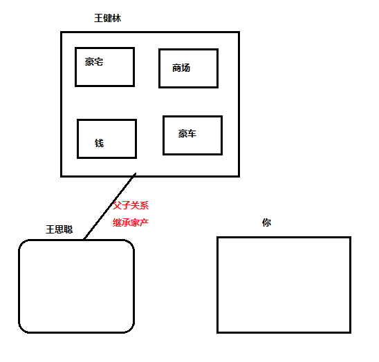
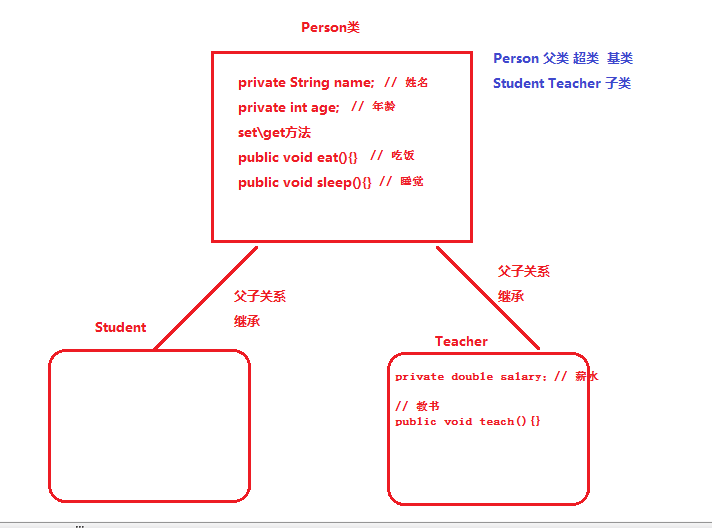
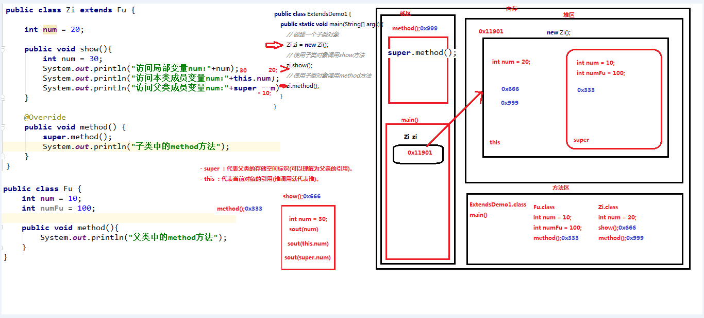

# day02 【复习回顾、继承、抽象类模板设计模式】 

## 今日内容

- 面向对象复习
- 继承

- 抽象类

- 模板设计模式

- final 关键字

## 教学目标

```java
- 能够写出类的继承格式
- 能够说出继承的特点
- 能够说出子类调用父类的成员特点
- 够说出方法重写的概念
- 能够说出this可以解决的问题
- 能够说出super可以解决的问题
- 描述抽象方法的概念
- 写出抽象类的格式
- 写出抽象方法的格式
- 能够说出父类抽象方法的存在意义
- 描述final修饰的类的特点
- 描述final修饰的方法的特点
- 描述final修饰的变量的特点
```


# 第一章 面向对象复习

## 知识点--1.1 类和对象

### 目标:

- 掌握如何定义一个标准类以及创建并使用对象

### 路径:

- 定义一个标准类
- 创建并使用对象

### 讲解:

#### 定义一个标准类

- 定义类的格式:

  ```java
  public class 类名{
      // 成员变量(private修饰)
      // 构造方法(空参,满参)
      // set\get方法
      // 成员方法(行为)
  }
  ```

- 案例

  ```java
  public class Student {
      // 成员变量
      private String name;
  
      // 构造方法
      public Student() {
      }
  
      public Student(String name) {
          this.name = name;
      }
  
      // 成员方法
      public String getName() {
          return name;
      }
  
      public void setName(String name) {
          this.name = name;
      }
  
      public void study(){
          System.out.println("在传智播客学习JAVA...");
      }
      
      public void eat(String foodName){
          System.out.println("学生在吃"+foodName+"...");
      }
  }
  ```

#### 创建并使用对象

- 创建对象的格式

  ```java
  通过调用构造方法创对象:
  	类名 对象名 = new 类名(实参);
  ```

- 使用对象:

  - 对象访问成员变量

    ```java
    对象名.成员变量名
    ```

  - 对象访问成员方法

    ```java
    对象名.成员方法名(实参);
    ```

- 案例

  ```java
      public static void main(String[] args) throws Exception{
          // 创建Student类的对象
          Student stu1 = new Student();
          Student stu2 = new Student("张三",18);
  
          // 使用Student类的对象
          // 访问成员变量: 通过set和get方法进行访问
          stu1.setName("李四");
          stu1.setAge(19);
          System.out.println("stu1的姓名:"+stu1.getName()+",年龄是:"+stu1.getAge());
  
          // 访问成员方法
          stu1.study();
      }
  ```

### 小结:

- 定义一个标准类
- 创建对象
- 使用对象

## 知识点--1.2 对象的内存图

### 目标

- 理解对象的内存图

### 路径

- 对象的内存图

### 讲解


### 小结

- 只要是new对象就会在堆区开辟一块独立的空间
- 只要调用方法,方法就会被加载进栈
- 只要方法执行完毕,方法就会被弹栈

## 知识点--1.3 匿名对象

### 目标

- 理解什么是匿名对象并会使用匿名对象

### 路径

- 匿名对象的概述
- 使用匿名对象

### 讲解

#### 匿名对象的概述

**什么是匿名对象：就是指"没有名字"的对象。**

```java
有名字的对象：
    Student stu = new Student();
    stu.show();
    stu.study();
匿名对象：
	new Student();
```

#### 使用匿名对象

- 特点:匿名对象只能使用一次

  ```java
  public class Demo {
      public static void main(String[] args) {
          //有名字的对象
          Student stu3 = new Student();
          fun(stu3);
  
          //匿名对象--写法上比较简单
          fun(new Student());
      }
  
      public static void fun(Student student) {
  
      }
  }
  
  ```

### 小结

- 匿名对象：就是指"没有名字"的对象。
- 特点: 只能使用一次

# 第二章 继承 【重点】

> **快捷键**
>
> alt + 1 : 代码 和 代码结构目录 来回切换
>
> alt + insert : 新建

## 知识点--2.1 继承概述【理解】

### 目标:

- 能够理解什么继承

### 路径:

- 为什么要有继承
- 继承的含义
- 继承的好处

### 讲解:

#### 2.1.1 为什么要有继承

现实生活中，为什么要有继承？



程序中为什么要有继承?




#### 2.1.2 继承的含义

**继承**：在java中指的是“一个类”可以“继承自”“另一个类”。 "被继承的类"叫做: 父类/超类/基类，"继承其他类的类"叫做:子类。继承后，“子类”中就“拥有”了“父类”中所有的成员(成员变量、成员方法)。 “子类就不需要再定义了”。

#### 2.1.3 继承的好处

1. 提高**代码的复用性**（减少代码冗余，相同代码重复利用）。
2. 使类与类之间产生了关系。

### 小结

- **继承**：在java中指的是“一个类”可以“继承自”“另一个类”。 "被继承的类"叫做: 父类/超类/基类，"继承其他类的类"叫做:子类。继承后，“子类”中就“拥有”了“父类”中所有的成员(成员变量、成员方法)。 “子类就不需要再定义了”。

## 知识点--2.2 继承的格式【重点】

### 目标:

- 能够掌握如何实现继承

### 路径:

- 继承的格式
- 继承的演示

### 讲解:

#### 继承的格式

通过 `extends` 关键字，可以声明一个子类继承另外一个父类，定义格式如下：

```java
class 父类 {
	...
}

class 子类 extends 父类 {
	...
}
```

**需要注意**：Java是单继承的，一个类只能继承一个直接父类，并且满足is-a的关系,例如:Dog is a Animal, Student is a Person

#### 继承的演示

```java
人类:
public class Person {
    // 成员变量
    String name;
    int age;
    
    // 功能方法
    public void eat(){
        System.out.println("吃东西...");
    }

    public void sleep(){
        System.out.println("睡觉...");
    }
}
老师类: extends 人类
public class Teacher extends Person {

}
测试:
public class Test {
    public static void main(String[] args) {
        Teacher t = new Teacher();
        System.out.println(t.name);
        System.out.println(t.age);
        t.eat();
        t.sleep();
    }
}
```

### 小结

- ```java
  public class 子类名 extends 父类名{
      
  }
  ```

- 通过继承可以将一些共性的属性,行为抽取到一个父类中,子类只需要继承即可,提供了代码的复用性

## 知识点--2.3 继承后成员访问规则【理解】

### 目标:

- 能够掌握继承后成员访问规则

### 路径:

- 继承后构造方法的访问规则
- 继承后私有成员的访问规则
- 继承后非私有成员的访问规则

### 讲解:

#### 继承后构造方法的访问规则

- 构造方法不能被继承

  ```java
  public class Fu{
      public Fu(){
      }
      public Fu(String name,int age){
      }
  }
  public class Zi extends Fu{
  }
  public class Demo {
      public static void main(String[] args) {
          Zi z = new Zi("刘德华", 17);//编译错误，Zi类没有全参构造
      }
  }
  
  ```

#### 继承后私有成员的访问规则

- 父类的“私有成员”可以被子类继承，但子类不能被直接访问。 

  ```java
  public class Fu{
      private int num = 100;//私有成员，只能在父类内部使用。
      private void method(){
          System.out.println("私有成员方法");
      }
  }
  public class Zi extends Fu{
  
  }
  public class Demo {
      public static void main(String[] args) {
          Zi z = new Zi();
  	    System.out.println(z.num);// 编译错误
          z.method();// 编译错误
      }
  }
  
  ```

#### 继承后非私有成员的访问规则

- 当通过“子类”访问非私有成员时，先在子类中找，如果找到就使用子类的，找不到就继续去“父类”中找。 

  ```java
  public class Fu{
      int money = 100;
      public void method(){
          System.out.println("Fu 类中的成员方法method");
      }
  }
  public class Zi extends Fu{
      int money = 1;
       public void method(){
          System.out.println("Zi 类中的成员方法method");
      }
  }
  public class Demo{
      public static void main(String[] args){
          Zi z = new Zi();
          System.out.println(z.money);//1
          z.method();// Zi 类中的成员方法method
      }
  }
  ```

### 小结

- 构造方法不能被继承
- 父类的“私有成员”可以被子类继承，但子类不能被直接访问。
- 当通过“子类”访问非私有成员时，先在子类中找，如果找到就使用子类的，找不到就继续去“父类”中找。  

## 知识点--2.4 方法重写【重点】

### 目标:

- 能够正确对父类中的方法进行重写

### 路径:

- 方法重写的概念
- 重写的注意事项

### 讲解:

#### 方法重写的概念

**场景**: 子类觉得父类的方法, 不够好.

**方法重写** ：子类中出现与父类一模一样的方法时（返回值类型，方法名和参数列表都相同），会出现覆盖效果，也称为重写或者复写。**声明不变，重新实现**。

**<font color = 'red'>子父类的权限可以不同, 子类的权限可以大于等于父类的权限(暂时了解即可)</font>**

```java
public class Fu{
    public void eat(){
        System.out.println("我吃牛肉炖土豆...");
    }
}
public class Zi extends Fu{
	@Override
    public void eat(){//方法重写
        System.out.println("我吃红烧狮子头...");
    }
}
//测试类
public class Demo {
    public static void main(String[] args) {
        Zi zi = new Zi();
        zi.eat();// 我吃红烧狮子头...
    }
}

```

#### 重写的注意事项

- 方法重写是发生在子父类之间的关系。
- 子类方法重写父类方法，返回值类型、方法名和参数列表都要一模一样。
- 子类方法重写父类方法，必须要保证权限大于等于父类权限。
  - 访问权限从大到小:  public   protected   (默认)  private

- 使用@Override注解，检验是否重写成功，重写注解校验！

  - 建议重写方法都加上这个注解，一方面可以提高代码的可读性，一方面可以防止重写出错！

### 小结

- 方法重写:子类中出现与父类一模一样的方法时（返回值类型，方法名和参数列表都相同）
- 校验方法重写或者标识方法重写,可以使用@Override注解

## 知识点--2.5 this和super关键字【了解】

### 目标:

- 掌握super和this 的用法

### 路径:

- this和super关键字的介绍
- this关键字的三种用法
- super关键字的三种用法

### 讲解:

#### this和super关键字的介绍

- this：存储的“当前对象”的引用；**(谁来调用我(所在的方法), 我就代表谁)**
  - this可以访问：本类的成员属性、成员方法、构造方法； 
- super：存储的“父类”的引用；
  - super可以访问：父类的成员属性、成员方法、构造方法； 

#### this关键字的三种用法

- this访问本类成员变量: **this.成员变量**

  ```java
  public class Student{
      String name = "张三";
      public void show(){
          String name = "李四";
          System.out.println("name = " + name);// 李四
          System.out.println("name = " + this.name);// 张三
      }
  }
  ```

- this访问本类成员方法: **this.成员方法名();**

  ```java
  public class Student{
      public void show(){
          System.out.println("show方法...");
          this.eat();
      }
      public void eat(){
          System.out.println("eat方法...");
      }
  }
  ```

- this访问本类构造方法: **this()可以在本类的一个构造方法中，调用另一个构造方法** 

  ```java
  public class Student{
      public Student(){
          System.out.println("空参构造方法...");
      }
  
      public Student(String name) {
          this();//当使用this()调用另一个构造方法时，此代码必须是此构造方法的第一句有效代码。
          System.out.println("有参构造方法...");
      }
  }
  public class Demo {
      public static void main(String[] args) {
          Student stu2 = new Student();
      }
  }
  ```

#### super关键字的三种用法

- super访问父类的成员变量:  super.父类成员变量名

  ```java
  public class Fu{
      int money = 100;
  }
  public class Zi extends Fu{
      int money = 10;
      public void show(){
          int monet = 1;
          System.out.println(“money : “ + money);//1
          System.out.println(“this.money : “ + this.money);//10
          System.out.println(“super.money：” + super.money);//100  直接去父类中找
      }
  }
  ```

- super访问父类的成员方法:  super.成员方法名();

  ```java
  public class Fu{
      public void show(){
          System.out.println("父类的show方法...");
      }
  }
  public class Zi extends Fu{
     public void show(){
          super.show();
          System.out.println("子类的show方法...");
      }
  }
  public class Demo {
      public static void main(String[] args) {
         Zi zi = new Zi();
         zi.show();
      }
  }
  ```

- super访问父类的构造方法:  super()

  ```java
  public class Fu{
      public Fu(){
          System.out.println("Fu 类的空参构造方法..");
      }
      public Fu(String name, int age) {
          System.out.println("Fu 类的有参构造方法..");
      }
  }
  public class Zi extends Fu{
      public Zi(){
          super();// 调用父类的空参构造方法
          System.out.println("Zi 类的空参构造方法..");
      }
      public Zi(String name,int age){
          super(name,age);// 调用父类的有参构造方法
           System.out.println("Zi 类的有参构造方法..");
      }
  }
  public class Demo {
      public static void main(String[] args) {
          Zi zi = new Zi();
          System.out.println("----------------------");
          Zi z2 = new Zi("刘德华", 17);
      }
  }
  
  ```

### 小结

- this：存储的“当前对象”的引用；
  - this可以访问：本类的成员属性、成员方法、构造方法； 
- super：存储的“父类对象”的引用；
  - super可以访问：父类的成员属性、成员方法、构造方法； 

> 

## 知识点-- 2.6 super的注意事项【了解】

### 目标

- 关于super的注意事项

### 路径

- super的注意事项一
- super的注意事项二

### 讲解

#### super的注意事项一

- super访问成员变量和成员方法: 优先去父类中找,如果有就直接使用,如果没有就去爷爷类中找,如果有,就用,依次类推...

  ```java
  class Ye{
      int a = 10;
      public void eat(){
          System.out.println("Ye");
      }
  }
  class Fu extends Ye{
      int a = 20;
      public void eat(){
          System.out.println("Fu");
      }
  }
   class Zi extends Fu{
     int a = 30;
     public void show(){
         System.out.println(super.a);
         super.eat();
     }
  }
  public class Test2 {
      public static void main(String[] args) {
         Zi zi = new Zi();
         zi.show();
      }
  }
  
  ```

#### super的注意事项二

- 子类的构造方法默认会调用父类的空参构造方法,如果父类中的没有空参构造方法,只定义了有参构造方法,会编译报错

  ```java
  class Fu {
      public Fu(int a){
  
      }
  }
   class Zi extends Fu{// 编译报错
    
  }
  
  ```

### 小结

- 略

## 知识点--2.7 继承体系对象的内存图【了解】

### 目标:

- 理解继承体系对象的内存图

### 路径:

- 继承体系内存图原理
- 书写继承案例
- 根据案例绘制内存图

### 讲解:

- 继承体系内存图原理---父类空间优先于子类对象产生

  在每次创建子类对象时，先初始化父类空间，再创建其子类对象本身。目的在于子类对象中包含了其对应的父类空间，便可以包含其父类的成员，如果父类成员非private修饰，则子类可以随意使用父类成员。代码体现在子类的构造方法调用时，一定先调用父类的构造方法。

- 书写继承案例

  ```java
  public class Fu {
      int num = 10;
      int numFu = 100;
  
      public void method(){
          System.out.println("父类中的method方法");
      }
  }
  public class Zi extends Fu {
  
      int num = 20;
  
      public void show(){
          int num = 30;
          System.out.println("访问局部变量num:"+num);
          System.out.println("访问本类成员变量num:"+this.num);
          System.out.println("访问父类成员变量num:"+super.num);
      }
  
      @Override
      public void method() {
          super.method();
          System.out.println("子类中的method方法");
      }
  }
  public class ExtendsDemo1 {
      public static void main(String[] args) {
          // 创建一个子类对象
          Zi zi = new Zi();
  
          // 使用子类对象调用show方法
          zi.show();
  
          // 使用子类对象调用method方法
          zi.method();
      }
  }
  ```

- 根据案例绘制内存图

  

### 小结:

略

## 知识点--2.8 继承的特点【重点】

### 目标:

- 继承的特点

### 路径:

**继承中的子父类:  亲爹和亲儿子**

- Java只支持单继承，不支持多继承。
- 一个类只能有一个父类,但是可以有多个子类。
- 可以多层继承。

### 讲解:

1. Java只支持单继承，不支持多继承。

```java
  // 一个类只能有一个父类，不可以有多个父类。
class A {
    
}
class B {
    
}
class C1 extends A {// ok
    
} 
class C2 extends A, B {// error
    
} 
```

1. 一个类只能有一个父类,但可以有多个子类。

```java
  // A可以有多个子类
class A {
    
}
class C1 extends A {
    
}
class C2 extends  A {
    
}
```

1. 可以多层继承。

```java
class A /*extends Object*/{// 爷爷   默认继承Object类
    
}
class B extends A {// 父亲
    
}
class C extends B {// 儿子
    
}
```

> 补充: 顶层父类是Object类。所有的类默认继承Object，作为父类。
>
> class A {}  默认继承Object类
>
> class B extends  A{}   B的父类就是A,但是A的父类是Object类

### 小结:

- 继承只能是单继承,不能多继承,但是可以多层继承

# 第三章 抽象类【重点】

## 知识点--3.1 抽象类的概述和定义

### 目标

- 理解抽象类的概述和抽象类的定义

### 路径

- 抽象类的概述和特点
- 抽象类的定义
- 抽象类中的成员

### 讲解

#### 抽象类的概述

- 概述: 使用abstract关键字修饰的类就是抽象类
- 特点: 这种类不能被创建对象,它就是用来做父类的,被子类继承的

#### 抽象类的定义

- 格式:

  ```java
  修饰符 abstract class 类名{
      
  }
  ```

- 例如:

  ```java
  public abstract class Person{
  
  }
  ```

#### 抽象类中的成员

- 成员变量
- 成员方法
- 构造方法
- **抽象方法**

### 小结

- 略

## 知识点--3.2 抽象方法的概述和定义

### 目标

- 掌握抽象方法的概述和定义

### 路径

- 抽象方法的概述
- 抽象方法的定义

### 讲解

#### 抽象方法的概述

- 没有方法体,使用abstract修饰的方法就是抽象方法

#### 抽象方法的定义

```java
修饰符 abstract 返回值类型 方法名(形参列表);
例如:
	public abstract void work();
```

### 小结

- 抽象方法: 没有方法体,使用abstract修饰的方法就是抽象方法

- 抽象方法定义格式:   修饰符 abstract 返回值类型 方法名(形参列表);


## 知识点--3.3  抽象类的特点

### 目标

- 理解抽象类的特点

### 路径

- 抽象类的特点

### 讲解

- 抽象类不能被创建对象，就是用来做“父类”，被子类继承的。 
- 抽象类不能被创建对象，但可以有“构造方法”——为成员属性初始化。 
- 抽象类中可以没有抽象方法,但抽象方法必须定义在抽象类中
- 子类继承抽象类后,必须重写抽象类中所有的抽象方法,否则子类必须也是一个抽象类

```java
public abstract class Person {
    private String name;

    public Person(String name) {
        this.name = name;
    }

    public Person() {
    }

    public String getName() {
        return name;
    }

    // 抽象方法
    public abstract void eat();
    public abstract void drink();
}

public class Student extends Person {
    // alt+insert
    public Student(String name) {
        super(name);
    }

    @Override
    public void eat() {
        System.out.println("学生吃快餐...");
    }

    @Override
    public void drink() {
        System.out.println("学生喝冰红茶");
    }
}

public class Teacher extends Person {
    @Override
    public void eat() {
        System.out.println("老师吃小炒...");
    }

    @Override
    public void drink() {
        System.out.println("学生喝矿泉水");
    }
}

public abstract class Doctor extends Person{
    @Override
    public void eat() {
        System.out.println("医生吃麻辣烫");
    }
}
public class Test {
    public static void main(String[] args) {
        /*
            1.有抽象方法的类一定是抽象类,抽象类中不一定有抽象方法
            2.抽象类不能创建对象,只用来作为父类
            3.抽象方法主要是供子类重写

            4.抽象类的子类,如果是普通类,那么必须重写父类中的所有抽象方法
            4.抽象类的子类,如果是抽象类,那么可以不重写父类中的抽象方法
            5.抽象类中可以有构造方法,但不能创建对象,抽象类中的构造方法有什么用?
                主要是供子类初始化从父类继承过来的属性
            6.什么时候会定义抽象方法:
                当父类中的某个方法,所有的子类都有不同的实现的时候,父类中的这个方法就定义成抽象方法

            分享: 仅供参考
            听懂--->上课结束后-->忘记了--->看到代码,有时又知道
            问题: 知识没有系统化,记忆方式或者水平有待加强
            解决:
                1.上课听懂,跟上老师讲解,按照循环走
                2.上课出现听不懂---> 记录下来,下课再问
                3.下课:
                    1.梳理当天的知识-->形成一个属于自己理解的知识体系(列表)
                    2.整理出已经掌握,和未掌握的知识,多花时间在自己未掌握\薄弱的知识点反复练习,理解
                    3.作业----总结----预习

                量化---具体化  主动学习
         */
        Student stu = new Student("张三");
        System.out.println(stu.getName());
    }
}

```

### 小结

- 略

## 知识点--3.4 模板设计模式【理解】

### 目标:

- 理解模板设计模式

### 路径:

- 设计模式概述
- 模板设计模式概述
- 模板模式的实现步骤
- 案例演示

### 讲解:

#### 设计模式概述

- 设计模式就是解决一些问题时的固定思路，也就是代码设计思路经验的总结。

#### 模板设计模式概述

- 针对某些情况,在父类中指定一个模板,然后根据具体情况,在子类中灵活的具体实现该模板

```java
public abstract class Person{
    // 睡觉,所有子类实现都是一样的  有方法体的方法
    public void sleep(){/
        // 所有子类通用的实现方式
        System.out.println("两眼一闭,直接睡觉...");
    }
    
    // 吃东西,所有子类是不一样的实现,但是都有吃东西的功能
    public abstract void eat();
}
```

- **抽象类体现的就是模板思想**，**模板是将通用的东西在抽象类中具体的实现**，而**模板中不能决定的东西定义成抽象方法**，让使用模板（继承抽象类的类）的类去**重写抽象方法实现需求**

#### 模板模式的实现步骤

- 定义抽象父类作为模板
- 在父类中定义"模板方法"--- 实现方法(模板)+抽象方法(填充模板)
- 子类继承父类,重写抽象方法(填充父类的模板)
- 测试类:
  -  创建子类对象，通过子类调用父类的“实现的方法”+ “子类重写后的方法” e

#### 案例演示

假如我现在需要定义新司机和老司机类，**新司机和老司机都有开车功能，开车的步骤都一样**，只是驾驶时的姿势有点不同，`新司机:开门,点火,双手紧握方向盘,刹车,熄火`，`老司机:开门,点火,右手握方向盘左手抽烟,刹车,熄火`。那么这个时候我们就可以将固定流程写到父类中，不同的地方就定义成抽象方法，让不同的子类去重写

分析:

  - 定义司机类作为模板(抽象类)
        - 开车功能(通用功能,有方法体的方法)
              - 开门
              - 点火
              - 调用开车姿势的方法(新老司机的姿势是不一样的)
              - 刹车
              - 熄火
        - 开车姿势的抽象方法(供子类重写)
  - 新司机,继承司机类,重写开车姿势的方法
  - 老司机,继承司机类,重写开车姿势的方法

代码如下:

```java
// 司机开车的模板类
public abstract class Driver {
    public void go() {
        System.out.println("开门");
        System.out.println("点火");
        // 开车姿势不确定?定义为抽象方法
        ziShi();
        System.out.println("刹车");
        System.out.println("熄火");
    }

    public abstract void ziShi();
}
```

现在定义两个使用模板的司机：

```java
public class NewDriver extends Driver {

    @Override
    public void ziShi() {
        System.out.println("新司机双手紧握方向盘");
    }
}

public class OldDriver extends Driver {
    @Override
    public void ziShi() {
        System.out.println("老司机右手握方向盘左手抽烟...");
    }
}
```

编写测试类

```java
public class Demo02 {
    public static void main(String[] args) {
        NewDriver nd = new NewDriver();
        nd.go();

        OldDriver od = new OldDriver();
        od.go();
    }
}
```

运行效果


**可以看出，模板模式的优势是，模板已经定义了通用架构，使用者只需要关心自己需要实现的功能即可！非常的强大！**

### 小结

- 抽象类存在的意义是为了被子类继承，否则抽象类将毫无意义，**抽象类体现的是模板思想**，**模板是将通用的东西在抽象类中具体的实现**，而**模板中不能决定的东西定义成抽象方法**，让使用模板（继承抽象类的类）的类去**重写抽象方法实现需求**，这是典型的**模板思想**。

# 第四章 final关键字

## 知识点--匿名对象

```java
// new Person() : 创建了一个对象
// p: 对象名 
Person p = new Person();

// 匿名对象
new Person();
```

**匿名对象的应用场景**

- 匿名对象只适用与: 对象只使用一次的时候

## 知识点-- final关键字的概述和使用【理解】

### 目标:

- final关键字的概述和使用

### 路径:

- final关键字的概述
- final关键字的使用

### 讲解:

#### final关键字的概述

**final**：  不可改变。可以用于修饰类、方法和变量。

- 类：被修饰的类，不能被继承。
- 方法：被修饰的方法，不能被重写。
- 变量：被修饰的变量，就只能赋值一次,不能被重新赋值。

#### final关键字的使用

##### 修饰类

格式如下：

```java
修饰符 final class 类名 {
  
}
例如:
public final class FinalClassFu {
}
public class FinalClassZi /*extends FinalClassFu*/ {
    // FinalClassFu类被final修饰了,所以不能被继承
}
```

查询API发现像 `public final class String` 、`public final class Math` 、`public final class Scanner` 等，很多我们学习过的类，都是被final修饰的，目的就是供我们使用，而不让我们所以改变其内容。

##### 修饰方法

格式如下：

```java
修饰符 final 返回值类型 方法名(参数列表){
    //方法体
}
```

重写被 `final`修饰的方法，编译时就会报错。

```java
public class FinalMethodFu {
    public final void show(){

    }
}
public class FinalMethodZi extends FinalMethodFu {

    /*@Override
    public void show() {

    }*/
    // 无法重写父类中的show方法,因为父类中的show方法被final修饰了
}
```

##### 修饰变量

###### **局部变量——基本类型**

基本类型的局部变量，被final修饰后，只能赋值一次，不能再更改。代码如下：

```java
public class FinalDemo1 {
    public static void main(String[] args) {
        // 声明变量，使用final修饰
        final int A;
        // 第一次赋值 
        A = 10;
        // 第二次赋值
        A = 20; // 报错,不可重新赋值
    }
}
```

###### **局部变量——引用类型**

引用类型的局部变量，被final修饰后，只能指向一个对象，地址不能再更改。但是不影响对象内部的成员变量值的修改，代码如下：

```java
public class FinalDemo2 {
    public static void main(String[] args) {
        // 创建 User 对象
        final User U = new User();
        
        // 创建 另一个 User对象
        // U = new User(); // 报错，指向了新的对象，地址值改变。

        // 调用setName方法
        U.setName("张三"); // 可以修改
    }
}

```

###### **成员变量**

成员变量涉及到初始化的问题，初始化方式有两种，只能二选一：

1. 显示初始化；

   ```java
   public class FinalVariable {
       final int NUM1 = 10;
   }
   ```

2. 构造方法初始化。

   ```java
   public class FinalVariable {
       final int NUM2;
       public FinalVariable(int NUM2){
           this.NUM2 = NUM2;
       }
       public FinalVariable(){
           this.NUM2 = 10;
       }
   }
   ```

> 被final修饰的常量名称，一般都有书写规范，所有字母都**大写**。

### 小结：

- final修饰类，类不能被继承。
- final修饰方法，方法不能被重写。
- final修饰变量，变量不能被改值。

## 知识点 -- static


```
static : 静态   =>  跟类产生关联

static 可以用来修饰成员变量和成员方法(也可以修饰其他内容, 后面学习)

static修饰的成员变量:  类变量
static修饰的成员方法:  类方法

static修饰的成员变量和成员方法, 随着类的加载而加载, 优先于对象存在

特点:
    1. static修饰的成员变量, 被它所在类的所有对象所共享(多线程的时候会使用)
    2. static修饰的成员变量和成员方法, 可以使用  类名.变量名  列名.方法名()  方式去调用


使用时的特点:
    静态只能访问静态
```


> 查看源代码的快捷键:
>
> ​	ctrl + n : 查找到指定的类
>
> ​	ctrl + F12 : 找到类中的指定方法或者变量
>
> static应用的类:
>
> ​	Integer
>
> ```java
> Integer类中:
> public static final int   MAX_VALUE = 0x7fffffff;
> public static final int   MIN_VALUE = 0x80000000;
> 
> 获取方式:
> 	Integer.MAX_VALUE
>     Integer.MIN_VALUE
> ```
>
> Arrays : 用来操作数组的工具类, 工具类的特点是类中的成员都是使用static修饰, 可以直接使用类名.去调用
>
> ```java
> public static String toString(int[] a) : 将数组按照指定的格式转换成字符串并返回
>     指定格式:  [元素1, 元素2, 元素3, ...]
> 
> public static void sort(int[] a) : 对数组进行升序排序
> ```
>
> **工具类还有有一个特点, 将构造方法使用private修饰, 目的就不让任何人创建对象**


# 总结


