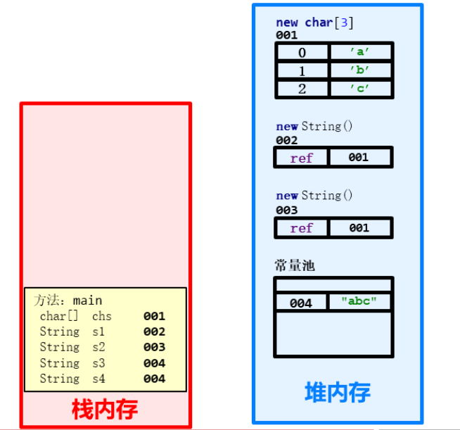
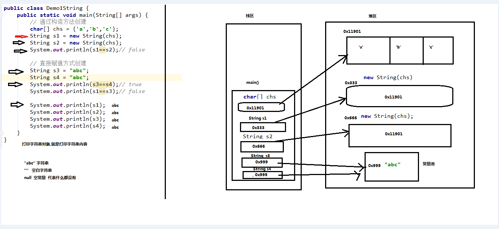

# day04-String和StringBuilder和ArrayList

```java
接口:
	public interface 接口名 {}

	public class 类 implements 接口1, 接口2, 接口3 {}

	自定义常量
        [public statiac final] 数据类型 常量名 = 常量值;
	抽象方法
        [public abstract] 返回值类型 方法名(参数列表);
	默认方法
        [public] default 返回值类型 方法名(参数列表) {}
	静态方法
        [public] static 返回值类型 方法名(参数列表) {}
	私有普通方法
        private 返回值类型 方法名(参数列表) {}
	私有静态方法
        private static 返回值类型 方法名(参数列表) {}

	public class 类 extends 父类 implements 接口1, 接口2, 接口3 ... {}

	类与接口之间的关系
        类与类是继承关系, 只能单继承
        类与接口是实现关系, 可以多实现
        接口与接口是继承关系, 可以多继承
        
多态
   多态的前提
        1. 要有继承或者实现关系
        2. 要有方法的重写(没有重写多态就没有意义)
        3. 要有父类引用指向子类对象
        
   多态中成员的访问特点
        Fu fu = new Zi();
        成员变量: 编译看左边, 运行也看左边
        成员方法: 编译看左边, 运行看右边
   多态的使用主要体现在方法参数的传递:
		public void fun(Fu fu)  -> 可以传入Fu所有子类的对象 
            
   多态的弊端:
		父类的引用不能直接访问子类特有的属性和行为
            
   向上转型: 多态的格式, Fu fu = new Zi();  -> double a = 10;
   向下转型: 强转 (Zi) fu  ->  (int) a
       
   内部类: 类A存在类B的里面,  类A就是内部类, 类B就是外部类
       
       
   new 类名() {}   =>  继承了该类的子类对象
   new 接口名() {} => 实现了该接口的实现类对象
```


## 今日内容

- String类
- StringBuilder类
- ArrayList集合

## 教学目标

- 能够知道字符串对象通过构造方法创建和直接赋值的区别
- 能够完成用户登录案例
- 能够完成统计字符串中大写,小写,数字字符的个数
- 能够知道String和StringBuilder的区别
- 能够完成String和StringBuilder的相互转换
- 能够使用StringBuilder完成字符串的拼接
- 能够使用StringBuilder完成字符串的反转
- 能够知道集合和数组的区别
- 能够完成ArrayList集合添加字符串并遍历
- 能够完成ArrayList集合添加学生对象并遍历


## 知识点 -- 代码块

> 学习目标:  格式, 特点

**构造代码块**

- 格式

  ```java
  // 位置: 类中方法外
  // 格式
  {
      // 构造代码块
  }
  ```

- 特点: 在创建对象的时候执行, 并且比构造方法优先执行

**静态代码块**

- 格式

  ```java
  // 位置: 类中方法外
  // 格式
  static{
      // 静态代码块
  }
  ```

- 特点: 在类加载的时候, 最先执行且只执行一次

**局部代码块**

- 格式

  ```java
  // 位置: 方法中
  // 格式
  方法() {
      {
      // 局部代码块
  	}
  }
  
  ```

- 特点: 可以控制局部变量的声明周期

**同步代码块(多线程的时候讲)**

## 知识点 -- 权限修饰符

- 共有四种权限修饰符:  public , protected, 默认(啥都不写),private

|                | public | protected | 默认 | private |
| -------------- | ------ | --------- | ---- | ------- |
| 同一个类中     | √      | √         | √    | √       |
| 同一个包中     | √      | √         | √    | ×       |
| 不同包, 子类   | √      | √         | ×    | ×       |
| 不同包, 无关类 | √      | ×         | ×    | ×       |

- 构造方法, 成员方法  => public 
- 成员变量 => private

## 知识点--1.String类的常用方法【重点】

### 知识点--1.1 String类概述

#### 目标

- 理解String类概述

#### 路径

- String类的概述

#### 讲解

##### String类的概述

​	String 类代表字符串，Java 程序中的所有字符串文字（例如“abc”）都被实现为此类的实例。也就是说，Java 程序中所有的双引号字符串，都是 String 类的对象。String 类在 java.lang 包下，所以使用的时候不需要导包！

> Java程序中, 任何双引号括起来的内容都是字符串(String)的对象, 就可以调用String类中的方法!
>
> String字符串是常量, 它们的值在创建之后不能更改, 字符串的值是共享的.

#### 小结

略

### 知识点--1.2 String类的构造方法【理解】


> == 符号:
>
> ==在基本数据类型中, 比较的是值;
>
> ==在引用数据类型中, 比较的是地址值.


#### 目标

- 掌握String类构造方法的使用

#### 路径

- String类常用的构造方法
- 使用String类的构造方法

#### 讲解

##### String类常用的构造方法

- 常用的构造方法

  | 方法名                      | 说明                                       |
  | --------------------------- | ------------------------------------------ |
  | public   String()           | 创建一个空白字符串对象("")，不含有任何内容 |
  | public   String(char[] chs) | 根据字符数组的内容，来创建字符串对象       |
  | public   String(byte[] bys) | 根据字节数组的内容，来创建字符串对象       |
  | String s =   “abc”;         | 直接赋值的方式创建字符串对象，内容就是abc  |


##### 使用String类的构造方法

```java
public class StringDemo01 {
    public static void main(String[] args) {
        //public String()：创建一个空白字符串对象，不含有任何内容
        String s1 = new String();
        System.out.println("s1:" + s1);

        //public String(char[] chs)：根据字符数组的内容，来创建字符串对象
        char[] chs = {'a', 'b', 'c'};
        String s2 = new String(chs);
        System.out.println("s2:" + s2);

        //public String(byte[] bys)：根据字节数组的内容，来创建字符串对象
        byte[] bys = {97, 98, 99};
        String s3 = new String(bys);
        System.out.println("s3:" + s3);

        //String s = “abc”;	直接赋值的方式创建字符串对象，内容就是abc
        String s4 = "abc";
        System.out.println("s4:" + s4);
    }
}
```

#### 小结

略

### 知识点--1.3 创建字符串对象两种方式的区别

#### 目标

- 能够知道通过**构造方法创建字符串对象**与**直接赋值方式创建字符串对象**的区别

#### 路径

- 通过构造方法创建

- 直接赋值方式创建
- 绘制对比内存图

#### 讲解

##### 通过构造方法创建

- 通过 new 创建的字符串对象，每一次 new 都会申请一个内存空间，虽然字符串内容相同，但是地址值不同

  ```java
  char[] chs = {'a','b','c'};
  String s1 = new String(chs);// s1字符串的内容: abc
  String s2 = new String(chs);// s2字符串的内容: abc
  // 上面的代码中,JVM首先会先创建一个字符数组,然后每一次new的时候都会有一个新的地址,只不过s1和s2参考的字符串内容是相同的
  ```

##### 直接赋值方式创建

- 以“”方式给出的字符串，只要字符序列相同(顺序和大小写)，无论在程序代码中出现几次，JVM 都只会建立一个 String 对象，并在字符串池中维护

```java
String s3 = "abc";
String s4 = "abc";
// 上面的代码中,针对第一行代码,JVM会建立一个String对象放在字符串池中,并给s3参考;第二行代码,则让s4直接参考字符串池中String对象,也就是说他们本质上是同一个对象
```

##### 绘制内存图

```java
public static void main(String[] args){
    // 通过构造方法创建
    char[] chs = {'a','b','c'};
	String s1 = new String(chs);
	String s2 = new String(chs);
    System.out.println(s1==s2);// false
    
    // 直接赋值方式创建
    String s3 = "abc";
	String s4 = "abc";
    System.out.println(s3==s4);// true
    System.out.println(s1==s3);// false
}
```





#### 小结

- 通过new创建的字符串对象,每一次都会新开辟空间
- 通过""方式直接创建的字符串对象,是常量,在常量池中,只有一份

### 知识点--1.4 String类的特点【理解】

#### 目标

- 能够理解String类的特点

#### 路径

- String类的特点

#### 讲解

##### String类的特点

- String类的字符串不可变，它们的值在创建后不能被更改

  ```java
  String s1 = "abc";
  s1 += "d";
  System.out.println(s1); // "abcd" 
  // 内存中有"abc"，"abcd","d",3个对象，s1从指向"abc"，改变指向，指向了"abcd"。
  ```

- 虽然 String 的值是不可变的，但是它们可以被共享

  ```java
  String s1 = "abc";
  String s2 = "abc";
  // 内存中只有一个"abc"对象被创建，同时被s1和s2共享。
  ```

- 字符串效果上相当于字符数组( char[] )

  ```java
  例如： 
  String str = "abc";
  
  相当于： 
  char[] data = {'a', 'b', 'c'};     
  String str = new String(data);
  // String底层是靠字符数组实现的,jdk9底层是字节数组。
  
  byte[] bys = {97,98,99};
  String str = new String(bys);
  ```

#### 小结

- String类的字符串不可变，它们的值在创建后不能被更改,**每一次拼接String类的字符串对象,都会创建一个新的字符串对象**
- 虽然 String 的值是不可变的，但是它们可以被共享

### 知识点--1.5 字符串的比较

#### 目标

- 能够比较2个字符串内容是否相同

#### 路径

- ==号的比较
- equals方法的作用
- equalsIgnoreCase 方法的使用

#### 讲解

##### ==号的比较

- 比较基本数据类型：比较的是具体的值

  ```java
  int num1 = 10;
  int num2 = 20;
  num1 == num2  ===> 10==20  结果:false
  ```

- 比较引用数据类型：比较的是对象地址值

  ```java
  String str1 = new String("abc");
  String str2 = new String("abc");
  str1 == str2 ===> str1存储的对象地址值 == str2存储的对象地址值  结果: false
  ```

  ```java
  public class StringDemo02 {
      public static void main(String[] args) {
          //构造方法的方式得到对象
          char[] chs = {'a', 'b', 'c'};
          String s1 = new String(chs);
          String s2 = new String(chs);
  
          //直接赋值的方式得到对象
          String s3 = "abc";
          String s4 = "abc";
  
          //比较字符串对象地址是否相同
          System.out.println(s1 == s2);// 
          System.out.println(s1 == s3);// 
          System.out.println(s3 == s4);// 
          System.out.println("--------");
      }
  }
  ```

##### equals方法的作用

- 字符串是对象,它比较内容是否相同,是通过一个方法来实现的,就是equals()方法

- 方法介绍

  ```java
  // Object : 是String的祖宗
  public boolean equals(Object o)     比较两个字符串内容是否相同、区分大小写
  ```

- 示例代码

  ```java
  public class StringDemo02 {
      public static void main(String[] args) {
          //构造方法的方式得到对象
          char[] chs = {'a', 'b', 'c'};
          String s1 = new String(chs);
          String s2 = new String(chs);
  
          //直接赋值的方式得到对象
          String s3 = "abc";
          String s4 = "abc";
  
          //比较字符串内容是否相同
          System.out.println(s1.equals(s2));// true
          System.out.println(s1.equals(s3));// true
          System.out.println(s3.equals(s4));// true
      }
  }
  ```

##### 扩展

- ` public boolean equalsIgnoreCase (String anotherString)` ：将此字符串与指定对象进行比较，忽略大小写。

- 示例

  ```java
   public static void main(String[] args) {
          //  public boolean equalsIgnoreCase (String anotherString)
          // 1.创建一个字符串对象
          String str1 = "hello";
  
          // 2.创建一个字符串对象
          String str2 = "Hello";
  
          // 3.使用equalsIgnoreCase()方法比较str1和str2字符串是否相等
          boolean res1 = str1.equalsIgnoreCase(str2);
          System.out.println("res1的值是:"+res1);// true
      }
  
  ```

#### String中equals方法的源代码

```java
s1.equals(s2)

// =========================================

public boolean equals(Object anObject) {
    // this: 谁来调用我, 我就代表谁
    // 如果是同一个对象, 没有必要比较, 直接返回true
    if (this == anObject) {
            return true;
    } else {
        // 判断传入的参数是否是String类型的对象
        if (anObject instanceof String) {
            String aString = (String)anObject;
            // 比较的过程 ...
        }
		
        // 说明: 不是同一个对象, 不是String类型
    	return false;
    }
}
```


#### 小结

- 比较字符串内容是否相等,区分大小写,需要使用String类的equals方法,千万不要用 == 比较
- 如果比较字符串内容是否相等,不区分大小写,需要使用String类的equalsIgnoreCase()方法

### 知识点--1.6 String类获取功能的方法

#### 目标

- 理解String类中各个方法的作用\调用

#### 路径

- 介绍获取功能的方法
- 使用获取功能的方法

#### 讲解

##### 获取功能的方法

- `public int length () ` ：返回此字符串的长度。
- `public String concat (String str)` ：将指定的字符串连接到该字符串的末尾。
- ` public char charAt (int index) ` ：返回指定索引处的 char值。
- `public int indexOf (String str) ` ：返回指定子字符串第一次出现在该字符串内的索引。
- ` public String substring (int beginIndex) ` ：返回一个子字符串，从beginIndex开始截取字符串到字符串结尾。
- ` public String substring (int beginIndex, int endIndex) ` ：返回一个子字符串，从beginIndex到endIndex截取字符串。含beginIndex，不含endIndex。


##### 使用获取功能的方法

```java
   public static void main(String[] args) {
        // 1.创建一个字符串对象
        String str1 = "hello-world!";

        // - public int length () ：返回此字符串的长度。
        int len = str1.length();
        System.out.println("str1的长度是:"+len);//str1的长度是:12

        // - public String concat (String str) ：将指定的字符串连接到该字符串的末尾。拼接字符串
        String newStr = str1.concat(" 世界,你好!");
        System.out.println("str1的值是:"+str1);// hello world!  字符串是不可变的
        System.out.println("newStr的值是:"+newStr);// hello world! 世界,你好!


        // - public char charAt (int index) ：返回指定索引处的 char值。
        // 获取str1字符串中1索引位置对于的元素
        char ch = str1.charAt(1);
        System.out.println("str1字符串中1索引位置对于的元素:"+ch);// e

        // 获取str1字符串的最后一个字符
        char ch2 = str1.charAt(len-1);
        System.out.println("str1字符串的最后一个字符:"+ch2);// !

        // public int indexOf (String str) ：返回指定子字符串第一次出现在该字符串内的索引
        // 获取"world"子字符串在str1字符串中第一次出现的索引
        int index = str1.indexOf("world");
        System.out.println("world子字符串在str1字符串中第一次出现的索引:"+index);// 6

        // 获取"l"子字符串在str1字符串中第一次出现的索引
        int index2 = str1.indexOf("l");
        System.out.println("l子字符串在str1字符串中第一次出现的索引:"+index2);// 2

        // 获取"l"子字符串在str1字符串中最后一次出现的索引
        int index3 = str1.lastIndexOf("l");
        System.out.println("l子字符串在str1字符串中最后一次出现的索引:"+index3);// 9

        //- public String substring (int beginIndex) ：返回一个子字符串，从beginIndex开始截取字符串到字符串结尾。
        // 截取str1字符串中的:world!
        String subStr1 = str1.substring(6);
        System.out.println("subStr1的值是:"+subStr1);// world!

        // - public String substring (int beginIndex, int endIndex) ：返回一个子字符串，从beginIndex到endIndex截取字符串。含beginIndex，不含endIndex。
        // 截取str1字符串中的:hello
        String subStr2 = str1.substring(0, 5);
        System.out.println("subStr2的值是:"+subStr2);

    }
```

#### 小结

略

### 实操--1.7 用户登录案例【应用】

#### 需求

​	已知用户名和密码，请用程序实现模拟用户登录。总共给三次机会，登录之后，给出相应的提示

#### 分析

1. 已知用户名和密码，定义两个字符串表示即可
2. 键盘录入要登录的用户名和密码，用 Scanner 实现
3. 拿键盘录入的用户名、密码和已知的用户名、密码进行比较，给出相应的提示。字符串的内容比较，用equals() 方法实现
4. 用循环实现多次机会，这里的次数明确，采用for循环实现，并在登录成功的时候，使用break结束循环

#### 实现

```java
/*
    思路：
        1:已知用户名和密码，定义两个字符串表示即可
        2:键盘录入要登录的用户名和密码，用 Scanner 实现
        3:拿键盘录入的用户名、密码和已知的用户名、密码进行比较，给出相应的提示。字符串的内容比较，用equals() 方法实现
        4:用循环实现多次机会，这里的次数明确，采用for循环实现，并在登录成功的时候，使用break结束循环
 */
public class StringTest01 {
    public static void main(String[] args) {
        //已知用户名和密码，定义两个字符串表示即可
        String username = "itheima";
        String password = "czbk";

        //用循环实现多次机会，这里的次数明确，采用for循环实现，并在登录成功的时候，使用break结束循环
        for(int i=0; i<3; i++) {

            //键盘录入要登录的用户名和密码，用 Scanner 实现
            Scanner sc = new Scanner(System.in);

            System.out.println("请输入用户名：");
            String name = sc.nextLine();

            System.out.println("请输入密码：");
            String pwd = sc.nextLine();

            //拿键盘录入的用户名、密码和已知的用户名、密码进行比较，给出相应的提示。字符串的内容比较，用equals() 方法实现
            if (name.equals(username) && pwd.equals(password)) {
                System.out.println("登录成功");
                break;
            } else {
                if(i == 2) {
                    System.out.println("你的账户被锁定，请与管理员联系");
                } else {
                    //i= 0,1
                    // 对应剩余的次数: 2次,1次
                    System.out.println("登录失败，你还有" + (2 - i) + "次机会");
                }
            }
        }
    }
}
```

#### 小结

### 实操--1.8 遍历字符串案例

#### 需求

​	键盘录入一个字符串，使用程序实现在控制台遍历该字符串

#### 分析

1. 键盘录入一个字符串，用 Scanner 实现
2. 遍历字符串，首先要能够获取到字符串中的每一个字符
3. 遍历字符串，其次要能够获取到字符串的长度
4. 遍历字符串的通用格式

#### 实现

```java
/*
    思路：
        1:键盘录入一个字符串，用 Scanner 实现
        2:遍历字符串，首先要能够获取到字符串中的每一个字符
            public char charAt(int index)：返回指定索引处的char值，字符串的索引也是从0开始的
        3:遍历字符串，其次要能够获取到字符串的长度
            public int length()：返回此字符串的长度
            数组的长度：数组名.length
            字符串的长度：字符串对象.length()
        4:遍历字符串的通用格式
 */
public class StringTest02 {
    public static void main(String[] args) {
        //键盘录入一个字符串，用 Scanner 实现
        Scanner sc = new Scanner(System.in);

        System.out.println("请输入一个字符串：");
        String line = sc.nextLine();

        for(int i=0; i<line.length(); i++) {
            System.out.println(line.charAt(i));
        }
    }
}
```

#### 小结

略

### 实操--1.9 统计字符次数案例

#### 需求

​	键盘录入一个字符串，统计该字符串中大写字母字符，小写字母字符，数字字符出现的次数(不考虑其他字符)

#### 分析

1. 键盘录入一个字符串，用 Scanner 实现
2. 要统计三种类型的字符个数，需定义三个统计变量，初始值都为0 
3. 遍历字符串，得到每一个字符
4. 在循环中,判断该字符属于哪种类型，然后对应类型的统计变量+1
   1. 大写字母：ch>='A' && ch<='Z'
   2. 小写字母： ch>='a' && ch<='z'
   3. 数字： ch>='0' && ch<='9'
5. 输出三种类型的字符个数

#### 实现

```java
/*
  思路：
        1:键盘录入一个字符串，用 Scanner 实现
        2:要统计三种类型的字符个数，需定义三个统计变量，初始值都为0
        3:遍历字符串，得到每一个字符
        4:判断该字符属于哪种类型，然后对应类型的统计变量+1
            假如ch是一个字符，我要判断它属于大写字母，小写字母，还是数字，直接判断该字符是否在对应的范围即可
            大写字母：ch>='A' && ch<='Z'
            小写字母： ch>='a' && ch<='z'
            数字： ch>='0' && ch<='9'
        5:输出三种类型的字符个数
 */
public class StringTest03 {
    public static void main(String[] args) {
        //键盘录入一个字符串，用 Scanner 实现
        Scanner sc = new Scanner(System.in);

        System.out.println("请输入一个字符串：");
        String line = sc.nextLine();

        //要统计三种类型的字符个数，需定义三个统计变量，初始值都为0
        int bigCount = 0;
        int smallCount = 0;
        int numberCount = 0;

        //遍历字符串，得到每一个字符
        for(int i=0; i<line.length(); i++) {
            char ch = line.charAt(i);

            //判断该字符属于哪种类型，然后对应类型的统计变量+1
            if(ch>='A' && ch<='Z') {
                bigCount++;
            } else if(ch>='a' && ch<='z') {
                smallCount++;
            } else if(ch>='0' && ch<='9') {
                numberCount++;
            }
        }

        //输出三种类型的字符个数
        System.out.println("大写字母：" + bigCount + "个");
        System.out.println("小写字母：" + smallCount + "个");
        System.out.println("数字：" + numberCount + "个");
    }
}
```

#### 小结

略

### 实操--1.10 字符串拼接案例

#### 需求

​	定义一个方法，把 int 数组中的数据按照指定的格式拼接成一个字符串返回，调用该方法，

​	并在控制台输出结果。例如，数组为 int[] arr = {1,2,3}; ，执行方法后的输出结果为：[1, 2, 3]

#### 分析

1. 定义一个 int 类型的数组，用静态初始化完成数组元素的初始化
2. 定义一个方法，用于把 int 数组中的数据按照指定格式拼接成一个字符串返回。返回值类型 String，参数列表 int[] arr
3. 在方法中遍历数组，按照要求进行拼接
4. 调用方法，用一个变量接收结果
5. 输出结果

#### 实现

```java
/*
    思路：
        1:定义一个 int 类型的数组，用静态初始化完成数组元素的初始化
        2:定义一个方法，用于把 int 数组中的数据按照指定格式拼接成一个字符串返回。
          返回值类型 String，参数列表 int[] arr
        3:在方法中遍历数组，按照要求进行拼接
        4:调用方法，用一个变量接收结果
        5:输出结果
 */
public class StringTest04 {
    public static void main(String[] args) {
        //定义一个 int 类型的数组，用静态初始化完成数组元素的初始化
        int[] arr = {1, 2, 3};

        //调用方法，用一个变量接收结果
        String s = arrayToString(arr);

        //输出结果
        System.out.println("s:" + s);
    }

    //定义一个方法，用于把 int 数组中的数据按照指定格式拼接成一个字符串返回
    /*
        两个明确：
            返回值类型：String
            参数：int[] arr
     */
    public static String arrayToString(int[] arr) {
        //在方法中遍历数组，按照要求进行拼接
        String s = "";

        s += "[";

        for(int i=0; i<arr.length; i++) {
            if(i==arr.length-1) {
                s += arr[i];
            } else {
                s += arr[i];
                s += ", ";
            }
        }

        s += "]";

        return s;
    }
}
```

#### 小结

略

### 实操--1.11 字符串反转案例

#### 需求

​	定义一个方法，实现字符串反转。键盘录入一个字符串，调用该方法后，在控制台输出结果

​	例如，键盘录入 abc，输出结果 cba

#### 分析

1. 键盘录入一个字符串，用 Scanner 实现
2. 定义一个方法，实现字符串反转。返回值类型 String，参数 String s
3. 在方法中把字符串倒着遍历，然后把每一个得到的字符拼接成一个字符串并返回
4. 调用方法，用一个变量接收结果
5. 输出结果

#### 实现

```java
/*
    思路：
        1:键盘录入一个字符串，用 Scanner 实现
        2:定义一个方法，实现字符串反转。返回值类型 String，参数 String s
        3:在方法中把字符串倒着遍历，然后把每一个得到的字符拼接成一个字符串并返回
        4:调用方法，用一个变量接收结果
        5:输出结果
 */
public class StringTest05 {
    public static void main(String[] args) {
        //键盘录入一个字符串，用 Scanner 实现
        Scanner sc = new Scanner(System.in);

        System.out.println("请输入一个字符串：");
        String line = sc.nextLine();

        //调用方法，用一个变量接收结果
        String s = reverse(line);

        //输出结果
        System.out.println("s:" + s);
    }

    //定义一个方法，实现字符串反转
    /*
        两个明确：
            返回值类型：String
            参数：String s
     */
    public static String reverse(String s) {
        //在方法中把字符串倒着遍历，然后把每一个得到的字符拼接成一个字符串并返回
        String ss = "";

        for(int i=s.length()-1; i>=0; i--) {
            ss += s.charAt(i);
        }

        return ss;
    }
}
```

#### 小结

略

### 希望--有时间的同学

```java
 常用的方法：
        concat();  //把两个字符串拼接起来，获取一个新的字符串
        ★length();  //获取字符串的长度(其实就是获取字符串中 字符的个数)
        ★isEmpty(); //判断字符串是否为空(长度为0返回true，不为0返回false)
        ★equals();  //比较两个字符串的内容是否相同。    //区分大小写
        equalsIgnoreCase();  //比较两个字符串的内容是否相同。    //忽略大小写
        ★charAt();  //根据给定的索引，获取对应位置的字符
        ★contains();    //判断字符串中是否包含 给定的字符串。
        endsWith(); //判断字符串是否以 给定的字符串 结尾。
        startsWith(); //判断字符串是否以 给定的字符串 开头。
        ★indexOf(); //获取指定的字符 在字符串中 第一次出现的位置(索引)，找不到返回-1
            //int index = a1.indexOf('h');   从头找，'h'第一次出现的位置
            //int index = a1.indexOf('h',3); 从索引为3的元素开始往后找，'h'第一次出现的位置
        lastIndexOf();  //获取指定的字符 在字符串中 最后一次出现的位置(索引)，找不到返回-1
            //int index = a1.lastIndexOf('h');   从尾部找，'h'最后一次出现的位置
            //int index = a1.lastIndexOf('h',3); 从索引为3的元素开始往前找，'h'最后一次出现的位置
        ★replace(); //用新内容替代旧内容，返回新的字符串
        ★split();   //根据给定的内容，切割字符串，返回字符串数组
        ★substring(); //截取字符串，返回新的字符串
            //String newStr = a1.substring(2);       //从给定索引，直接截取到字符串末尾
            //String newStr = a1.substring(2,5);     //包左不包右(前闭后开), 能取索引2的元素，不能取索引5的元素
        toLowerCase();  //把字母都转成其对应的小写形式。
        toUpperCase();  //把字母都转成其对应的大写形式。
        ★trim();            //移除首尾空格。

```

```java
public class Test1 {
    public static void main(String[] args) {
    }

    /*
        ★int indexOf(int ch); //获取指定的字符 在字符串中 第一次出现的位置(索引)，找不到返回-1
        int lastIndexOf(int ch);  //获取指定的字符 在字符串中 最后一次出现的位置(索引)，找不到返回-1
        ★int indexOf(String str); //获取指定的字符串 在字符串中 第一次出现的位置(索引)，找不到返回-1
        int lastIndexOf(String ch);  //获取指定的字符串 在字符串中 最后一次出现的位置(索引)，找不到返回-1
     */
    private static void method03() {
        String str = "我爱黑马,我爱java";

        // int indexOf(int ch); //获取指定的字符 在字符串中 第一次出现的位置(索引)，找不到返回-1
        System.out.println(str.indexOf('黑'));// 在str字符串中查找'黑'字符第一次出现的索引, 2
        System.out.println(str.indexOf('爱'));// 在str字符串中查找'爱'字符第一次出现的索引, 1
        System.out.println(str.indexOf('国'));// 在str字符串中查找'国'字符第一次出现的索引, -1

        System.out.println("============================");
        // int lastIndexOf(int ch);  //获取指定的字符 在字符串中 最后一次出现的位置(索引)，找不到返回-1
        System.out.println(str.lastIndexOf('爱'));// 在str字符串中查找'爱'字符最后一次出现的索引,6
        System.out.println(str.lastIndexOf('我'));// 在str字符串中查找'我'字符最后一次出现的索引,5
        System.out.println(str.lastIndexOf('国'));// 在str字符串中查找'国'字符最后一次出现的索引,-1

        System.out.println("=========================");
        // int indexOf(String str); //获取指定的字符串 在字符串中 第一次出现的位置(索引)，找不到返回-1
        System.out.println(str.indexOf("黑马"));//  在str字符串中查找"黑马"字符串第一次出现的索引, 2
        System.out.println(str.indexOf("白马"));//  在str字符串中查找"白马"字符串第一次出现的索引, -1

        System.out.println("=========================");
        //  int lastIndexOf(String ch);  //获取指定的字符串 在字符串中 最后一次出现的位置(索引)，找不到返回-1
        System.out.println(str.lastIndexOf("我爱"));// 在str字符串中查找'我爱'字符串最后一次出现的索引,5
        System.out.println(str.lastIndexOf("爱我"));// 在str字符串中查找'爱我'字符串最后一次出现的索引,-1
    }

    /*
        boolean equalsIgnoreCase(String str);  //比较两个字符串的内容是否相同。    //忽略大小写
        String concat(String str);  //把两个字符串拼接起来，获取一个新的字符串
        ★boolean contains(String str);    //判断字符串中是否包含 给定的字符串。
        boolean endsWith(String str); //判断字符串是否以 给定的字符串 结尾。
        boolean startsWith(String str); //判断字符串是否以 给定的字符串 开头。
     */
    private static void method02() {
        String str1 = "abcd";
        String str2 = "ABCD";

        // boolean equalsIgnoreCase(String str) 不区分大小写的比较
        System.out.println(str1.equals(str2));// false
        System.out.println(str1.equalsIgnoreCase(str2));// true

        // String concat(String str)  拼接
        System.out.println(str1.concat(str2));// abcdABCD

        // boolean contains(String str)
        System.out.println(str1.contains("bcd"));// 判断str1字符串中是否包含bcd字符串  true
        System.out.println(str1.contains("bdc"));// 判断str1字符串中是否包含bdc字符串  false

        // boolean endsWith(String str); //判断字符串是否以 给定的字符串 结尾。
        System.out.println(str1.endsWith("cd"));// 判断str1字符串是否以cd结尾 true
        System.out.println(str1.endsWith("dc"));// 判断str1字符串是否以dc结尾 false

        System.out.println("================================");
        //  boolean startsWith(String str); //判断字符串是否以 给定的字符串 开头。
        System.out.println(str1.startsWith("abc"));// 判断str1是否以abc开头  true
        System.out.println(str1.startsWith("bc"));// 判断str1是否以bc开头   false
    }

    /*
        ★int   length();  //获取字符串的长度(其实就是获取字符串中 字符的个数)
        ★char charAt(int index);  //根据给定的索引，获取对应位置的字符
        ★boolean equals(Object obj);  //比较两个字符串的内容是否相同。    //区分大小写
     */
    private static void method01() {
        // 创建String类对象
        String str = "我爱黑马,我爱java";
        int len = str.length();
        System.out.println("str的长度:"+len);// 11

        // 获取索引为1的字符
        char c = str.charAt(1);
        System.out.println("c:"+c);// 爱

        // 比较2个字符串内容是否相同
        String str2 = "我爱黑马,我爱java";
        boolean res = str.equals(str2);
        System.out.println("res:"+res);// true
    }
}

```


## 知识点--2 StringBuilder类【重点】

### 知识点--2.1 String类字符串拼接问题

#### 目标:

- String类字符串拼接问题

#### 步骤:

- 字符串拼接问题

#### 讲解:

##### 字符串拼接问题

由于String类的对象内容不可改变，所以每当进行字符串拼接时，总是会在内存中创建一个新的对象。例如：

```java
public class StringDemo {
    public static void main(String[] args) {
        String s = "Hello";
        s += "World";// s = s + "World";
        System.out.println(s);// HelloWorld
    }
}
```

在API中对String类有这样的描述：字符串是常量，它们的值在创建后不能被更改。

根据这句话分析我们的代码，其实总共产生了三个字符串，即`"Hello"`、`"World"`和`"HelloWorld"`。引用变量s首先指向`Hello`对象，最终指向拼接出来的新字符串对象，即`HelloWord` 。


由此可知，如果对字符串进行拼接操作，每次拼接，都会构建一个新的String对象，**既耗时，又浪费空间**。为了解决这一问题，可以使用`java.lang.StringBuilder`类。

#### 小结

- 结论:
  - String类的字符串拼接,每一次拼接完都会得到一个新的字符串对象,所以比较耗时,也浪费空间

### 知识点--2.2 StringBuilder类概述以及与String类的区别【理解】

#### 目标

- 理解StringBuilder的概述和与String类的区别

#### 路径

- StringBuilder类的概述
- StringBuilder类和String类的区别

#### 讲解

##### StringBuilder类概述

​	StringBuilder 是一个可变的字符串类，我们可以把它看成是一个容器，这里的可变指的是 StringBuilder 对象中的内容是可变的

##### StringBuilder类和String类的区别

- String类：内容是不可变的

- StringBuilder类：内容是可变的

  

#### 小结

- StringBuilder 是一个可变的字符串类,表示字符串
- StringBuilder 拼接是直接在本身的字符串末尾进行拼接的

### 知识点--2.3 StringBuilder类的构造方法【重点】

> StringBuilder:1.5版本,  线程不安全, 效率高
>
> StringBuffer: 1.0版本, 线程安全, 效率低

#### 目标:

- StringBuilder构造方法

#### 路径:

- StringBuilder构造方法

#### 讲解:

- 常用的构造方法

  | 方法名                             | 说明                                       |
  | ---------------------------------- | ------------------------------------------ |
  | public StringBuilder()             | 创建一个空白可变字符串对象，不含有任何内容 |
  | public StringBuilder(String   str) | 根据字符串的内容，来创建可变字符串对象     |

- 示例代码

```java
public class StringBuilderDemo01 {
    public static void main(String[] args) {
        //public StringBuilder()：创建一个空白可变字符串对象，不含有任何内容
        StringBuilder sb = new StringBuilder();
        System.out.println("sb:" + sb);
        System.out.println("sb.length():" + sb.length());

        //public StringBuilder(String str)：根据字符串的内容，来创建可变字符串对象
        StringBuilder sb2 = new StringBuilder("hello");
        System.out.println("sb2:" + sb2);
        System.out.println("sb2.length():" + sb2.length());
    }
}
```

#### 小结

略

### 知识点--2.4 StringBuilder类拼接和反转方法【重点】

#### 目标:

- StringBuilder类拼接和反转方法

#### 路径:

- StringBuilder类拼接和反转方法

#### 讲解:

- 添加和反转方法

  | 方法名                                  | 说明                     |
  | --------------------------------------- | ------------------------ |
  | public StringBuilder   append(任意类型) | 添加数据，并返回对象本身 |
  | public StringBuilder   reverse()        | 返回相反的字符序列       |

- 示例代码

```java
public class StringBuilderDemo01 {
    public static void main(String[] args) {
        //创建对象
        StringBuilder sb = new StringBuilder();

        //public StringBuilder append(任意类型)：添加数据，并返回对象本身
//        StringBuilder sb2 = sb.append("hello");
//
//        System.out.println("sb:" + sb);
//        System.out.println("sb2:" + sb2);
//        System.out.println(sb == sb2);

//        sb.append("hello");
//        sb.append("world");
//        sb.append("java");
//        sb.append(100);

        //链式编程
        sb.append("hello").append("world").append("java").append(100);

        System.out.println("sb:" + sb);

        //public StringBuilder reverse()：返回相反的字符序列
        sb.reverse();
        System.out.println("sb:" + sb);
    }
}
```

#### 小结

```java
StringBuilder类常用方法:
    public StringBuilder   append(任意类型)  添加数据，并返回对象本身
    public StringBuilder   reverse()  返回相反的字符序列
```

### 知识点--2.5 StringBuilder和String相互转换

#### 目标:

- StringBuilder和String相互转换

#### 路径:

- StringBuilder转换为String
- String转换为StringBuilder

#### 讲解:

##### StringBuilder转换为String

​        `public String toString()`：通过StringBuilder类中的 toString() 就可以实现把 StringBuilder 转换为 String

##### String转换为StringBuilder

​        `public StringBuilder(String s)`：通过StringBuilder的构造方法就可以实现把 String 转换为 StringBuilder

- 示例代码

```java
public class StringBuilderDemo02 {
    public static void main(String[] args) {
        /*
        //StringBuilder 转换为 String
        StringBuilder sb = new StringBuilder();
        sb.append("hello");

        //String s = sb; //这个是错误的做法

        //public String toString()：通过 toString() 就可以实现把 StringBuilder 转换为 String
        String s = sb.toString();
        System.out.println(s);
        */

        //String 转换为 StringBuilder
        String s = "hello";

        //StringBuilder sb = s; //这个是错误的做法

        //public StringBuilder(String s)：通过构造方法就可以实现把 String 转换为 StringBuilder
        StringBuilder sb = new StringBuilder(s);

        System.out.println(sb);
    }
}
```

#### 小结

略

### 实操--2.6 字符串拼接升级版案例

#### 需求

​	定义一个方法，把 int 数组中的数据按照指定的格式拼接成一个字符串返回，调用该方法，

​	并在控制台输出结果。例如，数组为int[] arr = {1,2,3}; ，执行方法后的输出结果为：[1, 2, 3]

#### 分析

1. 定义一个 int 类型的数组，用静态初始化完成数组元素的初始化
2. 定义一个方法，用于把 int 数组中的数据按照指定格式拼接成一个字符串返回。返回值类型 String，参数列表 int[] arr
3. 在方法中用 StringBuilder 按照要求进行拼接，并把结果转成 String 返回
4. 调用方法，用一个变量接收结果
5. 输出结果

#### 实现

```java
/*
    思路：
        1:定义一个 int 类型的数组，用静态初始化完成数组元素的初始化
        2:定义一个方法，用于把 int 数组中的数据按照指定格式拼接成一个字符串返回。
          返回值类型 String，参数列表 int[] arr
        3:在方法中用 StringBuilder 按照要求进行拼接，并把结果转成 String 返回
        4:调用方法，用一个变量接收结果
        5:输出结果
 */
public class StringBuilderTest01 {
    public static void main(String[] args) {
        //定义一个 int 类型的数组，用静态初始化完成数组元素的初始化
        int[] arr = {1, 2, 3};

        //调用方法，用一个变量接收结果
        String s = arrayToString(arr);

        //输出结果
        System.out.println("s:" + s);

    }

    //定义一个方法，用于把 int 数组中的数据按照指定格式拼接成一个字符串返回
    /*
        两个明确：
            返回值类型：String
            参数：int[] arr
     */
    public static String arrayToString(int[] arr) {
        //在方法中用 StringBuilder 按照要求进行拼接，并把结果转成 String 返回
        StringBuilder sb = new StringBuilder();

        sb.append("[");

        for(int i=0; i<arr.length; i++) {
            if(i == arr.length-1) {
                sb.append(arr[i]);
            } else {
                sb.append(arr[i]).append(", ");
            }
        }

        sb.append("]");

        String s = sb.toString();

        return  s;
    }
}
```

#### 小结

略

### 实操--2.7 字符串反转升级版案例

#### 需求

​	定义一个方法，实现字符串反转。键盘录入一个字符串，调用该方法后，在控制台输出结果

​	例如，键盘录入abc，输出结果 cba

#### 分析

1. 键盘录入一个字符串，用 Scanner 实现
2. 定义一个方法，实现字符串反转。返回值类型 String，参数 String s
3. 在方法中用StringBuilder实现字符串的反转，并把结果转成String返回
4. 调用方法，用一个变量接收结果
5. 输出结果

#### 实现

```java
/*
    思路：
        1:键盘录入一个字符串，用 Scanner 实现
        2:定义一个方法，实现字符串反转。返回值类型 String，参数 String s
        3:在方法中用StringBuilder实现字符串的反转，并把结果转成String返回
        4:调用方法，用一个变量接收结果
        5:输出结果
 */
public class StringBuilderTest02 {
    public static void main(String[] args) {
        //键盘录入一个字符串，用 Scanner 实现
        Scanner sc = new Scanner(System.in);

        System.out.println("请输入一个字符串：");
        String line = sc.nextLine();

        //调用方法，用一个变量接收结果
        String s = myReverse(line);

        //输出结果
        System.out.println("s:" + s);
    }

    //定义一个方法，实现字符串反转。返回值类型 String，参数 String s
    /*
        两个明确：
            返回值类型：String
            参数：String s
     */
    public static String myReverse(String s) {
        //在方法中用StringBuilder实现字符串的反转，并把结果转成String返回
        //String --- StringBuilder --- reverse() --- String
//        StringBuilder sb = new StringBuilder(s);
//        sb.reverse();
//        String ss = sb.toString();
//        return ss;

       return new StringBuilder(s).reverse().toString();
    }
}
```

#### 小结

略

## 知识点--3. ArrayList【重点】

### 知识点--3.1 集合的概述以及与数组的区别

#### 目标

- 能够了解集合的概念和知道集合与数组的区别

#### 路径

- 集合的概述
- 集合与数组的区别

#### 讲解

##### 集合的概述

- 思考: 编程的时候如果要存储多个数据,首先我们想到的就是数组,但是数组的特点是长度固定,所以数组不一定能满足我们的需求,更适应不了变化的需求,那么应该如何选择呢? =====>集合
- 什么是集合
  - 集合其实就是一个大小可变的容器,可以用来存储多个数据
  - 集合的特点: 集合的大小可以动态改变,可以存储多种类型的数据

##### 集合与数组的区别

- 数组：数组大小固定，只能存储相同数据类型的数据   int[] arr = new int[3];
- 集合：集合大小可动态扩展，可以存储各种引用类型的数据

#### 小结

### 知识点--3.2 ArrayList类概述

#### 目标

- 能够理解ArrayList类的概念

#### 路径

- ArrayList类概述

#### 讲解

集合类有很多,目前我们先学习一个: `ArrayList`

##### ArrayList类概述

- 通过查看ArrayList类的API:
  - `java.util.ArrayList <E>` ：该类需要 import导入使后使用。  
  - <E> 表示一种指定的数据类型,叫做泛型,用于约束集合中存储元素的数据类型
  - 怎么用呢?
    - 在出现E的地方我们使用引用数据类型替换即可，表示我们将存储哪种引用类型的元素。
    - 例如: 
      - ArrayList<String> 表示ArrayList集合中只能存储String类型的对象
      - ArrayList<Student> 表示ArrayList集合中只能存储Student类型的对象
      - .....
  - 概述:
    - ArrayList类底层是大小可变的数组的实现，存储在内的数据称为元素。也就是说ArrayList 中可以不断添加元素，其大小会自动增长。

#### 小结

- 概述: ArrayList类底层是一个大小可变的数组实现
- 使用ArrayList<E>类的时候,在E出现的位置使用引用数据类型替换,表示该集合可以存储哪种引用类型的元素

### 知识点--3.3 ArrayList类构造方法

#### 目标

- 能够使用ArrayList类的构造方法创建ArrayList集合对象

#### 路径

- 介绍ArrayList的构造方法
- 案例演示

#### 讲解

- 介绍ArrayList的构造方法

  - `ArrayList()`  构造一个初始容量为 10 的空列表。 

- 案例演示

  ```java
  ArrayList<String> list1 = new ArrayList<>();//创建一个ArrayList对象,集合中的元素类型为String类型
  ArrayList<Student> list2 = new ArrayList<>();//创建一个ArrayList对象,集合中的元素类型为Student类型
  ```

#### 小结

- 略

### 知识点-- 3.4 ArrayList类添加元素方法

#### 目标

- 能够往ArrayList集合中添加元素

#### 路径

- ArrayList添加元素的方法

#### 讲解

- ArrayList添加元素的方法

  -  public boolean add(E e)：将指定的元素追加到此集合的末尾
  -  public void add(int index,E element)：在此集合中的指定位置插入指定的元素

- 案例演示:

  ```java
   public static void main(String[] args) {
          ArrayList<String> array = new ArrayList<String>();
  
          //public boolean add(E e)：将指定的元素追加到此集合的末尾
  //        System.out.println(array.add("hello"));
  
          array.add("hello");
          array.add("world");
          array.add("java");
  
          //public void add(int index,E element)：在此集合中的指定位置插入指定的元素
          array.add(1,"javase");
  //        array.add(3,"javaee");
  
          //IndexOutOfBoundsException
  //        array.add(4,"javaee");
  
          //输出集合
          System.out.println("array:" + array);
  
      }
  ```

#### 小结

- 略

### 知识点--3.5 ArrayList类常用方法

#### 目标

- 会使用ArrayList常用方法

#### 步骤

- ArrayList常用方法

#### 讲解

##### ArrayList常用方法

| 方法名                                | 说明                                   |
| ------------------------------------- | -------------------------------------- |
| public boolean   remove(Object o)     | 删除指定的元素，返回删除是否成功       |
| public E   remove(int   index)        | 删除指定索引处的元素，返回被删除的元素 |
| public E   set(int index, E  element) | 修改指定索引处的元素，返回被修改的元素 |
| public E   get(int   index)           | 返回指定索引处的元素                   |
| public int   size()                   | 返回集合中的元素的个数                 |

##### 示例代码

```java
public class ArrayListDemo02 {
    public static void main(String[] args) {
        //创建集合
        ArrayList<String> array = new ArrayList<String>();

        //添加元素
        array.add("hello");
        array.add("world");
        array.add("java");

        //public boolean remove(Object o)：删除指定的元素，返回删除是否成功
//        System.out.println(array.remove("world"));
//        System.out.println(array.remove("javaee"));

        //public E remove(int index)：删除指定索引处的元素，返回被删除的元素
//        System.out.println(array.remove(1));

        //IndexOutOfBoundsException
//        System.out.println(array.remove(3));

        //public E set(int index,E element)：修改指定索引处的元素，返回被修改的元素
//        System.out.println(array.set(1,"javaee"));

        //IndexOutOfBoundsException
//        System.out.println(array.set(3,"javaee"));

        //public E get(int index)：返回指定索引处的元素
//        System.out.println(array.get(0));
//        System.out.println(array.get(1));
//        System.out.println(array.get(2));
        //System.out.println(array.get(3)); //？？？？？？ 自己测试

        //public int size()：返回集合中的元素的个数
        System.out.println(array.size());

        //输出集合
        System.out.println("array:" + array);
    }
}
```

#### 小结

```java
ArrayList常用方法:
    public boolean remove(Object o)   删除指定的元素，返回删除是否成功
    public E   remove(int   index)    删除指定索引处的元素，返回被删除的元素
    public E   set(int index, E  element) 修改指定索引处的元素，返回被修改的元素
    public E   get(int   index) 返回指定索引处的元素
    public int   size() 返回集合中的元素的个数
```

### 实操-3.6 ArrayList存储字符串并遍历

#### 需求

- 创建一个存储字符串的集合，存储3个字符串元素，使用程序实现在控制台遍历该集合

#### 分析

1. 创建集合对象
2. 往集合中添加字符串对象
3. 遍历集合，首先要能够获取到集合中的每一个元素，这个通过get(int index)方法实现
4. 遍历集合，其次要能够获取到集合的长度，这个通过size()方法实现
5. 遍历集合的通用格式

#### 实现

```java
import java.util.ArrayList;

/*
ArrayList存储字符串并遍历

需求
    - 创建一个存储字符串的集合，存储3个字符串元素，使用程序实现在控制台遍历该集合
分析:
    1.创建ArrayList集合对象,限制集合中元素的类型为String类型
    2.往集合对象中存储3个字符串元素  使用add()方法往集合中添加元素
    3.获取集合中元素的个数
    4.循环遍历集合中每一个元素

 */
public class Test1ArrayList {
    public static void main(String[] args) {
        // 1.创建ArrayList集合对象,限制集合中元素的类型为String类型
        ArrayList<String> list = new ArrayList<>();

        // 2.往集合对象中存储3个字符串元素  使用add()方法往集合中添加元素
        list.add("唐三");
        list.add("小舞");
        list.add("荣荣");

        // 3.获取集合中元素的个数
        //int size = list.size();

        // 4.循环遍历集合中每一个元素
        for (int i = 0;i<list.size();i++){
            // 获取元素,并打印
            System.out.println(list.get(i));
        }
    }
}
```

#### 小结

略

### 实操--3.7 ArrayList存储学生对象并遍历

#### 需求

- 创建一个存储学生对象的集合，存储3个学生对象，使用程序实现在控制台遍历该集合

#### 分析

1. 定义学生类
2. 创建集合对象
3. 创建学生对象
4. 添加学生对象到集合中
5. 遍历集合，采用通用遍历格式实现

#### 实现

```java
import java.util.ArrayList;

/*
ArrayList存储学生对象并遍历

需求:
    - 创建一个存储学生对象的集合，存储3个学生对象，使用程序实现在控制台遍历该集合
分析:
    1.创建学生类
    2.创建3个学生对象
    3.创建ArrayList集合对象,限制集合中元素的类型为学生类类型
    4.往集合中存储那3个学生对象
    5.循环遍历集合中的元素,打印输出
 */
public class Test2ArrayList {
    public static void main(String[] args) {
        // 创建3个学生对象
        Student stu1 = new Student("萧炎",18);
        Student stu2 = new Student("薰儿",19);
        Student stu3 = new Student("美杜莎",20);

        // 创建ArrayList集合对象,限制集合中元素的类型为学生类类型
        ArrayList<Student> list = new ArrayList<>();

        // 往集合中存储那3个学生对象
        list.add(stu1);
        list.add(stu2);
        list.add(stu3);

        // 循环遍历集合中的元素,打印输出
        for (int i = 0;i<list.size();i++){
            // 获取集合元素
            Student stu = list.get(i);
            // System.out.println("stu:"+stu);// 打印地址值
            System.out.println( stu.getName()+","+ stu.getAge());
        }
    }
}
```

#### 小结

略

### 实操--3.8 ArrayList存储学生对象并遍历升级版

#### 需求

- 创建一个存储学生对象的集合，存储3个学生对象，使用程序实现在控制台遍历该集合 ( 学生的姓名和年龄来自于键盘录入)

#### 分析

1. 定义学生类，为了键盘录入数据方便，把学生类中的成员变量都定义为String类型
2. 创建集合对象
3. 键盘录入学生对象所需要的数据
4. 创建学生对象，把键盘录入的数据赋值给学生对象的成员变量
5. 往集合中添加学生对象
6. 遍历集合，采用通用遍历格式实现

#### 实现

```java
/*
    思路：
        1:定义学生类，为了键盘录入数据方便，把学生类中的成员变量都定义为String类型
        2:创建集合对象
        3:键盘录入学生对象所需要的数据
        4:创建学生对象，把键盘录入的数据赋值给学生对象的成员变量
        5:往集合中添加学生对象
        6:遍历集合，采用通用遍历格式实现
 */
public class ArrayListTest {
    public static void main(String[] args) {
        //创建集合对象
        ArrayList<Student> array = new ArrayList<Student>();

        //为了提高代码的复用性，我们用方法来改进程序
        addStudent(array);
        addStudent(array);
        addStudent(array);

        //遍历集合，采用通用遍历格式实现
        for (int i = 0; i < array.size(); i++) {
            Student s = array.get(i);
            System.out.println(s.getName() + "," + s.getAge());
        }
    }

    /*
        两个明确：
            返回值类型：void
            参数：ArrayList<Student> array
     */
    public static void addStudent(ArrayList<Student> array) {
        //键盘录入学生对象所需要的数据
        Scanner sc = new Scanner(System.in);

        System.out.println("请输入学生姓名:");
        String name = sc.nextLine();

        System.out.println("请输入学生年龄:");
        String age = sc.nextLine();

        //创建学生对象，把键盘录入的数据赋值给学生对象的成员变量
        Student s = new Student();
        s.setName(name);
        s.setAge(age);

        //往集合中添加学生对象
        array.add(s);
    }
}
```

#### 小结

略

## 总结

String

- String的特点
  - 字符串字面值("abc")都是String类的对象, 就能够调用String中的方法
  - 字符串是常量, 它的值在创建之后不能更改
- 构造方法
  - String()
  - String(char[] chs) : 将字符数组中的每一个字符拼接起来
  - String(byte[] bytes) : 将字节数组中的内容通过字符集进行转换, 然后在拼接起来
  - String(String s)
- 直接创建字符串和构造方法创建字符串的区别
  - String s = "abc";
- 方法
  - length()
  - concat(String s)
  - charAt(int index)
  - indexOf(String s)
  - substring(int beginIndex)
  - substring(int beginIndex, int endIndex) : 包头不包尾

StringBuilder

- 特点
  - 是一个可变的字符序列
- 构造
  - StringBuilder()   -> ""
  - StringBuilder(String s)  -> 与参数相同的StringBuilder
- 方法
  - append(任意类型)
  - reverse()
  - toString()

ArrayList

- 特点
- 是一个容器, 可以存储多种数据类型的元素(一般不会存不同类型), 内容只能是引用数据类型, 长度是可变的.
- 泛型
- 构造方法

```java
ArrayList<引用数据类型> list = new ArrayList<>();
```

- 方法
  - add(E e)
  - add(int index, E e)
  - remove(Object o)
  - remove(int index)
  - set(int index, E e)
  - get(int index)
  - size()
- 遍历