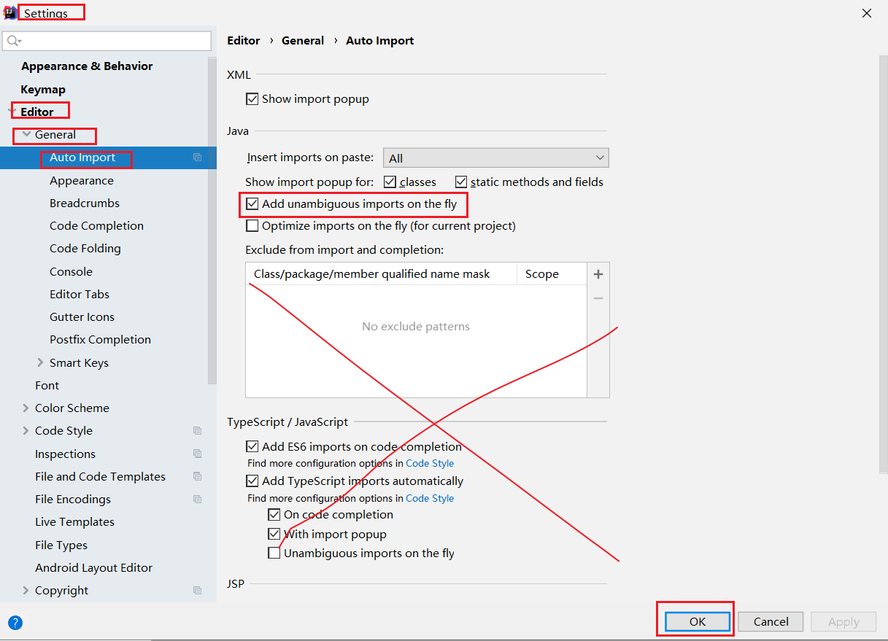

# day03 【常用API】

```java
String字符串的特点
    1. 任何一个字符串字面值 "xx" 都是String的对象, 能够调用String类中的方法
    2. 字符串是常量, 它的值在创建之后不能改变
    
    构造方法:
		String(char[] chs)
        String(byte[] bytes)

    方法:
		boolean equals(Object o) : 比较两个字符串中的内容(字符序列)是否相同
        boolean  equalsIgnoreCase(String anotherString) : 比较两个字符串中的内容(忽略大小写)
        String concat(String s) : 拼接
        boolean contains(String s) : 判断是否包含
        int length() : 字符串的长度, 字符个数
        int indexOf(String s) : 获取子字符串第一次出现的索引
        char charAt(int index) : 获取指定索引处的字符
        String substring(int beginIndex) : 从开始索引截取到结尾
        String substring(int beginIndex, int endIndex) : 从开始索引截取到结束索引(包头不包尾)
        boolean endsWith(String s) : 判断是否以指定字符串为结尾(后缀)
        boolean startsWith(String s) : 判断是否以指定字符串为开头(前缀)
        String toUpperCase() : 转换成大写
        String toLowerCase() : 转换成小写
        char[] toCharArray() : 将字符串转换成字符数组
        byte[] getBytes() : 将字符串转换成字节数组
            
    
StringBuilder 
      构造方法:
		StringBuilder() : 创建空字符序列
        StringBuilder(String s) : 创建和参数相同的字符序列
	  成员方法
        append(任意类型) : 拼接
        reverse() : 反转
        toString() : 将StringBuilder转换成String
        insert(int index, 任意类型)
        String substring(int beginIndex) : 从开始索引截取到结尾
        String substring(int beginIndex, int endIndex) : 从开始索引截取到结束索引(包头不包尾)
            
ArrayList
            
    创建ArrayList集合
            
        <> : 用来限定集合中元素的数据类型, 只能是引用数据类型
        ArrayList<String> list = new ArrayList<>();
	
	成员方法:
		add(E e)
        add(int index, E e)
        remove(int index)
        remove(Object o)
        set(int index, E e)
        get(int index)
        size()
            

    for(int i = 0; i < list.size(); i++) { // 获取集合中每个元素的索引
        // 获取i索引位置的元素
        list.get(i);
    }

```


## 今日内容

- Object类【理解】
- 时间日期类
  - Date【会用】
  - SimpleDateFormat【重点】
  - Calendar【会用】
- Math类【会用】
- System类【会用】
- BigDecimal， BigInteger类【理解】
- 包装类【重点理解】

## 教学目标

- [ ] 能够说出Object类的特点

- [ ] 能够重写Object类的toString方法

- [ ] 能够重写Object类的equals方法

- [ ] 能够使用日期类输出当前日期

- [ ] 能够使用将日期格式化为字符串的方法

- [ ] 能够使用将字符串转换成日期的方法

- [ ] 能够使用Calendar类的get、set、add方法计算日期

- [ ] 能够使用Math类对某个浮点数进行四舍五入取整

- [ ] 能够使用System类获取当前系统毫秒值

- [ ] 能够说出BigDecimal可以解决的问题

- [ ] 能够说出自动装箱、自动拆箱的概念

- [ ] 能够将基本类型转换为对应的字符串

- [ ] 能够将字符串转换为对应的基本类型

  

# 第一章 Object类

## 1.1 概述

### 目标:

- 了解Object类的概述

### 步骤:

- Object类是java语言中的根类
- Object类中常用的2个方法

### 讲解:

`java.lang.Object`类是Java语言中的根类，即所有类的父类【单根】。它中描述的所有方法子类都可以使用。在对象实例化的时候，最终找的父类就是Object。

如果一个类没有特别指定父类，	那么默认则继承自Object类。例如：

```java
public class MyClass /*extends Object*/ {
  	// ...
}
```

**String类中equals方法的源代码**

```java
String s = "abc";
boolean b = s.equals("def");

// ==========================================================================
// 方法的参数列表是Object, 就是可以传入任意类型的内容
public boolean equals(Object anObject) { // Object anObject = 任意类型;  ->多态(向上转型)
    // this: s
    // anObject: "def"
    if (this == anObject) { // 判断地址值是否相同, 如果相同直接返回true
        return true; // 结束方法
    }
    
    // 当代码执行到这里, 说明地址值一定不同
    if (anObject instanceof String) { // 判断, 参数如果是String类型才会比较
        							  // 参数如果不是String类型
        // 向下转型
        String aString = (String)anObject;
        // 根据不同的字符集, 比较内容
    }
    // 参数如果不是String类型, 返回false
    return false;
}
```


根据JDK源代码及Object类的API文档，Object类当中包含的方法有11个。今天我们主要学习其中的2个：

- `public String toString()`：返回该对象的字符串表示。
- `public boolean equals(Object obj)`：指示其他某个对象是否与此对象“相等”。

### 小结:

- `java.lang.Object`类是Java语言中的根类，即所有类的父类
- Object类中有11个成员方法
- Object类中只有一个空参构造方法


**toString()和equals()方法学习的目标**:

- 了解Object类中的toString和equals方法的作用
- 会在子类中重写这两个方法(自动生成)


## 1.2 toString方法

### 目标:

- toString方法

### 步骤:

- toString方法的概述
- 重写toString方法

### 讲解:

#### 方法摘要

- `public String toString()`：返回该对象的字符串表示。

toString方法返回该对象的字符串表示，其实该字符串内容就是：对象的类型名+@+内存地址值。

由于toString方法返回的结果是内存地址，而在开发中，经常需要按照对象的属性得到相应的字符串表现形式，因此也需要重写它。

**Object类中的toString**

```java
public String toString() {
    // this.getClass().getName() : 获取对象对应类的  全限定类名(包名+类名)
    // this.hashCode() : 获取该对象的地址值(十进制)
    // Integer.toHexString() : Integer类中的静态方法toHexString(), 转换成十六进制
    return this.getClass().getName() + "@" + Integer.toHexString(this.hashCode());
}


// com.itheima._01object.demo02.Person@3f3afe78
```


#### 覆盖重写

如果不希望使用toString方法的默认行为，则可以对它进行覆盖重写。例如自定义的Person类：

```java
public class Person {  
    private String name;
    private int age;

    @Override
    public String toString() {
        return "Person{" + "name='" + name + '\'' + ", age=" + age + '}';
    }

    // 省略构造器与Getter Setter
}
```

在IntelliJ IDEA中，可以点击`Code`菜单中的`Generate...`，也可以使用快捷键`alt+insert`，点击`toString()`选项。选择需要包含的成员变量并确定。

> 小贴士： 在我们直接使用输出语句输出对象名的时候,其实通过该对象调用了其toString()方法。

> 小结：toString方法可以将对象转成字符串。

**输出语句的扩展**

- 为什么输出数组的时候, 打印的是地址值  `I[@124123`
- 为什么输出集合的时候, 打印的是集合中的元素 `集合重写了toString方法`
- 为什么输出对象的时候, 调用toString和不调用的结果是一样的

```java
 System.out.println(p);
// ↓↓↓↓↓↓↓↓↓↓↓↓↓↓↓↓↓↓↓↓↓↓↓↓↓↓↓↓↓↓↓↓↓↓↓↓↓↓↓↓↓↓↓↓↓↓↓↓↓↓↓↓↓↓↓↓↓↓↓↓↓↓↓↓↓↓↓↓↓
public void println(Object x) { // Object x = p;
    String s = String.valueOf(x);
    synchronized (this) {
        print(s); // 打印s
        newLine(); // 换行
    }
}
// ↓↓↓↓↓↓↓↓↓↓↓↓↓↓↓↓↓↓↓↓↓↓↓↓↓↓↓↓↓↓↓↓↓↓↓↓↓↓↓↓↓↓↓↓↓↓↓↓↓↓↓↓↓↓↓↓↓↓↓↓↓↓↓↓↓↓↓↓↓
public static String valueOf(Object obj) { // obj : p
    // 1. 判断obj是否是null
    // 如果是null, 就直接返回 "null" 字符串
    // 否则如果不是null, 
    // 2. 调用obj的toString()方法
    return (obj == null) ? "null" : obj.toString();
}
```

> 总结: 如果打印出来的不是地址值, 它一定重写了toString

### 小结:

- 在我们直接使用输出语句输出对象名的时候,其实通过该对象调用了其toString()方法。如果不希望使用toString方法的默认规则，则可以对它进行覆盖重写


## 1.3 equals方法

### 目标:

- equals方法

### 步骤:

- equals方法的概述
- equals方法的使用

### 讲解:

#### 方法摘要

- `public boolean equals(Object obj)`：指示其他某个对象是否与此对象“相等”。

调用成员方法equals并指定参数为另一个对象，则可以判断这两个对象是否是相同的。这里的“相同”有默认和自定义两种方式。

#### 默认地址比较

```java
    public boolean equals(Object obj) {
        return (this == obj); // 默认比较的是地址值
    }
```

如果没有覆盖重写equals方法，那么Object类中默认进行`==`运算符的对象地址比较，只要不是同一个对象，结果必然为false。

#### 对象内容比较

如果希望进行对象的内容比较，即所有或指定的部分成员变量相同就判定两个对象相同，则可以覆盖重写equals方法。例如：

```java
    // System.out.println(p1.equals(p2));
    @Override
    public boolean equals(Object o) { // Object o = p2; 多态,向上转型
        // this: p1
        // o : p2
        if (this == o) { // 如果两个的地址值相同, 就说明是同一个对象, 返回true
            return true;
        }

        // 如果o为null, 就直接返回false
        // 如果代码能执行到这里, 说明this(p1)一定不为null
        if (o == null ) {
            return false;
        }

        // 如果类型不同, 就直接返回false
        if (this.getClass() != o.getClass()) {
            return false;
        }

        // 向下转型
        Person person = (Person) o; // p2


        // this.age == person.age : 比较两个人的年龄是否相同
        // && : 与, 并且, 和
        // Objects.equals(name, person.name);
        // 调用了Objects中的静态方法equals()
        return this.age == person.age &&
                Objects.equals(this.name, person.name);
    }

    /*
        // a: p1的name
        // b: p2的name
        // a == b : 如果地址值相同,就直接返回true
        // 代码执行到 : (a != null && a.equals(b)) , 说明地址值一定不同
        // a != null : 保证a不是null, 因为后面使用a调用了方法, 保证不出现空指针异常
        // a.equals(b) : String中的equals方法, 比较的是内容
        public static boolean equals(Object a, Object b) {
            return (a == b) || (a != null && a.equals(b));
    }


     */
```

这段代码充分考虑了对象为空、类型一致等问题，但方法内容并不唯一。大多数IDE都可以自动生成equals方法的代码内容。在IntelliJ IDEA中，可以使用`Code`菜单中的`Generate…`选项，也可以使用快捷键`alt+insert`，并选择`equals() and hashCode()`进行自动代码生成。

> tips：Object类当中的hashCode等其他方法，今后学习。

> 小结：equals方法可以判断两个对象是否相同，如果要定义自己的比较规则，需要进行重写。

### 小结:

- 知道Object类的特点: 是祖宗, 是所有类的父类
- 知道Object类中的两个方法的作用
  - toString : 返回地址值, 没意义
  - equals: 比较地址值, 没意义
- 重写两个方法(自动生成)
  - toString: 返回属性值
  - equals, 比较属性值

## 1.4 Objects类

### 目标:

- Objects类

### 步骤:

- Objects类的概述
- Objects类中的equals方法的使用

### 讲解:

在刚才IDEA自动重写equals代码中，使用到了`java.util.Objects`类，那么这个类是什么呢？

在**JDK7**添加了一个Objects工具类，它提供了一些方法来操作对象，它由一些静态的实用方法组成，这些方法是null-save（空指针安全的）或null-tolerant（容忍空指针的），用于计算对象的hashCode、返回对象的字符串表示形式、比较两个对象。

在比较两个对象的时候，Object的equals方法容易抛出空指针异常，而Objects类中的equals方法就优化了这个问题。方法如下：

- `public static boolean equals(Object a, Object b)`:判断两个对象是否相等。

我们可以查看一下源码，学习一下：

```java
public static boolean equals(Object a, Object b) {  
    return (a == b) || (a != null && a.equals(b));  
}
```

### 小结:

- 在比较两个对象的时候，Object的equals方法容易抛出空指针异常，而Objects类中的equals方法就优化了这个问题

# 第二章 Date类

### 目标:

- Date类的使用

### 步骤:

- Date类的概述
- Date类中的构造方法和常用方法

### 讲解:

> java.lang包下的内容, 不需要导包
>
> 

` java.util.Date`类 表示特定的瞬间，精确到毫秒。

继续查阅Date类的描述，发现Date拥有多个构造函数，只是部分已经过时，我们重点看以下两个构造函数

- `public Date()`：从运行程序的**此时此刻**到时间原点经历的毫秒值,转换成Date对象，分配Date对象并初始化此对象，以表示分配它的时间（精确到毫秒）。
- `public Date(long date)`：将指定参数的毫秒值date,转换成Date对象，分配Date对象并初始化此对象，以表示自从标准基准时间（称为“历元（epoch）”，即1970年1月1日00:00:00 GMT）以来的指定毫秒数。

> tips: 由于中国处于东八区（GMT+08:00）是比世界协调时间/格林威治时间（GMT）快8小时的时区，当格林尼治标准时间为0:00时，东八区的标准时间为08:00。

简单来说：使用无参构造，可以自动设置当前系统时间的毫秒时刻；指定long类型的构造参数，可以自定义毫秒时刻。例如：

```java
import java.util.Date;

public class Demo01Date {
    public static void main(String[] args) {
        // 创建日期对象，把当前的时间
        System.out.println(new Date()); // Tue Jan 16 14:37:35 CST 2020
        // 创建日期对象，把当前的毫秒值转成日期对象
        System.out.println(new Date(0L)); // Thu Jan 01 08:00:00 CST 1970
    }
}
```

> tips:在使用println方法时，会自动调用Date类中的toString方法。Date类对Object类中的toString方法进行了覆盖重写，所以结果为指定格式的字符串。

#### 常用方法

Date类中的多数方法已经过时，常用的方法有：

- `public long getTime()` 把日期对象转换成对应的时间毫秒值。
- `public void setTime(long time)` 把方法参数给定的毫秒值设置给日期对象

示例代码

```java
public class DateDemo02 {
    public static void main(String[] args) {
        //创建日期对象
        Date d = new Date();
        
        //public long getTime():获取的是日期对象从1970年1月1日 00:00:00到现在的毫秒值
        //System.out.println(d.getTime());
        //System.out.println(d.getTime() * 1.0 / 1000 / 60 / 60 / 24 / 365 + "年");

        //public void setTime(long time):设置时间，给的是毫秒值
        //long time = 1000*60*60;
        long time = System.currentTimeMillis();
        d.setTime(time);

        System.out.println(d);
    }
}
```

> 小结：Date表示特定的时间瞬间，我们可以使用Date对象对时间进行操作。

### 小结:

- Date类中的构造方法
  - `public Date()`
  - `public Date(long date)`
- Date类中的常用方法
  - `public long getTime()` 把日期对象转换成对应的时间毫秒值。

# 第三章 DateFormat类

### 目标:

- `java.text.DateFormat` 是日期/时间格式化子类的抽象类，我们通过这个类可以帮我们完成日期和文本之间的转换,也就是可以在Date对象与String对象之间进行来回转换。
  - **格式化**：按照指定的格式，把Date对象转换为String对象。
  - **解析**：按照指定的格式，把String对象转换为Date对象。

### 步骤:

- DateFormat类的概述
- DateFormat类中的构造方法
- 格式规则
- DateFormat类中的常用方法

### 讲解:

#### 3.1 构造方法

由于DateFormat为抽象类，不能直接使用，所以需要常用的子类`java.text.SimpleDateFormat`。这个类需要一个模式（格式）来指定格式化或解析的标准。构造方法为：

- `public SimpleDateFormat(String pattern)`：用给定的模式和默认语言环境的日期格式符号构造SimpleDateFormat。参数pattern是一个字符串，代表日期时间的自定义格式。

#### 3.2 格式规则

常用的格式规则为：

| 标识字母（区分大小写） | 含义 |
| ---------------------- | ---- |
| y                      | 年   |
| M                      | 月   |
| d                      | 日   |
| H                      | 时   |
| m                      | 分   |
| s                      | 秒   |

> 备注：更详细的格式规则，可以参考SimpleDateFormat类的API文档。

#### 3.3 常用方法

DateFormat类的常用方法有：

- `public String format(Date date)`：将Date对象格式化为字符串。

- `public Date parse(String source)`：将字符串解析为Date对象。

  ```java
  public class SimpleDateFormatDemo {
      public static void main(String[] args) throws ParseException {
          //格式化：从 Date 到 String
          Date d = new Date();
          SimpleDateFormat sdf = new SimpleDateFormat("yyyy年MM月dd日 HH:mm:ss");
          String s = sdf.format(d);
          System.out.println(s);
          System.out.println("--------");
  
          //从 String 到 Date
          String ss = "2048-08-09 11:11:11";
          //ParseException
          SimpleDateFormat sdf2 = new SimpleDateFormat("yyyy-MM-dd HH:mm:ss");
          Date dd = sdf2.parse(ss);
          System.out.println(dd);
      }
  }
  ```

> 小结：DateFormat可以将Date对象和字符串相互转换。

### 小结:

SimpleDateFormat的作用:  

​	格式: "yyyy-MM-dd HH:mm:ss"

​	格式化 : 将Date, 格式化成 指定格式的 String字符串

​	解析: 将String字符串, 通过指定格式, 解析成Date对象

# 第四章 Calendar类

### 目标:

- Calendar类的概述以及获取方式

### 步骤:

- Calendar类的概述
- 获取当前Calendar类对象
- Calendar类的常用方法

### 讲解:

#### 4.1 概述

- java.util.Calendar类表示一个“日历类”，可以进行日期运算。它是一个抽象类，不能创建对象，我们可以使用它的子类：java.util.GregorianCalendar类。
- 有两种方式可以获取GregorianCalendar对象：
  - 直接创建GregorianCalendar对象；
  - 通过Calendar的静态方法getInstance()方法获取GregorianCalendar对象【本次课使用】

#### 4.2 常用方法

| 方法名                                | 说明                                                         |
| ------------------------------------- | ------------------------------------------------------------ |
| public static Calendar getInstance()  | 获取一个它的子类GregorianCalendar对象。                      |
| public int get(int field)             | 获取某个字段的值。field参数表示获取哪个字段的值，<br />可以使用Calender中定义的常量来表示：<br />Calendar.YEAR : 年<br />Calendar.MONTH ：月<br />Calendar.DAY_OF_MONTH：月中的日期<br />Calendar.HOUR：小时<br />Calendar.MINUTE：分钟<br />Calendar.SECOND：秒<br />Calendar.DAY_OF_WEEK：星期 |
| public void set(int field,int value)  | 设置某个字段的值                                             |
| public void add(int field,int amount) | 为某个字段增加/减少指定的值                                  |

#### 4.3 get方法示例

~~~java
public class Demo {
    public static void main(String[] args) {
        //1.获取一个GregorianCalendar对象
        Calendar instance = Calendar.getInstance();//获取子类对象

        //2.打印子类对象
        System.out.println(instance);

        //3.获取属性
        int year = instance.get(Calendar.YEAR);
        int month = instance.get(Calendar.MONTH) + 1;//Calendar的月份值是0-11
        int day = instance.get(Calendar.DAY_OF_MONTH);

        int hour = instance.get(Calendar.HOUR);
        int minute = instance.get(Calendar.MINUTE);
        int second = instance.get(Calendar.SECOND);

        int week = instance.get(Calendar.DAY_OF_WEEK);//返回值范围：1--7，分别表示："星期日","星期一","星期二",...,"星期六"

        System.out.println(year + "年" + month + "月" + day + "日" + 
                           	hour + ":" + minute + ":" + second);
        System.out.println(getWeek(week));

    }

    //查表法，查询星期几
    public static String getWeek(int w) {//w = 1 --- 7
        //做一个表(数组)
        String[] weekArray = {"星期日", "星期一", "星期二", "星期三", "星期四", "星期五", "星期六"};
        //            索引      [0]      [1]       [2]      [3]       [4]      [5]      [6]
        //查表
        return weekArray[w - 1];
    }
}

~~~

#### 4.4 set方法示例：

~~~java
public class Demo {
    public static void main(String[] args) {
        //设置属性——set(int field,int value):
		Calendar c1 = Calendar.getInstance();//获取当前日期

		//计算班长出生那天是星期几(假如班长出生日期为：1998年3月18日)
		c1.set(Calendar.YEAR, 1998);
		c1.set(Calendar.MONTH, 3 - 1);//转换为Calendar内部的月份值
		c1.set(Calendar.DAY_OF_MONTH, 18);

		int w = c1.get(Calendar.DAY_OF_WEEK);
		System.out.println("班长出生那天是：" + getWeek(w));

        
    }
    //查表法，查询星期几
    public static String getWeek(int w) {//w = 1 --- 7
        //做一个表(数组)
        String[] weekArray = {"星期日", "星期一", "星期二", "星期三", "星期四", "星期五", "星期六"};
        //            索引      [0]      [1]       [2]      [3]       [4]      [5]      [6]
        //查表
        return weekArray[w - 1];
    }
}
~~~


#### 4.5 add方法示例：

~~~java
public class Demo {
    public static void main(String[] args) {
        //计算200天以后是哪年哪月哪日，星期几？
		Calendar c2 = Calendar.getInstance();//获取当前日期
        c2.add(Calendar.DAY_OF_MONTH, 200);//日期加200

        int y = c2.get(Calendar.YEAR);
        int m = c2.get(Calendar.MONTH) + 1;//转换为实际的月份
        int d = c2.get(Calendar.DAY_OF_MONTH);

        int wk = c2.get(Calendar.DAY_OF_WEEK);
        System.out.println("200天后是：" + y + "年" + m + "月" + d + "日" + getWeek(wk));

    }
    //查表法，查询星期几
    public static String getWeek(int w) {//w = 1 --- 7
        //做一个表(数组)
        String[] weekArray = {"星期日", "星期一", "星期二", "星期三", "星期四", "星期五", "星期六"};
        //            索引      [0]      [1]       [2]      [3]       [4]      [5]      [6]
        //查表
        return weekArray[w - 1];
    }
}
~~~

### 小结:

略

# 第五章 Math类

### 目标:

- Math工具类的使用

### 步骤:

- Math类的概述
- Math类的常用方法
- 案例代码

### 讲解:

#### 5.1 概述

- java.lang.Math(类): Math包含执行基本数字运算的方法。
- 它不能创建对象，它的构造方法被“私有”了。因为他内部都是“静态方法”，通过“类名”直接调用即可。

#### 5.2 常用方法

| 方法名                                       | 说明                |
| -------------------------------------------- | ------------------- |
| public static int abs(int a)                 | 获取参数a的绝对值： |
| public static double ceil(double a)          | 向上取整            |
| public static double floor(double a)         | 向下取整            |
| public static double pow(double a, double b) | 获取a的b次幂        |
| public static long round(double a)           | 四舍五入取整        |

#### 5.3 示例代码

~~~java
public class Demo {
    public static void main(String[] args) {
        System.out.println("-5的绝对值：" + Math.abs(-5));//5
    	System.out.println("3.4向上取整：" + Math.ceil(3.4));//4.0
    	System.out.println("3.4向下取整：" + Math.floor(3.4));//3.0
    	System.out.println("2的8次幂：" + Math.pow(2, 8));//256.0
    	System.out.println("3.2四舍五入：" + Math.round(3.2));//3
    	System.out.println("3.5四舍五入：" + Math.round(3.5));//4

    }
}
~~~

### 小结:

略

# 第六章 System

### 目标:

- System类的概述和常用方法

### 步骤:

- System类的概述
- System类的常用方法
- 练习

### 讲解:

#### 6.1 概述

`java.lang.System`类中提供了大量的静态方法，可以获取与系统相关的信息或系统级操作。

#### 6.2 常用方法

| 方法名                                   | 说明                                             |
| ---------------------------------------- | ------------------------------------------------ |
| public   static void exit(int status)    | 终止当前运行的   Java   虚拟机，非零表示异常终止 |
| public   static long currentTimeMillis() | 返回当前时间(以毫秒为单位)                       |

#### 6.3 练习

在控制台输出1-10000，计算这段代码执行了多少毫秒 

```java
import java.util.Date;
//验证for循环打印数字1-9999所需要使用的时间（毫秒）
public class SystemDemo {
    public static void main(String[] args) {
       	//获取当前时间毫秒值
       System.out.println(System.currentTimeMillis()); 
      //计算程序运行时间
       long start = System.currentTimeMillis();
        for (int i = 1; i <= 10000; i++) {
            System.out.println(i);
        }
        long end = System.currentTimeMillis();
        System.out.println("共耗时毫秒：" + (end - start));
    }  
}
```

### 小结:

略

# 第七章、BigDecimal类

> BigInteger: 


### 目标:

- 浮点数做运算会有精度问题,如何处理呢

### 步骤:

- 问题引入
- BigDecimal类的概述
- BigDecimal类构造方法
- BigDecimal类常用方法

### 讲解:

#### 7.1 引入

看程序说结果：

```java
public static void main(String[] args) {
    System.out.println(0.09 + 0.01);
    System.out.println(1.0 - 0.32);
    System.out.println(1.015 * 100);
    System.out.println(1.301 / 100);
}
```

#### 7.2 概述

| 相关内容 | 具体描述                                                     |
| -------- | :----------------------------------------------------------- |
| 包       | java.math                                                                  使用时需要导包 |
| 类声明   | public class BigDecimal extends Number implements Comparable<BigDecimal> |
| 描述     | BigDecimal类提供了算术，缩放操作，舍入，比较，散列和格式转换的操作。提供了更加精准的数据计算方式 |

#### 7.3 构造方法

| 构造方法名             | 描述                                            |
| ---------------------- | ----------------------------------------------- |
| BigDecimal(double val) | 将double类型的数据封装为BigDecimal对象          |
| BigDecimal(String val) | 将 BigDecimal 的字符串表示形式转换为 BigDecimal |

注意：推荐使用第二种方式，第一种存在精度问题；

#### 7.4 常用方法

BigDecimal类中使用最多的还是提供的进行四则运算的方法，如下：

| 方法声明                                     | 描述     |
| -------------------------------------------- | -------- |
| public BigDecimal add(BigDecimal value)      | 加法运算 |
| public BigDecimal subtract(BigDecimal value) | 减法运算 |
| public BigDecimal multiply(BigDecimal value) | 乘法运算 |
| public BigDecimal divide(BigDecimal value)   | 触发运算 |

注意：对于divide方法来说，如果除不尽的话，就会出现java.lang.ArithmeticException异常。此时可以使用divide方法的另一个重载方法；

> BigDecimal divide(BigDecimal divisor, int scale, int roundingMode): divisor：除数对应的BigDecimal对象；scale:精确的位数；roundingMode取舍模式


### 小结:

- Java中小数运算有可能会有精度问题，如果要解决这种精度问题，可以使用BigDecimal

# 第八章  包装类

## 8.1 概述

### 目标:

-  包装类的概述

### 步骤:

- 介绍包装类类型

### 讲解:

Java提供了两个类型系统，基本类型与引用类型，使用基本类型在于效率，然而很多情况，会创建对象使用，因为对象可以做更多的功能，如果想要我们的基本类型像对象一样操作，就可以使用基本类型对应的包装类，如下：

| 基本类型 | 对应的包装类（位于java.lang包中） |
| -------- | --------------------------------- |
| byte     | Byte                              |
| short    | Short                             |
| int      | **Integer**                       |
| long     | Long                              |
| float    | Float                             |
| double   | Double                            |
| char     | **Character**                     |
| boolean  | Boolean                           |

### 小结:

略

## 8.2 Integer类

### 目标:

- Integer类的使用

### 步骤:

- Integer类的概述
- Integer类的构造方法和静态方法

### 讲解:

- Integer类概述

  包装一个对象中的原始类型 int 的值

- Integer类构造方法及静态方法

| 方法名                                  | 说明                                   |
| --------------------------------------- | -------------------------------------- |
| public Integer(int   value)             | 根据 int 值创建 Integer 对象(过时)     |
| public Integer(String s)                | 根据 String 值创建 Integer 对象(过时)  |
| public static Integer valueOf(int i)    | 返回表示指定的 int 值的 Integer   实例 |
| public static Integer valueOf(String s) | 返回保存指定String值的 Integer 对象    |

- 示例代码

```java
public class IntegerDemo {
    public static void main(String[] args) {
        //public Integer(int value)：根据 int 值创建 Integer 对象(过时)
        Integer i1 = new Integer(100);
        System.out.println(i1);

        //public Integer(String s)：根据 String 值创建 Integer 对象(过时)
        Integer i2 = new Integer("100");
		//Integer i2 = new Integer("abc"); //NumberFormatException
        System.out.println(i2);
        System.out.println("--------");

        //public static Integer valueOf(int i)：返回表示指定的 int 值的 Integer 实例
        Integer i3 = Integer.valueOf(100);
        System.out.println(i3);

        //public static Integer valueOf(String s)：返回保存指定String值的Integer对象 
        Integer i4 = Integer.valueOf("100");
        System.out.println(i4);
    }
}
```

### 小结:

略

## 8.3 装箱与拆箱

### 目标:

- 基本类型与对应的包装类对象之间，来回转换的过程称为”装箱“与”拆箱“

### 步骤:

- 装箱与拆箱

### 讲解:

- **装箱**：从基本类型转换为对应的包装类对象。
- **拆箱**：从包装类对象转换为对应的基本类型。

用Integer与 int为例：（看懂代码即可）

基本数值---->包装对象

```java
Integer i = new Integer(4);//使用构造函数函数
Integer iii = Integer.valueOf(4);//使用包装类中的valueOf方法
```

包装对象---->基本数值

```java
int num = i.intValue();
```

### 小结:

略

## 8.4 自动装箱与自动拆箱

### 目标:

- 由于我们经常要做基本类型与包装类之间的转换，从Java 5（JDK 1.5）开始，基本类型与包装类的装箱、拆箱动作可以自动完成。

### 步骤:

- 自动装箱与自动拆箱

### 讲解:

例如：

```java
Integer i = 4;//自动装箱。相当于Integer i = Integer.valueOf(4);
i = i + 5;//等号右边：将i对象转成基本数值(自动拆箱) i.intValue() + 5;
//加法运算完成后，再次装箱，把基本数值转成对象。
```

### 小结:

略

## 8.5 基本类型与字符串之间的转换

### 目标:

- 自基本类型与字符串之间的转换

### 步骤:

- 基本类型与字符串之间的转换

### 讲解:

#### 基本类型转换为String

- 转换方式
- 方式一：直接在数字后加一个空字符串
- 方式二：通过String类静态方法valueOf()
- 示例代码

```java
public class IntegerDemo {
    public static void main(String[] args) {
        //int --- String
        int number = 100;
        //方式1
        String s1 = number + "";
        System.out.println(s1);
        //方式2
        //public static String valueOf(int i)
        String s2 = String.valueOf(number);
        System.out.println(s2);
        System.out.println("--------");
    }
}
```

#### String转换成基本类型 

除了Character类之外，其他所有包装类都具有parseXxx静态方法可以将字符串参数转换为对应的基本类型：

- `public static byte parseByte(String s)`：将字符串参数转换为对应的byte基本类型。
- `public static short parseShort(String s)`：将字符串参数转换为对应的short基本类型。
- **`public static int parseInt(String s)`：将字符串参数转换为对应的int基本类型。**
- **`public static long parseLong(String s)`：将字符串参数转换为对应的long基本类型。**
- `public static float parseFloat(String s)`：将字符串参数转换为对应的float基本类型。
- `public static double parseDouble(String s)`：将字符串参数转换为对应的double基本类型。
- `public static boolean parseBoolean(String s)`：将字符串参数转换为对应的boolean基本类型。

代码使用（仅以Integer类的静态方法parseXxx为例）如：

- 转换方式
  - 方式一：先将字符串数字转成Integer，再调用valueOf()方法
  - 方式二：通过Integer静态方法parseInt()进行转换
- 示例代码

```java
public class IntegerDemo {
    public static void main(String[] args) {
        //String --- int
        String s = "100";
        //方式1：String --- Integer --- int
        Integer i = Integer.valueOf(s);
        //public int intValue()
        int x = i.intValue();
        System.out.println(x);
        //方式2
        //public static int parseInt(String s)
        int y = Integer.parseInt(s);
        System.out.println(y);
    }
}
```

> 注意:如果字符串参数的内容无法正确转换为对应的基本类型，则会抛出`java.lang.NumberFormatException`异常。

### 小结:

略


**Integer的面试题**

```java
        // 自动装箱: Integer.valueOf()
		Integer i5 = 128;
        Integer i6 = 128;
        System.out.println(i5 == i6); // false

        Integer i7 = 127;
        Integer i8 = 127;
        System.out.println(i7 == i8); // true 

// =======================================================================
// Integer: valueOf()方法的源码

public static Integer valueOf(int i) { // i: 128 / 127
    // IntegerCache.low = -128
    // IntegerCache.high = 127
    // IntegerCache.cache : Integer类型的数组
    if (i >= IntegerCache.low && i <= IntegerCache.high) {
        // 假设: i = 127
        // IntegerCache.cache[127 + 128] -> 255索引
        return IntegerCache.cache[i + (-IntegerCache.low)];
    }
    
    // new了新的Integer
    return new Integer(i);
}

// Integer类中的, 静态内部类
private static class IntegerCache {
        static final int low = -128;
        static final int high; // 127
        static final Integer cache[]; // Integer类型的数组

        static {
            // high value may be configured by property
            int h = 127;
            
            // ...
            
            high = h;

            // (high - low) + 1 : 数组的长度: 256
            cache = new Integer[(high - low) + 1]; // 动态初始化, Integer数组
            // j = -128
            int j = low;
            // k在循环中的变化量: 0 ~ 255  (就是数组的索引)
            for(int k = 0; k < cache.length; k++)
                // cache[k] : 数组中的每一个元素
                // new Integer(j++), j初始是-128 ~ 0 ~ 127
                cache[k] = new Integer(j++);

        }

        private IntegerCache() {}
    }

// 总结: 创建了一个Integer类型的数组, 数组的长度是256, 里面元素, 是从-128 ~ 127
```

