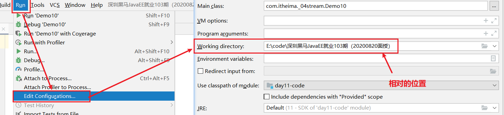

# day12【File类、递归、IO流、字节流、字符流】

```java
GitHub
StackOverFlow

   
Collection:      stream()    
Map: 间接
   keySet()
   values()
   entrySet()
    
数组:  Stream.of()
    
    forEach(s -> 操作s)
    filter(s -> 操作s,返回boolean)
    count()
    skip(long n)
    limit(long n)
    map(s -> 将s转换成另一个类型,也可以相同类型)
    static Stream concat(Stream a, Stream b)
    parallel()
    collect(Collectors.toList())
    Object[] toArray()
    
 lambda: 
	() -> {}    =>  匿名内部类   =>   接口的实现类对象
	
 前提:1. 存在函数式接口(有且只有一个抽象方法的接口)
     2. 这个函数式接口作为方法的参数...
     
     
  (): 就是接口中抽象方法的参数列表
  {}: 就是接口中抽象方法的方法体
 
```


## 今日目标

- File类【重点】
- 递归【理解】
- IO流
- 字节流【重点！！！】
- 字符流【理解】

## 教学目标  

- [ ] 能够说出File对象的创建方式
- [ ] 能够使用File类常用方法
- [ ] 能够辨别相对路径和绝对路径
- [ ] 能够遍历文件夹
- [ ] 能够解释递归的含义
- [ ] 能够使用递归的方式计算5的阶乘
- [ ] 能够说出使用递归会内存溢出隐患的原因
- [ ] 能够说出IO流的分类和功能
- [ ] 能够使用字节输出流写出数据到文件
- [ ] 能够使用字节输入流读取数据到程序
- [ ] 能够理解读取数据read(byte[])方法的原理
- [ ] 能够使用字节流完成文件的复制
- [ ] 能够使用FileWriter写数据的5个方法
- [ ] 能够说出FileWriter中关闭和刷新方法的区别
- [ ] 能够使用FileWriter写数据实现换行和追加写
- [ ] 能够使用FileReader读数据一次一个字符
- [ ] 能够使用FileReader读数据一次一个字符数组

# 第一章 File类

### 1.目标

- 能够说出File对象的创建方式

### 2.路径

- 概述
- 构造方法

### 3.讲解

#### 3.1概述

`java.io.File` 类是文件和文件夹路径名的表示形式，主要用于文件和目录的创建、查找和删除等操作。

> **绝对路径和相对路径**
>
> 绝对路径: 从盘符开始, 一直表示每一层文件夹, 直到最后的文件(文件夹)
>
> `E:\code\深圳黑马JavaEE就业103期（20200820面授）\day12-code\a.txt`
>
> 相对路径: 从某一个相对的路径开始, 一直表示到最后的文件(文件夹)
>
> 例如: idea的默认相对路径是当前**项目**, `day12-code\a.txt`



#### 3.2构造方法

- `public File(String pathname) ` ：通过将给定的**路径名字符串**转换为抽象路径名来创建新的 File实例。  
- `public File(String parent, String child) ` ：从**父路径名字符串和子路径名字符串**创建新的 File实例。
- `public File(File parent, String child)` ：从**父抽象路径名和子路径名字符串**创建新的 File实例。  


- 构造举例，代码如下：

```java
// 文件路径名
String pathname = "D:\\aaa.txt";
File file1 = new File(pathname); 

// 文件路径名
String pathname2 = "D:\\aaa\\bbb.txt";
File file2 = new File(pathname2); 

// 通过父路径和子路径字符串
 String parent = "d:\\aaa";
 String child = "bbb.txt";
 File file3 = new File(parent, child);

// 通过父级File对象和子路径字符串
File parentDir = new File("d:\\aaa");
String child = "bbb.txt";
File file4 = new File(parentDir, child);
```

> 小贴士：
>
> 1. 一个File对象代表硬盘中实际存在的一个文件或者目录。
> 2. 无论该路径下是否存在文件或者目录，都不影响File对象的创建。

### 4.小结


## 1.3 常用方法

### 1.目标

- 能够使用File类常用方法

### 2.路径

- 获取功能的方法
- 绝对路径和相对路径
- 判断功能的方法
- 创建删除功能的方法

### 3.讲解

#### 3.1获取功能的方法

- `public String getAbsolutePath() ` ：返回此File的绝对路径名字符串。

- ` public String getPath() ` ：将此File转换为路径名字符串。 

- `public String getName()`  ：返回由此File表示的文件或目录的名称。  

- `public long length()`  ：返回由此File表示的文件的长度。 

  方法演示，代码如下：

  ```java
  public class FileGet {
      public static void main(String[] args) {
          File f = new File("d:/aaa/bbb.java");     
          System.out.println("文件绝对路径:"+f.getAbsolutePath());
          System.out.println("文件构造路径:"+f.getPath());
          System.out.println("文件名称:"+f.getName());
          System.out.println("文件长度:"+f.length()+"字节");

          File f2 = new File("d:/aaa");     
          System.out.println("目录绝对路径:"+f2.getAbsolutePath());
          System.out.println("目录构造路径:"+f2.getPath());
          System.out.println("目录名称:"+f2.getName());
          System.out.println("目录长度:"+f2.length());
      }
  }
  输出结果：
  文件绝对路径:d:\aaa\bbb.java
  文件构造路径:d:\aaa\bbb.java
  文件名称:bbb.java
  文件长度:636字节

  目录绝对路径:d:\aaa
  目录构造路径:d:\aaa
  目录名称:aaa
  目录长度:4096
  ```

> API中说明：length()，表示文件的长度。但是File对象表示目录，则返回值未指定。

#### 3.2绝对路径和相对路径

- **绝对路径**：从盘符开始的路径，这是一个完整的路径。
- **相对路径**：相对于项目目录的路径，这是一个便捷的路径，开发中经常使用。

```java
public class FilePath {
    public static void main(String[] args) {
      	// D盘下的bbb.java文件
        File f = new File("D:\\bbb.java");
        System.out.println(f.getAbsolutePath());
      	
		// 项目下的bbb.java文件
        File f2 = new File("bbb.java");
        System.out.println(f2.getAbsolutePath());
    }
}
输出结果：
D:\bbb.java
D:\idea_project_test4\bbb.java
```

#### 3.3判断功能的方法

- `public boolean exists()` ：此File表示的文件或目录是否实际存在。
- `public boolean isDirectory()` ：此File表示的是否为目录。
- `public boolean isFile()` ：此File表示的是否为文件。

方法演示，代码如下：

```java
public class FileIs {
    public static void main(String[] args) {
        File f = new File("d:\\aaa\\bbb.java");
        File f2 = new File("d:\\aaa");
      	// 判断是否存在
        System.out.println("d:\\aaa\\bbb.java 是否存在:"+f.exists());
        System.out.println("d:\\aaa 是否存在:"+f2.exists());
      	// 判断是文件还是目录
        System.out.println("d:\\aaa 文件?:"+f2.isFile());
        System.out.println("d:\\aaa 目录?:"+f2.isDirectory());
    }
}
输出结果：
d:\aaa\bbb.java 是否存在:true
d:\aaa 是否存在:true
d:\aaa 文件?:false
d:\aaa 目录?:true
```

#### 3.4创建删除功能的方法

- `public boolean createNewFile()` ：当且仅当具有该名称的文件尚不存在时，创建一个新的空文件。 
- `public boolean delete()` ：删除由此File表示的文件或目录。  
- `public boolean mkdir()` ：创建由此File表示的目录。
- `public boolean mkdirs()` ：创建由此File表示的目录，包括任何必需但不存在的父目录。

方法演示，代码如下：

```java
public class FileCreateDelete {
    public static void main(String[] args) throws IOException {
        // 文件的创建
        File f = new File("aaa.txt");
        System.out.println("是否存在:"+f.exists()); // false
        System.out.println("是否创建:"+f.createNewFile()); // true
        System.out.println("是否存在:"+f.exists()); // true
		
     	// 目录的创建
      	File f2= new File("newDir");	
        System.out.println("是否存在:"+f2.exists());// false
        System.out.println("是否创建:"+f2.mkdir());	// true
        System.out.println("是否存在:"+f2.exists());// true

		// 创建多级目录
      	File f3= new File("newDira\\newDirb");
        System.out.println(f3.mkdir());// false
        File f4= new File("newDira\\newDirb");
        System.out.println(f4.mkdirs());// true
      
      	// 文件的删除
       	System.out.println(f.delete());// true
      
      	// 目录的删除
        System.out.println(f2.delete());// true
        System.out.println(f4.delete());// false
    }
}
```

> API中说明：delete方法，如果此File表示目录，则目录必须为空才能删除。

### 4.小结


## 1.4 目录的遍历

### 1.目标

- 能够遍历文件夹

### 2.路径

- 代码演示

### 3.讲解

#### 3.1代码演示

- `public String[] list()` ：返回一个String数组，表示该File目录中的所有子文件或目录。


- `public File[] listFiles()` ：返回一个File数组，表示该File目录中的所有的子文件或目录。  

```java
public class FileFor {
    public static void main(String[] args) {
        File dir = new File("d:\\java_code");
      
      	//获取当前目录下的文件以及文件夹的名称。
		String[] names = dir.list();
		for(String name : names){
			System.out.println(name);
		}
        //获取当前目录下的文件以及文件夹对象，只要拿到了文件对象，那么就可以获取更多信息
        File[] files = dir.listFiles();
        for (File file : files) {
            System.out.println(file);
        }
    }
}
```

> 小贴士：
>
> 调用listFiles方法的File对象，表示的必须是实际存在的目录，否则返回null，无法进行遍历。

### 4.小结


# 第二章 递归

### 1.目标

- 能够解释递归的含义,并用递归解决问题比如求5的阶乘

### 2.路径

- 概述
- 递归累和
- 递归求阶乘
- 文件搜索

### 3.讲解

#### 3.1概述

- **递归**：指在当前方法内调用自己的这种现象。

```java
public static void a(){
    a();
}
```

- **注意事项**:
  1. 递归必须有出口
  2. 就算有出口, 执行的次数也不能过多


#### 3.2递归累和

##### 计算1 ~ n的和

**分析**：num的累和 = num + (num-1)的累和，所以可以把累和的操作定义成一个方法，递归调用。

**实现代码**：

```java
public class DiGuiDemo {
	public static void main(String[] args) {
		//计算1~num的和，使用递归完成
		int num = 5;
      	// 调用求和的方法
		int sum = getSum(num);
      	// 输出结果
		System.out.println(sum);
		
	}
  	/*
  	  通过递归算法实现.
  	  参数列表:int 
  	  返回值类型: int 
  	*/
	public static int getSum(int num) {
      	/* 
      	   num为1时,方法返回1,
      	   相当于是方法的出口,num总有是1的情况
      	*/
		if(num == 1){
			return 1;
		}
      	/*
          num不为1时,方法返回 num +(num-1)的累和
          递归调用getSum方法
        */
		return num + getSum(num-1);
	}
}
```

##### 代码执行图解


> 小贴士：递归一定要有条件限定，保证递归能够停止下来，次数不要太多，否则会发生栈内存溢出。

#### 3.3递归求阶乘

- **阶乘**：所有小于及等于该数的正整数的积。

```java
n的阶乘：n! = n * (n-1) *...* 3 * 2 * 1 
```

**分析**：这与累和类似,只不过换成了乘法运算，学员可以自己练习，需要注意阶乘值符合int类型的范围。

```
推理得出：n! = n * (n-1)!
```

**代码实现**：

```java
public class DiGuiDemo {
  	//计算n的阶乘，使用递归完成
    public static void main(String[] args) {
        int n = 3;
      	// 调用求阶乘的方法
        int value = getValue(n);
      	// 输出结果
        System.out.println("阶乘为:"+ value);
    }
	/*
  	  通过递归算法实现.
  	  参数列表:int 
  	  返回值类型: int 
  	*/
    public static int getValue(int n) {
      	// 1的阶乘为1
        if (n == 1) {
            return 1;
        }
      	/*
      	  n不为1时,方法返回 n! = n*(n-1)!
          递归调用getValue方法
      	*/
        return n * getValue(n - 1);
    }
}
```

#### 3.4文件搜索

搜索`D:\aaa` 目录中的`.java` 文件。

**分析**：

1. 目录搜索，无法判断多少级目录，所以使用递归，遍历所有目录。
2. 遍历目录时，获取的子文件，通过文件名称，判断是否符合条件。

**代码实现**：

```java
public class DiGuiDemo3 {
    public static void main(String[] args) {
        // 创建File对象
        File dir  = new File("D:\\aaa");
      	// 调用打印目录方法
        printDir(dir);
    }

    public static void printDir(File dir) {
      	// 获取子文件和目录
        File[] files = dir.listFiles();
      	
      	// 循环打印
        for (File file : files) {
            if (file.isFile()) {
              	// 是文件，判断文件名并输出文件绝对路径
                if (file.getName().endsWith(".java")) {
                    System.out.println("文件名:" + file.getAbsolutePath());
                }
            } else {
                // 是目录，继续遍历,形成递归
                printDir(file);
            }
        }
    }
}
```

### 4.小结


# 第三章 IO概述

### 1.目标

- 能够说出IO流的分类和功能

### 2.路径

- 什么是IO
- IO的分类
- IO的流向说明图解
- 顶级父类们

### 3.讲解

#### 3.1什么是IO

生活中，你肯定经历过这样的场景。当你编辑一个文本文件，忘记了`ctrl+s` ，可能文件就白白编辑了。当你电脑上插入一个U盘，可以把一个视频，拷贝到你的电脑硬盘里。那么数据都是在哪些设备上的呢？键盘、内存、硬盘、外接设备等等。

我们把这种数据的传输，可以看做是一种数据的流动，按照流动的方向，以内存为基准，分为`输入input` 和`输出output` ，即流向内存是输入流，流出内存的输出流。

Java中I/O操作主要是指使用`java.io`包下的内容，进行输入、输出操作。**输入**也叫做**读取**数据，**输出**也叫做作**写出**数据。

#### 3.2IO的分类

根据数据的流向分为：**输入流**和**输出流**。

- **输入流** ：把数据从`其他设备`上读取到`内存`中的流。 
- **输出流** ：把数据从`内存` 中写出到`其他设备`上的流。

根据数据的类型分为：**字节流**和**字符流**。

- **字节流** ：以字节为单位，读写数据的流。
- **字符流** ：以字符为单位，读写数据的流。

> 计算机中的所有文件, 最小存储单元是:  **字节**
>
> - 看到的是一个中文字符, 但是由几个字节组成


#### 3.3IO的流向说明图解


#### 3.4顶级父类们

|         |          **输入流**           |             输出流             |
| :-----: | :------------------------: | :-------------------------: |
| **字节流** | 字节输入流<br />**InputStream** | 字节输出流<br />**OutputStream** |
| **字符流** |   字符输入流<br />**Reader**    |    字符输出流<br />**Writer**    |

### 4.小结


# 第四章 字节流

### 1.目标

- 能够使用字节流完成文件的读和写,从而实现文件的复制即拷贝

### 2.路径

- 一切皆为字节
- 字节输出流【OutputStream】
- 字节输入流【InputStream】
- FileInputStream类
- 字节流练习：图片复制

### 3.讲解

#### 3.1一切皆为字节

一切文件数据(文本、图片、视频等)在存储时，都是以二进制数字的形式保存，都一个一个的字节，那么传输时一样如此。所以，字节流可以传输任意文件数据。在操作流的时候，我们要时刻明确，无论使用什么样的流对象，底层传输的始终为二进制数据。

#### 3.2字节输出流【OutputStream】

`java.io.OutputStream `抽象类是表示字节输出流的所有类的超类，将指定的字节信息写出到目的地。它定义了字节输出流的基本共性功能方法。

- `public void close()` ：关闭此输出流并释放与此流相关联的任何系统资源。  
- `public void flush() ` ：刷新此输出流并强制任何缓冲的输出字节被写出。  
- `public void write(byte[] b)`：将 b.length字节从指定的字节数组写入此输出流。  
- `public void write(byte[] b, int off, int len)` ：从指定的字节数组写入 len字节，从偏移量 off开始输出到此输出流。  
- `public abstract void write(int b)` ：将指定的字节输出流。

> 小贴士：
>
> close方法，当完成流的操作时，必须调用此方法，释放系统资源。

#### 3.3FileOutputStream类

`OutputStream`有很多子类，我们从最简单的一个子类开始。

`java.io.FileOutputStream `类是文件输出流，用于将数据写出到文件。

##### 构造方法

- `public FileOutputStream(File file)`：创建文件输出流以写入由指定的 File对象表示的文件。 
- `public FileOutputStream(String name)`： 创建文件输出流以指定的名称写入文件。  

当你创建一个流对象时，必须传入一个文件路径。该路径下，如果没有这个文件，会创建该文件。如果有这个文件，会清空这个文件的数据。

- 构造举例，代码如下：

```java
public class FileOutputStreamConstructor throws IOException {
    public static void main(String[] args) {
   	 	// 使用File对象创建流对象
        File file = new File("a.txt");
        FileOutputStream fos = new FileOutputStream(file);
      
        // 使用文件名称创建流对象
        FileOutputStream fos = new FileOutputStream("b.txt");
    }
}
```

##### 写出字节数据

1. **写出字节**：`write(int b)` 方法，每次可以写出一个字节数据，代码使用演示：

```java
public class FOSWrite {
    public static void main(String[] args) throws IOException {
        // 使用文件名称创建流对象
        FileOutputStream fos = new FileOutputStream("fos.txt");     
      	// 写出数据
      	fos.write(97); // 写出第1个字节
      	fos.write(98); // 写出第2个字节
      	fos.write(99); // 写出第3个字节
      	// 关闭资源
        fos.close();
    }
}
输出结果：
abc
```

> 小贴士：
>
> 1. 虽然参数为int类型四个字节，但是只会保留一个字节的信息写出。
> 2. 流操作完毕后，必须释放系统资源，调用close方法，千万记得。

1. **写出字节数组**：`write(byte[] b)`，每次可以写出数组中的数据，代码使用演示：

```java
public class FOSWrite {
    public static void main(String[] args) throws IOException {
        // 使用文件名称创建流对象
        FileOutputStream fos = new FileOutputStream("fos.txt");     
      	// 字符串转换为字节数组
      	byte[] b = "黑马程序员".getBytes();
      	// 写出字节数组数据
      	fos.write(b);
      	// 关闭资源
        fos.close();
    }
}
输出结果：
黑马程序员
```

1. **写出指定长度字节数组**：`write(byte[] b, int off, int len)` ,每次写出从off索引开始，len个字节，代码使用演示：

```java
public class FOSWrite {
    public static void main(String[] args) throws IOException {
        // 使用文件名称创建流对象
        FileOutputStream fos = new FileOutputStream("fos.txt");     
      	// 字符串转换为字节数组
      	byte[] b = "abcde".getBytes();
		// 写出从索引2开始，2个字节。索引2是c，两个字节，也就是cd。
        fos.write(b,2,2);
      	// 关闭资源
        fos.close();
    }
}
输出结果：
cd
```

##### 数据追加续写

经过以上的演示，每次程序运行，创建输出流对象，都会清空目标文件中的数据。如何保留目标文件中数据，还能继续添加新数据呢？

- `public FileOutputStream(File file, boolean append)`： 创建文件输出流以写入由指定的 File对象表示的文件。  
- `public FileOutputStream(String name, boolean append)`： 创建文件输出流以指定的名称写入文件。  

这两个构造方法，参数中都需要传入一个boolean类型的值，`true` 表示追加数据，`false` 表示清空原有数据。这样创建的输出流对象，就可以指定是否追加续写了，代码使用演示：

```java
public class FOSWrite {
    public static void main(String[] args) throws IOException {
        // 使用文件名称创建流对象
        FileOutputStream fos = new FileOutputStream("fos.txt"，true);     
      	// 字符串转换为字节数组
      	byte[] b = "abcde".getBytes();
		// 写出从索引2开始，2个字节。索引2是c，两个字节，也就是cd。
        fos.write(b);
      	// 关闭资源
        fos.close();
    }
}
文件操作前：cd
文件操作后：cdabcde
```

##### 写出换行

Windows系统里，换行符号是`\r\n` 。把

以指定是否追加续写了，代码使用演示：

```java
public class FOSWrite {
    public static void main(String[] args) throws IOException {
        // 使用文件名称创建流对象
        FileOutputStream fos = new FileOutputStream("fos.txt");  
      	// 定义字节数组
      	byte[] words = {97,98,99,100,101};
      	// 遍历数组
        for (int i = 0; i < words.length; i++) {
          	// 写出一个字节
            fos.write(words[i]);
          	// 写出一个换行, 换行符号转成数组写出
            fos.write("\r\n".getBytes());
        }
      	// 关闭资源
        fos.close();
    }
}

输出结果：
a
b
c
d
e
```

> - 回车符`\r`和换行符`\n` ：
>   - 回车符：回到一行的开头（return）。
>   - 换行符：下一行（newline）。
> - 系统中的换行：
>   - Windows系统里，每行结尾是 `回车+换行` ，即`\r\n`；
>   - Unix系统里，每行结尾只有 `换行` ，即`\n`；
>   - Mac系统里，每行结尾是 `回车` ，即`\r`。从 Mac OS X开始与Linux统一。


#### 3.4字节输入流【InputStream】

`java.io.InputStream `抽象类是表示字节输入流的所有类的超类，可以读取字节信息到内存中。它定义了字节输入流的基本共性功能方法。

- `public void close()` ：关闭此输入流并释放与此流相关联的任何系统资源。    
- `public abstract int read()`： 从输入流读取数据的下一个字节。 
- `public int read(byte[] b)`： 从输入流中读取一些字节数，并将它们存储到字节数组 b中 。

> 小贴士：
>
> close方法，当完成流的操作时，必须调用此方法，释放系统资源。

#### 3.5FileInputStream类

`java.io.FileInputStream `类是文件输入流，从文件中读取字节。

##### 构造方法

- `FileInputStream(File file)`： 通过打开与实际文件的连接来创建一个 FileInputStream ，该文件由文件系统中的 File对象 file命名。 
- `FileInputStream(String name)`： 通过打开与实际文件的连接来创建一个 FileInputStream ，该文件由文件系统中的路径名 name命名。  

当你创建一个流对象时，必须传入一个文件路径。该路径下，如果没有该文件,会抛出`FileNotFoundException` 

- 构造举例，代码如下：

```java
public class FileInputStreamConstructor throws IOException{
    public static void main(String[] args) {
   	 	// 使用File对象创建流对象
        File file = new File("a.txt");
        FileInputStream fos = new FileInputStream(file);
      
        // 使用文件名称创建流对象
        FileInputStream fos = new FileInputStream("b.txt");
    }
}
```

##### 读取字节数据

1. **读取字节**：`read`方法，每次可以读取一个字节的数据，提升为int类型，读取到文件末尾，返回`-1`，代码使用演示：

```java
public class FISRead {
    public static void main(String[] args) throws IOException{
      	// 使用文件名称创建流对象
       	FileInputStream fis = new FileInputStream("read.txt");
      	// 读取数据，返回一个字节
        int read = fis.read();
        System.out.println((char) read);
        read = fis.read();
        System.out.println((char) read);
        read = fis.read();
        System.out.println((char) read);
        read = fis.read();
        System.out.println((char) read);
        read = fis.read();
        System.out.println((char) read);
      	// 读取到末尾,返回-1
       	read = fis.read();
        System.out.println( read);
		// 关闭资源
        fis.close();
    }
}
输出结果：
a
b
c
d
e
-1
```

循环改进读取方式，代码使用演示：

```java
public class FISRead {
    public static void main(String[] args) throws IOException{
      	// 使用文件名称创建流对象
       	FileInputStream fis = new FileInputStream("read.txt");
      	// 定义变量，保存数据
        int b ；
        // 循环读取
        while ((b = fis.read())!=-1) {
            System.out.println((char)b);
        }
		// 关闭资源
        fis.close();
    }
}
输出结果：
a
b
c
d
e
```

> 小贴士：
>
> 1. 虽然读取了一个字节，但是会自动提升为int类型。
> 2. 流操作完毕后，必须释放系统资源，调用close方法，千万记得。

1. **使用字节数组读取**：`read(byte[] b)`，每次读取b的长度个字节到数组中，返回读取到的有效字节个数，读取到末尾时，返回`-1` ，代码使用演示：

```java
public class FISRead {
    public static void main(String[] args) throws IOException{
      	// 使用文件名称创建流对象.
       	FileInputStream fis = new FileInputStream("read.txt"); // 文件中为abcde
      	// 定义变量，作为有效个数
        int len ；
        // 定义字节数组，作为装字节数据的容器   
        byte[] b = new byte[2];
        // 循环读取
        while (( len= fis.read(b))!=-1) {
           	// 每次读取后,把数组变成字符串打印
            System.out.println(new String(b));
        }
		// 关闭资源
        fis.close();
    }
}

输出结果：
ab
cd
ed
```

错误数据`d`，是由于最后一次读取时，只读取一个字节`e`，数组中，上次读取的数据没有被完全替换，所以要通过`len` ，获取有效的字节，代码使用演示：

```java
public class FISRead {
    public static void main(String[] args) throws IOException{
      	// 使用文件名称创建流对象.
       	FileInputStream fis = new FileInputStream("read.txt"); // 文件中为abcde
      	// 定义变量，作为有效个数
        int len ；
        // 定义字节数组，作为装字节数据的容器   
        byte[] b = new byte[2];
        // 循环读取
        while (( len= fis.read(b))!=-1) {
           	// 每次读取后,把数组的有效字节部分，变成字符串打印
            System.out.println(new String(b，0，len));//  len 每次读取的有效字节个数
        }
		// 关闭资源
        fis.close();
    }
}

输出结果：
ab
cd
e
```

> 小贴士：
>
> 使用数组读取，每次读取多个字节，减少了系统间的IO操作次数，从而提高了读写的效率，建议开发中使用。

#### 3.6字节流练习：图片复制

##### 复制原理图解


##### 案例实现

复制图片文件，代码使用演示：

```java
public class Copy {
    public static void main(String[] args) throws IOException {
        // 1.创建流对象
        // 1.1 指定数据源
        FileInputStream fis = new FileInputStream("D:\\test.jpg");
        // 1.2 指定目的地
        FileOutputStream fos = new FileOutputStream("test_copy.jpg");

        // 2.读写数据
        // 2.1 定义数组
        byte[] b = new byte[1024];
        // 2.2 定义长度
        int len;
        // 2.3 循环读取
        while ((len = fis.read(b))!=-1) {
            // 2.4 写出数据
            fos.write(b, 0 , len);
        }

        // 3.关闭资源
        fos.close();
        fis.close();
    }
}
```

> 小贴士：
>
> 流的关闭原则：先开后关，后开先关。

### 4.小结


# 第五章 字符流

### 1.目标

- 能够使用字符流完成文件的读和写

### 2.路径

- 字符输入流【Reader】
- FileReader类
- 字节输入流【InputStream】
- 字符输出流【Writer】

### 3.讲解

当使用字节流读取文本文件时，可能会有一个小问题。就是遇到中文字符时，可能不会显示完整的字符，那是因为一个中文字符可能占用多个字节存储。所以Java提供一些字符流类，以字符为单位读写数据，专门用于处理文本文件。

#### 3.1字符输入流【Reader】

`java.io.Reader`抽象类是表示用于读取字符流的所有类的超类，可以读取字符信息到内存中。它定义了字符输入流的基本共性功能方法。

- `public void close()` ：关闭此流并释放与此流相关联的任何系统资源。    
- `public int read()`： 从输入流读取一个字符。 
- `public int read(char[] cbuf)`： 从输入流中读取一些字符，并将它们存储到字符数组 cbuf中 。

#### 3.2FileReader类

`java.io.FileReader `类是读取字符文件的便利类。构造时使用系统默认的字符编码和默认字节缓冲区。

> 小贴士：
>
> 1. 字符编码：字节与字符的对应规则。Windows系统的中文编码默认是GBK编码表。
>
>    idea中UTF-8
>
> 2. 字节缓冲区：一个字节数组，用来临时存储字节数据。

##### 构造方法

- `FileReader(File file)`： 创建一个新的 FileReader ，给定要读取的File对象。   
- `FileReader(String fileName)`： 创建一个新的 FileReader ，给定要读取的文件的名称。  

当你创建一个流对象时，必须传入一个文件路径。类似于FileInputStream 。

- 构造举例，代码如下：

```java
public class FileReaderConstructor throws IOException{
    public static void main(String[] args) {
   	 	// 使用File对象创建流对象
        File file = new File("a.txt");
        FileReader fr = new FileReader(file);
      
        // 使用文件名称创建流对象
        FileReader fr = new FileReader("b.txt");
    }
}
```

##### 读取字符数据

1. **读取字符**：`read`方法，每次可以读取一个字符的数据，提升为int类型，读取到文件末尾，返回`-1`，循环读取，代码使用演示：

```java
public class FRRead {
    public static void main(String[] args) throws IOException {
      	// 使用文件名称创建流对象
       	FileReader fr = new FileReader("read.txt");
      	// 定义变量，保存数据
        int b ；
        // 循环读取
        while ((b = fr.read())!=-1) {
            System.out.println((char)b);
        }
		// 关闭资源
        fr.close();
    }
}
输出结果：
黑
马
程
序
员
```

> 小贴士：虽然读取了一个字符，但是会自动提升为int类型。

1. **使用字符数组读取**：`read(char[] cbuf)`，每次读取b的长度个字符到数组中，返回读取到的有效字符个数，读取到末尾时，返回`-1` ，代码使用演示：

```java
public class FRRead {
    public static void main(String[] args) throws IOException {
      	// 使用文件名称创建流对象
       	FileReader fr = new FileReader("read.txt");
      	// 定义变量，保存有效字符个数
        int len ；
        // 定义字符数组，作为装字符数据的容器
         char[] cbuf = new char[2];
        // 循环读取
        while ((len = fr.read(cbuf))!=-1) {
            System.out.println(new String(cbuf));
        }
		// 关闭资源
        fr.close();
    }
}
输出结果：
黑马
程序
员序
```

获取有效的字符改进，代码使用演示：

```java
public class FISRead {
    public static void main(String[] args) throws IOException {
      	// 使用文件名称创建流对象
       	FileReader fr = new FileReader("read.txt");
      	// 定义变量，保存有效字符个数
        int len ；
        // 定义字符数组，作为装字符数据的容器
        char[] cbuf = new char[2];
        // 循环读取
        while ((len = fr.read(cbuf))!=-1) {
            System.out.println(new String(cbuf,0,len));
        }
    	// 关闭资源
        fr.close();
    }
}

输出结果：
黑马
程序
员
```

#### 3.3字符输出流【Writer】

`java.io.Writer `抽象类是表示用于写出字符流的所有类的超类，将指定的字符信息写出到目的地。它定义了字节输出流的基本共性功能方法。

- `public abstract void close()` ：关闭此输出流并释放与此流相关联的任何系统资源。  
- `public abstract void flush() ` ：刷新此输出流并强制任何缓冲的输出字符被写出。  
- `public void write(int c)` ：写出一个字符。
- `public void write(char[] cbuf)`：将 b.length字符从指定的字符数组写出此输出流。  
- `public abstract void write(char[] b, int off, int len)` ：从指定的字符数组写出 len字符，从偏移量 off开始输出到此输出流。  
- `public void write(String str)` ：写出一个字符串。

#### 3.4FileWriter类

`java.io.FileWriter `类是写出字符到文件的便利类。构造时使用系统默认的字符编码和默认字节缓冲区。

##### 构造方法

- `FileWriter(File file)`： 创建一个新的 FileWriter，给定要读取的File对象。   
- `FileWriter(String fileName)`： 创建一个新的 FileWriter，给定要读取的文件的名称。  

当你创建一个流对象时，必须传入一个文件路径，类似于FileOutputStream。

- 构造举例，代码如下：

```java
public class FileWriterConstructor {
    public static void main(String[] args) throws IOException {
   	 	// 使用File对象创建流对象
        File file = new File("a.txt");
        FileWriter fw = new FileWriter(file);
      
        // 使用文件名称创建流对象
        FileWriter fw = new FileWriter("b.txt");
    }
}
```

##### 基本写出数据

**写出字符**：`write(int b)` 方法，每次可以写出一个字符数据，代码使用演示：

```java
public class FWWrite {
    public static void main(String[] args) throws IOException {
        // 使用文件名称创建流对象
        FileWriter fw = new FileWriter("fw.txt");     
      	// 写出数据
      	fw.write(97); // 写出第1个字符
      	fw.write('b'); // 写出第2个字符
      	fw.write('C'); // 写出第3个字符
      	fw.write(30000); // 写出第4个字符，中文编码表中30000对应一个汉字。
      
      	/*
        【注意】关闭资源时,与FileOutputStream不同。
      	 如果不关闭,数据只是保存到缓冲区，并未保存到文件。
        */
        // fw.close();
    }
}
输出结果：
abC田
```

> 小贴士：
>
> 1. 虽然参数为int类型四个字节，但是只会保留一个字符的信息写出。
> 2. 未调用close方法，数据只是保存到了缓冲区，并未写出到文件中。

##### 关闭和刷新

因为内置缓冲区的原因，如果不关闭输出流，无法写出字符到文件中。但是关闭的流对象，是无法继续写出数据的。如果我们既想写出数据，又想继续使用流，就需要`flush` 方法了。

- `flush` ：刷新缓冲区，流对象可以继续使用。
- `close` ：关闭流，释放系统资源。关闭前会刷新缓冲区。

代码使用演示：

```java
public class FWWrite {
    public static void main(String[] args) throws IOException {
        // 使用文件名称创建流对象
        FileWriter fw = new FileWriter("fw.txt");
        // 写出数据，通过flush
        fw.write('刷'); // 写出第1个字符
        fw.flush();
        fw.write('新'); // 继续写出第2个字符，写出成功
        fw.flush();
      
      	// 写出数据，通过close
        fw.write('关'); // 写出第1个字符
        fw.close();
        fw.write('闭'); // 继续写出第2个字符,【报错】java.io.IOException: Stream closed
        fw.close();
    }
}
```

> 小贴士：即便是flush方法写出了数据，操作的最后还是要调用close方法，释放系统资源。

##### 写出其他数据

1. **写出字符数组** ：`write(char[] cbuf)` 和 `write(char[] cbuf, int off, int len)` ，每次可以写出字符数组中的数据，用法类似FileOutputStream，代码使用演示：

```java
public class FWWrite {
    public static void main(String[] args) throws IOException {
        // 使用文件名称创建流对象
        FileWriter fw = new FileWriter("fw.txt");     
      	// 字符串转换为字节数组
      	char[] chars = "黑马程序员".toCharArray();
      
      	// 写出字符数组
      	fw.write(chars); // 黑马程序员
        
		// 写出从索引2开始，2个字节。索引2是'程'，两个字节，也就是'程序'。
        fw.write(b,2,2); // 程序
      
      	// 关闭资源
        fos.close();
    }
}
```

1. **写出字符串**：`write(String str)` 和 `write(String str, int off, int len)` ，每次可以写出字符串中的数据，更为方便，代码使用演示：

```j

```