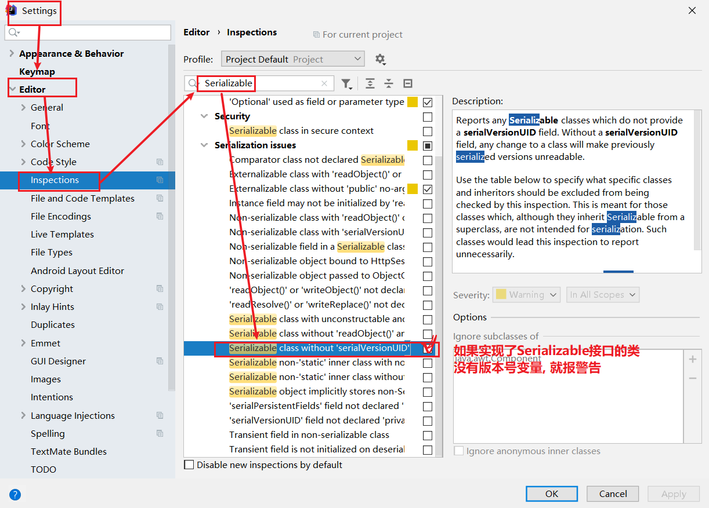

# day11【Properties类、缓冲流、转换流、序列化流、装饰者模式、commons-io工具包】

```java
File :
	构造方法:
		File(String path)
        File(String parent, String child)
        File(File parentm, String child)
    成员方法:
		获取功能
            getAbsolutePath()
            getPath()
            getName()
            length()
        创建功能
            creatNewFile()
            mkdir()
            mkdirs()
        删除功能
            delete()
        判断功能
            exists()
            isDirectory()
            isFile()
        遍历文件夹
            String[] list()
            File[] listFiles()
        文件过滤器
            File[] listFiles(FileFilter)
递归:
	含义: 方法自己调用自己
    注意: 1. 一定有出口  2.次数不能过多
    递归求阶乘:
	public int get(int num) {
        if (num == 1) {
            return 1;
        }
        
        // num! = num * (num-1)!
        return num * get(num - 1);
    }

IO:
	作用: 数据的传输
    分类: 
		流向: 输入和输出
        类型: 字节和字符
    计算机中所有文件最小的存储单元 - 字节
    输入和输出一定站在内存的角度
            
字节输入流(InputStream)
	FileInputStream(File file)
    FileInputStream(String path)
            
    int read(): 一次读取一个字节
    int read(byte[] arr): 将输入流关联文件中的内容, 读取到arr数组中, 返回读取到有效的字节个数
            
字节输出流(OutputStream)
	FileOutputStream(File file)
    FileOutputStream(String path)   
            
    write(int b) : 写一个字节
    write(byte[] arr) : 将数组中的内容写出到输出流关联的文件中
    write(byte[] arr, int off, int len) : 将arr数组中, 从off索引开始的len个字节写出
            
    一个字节一个字节的拷贝
    字节数组方式的拷贝
            
字符流
    字符输入流(Reader) -> FileReader
    字符输出流(Writer) -> FileWriter
            write(String s)
            
    只能使用在, 我们能看得懂的纯文本文档, 其他的图片, 视频, 音频, pdf ... 
            
            
追加写出:  输出流(String path, boolean append) : append为true, 就是追加写出
写出换行符:  
	字符流: write("\r\n")
    字节流: write("\r\n".getBytes())
```

# 教学目标

- [ ] 能够使用Properties的load方法加载文件中配置信息
- [ ] 能够使用字节缓冲流读取数据到程序
- [ ] 能够使用字节缓冲流写出数据到文件
- [ ] 能够明确字符缓冲流的作用和基本用法
- [ ] 能够使用缓冲流的特殊功能
- [ ] 能够阐述编码表的意义
- [ ] 能够使用转换流读取指定编码的文本文件
- [ ] 能够使用转换流写入指定编码的文本文件
- [ ] 能够使用序列化流写出对象到文件
- [ ] 能够使用反序列化流读取文件到程序中
- [ ] 能够理解装饰模式的实现步骤
- [ ] 能够使用commons-io工具包

# 第一章 IO资源的处理【敲】

## 目标

之前的入门练习，我们一直把异常抛出，而实际开发中并不能这样处理，建议使用`try...catch...finally` 代码块，处理异常部分, 那么到底应该如何完成呢?

## 路径

- jdk1.7之前
- jdk1.7之后

## 讲解

**jdk1.7之前**

```java  
public class HandleException1 {
    public static void main(String[] args) {
      	// 声明变量
        FileWriter fw = null;
        try {
            //创建流对象
            fw = new FileWriter("fw.txt");
            // 写出数据
            fw.write("黑马程序员"); //黑马程序员
        } catch (IOException e) {
            e.printStackTrace();
        } finally {
            try {
                if (fw != null) {
                    fw.close();
                }
            } catch (IOException e) {
                e.printStackTrace();
            }
        }
    }
}
```

**jdk1.7之后**

还可以使用JDK1.7优化后的`try-with-resource` 语句，该语句确保了每个资源在语句结束时关闭。所谓的资源（resource）是指在程序完成后，必须关闭的对象。

格式：

```java
try (创建流对象语句，如果多个,使用';'隔开) {
	// 读写数据
} catch (IOException e) {
	e.printStackTrace();
}
```

代码使用演示：

```java
public class HandleException2 {
    public static void main(String[] args) {
      	// 创建流对象
        try ( FileWriter fw = new FileWriter("fw.txt"); ) {
            // 写出数据
            fw.write("黑马程序员"); //黑马程序员
        } catch (IOException e) {
            e.printStackTrace();
        }
    }
}
```

## 小结

# 第二章 属性集【重点！！！】

## 目标

`java.util.Properties ` 继承于` Hashtable` ，来表示一个持久的属性集。它使用键值结构存储数据，每个键及其对应值都是一个字符串。该类也被许多Java类使用，比如获取系统属性时，`System.getProperties` 方法就是返回一个`Properties`对象。

## 路径

- 构造方法
- 基本的存储方法
- 与流相关的方法

## 讲解

### 2.1 构造方法

- `public Properties()` :创建一个空的属性列表。

### 2.2 基本的存储方法

- `public Object setProperty(String key, String value)` ： 保存一对属性。  
- `public String getProperty(String key) ` ：使用此属性列表中指定的键搜索属性值。
- `public Set<String> stringPropertyNames() ` ：所有键的名称的集合。

```java
public class ProDemo {
    public static void main(String[] args) throws FileNotFoundException {
        // 创建属性集对象
        Properties properties = new Properties();
        // 添加键值对元素
        properties.setProperty("filename", "a.txt");
        properties.setProperty("length", "209385038");
        properties.setProperty("location", "D:\\a.txt");
        // 打印属性集对象
        System.out.println(properties);
        // 通过键,获取属性值
        System.out.println(properties.getProperty("filename"));
        System.out.println(properties.getProperty("length"));
        System.out.println(properties.getProperty("location"));

        // 遍历属性集,获取所有键的集合
        Set<String> strings = properties.stringPropertyNames();
        // 打印键值对
        for (String key : strings ) {
          	System.out.println(key+" -- "+properties.getProperty(key));
        }
    }
}
输出结果：
{filename=a.txt, length=209385038, location=D:\a.txt}
a.txt
209385038
D:\a.txt
filename -- a.txt
length -- 209385038
location -- D:\a.txt
```

### 2.3 与流相关的方法

- `public void load(InputStream inStream)`： 从字节输入流中读取键值对。 

参数中使用了字节输入流，通过流对象，可以关联到某文件上，这样就能够加载文本中的数据了。文本数据格式:

```
filename=a.txt
length=209385038
location=D:\a.txt
```

加载代码演示：

```java
public class ProDemo2 {
    public static void main(String[] args) throws FileNotFoundException {
        // 创建属性集对象
        Properties pro = new Properties();
        // 加载文本中信息到属性集
        pro.load(new FileInputStream("read.txt"));
        // 遍历集合并打印
        Set<String> strings = pro.stringPropertyNames();
        for (String key : strings ) {
          	System.out.println(key+" -- "+pro.getProperty(key));
        }
     }
}
输出结果：
filename -- a.txt
length -- 209385038
location -- D:\a.txt
```

> 小贴士：文本中的数据，必须是键值对形式，可以使用空格、等号、冒号等符号分隔。

## 小结

# 第三章 缓冲流【重点】

## 知识点 - 3.1 缓冲流的概述

> 缓冲流, 相当于给FileInputStream/FileOutputStream ...  进行了包装, 让他们拥有了更强大的功能.\
>
> 缓冲(缓冲区) : 数组
>
> 缓冲流的内部, 自带数组.

### 目标

昨天学习了基本的一些流，作为IO流的入门，今天我们要见识一些更强大的流。比如能够高效读写的缓冲流，能够转换编码的转换流，能够持久化存储对象的序列化流等等。这些功能更为强大的流，都是在基本的流对象基础之上创建而来的，就像穿上铠甲的武士一样，相当于是对基本流对象的一种增强。

### 路径

缓冲流概述

### 讲解

缓冲流,也叫高效流，是对4个基本的`FileXxx` 流的增强，所以也是4个流，按照数据类型分类：

- **字节缓冲流**：`BufferedInputStream`，`BufferedOutputStream` 
- **字符缓冲流**：`BufferedReader`，`BufferedWriter`

缓冲流的基本原理，是在创建流对象时，会创建一个内置的默认大小的缓冲区数组，通过缓冲区读写，减少系统IO次数，从而提高读写的效率。

### 小结

## 知识点 - 3.2 字节缓冲流

### 目标

知道了缓冲流的概述, 下面我们来学习第一种缓冲流, 字节缓冲流.

### 路径

- 字节缓冲流的构造方法
- 3种拷贝方式的效率

### 讲解

**构造方法**

- `public BufferedInputStream(InputStream in)` ：创建一个 新的缓冲输入流。 
- `public BufferedOutputStream(OutputStream out)`： 创建一个新的缓冲输出流。

构造举例，代码如下：

```java
// 创建字节缓冲输入流
BufferedInputStream bis = new BufferedInputStream(new FileInputStream("bis.txt"));
// 创建字节缓冲输出流
BufferedOutputStream bos = new BufferedOutputStream(new FileOutputStream("bos.txt"));
```
**效率测试**

查询API，缓冲流读写方法与基本的流是一致的，我们通过复制大文件（375MB），测试它的效率。

1. 基本流，代码如下：

```java
public class BufferedDemo {
    public static void main(String[] args) throws FileNotFoundException {
        // 记录开始时间
      	long start = System.currentTimeMillis();
		// 创建流对象
        try (
        	FileInputStream fis = new FileInputStream("jdk8.exe");
        	FileOutputStream fos = new FileOutputStream("copy.exe")
        ){
        	// 读写数据
            int b;
            while ((b = fis.read()) != -1) {
                fos.write(b);
            }
        } catch (IOException e) {
            e.printStackTrace();
        }
		// 记录结束时间
        long end = System.currentTimeMillis();
        System.out.println("普通流复制时间:"+(end - start)+" 毫秒");
    }
}

十几分钟过去了...
```

2. 缓冲流，代码如下：

```java
public class BufferedDemo {
    public static void main(String[] args) throws FileNotFoundException {
        // 记录开始时间
      	long start = System.currentTimeMillis();
		// 创建流对象
        try (
        	BufferedInputStream bis = new BufferedInputStream(new FileInputStream("jdk8.exe"));
	     BufferedOutputStream bos = new BufferedOutputStream(new FileOutputStream("copy.exe"));
        ){
        // 读写数据
            int b;
            while ((b = bis.read()) != -1) {
                bos.write(b);
            }
        } catch (IOException e) {
            e.printStackTrace();
        }
		// 记录结束时间
        long end = System.currentTimeMillis();
        System.out.println("缓冲流复制时间:"+(end - start)+" 毫秒");
    }
}

缓冲流复制时间:8016 毫秒
```
如何更快呢？

使用数组的方式，代码如下：

```java
public class BufferedDemo {
    public static void main(String[] args) throws FileNotFoundException {
      	// 记录开始时间
        long start = System.currentTimeMillis();
		// 创建流对象
        try (
			BufferedInputStream bis = new BufferedInputStream(new FileInputStream("jdk8.exe"));
		 BufferedOutputStream bos = new BufferedOutputStream(new FileOutputStream("copy.exe"));
        ){
          	// 读写数据
            int len;
            byte[] bytes = new byte[8*1024];
            while ((len = bis.read(bytes)) != -1) {
                bos.write(bytes, 0 , len);
            }
        } catch (IOException e) {
            e.printStackTrace();
        }
		// 记录结束时间
        long end = System.currentTimeMillis();
        System.out.println("缓冲流使用数组复制时间:"+(end - start)+" 毫秒");
    }
}
缓冲流使用数组复制时间:666 毫秒
```

### 小结


## 知识点 - 3.3 字符缓冲流

### 目标

学习了字节缓冲流, 接下来我们来学习字符缓冲流

### 路径

- 字符缓冲流的构造方法
- 字符缓冲流的特有方法

### 讲解
**构造方法**

* `public BufferedReader(Reader in)` ：创建一个 新的缓冲输入流。 
* `public BufferedWriter(Writer out)`： 创建一个新的缓冲输出流。

构造举例，代码如下：

```java
// 创建字符缓冲输入流
BufferedReader br = new BufferedReader(new FileReader("br.txt"));
// 创建字符缓冲输出流
BufferedWriter bw = new BufferedWriter(new FileWriter("bw.txt"));
```

**特有方法**

字符缓冲流的基本方法与普通字符流调用方式一致，不再阐述，我们来看它们具备的特有方法。

* BufferedReader：`public String readLine()`: 读一行文字。 
* BufferedWriter：`public void newLine()`: 写一行行分隔符,由系统属性定义符号。 

`readLine`方法演示，代码如下：

```java
public class BufferedReaderDemo {
    public static void main(String[] args) throws IOException {
      	 // 创建流对象
        BufferedReader br = new BufferedReader(new FileReader("in.txt"));
		// 定义字符串,保存读取的一行文字
        String line  = null;
      	// 循环读取,读取到最后返回null
        while ((line = br.readLine())!=null) {
            System.out.print(line);
            System.out.println("------");
        }
		// 释放资源
        br.close();
    }
}
```

`newLine`方法演示，代码如下：

  ```java
public class BufferedWriterDemo throws IOException {
    public static void main(String[] args) throws IOException  {
      	// 创建流对象
		BufferedWriter bw = new BufferedWriter(new FileWriter("out.txt"));
      	// 写出数据
        bw.write("黑马");
      	// 写出换行
        bw.newLine();
        bw.write("程序");
        bw.newLine();
        bw.write("员");
        bw.newLine();
		// 释放资源
        bw.close();
    }
}
输出效果:
黑马
程序
员
  ```

### 小结


## 案例 - 3.4 练习: 文本排序

### 需求

> 文本一定: 在idea里面创建Xxx.txt
>
> 不要在系统里面直接创建
>
> 也不要在系统里面创建之后赋值到idea

请将文本信息恢复顺序。

```
3.侍中、侍郎郭攸之、费祎、董允等，此皆良实，志虑忠纯，是以先帝简拔以遗陛下。愚以为宫中之事，事无大小，悉以咨之，然后施行，必得裨补阙漏，有所广益。
8.愿陛下托臣以讨贼兴复之效，不效，则治臣之罪，以告先帝之灵。若无兴德之言，则责攸之、祎、允等之慢，以彰其咎；陛下亦宜自谋，以咨诹善道，察纳雅言，深追先帝遗诏，臣不胜受恩感激。
4.将军向宠，性行淑均，晓畅军事，试用之于昔日，先帝称之曰能，是以众议举宠为督。愚以为营中之事，悉以咨之，必能使行阵和睦，优劣得所。
2.宫中府中，俱为一体，陟罚臧否，不宜异同。若有作奸犯科及为忠善者，宜付有司论其刑赏，以昭陛下平明之理，不宜偏私，使内外异法也。
1.先帝创业未半而中道崩殂，今天下三分，益州疲弊，此诚危急存亡之秋也。然侍卫之臣不懈于内，忠志之士忘身于外者，盖追先帝之殊遇，欲报之于陛下也。诚宜开张圣听，以光先帝遗德，恢弘志士之气，不宜妄自菲薄，引喻失义，以塞忠谏之路也。
9.今当远离，临表涕零，不知所言。
6.臣本布衣，躬耕于南阳，苟全性命于乱世，不求闻达于诸侯。先帝不以臣卑鄙，猥自枉屈，三顾臣于草庐之中，咨臣以当世之事，由是感激，遂许先帝以驱驰。后值倾覆，受任于败军之际，奉命于危难之间，尔来二十有一年矣。
7.先帝知臣谨慎，故临崩寄臣以大事也。受命以来，夙夜忧叹，恐付托不效，以伤先帝之明，故五月渡泸，深入不毛。今南方已定，兵甲已足，当奖率三军，北定中原，庶竭驽钝，攘除奸凶，兴复汉室，还于旧都。此臣所以报先帝而忠陛下之职分也。至于斟酌损益，进尽忠言，则攸之、祎、允之任也。
5.亲贤臣，远小人，此先汉所以兴隆也；亲小人，远贤臣，此后汉所以倾颓也。先帝在时，每与臣论此事，未尝不叹息痛恨于桓、灵也。侍中、尚书、长史、参军，此悉贞良死节之臣，愿陛下亲之信之，则汉室之隆，可计日而待也。
```

### 思路分析

1. 逐行读取文本信息。
2. 解析文本信息到集合中。
3. 遍历集合，按顺序，写出文本信息。

### 代码实现

```java
public class BufferedTest {
    public static void main(String[] args) throws IOException {
        // 创建map集合,保存文本数据,键为序号,值为文字
        HashMap<String, String> lineMap = new HashMap<>();

        // 创建流对象
        BufferedReader br = new BufferedReader(new FileReader("in.txt"));
        BufferedWriter bw = new BufferedWriter(new FileWriter("out.txt"));

        // 读取数据
        String line  = null;
        while ((line = br.readLine())!=null) {
            // 解析文本
            String[] split = line.split("\\.");
            // 保存到集合
            lineMap.put(split[0],split[1]);
        }
        // 释放资源
        br.close();

        // 遍历map集合
        for (int i = 1; i <= lineMap.size(); i++) {
            String key = String.valueOf(i);
            // 获取map中文本
            String value = lineMap.get(key);
          	// 写出拼接文本
            bw.write(key+"."+value);
          	// 写出换行
            bw.newLine();
        }
		// 释放资源
        bw.close();
    }
}
```

### 小结


# 第四章 转换流【重点】

## 知识点 - 4.1 字符编码和字符集

### 目标

我们之前使用流进行拷贝操作的时候, 两个文件的编码都没有指定, 所以都是一样的, 那么如果两个文件的编码是不一样的我们应该如何进行拷贝? 如何能保证拷贝之后内容是正确的呢? 那么就需要使用到接下来我们学习的转换流.

那么在学习转换流之前, 我们先来了解一下字符编码和字符集, 然后了解一些它们会导致的问题.

### 路径

- 字符编码
- 字符集
- 引出的问题

### 讲解

字符编码**

计算机中储存的信息都是用二进制数表示的，而我们在屏幕上看到的数字、英文、标点符号、汉字等字符是二进制数转换之后的结果。按照某种规则，将字符存储到计算机中，称为**编码** 。反之，将存储在计算机中的二进制数按照某种规则解析显示出来，称为**解码** 。比如说，按照A规则存储，同样按照A规则解析，那么就能显示正确的文本f符号。反之，按照A规则存储，再按照B规则解析，就会导致乱码现象。

- **字符编码`Character Encoding`** : 就是一套自然语言的字符与二进制数之间的对应规则。

**字符集**

- **字符集 `Charset`**：也叫编码表。是一个系统支持的所有字符的集合，包括各国家文字、标点符号、图形符号、数字等。

计算机要准确的存储和识别各种字符集符号，需要进行字符编码，一套字符集必然至少有一套字符编码。常见字符集有ASCII字符集、GBK字符集、Unicode字符集等。

可见，当指定了**编码**，它所对应的**字符集**自然就指定了，所以**编码**才是我们最终要关心的。

- **ASCII字符集** ：
  - ASCII（American Standard Code for Information Interchange，美国信息交换标准代码）是基于拉丁字母的一套电脑编码系统，用于显示现代英语，主要包括控制字符（回车键、退格、换行键等）和可显示字符（英文大小写字符、阿拉伯数字和西文符号）。
  - 基本的ASCII字符集，使用7位（bits）表示一个字符，共128字符。ASCII的扩展字符集使用8位（bits）表示一个字符，共256字符，方便支持欧洲常用字符。
- **ISO-8859-1字符集**：
  - 拉丁码表，别名Latin-1，用于显示欧洲使用的语言，包括荷兰、丹麦、德语、意大利语、西班牙语等。
  - ISO-5559-1使用单字节编码，兼容ASCII编码。
- **GBxxx字符集**：
  - GB就是国标的意思，是为了显示中文而设计的一套字符集。
  - **GB2312**：简体中文码表。一个小于127的字符的意义与原来相同。但两个大于127的字符连在一起时，就表示一个汉字，这样大约可以组合了包含7000多个简体汉字，此外数学符号、罗马希腊的字母、日文的假名们都编进去了，连在ASCII里本来就有的数字、标点、字母都统统重新编了两个字节长的编码，这就是常说的"全角"字符，而原来在127号以下的那些就叫"半角"字符了。
  - **GBK**：最常用的中文码表。是在GB2312标准基础上的扩展规范，使用了双字节编码方案，共收录了21003个汉字，完全兼容GB2312标准，同时支持繁体汉字以及日韩汉字等。
  - **GB18030**：最新的中文码表。收录汉字70244个，采用多字节编码，每个字可以由1个、2个或4个字节组成。支持中国国内少数民族的文字，同时支持繁体汉字以及日韩汉字等。
- **Unicode字符集** ：
  - Unicode编码系统为表达任意语言的任意字符而设计，是业界的一种标准，也称为统一码、标准万国码。
  - 它最多使用4个字节的数字来表达每个字母、符号，或者文字。有三种编码方案，UTF-8、UTF-16和UTF-32。最为常用的UTF-8编码。
  - UTF-8编码，可以用来表示Unicode标准中任何字符，它是电子邮件、网页及其他存储或传送文字的应用中，优先采用的编码。互联网工程工作小组（IETF）要求所有互联网协议都必须支持UTF-8编码。所以，我们开发Web应用，也要使用UTF-8编码。它使用一至四个字节为每个字符编码，编码规则：
    1. 128个US-ASCII字符，只需一个字节编码。
    2. 拉丁文等字符，需要二个字节编码。 
    3. 大部分常用字（含中文），使用三个字节编码。
    4. 其他极少使用的Unicode辅助字符，使用四字节编码。

**编码引出的问题**

在IDEA中，使用`FileReader` 读取项目中的文本文件。由于IDEA的设置，都是默认的`UTF-8`编码，所以没有任何问题。但是，当读取Windows系统中创建的文本文件时，由于Windows系统的默认是GBK编码，就会出现乱码。

```java
public class ReaderDemo {
    public static void main(String[] args) throws IOException {
        FileReader fileReader = new FileReader("E:\\File_GBK.txt");
        int read;
        while ((read = fileReader.read()) != -1) {
            System.out.print((char)read);
        }
        fileReader.close();
    }
}
输出结果：
���
```

那么如何读取GBK编码的文件呢？ 

### 小结


## 知识点 - 4.2 InputStreamReader

### 目标

我们现在来学习转换流中的输入流

### 路径

- 构造方法
- 指定编码读取

### 讲解
转换流`java.io.InputStreamReader`，是Reader的子类，是从字节流到字符流的桥梁。它读取字节，并使用指定的字符集将其解码为字符。它的字符集可以由名称指定，也可以接受平台的默认字符集。 

**构造方法**

* `InputStreamReader(InputStream in)`: 创建一个使用默认字符集的字符流。 
* `InputStreamReader(InputStream in, String charsetName)`: 创建一个指定字符集的字符流。

构造举例，代码如下： 

```java
InputStreamReader isr = new InputStreamReader(new FileInputStream("in.txt"));
InputStreamReader isr2 = new InputStreamReader(new FileInputStream("in.txt") , "GBK");
```

**指定编码读取**

```java
public class ReaderDemo2 {
    public static void main(String[] args) throws IOException {
      	// 定义文件路径,文件为gbk编码
        String FileName = "E:\\file_gbk.txt";
      	// 创建流对象,默认UTF8编码
        InputStreamReader isr = new InputStreamReader(new FileInputStream(FileName));
      	// 创建流对象,指定GBK编码
        InputStreamReader isr2 = new InputStreamReader(new FileInputStream(FileName) , "GBK");
        
        
		// 定义变量,保存字符
        int read;
      	// 使用默认编码字符流读取,乱码
        while ((read = isr.read()) != -1) {
            System.out.print((char)read); // ��Һ�
        }
        isr.close();
      
      	// 使用指定编码字符流读取,正常解析
        while ((read = isr2.read()) != -1) {
            System.out.print((char)read);// 大家好
        }
        isr2.close();
    }
}
```

### 小结


## 知识点 - 4.3 OutputStreamWriter

### 目标
刚刚学习了输入流, 下面我们现在来学习转换流中的输出流.

### 路径
- 构造方法
- 指定编码写出

### 讲解

转换流`java.io.OutputStreamWriter` ，是Writer的子类，是从字符流到字节流的桥梁。使用指定的字符集将字符编码为字节。它的字符集可以由名称指定，也可以接受平台的默认字符集。 

**构造方法**

- `OutputStreamWriter(OutputStream in)`: 创建一个使用默认字符集的字符流。 
- `OutputStreamWriter(OutputStream in, String charsetName)`: 创建一个指定字符集的字符流。

构造举例，代码如下： 

```java
OutputStreamWriter isr = new OutputStreamWriter(new FileOutputStream("out.txt"));
OutputStreamWriter isr2 = new OutputStreamWriter(new FileOutputStream("out.txt") , "GBK");
```

**指定编码写出**

```java
public class OutputDemo {
    public static void main(String[] args) throws IOException {
      	// 定义文件路径
        String FileName = "E:\\out.txt";
      	// 创建流对象,默认UTF8编码
        OutputStreamWriter osw = new OutputStreamWriter(new FileOutputStream(FileName));
        // 写出数据
      	osw.write("你好"); // 保存为6个字节
        osw.close();
      	
		// 定义文件路径
		String FileName2 = "E:\\out2.txt";
     	// 创建流对象,指定GBK编码
        OutputStreamWriter osw2 = new OutputStreamWriter(new FileOutputStream(FileName2),"GBK");
        // 写出数据
      	osw2.write("你好");// 保存为4个字节
        osw2.close();
    }
}
```
**转换流理解图解**

**转换流是字节与字符间的桥梁！**


## 案例 - 4.4 练习: 转换文件编码

### 需求

将GBK编码的文本文件，转换为UTF-8编码的文本文件。

### 思路分析

1. 指定GBK编码的转换流，读取文本文件。
2. 使用UTF-8编码的转换流，写出文本文件。

### 代码实现

```java
public class TransDemo {
   public static void main(String[] args) {      
    	// 1.定义文件路径
     	String srcFile = "file_gbk.txt";
        String destFile = "file_utf8.txt";
		// 2.创建流对象
    	// 2.1 转换输入流,指定GBK编码
        Reader isr = new InputStreamReader(new FileInputStream(srcFile) , "GBK");
    	// 2.2 转换输出流,默认utf8编码
        Writer osw = new OutputStreamWriter(new FileOutputStream(destFile));
		// 3.读写数据
    	// 3.1 定义数组
        char[] cbuf = new char[1024];
    	// 3.2 定义长度
        int len;
    	// 3.3 循环读取
        while ((len = isr.read(cbuf))!=-1) {
            // 循环写出
          	osw.write(cbuf,0,len);
        }
    	// 4.释放资源
        osw.close();
        isr.close();
  	}
}
```

### 小结


# 第五章 序列化【理解】

## 知识点 - 5.1 ObjectOutputStream类

### 目标

Java 提供了一种对象**序列化**的机制。用一个字节序列可以表示一个对象，该字节序列包含该`对象的数据`、`对象的类型`和`对象中存储的属性`等信息。字节序列写出到文件之后，相当于文件中**持久保存**了一个对象的信息。 

反之，该字节序列还可以从文件中读取回来，重构对象，对它进行**反序列化**。`对象的数据`、`对象的类型`和`对象中存储的数据`信息，都可以用来在内存中创建对象。

下面我们来学习一下序列化中的输出流, 也叫做序列化流.

### 路径

- 构造方法
- 序列化操作

### 讲解
`java.io.ObjectOutputStream ` 类，将Java对象的原始数据类型写出到文件,实现对象的持久存储。

**构造方法**

* `public ObjectOutputStream(OutputStream out) `： 创建一个指定OutputStream的ObjectOutputStream。

构造举例，代码如下：  

```java
FileOutputStream fileOut = new FileOutputStream("employee.txt");
ObjectOutputStream out = new ObjectOutputStream(fileOut);
```

**序列化操作**

1. 一个对象要想序列化，必须满足两个条件:

* 该类必须实现`java.io.Serializable ` 接口，`Serializable` 是一个标记接口，不实现此接口的类将不会使任何状态序列化或反序列化，会抛出`NotSerializableException` 。
* 该类的所有属性必须是可序列化的。如果有一个属性不需要可序列化的，则该属性必须注明是瞬态的，使用`transient` 关键字修饰。

```java
public class Employee implements java.io.Serializable {
    public String name;
    public String address;
    public transient int age; // transient瞬态修饰成员,不会被序列化
    public void addressCheck() {
      	System.out.println("Address  check : " + name + " -- " + address);
    }
}
```

2.写出对象方法

* `public final void writeObject (Object obj)` : 将指定的对象写出。

```java
public class SerializeDemo{
   	public static void main(String [] args)   {
    	Employee e = new Employee();
    	e.name = "zhangsan";
    	e.address = "beiqinglu";
    	e.age = 20; 
    	try {
      		// 创建序列化流对象
          ObjectOutputStream out = new ObjectOutputStream(new FileOutputStream("employee.txt"));
        	// 写出对象
        	out.writeObject(e);
        	// 释放资源
        	out.close();
        	fileOut.close();
        	System.out.println("Serialized data is saved"); // 姓名，地址被序列化，年龄没有被序列化。
        } catch(IOException i)   {
            i.printStackTrace();
        }
   	}
}
输出结果：
Serialized data is saved
```

### 小结


## 知识点 - 5.2 ObjectInputStream类

### 目标

刚才我们学习了序列化流, 可以序列化一个对象, 保存到文件中, 接下来我们来学习一下反序列化.

### 路径

- 构造方法
- 反序列化操作

### 讲解

ObjectInputStream反序列化流，将之前使用ObjectOutputStream序列化的原始数据恢复为对象。 

**构造方法**

* `public ObjectInputStream(InputStream in) `： 创建一个指定InputStream的ObjectInputStream。

**反序列化操作1**

如果能找到一个对象的class文件，我们可以进行反序列化操作，调用`ObjectInputStream`读取对象的方法：

- `public final Object readObject ()` : 读取一个对象。

```java
public class DeserializeDemo {
   public static void main(String [] args)   {
        Employee e = null;
        try {		
             // 创建反序列化流
             FileInputStream fileIn = new FileInputStream("employee.txt");
             ObjectInputStream in = new ObjectInputStream(fileIn);
             // 读取一个对象
             e = (Employee) in.readObject();
             // 释放资源
             in.close();
             fileIn.close();
        }catch(IOException i) {
             // 捕获其他异常
             i.printStackTrace();
             return;
        }catch(ClassNotFoundException c)  {
        	// 捕获类找不到异常
             System.out.println("Employee class not found");
             c.printStackTrace();
             return;
        }
        // 无异常,直接打印输出
        System.out.println("Name: " + e.name);	// zhangsan
        System.out.println("Address: " + e.address); // beiqinglu
        System.out.println("age: " + e.age); // 0
    }
}
```

- **对于JVM可以反序列化对象，它必须是能够找到class文件的类。如果找不到该类的class文件，则抛出一个 `ClassNotFoundException` 异常。**  

**反序列化操作2**

- **另外，当JVM反序列化对象时，能找到class文件，但是class文件在序列化对象之后发生了修改，那么反序列化操作也会失败，抛出一个`InvalidClassException`异常。**发生这个异常的原因如下：
  - 该类的序列版本号与从流中读取的类描述符的版本号不匹配 
  - 该类包含未知数据类型 
  - 该类没有可访问的无参数构造方法 

`Serializable` 接口给需要序列化的类，提供了一个序列版本号。`serialVersionUID` 该版本号的目的在于验证序列化的对象和对应类是否版本匹配。

```java
public class Employee implements java.io.Serializable {
     // 加入序列版本号
     private static final long serialVersionUID = 1L;
     public String name;
     public String address;
     // 添加新的属性 ,重新编译, 可以反序列化,该属性赋为默认值.
     public int eid; 

     public void addressCheck() {
         System.out.println("Address  check : " + name + " -- " + address);
     }
}
```



### 小结

> 需求: 序列化操作多个对象!!!

#  第六章 打印流【了解】

## 目标

平时我们在控制台打印输出，是调用`print`方法和`println`方法完成的，这两个方法都来自于`java.io.PrintStream`类，该类能够方便地打印各种数据类型的值，是一种便捷的输出方式。接下来我们就来学习一下PrintStream打印流.

## 路径

- PrintStream类

## 讲解

### PrintStream类

* `public PrintStream(String fileName)  `： 使用指定的文件名创建一个新的打印流。

构造举例，代码如下：  

```java
PrintStream ps = new PrintStream("ps.txt")；
```

`System.out`就是`PrintStream`类型的，只不过它的流向是系统规定的，打印在控制台上。不过，既然是流对象，我们就可以玩一个"小把戏"，将数据输出到指定文本文件中。

```java
public class PrintDemo {
    public static void main(String[] args) throws IOException {
		// 调用系统的打印流,控制台直接输出97
        System.out.println(97);
      
		// 创建打印流,指定文件的名称
        PrintStream ps = new PrintStream("ps.txt");
      	
      	// 设置系统的打印流流向,输出到ps.txt
        System.setOut(ps);
      	// 调用系统的打印流,ps.txt中输出97
        System.out.println(97);
    }
}
```

## 小结

# 第七章 装饰设计模式【理解】

## 目标

在我们今天所学的缓冲流中涉及到java的一种设计模式，叫做装饰模式，我们来认识并学习一下这个设计模式。

## 路径

- 装饰模式概述
- 案例演示

## 讲解

### 7.1 装饰模式概述

​	装饰模式指的是在不改变原类, 不使用继承的基础上，动态地扩展一个对象的功能。

> 在不改变原有类的情况下, 对对象的功能进行增强:
>
> 1. 继承(高耦合)
> 2. 装饰设计模式
> 3. 静态/动态代理

### 7.2 案例演示

**准备环境:**

1. 编写一个Star接口, 提供sing 和 dance抽象方法
2. 编写一个LiuDeHua类,实现Star接口,重写抽象方法

```java
public interface Star {
    public void sing();
    public void dance();
}
```

```java
public class LiuDeHua implements Star {
    @Override
    public void sing() {
        System.out.println("刘德华在唱忘情水...");
    }
    @Override
    public void dance() {
        System.out.println("刘德华在跳街舞...");
    }
}
```

**需求:**

​	在不改变原类的基础上对LiuDeHua类的sing方法进行扩展

**实现步骤:**

1. 编写一个LiuDeHuaWarpper类, 实现Star接口,重写抽象方法
2. 提供LiuDeHuaWarpper类的有参构造, 传入LiuDeHua类对象
3. 在LiuDeHuaWarpper类中对需要增强的sing方法进行增强
4. 在LiuDeHuaWarpper类对不需要增强的方法调用LiuDeHua类中的同名方法

**实现代码如下**

LiuDeHua类: 被装饰类

LiuDeHuaWarpper类: 我们称之为装饰类

```java
/*
	装饰模式遵循原则:
		装饰类和被装饰类必须实现相同的接口
		在装饰类中必须传入被装饰类的引用
		在装饰类中对需要扩展的方法进行扩展
		在装饰类中对不需要扩展的方法调用被装饰类中的同名方法
*/
public class LiuDeHuaWarpper implements Star {
    // 存放被装饰类的引用
    private LiuDeHua liuDeHua;
    // 通过构造器传入被装饰类对象
    public LiuDeHuaWarpper(LiuDeHua liuDeHua){
        this.liuDeHua = liuDeHua;
    }
    @Override
    public void sing() {
        // 对需要扩展的方法进行扩展增强
        System.out.println("刘德华在鸟巢的舞台上演唱忘情水.");
    }
    @Override
    public void dance() {
        // 不需要增强的方法调用被装饰类中的同名方法
        liuDeHua.dance();
    }
}
```

**测试结果**

```java
public static void main(String[] args) {
    // 创建被装饰类对象
    LiuDeHua liuDeHua = new LiuDeHua();
    // 创建装饰类对象,被传入被装饰类
    LiuDeHuaWarpper liuDeHuaWarpper = new LiuDeHuaWarpper(liuDeHua);
    // 调用装饰类的相关方法,完成方法扩展
    liuDeHuaWarpper.sing();
    liuDeHuaWarpper.dance();
}
```

## 小结

装饰模式可以在不改变原类的基础上对类中的方法进行扩展增强,实现原则为:

1. 装饰类和被装饰类必须实现相同的接口
2. 在装饰类中必须传入被装饰类的引用
3. 在装饰类中对需要扩展的方法进行扩展
4. 在装饰类中对不需要扩展的方法调用被装饰类中的同名方法

# 第八章 commons-io工具包【会用】

## 目标

我们自己的io操作虽然可以完成需求但是效率不高, 所以apache开源基金组织提供了一组有关IOvaozuo的类库, 可以提高IO功能开发的效率, 叫做**commons-io**, 接下来我们就开始学习一下.

## 路径

- 概述
- 使用
- 常用API介绍

## 讲解

### 8.1  概述

commons-io是apache开源基金组织提供的一组有关IO操作的类库，可以挺提高IO功能开发的效率。commons-io工具包提供了很多有关io操作的类，见下表：


| 包                                  | 功能描述                                     |
| ----------------------------------- | :------------------------------------------- |
| org.apache.commons.io               | 有关Streams、Readers、Writers、Files的工具类 |
| org.apache.commons.io.input         | 输入流相关的实现类，包含Reader和InputStream  |
| org.apache.commons.io.output        | 输出流相关的实现类，包含Writer和OutputStream |
| org.apache.commons.io.serialization | 序列化相关的类                               |

### 8.2 使用

步骤：

1. 下载commons-io相关jar包；http://commons.apache.org/proper/commons-io/
2. 把commons-io-2.6.jar包复制到指定的Module的lib目录中
3. 将commons-io-2.6.jar加入到classpath中

### 8.3 常用API介绍

- commons-io提供了一个工具类  org.apache.commons.io.IOUtils，封装了大量IO读写操作的代码。其中有两个常用方法：

> 1. public static int copy(InputStream in, OutputStream out)； 把input输入流中的内容拷贝到output输出流中，返回拷贝的字节个数(适合文件大小为2GB以下)
> 2. public static long copyLarge(InputStream in, OutputStream out)；把input输入流中的内容拷贝到output输出流中，返回拷贝的字节个数(适合文件大小为2GB以上)

文件复制案例演示：

~~~java
 public static void main(String[] args) throws Exception {
     // 文件路径需要修改,改成自己文件的路径
     File file = new File("src/test.txt");
     FileInputStream is = new FileInputStream(file);
	 // 文件路径需要修改
     File file1 = new File("src/test1.txt");
     FileOutputStream os = new FileOutputStream(file1);
     // 文件复制
     IOUtils.copy(is, os);
 }
~~~

- commons-io还提供了一个工具类org.apache.commons.io.FileUtils，封装了一些对文件操作的方法：
> 1. public static void copyFileToDirectory(final File srcFile, final File destFile) //复制文件到另外一个目录下。
> 2. public static void copyDirectoryToDirectory( file1 , file2 );//复制file1目录到file2位置。

案例演示：
~~~java
public static void main(String[] args) throws IOException {
		//1.将d:\\视频.itcast文件复制到e:\\下
        FileUtils.copyFileToDirectory(new File("d:\\视频.itcast"), new File("e:\\"));
        //2.将"d:\\多级目录"复制到"e:\\"下。
        FileUtils.copyDirectoryToDirectory(new File("d:\\多级目录"), new File("e:\\"));
    }
~~~

## 小结