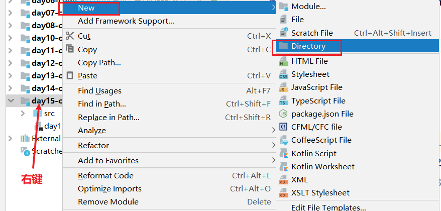
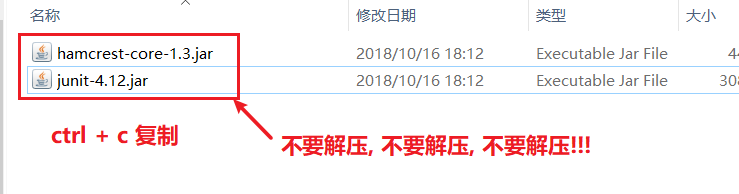
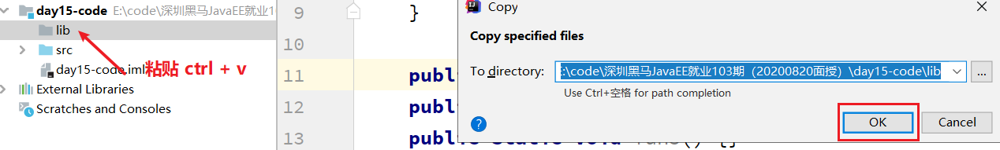
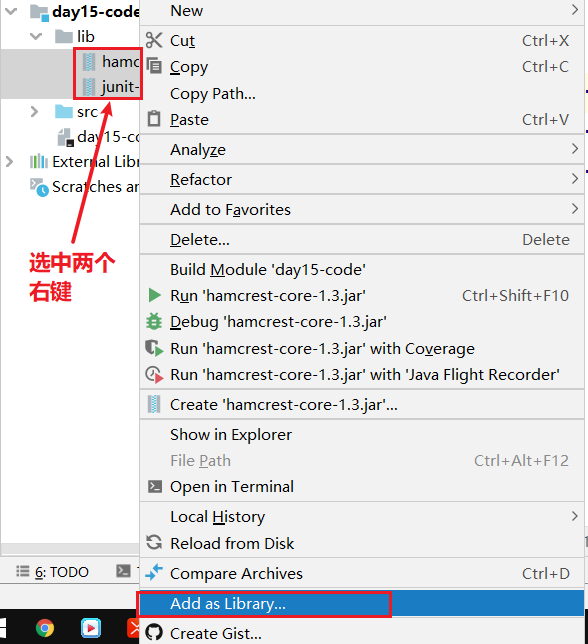
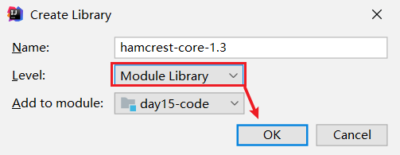

# day13【JUnit单元测试、反射、注解、动态代理】

# 学习目标 

- [ ] 能够使用Junit进行单元测试
- [ ] 能够通过反射技术获取Class字节码对象
- [ ] 能够通过反射技术获取构造方法对象，并创建对象。
- [ ] 能够通过反射获取成员方法对象，并且调用方法。
- [ ] 能够通过反射获取属性对象，并且能够给对象的属性赋值和取值。
- [ ] 能够说出注解的作用 
- [ ] 能够自定义注解和使用注解
- [ ] 能够说出常用的元注解及其作用
- [ ] 能够解析注解并获取注解中的数据
- [ ] 能够完成注解的MyTest案例
- [ ] 能够说出动态代理模式的作用
- [ ] 能够使用Proxy的方法生成代理对象

# 第一章 Junit单元测试【会用】

## 目标

之前我们一直使用主方法来运行程序, 在这种情况下如果有多个方法需要分别运行就会出现操作上的麻烦, 所以今天我们来学习一下Junit单元测试, 它不仅可以让我们随时运行任意一个方法, 还给我们提供了一些其他的操作.

## 路径

- Junit概述
- Junit使用

## 讲解

### **Junit使用步骤**

**第一步**



**第二步**


**第三步**



**第四步**



**第五步**



**第六步**

### 1.1 Junit概述

```java
Junit是什么
    *  Junit是Java语言编写的第三方单元测试框架(工具类)
    *  类库 ==> 类  junit.jar

单元测试概念
    * 单元：在Java中，一个类就是一个单元
    * 单元测试：程序猿编写的一小段代码，用来对某个类中的某个方法进行功能测试或业务逻辑测试。

Junit单元测试框架的作用
    * 用来对类中的方法功能进行有目的的测试，以保证程序的正确性和稳定性。
    * 能够让方法独立运行起来。

Junit单元测试框架的使用步骤
    * 编写业务类，在业务类中编写业务方法。比如增删改查的方法
    * 编写测试类，在测试类中编写测试方法，在测试方法中编写测试代码来测试。
        * 测试类的命名规范：以Test开头，以业务类类名结尾，使用驼峰命名法
            * 每一个单词首字母大写，称为大驼峰命名法，比如类名，接口名...
            * 从第二单词开始首字母大写，称为小驼峰命名法，比如方法命名
            * 比如业务类类名：ProductDao，那么测试类类名就应该叫：TestProductDao
        * 测试方法的命名规则：以test开头，以业务方法名结尾
            * 比如业务方法名为：save，那么测试方法名就应该叫：testSave

测试方法注意事项
    * 必须是public修饰的，没有返回值，没有参数
    * 必须使注解@Test修饰

如何运行测试方法
    * 选中方法名 --> 右键 --> Run '测试方法名'  运行选中的测试方法
    * 选中测试类类名 --> 右键 --> Run '测试类类名'  运行测试类中所有测试方法
    * 选中模块名 --> 右键 --> Run 'All Tests'  运行模块中的所有测试类的所有测试方法

如何查看测试结果
    * 绿色：表示测试通过
    * 红色：表示测试失败，有问题

Junit常用注解(Junit4.xxxx版本)
    * @Before：用来修饰方法，该方法会在每一个测试方法执行之前执行一次。
    * @After：用来修饰方法，该方法会在每一个测试方法执行之后执行一次。
    * @BeforeClass：用来静态修饰方法，该方法会在所有测试方法之前执行一次。
    * @AfterClass：用来静态修饰方法，该方法会在所有测试方法之后执行一次。

Junit常用注解(Junit5.xxxx版本)
     * @BeforeEach：用来修饰方法，该方法会在每一个测试方法执行之前执行一次。
     * @AfterEach：用来修饰方法，该方法会在每一个测试方法执行之后执行一次。
     * @BeforeAll：用来静态修饰方法，该方法会在所有测试方法之前执行一次。
     * @AfterAll：用来静态修饰方法，该方法会在所有测试方法之后执行一次。
```

### 1.2 Junit的使用

- 示例代码

```java
/**
 业务类：实现加减乘除运算
 */
public class Cacluate {
    /*
     业务方法1：求a和b之和
     */
    public int sum(int a,int b){
        return  a + b + 10;
    }
    /*
     业务方法2:求a和b之差
     */
    public int sub(int a,int b){
        return  a - b;
    }
}

public class TestCacluate {

    static Cacluate c = null;

    @BeforeClass // 用来静态修饰方法，该方法会在所有测试方法之前执行一次。
    public static void init(){
        System.out.println("初始化操作");
        // 创建Cacluate对象
        c = new Cacluate();
    }

    @AfterClass // 用来静态修饰方法，该方法会在所有测试方法之后执行一次。
    public static void close(){
        System.out.println("释放资源");
        c = null;
    }

   /* @Before // 用来修饰方法，该方法会在每一个测试方法执行之前执行一次。
    public void init(){
        System.out.println("初始化操作");
        // 创建Cacluate对象
        c = new Cacluate();
    }

    @After // 用来修饰方法，该方法会在每一个测试方法执行之后执行一次。
    public void close(){
        System.out.println("释放资源");
        c = null;
    }*/

    @Test
    public void testSum(){
        int result = c.sum(1,1);
        /*
            断言：预习判断某个条件一定成立，如果条件不成立，则直接奔溃。
            assertEquals方法的参数
            (String message, double expected, double actual)
            message： 消息字符串
            expected: 期望值
            actual: 实际值
         */
        // 如果期望值和实际值一致，则什么也不发生，否则会直接奔溃。
        Assert.assertEquals("期望值和实际值不一致",12,result);
        System.out.println(result);
    }

    @Test
    public void testSub(){
        // 创建Cacluate对象
        // Cacluate c = new Cacluate();

        int result = c.sub(1,1);
        // 如果期望值和实际值一致，则什么也不发生，否则会直接奔溃。
        Assert.assertEquals("期望值和实际值不一致",0,result);
        System.out.println(result);
    }
}
```

## 小结

# 第二章-反射【重点！！！】

### 类加载的过程

> 类加载器:
>
> **应用程序类加载器(Application ClassLoader)**
>
> **扩展类加载器(Extension ClassLoader)**
>
> - JKD1.9之后为PlatformClassLoader
>
> **启动类加载器(Bootstrap ClassLoader)**

**类加载过程**

- 编写出来的`.java`文件,
- 使用`javac`命令 , 编译成`.class` 字节码文件
- 使用`java`命令, 运行字节码文件 -> 将字节码文件加载进内存 -> **Class**类型的对象

**类加载的时机**

- 直接创建对象
- 使用类方法
- 使用类变量
- 使用反射创建对象
- 使用java命令
- 使用它的子类

## 知识点-反射概述   

### 目标

- 掌握什么是反射, 知道反射的应用场景

### 路径

- 什么是反射
- 反射的应用场景

### 讲解

#### 什么是反射

​	反射是一种机制/功能，利用该机制/功能可以在==程序运行==过程中对类进行解剖并操作类中的构造方法，成员方法，成员属性。

​	反射乃框架之灵魂

​	反射就是把Java的各种成分(字段,方法)映射成相应的Java类.  

#### 反射的应用场景

1. 开发工具中写代码时的提示


​	开发工具之所能够把该对象的方法和属性展示出来就使用利用了反射机制对该对象所有类进行了解剖获取到了类中的所有方法和属性信息，这是反射在IDE中的一个使用场景。

2. 各种框架的设计


以上三个图标上面的名字就是Java的三大框架，简称SSH。

这三大框架的内部实现也大量使用到了反射机制，所以要想学好这些框架，则必须要求对反射机制熟练了

### 小结


## 知识点-字节码对象

- 准备工作,创建Student

```java
public class Student {
	
	private String  name;
	private int age;
	private String sex;
	private Date birth;
	
	private String grade;

	
	public Student() {
	}
	

	public Student(String name, int age, String sex) {
		
		this.name = name;
		this.age = age;
		this.sex = sex;
	}
	
	

	public Student(String name, int age, String sex, Date birth) {
		this.name = name;
		this.age = age;
		this.sex = sex;
		this.birth = birth;
	}


	public void speak(){
		System.out.println("hello...");
	}
	
	private void speak(String name){
		System.out.println("你好,我的名字是:"+name);
	}
	
	public void speak(String name,int age){
		System.out.println("你好,我的名字是:"+name+",我"+age+"了");
	}

	
	
	public String getName() {
		return name;
	}


	public void setName(String name) {
		this.name = name;
	}


	public int getAge() {
		return age;
	}


	public void setAge(int age) {
		this.age = age;
	}


	public String getSex() {
		return sex;
	}


	public void setSex(String sex) {
		this.sex = sex;
	}


	public Date getBirth() {
		return birth;
	}


	public void setBirth(Date birth) {
		this.birth = birth;
	}

	
	public static void main(String[] args) {
		for (String arg : args) {
			System.out.println("arg="+arg);
		}
	}

}
```

### 目标

- 能够通过反射技术获取Class字节码对象

### 路径

- 获得Class的三种方法
- 获取Class对象的信息

### 讲解

#### 获得Class的三种方法

- 对象.getClass()
- 使用Class类的forName("类的全限定名")  最常见的方式
- 使用“类.class”

```
   //a. 获得字节码对象
    public void fun01() throws Exception {
        //1. 对象.getClass()
        Student student = new Student();
        Class clazz = student.getClass();

        //2. Class.forName("类的全限定名");
        Class clazz02 = Class.forName("com.itheima.bean.Student");

        //3. 类.class(JDBCTemplate里面就用过)
        Class clazz03 =  Student.class;

    }
```

#### 获取Class对象的信息

- 获取简单类名

```
String getSimpleName(); 获取简单类名，只是类名，没有包
```

- 获取完整类名

```
String getName(); 获取完整类名，包含包名 + 类名
```

- 创建对象(依赖无参构造)

```
T newInstance() ; 创建此 Class对象所表示的类的一个新实例。
```

示例代码

```
   //b. 字节码对象里面常见的方法
    public void fun02() throws Exception {
        //1. Class.forName("类的全限定名");
        //Class clazz = Class.forName("com.itheima.bean.Student");
        Class clazz = Student.class;
        //2. 获得类名(简单类名) Student
        System.out.println(clazz.getSimpleName());
        //3. 获得完整的类名 com.itheima.bean.Student
        System.out.println(clazz.getName());

        //4. 通过字节码创建对象(要求: 依赖的是无参构造)-- new Student();
        Student student = (Student) clazz.newInstance();
        student.speak();
    }
```

### 小结

## 知识点-构造函数的反射

### 目标

- 能够通过反射技术获取构造方法对象，并创建对象。

### 路径

- 概述
- Class类中与Constructor相关方法

### 讲解

#### 概述

​	Constructor是构造方法类，类中的每一个构造方法都是Constructor的对象，通过Constructor对象可以实例化对象。


#### Class类中与Constructor相关方法

```java
clazz.getDeclaredConstructors();  //获得所有的构造方法(包含私有的)
clazz.getConstructor(Class... paramType); //获得特定的构造方法
constructor.newInstance(Object...params);// 根据构造方法创建对象
```

示例代码

```java
 //c. 反射构造方法
    public void fun03() throws Exception {
        //1. Class.forName("类的全限定名");
        Class clazz = Class.forName("com.itheima.bean.Student");

        //2. 获得所有的构造方法(包含私有的)
        Constructor[] constructors = clazz.getDeclaredConstructors();
        System.out.println(constructors.length);

        //3. 反射获得某一个特定的构造方法
        //eg:  public Student(String name, int age, String sex)
        Constructor constructor = clazz.getConstructor(String.class, int.class, String.class);
        Student student = (Student) constructor.newInstance("张三",18,"男");//根据构造方法创建一个对象
        System.out.println(student.getAge());

    }
```

### 小结


## 知识点-字段的反射

### 目标

- 能够通过反射获取属性对象，并且能够给对象的属性赋值和取值。

### 路径

- 概述
- Class类中与Field相关方法
- Field类中常用方法

### 讲解

#### 概述

Field是属性类，类中的每一个属性都是Field的对象，通过Field对象可以给对应的属性赋值和取值。


#### Class类中与Field相关方法

```java
1. Field[] getFields()
获取所有的public修饰的属性对象，返回数组

2. Field[] getDeclaredFields()
获取所有的属性对象，包括private修饰的，返回数组

3. Field getField(String name)
根据属性名获得属性对象，只能获取public修饰的

4. Field getDeclaredField(String name)
根据属性名获得属性对象，包括private修饰的
```

#### Field类中常用方法

```java
set(obj,value);通用方法都是给对象obj的属性设置使用
get(obj); 通用方法是获取对象obj对应的属性值的
void setAccessible(true);暴力反射，设置为可以直接访问私有类型的属性
```

示例代码

```java
    //d. 反射字段
    public void fun04() throws Exception {
        Student student = new Student("张三", 18, "男");

        //1. Class.forName("类的全限定名");
        Class clazz = Class.forName("com.itheima.bean.Student");

        //2. 获得所有的字段(包含私有的)
        Field[] fields = clazz.getDeclaredFields();
        //System.out.println(fields.length);
        for (Field field : fields) {
            //取值
            //field.get()
            //设置值
            //field.set();
        }
        //3.  获得某一个特定的字段   String  name;
        Field nameFiled = clazz.getDeclaredField("name");
        nameFiled.setAccessible(true);//暴力破解(可以访问私有的字段或者方法)
        //取值
        Object nameValue = nameFiled.get(student);
        System.out.println(nameValue);

        //赋值
        nameFiled.set(student,"李四");

        System.out.println(student.getName());

    }
```

### 小结


## 知识点-方法的反射

### 目标

- 能够通过反射获取成员方法对象，并且调用方法。

### 路径

- 概述
- Class类中与Method相关方法
- Method类中常用方法

### 讲解

#### 概述

Method是方法类，类中的每一个方法都是Method的对象，通过Method对象可以调用方法。


#### Class类中与Method相关方法

```
1. Method[] getMethods()
获取所有的public修饰的成员方法，包括父类中

2. Method[] getDeclaredMethods()
获取当前类中所有的方法，包含私有的，不包括父类中

3. Method getMethod("方法名", 方法的参数类型... 类型)
根据方法名和参数类型获得一个方法对象，只能是获取public修饰的

4. Method getDeclaredMethod("方法名", 方法的参数类型... 类型)
根据方法名和参数类型获得一个方法对象，包括private修饰的
```

#### Method类中常用方法

```
1. Object invoke(Object obj, Object... args)
根据参数args调用对象obj的该成员方法
如果obj=null，则表示该方法是静态方法

2. void setAccessible(true)
暴力反射，设置为可以直接调用私有修饰的成员方法
```

示例代码

```java
    @Test
    //d. 反射方法
    public void fun05() throws Exception {
        //1. 获得字节码
        Class clazz = Class.forName("com.itheima.bean.Student");
        //2. 获得公共的方法(包含父类的)
        Method[] methods = clazz.getMethods();
        for (Method method : methods) {
            //System.out.println("方法名="+method.getName());
        }

        //3. 获得所有的方法(包含私有的,但是不包含父类的)
        Method[] declaredMethods = clazz.getDeclaredMethods();
        for (Method method : declaredMethods) {
            //System.out.println("方法名="+method.getName());
        }

        //4. 反射某一个特点的方法
        //eg:public void speak()
        Method method = clazz.getMethod("speak");
        //method.invoke(clazz.newInstance());
        //eg:   private void speak(String name)
        Method declaredMethod = clazz.getDeclaredMethod("speak", String.class);
        declaredMethod.setAccessible(true);//暴力破解
        declaredMethod.invoke(clazz.newInstance(),"李四");

    }
```

### 小结


# 第三章-注解【理解】

## 知识点-注解概述

### 目标

- 掌握什么是注解, 注解的作用

### 路径

- 注解概述
- 注解的作用

### 讲解

#### 注解概述

​	annotation,是一种代码级别的说明,和类 接口平级关系.

​	注解（Annotation）相当于一种标记，在程序中加入注解就等于为程序打上某种标记，以后，javac编译器、开发工具和其他程序可以通过反射来了解你的类及各种元素上有无标记，看你的程序有什么标记，就去干相应的事，标记可以加在包、类，属性、方法，方法的参数以及局部变量上定义

#### 注解的作用

​	执行编译期的检查 例如:@Override   

​	分析代码(主要用途:替代配置文件);   用在框架里面, 注解开发

### 小结

1. 注解相当于一个标记, 没有具体的功能的,这个功能需要定义
2. 我们为什么要学习注解?  后面框架里面有注解开发, 通过注解来代替配置文件, 为后面课做准备的

## 知识点-JDK提供的三个基本的注解

### 目标

- 掌握JDK中提供的三个基本的注解

### 路径

- 三个基本的注解

### 讲解

​	@Override:描述方法的重写.

​	@SuppressWarnings:压制警告.

​	@Deprecated:标记过时

​    @FunctionalInterface: 函数式接口

### 小结

1. @Override: 重写父类的方法
2. @SuppressWarnings: 压制警告
3. @Deprecated: 标记方法的过时


## 知识点-自定义注解

### 目标

- 掌握自定义注解的语法和注解属性

### 路径

- 自定义注解语法
- 注解属性

### 讲解

#### 自定义注解语法

​	定义一个类:class

​	定义一个接口:interface

​	定义一个枚举:enum  

​	定义一个注解:@interface  

​	本质上就是一个接口,接口中可以定义变量(常量)和方法(抽象),注解中的方法叫注解属性

```
语法:  @interface 注解名{}
```

- 示例代码

```java
/**
 * 定义了注解
 *
 */
public @interface Annotation01 {

}
```

#### 注解属性

##### 1. 属性类型

​	1.基本类型

​	2.String

​	3.枚举类型

​	4.注解类型

​	5.Class类型  

​	6.以上类型的一维数组类型  

**注意:**

​	一旦注解有属性了,使用注解的时候,属性必须有值  

- 示例代码

```java
/**
 *注解的属性; 格式和接口的方法很类似 
 *	1.基本类型
	2.String
	3.枚举类型
	4.注解类型
	5.Class类型  
	6.以上类型的一维数组类型  

 */
public @interface Annotation02 {
	int a();//基本类型
	
	String b();//String
	
	Color c();//枚举类型
	
	Annotation01 d();//注解类型
	
	Class e();//Class类型  
	
	String[] f();//一维数组类型 
	
}
```

##### 2. 注解属性赋值

- 格式

  ```
  @注解名(属性名=值,属性名2=值2)  eg:@MyAnnotation3(i = 0,s="23")
  ```

##### 3. 属性赋值的特殊情况

- **若属性类型的一维数组的时候,当数组的值只有一个的时候可以省略{}**

  ```
  @MyAnnotation4(ss = { "a" })
  @MyAnnotation4(ss = "a")
  ```

- **若属性名为value的时候,且只有这一个属性需要赋值的时候可以省略value**【重点】

- 注解属性可以有默认值

  ```
  属性类型 属性名() default 默认值;
  ```

### 小结


## 知识点-元注解

### 目标

- 能够说出常用的元注解及其作用

### 路径

- 什么是元注解
- 常见的元注解

### 讲解

#### 什么是元注解

​	定义在注解上的注解

#### 常见的元注解

​	@Target:定义该注解作用在什么上面(位置),==默认注解可以在====任何位置==. 值为:ElementType的枚举值

​		METHOD:方法

​		TYPE:类 接口

​		FIELD:字段

​		CONSTRUCTOR:构造方法声明

​	@Retention:定义该注解保留到那个代码阶段, 值为:RetentionPolicy类型,==默认只在源码阶段保留==

​		SOURCE:只在源码上保留(默认)

​		CLASS:在源码和字节码上保留

​		RUNTIME:在所有的阶段都保留 

.java (源码阶段) ----编译---> .class(字节码阶段) ----加载内存--> 运行(RUNTIME)

eg:

```java
@Target(value = {ElementType.METHOD,ElementType.TYPE  })
@Retention(value = RetentionPolicy.RUNTIME)
public @interface MyAnnotation03 {
	int a();
	String b();
}
```

### 小结

## 知识点-注解解析

### 目标

- 掌握常见注解解析方法

### 路径

- 使用注解解析

### 讲解

java.lang.reflect.AnnotatedElement

- **T getAnnotation(Class<T>annotationType):得到指定类型的注解引用。没有返回null。**

- **boolean isAnnotationPresent(Class<?extends Annotation> annotationType)**：判断指定的注解有没有。

  Class、Method、Field、Constructor等实现了AnnotatedElement接口.

- Annotation[] getAnnotations()：得到所有的注解，包含从父类继承下来的。

- Annotation[] getDeclaredAnnotations()：得到自己身上的注解。

```java
public @interface Annotation01(){
  
}

@Annotation01
class Demo01(){
  
  	@Annotation01
  	public void fun01(){
      
  	}
  
    public void fun02(){
      
  	}
}

//1.获得Demo01字节码对象
Class clazz =  Demo01.class;
//2. 获得Demo01上面的注解对象
Annotation01 annotation01 = clazz.getAnnotation(Annotation01.class);
//3.反射获得fun01()方法对象
Method method =  clazz.getMethod("fun01");
//4.判断fun01()方法上面是否有@Annotation01注解
boolean flag = method.isAnnotationPresent(Annotation01.class);


```

### 小结


## 案例-完成注解的MyTest案例 

### 需求

​	在一个类(测试类,TestDemo)中有三个方法,其中两个方法上有@MyTest,另一个没有.还有一个主测试类(MainTest)中有一个main方法.  在main方法中,让TestDemo类中含有@MyTest方法执行.   自定义@MyTest, 模拟单元测试.

```
class TestDemo{
	@MyTest
	public void fun01(){
		
	}
	
	@MyTest
	public void fun02(){
		
	}
	public void fun03(){
		
	}

}

class MainTest{
	... main(){
		//1.获得TestDemo字节码对象
		//2.反射获得TestDemo里面的所有的方法
		//3.遍历这些方法. 判断是否有@MyTest
		//4.有就执行
	
	}

}
```


### 思路分析

1. 定义两个类和一个注解

2. 在MainTest的main()方法里面:

   ​	//1.获得TestDemo字节码对象
   ​	//2.反射获得TestDemo里面的所有的方法
   ​	//3.遍历这些方法. 判断是否有@MyTest(isAnnotationPresent)
   ​	//4.有就执行(method.invoke())

   

### 代码实现

- MyTest.java

```java
@Target(value = {ElementType.METHOD  })
@Retention(value = RetentionPolicy.RUNTIME)
public @interface MyTest {

}
```

- TestDemo.java

```java
public class TestDemo {
	@MyTest
	public void fun01(){
		System.out.println("fun01 执行了 ....");
	}
	
	@MyTest
	public void fun02(){
		System.out.println("fun02 执行了 ....");
	}
	
	public void fun03(){
		System.out.println("fun03 执行了 ....");
	}
}
```

- MainDemo.java

```java
public class MainDemo {

	public static void main(String[] args) throws Exception {
		//1.得到TestDemo的字节码对象
		Class clazz = Class.forName("com.itheima.mytest.TestDemo");
		//2. 得到TestDemo所有的方法对象(数组)
		Method[] methods = clazz.getDeclaredMethods();
		//3.  遍历方法对象数组, 判断是否有@MyTest注解
		for (Method method : methods) {
			boolean flag = method.isAnnotationPresent(MyTest.class);
			if(flag){
				//4.有的话就执行
				method.invoke(clazz.newInstance());//clazz.newInstance():依赖的是无参的构造方法
				
			}
		}
	

	}

}
```

### 4.小结


# 第四章 动态代理 【重点，今天理解为主】

## 目标

为什么要有“代理”？生活中就有很多例子，例如委托业务等等，**代理就是被代理者没有能力或者不愿意去完成某件事情，需要找个人代替自己去完成这件事**，这才是“代理”存在的原因。例如，我现在需要出国，但是我不愿意自己去办签证、预定机票和酒店（觉得麻烦 ，那么就可以找旅行社去帮我办，这时候旅行社就是代理，而我自己就是被代理了。

## 路径

- 动态代理概述
- 案例引出
- 使用动态代理优化代码
- 重点类和方法

## 讲解

### 4.1  动态代理概述

​			动态代理简单来说是：**拦截对真实对象方法的直接访问，增强真实对象方法的功能**

​			动态代理详细来说是：代理类在程序运行时创建的代理对象被称为动态代理，也就是说，这种情况下，代理类并不是在Java代码中定义的，而是在运行时根据我们在Java代码中的“指示”动态生成的。也就是说你想获取哪个对象的代理，动态代理就会动态的为你生成这个对象的代理对象。**动态代理可以对被代理对象的方法进行增强**，**可以在不修改方法源码的情况下，增强被代理对象方法的功能**，**在方法执行前后做任何你想做的事情**。动态代理技术都是在框架中使用居多，例如：Struts1、Struts2、Spring和Hibernate等后期学的一些主流框架技术中都使用了动态代理技术。

### 4.2 案例引出

​	现在，假设我们要实现这样的需求：在企业的大型系统中，每个业务层方法的执行，都需要有对应的日志记录，比如这个方法什么时候调用完成的，耗时多久等信息，根据这些日志信息，我们可以看到系统执行的情况，尤其是在系统出现错误的时候，这些日志信息就显得尤为重要了。现在有一种实现思路是这样的，业务层实现类代码如下：

```java
public interface SchoolService{
     String login(String loginName, String passWord);
   	 String getAllClazzs()；
}


public class SchoolServiceImpl implements SchoolService {

	@Override
	public String login(String loginName, String passWord) {
		
		// 方法执行的开始时间点
		long startTimer = System.currentTimeMillis();
		
		try {
			Thread.sleep(500);
			if("admin".equals(loginName) && "123456".equals(passWord)){
				return "success";
			}
		} catch (Exception e) {
			throw new RuntimeException("登录异常");
		}
		long endTimer = System.currentTimeMillis();
		// 在什么时刻执行完，花费了多长时间完成
		SimpleDateFormat sdf = new SimpleDateFormat("yyyy-MM-dd HH:mm:ss");
		System.out.println("login方法执行->"+sdf.format(endTimer)+"，耗时："+(endTimer - startTimer));
		
		return "登录名称或者密码不正确";
	}

	@Override
	public String getAllClazzs() {
		// 时间点
		long startTimer = System.currentTimeMillis();
		try {
			Thread.sleep(1000);
			return "返回了所有的班级(1班，2班，3班)";
		} catch (Exception e) {
			throw new RuntimeException("查询班级异常");
		}finally{
			long endTimer = System.currentTimeMillis();
			// 在什么时刻执行完，花费了多长时间完成
			SimpleDateFormat sdf = new SimpleDateFormat("yyyy-MM-dd HH:mm:ss");
			System.out.println("getAllClazzs方法执行->"+sdf.format(endTimer)+"，耗时："+(endTimer - startTimer));
		}
	}
}
```

.

​		我们在业务层的方法每次执行的时候都去记录了开始时间和结束时间，这样虽然可以记录每个方法运行的截止时间和耗时情况，但是代码显得很臃肿，这些日记记录代码本身也是与业务功能无关的代码。

### 4.3 使用动态代理优化代码

​	**那么有没有一种方式可以解决这个问题呢？**

​		**动态代理就是解决此类问题非常好的实现手段，通过动态代理我们可以为该业务层实现类对象提供一个动态的代理对象。该代理对象，可以为实现类的所有方法进行代理，并对代理的方法功能进行增强。也就是说只要调用了被代理实现类对象的方法，该方法的执行会先进入到代理对象中去，代理对象可以在该方法执行前记录开始时间，然后去触发该方法的执行，在方法执行完成以后再由代理对象去记录结束时间然后计算时间差作为日志记录，因为方法的日记记录由代理完成了，所以被代理对象的方法就无需自己单独记录日志操作了。这样就产生了一种非常好的设计模型。**

现在我们来使用动态代理写一个日志记录的代理类：

代码如下：

```java
public class LogProxy {
	// 提供一个方法，用于生产需要被代理对象的代理对象。
	public static Object getProxy(Object obj) {
		return Proxy.newProxyInstance(obj.getClass().getClassLoader(), obj
				.getClass().getInterfaces(), new InvocationHandler() {

			@Override
			public Object invoke(Object proxy, Method method, Object[] args)
					throws Throwable {
				// 先记录开始时间点
				long startTimer = System.currentTimeMillis();
				try {
                       // 真正去触发被代理对象中该方法的执行
					return method.invoke(obj, args);
				} catch (Exception e) {
					throw new RuntimeException(e);
				} finally {
					long endTimer = System.currentTimeMillis();
					// 在什么时刻执行完，花费了多长时间完成
					SimpleDateFormat sdf = new SimpleDateFormat(
							"yyyy-MM-dd HH:mm:ss");
					System.out.println(method.getName() + "方法执行->"
							+ sdf.format(endTimer) + "，耗时："
							+ (endTimer - startTimer));
				}
			}
		});
	}

}
```

### 4.4 重点类和方法

在上述代码中 getProxy 方法即是用于获取某个实现类对象的一个代理对象。在该代码中，如果要了解 Java 动态代理的机制，首先需要了解以下相关的类或接口：

java.lang.reflect.Proxy：这是 Java 动态代理机制的主类，它提供了一个静态方法来为一组接口的实现类动态地生成代理类及其对象。

**newProxyInstance方法的三个参数的详解:**

该方法用于为指定类装载器、一组接口及调用处理器生成动态代理类实例

```java
public static Object newProxyInstance(ClassLoader loader, Class[] interfaces, InvocationHandler h)

1、obj.getClass().getClassLoader()目标对象通过getClass方法获取类的所有信息后，调用getClassLoader() 方法来获取类加载器。获取类加载器后，可以通过这个类型的加载器，在程序运行时，将生成的代理类加载到JVM即Java虚拟机中，以便运行时需要！ 

2、obj.getClass().getInterfaces()获取被代理类的所有接口信息，以便于生成的代理类可以具有代理类接口中的所有方法。 

3、InvocationHandler 这是调用处理器接口，它自定义了一个 invoke 方法，用于集中处理在动态代理类对象上的方法调用，通常在该方法中实现对委托类方法的处理以及访问.
```

**invoke方法的参数**

```java
public Object invoke(Object proxy, Method method, Object[] args)
1、Object proxy生成的代理对象，在这里不是特别的理解这个对象，但是个人认为是已经在内存中生成的proxy对象。 
2、Method method：被代理的对象中被代理的方法的一个抽象。
3、Object[] args：被代理方法中的参数。这里因为参数个数不定，所以用一个对象数组来表示。
```

​	代理类定义完成以后业务层实现类的方法就无需再自己申明日记记录的代码了，因为代理对象会帮助做日志记录，修改后实现类代码如下：

```java
public class SchoolServiceImpl implements SchoolService {

	@Override
	public String login(String loginName, String passWord) {
		try {
			Thread.sleep(500);
			if("admin".equals(loginName) && "123456".equals(passWord)){
				return "success";
			}
		} catch (Exception e) {
			throw new RuntimeException("登录异常");
		}
		return "登录名称或者密码不正确";
	}

	@Override
	public String getAllClazzs() {
		try {
			Thread.sleep(1000);
			return "返回了所有的班级(1班，2班，3班)";
		} catch (Exception e) {
			throw new RuntimeException("查询班级异常");
		}
	}
}
```

开始使用动态代理去访问方法：

```java
public class TestMain {
	public static void main(String[] args) {
		// 获取业务层实现类对象的代理对象，那么业务层实现类对象就会被代理了
		SchoolService schoolService = (SchoolService) LogProxy.getProxy(new 	SchoolServiceImpl());
		
		System.out.println(schoolService.login("admin", "1234256"));
		
		System.out.println(schoolService.getAllClazzs());
	
	}
}
```

​		此代码中业务层对象已经是被代理的了，那么以后调用业务层对象的方法时，方法的调用会先被代理对象处理，代理会先记录方法执行的开始时间，然后通过method.invoke(obj, args)去真正触发该方法的执行，接下来代理对象进行方法结束时间的记录和日志的输出即可。这样整个过程就通过代理完美的实现了。

## 总结

动态代理非常的灵活，可以为任意的接口实现类对象做代理

动态代理可以为被代理对象的所有接口的所有方法做代理，动态代理可以在不改变方法源码的情况下，实现对方法功能的增强，

动态代理类的字节码在程序运行时由Java反射机制动态生成，无需程序员手工编写它的源代码。 
动态代理类不仅简化了编程工作，而且提高了软件系统的可扩展性，因为Java 反射机制可以生成任意类型的动态代理类。

动态代理同时也提高了开发效率。

缺点：只能针对接口的实现类做代理对象，普通类是不能做代理对象的。
