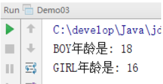

# day15 单例模式、多例模式、枚举、工厂模式

```java
XML
    作用: 配置文件(XML), 数据传输(json)
	组成: 文档声明, 元素(标签), 属性, 注释, 转义字符, CDATA区
    <!-- 注释 -->
        <a id = "1">
        	<b>哈哈!~</b>
        </a>
        
    XML:  DTD, Schema
        
    DOM : DOM树
    Document -> 根元素 -> 子元素(属性) -> 文本
        
Dom4j : 4(for)    2(to)
    
    SAXReader : 
		空参构造
        Document read(输入流)
    Document :
		Element getRootElement()
    Element  :
		List<Element> elements([String eleName])
        Element element([String eleName])
        getName() : 获取元素名
        getText() : 获取元素中的文本
        attributeValue(String attrName) : 获取指定属性名对应的属性值
            
    XPath :
		Documet : selectSingleNode("Xpath表达式")
            	  selectNodes("XPat表达式")
            
正则表达式:
	就是带有规则的字符串, 对其他字符串进行匹配
        
字符类: 单个字符
    [abc], [^abc], [a-z], [a-z[^def]]
预定义字符类:
	.  , \d:[0-9]  , \w: [a-zA-Z_0-9]
数量词:
    X? : 0, 1
    X* : 0 ~ n
    X+ : 1 ~ n
    {n}
    {n,}
    {n,m}
分组:
    ()就是一组
    \\1 : 让第一组中的内容再出现一次
        
String:
	split("正则表达式")
    replaceAll("正则表达式", "替换的字符串")
```

## 教学目标

- [ ] 能够说出单例设计模式的好处
- [ ] 能够说出多例模式的好处
- [ ] 能够定义枚举
- [ ] 能够使用工厂模式编写java程序

# 第一章 单例设计模式【重点】

## 知识点 - 1.1 单例设计模式的概述

### 目标

正常情况下一个类可以创建多个对象

```java
public static void main(String[] args) {
	// 正常情况下一个类可以创建多个对象
	Person p1 = new Person();
	Person p2 = new Person();
	Person p3 = new Person();
}
```

但是有些时候的某些类, 我们希望只能创建单一的一个对象, 这时候我们需要使用到单例设计模式, 下面我们来介绍一下单例设计模式.

### 路径

- 单例设计模式的介绍
- 单例设计模式的作用

### 讲解

**单例设计模式的介绍**

单例模式（Singleton Pattern）是 Java 中最简单的设计模式之一。这种类型的设计模式属于创建型模式，它提供了一种创建对象的最佳方式。

这种模式涉及到一个单一的类，该类负责创建自己的对象，同时确保只有单个对象被创建。这个类提供了一种访问其唯一的对象的方式，可以直接访问，不需要实例化该类的对象。

**单例设计模式的作用**

- 目的: 保证一个类仅有一个实例，并提供一个访问它的全局访问点。
- 解决的问题: 一个全局使用的类频繁地创建与销毁。
- 什么时候使用: 当您想控制实例数目，节省系统资源的时候。


### 小结

## 知识点 - 1.2 饿汉式

### 目标

上面我们了解了什么是单例设计模式,接下来我们来学习一下, 在代码中如何书写出来一个单例设计模式.

### 路径

- 单例设计模式 --- 饿汉式

### 讲解

**单例设计模式的实现步骤**

1. 将构造方法私有化，使其不能在类的外部通过new关键字实例化该类对象。
2. 在该类内部产生一个唯一的实例化对象，并且将其封装为private static类型的成员变量。
3. 定义一个静态方法返回这个唯一对象。

饿汉单例设计模式就是使用类的时候已经将对象创建完毕，不管以后会不会使用到该实例化对象，先创建了再说。很着急的样子，故被称为“饿汉模式”。

代码如下：

```java
public class Singleton {
    // 1.将构造方法私有化，使其不能在类的外部通过new关键字实例化该类对象。
    private Singleton() {}

    // 2.在该类内部产生一个唯一的实例化对象，并且将其封装为private static类型的成员变量。
    private static final Singleton instance = new Singleton();
    
    // 3.定义一个静态方法返回这个唯一对象。
    public static Singleton getInstance() {
        return instance;
    }
}
```

### 小结

## 知识点 - 1.3 懒汉式

### 目标

下面我们再来学习一种单例设计模式的写法

### 路径

- 单例设计模式 --- 懒汉式

### 讲解

懒汉单例设计模式就是调用getInstance()方法时实例才被创建，先不急着实例化出对象，等要用的时候才例化出对象。不着急，故称为“懒汉模式”。

代码如下:

```java
public class Singleton {

    // 2.在该类内部产生一个唯一的实例化对象，并且将其封装为private static类型的成员变量。
    private static Singleton instance;
    
    // 1.将构造方法私有化，使其不能在类的外部通过new关键字实例化该类对象。
    private Singleton() {}
    
    // 3.定义一个静态方法返回这个唯一对象。要用的时候才例化出对象
    public static synchronized Singleton getInstance() {
        if(instance == null) {
            instance = new Singleton();
        }
        return instance;
    }
}
```

### 小结


# 第二章 多例设计模式【了解】

## 目标

之前我们学完了单例设计模式, 接下来我们来看一下多例设计模式.

## 路径

- 多例设计模式的作用
- 实现步骤
- 实现代码
- 测试结果

## 讲解

### 2.1.多例设计模式的作用

多例模式，是一种常用的软件设计模式。通过多例模式可以保证系统中，应用该模式的类有固定数量的实例。多例类要自我创建并管理自己的实例，还要向外界提供获取本类实例的方法。

### 2.2.实现步骤

​	1.创建一个类,  将构造方法私有化，使其不能在类的外部通过new关键字实例化该类对象。

​	2.在类中定义该类被创建的总数量

​	3.在类中定义存放类实例的list集合

​	4.在类中提供静态代码块,在静态代码块中创建类的实例

​	5.提供获取类实例的静态方法

### 2.3.实现代码如下

```java
import java.util.ArrayList;
import java.util.List;
import java.util.Random;
public class Multition {
    // 定义该类被创建的总数量
    private static final int maxCount = 3;
    // 定义存放类实例的list集合
    private static List instanceList = new ArrayList();
    // 构造方法私有化,不允许外界创建本类对象
    private Multition() {
    }
    static {
        // 创建本类的多个实例,并存放到list集合中
        for (int i = 0; i < maxCount; i++) {
            Multition multition = new Multition();
            instanceList.add(multition);
        }
    }
    // 给外界提供一个获取类对象的方法
    public static Multition getMultition(){
        Random random = new Random();
        // 生成一个随机数
        int i = random.nextInt(maxCount);
        // 从list集合中随机取出一个进行使用
        return (Multition)instanceList.get(i);
    }
}
```

### 2.4.测试结果

```java
public static void main(String[] args) {
    // 编写一个循环从中获取类对象
    for (int i = 0; i < 10; i++) {
        Multition multition = Multition.getMultition();
        System.out.println(multition);
    }
}
```


## 小结

多例模式可以保证系统中一个类有固定个数的实例, 在实现需求的基础上, 能够提高实例的复用性.

实现多例模式的步骤：

1. 创建一个类,  将构造方法私有化，使其不能在类的外部通过new关键字实例化该类对象。
2. 在类中定义该类被创建的总数量
3. 在类中定义存放类实例的list集合
4. 在类中提供静态代码块,在静态代码块中创建类的实例
5. 提供获取类实例的静态方法

# 第三章 枚举【会用】

## 知识点 - 3.1 枚举的概述

### 目标

假设我们要定义一个人类，人类中包含姓名和性别。通常会将性别定义成字符串类型，效果如下：

```java
public class Person {
    private String name;
    private String sex;

    public Person() {
    }

    public Person(String name, String sex) {
        this.name = name;
        this.sex = sex;
    }
	
    // 省略get/set/toString方法
}
```

```java
public class Demo01 {
    public static void main(String[] args) {
        Person p1 = new Person("张三", "男");
        Person p2 = new Person("张三", "abc"); // 因为性别是字符串,所以我们可以传入任意字符串
    }
}
```

不使用枚举存在的问题：可以给性别传入任意的字符串，导致性别是非法的数据，不安全。

### 路径

- 枚举的作用与应用场景
- 枚举的基本语法


### 讲解

##### 3.1.1 枚举的作用与应用场景

枚举的作用：一个方法接收的参数是固定范围之内的时候，那么即可使用枚举。

##### 3.1.2 枚举的基本语法

**枚举的概念**

枚举是一种特殊类。枚举是有固定实例个数的类型，我们可以把枚举理解成有固定个数实例的多例模式。

**定义枚举的格式**

```java
enum 枚举名 {
    第一行都是罗列枚举实例,这些枚举实例直接写大写名字即可。
}
```

**入门案例**

1. 定义枚举：BOY表示男，GIRL表示女

```java
enum Sex {
    BOY, GIRL; // 男，女
}
```

2. Perosn中的性别有String类型改为Sex枚举类型

```java
public class Person {
    private String name;
    private Sex sex;

    public Person() {
    }

    public Person(String name, Sex sex) {
        this.name = name;
        this.sex = sex;
    }
    // 省略get/set/toString方法
}
```

3. 使用是只能传入枚举中的固定值

```java
public class Demo02 {
    public static void main(String[] args) {
        Person p1 = new Person("张三", Sex.BOY);
        Person p2 = new Person("张三", Sex.GIRL);
        Person p3 = new Person("张三", "abc");
    }
}
```

##### 3.1.3 枚举的其他内容

枚举的本质是一个类，我们刚才定义的Sex枚举最终效果如下：

```java
enum Sex {
    BOY, GIRL; // 男，女
}

// 枚举的本质是一个类，我们刚才定义的Sex枚举相当于下面的类
final class SEX extends java.lang.Enum<SEX> {
    public static final SEX BOY = new SEX();
    public static final SEX GIRL = new SEX();
    public static SEX[] values();
    public static SEX valueOf(java.lang.String);
    static {};
}
```

枚举的本质是一个类，所以枚举中还可以有成员变量，成员方法等。

```java
public enum Sex {
    BOY(18), GIRL(16);

    public int age;

    Sex(int age) {
        this.age = age;
    }

    public void showAge() {
        System.out.println("年龄是: " + age);
    }
}
```

```java
public class Demo03 {
    public static void main(String[] args) {
        Person p1 = new Person("张三", Sex.BOY);
        Person p2 = new Person("张三", Sex.GIRL);

        Sex.BOY.showAge();
        Sex.GIRL.showAge();
    }
}
```

运行效果：



### 小结

## 知识点 - 3.2 枚举的应用

### 目标

刚才我们学习了枚举的概述, 接下来我们来看一下, 枚举具体的应用方式.

### 路径

- 枚举的应用

### 讲解

**枚举的作用：枚举通常可以用于做信息的分类，如性别，方向，季度等。**

枚举表示性别：

```java
public enum Sex {
    MAIL, FEMAIL;
}
```

枚举表示方向：

```java
public enum Orientation {
    UP, RIGHT, DOWN, LEFT;
}
```

枚举表示季度

```java
public enum Season {
    SPRING, SUMMER, AUTUMN, WINTER;
}
```

### 小结

## 知识点 - 3.3 枚举实现单例设计模式

### 目标

我们学习了枚举之后, 发现枚举的一些特点也可以实现单例, 那么接下来, 我们使用枚举来实现以下单例设计模式.

### 路径

- 枚举实现单例

### 讲解

- 它不仅能避免多线程同步问题，而且还自动支持序列化机制，防止反序列化重新创建新的对象，绝对防止多次实例化。
- 并且这种方式是Effective Java的作者Josh Bloch提倡的使用方式.

```java
public enum Singleton {  
    INSTANCE;  
    public void whateverMethod() {  
    }  
}
```

### 小结


# 第四章 工厂设计模式【理解】

## 知识点 - 4.1 工厂模式的概述

### 目标

工厂模式其实就是用来帮我们创建对象的, 那么它到底有哪些特点, 我们来学习一下.

### 路径

- 工厂模式的介绍
- 工厂模式的作用

### 讲解

**工厂模式的介绍**

工厂模式（Factory Pattern）是 Java 中最常用的设计模式之一。这种类型的设计模式属于创建型模式，它提供了一种创建对象的最佳方式。之前我们创建类对象时, 都是使用new 对象的形式创建, 除new 对象方式以外, 工厂模式也可以创建对象.

**工厂模式的作用**

定义一个创建对象的接口，让其子类自己决定实例化哪一个工厂类，工厂模式使其创建过程延迟到子类进行。可以解决类与类之间耦合的问题.

> 注意事项
>
> 作为一种创建类模式，在任何需要生成复杂对象的地方，都可以使用工厂方法模式。有一点需要注意的地方就是复杂对象适合使用工厂模式，而简单对象，特别是只需要通过 new 就可以完成创建的对象，无需使用工厂模式。如果使用工厂模式，就需要引入一个工厂类，会增加系统的复杂度。

### 小结

## 案例 - 4.2 工厂模式的实现

### 需求

实现工厂设计模式

### 步骤分析

1. 编写一个Car接口, 提供run方法
2. 编写一个Falali类实现Car接口,重写run方法
3. 编写一个Benchi类实现Car接口
4. 提供一个CarFactory(汽车工厂),用于生产汽车对象
5. 定义CarFactoryTest测试汽车工厂

### 代码实现
1.编写一个Car接口, 提供run方法

```java
public interface Car {
    public void run();
}
```

2.编写一个Falali类实现Car接口,重写run方法

```java
public class Falali implements Car {
    @Override
    public void run() {
        System.out.println("法拉利以每小时500公里的速度在奔跑.....");
    }
}
```

3.编写一个Benchi类实现Car接口

```java
public class Benchi implements Car {
    @Override
    public void run() {
        System.out.println("奔驰汽车以每秒1米的速度在挪动.....");
    }
}
```

4.提供一个CarFactory(汽车工厂),用于生产汽车对象

```java
public class CarFactory {
    /**
     * @param id : 车的标识
     *           benchi : 代表需要创建Benchi类对象
     *           falali : 代表需要创建Falali类对象
     *           如果传入的车标识不正确,代表当前工厂生成不了当前车对象,则返回null
     * @return
     */
    public Car createCar(String id){
        if("falali".equals(id)){
            return new Falali();
        }else if("benchi".equals(id)){
            return new Benchi();
        }
        return null;
    }
}
```

5.定义CarFactoryTest测试汽车工厂

```java
public class CarFactoryTest {
    public static void main(String[] args) {
        CarFactory carFactory = new CarFactory();
        Car benchi = carFactory.createCar("benchi");
        benchi.run();
        Car falali = carFactory.createCar("falali");
        falali.run();
    }
}
```

### 小结

# 五 适配器【理解】

- 接口

```java
public interface Monk {

    void seat();

    void speak();

    void eatVegetable();

    void dragTree();

    void eatMeat();

}
```

- 适配器

```java
package _06adapter;

public abstract class MonkAdapter implements Monk {
    @Override
    public void seat() {
    }

    @Override
    public void speak() {
    }

    @Override
    public void eatVegetable() {
    }

    @Override
    public void dragTree() {
    }

    @Override
    public void eatMeat() {
    }
}

```

- 子类1

```java
public class OneRest extends MonkAdapter {
    @Override
    public void seat() {
        System.out.println("打坐");
    }

    @Override
    public void speak() {
        System.out.println("格级格级");
    }

    @Override
    public void eatVegetable() {
        System.out.println("吃素");
    }

}

```


- 子类2

```java
package _06adapter;

public class FlowerMonk extends MonkAdapter {

    @Override
    public void dragTree() {
        System.out.println("倒拔垂杨柳");
    }

    @Override
    public void eatMeat() {
        System.out.println("大口吃肉!~");
    }
}

```


# 六 方法引用【了解】

> 看懂

- 方法引用: 觉得lambda表达式有点复杂!~

- 是对Lambda的简化

**方法引用 -> Lambda  -> 匿名内部类  ->  接口的实现类对象**

### 1. 方法引用的前提

> 不是所有的匿名内部类都可以改成Lambda
>
> 不是多有的lambda都可以改成方法引用!!!

- Lambda表达式中的内容, 是已经定义好的.

```java
fun(s -> System.out.println(s));
// 使用的是println(s) 这个功能, 而这个功能已经定义好了
// 所以可以使用方法引用


fun(s -> System.out.println(s.toUpperCase()));
// 没有类定义好 将字符串转换成大写然后打印 的这个功能
// 所以不能使用方法引用
```

### 2. 格式

```java
A :: B
	A: 谁来用这个已经定义好的功能
    B: 已经定义好的功能
        
使用了A中的B功能  
        
fun(s -> System.out.println(s));
// 改写成方法引用:
fun(System.out::println);
```

