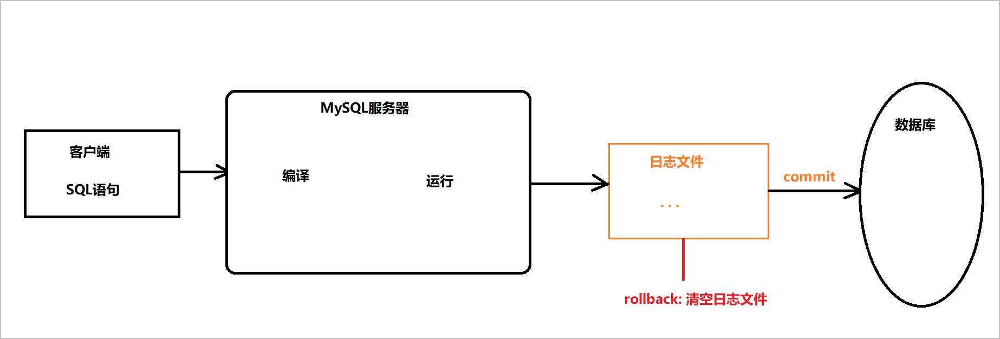

# MySQL进阶

```sql
数据库
	存储数据的仓库, 以一定的规则存储, 使用SQL语句操作.
SQL语句的分类
	DDL: 数据定义语言, 用来定义数据库和表
		create , drop, alter
	DML: 数据操作语言, 用来操作表中的数据(增删改)
		insert into,  delete from , update ... set ... where
    DQL: 数据查询语言, 用来查询表中的数据
    	select
   	DCL: 数据库控制语言, 用来添加删除用户, 管理用户的权限, DBA使用
	
DDL: 
	数据库:
		create database [if not exists] 数据库名 [character set 字符集名];
		drop database [if exists] 数据库名;
		alter database 数据库名 character set 新字符集名;
    表:
    	数据类型:
    		int, double(n, m), char(n), varchar(n), date
    	create table 表名 (字段名 字段类型, 字段名 字段类型 ... );
    	drop table 表名;
    	
    	重命名: rename table 旧表名 to 新表名
    	添加字段: alter table 表名 add 字段名 字段类型
    	修改字段类型: alter table 表名 modify 字段名 新字段类型
    	修改字段名(同时可以修改类型): alter table 表名 change 旧字段名 新字段名 字段类型
    	删除字段: alter table 表名 drop 字段名
DML:
	增 : 
		insert into 表名 values(值1, 值2 ...)
		insert into 表名 (字段1, 字段2 ...) values (值1, 值2 ...)
	删 : delete from 表名 where 条件
	改 : update 表名 set 字段名 = 值 where 条件
	
DQL:
	基本查询
		select * from ...
		select 指定字段 from ...
		select ifnull(字段, 默认值) from ...
		select 运算 from ...
		select [as] 别名 from ...
		select distinct 字段 from ...
    条件查询
    	... where >, <, >=, <=, =, !=, <>
    	... where like '格式'  -- %:任意字符的任意个   _:任意字符的单个
    	... where (and, or, not)
    	... where 字段 between a and b; -- 等效于: ... where 字段 >= a and 字段 <= b;
    	... where in(值1, 值2 ...)
    	... where 字段 is null / is not null
    高级查询
    	排序: order by 排序字段 排序规则
    		asc: 升序, 默认    desc: 降序
    	聚合函数:
    		count(*)
    		max(字段)
    		min(字段)
    		sum(字段)
    		avg(字段)
    	分组:
    		group by 分组字段 having 分组后的过滤条件
    		分组和聚合函数配合使用, 以什么字段分组, 就把什么字段查询出来.
        分页:
        	limit offset, length
        	
        	where id > offset limit length
```

## 一. 约束【理解】

### 1. 主键约束

- 主键：一张表里数据的唯一标识。原则上：每张表必须有主键，且只能有一个主键

- 主键约束(primary key)：

  - 作用：被主键约束的字段，值必须是非空、唯一
  - 语法：`primary key [auto_increment]`

    - 如果主键字段是整数，可以增加`auto_increment`，MySql会自动生成主键值：`1,2,3, ... +1`
    - 如果不是数字，不要增加`auto_increment`

- 自增: auto_increment 的效果:

  - 如果添加的字段是null, 自增
  - 如果不指定这个字段, 自增

- 主键字段效果演示：

  ```mysql
  create table user (
  	id int primary key auto_increment, -- 主键自增
  	name varchar(10) not null, -- 非空
  	email varchar(20) unique, -- 唯一
  	age int default 80 -- 默认值
  );
  ```

### 2. 唯一性约束

- 作用：唯一性约束的字段，值不能重复，但是可以为null
- 语法：`字段名 类型 unique`
- 唯一性约束效果演示：

```sql

```


### 3. 非空约束

- 作用：非空约束的字段，值不能为null
- 语法：`字段名 类型 not null`
- 非空约束效果演示：

```mysql

```

### 4. 默认值约束

- 作用：默认值约束的字段，如果**不指定**值，取默认值（如果指定null值，值就是null，不取默认值）
- 语法：`字段名 类型 default 默认值`
- 默认值约束效果演示：

```mysql

```

### 5. 外键约束		

#### 1. 单表的弊端&为什么要拆表

- 有如下商品表, 观察操作的时候是否会有问题

| 商品编号pid | 商品名称pname | 商品价格price | 商品库存pcount | 商品种类category |
| ----------- | ------------- | ------------- | -------------- | ---------------- |
| 1           | 华为P40       | 5688          | 500            | 手机数码         |
| 2           | 小米12        | 3688          | 800            | 手机数码         |
| 3           | 格力空调      | 2399          | 300            | 大型家电         |
| 4           | 创维电视      | 2099          | 200            | 大型家电         |

**单表中的问题**

- 只想添加商品种类, 而不像添加对应商品
- 修改商品种类, 修改所有的商品
- 删除商品种类, 删除所有商品

**拆表**

- 商品表

| 商品编号pid | 商品名称pname | 商品价格price | 商品库存pcount | cid  |
| ----------- | ------------- | ------------- | -------------- | ---- |
| 1           | 华为P40       | 5688          | 500            | 1    |
| 2           | 小米12        | 3688          | 800            | 1    |
| 3           | 格力空调      | 2399          | 300            | 2    |
| 4           | 创维电视      | 2099          | 200            | 2    |
| 5           | AirJordon23   | 1700          | 10             | 3    |

- 分类表(category)

| 分类cid | 分类名称cname |
| ------- | ------------- |
| 1       | 手机数码      |
| 2       | 大型家电      |

#### 2. 拆表之后的问题

- 删除分类表中的一个分类信息, 商品表中之前有对应分类信息的那些数据, 就变成了脏数据
- 添加商品表中的一个商品, 但是这个商品的cid是分类表不存在, 那这条数据, 就变成了脏数据

**出现问题的原因**

- 拆表之后, 两张表是有联系的, 但是我们没有定义这种联系, 所以出现了问题.

**解决问题**

- 想定义这种联系, 需要使用到外键约束
- 例如: 假设已经添加了外键约束
  - 效果: 删除一个商品表中正在使用的分类信息, 删除失败

#### 3. 外键约束

##### 3.1主表(parent)和从表(child)

- 当表①中的数据是来源于另一张表②, 那我们就可以将表①称之为从表, 表②称之为主表
  - 表能单独存在: 主表
  - 不能丹顿存在: 从表

##### 3.2 外键和外键约束

- 外键: 从表中的某个字段是来源于主表的, 那么这个字段就称之为外键
- 外键约束: 设置成外键的字段, 一定是来源于主表的主键, 让这两个字段产生关联

> 外键字段要指向主表中的 某个字段, 这个字段必须是  主键字段(primary key)  或者是  唯一字段(unique)

- 添加外键约束的格式:

  ```mysql
  constraint 外键约束名 foreign key(外键字段) references 主表名(主键字段)
  ```


- 删除外键约束

  ```mysq
  alter table ... drop foreign key 外键约束名;
  ```

- 添加外键约束

  ```mysql
  alter table ... add constraint 外键约束名 foreign key(外键字段) reference 主表名(主键字段);
  ```

**数据准备**

```mysql
-- 创建分类表
create table category (
    cid int primary key auto_increment,
    cname varchar(20)
);

-- 创建商品表
create table product (
	pid int primary key auto_increment,
    pname varchar(20),
    price double,
    pcount int,
    cid int,
    -- 外键约束
    constraint fk_pro_cid_cat_cid foreign key(cid) references category(cid)
);

insert into catagory (cname) values ("手机数码"), ("大型家电");

insert into product (pname, price, pcount, cid) values ('华为P40', 5688, 800, 1);
insert into product (pname, price, pcount, cid) values ('小米12', 3688, 500, 1);
insert into product (pname, price, pcount, cid) values ('格力空调', 2399, 200, 2);
insert into product (pname, price, pcount, cid) values ('创维电视', 2099, 300, 2);
```

##### 4. 外键的级联操作

- 修改的级联操作: `on update cascade`
  - 修改主表中的主键, 从表中外键字段的值, 也会跟着改变
- 删除的级联操作: `on delete cascade`
  - 删除主表中的主键, 从表中外键字段有关联的数据, 都被删除

**使用格式**

```sql
 constraint fk_pro_cid_cat_cid foreign key(cid) references category(cid) on update cascade on delete cascade
```

## 二. 表关系【理解】

### 1. 一对一

- 不常用, 因为一对一的两张表可以合并成一张表.
- 建表原则, 任意一张表创建外键(唯一)指向另一张表的主键
- 例如: 夫妻, 用户基本信息, 用户登录信息

### 2. 一对多

- 建表原则: 在多的一方创建外键, 指向一的一方的主键(从表创建外键指向主表的主键)
- 例如: 分类和商品, 用户和订单

### 3. 多对多

- 建表原则: 创建一张第三方表, 这张表至少有两个字段, 分别作为外键, 指向另外两张表的主键
- 例如: 老师和学生, 学生和课程

## 三. 多表查询【重点】

**数据准备**

```mysql
# 创建部门表
CREATE TABLE dept (
id INT PRIMARY KEY AUTO_INCREMENT,
NAME VARCHAR(20)
);
INSERT INTO dept (NAME) VALUES ('开发部'),('市场部'),('财务部');
# 创建员工表
CREATE TABLE emp (
id INT PRIMARY KEY AUTO_INCREMENT,
NAME VARCHAR(10),
gender CHAR(1), # 性别
salary DOUBLE, # 工资
join_date DATE, # 入职日期
dept_id INT
);
INSERT INTO emp(NAME,gender,salary,join_date,dept_id) VALUES('孙悟空','男',7200,'2013-02-24',1);
INSERT INTO emp(NAME,gender,salary,join_date,dept_id) VALUES('猪八戒','男',3600,'2010-12-02',2);
INSERT INTO emp(NAME,gender,salary,join_date,dept_id) VALUES('唐僧','男',9000,'2008-08-08',2);
INSERT INTO emp(NAME,gender,salary,join_date,dept_id) VALUES('白骨精','女',5000,'2015-10-07',3);
INSERT INTO emp(NAME,gender,salary,join_date,dept_id) VALUES('蜘蛛精','女',4500,'2011-03-14',1);
```

> **多表查询的特点**
>
> 1. 在建表的时候, 会有拆表情况的存在, 但是多张表中的数据是有关系的, 所以查询数据的时候需要从这多张表中查询出有关联的数据
> 2. 多表查询的关键在于: 把多表关联起来, 关联的时候一定要有条件

### 1. 笛卡尔积

- 查询每个部门有哪些人

  - 由于部门和员工信息存在两张表中, 所以需要从两张表中查询

  ```mysql
  select * from emp, dept;
  ```

  - 清除笛卡尔积

  ```mysql
  select * from emp, dept where emp.dept_id = dept.id;
  ```

```mysql
-- 交叉连接(会出现笛卡尔积)
-- emp: Employee   dept: Department
select * from emp, dept; -- 笛卡尔积现象(交叉连接)

-- 等值连接
-- 清除(消除)笛卡尔积  ->  添加连接条件
select * from emp, dept where emp.dept_id = dept.id;
```


### 2. 内连接

- 隐式内连接(SQL92)

  **格式**

  ```mysql
  select * from 表1, 表2 where 条件
  ```

- 显式内连接(SQL99)

  **格式**

  ```mysql
  select * from 表1 [inner] join 表2 on 连接条件 where 其他过滤条件
  ```

> 隐式内连接和显示内连接查询出来的结果是一样的.

- 练习

```mysql
-- 查询工资大于5000的员工姓名和所属部门
-- 明确查询哪些表: emp, dept
-- 明确连接条件: emp.dept_id  =  dept.id
-- 隐式内连接
select * from emp, dept where emp.dept_id = dept.id;
-- 显式内连接
select * from emp inner join dept on emp.dept_id = dept.id;
-- 明确查询哪些字段: 员工姓名和所属部门 , 添加其他条件

-- 隐式内连接
select 
	emp.name, dept.name 
from 
	emp, dept
where 
	emp.dept_id = dept.id 
and
	emp.salary > 5000;

-- 显式内连接
select 
	emp.name, dept.name 
from 
	emp inner join dept 
on 
	emp.dept_id = dept.id 
where 
	emp.salary > 5000;
	
	
-- 给表起别名
select 
	e.name, d.name 
from 
	emp e inner join dept d
on 
	e.dept_id = d.id 
where 
	e.salary > 5000;
```

```mysql
-- 查询唐僧的信息，显示员工id，姓名，性别，工资和所在的部门名称
-- 明确查询哪些表
-- 明确连接条件
-- 明确查询字段和其他条件
```

### 3. 外连接

- **查询效果**: 查询一张表的全部数据, 以及另一张表的关联数据

#### 3.1 左外连接

- 查询左表的所有数据, 以及右表相关联的数据, 

  - 右表没有关联的数据就显示为null

- **格式: ** 

  ```mysql
  select ... from 左表 left [outer] join 右表 on 关联条件 where 其他过滤条件
  ```

> 写在前面的就是左表
>
> 写在后面的就是右表

**数据准备**

```mysql
-- 在部门表中添加一个销售部
INSERT INTO dept (NAME) VALUES ('销售部');
```

```mysql
-- 左外连接
```

#### 3.2 右外连接

- 查询右表的所有数据, 以及左表相关联的数据

- **格式**

  ```mysql
  select ... from 左表 right [outer] join 右表 on 关联条件 where 其他过滤条件
  ```

**数据准备**

```mysql
INSERT INTO emp(NAME,gender,salary,join_date,dept_id) VALUES('沙僧','男',6666,'2013-02-24',NULL);
```

```mysql
-- 右外连接

```

### 4. 子查询

- 子查询(双层嵌套查询), 没有固定的语法, 只是一种查询技巧

- 子查询(SQL语句的嵌套):  (... (sql语句)....)  -> sql语句

- 子查询的特点:

  - 子查询一定要放在小括号中:  `(子查询)`
  - 子查询的结果有3种情况:
    - 子查询的结果是一个值
    - 子查询的结果是单列多行
    - 子查询的结果是多列
  - 如果查询出来的结果是单列(一个值, 多行), 放在where后面当做条件
  - 如果查询出来的结果是多列, 放在from后面当做表, 要起别名

#### 4.1 子查询的结果是一个值

- 查询工资最高的员工是谁

```mysql
-- 查询工资最高的员工是谁
-- 1. 查询出最高工资是多少  9000
-- 不要把下面的SQL当成SQL语句, 就把它当做一个值 --- 9000
select max(salary) from emp;
-- 2. 查询出谁的工资是n, 把这个人的信息查询出来
select * from emp where salary = (select max(salary) from emp);
```

- 查询工资小于平均工资的员工有哪些

```mysql
-- 查询工资小于平均工资的员工有哪些
-- 1. 查询出平均工资是多少
select avg(salary) from emp;
-- 2. 查询谁的工资小于平均工资
select * from emp where salary < (select avg(salary) from emp);
```


#### 4.2 子查询的结果是单列多行

- 查询工资大于5000的员工, 来自哪些部门

```mysql
-- 查询工资大于5000的员工, 来自哪些部门
-- 查询工资大于5000的员工对应的部门id
select dept_id from emp where salary > 5000;
-- 查询部门表中, 那个部门的id是, 刚才查询出来的那些id
select name from dept where id in(select dept_id from emp where salary > 5000);
```


- 查询开发部和财务部所有员工的信息

```mysql
-- 查询开发部和财务部所有员工的信息
-- 1. 查询开发部和财务部对应的id
select id from dept where name = '开发部' or name = '财务部';
-- 2. 查询员工表中谁的id是 刚才查询出来的那些id
select * from emp where dept_id in(select id from dept where name = '开发部' or name = '财务部');
```


#### 4.3 子查询的结果是多行多列

- 查询出2011年以后入职的员工信息, 包括部门名称

```mysql
-- 查询出2011年以后入职的员工信息, 包括部门名称

-- 把下面这条SQL语句, 当做一张虚拟表
select * from emp where join_date > '2011-1-1';


select 
	*
from
	(select * from emp where join_date > '2011-1-1') e
left outer join
	dept d
on
	e.dept_id = d.id;
```


### 5. 多表查询练习

> 多表查询的时候, 如果有n张表, 需要(n - 1) 个连接条件

**准备数据**

```mysql
# 部门表
CREATE TABLE dept (
id INT PRIMARY KEY PRIMARY KEY, # 部门id
dname VARCHAR(50), # 部门名称
loc VARCHAR(50) # 部门位置
);
# 添加4个部门
INSERT INTO dept(id,dname,loc) VALUES
(10,'教研部','北京'),
(20,'学工部','上海'),
(30,'销售部','广州'),
(40,'财务部','深圳');

# 职务表，职务名称，职务描述
CREATE TABLE job (
id INT PRIMARY KEY,
jname VARCHAR(20),
description VARCHAR(50)
);
# 添加4个职务
INSERT INTO job (id, jname, description) VALUES
(1, '董事长', '管理整个公司，接单'),
(2, '经理', '管理部门员工'),
(3, '销售员', '向客人推销产品'),
(4, '文员', '使用办公软件');
# 员工表
CREATE TABLE emp (
id INT PRIMARY KEY, # 员工id
ename VARCHAR(50), # 员工姓名
job_id INT, # 职务id
mgr INT , # 上级领导
joindate DATE, # 入职日期
salary DECIMAL(7,2), # 工资
bonus DECIMAL(7,2), # 奖金
dept_id INT, # 所在部门编号
CONSTRAINT emp_jobid_ref_job_id_fk FOREIGN KEY (job_id) REFERENCES job (id),
CONSTRAINT emp_deptid_ref_dept_id_fk FOREIGN KEY (dept_id) REFERENCES dept (id)
);
# 添加员工
INSERT INTO emp(id,ename,job_id,mgr,joindate,salary,bonus,dept_id) VALUES
(1001,'孙悟空',4,1004,'2000‐12‐17','8000.00',NULL,20),
(1002,'卢俊义',3,1006,'2001‐02‐20','16000.00','3000.00',30),
(1003,'林冲',3,1006,'2001‐02‐22','12500.00','5000.00',30),
(1004,'唐僧',2,1009,'2001‐04‐02','29750.00',NULL,20),
(1005,'李逵',4,1006,'2001‐09‐28','12500.00','14000.00',30),
(1006,'宋江',2,1009,'2001‐05‐01','28500.00',NULL,30),
(1007,'刘备',2,1009,'2001‐09‐01','24500.00',NULL,10),
(1008,'猪八戒',4,1004,'2007‐04‐19','30000.00',NULL,20),
(1009,'罗贯中',1,NULL,'2001‐11‐17','50000.00',NULL,10),
(1010,'吴用',3,1006,'2001‐09‐08','15000.00','0.00',30),
(1011,'沙僧',4,1004,'2007‐05‐23','11000.00',NULL,20),
(1012,'李逵',4,1006,'2001‐12‐03','9500.00',NULL,30),
(1013,'小白龙',4,1004,'2001‐12‐03','30000.00',NULL,20),
(1014,'关羽',4,1007,'2002‐01‐23','13000.00',NULL,10);
# 工资等级表
CREATE TABLE salarygrade (
grade INT PRIMARY KEY,
losalary INT,
hisalary INT
);
# 添加5个工资等级
INSERT INTO salarygrade(grade,losalary,hisalary) VALUES
(1,7000,12000),
(2,12010,14000),
(3,14010,20000),
(4,20010,30000),
(5,30010,99990);
```

- 查询所有员工信息。显示员工编号，员工姓名，工资，职务名称，职务描述

```mysql
-- 查询所有员工信息。显示员工编号，员工姓名，工资，职务名称，职务描述
-- 明确表 emp, job
-- 明确连接条件 
select 
	*
from 
	emp e, job j
where 
	e.job_id = j.id;

	
-- 明确查询字段, 其他条件
select 
	e.id, e.ename, e.salary, j.jname, j.description
from 
	emp e, job j
where 
	e.job_id = j.id;
```

- 查询所有员工信息。显示员工编号，员工姓名，工资，职务名称，职务描述，部门名称，部门位置

```mysql
-- 所有员工信息。显示员工编号，员工姓名，工资，职务名称，职务描述，部门名称，部门位置

-- 明确表 emp, job, dept
-- 明确连接条件  
select 
	*
from 
	emp e, job j, dept d
where
	e.job_id = j.id
and
	e.dept_id = d.id;
	
	
-- 明确查询字段, 其他条件
select 
	e.id, e.ename, e.salary, j.jname, j.description, d.dname, d.loc
from 
	emp e, job j, dept d
where
	e.job_id = j.id
and
	e.dept_id = d.id;
```
- 查询所有员工信息。显示员工姓名，工资，职务名称，职务描述，部门名称，部门位置，工资等级

```mysql
-- 查询所有员工信息。显示员工姓名，工资，职务名称，职务描述，部门名称，部门位置，工资等级
-- 明确表 emp, job, dept, salarygrade
-- 明确连接条件  3个条件
select
	*
from
	emp e, job j, dept d, salarygrade s
where 
	e.job_id = j.id
and 
	e.dept_id = d.id
and
	e.salary between s.losalary and s.hisalary;
	
-- 明确查询字段, 其他条件
select
	e.ename, e.salary, j.jname, j.description, d.dname, d.loc, s.grade
from
	emp e, job j, dept d, salarygrade s
where 
	e.job_id = j.id
and 
	e.dept_id = d.id
and
	e.salary between s.losalary and s.hisalary;
	
	
-- 显式连接
select 
	e.ename, e.salary, j.jname, j.description, d.dname, d.loc, s.grade
from
	emp e join job j on e.job_id = j.id
	join dept d on e.dept_id = d.id
	join salarygrade s on e.salary between s.losalary and s.hisalary;
```
- 查询经理的信息。显示员工姓名，工资，职务名称，职务描述，部门名称，部门位置，工资等级

```mysql
-- 查询经理的信息。显示员工姓名，工资，职务名称，职务描述，部门名称，部门位置，工资等级
select
	e.ename, e.salary, j.jname, j.description, d.dname, d.loc, s.grade
from
	emp e, job j, dept d, salarygrade s
where 
	e.job_id = j.id
and 
	e.dept_id = d.id
and
	e.salary between s.losalary and s.hisalary
and
	j.jname = '经理';
```
- 查询出部门编号、部门名称、部门位置、部门人数

```mysql
-- 查询出部门编号、部门名称、部门位置、部门人数
-- 部门人数: 每个部门有多少人
-- 有多少人: count(*)
-- 每个部门: group by
select dept_id, count(*) from emp group by dept_id;

-- 部门编号、部门名称、部门位置
-- 内连接
select 
	d.id, d.dname, d.loc, e.count
from 
	dept d,
	(select dept_id, count(*) count from emp group by dept_id) e
where 
	e.dept_id = d.id;
	
	
-- 外连接
select 
	d.id, d.dname, d.loc, ifnull(e.count, 0) '人数'
from 
	dept d
left outer join
	(select dept_id, count(*) count from emp group by dept_id) e
on 
	e.dept_id = d.id;
```


## 四. 事务【理解】

### 1. 事务的简介

- 什么是事务: 事务是数据库里面的一个概念, 表示一个事务的多个组成单元(多条sql语句), 要么全部成功, 要么全部失败
- 事务的作用: 保证事务里的多个操作, 要么全部成功, 要么全部失败
- 事务的经典使用场景: 银行转账

### 2. MySQL中的事务管理

> 课下简单操作一下, 目的为了理解事务

**准备数据**

```mysql
CREATE TABLE account (
	aid INT PRIMARY KEY AUTO_INCREMENT,
	NAME VARCHAR(20),
	money DOUBLE
);
INSERT INTO account (aid,name,money) VALUES (NULL, 'tom', 10000);
INSERT INTO account (aid,name,money) VALUES (NULL, 'jerry', 10000);
```

#### (1) 手动事务管理

- 语法

  ```mysql
  -- 开启事务
  start transaction
  
  -- 结束
  -- 提交事务
  commit
  -- 回滚事务(回滚到事务开启前的状态)
rollback
  ```
  
  

#### (2) 自动事务管理

- 语法

  ```mysql
  -- 查看自动事务管理的状态
  select @@autocommit;
  -- 开启事务
  set autocommit = 0;
  -- 提交事务
  commit
  -- 回滚事务
  rollback
  ```

  

#### (3) 回滚点【了解】

- 语法

  ```mysql
  -- 开启事务之后
  -- 设置回滚点
  savepoint 回滚点名;
  -- 回滚到回滚点
  rollback to 回滚点名;
  -- 不会结束事务
  ```

#### (4) 事务的原理【了解】



### 3. 事务的特性和并发问题

#### (1) 事务的四大特性ACID【重点】

| 简写 | 全称                | 特点                                              |
| ---- | ------------------- | ------------------------------------------------- |
| A    | Atomicity(原子性)   | 指事务是不可分割的,要么全部成功, 要么全部失败.    |
| C    | Consistency(一致性) | 指事务提交前后的状态和数据是一致的.               |
| I    | Isolation(隔离性)   | 指多事务并发时, 理论上是互相独立, 互不干扰的.     |
| D    | Druability(持久性)  | 指事务一旦提交, 数据就持久化保存到磁盘中不会丢失. |

#### (2) 事务并发的问题

- 什么是事务并发问题: 事务有隔离性, 所以理论上多个事务并发时, 是完全独立, 互不干扰的. 但是实际情况中, 做不到完全隔离, 所以事务之间会出现干扰的情况, 这些情况, 就是事务并发的问题.

- 有哪些并发问题: 有3种事务并发的问题, 按照严重的级别从高到低分别是:

  | 问题       | 描述                                                         |
  | ---------- | ------------------------------------------------------------ |
  | 脏读       | 一个事务中读取到另一个事务**未提交**的数据.                  |
  | 不可重复读 | 一个事务中多次读取的数据不一致, 原因是受其他事务**已提交**update的干扰 |
  | 幻读       | 一个事务中多次读取的数据不一致, 原因是受其他事务**已提交**insert/delete的干扰 |

- 解决并发问题: 我们可以通过设置事务之间的隔离级别来解决事务并发中出现的问题

#### (3) 事务隔离级别

| 隔离级别                        | 脏读 | 不可重复读 | 幻读 |
| ------------------------------- | ---- | ---------- | ---- |
| `read uncommitted`(RU)          | 有   | 有         | 有   |
| `read committed`(RC) Oracle默认 | 无   | 有         | 有   |
| `repeatable read`(RR) MySQL默认 | 无   | 无         | 有   |
| `serializable`(SR)              | 无   | 无         | 无   |

- 查询和设置事务隔离级别的语法
  - 查看隔离级别: `select @@tx_isolation`
  - 设置隔离级别: `set session transaction isolation level 隔离级别`

### 4. 演示不同隔离级别出现的问题

- 演示`read uncommitted`：存在脏读

  | 步骤  | 客户端1（效果演示的事务）                              | 客户端2（干扰事务）       |
  | ----- | ------------------------------------------------------ | ------------------------- |
  | 第1步 | 设置隔离级别为：read uncommitted<br />开启事务         | 开启事务                  |
  | 第2步 | 先查询account的数据：看tom的余额                       |                           |
  | 第3步 |                                                        | 修改tom的余额，但是不提交 |
  | 第4步 | 再查询account的数据：看tom的余额<br />金额变了，有脏读 |                           |
  | 最终  | 关闭事务                                               | 关闭事务                  |

- 演示`read committed`：没有脏读，有不可重复读

  | 步骤  | 客户端1（演示效果）                           | 客户端2（干扰事务）       |
  | ----- | --------------------------------------------- | ------------------------- |
  | 第1步 | 设置隔离级别：read committed<br />开启事务    | 开启事务                  |
  | 第2步 | 先查询tom的余额                               |                           |
  | 第3步 |                                               | 修改tom的余额，但是不提交 |
  | 第4步 | 再查询tom的余额：数据不变，没有脏读问题       |                           |
  | 第5步 |                                               | 提交事务                  |
  | 第6步 | 再查询tom的余额：数据变了，存在不可重复读问题 |                           |
  | 最终  | 关闭事务                                      |                           |

- 演示`repeatable read`：没有脏读、没有不可重复读，有幻读

  | 步骤  | 客户端1（演示效果）                          | 客户端2（干扰事务）       |
  | ----- | -------------------------------------------- | ------------------------- |
  | 第1步 | 设置隔离级别：repeatable read <br />开启事务 | 开启事务                  |
  | 第2步 | 先查询tom的余额                              |                           |
  | 第3步 |                                              | 修改tom的余额，但是不提交 |
  | 第4步 | 再查询tom的余额：数据不变，没有脏读问题      |                           |
  | 第5步 |                                              | 提交事务                  |
  | 第6步 | 再查询tom的余额：数据不变，没有不可重复读    |                           |
  | 最终  | 关闭事务                                     |                           |

- 演示`serializable`：串行化，没有任何并发问题

  | 步骤  | 客户端1（演示效果）                      | 客户端2（干扰事务）          |
  | ----- | ---------------------------------------- | ---------------------------- |
  | 第1步 | 设置隔离级别：serializable<br />开启事务 | 开启事务                     |
  | 第2步 | 查询数据                                 |                              |
  | 第3步 |                                          | 插入一条记录：应该是等待状态 |
  | 第4步 | 结束事务                                 | 立即自动执行                 |

## 五. 数据库范式【了解】

**什么是数据库范式**

- NF , Normal Form, 设计一个科学的, 合理的数据库所需要遵守的规范, 叫做数据库范式

**有哪些数据库范式**

- 有六大范式
  - 1NF：第一范式，设计数据库要满足的最基础的要求
  - 2NF：第二范式，在1NF基础上，满足更多要求
  - 3NF：第三范式，在2NF基础上，满足更多要求
  - BCNF：巴斯-科德范式，在3NF基础上，满足更多要求
  - 4NF：第四范式，在BCNF基础上，满足更多要求
  - 5NF：第五范式，在4NF基础上，满足更多要求。完美范式
- 注意:
  - 在实际数据库的设计中, 只需要满足3NF即可

**常见的数据库范式**

- 1NF: 要求每一列都是不可分割的	
  
- 2NF: 要求所有字段必须全部依赖于主属性
  
- 3NF : 消除依赖传递

