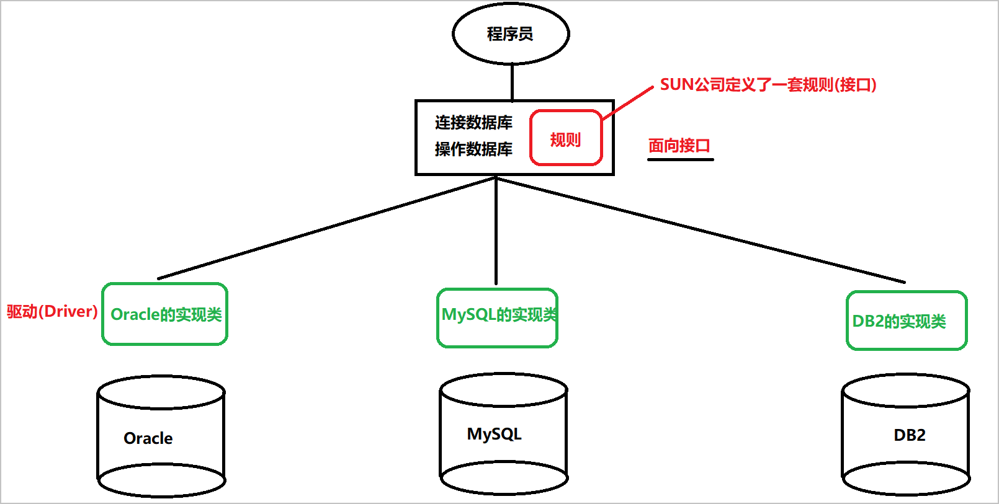

# JDBC

```mysql
约束
	主键约束 : 必须是非空唯一.
		primary key auto_increment
		整数类型, 添加为null, 不添加这个字段  -> 自增
	唯一性约束 : 唯一
		unique
	非空约束 : 不能为NULL
		not null
	默认值约束 : 不指定值, 当做默认值
		default 默认值
	
	外键约束 : 
		外键: 从表中指向主表的字段(从表中和主表有关联的字段)
		
		constraint 外键约束名 foreign key(外键字段) references 主表(主键字段)
		级联操作: on delete cascade on update cascade
		
多表之间的关系和建表原则
	一对一: 在任意一张表创建外键(唯一字段)指向另一张表的主键(唯一字段)
	一对多: 在多的一方创建外键, 指向一的一方的主键(唯一字段)
	多对多: 创建一张第三方表, 这张表至少有两个字段, 分别作为外键指向另外两张表的主键.
	
多表查询
	内连接
		隐式内连接
			select * from 表1, 表2 where 连接条件
		显式内连接
			select * from 表1 [inner] join 表2 on 连接条件 where 其他过滤条件
		格式不同, 查询出的结果是一样的
	外连接
		左外连接
			select * from 表1 left [outer] join 表2 on 连接条件 where 其他过滤条件
			查询左表的所有数据, 及和右边关联的数据
		右外连接
			select * from 表1 right [outer] join 表2 on 连接条件 where 其他过滤条件
			查询右表的所有数据, 及和左边关联的数据	
            
    自连接
    	select * from 表1 a, 表1 b where 条件
	子查询
		子查询必须放在()中
		子查询的结果如果是多列 一定要起别名
		
		子查询的结果是一个值  -> where后面当做条件  (>, <, ...)
		子查询的结果是单列多行 -> where 后面当做条件 in
		子查询的结果是多列  -> from后面当做表
事务
	组成一个事务的多个单元(多条SQL语句), 要么全成功, 要么全失败
	
	自动管理事务
		开启事务 : set autocommit = false  -> 开启事务
		
		结束事务: 
			提交: commit
			回滚: rollback
	手动管理事务
		开启事务: start transaction -> 开启事务
		
		结束事务: 
			提交: commit
			回滚: rollback
            
            
	四大隔离级别
		A: 原子性
		C: 一致性
		I: 隔离性
		D: 持久性
		
	事务并发时产生问题:
		脏读: 一个事务中读取到另一个事务尚未提交的数据
		不可重复读: 一个事务中多次读取的数据不一致, 受到了另一个事务update的影响
		幻读(虚读): 一个事务中多次读取的数据不一致, 受到了另一个事务insert, delete的影响
		
	事务的隔离级别
		Read-Uncommitted(RU) : 读未提交   会产生脏读...
		Read-Committed(RC) : 读已提交     解决了脏读, 其他会出现
		Repeatable-Read(RR): 重复读	   解决了脏读和不可重复读, 会出现幻读
		SeRializable(SR): 串行化		   不会出现问题
```


## 一. MySQL中的函数【敲】

### 1. 字符串函数

- length()
- concat()
- upper()
- lower()
- substr()
- instr()
- replace()

```mysql
-- length() : 获取字符串的长度(字节个数)
select LENGTH('abc');
select LENGTH('你好');
-- concat()
select CONCAT('Hello','World');
select CONCAT('Hello','World', 'Java', 'itheima');
-- upper()
select UPPER('iThEima');
-- lower()
select LOWER('iThEima');
-- substr() : 截取字符串, 开始位置是1
select SUBSTR('I Love China',3);
-- substr(字符串, 开始位置, 长度)
select SUBSTR('I Love China',3, 7);
-- instr()
select INSTR('nihaoahaha','ha');
-- replace()
select REPLACE('itheima','hei','bai')
```


### 2. 数值函数

- round()
- ceil()
- floor()
- mod()

```mysql
-- round(): 四舍五入
select ROUND(12.4);
-- round(12.3456, d) -- d代表保留小数点后几位(四舍五入)
select ROUND(12.3456,2);
-- ceil()
select CEIL(12.1); -- 13
-- floor()
select FLOOR(12.9); -- 12
-- mod()  -- %
select MOD(10, 3);
```

### 3. 日期时间函数

- now()
- curdate()
- curtime()
- year()
- month()
- day()
- hour()
- minute()
- second()
- str_to_date()
- date_format()

```mysql
-- now() : 年月日时分秒
select NOW();
-- cur : current, 当前
-- curdate() : 年月日
select CURDATE();
-- curtime() : 时分秒
select CURTIME();

-- year()
select YEAR(NOW());
-- month()
select MONTH(NOW());
-- day()
select DAY(NOW());
-- hour()
select HOUR(NOW());
-- minute()
select MINUTE(NOW());
-- second()
select SECOND(NOW());

-- str_to_date() : 字符串转换成日期
select STR_TO_DATE('9-16-2020','%m-%d-%Y');
-- 查询12年以后入职的员工
select * from emp where join_date > STR_TO_DATE('1-1-2012','%m-%d-%Y');

-- date_format() : 日期转换成字符串
select DATE_FORMAT(NOW(),'%d日%m月%Y年');
```


| 符号 | 说明               | 举例                 |
| ---- | ------------------ | -------------------- |
| `%Y` | 年份, 4位数        | 1999                 |
| `%y` | 年份, 2位数        | 99                   |
| `%M` | 月份名称           | January ... December |
| `%m` | 月份数字格式       | 01, 02               |
| `%c` | 月份数字格式       | 1, 2                 |
| `%d` | 该月日期, 数字格式 | 01, 02               |
| `%e` | 该月日期, 数字格式 | 1, 2                 |
| `%H` | 小时               | 00, 01 ... 23        |
| `%h` | 小时               | 01, ... 12           |
| `%i` | 分钟               | 00, ... 59           |
| `%s` | 秒                 | 00, ... 59           |

## 二. JDBC【重点】

### 1. JDBC的介绍

- JDBC(Java DataBase Connectivity) : Java数据库连接, 是一种用于执行SQL语句的JavaAPI, 可以为多种关系型数据库提供统一访问, 它是由一组用Java语言编写的类和接口组成的.
- JDBC的本质
  - 其实就是Java官方提供的一套规范. 用于帮助开发人员快速实现不同关系型数据库的连接!



### 2. JDBC快速入门

- 使用java代码, 查询数据库中的数据, 然后在程序中显示出来

```java
/**
 * JDBC的快速入门
 */
public class Demo01 {
    public static void main(String[] args) throws Exception {
        // 1. 注册驱动
        // DriverManager.registerDriver(new com.mysql.jdbc.Driver());
        Class.forName("com.mysql.jdbc.Driver");;
        // 2. 获取连接
        Connection connection = DriverManager.getConnection("jdbc:mysql://localhost:3306/day02", "root", "root");
        // 3. 获取SQL语句执行对象(执行者, 执行平台)
        Statement statement = connection.createStatement();
        // 创建SQL语句
        String sql = "select * from emp";
        // 4. 执行sql语句, 获取结果集
        ResultSet resultSet = statement.executeQuery(sql);
        // 5. 处理结果集
        while (resultSet.next()) {
            int id = resultSet.getInt("id");
            String name = resultSet.getString("name");
            String gender = resultSet.getString("gender");
            int salary = resultSet.getInt("salary");
            Date join_date = resultSet.getDate("join_date");
            System.out.println(id + "---" + name + "---" + gender + "---" + salary + "---" + join_date);
        }

        // 6. 释放资源
        resultSet.close();
        statement.close();
        connection.close();
    }
}

```

### 3. JDBC中每个接口的介绍

#### (1) DriverManager

- **注册驱动**

  - 第一种方式: 

  ```java
  // 注册驱动
  DriverManager.registerDriver(new com.mysql.jdbc.Driver());
  
  /*
  	弊端: Driver类中的静态代码块已经注册了驱动, 我们的代码又注册了一次
  		 注册了两次驱动
  */
  public class Driver extends NonRegisteringDriver implements java.sql.Driver {
      public Driver() throws SQLException {
      }
  
      static {
          try {
              // 注册了驱动
              DriverManager.registerDriver(new Driver());
          } catch (SQLException var1) {
              throw new RuntimeException("Can't register driver!");
          }
      }
  }
  ```

  - 第二种方式:

  ```java
  // 类加载的时机: 1. 创建对象 2.使用类变量 3. 使用类方法  4. 使用子类  5.java命令  6.反射
  // 只需要让Driver类中的静态代码块执行, 就注册了驱动
  // 静态代码块执行的实际, 就是类加载的时机
  // 只需要让类加载进内存, 静态代码块就执行, 驱动就注册了
  Class.forName("com.mysql.jdbc.Driver");
  
// 解决了注册两次的弊端
  // 弊端:  硬编码
```
  
  - 第三种方式: 解决硬编码问题
  
  ```java
  // 创建Properties
  Properties p = new Properties();
  // 创建输入流, 关联配置文件
  InputStream is = Demo02.class.getClassLoader().getResourceAsStream("jdbc.properties");
  // 读取配置文件中的信息, 到Properties中
  p.load(is);
  // getProperty() -> 获取路径
  String driverClass = p.getProperty("driverClass");
  // 反射, 注册驱动
  Class.forName(driverClass);
  ```

- **获取连接**

**DriverManager中的方法**

```java
public static Connection getConnection(String url,
                                       String user,
                                       String password)
参数:
	url:
		协议:子协议
		jdbc:mysql://ip地址:端口号/数据库
	user: 用户名   root
    password: 密码 root
        
注意事项:
	如果连接的是本机, 且端口号是3306, 可以省略ip地址和端口号:
		jdbc:mysql:///数据库
```

#### (2) Connection

- **获取SQL的执行者(执行平台)**

```java
Statement createStatement() 
```

- **操作事务**

```java
boolean setAutoCommit(boolean autoCommit)
    参数为true: 关闭事务
	参数为false: 开启事务
void commit() : 提交
void rollback() : 回滚      
```

#### (3) Statement

- SQL语句的执行者

  - DML 

  ```java
  int executeUpdate(String sql)
  	可以执行: 
  		insert
          delete
          update
          
              
      参数: 一条SQL语句
      返回: 影响的行数
  ```

  - DQL

  ```java
  ResultSet executeQuery(String sql)
  	只能用来执行: select语句
         
      返回: ResultSet: 存储着查询到的数据
  ```


**代码演示**

```java
/*
    执行增删改的SQL语句

 */
public class Demo03 {
    /**
     * insert添加语句
     * @throws Exception
     */
    @Test
    public void testInsert() throws Exception {
        // 注册驱动
        Class.forName("com.mysql.jdbc.Driver");
        String url = "jdbc:mysql://localhost:3306/day02";
        // 获取连接
        Connection connection = DriverManager.getConnection(url, "root", "root");
        // 获取SQL执行对象(Statement)
        Statement statement = connection.createStatement();
        // 创建SQL语句
        String sql = "insert into user values (4, '赵六', 'zhaoliu@itcast.cn', 26)";
        // 执行SQL语句
        int i = statement.executeUpdate(sql);
        System.out.println("影响的行数: " + i);
        // 释放资源
        statement.close();
        connection.close();
    }


    /**
     * delete删除语句
     */
    @Test
    public void testDelete() throws Exception {
        // 注册驱动
        Class.forName("com.mysql.jdbc.Driver");
        String url = "jdbc:mysql://localhost:3306/day02";
        // 获取连接
        Connection connection = DriverManager.getConnection(url, "root", "root");
        // 获取SQL执行对象(Statement)
        Statement statement = connection.createStatement();
        // 创建SQL语句
        String sql = "delete from user where id = 4";
        // 执行SQL语句
        int i = statement.executeUpdate(sql);
        System.out.println("影响的行数: " + i);
        // 释放资源
        statement.close();
        connection.close();
    }

    /**
     * update修改
     */
    @Test
    public void testUpdate() throws Exception {
        // 注册驱动
        Class.forName("com.mysql.jdbc.Driver");
        String url = "jdbc:mysql://localhost:3306/day02";
        // 获取连接
        Connection connection = DriverManager.getConnection(url, "root", "root");
        // 获取SQL执行对象(Statement)
        Statement statement = connection.createStatement();
        // 创建SQL语句
        String sql = "update user set age = 24 where id = 2";
        // 执行SQL语句
        int i = statement.executeUpdate(sql);
        System.out.println("影响的行数: " + i);
        // 释放资源
        statement.close();
        connection.close();
    }


}

```


#### (4) ResultSet

```java
boolean next() : 
	将指针向下移动一行, 就可以操作这一行数据
    
    返回 : 
		如果有数据 -> true
        如果没有数据 -> false

Xxx getXxx(int 列的编号)
    参数(列的编号):
		第一个列是 1，第二个列是 2
Xxx getXxx(String 列的名字)    
    参数(列的名字):
		字段名:  id=>字段名为id的那一列
            
Xxx : 某一种数据类型
    id => 数据库(int类型) => getInt
    username => 数据库(varchar) => getString
    money => 数据库(double) => getDouble
    
		
```

**代码演示**

```java
public class Demo04 {
    public static void main(String[] args) throws Exception {
        // 注册驱动
        Class.forName("com.mysql.jdbc.Driver");
        String url = "jdbc:mysql://localhost:3306/day02";
        // 获取连接
        Connection connection = DriverManager.getConnection(url, "root", "root");
        // 获取SQL执行对象(Statement)
        Statement statement = connection.createStatement();
        // 创建SQL语句
        String sql = "select * from user";
        // 执行SQL语句
        ResultSet rs = statement.executeQuery(sql);
        // 循环判断是否有一行数据
        while (rs.next()) {
            // 当前指针指向某一行, 确定一行
            // 通过下面的方法确定一列(字段)
            int id = rs.getInt(1); // 获取第一列
            String name = rs.getString("name");// 获取列名为name的那一列
            String email = rs.getString("email");
            int age = rs.getInt("age");
            System.out.println(id + "---" + name + "---" + email + "---" + age);
        
        }

        // 释放资源
        rs.close();
        statement.close();
        connection.close();

    }
}

```

### 4. 抽取工具类

- 获取连接的工具方法

```java
	// 在这里创建变量, 通过静态代码块赋值, 给静态方法使用
    private static String driverClass;
    private static String url;
    private static String user;
    private static String password;

    static {
        // 注册驱动
        try {
            // 创建Properties
            Properties p = new Properties();
            // 创建输入流
            InputStream is = JDBCUtils.class.getClassLoader().getResourceAsStream("jdbc.properties");
            // 读取(加载)配置文件
            p.load(is);
            // 获取配置文件中的信息
            driverClass = p.getProperty("driverClass");
            url = p.getProperty("url");
            user = p.getProperty("user");
            password = p.getProperty("password");

            // 注册驱动
            Class.forName(driverClass);
        } catch (Exception e) {
            e.printStackTrace();
        }
    }

    /**
     * 获取连接
     *  注册驱动, 只需要注册一次, 所以要放在静态代码块中
     */
    public static Connection getConnection() throws Exception {
        // 获取连接
        Connection connection = DriverManager.getConnection(url, user, password);
        return connection;
    }
```

- 释放资源的工具方法

```java
	/**
     * 释放资源
     *
     *  1. 将要释放的资源作为参数传递, 然后方法中依次调用close
     *  2. 每一个close方法都有异常, 需要try-catch处理
     *  3. 分开处理, 还是一起处理  -> 分开处理
     *  4. 如果对象是null, 先做一个非空判断
     *
     */
    public static void close(ResultSet resultSet, Statement statement, Connection connection) {
        if (resultSet != null) {
            try {
                resultSet.close();
            } catch (SQLException e) {
                e.printStackTrace();
            }
        }

        if (statement != null) {
            try {
                statement.close();
            } catch (SQLException e) {
                e.printStackTrace();
            }
        }


        if (connection != null) {
            try {
                connection.close();
            } catch (SQLException e) {
                e.printStackTrace();
            }
        }
    }

    public static void close(Statement statement, Connection connection) {
        close(null, statement, connection);
    }
```

> 要求:
>
> ​	使用JDBC 完成 增删改查
>
> ​	抽取工具类


## 三. 事务【重点】

### 1. JDBC事务介绍

> 前提: 获取连接(Connection)
>
> Connection:
>
> ​	setAutoCommit(boolean) :  
>
> ​			参数: true => 关闭事务
>
> ​					 false => 开启事务
>
> ​	commit()
>
> ​	rollback()

### 2. 使用事务完成银行转账案例

```java
/**
 * 模拟银行转账案例
 */
public class Demo02Transfer {
    public static void main(String[] args)  {
        Connection connection = null;
        Statement statement = null;
        try {
            // 获取连接
            connection = JDBCUtils.getConnection();
            // 获取SQL执行对象
            statement = connection.createStatement();
            // 开启事务
            connection.setAutoCommit(false);

            // 创建SQL语句
            String outSql = "update account set money = money - 3000 where aid = 1";
            statement.executeUpdate(outSql);
            // 下面代码模拟中间出现了问题
            int a = 10 / 0;
            String inSql = "update account set money = money + 3000 where aid = 2";
            statement.executeUpdate(inSql);

            // 如果上面的代码正常执行, 转账成功, 可以提交
            System.out.println("转账成功!~");
            connection.commit();
        } catch (Exception e) {
            // 如果代码执行到这里, 说明上面出现了异常 -> 回滚
            try {
                System.out.println("转账失败! 数据回滚!~");
                connection.rollback();
            } catch (SQLException ex) {
                ex.printStackTrace();
            }
        } finally {
            // 释放资源
            JDBCUtils.close(statement, connection);
        }
    }
}

```


## 四. PreparedStatement【重点】

### 1. JDBC完成登录案例

```java
public class Demo01Login {
    public static void main(String[] args) throws Exception {

        Scanner sc = new Scanner(System.in);
        System.out.println("请输入用户名: ");
        String username = sc.nextLine();
        System.out.println("请输入密码: ");
        String password = sc.nextLine();

        // 目的: 做数据的查询操作
        // 获取连接
        Connection connection = JDBCUtils.getConnection();
        // 获取SQL执行对象
        Statement statement = connection.createStatement();
        // select * from user where username = ''
        // 创建SQL语句
        String sql = "select * from user where username = '" + username + "' and password = '" + password + "'";
        // 执行SQL语句
        ResultSet resultSet = statement.executeQuery(sql);

        // 查看结果集中是否有内容
        if (resultSet.next()) {
            System.out.println("登陆成功!~");
        } else {
            System.out.println("登陆失败!!!");
        }

        // 释放资源
        JDBCUtils.close(resultSet, statement, connection);

    }
}
```

### 2. SQL注入问题

### 3. PreparedStatement的介绍

**方法**

```java
// 如何获取到预编译对象
// Connection  :   PreparedStatement prepareStatement(String sql)  :
//								预编译SQL语句, 并获取到PreparedStatement对象
PreparedStatement pstmt = 
    con.prepareStatement("UPDATE EMPLOYEES SET SALARY = ? WHERE ID = ?");
// ? : 占位符,  形参,  第一个? , 第二个?

// 给SQL语句中的第1个占位符, 进行赋值, 值为153833.00
pstmt.setBigDecimal(1, 153833.00)
// 给SQL语句中的第2个占位符, 进行赋值, 值为110592
pstmt.setInt(2, 110592)
    
// setXxx方法的详解:
void setString(int parameterIndex, String x)
    parameterIndex  :  第1个?就写1, 第2个?就写2
    x : 实参, 给?赋值的值

```

**使用预编译对象完成增删改**

```java
/**
 * 使用预编译对象, 完成数据库的增删改的操作
 */
public class Demo02 {

    @Test
    public void testInsert() throws Exception {
        // 获取连接
        Connection connection = JDBCUtils.getConnection();
        // 定义SQL语句
        String sql = "insert into user values (?, ?, ?)";
        // 获取预编译对象
        PreparedStatement preparedStatement = connection.prepareStatement(sql);
        // 给每一个?, 进行赋值
        preparedStatement.setInt(1, 3);
        preparedStatement.setString(2, "ww");
        preparedStatement.setString(3, "345");

        // 执行SQL语句
        int i = preparedStatement.executeUpdate();
        System.out.println("影响的行数是: " + i);

        // 释放资源
        JDBCUtils.close(preparedStatement, connection);
    }

    @Test
    public void testDelete() throws Exception {
        // 获取连接
        Connection connection = JDBCUtils.getConnection();
        // 定义SQL语句
        String sql = "delete from user where id = ?";
        // 获取预编译对象
        PreparedStatement preparedStatement = connection.prepareStatement(sql);
        // 给每一个?, 进行赋值
        preparedStatement.setInt(1, 3);

        // 执行SQL语句
        int i = preparedStatement.executeUpdate();
        System.out.println("影响的行数是: " + i);

        // 释放资源
        JDBCUtils.close(preparedStatement, connection);
    }

    @Test
    public void testUpdate() throws Exception {
        // 获取连接
        Connection connection = JDBCUtils.getConnection();
        // 定义SQL语句
        String sql = "update user set password = ? where id = ?";
        // 获取预编译对象
        PreparedStatement preparedStatement = connection.prepareStatement(sql);
        // 给每一个?, 进行赋值
        preparedStatement.setString(1, "123456");
        preparedStatement.setInt(2, 1);

        // 执行SQL语句
        int i = preparedStatement.executeUpdate();
        System.out.println("影响的行数是: " + i);

        // 释放资源
        JDBCUtils.close(preparedStatement, connection);
    }
}

```

### 4. 使用PreparedStatement解决SQL注入问题

```java
public class Demo03LoginRefresh {
    public static void main(String[] args) throws Exception {

        Scanner sc = new Scanner(System.in);
        System.out.println("请输入用户名: ");
        String username = sc.nextLine();
        System.out.println("请输入密码: ");
        String password = sc.nextLine();

        // 目的: 做数据的查询操作
        // 获取连接
        Connection connection = JDBCUtils.getConnection();
        // 创建SQL语句
        String sql = "select * from user where username = ? and password = ?";
        // 预编译SQL语句, 并获取预编译对象
        PreparedStatement preparedStatement = connection.prepareStatement(sql);
        // 给? 赋值
        preparedStatement.setString(1, username);
        preparedStatement.setString(2, password);

        // 执行SQL语句
        ResultSet resultSet = preparedStatement.executeQuery();

        // 查看结果集中是否有内容
        if (resultSet.next()) {
            String username2 = resultSet.getString("username");
            String password2 = resultSet.getString("password");
            System.out.println("登陆成功!~ 请牢记您的用户名: " + username2 + ", 密码: " + password2);
        } else {
            System.out.println("登陆失败!!!");
        }

        // 释放资源
        JDBCUtils.close(resultSet, preparedStatement, connection);

    }
}

```

### 5. 自定义JDBC模版

**元数据**

- 用来描述数据的数据

```java
public class MyTemplate {
    /**
     * DML操作的工具方法
     */
    public static int update(String sql, Object ... args) throws Exception {
        // 获取连接
        Connection connection = JDBCUtils.getConnection();
        // 获取预编译对象
        PreparedStatement preparedStatement = connection.prepareStatement(sql);
        // 给?赋值
        // 获取?占位符的个数
        ParameterMetaData metaData = preparedStatement.getParameterMetaData();
        int count = metaData.getParameterCount();
        // 循环赋值
        for (int i = 0; i < count; i++) {
            preparedStatement.setObject(i + 1, args[i]);
        }
        // 执行SQL语句
        int i = preparedStatement.executeUpdate();
        // 释放资源
        JDBCUtils.close(preparedStatement, connection);
        return i;
    }
}

```

