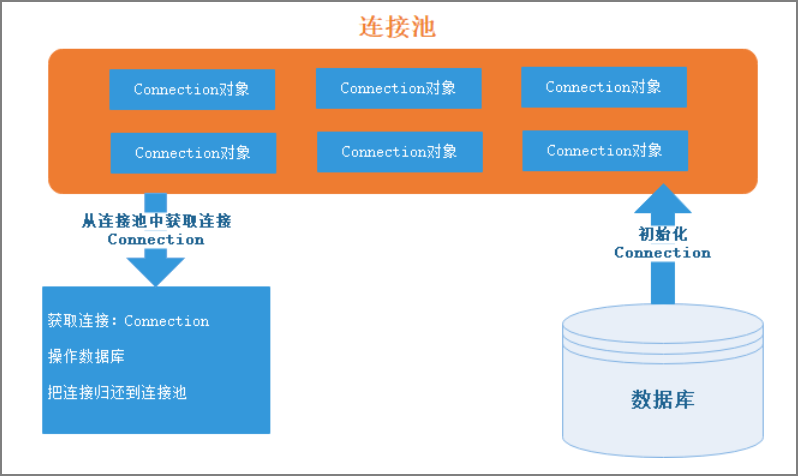

# 连接池、DBUtils

## 一. 查询数据封装到Map和POJO【理解】

### 1. 查询数据封装到Map集合

```java
/**
 *  把查询出来的数据, 封装到Map集合中
 */
public class Demo01 {
    public static void main(String[] args) throws Exception {
        // 获取连接
        Connection connection = JDBCUtils.getConnection();
        // 创建查询的SQL语句
        String sql = "select * from user";
        // 获取预编译对象
        PreparedStatement preparedStatement = connection.prepareStatement(sql);
        // 执行SQL语句
        ResultSet resultSet = preparedStatement.executeQuery();
        // 在while循环外面, 创建List集合
        List<Map<String, Object>> list = new ArrayList<>();
        // 处理结果集, 把查询出来的数据, 封装到Map集合中
        while (resultSet.next()) {
            // 创建Map集合
            Map<String, Object> map = new HashMap<>();
            // 获取结果集中的数据
            int id = resultSet.getInt("id");
            String username = resultSet.getString("username");
            String password = resultSet.getString("password");
            map.put("id", id);
            map.put("username", username);
            map.put("password", password);
            // System.out.println(map);
            // 将这个map集合添加到list中
            list.add(map);
        }
        System.out.println(list);
        // 释放资源
        JDBCUtils.close(resultSet, preparedStatement, connection);
    }
}

```

### 2. POJO的介绍

> POJO(Plain Ordinary Java Object), 实际上就是一个普通的JavaBean, 主要用于方便我们使用数据库中的数据表, 不继承或者实现任何类和接口(Object除外)

- **JavaBean的书写规范**
  - 成员变量使用private修饰
  - private修饰的成员变量, 要具有对应的get和set方法
  - 必须提供无参构造
  - 如果有基本数据类型的数据, 需要定义成包装类
  - 最好的实现Serializable接口
  - 重写toString, 只为了方便打印

- **例如**

```java
public class User implements Serializable {
    private Integer id;
    private String username;
    private String password;

    public User() {
    }

    public Integer getId() {
        return id;
    }

    public void setId(Integer id) {
        this.id = id;
    }

    public String getUsername() {
        return username;
    }

    public void setUsername(String username) {
        this.username = username;
    }

    public String getPassword() {
        return password;
    }

    public void setPassword(String password) {
        this.password = password;
    }

    @Override
    public String toString() {
        return "User{" +
                "id=" + id +
                ", username='" + username + '\'' +
                ", password='" + password + '\'' +
                '}';
    }
}
```

### 2. 查询数据封装到POJO

- **查询数据封装到POJO并保存到集合中**

```java

```

## 二. 自定义连接池【理解】

### 1. 连接池简介

- 连接池：是一个容器，里边保存了一批数据库连接，这些连接可以**重复使用**。当需要操作数据库时，不用创建连接，而是从连接池中取出一个使用；使用完成之后，再把连接归还到连接池中.
- **为什么要使用连接池**
  - 连接的创建和销毁需要花费时间
    - 连接的过程其实试一次TCP操作
      - 创建连接: 三次握手
      - 销毁连接: 四次挥手
    - 连接池, 一次性创建多个连接, 重复使用,  (典型的空间换时间)
  - 连接池中的连接会重复使用, 不会创建过多连接造成内存溢出

### 2. 自定义连接池实现步骤分析



**实现步骤**

1. 创建一个类, 在类中创建一个**LinkedList<Connection>**, 用来存放连接
   - LinkedList底层是链表: 查询慢, 增删快
   - ArrayList底层是数组: 查询快, 增删慢
2. 在构造方法中, 创建多个Connection对象, 存放到集合中
3. 提供一个用于获取连接的方法
4. 提供一个用于归还连接的方法

### 3. 自定义连接池简易版

```java
/**
 * 自定义的连接池
 *  无论自定义连接池, 还是第三方连接池, 都会实现 DataSource  接口
 */
public class MyDataSource implements DataSource {

    // 创建用来存放多个连接的, LinkedList集合
    private LinkedList<Connection> pool = new LinkedList<>();

    // 构造方法, 初始化多个连接对象, 添加到pool集合中
    public MyDataSource() throws Exception {
        // 创建5个连接, 存到集合中
        for (int i = 0; i < 5; i++) {
            // 获取连接
            Connection connection = JDBCUtils.getConnection();
            // 添加到集合中
            pool.add(connection);
        }
    }

    /**
     * 用于获取连接的方法
     * @return
     */
    @Override
    public Connection getConnection() throws SQLException {
        // 从集合中删除第一个连接对象
        Connection connection = pool.removeFirst();
        // 返回连接对象
        return connection;
    }

    /**
     * 用于归还连接的方法
     */
    public void recycle(Connection connection) {
        pool.addLast(connection);
    }

    // ===========================================================================================
    @Override
    public Connection getConnection(String username, String password) throws SQLException {
        return null;
    }

    @Override
    public PrintWriter getLogWriter() throws SQLException {
        return null;
    }

    @Override
    public void setLogWriter(PrintWriter out) throws SQLException {

    }

    @Override
    public void setLoginTimeout(int seconds) throws SQLException {

    }

    @Override
    public int getLoginTimeout() throws SQLException {
        return 0;
    }

    @Override
    public Logger getParentLogger() throws SQLFeatureNotSupportedException {
        return null;
    }

    @Override
    public <T> T unwrap(Class<T> iface) throws SQLException {
        return null;
    }

    @Override
    public boolean isWrapperFor(Class<?> iface) throws SQLException {
        return false;
    }
}

```

**出现的问题**

1. 从连接池中得到的连接，使用完成之后，不能`close()`，而必须要调用连接池对象的`recycle()`方法，这不符合以前的开发习惯
2. 归还连接池的方法`recycle()`是自定义的方法，而不是从`javax.sql.DataSource`中实现来的。这会导致不同连接池使用时，归还连接池的方法不同

**解决方案**

- 更改连接对象的`close()`方法功能：由原来的关闭连接，更改为归还到连接池

### 4. 自定义连接池进阶版-装饰设计模式

- 装饰类

```java
/**
 * 装饰类
 */
public class MyWrapperConnection implements Connection {
    // 将被装饰类作为装饰类中的成员变量
    // 被装饰类, 我们不知道, 只能写他们的父类(父接口)
    private Connection conn;

    // 声明LinkedList集合
    private LinkedList<Connection> pool;

    public MyWrapperConnection(Connection conn, LinkedList<Connection> pool) {
        this.conn = conn;
        this.pool = pool;
    }

    // 需要增强的方法, 自己增强
    @Override
    public void close() throws SQLException {
        // 归还给连接池中的集合
        pool.addLast(this);
    }

    // ==================================================================
    // 不需要增强的方法, 直接调用原有的方法
    // 省略不写了, 代码中要加上
}

```

- 自定义连接池类

```java
public class MyWrapperDataSource implements DataSource {
    // 创建用来存放多个连接的, LinkedList集合
    private LinkedList<Connection> pool = new LinkedList<>();

    // 构造方法, 初始化多个连接对象, 添加到pool集合中
    public MyWrapperDataSource() throws Exception {
        // 创建5个连接, 存到集合中
        for (int i = 0; i < 5; i++) {
            // 获取连接
            // 基本的连接, 要被装饰的
            Connection connection = JDBCUtils.getConnection();
            // 创建装饰类的对象, 把被装饰的对象放到构造方法中
            MyWrapperConnection myWrapperConnection = new MyWrapperConnection(connection, pool);
            // 添加到集合中
            pool.add(myWrapperConnection);
        }
    }

    /**
     * 用于获取连接的方法
     * @return
     */
    @Override
    public Connection getConnection() throws SQLException {
        // 从集合中删除第一个连接对象
        Connection connection = pool.removeFirst();
        // 返回连接对象
        return connection;
    }

    /**
     * 用于归还连接的方法
     * 归还连接的方法已经不需要了~~~
     */
    /*public void recycle(Connection connection) {
        pool.addLast(connection);
    }*/

    // ===========================================================================================
   // 下面重写的方法就不写了
    // 代码中要加上
}

```

**出现的问题**

- 不需要增强的方法太多了,  都要调用被装饰类中的方法, 比较麻烦

**解决方案**

- 使用动态代理, 只对一个方法进行增强

### 5. 自定义连接池终极版-动态代理

```java
public class MyProxyDataSource implements DataSource {

    // 创建用来存放多个连接的, LinkedList集合
    private LinkedList<Connection> pool = new LinkedList<>();

    // 构造方法, 初始化多个连接对象, 添加到pool集合中
    public MyProxyDataSource() throws Exception {
        // 创建5个连接, 存到集合中
        for (int i = 0; i < 5; i++) {
            // 获取连接
            // connection就是要被代理的对象
            Connection connection = JDBCUtils.getConnection();

            // 获取真正的动态代理对象,  实现了Connection接口
            /*
            newProxyInstance(ClassLoader loader, // 被代理对象获取类加载器
                          Class<?>[] interfaces, // 被代理对象实现的接口
                          InvocationHandler h)  // 指定方法的拦截和增强
             */
            Connection conn = (Connection) Proxy.newProxyInstance(connection.getClass().getClassLoader(),
                    new Class[]{Connection.class}, // connection.getClass().getInterfaces()
                    new InvocationHandler() {
                        /*
                        Object proxy,   // 真正的动态代理对象
                        Method method,  // 被拦截的方法
                        Object[] args   // 被拦截方法的参数列表
                         */
                        @Override
                        public Object invoke(Object proxy, Method method, Object[] args) throws Throwable {
                            // 只需要拦截close方法
                            // 获取被拦截方法的方法名
                            String name = method.getName();
                            // 判断, 是否是close方法
                            // 如果是close, 就增强
                            // 如果一个常量和一个变量进行比较, 把常量写在前面, 永远都不会出现空指针异常
                            if ("close".equals(name)) {
                                pool.addLast((Connection) proxy);
                                return null;
                            }
                            // 如果不是close, 还做原有方法的调用
                            return method.invoke(connection, args);
                        }
                    });


            // 添加了 动态代理的对象
            pool.add(conn);
        }
    }

    /**
     * 用于获取连接的方法
     * @return
     */
    @Override
    public Connection getConnection() throws SQLException {
        // 从集合中删除第一个连接对象
        Connection connection = pool.removeFirst();
        // 返回连接对象
        return connection;
    }

    /**
     * 用于归还连接的方法
     */
    public void recycle(Connection connection) {
        pool.addLast(connection);
    }

    //================================================================================
}

```

**问题**

- 连接池的功能太简陋, 编写麻烦
- 市面上有很多第三方的连接池：功能强大，我们直接使用即可。

## 三. 第三方连接池【重点】

### 1. c3p0连接池

#### (1) 简介

- C3P0是一个开源的JDBC连接池，目前使用它的开源项目有Hibernate、Spring等。
- 连接池作者是《星球大战》影迷，C3P0是其中的一个机器人，并且这个名称中包含connection 和pool两个单词字母，因此便叫这个名字。


#### (2) 使用步骤

1. 添加jar包: `c3p0-0.9.1.2.jar`
2. 创建配置文件, 名称是: `c3p0-config.xml`, 放在src目录下
3. 添加配置信息

| 配置项/参数     | 说明                                                         |
| --------------- | ------------------------------------------------------------ |
| driverClass     | 驱动类名，**必须**                                           |
| jdbcUrl         | 数据库地址，**必须**                                         |
| user            | 数据库用户名，**必须**                                       |
| password        | 数据库密码，**必须**                                         |
| initialPoolSize | 连接池里初始化连接数，应该在minPoolSize和maxPoolSize之间。默认3 |
| maxPoolSize     | 连接池里保持的最大连接数。默认15                             |
| minPoolSize     | 连接池里保持的最小连接数。默认3                              |
| checkoutTimeout | 当连接池中没有连接可用时，等待的超时时间（毫秒）。默认0，表示不限制 |
| maxIdleTime     | 连接对象的最大空闲时间（秒），超时将被释放掉。默认0，表示永不过期 |

- 配置示例

```xml
<c3p0-config>
	<!-- 默认配置 -->
	<default-config>
		<!-- 连接数据库的4项基本参数 -->
		<property name="driverClass">com.mysql.jdbc.Driver</property>
		<property name="jdbcUrl">jdbc:mysql://127.0.0.1:3306/db</property>
		<property name="user">root</property>
		<property name="password">root</property>
        
		<!-- 如果池中连接不够时，一次增长多少个 -->
		<property name="acquireIncrement">5</property>
		<!-- 初始化连接数 -->
		<property name="initialPoolSize">20</property>
		<!-- 最小连接数 -->
		<property name="minPoolSize">10</property>
		<!-- 最大连接数 -->
		<property name="maxPoolSize">50</property>
	</default-config>
</c3p0-config>
```

#### (3) c3p0API的介绍

- c3p0的连接池类名: `ComboPooledDataSource`
  - 构造方法：
    * 无参构造：`ComboPooledDataSource()`，表示加载默认配置的连接池
    * 有参构造：`ComboPooledDataSource(configName)`：表示加载指定名称配置的连接池
  - 获取连接的方法：`getConnection()`

#### (4) c3p0的使用

- 硬编码使用c3p0

```java
/**
 * 硬编码的方式使用
 */
public class Demo01 {
    public static void main(String[] args) throws Exception {
        // 创建连接池
        ComboPooledDataSource cpds = new ComboPooledDataSource();
        cpds.setDriverClass( "com.mysql.jdbc.Driver");
        cpds.setJdbcUrl( "jdbc:mysql://localhost:3306/day04");
        cpds.setUser("root");
        cpds.setPassword("root");

        // 可选的配置
        cpds.setInitialPoolSize(5);
        cpds.setMaxPoolSize(10);
        cpds.setCheckoutTimeout(5000);

        // 获取连接
        Connection connection1 = cpds.getConnection();
        // 归还连接
        connection1.close();
    }
}
```

- 配置文件使用c3p0

```java
/*
    配置文件方式使用

 */
public class Demo02 {
    public static void main(String[] args) throws Exception {
        ComboPooledDataSource dataSource = new ComboPooledDataSource();

        // 获取连接
        Connection connection1 = dataSource.getConnection();
        // 归还连接
        connection1.close();
    }
}

```

### 2. Druid连接池

#### (1) 简介

- Druid是Java语言中最好的数据库连接池。Druid能够提供强大的监控和扩展功能。
- Druid是阿里巴巴提供的开源、免费的连接池工具，在功能、性能、扩展性上都超过其它连接池。druid在Alibaba内部已经大量使用，经过了生产环境大规范部署的严苛考验。

#### (2) 使用步骤

- 添加jar包: `druid-1.0.9.jar`
-  druid的配置文件名称：xxx.properties
  - 可以放在任意目录下, 通常放在src
- 配置信息

| 配置项/参数     | 说明                                   |
| --------------- | -------------------------------------- |
| driverClassName | 驱动类名                               |
| url             | 数据库地址                             |
| username        | 数据库用户名                           |
| password        | 数据库密码                             |
| initialSize     | 连接池初始化连接数。默认0              |
| maxActive       | 连接池最大连接数。默认8                |
| minIdle         | 连接池最小连接数。默认0                |
| maxWait         | 获取连接的最大等待时间（毫秒），默认-1 |

- 配置示例

```properties
driverClassName=com.mysql.jdbc.Driver
url=jdbc:mysql:///heima
username=root
password=root
initialSize=20
maxActive=50
minIdle=10
maxWait=10000
```

#### (3) druid的api

- druid的连接池类: 

  ```java
  DataSource dataSource = DruidDataSourceFactory.createDataSource(Properties对象)
  ```

- 获取连接: `dataSource.getConnection()`

#### (4) druid的使用

```java
public class Demo01 {
    public static void main(String[] args) throws Exception {
        // 配置文件的名字和位置是可以改变
        Properties p = new Properties();
        // 获取输入流, 关联配置文件
        InputStream is = Demo01.class.getClassLoader().getResourceAsStream("druid.properties");
        // 加载配置文件, 输入流指定配置文件
        p.load(is);
        // 关流
        is.close();
        // 获取连接池对象 - 使用了工厂设计模式
        DataSource dataSource = DruidDataSourceFactory.createDataSource(p);
        // 获取连接
        Connection connection1 = dataSource.getConnection();
		// 归还连接
        connection1.close();
    }
}
```


### 3. 使用第三方连接池改写JDBCUtils

```java

```

## 四. DBUtils的使用【重点】

### 1. 简介

- DbUtils是Apache组织提供的一个对JDBC进行简单封装的开源工具类库，使用它能够简化JDBC应用程序的开发，同时也不会影响程序的性能.
- 使用需要导入jar包: `commons-dbutils-1.4.jar`

### 2. 常用API介绍

* DBUtils的核心类：`QueryRunner`

  * 这个类提供了执行SQL语句的方法
  * 创建`QueryRunner`：有参构造`QueryRunner(DataSource dataSource)`

* `QueryRunner`提供了执行SQL语句的常用API

  | 方法                                                      | 说明                                                    |
  | --------------------------------------------------------- | ------------------------------------------------------- |
  | `update(String sql, Object... params)`                    | 执行DML，得到`int`：表示影响的行数                      |
  | `query(String sql, ResultSetHandler h, Object... params)` | 执行SQL，得到查询结果。结果由参数`ResultSetHandler`决定 |

### 3. DBUtils执行DML操作

```java
/**
 * 使用DbUtils完成dml操作
 */
public class Demo01_DML {
    @Test
    public void testInsert() throws SQLException {
        // 创建QueryRunner对象
        QueryRunner queryRunner = new QueryRunner(JDBCUtils.getDataSource());
        int i = queryRunner.update("insert into user values (?, ?, ?)", 5, "zhouqi", "567");
        System.out.println(i);
    }

    @Test
    public void testDelete() throws SQLException {
        // 创建QueryRunner对象
        QueryRunner queryRunner = new QueryRunner(JDBCUtils.getDataSource());
        int i = queryRunner.update("delete from user where id = ?", 5);
        System.out.println(i);
    }

    @Test
    public void testUpdate() throws SQLException {
        // 创建QueryRunner对象
        QueryRunner queryRunner = new QueryRunner(JDBCUtils.getDataSource());
        int i = queryRunner.update("update user set password = ? where id > ?", "haha", 0);
        System.out.println(i);
    }
}

```


### 4. DBUtils执行DQL操作

* QueryRunner`提供了执行DQL的方法：
  * `query(String sql, ResultSetHandler rsh, Object... params)`
* 其中参数`ResultSetHandler`直接影响方法的返回值，常见的`ResultSetHandler`实现类有

| `ResultSetHandler` | 说明                                                         |
| ------------------ | ------------------------------------------------------------ |
| `MapHandler`       | 把查询结果集中，第一行封装成`Map<String,Object>`。<br />key是字段名，value是字段值 |
| `MapListHandler`   | 把查询结果集封装成`List<Map<String,Object>`<br />其中每一个`Map<String,Object>`是一行数据 |
| `BeanHandler`      | 把查询结果集中，第一行封装成一个JavaBean对象                 |
| `BeanListHandler`  | 把查询结果集封装成`List<JavaBean对象>`<br />其中每一个JavaBean，是一行数据 |
| `ScalarHandler`    | 返回查询结果集中第一行第一列数据，通常用于查询数量           |

#### (1) 查询结果是一个值

```java
	/**
     * 查询的结果是一个值
     */
    @Test
    public void testOneObject() throws SQLException {
        QueryRunner queryRunner = new QueryRunner(JDBCUtils.getDataSource());
        // String name = (String) queryRunner.query("select username from user where id = ?", new ScalarHandler(), 1);
        // System.out.println(name);

        long count = (long) queryRunner.query("select count(*) from user", new ScalarHandler());
        System.out.println(count);
    }
```


#### (2) 查询结果是一条数据, 封装成`Map`

```java
	/**
     * 查询的结果是一行, 封装到Map集合
     */
    @Test
    public void testMap() throws SQLException{
        QueryRunner queryRunner = new QueryRunner(JDBCUtils.getDataSource());
        Map<String, Object> map = queryRunner.query("select * from user where id = ?", new MapHandler(), 3);
        System.out.println(map);
    }
```


#### (3) 查询结果是多条数据, 封装成`List<Map>`

```java
	/**
     * 查询的结果是多行, 封装到List<Map>
     */
    @Test
    public void testMapList() throws SQLException {
        QueryRunner queryRunner = new QueryRunner(JDBCUtils.getDataSource());
        List<Map<String, Object>> mapList = queryRunner.query("select * from user", new MapListHandler());

        // 遍历List  -> 获取到的每一个元素, 都是Map类型
        for (Map<String, Object> map : mapList) {
            // 遍历map集合
            // map.entrySet() : 获取到用来存放键值对的Set集合
            for (Map.Entry<String, Object> entry : map.entrySet()) {
                // entry : map集合中每一个键值对对象
                System.out.println(entry.getKey() + "=" + entry.getValue());
            }
            System.out.println("~~~~~~~~~~~~~~~~~~~");
        }
    }
```


#### (4) 查询结果是一条数据, 封装成`JavaBean`对象

```java
	/**
     * 查询的结果是一行, 封装到JavaBean中
     */
    @Test
    public void testBean() throws SQLException {
        QueryRunner queryRunner = new QueryRunner(JDBCUtils.getDataSource());
        // BeanHandler的构造方法需要一个Class类型的参数
        // 封装的JavaBean是什么类型, 传入 什么类型.class
        User user = queryRunner.query("select * from user where id = ?", new BeanHandler<>(User.class), 3);
        System.out.println(user);
    }


```

#### (5) 查询结果是多条数据, 封装成`List<JavaBean>`

```java
    /**
     * 查询的结果是多行, 封装到List<JavaBean>中
     */
    @Test
    public void testBeanList() throws SQLException {
        QueryRunner queryRunner = new QueryRunner(JDBCUtils.getDataSource());
        // BeanHandler的构造方法需要一个Class类型的参数
        // 封装的JavaBean是什么类型, 传入 什么类型.class
        List<User> list = queryRunner.query("select * from user", new BeanListHandler<>(User.class));
        System.out.println(list);
    }
```

## 五. JdbcTemplate的使用【了解】

### 1. 创建JdbcTemplate对象

```java
JdbcTemplate(DataSource dataSource)
```

### 2. JdbcTemplate执行DML的方法

```java
// DML
public int update(String sql, Object... args)
    
// DQL
public <T> T queryForObject(String sql, Class<T> requiredType, Object... args)
// 例如: queryForObject("select username from user where id = ?", String.class , 1)
    
public Map<String,Object> queryForMap(String sql, Object... args)
    
public List<Map<String,Object>> queryForList(String sql, Object... args)
    
public <T> T queryForObject(String sql, RowMapper<T> rowMapper, Object... args)
// 例如: queryForObject("select * from user where id = ?", new  BeanPropertyRowMapper<>(User.class)  ,1)
    

public <T> List<T> query(String sql, RowMapper<T> rowMapper, Object... args)
// 例如: query("select * from user", new BeanPropertyRowMapper<>(User.class))
```

