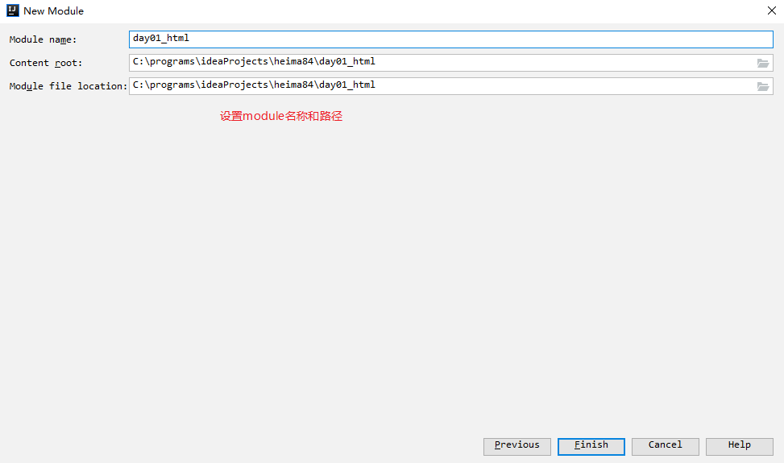
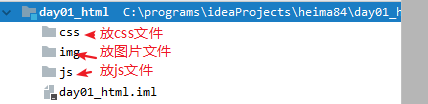
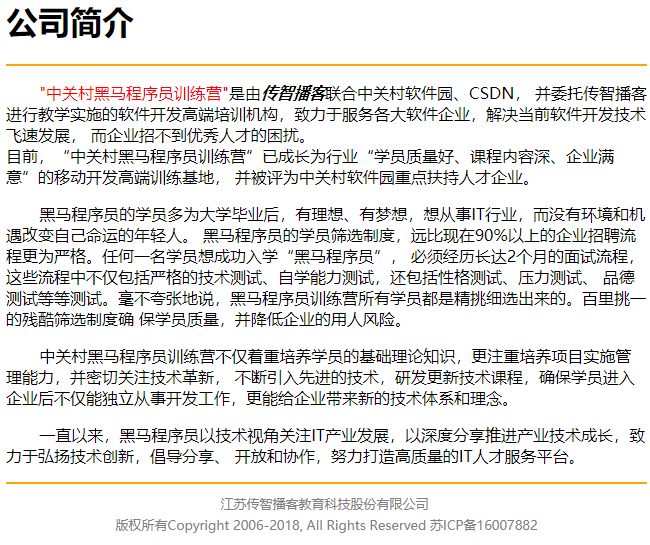

# HTML-课堂笔记

web应用

## 一、HTML简介

### 目标

* 了解HTML的概念
* 能够编写简单的HTML页面
* 了解HTML的语法特点
* 能够使用idea编写HTML

### 讲解

#### 什么是HTML

* HTML：HyperText Markup Language，超文本标记/标签语言。
* 作用：用于编写网页的

#### 编写一个简单的HTML

```html
<!DOCTYPE html>
<html lang="en">
<head>
    <meta charset="UTF-8">
    <title>Hello</title>
</head>
<body>
	<h1>Hello, world!</h1>
</body>
</html>
```


#### HTML的语法特点

* HTML文件后缀名是：`.html` 或者 `.htm`
* HTML文件由一堆标签组成：
  * 标签：`<关键字>内容</关键字>`， `<关键字/>`自闭合标签
    * 标签可以嵌套，但是最外层的根标签是`html`
  * 属性：写在开始标签上，用于对标签做进一步修饰
* 不需要编译，可以使用浏览器直接打开
* 不区分大小写

#### 使用idea编写HTML

1. File-new-Module，选择`Static Web`

   

2. 设置Module的名称

   

3. 补全目录：`css`放样式文件，`js`放js文件，`img`放图片文件

   

4. 创建HTML文件，使用浏览器打开html文件

   

### 小结

* HTML的语法特点：【了解】
  * HTML文件后缀名是 .html 或者 .htm
  * HTML由一堆标签组成的
    * 标签：`<关键字>内容</关键字>`,  `<关键字/>`
    * 标签可以嵌套，开始标签上可以加属性
  * HTML不区分大小写
  * HTML不需要编译，可以使用浏览器直接打开
* HTML的语法非常宽松，但是开发时要符合语法规范

## 二、HTML文字排版标签

### 目标

* 能够使用文字排版标签，完成公司简介页面

  

### 分析

* 文字排版相关的标签有：
  * 标题标签：h1~h6
  * 横线标签：hr
  * 段落标签：p
  * 换行标签：br
  * 文字标签：font
  * 粗体字标签：b
  * 斜体字标签：i

### 讲解

#### 1. 标题标签

```html
<h1>黑马程序员1</h1>
<h2>黑马程序员2</h2>
<h3>黑马程序员3</h3>
<h4>黑马程序员4</h4>
<h5>黑马程序员5</h5>
<h6>黑马程序员6</h6>
```

- 特点：
  - 默认加粗
  - 内置字号：h1最大，h6最小
  - 独占一行

#### 2. 横线标签

```html
<hr color="red" size="20px" width="500px" align="left"/>
```

- 属性：
  - color：横线的颜色
  - size：横线的粗细
  - width：横线的长短
  - algin：横线的水平位置。left  /  center（默认）/  right

#### 3. 段落和换行

```html
<p>
    一个p标签，是一个段落。段落之间有空白的间隔； 
    如果要换行，写<br/>后边内容会另起一行显示，行之间没有空白间隔
</p>
```

#### 4. 文字标签

```html
<font color="red" size="7" face="华文彩云">黑马程序员7</font>
<i>这是斜体字</i> 
<b>这是粗体字</b>
```

- font标签的属性
  - color：文字的颜色
  - size：文字的大小，最小1，最大7，默认3
  - face：文字的字体

#### 5. 练习：公司简介页面

```html
<!DOCTYPE html>
<html lang="en">
<head>
    <meta charset="UTF-8">
    <title>公司简介</title>
</head>
<body>
<h1>公司简介</h1>
<hr color="orange"/>

<p>
    &nbsp;&nbsp;&nbsp;&nbsp;&nbsp;&nbsp;&nbsp;<font color="red">"中关村黑马程序员训练营"</font>是由<i><b>传智播客</b></i>联合中关村软件园、CSDN， 并委托传智播客进行教学实施的软件开发高端培训机构，致力于服务各大软件企业，解决当前软件开发技术飞速发展， 而企业招不到优秀人才的困扰。
    <br/>
    目前，“中关村黑马程序员训练营”已成长为行业“学员质量好、课程内容深、企业满意”的移动开发高端训练基地， 并被评为中关村软件园重点扶持人才企业。
</p>
<p>
    &nbsp;&nbsp;&nbsp;&nbsp;&nbsp;&nbsp;&nbsp;黑马程序员的学员多为大学毕业后，有理想、有梦想，想从事IT行业，而没有环境和机遇改变自己命运的年轻人。 黑马程序员的学员筛选制度，远比现在90%以上的企业招聘流程更为严格。任何一名学员想成功入学“黑马程序员”， 必须经历长达2个月的面试流程，这些流程中不仅包括严格的技术测试、自学能力测试，还包括性格测试、压力测试、 品德测试等等测试。毫不夸张地说，黑马程序员训练营所有学员都是精挑细选出来的。百里挑一的残酷筛选制度确 保学员质量，并降低企业的用人风险。
</p>
<p>
    &nbsp;&nbsp;&nbsp;&nbsp;&nbsp;&nbsp;&nbsp;中关村黑马程序员训练营不仅着重培养学员的基础理论知识，更注重培养项目实施管理能力，并密切关注技术革新， 不断引入先进的技术，研发更新技术课程，确保学员进入企业后不仅能独立从事开发工作，更能给企业带来新的技术体系和理念。
</p>
<p>
    &nbsp;&nbsp;&nbsp;&nbsp;&nbsp;&nbsp;&nbsp;一直以来，黑马程序员以技术视角关注IT产业发展，以深度分享推进产业技术成长，致力于弘扬技术创新，倡导分享、 开放和协作，努力打造高质量的IT人才服务平台。
</p>

<hr color="orange"/>
<center>
    <font color="gray" size="2">
        江苏传智播客教育科技股份有限公司 <br/>
        版权所有Copyright 2006-2018, All Rights Reserved 苏ICP备16007882
    </font>
</center>
</body>
</html>
```

### 小结

* 标题

```html
<h1>
    h1一级标题~h6六级标题
</h1>
```

* 横线

```html
<hr color="red" size="30px" width="300px" align="left"/>
```

* 段落和换行

```html
<p>
    一个p标签，就是一个段落。如果要换行，<br/>就使用br标签。
    如果要显示空格，就使用&nbsp;
</p>
```

* 文字相关的

```xml
<font color="文字颜色" size="字号" face="字体">
	size：最小1，最大7，默认3
    face：字体
</font>
<i>斜体字</i>
<b>粗体字</b>
```


## 三、HTML图片标签

### 目标

* 能够在网页上显示图片

### 讲解

```html

```

- 属性
  - src：图片的路径，必须
  - width：图片显示的宽度
  - height：图片显示的高度。通常只加width或者只加height，图片会等比例缩放显示，而不会变形
  - title：鼠标悬浮提示
  - alt：图片加载不出来时，显示的文字描述
- 示例

```html
<!DOCTYPE html>
<html lang="en">
<head>
    <meta charset="UTF-8">
    <title>图片标签</title>
</head>
<body>
	
</body>
</html>
```

### 小结

* 图片标签

```html

```


## 四、HTML清单和超链接

### 目标

* 完成友情链接

  

### 分析

* 点击能够页面跳转，要使用超链接标签
* 每行一个条目，前边有标记符号，要使用清单标签

### 讲解

#### 1. 超链接标签`a`【重点】

```html
<a href="http://www.baidu.com">点我跳转到百度</a>
<a href="../_02图片显示/_02练习-图片显示.html">点我跳转到图片显示页面</a>
```

- 属性：
  - href：跳转的路径
  - target：在哪显示新页面，常用值有：
    - _self：在当前窗口显示（原页面被覆盖掉）
    - _blank：在新窗口显示

#### 2. 清单标签/列表标签

```html
<!-- 无序清单：ul+li -->
<ul type="square">
    <li>Alibaba</li>
    <li>Tencent</li>
    <li>Amazon</li>
    <li>Netease</li>
</ul>

<!-- 有序清单：ol + li -->
<ol type="A">
    <li>烤鸭</li>
    <li>烧鸡</li>
    <li>乳鸽</li>
    <li>包子</li>
</ol>
```

- ul标签的type属性：每个清单项前边的符号类型，常用值有：
  - `disc`：小圆点，默认值
  - `circle`：小圆圈
  - `square`：小方块
- ol标签的type属性：每个清单项前边的序号类型，常用值有：
  - `1`：阿拉伯数字序号
  - `a/A`：英文字母序号
  - `i/I`：罗马数字序号

#### 3. 练习：友情链接页面

```html
<!DOCTYPE html>
<html lang="en">
<head>
    <meta charset="UTF-8">
    <title>友情链接</title>
</head>
<body>

<ul type="square">
    <li><a href="http://www.itcast.cn" target="_blank">传智播客</a></li>
    <li>百度</li>
    <li>网易</li>
    <li>百合</li>
</ul>
</body>
</html>
```

### 小结


## 五、HTML表格

### 目标

* 能够编写黑马旅游首页

  

### 分析

* 能够使用HTML标签显示表格
* 能够合并单元格

### 讲解

#### 1. 基本表格

```html
<table border="1" width="500px" bgcolor="yellow" cellspacing="0" align="center">
    <tr align="center">
        <td align="right">1-1</td>
        <td>1-2</td>
        <td>1-3</td>
        <td>1-4</td>
    </tr>
    <tr>
        <td>2-1</td>
        <td>2-2</td>
        <td>2-3</td>
        <td>2-4</td>
    </tr>
    <tr>
        <td>3-1</td>
        <td>3-2</td>
        <td>3-3</td>
        <td>3-4</td>
    </tr>
    <tr>
        <td>4-1</td>
        <td>4-2</td>
        <td>4-3</td>
        <td>4-4</td>
    </tr>
</table>
```

- table标签：表格本身
  - align：表格本身的水平位置
- tr标签：表格里的行
  - align：行里内容的水平位置
- td标签：行里的单元格
  - align：单元格里内容的水平位置
- th标签：行里的表头单元格，是一种特殊的td，用法和td完全一样，自带样式：加粗并居中
- caption标签：表格里的标题

#### 2. 单元格合并

- 用到的单元格（td、th）的属性有：colspan,  rowspan
- 步骤：
  1. 确定用哪个属性：跨行用rowspan，跨列用colspan
  2. 确定属性值是几：要合并几个单元格，值就是几
  3. 确定属性加在哪：加在要合并的单元格中，最前边的那个单元格上
  4. 删除被合并掉的单元格

```html
<!--
要求：创建一个4行4列的表格，其中：
    1-1 和 1-2 合并   colspan="2"
    2-4 和 3-4 合并
    3-2、3-3、4-2、4-3 合并
-->
<table border="1" width="500px" cellspacing="0" align="center">
    <tr>
        <td colspan="2">1-1</td>
        <td>1-3</td>
        <td>1-4</td>
    </tr>
    <tr>
        <td>2-1</td>
        <td>2-2</td>
        <td>2-3</td>
        <td rowspan="2">2-4</td>
    </tr>
    <tr>
        <td>3-1</td>
        <td colspan="2" rowspan="2">3-2</td>
    </tr>
    <tr>
        <td>4-1</td>
        <td>4-4</td>
    </tr>
</table>
```

#### 3. 练习：黑马旅游首页

##### 分析：

###### 页面布局：table表格布局

* 第一部分：4行1列表格
  * 第1行：放大图片
  * 第2行：嵌套一个小表格，1行3列
  * 第3行：嵌套一个小表格，1行10列
  * 第4行：放大图片


* 第二部分：2行4列表格
  * 第1行：把4个单元格合并成一个单元格
  * 第2行：放图片、文字


* 第三部分：3行4列表格
  * 第1行：4列合并成一个单元格
  * 第2行第1个 - 第3行第1个：合并成一个单元格


* 第四部分：2行1列表格
  * 第1行：大图片
  * 第2行：文字 


###### 添加要显示的内容

##### 实现：

```html
<!DOCTYPE html>
<html lang="en">
<head>
    <meta charset="UTF-8">
    <title>首页</title>
</head>
<body>
<!--
第一个表格：4行，1列
    第1行：放一个大图片
    第2行：嵌套一个小表格 1行3列
    第3行：嵌套一个小表格 1行10列
    第4行：放一个大图片
-->
<table width="100%">
    <tr>
        <td>
            
        </td>
    </tr>
    <tr>
        <td>
            <table width="100%">
                <tr>
                    <td>
                        
                    </td>
                    <td align="center">
                        
                    </td>
                    <td>
                        
                    </td>
                </tr>
            </table>
        </td>
    </tr>
    <tr>
        <td>
            <!--嵌套一个小表格 1行10列-->
            <table width="100%" bgcolor="orange" height="50">
                <tr>
                    <td>
                        <a href="#">首页</a>
                    </td>
                    <td>门票</td>
                    <td>酒店</td>
                    <td>香港车票</td>
                    <td>出境游</td>
                    <td>国内游</td>
                    <td>港澳游</td>
                    <td>抱团定制</td>
                    <td>全球自由行</td>
                    <td>收藏排行榜</td>
                </tr>
            </table>
        </td>
    </tr>
    <tr>
        <td>
            
        </td>
    </tr>
</table>
<!--
第二部分表格：2行，4列
    第1行：合并成1个单元格
    第2行：不合并
-->
<table width="100%">
    <tr>
        <td colspan="4">
            <!--小图片-->
            
            黑马精选
            <hr color="orange">
        </td>
    </tr>
    <tr>
        <td>
             <br>
            <font size="2">上海直飞三亚5天4晚自由行(春节预售+亲子/蜜月/休闲游首选+豪华酒店任选+接送机)</font> <br>
            <font color="red">¥899</font>
        </td>
        <td>
             <br>
            <font size="2">上海直飞三亚5天4晚自由行(春节预售+亲子/蜜月/休闲游首选+豪华酒店任选+接送机)</font> <br>
            <font color="red">¥899</font>
        </td>
        <td>
             <br>
            <font size="2">上海直飞三亚5天4晚自由行(春节预售+亲子/蜜月/休闲游首选+豪华酒店任选+接送机)</font> <br>
            <font color="red">¥899</font>
        </td>
        <td>
             <br>
            <font size="2">上海直飞三亚5天4晚自由行(春节预售+亲子/蜜月/休闲游首选+豪华酒店任选+接送机)</font> <br>
            <font color="red">¥899</font>
        </td>
    </tr>
</table>
<!--
第三部分表格：3行4列
    第1行：合并成1个单元格
    第2行：第1个  和  第3行：第1个  合并成一个单元格
-->
<table width="100%">
    <tr>
        <td colspan="4">
            <!--小图片-->
            
            国内游
            <hr color="orange">
        </td>
    </tr>
    <tr>
        <td rowspan="2">
            
        </td>
        <td>
             <br>
            <font size="2">上海直飞三亚5天4晚自由行(春节预售+亲子/蜜月/休闲游首选+豪华酒店任选+接送机)</font> <br>
            <font color="red">¥899</font>
        </td>
        <td>
             <br>
            <font size="2">上海直飞三亚5天4晚自由行(春节预售+亲子/蜜月/休闲游首选+豪华酒店任选+接送机)</font> <br>
            <font color="red">¥899</font>
        </td>
        <td>
             <br>
            <font size="2">上海直飞三亚5天4晚自由行(春节预售+亲子/蜜月/休闲游首选+豪华酒店任选+接送机)</font> <br>
            <font color="red">¥899</font>
        </td>
    </tr>
    <tr>
        <td>
             <br>
            <font size="2">上海直飞三亚5天4晚自由行(春节预售+亲子/蜜月/休闲游首选+豪华酒店任选+接送机)</font> <br>
            <font color="red">¥899</font>
        </td>
        <td>
             <br>
            <font size="2">上海直飞三亚5天4晚自由行(春节预售+亲子/蜜月/休闲游首选+豪华酒店任选+接送机)</font> <br>
            <font color="red">¥899</font>
        </td>
        <td>
             <br>
            <font size="2">上海直飞三亚5天4晚自由行(春节预售+亲子/蜜月/休闲游首选+豪华酒店任选+接送机)</font> <br>
            <font color="red">¥899</font>
        </td>
    </tr>
</table>
<!--
第四部分表格：2行1列
-->
<table width="100%">
    <tr>
        <td>
            
        </td>
    </tr>
    <tr height="40">
        <td align="center" bgcolor="orange">
            <font color="gray" size="2">江苏传智播客教育科技股份有限公司 版权所有Copyright 2006-2018, All Rights Reserved 苏ICP备16007882</font>
        </td>
    </tr>
</table>
</body>
</html>
```

### 小结


## 六、HTML表单【重点】

### 目标

* 能够编写表单
* 能够编写不同的表单项
* 能说出get提交和post提交的区别（面试题）

### 分析

* 表单使用的标签有：
  * form标签 ：表单本身
  * input标签：输入项标签
  * select标签：下拉框标签
  * textarea标签：文本域标签
* 表单提交的get方式和post方式的区别

### 讲解

#### form标签

* 代表表单本身，要把表单项写到form标签内部才会生效
* form标签的属性：
  * name：表单的名称
  * action：表单提交的路径
  * method：表单提交的方式，常用的有get和post

```html
<form action="#" method="get" name="myform">
    <!-- 在这里写表单项 -->
</form>
```

#### input标签

* 输入项标签，不同type属性，会有不同的显示效果和不同的作用
* input标签的属性：
  * type：input的类型，不同type是不同的表单项
  * name：表单项的名称，如果表单项数据要提交，就必须有name属性
  * value：表单项的值，作用随着type属性值而改变
  * disabled：表单项禁用，不可修改值，也不会被提交
  * readonly：表单项只读，不可修改值，但会被提交
* input的不同类型：

```html
<!-- 文本框：value属性是默认值 -->
用户名：<input type="text" name="username" value="lisi"> <br>

<!-- 密码框：value属性是默认值 -->
密码：<input type="password" name="password"> <br>

<!-- 单选按钮：name属性应该相同；value是选项的值，选中哪个选项，就提交哪个选项的值；checked表示选中了 -->
性别：<input type="radio" name="sex" value="male">男
<input type="radio" name="sex" value="female" checked>女 <br>

<!-- 复选框：name属性应该相同；value是选项的值，选中哪个选项，就提交哪个选项的值；checked表示选中了 -->
爱好：<input type="checkbox" name="hobby" value="game">游戏
<input type="checkbox" name="hobby" value="movie">电影
<input type="checkbox" name="hobby" value="code">编码
<input type="checkbox" name="hobby" value="friend" checked>交友 <br>

<!-- 按钮：普通按钮，value是按钮上显示的文字 -->
<input type="button" value="普通按钮">
<!-- 按钮：提交按钮，value是按钮上显示的文字 -->
<input type="submit" value="提交按钮">
<!-- 按钮：重置按钮，value是按钮上显示的文字 -->
<input type="reset" value="重置按钮"> <br>
<!-- 按钮：图片提交按钮，value是图片显示不出来时的文字 -->
<input type="image" src="../img/btn.jpg" value="图片提交按钮"> <br>

<!-- 文件选择框，value无效 -->
<input type="file" name="file">

<!-- hidden：隐藏域，不显示到页面上，但是会提交的表单项 -->
<input type="hidden" name="hidden" value="隐藏域的值">
```

#### select标签

* 下拉框标签select，要和子标签option配合实现下拉框
* select标签：下拉框
  * name：表单项的名称，如果表单项的数据要提交，就必须有name属性
* option标签：下拉选项
  * value：下拉选项的值，选中哪个选项，就提交哪个选项的值
  * selected：表示下拉选项是被选中状态

```html
<select name="address">
    <option value="gd">广东省</option>
    <option value="gx">广西省</option>
    <option value="hn">湖南省</option>
    <option value="hb" selected>湖北省</option>
</select>
```

#### textarea标签

* 文本域标签，用于输入多行文本
* 属性：
  * name：如果表单项数据要提交，就必须要有name属性
  * rows：文本域的高度，可以显示几行（有浏览器兼容性问题）
  * cols：文本域的宽度，可以显示几列（有浏览器兼容性问题）
* 注意：textarea标签没有value属性，它的默认值要写在标签体里

```html
<textarea rows="5" cols="10" name="signature">没有value属性，默认值写在这里</textarea>
```

#### get提交和post提交的区别（面试题）

* get提交，参数会显示到地址栏；post提交，参数不会显示到地址栏
* get提交，不安全；post提交，相对安全
* get提交，有长度限制；post提交，没有长度限制


* 在实际开发中，尽量使用POST方式提交数据

### 小结

* 表单本身 ：form
  * name：表单名称，可有可无
  * action：表单数据提交到哪，写提交的路径
  * method：表单提交的方式，常用的GET/POST

```xml
<form name="名称" action="提交的路径" method="提交方式">
	 要把所有表单项都写在form标签内部
</form>
```

* 输入项input标签

```html
<input type="text" name="username" value="默认值"/>
<input type="password" name="password" value="默认值"/>

<input type="radio" name="sex" value="male"/>男
<input type="radio" name="sex" value="female" checked/>女

<input type="checkbox" name="hobby" value="sing"/>唱
<input type="checkbox" name="hobby" value="dance"/>跳
<input type="checkbox" name="hobby" value="rap" checked/>rap
<input type="checkbox" name="hobby" value="ball" checked/>篮球

<input type="button" value="普通按钮"/>
<input type="submit" value="提交按钮"/>
<input type="reset" value="重置按钮"/>
<input type="image" src="图片路径"/>

<input type="file" name="file"/>
<input type="hidden" name="hide" value="隐藏域的值"/>
```

* 下拉框

```xml
<select name="address">
	<option value="opt1">选项1</option>
	<option value="opt2" selected>选项2</option>
	<option value="opt3">选项3</option>    
</select>
```

* 文本域

```html
<textarea name="yourself">默认值</textarea>
```

* GET提交和POST提交的区别
  * get提交：数据会显示到地址栏；POST提交：数据不会显示到地址栏
  * get提交：不安全；POST提交：相对安全
  * get提交：有长度限制；POST提交：没有长度限制


## 七、HTML文档声明和head【了解】

### 目标

* 了解文档声明的作用及写法
* 了解head标签的作用

### 讲解

```html
<!DOCTYPE html>
<!--文档声明：声明的是当前网页是使用哪个版本的HTML编写的，声明给浏览器使用的，要写到HTML的最前边-->
<html lang="zh-CN">
<head>
    <!--charset：当前网页的字符集-->
    <meta charset="UTF-8">
    <!--title：网页标题-->
    <title>京东(JD.COM)-正品低价、品质保障、配送及时、轻松购物！</title>
    <!--Keywords：给搜索引擎使用的搜索关键字-->
    <meta name="Keywords" content="网上购物,网上商城,家电,手机,电脑,服装,居家,母婴,美妆,个护,食品,生鲜,京东" />
    <!--description：给搜索引擎使用的，在搜索结果上显示的网站描述-->
    <meta name="description" content="京东JD.COM-专业的综合网上购物商城，为您提供正品低价的购物选择、优质便捷的服务体验。商品来自全球数十万品牌商家，囊括家电、手机、电脑、服装、居家、母婴、美妆、个护、食品、生鲜等丰富品类，满足各种购物需求。" />
    <!--icon：网页标题前边的图标-->
    <link rel="icon" href="http://www.jd.com/favicon.ico" type="image/x-icon" />
</head>
<body>
    <h1>一级标题</h1>
</body>
</html>
```

### 小结


## 八、HTML其它

### 目标

* 了解HTML里颜色的写法
* 了解HTML里尺寸的写法
* 了解HTML里路径的写法
* 了解HTML里特殊字符的写法

### 讲解

####  颜色的写法

- 颜色的名称，比如：`red, blue, green, ...`
- 十六进制的色码，比如：`#FF0000`。如果六位数字一样，可以简写，比如：`#666666`简写成：`#666`

#### 尺寸的写法

- 固定像素，比如：`500px`
- 百分比，比如：`50%`。 注意：根据父容器计算的百分比

#### 路径的写法【重点】

- 绝对路径：
  - 带盘符的路径（在web应用里通常是禁用的），比如：`C:\a.jpg`
  - url网址（要求是联网的），比如：`http://www.xxx.com/aa.jpg`
  - 以`/`开头的路径（在web核心里有少量使用）
- 相对路径：
  - 以`./`开头的，从当前文件夹里查找。`./`可以省略不写
  - 以`../`开头的，从上级文件夹里查找

#### 特殊字符的写法

- 有些字符是HTML 语法里需要使用的，比如：`>`  `<`等等，这些字符就是特殊字符。
- 要使用实体字符代替特殊字符 

```
 &lt; &amp; &gt; &copy; &spades; &clubs; &hearts; &diams;
 <     &     >    ©       ♠        ♣        ♥        ♦
```

### 小结


## 九、CSS【了解】

### 1. CSS简介

#### 目标

* 了解块元素和内联元素
* 了解CSS的概念和作用

#### 讲解

##### 块元素和内联元素

* 块元素：也叫行级元素，指独占一行的元素。例如：h1~h6，hr，div标签
* 内联元素：也叫行内元素，内容多大就占多大空间的元素，例如：font，span标签
* div和span标签的区别：
  * div和span都不会对标签内容做任何修饰，都是配合CSS实现样式修饰和页面布局的
  * span：通常用于文本信息的显示
  * div：通常用于非文本信息的显示

##### CSS的概念和作用

* CSS：Cascading Style Sheet，层叠 样式 表
* 作用：用于修饰页面样式的。
* 前端开发时：HTML+CSS配合
  * HTML：负责显示的内容。
  * CSS：负责显示的样式

#### 小结


### 2. CSS引入方式：CSS写在什么地方

#### 目标

* 能够在HTML里引入CSS样式

#### 分析

* 在HTML里想要使用CSS，可以把CSS写在三种位置引入进来
  * 行内样式
  * 内部样式
  * 外部样式

#### 讲解

##### 行内样式/内联样式

- 把样式写在标签的style属性里
- 没有复用性

```html
<div style="color:red;font-size:20px;">黑马程序员1</div>
```

##### 内部样式

- 把样式写在style标签里，style标签放在head标签里
- 在当前页面里可以复用

```html
<head>
    <meta charset="UTF-8">
    <title>引入方式</title>
    <!--
    02.内部样式：把样式写在了style标签里，style标签通常放在head标签里
    -->
    <style>
        div{
            color: blue;
        }
    </style>
</head>
```

##### 外部样式

- 把样式写在单独的css文件里，在页面里使用link标签引入外部的css文件
- 项目里所有页面都可以复杂，复用性最强

```html
<head>
    <meta charset="UTF-8">
    <title>引入方式</title>
    <!--
    03. 外部样式：把样式写在单独的css文件里，使用link标签引入到页面里
    -->
    <link type="text/css" rel="stylesheet" href="../css/my.css">
</head>
```

- link标签的属性：
  - type：引入的文件类型，固定值text/css。可以省略不写
  - rel：引入的文件和当前文件的关系，固定值stylesheet。
  - href：引入的文件路径

#### 小结

* 行内样式

```html
<div style="color:red;">
    黑马程序员
</div>
```

* 内部样式【前端用的多】

```html
<html>
    <head>
        <style>
            div{
                color:red;
            }
        </style>
    </head>
    <body>
        <div>
            黑马程序员
        </div>
        
    </body>
</html>
```

* 外部样式【前端用的多】

```css
div{
    color:red;
}
```

```html
<link rel="stylesheet" href="css文件的路径">
```


### 3. CSS选择器：CSS选中要修饰的元素

#### 目标

* 能够使用CSS的选择器，选择标签

#### 分析

* CSS提供了多种查找标签的方式，常用的有：
  * 基本选择器
  * 扩展选择器

#### 讲解

###### 1) 基本选择器

* 标签选择器：`标签名称{...}`，根据标签名称选择
* ID选择器：`#ID值{...}`，根据标签的id选择
* 类选择器：`.类名{...}`，根据标签的class属性选择

```css
/*要求：所有div变红， 标签选择器*/
div{
color: red;
}

/*要求：黑马程序员3 变蓝，  ID选择器*/
#div3{
color:blue;
}
/*要求：黑马程序员3，和传智播客1 都变蓝，　　类选择器*/
.blueClass{
color:blue;
}
```

- 优先级：
  - ID选择器 > 类选择器 > 标签选择器
  - 如果优先级相同，后加载覆盖先加载

###### 2) 扩展选择器

* 把基本选择器进行组合，可以更加灵活的使用
  * `选择器 后代选择器{...}`：后代选择器
  * `选择器[属性名]{...}`：含有指定属性名的元素
  * `选择器[属性名='值']{...}`：属性名=指定值的元素
  * `选择器1,选择器2,...{...}`：并集选择器
* 伪类选择器
  * `a:link{...}`：正常状态的超链接
  * `a:visited{...}`：被访问过的超链接
  * `a:hover{...}`：鼠标悬停的超链接
  * `a:active{...}`：鼠标点下的超链接

```css
/*
层级选择器：使用空格连接的多个选择器，表示选择后代
要求1：id为d1里，类名为c2的元素变成红色，其它不变
*/
#d1 .c2{
    color:red;
}

/*
属性选择器：使用属性对选中的元素做进一步过滤
要求2：文本框变成红色；密码框变成黄色
*/
input[type="text"]{
    color:red;
}
input[type="password"]{
    color:yellow;
}

/*
并集选择器，使用英文逗号连接的多个选择器，表示这些选中的元素全部都要
要求3：所有的h1和span，都变成绿色
*/
h1, span{
    color:green;
}

/*
伪类选择器：可以选择不同的状态的元素
超链接的不同状态，要求按以下顺序：
:link， 普通状态的
:visited， 被访问过的
:hover， 鼠标悬停的
:active， 鼠标按下的


要求4：超链接 普通状态是黄色，鼠标移入是粉色，鼠标按下是紫色，访问之后是绿色
*/
a:link{
    color:yellow;
}
a:visited{
    color: green;
}
a:hover{
    color:pink;
}
a:active{
    color: purple;
}
```

#### 小结


### 4. CSS常用样式

#### 目标

* 了解修饰文本的样式
* 了解修饰背景的样式

#### 讲解

##### 修饰文本的样式

* 修饰文本的样式

| 样式名            | 作用               | 取值                                                         |
| ----------------- | ------------------ | ------------------------------------------------------------ |
| `color`           | 设置文本颜色       |                                                              |
| `line-height`     | 设置文本行高       |                                                              |
| `text-decoration` | 设置文本上的线条   | underline：下划线；<br />overline：上划线；<br />line-through：删除线<br />none：没有线条 |
| `text-indent`     | 设置首行缩进       | 像素px， 字符em。2em                                         |
| `text-align`      | 设置文本的水平位置 | left：靠左<br />center：居中<br />right：靠右                |

* 修饰文字的样式

| 样式名        | 作用         | 取值                           |
| ------------- | ------------ | ------------------------------ |
| `font-family` | 设置字体     |                                |
| `font-size`   | 设置文字大小 |                                |
| `font-style`  | 设置文字样式 | italic：斜体, normal：普通字体 |
| `font-weight` | 设置文字加粗 | bold：加粗                     |

##### 修饰背景的样式

| 样式名                | 作用             | 取值                                                         |
| --------------------- | ---------------- | ------------------------------------------------------------ |
| `background-color`    | 设置背景颜色     |                                                              |
| `background-image`    | 设置背景图片     | `url("图片路径")`                                            |
| `background-repeat`   | 设置平铺方式     | no-repeat：不重复<br />repreat-x：横向重复<br />repeat-y：纵向重复<br />repeat：都重复 |
| `background-position` | 设置背景图片位置 | `left top`                                                   |

#### 小结


# 复习上午内容

* 文字排版
  * 标题标签：`h1~h6`
  * 横线标签：`<hr/>`
  * 段落标签：`p`
  * 换行标签：`<br/>`
  * 文字标签：`<font>`
  * 粗体字：`b`
  * 斜体字：`i`
* 图片显示
  * ``
* 清单和超链接
  * 超链接：`<a href="跳转的路径" target="_blank">百度</a>`
  * 有序清单：`ol + li`
  * 无序清单：`ul + li `
* 表格标签
  * `table`：表格本身
  * `tr`：表格里的行
  * `td`：行里的单元格
  * `th`：表头单元格，和td用法完全一样，只是自带样式=>加粗并居中