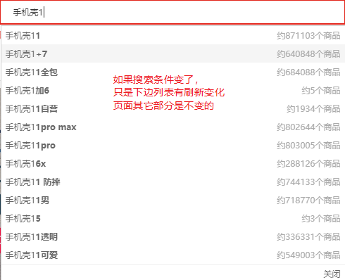
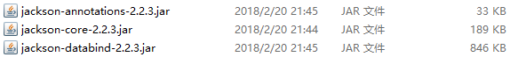
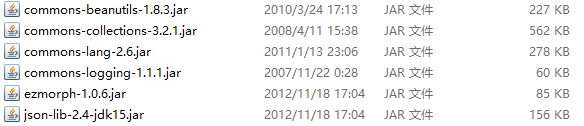

# Ajax-课堂笔记

* jQuery本质还是js，只是对js做了简化封装

* dom

  * 找它：用选择器
    * 基本选择器：`$("div"), $("#d1"), $(".cls"), $("#d1, .cls")`
    * 层级选择器：`$("div span"), $("div>span")`
    * 属性选择器：`$("div[name]"), $("div[name='d1']")`
    * 基本过滤选择器：
      * `:first, :last, :not()`
      * `:odd, :even, :eq(n), :gt(n), :lt(n)`
      * `:header, :animated`
    * 表单属性选择器：
      * `:enabled, :disabled`
      * `:checked, :selected`
  * 搞它：用dom操作的方法
    * 操作标签体内容：`html(), text()`
    * 操作表单项的值：`val()`
    * 操作属性：`attr(), prop()`
    * 操作样式：`css(), addClass(), removeClass()`
    * 操作标签：`$("完整html代码"), appendTo(), prependTo(), remove(), empty()`

* 事件

  * 基本事件绑定：`click(function(){}), dblclick(function(){})`
  * 加载完成事件：`$(function(){}), $(document).ready(function(){})`
  * 事件绑定与解绑：`on()绑定， off()解绑`

* 动画

* 循环遍历

  * js的循环：`for i,   for of`
  * jQuery的循环

  ```js
  //jQuery框架的each方法
  $.each(集合/数组, function(index, element){});
  //jQuery对象的each方法
  $("li").each(function(index, element){});
  ```

  

## 一、Ajax简介

### 目标

* 了解Ajax的概念
* 理解同步和异步的效果

### 讲解

#### 1. 什么是Ajax

- Ajax：Asynchronous JavaScript and XML，异步的JS和XML。
  - JS：Ajax技术是JavaScript提供的
  - XML：服务端和客户端交互时使用的数据格式是XML，但是目前已经被JSON代替了。

  > XML：
  >
  > * 作为配置文件：
  >   * xml（使用麻烦，可以配置复杂数据）==> 注解，json
  >   * properties（使用简单，不能配置复杂数据）
  > * 作为数据传输的格式==>json
  
- Ajax的作用：
  - 局部刷新技术：只刷新页面的一部分，不刷新整个页面。刷新速度快，用户体验好
  
    
  
  - 异步加载技术：发完请求之后，不需要等待结果，可以继续做其它事情。

#### 2. 同步和异步

- 同步：发完请求之后，**要等待**服务端的响应；在响应回来之前，**是“假死”状态**
- 异步：发完请求之后，**不需要等待**服务端的响应；在响应回来之前，仍然可以做其它操作，而**不会“假死”**

#### 3. Ajax的使用场景

- 如果要求**在页面不刷新/不跳转**的情况下，完成一些功能，那么这个功能就要使用Ajax实现。

  - 比如：登录功能，可以使用Ajax，也可以不使用Ajax。具体是否使用，要看需求
    - 不使用Ajax时，点击“登录”，页面会跳转一次
    - 使用Ajax时，点击”登录“，页面不会跳转，用户体验好

  

- 来历：Microsoft的IE提供的，但是由chrome推广：Chrome的gmail邮箱里使用了自己的Ajax技术

### 小结

* Ajax技术：由JavaScript提供的一项技术
  * 实现局部刷新：只刷新页面的一部分，而不刷新整个页面
  * 实现异步加载：发请求之后不会假死，可以继续做其它操作
* Ajax技术：加载速度快，用户体验好
* 什么时候要使用Ajax技术？如果要求在 页面不刷新/不跳转的情况下实现功能，就要使用Ajax技术
* 同步和异步【理解】
  * 同步：发请求之后会假死，等待响应
  * 异常：发请求之后不会假死，可以继续做其它操作


## 二、js的Ajax【了解】

### 目标

* 使用js实现Ajax效果
* 理解异步加载的效果
* 理解局部刷新的效果

### 分析

1. 创建一个Ajax引擎对象
2. 给Ajax引擎对象绑定事件，监听状态变化。
   - 如果监听到Ajax引擎已经得到响应，就可以向Ajax引擎要响应结果了
3. 给Ajax引擎对象设置请求的信息
4. 让Ajax引擎对象发送请求

### 实现

```js
//1.创建一个Ajax引擎对象
var xmlhttp = new XMLHttpRequest();
//2.绑定事件监听xmlhttp的状态变化
xmlhttp.onreadystatechange = function(){
    if(xmlhttp.readyState === 4){
        if(xmlhttp.status === 200){
            //5. 得到响应结果
            var result = xmlhttp.responseText;
            //对结果的处理
            document.getElementById("resultDiv").innerHTML= result;
        }
    }
}
//3.设置请求的信息
xmlhttp.open("GET","ajaxServlet",true);
//4.发送请求
xmlhttp.send();
```

> js的Ajax问题：
>
> 1. 重复代码过多。不同功能只是请求信息和响应结果的处理不同，其它完全一样
> 2. 有浏览器兼容性问题。

### 小结

* js的Ajax

```js
//1.创建Ajax引擎对象
let xmlhttp = new XMLHttpRequest();
//2.给Ajax引擎对象绑定事件，监听它的状态变化
xmlhttp.onreadystatechange = function(){
    //当Ajax引擎对象的状态为4，并且响应状态200时，可以获取响应数据
    if(xmlhttp.readyState === 4 && xmlhttp.status === 200){
    	document.getElementById("resultDiv").innerHTML = xmlhttp.responseText;   
    }
}
//3.设置请求信息  请求方式 请求地址 是否异步
xmlhttp.open("get", "./demo", true);
//4.发送请求
xmlhttp.send();
```


## 三、jQuery的Ajax【重点】

### 目标

* 能够使用`$.post()`方法和`$.get()`方法
* 能够使用`$.ajax()`方法

### 讲解

#### 1. `$.get()`和`$.post()`

##### 1.1 语法

- `$.get(url, data, callback, type)`：GET方式的请求

- `$.post(url, data, callback, type)`：POST方式的请求

- 参数：

  - url：请求的地址。必须 

  - data：提交的表单参数。非必须，格式有两种：

    - `name=value&name=value&...`--字符串形式
    - `{name:value, name:value, ...}` --js对象形式，jQuery的表单校验插件里用过

  - callback：回调函数，非必须，是一个匿名函数，里边写：对响应结果的处理

    ```js
    function(result){
        //result：服务端响应的结果
    }
    ```

  - type：服务端响应的结果类型，非必须。`text, json`

##### 1.2 示例

```js
$.get("ajaxServlet","name=tom&age=20",function(result){
    //处理服务端的结果：result
    $("#resultDiv").html(result);
},"text");

$.post("ajaxServlet","name=tom&age=20",function(result){
    //处理服务端的结果：result
    $("#resultDiv").html(result);
},"text");
```

#### 2. `$.ajax()`

##### 2.1 语法：

- `$.ajax({key:value, key:value,...})`。其中，每个key就是一个配置项，常用的配置项有：
  - url：请求的地址。必须
  - data：请求提交的表单参数，格式有两种：
    - `name=value&name=value&...`
    - `{key:value, key:value,...}`
  - type：请求方式，常用的有GET/POST。将来还会用到PUT, DELETE
  - dataType：服务端响应的数据类型/格式，常用的有text, json
  - success：回调函数，用来处理结果的
  - async：是否异步，默认是true

##### 2.2 示例：

```js
$.ajax({
    url:"ajaxServlet",
    data:"name=jack&age=21",
    type:"get",
    dataType:"text",
    success:function(result){
        $("#resultDiv").html(result);
    },
    async:true
});
```

### 小结

* 【掌握】`$.get(url, data, callback, type)`：发GET方式的Ajax请求

* 【掌握】`$.post(url, data, callback, type)`：发POST方式的Ajax请求

  * url：请求地址，必须有

  * data：提交的表单参数，有两种格式，最终效果相同：

    * 字符串形式`username=tom&password=1234`
    * js对象形式`{username:"tom", password:"1234"}`

  * callback：用于处理响应结果的回调函数

    ```js
    function(result){
        //result：是服务端响应的数据
    }
    ```

  * type：服务端响应的数据格式，常用值有
    * `text`：jQuery会把服务端响应数据以字符串形式传递给回调函数
    * `json`：jQuery会尝试把响应数据转换成json对象，再传递给回调函数

* 【备用】`$.ajax({name:value, name:value,...})` 其中每个`name:value`是一个配置项，常用的有

  * url：请求地址，必须有
  * data：提交的表单参数，有两种格式，最终效果相同：
    * 字符串形式`username=tom&password=1234`
    * js对象形式`{username:"tom", password:"1234"}`
  * type：请求方式，常用的有`get, post`
  * dataType：服务端响应的数据格式，常用的`text, json`
  * success：用于处理响应结果的回调函数
  * async：是否异步，默认是true


## 四、json【重点】

### 1. json简介和语法

#### 目标

* 了解json的作用
* 能够定义和解析json（类似于XML里：如何定义XML和解析XML）

#### 讲解

##### 1. 什么是json

- json：JavaScript Object Notation，js对象标记法。是一种轻量级的数据格式，可以代替XML。

##### 2. json的语法

- 定义的语法：
  - 对象形式：`{"name":value, "name":value, ...}`
    - 类似于js对象的格式：`{key:value, key:value, ...}`
  - 数组形式：`[value1, value2, value3,...]`    `var arr = ["a","b","c"]`
  - 混合形式：以上两种类型任意混合
- 解析的语法：
  - 从数组里取数据，使用索引：`[索引]`
  - 从对象里取数据，使用`.name`

##### 3. json定义与解析练习

* 对象形式

  ```js
  //定义一个json对象，比xml格式要简单
  var obj = {"name":"三丰", "age":100};
  //解析json对象，获取name的值
  var v = obj.name;
  alert(v);
  ```

  ```xml
  <?xml version="1.0" encoding="utf-8" ?>
  <user>
  	<name>三丰</name>
      <age>100</age>
  </user>
  ```

* 混合形式

  ```js
  //定义一个数组，数组中每个元素是json对象
  var wudang = [
      {"name":"三丰", "age":100},
      {"name":"翠山", "age":40},
      {"name":"青书", "age":20}
  ];
  //解析，获取其中第3个元素的name
  var v = wudang[2].name;
  alert(v);
  ```

#### 小结

* json的定义：
  * 对象形式：`{"name":value, "name":value, ....}`
  * 数组形式：`[value1, value2, value3,....]`
  * 混合形式：以上两种形式可以任意混合
* json的解析：
  * 从对象里取数据：`let v = json对象.key`
  * 从数组里取数据：`let v = json对象[索引]`

### 2. jackson转换工具

#### 目标

* 掌握`Jackson`转换json的方法

#### 分析

- Jackson：掌握。SpringMVC框架内置的工具包

  

- jsonlib：Java提供的，不常用

  

- gson：google提供的工具包，应用非常普遍

  

- fastjson：Alibaba提供的工具包，高性能的

  

#### 讲解

#####  Jackson的API介绍

* Jackson提供了转换的核心类：`ObjectMapper`
* `ObjectMapper`的构造方法：无参构造
* `ObjectMapper`的常用方法：

| 方法                                              | 说明                                     |
| ------------------------------------------------- | ---------------------------------------- |
| `writeValueAsString(Object obj)`                  | 把obj对象里的数据转换成json格式          |
| `readValue(String json, Class type)`              | 把json字符串，还原成type类型的Java对象   |
| `readValue(String json, TypeReference reference)` | 把json字符串，还原成带泛型的复杂Java对象 |

* 其中`TypeReference`，`com.fasterxml.jackson.core.type.TypeReference`
  * 是一个抽象类，用于配置完整的泛型映射信息，避免泛型丢失的问题。用法示例：

``` java
// List<Integer> 类型的映射信息
TypeReference ref1 = new TypeReference<List<Integer>>() {};

// List<User> 类型的映射信息
TypeReference ref2 = new TypeReference<List<User>>() {};

// Map<String,User> 类型的映射信息
TypeReference ref3 = new TypeReference<Map<String,User>>(){};
```

##### Jackson的使用示例

1. 导入jar包

   

2. 编写代码

   * 提供一个`User`类

   ```java
   public class User {
       private String name;
       private Integer age;
   
       public User() {
       }
   
       public User(String name, Integer age) {
           this.name = name;
           this.age = age;
       }
   
       public String getName() {
           return name;
       }
   
       public void setName(String name) {
           this.name = name;
       }
   
       public Integer getAge() {
           return age;
       }
   
       public void setAge(Integer age) {
           this.age = age;
       }
   
       @Override
       public String toString() {
           return "User{" +
                   "name='" + name + '\'' +
                   ", age=" + age +
                   '}';
       }
   }
   ```

   * Jackson使用示例

   ```java
   import com.fasterxml.jackson.core.JsonProcessingException;
   import com.fasterxml.jackson.core.type.TypeReference;
   import com.fasterxml.jackson.databind.ObjectMapper;
   import com.itheima.domain.User;
   import org.junit.Test;
   
   import java.io.IOException;
   import java.util.ArrayList;
   import java.util.HashMap;
   import java.util.List;
   import java.util.Map;
   
   /**
    * Jackson使用示例
    */
   public class Demo01Jackson {
   
       /**
        * Java对象转换成json格式的字符串
        */
       @Test
       public void testJava2Json() throws JsonProcessingException {
           User user1 = new User("张三", 20);
           User user2 = new User("李四", 25);
   
           List<User> userList = new ArrayList<>();
           userList.add(user1);
           userList.add(user2);
   
           Map<String, User> userMap = new HashMap<>();
           userMap.put("u1", user1);
           userMap.put("u2", user2);
   
           ObjectMapper mapper = new ObjectMapper();
   
           //1. 把user1对象里的数据转换成json格式
           String json = mapper.writeValueAsString(user1);
           System.out.println(json);
   
           //2. 把userList集合里的数据转换成json格式
           json = mapper.writeValueAsString(userList);
           System.out.println(json);
   
           //3. 把userMap里的数据转换成json格式
           json = mapper.writeValueAsString(userMap);
           System.out.println(json);
       }
   
       /**
        * json格式的字符串转换成User对象
        * json：  {"name":"张三","age":20}
        */
       @Test
       public void testJson2JavaBean() throws IOException {
           ObjectMapper mapper = new ObjectMapper();
   
           String jsonObj = "{\"name\":\"张三\",\"age\":20}";
   
           //转换成User对象
           User user = mapper.readValue(jsonObj, User.class);
   
           System.out.println(user);
       }
   
       /**
        * json格式的字符串转换成List<User>
        * json： [{"name":"张三","age":20},{"name":"李四","age":25}]
        */
       @Test
       public void testJson2JavaArray() throws IOException {
           ObjectMapper mapper = new ObjectMapper();
   
           String jsonArray = "[{\"name\":\"张三\",\"age\":20},{\"name\":\"李四\",\"age\":25}]";
   
           //定义List<User>类型的映射信息
           TypeReference ref = new TypeReference<List<User>>(){};
           List<User> userList = mapper.readValue(jsonArray, ref);
   
           System.out.println(userList);
       }
   
       /**
        * json格式的字符串转换成Map<String,User>
        * json： {"u1":{"name":"张三","age":20},"u2":{"name":"李四","age":25}}
        */
       @Test
       public void testJson2JavaMap() throws IOException {
           ObjectMapper mapper = new ObjectMapper();
   
           String jsonObj = "{\"u1\":{\"name\":\"张三\",\"age\":20},\"u2\":{\"name\":\"李四\",\"age\":25}}";
   
           //定义Map<String, User>类型的映射信息
           TypeReference<Map<String, User>> ref = new TypeReference<Map<String, User>>() {};
           Map<String, User> map = mapper.readValue(jsonObj, ref);
   
           System.out.println(map);
       }
   }
   ```

#### 小结

```java
//1. 创建一个ObjectMapper对象
ObjectMapper mapper = new ObjectMapper();
//2. 把Java对象转换成json：JavaBean、JavaBean的数组、JavaBean的集合、JavaBean的Map等都可以
String jsonStr = mapper.writeValueAsString(Java对象);


//3. 把json字符串还原成不带泛型的JavaBean对象
mapper.readValue("json格式的字符串", JavaBean类.class);

//4. 把json字符串还原成带泛型的JavaBean对象
//4.1 创建一个TypeReference
TypeReference tr = new TypeReference<泛型信息>(){};
//4.2 使用工具还原成指定的类型
mapper.readValue("json格式的字符串", tr);
```


### 3. fastjson转换工具

#### 目标

* 能够使用转换工具Fastjson，转换Java对象和json格式

#### 分析

1. Fastjson的API介绍
2. Fastjson的使用示例

#### 讲解

##### 1. fastjson的API介绍

* fastjson提供了核心类：`JSON`
* `JSON`提供了一些常用的**静态**方法：

| 方法                                                | 说明                                     |
| --------------------------------------------------- | ---------------------------------------- |
| `toJSONString(Object obj)`                          | 把obj对象里的数据转换成json格式          |
| `parseObject(String json, Class type)`              | 把json字符串，还原成type类型的Java对象   |
| `parseObject(String json, TypeReference reference)` | 把json字符串，还原成带泛型的复杂Java对象 |

* 其中`TypeReference`：`com.alibaba.fastjson.TypeReference`
  * 是一个抽象类，用于配置完整的泛型映射信息，避免泛型丢失的问题。用法示例：

``` java
// List<Integer> 类型的映射信息
TypeReference ref1 = new TypeReference<List<Integer>>() {};

// List<User> 类型的映射信息
TypeReference ref2 = new TypeReference<List<User>>() {};

// Map<String,User> 类型的映射信息
TypeReference ref3 = new TypeReference<Map<String,User>>(){};
```

##### 2. fastjson的使用示例

1. 导入jar包

   

2. 编写代码

```java
import com.alibaba.fastjson.JSON;
import com.alibaba.fastjson.TypeReference;
import com.itheima.domain.User;
import org.junit.Test;

import java.io.IOException;
import java.util.ArrayList;
import java.util.HashMap;
import java.util.List;
import java.util.Map;

/**
 * FastJson使用示例
 */
public class Demo02FastJson {
    /**
     * Java对象转换成json格式的字符串
     */
    @Test
    public void testJava2Json(){
        User user1 = new User("张三", 20);
        User user2 = new User("李四", 25);

        List<User> userList = new ArrayList<>();
        userList.add(user1);
        userList.add(user2);

        Map<String, User> userMap = new HashMap<>();
        userMap.put("u1", user1);
        userMap.put("u2", user2);


        //1. 把user1对象里的数据转换成json格式
        String json = JSON.toJSONString(user1);
        System.out.println(json);

        //2. 把userList集合里的数据转换成json格式
        json = JSON.toJSONString(userList);
        System.out.println(json);

        //3. 把userMap里的数据转换成json格式
        json = JSON.toJSONString(userMap);
        System.out.println(json);
    }

    /**
     * json格式的字符串转换成User对象
     * json：  {"name":"张三","age":20}
     */
    @Test
    public void testJson2JavaBean() throws IOException {

        String jsonObj = "{\"name\":\"张三\",\"age\":20}";

        //转换成User对象
        User user = JSON.parseObject(jsonObj, User.class);

        System.out.println(user);
    }

    /**
     * json格式的字符串转换成List<User>
     * json： [{"name":"张三","age":20},{"name":"李四","age":25}]
     */
    @Test
    public void testJson2JavaArray() throws IOException {

        String jsonArray = "[{\"name\":\"张三\",\"age\":20},{\"name\":\"李四\",\"age\":25}]";

        //定义List<User>类型的映射信息
        TypeReference<List<User>> ref = new TypeReference<List<User>>() {};
        List<User> userList = JSON.parseObject(jsonArray, ref);

        System.out.println(userList);
    }

    /**
     * json格式的字符串转换成Map<String,User>
     * json： {"u1":{"name":"张三","age":20},"u2":{"name":"李四","age":25}}
     */
    @Test
    public void testJson2JavaMap() throws IOException {

        String jsonObj = "{\"u1\":{\"name\":\"张三\",\"age\":20},\"u2\":{\"name\":\"李四\",\"age\":25}}";

        //定义Map<String, User>类型的映射信息
        TypeReference<Map<String, User>> ref = new TypeReference<Map<String, User>>() {};
        Map<String, User> map = JSON.parseObject(jsonObj, ref);

        System.out.println(map);
    }
}
```

#### 小结

* 使用fastjson：导入jar包

```java
//1.把Java对象转换成json格式字符串
String jsonStr = JSON.toJSONString(Java对象);

//2.把json还原成Java对象
User user = JSON.parseObject("json字符串", User.class);

TypeReference<List<User>> tr = new TypeReference<List<User>>(){};
List<User> userList = JSON.parseObject("json格式字符串", tr);
```

## 五、练习

### 目标

* 完成异步校验用户名 和  异步搜索自动填充功能

### 分析

### 实现

#### 搭建开发环境

* 初始化数据库：执行sql脚本《demo.sql》
* 在idea里创建web Module
* 把页面拷贝到web项目的`web`文件夹里
* 把jar包拷贝到web项目的`WEB-INF/lib`文件夹里，选中所有的jar包，add as library
* 把配置文件拷贝到src里，注意修改数据库连接信息
* 在src里创建包：
  * `com.itheima.web`
  * `com.itheima.service`
  * `com.itheima.dao`
  * `com.itheima.domain`
  * `com.itheima.util`
  * `com.itheima.filter`
* 在`com.itheima.domain`里创建JavaBean：`User`对应数据库的user表
* 把编码过滤器拷贝放到`com.itheima.filter`里

#### 异步校验用户名


#### 异步搜索自动填充

# 复习上午内容

* Ajax介绍

  * 实现局部刷新效果
  * 实现异步加载效果

* 什么时候要使用Ajax？如果要求在页面不刷新的情况下实现功能，要使用Ajax技术

* 同步和异步

  * 同步：发请求之后要等待响应，等待过程中是“假死”状态
  * 异步：发请求之后不会“假死”，可以继续做其它操作

* jQuery的Ajax【重点】

  * `$.get(url, data, callback, type)`
  * `$.post(url, data, callback, type)`
  * `$.ajax({name:value, name:value, ...})`
    * url：请求地址
    * data：提交的表单参数
    * type：请求方式
    * dataType：服务端响应的数据格式
    * success：回调函数
    * async：是否异步

* json格式定义与解析

  * 定义json：
    * 对象形式：`{"name":value, "name":value,...}`
    * 数组形式：`[value1, value2, value3,....]`
    * 混合形式
  * 解析json：
    * 从对象里取数据：`let v = json对象.name`
    * 从数组里取数据：`let v = json对象[索引]`

* json转换工具

  * jackson的使用：导入jar包

  ```java
  //1. 创建ObjectMapper对象
  ObjectMapper mapper = new ObjectMapper();
  
  //2. 把Java对象转换成json格式的字符串
  String jsonStr = mapper.writeValueAsString(Java对象);
  
  //3. 把json字符串还原成Java对象
  User user = mapper.readValue("json格式字符串", User.class);
  
  
  TypeReference tr = new TypreReference<List<User>>(){};
  List<User> userList = mapper.readValue("json格式字符串", tr);
  ```

  