# Vue.JS的使用-课堂笔记

* Ajax：在页面不刷新的情况下，发请求到服务端得到响应，实现功能

  * 局部刷新
  * 异步加载

* jQuery的Ajax：

  * `$.get(url, data, callback, type)`：发GET方式的Ajax请求
  * `$.post(url, data, callback, type)`：发POST方式的Ajax请求
  * `$.ajax({name:value, name:value, ...})`每个键值对就是一个配置项
    * url：请求地址
    * data：提交的表单参数
    * type：请求方式
    * dataType：响应的数据格式
    * success：处理响应的回调函数
    * async：是否异步

* json

  * json的定义
    * 对象形式：`{"name":value, "name":value, ...}`
    * 数组形式：`[v1, v2, v3, ....]`
    * 混合形式：以上两种类型可以任意混合
  * json的解析：
    * 从对象里取数据：`let v = json对象.name`
    * 从数组里取数据：`let v = json对象[索引]`

* Java对象和json的转换工具

  * Jackson

  ```java
  ObjectMapper mapper = new ObjectMapper();
  
  String jsonStr = mapper.writeValueAsString(Java对象);
  
  User user = mapper.readValue(jsonStr, User.class);
  
  TypeReference tr = new TypeReference<List<User>>(){};
  List<User> userList = mapper.readValue(jsonStr, tr);
  ```

  * fastjson

  ```java
  String jsonStr = JSON.toJSONString(Java对象);
  
  User user = JSON.parseObject(jsonStr, User.class);
  
  TypeReference<List<User>> tr = new TypeReference<List<User>>(){};
  List<User> userList = JSON.parseObject(jsonStr, tr);
  ```

  

## 一、Vue简介

### Vue简介

#### 目标

* 了解什么是VueJS
* 理解MVVM模式

#### 讲解

##### 1. 什么是Vue

* Vue.js是一个渐进式JavaScript 框架，作者尤雨溪。
* Vue.js 的目标是通过尽可能简单的 API， 实现响应的数据绑定和组合的视图组件。
* 它不仅易于上手，还便于与第三方库（ElementUI）或既有项目整合。
* 官网地址：https://cn.vuejs.org/

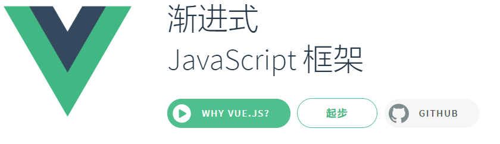

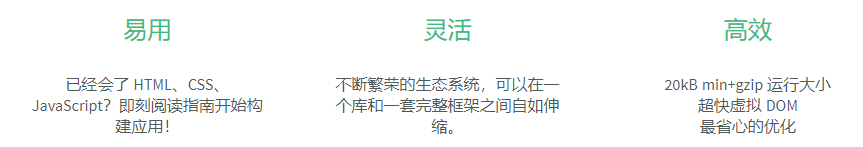

##### 2. MVVM模式

> MVC模式：实现了解耦，提高程序的可维护性
>
> * M：Model，指数据的封装
> * V：View，指的显示的视图界面/页面
> * C：Controller，指实现的逻辑控制

* MVVM是Model-View-ViewModel的简写。
* 它本质上就是MVC 的改进版：MVVM 就是将其中的View 的状态和行为抽象化，让我们将视图UI 和业务逻分开。MVVM模式和MVC模式一样，主要目的是分离视图（View）和模型（Model），解耦的
* Vue.js 是一个提供了 MVVM 风格的双向数据绑定的 Javascript 库，专注于View 层。它的核心是 MVVM 中的 VM，也就是 ViewModel。ViewModel负责连接 View 和 Model，保证视图和数据的一致性，这种轻量级的架构让前端开发更加高效、便捷。


#### 小结

* Vue框架：是一个渐进式js框架，简单灵活高效
* MVVM：Model-View-ViewModel，目的是解耦，把View页面视图  和  Model数据进行了解耦
  * 我们Model数据，由**框架(vue的ViewModel)**帮我们显示到View页面上
  * View页面上表单数据变了，由**框架(vue的ViewModel)**把数据同步交给我们，我们可以直接使用

### Vue快速入门

#### 目标

* 使用vue，对message赋值，并把值显示到页面

#### 步骤

1. 把vue.js拷贝到web应用里
2. 创建html页面，在页面里引入vue.js
3. 在页面里编写代码：创建Vue实例，在页面中显示message的值

#### 实现

* 页面代码：

```html
<!DOCTYPE html>
<html lang="en">
<head>
    <meta charset="UTF-8">
    <title>快速入门</title>
</head>
<body>
<div id="app">
    {{message}}
</div>

<script src="js/vuejs-2.5.16.js"></script>
<script>
    new Vue({
        el:"#app",
        data:{
            message:"hello, world"
        }
    });
</script>
</body>
</html>
```

* 显示效果

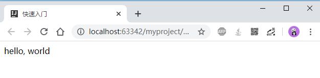

#### 小结

1. 在html里引入vue类库
2. 在html里定义一个html标签==>需要交给Vue接管这个标签的区域
3. 在script里创建一个Vue实例对象

```html
<div id="app">
    {{message}}    
</div>

<script src="vue类库的路径"></script>
<script>
	new Vue({
        el:"#app",
        data:{
            message:"hello"
        }
    });
</script>
```


## 二、Vue的事件【重点】

### 目标

* 掌握Vue里常用事件的使用

### 分析

* 单击事件`@click`
* 键盘按下`@keydown`
* 鼠标移入`@mouseover`

### 讲解

#### 单击事件`@click`

##### 介绍

* 说明：用于监听鼠标单击事件
* 用法：用于html标签属性上，有两种等价写法
  * `v-on:click="方法名(实参列表)"`。如果没有实参，可以写成：`v-on:click="方法名"`
  * `@click="方法名(实参列表)"`。如果没有实参，可以写成：`@click="方法名"`
* 注意：
  * 事件调用的方法必须是Vue实例中定义的
  * 事件应该加在 被Vue接管的区域内

##### 示例

* 点击按钮时，修改message的值

```html
<!DOCTYPE html>
<html lang="en">
<head>
    <meta charset="UTF-8">
    <title>单击事件</title>
</head>
<body>
<div id="app">
    <!-- 点击时，调用fn1函数：把message的值修改成“你好，世界”。以下两种写法作用相同 -->
    <!--<input type="button" value="按钮1" v-on:click="fn1">-->
    <input type="button" value="按钮1" @click="fn1">
    
    <!-- 点击时，调用fn2函数，并传参 aaa，把参数值设置给了message。以下两种写法作用相同 -->
    <!--<input type="button" value="按钮2" v-on:click="fn2('aaa')"> -->
    <input type="button" value="按钮2" @click="fn2('aaa')">
    
    
    <br>
    <div>{{message}}</div>
</div>

<script src="js/vuejs-2.5.16.js"></script>
<script>
    new Vue({
        //表示：把id为app的元素，交给vue接管
        el:"#app",
        //data：Vue实例中定义的数据
        data:{
            message:"hello, world"
        },
        //methods：Vue实例中定义的方法
        methods:{
            fn1:function(){
                this.message = "你好，世界";
            },
            fn2:function(v){
                this.message = v;
            }
        }
    });
</script>
</body>
</html>
```


#### 键盘按下`@keydown`

##### 介绍

* 说明：用于监听键盘按下事件
* 用法：用于html标签属性上，有两种等价写法
  * `v-on:keydown="方法名(实参列表)"`。如果没有实参，可以写成：`v-on:keydown="方法名"`
  * `@keydown="方法名(实参列表)"`。如果没有实参，可以写成：`@keydown="方法名"`
* 注意：方法必须是Vue实例中定义的

##### 示例

* 当在文本框里输入时，如果按下的是数字0~9，允许输入；否则不允许输入（阻止输入事件）
* 注意：部分数字键盘码对照如下图（完整的键盘码对照图参考笔记最后的《附：键盘ASCII对照》）

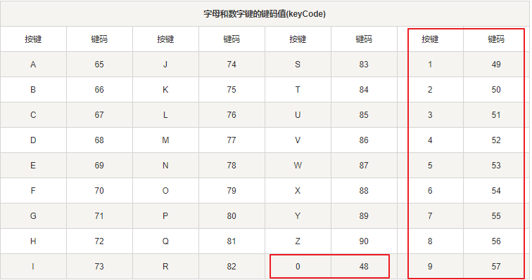

```html
<!DOCTYPE html>
<html lang="en">
<head>
    <meta charset="UTF-8">
    <title>键盘按下</title>
</head>
<body>
<div id="app">
    <!-- $event：是Vue提供的，当前事件对象 -->
    <input type="text" v-on:keydown="inputNumber($event)">
</div>
<script src="js/vuejs-2.5.16.js"></script>
<script>
    new Vue({
        el:"#app",
        methods:{
            inputNumber:function(e){
                //获取键盘码，即：用户按的哪个按键。得到的是按键对应的ASCII值
                var keyCode = e.keyCode;
                //ASCII中49~57，表示数字0~9
                if (keyCode < 48 || keyCode > 57) {
                    //方法作用是：阻止事件继续执行
                    e.preventDefault();
                }
            }
        }
    });
</script>
</body>
</html>
```


#### 鼠标移入`@mouseover`

##### 介绍

* 说明：用于监听鼠标移入事件
* 用法：用于html标签属性上，有两种等价写法
  * `v-on:mouseover="方法名(实参列表)"`。如果没有实参，可以写成：`v-on:mouseover`="方法名"`
  * `@mouseover="方法名(实参列表)"`。如果没有实参，可以写成：`@mouseover="方法名"`
* 注意：方法必须是Vue实例中定义的

##### 示例

* 鼠标移入div时，弹窗：来啦老弟

```html
<!DOCTYPE html>
<html lang="en">
<head>
    <meta charset="UTF-8">
    <title>鼠标移入</title>
    <style>
        div{
            width:200px;
            height:200px;
            background-color: green;
        }
    </style>
</head>
<body>

<div id="app" @mouseover="over"></div>

<script src="js/vuejs-2.5.16.js"></script>
<script>
    new Vue({
        el:"#app",
        methods:{
            over:function(){
                alert("来啦老弟");
            }
        }
    });
</script>
</body>
</html>
```

### 小结

* 单击事件绑定
  * 标签要写在被Vue接管的区域内
  * 方法要定义到Vue实例的方法区域内
* 单击事件的语法：
  * `v-on:click="方法名(实参)"`,  `v-on:click="方法名"`
  * `@click="方法名(实参)"`,  `@click="方法名"`
* 键盘按下事件：
  * `v-on:keydown="方法名(实参)"`
  * `@keydown="方法名(实参)"`
  * 拓展：
    * `@keydown="方法名($event)"`，其中`$event`是事件对象
      * `keyCode`：可以用来获取按键的键码
      * `preventDefault()`：用于阻止事件的继续执行

```html
<div id="app">
    <input type="button" value="按钮" v-on:click="fn">
    <input type="button" value="按钮" @click="fn">
</div>
<script src="vue类库路径"></script>
<script>
	new Vue({
        el:"#app",
        data:{
            
        },
        methods:{
            fn:function(){
                alert();
            }
        }
    });
</script>
```


### 拓展【了解】

#### 事件修饰符

##### 说明

* Vue提供了一些事件的相关处理方法，例如：
  * `e.preventDefault()`：阻止事件的继续执行
  * `e.stopPropagation()`：阻止事件冒泡
* 但是使用起来比较麻烦。Vue提供了事件修饰符`.`来简化这种写法

| 事件修饰符 | 作用描述                                                     |
| ---------- | ------------------------------------------------------------ |
| `.stop`    | 阻止事件冒泡                                                 |
| `.prevent` | 阻止事件继续执行                                             |
| `.capture` | 事件冒泡中，捕获事件先执行(会影响事件冒泡的执行顺序，先执行capture的事件，再冒泡) |
| `.self`    | 只点自己身上才运行，冒泡过来的事件不执行                     |
| `.once`    | 只执行一次                                                   |

##### 示例

* 在curd练习中，我们曾经把a标签用作删除按钮，点击时弹出确认窗口，而不跳转

```html
<!DOCTYPE html>
<html lang="en">
<head>
    <meta charset="UTF-8">
    <title>事件修饰符</title>
</head>
<body>
<div id="app">
    <!-- 点击时，触发deleteUser方法，并且阻止a标签本身的跳转功能 -->
    <a href="http://www.baidu.com" @click.prevent="deleteUser">删除</a>
</div>
<script src="js/vuejs-2.5.16.js"></script>
<script>
    new Vue({
        el:"#app",
        methods:{
            deleteUser:function(){
                confirm("确定要删除吗");
            }
        }
    });
</script>
</body>
</html>
```

#### 按键修饰符

##### 说明

* 在刚刚的键盘按下事件的示例中，我们要求只能输入数字，是通过获取事件的ASCII码，来判断用户按下的按键是否是数字键。这样比较麻烦
* Vue提供了按键的修饰符，允许在监听键盘事件时添加上，简化功能

| 按键修饰符 | 作用描述                           |
| ---------- | ---------------------------------- |
| `.enter`   | 如果按的是回车键，则触发           |
| `.tab`     | 如果按的是Tab键，则触发            |
| `.delete`  | 如果按的是“删除”或“退格”键，则触发 |
| `.esc`     | 如果按的是ESC键，则触发            |
| `.space`   | 如果按的是空格键，则触发           |
| `.up`      | 如果按的是方向键上，则触发         |
| `.down`    | 如果按的是方向键下，则触发         |
| `.left`    | 如果按的是方向键左，则触发         |
| `.right`   | 如果按的是方向键右，则触发         |
| `.ctrl`    | 如果按的是Ctrl键，则触发           |
| `.alt`     | 如果按的是Alt键，则触发            |
| `.shift`   | 如果按的是Shift键，则触发          |
| `.meta`    | 如果按的是Windows键，则触发        |

##### 示例

* 如果用户在文本框上按了回车键，则阻止表单提交，使用Ajax异步提交

```html
<!DOCTYPE html>
<html lang="en">
<head>
    <meta charset="UTF-8">
    <title>按键修饰符</title>
</head>
<body>
<div id="app">
    <form action="#" method="get">
        
        <!-- 键盘按键按下时，阻止表单本身默认的提交动作。如果是回车键，执行submitForm方法 -->
        <input type="text" name="username" @keydown.prevent.enter="submitForm">

        <input type="submit" value="提交">
    </form>
</div>

<script src="js/vuejs-2.5.16.js"></script>
<script>
    new Vue({
        el:"#app",
        methods:{
            submitForm:function(){
                alert("按了回车键，Ajax提交表单");
            }
        }
    });
</script>
</body>
</html>
```

## 三、模板语法【重点】

### 目标

* 掌握Vue里常用指令

### 分析

* Vue指令：是Vue提供的一些`v-`开头特殊属性，每个指令有不同的功能
* 我们学习的有：
  * 插值表达式`{{}}`
  * `v-html`和`v-text`
  * `v-bind`和`v-model`

### 讲解

#### 1. 插值表达式`{{}}`

##### 介绍

* 插件表达式`{{}}`，用于把Vue实例里的数据，绑定到DOM中。如果数据变更，DOM也会跟着变化
  * 插入的是文本内容，html代码不生效
  * `{{ }}`中，支持JavaScript表达式

##### 示例

* 示例代码：

```html
<!DOCTYPE html>
<html lang="en">
<head>
    <meta charset="UTF-8">
    <title>插值</title>
</head>
<body>
<div id="app">
    {{message}}
    <hr>
    {{number>5?"number大于5":"number不大于5"}}
</div>

<script src="js/vuejs-2.5.16.js"></script>
<script>
    new Vue({
        el:"#app",
        data:{
            message:"<h1>hello</h1>",
            number:10
        }
    });
</script>
</body>
</html>
```

* 示例效果：


#### 2. `v-text`和`v-html`

##### 介绍

* 这两个指令，作为html标签的属性使用，把值输出到标签内部

* `v-text`：输出文本内容，html代码不生效
  * 作用和`{{}}`相同
  * 只是``{{}}``不能用在标签属性上，`v-text`则作为标签属性使用
* `v-html`：输出html代码，html代码会生效

##### 示例

* 示例代码：

```html
<!DOCTYPE html>
<html lang="en">
<head>
    <meta charset="UTF-8">
    <title>v-text和v-html</title>
</head>
<body>
<div id="app">
    <!-- 把message的值，作为文本，插入到div内部 -->
    <div v-text="message"></div>
    
    <!-- 把message的值，作为html代码，插入到div内部 -->
    <div v-html="message"></div>
</div>

<script src="js/vuejs-2.5.16.js"></script>
<script>
    new Vue({
        el:"#app",
        data:{
            message:"<h1>黑马程序员</h1>"
        }
    });
</script>
</body>
</html>
```

* 示例效果：

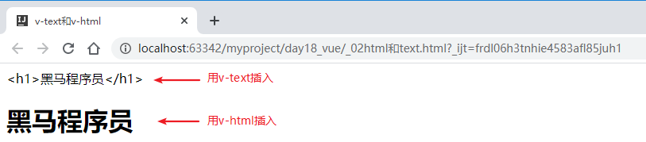

#### 3. `v-bind`和`v-model`

##### `v-bind`

* 把值绑定到html标签的原始属性上

* 语法：
  * 完整写法：`v-bind:属性名=""`
  * 简写形式：`:属性名=""`，可以省略`v-bind`不写，属性名以`:`开头即可

```html
<!DOCTYPE html>
<html lang="en">
<head>
    <meta charset="UTF-8">
    <title>v-bind</title>
</head>
<body>
<div id="app">
    <!-- 完整写法：把siteUrl的值，绑定给a标签的href属性 -->
    <a v-bind:href="siteUrl">{{siteTitle}}</a>

    <!-- 简写形式：把siteUrl的值，绑定给a标签的href属性 -->
    <a :href="siteUrl">{{siteTitle}}</a>
</div>

<script src="js/vuejs-2.5.16.js"></script>
<script>
    new Vue({
        el:"#app",
        data:{
            siteUrl:"http://www.baidu.com",
            siteTitle:"百度"
        }
    });
</script>
</body>
</html>
```

##### `v-model`

* 用于在表单 `input`、`textarea` 及 `select` 元素上，实现数据的绑定和读取
  * Vue里data中定义的数据，会显示到页面上：Model=>View
  * 页面上数据改变了，Vue里的data也会同步变化：View=>Model
* 语法：`v-model=""`

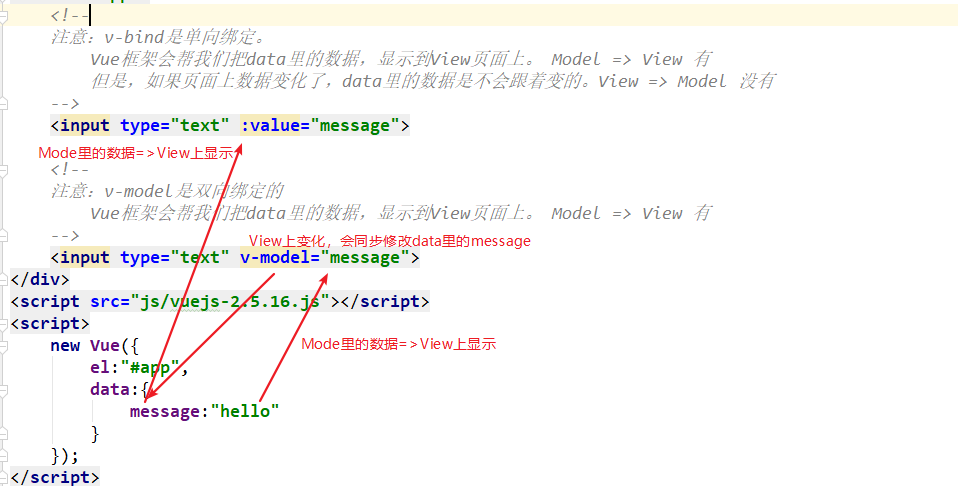

```html
<!DOCTYPE html>
<html lang="en">
<head>
    <meta charset="UTF-8">
    <title>v-model</title>
</head>
<body>
<div id="app">
    <!-- 打开页面后，两个文本框里会显示data中定义的username和email：Model=>View -->
    <!-- 当修改了文本框里的值，data中的数据也会同步变化（会显示到div里）：View=>Model-->
    <input type="text" v-model="user.username"><br>
    <input type="text" v-model="user.email"><br>

    <div>
        用户名：{{user.username}} <br>
        邮箱：{{user.email}}
    </div>
</div>

<script src="js/vuejs-2.5.16.js"></script>
<script>
    new Vue({
        el:"#app",
        data:{
            user:{
                username:"tom",
                email:"tom@163.com"
            }
        }
    });
</script>
</body>
</html>
```

### 小结

* 插值表达式：`{{数据项的名称}}`
  * 插值表达式支持js表达式，但是不能有多条js语句（比如：不能分号;）
  * 以文本的形式把数据输出到页面上（如果数据里有html代码，是不生效的）
* `v-text`：把数据项的值，以文本的形式插入到页面上 `<div v-text="数据项的名称"></div>`
* `v-html`：把数据项的值，以html代码形式插入到页面 `<div v-html="数据项的名称"></div>`
* `v-bind`：用于把数据项的值，绑定到页面上html标签的原始属性，是单向绑定
  * Model数据区域里的值 ----- >  View页面上：可以
  * View页面上数据变化   ------ > Model数据区域里：不能
* `v-model`：用于表单项的值  和 数据区域的数据 进行双向绑定
  * 数据区域里的值变了 --- > 页面上会显示
  * 页面表单项值变了   ----- > 数据区域的值会跟着变

## 四、条件和循环【重点】

### 目标

* 掌握Vue的条件判断和循环

### 分析

* 循环指令`v-for`
* 判断指令`v-if`
* 显示/隐藏指令`v-show`

### 讲解

#### `v-for`循环

##### 介绍

* 说明：用于集合、数组的循环遍历
* 语法：
  * 完整语法：`v-for="(element,index) in 集合/数组"`，加在要循环的标签上
  * 简写语法：`v-for="element in 集合/数组"`，加在要循环的标签上
    * `element`：指当前元素，名称可以自定义
    * `index`：指当前索引，名称可以自定义
  * 使用插值`{{element}}`和`{{index}}`，可以显示到页面上

##### 示例

* 循环用户数组，把所有用户显示出来

```html
<!DOCTYPE html>
<html lang="en">
<head>
    <meta charset="UTF-8">
    <title>v-for循环</title>
</head>
<body>
<div id="app">
    <ul>
        <li v-for="(user,index) in users">
            索引：{{index}}，
            姓名：{{user.name}}，
            年龄：{{user.age}}
        </li>
    </ul>
</div>

<script src="js/vuejs-2.5.16.js"></script>
<script>
    new Vue({
        el:"#app",
        data:{
            users:[
                {"name":"小张", "age":20},
                {"name":"小王", "age":25},
                {"name":"小李", "age":21},
                {"name":"小赵", "age":22}
            ]
        }
    });
</script>
</body>
</html>
```


##### 拓展

* 如果要想做基本循环，比如：在`ul`中循环5次`li`，`li`中显示1循环到5

```html
<!DOCTYPE html>
<html lang="en">
<head>
    <meta charset="UTF-8">
    <title>v-for拓展：基本循环</title>
</head>
<body>
<div id="app">
    <ul>
        <li v-for="i in count">{{i}}</li>
    </ul>
</div>

<script src="js/vuejs-2.5.16.js"></script>
<script>
    new Vue({
        el:"#app",
        data:{
            count:5
        }
    });
</script>
</body>
</html>
```


#### `v-if`判断

##### 介绍

* 说明：用于逻辑判断，根据判断条件的值，来决定是否渲染标签
* 语法：`v-if=""`，加在要判断的标签上。
  * 如果判断为true，标签生效
  * 如果判断为false，标签不生效
* 拓展了解：
  * 可以使用`v-else-if`，但`v-else-if` 也必须紧跟在带 `v-if` 或者 `v-else-if` 的元素之后。
  * 可以使用`v-else`，但`v-else` 元素必须紧跟在带 `v-if` 或者 `v-else-if` 的元素的后面，否则它将不会被识别。

##### 示例

```html
<!DOCTYPE html>
<html lang="en">
<head>
    <meta charset="UTF-8">
    <title>if判断</title>
</head>
<body>
<div id="app">
    <input type="button" value="设置number为10" @click="setNumber">
    <br>
    number的值是：{{number}}

    <!--当判断为false时，这个div相当于不存在；判断为true时，才会存在并生效-->
    <div v-if="number > 5">黑马程序员</div>
</div>

<script src="js/vuejs-2.5.16.js"></script>
<script>
    new Vue({
        el:"#app",
        data:{
            number:1
        },
        methods:{
            setNumber:function(){
                this.number = 10;
            }
        }
    });
</script>
</body>
</html>
```

* 当判断为false时：

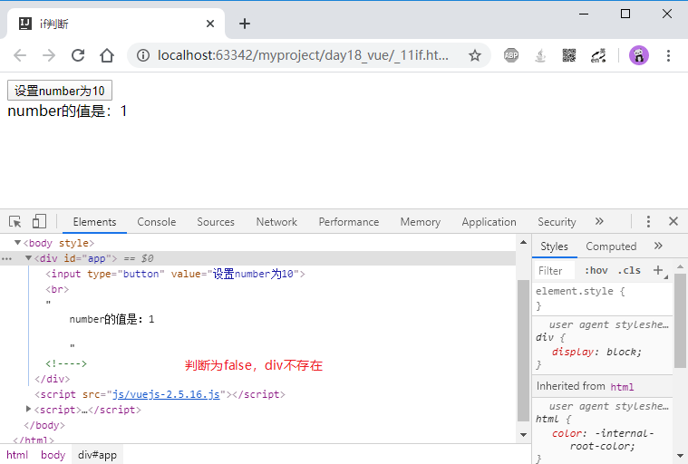

* 当判断为true时：


#### `v-show`显示/隐藏

##### 介绍

* 说明：根据判断条件，来切换元素的`display`样式，切换显示与隐藏
* 语法：`v-show=""`，加在要判断的标签上

##### 示例

```html
<!DOCTYPE html>
<html lang="en">
<head>
    <meta charset="UTF-8">
    <title>show显示隐藏</title>
</head>
<body>
<div id="app">
    <input type="button" value="设置number为10" @click="setNumber">
    <br>
    number的值是：{{number}}

    <!--当判断为false时，这个div会隐藏掉；判断为true时，才会显示-->
    <div v-show="number > 5">黑马程序员。number>5时显示，否则隐藏</div>
</div>

<script src="js/vuejs-2.5.16.js"></script>
<script>
    new Vue({
        el:"#app",
        data:{
            number:1
        },
        methods:{
            setNumber:function(){
                this.number = 10;
            }
        }
    });
</script>
</body>
</html>
```

* 当判断为false时：


* 当判断为true时：

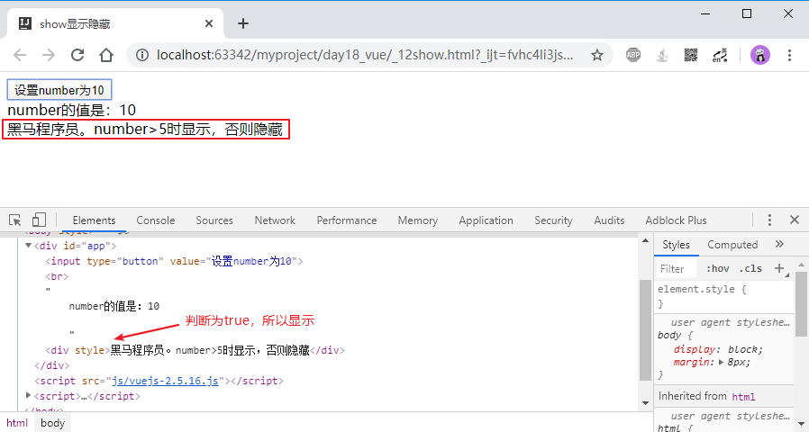

#### `v-if`和`v-show`的区别：

* 相同点：当判断条件为false时，元素都不会显示到页面上
* 不同点：
  * `v-if`：用于条件性的渲染DOM。如果不符合条件，那么元素不会被渲染、不在DOM中
  * `v-show`：元素始终会被渲染并保留在 DOM 中，仅仅是简单的切换元素的CSS样式`display`
* 所以：如果一个元素，需要频繁切换显示/隐藏状态，那么使用`v-show`效率更高；否则建议使用`v-if`。

### 小结

* 循环遍历`v-for`
  * 加在要循环的标签上 `v-for="(变量,索引) in 集合/数组"`,  `v-for="变量 in 集合/数组"`

```html
<tr v-for="(user, index) in userList">
	<td>{{index+1}}</td>
    <td>{{user.name}}</td>
    <td>{{user.age}}</td>
</tr>
```

* 条件判断`v-if`   加在要判断的标签上`v-if="判断条件"` 判断为true，元素会生效
* 显示隐藏`v-show`  加在要判断的标签上`v-show="判断条件"` 判断为true，元素会生效
* 不同之处：
  * `v-if`：如果判断为false，这个标签相当于被删除掉了；如果判断为true，相当于创建出来插入了dom树
  * `v-show`：如果判断为false，标签是存在但是是隐藏状态；如果判断为true，标签是存在但是是显示状态

## 五、Vue的生命周期【理解】

### 目标

* 了解Vue的生命周期

### 分析

1. 什么是Vue的生命周期
2. 生命周期演示

### 讲解

#### 什么是Vue的生命周期

##### 生命周期说明

* Vue的生命周期：指Vue实例从创建，到销毁的整个过程。
* 从我们`new Vue()`创建一个Vue实例开始，Vue做了一系列的操作过程：从监听数据、编译模板、将实例挂载到DOM、数据变化时更新DOM等等。
* 同时Vue也提供了一系列的生命周期钩子函数（模板式函数），可以让用户在钩子函数中添加自己的代码


##### 钩子方法说明

* `beforeCreate`：
  * 何时执行：刚刚创建了Vue对象，还没有监听data数据，也没有挂载到el对应的dom上
* `created`【重要】：
  * 何时执行：Vue对象已经读取了data，但是还没有挂载到el对应的dom上
  * 有何用处：我们能够通过Vue对象，操作data了。可以使用Ajax加载一些初始化数据，设置到data中
* `beforeMount`：
  * 何时执行：Vue对象已经读取了data，并且读取了el对应的元素，但元素里还有`{{}}`，数据尚未填充到元素里
* `mounted`：
  * 何时执行：Vue对象已经读取了data，并且读取了el对应的元素，且把data数据已经填充到元素的`{{}}`中，元素已经挂载到dom。
  * 在此之后，我们能够用方法来获取到el元素下的dom对象，并进行各种操作。
* `beforeUpdate`：
  * 何时执行：我们更新了Vue实例中的data数据，但是数据尚未更新到页面dom上
* `updated`：
  * 何时执行：Vue已经把我们变更的data数据，同步显示到了dom上
* `beforeDestroy`：
  * 何时执行：在我们调用了Vue对象的`$destroy()`方法之前
* `destroyed`：
  * 何时执行：在我们调用了Vue对象的`$destroy()`方法之后。我们再变更数据，不会再同步显示到页面上了

#### Vue的生命周期演示

* 演示代码：

```html
<!DOCTYPE html>
<html lang="en">
<head>
    <meta charset="UTF-8">
    <title>生命周期</title>
</head>
<body>
<div id="app">
    {{message}}
</div>

<script src="js/vuejs-2.5.16.js"></script>
<script>
    var vm = new Vue({
        el:"#app",
        data:{
            message:"hello"
        },
        beforeCreate:function(){
            //vue实例创建后，读取data数据之前执行。这时候不能获取data数据，不能获取el对应的元素
            console.group("========beforeCreate========");
            console.log("$el   : " + this.$el);
            console.log("$data : " + this.message);
            console.groupEnd();
        },
        created:function(){
            //读取data后，读取el元素之前执行。这时候可以获取data数据，但是不能获取el对应的元素
            console.group("========created========");
            console.log("$el   : " + this.$el);
            console.log("$data : " + this.message);
            console.groupEnd();
        },
        beforeMount:function(){
            //读取el之后，把data填充替换到el之前执行。这时候可以获取data数据，可以获取el对应的元素（是含有{{}}的html代码）
            console.group("========beforeMount========");
            console.log("$el   : " + this.$el);
            console.log(this.$el.outerHTML);
            console.log("$data : " + this.message);
            console.groupEnd();
        },
        mounted:function(){
            //把data填充替换到el之后执行。这时候可以获取data数据，可以获取el对应的元素（不含{{}}，是真实数据的html代码）
            console.group("========mounted========");
            console.log("$el   : " + this.$el);
            console.log(this.$el.outerHTML);
            console.log("$data : " + this.message);
            console.groupEnd();
        },
        beforeUpdate:function(){
            //数据变更之前执行。这时候可以获取data数据（变更后的），可以获取el对应的元素（更新前的）
            console.group("========beforeUpdate========");
            console.log("$el   : " + this.$el);
            console.log(this.$el.outerHTML);
            console.log("$data : " + this.message);
            console.groupEnd();
        },
        updated:function(){
            //数据变更之后执行。这时候可以获取data数据（变更后的），可以获取el对应的元素（更新后的）
            console.group("========updated========");
            console.log("$el   : " + this.$el);
            console.log(this.$el.outerHTML);
            console.log("$data : " + this.message);
            console.groupEnd();
        },
        beforeDestroy:function(){
            //vue实例销毁前执行。
            console.group("========beforeDestroy========");
            console.log("$el   : " + this.$el);
            console.log(this.$el.outerHTML);
            console.log("$data : " + this.message);
            console.groupEnd();
        },
        destroyed:function(){
            //vue实例销毁后执行。销毁后，再有数据变更，也不会同步显示到页面上了
            console.group("========destroyed========");
            console.log("$el   : " + this.$el);
            console.log(this.$el.outerHTML);
            console.log("$data : " + this.message);
            console.groupEnd();
        }
    });
	
    //3秒后，数据变更。变更前Vue会自动执行beforeUpdate方法；变更后会自动执行updated方法
    setTimeout(function(){
        vm.message = "你好";
    }, 3000);

    //5秒后，Vue对象销毁。销毁前会执行beforeDestroy方法；销毁后会执行destroyed方法
    setTimeout(function () {
        vm.$destroy();
    }, 5000);
</script>
</body>
</html>
```

* 演示效果：

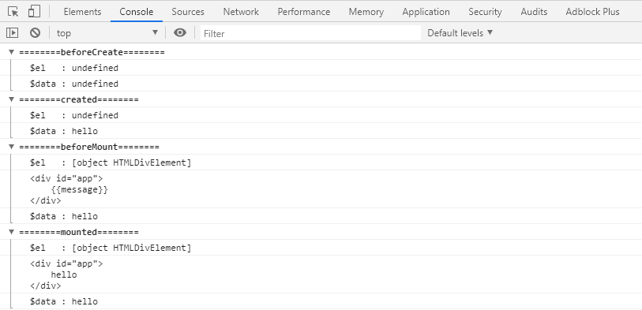


### 小结


## 六、Vue的Ajax

### 目标

* 掌握Vue的Ajax的使用

### 分析

* 了解vue-resource
* 掌握axios
  * 什么是axios
  * axios语法

### 讲解

#### 1. vue-resource【了解】

* vue-resource是Vue.js的插件提供了使用XMLHttpRequest或JSONP进行Web请求和处理响应的服务。
*  当vue更新到2.0之后，作者就宣告不再对vueresource更新，而是推荐的axios，所以稍作了解即可

* vue-resource的github: https://github.com/pagekit/vue-resource

#### 2. axios的使用【重点】

##### 介绍

* Axios 是一个基于 Promise 的 HTTP 库，可以用在浏览器和 node.js 中
  * Promise 对象用于表示一个异步操作的最终状态（完成或失败），以及其返回的值。
  * Promise是ES6提供的新特性
* axios的github:https://github.com/axios/axios
* 中文说明: https://www.kancloud.cn/yunye/axios/234845

##### 语法

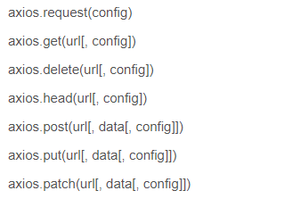

* get请求

```js
// 为给定 ID 的 user 创建请求
axios.get('/user?ID=12345')
    .then(function (response) {
        //如果服务端正常响应了，会执行then里定义的函数
        //response：是响应信息对象
		console.log(response);
    })
    .catch(function (error) {
        //如果有异常了，会执行catch里定义的函数
        //error：是错误信息对象
        console.log(error);
    });

// 可选地，上面的请求可以这样做
axios.get('/user', {
		params: {
			ID: 12345
		}
	})
    .then(function (response) {
		console.log(response);
	})
    .catch(function (error) {
        console.log(error);
    });
```

* post请求

```js
//提交的是json格式的数据，服务端不能使用request.getParameter()方法接收
//服务端需要使用Jackson或fastjson，把接收到的json还原成Java对象
axios.post('/user', {
        firstName: 'Fred',
        lastName: 'Flintstone'
    })
    .then(function (response) {
        console.log(response);
    })
    .catch(function (error) {
        console.log(error);
    });

//提交的是普通表单数据，服务端可以使用request.getParameter()方法接收到
axios.post('/user', "firstName=Fred&lastName=Flintstone")
    .then(function (response) {
        console.log(response);
    })
    .catch(function (error) {
        console.log(error);
    });
```

##### 示例

1. 导入vue和axios。
2. 使用`axios.get()`和`axios.post()`发送请求

```html
<!DOCTYPE html>
<html lang="en">
<head>
    <meta charset="UTF-8">
    <title>axios</title>
</head>
<body>
<input type="button" value="get方式1" onclick="getAxios()">
<input type="button" value="post方式1" onclick="postAxios()">

<script src="js/axios-0.18.0.js"></script>
<script>
    function getAxios() {
        //get方法：通常用于查询和删除功能
        axios.get("./demo?id=1")
            .then(response => {
                console.log(response.data);
            })
            .catch(error => {
                console.log(error);
            });
    }

    function postAxios() {
        //注意：axios会把参数，以json格式提交到服务端。服务端需要接收json，还原成Java对象
        //post方法通常用于：添加、修改功能。
        axios.post("./demo", {id:1,name:"tom"})
            .then(response => {
                console.log(response.data);
            })
            .catch(error => {
                console.log(error);
            })
    }
</script>
</body>
</html>
```

### 小结

* 使用axios发get方式的请求

```js
axios.get("./demo?id=1")
	.then(response=>{
    	console.log(response.data);
	});
```

* 使用axios发POST方式的请求

```js
//发name=value&name=value&...格式的表单数据。
//服务端Servlet里可以用request.getParameter()接收参数值
axios.post("./demo", "username=tom&password=123")
	.then(response=>{
    	//response.data  是服务端响应回来的数据
	});


//发{name:value, name:value, ... } json格式的数据
//服务端Servlet里，不能再使用request.getParameter()接收参数值了
//      需要使用jackson、fastjson，把接收到的请求体内容，还原成Java对象
axios.post("./demo", {username:"tom", password:"123"})
	.then(response=>{
    	//response.data  是服务端响应回来的数据
	});
```


## 七、练习：用Vue和axios完成CURD

### 准备开发环境

1. 创建web应用，把页面拷贝到web文件夹
2. 拷贝jar包，放在WEB-INF/lib下
3. 拷贝配置文件c3p0-config.xml，放在src下
4. 在src里创建包：
   * com.itheima.web
   * com.itheima.service
   * com.itheima.dao
   * com.itheima.domain
   * com.itheima.util
   * com.itheima.filter
5. 把实体类拷贝到`com.itheima.domain`包里
6. 把工具类拷贝到`com.itheima.util`包里
7. 把过滤器拷贝到`com.itheima.filter`里

### 查询所有联系人

#### 目标

* 使用Vue和axios，实现异步查询所有联系人

* 操作步骤：

  1. 在首页点击“联系人列表”跳转到`list.html`

  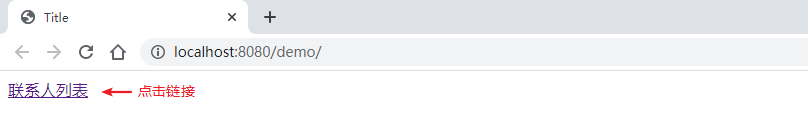

  2. 在`list.html`中，加载所有联系人显示出来

  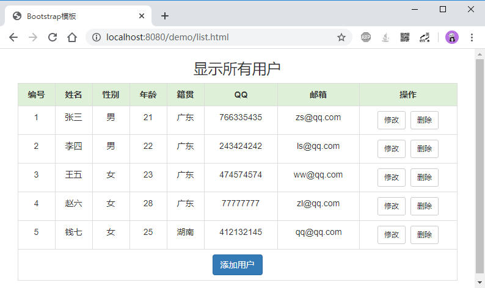

#### 分析


#### 实现

##### `index.html`

* 点击超链接，直接跳转到`list.html`

```html
<!DOCTYPE html>
<html lang="en">
<head>
    <meta charset="UTF-8">
    <title>Title</title>
</head>
<body>
    <a href="list.html">联系人列表</a><br/>
</body>
</html>
```

##### `list.html`

* 引入Vue和axios类库
* 把页面交给Vue接管
  * 在Vue里定义data数据：linkmanList，是空的联系人数组
  * 把linkmanList数据，循环绑定到表格的行里
* 在Vue的`created`钩子方法中，用axios加载所有联系人，把数据设置到data中的linkmanList

```html
<!DOCTYPE html>
<html lang="zh-CN">
<head>
    <meta charset="utf-8">
    <meta http-equiv="X-UA-Compatible" content="IE=edge">
    <meta name="viewport" content="width=device-width, initial-scale=1">
    <title>Bootstrap模板</title>

    <link href="css/bootstrap.min.css" rel="stylesheet">
    <script src="js/jquery-2.1.0.min.js"></script>
    <script src="js/bootstrap.min.js"></script>
    <style type="text/css">
        td, th {
            text-align: center;
        }
    </style>
</head>
<div class="container">
    <h3 style="text-align: center">显示所有用户</h3>
    <table border="1" class="table table-bordered table-hover">
        <tr class="success">
            <th>编号</th>
            <th>姓名</th>
            <th>性别</th>
            <th>年龄</th>
            <th>籍贯</th>
            <th>QQ</th>
            <th>邮箱</th>
            <th>操作</th>
        </tr>

        <tr v-for="man in linkmanList">
            <td>{{man.id}}</td>
            <td>{{man.name}}</td>
            <td>{{man.sex}}</td>
            <td>{{man.age}}</td>
            <td>{{man.address}}</td>
            <td>{{man.qq}}</td>
            <td>{{man.email}}</td>
            <td><a class="btn btn-default btn-sm" href="修改联系人.html">修改</a>&nbsp;<a class="btn btn-default btn-sm" href="修改联系人.html">删除</a></td>
        </tr>

        <tr>
            <td colspan="8" align="center"><a class="btn btn-primary" href="${pageContext.request.contextPath }/add.jsp">添加用户</a></td>
        </tr>
    </table>
</div>

<script src="js/vuejs-2.5.16.js"></script>
<script src="js/axios-0.18.0.js"></script>
<script>
    new Vue({
        el:".container",
        data:{
            //这些数据，需要发异步请求，从服务端加载得到：写到钩子函数created里边
            linkmanList:[]
        },
        methods:{
            queryAll:function(){
                //目前 get方法用于查询和删除；post方法用于新增和修改。 将来如果用了RESTful编程网络，get查询，post新增，put修改，delete删除
                axios.get("./queryAll")
                    .then(response=>{
                        if (response.data.flag) {
                            //成功了，要把结果数据显示出来  response.data.result
                            this.linkmanList = response.data.result;
                        }else{
                            //失败了，要弹窗提示错误原因
                            alert(response.data.message);
                        }
                    });
            }
        },
        created:function(){
            //目前 get方法用于查询和删除；post方法用于新增和修改。 将来如果用了RESTful编程网络，get查询，post新增，put修改，delete删除
            this.queryAll();
        }
    });
</script>
</body>
</html>
```

##### `LinkManQueryAllServlet`

* 创建`LinkManServlet`，增加`queryAll`方法

```java
@WebServlet(urlPatterns="/queryAll")
public class LinkManQueryAllServlet extends HttpServlet {

    private LinkManService linkManService = new LinkManService();

    @Override
    protected void doPost(HttpServletRequest request, HttpServletResponse response) throws ServletException, IOException {
        try {
            //1.接收参数：略
            //2.封装实体：略
            //3.完成功能：调用service，查询所有联系人
            List<LinkMan> linkManList = linkManService.queryAll();
            //4.处理结果：可以使用工具把Java对象转换成json
            JsonUtils.printResult(response, new Result(true, "查询联系人列表成功", linkManList));
        } catch (Exception e) {
            e.printStackTrace();
            JsonUtils.printResult(response, new Result(false, "查询联系人列表失败"));
        }
    }

    @Override
    protected void doGet(HttpServletRequest request, HttpServletResponse response) throws ServletException, IOException {
        this.doPost(request, response);
    }
}
```

##### `LinkManService`

* 创建`LinkManService`，增加`queryAll`方法

```java
import com.itheima.dao.LinkManDao;
import com.itheima.domain.LinkMan;

import java.sql.SQLException;
import java.util.List;

public class LinkManService {
    private LinkManDao linkManDao = new LinkManDao();

    public List<LinkMan> queryAll() throws SQLException {
        return linkManDao.queryAll();
    }
}

```

##### `LinkManDao`

* 创建`LinkManDao`，增加`queryAll`方法

```java
import com.itheima.domain.LinkMan;
import com.itheima.util.JdbcUtils;
import org.apache.commons.dbutils.QueryRunner;
import org.apache.commons.dbutils.handlers.BeanListHandler;

import java.sql.SQLException;
import java.util.List;

public class LinkManDao {
    private QueryRunner runner = new QueryRunner(JdbcUtils.getDataSource());

    public List<LinkMan> queryAll() throws SQLException {
        return runner.query("select * from linkman", new BeanListHandler<>(LinkMan.class));
    }
}
```

#### 小结

### 添加联系人

#### 目标

* 使用Vue和axios，实现异步添加联系人

* 操作步骤：

  1. 用户在`list.html`中点击“添加联系人”按钮，跳转到`add.html`页面

  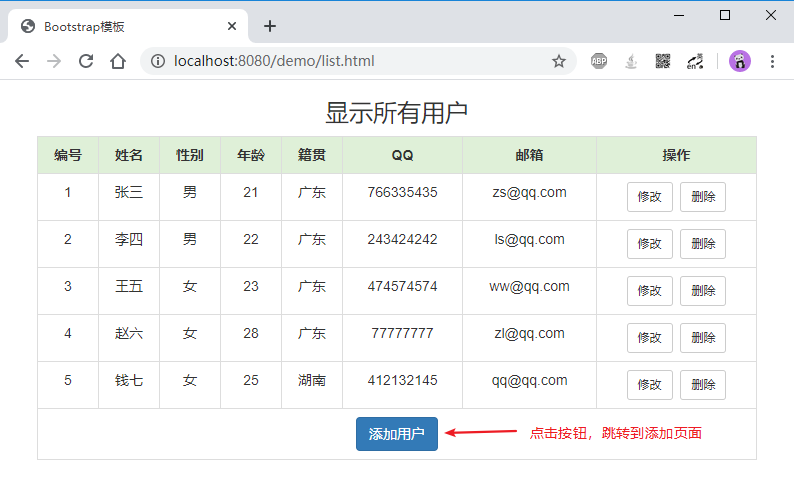

  2. 在`add.html`中，用户输入信息，点击“提交”，异步添加联系人

  

  3. 如果添加成功：跳转到列表页面；如果添加失败，弹窗提示错误原因

#### 分析

#### 实现

##### `list.html`

* 修改“添加用户”的链接，改成：`add.html`

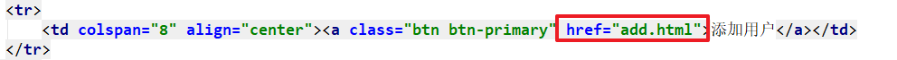

##### `add.html`

* 引入Vue和axios类库
* 把页面区域交给Vue接管
  * 在Vue中定义数据：linkman
  * 把linkman的数据，和表单项进行双向绑定：使用`v-model`指令
  * 在Vue中定义方法：submitForm
    * 使用axios，用post方式把linkman的数据提交到服务端
    * 如果成功：跳转到`list.html`
    * 如果失败：弹窗提示
  * 给“提交”按钮绑定单击事件，触发时调用方法`submitForm`方法

```html
<!-- HTML5文档-->
<!DOCTYPE html>
<!-- 网页使用的语言 -->
<html lang="zh-CN">
<head>
    <!-- 指定字符集 -->
    <meta charset="utf-8">
    <!-- 使用Edge最新的浏览器的渲染方式 -->
    <meta http-equiv="X-UA-Compatible" content="IE=edge">
    <!-- viewport视口：网页可以根据设置的宽度自动进行适配，在浏览器的内部虚拟一个容器，容器的宽度与设备的宽度相同。
    width: 默认宽度与设备的宽度相同
    initial-scale: 初始的缩放比，为1:1 -->
    <meta name="viewport" content="width=device-width, initial-scale=1">
    <!-- 上述3个meta标签*必须*放在最前面，任何其他内容都*必须*跟随其后！ -->
    <title>添加用户</title>

    <!-- 1. 导入CSS的全局样式 -->
    <link href="css/bootstrap.min.css" rel="stylesheet">
    <!-- 2. jQuery导入，建议使用1.9以上的版本 -->
    <script src="js/jquery-2.1.0.min.js"></script>
    <!-- 3. 导入bootstrap的js文件 -->
    <script src="js/bootstrap.min.js"></script>
</head>
<body>
<div class="container">
    <center><h3>添加用户页面</h3></center>
    <form action="user" method="post">
        <input type="hidden" name="method" value="add"/>
        <div class="form-group">
            <label for="name">姓名：</label>
            <input type="text" class="form-control" v-model="linkman.name" id="name" name="name" placeholder="请输入姓名">
        </div>

        <div class="form-group">
            <label>性别：</label>
            <input type="radio" name="sex" v-model="linkman.sex" value="男" checked="checked"/>男
            <input type="radio" name="sex" v-model="linkman.sex" value="女"/>女
        </div>

        <div class="form-group">
            <label for="age">年龄：</label>
            <input type="text" class="form-control" v-model="linkman.age" id="age" name="age" placeholder="请输入年龄">
        </div>

        <div class="form-group">
            <label for="address">籍贯：</label>
            <select name="address" v-model="linkman.address" class="form-control" id="jiguan">
                <option value="广东">广东</option>
                <option value="广西">广西</option>
                <option value="湖南">湖南</option>
            </select>
        </div>

        <div class="form-group">
            <label for="qq">QQ：</label>
            <input type="text" class="form-control" v-model="linkman.qq" name="qq" placeholder="请输入QQ号码"/>
        </div>

        <div class="form-group">
            <label for="email">Email：</label>
            <input type="text" class="form-control" v-model="linkman.email" name="email" placeholder="请输入邮箱地址"/>
        </div>

        <div class="form-group" style="text-align: center">
            <input class="btn btn-primary" type="button" value="提交" @click="submitForm"/>
            <input class="btn btn-default" type="reset" value="重置" />
            <input class="btn btn-default" type="button" value="返回" />
        </div>
    </form>
    {{linkman}}
</div>

<script src="js/vuejs-2.5.16.js"></script>
<script src="js/axios-0.18.0.js"></script>
<script>
    new Vue({
        el:".container",
        data:{
            linkman:{}
        },
        methods:{
            submitForm:function(){
                //使用axios异步提交联系人的数据，保存到数据库里
                axios.post("./add", this.linkman)
                    .then(response=>{
                        if (response.data.flag) {
                            //添加联系人成功了，跳转到列表页面list.html
                            location.href = "list.html";
                        }else{
                            //添加联系人失败了
                            alert(response.data.message);
                        }
                    });
            }
        }
    });
</script>
</body>
</html>
```

##### `LinkManAddServlet`

```java

/**
 * @author liuyp
 * @date 2020/10/09
 */
@WebServlet(urlPatterns="/add")
public class LinkManAddServlet extends HttpServlet {
    private LinkManService linkManService = new LinkManService();

    @Override
    protected void doPost(HttpServletRequest request, HttpServletResponse response) throws ServletException, IOException {
        try {
            //1.接收参数，封装实体
            LinkMan linkMan = JsonUtils.parseJSON2Object(request, LinkMan.class);

            //2.完成功能：新增保存联系人信息
            linkManService.add(linkMan);

            //3.处理结果
            JsonUtils.printResult(response, new Result(true, "添加联系人成功"));
        } catch (Exception e) {
            e.printStackTrace();
            JsonUtils.printResult(response, new Result(false, "添加联系人失败"));
        }
    }

    @Override
    protected void doGet(HttpServletRequest request, HttpServletResponse response) throws ServletException, IOException {
        this.doPost(request, response);
    }
}
```

##### `LinkManService`

* 修改`LinkManService`，增加`add`方法

```java
    public boolean add(LinkMan linkMan) throws SQLException {
        int count = linkManDao.add(linkMan);
        return count > 0;
    }
```

##### `LinkManDao`

* 修改`LinkManDao`，增加`add`方法

```java
    public int add(LinkMan linkMan) throws SQLException {
        String sql = "INSERT INTO linkman (id,name,sex,age,address,qq,email) VALUES(?,?,?,?,?,?,?)";
        return runner.update(sql, linkMan.getId(), linkMan.getName(), linkMan.getSex(), linkMan.getAge(), linkMan.getAddress(), linkMan.getQq(), linkMan.getEmail());
    }
```

#### 小结

### 删除联系人

#### 目标

*  用Vue和axios实现异步删除联系人

* 操作步骤：

  1. 在`list.html`页面上，点击“删除”按钮，弹出确认窗口

  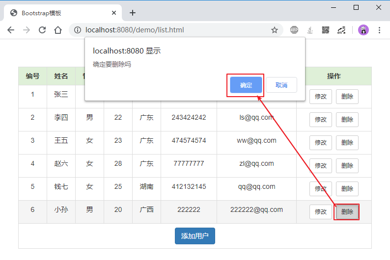

  2. 如果用户点击了“确定”，发异步请求到服务端，删除联系人

     * 如果删除成功：重载加载所有联系人

     * 如果删除失败：弹窗提示

#### 分析


#### 实现

##### `list.html`

* 在Vue实例里定义方法`deleteLinkMan(id)`
  * 用axios发异步请求到服务端，删除联系人
  * 如果删除成功：重新加载联系人列表
  * 如果删除失败：弹窗提示
* 在页面上，给删除按钮绑定单击事件，调用`deleteLinkMan(id)`方法

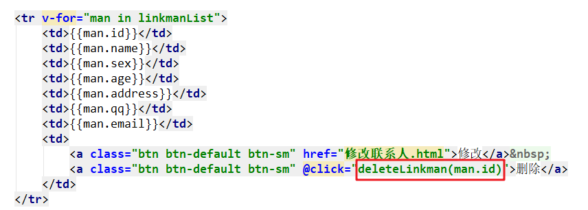

```html
<!DOCTYPE html>
<!-- 网页使用的语言 -->
<html lang="zh-CN">
<head>
    <!-- 指定字符集 -->
    <meta charset="utf-8">
    <!-- 使用Edge最新的浏览器的渲染方式 -->
    <meta http-equiv="X-UA-Compatible" content="IE=edge">
    <!-- viewport视口：网页可以根据设置的宽度自动进行适配，在浏览器的内部虚拟一个容器，容器的宽度与设备的宽度相同。
    width: 默认宽度与设备的宽度相同
    initial-scale: 初始的缩放比，为1:1 -->
    <meta name="viewport" content="width=device-width, initial-scale=1">
    <!-- 上述3个meta标签*必须*放在最前面，任何其他内容都*必须*跟随其后！ -->
    <title>Bootstrap模板</title>

    <!-- 1. 导入CSS的全局样式 -->
    <link href="css/bootstrap.min.css" rel="stylesheet">
    <!-- 2. jQuery导入，建议使用1.9以上的版本 -->
    <script src="js/jquery-2.1.0.min.js"></script>
    <!-- 3. 导入bootstrap的js文件 -->
    <script src="js/bootstrap.min.js"></script>
    <style type="text/css">
        td, th {
            text-align: center;
        }
    </style>
</head>
<body>
<div class="container">
    <h3 style="text-align: center">显示所有用户</h3>
    <table border="1" class="table table-bordered table-hover">
        <tr class="success">
            <th>编号</th>
            <th>姓名</th>
            <th>性别</th>
            <th>年龄</th>
            <th>籍贯</th>
            <th>QQ</th>
            <th>邮箱</th>
            <th>操作</th>
        </tr>

        <tr v-for="man in linkmanList">
            <td>{{man.id}}</td>
            <td>{{man.name}}</td>
            <td>{{man.sex}}</td>
            <td>{{man.age}}</td>
            <td>{{man.address}}</td>
            <td>{{man.qq}}</td>
            <td>{{man.email}}</td>
            <td>
                <a class="btn btn-default btn-sm" href="修改联系人.html">修改</a>&nbsp;
                <a class="btn btn-default btn-sm" @click="deleteLinkman(man.id)">删除</a>
            </td>
        </tr>

        <tr>
            <td colspan="8" align="center">
                <a class="btn btn-primary" href="add.html">添加用户</a>
            </td>
        </tr>
    </table>
</div>

<script src="js/vuejs-2.5.16.js"></script>
<script src="js/axios-0.18.0.js"></script>
<script>
    new Vue({
        el:".container",
        data:{
            linkmanList:[]
        },
        methods:{
            deleteLinkman:function(id){
                let yes = confirm("确定要删除吗？");
                if (yes) {
                    //发异步请求，删除掉联系人
                    axios.get("./delete?id="+id)
                        .then(response=>{
                            alert(response.data.message);
                            if (response.data.flag) {
                                //删除成功了，重新查询一下列表数据显示出来（已经写过了）
                                this.queryAll();
                            }
                        });
                }
            },
            queryAll:function(){
                //目前 get方法用于查询和删除；post方法用于新增和修改。 将来如果用了RESTful编程网络，get查询，post新增，put修改，delete删除
                axios.get("./queryAll")
                    .then(response=>{
                        if (response.data.flag) {
                            //成功了，要把结果数据显示出来  response.data.result
                            this.linkmanList = response.data.result;
                        }else{
                            //失败了，要弹窗提示错误原因
                            alert(response.data.message);
                        }
                    });
            }
        },
        created:function(){
            //目前 get方法用于查询和删除；post方法用于新增和修改。 将来如果用了RESTful编程网络，get查询，post新增，put修改，delete删除
            this.queryAll();
        }
    });
</script>
</body>
</html>
```

##### `LinkManDeleteServlet`

```java
/**
 * @author liuyp
 * @date 2020/10/09
 */
@WebServlet(urlPatterns="/delete")
public class LinkManDeleteServlet extends HttpServlet {
    private LinkManService linkManService = new LinkManService();
    @Override
    protected void doPost(HttpServletRequest request, HttpServletResponse response) throws ServletException, IOException {
        try {
            //1.接收参数
            String id = request.getParameter("id");
            //2.封装实体：略
            //3.完成功能：调用service，删除id对应的联系人
            linkManService.delete(id);
            //4.处理结果
            JsonUtils.printResult(response, new Result(true, "删除联系人成功"));
        } catch (Exception e) {
            e.printStackTrace();
            JsonUtils.printResult(response, new Result(false, "删除联系人失败"));
        }
    }

    @Override
    protected void doGet(HttpServletRequest request, HttpServletResponse response) throws ServletException, IOException {
        this.doPost(request, response);
    }
}
```

##### `LinkManService`

* 增加`delete`方法

```java
    /**
     * 删除联系人
     * @param id 要删除的联系人的id
     * @return boolean。删除成功，true；删除失败，false
     */
    public boolean delete(String id) throws SQLException {
        int count = linkManDao.delete(id);
        return count>0;
    }
```

##### `LinkManDao`

* 增加`delete`方法

```java
    public int delete(String id) throws SQLException {
        return runner.update("delete from linkman where id = ?", id);
    }
```

#### 小结

### 修改联系人【作业】

#### 目标

* 在`list.html`点击“修改”，跳转到`update.html`，传参id
* 在`update.html`里，加载显示id对应的联系人信息

#### 分析

#### 实现

##### `list.html`

* 给“修改”按钮绑定事件，单击时调用函数`editPage(id)`

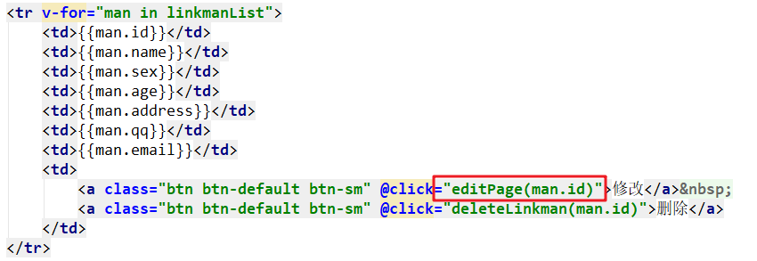

* 在函数`editPage()`里，跳转到`update.html`并传参id的值

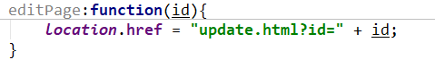

```html
<!DOCTYPE html>
<!-- 网页使用的语言 -->
<html lang="zh-CN">
<head>
    <!-- 指定字符集 -->
    <meta charset="utf-8">
    <!-- 使用Edge最新的浏览器的渲染方式 -->
    <meta http-equiv="X-UA-Compatible" content="IE=edge">
    <!-- viewport视口：网页可以根据设置的宽度自动进行适配，在浏览器的内部虚拟一个容器，容器的宽度与设备的宽度相同。
    width: 默认宽度与设备的宽度相同
    initial-scale: 初始的缩放比，为1:1 -->
    <meta name="viewport" content="width=device-width, initial-scale=1">
    <!-- 上述3个meta标签*必须*放在最前面，任何其他内容都*必须*跟随其后！ -->
    <title>Bootstrap模板</title>

    <!-- 1. 导入CSS的全局样式 -->
    <link href="css/bootstrap.min.css" rel="stylesheet">
    <!-- 2. jQuery导入，建议使用1.9以上的版本 -->
    <script src="js/jquery-2.1.0.min.js"></script>
    <!-- 3. 导入bootstrap的js文件 -->
    <script src="js/bootstrap.min.js"></script>
    <style type="text/css">
        td, th {
            text-align: center;
        }
    </style>
</head>
<body>
<div class="container">
    <h3 style="text-align: center">显示所有用户</h3>
    <table border="1" class="table table-bordered table-hover">
        <tr class="success">
            <th>编号</th>
            <th>姓名</th>
            <th>性别</th>
            <th>年龄</th>
            <th>籍贯</th>
            <th>QQ</th>
            <th>邮箱</th>
            <th>操作</th>
        </tr>

        <tr v-for="man in linkmanList">
            <td>{{man.id}}</td>
            <td>{{man.name}}</td>
            <td>{{man.sex}}</td>
            <td>{{man.age}}</td>
            <td>{{man.address}}</td>
            <td>{{man.qq}}</td>
            <td>{{man.email}}</td>
            <td>
                <a class="btn btn-default btn-sm" @click="editPage(man.id)">修改</a>&nbsp;
                <a class="btn btn-default btn-sm" @click="deleteLinkman(man.id)">删除</a>
            </td>
        </tr>

        <tr>
            <td colspan="8" align="center">
                <a class="btn btn-primary" href="add.html">添加用户</a>
            </td>
        </tr>
    </table>
</div>

<script src="js/vuejs-2.5.16.js"></script>
<script src="js/axios-0.18.0.js"></script>
<script>
    new Vue({
        el:".container",
        data:{
            //这些数据，需要发异步请求，从服务端加载得到：写到钩子函数created里边
            linkmanList:[]
        },
        methods:{
            deleteLinkman:function(id){
                let yes = confirm("确定要删除吗？");
                if (yes) {
                    //发异步请求，删除掉联系人
                    axios.get("./delete?id="+id)
                        .then(response=>{
                            alert(response.data.message);
                            if (response.data.flag) {
                                //删除成功了，重新查询一下列表数据显示出来（已经写过了）
                                this.queryAll();
                            }
                        });
                }
            },
            queryAll:function(){
                //目前 get方法用于查询和删除；post方法用于新增和修改。 将来如果用了RESTful编程网络，get查询，post新增，put修改，delete删除
                axios.get("./queryAll")
                    .then(response=>{
                        if (response.data.flag) {
                            //成功了，要把结果数据显示出来  response.data.result
                            this.linkmanList = response.data.result;
                        }else{
                            //失败了，要弹窗提示错误原因
                            alert(response.data.message);
                        }
                    });
            },
            editPage:function(id){
                location.href = "update.html?id=" + id;
            }
        },
        created:function(){
            //目前 get方法用于查询和删除；post方法用于新增和修改。 将来如果用了RESTful编程网络，get查询，post新增，put修改，delete删除
            this.queryAll();
        }
    });
</script>
</body>
</html>
```

##### `update.html`

* 引入`vue.js`、`axios.js`、`getParameter.js`

  

* 在Vue对象里：
  * 定义数据linkman
  * 在created钩子函数里，用axios请求到`./findById`，加载id对应的LinkMan对象
  
* 在页面上
  * 用`v-model`双向绑定linkman的数据
  * 给“提交”按钮绑定事件，单击时触发`submitForm`方法
  
  
  
* 在Vue对象里：
  
  * 在`submitForm`方法，用axios把linkman的数据提交到`./edit`，执行修改操作

```html
<!DOCTYPE html>
<!-- 网页使用的语言 -->
<html lang="zh-CN">
<head>
    <base href="<%=basePath%>"/>
    <!-- 指定字符集 -->
    <meta charset="utf-8">
    <meta http-equiv="X-UA-Compatible" content="IE=edge">
    <meta name="viewport" content="width=device-width, initial-scale=1">
    <title>修改用户</title>

    <link href="css/bootstrap.min.css" rel="stylesheet">
    <script src="js/jquery-2.1.0.min.js"></script>
    <script src="js/bootstrap.min.js"></script>

</head>
<body>
<div class="container" style="width: 400px;">
    <h3 style="text-align: center;">修改用户</h3>
    <form action="/day05/update" method="post">
        <div class="form-group">
            <label for="name">姓名：</label>
            <input type="text" class="form-control" v-model="linkman.name" id="name" name="name" readonly="readonly" placeholder="请输入姓名"/>
        </div>

        <div class="form-group">
            <label>性别：</label>
            <input type="radio" name="sex" v-model="linkman.sex" value="男"/>男
            <input type="radio" name="sex" v-model="linkman.sex" value="女"/>女
        </div>

        <div class="form-group">
            <label for="age">年龄：</label>
            <input type="text" class="form-control" v-model="linkman.age" id="age" name="age" placeholder="请输入年龄"/>
        </div>

        <div class="form-group">
            <label for="address">籍贯：</label>
            <select name="address" v-model="linkman.address" class="form-control">
                <option value="广东">广东</option>
                <option value="广西">广西</option>
                <option value="湖南">湖南</option>
            </select>
        </div>

        <div class="form-group">
            <label for="qq">QQ：</label>
            <input type="text" class="form-control" v-model="linkman.qq" name="qq" placeholder="请输入QQ号码"/>
        </div>

        <div class="form-group">
            <label for="email">Email：</label>
            <input type="text" class="form-control" v-model="linkman.email" name="email" placeholder="请输入邮箱地址"/>
        </div>

        <div class="form-group" style="text-align: center">
            <input class="btn btn-primary" type="button" @click="submitForm" value="提交"/>
            <input class="btn btn-default" type="reset" value="重置"/>
            <input class="btn btn-default" type="button" value="返回"/>
        </div>
    </form>
</div>

<script src="js/vuejs-2.5.16.js"></script>
<script src="js/axios-0.18.0.js"></script>
<script src="js/getParameter.js"></script>
<script>
    new Vue({
        el: ".container",
        data: {
            id: getParameter("id"),
            linkman: {}
        },
        methods: {
            submitForm:function(){
                axios.post("./edit", this.linkman)
                    .then(response=>{
                        if(response.data.flag){
                            location.href = "list.html";
                        }else{
                            alert(response.data.message);
                        }
                    });
            }
        },
        created: function () {
            axios.get("./findById?id="+this.id)
                .then(response=>{
                    if (response.data.flag) {
                        this.linkman = response.data.result;
                    }else{
                        alert(response.data.message);
                    }
                });
        }
    });
</script>
</body>
</html>
```

##### `LinkManFindByIdServlet`

```java
/**
 * @author liuyp
 * @date 2020/10/09
 */
@WebServlet(urlPatterns="/findById")
public class LinkManFindByIdServlet extends HttpServlet {
    private LinkManService linkManService = new LinkManService();

    @Override
    protected void doPost(HttpServletRequest request, HttpServletResponse response) throws ServletException, IOException {
        try {
            //1.接收参数
            String id = request.getParameter("id");
            //2.封装实体：略
            //3.完成功能：调用service，根据id查询联系人
            LinkMan linkMan = linkManService.findById(id);
            //4.处理结果
            JsonUtils.printResult(response, new Result(true, "查询联系人成功", linkMan));
        } catch (Exception e) {
            e.printStackTrace();
            JsonUtils.printResult(response, new Result(false, "查询联系人失败"));
        }

    }

    @Override
    protected void doGet(HttpServletRequest request, HttpServletResponse response) throws ServletException, IOException {
        this.doPost(request, response);
    }
}
```

##### `LinkManEditServlet`

```java
/**
 * @author liuyp
 * @date 2020/10/09
 */
@WebServlet(urlPatterns="/edit")
public class LinkManEditServlet extends HttpServlet {
    private LinkManService linkManService = new LinkManService();

    @Override
    protected void doPost(HttpServletRequest request, HttpServletResponse response) throws ServletException, IOException {
        try {
            //1.接收参数封装实体
            LinkMan linkMan = JsonUtils.parseJSON2Object(request, LinkMan.class);
            //2.完成功能：调用service，更新到数据库
            linkManService.edit(linkMan);
            //3.处理结果
            JsonUtils.printResult(response, new Result(true, "修改联系人成功"));
        } catch (Exception e) {
            e.printStackTrace();
            JsonUtils.printResult(response, new Result(false, "修改联系人失败"));
        }
    }

    @Override
    protected void doGet(HttpServletRequest request, HttpServletResponse response) throws ServletException, IOException {
        this.doPost(request, response);
    }
}
```

##### `LinkManService`

* 增加方法`findById`
* 增加方法`edit`

```java
    public LinkMan findById(String id) throws SQLException {
        return linkManDao.findById(id);
    }

    public boolean edit(LinkMan linkMan) throws SQLException {
        int i = linkManDao.edit(linkMan);
        return i>0;
    }
```

##### `LinkManDao`

* 增加方法`findById`
* 增加方法`edit`

```java
    public LinkMan findById(String id) throws SQLException {
        return runner.query("select * from linkman where id = ?", new BeanHandler<>(LinkMan.class), id);
    }

    public int edit(LinkMan linkMan) throws SQLException {
        String sql = "update linkman set name=?, sex=?, age=?, address=?, qq=?, email=? where id=?";
        return runner.update(sql,
                linkMan.getName(),
                linkMan.getSex(),
                linkMan.getAge(),
                linkMan.getAddress(),
                linkMan.getQq(),
                linkMan.getEmail(),
                linkMan.getId());
    }
```

#### 小结

## 附：键盘ASCII对照表

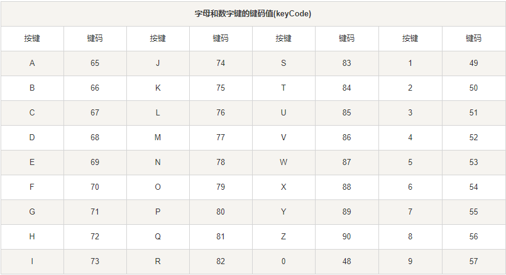


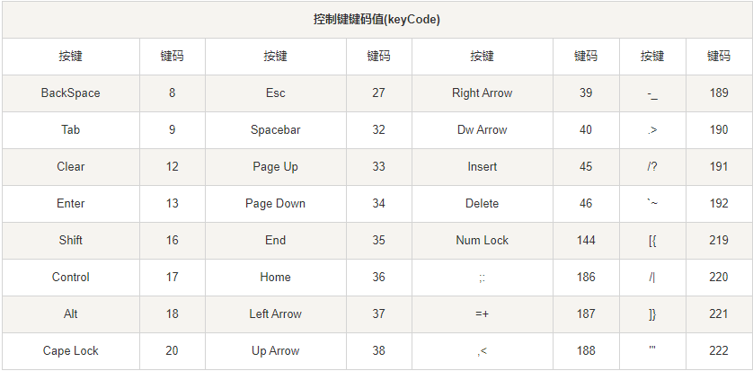

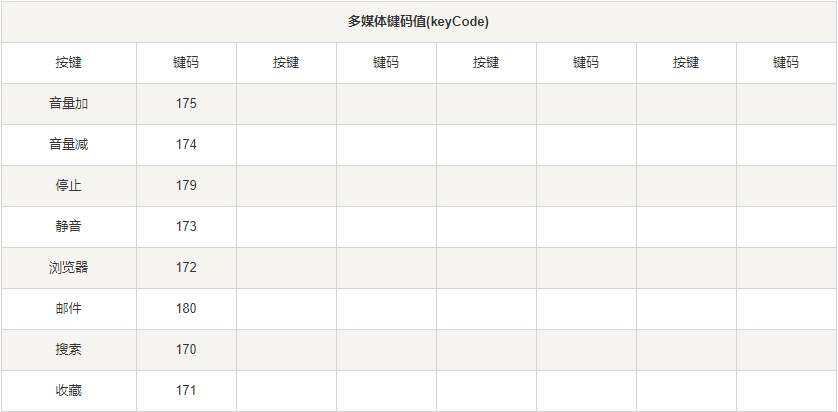


# 复习上午内容

* MVVM模式：Model-View-ViewModel，用于实现Model数据和View页面进行解耦
  * 我们把数据Model放到Vue的data里，由Vue帮我们帮数据显示到页面上
  * 页面上数据的变化，Vue帮我们同步变更到data里
* Vue环境搭建

```html
<div id="app">
    {{message}}
</div>
<script src="vue类库路径"></script>
<script>
	new Vue({
        el:"#app",
        data:{
            message:"hello"
        },
        methods:{
            
        }
    });
</script>
```

* Vue的事件

  * 事件源标签必须在 被Vue接管的区域内
  * 事件响应行为函数 必须定义在Vue的方法区域(methods)内
  * 语法：
    * `v-on:click="fn(1)"`, `v-on:click="fn"`
    * `@click="fn(1)"`,  `@click="fn"`

* 插值表达式：`{{数据项的名称}}`

  * 支持js表达式，但是不能有多条js语句
  * 以文本形式把数据输出到页面上

* `v-text`指令：用于把数据以文本形式插入到页面上

  * `<span v-text="数据项名称"></span>`

* `v-html`指令：用于把数据以html代码形式插入到页面上

  * `<span v-html="数据项名称"></span>`

* `v-bind`指令：用于把数据项的值，绑定到html标签的原始属性上。单向绑定

  * `<a v-bind:href="数据项名称"></a>`
  * `<a :href="数据项名称"></a>`

* `v-model`指令：用于把数据项的值  和 表单项进行双向绑定

  * `<input type="text" v-model="数据项名称">`

* `v-for`指令：用于循环遍历

  `<span v-for="user in userList">{{user.name}}</span>`

* `v-if`指令：如果判断为false，标签相当于被删除掉了；判断为true，标签被创建并插入到dom树
  
  * `<span v-if="判断条件"></span>`
* `v-show`指令：如果判断为false，标签是隐藏状态；如果判断为true，标签是显示状态
  
  * `<span v-show="判断条件"></span>`
* `created`：钩子函数，在Vue读取了data数据之后，读取el元素之前执行的
  
  * 我们可以在这个函数里，发Ajax请求到服务端得到数据，把数据设置到data区域里