# Linux入门-课堂笔记

```
网络帐号：javaee103@sz.itcast.cn
   密码：6a84b2ve
```

运维人员--->考Linux的资格认证（比如红帽的认证）

* 入门

```html
<div id="app">
    {{message}}
</div>

<script src="vue类库"></script>
<script>
	new Vue({
        el:"#app",
        data:{
            message:"hello"
        },
        methods:{}
    });
</script>
```

* 事件绑定
  * 注意：
    * 事件源标签对象 必须要写到 被Vue接管的区域内
    * 事件响应行为函数 必须定义到 Vue的方法区域内
  * 语法：
    * `v-on:事件名="函数名(实参)"`,`v-on:事件名="函数名"` 
    * `@事件名="函数名(实参)"`,`@事件名="函数名"` 
* 常用指令
  * 插值表达式：`{{数据项的名称}}`
  * `v-text`：把数据项的值，以文本形式插入到页面里
  * `v-html`：把数据项的值，以html代码形式插入到页面里
  * `v-bind`：把数据项的值，单向绑定到html标签的属性上
    * `v-bind:href="数据项名称"`,   `:href="数据项名称"`
  * `v-model`：把数据项的值  和 表单项 进行双向绑定
    * `v-model="数据项名称"`
  * `v-for`：用于循环遍历 
    * `v-for="(变量名, 索引) in 集合/数组"`
  * `v-if`：用于条件判断
    * 如果判断为true，标签会被创建出来并插入到dom树
    * 如果判断 为false，标签会被删除掉
  * `v-show`：用于条件判断
    * 如果判断为true，标签是显示状态
    * 如果判断 为false，标签是隐藏状态
* `axios`

```js
axios.get("./demo?id=1").then(response=>{});

axios.post("./demo", "username=abc&password=123").then(response=>{});
axios.post("./demo", {username:"abc",password:"123"}).then(response=>{});
```


## 一、简介

### 目标

* 了解什么是Linux
* 了解Linux的分类

### 讲解

#### 1. Linux简介

##### 1.1 什么是Linux

- Unix：是贝尔实验室开发的，一个强大的、多用户、多任务操作系统，是商业版操作系统，需要收费。

- Linux：是Linus Torvolds于1991年开发、发布的一套开源的、免费的、多用户多任务操作系统。是类Unix操作系统。目前已经衍生出成百上千种不同的Linux分支。

  

  

##### 1.2  Linux的应用

​	因为其免费、安全、稳定的特性，使得Linux成为程序代码运行的最佳环境。Linux的应用范围很广泛：不仅可以**运行我们的程序代码**，还广泛应用于各种计算设备中。例如：手机、平板、路由器。尤其要说的是，我们熟知的Android就是运行在Linux系统上。

#### 2. Linux的分类

##### 2.1 按照市场需求分

- 桌面版：类似于Windows的，有图形化界面的操作系统。不成熟
- 服务器版：没有图形化界面，使用命令行(CLI, Command Line Interface)进行操作的。企业里通常会使用服务器版的

##### 2.2 按照原生程度分

- 内核版：Linus领导的开发小组，维护的内核版本。
- 发行版：一些企业、社区在内核的基础上，增加一些功能、软件，然后重新发行的版本


### 小结


## 二、安装Linux和客户端工具

### 目标

* 能够安装虚拟机软件VMWare
* 能够在虚拟机VMWare上安装CentOS

### 讲解

#### 1. 虚拟机软件

- 作用：用于在自己电脑上，虚拟出来一些假的电脑（虚拟机）。我们可把操作系统安装到虚拟机（假电脑上）
- 常见的虚拟软件：
  - VirtualBox：Oracle公司的免费的虚拟机软件，使用的不多
  - VMWare：威睿公司的虚拟机软件，使用非常广泛

#### 2. 安装CentOS

* 参考资料《01-虚拟软件vmware安装.doc》
* 参考资料《02-centOS安装.doc》


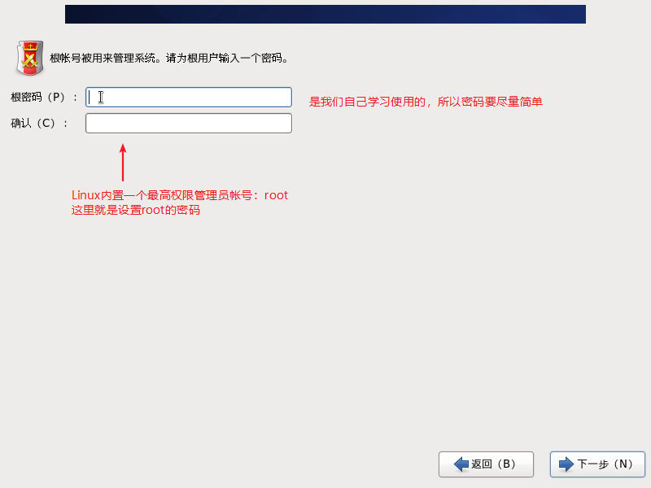

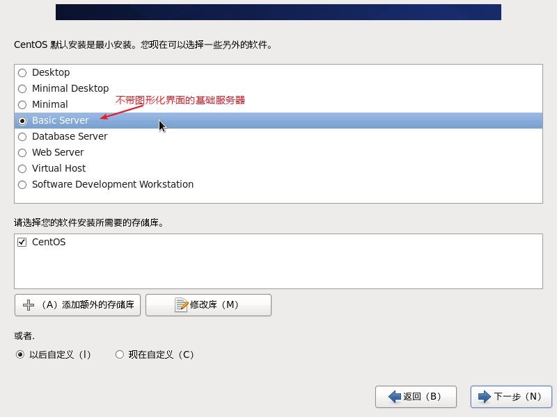

#### 3. 登录

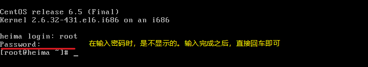


#### 4. 客户端工具SecureCRT

##### 介绍

- 常见的有：SSH Secure、secureCRT、putty、xshell等等
- 远程连接Linux，远程操作Linux
- 绿色版的secureCRT，解压直接使用（解压到C盘）。双击“SecureCRTPortable”，启动

##### SecureCRT连接Linux

* 在Linux里，输入命令，查询ip地址

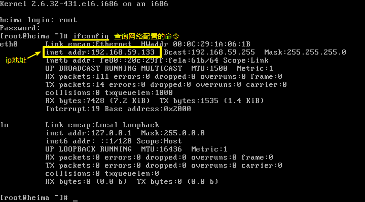

* SecureCRT连接Linux

  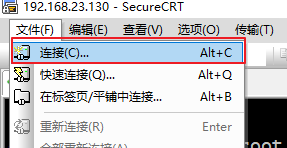

  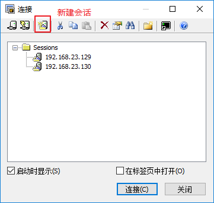

  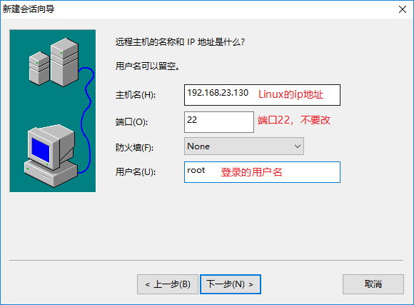

  * 其它内容都是默认的，不要改

    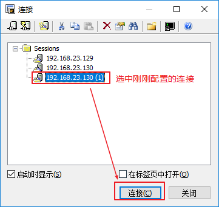

    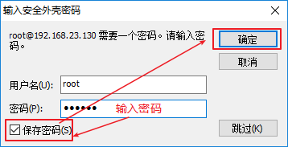


##### SecureCRT配置

* 打开“会话选项”

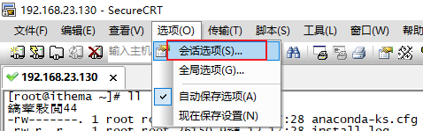

* 设置secureCRT的字符集，解决乱码问题

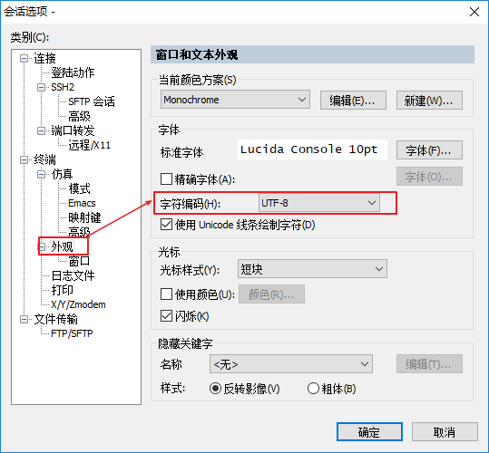

* 设置颜色方案

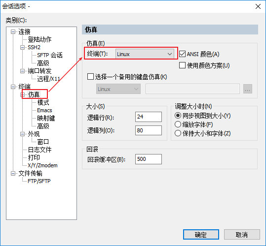

### 小结


## 三、常用命令【熟练】

### 1. Linux的目录结构

#### 目标

* 了解Linux的目录结构
* 了解`/etc`和`/usr`分别是什么
* 了解`家目录`的概念
* 能够切换目录

#### 讲解

##### 1. Linux的目录结构

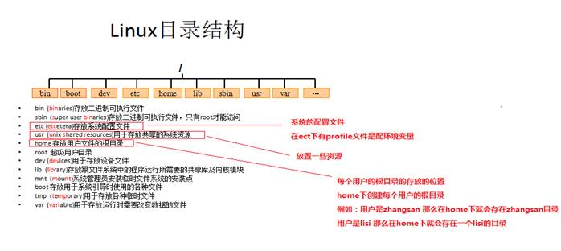

- Linux的目录结构，没有逻辑磁盘分区（C盘、D盘...）。
- 是一棵树形结构，根目录是`/`
- 根目录下边有几个文件夹，需要我们了解：
  - `/etc`：配置文件所在的文件夹。比如：安装JDK，配置环境变量，就要修改`/etc/profile`文件
  - `/usr`：unix shared resource，系统共享资源文件夹。我们安装软件通常安装在：`/usr/local`下边
  - `/home`：家目录。每个用户登录Linux之后，默认进入的目录，是用户的家目录。（类似Windows的“我的文件夹）“）
    - 用户tom，有自己的家目录：`/home/tom`
    - 用户jack，有自己的家目录：`/home/jack`
  - `/root`：是root用户的家目录

##### 2. 切换目录

- 切换目录：`cd 目录`
  - change directory更改目录
  - 目录路径的写法：
    - 绝对路径：以`/`开头的路径，表示从根目录查找
    - 相对路径：
      - 以`./`开头的路径：当前目录里。`./`可以省略不写
      - 以`../`开头的路径：上级目录里
  - `cd ~`：回到自己的家目录里
- 查看在哪个目录里：`pwd`
  - print working directory

#### 小结

* Linux的目录结构是一棵树形结构，树的根目录是`/`
  * `/root`：是root用户的家目录
  * `/usr`：我们安装软件就要安装到这个文件夹里
  * `/etc`：放配置文件的文件夹
* 切换目录
  * 语法：`cd 目标路径`，可以写绝对路径，也可以写相对路径
  * 比如：
    * `cd /etc`
    * `cd ./etc`   或者  `cd etc`
    * `cd ../`
    * `cd ~`：回到家目录里
* 查看当前所在的文件夹：`pwd`


### 2. 操作目录

#### 目标

* 练习：
  * 在家目录里创建文件夹，名称为：`itcast`
  * 查看一下文件夹有没有创建成功
  * 拷贝`itcast`文件夹，得到一个新文件夹：`itheima`
  * 把`itheima`，重命名成为：`szheima`
  * 把`szheima`剪切到根目录下
  * 删除根目录下边的`szheima`
  * 搜索整个Linux里，名称以`log`结尾的文件

#### 讲解

- 创建目录 `mkdir 目录`

  - make directory
  - `mkdir /root/abc`，表示在`/root`下边创建文件夹，名称是`abc`
  - `mkdir aaa`或者`mkdir ./aaa `，表示在当前目录下创建文件夹，名称是`aaa`

  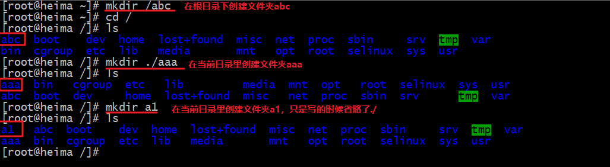

- 查看目录 `ls -al`

  - list source
  - 参数：
  - `a`：all，目录里所有的资源，包括隐藏的
    - `l`：以列表形式显示
  - 常用的是：`ls -l`， 有一个缩写命令`ll`

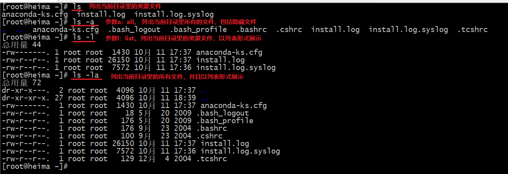


- 拷贝目录 `cp -r 源目录 新目录`

  - 参数：`r`，表示迭代操作，操作文件夹及里边的内容
  - `cp -r ./abc /root`，表示把当前目录里的abc，拷贝到`/root`里边
  

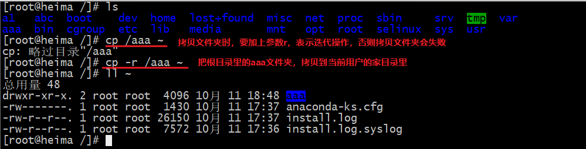

- 重命名/移动剪切目录     `mv 源目录 新目录`

  - 如果`新目录`是已经存在的，表示要把`源目录`移动到`新目录`里边
  - 如果`新目录`是不存在的，表示要把`源目录`重命名成为`新目录`
  - `mv ./abc /`：把当前目录里的abc，剪切到`/`目录下边
  - `mv ./aaa ./a1`：要把当前目录里的aaa，重命名成为`a1`

  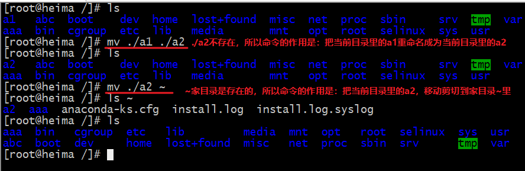

- 删除目录 `rm -rf 目录`

  - 参数：
  - `r`：表示迭代操作，删除目录及里边的内容
    - `f`：表示强制删除不提示
  - `rm -rf ./a1`：删除当前目录里的a1文件夹
  - `rm -rf /`：删除Linux里所有文件！！不要用！！

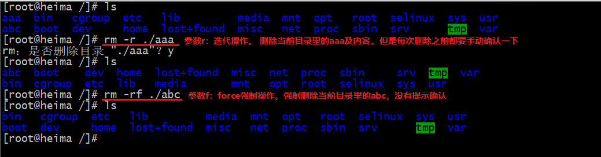

- 搜索 `find 位置 -name 名称`

  - `find / -name "*jdk"`：从整个Linux里搜索以jdk结尾的文件/文件夹

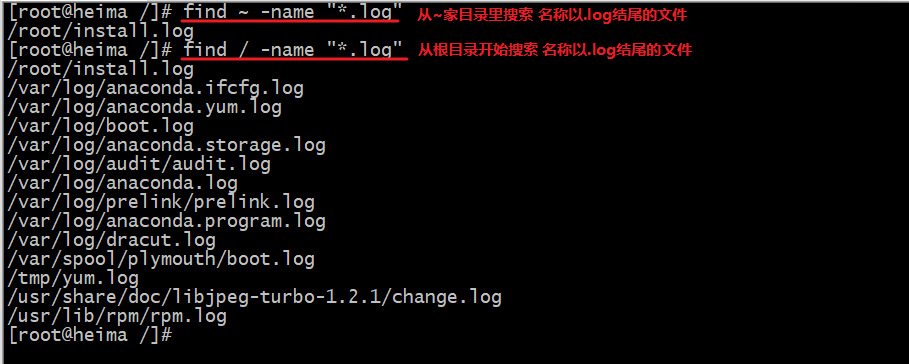

#### 小结

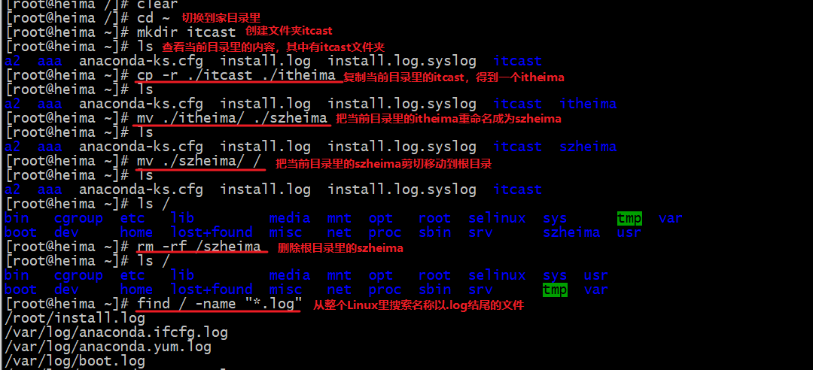

### 3. 操作文件

#### 目标

* 练习：
  * 在家目录里创建一个文件：`szheima.txt`
  * 把`szheima.txt`拷贝一份：`it.txt`
  * 把`it.txt`重命名为`javaee.txt`
  * 把`javaee.txt`移动到根目录下
  * 从`install.log`里搜索字符串`jdk`
  * 创建一个文件`heima.txt`，在文件里添加一些内容，然后保存

#### 讲解

- 创建文件 `touch 文件`

  - `touch javaee.txt`：在当前目录里创建文件`javaee.txt`
  

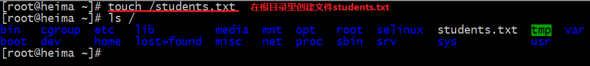

- 查看文件 `cat/more/less/tail`

  - `cat 文件`：查看文件的所有内容
  - `more 文件`：分页查看文件内容。回车下一行，空格下一页，按`q`退出查看。不能往回看
  - `less 文件`：分页查看文件内容。回车下一行，空格下一页，上下方向键可以来回看，按`q`退出查看
  - `tail 文件`：查看文件尾部的内容，通常用于查看日志文件
    - `tail install.log`：查看当前目录里`install.log`尾部10行内容
    - `tail -n 20 install.log`：查看当前目录里`install.log`尾部20行内容
  
- 拷贝文件`cp 源文件 新文件`

- 重命名/移动剪切文件 `mv 源文件 新文件`

  - `mv ./javaee81.txt /`：把当前目录里的javaee81.txt移动到根目录里

  - `mv ./javaee81.txt web81.txt`：把当前目录里的javaee81.txt重命名成为web81.txt

- 删除文件`rm -f 文件`

  * `rm -f ./web81.txt`


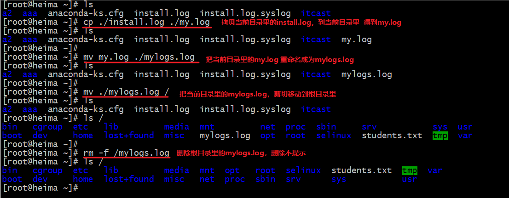

- 搜索文件内容 `grep 搜索内容 文件 --color`
  - global regex expression and print 
  - `--color`：搜索结果高亮显示
  - `grep "jdk" ./install.log --color `

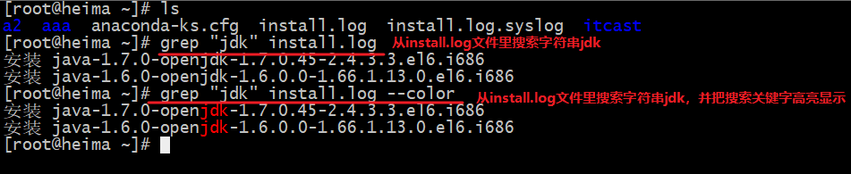

- 修改文件：使用软件（命令）`vim`★
  
  1. `vim 文件`：用vim打开文件，进入普通模式
  2. 按`i/a/o`：进入编辑模式，可以编辑文件的内容
     * `i`：在光标前边插入
     * `a`：在光标后边插入
     * `o`：在光标下一行插入
  3. 按`ESC`：回到普通模式
  4. 按`:`：进入底行模式
     * `wq`：保存并退出
     * `q!`：强制退出不保存
     * `w`：保存
  
  > 注意：`ctrl + s`表示冻结窗口；`ctrl + q`解冻

#### 小结

* vim操作步骤：

  1. 用vim打开文件：`vim 文件名`

     进入的是普通模式

  2. 要编辑文件内容：

     * 在普通模式按`i`：在光标前边开始插入
     * 在普通模式按`a`：在光标后边开始插入
     * 在普通模式按`o`：在光标下一行开始插入
     * 在普通模式按`O`：在光标上行行开始插入

  3. 要保存文件：按`ESC`回到普通模式，再按`:`进入底行模式

     * `w`回车：保存文件
     * `wq`回车：保存文件并退出vim
     * `q!`回车：强制退出vim不保存

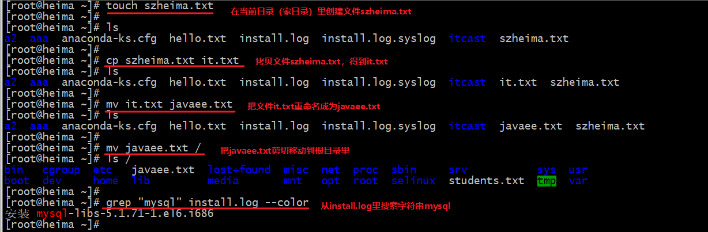

### 4. 压缩与解压缩

#### 目标

* 了解压缩命令的使用
* 掌握解压缩的命令
* 练习：
  * 把家目录里的`install.log`和`install.log.syslog`，压缩成一个`install.tar.gz`
  * 把`install.tar.gz`解压到`/root/logs`文件夹

#### 讲解

zip, rar, 7z

- 压缩相关的术语：
  - 打包/归档：只是把多个文件打包成一个文件，不进行压缩。打包文件后缀名通常是`.tar`
  - 压缩：把文件使用算法压缩。压缩文件后缀名通常是`.gz`
  - 通常是一个命令实现先打包，再压缩，最后的文件后缀名通常是：`.tar.gz`
- 压缩：`tar -zcvf 压缩包 文件1 文件2 ...`
  - 参数：
    - `z`：调用压缩命令，执行压缩操作
    - `c`：压缩后要创建压缩文件
    - `v`：显示压缩过程（可以不写）
    - `f`：指定压缩包文件名称。后边跟参数值：压缩包名称
  
  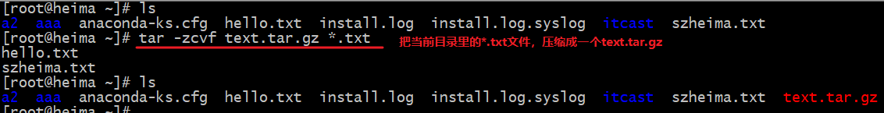
- ==解压缩★==：`tar -xvf 压缩包 -C 解压位置`
  
  - 参数：
    - `x`：extract, 调用解压命令，执行解压操作
    - `v`：显示解压过程（可以不写）
    - `f`：指定压缩包文件名称。后边跟参数值：压缩包名称
    - `C`：指定解压的位置（可以不写）
      - 如果写参数`C`：就需要指定解压的位置，必须是已经存在的文件夹
      - 如果不写参数`C`：要解压到当前文件夹里

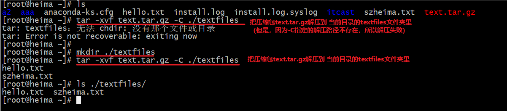

#### 小结

* 压缩命令：`tar -zcvf ./text.tar.gz  *.txt`
* 解压命令：`tar -xvf ./text.tar.gz -C ./textfiles` （注意：`-C`指定的解压位置，必须提前创建好）

### 5. 其它常用命令

#### 目标

* 了解Linux的其它常用命令

#### 讲解

- 查看网络配置：`ifconfig`

  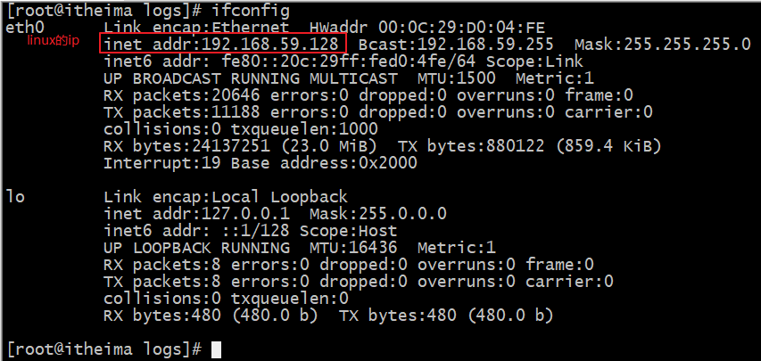

- 查看进程：`ps -ef`
  - ps: progress status
  - 参数：
    - `e`：显示所有进程
    - `f`：显示进程的详细信息
  
- 结束进程：`kill -9 pid`
  
  - `9`是通讯信号，表示强制结束进程
  
- 管道符：`|`，用于把多个命令连接起来，前边命令的结果，交给下一个命令去处理
  
  - 例如：`ps -ef | less`
  
- 服务管理：比如管理MySql的服务

  - `service 服务名 stop`：停止服务
  - `service 服务名 start`：启动服务
  - `service 服务名 restart`：重启服务
  - `service 服务名 status`：查看服务的运行状态

- 关机：`halt`

- 重启：`reboot`

#### 小结

* 查看ip：`ifconfig`
* 查看进程：`ps -ef`
* 杀掉进程：`kill -9 进程的pid`
* 管道符：`ps -ef | less`
* 查看端口的使用状态：`netstat -anp`，其中最后一列的数字是进程的pid
* 服务管理：`service 服务名 操作`。操作：`start, stop, restart, status`
* 关机：`halt`
* 重启：`reboot`

## 四、Linux管理【了解】

### 1. 权限管理【了解】

#### 目标

* 能够识别文件的权限
* 能够修改文件的权限

#### 讲解

##### 7.1 权限识别

- Linux系统里，每个文件都有权限设置。

- 查看文件的权限：`ls -l` 或者 `ll`，其中前10个字符就是权限设置


* 权限相关的介绍：
  * 第1位：是文件的类型
    * `-`：是一个文件
    * `d`：是一个文件夹
    * `l`：是一个链接文件（相当于Windows里的快捷方式）
  * 第2~4位：表示拥有者的权限
    * 第2位  `r`：可读， `-`：不可读
    * 第3位 `w`：可写， `-`：不可写
    * 第4位 `x`：可执行，`-`：不可执行	
  * 第5~7位：表示同组用户的权限
  * 第8~10位：表示其它用户的权限

##### 7.2 权限管理

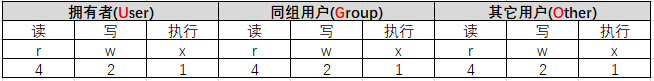

```
读  写  执行
0   0   0 ==>0不可读不可写不可执行
0   0   1 ==>1可执行
0   1   0 ==>2可写
1   0   0 ==>4可读

世界上只有10（换算成10进行：2）种人，一种是懂程序的，一种是不懂程序的
```

###### `chmod u=rwx,g=rwx,o=rwx 文件`

- `u`：拥有者； `g`：同组用户；`o`：其它用户；`a`：所有用户
- `r`：可读权限；`w`：可写权限；`x`：可执行权限
- 示例：`chmod u=rw,g=r,o= text.tar.gz`  
  - 拥有者：读写
  - 同组：读
  - 其它：没有权限

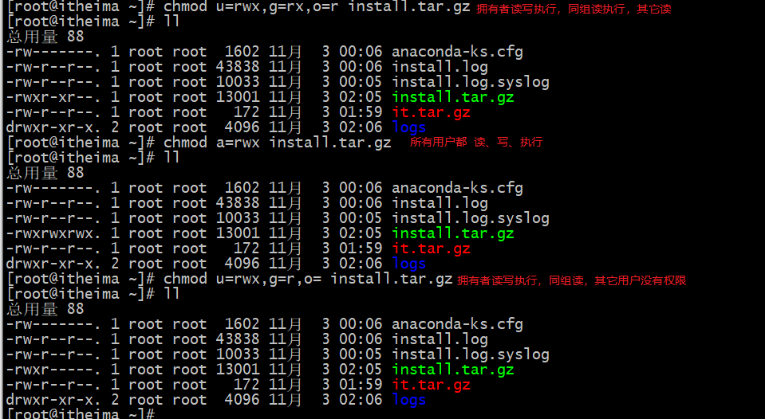

###### `chmod 777 文件`

- 第一位数字：拥有者的权限
- 第二位数字：同组用户的权限
- 第三位数字：其它用户的权限
- `r`：是4； `w`：是2；`x`：是1

```
三位二进制字符。0表示无权限，1表示有权限
1    1    1
读   写   执行
```

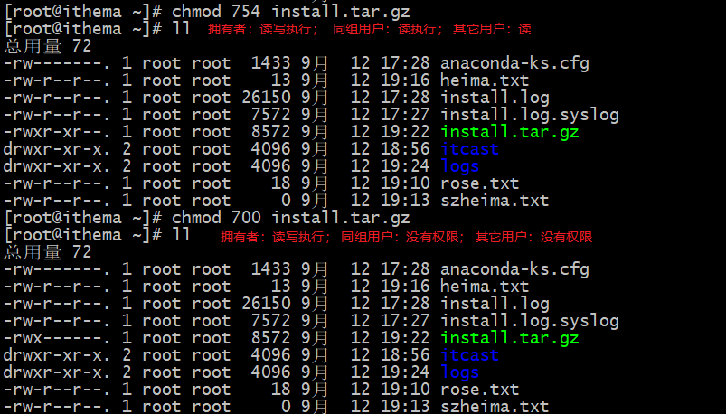

###### 增量授权：在原本权限基础上，做权限的加减

- `chmod a+x 文件`
  
  - `a`：所有用户；`u`：拥有者；`g`：同组用户；`o`：其它用户
  - `+`：增加权限；`-`：取消权限
  - `r`：可读权限；`w`：可写权限；`x`：可执行权限
  
  

#### 小结

`chmod u=rwx,g=rx,o=r text.tar.gz`：设置拥有者可读、写、执行；同组用户可读、执行；其它用户可读

`chmod 751 text.tar.gz`：设置拥有者可读、写、执行；同组用户可读、执行；其它用户可执行

`chmod a+x text.tar.gz`：给所有用户增加可执行权限

### 2. 网络管理

#### 目标

* 查看网络配置
* 启用/关闭网络
* 网络模型介绍

#### 讲解

##### 查看网络配置`ifconfig`

* 命令：`ifconfig`

##### 启用/关闭网络

* 启用网络服务：`service network start`
* 关闭网络服务：`service network stop`
* 重启网络服务：`service network restart`

#### 小结

#### 拓展了解：VMWare的网络模型

+ 桥接模式

  + 桥接网络模型就是使用虚拟交换机将虚拟机和物理机连接起来，它们处于同一个网段。

  * 容易ip冲突

+ NAT

  * 俗称网络地址转换，是将内部私有网络地址翻译成合法网络地址。
  * 相当于开辟了一个局域网，虚拟机把主机当成网关，通过主机的网络地址转换进行上网。

  * 不易ip冲突

+ 仅主机

  ​	使用vmnet1实现主机和虚拟机的连接，但虚拟机不能上网

### 3. 防火墙设置

#### 目标

* 什么是防火墙
* 操作防火墙

#### 讲解

##### 什么是防火墙

​	防火墙技术是通过有机结合各类用于安全管理与筛选的软件和硬件设备，帮助计算机网络于其内、外网之间构建一道相对隔绝的保护屏障，以保护用户资料与信息安全性的一种技术。

​	在默认情况下，Linux系统的防火墙状态是打开的，已经启动。

##### 防火墙的操作

* 查看防火墙状态：`service iptables status`
* 临时开启防火墙：`service iptables start`
  * Linux重启后，防火墙恢复成默认状态
* 临时关闭防火墙：`service iptables stop`
  * Linux重启后，防火墙恢复成默认状态
  * 注意：如果关闭防火墙，会有比较大的安全隐患，不建议关闭防火墙
* 设置防火墙开机启动：`chkconfig iptables on`
  * 防火墙默认是开机自启动的，所以通常不需要再执行这个命令
* 设置防火墙：放行某一端口
  * 第一步，开放端口：`/sbin/iptables -I INPUT -p tcp --dport 端口 -j ACCEPT`
  * 第二步，保存设置永久生效：`/etc/rc.d/init.d/iptables save`

#### 小结


## 五、文件上传和下载

* 使用secureCRT的一个工具：secureFX

## 六、Linux里软件安装

* jdk、MySql、Tomcat：参考《CentOS里安装软件(Linux).doc》

* redis、nginx

* 注意：

  * 在安装软件之前，先给Linux拍一个快照（还原点）

  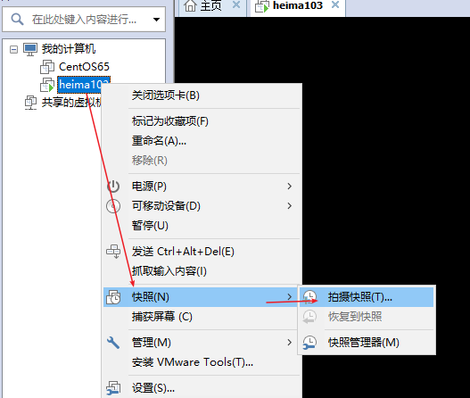

  * 之后再安装软件，如果出问题了，还原到快照即可

# 复习上午内容

* 目录结构
  * 树形结构，树根目录是`/`
  * `/etc`：放配置文件的
  * `/usr`：我们安装软件的位置
  * `/root`：root用户的家目录
* 操作文件夹
  * 创建文件夹：`mkdir /root/abc`
  * 查看文件夹：`ls -al`, `ll`
  * 复制文件夹：`cp -r /root/abc /root/aaa`
  * 剪切文件夹：`mv /root/abc /`
  * 重命名文件夹：`mv /root/aaa /root/a1`
  * 删除文件夹：`rm -rf /root/a1`
  * 搜索：`find / -name "*.log"`
* 操作文件
  * 创建文件：`touch /abc.txt`
  * 查看文件内容：`cat /abc.txt`, `more /abc.txt`, `less /abc.txt`,  `tail -n 20 /abc.txt`
  * 复制文件
  * 剪切文件
  * 重命名文件
  * 删除文件
  * 搜索文件内容：`grep "jdk" install.log --color`
  * 编辑文件内容：vim
    * `vim 文件名称` =>普通模式
    * 普通模式里按`i, a, o, O`进入编辑模式，修改文件内容
    * 按`ESC`退出编辑模式，回到普通模式。在普通模式里按`:`进入底行模式
      * `w`：保存文件内容
      * `wq`：保存并退出vim
      * `q!`：强制退出不保存
* 压缩与解压缩
  * 压缩：`tar -zcvf text.tar.gz *.txt`
  * 解压：`tar -xvf text.tar.gz -C  ~/textfiles`  注意：`-C`指定的解压路径，必须提前创建好