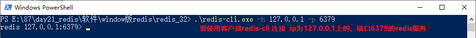
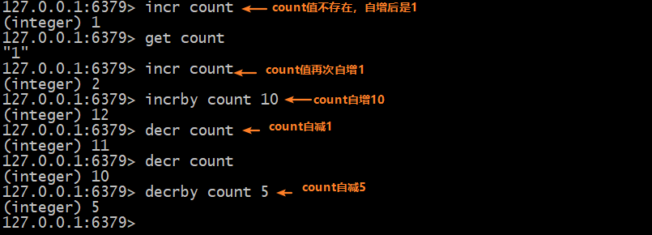
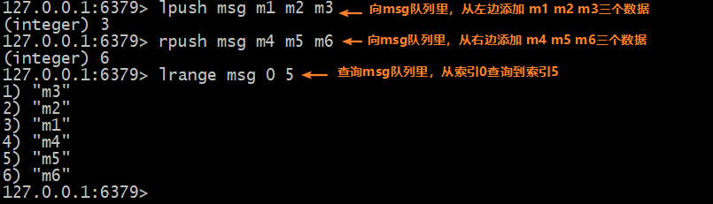
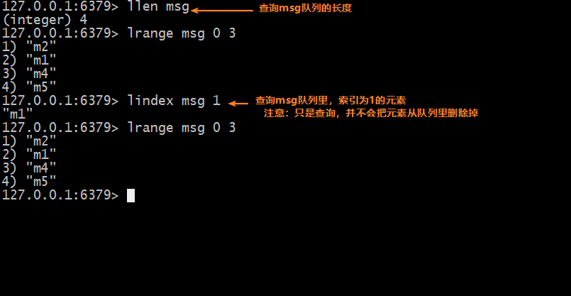
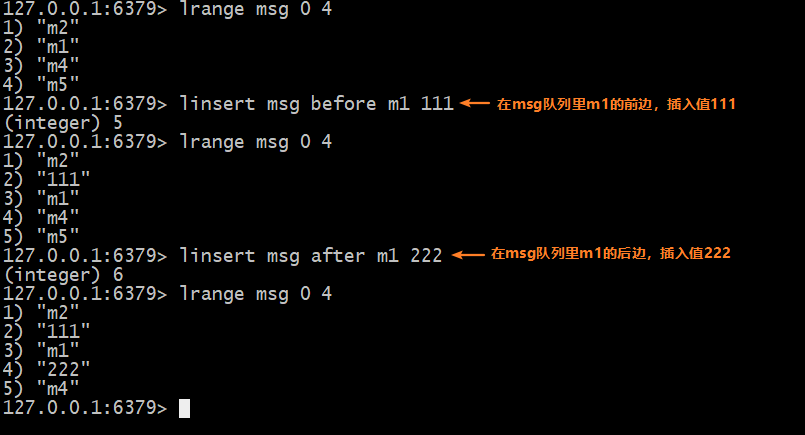
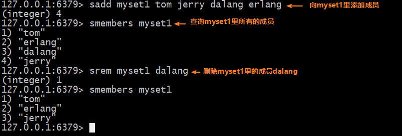
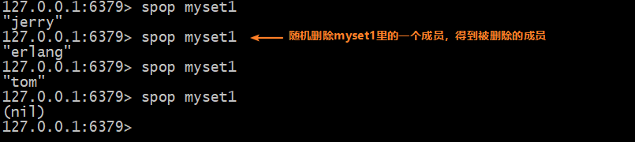
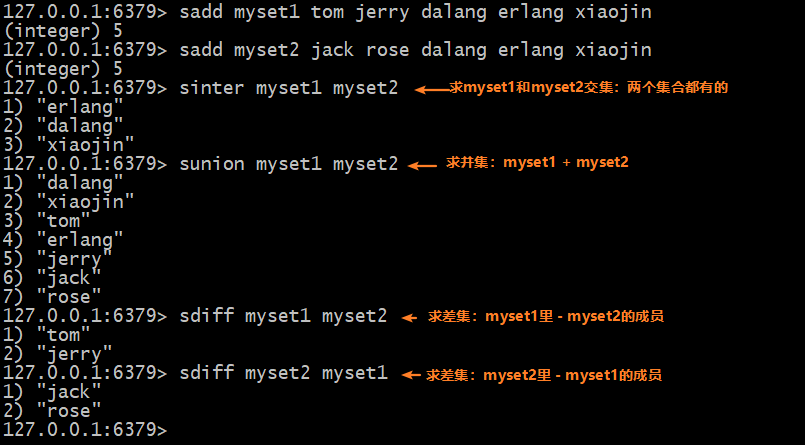
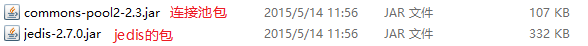

# Redis-课堂笔记

* 切换目录：`cd`
* 创建文件夹：`mkdir`
* 查看文件夹：`ls -al`, `ll`
* 复制文件：`cp`
* 剪切/重命名：`mv`
* 删除文件夹：`rm`
* 搜索文件夹：`find / -name "*log"`
* 创建文件：`touch`
* 查看文件内容：`cat, more, less, tail`
* 搜索文件内容：`grep "mysql" install.log --color`
* 编辑文件：`vim 文件名`
  * 默认进入普通模式，按`i/a/o/O`进入编辑模式，编辑文件内容
  * 按`ESC`回到普通模式，按`:`进入底行模式  
    * `w`保存文件， `wq`保存并退出，`q!`强制退出不保存
* 压缩：`tar -zcvf xxx.tar.gz *.txt`
* 解压：`tar -xvf xxx.tar.gz -C 解压位置`
* 查看ip：`ifconfig`， 
* 查看进程：`ps -ef`
* 杀掉进程：`kill -9 进程pid`
* 管道符：`|`
* 查看端口：`netstat -anp`
* 关机：`halt`
* 重启：`reboot`

## 一、简介

### 目标

* 了解NoSQL的概念
* 了解Redis是什么样的数据库

### 讲解

#### 1. NoSQL：Not only SQL，非关系型数据库

- 数据库类型：
  - 关系型数据库：以表的形式存储数据，以键和约束的形式维护数据关系，这样的数据库就是关系型数据库
    - MySql，Oracle，SQLServer，DB2，Sybase等等
  - 非关系型数据库（NoSQL）：不以表的形式存储数据的数据库
- 为什么有非关系型数据库？
  - **关系**型数据库：随着数据量的增加、用户的增加，出现了一些难以解决的问题：三高问题
    - 高并发问题：瞬间有海量的请求同时操作数据库。比如：双11，12306春节抢票
    - 高性能问题：瞬间从海量数据里，找到并操作某一条数据。比如：微博的数据量，亚马逊的数据
    - 高扩展性问题：数据库集群环境里，要增加数据库节点，需要做数据迁移
  - 非关系型数据库NoSQL：
    - 易扩展
    - 高性能
    - 灵活的数据模型：不以表的形式存储
    - 高可用
- 能否抛弃关系型数据库，全部使用非关系型数据库？不能
  - 业务数据之间是有关系的，就需要维护数据之间的关系。
  - 如果直接使用非关系型数据库，不能维护数据关系，只能自己写代码维护数据关系
  - 如果使用关系型数据库，数据库就可以帮我们维护数据之间的关系。使用非关系型数据库作为补充，提升web应用的性能。Redis就是作为缓存使用的

#### 2. Redis

- Redis数据库：是一个C语言编写的开源的高性能的数据库，是以key-value键值对的形式存储数据，数据是保存在了**内存**中，所以有极高的读写性能。官方数据：读110000次/s，写81000次/秒
- Redis的端口：6379

### 小结

* 关系型数据库的三高问题：高并发、高性能、高扩展性问题
* 非关系型数据库：可以解决关系型数据库的三高问题
* Redis：key-value结构的数据库，数据存储在内存中，端口6379


## 二、安装Redis

### 目标

* 能够操作windows的Redis：启动服务，打开客户端连接服务，关闭服务
* 安装Linux版的Redis
* 能够操作Linux版的Redis：启动服务，打开客户端连接服务，关闭服务

### 讲解

#### 1. Windows版的

- 启动服务：双击`redis-server.exe`
- 启动客户端：双击`redis-cli.exe`
  - 启动之后，会自动连接上本机的Redis数据库，可以直接通过redis命令操作

> 拓展：redis-cli如何连接远程的redis服务？
>
> 在cmd/powershell里，通过命令：`redis-cli.exe -h ip地址 -p 端口`
>
> 

#### 2. Linux版的

- 启动服务：`./redis-server ./redis.conf`
- 启动客户端：`./redis-cli`
- 关闭服务：`./redis-cli shutdown`


### 小结

* Windows版的操作：
  * 启动服务：双击`redis-server.exe`
  * 启动客户端：双击`redis-cli.exe`，自动连接上本机6379端口，可以直接操作redis数据库了
* Linux版的操作：要先cd切换到redis的bin目录里
  * 启动服务：`./redis-server ./redis.conf`
  * 启动客户端：`./redis-cli`
  * 关闭服务：`./redis-cli shutdown`

## 三、数据类型

### 目标

* 能说出Redis的5种数据类型【面试题】

### 讲解

* Redis以**键值对**形式存储数据。
* Redis的key：
  * 不要太长，建议不超过1024个字节（Redis限制key最大长度512M）；否则会消耗内存，影响性能
  * 不要太短；否则会降低可读性
* Redis的value：常用有5种数据类型（数据结构）
  * string：字符串类型
  * hash：哈希类型
  * list：链表类型
  * set：集合类型，无序不重复的数据集合
  * zset：有序集合类型，有序不重复的数据集合

### 小结

* key-value结构
  * key：字符串，最大512M，建议不要超过1024字节
  * value：常用的5种结构
    * string：字符串
    * hash：哈希类型
    * list：链表类型
    * set：无序不重复的数据集合
    * zset：有序不重复的数据集合（也叫sorted set）

## 四、Redis的数据操作【重点】

### 1. String【重点】

#### 目标

* 掌握String类型的常用操作

#### 讲解

##### 说明

* string是redis最基本的类型,用的也是最多的，一个key对应一个value。 
* 一个键最大能存储512MB.

##### 应用场景

* 作为缓存：字符串最经典的使用场景，redis最为缓存层，Mysql作为储存层，绝大部分请求数据都是在redis中操作，由于redis具有支撑高并发特性，所以缓存通常能起到加速读写和降低 后端压力的作用。
* 计数器：比如视频播放次数，点赞次数。

##### 常用命令




#### 小结

* 存值：`set key value`
* 取值：`get key`
* 删值：`del key`

### 2. hash

#### 目标

* 掌握hash类型的常用操作

#### 讲解

##### 说明

* Redis中hash 是一个键值对集合，类似于Java里的HashMap。
* Redis hash是一个string类型的field和value的映射表，hash特别适合用于存储对象。


##### 应用场景

* 存储对象的数据
* 特别适合用于存储订单信息：以订单号为key，field为商品编号，value为商品数量

##### 常用命令


#### 小结

* 存值：`hset key field value`
* 取值：`hget key field`
* 删值：`hdel key field`

### 3. list

#### 目标

* 掌握list的常用操作

#### 讲解

##### 说明

* 链表类型（或 列表类型，list）可以存储一个`有序的字符串列表(链表)`，常用的操作是向列表两端添加元素，或者获得列表的某一个片段。
* 列表类型内部是使用双向链表（double linked list）实现的，所以向列表两端添加元素的时间复杂度为0(1)，获取越接近两端的元素速度就越快。这意味着即使是一个有几千万个元素的列表，获取头部或尾部的10条记录也是极快的。

##### 应用场景

* 消息队列
* 排队机制
* 变更不频繁的排行榜（用list，比zset更节省内存）

##### 常用命令









#### 小结

* 存值：
  * 从左边压入：`lpush key v1 v2 v3...`
  * 从右边压入：`rpush key v1 v2 v3...`
* 取值：
  * 从左边弹出：`lpop key`
  * 从右边弹出：`rpop key`
* 范围查询：`lrange key 起始索引  结束索引`
  * `lrange key 0 2`：从索引0，查询到索引2（查询前3个）
  * `lrange key 0 -1`：从索引0，查询到倒数第一个（查询所有）


### 4. set

#### 目标

* 掌握set类型的常用操作

#### 讲解

##### 说明

* Redis的Set是string类型的无序不重复的集合，Redis 中 集合是通过哈希表实现的，所以添加，删除，查找的时间复杂度都是O(1)。集合中最大的成员数为 2的32次方 -1 (4294967295, 每个集合可存储40多亿个成员)。

* Redis还提供了多个集合之间的交集、并集、差集的运算

##### 应用场景

* 共同好友
* 共同兴趣

##### 常用命令








#### 小结

* 存值：`sadd key v1 v2 v3...`
* 删值：`srem key value`
* 查询所有：`smembers key`

### 5. zset【了解】

#### 目标

* 掌握zset的常用操作

#### 讲解

##### 说明

* Redis 有序集合也是string类型元素的不重复的集合
  * 每个元素都会关联一个double类型的分数。有序集合的成员是唯一的,但分数(score)却可以重复。
  * redis正是通过分数来为集合中的成员进行从小到大的排序。

* 集合是通过哈希表实现的，所以添加，删除，查找的复杂度都是O(1)。 集合中最大的成员数为 232 - 1 (4294967295, 每个集合可存储40多亿个成员)。

##### 应用场景

* 排行榜

##### 常用命令


* 默认排序是从小到大的升序
* 如果要从大到小排序，使用命令：`zrevrange`


#### 小结

* 存值：`zadd key score1 value1 score2 value2....`
* 查询：`zrange key 起始索引 结束索引 withscores`

## 五、Redis的其它操作

### Redis的其它命令

#### 目标

* 掌握redis的一些其它通用命令

#### 分析

* redis的通用命令
* redis的多数据库特性

#### 讲解

##### redis的通用命令

- `keys *`：查询所有的key

  - `keys myset?`：查询所有key为`myset`  + 一个任意字符的

- `exists key`：判断是否有指定的key 若有返回1,否则返回0

- `expire key 秒数`：设置这个key在redis中的存活时间（`setex key seconds value`）      

- `ttl key`：展示指定key的剩余时间

  * 如果值为 -1:永不过期
  * 如果值为 -2:已过期或者不存在

  

- `del key`：删除指定key

- `rename key 新key`：重命名key

- `type key`：判断一个key的类型

- `ping` ：测试连接是否连接

##### 多数据库特性

* redis默认是16个数据库, 编号是从0~15. 【默认是0号库】

 * 常用的库操作有：
   * `select index`:切换库
   
   
   
   * `move key index`: 把key移动到几号库(index是库的编号)
   
   
   
   * `flushdb`:清空当前数据库
   * `flushall`:清空当前实例下所有的数据库

#### 小结

* `keys *`：查询所有key。`keys myset?`：查询myset+一个任意字符的key
* `select 1`：切换到1号库
* `move key 3`：把key移动到3号库里
* `flushdb`：清空当前库
* `flushall`：清空所有库

### 消息订阅和发布机制【了解】

#### 目标

* 了解Redis的消息订阅和发布机制

#### 讲解

##### 什么是订阅和发布机制

* Redis 发布订阅(pub/sub)是进程间一种消息通信模式：发送者(pub)发送消息，订阅者(sub)接收消息。

* Redis 客户端可以订阅任意数量的频道。

##### 相关命令介绍

| 命令                                  | 描述                                       |
| ------------------------------------- | ------------------------------------------ |
| `PUBLISH channel message`             | 将`message`信息发送到指定的频道`channel`。 |
| `SUBSCRIBE channel [channel ...]`     | 订阅给定的一个或多个频道的信息。           |
| `UNSUBSCRIBE [channel [channel ...]]` | 指退订给定的频道                           |

#### 小结


## 六、Jedis【重点】

### 目标

* 掌握Jedis的基本使用
* 掌握Jedis连接池的使用

### 讲解

#### 1. Jedis简介

- Jedis：Java  Redis，Java操作Redis数据库的技术

- 涉及的jar包：

  
  
- 使用步骤：

  - 导入jar包

  - 编写代码：

    ```txt
    1. 创建连接
    2. 操作数据库
    3. 关闭连接
    ```

#### 2. Jedis使用

##### 2.1 基本使用

- 涉及的API：连接类`Jedis`

  - 构造方法：`Jedis(String host, int port)`
  - 常用方法：
    - 操作数据的方法：方法名称和命令名称一样
    - 关闭连接的方法：`close()`
  
- 示例

  ```java
  //1.创建连接
  Jedis jedis = new Jedis("192.168.190.147", 6379);
  
  //2.操作数据库
  String classname = jedis.get("classname");
  
  //3.关闭连接
  jedis.close();
  ```

##### 2.2 连接池使用

- 使用步骤

  - 导入jar包

  - 编写代码

    ```txt
    1. 创建连接池对象
    2. 从连接池里获取一个连接
    3. 操作数据库
    4. 把连接归还到连接池
    ```

- 相关的API

  - 连接池类：`JedisPool`
    - 有参构造方法
      - `JedisPool(String host, int port)`
      - `JedisPool(JedisPoolConfig config, String host, int port)`
    - 常用方法：
      - `getResource()`：从连接池里获取一个Jedis对象
        - Jedis对象是增强过了，close()方法的功能已经变成了归还到连接池
  - 连接池配置类：`JedisPoolConfig`
    - 无参构造
    - 常用方法：
      - `setMaxTotal()`：设置最大连接数
      - `setMaxIdle()`：最大空闲连接数

- 示例

  ```java
  JedisPoolConfig config = new JedisPoolConfig();
  config.setMaxTotal(50);//最大连接数
  config.setMaxIdle(10);//最大空闲连接数
  //1. 创建连接池对象
  JedisPool pool = new JedisPool(config, "192.168.190.147", 6379);
  //2. 从连接池里获取一个连接
  Jedis jedis = pool.getResource();
  //3. 操作数据库
  String classname = jedis.get("classname");
  //4. 把连接归还到连接池
  jedis.close();
  ```

#### 3. 封装Jedis工具类

- 注意：操作缓存如果失败，不应该影响后边代码的继续执行。所以操作缓存的异常，应该try..catch
- 配置文件`properties`

```properties
host=127.0.0.1
port=6379
maxTotal=30
maxIdle=5
```

* 工具类`JedisUtils`

```java
public class JedisUtils {

    private static JedisPool pool;

    static{
        //加载资源文件：从src下加载properties文件，参数：直接写文件名称，不需要加后缀名
        ResourceBundle bundle = ResourceBundle.getBundle("jedis");
        String host = bundle.getString("host");
        int port = Integer.parseInt(bundle.getString("port"));
        int maxTotal = Integer.parseInt(bundle.getString("maxTotal"));
        int maxIdle = Integer.parseInt(bundle.getString("maxIdle"));

        //创建连接池配置信息
        JedisPoolConfig config = new JedisPoolConfig();
        config.setMaxTotal(maxTotal);
        config.setMaxIdle(maxIdle);

        //创建连接池对象
        pool = new JedisPool(config, host, port);
    }

    /**
     * 获取Jedis连接
     * @return Jedis对象
     */
    public static Jedis getJedis(){
        return pool.getResource();
    }

    /**
     * 关闭Jedis连接
     * @param jedis 要关闭的Jedis连接对象
     */
    public static void close(Jedis jedis) {
        if (jedis != null) {
            jedis.close();
        }
    }

    /**
     * 设置缓存
     * @param key 缓存的key
     * @param value 缓存的value
     */
    public static void setCache(String key, String value){
        Jedis jedis = null;
        try {
            jedis = getJedis();
            jedis.set(key, value);
        } catch (Exception e) {
            System.out.println("设置缓存数据失败：["+key+":"+value+"]");
        } finally {
            close(jedis);
        }
    }

    /**
     * 获取缓存
     * @param key 缓存的key
     * @return 缓存的value
     */
    public static String getCache(String key) {
        Jedis jedis = null;
        try {
            jedis = getJedis();
            return jedis.get(key);
        } catch (Exception e) {
            System.out.println("获取缓存失败：" + key);
        } finally {
            close(jedis);
        }
        return null;
    }
}
```

### 小结

* Jedis的基本使用

```java
//1.获取连接
Jedis jedis = new Jedis("ip地址", 6379);

//2.操作数据库：方法名和命令名相同
String className = jedis.get("className");

//3.关闭连接
jedis.close();
```

* Jedis连接池的使用

```java
//创建连接池配置信息对象
JedisPoolConfig config = JedisPoolConfig();
config.setMaxTotal(50);
config.setMaxIdle(10);
//创建连接池对象
JedisPool pool = new JedisPool(config, "ip地址", 6379);
//从连接池里获取连接
Jedis jedis = pool.getResource();
//使用jedis操作数据库
String className = jedis.get("className");
//把连接归还到连接池
jedis.close();
```


## 七、持久化【了解】

### 目标

* 了解持久化的概念
* 了解持久化两种机制

### 讲解

#### 1. Redis持久化概述

- 持久化：Redis会定时把内存里的数据，持久保存到磁盘文件上。
- 持久化机制有两种：
  - RDB模式：快照模式，默认开启状态的
  - AOF模式：需要手动开启

#### 2. Redis两种持久化机制

##### 2.1 RDB模式

- 也叫快照模式，默认开启状态

  是在某些时候把Redis内存里的**数据**快速的保存到磁盘文件上。当重启redis时，读取快照文件，把数据恢复到内存当中

- 什么时候会生成快照文件？配置文件里有

  ```
  save 900 1
  save 300 10
  save 60 10000
  ```
  
  - 1次变更，要900秒存一次
  - 10次变更，要300秒存一次
  - 10000次变更，要60秒存一次
  
- 保存的文件在什么地方？

  - 默认保存在redis的运行目录，文件名称是`dump.rdb`

- 优点：

  - 性能强，对性能影响不大
  - 方便备份恢复（灾备）

- 缺点：

  - 可能丢失数据

##### 2.2 AOF模式

- append only file，默认状态是关闭的

  是在某些时候，把执行的**数据变更命令**，**追加**保存到磁盘文件上。当重启时，会读取文件，按照里边的命令的顺序执行一遍，相当于：重构数据库

- 如何开启AOF模式？

  - 修改redis.conf配置文件，设置为：`appendonly yes`
  - 修改了配置文件之后，需要重启Redis服务

- 什么时候保存变更命令到磁盘文件上？看配置文件

  ```
  # appendfsync always
  appendfsync everysec
  # appendfsync no
  ```
  
  - always：每次执行数据变更命令，会立即把命令保存到磁盘文件上
  - everysec：每秒把数据变更命令保存一次
  - no：不保存
  
- 保存的文件在什么地方？

  - 在redis的运行目录下，文件名称是：`appendonly.aof`

- 好处：

  - 不容易丢失数据
  - 可以有选择性的恢复数据

- 坏处：

  - 性能有影响
  - 容易产生冗余数据

### 小结

* RDB模式：定时把内存里的数据保存到磁盘文件里
  * 对性能影响小，方便备份恢复
  * 可能会丢失数据
* AOF模式：定时把执行的数据变更的命令，追加保存到磁盘文件里
  * 丢失数据可能性比较小，安全性高。可以有选择性的恢复数据
  * 容易有冗余数据，对性能影响略大

## 八、练习

### 准备开发环境

1. 初始化数据库

   ```mysql
   CREATE TABLE `province` (
     `pid` int NOT NULL AUTO_INCREMENT,
     `pname` varchar(40) DEFAULT NULL,
     PRIMARY KEY (`pid`)
   ) ENGINE=InnoDB AUTO_INCREMENT=8 DEFAULT CHARSET=utf8;
   
   INSERT INTO `province` VALUES ('1', '广东');
   INSERT INTO `province` VALUES ('2', '湖北');
   INSERT INTO `province` VALUES ('3', '湖南');
   INSERT INTO `province` VALUES ('4', '四川');
   INSERT INTO `province` VALUES ('5', '山东');
   INSERT INTO `province` VALUES ('6', '山西');
   INSERT INTO `province` VALUES ('7', '广西');
   
   
   drop table if exists user;
   create table user(
   	id int primary key auto_increment,
   	username varchar(30),
   	password varchar(64),
   	nickname varchar(30),
   	address varchar(64),
   	email varchar(32),
   	gender char(1),
   	status char(1) --  已激活Y；未激活N
   );
   ```

2. 创建web应用

3. 导入jar包：放在WEB-INF/lib里

4. 导入配置文件：`c3p0-config.xml`和`jedis.properties`放在src下

5. 创建package：

   * `com.itheima.web`
   * `com.itheima.service`
   * `com.itheima.dao`
   * `com.itheima.domain`
   * `com.itheima.util`
   * `com.itheima.filter`

6. 准备JavaBean：

   * 把`Result`类拷贝到domain包里
   * 创建`Province`类，创建`User`类

7. 准备工具类：把工具类放在util包里

8. 导入过滤器：`EncodingFilter`

### 1. 使用redis优化省下拉框

#### 目标

* 页面要使用axios异步加载显示“省”下拉框。使用redis优化性能

#### 分析

#### 实现

##### `demo1.html`

```html
<!DOCTYPE html>
<html lang="en">
<head>
    <meta charset="UTF-8">
    <title>省下拉框</title>
</head>
<body>
<div id="app">
    <select name="province" id="province">
        <option :value="pro.pid" v-for="pro in provinces">{{pro.pname}}</option>
    </select>
</div>

<script src="js/vuejs-2.5.16.js"></script>
<script src="js/axios-0.18.0.js"></script>
<script>
    new Vue({
        el:"#app",
        data:{
            provinces:[
                {pid:1,pname:"广东"},
                {pid:1,pname:"广西"}
            ]
        },
        created:function(){
            axios.get("./province")
                .then(response=>{
                    if (response.data.flag) {
                        this.provinces = JSON.parse(response.data.result);
                    }else{
                        alert(response.data.message);
                    }
                });
        }
    });
</script>
</body>
</html>
```

##### `ProvinceServlet`

```java
/**
 * @author liuyp
 * @date 2020/02/22
 */
@WebServlet(urlPatterns="/province")
public class ProvinceServlet extends HttpServlet {
    private ProvinceService provinceService = new ProvinceService();

    @Override
    protected void doPost(HttpServletRequest request, HttpServletResponse response) throws ServletException, IOException {
        Jedis jedis = null;
        try {
            jedis = JedisUtils.getJedis();
            String provinces = jedis.get("provinces");
            if (provinces == null || "".equals(provinces)) {
                List<Province> provinceList = provinceService.queryAll();
                provinces = JSON.toJSONString(provinceList);
            }
            JsonUtils.printResult(response, new Result(true, "", provinces));
        } catch (Exception e) {
            e.printStackTrace();
            JsonUtils.printResult(response, new Result(false, "查询所有省失败"));
        } finally{
            if(jedis != null){
                jedis.close();
            }
        }
    }

    @Override
    protected void doGet(HttpServletRequest request, HttpServletResponse response) throws ServletException, IOException {
        this.doPost(request, response);
    }
}
```

##### `ProvinceService`

```java
/**
 * @author liuyp
 * @date 2020/02/22
 */
public class ProvinceService {
    private ProvinceDao provinceDao = new ProvinceDao();
    public List<Province> queryAll() throws SQLException {
        return provinceDao.queryAll();
    }
}
```

##### `ProvinceDao`

```java
/**
 * @author liuyp
 * @date 2020/02/22
 */
public class ProvinceDao {
    private QueryRunner runner = new QueryRunner(JdbcUtils.getDataSource());

    public List<Province> queryAll() throws SQLException {
        return runner.query("select * from province", new BeanListHandler<>(Province.class));
    }
}
```

#### 小结


### 2. 使用redis完成邮箱激活校验

#### 目标

* 注册用户成功后，给用户发送激活邮件
* 用户在邮件里点击激活链接，激活用户
* 使用redis限时保存用户的激活码

#### 分析

#### 实现

##### `demo2.html`

```html
<!DOCTYPE html>
<html lang="en">
<head>
    <meta charset="UTF-8">
    <title>注册页面</title>
</head>
<body>
<center id="app">
    <h1>用户注册</h1>
    <form action="register" method="post">
        姓名:<input type="text" name="username" v-model="user.username"><br>
        密码:<input type="password" name="password" v-model="user.password"><br>
        昵称:<input type="text" name="nickname" v-model="user.nickname"><br>
        地址:<input type="text" name="address" v-model="user.address"><br>
        邮箱:<input type="text" name="email"  v-model="user.email"/><br/>
        性别:<input type="radio" name="gender" value="female" v-model="user.gender">女
        <input type="radio" name="gender" value="male" v-model="user.gender">男<br>

        <input type="button" value="注册" @click="register">
    </form>
</center>

<script src="js/vuejs-2.5.16.js"></script>
<script src="js/axios-0.18.0.js"></script>
<script>
    new Vue({
        el:"#app",
        data:{
            user:{}
        },
        methods:{
            register:function(){
                axios.post("./register", this.user)
                    .then(response=>{
                        if (response.data.flag){
                            alert("注册成功，已发送激活邮件，请登录邮箱激活帐号");
                        }else{
                            alert("注册失败");
                        }
                    });
            }
        }
    });
</script>
</body>
</html>
```

##### `RegisterServlet`

```java
/**
 * @author liuyp
 * @date 2020/02/22
 */
@WebServlet(urlPatterns="/register")
public class RegisterServlet extends HttpServlet {
    @Override
    protected void doPost(HttpServletRequest request, HttpServletResponse response) throws ServletException, IOException {
        Jedis jedis = null;
        try {
            User user = JsonUtils.parseJSON2Object(request, User.class);
            System.out.println("省略了代码：调用service，把user数据保存到数据库");

            String code = UUIDUtil.getUuid();

            jedis = JedisUtils.getJedis();
            jedis.setex(user.getUsername(), 60 * 10, code);

            //给用户发送激活邮件
            String url = "http://localhost:8080/day21/active?key=" + user.getUsername() + "&code=" + code;
            String content = "你的帐号已经注册成功，<a href='"+url+"'>请点击激活后再登录</a>";
            MailUtils.sendMail(user.getEmail(), content);

            JsonUtils.printResult(response, new Result(true, "注册成功"));
        } catch (Exception e) {
            e.printStackTrace();
            JsonUtils.printResult(response, new Result(false, "注册失败"));
        } finally {
            if (jedis != null) {
                jedis.close();
            }
        }
    }

    @Override
    protected void doGet(HttpServletRequest request, HttpServletResponse response) throws ServletException, IOException {
        this.doPost(request, response);
    }
}
```

##### `ActiveServlet`

```java
/**
 * @author liuyp
 * @date 2020/02/22
 */
@WebServlet(urlPatterns="/active")
public class ActiveServlet extends HttpServlet {
    @Override
    protected void doPost(HttpServletRequest request, HttpServletResponse response) throws ServletException, IOException {
        String key = request.getParameter("key");
        String code = request.getParameter("code");

        Jedis jedis = JedisUtils.getJedis();
        String trueCode = jedis.get(key);
        if (trueCode.equals(code)) {
            System.out.println("激活成功");
        }else{
            System.out.println("激活失败");
        }

        jedis.close();
    }

    @Override
    protected void doGet(HttpServletRequest request, HttpServletResponse response) throws ServletException, IOException {
        this.doPost(request, response);
    }
}
```

#### 小结


# 复习上午内容

* Windows版的redis
  1. 启动服务：双击`redis-server.exe`
  2. 启动客户端连接服务：双击`redis-cli.exe`
* Linux版的Redis：
  1. 启动服务：`./redis-server ./redis.config`
  2. 启动客户端连接服务：`./redis-cli`
  3. 关闭服务：`./redis-cli shutdown`
* Redis的key-value结构
  * key：字符串，建议不要超过1024个字节
  * value：常用5种
    * `string`：字符串
    * `hash`：哈希类型
    * `list`：链表类型
    * `set`：无序不重复的集合
    * `zset`：有序不重复的集合
* 操作string：【重点】
  * 设置：`set key value`
  * 获取：`get key`
  * 删除：`del key`
* 操作hash：
  * 设置：`hset key field value`
  * 获取：`hget key field`
  * 删除：`hdel key field`
* 操作list：
  * 存值：`lpush key v1 v2 v3...`,   `rpush key v1 2 v3...`
  * 取值：`lpop key`,   `rpop key`
* 操作set：
  * 存值：`sadd key v1 v2 v3...`
  * 获取所有：`smembers key`
  * 删除：`srem key value`
* 通用的命令：
  * `keys *`：查询所有key。`keys myset?`：查询myset开头+一位任意字符的key

* Jedis

```java
//1.创建连接
Jedis jedis = new Jedis("ip地址", 6379);
//2.使用连接操作数据库：方法名和命令名相同
jedis.set("key", "value");
//3.关闭连接
jedis.close();

//--------------------------------
JedisPoolConfig config = new JedisPoolConfig();
config.setMaxTotal(50);
config.setMaxIdle(10);

JedisPool pool = new JedisPool(config, "ip地址", 6379);
Jedis jedis = pool.getResource();

jedis.close();
```

