# Maven-课堂笔记

* Redis操作数据的命令

  * 操作string：
    * `set key value`
    * `get key`
    * `del key`
  * 操作hash：
    * `hset key field value`
    * `hget key field`
    * `hdel key field`
  * 操作list：
    * `lpush key v1 v2 v3...`,   `rpush key v1 v2 v3...`
    * `lpop key`,  `rpop key`
  * 操作set：
    * `sadd key v1 v2 v3...`
    * `smembers key`
    * `srem key value`

* Jedis

  * 基本操作

  ```java
  Jedis jedis = new Jedis("ip", 6379);
  
  String classname = jedis.get("className");
  
  jedis.close();
  ```

  * 连接池操作

  ```java
  JedisPoolConfig config = new JedisPoolConfig();
  config.setMaxTotal(50);
  config.setMaxIdle(5);
  
  JedisPool pool = new JedisPool(config, "ip", 6379);
  Jedis jedis = pool.getResource();
  
  
  jedis.close();
  ```

  

## 一、Maven简介

### 目标

* 了解什么是Maven
* 了解Maven的作用
* 了解坐标的概念

### 讲解

#### 1. 什么是Maven

​	Maven：是Apache提供的免费开源的**项目管理工具**。它提供了一个项目对象模型、一个依赖管理系统、一套项目生命周期、一组标准集合、和一个插件管理系统。


#### 2. Maven的作用

* 项目构建：一个项目开发之后，经历的编译、测试、打包、安装、部署等等一系列的过程，叫项目构建
  * 主要是测试、运维/实施人员使用的
* 依赖管理：Maven可以帮我们管理jar包，可以轻松的解决依赖的冲突问题
  * 依赖：通常指jar包，不仅仅是jar包
* 模块化创建项目：后边Maven的高级课程里学习的

#### 3. 坐标的概念

* 坐标：**被Maven管理的每个项目**，都必须有自己的唯一标识，这个唯一标识叫坐标
* 坐标的组成：由三部分组成
  * groupId：公司名、组织名   域名倒写。比如：`c3p0`,  `com.jd`
  * artifactId：项目名、包名。比如：`c3p0`
  * version：版本号。比如：`0.9.1.2`， `1.0-SNAPSHOT`,   `5.2.0-RELEASE`
  
  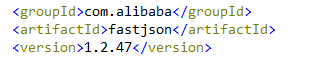

### 小结

* Maven：是个项目管理工具，Apache提供的
* 作用：
  * 项目构建：编译、测试、打包、安装、部署等等一系列的过程
  * 依赖管理：jar包的管理，解决依赖冲突
* 坐标：被Maven管理的每个项目/包，都必须有的唯一标识
  * groupId：公司名、组织名   域名的倒写。比如  com.alibaba
  * artifactId：包名、项目名
  * version：版本号

## 二、Maven安装配置【操作】

### 目标

* 能说出Maven的三种仓库
* 能够安装配置Maven
* 能给Maven配置本地仓库

### 讲解

#### 1. Maven的仓库类型

1. 本地仓库：本地缓存jar包的文件夹
   * 本地仓库默认在：`C:\Users\电脑的用户名\.m2\repository`
   * 通常会修改配置文件，修改本地仓库的路径
2. 远程仓库（私服）：一些企业、组织、社区搭建的仓库服务

   * 通常企业里人自己搭建私服。私服里的jar包大多数还是来自于中央仓库
   * 有些是企业内部自己搭建、自己使用的
   * 有些是企业搭建面向整个互联网的，比如：阿里私服

3. 中央仓库

   * 是Maven官方团队维护的仓库，里边有最全的jar包。
   
   * 但是没有授权的jar包，中央仓库里没有，比如：Oracle驱动包
   
   * 地址：https://repo1.maven.org/maven2

#### 2. 下载与目录结构

- 下载地址：http://maven.apache.org
- 目录结构：

```txt
maven
  |--bin   Maven的可执行命令文件夹
  |--boot  Maven的引导程序（类加载器）
  |--conf  配置文件夹
  |--lib   Maven的核心程序代码
```

#### 3. Maven安装配置

##### 3.1 安装Maven

1. Maven是免安装的，直接解压

   * 注意：解压路径里，不要有中文、空格、特殊字符

2. 注意检查JDK环境变量是否正确

   * Maven软件是Java语言编写的

3. 配置Maven环境变量：

   * 增加`MAVEN_HOME=Maven的解压目录`
   * 修改Path中添加 `        %MAVEN_HOME%\bin    `

   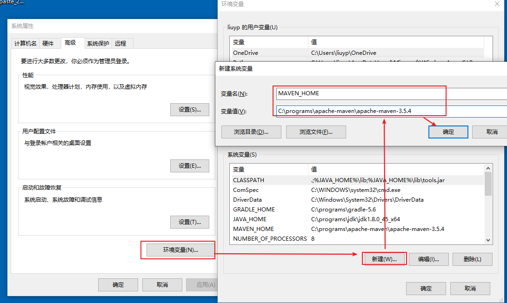

   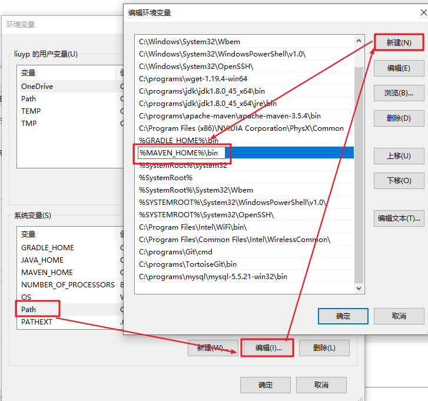

4. 验证Maven配置

   * 打开cmd，输入命令：`mvn -version`

   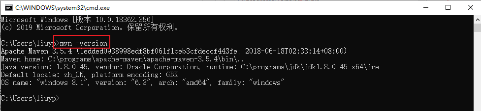

##### 3.2 配置Maven仓库

* 配置步骤：

  1. 把《软件\repository.rar》解压出来。注意：解压目录里不能有中文、空格、特殊字符

  2. 拷贝解压路径，比如我的解压位置：`C:\programs\apache-maven\repository`
  3. 修改Maven的`conf\settings.xml`配置文件

  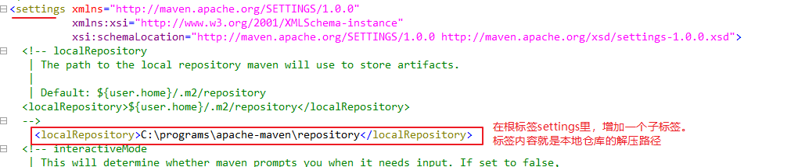

* 扩展：

  * 修改settings.xml里，设置Maven的默认编译版本为jdk1.8。在`<profiles>`里边增加：
  
  ```xml
  <profile>    
      <id>jdk-1.8</id>    
      <activation>    
          <activeByDefault>true</activeByDefault>    
          <jdk>1.8</jdk>    
      </activation>    
      <properties>    
          <maven.compiler.source>1.8</maven.compiler.source>    
          <maven.compiler.target>1.8</maven.compiler.target>    
          <maven.compiler.compilerVersion>1.8</maven.compiler.compilerVersion>    
      </properties>    
</profile>
  ```
  
  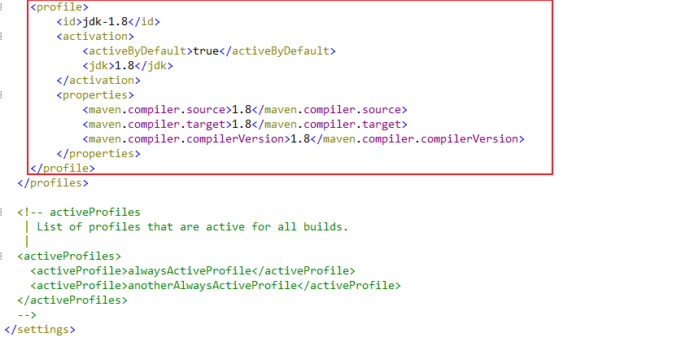

### 小结

* Maven的仓库

  * 本地仓库：本地缓存jar包的文件夹
    * 建议配置一下本地仓库
  * 私服（远程仓库）：一些企业、社区搭建的仓库服务
  * 中央仓库：Maven官方团队提供的

* Maven的安装配置

  1. 把zip解压到不含中文、空格、特殊字符的目录里
  2. 配置环境变量
     * 增加`MAVEN_HOME`，值是maven软件解压的位置
     * 修改`Path`，增加  `%MAVEN_HOME%\bin`
  3. 验证：打开cmd，执行命令  `mvn -version`

* 给Maven配置本地仓库（把我的setting.xml拷贝覆盖掉自己的，然后修改一下本地仓库路径即可）

  1. 把《repository.rar》解压到不含中文、空格、特殊字符的目录里

  2. 打开Maven软件的`conf/settings.xml`，配置本地仓库的路径

     

## 三、Maven项目的目录结构【掌握】

### 目标

* 掌握Maven项目的目录结构

### 讲解

一个项目要想使用Maven进行管理，那么这个项目的目录结构就必须要符合Maven的要求：

```txt
maven项目
	|--pom.xml                 项目对象模型文件，一个Maven项目必定有pom.xml文件
	|--src
		|--main                项目的主体程序代码目录
		|	|--java            项目的Java程序代码放在这文件夹里
		|	|--resources       项目的配置文件放在这里
		|	|--webapp          项目的web资源放在这里，html，css，js，jsp，音频，图片，视频等等
		|		|--WEB-INF 
		|		|--其它web资源
		|--test                项目的单元测试代码目录
			|--java            项目的单元测试代码
			|--resources       项目单元测试需要的配置文件
```

### 小结

* 目录结构
  * 程序的主体Java代码：`src\main\java`
  * 程序的主体配置文件：`src\main\resources`
  * 程序的主体web资源：`src\main\webapp`
  * 单元测试Java类：`src\test\java`

## 四、Maven构建项目【了解】

### 目标

* 能够使用Maven的常用命令，构建项目
* 理解Maven项目的生命周期

### 讲解

* Maven命令的格式：`mvn 命令`
* 使用cmd，切换到Maven项目里，执行命令

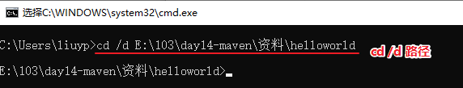

#### 1. 项目构建常用命令（goal）

##### 清理：`clean`

- 语法：`mvn clean`
- 把Maven项目的target目录清除掉。
- target目录里，是之前编译的结果

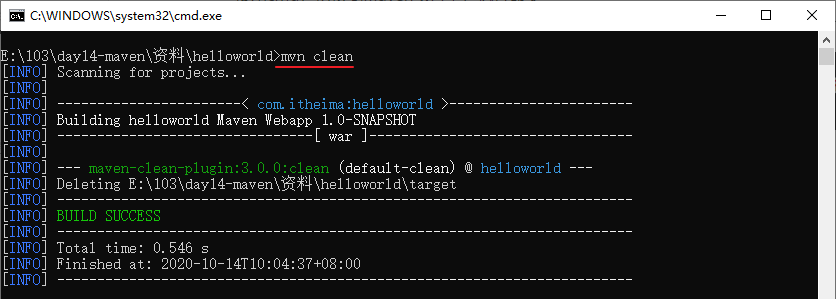

##### 编译：`compile`

- 语法：`mvn compile`
- 把Maven项目里程序主体代码进行编译，编译后的结果放在target目录里（会自动生成target目录）

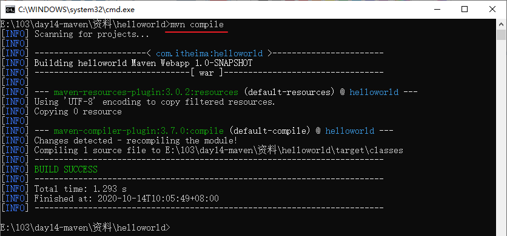

##### 测试：`test`

* 语法：`mvn test`

- 编译并执行Maven项目里的单元测试代码。
- 要求：
  - 要求单元测试类要以`Test`结尾，比如：`JedisTest`,  `JdbcTest`
  - 建议单元测试类里的方法，以`test`开头，比如：`testJedis()`,  `testQueryAll()`

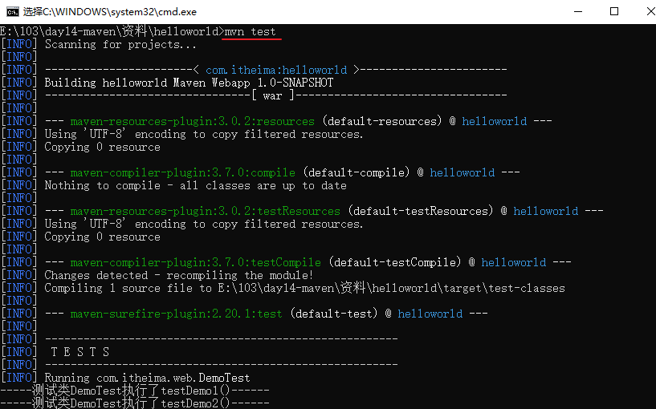

##### 打包：`package`

* 语法：`mvn package`

- Java项目，会打包成`xxx.jar`。由项目的pom.xml里，`<packaging>jar</packaging>`，或没有这个标签
- web项目，会打包成`xxx.war`。由项目的pom.xml里，`<packaging>war</packaging>`
- 打包后的文件，在target目录里 。只打包主体程序代码

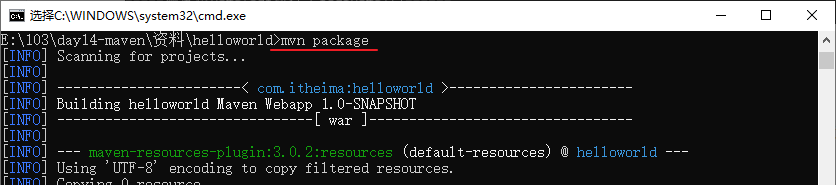

##### 安装：`install`

* 语法：`mvn install`

- 把程序包安装到本地仓库。安装的位置，是项目的坐标指定的位置

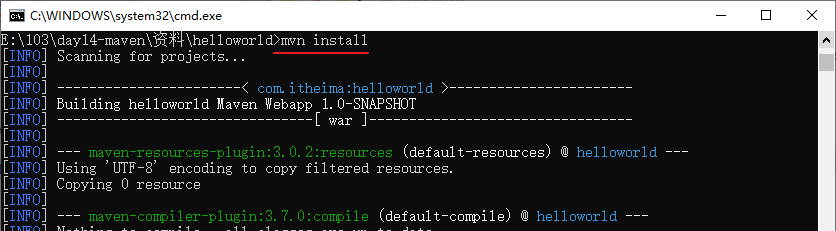

#### 2. 项目构建的生命周期

```
mvn clean:    clean
    
mvn compile:  compile
mvn test:     compile->test
mvn package:  compile->test->war/jar
mvn install:  compile->test->war/jar->install
```


1. 清理生命周期：CleanLifeCycle
   * 有常用命令：`clean`

2. 默认生命周期（构建生命周期）：DefaultLifeCycle
   * 有常用命令：`compile->test->package->install->deploy`

3. 站点生命周期：SiteLifeCycle
   * 有常用命令：`site`。生成Maven项目的描述信息文档

* 如果执行了一个目标命令：Maven会把生命周期里的命令，从第一个一直执行到目标命令为止

### 小结

* 项目构建的常用命令：
  * 清理：`mvn clean`
  * 编译：`mvn compile`
  * 测试：`mvn test`
  * 打包：`mvn package`
  * 安装：`mvn install`
* Maven项目的构建相关的生命周期
  * 清理生命周期：`clean`
  * 默认生命周期：`compile->test->package->install->deploy`
  * 站点生命周期：`site`
* 我们要执行某个操作，直接执行目标命令即可，不需要从前往后依次手动执行。`mvn install`


## 五、Maven管理依赖和插件

### Maven的依赖管理【重点】

#### 目标

* 能够把Maven配置到idea中
* 能够在idea里创建Maven的java项目
* 能够在idea里创建Maven的web项目
* 掌握Maven项目中，引入依赖的方法
* 掌握Maven的依赖范围配置，解决jar包冲突

#### 讲解

##### 1. 在idea配置Maven(操作)

* 配置Maven

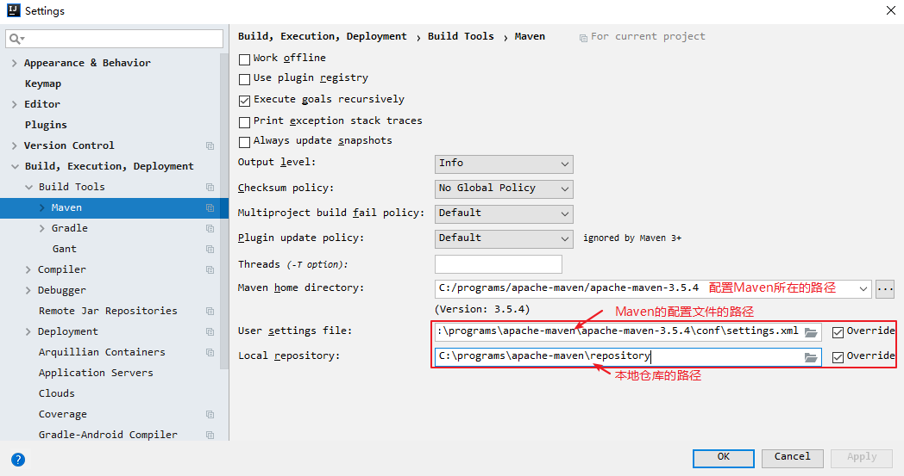

* 增加运行的配置项：`   -DarchetypeCatalog=internal `

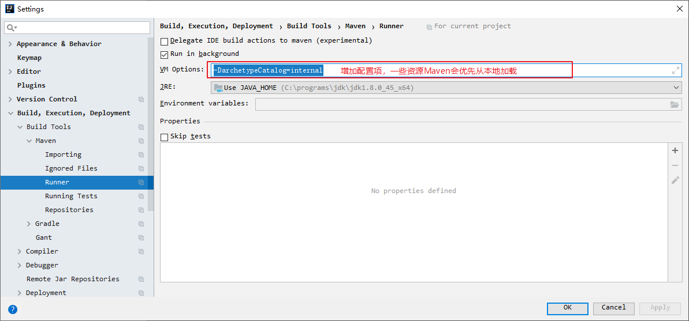

##### 2. 在idea创建Maven项目

###### 2.1 创建Maven的java项目

1. 创建Module，选择Maven类型，选择骨架

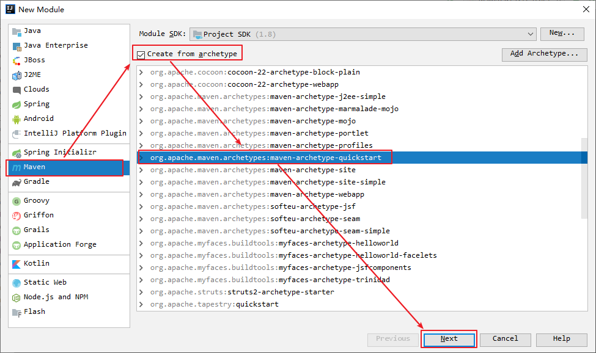

2. 设置项目的坐标

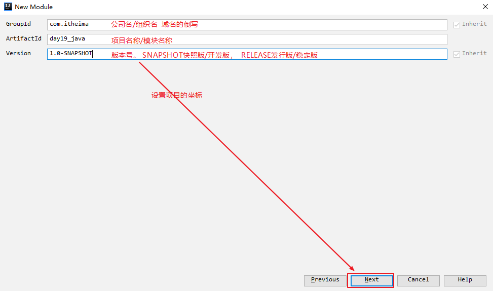

3. 再继续步骤，跟以前的一样：设置module的名称和位置

   注意：不要和已有的其它module重名或者重位置

4. 创建后，如果弹窗`Maven projects need to be imported`，就选择 启动自动导入。

   作用是：如果pom.xml文件有变更，Maven会自动读取，立即生效；否则就要手动导入

   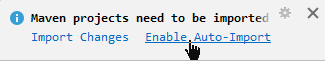

5. 如果文件夹缺失，就创建补全，然后刷新

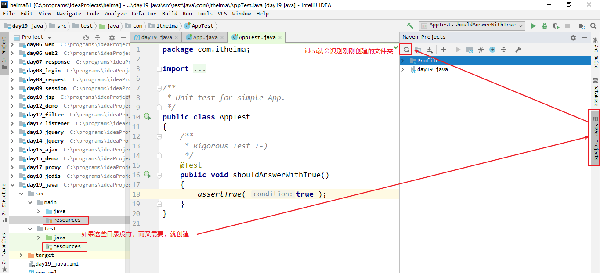

###### 2.2 创建Maven的web项目

1. 选择项目的骨架

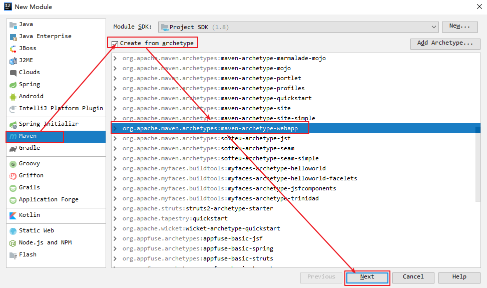

2. 设置项目的坐标

   如果上边`Add as module to `和`Parent`是有配置的，那么要在右边全部选择none

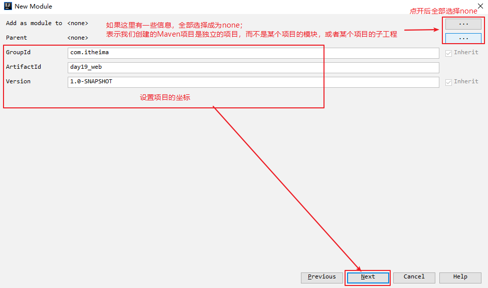

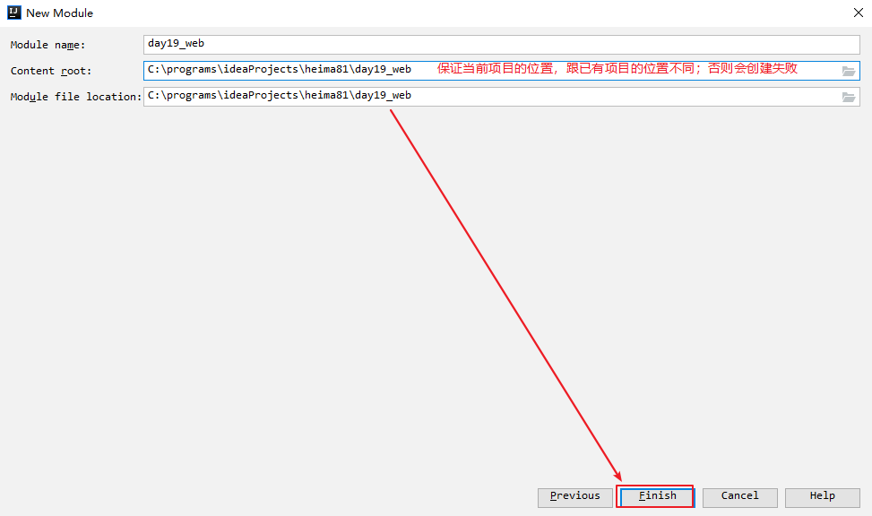

3. 补全目录，然后刷新

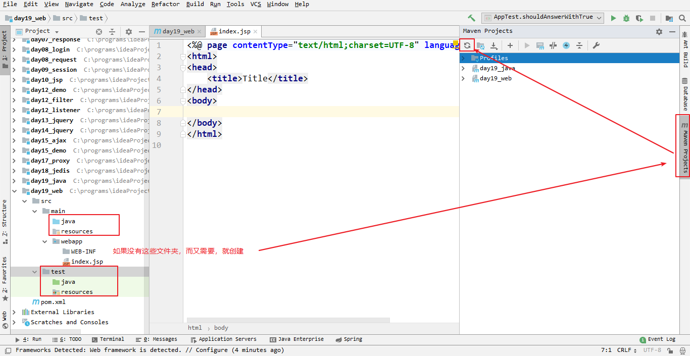

###### 2.3 在idea里执行Maven命令

方式一：直接点击执行

1. 在idea右侧点击`maven`，在弹出的窗口中刷新一下
2. 找到要操作的项目，在`Lifecycle`中找到要执行的命令，双击即可执行

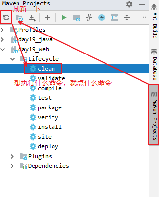

方式二：输入命令执行

1. 在idea右侧点击`maven`，在弹出的窗口中刷新一下
2. 点击按钮，弹出`Execute Maven Goal`窗口

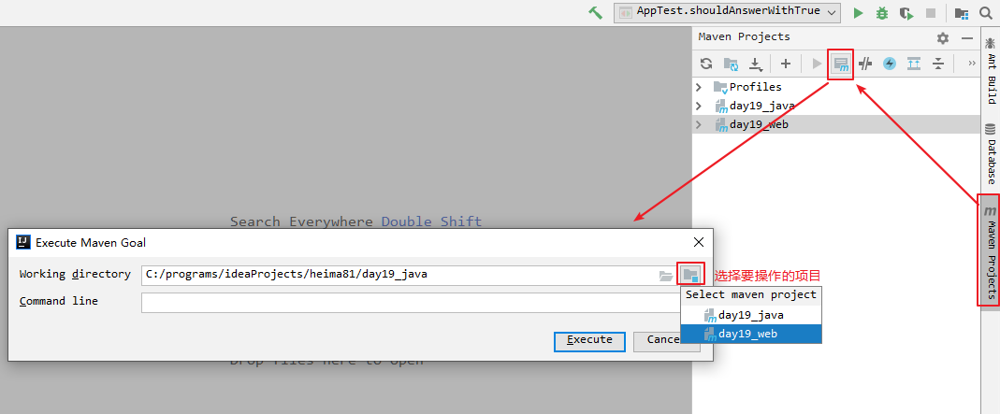

3. 选要操作的项目，然后输入Maven命令，点击`Execute`按钮

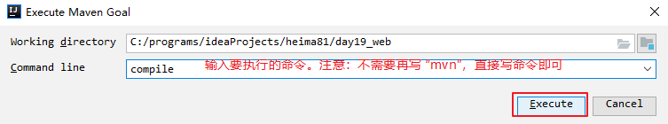

###### 2.4 在idea里部署Maven的web项目

* 部署部署和之前的步骤一样
* 注意：选择项目时，选择`war exploded`类型的，速度快

##### 3. 引入依赖【重点】

如果项目中需要使用jar包，只需要把jar包的坐标配置到项目的pom.xml中即可。在pom.xml的`<dependencies>`标签里增加以下内容：

```xml
<dependency>
    <groupId>junit</groupId>
    <artifactId>junit</artifactId>
    <version>4.12</version>
    <scope>依赖范围</scope>
</dependency>
```

> 可以使用 `alt+insert`，会弹出依赖导入的界面，可以从本地仓库里搜索依赖
>
> 如果不知道依赖的坐标，可以从中央仓库搜索坐标：https://mvnrepository.com/

##### 4. 依赖范围

如果项目中引入的jar包过多，可能会出现**jar包冲突**，我们可能设置jar包不同的**依赖范围**来处理jar包冲突。

###### Maven的依赖范围有：

- `compile`：默认的依赖范围，全范围有效。
- `test`：单元测试有效。src/test里有效，src/main里无效
- `provided`：编译时有效，运行时使用其它地方提供的jar包。备胎
- `runtime`：运行时有效，编译时无效。比如：数据库驱动包
- `system`：引入仓库之外的本地jar包。少用

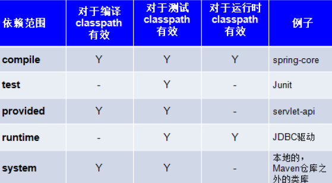

###### 实际开发中特殊的jar包

* `Junit`：依赖范围通常设置为`test`
* `servlet-api， jsp-api`：依赖范围通常设置为`provided`
* `数据库驱动包`：依赖范围可以是默认的，也可以是`runtime`
* 其它包，绝对多数都是默认依赖范围

#### 小结


### Maven的插件

#### 目标

* 了解Maven的常用插件

#### 讲解

* maven插件可以完成一些特定的功能。例如，集成jdk插件可以方便的修改项目的编译环境；集成tomcat插件
  后，无需安装tomcat服务器就可以运行tomcat进行项目的发布与测试。

* 在pom.xml的`plugins`标签中，通过`plugin`标签引入maven的功能插件。

##### jdk编译版本插件

```xml
<!--jdk编译插件-->
<plugin>
    <groupId>org.apache.maven.plugins</groupId>
    <artifactId>maven-compiler-plugin</artifactId>
    <version>3.2</version>
    <configuration>
        <source>1.8</source>
        <target>1.8</target>
        <encoding>utf-8</encoding>
    </configuration>
</plugin>
```

##### tomcat7插件

```xml
<plugins>
    <plugin>
        <groupId>org.apache.tomcat.maven</groupId>
        <artifactId>tomcat7-maven-plugin</artifactId>
        <configuration>
            <!-- 指定端口 -->
            <port>82</port>
            <!-- 项目路径 -->
            <path>/</path>
        </configuration>
    </plugin>
</plugins>
```

* 注意: 
  * Maven的中央仓库中只有Tomcat7.X版本的插件，而之前我们使用的是8.X的版本
  * 如果想使Tomcat8.X的，建议使用IDEA集成外部Tomcat8，进行项目的发布。

#### 小结

* 导入依赖，在pom.xml的`<dependencies>`里增加一个标签`<dependency>`

```xml
<dependency>
	<groupId></groupId>
    <artifactId></artifactId>
    <version></version>
    <scope>依赖范围</scope>
</dependency>
```

* 依赖范围：用于设置jar包的作用范围，可以处理一部分的依赖冲突
  * `compile`：全范围有效，默认值。编译时有效，运行时有效，单元测试里有效
  * `runtime`：编译时无效，运行时有效。数据库驱动包可以设置为runtime
  * `provided`：编译时有效，运行时无效。servlet-api、jsp-api设置为provided
  * `test`：单元测试里有效。通常是junit设置为test
  * `system`：引入仓库之外的本地jar包，用的少

## 六、Maven的私服【了解】

### 搭建私服

#### 目标

* 了解私服的概念
* 搭建私服

#### 讲解

##### 什么是Maven的私服

* 公司在自己的局域网内搭建自己的远程仓库服务器，称为私服
*  私服服务器即是公司内部的 maven 远程仓库， 每个员工的电脑上安装 maven 软件并且连接私服服务器，员工将自己开发的项目打成 jar 并发布到私服服务器，其它项目组从私服服务器下载所依赖的构件（jar）。
* 私服还充当一个代理服务器，当私服上没有 jar 包会从互联网中央仓库自动下载，如下图 :

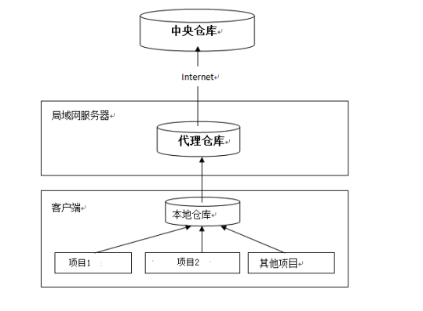

##### 搭建Maven私服

###### 1. 下载nexus

* Nexus 是 Maven 仓库管理器， 通过 nexus 可以搭建 maven 仓库，同时 nexus 还提供强大的仓库管理功能，构件搜索功能等。
* 下载地址： http://www.sonatype.org/nexus/archived/ ，下载： nexus-2.12.0-01-bundle.zip 


###### 2. 安装nexus

1. 解压`nexus-2.12.0-01-bundle.zip`。注意：解压路径里不要有中文、空格、特殊字符
2. 以管理员方式打开cmd，切换进入解压目录的bin文件夹里，运行命令：`nexus.bat install`
   * 把nexus安装成为Windows的服务

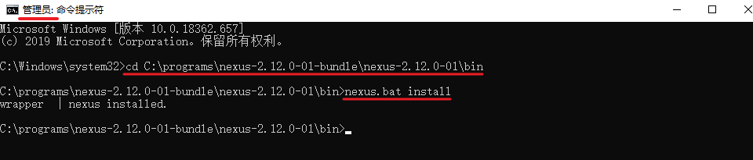

###### 3. 启动nexus

* 启动nexus服务：以管理员方式打开cmd，输入命令：`net start nexus`（第一次启动比较慢）
  * 如果把nexus服务设置为开机自启动，以后就不需要再手动启动nexus服务了
  * 但是通常是nexus服务器上设置。我们自己电脑上，没有必要设置开机自启动
* 关闭nexus服务：以管理员方式打开cmd，输入命令：`net stop nexus`

###### 4. 登录nexus

* 打开浏览器，输入地址：`http://localhost:8081/nexus`
  * 可以打开nexus的`conf/nexus.properties`文件，修改端口号，重启nexus服务后生效

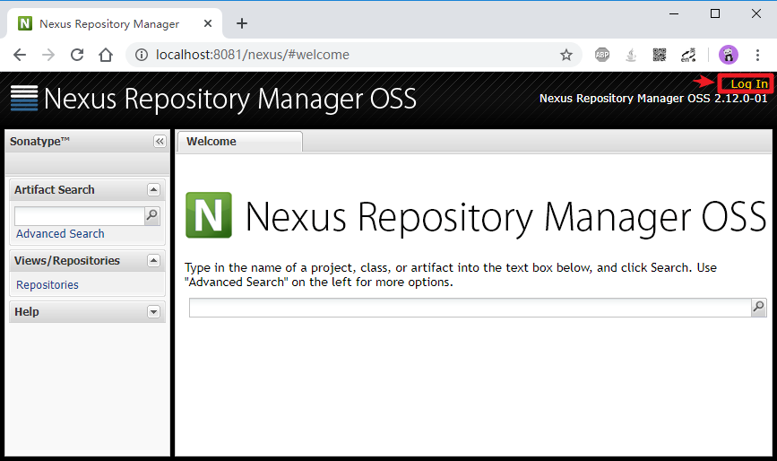

* 登录“Log in”，输入帐号和密码进行登录（帐号admin，密码admin123）

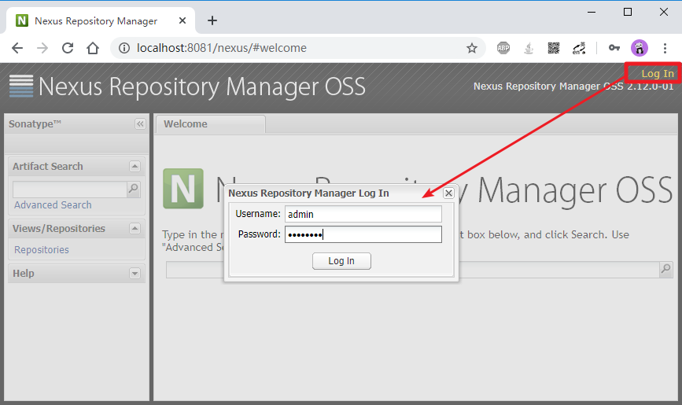

##### nexus的仓库类型介绍

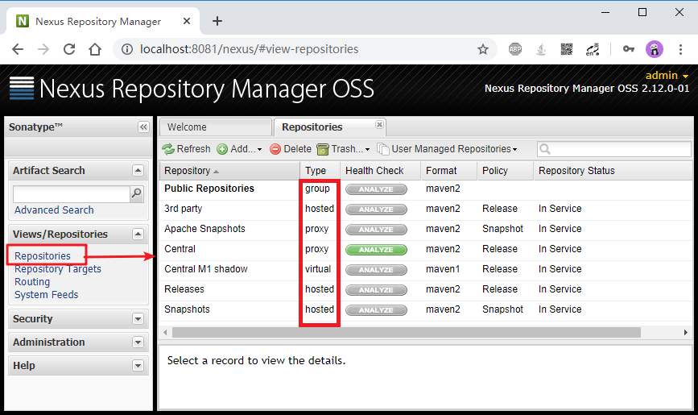

* `hosted`：宿主仓库， 部署自己的 jar 到这个类型的仓库，包括 releases 和 snapshot 两部
  分， Releases 公司内部发布版本仓库、 Snapshots 公司内部测试版本仓库

* `proxy`：代理仓库， 用于代理远程的公共仓库，如 maven 中央仓库，用户连接私服，私
  服自动去中央仓库下载 jar 包或者插件。

* `group`：仓库组，用来合并多个 hosted/proxy 仓库，通常我们配置自己的 maven 连接仓
  库组。

* `virtual`：虚拟仓库，兼容 Maven1 版本的 jar 或者插件 

#### 小结

* 搭建私服：
  1. 解压安装包，使用管理员运行cmd：`nexus.bat install`
  2. 启动私服的nexus服务：`net start nexus`
  3. 可以使用浏览器来访问服务：`http://localhost:8081/nexus`，帐号`admin/admin123`
  4. 关闭nexus服务：`net stop nexus`
* 私服里仓库的分类：
  * hosted：宿主仓库
  * proxy：代理仓库
  * group：仓库组
  * virtual：虚拟仓库

### 使用私服

#### 目标

* 把项目发布到私服
* 从私服下载jar包

#### 讲解

##### 把项目发布到私服

###### 使用场景

* 企业中多个团队协作开发通常会将一些公用的组件、开发模块等发布到私服供其它团队或模块开发人员使用。
* 本例子假设多团队分别开发。某个团队开发完在common_utils, 将 common_utils发布到私服供其它团队使用

###### 配置

* 第一步：在用户自己的Maven软件里，修改`conf/settings.xml`，配置私服的帐号和密码

```xml
<server>
    <id>releases</id>
    <username>admin</username>
    <password>admin123</password>
</server>
<server>
    <id>snapshots</id>
    <username>admin</username>
    <password>admin123</password>
</server>
```

* 第二步：在用户需要发布的私服的项目pom.xml里，配置私服仓库的地址。
  * 本公司的自己的 jar 包会上传到私服的宿主仓库，根据工程的版本号决定上传到哪个宿主仓库
  * 如果版本为 release 则上传到私服的 release 仓库，如果版本为snapshot 则上传到私服的 snapshot 仓库 

```xml
<distributionManagement>
    <repository>
        <!-- 注意：id的值，是刚刚在settings.xml中配置的server的id -->
        <id>releases</id>
        <url>http://localhost:8081/nexus/content/repositories/releases/</url>
    </repository>
    <snapshotRepository>
        <!-- 注意：id的值，是刚刚在settings.xml中配置的server的id -->
        <id>snapshots</id>
        <url>http://localhost:8081/nexus/content/repositories/snapshots/</url>
    </snapshotRepository>
</distributionManagement>
```

###### 测试

1. 启动nexus服务（如果已启动，就不需要做这一步）
2. 在项目里执行Maven的`deploy`命令：
   * 根据本项目pom.xml中version定义决定发布到哪个仓库
   * 如果version定义为`xx-snapshot`，项目将发布到 nexus 的 snapshot仓库
   * 如果 version定义为`xx-release`，项目将发布到 nexus的 release 仓库

##### 从私服下载jar包

###### 使用场景

* 没有配置 nexus的时候，如果本地仓库没有，就会去中央仓库下载，下载速度不稳定
* 通常在企业中会在局域网内部署一台私服服务器。这样：
  * 本地项目首先去本地仓库找 jar；
  * 如果没有找到则连接私服从私服下载 jar 包；
  * 如果私服没有 jar 包，私服同时作为代理服务器从中央仓库下载 jar 包
* 好处是：
  1. 由私服对公司项目的依赖 jar 包统一管理
  2. 可以提高下载速度， 项目连接私服下载 jar 包的速度，要比项目连接中央仓库的速度快的多。

###### 配置

* 第一步：在`settings.xml`的`profiles`标签下配置：
  * 注：由于`settings.xml`中没有`repositories`标签，所以要使用`profile`标签来配置仓库

```xml
<profile>
    <!--profile 的 id-->
    <id>dev</id>
    <repositories>
        <repository>
            <!--仓库 id， repositories 可以配置多个仓库，保证 id 不重复-->
            <id>nexus</id>
            <!--仓库地址，即 nexus 仓库组的地址-->
            <url>http://localhost:8081/nexus/content/groups/public/</url>
            <!--是否下载 releases 构件-->
            <releases>
                <enabled>true</enabled>
            </releases>
            <!--是否下载 snapshots 构件-->
            <snapshots>
                <enabled>true</enabled>
            </snapshots>
        </repository>
    </repositories>
    <pluginRepositories>
        <!-- 插件仓库， maven 的运行依赖插件，也需要从私服下载插件 -->
        <pluginRepository>
            <!-- 插件仓库的 id 不允许重复，如果重复后边配置会覆盖前边 -->
            <id>public</id>
            <name>Public Repositories</name>
            <url>http://localhost:8081/nexus/content/groups/public/</url>
        </pluginRepository>
    </pluginRepositories>
</profile>
```

* 第二步：激活`profile`定义的仓库
  * 激活后，配置的仓库才会生效

```xml
<activeProfiles>
	<activeProfile>dev</activeProfile>
</activeProfiles>
```

###### 测试

* 创建Maven应用`day22_testdownload`，配置依赖

```xml
<dependency>
    <groupId>com.itheima</groupId>
    <artifactId>day22_commons-utils</artifactId>
    <version>1.0-SNAPSHOT</version>
</dependency>
```

* 编译项目，查看日志会出现：

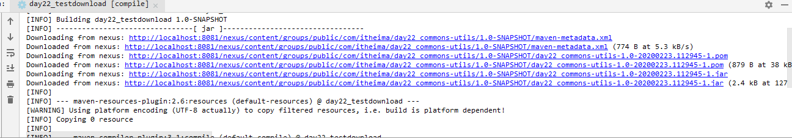

* 查看本地仓库里，会有从私服下载的jar包

#### 小结

* 把本地工程发布到私服：
  1. 修改Maven软件里`conf/settings.xml`，在`<servers>`里添加仓库的帐号和密码
  2. 修改工程的pom.xml，在其中设置私服的地址
  3. 使用Maven的deploy命令，把工程代码打包发布到私服上
* 从私服上下载依赖
  1. 修改Maven软件里`conf/settings.xml`
     * 在`<profiles>`里添加私服仓库的地址
     * 激活这个`<profile>`配置
  2. 在工程的pom.xml里增加依赖的坐标 

### 上传jar到本地仓库和私服

#### 目标

* 把第三方jar打包到本地仓库
* 把jar打包发布到私服

#### 讲解

##### 把第三方jar打包到本地仓库

* 如果有一个jar不在本地仓库、不在私服、不在中央仓库。我们可以把jar安装到本地仓库中，方便后续使用
* `cmd`命令示例：

```shell
mvn install:install-file -DgroupId=com.alibaba -DartifactId=fastjson -Dversion=1.1.37 -Dfile=fastjson-1.1.37.jar -Dpackaging=jar

mvn install:install-file -DgroupId=com.oracle -DartifactId=ojdbc6 -Dversion=1.1.37 -Dfile=ojdbc6.jar -Dpackaging=jar
```

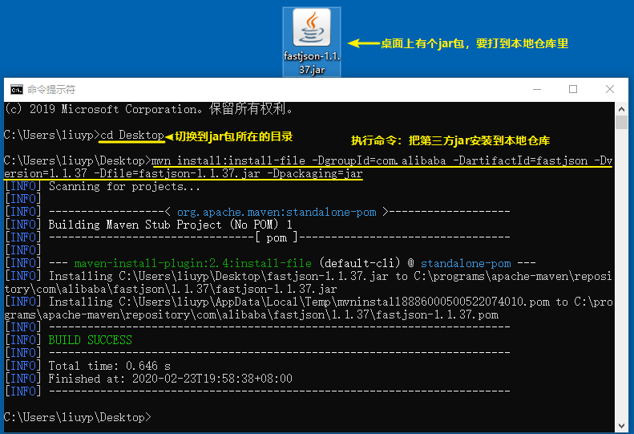

* 查看本地仓库，验证是否安装成功

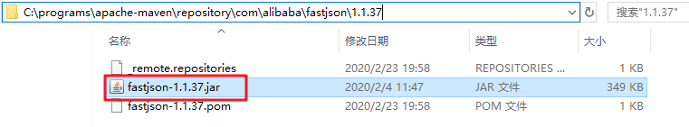

##### 把第三方jar打包发布到私服

* 第一步：在`settings.xml`中配置私服的server信息

```xml
<server>
    <id>thirdparty</id>
    <username>admin</username>
    <password>admin123</password>
</server>
```

* 第二步：执行命令

```shell
mvn deploy:deploy-file -DgroupId=com.alibaba -DartifactId=fastjson -Dversion=1.1.37 -Dpackaging=jar -Dfile=fastjson-1.1.37.jar -Durl=http://localhost:8081/nexus/content/repositories/thirdparty/ -DrepositoryId=thirdparty


mvn deploy:deploy-file -DgroupId=com.oracle -DartifactId=ojdbc6 -Dversion=1.1.37 -Dpackaging=jar -Dfile=ojdbc6.jar -Durl=http://localhost:8081/nexus/content/repositories/thirdparty/ -DrepositoryId=thirdparty
```

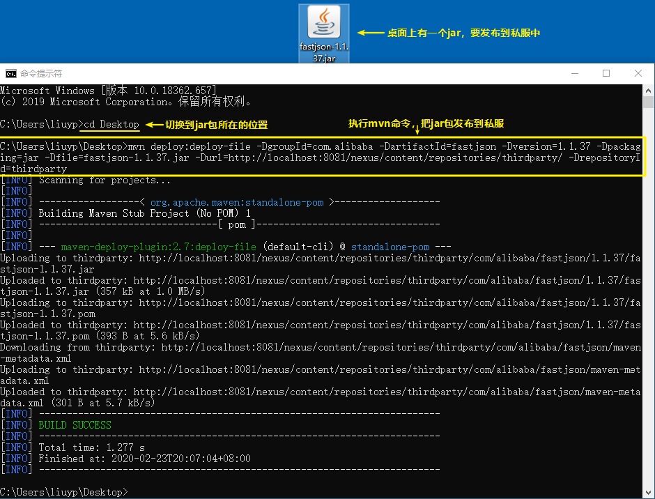

* 第三步：查看私服的第三方仓库，验证是否发布成功

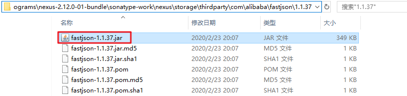

##### 参数说明

* `DgroupId`和`DartifactId`构成了 jar 包的坐标，项目就是依靠这两个属性定位。可以自己起名

* `Dfile` 表示需要上传的 jar 包的位置。

* `Durl` 私服上仓库的位置，打开 nexus——>repositories 菜单，可以看到该路径。

* `DrepositoryId` 服务器的表示 id，在 nexus 的 configuration 可以看到。

* `Dversion` 表示版本信息。

​	上传成功后，在 nexus 界面点击 3rd party 仓库可以看到这包。 

#### 小结


## 七、Lombok

### 1. Lombok介绍与配置

#### 目标

1. 什么是Lombok
2. Lombok的作用
3. Lombok的配置

#### 讲解

##### 什么是Lombok

* Lombok是一个Java库，能自动插入编辑器并构建工具，简化Java开发。
* 官网: https://www.projectlombok.org/ 
* 注意：JDK版本过高、或者idea版本过高，会不兼容Lombok

##### Lombok的作用

* 通过添加注解的方式，帮我们生成一些方法，简化JavaBean代码，提高开发效率。

* 例如：
  * 开发中经常需要写的javabean，要添加相应的getter/setter，也许还要去写构造器、equals等方法
  * 当属性多时，会出现大量的getter/setter方法，这些显得很冗长也没有太多技术含量
  * 使用Lombok，可以帮我们生成这些方法，我们就不用自己编写了

##### Lombok的配置

+ 添加maven依赖

```xml
<dependency>
	<groupId>org.projectlombok</groupId>
    <artifactId>lombok</artifactId>
	<version>1.18.8</version>
	<scope>provided</scope>
</dependency>
```

+ 安装插件：使用Lombok还需要插件的配合。

  * 打开idea的设置，点击Plugins，点击Browse repositories，在弹出的窗口中搜索lombok，然后安装即可
  

 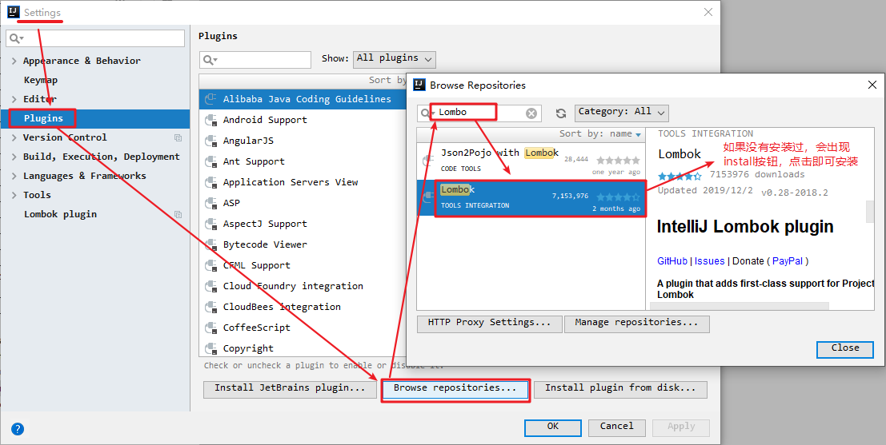

+ 解决编译时出错问题

  ​	编译时出错，可能是没有enable注解处理器。Annotation Processors > Enable annotation processing。设置完成之后程序正常运行。

  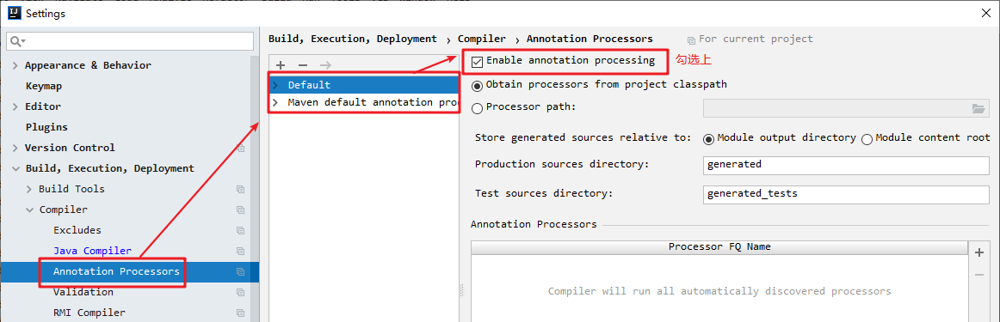

#### 小结


### 2. Lombok的常用注解

#### 目标

1. `@Data`
2. `@Getter/@Setter`
3. `@ToString`
4. `@NoArgsConstructor`, `@AllArgsConstructor`

#### 讲解

##### `@Data`

* @Data注解在类上，会为类的所有属性自动生成setter/getter、equals、canEqual、hashCode、toString方法，如为final属性，则不会为该属性生成setter方法。 

```java
@Data
public class User implements Serializable{
    private Integer id;
    private String username;
    private String password;
    private String address;
    private String nickname;
    private String gender;
    private String email;
    private String status;
}

```

##### `@Getter/@Setter`

* 如果觉得@Data不够精细，可以使用@Getter/@Setter注解
* 此注解用在属性上，可以为相应的属性自动生成Getter/Setter方法.

```java
public class User implements Serializable{
    @Setter
    @Getter
    private Integer id;
    private String username;
    private String password;
    private String address;
    private String nickname;
    private String gender;
    private String email;
    private String status;
}
```

##### `@ToString`

* 类上使用@ToString注解，Lombok会生成一个`toString()`方法
* 生成的`toString`方法会输出类名、所有属性（会按照属性定义顺序），用逗号来分割。 
* 通过`exclude`属性指定忽略字段不输出,

```java
@ToString(exclude = {"id"}) 
public class User implements Serializable{
    private Integer id;
    private String username;
    private String password;
    private String address;
    private String nickname;
    private String gender;
    private String email;
    private String status;
}

```

##### `@xxxConstructor`

+ `@NoArgsConstructor`: 无参构造器 

```java
@NoArgsConstructor
public class User implements Serializable{
    private Integer id;
    private String username;
    private String password;
    private String address;
    private String nickname;
    private String gender;
    private String email;
    private String status;
}
```

+ `@AllArgsConstructor`: 全参构造器 

```java
    @AllArgsConstructor
    public class User implements Serializable{
        private Integer id;
        private String username;
        private String password;
        private String address;
        private String nickname;
        private String gender;
        private String email;
        private String status;
    }
```

##### 4.小结


# 复习上午内容

* Maven的作用：

  * 项目构建
  * 依赖管理

* 坐标：被Maven管理的每个项目，都必须有自己的唯一标识，这个唯一标识是坐标

  * groupId：
  * artifactId
  * version

* 仓库的分类：

  * 本地仓库：本地电脑上缓存jar包的文件夹
  * 远程仓库（私服）：一些企业、社区搭建的服务
  * 中央仓库：由Maven官方团队维护的仓库

* 项目构建

  * 常用命令：
    * 清理`mvn clean`
    * 编译`mvn compile`
    * 测试`mvn test`
    * 打包`mvn package`
    * 安装`mvn install`
  * 三套生命周期：
    * 清理生命周期：`clean`
    * 默认生命周期：`compile->test->package->install->deploy`
    * 站点生命周期：`site`

* 依赖管理

  ```xml
  <dependency>
  	<groupId></groupId>
      <artifactId></artifactId>
      <version></version>
      <scope>依赖范围</scope>
  </dependency>
  ```

  * 依赖范围：
    * `compile`：默认的依赖范围，编译时有效，运行时有效，单元测试有效
    * `runtime`：编译时无效，运行时有效
    * `provided`：编译时有效，运行时无效
    * `test`：单元测试里有效
    * `system`：引入仓库之外的本地jar包