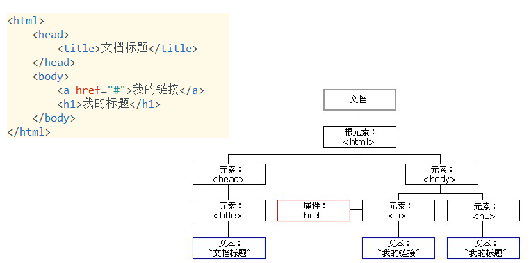
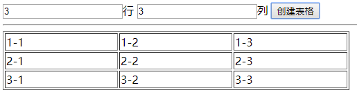
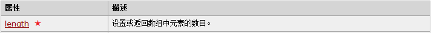
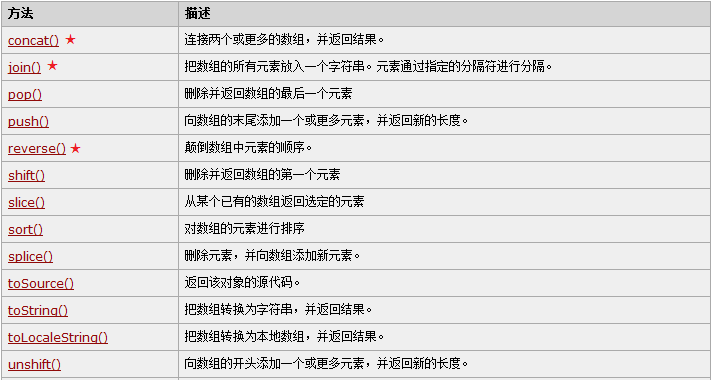
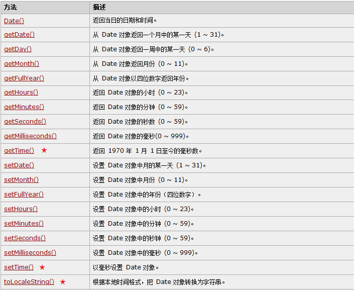
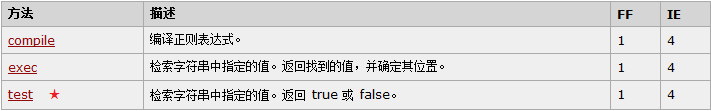
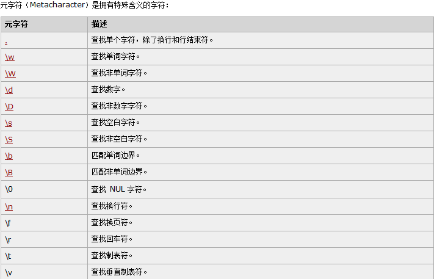

# JavaScript-课堂笔记

* 文字排版

```html
<h1>
    一级标题.  h1~h6
</h1>

<hr/>

<p>
    段落。  换行用<br/>
</p>
<font color="" size="" face="">文字</font>
<b>粗体字</b>
<i>斜体字</i>
```

* 图片显示

```html

```

* 清单和超链接

```html
<ol>
    <li>清单项</li>
    <li>清单项</li>    
</ol>
<ul>
    <li>清单项</li>
    <li>清单项</li>   
</ul>

<a href="http://www.baidu.com">百度</a>
```

* 表格

```html
<table>
    <tr>
    	<td>单元格</td>
        <td>单元格</td>
        <td>单元格</td>
    </tr>
    <tr>
    	<td>单元格</td>
        <td>单元格</td>
        <td>单元格</td>
    </tr>    
</table>
```

* 表单【掌握】

```html
<form name="名称" action="提交路径" method="提交方式GET/POST">
    <input type="text" name="username" value="默认值"/>
    <input type="password" name="password" value="默认值"/>
    
    <input type="radio" name="sex" value="male">男
    <input type="radio" name="sex" value="female" checked>女
    
    <input type="checkbox" name="hobby" value="eat" checked>吃
    <input type="checkbox" name="hobby" value="drink">喝
    <input type="checkbox" name="hobby" value="play">玩
    <input type="checkbox" name="hobby" value="happy">乐
    
    <input type="button" value="普通按钮">
    <input type="submit" value="提交按钮">
    <input type="reset" value="重置按钮">
    <input type="image" src="图片路径">
    
    <input type="file" name="file">
    <input type="hidden" name="hide" value="隐藏域的值">
    
    
    <select name="address">
        <option value="gd">广东省</option>
        <option value="gx" selected>广西省</option>
    </select>
    
    <textarea name="yourself">默认值</textarea>
</form>
```


## 一、简介

### 1. js简介和作用

#### 目标

* 了解js的概念
* 理解js的作用
* 能说出js的组成

#### 讲解

##### 什么是js

* JS：JavaScript。是web开发中不可缺少的脚本语言，不需要编译就能运行（解释型语言）。它“寄生”在html体内放在服务器上，随网络传输到客户端，在浏览器里运行。
* js是大小写敏感的语言

##### js的作用

**和用户交互，实现页面的动态效果的**

- 操作浏览器：用户做某些操作，让js操作浏览器  前进一步、后退一步、弹窗、刷新页面等等
- 操作网页：用户做某些操作，让js操作网页  操作网页样式、操作标签内容、操作属性

##### js的组成

- ECMAScript：规定了js的基本语法规范
- BOM：Browser Object Model，浏览器对象模型。js可以调用BOM对象，来操作浏览器
- DOM：Document Object Model，文档对象模型。js可以调用DOM对象，来操作网页

##### js的来历（了解）

* 网景公司：NetScape，网景浏览器， FireFox。  LiveScript  =》 JavaScript
* 微软公司：IE浏览器，JScript， IE捆绑操作系统 => Edge =>Edge使用chromium内核
* ECMA：欧洲计算机联盟协会，ECMAScript

#### 小结

* js的作用：和用户交互实现动态效果
  * 操作浏览器
  * 操作网页
* js的组成：
  * ECMAScript：基本语法规范
  * BOM：浏览器对象模型，用于操作浏览器的
  * DOM：文档对象模型，用于操作网页的


### 2. 在HTML中引入js

#### 目标

* 能够在HTML中引入js

#### 讲解

##### js的引入语法

```html
<!--1.内部js -->
<script>
	alert();
</script>

<!--2.外部js -->
<script src="js文件路径"></script>
```

##### 注意事项：

- 一个script标签的功能要单一：要么是内部js，要么是外部js，不能混用
- js越晚加载越好，建议放在body结束标签之前（css建议放在head里）

#### 小结

```html
<script>
	//写js代码
</script>
<script src="js文件路径"></script>
```


## 二、基本语法

### 1. 基本语法

#### 目标

* 掌握编写js的基本语法

#### 步骤

* js的变量定义
* js的数据类型
* js的运算符
* js的流程控制语句

#### 讲解

##### 变量定义

* js里一切变量定义都是：`var` 
  * 新版本ECMAScript6.0里，定义变量使用 `let`，定义常量用`const`
* js是弱类型语言：声明变量时，不需要声明类型。
* js是动态类型语言：一个变量的类型是可变的

```js
//1.定义整数
let v = 1;

//2.定义小数
v = 0.5;

//3.定义布尔
v = true;

//4.定义字符串。字符串可以用单引号定义，也能用双引号定义
// v = "hello, javascript";
v = 'hello, javascript';

//5.定义对象
v = new Date();

//6.定义常量：常量值不可更改
const pi = 3.14;
```

##### 数据类型

| 数据类型    | 描述       | 示例                   |
| ----------- | ---------- | ---------------------- |
| `number`    | 数字类型   | `1`, `2`, `3`, `3.14`  |
| `boolean`   | 布尔类型   | `true`, `false`        |
| `string`    | 字符串类型 | `"hello"`,   `'hello'` |
| `object`    | 对象类型   | `new Date()`,  `null`  |
| `undefined` | 未定义类型 | `undefined`            |

```js
	//声明变量未赋值，是undefined类型
	let v;
    console.log("值：", v , "  类型：" + typeof v);

    //1.定义整数
    v = 1;
    console.log("值：", v , "  类型：" + typeof v);

    //2.定义小数
    v = 0.5;
    console.log("值：", v , "  类型：" + typeof v);

    //3.定义布尔
    v = true;
    console.log("值：", v , "  类型：" + typeof v);

    //4.定义字符串
    // v = "hello, javascript";
    v = 'hello, javascript';
    console.log("值：", v , "  类型：" + typeof v);

    //5.定义对象
    v = new Date();
    console.log("值：", v , "  类型：" + typeof v);
	//  null值也是object类型
	v = null;
	console.log("值：", v , "  类型：" + typeof v);

    //6.定义常量
    const pi = 3.14;
    console.log(pi);
```

##### 运算符

- js也有：`+,-,*,/,%,+=,-=,*=,/=,%=,++,--,>,<,=,>=,<=,==,!=,&&,||,!`

- 需要说明的有：
  - `==`和`===`：
  
  | 运算符        | 描述                                       | 示例                   |
  | ------------- | ------------------------------------------ | ---------------------- |
  | `==`          | 比较值。只要值一样，就是true               | `1=="1"`，结果是true   |
  | `===`（推荐） | 比较值和类型。只有值和类型都一样，才是true | `1==="1"`，结果是false |
  
  - `-*/`：
    - 如果是数字，正常运算
    - 如果不是数字，js会尝试转换成数字再运算
    - 如果转换不成功，结果是`NaN`
    - 如果除数是0，结果是`Infinity`

```js
    //1. - * /：如果纯数字，直接计算；
    // 如果有字符串，先转换成数字再计算；
    let result = 3 + "2";
    console.log(result);

    result = 3 - "2";
    console.log(result);

    result = 3 * "2";
    console.log(result);

    result = 4 / "2";
    console.log(result);

	// 如果不能转换数字，结果是NaN；
    result = 4 / "a";
    console.log(result);

	// 除以0结果是Infinity表示无穷大	
    result = 4 / 0;
    console.log(result);

    console.log("-------------------------------------");

    //2. ==和===
    //== 比较值。只要值相等，就是true
    result = 3 == "3";
    console.log(result);
    //=== 比较值和类型。只有值和类型都一样，结果才是true
    result = 3 === "3";
    console.log(result);
```

##### 流程控制语句

- js也有：`if, else, else if, while, switch, for`
- 特殊的是：if判断时，`false, 0, "", null, undefined`是false，其它是true

```js
	//undefined类型，if判断始终为false
	let v;
	//number类型：0是false，非0是true
	v = 0;
	//string类型：""是false，非""是true
	v = "";
	//object类型：null是false；非null是true
	v = new Date();
    if (v){
        alert("true");
    } else {
        alert("false");
    }
```

#### 小结

* 定义变量用`let`，定义常量用`const`
* 数据类型：
  * `number`：数字类型
  * `boolean`：布尔类型
  * `string`：字符串类型，可以用单引号定义，也可以用双引号定义
  * `object`：对象类型，null也是object类型
  * `undefined`：未定义类型，变量未赋值是undefined
* 运算符：和Java类似，也有：`+ - * / .......`。和Java不同的：
  * `- * /`：如果有字符串，js会把字符串转换成数字再运算；如果转换不成功，结果是NaN；如果除以0，结果是Infinity
  * `==`：比较值。只要值相等就是true
  * `===`：比较值和类型。只有值和类型都一样，结果才是true
* 流程控制语句：和Java类似，也有`if, else, else if, for, switch, do..while, while..do`
  * 不同的是if判断条件：`undefined, 0, "", null`是false，其它是true

### 2. 函数【重点】

#### 目标

* 掌握js函数的定义和调用

#### 步骤

* 能够定义和调用普通函数
* 能够定义和使用匿名函数

#### 讲解

##### 普通函数

* 语法

```js
//1.定义 一个普通函数
function 函数名(形参1,  形参2, ...){
    函数体
    如果需要返回值，就return；否则就不return
}
//2.调用 一个普通函数
let result = 函数名(实参1，实参2, ...);
```

* 示例

```js
function add(a, b){
    return a+b;
}
let result = add(1, 2);
```

##### 匿名函数

* 介绍：没有名称的函数叫匿名函数，也叫回调函数。通常是作为其它函数的实参使用的
* 语法

```js
//定义：
function(形参1,  形参2, ...){
    //函数体
    //如果需要返回值，就return；否则就不return
}
```

* 使用示例

```js
//1. 把匿名函数赋值给一个变量，通过变量名调用匿名函数
let fn = function(a, b){
    return a+b;
}
let result = fn(1, 2);


//2. 把匿名函数作为另外一个函数的实参（匿名函数是回调函数）★
window.setInterval(function(){
    alert();
},  2000);
```

##### 拓展了解

```js
//以下是匿名函数  不常用的调用方法
let fn = function(){
        alert();
    };
setInterval(fn, 2000);
setInterval("fn()", 2000);  //浏览器每隔2000毫秒，把"fn()"作为js代码执行一次：执行fn()
```

##### 注意事项：

* js的函数**没有重载**：同名函数只有最后一个有效
* 形参个数和实参个数无关：在函数里可以使用`arguments`来得到所有的实参数组

#### 小结

```js
//普通函数
function add(a, b){
    return a+b;
}
let result = add(1, 2);

//匿名函数
setInterval(function(){
    alert();
}, 1000);
```


### 3. 事件【重点】

#### 目标

* 能说出至少5个常用事件
* 能够绑定事件，完成简单的功能

#### 讲解

##### 事件相关的概念

- 事件：用户在浏览器上做一些事情、动作
- 事件源：事件、动作发生在哪个标签、对外上，即：事件发生的源头
- 响应行为：事件发生之后，要执行的代码，通常是封装成函数来调用=>需要我们写代码


* 比如：按钮被点击时，弹窗
  * 事件：点击动作
  * 事件源：按钮
  * 响应行为：弹窗

##### 常见的事件

| 事件属性     | 描述，监听什么                               |
| ------------ | -------------------------------------------- |
| **onclick**  | 监听鼠标单击                                 |
| ondblclick   | 监听鼠标双击                                 |
| **onsubmit** | 监听表单提交了，事件源是表单                 |
| **onchange** | 监听域内容改变，通常用于监听下拉框的选项变化 |
| **onload**   | 监听加载完成，通常用于监听浏览器加载完了页面 |
| onfocus      | 监听获取焦点（光标）                         |
| onblur       | 监听失去焦点（光标）                         |
| onkeydown    | 监听键盘按键按下                             |
| onkeypress   | 监听键盘按键按下或按住                       |
| onkeyup      | 监听键盘按键弹起                             |
| onmousedown  | 监听鼠标按键按下                             |
| onmouseup    | 监听鼠标按键弹起                             |
| onmouseover  | 监听鼠标移入                                 |
| onmouseout   | 监听鼠标移出                                 |
| onmousemove  | 监听鼠标移动                                 |

##### 事件绑定

- 普通函数方式

```html
<!DOCTYPE html>
<html lang="en">
<head>
    <meta charset="UTF-8">
    <title>普通函数绑定事件</title>
</head>
<body>
<!--
要求：点击按钮弹窗
分析：
    事件：点击 => onclick
    事件源：按钮 => 我们需要创建一个按钮
    响应行为：弹窗 => 定义一个函数
-->
<input type="button" value="点我哦" onclick="show()">
<input type="button" value="双击我" ondblclick="show()">

<!--
要求：下拉框选中的值改变时，弹窗
分析：
    事件：域内容改变 => onchange
    事件源：下拉框 => select标签
    响应行为：弹窗 => 定义一个函数
-->
<select onchange="show()">
    <option value="gd">广东省</option>
    <option value="gx">广西省</option>
    <option value="hn">河南省</option>
    <option value="hb">河北省</option>
</select>
    
<script>
    function show() {
        alert("来啦");
    }
</script>
</body>
</html>
```

- 匿名函数方式

```html
<!DOCTYPE html>
<html lang="en">
<head>
    <meta charset="UTF-8">
    <title>匿名函数绑定事件</title>
</head>
<body>
<!--
要求：点击按钮弹窗
分析：
    事件：点击 => onclick
    事件源：按钮 => 我们需要创建一个按钮
    响应行为：弹窗 => 定义一个函数
-->
<input type="button" value="点我哦" id="btn1">
<input type="button" value="双击我" id="btn2">

<!--
要求：下拉框选中的值改变时，弹窗
分析：
    事件：域内容改变 => onchange
    事件源：下拉框 => select标签
    响应行为：弹窗 => 定义一个函数
-->
<select id="address">
    <option value="gd">广东省</option>
    <option value="gx">广西省</option>
    <option value="hn">河南省</option>
    <option value="hb">河北省</option>
</select>

<script>
    document.getElementById("btn1").onclick = function(){
        alert("来啦老弟");
    };

    document.getElementById("btn2").ondblclick = function(){
        alert("来啦老弟");
    };

    document.getElementById("address").onchange = function () {
        alert("变了");
    };
</script>
</body>
</html>
```

#### 小结

* 常见事件：
  * 单击事件：onclick
  * 双击事件：ondblclick
  * 表单提交：onsubmit
  * 内容改变事件：onchange
  * 加载完成：onload（加在body标签上的）
  * 获取焦点：onfocus，失去焦点：onblur
  * 键盘按下：onkeydown，键盘弹起：onkeyup，键盘按下或按住：onkeypress
  * 鼠标按下：onmousedown，鼠标弹起：onmouseup，鼠标移入：onmouseover，鼠标移出：onmouseout，鼠标移动：onmousemove

```html
<input type="button" value="按钮" onclick="show()">
<script>
    function show(){
        alert();
    }
</script>
```

```html
<input type="button" value="按钮" id="btn">
<script>
	document.getElementById("btn").onclick = function(){
        alert();
    }
</script>
```


## 三、bom对象

### 1. bom对象简介

#### 目标

* 了解bom的概念
* 知道有哪些bom对象

#### 讲解

- BOM：Browser Object Model，浏览器对象模型，这些对象提供了操作浏览器的方法
- 目的：让js代码调用bom对象的方法，来操作浏览器
- 有哪些bom对象：
  - `window`：浏览器窗口对象，是其它bom对象的顶级对象
  - `location`：浏览器地址对象，可以实现网页跳转。`window.location`，可以简写成location
  - `history`：浏览器历史记录对象，可以实现历史记录切换。`window.history`
  - `screen`：浏览器的屏幕显示信息对象，可以操作浏览器窗口大小、位置、颜色等信息` window.screen`
  - `navigator`：浏览器信息对象，只读的。可以获取浏览器的内核、版本、操作系统等信息 `window.navigator`

#### 小结


### 2. window对象

#### 目标

* 能够使用window弹窗
* 能够开启和清除定时器
* 练习：完成轮播图功能
* 练习：完成定时广告功能

#### 讲解

##### 让浏览器弹窗

* API：

| 方法              | 参数         | 返回值  | 说明          |
| ----------------- | ------------ | ------- | ------------- |
| `alert(string)`   | 提示信息内容 | 无      | 普通/警告弹窗 |
| `confirm(string)` | 提示信息内容 | boolean | 确认弹窗      |

* 示例

```html
<!DOCTYPE html>
<html lang="en">
<head>
    <meta charset="UTF-8">
    <title>window对象1-弹窗</title>
</head>
<body>

<script>
    /**
     * window的弹窗方法：
     *      普通弹窗：alert(msg)
     *      确认弹窗：confirm(msg)
     *      输入弹窗：prompt(msg)
     */
    //1.普通弹窗alert(msg)，无返回值
    // let result = alert("普通弹窗，用于提示或警告");
    // alert(result);

    //2.确认弹窗confirm(msg)，返回boolean值。点击确定返回true，取消返回false
    // let result = confirm("确定删除吗？");
    // alert(result);

    //3.输入弹窗prompt(msg)，返回输入的内容。如果点击了取消，返回null
    let result = prompt("请输入姓名");
    alert(result);
</script>
</body>
</html>
```

##### 让浏览器开启定时器

* API

| 方法                 | 参数                             | 返回值             | 说明                 |
| -------------------- | -------------------------------- | ------------------ | -------------------- |
| `setInterval(fn,ms)` | fn：函数对象<br />ms：间隔毫秒值 | number，定时器的id | 开启执行多次的定时器 |
| `clearInterval(id)`  | id：定时器的id                   |                    | 清除定时器           |
| `setTimeout(fn, ms)` | fn：函数对象<br />ms：延迟毫秒值 | number，定时器的id | 开启执行一次的定时器 |
| `clearTimeout(id)`   | id：定时器的id                   |                    | 清除定时器           |

* 示例

```html
<!DOCTYPE html>
<html lang="en">
<head>
    <meta charset="UTF-8">
    <title>window对象2-定时器</title>
</head>
<body>

<input type="button" value="清除定时器(多次的)" onclick="clearTimer1()">
<input type="button" value="清除定时器(一次的)" onclick="clearTimer2()">

<script>
    /**
     * window对象：可以让浏览器开启定时器
     *
     * 执行多次的定时器：
     *      开启定时器：setInterval(函数对象,间隔毫秒值)，返回number，是定时器的id
     *      清除定时器：clearInterval(定时器的id)
     *
     * 执行一次的定时器：
     *      开启定时器：setTimeout(函数对象,延迟毫秒值)，返回number，是定时器的id
     *      清除定时器：clearTimeout(定时器的id)
     *
     */
    //执行多次的定时器：开启一个定时器
    let timer1 = setInterval(function () {
        //console.log("执行多次的：", new Date());
    }, 1000);

    function clearTimer1(){
        //执行多次的定时器：点击按钮时，清除定时器
        clearInterval(timer1);
    }


    //执行一次的定时器：开启一个定时器
    let timer2 = setTimeout(function () {
        console.log("执行一次的：", new Date());
    }, 1000);
    function clearTimer2() {
        //执行一次的定时器：点击按钮时，清除定时器
        clearTimeout(timer2);
    }

</script>
</body>
</html>
```

#### 小结

* 弹窗：
  * 普通弹窗：`alert(string)`
  * 确认弹窗【掌握】：`confirm(string)`
  * 输入弹窗：`prompt(string)`
* 定时器
  * 执行一次的
    * `let timer = setTimerout(函数对象,延迟毫秒值)`
    * `clearTimeout(timer)`
  * 执行多次的
    * `let timer = setInterval(函数对象,间隔毫秒值)`
    * `clearInterval(timer)`

### 3. location对象

#### 目标

* 能够使用location进行页面跳转
* 练习：打开浏览器后不停弹窗

#### 讲解

* location对象拥有的属性和方法

| 方法/属性                 | 参数 | 返回值 | 说明              |
| ------------------------- | ---- | ------ | ----------------- |
| `var url = location.href` |      |        | 获取网址          |
| `location.href="路径"`    |      |        | 设置网址/网址跳转 |
| `reload()`                |      |        | 刷新当前页面      |

> 拓展：打开新窗口，在新窗口里显示新页面 `window.open("http://www.baidu.com")`

```html
<!DOCTYPE html>
<html lang="en">
<head>
    <meta charset="UTF-8">
    <title>location对象</title>
</head>
<body>

<script>
    /**
     * location对象：是浏览器地址信息对象，可以用来操作浏览器的地址
     *      location无需定义，直接获取使用即可： window.location， 或者简写  location
     *
     * location的作用：
     *      获取当前网址：let url = location.href;
     *      设置当前网址（网址跳转）：location.href = "url地址";
     *
     */
    //获取当前网址
    let url = location.href;
    console.log(url);

    //设置当前网址（网址跳转）：当前页面被打开，就会跳转到百度
    location.href = "http://www.baidu.com";
</script>
</body>
</html>
```

#### 小结

* 网址跳转：`location.href = "网址"`

### 4. history对象【拓展】

#### 目标

* 练习：模拟浏览器的前进和后退按钮功能

#### 讲解

| 方法        | 参数    | 返回值 | 说明     |
| ----------- | ------- | ------ | -------- |
| `forward()` |         |        | 前进一步 |
| `back()`    |         |        | 后退一步 |
| `go(n)`     | n：整数 |        | 切换n步  |

#### 小结


## 四、dom对象

### 1. 简介

#### 目标

* 了解dom的概念
* 了解dom树的概念

#### 讲解

##### dom

* dom：Document Object Model，文档对象模型，dom对象提供了操作网页的方法
* 作用：操作网页的

##### dom树

* 网页被加载到浏览器的内存中后，网页上所有的标签、属性、文本全部都会转换成节点对象，然后按照层级结构形成一个树形结构，这棵树叫dom树



#### 小结


### 2. 使用dom操作标签

#### 目标

* 能够使用dom操作标签

* 练习：根据用户输入的行数和列数，生成表格

  

#### 步骤

* 能够获取到标签对象
* 能够操作标签：创建标签、插入标签、删除标签
* 能够获取和设置标签体内容

#### 讲解

##### API

###### 1. 获取标签

`document`对象提供了获取标签Element的方法

| 方法                             | 说明                       | 参数        | 返回值        |
| -------------------------------- | -------------------------- | ----------- | ------------- |
| `querySelector("选择器")`        | 根据选择器获取一个标签对象 | 选择器      | `Element`     |
| `querySelectorAll("选择器")`     | 根据选择器获取标签对象     | 选择器      | `Element`数组 |
|                                  |                            |             |               |
| `getElementById(id)`             | 根据id获取标签对象         | 标签的id    | `Element`     |
| `getElementsByTagName("div")`    | 根据标签名称获取标签对象   | 标签名称    | `Element数组` |
| `getElementsByClassName("item")` | 根据标签class获取标签对象  | 标签的class | `Element数组` |

> 拓展：后边的`getElementsByxxx`方法
>
> * 如果是document对象使用：表示从整个网页里查找标签
> * 如果是element对象使用：表示从指定标签内部查找标签

```html
<!DOCTYPE html>
<html lang="en">
<head>
    <meta charset="UTF-8">
    <title>获取标签</title>
</head>
<body>
<input type="text" id="username" name="username" value="tom" class="inputItem">
<input type="password" id="password" name="password" value="123456" class="inputItem">


<script>
    /**
     * 根据id获取一个标签：document.getElementById("id值")
     * 根据name获取标签数组：document.getElementsByName("name值")
     * 根据标签名称获取标签数组：document.getElementsByTagName("标签名称")
     * 获取class获取标签数组：document.getElementsByClass("class值")
     *
     * ES6提供的新方法：
     *      document.querySelector("选择器")：获取选中的第一个
     *      document.querySelectorAll("选择器")：获取选中的标签数组
     */
    let username = document.getElementById("username");
    console.log(username);

    console.log("----------------------------------------");

    let items = document.getElementsByName("username");
    for (let item of items) {
        console.log(item);
    }

    console.log("----------------------------------------");

    items = document.getElementsByTagName("input");
    for (let item of items) {
        console.log(item);
    }

    console.log("----------------------------------------");

    items = document.getElementsByClassName("inputItem");
    for (let item of items) {
        console.log(item);
    }

    console.log("---↓↓↓以下ES6提供的新方法：获取多个↓↓↓---");

    //ES6提供的新方法：使用CSS选择器来获取选中的标签
    items = document.querySelectorAll(".inputItem");
    for (let item of items) {
        console.log(item);
    }

    console.log("---↓↓↓以下ES6提供的新方法：获取一个↓↓↓---");
    let item = document.querySelector(".inputItem");
    console.log(item);
</script>

</body>
</html>
```

###### 2. 操作标签

| 方法                                 | 说明           | 参数                     | 返回值        |
| ------------------------------------ | -------------- | ------------------------ | ------------- |
| `document.createElement("标签名称")` | 创建标签       | 标签名称，比如：`option` | `Element`对象 |
| `父标签对象.appendChild(element)`    | 追加插入子标签 | 要插入的标签Element      |               |
| `标签对象.remove()`                  | 删除标签       |                          |               |

> 注意：创建出来的标签不会立即生效，必须要插入到dom树里

```html
<!DOCTYPE html>
<html lang="en">
<head>
    <meta charset="UTF-8">
    <title>操作标签</title>
</head>
<body>

<ul id="fruitList">
    <li>苹果</li>
    <li>桔子</li>
    <li>橙子</li>
    <li>李子</li>
</ul>
<script>
    /**
     * 创建标签：document.createElement("标签名称")
     * 插入标签：父标签对象.appendChild(子标签对象)
     * 删除标签：标签对象.remove()
     */
    //1.创建一个li标签
    let item = document.createElement("li");
    //2.把创建出来的li标签，插入到fruitList内部
    let fruitList = document.getElementById("fruitList");
    fruitList.appendChild(item);
    //3.给创建出来的li标签里设置内容
    item.innerHTML = "粟子";
    //4.删除fruitList
    fruitList.remove();
</script>
</body>
</html>
```

###### 3. 操作标签体内容

* Element对象提供了获取和操作标签体的API
  * 获取标签体内容：`let inner = 标签element.innerHTML`
  * 设置标签体内容：`标签element.innerHTML = "新的标签体内容"`
    * 是覆盖式设置
    * 设置的html代码会生效

```html
<!DOCTYPE html>
<html lang="en">
<head>
    <meta charset="UTF-8">
    <title>操作标签体</title>
</head>
<body>
<div id="d1">
    黑马程序员
    <span>传智播客</span>
</div>


<script>
    /**
     * 标签体：开始标签和结束标签中间的内容
     * 获取标签体：let html = 标签对象.innerHTML
     * 设置标签体：标签对象.innerHTML = "html代码";
     *      原标签体内容被覆盖掉，并且设置的html代码会生效
     */
    //1.获取d1的标签体内容
    let d1 = document.getElementById("d1");
    let html = d1.innerHTML;
    console.log(html);

    //2.设置d2的标签体内容
    d1.innerHTML = "<h1>Hello Kitty</h1>";
</script>
</body>
</html>
```

##### 练习：生成表格

* 根据用户输入行数和列数，生成表格

```html
<!DOCTYPE html>
<html lang="en">
<head>
    <meta charset="UTF-8">
    <title>生成表格</title>
</head>
<body>
<input type="text" id="rows" value="5">行
<input type="text" id="cols" value="5">列
<input type="button" value="创建表格" onclick="createTable()">
<hr>
<div id="tbDiv"></div>

<script>
    function createTable() {
        let rowNumber = document.getElementById("rows").value;
        let colNumber = document.getElementById("cols").value;

        //删除原有表格
        let divTag = document.getElementById("tbDiv");
        divTag.innerHTML = "";

        //创建表格
        //1. 创建table标签
        let tableTag = document.createElement("table");
        tableTag.border = 1;
        tableTag.width = 500;
        tableTag.cellSpacing = 0;

        //2. 创建tr标签（用户要求几行，就创建几个tr）
        for (let i = 0; i < rowNumber; i++) {
            let trTag = document.createElement("tr");
            //把创建出来的每个tr标签，都插入到table标签里
            tableTag.appendChild(trTag);

            //3. 创建td标签（用户要求几列，就创建几个td）
            for (let j = 0; j < colNumber; j++) {
                let tdTag = document.createElement("td");
                trTag.appendChild(tdTag);

                //4.设置每个td里的内容
                tdTag.innerHTML = (i+1) + "行" + (j+1) + "列";
            }

        }

        //把表格设置到tbDiv里
        divTag.appendChild(tableTag);
    }
</script>
</body>
</html>
```

#### 小结

* 获取标签：
  * `document.getElementById`
  * `document.getElementsByName`
  * `document.getElementsByTagName`
  * `document.getElementsByClassName`
  * `document.querySelector("css选择器")`：获取一个标签
  * `document.querySelectorAll("CSS选择器")`：获取一批标签
* 创建标签：`document.createElement("标签名称")`
* 插入标签：`父标签对象.appendChild(子标签对象)`
* 删除标签：`标签对象.remove()`

### 3. 使用dom操作属性

#### 目标

* 掌握dom操作属性的方法
* 练习：模拟浏览器的功能-查看密码框的值
* 练习：隔行换色功能
* 练习：全选全消功能

#### 步骤

* 操作属性的通用方法
* 操作属性的简单方法

#### 讲解

##### 通用方法

* 标签`Element`对象提供了操作属性的方法
  * 可以操作html标签上的任意属性

| 方法                                | 说明       | 参数            | 返回值 |
| ----------------------------------- | ---------- | --------------- | ------ |
| `getAttribute(attrName)`            | 获取属性值 | 属性名称        | 属性值 |
| `setAttribute(attrName, attrValue)` | 设置属性值 | 属性名称,属性值 |        |
| `removeAttribute(attrName)`         | 删除属性   | 属性名称        |        |

##### 简单方法【拓展】

* 获取属性值：`let v = 标签element.属性名称;`
* 设置属性值：`标签element.属性名称 = 值;`

> 如果要操作：属性名称是关键字，或者自定义的属性，建议通过Attribute相关的方法进行操作

##### 练习：查看密码功能

```html
<!DOCTYPE html>
<html lang="en">
<head>
    <meta charset="UTF-8">
    <title>查看密码</title>
</head>
<body>

<input type="password" id="pwd">
<input type="button" value="查看密码" onmousedown="showPwd()" onmouseup="hidePwd()">

<script>
    let pwd = document.getElementById("pwd");
    function showPwd() {
        pwd.type = "text";
    }
    function hidePwd() {
        pwd.type = "password";
    }
</script>
</body>
</html>
```

#### 小结

* 操作属性简单方式：不能用于操作自定义属性、关键名称的属性(class属性)
  * 获取属性：`let v = 标签对象.属性名`
  * 设置属性：`标签对象.属性名= 值`
* 通用操作属性方式：
  * 获取属性：`let v = 标签对象.getAttribute("属性名")`
  * 设置属性：`标签对象.setAttribute("属性名", 值)`
  * 删除属性：`标签对象.removeAttribute("属性名")`

## 五、引用数据类型（内置类）

* 相当于Java的内置类，js有9个内置类


### 1. Array数组

#### 目标

* 能够创建数组
* 能够遍历数组
* 能够操作数组的长度
* 能够使用数组的常用方法

#### 讲解

##### 创建数组：

```js
new Array();//长度是0
new Array(size);//长度为size，里边是空的
new Array(element0, element1, ..., elementn);//相当于Java的：new Object[]{v1,v2,v3...}

//推荐方式：
let arr = ["a","b","c"];
```

##### 数组循环遍历

```js
//基本for循环
for (let i = 0; i < arr.length; i++) {
    console.log(arr[i]);
}

//增强for循环：for of
for(let item of arr){
    console.log(item);
}
```

##### 数组常用属性



##### 数组常用方法



#### 小结


### 2. Date日期

#### 目标

* 掌握Date对象的使用
* 练习：电子时钟

#### 步骤

* 能够创建日期对象：当前日期，指定日期
* 能够进行日期计算

#### 讲解

##### 创建日期

```js
let now = new Date();//当前时间
let date1 = new Date(2019, 9, 1);// 2019-10-01。注意：月是从0开始的
let date2 = new Date(2019, 9, 1, 11, 20, 30);//2019-10-01 11:20:30


//以下是Java创建指定日期：
String str = "2019-11-20";
SimpleDateFormat format = new SimpleDateFormat("yyyy-MM-dd");
Date date = format.parse(str);
```

##### 常用方法



#### 小结


### 3. RegExp正则表达式

#### 目标

* 能够使用正则表达式校验字符串格式
* 练习：表单校验

#### 步骤

* 创建正则表达式对象
* 使用正则表达式对象校验字符串的格式

#### 讲解

##### 创建正则表达式对象

```js
let reg1 = /正则表达式/;   //直接量方式
let reg2 = new RegExp("正则表达式"); //对象形式
```

##### 使用正则表达式校验字符串格式



##### js里正则表达式的语法（了解）

* 方括号：用于匹配一个字符


* 元字符：用于简化某些`[]`写法



* 量词：
  * 以下图片里的`n`是表达式


#### 小结


# 复习上午内容

* js的作用：和用户交互，实现动态效果的

  * 监听用户的动作：事件
  * 实现动态效果：
    * 操作网页：用dom
    * 操作浏览器：用bom

* 基本语法规范：

  * 变量定义用`let`， 常量定义用`const`
  * 数据类型：`number, boolean, string, object, undefined`
  * 运算符：`+ - * / % += -= *= /= %= .....`
    * `- * /`：如果有字符串，js会转换成数字再运算；如果转换成功结果是NaN；如果除以0结果是Infinity
    * `==`：比较值。只要值相同，结果 就是true
    * `===`：比较值和类型。只有值和类型都一样，结果才是true
  * 流程控制语句：`if, else, else if, for, do..while, while..do, switch`
    * if的判断条件可以是任意类型，其中`0,"",null,undefined`是false；其它是true

* 函数【掌握】

  * 普通函数

  ```js
  function 函数名(形参1,形参2,...){
      函数体
      [return 返回值;]
  }
  
  let result = 函数名(实参1,实参2,...)
  ```

  * 匿名函数

  ```js
  //1.把匿名函数赋值给一个变量，通过变量名调用
  let fn = function(a, b){
      return a+b;
  }
  let result = fn(1, 2);
  
  //2.把匿名函数作为实参，传递给另外一个函数
  setInterval(function(){}, 1000);
  ```

* 事件【掌握】

  * 常见事件：`onclick, ondblclick, onsubmit, onchange, onload, 2个焦点的，3个键盘的，5个鼠标`
  * 事件绑定

  ```html
  <Input type="button" value="按钮" onclick="要调用的函数名()"/>
  <input type="button" value="按钮" id="btn">
  <script>
  	document.getElenentById("btn").onclick = function(){
          alert();
      }
  </script>
  ```

* 操作浏览器：bom对象

  * `window`：浏览器窗口对象
    * 提供了弹窗方法：`alert(), confirm(), prompt()`
    * 提供了定时器：
      * 执行多次的定时器：`setInterval(函数对象,间隔毫秒值)`, `clearInterval(定时器id)`
      * 执行一次的定时器：`setTimeout(函数对象,延迟毫秒值)`，`clearTiemout(定时器的id)`
  * `location`：浏览器地址信息对象
    * 获取当前网址：`let url = location.href;`
    * 设置网址（跳转）：`location.href = "http://www.jd.com"`