# HTTP&Tomcat&Servlet-课堂笔记

* js作用：和用户交互，实现动态效果

* ECMAScript基本语法规范

  * 变量定义：let，  常量定义：const
  * 数据类型：`number, boolean, string, object, undefined`
  * 运算符：
    * `- * /`：如果有字符串，js会转换成数字再运算；如果转换失败结果是NaN；如果除以0是Infinity
    * `==`：比较值。只要值一样，结果就是true
    * `===`：比较值和类型。只有值和类型都一样，结果才是true
  * 流程控制语句：
    * `if`的判断条件可以是任意类型：`0, "", null, undefined`是false
  * 函数：

  ```js
  function add(a,b){
      return a+b;
  }
  let result = add(1,3);
  
  setInterval(function(){}, 1000);
  ```

  * 事件：

    * 常用事件：`onclick,ondblclick,onsubmit,onchange,onload,onfocus,onblur,onkeydown,onkeypress,onkeyup,onmousedown,onmouseup,onmouseover,onmouseout,onmousemove`
    * 事件绑定：

    ```html
    <input type="button" value="按钮" onclick="show()"/>
    <input type="button" id="btn" value="按钮"/>
    <script>
        function show(){
            alert();
        }
        
        document.getElementById("btn").onclick = function(){
            
        }
    </script>
    ```

* DOM操作网页

  * 获取标签：
    * `document.getElementById`
    * `document.getElementsByName`
    * `document.getElementsByTagName`
    * `document.getElementsByClassName`
    * `document.querySelector("CSS选择器")`
    * `document.querySelectorAll("CSS选择器")`
  * 创建标签：`document.createElement("标签名称")`
  * 插入标签：`父标签.appendChild(子标签)`
  * 删除标签：`标签对象.remove()`
  * 操作标签体：
    * 获取标签体：`let html = 标签.innerHTML`
    * 设置标签体：`标签.innerHTML = "html代码"`
  * 操作属性：
    * 获取属性：`let v = 标签.属性名`
    * 设置属性：`标签.属性名 = 值`

* BOM操作浏览器

  * window：
    * 让浏览器弹窗：`alert(), confirm(), prompt()`
    * 让浏览器开启定时器
      * `let id = setInterval(函数对象,间隔毫秒值)`,  `clearInterval(id)`
      * `let id = setTimeout(函数对象,延迟毫秒值)`, `clearTimeout(id)`
  * location：
    * 设置网址：网址跳转`location.href = "http://www.jd.com"`

## 一、web相关概念

### 1. 软件架构

#### 目标

* 理解B/S 和 C/S的优缺点

#### 讲解

##### C/S架构

* C：Client，客户端；S：Server，服务器
* 比如：QQ、微信、大型网游
* 优点：
  * 显示效果：好
  * 服务器压力：小
  * 安全性：高
* 缺点：
  * 需要安装客户端软件
  * 更新维护不方便
  * 开发成本高

##### B/S架构

* B：Broswer，浏览器；S：Server，服务器
* 比如：京东、淘宝、12306、网银、页游
* 优点：
  * 不需要额外安装软件
  * 更新维护方便
  * 开发成本低
* 缺点：
  * 显示效果：差=>html5, css3
  * 服务器压力：大=>集群
  * 安全性：低=>HTTPS、U盾、外设等等

#### 小结


### 2. web资源

#### 目标

* 理解web资源的概念
* 能区分静态资源和动态资源

#### 讲解

##### web资源

* 通过web网络能够访问的资源，是web资源

##### web资源分类

* 静态资源：资源/数据是不变的。比如：HTML、CSS、JS、图片、音频、视频等等
* 动态资源：资源/数据是不同的。比如：Servlet、JSP、PHP、ASP

#### 小结


### 3. 服务器软件

#### 目标

* 了解服务器软件的作用
* 了解常见的服务器软件

#### 讲解

##### 服务器软件

把资源部署在服务器软件上，就可以让其它人通过网络访问到，从而成为web资源

##### 常见的服务器软件

- Tomcat：Apache提供的，免费开源的小型服务器软件。支持Servlet和JSP规范
- WebLogic：Oracle提供的，收费大型服务器软件。BEA，支持JavaEE所有规范，功能更强
- WebSphere：IBM提供的，收费的大型服务器软件。支持JavaEE所有规范，功能更强，更稳定

#### 小结

* 服务器软件：把资源部署到服务器软件上，就要以让别人通过网络访问到这个资源
* 我们必须掌握的软件：Tomcat

## 二、Tomcat软件

### 1. 下载与安装

#### 目标

* 下载Tomcat
* 了解Tomcat的目录结构

#### 讲解

##### 1) 下载与安装

* 官网地址：https://tomcat.apache.org/

* 免安装，直接解压即可

##### 2) 目录结构

```
tomcat
	|- bin：可执行命令的文件夹。比如：启动和关闭
	|- conf：配置文件夹
	|	|- server.xml：是Tomcat本身的配置，比如端口号
	|	|- web.xml：主要是部署的web项目的默认配置
	|- lib：Tomcat的核心程序jar包
	|- logs：日志文件夹
	|- temp：临时文件夹
	|- webapps：用于部署web项目的文件夹
	|- work：工作目录，主要给JSP使用的
```

#### 小结

* Tomcat软件免安装，直接解压即可。但是注意：不要解压到含有中文、空格、特殊字符的目录里
* Tomcat里的需要关注的文件夹有：
  * bin：里边有启动和关闭的命令
  * conf：里边有Tomcat的配置文件
  * webapps：用于部署web应用的文件夹

### 2. 启动和关闭

#### 目标

* 能够启动和关闭Tomcat
* 能够解决启动时常见的问题

#### 讲解

##### 1) 启动和关闭Tomcat

- 启动：双击`tomcat/bin/startup.bat`
- 关闭：
  - 双击`tomcat/bin/shutdown.bat`
  - 直接关闭Tomcat的黑窗口

##### 2) 启动时常见的问题

###### 1. Java环境变量没有正确配置，导致Tomcat无法启动

- 现象：启动Tomcat时，黑窗口一闪而过
- 验证：打开cmd，执行java的命令：
  * `java`命令，输出的有提示信息，说明是正确的
  * `javac`命令，输出的有提示信息，说明是正确的
- 正确配置JDK环境变量
  - `JAVA_HOME`
  - `Path`

###### 2. 端口冲突导致Tomcat无法启动

* Tomcat默认要占用3个端口：
  * 8005（关闭命令使用的）
  * 8080（HTTP协议使用的）
  * 8009（AJP协议使用的）

- 现象：通过查看日志，确定是否是端口冲突。日志文件：`tomcat/logs/catalina*`

  ```log
  Caused by: java.net.BindException: Address already in use: bind
  ```

- 解决方案：

  - 方案一：杀掉占用端口的进程，然后再启动Tomcat
    - 找到占用端口的进程：在cmd里执行命令`netstat -ano | findstr ":8080"`，找最后一列值，是进程的pid
    
    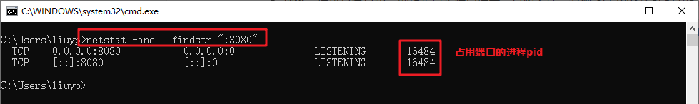
    
    - 杀掉进程：在任务管理器里找到pid对应的进程，结束进程
  - 方案二：更改Tomcat配置文件，使用其它端口
    - 找到`tomcat/conf/server.xml`搜索`port=`，修改值
    - 把端口修改成其它值：建议是1024~65535之间，或者是：80

#### 小结

* 启动Tomcat：双击`startup.bat`
* 关闭Tomcat：双击`shutdown.bat`或者直接关闭Tomcat的黑窗口
* 启动Tomcat可能会出现问题：
  1. 检查JDK的环境变量配置是否正确
  2. 检查是否端口冲突了：查看日志文件`logs/catalina*`开头的文件，其中有`Address already in use`
     * 方案一：杀掉占用端口的进程，再启动Tomcat
     * 方案二：修改Tomcat使用其它端口启动


### 3. 部署web应用

#### 目标

* 能够使用Tomcat部署web项目
* 能够使用浏览器访问部署好的web项目

#### 讲解

##### 1) Tomcat部署项目

- 方案一【掌握】：把web项目文件夹直接放到`tomcat\webapps`里

  * 注意：仅限于静态web项目（Static web），可以直接拷贝放到`webapps`文件夹里
  * 如果：是动态web项目，即项目里有页面、Java程序，不能直接拷贝放到webapps里。
    * 需要使用idea编译web项目，把编译好的结果，拷贝放到webapps里

- 方案二：修改server.xml（不建议）

  * 在`server.xml`的`Host`标签中增加：

  ```xml
  <Context docBase="项目文件所在位置" path="项目访问路径"></Context>
  
  <Context docBase="E:\heima\travel" path="travel"></Context>
  ```

  * 访问时 `http://ip:port/项目访问路径/资源路径`

- 方案三：虚拟路径方式（idea使用的，了解）

  * 在Tomcat的`conf\Catalina\localhost`中创建xml文件`项目访问路径.xml`（如果文件夹不存在，就创建）

  * 例如：`travel.xml`，内容如下

  ```xml
  <Context docBase="E:\heima\travel"></Context>
  ```
  
  * `http://ip:port/xml文件名称/资源路径`

##### 2) 部署后，访问web项目：

- 在浏览器里输入地址：`http://ip:port/项目访问路径/资源路径`
  - 示例：`http://192.168.65.67:80/day05/traval/index.html`
  - ip：tomcat所在的电脑的ip
  - port：Tomcat的http协议的端口。80是默认端口，如果地址里不写端口，默认就找80端口
  - 项目访问路径：默认是webspps里的文件夹名称（每个文件夹就是一个web项目）

#### 小结

* 准备一个web项目：目前准备的是static web，其中不包含任何的动态资源(JSP、Servlet)
* 部署web项目：
  * 把项目放到Tomcat的`webapps`文件夹里(如果是含有动态资源的项目，不能这样部署)
  * 启动Tomcat
* 如果有人要访问这个项目，就要打开浏览器输入地址：
  * `http://服务器的ip:服务器软件的端口/项目路径/资源路径`

### 4. 集成到idea里-实操【掌握】

#### 目标

* 把tomcat配置到idea里
* 在idea里创建web项目
* 在idea里把web项目部署到tomcat中，并启动访问

#### 讲解

##### 把tomcat配置到idea里

1. `File-->Settings-->打开设置窗口`
2. 在设置窗口里找到`Application Servers`

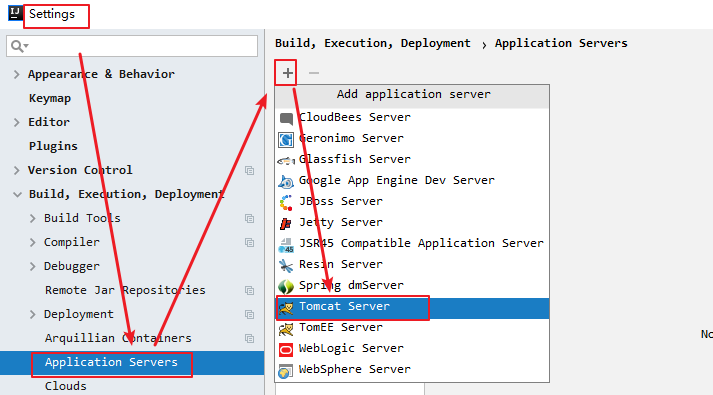

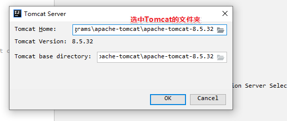


##### 在idea里创建web项目（动态web项目）

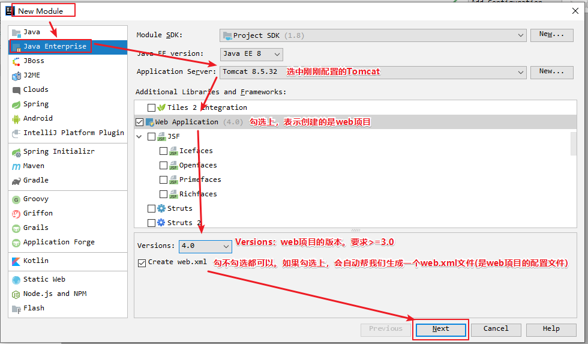

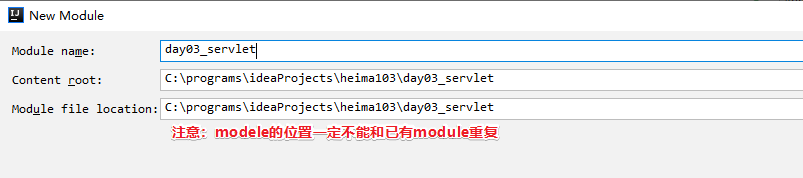

##### idea里，创建的web项目的目录结构

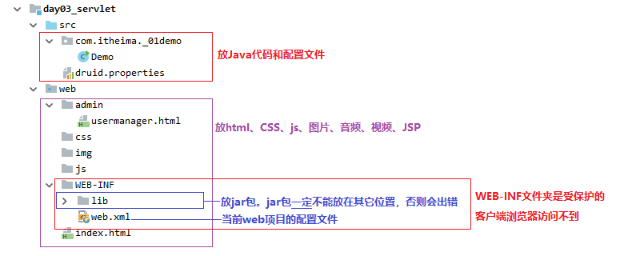

* 注意：
  * web项目里，只有src和web是有效目录。其它内容是无效的，idea会忽略
  * WEB-INF文件夹，是受保护的，浏览器访问不到。比如：下载的资源文件，可以放在WEB-INF里

##### 在idea里把web项目部署到tomcat中，并启动访问

1. 打开服务器配置窗口

   

2. 部署web项目，并设置项目路径

   

   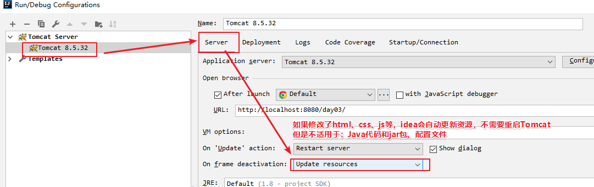

3. 启动Tomcat

   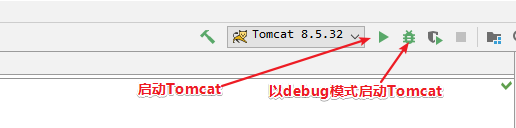

4. 使用浏览器访问：`http://192.168.20.73:8080/day03/index.html`

5. 如果Java代码变化了，或者是jar包变化了，需要重新部署/重启Tomcat：通常选择`redeploy`

   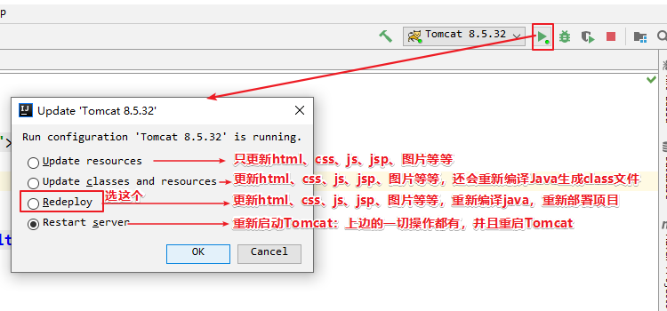

#### 小结


## 三、HTTP协议【面试】

<font color="red">清除浏览器缓存：ctrl + shift + delete</font>

### 1. HTTP协议

#### 目标

* 理解什么是HTTP协议
* 知道HTTP协议的组成

#### 讲解

- HTTP：HyperText Transfer Protocol，超文本传输协议，是互联网上应用最为广泛的一种网络协议
- HTTP协议：**是客户端和服务端数据交互时，数据的格式规范**
- HTTP协议分为：
  - HTTP请求：客户端发给服务端的数据
  - HTTP响应：服务端返回给客户端数据
- 没有请求，就没有响应；有请求才有响应

#### 小结

* HTTP协议：超文本传输协议，规定了 客户端和服务端交互时，数据的格式规范
* HTTP协议的组成：
  * HTTP请求：客户端发送给服务端的
  * HTTP响应：服务端返回给客户端的
  * 两部分之间的关系：有请求才有响应，没有请求就没有响应（服务端是被动等待状态）


### 2. HTTP请求

#### 目标

* 了解HTTP请求的格式

#### 讲解

##### 用抓包工具抓取HTTP请求

- 用来抓取HTTP请求和HTTP响应数据的工具。只能看，不能拦截，不能修改
- HttpWatch，浏览器自带的F12->Network（网络），发请求就能自动抓到这次请求和响应
- 抓取请求

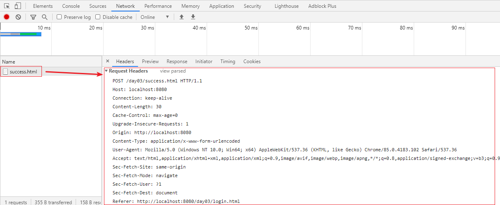

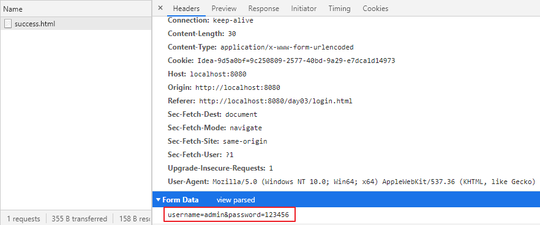

- 抓取响应

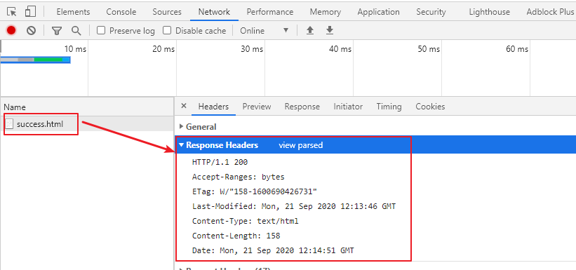

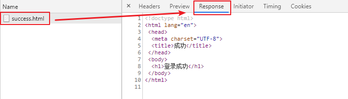


* 抓取到HTTP请求数据，示例如下：

```http
POST /day03/success.html HTTP/1.1
Host: 192.168.39.88:8080
Connection: keep-alive
Content-Length: 29
Cache-Control: max-age=0
Upgrade-Insecure-Requests: 1
Origin: http://192.168.39.88:8080
Content-Type: application/x-www-form-urlencoded
User-Agent: Mozilla/5.0 (Windows NT 10.0; Win64; x64) AppleWebKit/537.36 (KHTML, like Gecko) Chrome/85.0.4183.102 Safari/537.36
Accept: text/html,application/xhtml+xml,application/xml;q=0.9,image/avif,image/webp,image/apng,*/*;q=0.8,application/signed-exchange;v=b3;q=0.9
Referer: http://192.168.39.88:8080/day03/index.html
Accept-Encoding: gzip, deflate
Accept-Language: zh-CN,zh;q=0.9,en;q=0.8,cs;q=0.7

username=admin&password=xxxxx
```

##### 请求行

- 本次请求的基本信息
- 格式：`请求方式 请求资源 协议版本`
- 例如：`POST /day03/success.html HTTP/1.1`


##### 请求头

- 本次请求的附加信息
- 格式：一行一个键值对，一个键值对是一个请求头，一次请求有多个请求头
- 例如：`Referer：http://localhost:8080/day03/login.html`

##### 请求体

- 本次请求的正文内容，是提交的表单数据
- 格式：`name=value&name=value&...`
- 例如：`username=admin&password=123456`

#### 小结

* HTTP请求：客户端发送给服务端的
* 请求的组成：
  * 请求行：本次请求的基本信息，格式 `提交方式 请求地址 协议版本 `
  * 请求头：本次请求的附加信息，格式：一行一个键值对，一个键值对是一个请求头，一次请求可以有多个请求头
  * 请求体：本次请求的正文内容，是提交的表单数据
    * 格式：`name=value&name=value&....`
    * 注意：POST方式才有请求体；GET方式没有请求体

### 3. HTTP响应

#### 目标

* 能够说出HTTP响应的格式

#### 讲解

- 抓取的HTTP响应数据示例


```http
HTTP/1.1 200
Accept-Ranges: bytes
ETag: W/"158-1600690426731"
Last-Modified: Mon, 21 Sep 2020 12:13:46 GMT
Content-Type: text/html
Content-Length: 158
Date: Mon, 21 Sep 2020 12:14:51 GMT

<!doctype html>
<html lang="en">
 <head>
  <meta charset="UTF-8">
  <title>成功</title>
 </head>
 <body>
  <h1>登录成功</h1>
 </body>
</html>
```

##### 2. HTTP响应的格式

###### 1) 响应行

- 本次响应的基本信息

- 格式：`协议版本 响应状态码 [响应状态描述]`

- 比如：`HTTP/1.1 200 [Ok]`

- 常见的响应状态码：

  

  - 200：一切正常
  - 302：重定向，让浏览器跳转到其它地址
  - 304：让浏览器取本地缓存
  - 404：找不到资源
  - 500：服务器内部错误

###### 2) 响应头

- 本次响应的附加信息
- 格式：一行一个键值对，一个键值对是一个响应头，一次响应可以有多个响应头
- 比如：`Content-Length: 12`

###### 3) 响应体

- 本次响应的正文内容，是会显示到浏览器页面上的内容
- 格式：没有固定格式。请求什么，就响应什么

#### 小结

* HTTP响应：服务端 返回给 客户端的
* 响应的组成：
  * 响应行：本次响应的基本信息，格式 `协议版本  响应状态码`
    * 200：一切正常； 302：让浏览器跳转（重定向）；304：让浏览器取缓存；404：告诉浏览器找不到资源；500：告诉浏览器，服务端内部错误
  * 响应头：本次响应的附加信息，格式 一行一个键值对，一个键值对是一个响应头，一次响应可以有多个响应头
  * 响应体：本次响应的正文内容，默认会显示到浏览器页面上。格式：没有固定格式，响应什么就是什么

## 四、Servlet

### 1. Servlet简介

#### 目标

* 了解什么是Servlet
* 理解Servlet的作用

#### 讲解

##### 1) 什么是Servlet

* Servlet：Server Applet，是服务端运行Java程序。是Sun公司提供的一套规范（接口），可以让客户端以url的形式远程调用服务器的Servlet（Java程序）。
* 如果一个Java程序，想让客户端通过网络访问到，Java程序必须满足以下两个条件：
  * Java程序必须实现Servlet接口
  * 必须把Servlet部署到Tomcat上才能运行

##### 2) Servlet的作用 

和客户端交互的：

- 接收客户端提交的参数
- 完成客户端要求的功能
- 给客户端返回处理的结果

#### 小结


### 2. Servlet快速入门

#### 目标

* 编写一个Servlet，部署到Tomcat中；使用浏览器访问Servlet

#### 分析

实现的步骤：

1. 创建一个Java类，实现`javax.servlet.Servlet`接口

2. 重写接口里的方法（共有5个，了解3个，重点关注1个：`service`）

3. 使用`@WebServlet`注解配置Servlet类（配置Servlet的虚拟访问路径）

   客户端不能通过类名称访问Servlet

   必须要通过Servlet配置的虚拟访问路径，才可以访问到

#### 实现

```java
@WebServlet(urlPatterns = "/demo01")
public class Demo01Servlet implements Servlet {

    @Override
    public void init(ServletConfig config) throws ServletException {
    }

    @Override
    public void service(ServletRequest request, ServletResponse response) throws ServletException, IOException {
        System.out.println("Demo01Servlet.service 运行了");
    }

    @Override
    public void destroy() {
    }

    @Override
    public ServletConfig getServletConfig() {
        return null;
    }

    @Override
    public String getServletInfo() {
        return null;
    }
}
```

#### 小结

1. 创建一个Java类，实现`javax.servlet.Servlet`接口
2. 重写接口的方法，重点service方法
3. 在类上添加注解`@WebServlet("/demo01")`

### 3. Servlet的生命周期和API

#### 目标

* 能说出Servlet的生命周期过程
* 了解Servlet生命周期相关的API

#### 讲解

##### 1) 生命周期（面试题）

- 何时创建：
  - 默认第一次访问时，Tomcat创建Servlet对象
  - 创建Servlet对象时，会执行init方法
  - init方法只执行一次，一个Servlet类只有一个对象
- 何时销毁：
  - 当服务器关闭时，Servlet对象会被销毁
  - Servlet对象销毁时，会执行destroy方法
  - destroy方法只执行一次
- 每次访问Servlet时，必定执行的方法：service方法

##### 2) API介绍【了解】

| 方法                                        | 参数                | 说明       |
| ------------------------------------------- | ------------------- | ---------- |
| `init(ServletConfig)`                       | Servlet配置信息对象 | 初始化方法 |
| `service(ServletRequest,  ServletResponse)` | 请求对象,响应对象   | 业务方法   |
| `destroy()`                                 |                     | 销毁方法   |

- `ServletConfig`：是Servlet的配置信息对象。作用是了解的：
  - `config.getServletName()`： 获取Servlet的名称
  - `config.getInitParameter("参数名称")`：获取初始化参数值
  - `config.getServletContext()`：获取ServletContext对象

- `ServletRequest`：用于接收客户端提交的数据
  - `request.getParameter("表单项的name")`：接收客户端提交的表单数据
- `ServletResponse`：用于给客户端返回数据的
  - `response.getWriter().print("会显示到浏览器页面上的内容")`

#### 小结

* 接收客户端提交的表单参数：`String value = request.getParameter(String name)`
* 给客户端返回显示的内容：`response.getWriter().print(String str)`


### 4. Servlet的配置了解

* 在web3.0以前，用web.xml配置
* 在web3.0以后，用注解配置 或者 用web.xml配置

##### 注解配置

* 如果一个Servlet要想被客户端访问，就必须使用注解`@WebServlet`，提供一个虚拟访问路径（映射路径）

  ```java
  @WebServlet(
  	urlPatterns/value=虚拟路径,
      name="Servlet名称",
      loadOnStartup=整数，表示Servlet创建的时机,
      initParams={
          @WebInitParam(name="初始化参数名称", value="初始化参数值"),
        @WebInitParam(name="初始化参数名称", value="初始化参数值")        
      }
  )
  ```
  
  * **urlPatterns或者value：**配置Servlet的虚拟访问路径，必须的。
    * 值：以`/`开头的路径，比如：`/demo01`,  `/login`,  `/admin/manager`
    * 注意：不同Servlet的虚拟访问路径不能相同
  * loadOnStartup：Servlet对象的创建时机
    * Servlet默认是第一次访问时创建的
    * 如果设置值为正整数，就表示：服务器一启动，Tomcat就会创建Servlet对象。
      * 数值越小，创建的越早
      * SpringMVC框架里有一个Servlet，需要配置：服务器一启动就创建
  * name：非必须

##### xml配置

```xml
   <servlet>
        <!--servlet-name：给servlet起名称，所有Servlet的名称不能重复-->
        <servlet-name>demo03</servlet-name>
        <!--servlet-class：写Servlet类的全限定类名-->
        <servlet-class>com.itheima._02servlet.Demo03XmlConfigServlet</servlet-class>
        <!--init-param：配置一个初始化参数-->
        <init-param>
            <param-name>aa</param-name>
            <param-value>AA</param-value>
        </init-param>
        <init-param>
            <param-name>bb</param-name>
            <param-value>BB</param-value>
        </init-param>
        <!--load-on-startup：Servlet的创建时机-->
        <load-on-startup>1</load-on-startup>
    </servlet>
    <servlet-mapping>
        <!--servlet-name：给哪个servlet配置映射信息-->
        <servlet-name>demo03</servlet-name>
        <!--url-pattern：配置映射路径-->
        <url-pattern>/demo03</url-pattern>
    </servlet-mapping>
```


##### 小结


### 5. Servlet的继承体系

#### 目标

* 了解Servlet的多种开发方式
* 掌握继承HttpServlet的开发方式

#### 讲解

##### 1) 创建Java类，实现`Servlet`接口

* 多个Servlet中，有大量的冗余代码
* 只用到Servlet的service方法，其它方法基本用不上，但是又必须写

##### 2) 创建Java类，继承`GenericServlet`父类

* 由`GenericServlet`实现`Servlet`接口，实现接口的方法
* 我们再创建类，继承`GenericServlet`，重写业务方法`service`

```java
@WebServlet(urlPatterns = "/demo02")
public class Demo02GenericServlet extends GenericServlet {
    @Override
    public void service(ServletRequest request, ServletResponse response) throws ServletException, IOException {
        System.out.println("Demo02GenericServlet.service 运行了");
    }
}
```

##### 3) 创建Java类，继承`HttpServlet`父类

* 由`HttpServlet`继承`GenericServlet`父类，重写`service`方法：
  * 如果是`get`方式的请求，就调用`doGet`
  * 如果是`post`方式的请求，就调用`doPost`
* 我们再创建类，继承`HttpServlet`，重写`doGet`和`doPost`方法

```java
@WebServlet(urlPatterns = "/demo03")
public class Demo03HttpServlet extends HttpServlet {

    @Override
    protected void doGet(HttpServletRequest req, HttpServletResponse resp) throws ServletException, IOException {
        System.out.println("get和post请求，共同的功能代码");
    }

    @Override
    protected void doPost(HttpServletRequest req, HttpServletResponse resp) throws ServletException, IOException {
        this.doGet(req, resp);
    }
}
```

##### 配置servlet的模板


#### 小结

* 方式一：创建Java类，直接实现Servlet接口
  * 代码冗余
* 方式二：创建Java类，继承GenericServlet。 由GenericServlet实现Servlet接口
  * 我们的类只要实现service方法即可，代码精简，但是功能较弱，不能处理HTTP协议相关的内容
* 方式三：创建Java类，继承HttpServlet。由HttpServlet继承GenericServlet
  * 我们的类需要重写doGet和doPost方法


## 五、练习：登录功能的简单实现

* 登录功能的简单实现：
  * 页面有一个登录表单，表单里有用户名和密码、提交按钮
  * 如果登录成功：页面上要显示“login successed”
  * 如果登录失败：页面上要显示“login failed"

* 需要做的事情：

  1. 创建一张用户表，表里有username和password。插入一条用户数据

  2. 编写页面，表单

  3. 编写Servlet代码，完成登录校验的功能
     * 如果登录成功：“login successed”
     * 如果登录失败：“login failed"


# 上午内容复习

* web相关的概念
  * 软件架构：b/s架构 浏览器/服务器架构， c/s架构   客户端/服务器架构
  * web资源：能够通过网络访问到的资源
    * 静态资源：在任何地方、任何人、任何时候看同一资源，都是不变（效果相同的）
    * 动态资源：在不同地方、不同人、不同时候看同一资源，效果不同
  * 服务器软件：
    * Tomcat，WebLogic，WebSphere
* Tomcat软件：
  * 启动：`startup.bat`
  * 关闭：`shutdown.bat`
  * 如果启动失败：
    1. 检查jdk环境变量
    2. 检查是否有端口冲突，查看日志文件`logs\catalina*`文件`Addres already in use`
       * 杀掉占用端口的进程，再启动Tomcat
       * 修改Tomcat配置文件，使用其它端口启动：`conf/server.xml`，其中`port="端口"`
  * 部署web应用：
    * 把web应用直接放到Tomcat的`webapps`文件里，启动Tomcat
      * static web直接放进去
      * 在idea里创建动态web项目：要把编译后的结果`out/artifacts`放到Tomcat的webapps里
  * 使用浏览器访问：`http://服务器的ip:端口号/项目路径/资源路径`
* HTTP协议
  * 超文本传输协议，规定了  客户端和服务端交互时，数据的格式规范
  * HTTP请求：客户端 发送给 服务端的
    * 请求行
    * 请求头
    * 请求体
  * HTTP响应：服务端 返回给 客户端的
    * 响应行
    * 响应头
    * 响应体
* Servlet：
  * 是一个接口，可以让客户端以url地址的形式远程调用Servlet
  * 作用：和客户端交互的