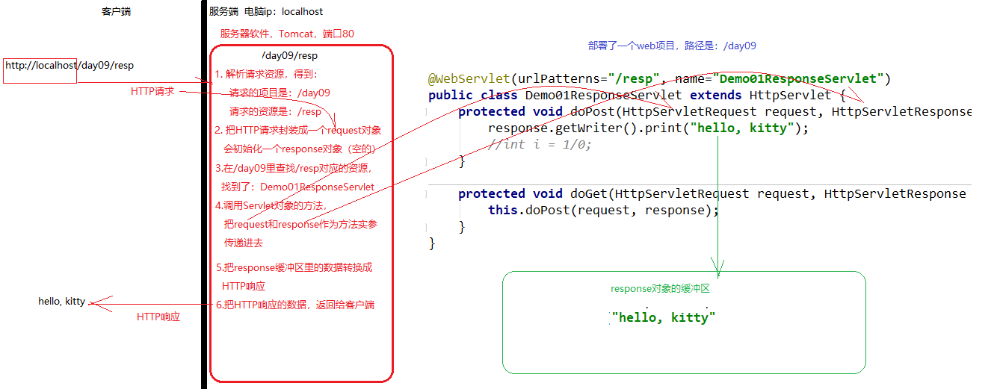

# response&request-课堂笔记

* web相关概念：
  * 软件架构：b/s架构， c/s架构
  * web资源：
    * 静态资源：数据/效果不变的资源
    * 动态资源：数据/效果有变化的资源
  * 服务器软件：Tomcat
* Tomcat：
  * 启动：startup.bat
  * 关闭：shutdown.bat
  * 部署web项目：把web项目拷贝放到webapps里
  * 浏览器输入地址访问： `http://ip:port/项目路径/资源路径`
* HTTP协议：超文本传输协议，规定了 客户端和服务端交互时，数据的格式规范
  * HTTP请求：客户端 发送给 服务端的
    * 请求行
    * 请求头
    * 请求体
  * HTTP响应：服务端 返回给 客户端的
    * 响应行
    * 响应头
    * 响应体
* Servlet：和客户端交互
  * 创建Servlet：
    * 实现Servlet接口，重点是service方法
    * 继承GenericServlet，重写service方法
    * 继承HttpServlet，重写doGet/doPost方法=>servlet模板
  * 配置Servlet：
    * 注解配置：在类上加注解`@WebServlet("/demo")`
    * xml配置：在web.xml里使用servlet和servlet-mapping标签配置

## 一、ServletContext

### 1. ServletContext介绍

#### 目标

* 了解什么是ServletContext
* 掌握获取ServletContext的方法

#### 讲解

##### ServletContext介绍

* ServletContext：Servlet上下文对象。它是把一个web应用的信息封装成的对象。当Tomcat启动时，会把web应用的信息封装成一个ServletContext对象
* ServletContext特性：
  * 一个web应用里：只有一个ServletContext对象
  * 当服务器启动时，ServletContext会被Tomcat创建

##### 获取ServletContext

* 在Servlet类里（继承HttpServlet方式的），可以使用方法：

```java
ServletContext context = getServletContext();
```

#### 小结

* 如何获取ServletContext对象：`getServletContext()`

### 2. ServletContext作用

#### 目标

* 掌握ServletContext的应用

#### 分析

* ServletContext有两个常用作用：
  * 可以读取web应用里的资源
  * 是一个域对象

#### 讲解

##### 读取web应用里的资源【重点】

* 如果要读取src里的资源，可以使用类加载器

```java
InputStream is = 类名.class.getClassLoader().getResourceAsStream("src里的文件名");
```

* 如果要读取web里的资源，可以使用ServletContext

```java
InputStream is = servletContext.getResourceAsStream("web里的文件名");
```

##### 是一个域对象【面试】

* 什么是域对象：由Servlet规范提供的，可以临时存取数据的对象。域对象里的数据，在其作用范围里可以共享。
* 有哪些域对象：ServletContext， HttpSession， ServletRequest， PageContext
* 域对象的共同点：都可以存取数据，并且存取数据的方法都是：
  * 存数据：`setAttribute(String name, Object value)`
  * 取数据：`getAttribute(String name)`
  * 删数据：`removeAttribute(String name)`
* 域对象的不同点：共享范围不同
  * ServletContext：
    * 何时创建：服务器启动时
    * 何时销毁：服务器关闭时
    * 作用范围：整个web应用

#### 小结

* ServletContext可以加载资源文件

```java
//如果要加载src（类路径）里的资源，使用类加载器
InputStream is = 类加载器.getResourceAsStream("src里的文件");

//如果要加载web里的资源，使用ServletContext
InputStream is  = servletContext.getResourceAsStream("web里的文件");
String realPath = servletContext.getRealPath("web里的文件");
```

* 是一个域对象，可以临时存储、共享数据

## 二、request和response的原理

### 目标

* 了解request和response指的是什么
* 理解request和response的运行原理

### 讲解

#### request和response对象介绍

* request：代表HTTP请求的对象，`HttpServletRequest`, `ServletRequest`
  * `HttpServletRequest` extends `ServletRequest`
  * `HttpServletRequest` 功能更强，我们开发中使用的通常是这个对象
* response：代表HTTP响应的对象，`HttpServletResponse`, `ServletResponse`
  * `HttpServletResponse` extends `ServletResponse`
  * `HttpServletResponse` 功能更强，我们开发中使用的通常是这个对象


* Tomcat创建的response对象，在调用Servlet的方法时，作为实参传递给Servlet
* 我们可以向response里设置数据，这些数据最终被Tomcat转换成HTTP响应的格式，返回了客户端



### 小结


## 三、response操作http响应

### 1. response简介

代表响应的对象，是`HttpServletResponse`的实例对象，用来**向客户端响应数据**。

- `ServletResponse`：在Servlet接口里有
- `HttpServletResponse`：是ServletResponse的子接口，功能更强

### 2. 设置响应行

#### 目标

* 能够设置响应状态码

#### 讲解

* response对象提供了方法

| 方法                  | 参数                                           | 返回值 |
| --------------------- | ---------------------------------------------- | ------ |
| `setStatus(int code)` | code：响应状态码（通常是非错误码,1xx,2xx,3xx） |        |
| `sendError(int code)` | code：响应状态码（通常是错误码, 4xx, 5xx）     |        |

* 使用示例

```java
@WebServlet(urlPatterns="/responseLine")
public class Demo02ResponseLineServlet extends HttpServlet {
    @Override
    protected void doPost(HttpServletRequest request, HttpServletResponse response) throws ServletException, IOException {
        //设置响应行

        //1. 设置响应状态码：setStatus方法，通常用于设置功能性的响应码 2xx,3xx
        response.setStatus(302);

        //2. 设置响应状态码：sendError方法，通常用于设置错误的响应码  4xx, 5xx
        //response.sendError(404);
    }

    @Override
    protected void doGet(HttpServletRequest request, HttpServletResponse response) throws ServletException, IOException {
        this.doPost(request, response);
    }
}
```

#### 小结

* 设置响应状态码：`response.setStatus(int code)`

### 3. 设置响应头

#### 目标

* 能够设置响应头

* **掌握**重定向跳转的方法【重点】

#### 讲解

* response对象提供了方法

| 方法                                   | 说明       | 参数                                    | 返回值 |
| -------------------------------------- | ---------- | --------------------------------------- | ------ |
| `setHeader(String name, String value)` | 设置响应头 | name：响应头名称<br />value：响应头的值 |        |
| `sendRedirect(String path)`            | 重定向跳转 | path：跳转的路径                        |        |

> 重定向跳转的参数写法：`/项目路径/资源访问路径`

* 示例：

  假如当前项目的路径是`/day09`

```java
@WebServlet(urlPatterns="/responseHeader")
public class Demo03ResponseHeaderServlet extends HttpServlet {
    @Override
    protected void doPost(HttpServletRequest request, HttpServletResponse response) throws ServletException, IOException {
        //设置响应头

        //覆盖式设置响应头
        response.setHeader("name", "tom");
        //追加响应头，不会覆盖已有的头
        response.addHeader("name", "jerry");


        //重定向跳转【重点】。比如：登录成功之后，让浏览器跳转到首页
        response.sendRedirect("/day09/index.html");
    }

    @Override
    protected void doGet(HttpServletRequest request, HttpServletResponse response) throws ServletException, IOException {
        this.doPost(request, response);
    }
}
```

#### 小结

* 设置响应头：`response.setHeader(String name, String value)`。注意不要有中文、空格、特殊字符
* 重定向跳转：【重点】
  * 让浏览器跳转到指定的地址
  * `response.sendRedirect("http://www.jd.com")`：跳转到互联网上的地址
  * `response.sendRedirect("http://ip:port/项目路径/资源路径")`：跳转到当前项目里的资源
  * `response.sendRedirect("/项目路径/资源路径")`：跳转到当前项目里的资源

### 4. 设置响应体【重点】

#### 目标

* 能够使用字符流方式设置响应体，向浏览器页面上显示数据
* 能够使用字节流方式设置响应体，向浏览器发送二进制数据

#### 讲解

* response对象提供了方法：

| 方法                | 说明                       | 参数 | 返回值                    |
| ------------------- | -------------------------- | ---- | ------------------------- |
| `getWriter()`       | 获取response的字符型输出流 |      | `PrintWriter`对象         |
| `getOutputStream()` | 获取response的字节型输出流 |      | `ServletOutputStream`对象 |

##### 字符型响应体示例：

* 字符型响应体中文乱码，解决：
* 在`getWriter()`方法之前，先执行：`response.setContentType("text/html;charset=utf-8")`

```java
@WebServlet(urlPatterns="/charBody")
public class Demo04ResponseCharBodyServlet extends HttpServlet {
    @Override
    protected void doPost(HttpServletRequest request, HttpServletResponse response) throws ServletException, IOException {
        //字符型响应体
        response.setContentType("text/html;charset=utf-8");
        
        PrintWriter writer = response.getWriter();
        writer.print("你好，2哥");
    }

    @Override
    protected void doGet(HttpServletRequest request, HttpServletResponse response) throws ServletException, IOException {
        this.doPost(request, response);
    }
}
```

##### 字节型响应体示例：

```java
@WebServlet(urlPatterns="/byteBody")
public class Demo05ResponseByteBodyServlet extends HttpServlet {
    @Override
    protected void doPost(HttpServletRequest request, HttpServletResponse response) throws ServletException, IOException {
        //字节型 设置响应体。
        //要求：给客户端返回一张图片，显示到客户端浏览器页面上

        //1.得到输出流
        ServletOutputStream os = response.getOutputStream();
        //2.得到输入流：使用ServletContext，从web里读取
        ServletContext context = this.getServletContext();
        InputStream is = context.getResourceAsStream("WEB-INF/files/a.jpg");
        //3.读取数据，写到输出流
        byte[] buffer = new byte[1024*8];
        int len = -1;
        while ((len = is.read(buffer)) != -1) {
            os.write(buffer, 0, len);
        }
        //4.关闭流
        os.close();
        is.close();
    }

    @Override
    protected void doGet(HttpServletRequest request, HttpServletResponse response) throws ServletException, IOException {
        this.doPost(request, response);
    }
}
```

#### 小结

* 通过字符流设置响应体

```java
//1.解决中文乱码【一定要先解决乱码，再获取字符流，否则仍然乱码】
response.setContentType("text/html;charset=utf-8");
//2.使用字符流设置响应体
response.getWriter().print("你好");
```

* 通过字节流设置响应体

```java
//1. 获取字节流：
ServletOutputStream os = response.getOutputStream();
//2. 读取文件，得到输入流：读取src里的文件，用类加载器；读取web里的文件，用ServletContext
InputStream is = getServletContext().getResourceAsStream("web里的文件");

byte[] buffer = new byte[1024];
int len = -1;
while ((len = is.read(buffer)) != -1) {
    os.write(buffer, 0, len);
}

is.close();
os.close();
```


## 四、response应用练习

### 1. 验证码切换

#### 需求

* 要求：页面表单里有验证码的输入框，旁边有验证码图片。

* 验证码图片点击时能够切换

  暂时不做验证码的校验功能

#### 分析

* 补充：向某个地址发请求的同时，想要传参的另外一种方式

  * 以前使用表单
  * 现在新的方式：等价于表单的get提交方式

  ```html
  <a href="地址?name=value&name=value&...">超链接请求时传参</a>
  <script>
  	//发请求的同时，想要传参
      location.href="地址?name=value&name=value&...";
  </script>
  ```

#### 实现

```html
<!DOCTYPE html>
<html lang="en">
<head>
    <meta charset="UTF-8">
    <title>验证码切换</title>
</head>
<body>
<form action="" method="post">
    用户名：<input type="text" name="username"><br>
    密码：<input type="password" name="password"><br>
    验证码：<input type="text" name="check">
        
    <br>
    <input type="submit">
</form>


<script>
    var checkImage = document.getElementById("checkImage");
    checkImage.onclick = function(){
        //切换验证码图片：通过修改图片标签的src属性值
        //src属性值，修改前后值没有变化--浏览器会优先从缓存里加载，而不是重新请求到服务端

        //写路径时，可以在路径后追加参数：   路径?name=value&name=value
        //每次请求都是相同的路径，只是传参可以不同
        checkImage.src = "/day09/checkCode?a=" + Math.random();
    }
</script>
</body>
</html>
```

### 2. 文件下载

#### 需求

* 页面上有一些下载链接，用户点击不同的链接，可以下载不同的文件

#### 分析

#### 实现

* 提供一个下载页面

  ```html
  <a href="/day09/download?filename=a.flv">a.flv</a><br>
  <a href="/day09/download?filename=a.jpg">a.jpg</a><br>
  <a href="/day09/download?filename=a.mp3">a.mp3</a><br>
  <a href="/day09/download?filename=a.mp4">a.mp4</a><br>
  <a href="/day09/download?filename=a.txt">a.txt</a><br>
  <a href="/day09/download?filename=a.zip">a.zip</a><br>
  ```

* 服务端提供下载功能的Servlet：`DownloadServlet`

  ```java
  @WebServlet(urlPatterns="/download", name="DonwloadServlet")
  public class DonwloadServlet extends HttpServlet {
      protected void doPost(HttpServletRequest request, HttpServletResponse response) throws ServletException, IOException {
          String filename = request.getParameter("filename");
  
          ServletContext context = this.getServletContext();
  
          //==================文件下载增加的代码 start==============
          response.setHeader("Content-Disposition", "attachment;filename=" + DownloadUtils.encodeFilename(request, filename));
          //==================文件下载增加的代码 end==============
  
  
          //1.获取输入流：使用ServletContext读取
          InputStream is = context.getResourceAsStream("WEB-INF/files/" + filename);
          //2.获取输出流
          ServletOutputStream os = response.getOutputStream();
          //3.写数据
          int len = -1;
          byte[] buffer = new byte[1024*8];
          while ((len = is.read(buffer)) != -1) {
              os.write(buffer, 0, len);
          }
          //4.关闭流
          os.close();
          is.close();
      }
  
      protected void doGet(HttpServletRequest request, HttpServletResponse response) throws ServletException, IOException {
          this.doPost(request, response);
      }
  }
  ```

* 中文文件名称转码的工具类

  ```java
  public class DownloadUtils {
  	/**
  	 * 解决下载时，中文文件名称乱码问题<br>
  	 * 
  	 * @param request request对象
  	 * @param filename 你想让用户保存的文件名称
  	 */
  	public static String encodeFilename(HttpServletRequest request, String filename){ 
  		try{
  			String agent = request.getHeader("User-Agent");
  			if (agent.contains("MSIE")) {
  				// IE浏览器
  				filename = URLEncoder.encode(filename, "utf-8");
  				filename = filename.replace("+", " ");
  			} else if (agent.contains("Firefox")) {
  				// 火狐浏览器
  				//BASE64Encoder base64Encoder = new BASE64Encoder();
  				Base64.Encoder base64Encoder = Base64.getEncoder();
  				filename = base64Encoder.encodeToString(filename.getBytes("utf-8"));
  				filename = "=?utf-8?B?"+ filename + "?=";
  			} else {
  				// 其它浏览器
  				filename = URLEncoder.encode(filename, "utf-8");				
  			}
  		}catch(Exception e){
  			e.printStackTrace();
  		}
  
  		return filename;
  	}
  }
  ```

#### 小结

```html
<a href="/day04/download?file=文件名">文件名</a>
```

```java
//1.接收参数file
String file = request.getParameter("file");

//2.设置响应头
response.setHeader("Content-Disposition","attachment;filename=" + DownloadUtils.encodeFilename(request, file));

//3.读取文件，通过字节流设置响应体，把文件响应给客户端
ServletOutputStream os = response.getOutputStream();
InputStream is = getServletContext().getResourceAsStream("WEB-INF/files1/" + file);
//.....

```

## 五、request获取http请求数据

### 1. request简介

- 代表请求的对象，是`HttpServletRequest`的实例对象，用来**接收客户端提交的数据**。

### 2. request获取请求行

#### 目标

* 能够使用request获取请求行的数据

#### 讲解

##### API

| 方法               | 说明         | 参数 | 返回值   |
| ------------------ | ------------ | ---- | -------- |
| `getMethod()`      | 获取请求方式 |      | `String` |
| `getContextPath()` | 获取项目路径 |      | `String` |

##### 示例

```java
@WebServlet(urlPatterns="/line")
public class DemoLineServlet extends HttpServlet {
    protected void doPost(HttpServletRequest request, HttpServletResponse response) throws ServletException, IOException {
        //获取请求方式。
        String method = request.getMethod();
        System.out.println("请求方式：" + method);

        //获取项目路径
        String contextPath = request.getContextPath();
        System.out.println("项目路径：" + contextPath);

		//代码中需要使用项目路径的地方，要使用request.getContextPath()动态获取
        //response.sendRedirect(contextPath + "/index.jsp");
    }

    protected void doGet(HttpServletRequest request, HttpServletResponse response) throws ServletException, IOException {
        this.doPost(request, response);
    }
}
```

##### 路径的写法

* 如果要请求一个资源，就必须要写资源的访问路径

  > 这里总结是的资源的请求/访问路径，而不是IO读取的路径

  


##### 补充知识

* 什么样的请求是GET？什么样的请求是POST？

  * 默认是GET。只有指定了是POST，才是POST。（到目前为止，只用到表单的method可以设置请求方式）
* 如果代码里路径，写死了项目路径该怎样处理？
  * 在Servlet里：动态获取项目路径，拼接进去。比如重定向时：
    * 原本写法：`response.sendRedirect("/web16/index.html")`：
    * 修改成：`response.sendRedirect(request.getContextPath() + "/index.html")`
  * 在html里，使用相对路径代替绝对路径（可以避免出现项目路径了）
    * `./`开头：从当前目录里查找/加载
    * `../`开头：从上级目录里查找/加载

#### 小结

* 获取请求方式：`request.getMethod()`

  * 什么样的请求是GET方式？默认就是GET
  * 什么样的请求是POST方式？当指定为POST时，才是POST请求

* 获取项目路径：`request.getContextPath()`【重点】

  * 如果是Servlet里写跳转路径时，为了避免写死项目路径，要动态获取

    `response.sendRedirect(request.getContextPath() + "/资源路径")`

  * 如果是HTML里要发请求或者跳转时，为了避免写死项目路径，要使用相对路径代替绝对路径

  ```html
  <!-- 绝对路径：完整的url地址，或者去掉ip和端口剩下的简写 -->
  <a href="http://localhost:8080/day04/requestLine">绝对路径完整写法</a><br/>
  <a href="/day04/requestLine">绝对路径简写形式</a><br/>
  
  <!-- 相对路径
  1. 先写出来当前资源的url地址：http://localhost:8080/day04/admin/path2.html
  2. 再写出来目标资源的url地址：http://localhost:8080/day04/requestLine
  3. 从当前资源，切换到目标资源：../requestLine
  -->
  <a href="../requestLine">相对路径</a>
  ```

  

### 3. request获取请求头

#### 目标

* 能够获取请求头的数据

#### 讲解

##### API

| 方法                  | 说明                             | 参数               | 返回值   |
| --------------------- | -------------------------------- | ------------------ | -------- |
| `getHeader(name)`     | 获取请求头的值                   | name：请求头的名称 | `String` |
| `getIntHeader(name)`  | 获取请求头的值，转换为int给我们  |                    | `int`    |
| `getDateHeader(name)` | 获取请求头的值，转换为long给我们 |                    | `long`   |

##### 示例

```java
@WebServlet(urlPatterns="/header", name="Demo03RequestHeaderServlet")
public class DemoHeaderServlet extends HttpServlet {
    protected void doPost(HttpServletRequest request, HttpServletResponse response) throws ServletException, IOException {
        //获取请求头   Referer：本次请求是从哪个页面发起的
        String referer = request.getHeader("Referer");
        System.out.println(referer);
    }

    protected void doGet(HttpServletRequest request, HttpServletResponse response) throws ServletException, IOException {
        this.doPost(request, response);
    }
}
```

#### 小结

* 获取请求头数据：`String value = request.getHeader(String name)`

### 4. request获取请求参数【重点】

#### 目标

- 能够使用request获取请求参数
- 能够解决中文参数乱码问题

#### 讲解

##### API

* request对象提供的方法：

| 方法                       | 说明               | 参数             | 返回值                 |
| -------------------------- | ------------------ | ---------------- | ---------------------- |
| `getParameter(name)`       | 获取一个表单项的值 | name：表单项名称 | `String`               |
| `getParameterValues(name)` | 获取一个表单项的值 |                  | `String[]`             |
| `getParameterMap()`        | 获取所有表单项的值 |                  | `Map<String,String[]>` |

##### 解决中文参数乱码

* 请求的中文乱码：`request.setCharacterEncoding("utf-8")`

  > 要在第一次获取参数之前，先解决请求乱码

##### 示例

* 页面表单

```jsp
<form action="param1" method="post">
    用户名：<input type="text" name="username"><br>
    爱好：
        <input type="checkbox" name="hobby" value="eat">吃
        <input type="checkbox" name="hobby" value="drink">喝
        <input type="checkbox" name="hobby" value="play">玩
    <br>
    <input type="submit" value="post提交">
</form>
```

* Servlet里接收表单参数

```java
@WebServlet(urlPatterns="/param1", name="Demo04RequestParam1Servlet")
public class DemoParamServlet extends HttpServlet {
    protected void doPost(HttpServletRequest request, HttpServletResponse response) throws ServletException, IOException {
        //解决  中文请求参数乱码
        request.setCharacterEncoding("utf-8");
        
        //获取username的值
        String username = request.getParameter("username");
        System.out.println(username);

        System.out.println("----------------------");

        //获取hobby的值
        String[] hobbies = request.getParameterValues("hobby");
        for (String hobby : hobbies) {
            System.out.println(hobby);
        }

        System.out.println("----------------------");

        //获取所有表单参数
        Map<String, String[]> map = request.getParameterMap();
        for (String key : map.keySet()) {
            String[] values = map.get(key);
            System.out.println(key + ": " + Arrays.toString(values));
        }
    }

    protected void doGet(HttpServletRequest request, HttpServletResponse response) throws ServletException, IOException {
        this.doPost(request, response);
    }
}
```

#### 小结

* 接收请求参数【重点】

```java
//如果客户端提交了中文参数，POST方式提交的会乱码，需要增加以下一行代码。一定要放在第一次接收参数之前
request.setCharacterEncoding("utf-8");

//接收单值的表单参数
String value = request.getParameter(String name);
//接收多值的表单参数
String[] values = request.getParameterValues(String name);
//接收所有表单参数
Map<String,String[]> map = request.getParameterMap();
```

* 请求和响应中的乱码处理【重点】=>将来使用过滤器Filter技术统一处理乱码问题

```java
//处理请求乱码
request.setCharacterEncoding("utf-8");
//处理响应乱码
response.setContentType("text/html;charset=utf-8");
```


## 六、request其它作用【重点】

### 1. 是一个域对象

#### 目标

* 了解request域对象的作用范围

#### 讲解

* 域对象：由Servlet规范提供的，能临时存储数据的对象；在其作用范围里，数据可以共享
* 所有域对象都可以存储数据：
  * 存数据：`setAttribute(String name, Object value)`
  * 取数据：`getAttribute(String name)`
  * 删数据：`removeAttribute(String name)`
* 使用域对象进行数据共享的原则：在满足要求的情况下，使用小的域对象
* 不同域对象的区别是：作用范围不同
  * ServletContxt：
    * 何时创建：服务器启动时
    * 何时销毁：服务器关闭时
    * 作用范围：整个web项目
  * request：
    * 何时创建：一次请求开始
    * 何时销毁：一次请求结束（开始响应时）
    * 作用范围：一次请求中

#### 小结

* request作为域对象：
  * 存数据：`setAttribute(String name,Object value)`
  * 取数据：`getAttribute(String name)`
  * 删数据：`removeAttribute(String name)`
* request作为域对象：
  * 何时创建：一次请求开始
  * 何时销毁：一次请求结束
  * 作用范围：一次请求中

### 2. 请求转发跳转

#### 目标

* 能够实现request请求转发跳转
* 能说出请求转发跳转 和 重定向跳转的区别（面试题）

#### 讲解

##### 请求转发和重定向的区别

- 请求转发有1次请求；重定向有2次请求
- 请求转发地址栏不变；重定向地址栏会变
- 请求转发是服务器跳转；重定向是浏览器跳转


- 什么时候用请求转发跳转？
  - 如果跳转时，有数据要传递给下一个资源，就使用请求转发
- 什么时候用重定向跳转？
  - 没有数据要传递，就使用重定向

##### API实现请求转发跳转

```java
//请求转发，是服务端跳转
request.getRequestDispatcher("/资源路径").forward(request, response);

//回顾：重定向，是浏览器跳转
response.sendRedirect("/项目路径/资源路径");
```

> 注意：
>
> - 请求转发时，资源路径前边 不要加项目路径（是服务端跳转）
> - 重定向时，资源路径前边，必须加项目路径（是浏览器跳转）

#### 小结

```java
//请求转发跳转：服务器内部跳转，跳转时路径不需要再加项目路径了
request.getRequestDispatcher("/资源路径").forward(request, response);

//重定向跳转：让浏览器跳转，必须告诉浏览器哪个项目哪个资源，所以路径要有项目路径
response.sendRedirect(request.getContextPath() + "/资源路径");
```


## 七、练习-登录功能

### 1. 搭建开发环境

1. 初始化数据库：执行SQL文件
   * 先创建库 `heima103`
   * 在`heima103`里执行SQL语句
2. 创建web项目
3. 把页面资源，拷贝到web项目的`web`文件夹里
4. 把相关的jar包，拷贝到web项目的`web/WEB-INF/lib`文件夹里，add as library
5. 把相关的配置文件，拷贝到web项目的`src`下
6. 在`src`创建package
   * `com.itheima.web`：放Servlet的
   * `com.itheima.util`：放工具类的
   * `com.itheima.domain`：放JavaBean的
7. 准备JavaBean
8. 准备工具类
9. 部署，启动

### 2. 功能分析

#### 功能描述

* 用户在登录页面login.jsp，输入用户名和密码，点击“登录”
* 服务端校验用户输入的用户名和密码是否正确
* 如果正确：跳转到首页
* 如果错误：跳转到登录页面，并且在登录页面上显示错误信息

#### 功能分析

1. 找到login.jsp页面，检查表单
   * 检查有没有form标签，form标签上的action是否正确
   * 检查每一个表单项，是否有name属性
   * 检查有没有提交按钮
2. 编写LoginServlet，设置路径`/login`
   * 接收客户端提交的表单参数：username、password
   * 调用UserService，校验用户名和密码是否正确
     * 创建UserService，创建方法：`login(username, password)`
       * 调用UserDao的`login(username, password)`，得到并返回结果User对象
       * 创建UserDao，创建方法：`login(username, password)`
         * 执行SQL语句
         * 得到查询的结果：User对象
         * 返回结果User对象
   * Servlet里得到结果User对象，处理结果：
     * if User对象不为空：重定向跳转到首页
     * else：
       * 把错误原因放到request域对象里
       * 请求转发到登录页面login.jsp
3. 找到login.jsp：
   * 从request域里获取错误原因，显示出来

### 3. 功能实现

### 4. 小结


# 复习

* ServletContext

  * 可以获取web资源

  ```java
  //如果要获取src（类路径）里的资源：
  InputStream is = 类加载器.getResourceAsStream("src里的文件");
  
  //如果要获取web里的资源：
  InputStream is = servletContext.getResouceAsStream("web里的文件");
  ```

  * 是一个域对象
    * 域对象：由Servlet规范提供的，可以临时存储数据的对象。域对象里的数据，在其作用范围里可以共享
    * 域对象：ServletContext， HttpSession， request， pageContext
    * 域对象的共同点：可以临时存取数据
      * 存数据：`setAttribute(String name,Object value)`
      * 取数据：`getAttribute(String name)`
      * 删数据：`removeAttribute(String name)`
    * 域对象的不同点：作用范围不同
      * ServletContext：
        * 何时创建：服务器启动时
        * 何时销毁：服务器关闭时
        * 作用范围：整个web项目

* response

  * 用于设置响应数据的
  * 设置响应行：

  ```java
  response.setStatus(int code)
  ```

  * 设置响应头

  ```java
  response.setHeader(String name, String value)
      
  //重定向：让浏览器跳转到指定的地址【重点】
  response.sendRedirect("跳转的地址")    
  ```

  * 设置响应体

  ```java
  //字符流方式，设置响应体：【重点】
  response.setContentType("text/html;charset=utf-8");
  response.getWriter().print("要显示到浏览器页面上的内容");
  
  //字节流方式，设置响应体：
  ServletOutputStream os = response.getOutputStream();
  ```

  * 文件下载【掌握】

  ```java
  //设置响应头：浏览器就会弹出下载框，而不是把数据显示出来
  response.setHeader("Content-Disposition","attachment;filename=" + DownloadUtils.encodeFilename(request, "文件名称"));
  
  //使用字节流的方式，把文件数据响应给客户端
  ```

  

