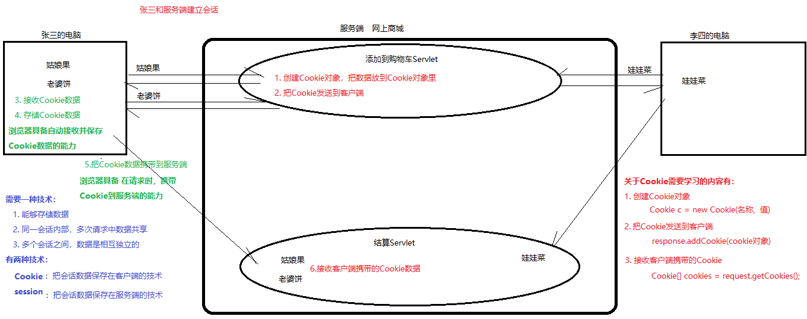
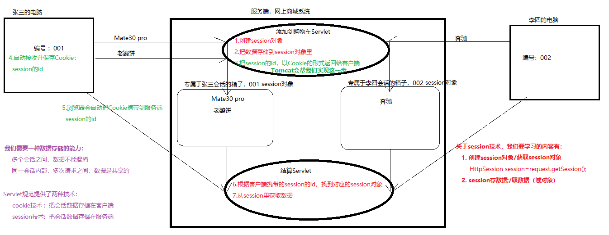
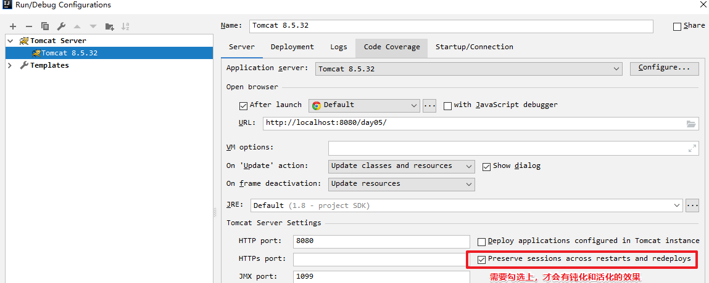

# 会话技术-课堂笔记

* ServletContext：

  * 可以加载web项目里的资源

  ```java
  //加载src里资源
  InputSteam is = 类加载器.getResourceAsStream("src里的文件");
  //加载web里资源
  InputSteam is = ServletContext.getResourceAsStream("src里的文件");
  ```

  * 是一个域对象
    * 由Servlet规范提供的，可以临时存储数据的对象。域对象里的数据，在其作用范围里可以共享
    * 存取数据的方法：
      * 存数据：setAttribute
      * 取数据：getAttribute
      * 删数据：removeAttribute
    * ServletContext：
      * 何时创建：服务器启动时
      * 何时销毁：服务器关闭时
      * 作用范围：整个web项目

* response：用于设置响应数据的

  * 设置行数据：`response.setStatus(int code)`
  * 设置头数据：`response.setHeader(String name, String value)`
  * 重定向跳转【重点】：`response.sendRedirect(request.getContextPath() + "资源路径")`
  * 设置响应体：

  ```java
  //字符流方式
  response.setContentType("text/html;charset=utf-8");
  response.getWriter().print(String content);
  
  //字节流方式
  ServletOutputStream os = response.getOutputStream();
  ```

* request：用于获取请求数据的

  * 获取行数据：
    * `String method = request.getMethod()`
    * `String contextPath = request.getContextPath()`
  * 获取头数据：`request.getHeader(String name)`
  * 获取表单参数

  ```java
  //解决中文参数乱码
  request.setCharacterEncoding("utf-8");
  
  String value = request.getParameter(String name);
  String[] values = request.getParameterValues(String name);
  Map<String,String[]> map = request.getParameterMap();
  ```

  * 是一个域对象

    * 何时创建：一次请求开始
    * 何时销毁：一次请求结束
    * 作用范围：一次请求中

  * 实现请求转发跳转

    * 和重定向的区别
      * 请求转发1次请求；重定向2次请求
      * 请求转发地址栏不变；重定向地址栏会变
      * 请求转发是服务器跳转；重定向是浏览器跳转
    * 什么时候用请求转发？如果跳转时有数据要传递，就使用请求转发；否则可以使用重定向
    * API

    ```java
    //请求跳转
    request.getRequestDispatcher("/资源路径").forward(request, response);

    //重定向
  response.sendRedirect("/要跳转的路径");
    ```
    
    
  
  

## 一、会话-简介

### 目标

* 了解什么是会话
* 了解什么是会话技术
* 理解会话技术的特点【重点】

### 讲解

#### 1. 什么是会话

- 会话开始：客户端输入网址并回车，和服务端建立连接，会话开始
- 会话过程：客户端和服务端之间可以有 多次请求和响应
- 会话结束：关闭浏览器，会话结束

#### 2. 什么是会话技术

- 用于保存会话过程中的一些数据的技术。
- 特点：
  - 不同会话之间，数据存储是互不干扰，相互独立
  - 同一会话内部，多次请求之间，数据存储要能够共享

#### 3. 有哪些会话技术

- Cookie：客户端的会话技术，把会话数据存储到客户端
  - 优点：服务器压力小
  - 缺点：安全性低，只能保存字符串
- session：服务端的会话技术，把会话数据存储到服务端
  - 优点：安全性高，可以存储任意类型数据（Object）
  - 缺点：服务器压力大
- 实际使用时，如何选择用哪种会话技术：
  - 如果安全性要求高，就要使用session技术；否则可以使用Cookie技术

### 小结

* 会话：
  * 会话开始：浏览器输入地址，和服务端建立连接，会话开始
  * 会话过程：会话过程中，可以有任意多次请求和响应
  * 会话结束：浏览器关闭，会话结束
* 会话技术：
  * 在会话过程中，进行数据共享(临时存取)的技术
  * 会话技术的特点：
    * 同一会话内部的多次请求之间，数据共享
    * 不同会话之间，数据是相互独立的、互不干扰
  * 会话技术有两种：
    * Cookie：会话数据保存在客户端，是客户端会话技术
      * 优点：服务器压力小
      * 缺点：不安全，只能保存字符串
    * session：会话数据保存在服务端，是服务端会话技术
      * 优点：安全，可以保存任意对象Object
      * 缺点：服务器压力大
    * session技术依赖于Cookie技术

## 二、会话-Cookie

### 1. Cookie的使用过程【重点】

#### 目标

* 了解Cookie技术的使用过程
* 使用Cookie的主要API，完成Cookie的创建、发送、接收

#### 讲解

##### Cookie的使用过程【重点】



1. 客户端：请求到服务端
2. 服务端：创建Cookie，把数据放到Cookie里，再发送给客户端
3. 客户端：
   * 浏览器会自动接收并保存Cookie数据
   * 再发请求时，会自动把Cookie数据携带到服务端
4. 服务端：接收客户端携带的Cookie数据

##### Cookie的主要API

* 创建Cookie：`Cookie cookie = new Cookie(String name, String value)`
* 发送Cookie：`response.addCookie(cookie)`
* 接收Cookie ：`request.getCookies()`

##### 注意事项

* 原则上：
  * 浏览器最多存储300个Cookie（实际上，不同浏览器不同）
  * 每个服务端最多给一个浏览器20个Cookie（实际上，不同浏览器不同）
  * **每个Cookie限制大小4KB**
* 注意：
  * Cookie中不能有特殊字符：`()<>@,;:\\\"/[]?={} \t`，并且建议不要有中文

##### 使用示例

* 创建并发送Cookie

```java
@WebServlet(urlPatterns="/create", name="Demo01CreateCookieServlet")
public class Demo01CreateCookieServlet extends HttpServlet {
    protected void doPost(HttpServletRequest request, HttpServletResponse response) throws ServletException, IOException {
        
        //创建Cookie
        Cookie cookie = new Cookie("username", "zhangsan");
        //发送Cookie到客户端 以响应头的方式，发送到客户端  Set-Cookie: username=zhangsan
        response.addCookie(cookie);

        Cookie cookie1 = new Cookie("age", "20");
        response.addCookie(cookie1);
    }

    protected void doGet(HttpServletRequest request, HttpServletResponse response) throws ServletException, IOException {
        this.doPost(request, response);
    }
}
```

*  

```java
@WebServlet(urlPatterns="/recieve", name="Demo02RecieveCookieServlet")
public class Demo02RecieveCookieServlet extends HttpServlet {
    protected void doPost(HttpServletRequest request, HttpServletResponse response) throws ServletException, IOException {
        //接收客户端携带的Cookie。以请求头的形式发送到服务端  Cookie: username=zhangsan
        Cookie[] cookies = request.getCookies();
        for (Cookie cookie : cookies) {
            String name = cookie.getName();
            String value = cookie.getValue();
            System.out.println(name + ":  " + value);
        }
    }

    protected void doGet(HttpServletRequest request, HttpServletResponse response) throws ServletException, IOException {
        this.doPost(request, response);
    }
}
```

* 客户端浏览器测试：
  * 先访问`Demo01CreateCookieServlet`：Servlet会生成Cookie数据，随着HTTP响应返回客户端浏览器
  * 再访问`Demo02RecieveCookieServlet`：浏览器发HTTP请求时，会自动把cookie数据携带到服务端
    * 服务端可以接收到Cookie数据

#### 小结

* Cookie的使用过程：
  1. 客户端发请求到服务端：
     * 服务端创建一个Cookie对象：`Cookie cookie = new Cookie(String name, String value)`
     * 服务端把Cookie对象返回给客户端：`response.addCookie(cookie)`
  2. 客户端会自动接收并保存Cookie数据
  3. 当客户端再次发请求到服务端时，会自动把Cookie数据携带到服务端
     * 服务端要接收客户端携带的Cookie：`Cookie[] cookies = request.getCookies()`
* 会话技术的特点：
  * 在同一会话内部多次请求之间，进行数据共享
  * 不同会话之间，数据要互不干扰
* 注意事项
  * Cookie的名称和值，不要有中文、空格、特殊字符，建议以字母、数字、下划线组成
  * 每个Cookie的大小，建议不要超过4KB


### 2. Cookie的API详解

#### 2.1 Cookie对象的有效期

##### 目标

* 了解什么是Cookie的有效期
* 能说出Cookie的默认有效期
* 能设置Cookie的有效期

##### 讲解

- 什么是有效期：Cookie的存活时间 

- Cookie的默认有效期：一次会话期间

  - Cookie默认保存在浏览器内存里，浏览器关闭，内存清空

- 设置Cookie的有效期：`cookie.setMaxAge(int seconds)`

  - 在到期之前，无论浏览器是否关闭，Cookie始终是有效的（活着的）
  - 在到期之后，Cookie会自动失效
- 是在磁盘文件上保存的
  
  > 1. Cookie过期会自动失效
  > 2. 强制清除浏览器缓存：快捷键 ctrl + shift + delete

##### 小结

* Cookie默认有效期：一次会话。关闭浏览器，Cookie清空
* 设置Cookie有效期：
  * `cookie.setMaxAge(秒)`
  * 在到期之前，cookie始终有效，即使浏览器关闭仍然有效
  * 在到期之后，cookie会自动失效

#### 2.2 Cookie对象的有效范围（路径）

##### 目标

* 了解什么是Cookie的有效范围（Cookie的路径）
* 能说出Cookie的默认有效范围
* 能设置Cookie的有效范围

##### 讲解

- 什么是有效范围：

  - 只有在访问有效范围内的资源时，才会携带Cookie到服务端

  ```
  客户端在访问服务端资源时，浏览器具备：自动把Cookie携带到服务端的能力
  但是：并非访问服务端任意资源时，都会把Cookie携带到服务端。
  只有：当客户端访问有效范围内的资源时，才会把Cookie携带到服务端
  ```

- Cookie的默认有效范围：生成这个Cookie的资源，所在的目录

  - 生成Cookie的资源是：    `/day11/aa/create`
  - 这个Cookie的有效范围：`/day11/aa`

- 设置Cookie的有效范围（设置Cookie的路径）：`cookie.setPath(String path)`

  > 注意：路径的值，不需要写ip和端口，直接写  `/项目路径/....`

  - 生成Cookie的资源是：`/day11/aa/create`，那么：

    * 默认有效范围：`/day11/aa`
    
    * 如果设置了有效范围是：`/day11`，就会覆盖默认的有效范围
  
  - 这个Cookie的有效范围是：`/day11`

  - 如果访问一个资源：`http://localhost/day11/recieve`，在有效范围内，会携带到服务端

  - 如果访问一个资源：`http://localhost/day11/aa/recieve`，在有效范围内，会携带到服务端

##### 小结

* 什么是Cookie的有效范围？

  * 浏览器访问一个资源时，可以自动把Cookie携带到服务端，但是并不是访问任意资源时都会携带
  * 当访问有效范围内的资源时，才会把Cookie携带到服务端

* 默认有效范围是

  ```
  生成Cookie的资源是： http://localhost:8080/day05/aa/create
  这个Cookie有效范围： http://localhost:8080/day05/aa
  当访问：
                    http://localhost:8080/day05/receive  不在有效范围里，接收不到Cookie
                    http://localhost:8080/day05/aa/reveive 在有效范围里，可以接收Cookie
  ```
  * 设置有效范围：`cookie.setPath(String path)`
    * 注意：不要写ip和端口，直接从项目路径开始写。比如：`cookie.setPath("/day05")`

  ```
  如果设置了有效范围：cookie.setPath("/day05")
  这个cookie有效范围： http://localhost:8080/day05
  当访问：
                    http://localhost:8080/day05/receive    在有效范围里，可以接收Cookie
                    http://localhost:8080/day05/aa/reveive 在有效范围里，可以接收Cookie
  ```

### 3. 接收Cookie

#### 目标

* 能够获取客户端携带的Cookie数据

#### 讲解

* API：`Cookie[] cookies = request.getCookies()`
* Cookie对象的方法：

| 方法         | 参数     | 返回值   | 说明         |
| ------------ | -------- | -------- | ------------ |
| `getName()`  | 无参     | `String` | Cookie的名称 |
| `getValue()` | **无参** | `String` | Cookie的值   |

> Cookie里其它数据是获取不到的，只能获取name和value

#### 小结

* 注意1：`reuqest.getCookies()`返回值可能是null，要先判空，再处理
* 注意2：从Cookie对象里只能获取name和value

### 4. 删除Cookie

#### 目标

*  能够删除客户端的Cookie

#### 讲解

* 服务端不能直接删除客户端的Cookie数据，只能间接删除：
  * 创建一个同name、同path的Cookie，**设置有效期为0**，然后发送到客户端，会覆盖掉原有的Cookie。
  * 相当于：给客户端发送一个同归于尽的Cookie
* 示例

```java
//要求：删除掉客户端的Cookie---名称为username，有效范围是默认的 /day11

//做法：创建一个名称为username、有效范围（路径）为/day11的Cookie。有效期设置为0
//把这个Cookie发送到客户端  和 客户端的username(/day11)的Cookie同归于尽
Cookie cookie = new Cookie("username", "");
cookie.setMaxAge(0);
cookie.setPath(request.getContextPath());

response.addCookie(cookie);
```

#### 小结

* 要删除哪个Cookie：
  * 创建一个同name、同path的Cookie
  * 设置有效期为0
  * 把Cookie返回到客户端：会把客户端同name、同path的Cookie覆盖掉，然后自己也过期失效了

### 5. 练习：上次访问时间

#### 目标

* 不登录状态下，当用户访问`/visit`时，在浏览器上显示上次访问的时间

#### 分析


#### 实现

```java
@WebServlet(urlPatterns="/visit")
public class VisitServlet extends HttpServlet {
    @Override
    protected void doPost(HttpServletRequest request, HttpServletResponse response) throws ServletException, IOException {
        //1.记录本次访问时间，放到Cookie里。在响应时返回给客户端，让浏览器保存起来
        Cookie cookie = new Cookie("visitTime", System.currentTimeMillis() + "");
        cookie.setMaxAge(30*24*60*60);
        response.addCookie(cookie);

        //2.获取客户端携带过来的Cookie：上次访问时间，显示到页面上
        String lastVisit = null;
        Cookie[] cookies = request.getCookies();
        if (cookies != null) {
            for (Cookie c : cookies) {
                if ("visitTime".equals(c.getName())) {
                    lastVisit = c.getValue();
                    break;
                }
            }
        }

        response.setContentType("text/html;charset=utf-8");
        if (lastVisit == null || "".equals(lastVisit)) {
            response.getWriter().print("你是第一次访问");
        }else{
            Date date = new Date(Long.parseLong(lastVisit));
            SimpleDateFormat format = new SimpleDateFormat("yyyy-MM-dd HH:mm:ss");
            response.getWriter().print("你上次访问时间是：" + format.format(date));
        }
    }

    @Override
    protected void doGet(HttpServletRequest request, HttpServletResponse response) throws ServletException, IOException {
        this.doPost(request, response);
    }
}
```

#### 小结

### 6. 练习：记住用户名

#### 目标

* 当用户登录时，如果勾选了“记住用户名”，那么
* 下次用户打开登录页面，在用户名文本框里，要显示上次登录的用户名


#### 分析

````java
1.接收表单参数：帐号、密码、记住用户名
2.登录校验：执行sql语句，判断username和password是否正确（省略）
	2.1登录成功：判断并处理“记住用户名”的逻辑
		2.1.1如果:需要记住用户名：把用户名以Cookie形式，让浏览器保存起来
			2.1.1创建Cookie对象
			2.1.2设置有效时间为一个月
			2.1.3发送Cookie
		2.1.2否则:没有勾选记住密码
			2.2.1把用户名Cookie删除掉
			2.2.2创建一个同名的Cookie对象,值为空
			2.2.3设置有效时间为0
			2.2.4发送Cookie
	2.2.登录跳转到首页
2.3否则:登录失败
    2.3.1给出提示
    2.3.2请求跳转当前页面(刷新页面)
            response.sendRedirect(request.getContextPath() + "/index.jsp");
        }else{
            //登录失败，跳转回到登录页面上，把错误原因传递过去
            request.setAttribute("loginError", "用户名或密码错误");
            request.getRequestDispatcher("/login.jsp").forward(request, response);
        }
    }

    @Override
    protected void doGet(HttpServletRequest request, HttpServletResponse response) throws ServletException, IOException {
        this.doPost(request, response);
    }
}
````


#### 实现

##### `login.jsp`

```jsp
<%@ page contentType="text/html;charset=UTF-8" language="java" %>
<html>
<head>
    <title>登录</title>
</head>
<body>
<form action="login" method="post">
    帐号：<input type="text" name="username" id="username"><br>
    密码：<input type="password" name="password"><br>

    <input type="checkbox" name="remember" value="yes" id="remember">记住用户名 <br>

    <input type="submit" value="登录">
</form>

<script src="js/myCookieUtil.js"></script>
<script>
    //使用js工具，获取Cookie的值（用户名）
    let usernameValue = getCookie("username");
    //js的if可以判断任何类型的数据。null，"", 0，undefined是false，其它是true
    if (usernameValue) {
        //获取到了，把这个值设置到文本框里
        document.getElementById("username").value = usernameValue;
        //把“记住用户名”勾选上
        document.getElementById("remember").checked = true;
    }
</script>
</body>
</html>
```

##### `LoginServlet`

```java
/**
 * @author liuyp
 * @date 2020/09/25
 */
@WebServlet(urlPatterns="/login")
public class LoginServlet extends HttpServlet {
    @Override
    protected void doPost(HttpServletRequest request, HttpServletResponse response) throws ServletException, IOException {
        //1.接收表单参数：帐号、密码、记住用户名
        String username = request.getParameter("username");
        String password = request.getParameter("password");
        String remember = request.getParameter("remember");

        //2.登录校验：执行sql语句，判断username和password是否正确（省略）
        if ("admin".equals(username) && "admin".equals(password)) {
            //登录成功：处理“记住用户名”的逻辑
            if ("yes".equals(remember)) {
                //需要记住用户名：把用户名以Cookie形式，让浏览器保存起来
                Cookie cookie = new Cookie("username", username);
                cookie.setMaxAge(30*24*60*60);
                response.addCookie(cookie);
            }else{
                //没有勾选“记住用户名”：把用户名Cookie删除掉
                Cookie cookie = new Cookie("username", "");
                cookie.setMaxAge(0);
                response.addCookie(cookie);
            }

            //跳转到首页
            response.sendRedirect(request.getContextPath() + "/index.jsp");
        }else{
            //登录失败，跳转回到登录页面上，把错误原因传递过去
            request.setAttribute("loginError", "用户名或密码错误");
            request.getRequestDispatcher("/login.jsp").forward(request, response);
        }
    }

    @Override
    protected void doGet(HttpServletRequest request, HttpServletResponse response) throws ServletException, IOException {
        this.doPost(request, response);
    }
}
```

#### 小结

## 三、会话-session

### 1. session的使用过程【重点】

#### 目标

* 了解session的使用过程

#### 讲解



1. 客户端：发送请求到服务端
2. 服务端：
   * 得到一个session对象：`request.getSession()`
   * 把session的id，放到Cookie里，发送到客户端（由Tomcat做）
3. 客户端：
   * 得到并保存Cookie：session的id（由浏览器做）
   * 再发请求到服务端：把Cookie（session的id）携带到服务端（由浏览器做）
4. 服务端：
   * 接收客户端携带的Cookie（session的id）：（由Tomcat做）
   * 根据session的id，得到session对象：`request.getSession()`

#### 小结

1. 客户端第一次请求到服务端：
   * 服务端要创建一个session对象：`HttpSession session = request.getSession()`
   * 服务端可以向session里存储数据：`session.setAttribute(String name, Object value)`
2. 客户端再次请求到服务端：
   * 服务端获取到session对象：`HttpSession session = request.getSession()`
   * 服务端从session里获取数据：`session.getAttribute(String name)`

### 2. 获取session对象

#### 目标

* 能够得到一个session对象
* 能够判断什么情况是创建新session、什么情况会获取旧session

#### 讲解

* 获取session的API：`HttpSession session = request.getSession()`

* 什么时候是获取旧的session对象：
  
  - 客户端有JSESSIONID，**并且**  服务端有对应的session对象
* 什么时候是创建新的session对象：
  
  - 客户端没有JSESSIONID， **或者**  服务端没有对应的session对象

#### 小结

* `request.getSession()`：如果有session对象就获取，如果没有session对象就创建
  * 何时创建：客户端没有JSESSIONID，或者  服务端没有session对象，就会创建
  * 何时获取：客户端有JSESSIONID，并且 服务端有session对象，就会获取旧的

### 3. session存取数据（是一个域对象）

#### 目标

* 能说出session对象何时会创建
* 能说出session对象何时会销毁

#### 讲解

* session存取数据的方法
  * 存数据：`setAttribute(String name, Object value)`
  * 取数据：`getAttribute(String name)`
  * 删数据：`removeAttribute(String name)`
* session什么时候会创建？一次会话开始
  
  * 客户端没有JSESSIONID， **或者**  服务端没有对应的session对象
* session什么时候会销毁？一次会话结束
  * 服务器**非正常**关闭，sessoin销毁。
    
    * 正常关闭时，Tomcat会把session对象序列化保存到磁盘文件上；
    * 重启Tomcat时，会读取文件反序列化恢复成session对象
  
  
  
  * 会话超时，自动销毁：默认30分钟
    * 访问一个web应用，之后长时间不再访问，session会等待30分钟之后才消失
    
    * 从最后一次访问算30分钟
    
    * 修改默认的会话超时时间，修改`WEB-INF/web.xml`
    
      ```xml
      <session-config>
          <session-timeout>超时时间，单位是分钟</session-timeout>
      </session-config>
      ```
  * 手动销毁：`session.invalidate()`
* session的作用范围是？一次会话期间
  * 只要还能找到原有的session对象，里边的数据就能够获取（仍然可以共享的）
  
  * 什么情况可能会获取不到session里的数据？
    
    * 客户端的JSESSIONID丢了：
      * 浏览器清除缓存了
      * 浏览器关闭重启了
      * 浏览器是第一次访问
    * 服务端的session对象消失了：
      * 服务器非正常关闭了
      * 会话超时，session销毁了
      * session被手动销毁了
    
  
  

#### 小结

* session何时创建：一次会话开始

  * 当客户端没有JSESSIONID，或者  服务端没有对应的session对象，会创建新的

* session何时销毁：一次会话结束

  * 会话超时自动销毁。默认30分钟超时
  * 服务器非正常关闭，session销毁。

  * 手动销毁 `session.invalidate()`

* session的作用范围：一次会话期间

#### 拓展：域对象小结【面试题】

* 域对象：由Servlet规范提供的，可以临时存储数据的对象。域对象里的数据，在其作用范围内可以共享

* 域对象有哪些：`ServletContext,  session, request, pageContext`

* 域对象存取数据的方法：

  * 存数据：`setAttribute(String name, Object value)`
  * 取数据：`getAttribute(String name)`
  * 删数据：`removeAttribute(String name)`

* 域对象的作用范围不同

  * `ServletContext`：代表整个web项目

    * 何时创建：当服务器启动时
    * 何时销毁：当服务器关闭时
    * 作用范围：整个web项目

    所有会话  所有请求  访问这个项目里   任意资源，都是同一个ServletContext

  * `session`：代表一个会话

    * 何时创建：一次会话开始
    * 何时销毁：一次会话结束
    * 作用范围：一次会话中

    一个会话  所有请求  访问这个项目里   任意资源，都是同一个session

  * `request`：代理一个请求

    * 何时创建：一次请求开始
    * 何时销毁：一次请求结束
    * 作用范围：一次请求中

    一个请求  访问这个项目里   任意资源，都是一个request（逻辑上是同一个）

  * `PageContext`：代表一个JSP页面 

    * 何时创建：当一个JSP被访问时
    * 何时销毁：当一个JSP被访问完成
    * 作用范围：在一个JSP内部

    一个请求  访问这个项目里   一个JSP资源，是同一个pageContext

* 域对象使用原则：在满足要求的前提下，越小越好


### 4. 练习：验证码校验

#### 目标

* 登录时，完成验证码的校验功能

#### 分析

* 在登录功能基础上，增加验证码校验功能
  1. 修改登录页面：显示验证码，点击切换验证码
  2. 修改`LoginServlet`：校验验证码，如果验证码错误，直接登录失败

#### 实现


#### 小结

## 四、会话-经典使用场景

* 什么时候要使用会话技术？
  * 当数据共享需要区分会话时。不同会话之间的数据不能干扰时
* 要使用哪一种会话技术？判断标准是什么？
  * 安全性要求。如果安全性要求高就使用session；否则就使用Cookie
* 会话技术的经典使用场景
  * 购物车数据。
    * 如果使用Cookie：可以长时间保存，但是操作不方便（Cookie存储的是字符串，增删商品时就要操作字符串）
    * 如果使用session：操作方法（session里可以放List、Map等等），但是不能长时间保存
  * 登录状态的保存。
    * 登录成功之后，把登录的那个User对象保存到session里
    * 如果session里有User对象：是已登录状态
    * 如果session里没有User对象：是未登录状态
  * 验证码真实值的保存
    * 用session技术

## 五、JSP入门

### 1. 简介和原理

#### 目标

* 了解JSP的概念
* 理解JSP的运行原理

#### 讲解

##### 什么是JSP

- JSP：Java Server Page，Java服务器端页面技术，是Sun公司提供的一套规范。表面上是HTML+Java，但是**JSP的本质是Servlet**
- JSP和Servlet的对比：
  - JSP：擅长页面显示的内容；不擅长于功能逻辑的处理
  - Servlet：擅长于功能逻辑的处理；不擅长于页面显示的内容 `response.getWriter().print()`
- 实际开发中，是Servlet和JSP配合：业务功能逻辑给Servlet处理，页面显示给JSP处理

##### JSP的运行原理

- 了解JSP的运行原理（运行过程）
- JSP必须要部署在服务器软件里：由服务器软件把JSP文件，翻译转换成Servlet，实际运行的是Servlet的代码
- JSP的运行过程：
  - jsp文件----翻译--->java文件（Servlet）----编译---->class文件
  - 当我们访问一个jsp时，本质是Tomcat调用了Servlet的class程序


- 服务器软件什么时候会把JSP翻译成Servlet？第一次访问时

#### 小结

* `index.jsp`--->被Tomcat翻译成Servlet--->编译成class文件--->加载到JVM内存里
* 当我们访问jsp时，实质上访问的是Servlet的service方法代码
* 问题：每次访问JSP，都会被翻译成Java文件吗？
  * 当第一次访问时会翻译


### 2. 基本语法【了解】

#### 目标

* 了解在JSP里嵌套Java代码的三种方式
* 掌握JSP里注释的写法

#### 讲解

##### JSP里嵌套Java代码 

| 表达式             | 作用                                     | 翻译成Servlet                                  |
| ------------------ | ---------------------------------------- | ---------------------------------------------- |
| `<%=Java表达式%>`  | 把Java表达式结果输出到浏览器上，显示出来 | service方法里的：<br />`out.print(Java表达式)` |
| `<% Java代码块 %>` | 通常用于写if判断、for循环等逻辑代码      | service方法里的：<br />`Java代码块`            |
| `<%! Java声明 %>`  | 声明成员变量、成员方法                   | Servlet类里的：<br />成员变量、成员方法        |

###### 嵌套**Java表达式**：`<%=Java表达式 %>`

- 用于把Java表达式的结果，显示到页面上

```jsp
<%-- 输出显示当前日期 --%>
<%=new Date().toString()%>
```

###### 嵌套**Java代码片段**：`<% Java代码片段 %>`

- 通常用于写if判断、for循环等逻辑代码

```jsp
<%
	//循环输出10次   红色的“hello”
    for (int i = 0; i < 10; i++) {
%>
    <font color="red">hello</font>
<%
    }
%>
```

###### 嵌套**Java声明**：`<%! Java声明 %>`

- 声明的是Servlet类的成员变量或者成员方法

```jsp
<%!
    public int add(int a, int b){
        return a+b;
    }
%>
<%=add(1, 2)%>
```

##### JSP的注释

```jsp
<%-- JSP的注释，可以注释JSP文件里的一切内容 --%>
```

#### 小结

* JSP里的注释：`<%-- JSP注释 --%>`
* JSP里嵌套Java代码：

```jsp
<%=Java表达式%>：把表达式的结果输出到页面上，被EL表达式代替了
<% Java代码块 %>：通常是用于if、循环等等处理逻辑，被JSTL标签代替了
<%! Java声明 %>：用于声明成员变量和成员方法，把这些代码写在单独的Java类里
```


# 复习上午内容

* 会话
  * 会话开始：在浏览器输入地址并回车，和服务端建立连接
  * 会话过程：可以有多次请求和响应
  * 会话结束：服务器关闭
* 会话技术：
  * 在会话过程中进行数据共享的技术
  * 特点：
    * 同一会话内部，多次请求之间，数据可以共享
    * 在不同会话之间，数据是相互独立的
  * 两种：
    * Cookie：客户端的会话技术，会话数据保存在客户端
      * 优点：服务器压力小
      * 缺点：不安全，只能存储字符串
    * session：服务端的会话技术，会话数据保存在服务端
      * 优点：安全，可以存储任意对象Object
      * 缺点：服务器压力大
    * session依赖于Cookie
* Cookie技术：
  * 使用过程：
    1. 客户端发请求到服务端
       * 服务端要创建Cookie对象：`Cookie cookie = new Cookie(String name,String value)`
       * 服务端可以设置Cookie：`cookie.setMaxAge(秒)， cookie.setPath("有效范围")`
       * 服务端把Cookie响应给客户端：`response.addCookie(cookie)`
    2. 客户端会自动接收并保存Cookie数据
    3. 当客户端再次请求到服务端时，会自动把Cookie携带到服务端
       * 服务端要接收Cookie：`Cookie[] cookies = request.getCookies()`
  * 删除Cookie的方法：
    * 创建一个同name、同path的Cookie，设置有效期为0，返回客户端
    * 会把客户端同name、同path的Cookie覆盖掉，自己也过期失效