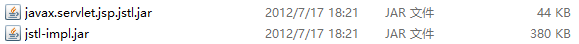

# JSP-课堂笔记

* 会话
  * 会话开始：输入地址并回车，和服务端建立连接
  * 会话过程：可以有多次请求和响应
  * 会话结束：关闭浏览器
* 会话技术
  * 在会话过程中进行数据共享的技术
  * 特点：
    * 在同一会话的多次请求之间，数据可以共享
    * 在不同会话之间，数据是相互独立的
  * Cookie：客户端的会话技术，会话数据保存在 客户端
    * 好处：服务器压力小
    * 缺点：不安全，只能存储字符串
  * session：服务端的会话技术，会话数据保存在服务端
    * 好处：安全性高，可以存储任意对象Object
    * 坏处：服务器压力大
  * session依赖于Cookie
* Cookie
  1. 客户端发请求到服务端
     * 服务端创建Cookie对象： `Cookie cookie = new Cookie(String name,String value)`
     * 服务端设置Cookie对象：`cookie.setMaxAge(秒),  cookie.setPath(String path)`
     * 服务端把Cookie返回客户端：`response.addCookie(cookie)`
  2. 客户端会自动接收并保存Cookie数据
  3. 当客户端再次请求到服务端时，会自动把Cookie携带到服务端
     * 服务端接收Cookie数据：`Cookie[] cookies = request.getCookies()`
     * 注意：如果没有Cookie，接收到的是null，通常需要判空再处理
     * 注意：从Cookie对象里只能获取name和value
* session
  1. 客户端发请求到服务端
     * 服务端要创建session对象：`HttpSession session = request.getSession()`
     * 服务端向session里存储数据：`session.setAttribute(String name, Object value)`
  2. 客户端再次发请求到服务端：
     * 服务端要获取到session：`HttpSession session = request.getSession()`
     * 服务端从session里取数据：`session.getAttribute(String name)`

## 一、EL表达式

### 1. EL简介和基本语法

#### 目标

* 了解EL的概念
* 了解EL的基本语法
* 理解EL的作用

#### 讲解

- EL：Expression Language，EL表达式。目的是用于：代替`<%=Java表达式 %>`，向页面输出显示内容
- 基本语法：`${表达式内容}`
- 作用：
  - 可以从域中获取数据显示到页面上，用于代替`<%=Java表达式 %>`
  - 可以进行数据运算

#### 小结


### 2. EL从域中获取数据【课下练习】

#### 目标

* 能够从域中获取简单数据
* 能够从域中获取复杂数据

#### 讲解

##### 语法：

```jsp
PageContext：${pageScope.key}  <!-- 从pageContext里取key对应的数据，显示到页面上 -->
request：    ${requestScope.key} <!-- 从request里取key对应的数据，显示到页面上 -->
session：    ${sessionScope.key} <!-- 从session里取key对应的数据，显示到页面上 -->
ServletContext：${applicationScope.key} <!--从ServletContext里取key对应的数据，显示到页面上 -->


${key} <!-- 从四个域对象， 按从小到大的顺序，查找key对应的数据 -->
```

* `${key[索引].key}`：
  * 根据索引找，使用`[索引]`。
  *  `.key`可以是获取键值对里key对应的值，也可以是方法`getKey()`的值

##### 示例：

###### 1. 从域中取简单值

```jsp
<%
    request.setAttribute("user", "tom_req");
    session.setAttribute("user", "tom_session");
    application.setAttribute("user","tom_app");
%>
1. 从request域里获取use：${requestScope.user}

2. 从sessoin域里获取user：${sessionScope.user}

3. 从ServletContext域里获取user：${applicationScope.user}

4. 简化写法（从四个域中，按从小到大的顺序查找user）：${user}
```

###### 2. 从域中取JavaBean的值：

* 语法：`${JavaBean对象.属性名}`

```jsp
<%
    Address address = new Address("广东", "深圳市");
    User user = new User("小王", 20, address);

    request.setAttribute("user", user);
%>
1. 获取user的姓名：${user.name}

2. 获取user的地址的省：${user.address.province}
```

```java
public class Address {
    private String province;
    private String city;

    public Address(String province, String city) {
        this.province = province;
        this.city = city;
    }

	//get/set...
}
```

```java
public class User {
    private String name;
    private Integer age;
    private Address address;

    public User(String name, Integer age) {
        this.name = name;
        this.age = age;
    }

    public User(String name, Integer age, Address address) {
        this.name = name;
        this.age = age;
        this.address = address;
    }
	//get/set...
}
```

###### 3. 从域中取集合的数据：

* 语法：`${集合[索引]}`

```jsp
<%
    Address address1 = new Address("广东", "深圳市");
    User user1 = new User("小王", 20, address1);

    Address address2 = new Address("广西", "南宁市");
    User user2 = new User("老王", 45, address2);

    List<User> userList = new ArrayList<>();
    userList.add(user1);
    userList.add(user2);

    request.setAttribute("users", userList);
%>
1. 获取第1个user的姓名：${users[0].name}

2. 获取第2个user的地址的省：${users[1].address.province}
```

###### 4. 从域中取map的数据：

* 语法：`${map.key}`

```jsp
<%
    Address address1 = new Address("广东", "深圳市");
    User user1 = new User("小王", 20, address1);

    Address address2 = new Address("广西", "南宁市");
    User user2 = new User("老王", 45, address2);

    Map<String, User> map = new HashMap<>();
    map.put("u1", user1);
    map.put("u2", user2);

    request.setAttribute("userMap", map);
%>
1. 获取u1的姓名：${userMap.u1.name}

2. 获取u2的地址的省：${userMap.u2.address.province}
```

#### 小结

* 使用EL表达式从域里取数据`${key}`，从四个域对象中，按照从小到大的顺序，查找key对应的值。

* 从域里取JavaBean的属性值：`${key.JavaBean的属性名}`
* 从域里取集合/数组索引n的值：`${key[n]}`
* 从域里取Map中键名为name的值：`${key.name}`


#### 拓展

* 域对象在不同环境里的对象名称

|                 | PageContext域 | ServletRequest域 | HttpSession域  | ServletContext域   |
| --------------- | ------------- | ---------------- | -------------- | ------------------ |
| JSP里的对象名称 | `pageContext` | `request`        | `session`      | `application`      |
| EL里的对象名称  | `pageScope`   | `requestScope`   | `sessionScope` | `applicationScope` |


### 3. EL可以进行数据运算【课下练习】

#### 目标

* 能够使用EL表达式进行比较运算和逻辑运算
* 能够使用EL表达式进行判空和三元运算

#### 讲解

##### 语法

- 基本数学运算：`+, -, *, /, %`
- 比较运算：`>,<,>=,<=,==,!=`  或者 `gt, lt, ge, le, eq, ne`
- 逻辑运算：`&&, ||, !` 或者 `and, or, not`
- 判空：`empty`：容器类对象，里边没有内容，就是空的；`null`和`""`是空的
  - `0`：非空
  - `5`：非空
  - `"hello"`：非空
  - `""`：空
  - `null`：空
  - `空集合`：空的
  - `集合里有内容`：非空
  - `空Map`：空的
  - `Map里有内容`：非空
- 三元运算：`判断条件 ? 结果为true的值 : 结果为false的值`

##### 示例

```jsp
<%
	//数据准备
    request.setAttribute("number", 10);
    request.setAttribute("str", "hello");
    request.setAttribute("list1", new ArrayList<>());
    List<String> list2 = new ArrayList<>();
    list2.add("");
    request.setAttribute("list2",list2);
    request.setAttribute("map1", new HashMap<>());
%>

- 基本数学运算：+, -, *, /, %
1+1 = ${1+1} <br>
number+1 = ${number+1}

<hr>
- 比较运算：>,<,>=,<=,==,!=  或者 gt, lt, ge, le, eq, ne <br>
number > 5?  ${number > 5} <br>
str是"hello"? ${str == "hello"}

<hr>
- 逻辑运算：&&, ||, ! 或者 and, or, not<br>
number是5~15之间吗？${number>=5  && number<=15}, ${number>=5  and number<=15}

<hr>
- 判空：empty <br>
- 三元运算：判断条件?结果为true的值:结果为false的值<br>

0是空吗？    ${empty 0?"是空":"不是空"} <br>---------不是空
""是空吗？   ${empty ""?"是空":"不是空"} <br>--------是空
null是空吗？ ${empty null?"是空":"不是空"} <br>------是空
list1是空吗？${empty list1?"是空":"不是空"} <br>-----是空
list2是空吗？${empty list2?"是空":"不是空"} <br>-----不是空
map1是空吗？ ${empty map1?"是空":"不是空"} <br>------是空
```

#### 小结


### 4. 拓展

* 如果项目里有项目路径，动态获取：`request.getContextPath()`
* 在JSP里的解决方案：
  * 使用`<%=Java表达式%>`：`<%=request.getContextPath()%>`，得到项目路径
  * 使用EL表达式的写法：`${pageContext.request.contextPath}`，得到项目路径

## 二、JSTL标签库

### 1. 简介和引入

#### 目标

* 了解JSTL的概念和作用
* 能够在JSP中引入Core核心库

#### 讲解

##### JSTL简介

- JSTL：JSP Standard Tag Library， JSP标准标签库。提供了一些标签，这些标签有逻辑功能，比如：if判断、forEach循环等等。可以用来代替JSP里`<% Java代码片段 %>`
- JSTL标签库包含5个子库，但是目前还用的上的只剩一个：core核心库，提供了if判断和循环遍历的标签

##### JSTL引入

1. 引入jar包

   

2. 在JSP里引入要使用标签库：在JSP里page指令下增加代码

```jsp
<%@ taglib uri="http://java.sun.com/jsp/jstl/core" prefix="c" %>
```

#### 小结

* 如何引入JSTL

  1. 导入jar包：把jar包拷贝放到`WEB-INF/lib`文件夹里，然后 Add as Library
  2. 哪个JSP面使用JSTL，就在哪个JSP里添加

  ```jsp
  <%@ taglib prefix="c" uri="http://java.sun.com/jsp/jstl/core" %>
  ```

  

### 2. JSTL的标签使用

#### 目标

* 能够使用JSTL的`if`标签进行判断
* 能够使用JSTL的`forEach`标签进行循环遍历

#### 讲解

> JSTL标签本身不具备：从域里取数据、进行数据运算的能力
>
> 如果需要取数据或者进行运算：需要使用EL配合完成

#####  `c:if`标签【课下练习】

- 作用：用来进行判断的

- 语法：

  ```jsp
  <c:if test="判断条件，使用EL表达式进行判断">
  	如果判断为true，这里的内容会生效；如果为false，这里内容相当于不存在
  </c:if>
  ```

- 示例：

  ```jsp
  <c:if test="${age < 18}">
  	<span style="color:red;">未成年</span>
  </c:if>
  <c:if test="${age >= 18}">
  	<span style="color:green;">已成年</span>
  </c:if>
  ```

#####  `c:forEach`标签【课下练习】

- 作用：用来进行循环遍历的

- 基本for循环

  - 语法：
    - 注意：变量的值，被保存到了`PageContext`对象里（是最小的域对象，EL要获取`${pageScope.key}`）

  ```java
  for(int i=0; i<=10; i++){
      // i：定义的一个变量，变量名是i
      // 0：循环的开始值
      // 10：循环的结束值
      // i++：循环的步长，每次循环加几
  }
  ```

  ```jsp
  <c:forEach var="变量名" begin="变量开始值" end="变量结束值" step="步长，每次循环加几">
  	当前值是：${变量名}
  </c:forEach>
  ```

  - 示例：

  ```jsp
  <c:forEach var="i" begin="1" end="10" step="1">
      <span style="color:red;">${i}</span>
  </c:forEach>
  ```

- 增强for循环

  - 语法：

  ```java
  for(String str:list){
      //str：定义的一个变量，名称是str
      //list：被循环遍历的对象
  }
  ```
  
  ```jsp
  <c:forEach items="循环遍历的对象，使用EL表达式获取到" var="变量名" varStatus="状态变量名">
      当前对象：${变量名},
      当前序号：${状态变量名.count},
      当前索引：${状态变量名.index},
      当前是否第一个：${状态变量名.first},
      当前是否最后一个：${状态变量名.last}
  </c:forEach>
  ```
  
  - 示例：
  
  ```jsp
  <table border="1" width="500px" cellspacing="0">
      <tr>
          <th>序号</th>
          <th>索引</th>
          <th>姓名</th>
          <th>年龄</th>
      </tr>
      <!-- 把域里的用户信息，循环显示到表格里。每个用户是一行 -->
      <c:forEach items="${userList}" var="user" varStatus="vs">
          <tr>
              <td>${vs.count}</td>
              <td>${vs.index}</td>
              <td>${user.name}</td>
              <td>${user.age}</td>
          </tr>
      </c:forEach>
  </table>
  ```

#### 小结

* if判断

```jsp
<c:if test="EL表达式进行判断">
	如果判断为true，这里的内容会生效；否则不生效
</c:if>
```

* forEach基本for循环

```jsp
<c:forEach var="" begin="" end="" stept="">
	var：定义的一个变量名
    begin：循环的开始值
    end：循环的结束值
    step：每次循环加几，循环的步长
</c:forEach>

<c:forEach var="i" begin="1" end="10" step="1">
	从1循环到10，每次循环加1。如果要取i的值：${i}
</c:forEach>
```

* forEach增强for循环

```jsp
<c:forEach items="" var="" varStatus="">
	items：被循环遍历的对象，通常使用EL表达式从域里获取
    var：定义的一个变量名
    varStatus：状态变量，用于获取当前循环的状态
</c:forEach>

<c:forEach items="${list}" var="company" varStatus="status">
	循环域里的list，获取当前变量值：${comany}。
    当前索引：${status.index}，
    当前序号：${status.count}
</c:forEach>
```


## 三、JSP开发模式

### MVC模式

#### 目标

* 了解什么是MVC模式

#### 讲解

##### 1.  JSP的发展历程

- Model1阶段的第一代：JSP
  - JSP：负责一切，数据库操作、功能逻辑、页面的显示
  - 仅仅适合小型、超小型的web应用
- Model1阶段的第二代：JSP+JavaBean
  - JavaBean：数据库实体封装，功能逻辑
  - JSP：功能逻辑、页面的显示
  - 适合小型web应用
- Model2阶段：JSP+JavaBean+Servlet  ===>符合了MVC思想
  - JavaBean：数据实体封装
  - JSP：负责页面的显示
  - Servlet：功能逻辑

##### 2. MVC思想：

​	Model2阶段符合MVC模式的。

​	不仅Java的web开发，要符合MVC思想。几乎所有的应用开发，如果按照MVC思想，都会变的很方便维护。

- M：Model模型层，指数据的封装，JavaBean
- V：View视图层，指页面显示，JSP
- C：Controller控制层，指功能的逻辑实现，Servlet

#### 小结

* MVC思想
  * m：model模型层，指数据封装
  * v：view视图层，指界面显示
  * c：controller控制层，指功能逻辑
* 如果开发的程序符合mvc思想，就可以**降低程序之间的耦合性，提高了程序的可维护性**

### JavaEE三层架构【掌握】

#### 目标

* 了解JavaEE三层架构
* 能够按照JavaEE三层架构进行web项目分层

#### 讲解

指服务端代码的分层：

- web层（表现层、表示层）：和客户端交互的，对应一个package（web, controller），放Servlet

- service层（业务层、业务逻辑层）：完成功能逻辑的，对应一个package（service），放XXXService

- dao层（数据访问层、持久层）：操作数据库的，对应一个package（dao, mapper），放XXXDao

  

- domain包：放JavaBean

- util包：放工具类

#### 小结

* web层，对应一个包：`com.itheima.web`，里边放Servlet类
* service层，对应一个包：`com.itheima.service`，里边放XXXService类
* dao层，对应一个包：`com.itheima.dao`，里边放XXXDao类
* 其它包：
  * `com.itheima.domain`：放JavaBean类
  * `com.itheima.util`：放工具类

## 四、练习：分层方式查询用户列表

### 目标

* 使用JavaEE三层架构，完成查询用户列表功能

* 功能需求：

  1. 用户在首页`index.jsp`上点击“查询所有用户”链接，发请求到服务端

  2. 服务端从数据库中查询所有用户，显示到`list.jsp`页面上的表格里

### 分析

#### 数据准备

```mysql
create database if not exists heima103 character set utf8;
use heima103;
drop table if exists user;
create table user(
	uid int primary key auto_increment,
    name varchar(32) not null,
    age int,
    sex char(1),
    email varchar(32),
    qq varchar(16)
);

insert into user (uid,name,age,sex,email,qq) values (null,'大郎',35,'男','dl@163.com','1111111');
insert into user (uid,name,age,sex,email,qq) values (null,'小二',20,'男','er@163.com','2222222');
insert into user (uid,name,age,sex,email,qq) values (null,'张三',30,'男','zs@163.com','3333333');
insert into user (uid,name,age,sex,email,qq) values (null,'李四',40,'女','ls@163.com','4444444');
insert into user (uid,name,age,sex,email,qq) values (null,'王五',50,'男','ww@163.com','5555555');
insert into user (uid,name,age,sex,email,qq) values (null,'赵六',60,'男','zl@163.com','6666666');
insert into user (uid,name,age,sex,email,qq) values (null,'钱七',70,'女','qq@163.com','7777777');
```

#### 功能分析

##### 准备工作

1. 初始化数据库：执行上边的SQL脚本
2. 创建web应用：把页面拷贝到web文件夹里
3. 导入jar包：把jar包放在web\WEB-INF\lib文件夹里
4. 导入配置文件：把c3p0-config.xml拷贝放到src里
5. 在src里创建package：
   * com.itheima.web：放Servlet的包
   * com.itheiam.service：放service的包
   * com.itheima.dao：放dao的包
   * com.itheima.domain：放JavaBean的包
   * com.itheima.util：放工具类的包
6. 在`com.itheima.domain`包里创建JavaBean：User，对应user表
7. 拷贝工具类：把工具类`JdbcUtils`拷贝，放到`com.itheima.util`包里

##### 实现流程


### 实现

#### `index.jsp`

* 修改超链接的地址，请求到Servlet

```jsp
<%@ page contentType="text/html;charset=UTF-8" language="java" %>
<!DOCTYPE html>
<html lang="zh-CN">
<head>
    <meta charset="utf-8"/>
    <meta http-equiv="X-UA-Compatible" content="IE=edge"/>
    <meta name="viewport" content="width=device-width, initial-scale=1"/>
    <title>首页</title>

    <!-- 1. 导入CSS的全局样式 -->
    <link href="css/bootstrap.min.css" rel="stylesheet">
    <!-- 2. jQuery导入，建议使用1.9以上的版本 -->
    <script src="js/jquery-2.1.0.min.js"></script>
    <!-- 3. 导入bootstrap的js文件 -->
    <script src="js/bootstrap.min.js"></script>
    <script type="text/javascript">
    </script>
</head>
<body>
<div align="center">
    <a href="${pageContext.request.contextPath}/queryAll" style="text-decoration:none;font-size:33px">查询所有用户信息</a>
</div>
</body>
</html>
```

#### `UserQueryAllServlet`

* 创建Servlet

```java
@WebServlet(urlPatterns="/queryAll")
public class UserQueryAllServlet extends HttpServlet {
    private UserService userService = new UserService();

    @Override
    protected void doPost(HttpServletRequest request, HttpServletResponse response) throws ServletException, IOException {

        List<User> userList = null;
        try {
            userList = userService.queryAll();
        } catch (SQLException e) {
            e.printStackTrace();
        }
        request.setAttribute("userList", userList);
        request.getRequestDispatcher("/list.jsp").forward(request, response);
    }

    @Override
    protected void doGet(HttpServletRequest request, HttpServletResponse response) throws ServletException, IOException {
        this.doPost(request, response);
    }
}
```

#### `UserService`

```java
public class UserService {
    private UserDao userDao = new UserDao();
    public List<User> queryAll() throws SQLException {
        return userDao.queryAll();
    }
}
```

#### `UserDao`

```java
public class UserDao {
    private QueryRunner runner = new QueryRunner(JdbcUtils.getDataSource());

    public List<User> queryAll() throws SQLException {
        return runner.query("select * from user", new BeanListHandler<>(User.class));
    }
}
```

#### `list.jsp`

* 从域中获取用户列表，循环显示出来

```jsp
<%@ page contentType="text/html;charset=UTF-8" language="java" %>
<%@ taglib prefix="c" uri="http://java.sun.com/jsp/jstl/core" %>
<!DOCTYPE html>
<html lang="zh-CN">
<head>
    <meta charset="utf-8">
    <meta http-equiv="X-UA-Compatible" content="IE=edge">
    <meta name="viewport" content="width=device-width, initial-scale=1">

    <title>用户信息管理系统</title>

    <link href="css/bootstrap.min.css" rel="stylesheet">
    <script src="js/jquery-2.1.0.min.js"></script>
    <script src="js/bootstrap.min.js"></script>
    <style type="text/css">
        td, th {
            text-align: center;
        }
    </style>
</head>
<body>
<div class="container">
    <h3 style="text-align: center">用户信息列表</h3>
    <table border="1" class="table table-bordered table-hover">
        <tr class="success">
            <th>编号</th>
            <th>姓名</th>
            <th>性别</th>
            <th>年龄</th>
            <th>QQ</th>
            <th>邮箱</th>
            <th>操作</th>
        </tr>
        <c:forEach items="${userList}" var="user" varStatus="status">
            <tr>
                <td>${status.count}</td>
                <td>${user.name}</td>
                <td>${user.sex}</td>
                <td>${user.age}</td>
                <td>${user.qq}</td>
                <td>${user.email}</td>
                <td><a class="btn btn-default btn-sm" href="">修改</a>&nbsp;<a class="btn btn-default btn-sm" href="">删除</a></td>
            </tr>
        </c:forEach>
    </table>
</div>
</body>
</html>
```

### 小结


## 五、练习：银行转账

### 1. 无事务版本

#### 目标

* 完成转账功能（不带事务的）

#### 分析

* 建表SQL语句

```mysql
use heima103;
create table account(
	aid int primary key auto_increment,
    name varchar(32),
    money double
);
insert into account values (null, 'tom', 10000);
insert into account values (null, 'jerry', 10000);
```

* 准备工作：
  1. 建表：执行上边SQL语句
  2. 创建web应用：
  3. 准备页面：index.jsp
  4. 导入jar包：数据库驱动包、c3p0的包，dbutils的包
  5. 导入配置文件：c3p0-config.xml，放在src里
  6. 在src下创建package：
     * web：放Servlet
     * service：放XXXService
     * dao：放XXXDao
     * domain：放JavaBean
     * util：放工具类
  7. 在domain包里，创建JavaBean：Account
  8. 导入工具类：把工具类jdbcUtils放到util包里

* 功能实现流程：

#### 实现

* `index.jsp`

```jsp
<%@ page contentType="text/html;charset=UTF-8" language="java" %>
<html>
<head>
    <title>银行转账</title>
</head>
<body>
<form action="${pageContext.request.contextPath}/transfer" method="post">
    转账人：<input type="text" name="from"><br>
    收款人：<input type="text" name="to"><br>
    转账金额：<input type="text" name="money"><br>

    <input type="submit" value="转账">
</form>
</body>
</html>
```

* `TransferServlet`

```java
@WebServlet(urlPatterns="/transfer")
public class TransferServlet extends HttpServlet {

    private AccountService accountService = new AccountService();
    @Override
    protected void doPost(HttpServletRequest request, HttpServletResponse response) throws ServletException, IOException {
        String from = request.getParameter("from");
        String to = request.getParameter("to");

        String money = request.getParameter("money");

        boolean success = false;
        try {
            success = accountService.transfer(from, to, money);
        } catch (SQLException e) {
            e.printStackTrace();
        }

        if (success) {
            response.sendRedirect(request.getContextPath() + "/success.jsp");
        }else{
            response.sendRedirect(request.getContextPath() + "/fail.jsp");
        }
    }

    @Override
    protected void doGet(HttpServletRequest request, HttpServletResponse response) throws ServletException, IOException {
        this.doPost(request, response);
    }
}
```

* `AccountService`

```java
public class AccountService {
    private AccountDao accountDao = new AccountDao();

    public boolean transfer(String from, String to, String money) throws SQLException {

        //转账人扣钱
        accountDao.outMoney(money, from);
        //收款人加钱
        accountDao.inMoney(money, to);

        return true;
    }
}
```

* `AccountDao`

```java
public class AccountDao {
    private QueryRunner runner = new QueryRunner(JdbcUtils.getDataSource());

    public void outMoney(String money, String from) throws SQLException {

        String sql = "update account set money = money - ? where name = ?";
        runner.update(sql, money, from);
    }

    public void inMoney(String money, String to) throws SQLException {
        String sql = "update account set money = money + ? where name = ?";
        runner.update(sql, money, to);
    }
}
```

* `JdbcUtils`和`Account`JavaBean：略

#### 小结


### 2. 有事务版本

#### 目标

* 在“无事务”版本基础上，添加事务管理的功能，保证：
  * 扣钱和加钱操作，要成功都成功，要失败都失败

#### 分析

* 事务管理通常是写在service层
* 事务复习：

  * 事务：保证事务里的多个操作，要么全部成功，要么全部失败
* 开启事务：`connection.setAutoCommit(false)`
  * 执行SQL语句
* 关闭事务：
    * 提交：`connection.commit()`
    * 回滚：`connection.rollback()`
* 注意：
  * 如果执行多次sql语句，想要属于同一事务，就必须使用同一个`Connection`对象
  * 事务要放在service层
* JDBC事务管理

```java
try{
    //注册驱动
    //获取连接
    //===开启事务===
    //创建statement对象
    //执行SQL语句
    //处理结果
    //===提交事务===
}catch(){
    //===回滚事务===
}finally{
    //释放资源
}
```

* DBUtils事务
  * `queryRunner.query(String sql, ResultSetHandler rsh, Object...params)`
  * `queryRunner.query(Connection conn, String sql, ResultSetHandler rsh, Object...params)`
  * `queryRunner.update(String sql, Object... params)`
  * `queryRunner.update(Connection conn, String sql, Object... params)`

#### 实现

##### 修改`AccountService`

```java
public class AccountService {
    private AccountDao accountDao = new AccountDao();

    public boolean transfer(String from, String to, String money) throws SQLException {

        //开启事务
        Connection connection = null;
        try {
            connection = JdbcUtils.getConnection();
            connection.setAutoCommit(false);

            //转账人扣钱
            accountDao.outMoney(money, from, connection);
            //收款人加钱
            accountDao.inMoney(money, to, connection);

            //提交事务
            connection.commit();
        } catch (Exception e) {
            //回滚事务
            if (connection != null) {
                connection.rollback();
            }
            e.printStackTrace();
        } finally {
            //关闭连接
            if (connection != null) {
                connection.close();
            }
        }
        return true;
    }
}
```

##### 修改`AccountDao`

```java
public class AccountDao {
    private QueryRunner runner = new QueryRunner(JdbcUtils.getDataSource());

    public void outMoney(String money, String from, Connection connection) throws SQLException {

        String sql = "update account set money = money - ? where name = ?";
        runner.update(connection, sql, money, from);
    }

    public void inMoney(String money, String to, Connection connection) throws SQLException {
        String sql = "update account set money = money + ? where name = ?";
        runner.update(connection, sql, money, to);
    }
}
```

#### 小结


### 3. ThreadLocal【理解】（Spring框架底层会用到）

#### 目标

* 了解ThreadLocal的作用
* 能够使用ThreadLocal在线程内传递数据

#### 分析

#### 讲解

##### ThreadLocal介绍

* `java.lang.ThreadLocal`：是jdk提供的一个工具，用于在线程范围内共享数据。线程局部变量
* 每个线程`Thread`都内置有一个Map容器，ThreadLocal可以向当前线程的Map容器中存储一个Entry：
  * key：是ThreadLocal对象
  * value：是存储的数据
* 在线程范围内，Map容器里的数据是可以共享的
* 

##### ThreadLocal常用API

`java.lang.ThreadLocal`对象提供了常用方法：

| 方法           | 参数                 | 说明                       |
| -------------- | -------------------- | -------------------------- |
| `set(T value)` | 要绑定到线程上的数据 | 把value绑定到当前线程上    |
| `get()`        |                      | 从当前线程上获取绑定的数据 |
| `remove()`     |                      | 把当前线程上的数据删除掉   |

* 当调用set方法时：

```java
//1.获取到当前线程里的Map
//2.把value存储到这个Map里： map.put(ThreadLocal对象, value值)
```

* 当调用get方法时：

```java
//1.获取当前线程里的Map
//2.以ThreadLocal对象为key，从map里获取值
```

##### ThreadLocal使用示例

```java
public class DemoThreadLocal {

    private static ThreadLocal<Object> tl = new ThreadLocal<>();
    private static ThreadLocal<Object> tl2 = new ThreadLocal<>();

    public static void main(String[] args) {
        String aaa = "AAA";

        //使用tl对象，把aaa数据绑定到当前线程上
        tl.set(aaa);
        //调用method1方法，不传参
        method1();
    }

    private static void method1() {
        //使用tl，可以从当前线程上得到绑定的数据
        Object o = tl.get();
        System.out.println(o);

        //使用tl2，不能从当前线程上得到绑定的数据（用tl绑，就得用tl取）
        Object o2 = tl2.get();
        System.out.println(o2);
    }
}
```

#### 小结


### 4. 最终版本

#### 目标

* 使用ThreadLocal优化事务管理的代码

#### 分析

* 在Service层：把Connection对象开启事务之后，绑定到当前线程上
* 在dao层：从当前线程上获取绑定的Connection对象（开启了事务的），用于执行SQL语句

#### 实现

##### 修改`AccountService`

* `AccountService`代码：

```java
public class AccountService {
    private AccountDao accountDao = new AccountDao();

    public boolean transfer(String from, String to, String money) throws SQLException {

        try {
            //开启事务
            TransactionManager.startTransaction();
            //转账人扣钱
            accountDao.outMoney(money, from);

            int i = 1/0;

            //收款人加钱
            accountDao.inMoney(money, to);
            //提交事务
            TransactionManager.commit();
            return true;
        } catch (SQLException e) {
            //回滚事务
            TransactionManager.rollback();
            e.printStackTrace();
        }
        return false;
    }
}
```

* 增加`TransactionManager`工具类：提供了通过ThreadLocal存取数据、事务管理的方法

```java
/**
 * 事务管理工具类
 * @author liuyp
 * @date 2020/02/09
 */
public class TransactionManager {
    private static ThreadLocal<Connection> tl1 = new ThreadLocal<>();

    /**
     * 从当前线程上获取连接
     */
    public static Connection getConnection() throws SQLException {
        return tl1.get();
    }

    /**
     * 开启事务
     */
    public static void startTransaction() throws SQLException {
        //获取一个连接
        Connection connection = JdbcUtils.getConnection();
        //开启事务
        connection.setAutoCommit(false);
        //把 开启了事务的连接对象  绑定到当前线程上
        tl1.set(connection);
    }

    /**
     * 提交事务的方法
     */
    public static void commit() throws SQLException {
        //提交事务
        Connection connection = tl1.get();
        connection.commit();
		connection.close();
		tl1.remove();
    }

    public static void rollback() throws SQLException {
        //回滚事务
        Connection connection = tl1.get();
        connection.rollback();
		connection.close();
		tl1.remove();
    }
}
```

##### 修改`AccountDao`

```java
public class AccountDao {
    private QueryRunner runner = new QueryRunner(JdbcUtils.getDataSource());

    public void outMoney(String money, String from) throws SQLException {
        String sql = "update account set money = money - ? where name = ?";
        runner.update(TransactionManager.getConnection(), sql, money, from);
    }

    public void inMoney(String money, String to) throws SQLException {
        String sql = "update account set money = money + ? where name = ?";
        runner.update(TransactionManager.getConnection(), sql, money, to);
    }
}
```

#### 小结


# 上午内容复习

* EL表达式：主要用于代替`<%=Java表达式%>`，把结果输出到页面上

  * 从域里取数据输出到页面

  ```jsp
  ${key}：从四个域对象中，按照从小到大的顺序，查找key对应的值
  ${user.name}：从域里取user的name属性值
  ${strList[0]}：从域里取strList中索引为0的值
  ${map.a}：从域里取map中a的值
  ```

  * 可以进行数据运算

  ```
  基本数学运算：+ - * / %等等
  比较运算：>,<,>=, <=, ==, !=  gt, lt, ge, le, eq, ne
  逻辑运算：&&, ||, !   and, or, not
  判空：empty
  三元运算
  ```

* JSTL标签库：主要是代替了`<% Java代码块 %>`，提供了判断、循环等逻辑处理的功能

  1. 导入jar包
  2. 在JSP里引入JSTL标签库

  ```jsp
  <%@ taglib prefix="c" uri="http://java.sun.com/jsp/jstl/core"%>
  ```

  * if判断

  ```jsp
  <c:if test="使用EL表达式进行判断">
      如果判断 为true，这里的内容会生效
  </c:if>
  ```

  * forEach循环遍历

  ```jsp
  <c:forEach var="i" begin="1" end="10" step="1">
  	${i}
  </c:forEach>
  
  <c:forEach items="${userList}" var="user" varStatus="status">
  	当前数据：${user}，
      当前索引：${status.index}，
      当前序号：${status.count}
  </c:forEach>
  ```

* MVC思想
  * M：Model，模型层，指数据的封装
  * V：View，视图层，指显示的页面/界面
  * C：Controller，控制层，指功能逻辑处理
* JavaEE三层架构
  * web层：表示层、表示层，和客户端交互，里边放Servlet
  * service层：业务层，实现业务功能，里边放XXXService
  * dao层：持久层、数据访问层，用于操作数据库的，里边放XXXDao
  * util包：用于放工具类
  * domain包：用于放JavaBean