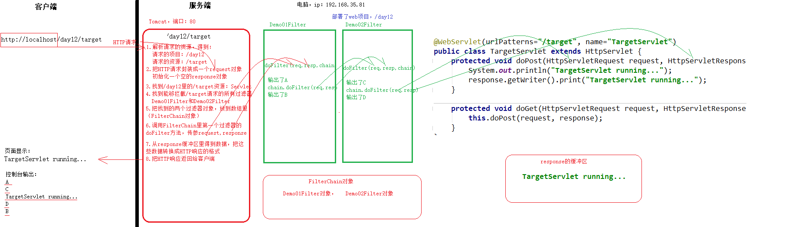
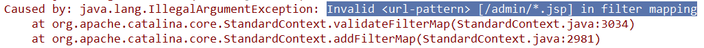
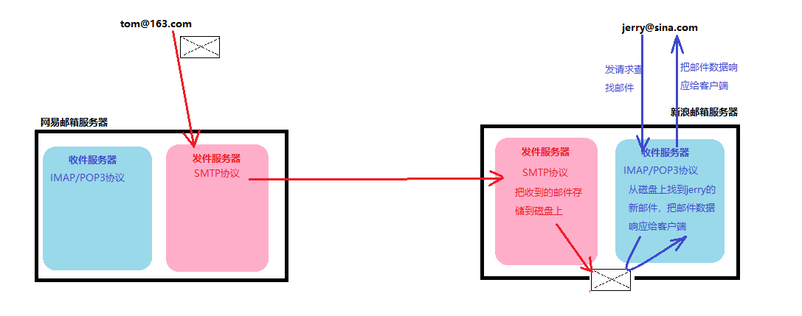

# Filter过滤器-课堂笔记

* EL：用于代替`<%=Java表达式%>`

  * 可以从域里取数据输出到页面上
    * 取简单数据：`${key}`
    * 取JavaBean：`${user.name}`
    * 取集合索引n的值：`${list[n]}`
    * 取Map中key为name的值：`${map.name}`
  * 可以进行数据运算：基本数学运算，逻辑运算，比较运算，判空，三元运算

* JSTL：主要用于代替`<% Java代码块 %>`

  * 引入JSTL

    1. 导入jar包
    2. 在JSP里引入标签库

    ```jsp
    <%@ taglib prefix="c" uri="xxxxx/core"%>
    ```

  * if判断

    ```jsp
    <c:if test="EL表达式进行判断">
    	如果判断为true，这里的内容会生效
    </c:if>
    ```

  * forEach循环遍历

    ```jsp
    <c:forEach var="i" begin="1" end="10" step="1">
        ${i}
    </c:forEach>
    
    <c:forEach items="${userList}" var="user" varStatus="status">
    	当前元素：${user}
        当前索引：${status.index}
        当前序号：${status.count}
    </c:forEach>
    ```

* JavaEE三层架构

  * web层：和客户端交互，放Servlet
  * service层：实现业务功能，放XXXService
  * dao层：操作数据库，放XXXDao

## 一、简介

### 目标

* 了解什么是过滤器

### 讲解

#### 1. 什么是过滤器

- Filter：是Servlet规范提供的一项技术，是一个接口：`javax.servlet.Filter`。
  - Servlet规范提供了三项技术：Servlet技术，Filter技术，Listener技术
- 作用：用于请求到达目标资源之前。可以先把请求拦截下来，处理后再放行，放行后请求就到达了目标资源

#### 2. 过滤器的使用场景

- 敏感词过滤
- 统一乱码解决
- IP黑名单
- 权限过滤

### 小结


## 二、快速入门【重点】

### 目标

* 能够编写Filter
* 理解Filter的运行原理

### 讲解

#### 1. 步骤

> 之前学习的Servlet快速入门步骤：
>
> 1. 创建Java类，实现Servlet接口
> 2. 重写接口的方法（共5个方法，了解3个，重点1个：service）
> 3. 使用注解@WebServlet配置虚拟访问路径


1. 创建一个Java类，实现Filter接口
2. 重写接口的方法（共3个方法，重点1个：doFilter）
3. 使用注解`@WebFilter`配置拦截范围

#### 2. 示例

```java
@WebFilter(urlPatterns = "/*")
public class Demo01QuickStartFilter implements Filter {
    @Override
    public void init(FilterConfig filterConfig) throws ServletException {

    }

    @Override
    public void doFilter(ServletRequest request, ServletResponse response, FilterChain chain) throws IOException, ServletException {
        System.out.println("==========Demo01QuickStartFilter.doFilter==========");
        //放行请求
        chain.doFilter(request, response);
    }

    @Override
    public void destroy() {

    }
}
```

#### 3. 原理（运行过程）



### 小结

* 快速入门：编写过滤器的步骤
  1. 创建一个Java类，实现`javax.servlet.Filter`接口
  2. 重写接口的方法，共3个方法，重点`doFilter`方法
  3. 在类上加注解`@WebFilter`，配置过滤器的拦截范围


## 三、API介绍

### 1. Filter的生命周期【了解】

#### 目标

* 能说出Filter的生命周期

#### 讲解

> Servlet的生命周期复习【面试】：
>
> * 何时创建：默认第一次访问时，Tomcat创建Servlet对象，创建时会执行一次init方法
> * 何时销毁：服务器关闭时，Servlet对象会被销毁，销毁时会执行一次destroy方法
> * 每次访问Servlet必定执行的方法是：service

- 何时创建：服务器启动时，Tomcat创建的，创建时会执行init方法，init方法只执行一次
- 何时销毁：服务器关闭时，销毁时会执行destroy方法，destroy方法只执行一次
- **拦截到**请求必定执行的方法是：doFilter

#### 小结

* 何时创建：服务器启动时
* 何时销毁：服务器关闭时
* 每次拦截到请求时，必定执行的是`doFilter`方法

### 2. Filter的API

#### 目标

- 能在Filter里获取ServletContext对象
- 理解FilterChain的作用

#### 讲解

##### 2.1 `init(FilterConfig)`：初始化方法

- 过滤器对象被创建时，服务器软件会执行init方法。执行调用时，会传递进来实参filterConfig对象。
- 参数FilterConfig：是当前过滤器的配置信息对象，作用：
  - 获取过滤器的名称：`config.getFilterName()`
  - 获取过滤器的初始化参数：`config.getInitParameter(String paramName)`
  - ==获取ServletContext对象==：`config.getServletContext()`

```java
package com.itheima.filter;

import javax.servlet.*;
import javax.servlet.annotation.WebFilter;
import javax.servlet.annotation.WebInitParam;
import java.io.IOException;

@WebFilter(value = "/*", 
           initParams = {
    			@WebInitParam(name = "aa", value = "AA"),
                @WebInitParam(name = "bb", value = "BB")
           })
public class Demo02ApiFilter implements Filter {

    /**
     * 在Filter对象创建之后，被Tomcat调用一次
     */
    @Override
    public void init(FilterConfig config) throws ServletException {
        System.out.println("===Demo02ApiFilter.init===");

        /**
         * FilterConfig：过滤器配置信息对象，由Tomcat创建并传递给我们
         * 作用有三个：
         */
        //1.可以获取当前过滤器的名称：没用了
        String filterName = config.getFilterName();
        System.out.println("过滤器名称：" + filterName);

        //2.可以获取当前过滤器的初始化参数：没用了
        String aa = config.getInitParameter("aa");
        System.out.println("初始化参数aa：" + aa);

        //3.可以获取ServletContext对象：有用
        ServletContext context = config.getServletContext();
        System.out.println("ServletContext：" + context);
    }

    @Override
    public void doFilter(ServletRequest request, ServletResponse response, FilterChain chain) throws IOException, ServletException {
        System.out.println("===Demo02ApiFilter.doFilter===");

        //System.out.println("C");

        chain.doFilter(request, response);

        //System.out.println("D");
    }

    /**
     * 当Filter对象被销毁时，Tomcat会调用一次destroy方法
     */
    @Override
    public void destroy() {
        System.out.println("===Demo02ApiFilter.destroy===");
    }
}
```

##### 2.2 `doFilter(ServletRequest, ServletResponse, FilterChain)`

- 每次拦截**到**请求时，服务器软件会执行的方法。

- 参数：

  - ServletRequest：代表HTTP请求的request对象，通常强转成HttpServletRequest

  - servletResponse：代表HTTP响应的response对象，通常强转成HttpServletResponse

  - ==filterChain==：过滤器链对象

    - 里边是：能够拦截本次请求的所有过滤器，组成的一个对象
    - 作用是：放行放行。放行请求 到下一个过滤器；如果下一个过滤器不存在，请求就到达目标资源
    - 如何放行：`chain.doFilter(request, response)`

    > 必须所有的过滤器全部都放行请求，请求才能够到达目标资源

#### 小结

* 初始化方法`init(FilterConfig)`
  * 当过滤器对象被创建时，会执行一次。用于初始化工作，比如加载配置文件
  * 参数FilterConfig：当前过滤器的配置信息对象，由Tomcat创建并传递进来的
    * `getFilterName()`：获取当前过滤器的名称
    * `getInitParameter(String name)`：获取当前过滤器的初始化参数
    * 【掌握】`getServletContext()`：获取ServletContext对象
* 执行过滤的方法`doFilter(ServletRequest,ServletResponse,FilterChain)`
  * 每次拦截到请求，必定会执行这个方法
  * 参数ServletRequest：通常强转成HttpServletRequest，用于获取 客户端提交的数据
  * 参数ServletResponse：通常强转成HttpServletResponse，用于设置  要返回给客户端的数据
  * 参数FilterChain：过滤器链对象
    * 作用：放行。放行请求到下一个过滤器。如果已经是最后一个过滤器了，就到达目标资源
    * 方法：`chain.doFilter(request, respose)`

## 四、配置

在web3.0以前，只能使用web.xml配置；

在web3.0或更高版本，可以使用web.xml配置，也可以使用注解配置。通常使用注解方式

### 1. 注解配置

#### 目标

* 能够配置过滤器的过滤范围/拦截范围
* 能够配置过滤器的拦截方式

#### 讲解

##### 1 完整的配置示例

```java
@WebFilter(
        filterName = "demo03",  /*过滤器的名称 */
        initParams = { /*配置过滤器的初始化参数*/
                @WebInitParam(name = "aa",value = "AA"),
                @WebInitParam(name = "bb",value = "BB")
        },
        urlPatterns = "/*", /*配置过滤器的拦截范围*/
        dispatcherTypes = DispatcherType.REQUEST  /*配置过滤器的拦截方式*/
)
```

##### 2 urlPatterns或者value（必须）

- 配置的是过滤器的拦截范围。

- 值的写法有三种：

  - 拦截完全匹配的请求（用的很少）：`/target`

  - ==拦截目录匹配的请求（用的多==：以`/`开头，以`*`结尾，比如：`/*`,  `/admin/*`

  - 拦截扩展名匹配的请求：以`*`开头，以扩展名结尾，比如：`*.jsp`
  
- 问题：

  - 一个过滤器能不能拦截多种资源的请求？可以
  
  ```java
  @WebFilter(urlPatterns = {"", "", ""})
  ```
  
  - 一次请求可以有多少个过滤器拦截？多个
  
    只要客户端请求的资源，在过滤器的拦截范围里，那么：过滤器就会拦截这次请求
  
  - 能不能写成：`/admin/*.jsp`的写法？不能，不符合语法
  

##### 3 dispatcherTypes（非必须）

- 配置的是过滤器要拦截哪种方式的请求：

- 有两种常用的拦截方式：

  - 拦截 客户端的请求（默认的）：`DispatcherType.REQUEST`

    - 客户端直接请求，会拦截
    - 重定向的请求，会拦截
    - 请求转发的请求，不拦截

  - 拦截 请求转发的请求：`DispatcherType.FORWARD`
    
      - 客户端直接请求，不拦截
      - 重定向的请求，不拦截
    - 请求转发的请求，会拦截
    
  * 问题：
  
    * 一个过滤器，能否拦截多种方式？可以配置
  
  
  ```java
  @WebFilter(value = "/index.jsp", dispatcherTypes = {DispatcherType.FORWARD, DispatcherType.REQUEST})
  ```

##### 4 过滤器的执行顺序

- 由过滤器的全限定类名决定的：谁的名字在前，谁先执行

#### 小结

* `value /  urlPatterns`：配置过滤器的拦截范围

  * 拦截完全匹配的：`/target`，表示只拦截对/target的请求
  * 拦截目录匹配的：以/开头，以*结尾
    * 比如：`/*`表示拦截所有
    * 比如：`/admin/*`表示拦截`/admin/`下边的资源请求
  * 拦截扩展名匹配的：以*开头，以扩展名结尾
    * 比如：`*.jsp`表示拦截对jsp的请求
  * 注意：一次请求，可以有多个过滤器进行拦截
  * 注意：一个过滤器可以拦截多种范围，写成`value = {"/admin/*", "*.jsp"}`，拦截两个范围之和
  * 注意：拦截范围必须要符合语法，`/admin/*.jsp`是不符合语法的，启动Tomcat会报错

  

* `dispatcherTypes`【了解】：配置过滤器的拦截方式
  * `DispatcherType.REQUEST`：默认值，拦截客户端的请求
  * `DispatcherType.FORWARD`：拦截请求转发的请求
  * 注意：可以拦截多种方式 `dispatcherTypes={DispatcherType.REQUEST, DispatcherType.FORWARD}`


### 2. web.xml配置【掌握】

#### 目标

* 了解使用web.xml配置过滤器
* 能够指定过滤器的执行顺序

#### 讲解

- web3.0及以后版本，使用注解配置过滤器（也支持web.xml配置）
- web3.0以前，只能使用web.xml配置

##### 1  完整的配置示例

```xml
<!--配置demo01Filter-->
    <filter>
        <!--filter-name：过滤器名称，不能重复-->
        <filter-name>demo01</filter-name>
        <!--filter-class：过滤器全限定类名-->
        <filter-class>com.itheima.filter.Demo01Filter</filter-class>
        <!--init-param：配置一个初始化参数-->
        <init-param>
            <param-name>aa</param-name>
            <param-value>AA</param-value>
        </init-param>
        <init-param>
            <param-name>bb</param-name>
            <param-value>BB</param-value>
        </init-param>
    </filter>
    <filter-mapping>
        <!--filter-name：给哪个过滤器配置映射信息-->
        <filter-name>demo01</filter-name>
        <!--url-pattern：配置过滤器的拦截范围-->
        <url-pattern>/admin/*</url-pattern>
        <url-pattern>*.jsp</url-pattern>
        <!--dispatcher：配置过滤器的拦截方式-->
        <dispatcher>REQUEST</dispatcher>
        <dispatcher>FORWARD</dispatcher>
    </filter-mapping>
```

##### 2 过滤器的执行顺序

- xml配置：由web.xml里的`filter-mapping`标签出现的顺序决定的：谁在前，谁先过滤
- 注解配置：由过滤器的名称顺序决定的，谁排名在前，谁先过滤

#### 小结


## 五、练习：使用过滤器统一处理乱码问题

```java
/**
 * @author liuyp
 * @date 2020/09/28
 */
@WebFilter("/*")
public class CharacterEncodingFilter implements Filter {
    @Override
    public void init(FilterConfig filterConfig) throws ServletException {

    }

    @Override
    public void doFilter(ServletRequest request, ServletResponse response, FilterChain chain) throws IOException, ServletException {
        //解决中文请求参数乱码
        request.setCharacterEncoding("utf-8");
        //解决中文响应数据乱码
        response.setContentType("text/html;charset=utf-8");

        //放行
        chain.doFilter(request, response);
    }

    @Override
    public void destroy() {

    }
}
```

## 六、练习：使用过滤器统一处理敏感字符问题

* 过滤器代码

```java
/**
 * @author liuyp
 * @date 2020/09/28
 */
@WebFilter("/*")
public class SuperWordsFilter implements Filter {
    private List<String> words = new ArrayList<>();

    /**
     * 加载words.txt，其中每一行是一个敏感词。把每个敏感词加到words集合里
     */
    @Override
    public void init(FilterConfig config) throws ServletException {
        BufferedReader reader = null;
        try {
            //1. 获取到ServletContext
            ServletContext context = config.getServletContext();
            //2. 使用ServletContext读取 WEB-INF/words.txt
            InputStream is = context.getResourceAsStream("WEB-INF/words.txt");
            //3. 把字节流包装成字符流
            reader = new BufferedReader(new InputStreamReader(is, "utf-8"));
            //4. 读取文件里的每一行
            String line = null;
            while ((line = reader.readLine()) != null) {
                words.add(line);
            }
        } catch (Exception e) {
            e.printStackTrace();
        } finally {
            //5. 关闭流
            if (reader != null) {
                try {
                    reader.close();
                } catch (IOException e) {
                    e.printStackTrace();
                }
            }
        }
    }

    @Override
    public void doFilter(ServletRequest request, ServletResponse response, FilterChain chain) throws IOException, ServletException {
        HttpServletRequest request1 = (HttpServletRequest) request;

        //1. 生成request对象的代理对象：增强它的getParameter方法，增加敏感字符过滤的功能
        HttpServletRequest requestProxy = (HttpServletRequest) Proxy.newProxyInstance(
                request1.getClass().getClassLoader(),
                request1.getClass().getInterfaces(),
                new InvocationHandler() {
                    @Override
                    public Object invoke(Object proxy, Method method, Object[] args) throws Throwable {
                        //判断当前执行的方法是否是getParameter
                        if ("getParameter".equals(method.getName())) {
                            //需要增强：增加敏感词过滤的功能
                            //1.先获取原始值
                            String value = (String) method.invoke(request1, args);
                            //2.替换掉敏感词
                            for (String word : words) {
                                value = value.replace(word, "**");
                            }
                            //3.返回替换后的结果
                            return value;
                        }else{
                            //不需要增强：要调用原始对象的方法，返回结果
                            return method.invoke(request1, args);
                        }
                    }
                }
        );

        //2. 放行。传递的应该是request的代理对象
        chain.doFilter(requestProxy, response);
    }

    @Override
    public void destroy() {

    }
}
```

* 敏感词文件：`WEB-INF/words.txt`

```txt
自焚
自杀
自尽
自宫
```

## 七、作业：敏感字符功能增强

## 八、监听器【了解】

### 1. 简介

#### 什么是监听器？

* Servlet规范有三大技术：Servlet、Filter、Listener

* 是Servlet规范之一，用于监听JavaEE某些组件对象的状态变化。通常是用于监听域对象的
* 类似于js里的事件
  * 事件：用户的某些动作 ---- 主要是域对象的一些变化（存数据了、取数据了等等）
  * 事件源：在哪发生的这些动作、状态变化 --- 域对象
  * 响应行为：在动作发生、状态变化之后，要做的事情

#### 有哪些监听器？

* Servlet规范提供了8个监听器接口（6+2）

* 6个用于监听域对象的


​		还有一个域对象：pageContext，因为作用范围太小、生命周期太短，所以没有它的监听器

* 2个特殊的监听器（对象自我感知监听器）：用于监听session里的JavaBean对象
  * `HttpSessionBindingListener`：监听JavaBean对象被放到了session里、从session里移除了
    * JavaBean被绑定：JavaBean对象感知到自己被放到了session域里
    * JavaBean被解绑：JavaBean对象感知到自己被从session里移除了
  * `HttpSessionActivationListener`：监听session里的JavaBean对象钝化与活化
    * JavaBean的钝化：JavaBean对象被序列化保存到磁盘文件上
    * JavaBean的活化：把磁盘文件反序列化恢复到内存中，变成JavaBean对象

### 2. ServletContextListener接口

* 监听谁（事件源）：`ServletContext`对象
* 监听什么（事件）：创建与销毁，通常用于监听服务器的启动与关闭。
  * ServletContext在服务器启动时，会被创建
  * ServletContext在服务器关闭时，会被销毁
* 使用场景：
  * `SSM整合时，要在服务器启动就加载Spring配置文件`
* 使用步骤
  1. 创建Java类，实现监听器接口：`ServletContextListener`
  2. 实现接口的方法
  3. 使用注解配置：`@WebListener`
* 使用示例

```java
/**
 * 要监听服务器的启动与关闭
 * 就需要：监听ServletContext对象的创建与销毁
 */
@WebListener
public class ContextListener implements ServletContextListener {

    /**
     * 当ServletContext对象被初始化时，这个方法会执行
     * 即：当服务器启动时，这个方法会执行
     * @param sce
     */
    @Override
    public void contextInitialized(ServletContextEvent sce) {
        System.out.println("服务器启动了...");
    }

    /**
     * 当ServletContext对象被销毁时，这个方法会执行
     * 即：当服务器关闭时，这个方法会执行
     * @param sce
     */
    @Override
    public void contextDestroyed(ServletContextEvent sce) {
        System.out.println("服务器关闭了...");
    }
}
```


## 九、拓展

### 1. Java发送邮件

* 相关的概念
  * 邮件服务器：提供了邮件收发功能的服务器
  * 邮箱客户端：用户用来收发邮件的软件
    * 浏览器：
    * foxmail：腾讯的，张小龙
    * outlook：微软的
* 邮件收发的协议
  * 发邮件协议：SMTP， Simple Mail Transfer Protocol
  * 收邮件协议：
    * IMAP：Internet Mail Access Protocol
    * POP3：Post Office Protocol - Version 3

* 邮件收发原理



* Java发送邮件：使用sun公司提供的一个jar包


### 2. 路径的写法【掌握】

* 绝对路径：无论在哪发请求，绝对路径都是不变的

  * 完整的url地址：在页面上发请求（请求到Servlet、跳转到另外一个页面、加载图片、js、css）

  ```
  访问一个Servlet： http://192.168.39.100:8080/day07/login
  访问一个页面：     http://192.168.39.100:8080/day07/index.jsp
  ```

  * 简写的url地址：省略掉ip和端口，直接从项目路径开始，只能访问自己的内容，要访问其它服务器里的资源，是访问不到的

  ```
  访问一个Servlet： /day07/login
  访问一个页面：     /day07/index.jsp
  ```

  * 特殊情况：
    * 如果是在服务端跳转时，绝对路径可以省略项目路径不写
    * 如果是客户端浏览器跳转，就按照上边的《完整url地址》和《简写的url地址》

  ```java
  //请求转发跳转
  request.getRequestDispatcher("/index.jsp").forward(request, response);
  
  //重定向跳转：本质是浏览器跳转
  response.sendRedirect("/day07/index.jsp")
  ```

* 相对路径：需要根据目标资源和当前资源的相对位置，进行设置

  * `./`开头：从当前目录查找
  * `../`开头：从上级目录查找

  ```
  1.先写出来当前资源的url地址： http://localhost:8080/day07/login.jsp
  2.再写出来目标资源的url地址： http://localhost:8080/day07/login
  3.从当前资源，跳转到目标资源： ./login，或者简写  login
  -------------------------------------------------------------------
  1.先写出来当前资源的url地址： http://localhost:8080/day07/admin/manager.jsp
  2.再写出来目标资源的url地址： http://localhost:8080/day07/demo
  3.从当前资源，跳转到目标资源： ../demo
  -------------------------------------------------------------------
  1.先写出来当前资源的url地址： http://localhost:8080/day07/index.jsp
  2.再写出来目标资源的url地址： http://localhost:8080/day07/admin/mgr
  3.从当前资源，跳转到目标资源： ./admin/mgr  或者简写  admin/mgr
  ```

  

# 复习上午内容

```java
@WebFilter(
    value="/*",
    dispatcherTypes=DispatcherType.REQUEST,
	filterName="demo",
    initParams={
        @WebInitParam(name="aa", value="AA"),
        @WebInitParam(name="bb", value="BB")
    }
)
public class DemoFilter implements Filter{
    
    public void init(FilterConfig config){
        //在Filter对象被创建之后，执行一次
        String filterName = config.getFilterName();
        String aa = config.getInitParameter("aa");
        ServletContext context = config.getServletContext();
    }
    
    public void doFilter(ServletRequest req, ServletResponse resp, FilterChain chain){
        //每次拦截到请求，必定执行的方法
        
        //放行
        chain.doFilter(req, resp);
        
    }
    
    public void destroy(){
        //在filter对象销毁之前，执行一次
    }
}
```

* 配置拦截范围：`@WebFilter`里的value或者urlPatterns
  * 拦截精确匹配的：`/target`，只拦截对/target的请求
  * 拦截目录匹配的：以/开头，以`*`结尾，比如：`/*`表示拦截所有。`/admin/*`拦截/admin下的资源
  * 拦截扩展名匹配的：以`*`开头，以扩展名结尾，比如 `*.jsp`
* 配置拦截方式：`@WebFilter`里的dispatcherTypes
  * `DispatcherType.REQUEST`：拦截客户端的请求
  * `DispatcherType.FORWARD`：拦截请求转发的请求
* 过滤器的执行顺序：
  * web.xml配置的：由`filter-mapping`出现的顺序决定，哪个先出现，就先过滤
  * 注解配置的：按照过滤器的名称排序