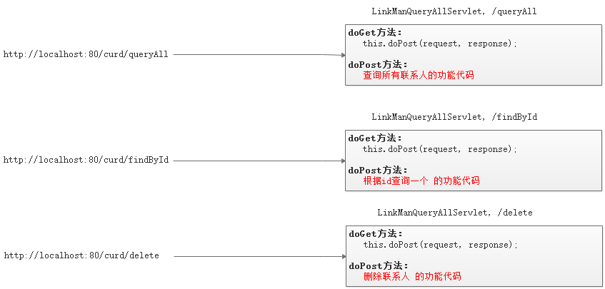
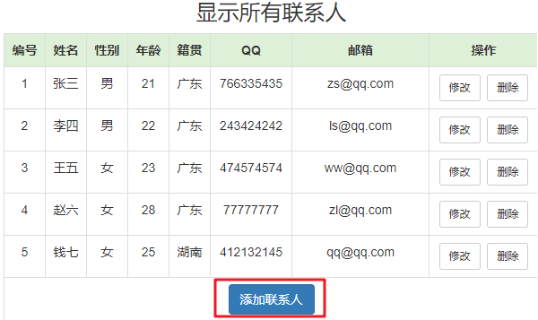
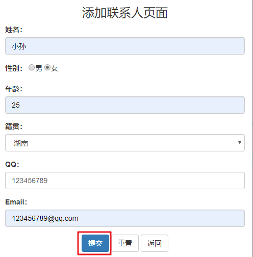
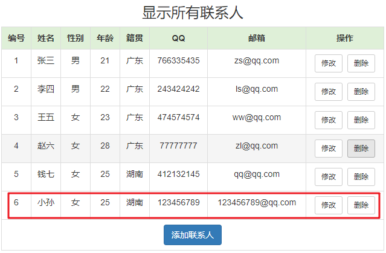
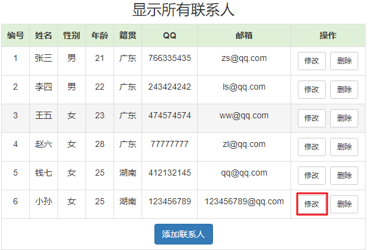
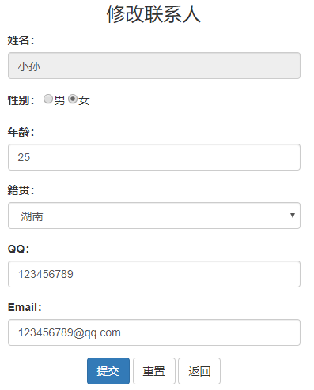
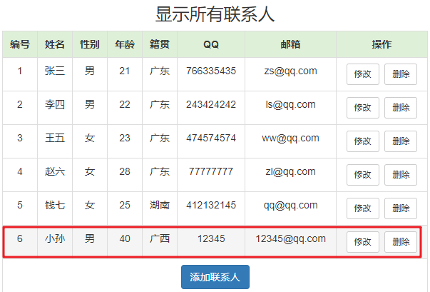
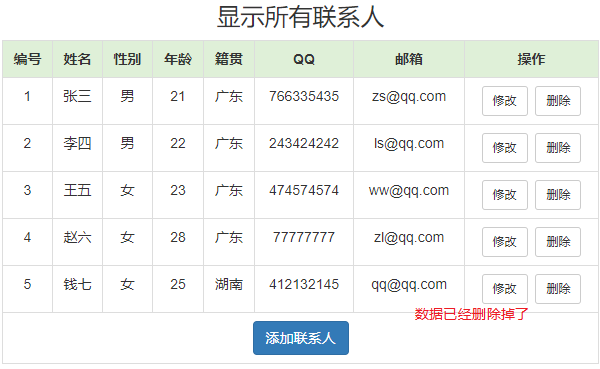

# CURD练习-课堂笔记

* Filter

```java
public class DemoFilter implements Filter{
    public void init(FilterConfig config){
        
    }
    
    public void doFilter(ServletRequest req,ServletResponse resp,FilterChain chain){
        //在这里写过滤的代码
        //放行请求
        chain.doFilter(req, resp);
    }
    
    public void destroy(){
        
    }
}
```

* 注解方式配置过滤器

  ```java
  @WebFilter(
  	value = "拦截范围",
      dispatcherTypes = 拦截方式
  )
  ```

  * 拦截范围
    * 拦截完全匹配的：`/target`
    * 拦截目录匹配的：以`/`开头，以`*`结尾
    * 拦截扩展名匹配的：以`*`开头，以扩展名结尾
  * 拦截方式
    * `DispatcherType.REQUEST`：默认值，表示拦截客户端的请求
    * `DispatcherType.FORWARD`：表示拦截请求转发的请求

* web.xml配置过滤器

  ```xml
  <filter>
  	<filter-name>过滤器名称</filter-name>
      <filter-class>过滤器全限定类名</filter-class>
      <init-param>
      	<param-name>初始化参数名称</param-name>
          <param-value>初始化参数值</param-value>
      </init-param>
  </filter>
  <filter-mapping>
  	<filter-name>过滤器名称</filter-name>
      <url-pattern>拦截范围</url-pattern>
      <dispatcher>拦截方式</dispatcher>
  </filter-mapping>
  ```

* 监听器ServletContextListener：
  
  * 用于监听ServletContext对象的创建与销毁（通常用来监听服务器的启动与关闭）

```java
//@WebListener //注解方式配置
public class MyListener implements ServletContextListener{
    public void contextInitialized(ServletContextEvent sce){
        //ServletContext对象被创建了
        
        ServletContext context = sce.getServletContext();
    }
    
    public void contextDestroyed(ServletContextEvent sce){
        //servletContext被销毁了
    }
}
```

```xml
<listener>
	<listener-class>监听器全限定类名</listener-class>
</listener>
```


## 1. 准备环境

### 目标

* 搭建开发环境
* 优化Servlet，实现按模块开发
* 完成“查询所有联系人”功能，验证按模块开发是否成功

### 实现

#### 1. 搭建开发环境

1. 初始化数据库，执行SQL脚本《linkman.sql》
2. 创建web应用
3. 拷贝页面资源，放在web文件夹里
4. 拷贝jar包，放在WEB-INF\lib文件夹里，然后add as library
5. 拷贝配置文件：c3p0-config.xml，放在src里。注意：数据库连接信息要正确
6. 在src里创建package：
   * `com.itheima.web`
   * `com.itheima.service`
   * `com.itheima.dao`
   * `com.itheima.domain`
   * `com.itheima.util`
7. 拷贝工具类，放在util包里
8. 创建JavaBean，放在domain包里
9. 把编码过滤器放到`com.itheima.filter`包里

#### 2. 优化Servlet，按模块开发

##### 一个功能一个Servlet开发，存在的问题

* 重复代码太多：每个功能一个Servlet。多个Servlet中，不同的仅仅是功能代码；其它内容是完全相同的



##### 按模块开发，解决问题的方案

* 把一个模块的所有功能，都放在一个Servlet里。
* 客户端请求时，传递一个参数action：要调用的方法名称
* 在Servlet里：
  * 接收参数actoin，得到要调用的方法名称
  * 调用方法名称对应的方法


#### 3. 查询所有联系人功能

##### `index.jsp`

* 修改“查询所有联系人”的超链接地址

```jsp
<%@ page contentType="text/html;charset=UTF-8" language="java" %>
<html>
  <head>
    <title>$Title$</title>
  </head>
  <body>
    <a href="${pageContext.request.contextPath}/linkMan?action=queryAll">查询所有的联系人</a><br>
<a href="list_page.jsp">分页查询联系人</a>
  </body>
</html>

```

##### `LinkManServlet`

* 创建`LinkManServlet`，创建`queryAll()`方法

```java
@WebServlet(urlPatterns="/linkMan")
public class LinkManServlet extends HttpServlet {
    private LinkManService linkManService = new LinkManService();

    public void queryAll(HttpServletRequest request, HttpServletResponse response) throws ServletException, IOException {
        List<LinkMan> linkManList = null;
        try {
            linkManList = linkManService.queryAll();
        } catch (SQLException e) {
            e.printStackTrace();
        }
        request.setAttribute("linkManList", linkManList);
        request.getRequestDispatcher("/list.jsp").forward(request, response);
    }

    @Override
    protected void doPost(HttpServletRequest request, HttpServletResponse response) throws ServletException, IOException {
        try {
            String action = request.getParameter("action");

            Class clazz = this.getClass();
            Method method = clazz.getMethod(action, HttpServletRequest.class, HttpServletResponse.class);
            method.invoke(this, request, response);
        } catch (Exception e) {
            e.printStackTrace();
        }
    }

    @Override
    protected void doGet(HttpServletRequest request, HttpServletResponse response) throws ServletException, IOException {
        this.doPost(request, response);
    }
}
```

##### `LinkManService`

* 创建`LinkManService`

```java
public class LinkManService {
    private LinkManDao linkManDao = new LinkManDao();

    public List<LinkMan> queryAll() throws SQLException {
        return linkManDao.queryAll();
    }
}
```

##### `LinkManDao`

* 创建`LinkManDao`

```java
public class LinkManDao {
    private QueryRunner runner = new QueryRunner(C3P0Utils.getDataSource());

    public List<LinkMan> queryAll() throws SQLException {
        return runner.query("select * from linkman", new BeanListHandler<>(LinkMan.class));
    }
}
```

##### `list.jsp`

* 修改`list.jsp`，循环显示联系人列表

```jsp
<%@ page contentType="text/html;charset=UTF-8" language="java" %>
<%@taglib prefix="c" uri="http://java.sun.com/jsp/jstl/core" %>
<!DOCTYPE html>
<html lang="zh-CN">
<head>
    <meta charset="utf-8">
    <meta http-equiv="X-UA-Compatible" content="IE=edge">
    <meta name="viewport" content="width=device-width, initial-scale=1">
    <title>Bootstrap模板</title>

    <link href="css/bootstrap.min.css" rel="stylesheet">
    <script src="js/jquery-2.1.0.min.js"></script>
    <script src="js/bootstrap.min.js"></script>
    <style type="text/css">
        td, th {
            text-align: center;
        }
    </style>
</head>
<body>
<div class="container">
    <h3 style="text-align: center">显示所有联系人</h3>
    <table border="1" class="table table-bordered table-hover">
        <tr class="success">
            <th>编号</th>
            <th>姓名</th>
            <th>性别</th>
            <th>年龄</th>
            <th>籍贯</th>
            <th>QQ</th>
            <th>邮箱</th>
            <th>操作</th>
        </tr>
        <c:forEach items="${linkManList}" var="linkMan">
            <tr>
                <td>${linkMan.id}</td>
                <td>${linkMan.name}</td>
                <td>${linkMan.sex}</td>
                <td>${linkMan.age}</td>
                <td>${linkMan.address}</td>
                <td>${linkMan.qq}</td>
                <td>${linkMan.email}</td>
                <td><a class="btn btn-default btn-sm" href="修改联系人.html">修改</a>&nbsp;<a class="btn btn-default btn-sm" href="修改联系人.html">删除</a></td>
            </tr>
        </c:forEach>
        <tr>
            <td colspan="8" align="center"><a class="btn btn-primary" href="${pageContext.request.contextPath }/add.jsp">添加联系人</a></td>
        </tr>
    </table>
</div>
</body>
</html>
```

### 小结

## 2. 添加联系人

### 目标

* 完成添加联系人功能：

  1. 在联系人列表页面点击”添加联系人”

     

  2. 跳转到“add.jsp”页面，用户输入信息，点击“提交”
  
     
  
  3. 添加之后，跳转到列表页面，显示最新联系人信息
  
     


### 分析

#### 功能流程


#### 注意事项

1. 在`add.jsp`里：

   * 检查有没有form标签，form上有没有action和method
   * 检查每个表单项是否有name属性：name值，建议和JavaBean的属性名、表里的字段名保持一致

2. 如果服务端代码有异常，异常的处理：

   * dao的异常：通常可以抛给Service
   * Service的异常：通常可以抛给Servlet
     * 特例：处理事务，需要try...catch事务：
       * 如果没有异常：提交事务
       * 如果catch到异常：回滚事务
   * Servlet的异常：try...catch
   
3. Java里返回boolean值的时候，直接返回运算表达式

   ```java
   //这种方式不建议
   if(count>0){
       return true;
   }else{
       return false;
   }
   
   //建议这种方式：
   return count>0;
   ```

### 实现

#### 1. `add.jsp`

```jsp
<%@ page contentType="text/html;charset=UTF-8" language="java" %>
<!DOCTYPE html>
<html lang="zh-CN">
<head>
    <meta charset="utf-8">
    <meta http-equiv="X-UA-Compatible" content="IE=edge">
    <meta name="viewport" content="width=device-width, initial-scale=1">
    <title>添加联系人</title>

    <link href="css/bootstrap.min.css" rel="stylesheet">
    <script src="js/jquery-2.1.0.min.js"></script>
    <script src="js/bootstrap.min.js"></script>
</head>
<body>
<div class="container">
    <center><h3>添加联系人页面</h3></center>
    <form action="${pageContext.request.contextPath}/linkMan" method="post">
        <input type="hidden" name="action" value="add">
        <div class="form-group">
            <label for="name">姓名：</label>
            <input type="text" class="form-control" id="name" name="name" placeholder="请输入姓名">
        </div>

        <div class="form-group">
            <label>性别：</label>
            <input type="radio" name="sex" value="男" checked="checked"/>男
            <input type="radio" name="sex" value="女"/>女
        </div>

        <div class="form-group">
            <label for="age">年龄：</label>
            <input type="text" class="form-control" id="age" name="age" placeholder="请输入年龄">
        </div>

        <div class="form-group">
            <label for="address">籍贯：</label>
            <select name="address" class="form-control" id="jiguan">
                <option value="广东">广东</option>
                <option value="广西">广西</option>
                <option value="湖南">湖南</option>
            </select>
        </div>

        <div class="form-group">
            <label for="qq">QQ：</label>
            <input type="text" class="form-control" name="qq" placeholder="请输入QQ号码"/>
        </div>

        <div class="form-group">
            <label for="email">Email：</label>
            <input type="text" class="form-control" name="email" placeholder="请输入邮箱地址"/>
        </div>

        <div class="form-group" style="text-align: center">
            <input class="btn btn-primary" type="submit" value="提交" />
            <input class="btn btn-default" type="reset" value="重置" />
            <input class="btn btn-default" type="button" value="返回" />
        </div>
    </form>
</div>
</body>
</html>
```

#### 2. `LinkManServlet`

* 在`LinkManServlet`里添加`add()`方法

```java
    /**
     * 添加联系人
     */
    public void add(HttpServletRequest request, HttpServletResponse response) throws ServletException, IOException {
        try {
            Map<String, String[]> map = request.getParameterMap();
            LinkMan linkMan = new LinkMan();
            BeanUtils.populate(linkMan, map);
            linkManService.add(linkMan);
        } catch (Exception e) {
            e.printStackTrace();
        }

        response.sendRedirect(request.getContextPath()+"/linkMan?action=queryAll");
    }
```

#### 3. `LinkManService`

* 在`LinkManService`中添加`add()`方法

```java
    public void add(LinkMan linkMan) throws SQLException {
        linkManDao.add(linkMan);
    }
```

#### 4. `LinkManDao`

* 在`LinkManDao`中添加`add()`方法

```java
    public void add(LinkMan linkMan) throws SQLException {
        String sql = "insert into linkman(id,name,sex,age,address,qq,email) values(?,?,?,?,?,?,?)";
        runner.update(sql, linkMan.getId(), linkMan.getName(), linkMan.getSex(), linkMan.getAge(), linkMan.getAddress(), linkMan.getQq(), linkMan.getEmail());
    }
```

### 小结


## 3. 修改联系人

### 目标

* 第一步：在列表页面点击“修改”按钮，要在“update.jsp”中显示联系人信息





* 第二步：在“update.jsp”中进行修改，然后“提交”，把修改的数据保存到数据库；

  

* 第三步：然后跳转到联系人列表页面显示最新联系人列表

  

### 分析

#### 功能流程


#### 注意事项

* 修改功能分为两步实现
  1. 点击“修改”按钮，跳转到`update.jsp`中，查询并显示联系人的信息
  2. 在`update.jsp`中修改联系人信息，点击“提交”，把联系人信息更新到数据库
* 注意：`update.jsp`页面的表单中，必须要有联系人的id；否则执行`update`语句时，缺少where条件

### 实现

#### 第一步：显示联系人信息

##### 1. `list.jsp`

* “修改”按钮的链接

```jsp
<a class="btn btn-default btn-sm" href="${pageContext.request.contextPath}/linkMan?action=editPage&id=${linkMan.id}">修改</a>
```

##### 2. `LinkManServlet`

* 在`LinkManServlet`中添加`edit()`方法

```java
    /**
     * 修改联系人
     */
    public void edit(HttpServletRequest request, HttpServletResponse response) throws ServletException, IOException {
        try {
            Map<String, String[]> map = request.getParameterMap();

            LinkMan linkMan = new LinkMan();
            BeanUtils.populate(linkMan, map);

            linkManService.edit(linkMan);
        } catch (Exception e) {
            e.printStackTrace();
        }

        response.sendRedirect(request.getContextPath() + "/linkMan?action=queryAll");
    }
```

##### 3. `LinkManService`

* 在`LinkManService`中添加`edit()`方法

```java
    public void edit(LinkMan linkMan) throws SQLException {
        linkManDao.edit(linkMan);
    }
```

##### 4. `LinkManDao`

* 在`LinkManDao`中添加`edit()`方法

```java
    public void edit(LinkMan linkMan) throws SQLException {
        String sql = "update linkman set name=?,sex=?,age=?,address=?,qq=?,email=? where id=?";
        runner.update(sql, linkMan.getName(), linkMan.getSex(), linkMan.getAge(), linkMan.getAddress(), linkMan.getQq(), linkMan.getEmail(), linkMan.getId());
    }
```

##### 5. `update.jsp`

* 把联系人的信息显示到页面里
* 注意：表单中增加了一个隐藏域，是用户的id。稍后修改联系人信息，提交表单时需要使用到

```jsp
<%@ page language="java" import="java.util.*" pageEncoding="UTF-8"%>
<%@ taglib uri="http://java.sun.com/jsp/jstl/core" prefix="c" %>
<!DOCTYPE html>
<html lang="zh-CN">
    <head>
        <meta charset="utf-8">
        <meta http-equiv="X-UA-Compatible" content="IE=edge">
        <meta name="viewport" content="width=device-width, initial-scale=1">
        <title>修改联系人</title>

        <link href="css/bootstrap.min.css" rel="stylesheet">
        <script src="js/jquery-2.1.0.min.js"></script>
        <script src="js/bootstrap.min.js"></script>
        
    </head>
    <body>
        <div class="container" style="width: 400px;">
            <h3 style="text-align: center;">修改联系人</h3>
            <form action="${pageContext.request.contextPath}/linkMan" method="post">
                <input type="hidden" name="action" value="edit">
                <input type="hidden" name="id" value="${linkMan.id}">
                <div class="form-group">
                    <label for="name">姓名：</label>
                    <input type="text" class="form-control" id="name" name="name" value="${linkMan.name}" readonly="readonly" placeholder="请输入姓名" />
                </div>

                <div class="form-group">
                    <label>性别：</label>
                        <input type="radio" name="sex" value="男" ${linkMan.sex=='男'?"checked":""} />男
                    <input type="radio" name="sex" value="女" ${linkMan.sex=='女'?"checked":""} />女
                </div>

                <div class="form-group">
                    <label for="age">年龄：</label>
                    <input type="text" class="form-control" id="age" value="${linkMan.age}" name="age" placeholder="请输入年龄" />
                </div>

                <div class="form-group">
                    <label for="address">籍贯：</label>
                    <select name="address" class="form-control" >
                        <option value="广东" ${linkMan.address=="广东"?"selected":""}>广东</option>
                        <option value="广西" ${linkMan.address=="广西"?"selected":""}>广西</option>
                        <option value="湖南" ${linkMan.address=="湖南"?"selected":""}>湖南</option>
                    </select>
                </div>

                <div class="form-group">
                    <label for="qq">QQ：</label>
                    <input type="text" class="form-control" value="${linkMan.qq}" name="qq" placeholder="请输入QQ号码"/>
                </div>

                <div class="form-group">
                    <label for="email">Email：</label>
                    <input type="text" class="form-control" value="${linkMan.email}" name="email" placeholder="请输入邮箱地址"/>
                </div>

                 <div class="form-group" style="text-align: center">
                    <input class="btn btn-primary" type="submit" value="提交" />
                    <input class="btn btn-default" type="reset" value="重置" />
                    <input class="btn btn-default" type="button" value="返回"/>
                 </div>
            </form>
        </div>
    </body>
</html>
```

#### 第二步：修改用户信息

##### 1. 创建`LinkManEditServlet`

```java
@WebServlet(urlPatterns="/edit", name="LinkManEditServlet")
public class LinkManEditServlet extends HttpServlet {
    private LinkManService LinkManService = new LinkManService();

    protected void doPost(HttpServletRequest request, HttpServletResponse response) throws ServletException, IOException {
        request.setCharacterEncoding("utf-8");

        //1.接收参数
        Map<String, String[]> map = request.getParameterMap();
        //2.封装实体
        LinkMan LinkMan = BeanUtils.populate(map, LinkMan.class);
        //3.完成功能：调用Service，修改用户信息
        boolean success = LinkManService.edit(LinkMan);
        //4.处理结果：直接重定向跳转到/queryAll
        response.sendRedirect(request.getContextPath() + "/queryAll");
    }

    protected void doGet(HttpServletRequest request, HttpServletResponse response) throws ServletException, IOException {
        this.doPost(request, response);
    }
}
```

##### 2. 修改`LinkManService`，增加方法

```java
public boolean edit(LinkMan LinkMan) {
    int count = LinkManDao.edit(LinkMan);
    return count>0;
}
```

##### 3. 修改`LinkManDao`，增加方法 

```java
public int edit(LinkMan LinkMan) {
    String sql = "UPDATE tab_LinkMan SET NAME = ?, sex = ?, age = ?, address = ?, qq = ?, email = ? WHERE id = ?";
    return jdbcTemplate.update(sql, LinkMan.getName(),LinkMan.getSex(),LinkMan.getAge(), LinkMan.getAddress(),LinkMan.getQq(),LinkMan.getEmail(),LinkMan.getId());
}
```

### 小结


## 4. 删除联系人

### 目标

* 在用联系人列表页面点击”删除“按钮，把联系人信息删除掉

  

* 然后在联系人列表页面显示最新的联系人列表信息

  

### 分析

#### 实现流程


#### 注意事项

1. a标签作为按钮来使用时，通常要把超链接本身“点击跳转”功能给禁掉

   ```jsp
   <!-- 方案一：href属性值设置为  javascript:void(0)，可以禁用掉超链接的跳转功能 -->
   <a href="javascript:void(0)" onclick="">按钮</a>
   
   <!-- 方案二：去掉a标签的href属性，点击时也不会有任何跳转 -->
   <a onclick="">按钮：不加href属性</a>
   ```
   
2. “删除”按钮被点击时，要把id传递给js函数，函数里要弹出确认窗口

   ```jsp
   <a onclick="deleteLinkMan(${LinkMan.id})">删除</a>
   <script>
   function deleteLinkMan(id){
       var isYes = confirm("确定要删除吗？");
       if(isYes){
           location.href = "delete?id=" + id;
       }
   }
   </script>
   ```

### 实现

#### 1. `list.jsp`

* 禁用“删除”超链接的跳转功能，作为按钮使用
* 给“删除”按钮绑定事件，被点击时触发js函数

```jsp
<a class="btn btn-default btn-sm" href="javascript:void(0);" onclick="deleteLinkMan(${linkMan.id})">删除</a>
```

```jsp
<script>
    function deleteLinkMan(id) {
        var isYes = confirm("确定要删除吗？");
        if (isYes) {
            location.href = "${pageContext.request.contextPath}/linkMan?action=delete&id=" + id;
        }
    }
</script>
```

#### 2. `LinkManServlet`

* 在`LinkManServlet`中增加`delete()`方法

```java
    /**
     * 删除联系人
     */
    public void delete(HttpServletRequest request, HttpServletResponse response) throws ServletException, IOException {
        try {
            String id = request.getParameter("id");
            linkManService.delete(id);
        } catch (Exception e) {
            e.printStackTrace();
        }

        response.sendRedirect(request.getContextPath() + "/linkMan?action=queryAll");
    }
```

#### 3. `LinkManService`

* 在`LinkManService`中添加`delete()`方法

```java
    public void delete(String id) throws SQLException {
        linkManDao.delete(id);
    }
```

#### 4. `LinkManDao`

* 在`LinkManDao`中添加`delete()`方法

```java
    public void delete(String id) throws SQLException {
        runner.update("delete from linkman where id = ?", id);
    }
```

### 小结


## 5. 分页查询

### 目标

* 根据页码，分页查询联系人列表，显示到联系人列表页面

### 分析

#### 分析过程

1. 功能发起的位置：`index.jsp`里的超链接
2. 结果显示的页面：`ist_page.jsp`
3. 结果页面上需要的数据：
   1. 某一页码对应的数据集合`List<LinkMan>`
   2. 总共分了多少页：分了多少页，就显示多少页码按钮
   3. 当前页码是几：用于标示出来当前页码的按钮

#### 实现流程


### 实现

#### 1. `index.jsp`

* 修改“分页查询联系人”的链接

```jsp
<a href="${pageContext.request.contextPath}/linkMan?action=page&pageNumber=1">分页查询联系人</a>
```

#### 2. 创建`PageBean`

* 用于封装分页查询的结果数据

```java
/**
 * 用于封装 分页查询的结果
 * @author liuyp
 * @date 2020/02/10
 */
public class PageBean<T> {
    /*当前页面*/
    private int pageNumber;
    /*总页数*/
    private int pageCount;
    /*当前页的数据列表*/
    private List<T> dataList;

    public int getPageNumber() {
        return pageNumber;
    }

    public void setPageNumber(int pageNumber) {
        this.pageNumber = pageNumber;
    }

    public int getPageCount() {
        return pageCount;
    }

    public void setPageCount(int pageCount) {
        this.pageCount = pageCount;
    }

    public List<T> getDataList() {
        return dataList;
    }

    public void setDataList(List<T> dataList) {
        this.dataList = dataList;
    }
}
```

#### 3. `LinkManServlet`

* 在`LinkManServlet`中增加`page()`方法

```java
    /**
     * 分页查询联系人
     */
    public void page(HttpServletRequest request, HttpServletResponse response) throws ServletException, IOException {
        //1.接收参数：pageNumber
        String pageNumberStr = request.getParameter("pageNumber");
        int pageSize = 10;
        int pageNumber = 1;
        if (pageNumberStr != null && !"".equals(pageNumberStr)) {
            pageNumber = Integer.parseInt(pageNumberStr);
        }

        //2.封装实体：略
        //3.完成功能：
        PageBean<LinkMan> pageBean = null;
        try {
            pageBean = linkManService.page(pageNumber,pageSize);
        } catch (SQLException e) {
            e.printStackTrace();
        }

        //4.处理结果
        request.setAttribute("pageBean", pageBean);
        request.getRequestDispatcher("/list_page.jsp").forward(request, response);
    }
```

#### 5. `LinkManService`

* 修改`LinkManService`增加`page()`方法

```java
    public PageBean<LinkMan> page(int pageNumber, int pageSize) throws SQLException {
        PageBean<LinkMan> pageBean = new PageBean<>();

        pageBean.setPageNumber(pageNumber);

        int totalCount = linkManDao.totalCount();
        int pageCount = (int) Math.ceil(totalCount * 1.0 / pageSize);
        pageBean.setPageCount(pageCount);

        int index = (pageNumber - 1) * pageSize;
        List<LinkMan> linkManList = linkManDao.page(index, pageSize);
        pageBean.setDataList(linkManList);

        return pageBean;
    }
```

#### 6. `LinkManDao`

* 修改`LinkManDao`增加`totalCount()`方法：查询总数量
* 修改`LinkManDao`增加`page()`方法：查询某一页的数据

```java
    public int totalCount() throws SQLException {
        Long count = (Long) runner.query("select count(*) from linkman", new ScalarHandler());
        return count.intValue();
    }

    public List<LinkMan> page(int index, int pageSize) throws SQLException {
        return runner.query("select * from linkman limit ?,?", new BeanListHandler<>(LinkMan.class),index, pageSize);
    }
```

#### 7. `list_page.jsp`

* 显示查询出来的数据列表
* 显示分页条

```jsp
<%@ page contentType="text/html;charset=UTF-8" language="java" %>
<%@ taglib prefix="c" uri="http://java.sun.com/jsp/jstl/core" %>
<!DOCTYPE html>
<html lang="zh-CN">
<head>
    <meta charset="utf-8">
    <meta http-equiv="X-UA-Compatible" content="IE=edge">
    <meta name="viewport" content="width=device-width, initial-scale=1">
    <title>联系人列表-分页显示</title>
    
    <link href="css/bootstrap.min.css" rel="stylesheet">
    <script src="js/jquery-2.1.0.min.js"></script>
    <script src="js/bootstrap.min.js"></script>
    <style type="text/css">
        td, th {
            text-align: center;
        }
    </style>
</head>
<body>
<div class="container">
    <h3 style="text-align: center">显示所有联系人</h3>
    <table border="1" class="table table-bordered table-hover">
        <tr class="success">
            <th>编号</th>
            <th>姓名</th>
            <th>性别</th>
            <th>年龄</th>
            <th>籍贯</th>
            <th>QQ</th>
            <th>邮箱</th>
            <th>操作</th>
        </tr>
        <c:forEach items="${pageBean.dataList}" var="linkMan">
            <tr>
                <td>${linkMan.id}</td>
                <td>${linkMan.name}</td>
                <td>${linkMan.sex}</td>
                <td>${linkMan.age}</td>
                <td>${linkMan.address}</td>
                <td>${linkMan.qq}</td>
                <td>${linkMan.email}</td>
                <td><a class="btn btn-default btn-sm" href="修改联系人.html">修改</a>&nbsp;<a class="btn btn-default btn-sm" href="修改联系人.html">删除</a></td>
            </tr>
        </c:forEach>

        <tr>
            <td colspan="8" align="center">
				<ul class="pagination success">
                    <c:if test="${pageBean.pageNumber > 1}">
                        <li><a href="${pageContext.request.contextPath}/linkMan?action=page&pageNumber=${pageBean.pageNumber-1}" aria-label="Previous"><span aria-hidden="true">&laquo;</span></a></li>
                    </c:if>
                    <c:if test="${pageBean.pageNumber <= 1}">
                        <li class="disabled"><a aria-label="Previous"><span aria-hidden="true">&laquo;</span></a></li>
                    </c:if>


                    <c:forEach var="i" begin="1" end="${pageBean.pageCount}" step="1">
                        <li class="${i==pageBean.pageNumber?'active':''}">
                            <a href="${pageContext.request.contextPath}/linkMan?action=page&pageNumber=${i}">${i}</a>
                        </li>
                    </c:forEach>

                    <c:if test="${pageBean.pageNumber < pageBean.pageCount}">
                        <li><a href="${pageContext.request.contextPath}/linkMan?action=page&pageNumber=${pageBean.pageNumber+1}" aria-label="Next"><span aria-hidden="true">&raquo;</span></a></li>
                    </c:if>
                    <c:if test="${pageBean.pageNumber >= pageBean.pageCount}">
                        <li class="disabled"><a aria-label="Next"><span aria-hidden="true">&raquo;</span></a></li>
                    </c:if>
				</ul>
            </td>
        </tr>
    </table>
</div>
</body>
</html>
```

### 小结


