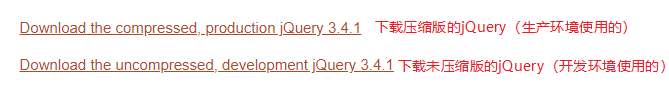

# jQuery-课堂笔记

## 一、简介

### 目标

* 了解jQuery的优点
* 能下载并引入jQuery

### 讲解

#### 1. 什么是jQuery

- jQuery：是一个优秀的JavaScript轻量级框架之一。兼容CSS3和各大浏览器（兼容性好），提供了dom、events、animate、ajax等的简易操作（操作简单），还有非常丰富的插件（有写好的功能代码）。

- jQuery宗旨是：write less, do more.
- jQuery本质是js，但是功能更强、更简洁。
- Mybatis（轻量）<===Hibernate（重量）

#### 2. 下载和引入

- 下载：www.jquery.com

  
  - jQuery 1.xxx：支持IE6、7、8
  - jQuery 2.xxx更高版本：不支持IE6、7、8

- 引入：在HTML里使用标签`script`引入js文件

```html
<script src="jQuery类库的路径"></script>
<script>
//使用jQuery
</script>
```

### 小结

* jQuery的优点：
  * 兼容性好
  * 操作简单
  * 有非常丰富的插件
* jQuery的本质：是js，只是比js更简单
* 在HTML里引入jQuery：

```html
<script src="js/jquery-3.4.1.min.js"></script>
```


## 二、js对象和jQuery对象转换

### 目标

* 能够进行js对象和jQuery对象的转换

### 讲解

* js对象：js语法提供的对象，或者使用js方法得到的对象

* jQuery对象：使用jQuery方法得到的对象


- js对象转jQuery对象：`$(js对象)`
- jQuery对象转js对象：`jQuery对象[索引]` 或者 `jQuery对象.get(索引)`

```js
//1.1 用js方式获取d1对象--js对象：js对象不能直接使用jQuery对象的方法，但可以转换成jQuery对象再用：穿马甲 $(js对象)
var d1Js = document.getElementById("d1");
var inner = $(d1Js).html();
alert(inner);


//jquery对象都是类数组，数组里的每个元素都是js对象

//1.2 用jquery方式获取d1对象--jQuery对象：jQuery对象不能直接使用js对象的属性，但可以转换成js对象再用：脱马甲 jQuery对象[索引]
var d1Jq = $("#d1");
var inner = d1Jq[0].innerHTML;
alert(inner);
```

### 小结

* 【掌握】js对象转jQuery对象：`$(js对象)`
* 【用的少】jQuery对象转js对象：`jQuery对象[索引]`

## 三、选择器【重点】

* jQuery实现功能只需要两步：
  * 找它：用选择器找
  * 搞它：用dom操作方法

### 目标

* 能够使用不同选择器，获取标签对象

### 分析

* jQuery里吸收了CSS选择器思想：
  * 基本选择器
  * 层级选择器
  * 属性选择器
  * 基本过滤选择器
  * 表单属性选择器


### 讲解

#### 1. 基本选择器【重点】

* CSS里的基本选择器：
  * 标签选择器：`div`表示选择所有的div元素
  * ID选择器：`#d1`表示选择id为d1的元素
  * 类选择器：`.c1`表示选择类名为c1的元素（class属性值为c1的）

| 选择器                                                  | 描述       |
| ------------------------------------------------------- | ---------- |
| `$("元素名称")`，比如：`$("div")`                       | 标签选择器 |
| `$("#id值")`，比如：`$("#d1")`                          | ID选择器   |
| `$(".类名")`，比如：`$(".c1")`                          | 类选择器   |
| `$("selector1, selector2, ...")`，比如：`$("div,span")` | 并集选择器 |

#### 2. 层级选择器

| 选择器     | 描述                                                         |
| ---------- | ------------------------------------------------------------ |
| `$("A B")` | 后代选择器，获取到A的后代元素B。比如：`$("div a")`找div的后代元素a |
| `$("A>B")` | 子选择器，获取到A的子元素B。比如：`$("div>a")`找div的子元素a |
|            |                                                              |
| `$("A+B")` | next选择器，获取A元素后边挨着的B元素（B是A挨着的弟弟）       |
| `$("A~B")` | siblings选择器，获取A元素后边同级所有的B元素（B是A的弟弟妹妹们） |

#### 3. 属性选择器

| 选择器            | 描述                                                         |
| ----------------- | ------------------------------------------------------------ |
| `$("A[attr]")`    | 获取 含有attr属性的 A元素。`$("input[class]")`，找含有class属性的input标签 |
| `$("A[attr=v]")`  | 获取 attr属性值等于v的 A元素。`$("input[type='text']")`，找文本框 |
| `$("A[][]...")`   | 复合属性选择器。`$("input[class][type='text']")`，找有class属性的文本框 |
|                   |                                                              |
| `$("A[attr!=v]")` | 获取 attr属性值不等于v的 A元素                               |
| `$("A[attr^=v]")` | 获取 attr属性值以v开头的 A元素                               |
| `$("A[attr$=v]")` | 获取 attr属性值以v结尾的 A元素                               |
| `$("A[attr*=v]")` | 获取 attr属性值里包含v的 A元素                               |

#### 4. 基本过滤选择器

* 通常是和其它选择器配合使用的，用于进行再次过滤

| 选择器           | 描述                                                         |
| ---------------- | ------------------------------------------------------------ |
| `:first`         | 获取第一个，`$("div:first")`找第一个div                      |
| `:last`          | 获取最后一个，`$("span:last")`找最后 一个span                |
| `:not(selector)` | 排除 selector的结果不要，`$("div:not(.cls)")`找div，但是不要.cls的 |
| `:even`          | 获取索引为偶数的，`$("div:even")`                            |
| `:odd`           | 获取索引为奇数的                                             |
| `:eq(n)`         | 获取索引等于n的                                              |
| `:gt(n)`         | 获取索引大于n的                                              |
| `:lt(n)`         | 获取索引小于n的                                              |
| `:header`        | 获取所有的标题，h1~h6                                        |
| `:animated`      | 获取正在运行的动画                                           |

> 针对前边的选择器选中的结果，进行再次过滤。比如：`$("div:even")`，先找到所有的div，每个div有自己的索引，获取索引为偶数的。 注意：不是标签在整个页面里的索引

#### 5. 表单属性选择器【重点】

| 选择器         | 描述                                                    |
| -------------- | ------------------------------------------------------- |
| `:enabled`     | 获取可用的表单项                                        |
| `:disabled`    | 获取不可用的表单项                                      |
| `:checked`★★★  | 获取被选中的radio（单选选项），或者checkbox（多选选项） |
| `:selected`★★★ | 获取被选中的**下拉选项option**                          |

* 什么样的表单项是可用的？什么样的表单项是禁用的？
  * 只要表单项上有属性`disabled`，这个表单项就是禁用的：值不可更改，这个表单项的值不会提交

### 小结

* 基本选择器【掌握】
  * `$("div")`：标签选择器，根据标签名称选择元素
  * `$("#div0")`：ID选择器，根据id值选择元素
  * `$(".cls")`：类选择器，根据类名选择元素
  * `$("#div0, .cls")`：并集选择器，多个选择器选中的结果都要
* 层级选择器
  * `$("div span")`：找div的后代span元素
  * `$("div>span")`：找div的子元素span
* 属性选择器
  * `$("div[name]")`：包含name属性的div元素
  * `$("div[name='d1']")`：name属性值为d1的div元素
* 基本过滤选择器
  * `:first`第一个， `:last`最后一个
  * `:not(选择器)`排除选择器的结果不要
  * `:even`索引为偶数的，`:odd`索引为奇数的
  * `:eq(n)`索引为n的，`:gt(n)`索引大于n的，`:lt(n)`索引小于n的
  * `:header`找所有的标题h1~h6
  * `:animated`找正在运动的动画
* 表单属性选择器
  * `:disabled`获取不可用的表单项
  * `:enabled`获取可用的表单项
  * 【掌握】`:checked`获取被选中的checkbox或radio
  * 【掌握】`:selected`获取被选中的下拉选项option


## 四、dom操作【重点】

### 1. 操作标签体

#### 目标

* 能够操作标签体内容
* 能够操作标签体文本内容
* 能够操作表单项的值

#### 讲解

* 标签体：开始标签和结束标签中间的内容

| 方法            | 参数 | 描述                    |
| --------------- | ---- | ----------------------- |
| `html([value])` |      | 获取/设置标签体         |
| `text([value])` |      | 获取/设置标签体里的文本 |
| `val([value])`  |      | 获取/设置表单项的值     |

* `html()`获取开始标签和结束标签里的**所有**内容；`text()`获取开始标签和结束标签里的**文本**内容
* `html(string)`设置的html代码会生效；`text(string)`设置了html代码不生效

```html
<input type="button" value="获取d1的标签体" id="btnGet">
<input type="button" value="设置d1的标签体" id="btnSet">
<div id="d1">
    <span>深圳黑马</span>
    JavaEE
</div>
<hr>
<input type="button" value="获取文本框的值" id="btn1">
<input type="button" value="设置文本框的值" id="btn5">


<script src="../js/jquery-3.3.1.min.js"></script>
<script>
    $("#btnGet").click(function () {
        //1. 获取d1的标签体所有内容：开始标签和结束标签中间的所有内容
        var v1 = $("#d1").html();
        //2. 获取d1的标签体文本内容：开始标签和结束标签中间的文本内容
        var v2 = $("#d1").text();

        alert(v1);
        alert(v2);
    });

    $("#btnSet").click(function () {
        //1. 设置d1的标签体内容：<h1>Hello Kitty</h1>。 覆盖式设置，html代码会生效
        //$("#d1").html("<h1>Hello Kitty</h1>");
        //2. 设置d1的标签体文本：<h1>Hello Kitty</h1>。覆盖式设置，html代码不生效
        $("#d1").text("<h1>Hello Kitty</h1>");
    });
    
    $("#btn1").click(function () {
        var v = $("#username").val();
        alert(v);
    });
    $("#btn2").click(function () {
        var v = $("#password").val();
        alert(v);
    });
</script>    
```

#### 小结

* `html()`：获取标签体里所有内容
* `text()`：获取标签体里文本内容
* `html(str)`：覆盖式设置标签体内容，设置的html代码会生效
* `text(str)`：覆盖式设置标签体内容，设置的html代码不生效
* `val()`：获取表单项的值
* `val(v)`：设置表单项的值


### 2. 操作属性

#### 目标

* 能够操作标签的属性
* 能够获取checked和selected属性值
* 完成全选全消的练习

#### 讲解

| 方法                  | 参数           | 描述            |
| --------------------- | -------------- | --------------- |
| `attr(name [,value])` | name：属性名称 | 获取/设置属性值 |
| `prop(name [,value])` |                | 获取/设置属性值 |

- 建议：
  - 如果要操作的是`checked`和`selected`属性(或者`disabled`)，必须使用`prop()`方法
  - 其它属性，优先使用`attr()`，如果不行，再使用`prop()`

```html
<input type="button" value="获取属性值" id="btn1">
<input type="button" value="设置属性值" id="btn2">
<br>
<input type="text" id="username" name="username" value="jack" ><br>
<input type="checkbox" id="agree" value="yes" checked>同意许可协议<br>

<script src="../js/jquery-3.4.1.min.js"></script>
<script>
    $("#btn1").click(function () {
        //获取username的name属性值
        let name = $("#username").attr("name");
        console.log(name);

        //获取username的disabled属性值
        let agree = $("#agree").prop("checked");
        console.log(agree);
    });

    $("#btn2").click(function () {
        //设置username的name属性值
        $("#username").attr("name", "realname");

        //设置username的disabled属性值
        $("#agree").prop("checked", false);
    });
</script>
```

#### 小结

* `attr(attrName)`：获取属性值
* `attr(attrName, attrValue)`：设置属性值
* `prop(attrName)`：获取属性值
* `prop(attrName, attrValue)`：设置属性值
* 如果要操作`selected, checked, disabled`等表示“是否”的属性，要使用`prop`方法；其它属性的操作优先使用attr，如果不行再用prop


### 3. 操作样式

#### 目标

* 能够直接操作标签的样式
* 完成隔行换色的练习

#### 讲解

| 方法                     | 参数           | 描述          |
| ------------------------ | -------------- | ------------- |
| `css(name [,value])`     | name：样式名称 | 获取/设置样式 |
| `addClass(className)`    |                | 添加类名      |
| `removeClass(className)` |                | 删除类名      |

```html
<head>
    <meta charset="UTF-8">
    <title>操作样式</title>
    <style>
        .cls{
            width:200px;
            height: 200px;
            background-color: green;
        }

        .cls2{
            width:200px;
            height: 200px;
            background-color: yellow;
        }
    </style>
</head>
<body>
<input type="button" value="获取样式" id="btn1">
<input type="button" value="设置样式" id="btn2">
<br>
<div id="d1" class="cls"></div>

<script src="../js/jquery-3.4.1.min.js"></script>
<script>
    $("#btn1").click(function () {
        let bgcolor = $("#d1").css("background-color");
        console.log(bgcolor);
    });

    $("#btn2").click(function () {
        $("#d1").css("background-color", "yellow");
    });

    //jQuery支持链式写法： jQuery对象.方法1().方法2().方法3().....方法n();
    $("#d1").mouseover(function () {
        $(this).addClass("cls2");
    }).mouseout(function () {
        $(this).removeClass("cls2");
    }).click(function(){
        console.log("点点点");
    });
</script>
```

#### 小结

* 直接操作样式
  * 获取样式：`css("CSS样式名")`
  * 设置样式：`css("CSS样式名", "样式值")`
* 通过类名间接操作样式：
  * 添加类名：`addClass("类名")`
  * 删除类名：`removeClass("类名")`


### 4. 操作标签

#### 目标

* 能够创建并插入标签
* 能够删除标签
* 完成左右选择的拓展练习

#### 讲解

| 方法                        | 参数                      | 描述                              |
| --------------------------- | ------------------------- | --------------------------------- |
| `$("完整html代码")`         |                           | 创建标签。`$("<li>WOW</li>")`     |
| `parent.append(element)`    | element：要插入的标签对象 | 把element作为小儿子插入进去       |
| `element.appendTo(parent)`  |                           | 把element作为小儿子插入到parent里 |
| `parent.prepend(element)`   |                           | 把element作为大儿子插入进去       |
| `element.prependTo(parent)` |                           | 把element作为大儿子插入到parent里 |
| `ele.before(element)`       |                           | 把element作为哥哥插入进去         |
| `ele.after(element)`        |                           | 把element作为弟弟插入进去         |
| `remove()`                  |                           | 删除元素                          |
| `empty()`                   |                           | 清空元素                          |

* `append(), appendTo(), preprend(), prependTo()`是剪切式移动

#### 小结

* 创建标签：`$("完整的html代码")`。创建出来的标签，不在dom树上，所以是不生效的
* 插入标签：
  * `标签对象.appendTo("父标签选择器")`：把标签插入到父标签内部最后 
  * `标签对象.prependTo("父标签选择器")`：把标签插入到父标签内部最前
* 删除标签
  * `remove()`：删除标签本身和里边所有的内容
  * `empty()`：清除标签内容，但是标签本身保留 

## 五、事件

### 基本事件绑定【掌握】

#### 目标

* 了解jquery的常用事件
* 能够使用jQuery绑定事件

#### 讲解

- jQuery绝大多数的事件写法：
  - js事件名称去掉on
  - 事件变成方法
  - 响应行为作为方法的实参

| js事件写法                     | jQuery事件写法                  |
| ------------------------------ | ------------------------------- |
| `onclick`单击                  | `click(fn)`                     |
| `ondblclick`双击               | `dblclick(fn)`                  |
| `onsubmit`表单提交             | `submit(fn)`                    |
| `onchange`域内容改变           | `change(fn)`                    |
| `onload`加载完成               | `$(fn)`,`$(document).ready(fn)` |
| `onfocus`获取焦点              | `focus(fn)`                     |
| `onblur`失去焦点               | `blur(fn)`                      |
| `onkeydown`键盘按键按下        | `keydown(fn)`                   |
| `onkeypress`键盘按键按下、按住 | `keypress(fn)`                  |
| `onkeyup`键盘按键弹起          | `keyup(fn)`                     |
| `onmousedown`鼠标按键按下      | `mousedown(fn)`                 |
| `onmouseup`鼠标按键弹起        | `mouseup(fn)`                   |
| `onmouseover`鼠标移入          | `mouseover(fn)`                 |
| `onmouseout`鼠标移出           | `mouseout(fn)`                  |
| `onmousemove`鼠标移动          | `mousemove(fn)`                 |

#### 小结


### 事件绑定与解绑

#### 目标

* 能够使用on函数绑定事件，使用off函数解绑

#### 讲解

- 绑定事件：

  * 事件名称：不带on，比如：click, dblclick

  ```js
  $("#div1").on("click", function(){
      alert("点我干嘛");
  });
  
  //两种方式绑定事件，结果是一样的
  $("#div1").click(function(){
      alert("点我干嘛");
  });
  ```

- 解绑事件：

  ```js
  $("#div1").off("click");
  ```

- 注意：

  - 事件名称不带on
  - off函数只能解绑： jQuery方式绑定的事件

#### 小结

* 事件绑定：
  * 普通方式`标签对象.事件方法(function(){})`
  * on方法：`标签对象.on("click", function(){})`
* 事件解绑：
  * `标签对象.off("事件名称")`

#### 拓展：未来元素的事件

- 未来元素：事件绑定之后，再添加的新元素。普通方式是不能给未来元素绑定事件的

- 给未来元素绑定事件：`jQuery对象.on("事件名称","选择器", function(){})`

  ```js
  //给foodList清单下，所有的li绑定事件：单击弹窗（哪怕li是未来元素，仍然可以绑定成功）
  $("#foodList").on("click", "li", function(){
      alert(this.innerHTML);
  });
  ```

- 给未来元素解绑事件：`jQuery对象.off("事件名称","选择器")`

  ```js
  //要给foodList清单下，所有的li解绑事件：单击事件（哪怕是未来元素的事件，也可以解绑）
  $("#foodList").off("click", "li");
  ```


## 六、简易动画【了解】

### 目标

* 了解jQuery的简易动画效果
* 完成定时广告的练习

### 讲解

- 显示/隐藏

| 方法                | 参数                     | 描述                                         |
| ------------------- | ------------------------ | -------------------------------------------- |
| `show([ms[,fn]])`   | ms：毫秒值；fn：函数对象 | 花费ms毫秒值显示完成，完成之后执行fn函数     |
| `hide([ms[,fn]])`   | ms：毫秒值；fn：函数对象 | 花费ms毫秒值隐藏完成，完成之后执行fn函数     |
| `toggle([ms[,fn]])` | ms：毫秒值；fn：函数对象 | 切换。如果是显示的就隐藏；如果是隐藏的就显示 |

- 滑动显示/滑动隐藏

| 方法                     | 参数 | 描述                                             |
| ------------------------ | ---- | ------------------------------------------------ |
| `slideDown([ms[,fn]])`   |      | 滑动显示（向下滑动）                             |
| `slideUp([ms[,fn]])`     |      | 滑动隐藏（向上滑动）                             |
| `slideToggle([ms[,fn]])` |      | 滑动切换。如果是显示的就隐藏；如果是隐藏的就显示 |

- 淡入显示/淡出隐藏

| 方法                    | 参数 | 描述                                                 |
| ----------------------- | ---- | ---------------------------------------------------- |
| `fadeIn([ms[,fn]])`     |      | 淡入显示                                             |
| `fadeOut([ms[,fn]])`    |      | 淡出隐藏                                             |
| `fadeToggle([ms[,fn]])` |      | 淡入淡出切换。如果是显示的就隐藏；如果是隐藏的就显示 |

### 小结

* `show()/hide()/toggle()`
* `slideDown()/slideUp()/slideToggle()`
* `fadeIn()/fadeOut()/fadeToggle()`

## 七、循环遍历【掌握】

### 目标

* 掌握js的两种循环遍历
* 理解jQuery的两种循环遍历
* 完成省市联动的练习

### 讲解

#### 1. js的循环遍历（重点）

- fori 循环

  ```js
  for (let i = 0; i < items.length; i++) {
      let item = items[i];
      alert(item.innerHTML);
  }
  ```

- for of循环★★★（ES6提供的）ECMAScript 6.0

  ```js
  for(let item of items){
      alert(item.innerHTML);
  }
  ```

- 注意：

  - fori和forof循环，可以循环任意能够循环的对象。

#### 2. jQuery的循环遍历

- jQuery框架的each方法

  ```js
  var $items = $("li"); //jQuery对象是数组，数组里每个元素都是js对象
  //1. 使用jQuery框架的each方法
  $.each($items, function(index, element){
      //index：当前索引； element：当前对象，是js对象
      alert("索引是：" + index + ", 当前元素内容是：" + element.innerHTML);
  })
  ```

- **jQuery对象**的each方法（每个jQuery对象都有each方法，是循环jQuery对象自己的）

  ```js
  var $items = $("li");
  //2. 使用jQuery对象的each方法。循环jQuery对象自己的
  $items.each(function(index, element){
      //index：当前索引； element：当前对象，是js对象
      alert("索引是：" + index + ", 当前元素内容是：" + element.innerHTML);
  });
  ```

- 注意：

  - jQuery框架的全局each方法，可以循环任意能够循环的对象

  - jQuery对象的each方法，只有jQuery对象才能够使用。如果js对象想用，就必须要转换成jQuery对象

  - 函数对象可以没有形参，使用this得到当前元素对象

    ```js
    $items.each(function(){
        //this：等价于element，是当前对象，是js对象
        alert("当前元素内容是：" + this.innerHTML);
    });
    
    $.each($items, function(){
        //this：等价于element，是当前对象，是js对象
        alert("当前元素内容是：" + this.innerHTML);
    })
    ```

### 小结


# 复习上午内容

* jQuery本质是js
  * js对象转jQuery对象：`$(js对象)`
  * jQuery对象转js对象：`jQuery对象[索引]`
* 选择器
  * 基本选择器
    * `$("div"), $("#d1"),  $(".cls"),  $("span, #d1, .cls")`
  * 层级选择器
    * `$("div span")`  空格表示找后代
    * `$("div>span")` >表示找子元素
  * 属性选择器
    * `$("input[class]")`
    * `$("input[class='c1']")`
    * `$("input[][]...")`
  * 基本过滤选择器
    * `:first, :last,  :not(selector)`
    * `:even, :odd, :eq(n), :gt(n), :lt(n)`
    * `:header,  :animated`
  * 表单属性选择器
    * `:enabled,  :disabled`
    * `:checked`获取被选中的radio或者checkbox
    * `:selected`获取被选中的下拉选项option
* dom操作方法
  * 操作标签体：
    * `html()`：无参表示获取标签体所有内容；有参表示覆盖设置标签体内容，设置的html代码会生效
    * `text()`：无参表示获取标签体文本内容；有参表示覆盖设置标签体内容，设置的html代码无效
  * 操作表单项的值：`val()`
    * 无参表示获取表单项的值
    * 有参表示设置表单项的值
  * 操作属性：
    * `prop(), attr()`
    * 如果操作的是selected、checked、disabled，要使用prop方法
    * 其它属性的操作，优先使用attr，如果不行再用prop
  * 操作样式：
    * `css()`直接操作样式
    * `addClass()`：添加类名
    * `removeClass()`：删除类名