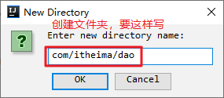
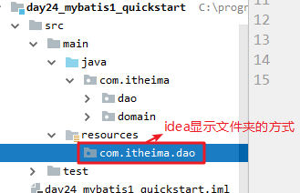
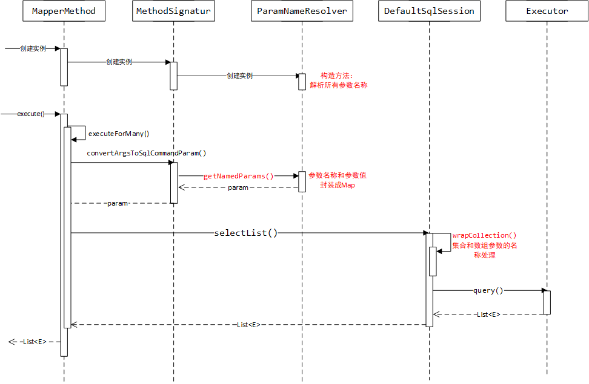

# Mybatis1-课堂笔记

* Maven相关的概念

  * Maven的作用：依赖管理，项目构建
  * 坐标的概念：被Maven管理的每个项目必须有的唯一标识。groupId + artifactId + version
  * 仓库的分类：本地仓库，远程仓库（私服），中央仓库

* Maven项目构建：

  * 常用命令：`mvn clean, mvn compile, mvn test, mvn package, mvn instll`
  * 生命周期：
    * 清理生命周期：clean
    * 默认生命周期：compile -> test -> package -> install -> deploy
    * 站点生命周期：site

* Maven依赖管理

  * 添加依赖

  ```xml
  <dependency>
  	<groupId></groupId>
      <artifactId></artifactId>
      <version></version>
      <scope>依赖范围</scope>
  </dependency>
  ```

  * 依赖范围
    * compile：默认的，编译有效，运行有效，单元测试有效
    * runtime：编译无效，运行有效
    * provided：编译有效，运行无效
    * test：单元测试有效
    * system：引入仓库之外的本地jar包

* Lombok：`@Data`注解，自动生成构造方法、get/set方法、toString方法.....


* SSM：SpringMVC + Spring + Mybatis
  * 搭建环境->单表CURD->动态拼接SQL语句->多表查询->懒加载

## 一、Mybatis概述

### 1. 框架简介

#### 1.1 什么是框架

​	框架：是**整个或部分应用的可重用设计，是可定制化的应用骨架**。它可以帮开发人员简化开发过程，提高开发效率。

* 和功能无关，而又不得不写的代码：创建QueryRunner、执行SQL语句、处理执行结果，接收参数、封装实体、处理结果  ===>封装成了框架
* 和功能相关的业务代码：编写SQL语句，处理功能逻辑 ===>在框架的基础上，编写业务功能代码

​	简而言之，框架是一个应用系统的半成品，开发人员在框架的基础上，根据业务需求开发功能。即：别人搭台，你唱戏。

* 框架：让开发人员的代码**更简单**，功能更强

#### 1.2 框架解决了什么问题

​	**框架主要是解决了技术整合问题**

​	一个应用系统，必定要选用大量的技术来完成业务需求，实现功能。这就导致应用系统依赖于具体的技术，一旦技术发生了变化或者出现问题，会对应用系统造成直接的冲击，这是应该避免的。

​	框架的出现，解决了这个问题：框架是技术的整合。如果使用了框架，在框架基础上进行开发，那么开发人员就可以直接调用框架的API来实现功能，而不需要关注框架的底层具体使用了哪些技术。这就相当于框架“屏蔽”了具体的技术，实现了应用系统功能和技术的解耦。

​	**框架一般处于低层应用平台（如JavaEE）和高层业务逻辑之间**

#### 1.3 有哪些常见的框架

​	每个框架都是要解决一些具体的问题的，我们可以从JavaEE的三层架构，来说一下常见的框架有哪些。

1. **Mybatis**：作用在dao层，负责数据库访问的框架。

   ​	它原本是Apache的一个开源项目ibatis，后来迁移到了Google code，并改名为Mybatis；之后又迁移到了github上。

   ​	它是一个优秀的Java轻量级dao层框架，对JDBC进行了封装，使开发人员只需要关注SQL语句，而不需要关注JDBC的API执行细节。

   SQL：面向关系的

2. **Hibernate**：作用在dao层，负责数据库访问的框架。

   ​	Hibernate是一个**完全面向对象**的Dao层框架，封装程度非常高，开发人员可以完全以面向对象的方式操作数据库，甚至不需要编写SQL语句。

   ​	但是，正因为Hibernate的封装程度过高，导致它的执行效率受到了影响，是重量级框架。目前在国内使用的越来越少了。

3. **SpringMVC**：作用在web层，负责和客户端交互的框架。

   ​	SpringMVC是Spring Framework的后续产品，受益于Spring框架的流行，并且因为SpringMVC使用简单、和Spring整合简单，导致SpringMVC框架在国内使用的也越来越多。

4. **Struts1/Struts2**：作用在web层，负责和客户端交互的框架。

   ​	Struts1是比较老的框架，目前已经基本不使用了。

   ​	Struts2目前使用的也越来越少，逐步被SpringMVC代替

5. **Spring**：不是作用在某一层，而是实现web层、Service层、Dao层之间解耦的框架，是三层之间的粘合剂

   ​	Spring框架是为了解决应用开发的复杂性而创建的，任何Java应用都可以从Spring中受益。Spring是一个轻量级控制反转（IoC)和面向切面（AOP）的容器框架。

#### 小结：

* SSH：Struts1/2   + Spring  + Hibernate
* SSM：SpringMVC+Spring  + Mybatis

### 2. Mybatis简介

#### 2.1 JDBC的问题

1. 硬编码问题
   - 数据库连接信息的硬编码
   - SQL语句和参数硬编码
   - 结果集封装硬编码
2. 大量的重复代码
3. 性能问题

```java
//注册驱动 
//获取连接
//创建statement/预编译对象
//执行SQL语句
//处理结果
//释放资源
```

* DBUtils + 连接池：解决了jdbc的一些问题
  * SQL语句是写死的，封装的结果也是代码里写死的：硬编码问题
  * 功能不够强

#### 2.2 Mybatis介绍

​	Mybatis是一个优秀的Java轻量级持久层框架。

- 它内部封装了JDBC，使开发人员**只需要关心SQL语句**，而不需要处理繁琐的JDBC步骤
- 它采用了ORM思想，解决了实体和数据库映射的问题。只要提供好sql语句，**配置**了映射，Mybatis会自动根据参数值动态生成SQL，执行SQL并把结果封装返回给我们。
- 它支持XML和注解两种方式配置映射。

#### 2.3 ORM思想

​	ORM：Object Relational Mapping，对象关系映射思想。指把Java对象和数据库的表和字段进行关联映射，从而达到操作Java对象，就相当于操作了数据库。查询了数据库，自动封装成JavaBean对象

#### 小结：


### 3. Mybatis下载

- Mybatis官网：<http://www.mybatis.org/mybatis-3/zh/index.html>
- Mybatis下载地址：<https://github.com/mybatis/mybatis-3/releases/download/mybatis-3.4.6/mybatis-3.4.6.zip>
- Mybatis源码下载：<https://github.com/mybatis/mybatis-3/archive/mybatis-3.4.6.zip>


## 二、Mybatis快速入门【重点】

### 1. 需求描述

查询所有用户信息，获取用户集合`List<User>`

### 2. 准备工作

#### 2.1 统一开发环境

1. 初始化数据库：执行数据库脚本《资料/mybatisdb.sql》
2. 准备开发环境：jdk1.8， Maven和本地仓库，idea

#### 2.2 实现步骤

1. 创建Maven项目，准备JavaBean
2. 编写Mybatis的代码，查询所有用户
3. 编写测试代码

### 3. 入门案例

#### 3.1 创建Maven项目，准备JavaBean

##### 1) 创建Maven的java项目

​	因为只涉及Dao层，不涉及客户端，所以只要创建Java项目即可。项目坐标信息如下：

```xml
	groupId:         com.itheima
	artifactId:      mybatis01_quickstart
	version:         1.0-SNAPSHOT
	packing:         jar
```

##### 2) 在pom.xml中添加依赖

```xml
<dependencies>
    <!--Junit单元测试-->
    <dependency>
        <groupId>junit</groupId>
        <artifactId>junit</artifactId>
        <version>4.12</version>
        <scope>test</scope>
    </dependency>
    <!--MySql的数据库驱动-->
    <dependency>
        <groupId>mysql</groupId>
        <artifactId>mysql-connector-java</artifactId>
        <version>5.1.46</version>
    </dependency>
    <!--Mybatis的jar包-->
    <dependency>
        <groupId>org.mybatis</groupId>
        <artifactId>mybatis</artifactId>
        <version>3.4.6</version>
    </dependency>
    <!--Mybatis依赖的日志包-->
    <dependency>
        <groupId>log4j</groupId>
        <artifactId>log4j</artifactId>
        <version>1.2.17</version>
    </dependency>
    <!--lombok-->
    <dependency>
        <groupId>org.projectlombok</groupId>
        <artifactId>lombok</artifactId>
        <version>1.18.10</version>
        <scope>provided</scope>
    </dependency>
</dependencies>
```

##### 3) 创建JavaBean

```java
public class User {
    private Integer id;
    private String username;
    private Date birthday;
    private String sex;
    private String address;

    //get/set...
    //toString...
}
```

#### 3.2 编写Mybatis的代码，查询所有用户

##### 1) 创建dao接口（映射器）

​	在Mybatis里，把dao层的接口称之为**映射器**（取  调用接口的方法即相当于操作数据库 之意）。

​	映射器的类名，可以叫`XXXMapper`，也可以叫`XXXDao`。我们这里按照之前的习惯，取名`UserDao`

​	注意：只要创建接口即可，不需要创建接口的实现类

```java
public interface UserDao {
    List<User> queryAll();  
}
```

##### 2) 准备映射文件xml

注意：

1. 映射文件名称要和映射器类名一样。例如：映射器叫UserDao，那么配置文件就叫UserDao.xml

2. 映射文件位置要和映射器位置一样。例如：映射器在com.itheima.dao里，那么配置文件就应该在resources的com/itheima/dao目录下

   

   

```xml
<?xml version="1.0" encoding="utf-8"?>
<!DOCTYPE mapper
        PUBLIC "-//mybatis.org//DTD Mapper 3.0//EN"
        "http://mybatis.org/dtd/mybatis-3-mapper.dtd">
<!--namespace：给哪个接口配置的映射，写接口的全限定类名-->
<mapper namespace="com.itheima.dao.UserDao">
    <!--select标签：表示要执行查询语句； id：给接口里哪个方法配置的，写方法名；resultType：结果集封装类型-->
    <select id="queryAll" resultType="com.itheima.domain.User">
        select * from user
    </select>
</mapper>
```

##### 3) 准备Mybatis的日志配置文件

​	Mybatis支持使用log4j输出执行日志信息，但是需要我们提供log4j的配置文件：`log4j.properties`

注意：

1. 如果没有log4j.properties，不影响Mybatis的功能，只是没有详细日志而已
2. 如果需要日志的话，要把log4j.properties文件放到resources目录下。log4j.properties内容如下：

```properties
# Set root category priority to INFO and its only appender to CONSOLE.
#log4j.rootCategory=INFO, CONSOLE            debug   info   warn error fatal
log4j.rootCategory=debug, CONSOLE, LOGFILE

# CONSOLE is set to be a ConsoleAppender using a PatternLayout.
log4j.appender.CONSOLE=org.apache.log4j.ConsoleAppender
log4j.appender.CONSOLE.layout=org.apache.log4j.PatternLayout
log4j.appender.CONSOLE.layout.ConversionPattern=%d{ISO8601} %-6r [%15.15t] %-5p %30.30c %x - %m\n
```

##### 4) 准备Mybatis的全局配置文件xml

注意：

1. 全局配置文件的名称随意，我们习惯叫 SqlMapConfig.xml
2. 全局配置文件的位置随意，我们习惯放到resources的根目录下

```xml
<?xml version="1.0" encoding="UTF-8"?>
<!DOCTYPE configuration
        PUBLIC "-//mybatis.org//DTD Config 3.0//EN"
        "http://mybatis.org/dtd/mybatis-3-config.dtd">
<!--mybatis的全局配置文件，主要配置数据库连接信息-->
<configuration>
    <!--配置默认的数据库环境-->
    <environments default="mysql_mybatis">
        <!--定义一个数据库连接环境-->
        <environment id="mysql_mybatis">
            <!--设置事务管理方式，固定值JDBC-->
            <transactionManager type="JDBC"/>
            <!--设置数据源，POOLED，UNPOOLED，JNDI，我们使用POOLED-->
            <dataSource type="POOLED">
                <property name="driver" value="com.mysql.jdbc.Driver"/>
                <property name="url" value="jdbc:mysql:///mybatis"/>
                <property name="username" value="root"/>
                <property name="password" value="root"/>
            </dataSource>
        </environment>
    </environments>

    <!--  !!!配置映射文件的位置!!!!!!!!!!!!!!这一步千万不要忘记!!!!!!!!!!!!!!  -->
    <mappers>
        <mapper resource="com/itheima/dao/UserDao.xml"/>
    </mappers>
</configuration>
```

#### 3.3 编写测试代码

```java
	@Test
    public void testQuickStart() throws IOException {
        //1. 读取全局配置文件SqlMapConfig.xml
        InputStream is = Resources.getResourceAsStream("SqlMapConfig.xml");
        //2. 创建SqlSessionFactoryBuilder构造者对象
        SqlSessionFactoryBuilder builder = new SqlSessionFactoryBuilder();
        //3. 使用构造者builder，根据配置文件的信息is，构造一个SqlSessionFactory工厂对象
        SqlSessionFactory factory = builder.build(is);
        //4. 使用工厂对象factory，生产一个SqlSession对象
        SqlSession session = factory.openSession();
        //5. 使用SqlSession对象，获取映射器UserDao接口的代理对象
        UserDao dao = session.getMapper(UserDao.class);
        //6. 调用UserDao代理对象的方法，查询所有用户
        List<User> users = dao.queryAll();
        for (User user : users) {
            System.out.println(user);
        }
        //7. 释放资源
        session.close();
        is.close();
    }
```

### 小结

* 准备工作：创建Maven的Java项目，导入依赖坐标，创建JavaBean

* 使用Mybatis：

  1. 创建映射器接口：dao层的接口，只要接口不要实现类
  2. 创建映射文件：每个映射器都要有自己的映射文件
     * 映射文件名称和映射器名称相同
     * 映射文件位置和映射器位置相同
  3. 创建全局配置文件：名称和位置随意
     * 配置数据库环境
     * 配置所有映射文件的路径

* 功能测试

  ```java
  //1.加载配置文件得到InputStream
  InputStream is = Resources.getResourceAsStream("SqlMapConfig.xml");
  
  //2.创建SqlSessionFactory工厂对象
  SqlSessionFactory factory = new SqlSessionFactoryBuilder().build(is);
  
  //3.从工厂里得到一个SqlSession对象
  SqlSession session = factory.openSession();
  
  //4.获取映射器接口的代理对象
  UserDao dao = session.getMapper(UserDao.class);
  List<User> userList = dao.queryAll();
  
  //5.释放资源
  session.close();
  is.close();
  ```

* Mybatis涉及的设计模式，常见的有：

```
 *      构造者模式：把一个对象的复杂构造过程隐藏起来，根据配置文件定制生成需要的对象
 		SqlSessionFactory factory = new SqlSessionFactoryBuilder().build(is);
 
 *      工厂模式：用于批量生产对象，目的是解耦==>Spring框架
 		SqlSession session = factory.openSession();
 
 *      代理模式：当不能、或不方便直接操作某一对象时，就可以通过代理对象间接操作
 		UserDao userDao = session.getMapper(UserDao.class);
```


## 三、Mybatis实现CURD【重点】

### 1. 需求说明

针对user表进行CURD操作：

- 查询全部用户，得到`List<User>`（上节课快速入门已写过，略）
- 保存用户（新增用户）
- 修改用户
- 删除用户
- 根据主键查询一个用户，得到`User`
- 模糊查询
- 查询数量

### 2. 准备Mybatis环境

#### 2.1 创建Maven项目，准备JavaBean

##### 1) 创建Maven的Java项目，坐标为：

```xml
    <groupId>com.itheima</groupId>
    <artifactId>day47_mybatis01_curd</artifactId>
    <version>1.0-SNAPSHOT</version>
    <packaging>jar</packaging>
```

##### 2) 在pom.xml中添加依赖：

```xml
<dependency>
    <groupId>junit</groupId>
    <artifactId>junit</artifactId>
    <version>4.12</version>
</dependency>
<dependency>
    <groupId>mysql</groupId>
    <artifactId>mysql-connector-java</artifactId>
    <version>5.1.46</version>
</dependency>
<dependency>
    <groupId>log4j</groupId>
    <artifactId>log4j</artifactId>
    <version>1.2.17</version>
</dependency>
<dependency>
    <groupId>org.mybatis</groupId>
    <artifactId>mybatis</artifactId>
    <version>3.4.6</version>
</dependency>
```

##### 3) 创建JavaBean

```java
public class User {
    private Integer id;
    private String username;
    private Date birthday;
    private String sex;
    private String address;

    //get/set...
    //toString...
}
```

#### 2.2 准备Mybatis的映射器和配置文件

##### 1) 创建映射器接口UserDao

```java
public interface UserDao {
}
```

##### 2) 创建映射文件UserDao.xml

```xml
<?xml version="1.0" encoding="utf-8"?>
<!DOCTYPE mapper
        PUBLIC "-//mybatis.org//DTD Mapper 3.0//EN"
        "http://mybatis.org/dtd/mybatis-3-mapper.dtd">
<mapper namespace="com.itheima.dao.UserDao">
</mapper>
```

##### 3) 创建Mybatis的全局配置文件

```xml
<?xml version="1.0" encoding="UTF-8"?>
<!DOCTYPE configuration
        PUBLIC "-//mybatis.org//DTD Config 3.0//EN"
        "http://mybatis.org/dtd/mybatis-3-config.dtd">
<configuration>
    <environments default="mysql_mybatis">
        <environment id="mysql_mybatis">
            <transactionManager type="JDBC"/>
            <dataSource type="POOLED">
                <property name="driver" value="com.mysql.jdbc.Driver"/>
                <property name="url" value="jdbc:mysql:///mybatis"/>
                <property name="username" value="root"/>
                <property name="password" value="root"/>
            </dataSource>
        </environment>
    </environments>
    <mappers>
        <mapper resource="com/itheima/dao/UserDao.xml"/>
    </mappers>
</configuration>
```

##### 4) 准备log4j.properties日志配置文件

```properties
# Set root category priority to INFO and its only appender to CONSOLE.
#log4j.rootCategory=INFO, CONSOLE            debug   info   warn error fatal
log4j.rootCategory=debug, CONSOLE

# Set the enterprise logger category to FATAL and its only appender to CONSOLE.
log4j.logger.org.apache.axis.enterprise=FATAL, CONSOLE

# CONSOLE is set to be a ConsoleAppender using a PatternLayout.
log4j.appender.CONSOLE=org.apache.log4j.ConsoleAppender
log4j.appender.CONSOLE.layout=org.apache.log4j.PatternLayout
log4j.appender.CONSOLE.layout.ConversionPattern=%d{ISO8601} %-6r [%15.15t] %-5p %30.30c %x - %m\n
```

#### 2.3 准备单元测试类

在单元测试类中准备好@Before、@After的方法代码备用。编写完成一个功能，就增加一个@Test方法即可。

代码如下：

```java
public class MybatisCURDTest {
    private InputStream is;
    private SqlSession session;
    private UserDao dao;

    @Before
    public void init() throws IOException {
        is = Resources.getResourceAsStream("SqlMapConfig.xml");
        SqlSessionFactoryBuilder builder = new SqlSessionFactoryBuilder();
        SqlSessionFactory factory = builder.build(is);
        session = factory.openSession();
        dao = session.getMapper(UserDao.class);
    }

    @After
    public void destory() throws IOException {
        //释放资源
        session.close();
        is.close();
    }
}
```

### 3. 编写代码实现需求

#### 3.1 保存/新增用户

##### 1) 在映射器UserDao中增加方法

```java
void save(User user);
```

##### 2) 在映射文件UserDao.xml中添加statement

```xml
<!--parameterType：是方法的参数类型，写全限定类名-->
<insert id="save" parameterType="com.itheima.domain.User">
    <!-- 
            selectKey标签：用于向数据库添加数据之后，获取最新的主键值
                resultType属性：得到的最新主键值的类型
                keyProperty属性：得到的最新主键值，保存到JavaBean的哪个属性上
                order属性：值BEFORE|AFTER，在insert语句执行之前还是之后，查询最新主键值。MySql是AFTER
         -->
    <selectKey resultType="int" keyProperty="id" order="AFTER">
        select last_insert_id()
    </selectKey>

    insert into user (id, username, birthday, address, sex) 
    values (#{id}, #{username}, #{birthday},#{address},#{sex})
</insert>
```

> 注意：
>
> ​	SQL语句中#{}代表占位符，相当于预编译对象的SQL中的?，具体的值由User类中的属性确定

##### 3) 在单元测试类中编写测试代码

```java
    @Test
    public void testSaveUser(){
        User user = new User();
        user.setUsername("tom");
        user.setAddress("广东深圳");
        user.setBirthday(new Date());
        user.setSex("男");

        System.out.println("保存之前：" + user);//保存之前，User的id为空
        dao.save(user);
        session.commit();//注意：必须要手动提交事务
        System.out.println("保存之后：" + user);//保存之后，User的id有值
    }
```

> 注意：<span style="color:red;">执行了DML语句之后，一定要提交事务：session.commit();</span>

##### 4) 小结


#### 3.2 修改用户

##### 1) 在映射器UserDao中增加方法

```java
void edit(User user);
```

##### 2) 在映射文件UserDao.xml中添加statement

```xml
<update id="edit" parameterType="com.itheima.domain.User">
    update user set username = #{username}, birthday = #{birthday}, 
    address = #{address}, sex = #{sex} where id = #{id}
</update>
```

##### 3) 在单元测试类中编写测试代码

```java
@Test
public void testEditUser(){
    User user = new User();
    user.setId(50);
    user.setUsername("jerry");
    user.setAddress("广东深圳宝安");
    user.setSex("女");
    user.setBirthday(new Date());

    dao.edit(user);
    session.commit();
}
```

> 注意：<span style="color:red;">执行了DML语句之后，一定要提交事务：session.commit();</span>

##### 4) 小结


#### 3.3. 删除用户

##### 1) 在映射器UserDao中增加方法

```java
void delete(Integer id);
```

##### 2) 在映射文件UserDao.xml中增加statement

```xml
<delete id="delete" parameterType="int">
    delete from user where id = #{id}
</delete>
```

> 注意：
>
> ​	<span style="color:red;">如果只有一个参数，且参数是简单类型的，那么#{id}中的id可以随意写成其它内容，例如：#{abc}</span>
>
> 简单类型参数：
>
> ​	int, double, short, boolean, ...   或者：java.lang.Integer, java.lang.Double, ...
>
> ​	string 或者 java.lang.String

##### 3) 在单元测试类中编写测试代码

```java
@Test
public void testDeleteUser(){
    dao.delete(50);
    session.commit();
}
```

> 注意：<span style="color:red;">执行了DML语句之后，一定要提交事务：session.commit();</span>

##### 4) 小结


#### 3.4 根据主键查询一个用户

##### 1) 在映射器UserDao中增加方法

```java
User findById(Integer id);
```

##### 2) 在映射文件UserDao.xml中增加statement

```xml
<select id="findById" parameterType="int" resultType="com.itheima.domain.User">
    select * from user where id = #{id}
</select>
```

##### 3) 在单元测试类中编写测试代码

```java
@Test
public void testFindUserById(){
    User user = dao.findById(48);
    System.out.println(user);
}
```

##### 4) 小结


#### 3.5 模糊查询

##### 1 使用#{}方式进行模糊查询

###### 1) 在映射器UserDao中增加方法

```java
/**
 * 使用#{}方式进行模糊查询
 */
List<User> findByUsername1(String username);
```

###### 2) 在映射文件UserDao.xml中增加statement

```xml
<select id="findByUsername1" parameterType="string" resultType="com.itheima.domain.User">
    select * from user where username like #{username}
</select>
```

> 注意：只有一个参数，且是简单参数时， #{username}中的username可以写成其它任意名称

###### 3) 在单元测试类中编写测试代码

```java
/**
 * 使用#{}方式进行模糊查询--单元测试方法
 */
@Test
public void testFindUserByUsername1(){
    List<User> users = dao.findByUsername1("%王%");
    for (User user : users) {
        System.out.println(user);
    }
}
```

> 注意：模糊查询的条件值，前后需要有%

##### 2 使用${value}方式进行模糊查询

###### 1) 在映射器UserDao中增加方法

```java
/**
 * 使用${value}方式进行模糊查询
 */
List<User> findByUsername2(String username);
```

###### 2) 在映射文件UserDao.xml中增加statement

```xml
<select id="findByUsername2" parameterType="string" resultType="com.itheima.domain.User">
   select * from user where username like '%${value}%'
</select>
```

> 注意：
>
> ​	${value}是固定写法，不能做任何更改
>
> ​	在SQL语句中已经加了%，那么在测试代码中，传递参数值时就不需要再加%了

###### 3) 在单元测试类中编写测试代码

```java
/**
 * 使用${value}方式进行模糊查询--单元测试方法
 */
@Test
public void testFindUserByUsername2(){
    List<User> users = dao.findByUsername2("王");
    for (User user : users) {
        System.out.println(user);
    }
}
```

> 注意：SQL语句中已经加了%， 参数值前后不需要再加%

##### 3 ==#{}和${value}的区别（面试题）==

- `#{}`：表示一个占位符，相当于预编译对象的SQL中的?

  - 可以有效防止SQL注入；
  - Mybatis会自动进行参数的Java类型和JDBC类型转换；
  - `#{}`写的是属性名称。如果只有一个参数并且是简单类型，里边可以是value或者其它名称

  ```Text
  映射文件中的SQL：select * from user where username like #{username}
  单元测试中传递实参：%王%
  
  最终执行的SQL：select * from user where username like ?
  参数值：%王%
  ```

- `${}`：表示拼接SQL串，相当于把实际参数值，直接替换掉`${}`

  - 不能防止SQL注入
  
  - Mybatis不进行参数的Java类型和JDBC类型转换

  - `${}`写的是属性名称。如果只有一个参数并且是简单类型，`${value}`中只能是value，不能是其它名称
  
    (Mybatis3.4 里存在这种现象，3.5没有了)
  
  ```text
  映射文件中的SQL：select * from user where username like '%${value}%'
  单元测试中传递实参：王
  
  最终执行的SQL：select * from user where username like '%王%'
  ```

##### 4 小结


#### 3.6 查询数量（聚合函数）

##### 1) 在映射器UserDao中增加方法

```java
Integer findTotalCount();
```

##### 2) 在映射文件中UserDao.xml增加statement

```xml
<select id="findTotalCount" resultType="int">
    select count(*) from user
</select>
```

##### 3) 在单元测试类中编写测试代码

```java
@Test
public void testFindTotalCount(){
    Integer totalCount = dao.findTotalCount();
    System.out.println(totalCount);
}
```

##### 4) 小结


## 四、Mybatis的参数和结果集

### 1. OGNL表达式

​	OGNL：Object Graphic Navigator Language，是一种表达式语言，用来从Java对象中获取某一**属性**的值。本质上使用的是JavaBean的getXxx()方法。例如：

* `user.getUsername()`---> `user.username`

* `user.getAddress().getProvince()`--->`user.address.province`
* `list.size()>0`,  `list != null`

​	在`#{}`里、`${}`可以使用OGNL表达式，从JavaBean中获取指定属性的值

### 2. 参数配置

#### 2.1 单参数

##### 简单类型

简单类型是指：

* int, double, short 等基本数据类型，或者string

* java.lang.Integer, java.lang.Double, java.lang.Short等基本类型的包装类, 或者 java.lang.String

SQL语句里获取参数：

```xml
<!-- parameterType="类型名称" -->
<select id="findById" parameterType="int" resultType="com.itheima.domain.User">
	<!-- 如果是一个简单类型参数，SQL语句里获取参数值，写法是：#{随意} -->
    select * from user where id = #{abc}
</select>
```

##### POJO

POJO，其实就是指简单JavaBean

```xml
<!-- 如果parameterType是POJO类型，要写全限定类名 -->
<insert id="edit" parameterType="com.itheima.domain.User">
    <!-- SQL语句里获取参数：#{JavaBean的属性名} -->
	update user set username = #{username}, sex=#{sex},... where id = #{id}
</insert>
```

##### POJO包装类（复杂JavaBean）

​	在web应用开发中，通常有综合条件的搜索功能，例如：根据商品名称 和 所属分类 同时进行搜索。这时候通常是把搜索条件封装成JavaBean对象；JavaBean中可能还有JavaBean。

​	使用示例如下：根据用户名搜索用户信息，查询条件放到QueryVO的user属性中

###### QueryVO(POJO)

```java
public class QueryVO {
    private User user;
    //private String className;

    public User getUser() {
        return user;
    }

    public void setUser(User user) {
        this.user = user;
    }
}
```

###### 1) 在映射器UserDao中增加方法

```java
List<User> findByVO(QueryVO vo);
```

###### 2) 在映射文件中增加配置信息

```xml
<select id="findByVO" parameterType="com.itheima.domain.QueryVO"     resultType="com.itheima.domain.User">
   select * from user where username like #{user.username}
</select>
```

###### 3) 在单元测试类中编写测试代码

```java
@Test
public void testFindByVO(){
    QueryVO vo = new QueryVO();
    User user = new User();
    user.setUsername("%王%");
    vo.setUser(user);

    List<User> users = dao.findByVO(vo);
    for (User user1 : users) {
        System.out.println(user1);
    }
}
```

#### 2.2 多参数【拓展了解】



##### 默认的多参数取值方式

* dao层也支持多个参数，Mybatis会给参数起默认的名称
  * `arg0, arg1, arg2,...`表示第1个、第2个、第3个参数...
  * `param1, param2, param3,...`表示第1个、第2个、第3个参数

```java
List<User> searchUser(String username, String sex);
```

```xml
<select id="searchUser" resultType="com.itheima.domain.User">
	select * from user where username like #{arg0} and sex = #{arg1}
</select>

<!-- 也可以使用如下写法 -->
<select id="searchUser" resultType="com.itheima.domain.User">
	select * from user where username like #{param1} and sex = #{param2}
</select>
```

##### 使用`@Param`给参数命名

* 如果有多参数，也可以使用`@Param`注解给参数起名称：`@Param("参数名称")`

```java
List<User> searchUser(@Param("uname")String username, @Param("sex")String sex);
```

```xml
<select id="searchUser" resultType="com.itheima.domain.User">
	select * from user where username like #{uname} and sex = #{sex}
</select>
```

##### 多参数封装成Map

* 实际开发中，如果有多参数，通常封装成Map传递给dao层

```java
List<User> findByMap(Map<String,Object> map);
```

```xml
<select id="findByMap" parameterType="hashmap" resultType="com.itheima.domain.User">
    <!-- SQL语句中从Map里取参数，要写成：#{map的key} -->
	select * from user where username like #{username} and sex = #{sex}
</select>
```

##### 多参数封装成一个JavaBean

### 3. 结果集封装

#### resultType自动映射

##### 简单类型

​	例如：int, double, short 等基本数据类型，或者string

​	或者：java.lang.Integer, java.lang.Double, java.lang.Short,   java.lang.String

##### POJO

​	例如：查询的每一行结果要封装成一个`com.itheima.domain.User`

​	注意：JavaBean的属性名要和字段名保持一致

##### JavaBean属性名和字段名不一致的情况

​	有JavaBean类User2，属性名和数据库表的字段名不同。要求查询user表的所有数据，封装成User2的集合。其中User2如下：

```java
public class User2 {
    private Integer userId;
    private String username;
    private Date userBirthday;
    private String userSex;
    private String userAddress;

    //get/set....
    //toString...
}
```

###### 方案一：字段起别名 + `resultType`实现自动映射

1) 在映射器UserDao中增加方法

```java
/**
 * JavaBean属性名和字段名不一致的情况处理---方案一
 * @return
 */
List<User2> queryAll_plan1();
```

2) 在映射文件UserDao.xml中增加statement

```xml
<select id="queryAll_plan1" resultType="com.itheima.domain.User2">
    select id as userId, username as username, birthday as userBirthday, address as userAddress, sex as userSex from user
</select>
```

3) 在单元测试类中编写测试代码

```java
/**
 * JavaBean属性名和字段名不一致的情况处理---方案一 单元测试代码
 */
@Test
public void testQueryAllUser2_plan1(){
    List<User2> user2List = dao.queryAll_plan1();
    for (User2 user2 : user2List) {
        System.out.println(user2);
    }
}
```

###### 方案二：使用`resultMap`手动映射

* 参考下一小节《resultMap手动映射》

#### resultMap手动映射

##### 说明

```xml
<select id="xxx" resultMap="xxMap">
	sql语句，不需要给字段起别名
</select>
<resultMap id="xxMap" type="映射的JavaBean全限定类名">
    <!-- 主键字段的映射，使用id标签 -->
	<id property="JavaBean属性名" column="字段名"/>
    
    <!-- 非主键字段映射，使用result标签 -->
    <result property="JavaBean属性名" column="字段名"/>
</resultMap>
```

##### 示例

查询所有用户，封装成`User2`的集合

###### 1) 在映射器UserDao中增加方法

```java
/**
 * JavaBean属性名和字段名不一致的情况处理--方案二
 * @return
 */
List<User2> queryAll_plan2();
```

###### 2) 在映射文件UserDao.xml中增加statement

```xml
<select id="queryAll_plan2" resultMap="user2Map">
    select * from user
</select>

<!-- 
 resultMap标签：设置结果集中字段名和JavaBean属性的对应关系
     id属性：唯一标识
   type属性：要把查询结果的数据封装成什么对象，写全限定类名 
 -->
<resultMap id="user2Map" type="com.itheima.domain.User2">
    <!--id标签：主键字段配置。  property：JavaBean的属性名；  column：字段名-->
    <id property="userId" column="id"/>
    <!--result标签：非主键字段配置。 property：JavaBean的属性名；  column：字段名-->
    <result property="username" column="username"/>
    <result property="userBirthday" column="birthday"/>
    <result property="userAddress" column="address"/>
    <result property="userSex" column="sex"/>
</resultMap>
```

###### 3) 在单元测试类中编写测试代码

```java
/**
 * JavaBean属性名和字段名不情况处理--方案二  单元测试代码
 */
@Test
public void testQueryAllUser2_plan2(){
    List<User2> user2List = dao.queryAll_plan2();
    for (User2 user2 : user2List) {
        System.out.println(user2);
    }
}
```

#### 小结

* resultType属性：用于进行结果集和JavaBean的自动映射
  * JavaBean的属性名和字段名要相同；如果不同，要给sql语句里字段起别名，别名等于属性名
* resultMap属性：用于进行结果集和JavaBean的手动映射
  * 手动配置JavaBean的属性，和  表字段   对应关系

##  五、SqlMapConfig.xml全局配置文件

SqlMapConfig.xml中配置的内容和顺序如下：

```text
properties（属性）
settings（全局配置参数） 
typeAliases（类型别名） ★ 
typeHandlers（类型处理器） 
objectFactory（对象工厂） 
plugins（插件） 
environments（环境集合属性对象） 
environment（环境子属性对象） 
transactionManager（事务管理） 
dataSource（数据源） 
mappers（映射器） ★
```

### 1. typeAlias类型别名

​	在映射文件中，我们要写大量的parameterType和resultType，如果全部都写全限定类名的话，代码就太过冗余，开发不方便。可以使用类型别名来解决这个问题。

​	类型别名：是Mybatis为Java类型设置的一个短名称，目的仅仅是为了减少冗余。

​	注意：**类型别名不区分大小写**

#### 1.1 内置别名

Mybatis提供的别名有：

| **别名**   | **映射的类型**   |
| ---------- | ---------------- |
| _byte      | byte             |
| _long      | long             |
| _short     | short            |
| _int       | int              |
| _integer   | int              |
| _double    | double           |
| _float     | float            |
| _boolean   | boolean          |
| string     | java.lang.String |
| byte       | Byte             |
| long       | Long             |
| short      | Short            |
| int        | Integer          |
| integer    | Integer          |
| double     | Double           |
| float      | Float            |
| boolean    | Boolean          |
| date       | Date             |
| decimal    | BigDecimal       |
| bigdecimal | BigDecimal       |
| object     | Object           |
| map        | Map              |
| hashmap    | HashMap          |
| list       | List             |
| arraylist  | ArrayList        |
| collection | Collection       |
| iterator   | Iterator         |

#### 1.2 自定义类型别名

​	自己定义的JavaBean，全限定类名太长，可以自定义类型别名。

##### 1.2.1 给一个类指定别名

###### 1) 在SqlMapConfig.xml中配置一个类的别名

```xml
    <typeAliases>
        <!-- type：要指定别名的全限定类名    alias：别名 -->
        <typeAlias type="com.itheima.domain.QueryVO" alias="vo"/>
        <typeAlias type="com.itheima.domain.User" alias="user"/>
        <typeAlias type="com.itheima.domain.User2" alias="user2"/>
    </typeAliases>
```

###### 2) 在映射文件中使用类型别名

```xml
<!-- parameterType使用别名：vo， resultType使用别名：user -->    
<select id="findByVO" parameterType="vo" resultType="user">
    select * from user where username like #{user.username}
</select>
```

##### 1.2.2 指定一个包名

###### 1) 在SqlMapConfig.xml中为一个package下所有类注册别名：<span style="color:red;">类名即别名</span>

```xml
<typeAliases>
    <!-- 把com.itheima.domain包下所有JavaBean都注册别名，类名即别名，不区分大小写 -->
    <package name="com.itheima.domain"/>
</typeAliases>
```

###### 2) 在映射文件中使用类型别名

```xml
<!-- parameterType使用别名：queryvo， resultType使用别名：user -->    
<select id="findByVO" parameterType="queryvo" resultType="user">
    select * from user where username like #{user.username}
</select>
```

#### 小结

* 如果自定义了大量的JavaBean，在映射文件里写起来就有大量的冗余
* 可以给这些JavaBean起别名：在全局配置文件里使用

```xml
<typeAliases>
    <!--
	<typeAlias type="全限定类名" alias="别名"></typeAlias>
    <typeAlias type="全限定类名" alias="别名"></typeAlias>
    -->
    
    <!-- 把包里所有JavaBean自动注册别名。类名即别名 -->
    <package name="包名"/>
</typeAliases>
```


### 2. mappers映射器

用来配置映射器接口的配置文件位置，或者映射器接口的全限定类名

#### 2.1 `<mapper resource=""/>`

用于指定映射文件xml的路径，支持xml开发方式，例如：

`<mapper resource="com/itheima/dao/UserDao.xml"/>`

注意：

​	映射文件的名称，和映射器接口类名   可以不同

​	映射文件的位置，和映射器接口位置   可以不同

> 配置了xml的路径，Mybatis就可以加载statement信息，并且根据namespace属性找到映射器

#### 2.2 `<mapper class=""/>`

用于指定映射器接口的全限定类名，支持XML开发和注解开发，例如：

`<mapper class="com.itheima.dao.UserDao"/>`

如果是使用xml方式开发，那么要注意：

​	映射文件的名称 要和 映射器接口的类名相同

​	映射文件的位置 要和 映射器接口的位置相同

> Mybatis只知道映射器的名称和位置，不知道配置文件的名称和位置。只能查找同名同路径的配置文件

#### 2.3 `<package name=""/>`

用于自动注册指定包下所有的映射器接口，支持XML开发和注解开发，例如：

`<package class="com.itheima.dao"/>`

如果是使用XML方式开发，那么要注意：

​	映射文件的名称 要和 映射器接口的类名相同

​	映射文件的位置 要和 映射器接口的位置相同

> Mybatis只能根据包名找到所有的映射器的类名和位置， 不知道配置文件的名称和位置。只能查找同名同路径的配置文件

#### 小结


## 六、数据源和事务【了解】

### 1. Mybatis的数据源

　　Mybatis中的数据源，是指全局配置文件中`<dataSouce></dataSouce>`的配置。Mybatis为了提高数据库操作的性能，也使用了连接池的技术，但是它采用的是自己开发的连接池技术。

#### 1.1 Mybatis中dataSouce的分类

##### 1.1.1 三种dataSouce介绍

- **UNPOOLED**：不使用连接池技术的数据源

  对应Mybatis的`UnpooledDataSouce`类，虽然也实现了`javax.sql.DataSource`接口，但是它的`getConnection()`方法中，并没有真正的使用连接池技术，而是直接从数据库中创建的连接对象，即：`DriverManager.getConnection()`方法

- **POOLED**：使用连接池技术的数据源

  对应Mybatis的`PooledDataSouce`类，它实现了`javax.sql.DataSouce`接口，同时采用了Mybatis自己开发的连接池技术，是我们使用最多的一种数据源

- **JNDI**：使用JNDI技术的数据源

  采用服务器软件提供的JNDI技术实现，从服务器软件中获取数据源。从不同服务器软件中得到的`DataSouce`对象不同。例如：Tomcat中配置了数据连接信息，我们的web应用部署到Tomcat里，就可以获取Tomcat中配置的数据源，而不需要web应用自己再配置数据库连接信息。

##### 1.1.2 三种dataSouce的关系与源码分析

- `UnpooledDataSource`和`PooledDataSource`都实现了`javax.sql.DataSource`接口
- `UnpooledDataSource`没有使用连接池技术，它的`getConnection()`方法是从数据库中创建的连接
- `PooledDataSource`采用了连接池技术
  - 它内部有`UnpooledDataSource`的引用,当需要创建新连接时,是调用`UnpooledDataSource`来获取的
  - 它只是提供了用于存放连接对象的池子

##### 1.1.3 `PooledDataSource`获取新连接的过程源码分析


#### 1.2  Mybatis中dataSouce的配置

```xml
<dataSource type="POOLED">
    <property name="driver" value="com.mysql.jdbc.Driver"/>
    <property name="url" value="jdbc:mysql:///mybatis49"/>
    <property name="username" value="root"/>
    <property name="password" value="root"/>
</dataSource>
```

​	当Mybatis读取全局配置文件时，会根据我们配置的dataSource标签的type，来生成对应的dataSource对象

### 2. Mybatis的事务

　　因为Mybatis的是对JDBC的封装，所以Mybatis在本质上也是基于`Connection`对象实现的事务管理，只是把管理的代码封装起来了，是使用`SqlSession`对象进行事务管理的。

#### 2.1 默认事务管理方式

　　默认情况下，我们使用工厂对象的`openSession()`方法得到的`SqlSession`对象，是关闭了事务自动提交的，即：**默认情况下，`SqlSession`是开启了事务的，需要手动提交**。

​	    获取session对象：`factory.openSession()`

　　操作完数据库之后，需要手动提交事务：`sqlSession.commit();`

　　如果要回滚事务，就使用方法：`sqlSession.rollback();`	

#### 2.2 自动提交事务实现

　　Mybatis也支持自动提交事务，操作方法如下：

1. 获取SqlSession对象：`factory.openSession(true)`
2. 操作数据库，事务会自动提交

```java
InputStream is = Resources.getResourceAsStream("SqlMapConfig.xml");
SqlSessionFactory factory = new SqlSessionFactoryBuilder().build(is);
//获取的是自动提交事务的SqlSession，所以不需要再手动关闭事务
SqlSession session = factory.openSession(true);
UserDao dao = session.getMapper(UserDao.class);

//操作数据库
dao.delete(48);

//释放资源，事务会自动提交，所以不需要再手动提交事务
session.close();
is.close();
```

* 将来事务，会交给Spring来进行管理。Mybatis的事务管理，了解即可

# 复习上午内容

* 搭建Mybatis的环境（Mybatis入门）

  * 准备工作：创建Maven的Java项目，导入依赖坐标，创建JavaBean

  * 完成功能：

    1. 创建映射器：dao层的接口，只要接口不需要实现类，在接口里创建方法

    2. 创建映射文件：映射文件名称、位置，必须与映射器名称、位置相同

       ```xml
       <mapper namespace="映射器接口的全限定类名">
           <select id="方法名" parameterType="参数类型" resultType="结果集封装类型">
           	写sql语句
           </select>
       </mapper>
       ```

    3. 创建全局配置文件：名称随意，位置通常放到resources目录下

       ```xml
       <environments default="a">
       	<environment id="a">
           	<transactionManager type="JDBC"/>
               <dataSource type="POOLED">
                   <property name="driver" value="com.mysql.jdbc.Driver"/>
                   <property name="url" value="数据库地址"/>
                   <property name="username" value="帐号"/>
                   <property name="password" value="密码"/>
               </dataSource>
           </environment>
       </environments>
       <mappers>
       	<mapper resource="com/itheima/dao/UserDao.xml"/>
       </mappers>
       ```

  * 测试类

    ```java
    //1. 加载全局配置文件
    InputStream is = Resources.getResourceAsStream("SqlmapConfig.xml");
    
    //2. 创建工厂SqlSessionFactory
    SqlSessionFactory factory = new SqlSessionFactoryBuilder().build(is);
    //3. 生产一个SqlSession对象
    SqlSession session = factory.openSession();
    //4. 获取映射器代理对象
    UserDao userDao = session.getMapper(UserDao.class);
    
    List<User> userList = userDao.queryAll();
    
    //5. 释放资源
    session.close();
    is.close();
    ```

* CURD功能

  * 根据主键查询一个：

  ```java
  User findById(Integer id);
  ```

  ```xml
  <select id="findById" parameterType="int" resultType="com.itheima.domain.User">
  	select * from user where id = #{abc}
  </select>
  ```

  * 新增数据

  ```java
  void save(User user);
  ```

  ```xml
  <insert id="save" parameterType="com.itheima.domain.User">
  	<selectKey resultType="int" keyProperty="id" order="AFTER">
      	select last_insert_id()
      </selectKey>
      insert into user (username, birthday,...) values(#{username}, #{birthday},...)
  </insert>
  ```

  * 修改数据

  ```java
  void edit(User user);
  ```

  ```xml
  <update id="edit" parameterType="com.itheima.domain.User">
  	update user set username = #{username}, birthday = #{birthday}, ...
      where id = #{id}
  </update>
  ```

  * 删除数据

  ```java
  void delete(Integer id);
  ```

  ```xml
  <delete id="delete" parameterType="int">
  	delete from user where id = #{aaa}
  </delete>
  ```

  * `#{}`, `${}`的区别
    * `#{}`：本质是参编译，相当于一个占位符?
      * 可以防止sql注入漏洞
      * 可以自动进行Java类型和JDBC类型的转换
      * `#{}`写JavaBean属性名；如果只有一个参数并且是简单类型，`#{随意写}`
    * `${}`：本质是字符串的拼接
      * 不能防止sql注入漏洞
      * 不能自动进行Java类型和JDBC类型的转换
      * `${}`写JavaBean属性名；如果只有一个参数并且是简单类型，`${value}`