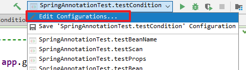

# Spring第二天

* IoC：控制反转，反转的是创建对象的控制权
  * 原来：需要一个对象，就自己主动new一个
  * 现在：需要一个对象，就从Spring里获取一个（由Spring创建好交给我们使用的）
* bean标签的基本

```xml
<bean id="唯一标识" class="全限定类名" scope="作用范围" init-method="初始化方法" destroy-method="销毁方法"></bean>
```

* bean对象的实例化方式

  * 默认的无参构造
  * 工厂的静态方法

  ```xml
  <bean id="" class="工厂类的全限定类名" factory-method="工厂类的静态方法"></bean>
  ```

  * 工厂的非静态方法

  ```xml
  <bean id="" factory-bean="工厂bean对象的id" factory-method="工厂对象的非静态方法"></bean>
  ```

* 依赖注入：set方法注入（属性注入）

  * 要求：依赖项要有set方法

  ```xml
  <bean>
  	<property name="属性名" value="简单值"/>
      <property name="属性名" ref="其它bean对象"/>
  </bean>
  ```

* 依赖注入：构造方法注入

  * 要求：要有有参构造。构造方法里每个参数就是一个依赖项

  ```xml
  <bean>
  	<constructor-arg name="构造参数名" value="简单值"/>
      <constructor-arg name="构造参数名" ref="其它bean对象"/>
  </bean>
  ```

* 复杂数据的注入

  * 如果依赖项是数组：用array标签
  * 如果依赖项是List：用list标签
  * 如果依赖项是Set：用set标签
  * 如果依赖项是Map：用map标签
  * 如果依赖项是Properties：用props标签

* 在xml里引入properties文件

  ```xml
  <context:property-placeholder location="classpath:jdbc.properties"/>
  ```

* 在xml里引入其它模块的xml文件

  ```xml
  <import resource="classpath:applicationContext-dao.xml"/>
  ```

  

## 一、基于注解的IoC【原始注解，重点】

### 1. 快速入门（重点）

#### 需求描述

- 有dao层：`UserDao`和`UserDaoImpl`
- 有service层：`UserService`和`UserServiceImpl`
- 使用注解配置bean，并注入依赖

#### 需求分析

1. 准备工作：创建Maven项目，导入依赖坐标

2. 编写代码并注解配置：

   编写dao层、service层代码，使用注解`@Component`配置bean：代替xml里的`bean`标签

   使用注解`@Autowired`依赖注入：代替xml里的`property`和`constructor-arg`标签

3. 在配置文件中开启组件扫描

4. 测试

#### 需求实现

##### 1) 准备工作

- 创建Maven项目，导入依赖坐标

```xml
<dependencies>
    <dependency>
        <groupId>org.springframework</groupId>
        <artifactId>spring-context</artifactId>
        <version>5.0.2.RELEASE</version>
    </dependency>
    <dependency>
        <groupId>junit</groupId>
        <artifactId>junit</artifactId>
        <version>4.12</version>
    </dependency>
</dependencies>
```

##### 2) 编写代码，并注解配置

- `UserDao`接口

```java
public interface UserDao {
    void save();
}
```

- `UserDaoImpl`实现类

```java
@Component("userDao")//等价于@Repository("userDao")
public class UserDaoImpl implements UserDao {
    @Override
    public void save() {
        System.out.println("save......");
    }
}
```

- `UserService`接口

```java
public interface UserService {
    void save();
}
```

- `UserServiceImpl`实现类

```java
@Component("userService")//等价于@Service("userService")
public class UserServiceImpl implements UserService {

    //注意：使用注解配置依赖注入时，不需要再有set方法
    @Autowired
    //@Qualifier("userDao")
    private UserDao userDao;

    @Override
    public void save() {
        userDao.save();
    }
}
```

##### 3) 开启组件扫描

- 创建`applicationContext.xml`，注意引入的`context`名称空间

```xml
<?xml version="1.0" encoding="UTF-8"?>
<beans xmlns="http://www.springframework.org/schema/beans"
       xmlns:xsi="http://www.w3.org/2001/XMLSchema-instance"
       xmlns:context="http://www.springframework.org/schema/context"
       xsi:schemaLocation="http://www.springframework.org/schema/beans
       http://www.springframework.org/schema/beans/spring-beans.xsd
       http://www.springframework.org/schema/context
       http://www.springframework.org/schema/context/spring-context.xsd">

    <!--开启组件扫描-->
    <context:component-scan base-package="com.itheima"/>
</beans>
```

##### 4) 功能测试

- 创建一个测试类，调用Service

```java
public class UserTest {

    @Test
    public void save(){
        ApplicationContext app = new ClassPathXmlApplicationContext("applicationContext.xml");
        UserService userService = (UserService) app.getBean("userService");
        userService.save();
    }
}
```

#### 步骤小结

* IoC
  1. 准备工作：导入jar包依赖，准备UserDao接口和实现类
  2. 如果某一个类要注册bean对象到容器：在类上加注解`@Component`
  3. 如果类里有依赖要注入：在依赖项上加注解`@Autowired`
  4. 在xml配置文件里开启组件扫描：`<context:component-scan base-package="com.itheima"/>`

### 2. 注解使用详解

#### 开启组件扫描

* 在Spring中，如果要使用注解开发，就需要在`applicationContext.xml`中开启组件扫描，配置如下：

```xml
<?xml version="1.0" encoding="UTF-8"?>
<beans xmlns="http://www.springframework.org/schema/beans"
       xmlns:xsi="http://www.w3.org/2001/XMLSchema-instance"
       xmlns:context="http://www.springframework.org/schema/context"
       xsi:schemaLocation="http://www.springframework.org/schema/beans
        http://www.springframework.org/schema/beans/spring-beans.xsd
        http://www.springframework.org/schema/context
        http://www.springframework.org/schema/context/spring-context.xsd">

    <!-- 注意：必须要引入context名称空间之后，才可以使用这个标签 -->
    <!-- 开启组件扫描，让Spring容器扫描com.itheima包下的注解 -->
    <context:component-scan base-package="com.itheima"/>
    
</beans>
```

#### 注册bean的注解

##### 简介

| 注解          | 说明                                                        |
| ------------- | ----------------------------------------------------------- |
| `@Component`  | 用在类上，相当于bean标签                                    |
| `@Controller` | 用在web层类上，配置一个bean（是`@Component`的衍生注解）     |
| `@Service`    | 用在service层类上，配置一个bean（是`@Component`的衍生注解） |
| `@Repository` | 用在dao层类上，配置一个bean（是`@Component`的衍生注解）     |

* `@Component`：类级别的一个注解，用于声明一个bean，使用不多
  * `value`属性：bean的唯一标识。如果不配置，默认以首字母小写的类名为id
* `@Controller, @Service, @Repository`，作用和`@Component`完全一样，但更加的语义化，使用更多
  * `@Controller`：用于web层的bean
  * `@Service`：用于Service层的bean
  * `@Repository`：用于dao层的bean

##### 示例

* `UserDaoImpl`类上使用注解`@Repository`

```java
@Repository("userDao")
public class UserDaoImpl implements UserDao{
}
```

* `UserServiceImpl`类上使用注解`@Service`

```java
@Service("userService")
public class UserServiceImpl implements UserService{
}
```

* `UserController`类上使用注解`@Controller`

```java
@Controller
public class UserController{}
```


#### 配置bean的注解

| 注解             | 说明                                 |
| ---------------- | ------------------------------------ |
| `@Scope`         | 相当于bean标签的`scope`属性          |
| `@PostConstruct` | 相当于bean标签的`init-method`属性    |
| `@PreDestroy`    | 相当于bean标签的`destory-method`属性 |

##### 配置bean的作用范围：

* `@Scope`：配置bean的作用范围，相当于bean标签的scope属性。加在bean对象上

* `@Scope`的常用值有：
* `singleton`：单例的，容器中只有一个该bean对象
    * 何时创建：容器初始化时
    * 何时销毁：容器关闭时
  
* `prototype`：多例的，每次获取该bean时，都会创建一个bean对象
    * 何时创建：获取bean对象时
    * 何时销毁：长时间不使用，垃圾回收

```java
@Scope("prototype")
@Service("userService")
public class UserServiceImpl implements UserService{
    //...
}
```

##### 配置bean生命周期的方法

* `@PostConstruct`是方法级别的注解，用于指定bean的初始化方法
* `@PreDestroy`是方法级别的注解，用于指定bean的销毁方法

```java
@Service("userService")
public class UserServiceImpl implements UserService {

    @PostConstruct
    public void init(){
        System.out.println("UserServiceImpl对象已经创建了......");
    }
    
    @PreDestroy
    public void destroy(){
        System.out.println("UserServiceImpl对象将要销毁了......");
    }
 
    //......
}
```

#### 依赖注入的注解

| 注解         | 说明                                       |
| ------------ | ------------------------------------------ |
| `@Autowired` | 相当于property标签的ref                    |
| `@Qualifier` | 结合`@Autowired`使用，用于根据名称注入依赖 |
| `@Resource`  | 相当于`@Autowired + @Qualifier`            |
| `@Value`     | 相当于property标签的value                  |

##### 注入bean对象

* `@Autowired`：用于byType注入bean对象，按照依赖的类型，从Spring容器中查找要注入的bean对象
  * 如果找到一个，直接注入
  * 如果找到多个，则以变量名为id，查找bean对象并注入
  * 如果找不到，抛异常
* `@Qualifier`：是按id注入，但需要和`@Autowired`配合使用。
* `@Resource`：(是jdk提供的)用于注入bean对象(byName注入)，相当于`@Autowired + @Qualifier`

> 绝大多数情况下，只要使用`@Autowired`注解注入即可
>
> 使用注解注入时，不需要set方法了

##### 注入普通值

* `@Value`：注入简单类型值，例如：基本数据类型和String

```java
@Service("userService")
public class UserServiceImpl implements UserService{
    
    @Value("zhangsan")//直接注入字符串值
    private String name;
    
    //从properties文件中找到key的值，注入进来
    //注意：必须在applicationContext.xml中加载了properties文件才可以使用
    @Value("${properties中的key}")
    private String abc;
    
    //...
}
```

#### 小结

* 如果想让注解生效，需要在xml文件里开启组件扫描

```xml
<context:component-scan base-package="com.itheima"/>
```

* 注册bean的注解：
  * `@Component`
  * `@Controller`
  * `@Service`
  * `@Repository`
* 依赖注入的注解：
  * byType注入：在依赖项上直接加 `@Autowired`
    * 如果找到一个：直接注入
    * 如果没有找到：报错
    * 如果找到多个：根据依赖项名称，进行byName查找注入
  * byName注入：在依赖项上`@Autowired + @Qualifier("bean名称")`
    * 注意：`@Qualifier`需要在byType基础上，进行byName注入
  * byName注入：在依赖项上加`@Resource(name="bean名称")`
* 配置bean的注解：
  * `@Scope`：加在bean对象上，配置作用范围
  * `@PostConstruct`：加在方法上，把方法配置成初始化方法
  * `@PreDestroy`：加在方法上，把方法配置成销毁方法

## 二、注解方式CURD练习

### 需求描述

* 使用注解开发帐号信息的CURD功能

### 需求分析

* 使用注解代替某些XML配置，能够代替的有：
  * dao层bean对象，可以在类上增加注解`@Repository`
  * service层bean对象，可以在类上增加注解`@Service`
  * Service层依赖于dao层，可以使用注解注入依赖`@AutoWired`
* 不能使用注解代替，仍然要使用XML配置的的有：
  * QueryRunner的bean对象，是DBUtils工具包里提供的类，我们不能给它的源码上增加注解
  * 连接池的bean对象，是c3p0工具包里提供的类，我们不能修改源码增加注解

### 需求实现

**pom.xml**

```xml
  <dependencies>
        <!-- 数据库驱动 -->
        <dependency>
            <groupId>mysql</groupId>
            <artifactId>mysql-connector-java</artifactId>
            <version>5.1.47</version>
        </dependency>

        <!-- c3p0连接池（也可以用其它连接池） -->
        <dependency>
            <groupId>com.mchange</groupId>
            <artifactId>c3p0</artifactId>
            <version>0.9.5.2</version>
        </dependency>

        <!-- DBUtils工具包 -->
        <dependency>
            <groupId>commons-dbutils</groupId>
            <artifactId>commons-dbutils</artifactId>
            <version>1.7</version>
        </dependency>

        <!-- Spring -->
        <dependency>
            <groupId>org.springframework</groupId>
            <artifactId>spring-context</artifactId>
            <version>5.0.2.RELEASE</version>
        </dependency>

        <!-- 单元测试 -->
        <dependency>
            <groupId>junit</groupId>
            <artifactId>junit</artifactId>
            <version>4.12</version>
        </dependency>
        <!--Spring的测试包-->
        <dependency>
            <groupId>org.springframework</groupId>
            <artifactId>spring-test</artifactId>
            <version>5.0.2.RELEASE</version>
        </dependency>
        <!--数据源-->
        <dependency>
            <groupId>org.springframework</groupId>
            <artifactId>spring-jdbc</artifactId>
            <version>5.0.2.RELEASE</version>
        </dependency>
    </dependencies>
```


#### JavaBean

```java
public class Account {
    private Integer id;
    private String name;
    private Double money;

    //get/set...
    //toString...
}
```

#### dao层代码

* `AccountDao`接口

```java
public interface AccountDao {
    Account findById(Integer id) throws SQLException;

    List<Account> queryAll() throws SQLException;

    void save(Account account) throws SQLException;

    void edit(Account account) throws SQLException;

    void delete(Integer id) throws SQLException;
}
```

* `AccountDaoImpl`实现类

```java
@Repository("accountDao")
public class AccountDaoImpl implements AccountDao {
    
    @Autowired
    private QueryRunner runner;
    
    @Override
    public Account findById(Integer id) throws SQLException {
        return runner.query("select * from account where id = ?", new BeanHandler<>(Account.class), id);
    }

    @Override
    public List<Account> queryAll() throws SQLException {
        return runner.query("select * from account", new BeanListHandler<>(Account.class));
    }

    @Override
    public void save(Account account) throws SQLException {
        runner.update("insert into account(id,name,money) values (?,?,?)", account.getId(), account.getName(), account.getMoney());
    }

    @Override
    public void edit(Account account) throws SQLException {
        runner.update("update account set name = ?, money = ? where id = ?", account.getName(), account.getMoney(), account.getId());
    }

    @Override
    public void delete(Integer id) throws SQLException {
        runner.update("delete from account where id = ?", id);
    }
}
```

#### service层代码

* `AccountService`接口

```java
public interface AccountService {
    Account findById(Integer id) throws SQLException;

    List<Account> queryAll() throws SQLException;

    void save(Account account) throws SQLException;

    void edit(Account account) throws SQLException;

    void delete(Integer id) throws SQLException;
}
```

* `AccountServiceImpl`接口

```java
@Service("accountService")
public class AccountServiceImpl implements AccountService {

    @Autowired
    private AccountDao accountDao;

    @Override
    public Account findById(Integer id) throws SQLException {
        return accountDao.findById(id);
    }

    @Override
    public List<Account> queryAll() throws SQLException {
        return accountDao.queryAll();
    }

    @Override
    public void save(Account account) throws SQLException {
        accountDao.save(account);
    }

    @Override
    public void edit(Account account) throws SQLException {
        accountDao.edit(account);
    }

    @Override
    public void delete(Integer id) throws SQLException {
        accountDao.delete(id);
    }
}
```

#### 提供配置

* 创建`applicationContext.xml`

```xml
<?xml version="1.0" encoding="UTF-8"?>
<beans xmlns="http://www.springframework.org/schema/beans"
       xmlns:xsi="http://www.w3.org/2001/XMLSchema-instance"
       xmlns:context="http://www.springframework.org/schema/context"
       xsi:schemaLocation="http://www.springframework.org/schema/beans
       http://www.springframework.org/schema/beans/spring-beans.xsd
       http://www.springframework.org/schema/context
       http://www.springframework.org/schema/context/spring-context.xsd">

    <!--开启注解扫描-->
    <context:component-scan base-package="com.itheima"/>

    <!--配置QueryRunner-->
    <bean id="runner" class="org.apache.commons.dbutils.QueryRunner">
        <constructor-arg name="ds" ref="dataSource"/>
    </bean>
    <!--配置连接池-->
    <bean id="dataSource" class="com.mchange.v2.c3p0.ComboPooledDataSource">
        <property name="driverClass" value="com.mysql.jdbc.Driver"/>
        <property name="jdbcUrl" value="jdbc:mysql:///spring"/>
        <property name="user" value="root"/>
        <property name="password" value="root"/>
    </bean>
</beans>
```

#### 功能测试

```java
public class AccountTest {

    @Test
    public void queryAll() throws SQLException {
        ApplicationContext app = new ClassPathXmlApplicationContext("classpath:applicationContext.xml");
        AccountService accountService = app.getBean("accountService", AccountService.class);
        List<Account> accounts = accountService.queryAll();
        for (Account account : accounts) {
            System.out.println(account);
        }
    }

    @Test
    public void findById() throws SQLException {
        ApplicationContext app = new ClassPathXmlApplicationContext("classpath:applicationContext.xml");
        AccountService accountService = app.getBean("accountService", AccountService.class);
        Account account = accountService.findById(2);
        System.out.println(account);
    }

    @Test
    public void save() throws SQLException {
        ApplicationContext app = new ClassPathXmlApplicationContext("classpath:applicationContext.xml");
        AccountService accountService = app.getBean("accountService", AccountService.class);

        Account account = new Account();
        account.setName("jerry");
        account.setMoney(2000d);
        accountService.save(account);
    }

    @Test
    public void edit() throws SQLException {
        ApplicationContext app = new ClassPathXmlApplicationContext("classpath:applicationContext.xml");
        AccountService accountService = app.getBean("accountService", AccountService.class);

        Account account = new Account();
        account.setId(2);
        account.setName("tom");
        account.setMoney(10000d);

        accountService.edit(account);
    }

    @Test
    public void delete() throws SQLException {
        ApplicationContext app = new ClassPathXmlApplicationContext("classpath:applicationContext.xml");
        AccountService accountService = app.getBean("accountService", AccountService.class);

        accountService.delete(3);
    }
}
```

### 小结


## 三、纯注解开发IoC（新注解）

​	在上边的CURD练习中，仍然有部分配置需要使用`applicationContext.xml`，那么能不能使用注解替换掉所有的xml呢？Spring提供了一些新注解，可以达到这个目标。

### 注解简介

| 注解              | 说明                                                         |
| ----------------- | ------------------------------------------------------------ |
| `@Configuration`  | 被此注解标记的类，是配置类                                   |
| `@ComponentScan`  | 用在配置类上，开启注解扫描。使用basePackage属性指定扫描的包  |
| `@PropertySource` | 用在配置类上，加载properties文件。使用value属性指定properties文件路径 |
| `@Import`         | 用在配置类上，引入子配置类。用value属性指定子配置类的Class   |
| `@Bean`           | 用在配置类的方法上，把返回值声明为一个bean。用name/value属性指定bean的id |

### 注解详解

#### 1 `@Configuration`配置类

##### 简介

* `@Configuration`把一个Java类声明为核心配置类
  * 加上Java类上，这个Java类就成为了Spring的核心配置类，用于代替`applicationContext.xml`
  * 是`@Component`的衍生注解，所以：核心配置类也是bean，里边可以注入依赖

##### 示例

```java
/**
 * 配置类，代替XML配置文件
 * Configuration注解：把当前类声明成为一个配置类
 */
@Configuration
public class AppConfig {
}
```

#### 2 配置类上的注解

##### 简介

* `@ComponentScan`配置组件注解扫描
  * `basePackages`或者`value`属性：指定扫描的基本包
* `@PropertySource`用于加载properties文件
  * `value`属性：指定propertis文件的路径，从类加载路径里加载
* `@Import`用于导入其它配置类
  * Spring允许提供多个配置类（模块化配置），在核心配置类里加载其它配置类
  * 相当于`xml`中的`<import resource="模块化xml文件路径"/>`标签

##### 示例

* 总配置类

```java
@Configuration
@ComponentScan(basePackages="com.itheima")
@PropertySource("classpath:db.properties")
@Import(JdbcConfig.class)
public class AppConfig{
    
}
```

* 模块配置类：JdbcConfig。

  被加载的模块配置类，可以不用再添加`@Configuration`注解

```java
public class JdbcConfig{
}
```

#### 3 `@Bean`声明bean

##### 1) `@Bean`定义bean

###### 简介

* `@Bean`注解：方法级别的注解
  * 用于把方法返回值声明成为一个bean，作用相当于`<bean>`标签
  * 可以用在任意bean对象的方法中，但是通常用在`@Configuration`标记的核心配置类中
* `@Bean`注解的属性：
  * `value`属性：bean的id。如果不设置，那么方法名就是bean的id

###### 示例

```java
@Configuration
public class AppConfig {
    @Bean
    public UserService myService() {
        return new UserServiceImpl();
    }
}
```

##### 2) `@Bean`的依赖注入

###### 简介

- `@Bean`注解的方法可以有任意参数，这些参数即是bean所需要的依赖，默认采用byType方式注入
- 可以在方法参数上增加注解`@Qualifier`，用于byName注入

###### 示例

```java
@Configuration
public class AppConfig {
    @Bean("myService")
    public UserService myService(UserDao userDao) {
        //通过set方法把myDao设置给MyService
        UserService myService = new UserServiceImpl();
        myService.setMyDao(userDao);
        return myServie;
    }
    
    /**
     * 方法参数上使用@Qualifer注解，用于byName注入
     * 		@Qualifer：可以独立用在方法参数上用于byName注入
     */
    @Bean("myService2")
    public UserService myService2(@Qualifier("myDao2") UserDao userDao){
        return new UserServiceImpl(userDao);
    }
}
```

### 小结

* 用纯注解开发，代替掉xml文件，就要有一个配置类
  * @Configuration：把类标记成配置类，配置类也会被注册到容器里，可以从容器中获取到
  * @ComponentScan：开启组件扫描，设置扫描的包
  * @PropertySource：用于引入properties文件。
    * 要使用`@Value("${properties里的key}")`，把key对应的值注入给一个成员变量（依赖项）
  * @Import：引入其它模块的配置类
  * @Bean：加在方法上，把方法返回值注册bean对象
    * bean的名称：
      * 默认以方法名为bean的名称
      * 自定义bean名称：`@Bean("bean名称")`
    * bean的初始化和销毁方法
      * `@Bean(value="bean名称", initMethod="初始化方法名称", destroyMethod="销毁方法名称")`
    * bean的作用范围：
      * 在方法上加注解`@Scope("prototype")`

```java
@Configuration
@ComponentScan("com.itheima")
@PropertySource({"classpath:jdbc.properties", "classpath:xxx.properties"})
@Import({DaoConfig.class, ServiceConfig.class})
public class AppConfig{
    @Value("${aaa}")
    private String aaa;
    
    
}
```

```java
@Configuration
public class DaoConfig{
    @Value("${jdbc.driver}")
    private String driver;
    @Value("${jdbc.url}")
    private String url;
    @Value("${jdbc.username}")
    private String username;
    @Value("${jdbc.password}")
    private String password;
    
    @Bean("dataSource")
    @Scope("singleton")
    public DataSource dataSource(){
        ComboPooledDataSource ds = new ComboPooledDataSource();
        ds.setDriverClassName(driver);
        ds.setJdbcUrl(url);
        ds.setUser(username);
        ds.setPassword(password);
        return ds;
    }
    
    @Bean
    public QueryRunner runner(DataSource dataSource){
        return new QueryRunner(dataSource);
    }
    
    @Bean(value="c", initMethod="init", destroyMethod="destroy")
    @Scope("prototype")
    public Course course(){
        return new Course();
    }
}
```


## 四、纯注解方式CURD练习

### 需求描述

* 使用Spring的新注解，代替CURD练习里，`applicationContext.xml`的所有配置
* 

### 需求实现 

* 提供pom.xml配置依赖

```xml
<dependencies>
        <!-- 数据库驱动 -->
        <dependency>
            <groupId>mysql</groupId>
            <artifactId>mysql-connector-java</artifactId>
            <version>5.1.47</version>
        </dependency>

        <!-- c3p0连接池（也可以用其它连接池） -->
        <dependency>
            <groupId>com.mchange</groupId>
            <artifactId>c3p0</artifactId>
            <version>0.9.5.2</version>
        </dependency>

        <!-- DBUtils工具包 -->
        <dependency>
            <groupId>commons-dbutils</groupId>
            <artifactId>commons-dbutils</artifactId>
            <version>1.7</version>
        </dependency>

        <!-- Spring -->
        <dependency>
            <groupId>org.springframework</groupId>
            <artifactId>spring-context</artifactId>
            <version>5.0.2.RELEASE</version>
        </dependency>

        <!-- 单元测试 -->
        <dependency>
            <groupId>junit</groupId>
            <artifactId>junit</artifactId>
            <version>4.12</version>
        </dependency>
        <!--Spring的测试包-->
        <dependency>
            <groupId>org.springframework</groupId>
            <artifactId>spring-test</artifactId>
            <version>5.0.2.RELEASE</version>
        </dependency>
        <!--数据源-->
        <dependency>
            <groupId>org.springframework</groupId>
            <artifactId>spring-jdbc</artifactId>
            <version>5.0.2.RELEASE</version>
        </dependency>
        <!--单元测试-->
        <dependency>
            <groupId>junit</groupId>
            <artifactId>junit</artifactId>
            <version>4.12</version>
        </dependency>
        <!--druid连接池-->
        <dependency>
            <groupId>com.alibaba</groupId>
            <artifactId>druid</artifactId>
            <version>1.1.19</version>
        </dependency>
    </dependencies>
   
```

* 提供jdbc配置文件：jdbc.properties

```properties
jdbc.driver=com.mysql.jdbc.Driver
jdbc.url=jdbc:mysql:///spring
jdbc.username=root
jdbc.password=root
```

* 提供核心配置类：SpringConfig

```java
@Configuration //声明当前类是一个配置类
@ComponentScan("com.itheima")//开启注解扫描
@PropertySource("classpath:jdbc.properties")//加载properties资源文件
public class SpringConfig {

    @Value("${jdbc.driver}")//注入properties中，jdbc.driver的值
    private String driver;

    @Value("${jdbc.url}")//注入properties中，jdbc.url的值
    private String url;

    @Value("${jdbc.username}")//注入properties中，jdbc.username的值
    private String username;

    @Value("${jdbc.password}")//注入properties中，jdbc.password的值
    private String password;

    //声明一个bean对象：数据库连接池对象，id是dataSource
    @Bean("dataSource")
    public DataSource dataSource() throws PropertyVetoException {
        ComboPooledDataSource dataSource = new ComboPooledDataSource();
        dataSource.setDriverClass(driver);
        dataSource.setJdbcUrl(url);
        dataSource.setUser(username);
        dataSource.setPassword(password);
        return dataSource;
    }

    //声明一个bean对象：QueryRunner对象，id是runner。
    //方法参数DataSource，需要dataSource，使用@Qualifier注入依赖
    @Bean("runner")
    public QueryRunner queryRunner(@Qualifier("dataSource") DataSource dataSource){
        return new QueryRunner(dataSource);
    }
}
```

### 功能测试

```java
public class AccountTest {

    @Test
    public void queryAll() throws SQLException {
        ApplicationContext app = new AnnotationConfigApplicationContext(MyConfig.class);
        AccountService accountService = app.getBean("accountService", AccountService.class);
        List<Account> accounts = accountService.queryAll();
        for (Account account : accounts) {
            System.out.println(account);
        }
    }

    @Test
    public void findById() throws SQLException {
        ApplicationContext app = new AnnotationConfigApplicationContext(MyConfig.class);
        AccountService accountService = app.getBean("accountService", AccountService.class);
        Account account = accountService.findById(2);
        System.out.println(account);
    }

    @Test
    public void save() throws SQLException {
        ApplicationContext app = new AnnotationConfigApplicationContext(MyConfig.class);
        AccountService accountService = app.getBean("accountService", AccountService.class);

        Account account = new Account();
        account.setName("jerry");
        account.setMoney(2000d);
        accountService.save(account);
    }

    @Test
    public void edit() throws SQLException {
        ApplicationContext app = new AnnotationConfigApplicationContext(MyConfig.class);
        AccountService accountService = app.getBean("accountService", AccountService.class);

        Account account = new Account();
        account.setId(2);
        account.setName("tom");
        account.setMoney(10000d);

        accountService.edit(account);
    }

    @Test
    public void delete() throws SQLException {
        ApplicationContext app = new AnnotationConfigApplicationContext(MyConfig.class);
        AccountService accountService = app.getBean("accountService", AccountService.class);

        accountService.delete(3);
    }
}
```

## 五、注解深入【拓展了解】

### 准备环境

#### 1. 创建Module，引入依赖

```xml
<dependencies>
    	<!-- Spring -->
        <dependency>
            <groupId>org.springframework</groupId>
            <artifactId>spring-context</artifactId>
            <version>5.0.2.RELEASE</version>
        </dependency>
    	<!-- Spring整合Junit -->
        <dependency>
            <groupId>org.springframework</groupId>
            <artifactId>spring-test</artifactId>
            <version>5.0.2.RELEASE</version>
        </dependency>
    	<!-- Junit -->
        <dependency>
            <groupId>junit</groupId>
            <artifactId>junit</artifactId>
            <version>4.12</version>
        </dependency>
    	<!-- snakeyaml，用于解析yaml文件的工具包 -->
        <dependency>
            <groupId>org.yaml</groupId>
            <artifactId>snakeyaml</artifactId>
            <version>1.25</version>
        </dependency>

		<!-- mysql驱动 -->
        <dependency>
            <groupId>mysql</groupId>
            <artifactId>mysql-connector-java</artifactId>
            <version>5.1.47</version>
        </dependency>
    	<!-- c3p0连接池 -->
        <dependency>
            <groupId>c3p0</groupId>
            <artifactId>c3p0</artifactId>
            <version>0.9.1.2</version>
        </dependency>
    </dependencies>
```

#### 2. 创建核心配置类

* 在`com.itheima`包里创建核心配置类`AppConfig`

```java
@Configuration
@ComponentScan("com.itheima")
public class AppConfig {
    
}
```

#### 3. 创建单元测试类

* 在`src\main\test`的`com.itheima.test`包里创建单元测试类

```java
@RunWith(SpringJUnit4ClassRunner.class)
@ContextConfiguration(classes = AppConfig.class)
public class SpringAnnotationTest {

    /**
     * 把IoC容器注入进来，在测试方法里要使用
     */
    @Autowired
    private ApplicationContext app;

}
```


### @ComponentScan

#### BeanName生成策略

##### 说明

* 默认的BeanName生成策略：

  * 如果注册bean时指定了id/name，以配置的id/name作为bean的名称
  * 如果没有指定id/name，则以类名首字母小字作为bean的名称
* 在模块化开发中，多个模块共同组成一个工程。
  * 可能多个模块中，有同名称的类，按照默认的BeanName生成策略，会导致名称冲突。
  * 这个时候可以自定义beanname生成策略解决问题
* `@ComponentScan`的`nameGenerator`，可以配置自定义的BeanName生成策略，步骤：

  1. 创建Java类，实现`BeanNameGenerator`接口，定义BeanName生成策略

  2. 在注解`@ComponentScan`中，使用`nameGenerator`指定生成策略即可

##### 示例

1. 在`com.itheima.beans`里创建一个Java类：Course如下

```java
//定义bean的名称为c
@Component("c")
public class Course {
    private String courseName;
    private String teacher;
	//get/set...
    //toString
}
```

2. 在`com.itheima.beanname`里创建Java类，实现`BeanNameGenerator`接口，定义BeanName生成策略

```java
public class MyBeanNameGenerator implements BeanNameGenerator {

    /**
     * 生成bean名称。当Spring容器扫描到类之后，会调用这个方法，获取bean的名称
     *
     * @param definition bean的定义信息
     * @param registry bean的注册器，用于管理容器里的bean，可以：
     *                 注册新的bean；查询某个bean；删除bean 等等
     * @return bean的名称
     */
    @Override
    public String generateBeanName(BeanDefinition definition, BeanDefinitionRegistry registry) {
        //获取bean的全限定类名
        String beanClassName = definition.getBeanClassName();
        //获取bean的类名（去掉包名，只要类名）
        String shortName = ClassUtils.getShortName(beanClassName);
        //把bean命名为：my+类名
        return "my" + shortName;
    }
}
```

2. 在注解`@ComponentScan`中，使用`nameGenerator`指定生成策略

```java
@Configuration
@ComponentScan(
        basePackages = "com.itheima",
        nameGenerator = MyBeanNameGenerator.class
)
public class AppConfig {
}
```

3. 编写测试类，测试获取bean

```java
    /**
     *  Bean命名规则
     *      如果定义了bean的名称，以定义的名称为准
     *      如果没有定义bean的名称，默认情况下：
     *          类名首字母小写作为bean的名称（id）。比如：Course，名称为course
     *          如果类名前2位都是大写，则仍然使用原类名。比如：URL，名称仍然是URL
     *
     * 自定义BeanName命名策略：
     *      1. 创建类，实现BeanNameGenerator，自定义名称生成策略
     *      2. 在核心配置类的@ComponentScan里，使用nameGenerator指定生成策略名称
     *
     * 如果使用了自定义的命名策略，则bean的原本的名称将会失效
     */
    @Test
    public void testBeanName(){
        //获取Course类型的bean的名称
        String[] names = app.getBeanNamesForType(Course.class);
        for (String name : names) {
            System.out.println(name);
        }
    }
```

#### 扫描规则过滤器

##### 说明

* `@ComponentScan`默认的扫描规则：
  * 扫描指定包里的`@Component`及衍生注解（`@Controller`,`@Service`,`@Repository`）配置的bean
* `@ComponentScan`注解也可以自定义扫描规则，来包含或排除指定的bean。步骤：
  1. 创建Java类，实现`TypeFilter`接口，重写`match`方法
     * 方法返回boolean。true表示匹配过滤规则；false表示不匹配过滤规则
  2. 使用`@ComponentScan`注解的属性，配置过滤规则：
     * `includeFilter`：用于包含指定TypeFilter过滤的类，符合过滤规则的类将被扫描
     * `excludeFilter`：用于排除指定TypeFilter过滤的类，符合过滤规则的类将被排除

##### 示例1-根据注解过滤

```java
@Configuration
@ComponentScan(
        basePackages = "com.itheima",
        nameGenerator = MyBeanNameGenerator.class,
        //使用Component注解标注的类不扫描
        excludeFilters = @ComponentScan.Filter(
            	//过滤类型：根据注解进行过滤
                type = FilterType.ANNOTATION,
            	//要过滤的注解是：Component
                classes = Component.class
        )
)
public class AppConfig {
}
```

##### 示例2-根据指定类过滤

```java
@Configuration
@ComponentScan(
        basePackages = "com.itheima",
        nameGenerator = MyBeanNameGenerator.class,
        //Course及其子类、实现类不扫描
        excludeFilters = @ComponentScan.Filter(
                type = FilterType.ASSIGNABLE_TYPE,
                classes = Course.class
        )
)
public class AppConfig {

}
```

##### 示例3-自定义过滤

1. 创建Java类

```java
//类上有@Component
@Component
public class BeanTest {
	//类里有单元测试方法
    @Test
    public void test1(){
        System.out.println("---------");
    }
}
```

2. 编写过滤器，实现`TypeFilter`接口，重写`match`方法

```java
public class TestFilter implements TypeFilter {
    /**
     * 如果被扫描的类是单元测试类（类里有单元测试方法），则排除掉不要
     *
     * @param metadataReader 被扫描的类的读取器，可以读取类的字节码信息、类的注解信息
     * @param metadataReaderFactory 读取器的工厂对象
     * @return 是否匹配。如果被扫描的类是单元测试类，则匹配，
     */
    @Override
    public boolean match(MetadataReader metadataReader, MetadataReaderFactory metadataReaderFactory) throws IOException {
        //获取被扫描的类上的注解信息
        AnnotationMetadata annotationMetadata = metadataReader.getAnnotationMetadata();
        //获取被扫描的类里，使用@Test注解标记的方法
        Set<MethodMetadata> annotatedMethods = annotationMetadata.getAnnotatedMethods(Test.class.getName());
        //如果有被@Test标记的方法，返回true；否则，返回false
        return annotatedMethods!=null && annotatedMethods.size()>0;
    }
}
```

3. 使用注解`@ComponentScan`，配置过滤规则

```java
@Configuration
@ComponentScan(
        basePackages = "com.itheima",
        nameGenerator = MyBeanNameGenerator.class,
        //单元测试类不扫描（使用自定义的过滤器，排除掉 过滤出来的单元测试类）
        excludeFilters = @ComponentScan.Filter(
                type = FilterType.CUSTOM,
                classes = TestFilter.class
        )
)
public class AppConfig {

}
```

4. 测试

```java
    @Test
    public void testScan(){
        //获取不到BeanTest，因为这个类里有单元测试方法，被我们自定义的过滤器给排除掉了
        BeanTest beanTest = app.getBean(BeanTest.class);
        System.out.println(beanTest);
    }
```

### @PropertySource

#### `yml`配置文件介绍

* 大家以前学习过的常用配置文件有`xml`和`properties`两种格式，但是这两种都有一些不足：
  * `properties`：
    * 优点：键值对的格式，简单易读
    * 缺点：不方便表示复杂的层级
  * `xml`：
    * 优点：层次结构清晰
    * 缺点：配置和解析语法复杂
* springboot采用了一种新的配置文件：`yaml`（或`yml`），它综合了`xml`和`properties`的优点。
  * `yaml are't markup language` => yaml
  * 使用空格表示层次关系：相同空格的配置项属于同一级
  * 配置格式是`key:空格value`，键值对之间用`:空格`表示
* `yaml`文件示例：

```yaml
jdbc:
	driver: com.mysql.jdbc.Driver # 注意：英文冒号后边必须有一个空格
	url: jdbc:mysql:///spring
	username: root
	password: root
	
jedis:
	host: localhost
	port: 6379
```

#### 使用`@PropertySource`加载`yml`

###### 说明

* `@PropertySource`可以使用`factory`属性，配置`PropertySourceFactory`，用于自定义配置文件的解析
* 步骤：
  1. 创建`yaml`文件：`application.yml`
  2. 导入依赖`snakeyaml`，它提供了解析yml文件的功能
  3. 创建Java类，实现`PropertySourceFactory`接口，重写`createPropertySource`方法 
  4. 使用`@PropertySource`注解，配置工厂类 

###### 示例

1. 在`resources`目录里创建`yaml`文件：`application.yml`

```yaml
jdbc:
	driver: com.mysql.jdbc.Driver # 注意：英文冒号后边必须有一个空格
	url: jdbc:mysql:///spring
	username: root
	password: root
	
jedis:
	host: localhost
	port: 6379
```

2. 在`pom.xml`增加导入依赖`snakeyaml`，它提供了解析yml文件的功能

```xml
<dependency>
    <groupId>org.yaml</groupId>
    <artifactId>snakeyaml</artifactId>
    <version>1.25</version>
</dependency>
```

3. 创建Java类，实现`PropertySourceFactory`接口，重写`createPropertySource`方法 

```java
public class YamlSourceFactory implements PropertySourceFactory {
    /**
     * 解析yaml配置文件
     * @param name 名称
     * @param resource 配置文件EncodedResource对象 
     * @return PropertySource
     */
    @Override
    public PropertySource<?> createPropertySource(String name, EncodedResource resource) throws IOException {
        //1. 创建yaml解析的工厂
        YamlPropertiesFactoryBean factoryBean = new YamlPropertiesFactoryBean();
        //2. 设置要解析的资源内容
        factoryBean.setResources(resource.getResource());
        //3. 把资源文件解析成Properties对象
        Properties properties = factoryBean.getObject();
        //4. 把properties封装成PropertySource对象并返回
        return new PropertiesPropertySource("application", properties);
    }
}
```

4. 使用`@PropertySource`注解，配置工厂类 

```java
@Configuration("appConfig")
@PropertySource(
    value = "classpath:application.yml", 
    factory = YamlSourceFactory.class
)
public class AppConfig {

    @Value("${jdbc.driver}")
    private String jdbcDriver;

    @Value("${jedis.host}")
    private String jedisHost;

    public void showProps(){
        System.out.println("jdbc.driver: " + this.jdbcDriver);
        System.out.println("jedis.host: " + this.jedisHost);
    }
}
```

5.  测试

```java
@Test
public void testProps(){
    AppConfig appConfig = app.getBean(AppConfig.class);
    appConfig.showProps();
}
```

### @Import

#### 注册bean的方式

如果要注解方式配置一个bean，可以如下方式：

* 在类上使用`@Component`,`@Controller`, `@Service`, `@Repository`：只能用于自己编写的类上，jar包里的类不能使用（比如ComboPooledDataSource）
* 在方法上使用`@Bean`：把方法返回值配置注册成bean到IoC容器，通常用于注册第三方jar里的bean
* 在核心配置类上使用`@Import`：
  * `@Import(类名.class)`，注册的bean的id是全限定类名
  * `@Import(自定义ImportSelector.class)`：把自定义ImportSelector返回的类名数组，全部注册bean
  * `@Import(自定义ImportBeanDefinitionRegister.class)`：在自定义ImportBeanDefinitionRegister里手动注册bean

#### ImportSelector导入器

##### 示例1-直接导入注册bean

```java
@Configuration
@Import(Catalog.class) //导入Catalog注册bean
public class AppConfig {
    @Value("${jdbc.driver}")
    private String jdbcDriver;

    @Value("${jedis.host}")
    private String jedisHost;

    public void showProps(){
        System.out.println("jdbc.driver: " + this.jdbcDriver);
        System.out.println("jedis.host: " + this.jedisHost);
    }
}
```

##### 示例2-使用ImportSelector注册bean

```java
//导入Catalog， 并把MyImportSelector选择的全限定类名也注册bean
@Import({Catalog.class, MyImportSelector.class})
@Configuration
public class AppConfig {
    @Value("${jdbc.driver}")
    private String jdbcDriver;

    @Value("${jedis.host}")
    private String jedisHost;

    public void showProps(){
        System.out.println("jdbc.driver: " + this.jdbcDriver);
        System.out.println("jedis.host: " + this.jedisHost);
    }
}

```

##### 示例3-ImportSelector的高级使用

###### 说明

* springboot框架里有大量的`@EnableXXX`注解，底层就是使用了ImportSelector解决了模块化开发中，如何启动某一模块功能的问题
* 例如：
  * 我们开发了一个工程，要引入其它的模块，并启动这个模块的功能：把这个模块的bean进行扫描装载


* 步骤：
  1. 创建一个Module：module_a
     1. 在包`com.a`里创建几个Bean
     2. 创建核心配置文件AConfig，扫描`com.a`
     3. 定义一个ImportSelector：`AImportSelector`，导入`AConfig`类
     4. 定义一个注解`@EnableModuleA`
  2. 在我们的Module的核心配置文件`AppConfig`上增加注解：`@EnableModuleA`
     1. 引入module_a的坐标
     2. 测试能否获取到Module a里的bean

###### 第一步：创建新Module：`module_a`

```xml
<!-- module_a的坐标 -->
<groupId>com.itheima</groupId>
    <artifactId>spring_module_a</artifactId>
    <version>1.0-SNAPSHOT</version>
```


1. 在包`com.a.beans`里创建类 `DemoBeanA`

   ```java
   @Component
   public class DemoBeanA {
   }
   ```

2. 创建核心配置类`AConfig`

```java
@Configuration
@ComponentScan("com.a")
public class AConfig {
}
```

3. 创建导入器：创建Java类，实现`ImportSelector`接口，重写`selectImports`方法

```java
public class AImportSelector implements ImportSelector {
    /**
     * @param importingClassMetadata。被@Import注解标注的类上所有注解的信息
     */
    @Override
    public String[] selectImports(AnnotationMetadata importingClassMetadata) {
        return new String[]{AConfig.class.getName()};
    }
}
```

4. 定义注解`@EnableModuleA`

```java
@Import(AImportSelector.class)
@Target(ElementType.TYPE)
@Retention(RetentionPolicy.RUNTIME)
public @interface EnableModuleA {
}
```

###### 第二步：引入module_a，启动模块a

1. 在我们自己的工程pom.xml里增加依赖

```xml
<dependency>
    <groupId>com.itheima</groupId>
    <artifactId>spring_module_a</artifactId>
    <version>1.0-SNAPSHOT</version>
</dependency>
```

2. 在我们自己的工程核心配置类上，使用注解@EnableModuleA启动模块a

```java
@Configuration
@EnableModuleA
public class AppConfig {

}
```

3. 在我们自己的工程里测试

```java
   @Test
    public void testBean(){
        //在我们自己的工程里，可以获取到module_a里的bean
        DemoBeanA demoBeanA = app.getBean(DemoBeanA.class);
        System.out.println(demoBeanA);
    }
```


#### ImportBeanDefinitionRegister注册器

##### 说明

* `ImportBeanDefinitionRegister`提供了更灵活的注册bean的方式

* AOP里的`@EnableAspectJAutoProxy`就使用了这种注册器，用于注册不同类型的代理对象

* 步骤：

  1. 创建注册器：

     创建Java类，实现`ImportBeanDefinitionRegister`接口，重写`registerBeanDefinitions`方法

  2. 在核心配置类上，使用`@Import`配置注册器

##### 示例

1. 创建类`com.other.Other`

```java
public class Other {
    public void show(){
        System.out.println("Other.show....");
    }
}
```

2. 创建注册器

```java
public class CustomImportBeanDefinitionRegister implements ImportBeanDefinitionRegistrar {
    /**
     * @param importingClassMetadata 当前类的注解信息
     * @param registry 用于注册bean的注册器
     */
    @Override
    public void registerBeanDefinitions(AnnotationMetadata importingClassMetadata, BeanDefinitionRegistry registry) {
        //获取bean定义信息
        BeanDefinition beanDefinition = BeanDefinitionBuilder.rootBeanDefinition("com.other.Other").getBeanDefinition();
        //注册bean，方法参数：bean的id，bean的定义信息
        registry.registerBeanDefinition("other", beanDefinition);
    }
}
```

2. 在核心配置类上，使用`@Import`配置注册器

```java
@Configuration
@Import({CustomImportBeanDefinitionRegister.class})
public class AppConfig {

}
```

3. 测试

```java
@Test
public void testImportRegister(){
    //获取扫描范围外，使用ImportBeanDefinitionRegister注册的bean
    Other other = app.getBean("other",Other.class);
    other.showOther();
}
```

### @Conditional

#### 说明

* `@Conditional`加在bean上，用于选择性的注册bean：
  * 符合Condition条件的，Spring会生成bean对象 存储容器中
  * 不符合Condition条件的，不会生成bean对象 
* 示例：
  * 有一个类Person(姓名name，年龄age)
  * 如果当前操作系统是Linux：就创建Person(linus, 62)对象，并注册bean
  * 如果当前操作系统是Windows：就创建Persion(BillGates, 67)对象，并注册bean
* 步骤
  1. 创建Person类
  2. 创建两个Java类，都实现`Condition`接口：
     * WindowsCondition：如果当前操作系统是Windows，就返回true
     * LinuxCondition：如果当前操作系统是Linux，就返回true
  3. 在核心配置类里创建两个bean
     * 一个bean名称为bill，加上`@Conditional(WindowsCondition.class)`
     * 一个bean名称为linus，加上`@Conditional(LinuxCondition.class)`

#### 示例

1. 创建Person类

```java
public class Person {
    private String name;
    private Integer age;

    public Person() {
    }

    public Person(String name, Integer age) {
        this.name = name;
        this.age = age;
    }
 	//get/set...
    //toString...
}
```

2. 创建两个Java类，实现`Condition`接口

```java
public class WindowsCondition implements Condition {
    @Override
    public boolean matches(ConditionContext context, AnnotatedTypeMetadata metadata) {
		//从当前运行环境中获取操作系统名称
        String osName = context.getEnvironment().getProperty("os.name");
		//判断是否是Windows系统；如果是，返回true；否则返回false
        return osName.contains("Windows");
    }
}
```

```java
public class LinuxCondition implements Condition {
    @Override
    public boolean matches(ConditionContext context, AnnotatedTypeMetadata metadata) {
		//从当前运行环境中获取操作系统名称
        String osName = context.getEnvironment().getProperty("os.name");
		//判断是否是Linux系统；如果是，返回true；否则返回false
        return osName.contains("Linux");
    }
}
```

3. 核心配置类

```java
@Configuration
public class AppConfig {
	/**
	 * 如果操作系统是Windows，则注册bean对象：id为bill
	 */
    @Bean
    @Conditional(WindowsCondition.class)
    public Person bill(){
        return new Person("Bill Gates", 67);
    }

    /**
     * 如果操作系统是Linux，注册bean对象：id为linus
     */
    @Bean
    @Conditional(LinuxCondition.class)
    public Person linus(){
        return new Person("Linux", 60);
    }
}
```

5. 测试

```java
@Test
public void testCondition(){
    ApplicationContext app = new AnnotationConfigApplicationContext(AppConfig.class);
    Person person = app.getBean(Person.class);
    System.out.println(person);
}
```

**执行一次单元测试方法之后**，按照以下方式，可以通过JVM参数的方式，设置os.name的参数值。

设置之后，再次执行单元测试方法




#### Conditional的扩展注解

`@Conditional`在springboot里应用非常多，以下列出了一些`@Conditional`的扩展注解：

* @ConditionalOnBean：当容器中有指定Bean的条件下进行实例化。
* @ConditionalOnMissingBean：当容器里没有指定Bean的条件下进行实例化。
* @ConditionalOnClass：当classpath类路径下有指定类的条件下进行实例化。
* @ConditionalOnMissingClass：当类路径下没有指定类的条件下进行实例化。
* @ConditionalOnWebApplication：当项目是一个Web项目时进行实例化。
* @ConditionalOnNotWebApplication：当项目不是一个Web项目时进行实例化。
* @ConditionalOnProperty：当指定的属性有指定的值时进行实例化。
* @ConditionalOnExpression：基于SpEL表达式的条件判断。
* @ConditionalOnJava：当JVM版本为指定的版本范围时触发实例化。
* @ConditionalOnResource：当类路径下有指定的资源时触发实例化。
* @ConditionalOnJndi：在JNDI存在的条件下触发实例化。
* @ConditionalOnSingleCandidate：当指定的Bean在容器中只有一个，或者有多个但是指定了首选的Bean时触发实例化。

### @Profile

##### 说明

* 在开发中，我们编写的工程通常要部署不同的环境，比如：开发环境、测试环境、生产环境。不同环境的配置信息是不同的，比如：数据库配置信息；如果每次切换环境，都重新修改配置的话，会非常麻烦，且容易出错
* 针对这种情况，Spring提供了`@Profile`注解：可以根据不同环境配置不同的bean，激活不同的配置
  * `@Profile`注解的底层就是`@Conditional`
* 例如：
  * 定义三个数据源：
    * 开发环境一个`DataSource`，使用`@Profile`配置环境名称为`dev`
    * 测试环境一个`DataSource`，使用`@Profile`配置环境名称为`test`
    * 生产环境一个`DataSource`，使用`@Profile`配置环境名称`pro`
  * 在测试类上，使用`@ActiveProfiles`激活哪个环境，哪个环境的数据源会生效
    * 实际开发中有多种方式可以进行激活，这里演示一个单元测试类里是怎样激活的

##### 示例

1. 在`pom.xml`中增加导入依赖`mysql驱动`, `c3p0`

```xml
<dependencies>
    <dependency>
        <groupId>mysql</groupId>
        <artifactId>mysql-connector-java</artifactId>
        <version>5.1.47</version>
    </dependency>
    <dependency>
        <groupId>c3p0</groupId>
        <artifactId>c3p0</artifactId>
        <version>0.9.1.2</version>
    </dependency>
    
    
    <dependency>
        <groupId>org.springframework</groupId>
        <artifactId>spring-context</artifactId>
        <version>5.2.5.RELEASE</version>
    </dependency>
    <dependency>
        <groupId>org.springframework</groupId>
        <artifactId>spring-test</artifactId>
        <version>5.2.5.RELEASE</version>
    </dependency>
    <dependency>
        <groupId>junit</groupId>
        <artifactId>junit</artifactId>
        <version>4.12</version>
    </dependency>
</dependencies>
```

2. 在配置类里创建三个数据源，并配置`@Profile`

```java
@Configuration
public class AppConfig {

    @Bean
    @Profile("dev")
    public DataSource devDataSource() throws PropertyVetoException {
        System.out.println("dev  开发环境的");
        ComboPooledDataSource dataSource = new ComboPooledDataSource();
        dataSource.setDriverClass("com.mysql.jdbc.Driver");
        dataSource.setJdbcUrl("jdbc:mysql:///devdb");
        dataSource.setUser("root");
        dataSource.setPassword("root");
        dataSource.setMaxPoolSize(20);
        return dataSource;
    }

    @Bean
    @Profile("test")
    public DataSource testDataSource() throws PropertyVetoException {
        System.out.println("test 测试环境的");
        ComboPooledDataSource dataSource = new ComboPooledDataSource();
        dataSource.setDriverClass("com.mysql.jdbc.Driver");
        dataSource.setJdbcUrl("jdbc:mysql:///testdb");
        dataSource.setUser("root");
        dataSource.setPassword("root");
        dataSource.setMaxPoolSize(100);
        return dataSource;
    }

    @Bean
    @Profile("pro")
    public DataSource proDataSource() throws PropertyVetoException {
        System.out.println("pro 生产环境的");
        ComboPooledDataSource dataSource = new ComboPooledDataSource();
        dataSource.setDriverClass("com.mysql.jdbc.Driver");
        dataSource.setJdbcUrl("jdbc:mysql:///prodb");
        dataSource.setUser("root");
        dataSource.setPassword("root");
        dataSource.setMaxPoolSize(200);
        return dataSource;
    }
}
```

3. 在测试类上，使用`@ActiveProfiles`激活哪个环境，哪个环境的数据源会生效

   > 或者使用JVM参数`-Dspring.profiles.active=dev`

```java
@ActiveProfiles("dev") //激活dev环境
@RunWith(SpringJUnit4ClassRunner.class)
@ContextConfiguration(classes = AppConfig.class)
public class SpringTest {
    
    @Autowired
    private ApplicationContext app;

    @Test
    public void testProfile(){
        DataSource dataSource = app.getBean(DataSource.class);
        System.out.println(dataSource);
    }
}
```

## 六、动态代理复习

* 代理：当不能直接调用、不方便直接调用时，可以通过代理对象间接调用
* 静态代理：代理类是提前创建好的，调用者通过代理对象，间接调用目标对象
* 动态代理：代理类不存在，在代码运行过程中会生成代理对象，调用者通过代理对象间接调用目标对象


### 1. JDK的基于接口的动态代理


#### API介绍

##### `Proxy`类

* 使用JDK的动态代理的要求：目标对象必须实现了接口。

* 相关类：JDK的类`java.lang.reflect.Proxy`，提供了生成代理对象的方法
* 生成代理对象的方法：
  `Proxy.newProxyInstance(ClassLoader loader,Class[] interfaces, InvocationHandler h)`
  - `loader`：类加载器
  - `interfaces`：目标对象所实现的接口 字节码数组
  - `h`：用于写代理对象要做的事情，通常写成`InvocationHandler`接口的匿名内部类，实现其`invoke`方法

##### `InvocationHandler`接口

* 接口只有一个方法：每次当代理对象被调用时，这个方法都会执行。在方法里通常写代理对象的行为
  `invoke(Object proxy, Method method, Object[] args)`
* 方法的参数：
  * `Object proxy`：最终生成的代理对象
  * `Method method`：用户在调用代理对象时，所执行的方法对象
  * `Object[] args`：用户在调用代理对象，执行方法时，所传递的实参
* 方法的返回值：
  * 当用户调用的代理对象的方法后，得到的返回值

#### 使用示例

##### 有目标类（待增强的类）

* 接口

```java
/**
 * @author liuyp
 * @date 2020/04/06
 */
public interface Star {
    String sing(String song);

    String dance(String danceName);
}
```

* 实现类：

```java
/**
 * @author liuyp
 * @date 2020/04/06
 */
public class SuperStar implements Star {
    @Override
    public String sing(String song) {
        System.out.println("明星唱：" + song);
        return "唱了" + song;
    }

    @Override
    public String dance(String danceName) {
        System.out.println("明星跳：" + danceName);
        return "跳了" + danceName;
    }
}
```

##### 有通知类（用于进行功能增强的）

```java
/**
 * @author liuyp
 * @date 2020/04/06
 */
public class StarAdvice {
    public void before(){
        System.out.println("前置增强：彩排");
    }

    public void after(){
        System.out.println("后置增强：收钱");
    }
}
```

##### 使用动态代理生成代理对象

```java
/**
 * @author liuyp
 * @date 2020/04/06
 */
public class JdkProxyTest {
    public static void main(String[] args) {
        //1. 创建一个明星对象
        Star superStar = new SuperStar();
        //2. 创建一个增强类对象：对象里提供了 功能增强的方法。
        StarAdvice starAdvice = new StarAdvice();

        //3. 要不修改SuperStar源码的情况下，对SuperStar进行功能增强：创建一个代理对象
        Star starProxy = (Star) Proxy.newProxyInstance(
                superStar.getClass().getClassLoader(),
                superStar.getClass().getInterfaces(),
                new InvocationHandler() {
                    @Override
                    public Object invoke(Object proxy, Method method, Object[] args) throws Throwable {
                        starAdvice.before();
                        Object result = method.invoke(superStar, args);
                        starAdvice.after();
                        return result;
                    }
                }
        );

        //4. 通过starProxy代理对象，间接调用superStar的方法
        String sing = starProxy.sing("绿光");
        System.out.println("返回值>>>" + sing);

        System.out.println("-----------------------");

        String dance = starProxy.dance("霹雳舞");
        System.out.println("返回值>>>" + dance);
    }
}
```

### 2. cglib的基于子类的动态代理【了解】


#### API介绍

##### `Enhancer`类

* 使用cglib的要求：

  * 目标对象不需要有接口
  * 目标类不能是final类
  * 要增强的方法不能是final方法

* 相关类介绍：

  * jar包：Spring框架已经把cglib包含进去了，所以只要导入`spring-context`即可
  * 核心类：`org.springframework.cglib.proxy.Enhancer`，提供了生成代理对象的方法

* 生成代理对象的方法：

  `Enhancer.create(Class superClass, Callback callback)`

  - `superClass`：目标对象的字节码

  - `callback`：回调函数，用于写代理对象要做的事情，通常写成`MethodInterceptor`的匿名内部类对象

    > callback相当于jdk动态代理中的`InvocationHandler`

##### `MethodInterceptor`接口

* 接口只有一个方法：每次当代理对象被调用时，这个方法都会执行。在方法里通常写代理对象的行为
  `intercept(Object proxy, Method method, Object[] args, MethodProxy methodProxy)`
* 方法的参数：
  * `Object proxy`：最终生成的代理对象
  * `Method method`：用户在调用代理对象时，所执行的方法对象
  * `Object[] args`：用户在调用代理对象，执行方法时，所传递的实参
  * `MethodProxy methodProxy`：用户在调用代理对象时，所执行的方法的代理对象
    * `methodProxy.invokeSuper(proxy, args)`：调用目标对象的方法，性能更强
* 方法的返回值：
  * 当用户调用的代理对象的方法后，得到的返回值

#### 使用示例

##### 目标类（待增强的）

```java
/**
 * @author liuyp
 * @date 2020/04/06
 */
public class SuperStar {
    public String sing(String song) {
        System.out.println("明星唱：" + song);
        return "唱了" + song;
    }

    public String dance(String danceName) {
        System.out.println("明星跳：" + danceName);
        return "跳了" + danceName;
    }
}
```

##### 通知类（用于增强的）

```java
/**
 * @author liuyp
 * @date 2020/04/06
 */
public class StarAdvice {
    public void before(){
        System.out.println("前置增强：彩排");
    }

    public void after(){
        System.out.println("后置增强：收钱");
    }
}
```

##### 使用cglib生成代理对象

```java
import org.springframework.cglib.proxy.Enhancer;
import org.springframework.cglib.proxy.MethodInterceptor;
import org.springframework.cglib.proxy.MethodProxy;

import java.lang.reflect.Method;

/**
 * @author liuyp
 * @date 2020/04/06
 */
public class CglibProxyTest {
    public static void main(String[] args) {
        //1. 创建一个原始目标对象（没有增强、待增强的对象）
        SuperStar superStar = new SuperStar();

        //2. 创建一个增强类对象：里边提供了功能增强的方法
        StarAdvice starAdvice = new StarAdvice();

        //3. 要在不修改源码的情况下，对目标对象进行增强：使用cglib动态代理
        SuperStar starProxy = (SuperStar) Enhancer.create(superStar.getClass(), new MethodInterceptor() {
            @Override
            public Object intercept(Object o, Method method, Object[] objects, MethodProxy methodProxy) throws Throwable {
                starAdvice.before();
                Object result = methodProxy.invokeSuper(o, objects);
                starAdvice.after();
                return result;
            }
        });

        //4. 通过代理对象starProxy，间接调用目标对象superStar的方法
        String sing = starProxy.sing("绿光");
        System.out.println("返回值>>>" + sing);

        System.out.println("-----------------------");

        String dance = starProxy.dance("霹雳舞");
        System.out.println("返回值>>>" + dance);
    }
}
```

# 复习上午内容

* XML和注解混用
  * 注册bean的注解
    * `@Component`, `@Controller`, `@Service`, `@Repository`
  * 配置bean的注解
    * `@Scope`：加在bean上，设置作用范围
    * `@PostConstruct`：加在方法，声明成初始化方法
    * `@PreDestroy`：加在方法上，声明成销毁方法
  * 依赖注入的注解
    * `@Autowired`：byType注入
    * `@Autowired + @Qualifier("bean名称")`：byName注入
    * `@Resource(name="bean名称")`：byName注入
    * `@Value("abc")`, `@Value("${properties里的key}")`
  * XML里

  ```xml
  <!--开启组件扫描 -->
  <context:component-scan base-package="com.itheima"/>
  <!-- 第三方类注册bean -->
  <bean id="dataSource" class="ComboPooledDataSource">
  	<property name="xxx" value="xxx"/>
  </bean>
  <import resource="classpath:applicationContext-dao.xml"/>
  <context:property-placeholder location="classpath:jdbc.properties"/>
  ```

* 纯注解开发

  * 注册bean的注解
    * `@Component`, `@Controller`, `@Service`, `@Repository`
  * 配置bean的注解
    * `@Scope`：加在bean上，设置作用范围
    * `@PostConstruct`：加在方法，声明成初始化方法
    * `@PreDestroy`：加在方法上，声明成销毁方法
  * 依赖注入的注解
    * `@Autowired`：byType注入
    * `@Autowired + @Qualifier("bean名称")`：byName注入
    * `@Resource(name="bean名称")`：byName注入
    * `@Value("abc")`, `@Value("${properties里的key}")`
  * 提供Java类，在Java类做配置

  ```java
  @Configuration
  @ComponentScan("com.itheima")
  @PropertySource("classpath:jdbc.properties")
  @Import(DaoConfig.class)
  public class AppConfig{
      
      @Bean
      public QueryRunner runner(DataSource dataSource){
          return new QueryRunner(dataSource);
      }
  }
  ```

  