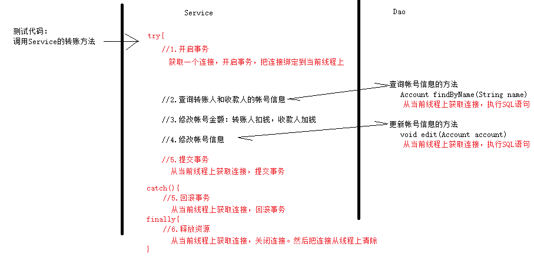
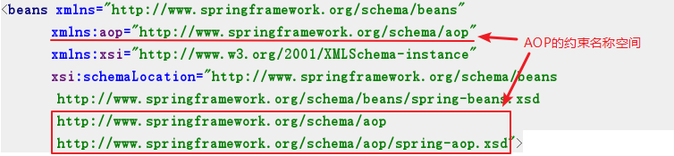
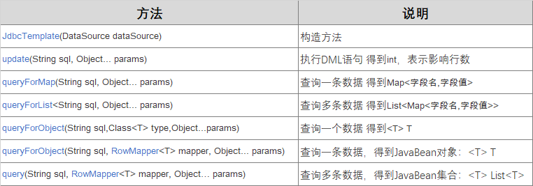

# Spring第3天

* IoC：控制反转，反转的是创建对象的控制权

* XML配置

  * 注册bean、配置bean的：

  ```xml
  <bean id="" class="" scope="" init-method="" destroy-method=""></bean>
  
  <bean id="" class="工厂类的全限定类名" factory-method="工厂类的静态方法" scope="" init-method="" destroy-method=""></bean>
  
  <bean id="" factory-bean="工厂bean对象的id" factory-method="工厂对象的非静态方法" scope="" init-method="" destroy-method=""></bean>
  ```

  * 依赖注入的：

    * set方法注入（属性注入）

    ```xml
    <bean>
    	<property name="属性名" value="简单值"/>
        <property name="属性名" ref="其它bean对象"/>
    </bean>
    ```

    * 构造方法注入

    ```xml
    <bean>
    	<constructor-arg name="构造参数名" value="简单值"/>
        <constructor-arg name="构造参数名" ref="其它bean对象"/>
    </bean>
    ```

* 注解+XML

  * 注册bean的注解：`@Controller, @Service, @Repository, @Component`
  * 配置bean的注解：`@Scope, @PostConstruct, @PreDestroy`
  * 依赖注入的注解：`@Autowired,  @Autowired + @Qualifier("bean名称"), @Resource(name="bean名称")`
  * 需要在xml里配置：

  ```xml
  <context:component-scan base-package="com.itheima"/>
  <bean id="runner" class="QueryRunner全限定类名">
  	<constructor-arg name="ds" ref="连接池bean对象的id"/>
  </bean>
  <context:property-placeholder location="classpath:jdbc.properties"/>
  <import resource="classpath:applicationContext-dao.xml"/>
  ```

* 纯注解

  * 使用Java类代替掉xml文件

  ```java
  @Configuration
  @ComponentScan("com.itheima")
  @PropertySource("classpath:jdbc.properties")
  @Import(DaoConfig.class)
  public class AppConfig{
      
      @Bean
      public QueryRunner runner(DataSource ds){
          return new QueryRunner(ds);
      }
  }
  ```

  

## 一、银行转账功能实现【理解】

### 转账功能实现

#### 需求描述

* tom给jerry转账1000，使用事务保证转账业务的功能正常
* 本功能的目的，是为了说明AOP的作用和原理

#### 功能分析

##### 实现流程



##### 实现步骤

1. 准备工作：

   创建Maven项目，导入依赖

2. 准备事务管理的工具类

3. 准备dao、Service层代码

   1. 在测试类中，调用Service的转账方法`transfer(转账人,收款人，转账金额)`
   2. 在Service中：

   ```
   try{
   	====开启事务：获取连接开启事务，把连接绑定到当前线程上====
       1. 查询得到转账人信息Account对象：fromAccount
       2. 查询得到收款人信息Account对象：toAccount
       3. 修改转账人的金额：-转账金额； 修改收款人的金额：+转账金额
       4. 调用dao，更新转账人信息；
       5. 调用dao，更新收款人信息
   	====提交事务：获取当前线程上的连接，提交事务====
   }catch(Exception e){
   	====回滚事务：获取当前线程上的连接，回滚事务====
   }finally{
   	====关闭连接：获取当前线程上的连接，关闭连接，取消连接和线程绑定====
   }
   ```

   3. 在dao中：执行SQL语句所使用的连接对象`Connection`，必须是Service中开启事务的连接

   ```
   public void edit(Account account){
   	===从当前线程上获取连接===
   	使用此连接执行SQL语句：update account set ......
   }
   ```

4. 提供Spring的配置文件

5. 功能测试

#### 需求实现

##### 1. 准备工作

创建Maven项目，导入依赖

```xml
<dependencies>
    <!--MySql驱动-->
    <dependency>
        <groupId>mysql</groupId>
        <artifactId>mysql-connector-java</artifactId>
        <version>5.1.47</version>
    </dependency>
    <!--c3p0-->
    <dependency>
        <groupId>com.mchange</groupId>
        <artifactId>c3p0</artifactId>
        <version>0.9.5.4</version>
    </dependency>
    <!--dbutils-->
    <dependency>
        <groupId>commons-dbutils</groupId>
        <artifactId>commons-dbutils</artifactId>
        <version>1.7</version>
    </dependency>
    <!--spring-->
    <dependency>
        <groupId>org.springframework</groupId>
        <artifactId>spring-context</artifactId>
        <version>5.0.2.RELEASE</version>
    </dependency>
    <!--spring-test-->
    <dependency>
        <groupId>org.springframework</groupId>
        <artifactId>spring-test</artifactId>
        <version>5.0.2.RELEASE</version>
    </dependency>
    <!--junit-->
    <dependency>
        <groupId>junit</groupId>
        <artifactId>junit</artifactId>
        <version>4.12</version>
    </dependency>
</dependencies>
```

##### 2. 准备事务管理的工具类

* `TransactionManager`：事务管理的工具类，提供了开启事务、提交事务、回滚事务等方法
  * 注意：需要给这个工具类注入连接池对象dataSource，不要忘记提供一个连接池对象

```java
@Component
public class TransactionManager {
    private ThreadLocal<Connection> tl = new ThreadLocal<>();

    //需要注入一个连接池
    @Autowired
    private DataSource dataSource;

    /**
     * 开启事务
     */
    public void startTransaction() throws Exception{
        //1.创建连接对象
        Connection connection = dataSource.getConnection();
        //2.开启事务
        connection.setAutoCommit(false);
        //3.使用ThreadLocal对象，把连接绑定到当前线程上
        tl.set(connection);
    }

    /**
     * 从当前线程上获取绑定的那个连接对象
     */
    public Connection getConnection(){
        return tl.get();
    }

    /**
     * 提交事务并关闭连接
     */
    public void commitAndClose(){
        try {
            //从当前线程上获取连接
            Connection connection = tl.get();
            //提交事务
            connection.commit();
            //关闭连接
            connection.close();
            //把连接从当前线程上清理掉
            tl.remove();
        } catch (Exception e) {
            e.printStackTrace();
        }
    }

    /**
     * 回滚事务并关闭连接
     */
    public void rollbackAndClose(){
        try {
            //从当前线程上获取连接
            Connection connection = tl.get();
            //回滚事务
            connection.rollback();
            //关闭连接
            connection.close();
            //把连接从当前线程上清理掉
            tl.remove();
        } catch (Exception e) {
            e.printStackTrace();
        }
    }
}
```

##### 3. 准备dao、Service层代码

* `AccountDao`和`AccountDaoImpl`

```java
public interface AccountDao {
    void edit(Account account) throws SQLException;

    Account findByName(String name) throws SQLException;
}
```

```java
@Repository("accountDao")
public class AccountDaoImpl implements AccountDao {

    @Autowired
    private QueryRunner runner;
    @Autowired
    private TransactionManager txManager;

    @Override
    public Account findByName(String name) throws SQLException {
        return runner.query(txManager.getConnection(), "select * from account where name = ?", new BeanHandler<>(Account.class), name);
    }

    @Override
    public void edit(Account account) throws SQLException {
        runner.update(txManager.getConnection(),"update account set name=?,money=? where id=?", account.getName(), account.getMoney(), account.getId());
    }
}
```

* `AccountService`和`AccountServiceImpl`

```java
public interface AccountService {
    void transfer(String out, String in, Float money);
}
```

```java
@Service("accountService")
public class AccountServiceImpl implements AccountService {

    @Autowired
    private AccountDao accountDao;
    @Autowired
    private TransactionManager txManager;

    @Override
    public void transfer(String out, String in, Float money) {
        try {
            txManager.startTransaction();

            Account outAccount = accountDao.findByName(out);
            Account inAccount = accountDao.findByName(in);

            outAccount.setMoney(outAccount.getMoney() - money);
            inAccount.setMoney(inAccount.getMoney() + money);

            accountDao.edit(outAccount);
            int i = 1/0;
            accountDao.edit(inAccount);

            txManager.commitAndClose();
        } catch (Exception e) {
            e.printStackTrace();
            txManager.rollbackAndClose();
        }
    }
}
```

##### 4. 提供Spring的配置文件

* `applicationContext.xml`

```xml
<?xml version="1.0" encoding="UTF-8"?>
<beans xmlns="http://www.springframework.org/schema/beans"
       xmlns:context="http://www.springframework.org/schema/context"
       xmlns:xsi="http://www.w3.org/2001/XMLSchema-instance"
       xsi:schemaLocation="http://www.springframework.org/schema/beans
       http://www.springframework.org/schema/beans/spring-beans.xsd
       http://www.springframework.org/schema/context
       http://www.springframework.org/schema/context/spring-context.xsd">

    <!--开启组件扫描-->
    <context:component-scan base-package="com.itheima"/>

    <!--配置连接池-->
    <bean id="dataSource" class="com.mchange.v2.c3p0.ComboPooledDataSource">
        <property name="driverClass" value="com.mysql.jdbc.Driver"/>
        <property name="jdbcUrl" value="jdbc:mysql:///spring"/>
        <property name="user" value="root"/>
        <property name="password" value="root"/>
    </bean>

    <!--配置QueryRunner-->
    <bean id="queryRunner" class="org.apache.commons.dbutils.QueryRunner">
        <constructor-arg name="ds" ref="dataSource"/>
    </bean>
</beans>
```

##### 5. 功能测试

```java
@RunWith(SpringJUnit4ClassRunner.class)
@ContextConfiguration("classpath:applicationContext.xml")
public class TransferTest {

    @Autowired
    private AccountService accountService;

    @Test
    public void testTransfer() throws SQLException {
        accountService.transfer("tom","jerry", 1000f);
    }
}
```

##### 存在的问题

* 事务管理的代码，和Service层的业务功能代码耦合到了一起，不易维护
  * 如果有很多方法都需要事务，就需要对代码进行大量修改
* 要达到的目标：
  * service层，只要负责业务功能的实现，不要在Service层出现非业务功能相关的代码
  * 在service层源码不变的情况下，要对Service层的功能进行增强：增加事务管理的功能

### 使用动态代理优化转账功能

#### 需求描述

* 实现银行转账，并且事务管理代码  和 转账功能代码解耦
* 不修改银行转账的功能代码，又增加事务管理的功能

#### 需求分析

##### 功能分析

* `AccountServiceImpl.transfer()`方法中，只保留银行转账的业务功能代码

* 获取一个`AccountServiceImpl`的代理对象

  通过动态代理的方式，对`AccountServiceImpl.transfer`方法的功能进行增强：增加事务控制的代码

* 测试类中调用代理对象，实现转账+事务控制

##### 实现步骤

1. 修改`AccountServiceImpl`

   去掉所有事务管理相关的代码

2. 创建一个代理工厂类`AccountServiceProxyFactory`，把工厂声明为一个bean

   提供一个非静态方法，用于生产`AccountServiceImpl`的代理对象，在代理对象中增加事务控制的代码

3. 修改`applicationContext.xml`

   使用非静态工厂的方式，把工厂对象生产的代理对象，定义为一个bean

4. 测试类中，调用代理对象进行转账

#### 需求实现

##### 1. 修改`AccountServiceImpl`

* 去掉所有事务管理相关的代码

```java
@Service("accountService")
public class AccountServiceImpl implements AccountService {

    @Autowired
    private AccountDao accountDao;

    @Override
    public void transfer(String out, String in, Float money) throws SQLException {
        Account outAccount = accountDao.findByName(out);
        Account inAccount = accountDao.findByName(in);

        outAccount.setMoney(outAccount.getMoney() - money);
        inAccount.setMoney(inAccount.getMoney() + money);

        accountDao.edit(outAccount);
        //int i = 1 / 0;
        accountDao.edit(inAccount);
    }
}
```

##### 2. 创建代理工厂类`AccountServiceProxyFactory`

* 用于生产`AccountServiceImpl`的代理对象，在代理对象中增加事务控制的代码

```java
@Component("accountServiceProxyFactory")
public class AccountServiceProxyFactory {

    @Autowired
    private AccountService accountService;

    @Autowired
    private TransactionManager txManager;

    public AccountService createProxy(){
        return (AccountService) Proxy.newProxyInstance(
                accountService.getClass().getClassLoader(),
                accountService.getClass().getInterfaces(),
                new InvocationHandler() {
                    @Override
                    public Object invoke(Object proxy, Method method, Object[] args) throws Throwable {
                        Object result = null;

                        try {
                            //开启事务
                            txManager.startTransaction();
                            //调用目标对象的方法：执行转账
                            result = method.invoke(accountService, args);
                            //提交事务
                            txManager.commitAndClose();
                        } catch (Exception e) {
                            e.printStackTrace();
                            //回滚事务
                            txManager.rollbackAndClose();
                        }
                        return result;
                    }
                }
        );
    }
}
```

##### 3. 修改`applicationContext.xml`

1. 把工厂类`AccountServiceProxyFactory`配置成为一个bean，id是：`accountProxyFactory`
2. 配置使用工厂类生产一个`AccountService`的代理对象

```xml
<?xml version="1.0" encoding="UTF-8"?>
<beans xmlns="http://www.springframework.org/schema/beans"
       xmlns:context="http://www.springframework.org/schema/context"
       xmlns:xsi="http://www.w3.org/2001/XMLSchema-instance"
       xsi:schemaLocation="http://www.springframework.org/schema/beans
       http://www.springframework.org/schema/beans/spring-beans.xsd
       http://www.springframework.org/schema/context
       http://www.springframework.org/schema/context/spring-context.xsd">

    <!--开启组件扫描-->
    <context:component-scan base-package="com.itheima"/>

    <!--配置连接池-->
    <bean id="dataSource" class="com.mchange.v2.c3p0.ComboPooledDataSource">
        <property name="driverClass" value="com.mysql.jdbc.Driver"/>
        <property name="jdbcUrl" value="jdbc:mysql:///spring"/>
        <property name="user" value="root"/>
        <property name="password" value="root"/>
    </bean>

    <!--配置QueryRunner-->
    <bean id="queryRunner" class="org.apache.commons.dbutils.QueryRunner">
        <constructor-arg name="ds" ref="dataSource"/>
    </bean>

    <!--配置accountService的代理对象：增加了事务控制-->
    <bean id="accountServiceProxy" factory-bean="accountServiceProxyFactory" factory-method="createProxy"></bean>
</beans>
```

##### 4. 功能测试

```java
@RunWith(SpringJUnit4ClassRunner.class)
@ContextConfiguration("classpath:applicationContext.xml")
public class TransferTest {

    @Autowired
    @Qualifier("accountServiceProxy")
    private AccountService accountService;

    @Test
    public void testTransfer() throws SQLException {
        accountService.transfer("tom","jerry", 1000f);
    }
}
```

### 总结

* 实现的目标：在不修改AccountServiceImpl源码的情况下，进行了功能增强事务管理
* 被增强的对象：accountServiceImpl
* 功能增强的代码：TransactionManager
* 增强的方式：动态代理技术--生成AccountServiceImpl的代理对象，把TransactionManager的方法织入到代理对象里
* 问题：
  1. 功能增强的代码-事务管理器TransactionManager还需要我们自己编写， 麻烦，功能弱
  2. 需要我们自己生成代理对象-麻烦，功能弱（还不能选择性的增强某一部分功能）
* 解决方案：使用Spring的AOP配置
  * 我们只需要配置一下： 要对谁增强、增强的代码是谁
  * 由Spring帮我们生成代理对象


## 二、AOP简介

### 什么是AOP

Object Oriented Programming:OOP面向对象

* AOP：Aspect Oriented Programming，面向切面编程。是通过预编译方式（aspectj）或者**运行期动态代理**（Spring）实现程序功能的统一维护的技术。
* AOP是OOP（面向对象编程）的技术延续，是软件开发中的一个热点，也是Spring中的一个重要内容。利用AOP可以实现对业务逻辑各个部分之间的隔离，从而使得业务逻辑各部分之间的耦合性降低，提高程序的可重用性，同时提高了开发效率。

### AOP的作用

* 作用：不修改源码的情况下，进行功能增强，通过动态代理实现的
* 优势：减少重复代码，提高开发效率，方便维护
* 比如：给功能增加日志输出， 事务管理的功能

### AOP的底层实现

​	实际上，Spring的AOP，底层是通过动态代理实现的。在运行期间，通过代理技术动态生成代理对象，代理对象方法执行时进行功能的增强介入，再去调用目标方法，从而完成功能增强。

* 常用的动态代理技术有：
  * JDK的动态代理：基于接口实现的
  * cglib的动态代理：基于子类实现的

* Spring的AOP采用了哪种代理方式？
  * 如果目标对象有接口，就采用JDK的动态代理技术
  * 如果目标对象没有接口，就采用cglib技术

### 小结


## 三、Spring的AOP【重点】

### AOP相关的概念

#### AOP相关概念

* 目标对象(Target)：要代理的/要增强的目标对象

* 代理对象(Proxy)：目标对象被AOP织入增强后，就得到一个代理对象

* 连接点(JoinPoint)：能够被拦截到的点，在Spring里指的是方法

  目标类里，所有能够进行增强的方法，都是连接点

* **切入点(PointCut)**：要对哪些连接点进行拦截的定义

  已经增强的连接点，叫切入点

* **通知/增强(Advice)**：拦截到连接点之后要做的事情

  对目标对象的方法，进行功能增强的代码

* **切面(Aspect)**：是切入点和通知的结合

* 织入(Weaving)：把增强/通知   应用到 目标对象来创建代理对象的过程。Spring采用动态代理技术织入，而AspectJ采用编译期织入和装载期织入

#### AOP开发前要明确的事项

##### 我们要做的事情：

* 编写核心业务代码（Target目标类的目标方法）
* 编写通知类，通知类中有通知方法（Advice增强功能方法）
* 在配置文件中，配置织入关系，即将哪些通知与哪些切入点  结合，形成切面

##### Spring的AOP做的事情：

* 生成动态代理的过程（把通知织入到切入点的过程），是由Spring来实现的
* Spring会监控切入点方法的执行，一旦发现切入点方法执行，使用代理机制动态创建目标对象的代理对象，根据通知类别，在代理对象的对应位置，将通知对应的功能织入，完成完整的代码逻辑运行。

#### 小结

* 概念：
  * Target：目标对象，要增强的对象
  * Proxy：代理对象，对目标对象进行增强后，生成的代理对象
  * JoinPoint：连接点，目标对象里可以增强的方法
  * **PointCut：切入点，要增强的方法**
  * **Advice：通知，功能增强的代码**
  * **Aspect：切面 = 切入点 + 通知**
  * Weaving：织入，把切入点 和 通知进行结合，生成代理对象的过程
* 需要我们做的事情：
  * 编写目标对象、通知
  * 配置切面（选择 要对谁增强、如何增强）
* 由Spring帮我们做的：
  * 根据我们配置的切面，生成代理对象，放到容器里

### 基于XML的AOP【重点】

#### 快速入门

##### 1) 需求描述

* 有目标类`UserServiceImpl`，有通知类`MyAdvice`
* 使用XML方式AOP，对目标类`UserServiceImpl`的方法进行增强

##### 2) 步骤分析

1. 创建maven项目，导入AOP相关的依赖坐标
2. 创建目标类（要增强的类，内部有切入点），创建通知类（内部有增强的方法代码）
3. 修改配置文件：
   1. 把目标类和通知类都配置成为bean对象
   2. 配置切入点和通知方法(增强方法)的织入关系：配置切面 
4. 测试代码

##### 3) 入门实现

###### 1. 创建maven项目，导入坐标

```xml
<dependencies>
    <!--Spring上下文核心包-->
    <dependency>
        <groupId>org.springframework</groupId>
        <artifactId>spring-context</artifactId>
        <version>5.0.2.RELEASE</version>
    </dependency>
    
    <!--AOP的实现包-->
    <!--如果要使用Spring的AOP，需要再导入一个包：aspectjweaver-->
    <dependency>
        <groupId>org.aspectj</groupId>
        <artifactId>aspectjweaver</artifactId>
        <version>1.8.9</version>
    </dependency>
    
    <!--Spring和单元测试集成-->
    <dependency>
        <groupId>org.springframework</groupId>
        <artifactId>spring-test</artifactId>
        <version>5.0.2.RELEASE</version>
    </dependency>
    <!--单元测试-->
    <dependency>
        <groupId>junit</groupId>
        <artifactId>junit</artifactId>
        <version>4.12</version>
    </dependency>
</dependencies>
```

###### 2. 创建目标类和通知类

* 目标类：`com.itheima.aop.UserServiceImpl`

```java
public class UserService{
    void save();
}
```

```java
public class UserServiceImpl {
    public void save(){
        System.out.println("UserServiceImpl.save......");
    }
}
```

* 通知类：`com.itheima.aop.MyAdvice`

```java
public class MyAdvice {
    public void before(){
        System.out.println("前置通知...");
    }
}
```

###### 3. 修改配置文件

1. 把目标类和通知类都配置到Spring配置文件中
2. 配置切入和通知方法(增强方法)的织入关系

```xml
<?xml version="1.0" encoding="UTF-8"?>
<beans xmlns="http://www.springframework.org/schema/beans"
       xmlns:aop="http://www.springframework.org/schema/aop"
       xmlns:xsi="http://www.w3.org/2001/XMLSchema-instance"
       xsi:schemaLocation="http://www.springframework.org/schema/beans
       http://www.springframework.org/schema/beans/spring-beans.xsd
       http://www.springframework.org/schema/aop
       http://www.springframework.org/schema/aop/spring-aop.xsd">

    <!--配置要增强的目标对象-->
    <bean id="userService" class="com.itheima.service.impl.UserServiceImpl"/>
    <!--配置切面对象-->
    <bean id="myAdvice" class="com.itheima.aop.MyAdvice"/>
    <!--1.配置AOP-->
    <aop:config>
        <!--2.配置切面。切面：通知方法+切入点-->
        <aop:aspect ref="myAdvice">
            <!--3.配置通知-->
            <aop:before method="before" pointcut="execution(void com.itheima.service.impl.UserServiceImpl.save())"/>
            
        </aop:aspect>
    </aop:config>
</beans>
```

> 注意：在xml中增加了aop的名称空间如下：
>
> 

###### 4. 测试代码

```java
@RunWith(SpringJUnit4ClassRunner.class)
@ContextConfiguration("classpath:applicationContext.xml")
public class AopTest {
    @Autowired
    private UserService userService;

    @Test
    public void testQuickStart(){
        userService.save();
    }
}
```

##### 4)  步骤小结

1. 在pom.xml里增加jar依赖：`aspectjweaver`
2. 编写目标类、通知类，并注册bean对象
3. 在xml里配置AOP切面

```xml
<aop:config>
	<aop:aspect ref="通知bean对象的id">
    	<aop:before method="通知方法" pointcut="切入点表达式"/>
    </aop:aspect>
</aop:config>
```


#### AOP详解

##### 1) 切点表达式的写法

###### 语法：

```
execution([权限修饰符] 返回值类型 包名.类名.方法名(参数列表))
```

* 修饰符：可以省略
* 返回值类型：
  * 可以指定类型。比如`String` （如果类型有歧义，就写全限定类名，比如：`java.util.Date`）
  * `*`，表示任意字符。比如`Str*`，或者`*`
* 包名：
  * 可以写`.`：表示当前包下的类或者子包。比如`com.itheima.service`
  * 可以写`..`：表示当前包里所有后代类、后代包。比如`com..service`
  * `*`：表示任意字符。比如：`com.it*`, `com.*`
* 类名：
  * 可以指定类名。比如：`UserServiceImpl`
  * `*` 表示任意字符。比如：`*ServiceImpl`，`*`
* 方法名：
  * 可以指定方法名
  * `*` 表示任意字符。比如：`save*`，`*`
* 参数列表：
  * 可以指定类型。比如：`String,Integer`表示第一个参数是String，第二个参数是Integer类型
  * `*`表示任意字符。比如：
    * `String, *` 表示第一个参数是String，第二个参数是任意类型
    * `Str*, Integer`表示第一个参数类型Str开头，第二个参数是Integer类型
  * 可以使用`..`表示任意个数、任意类型的参数

###### 示例

```
execution(public void com.itheima.dao.impl.UserDao.save())
execution(void com.itheima.dao.impl.UserDao.*(..))
execution(* com.itheima.dao.impl.*.*(..))
execution(* com.itheima.dao..*.*(..))
execution(* *..*.*(..)) --不建议使用
```

##### 2) 通知的种类

###### 通知的语法

```xml
<aop:通知类型 method="通知中的方法" pointcut="切点表达式"></aop:通知类型>
```

###### 通知的类型

| 名称     | 标签                    | 说明                                         |
| -------- | ----------------------- | -------------------------------------------- |
| 前置通知 | `<aop:before>`          | 通知方法在切入点方法之前执行                 |
| 后置通知 | `<aop:after-returning>` | 在切入点方法正常执行之后，执行通知方法       |
| 异常通知 | `<aop:after-throwing>`  | 在切入点方法抛出异常时，执行通知方法         |
| 最终通知 | `<aop:after>`           | 无论切入点方法是否有异常，最终都执行通知方法 |
| 环绕通知 | `<aop:around>`          | 通知方法在切入点方法之前、之后都执行         |

###### 通知示例

> 注意：通知方法的名称随意，我们这里是为了方便理解，才起名称为：before, after等等

* 前置通知

  * 通知方法定义`MyAdvice`的`before`方法：

  ```java
  public void before(){
      System.out.println("前置通知");
  }
  ```

  * xml配置

  ```xml
  <aop:before method="before" 
              pointcut="execution(void com.itheima.service..*.save())"/>
  ```

* 后置通知

  * 通知方法定义

  ```java
  public void afterReturning(){
      System.out.println("后置通知");
  }
  ```

  * xml配置

  ```xml
  <aop:after-returning method="afterReturning" 
                       pointcut="execution(void com.itheima.service..*.save())"/>
  ```

* 环绕通知

  * 通知方法定义

  ```java
  /**
   * @param pjp ProceedingJoinPoint：正在执行的切入点方法对象
   * @return 切入点方法的返回值
   */
  public Object around(ProceedingJoinPoint pjp) throws Throwable {
      System.out.println("环绕：前置通知...");
  
      Object[] args = pjp.getArgs();
      //切入点方法执行
      Object proceed = pjp.proceed(args);
  
      System.out.println("环绕：后置通知...");
  
      return proceed;
  }
  ```

  * xml配置

  ```xml
  <aop:around method="around" 
              pointcut="execution(void com.itheima.service..*.save())"/>
  ```

* 异常抛出通知

  * 通知方法定义

  ```java
  public void afterThrowing(){
      System.out.println("抛出异常通知");
  }
  ```

  * xml配置

  ```xml
  <aop:after-throwing method="afterThrowing" 
                      pointcut="execution(void com.itheima.service..*.save())"/>
  ```

* 最终通知

  * 通知方法定义

  ```java
  public void after(){
      System.out.println("最终通知");
  }
  ```

  * xml配置

  ```xml
  <aop:after method="after" 
             pointcut="execution(void com.itheima.service..*.save())/>
  ```

##### 3) 切点表达式的抽取

* 当多个切面的切入点表达式相同时，可以将切入点表达式进行抽取；在增强中使用pointcut-ref代替pointcut，来引入切入点表达式。

* 示例：

  ```xml
  <!--配置AOP-->
  <aop:config>
      <!--配置切入点表达式-->
      <aop:pointcut id="myPointCut" 
                    expression="execution(void com.itheima.service..*.save())"/>
      <!--配置切面-->
      <aop:aspect ref="myAdvice">
          <!--前置通知-->
          <aop:before method="before" pointcut-ref="myPointCut"/>
          <!--后置通知-->
          <aop:after-returning method="afterReturning" pointcut-ref="myPointCut"/>
          <!--异常通知-->
          <aop:after-throwing method="afterThrowing" pointcut-ref="myPointCut"/>
          <!--最终通知-->
          <aop:after method="after" pointcut-ref="myPointCut"/>
      </aop:aspect>
  </aop:config>
  ```

##### 4) 小结

* 切入点表达式：`[权限修饰符] 返回值类型 包名.类名.方法名(形参列表)`

* 通知类型：

  * `aop:before`， 前置通知，在切入点方法之前先执行
  * `aop:after-returning`，后置通知(返回通知)，在切入点方法正常执行之后 再执行
  * `aop:after-throwing`，异常通知， 在切入点方法抛出异常之后 再执行
  * `aop:after`， 最终通知，在切入点方法执行之后，无论是否有异常，都会执行
  * `aop:around` ，环绕通知

* 抽取切入点表达式

  * 在`aop:config`标签里， `aop:aspect`标签前边定义切入点表达式

  ```xml
  <aop:pointcut id="唯一标识" expression="切入点表达式"/>
  ```

  * 当需要引入切入点表达式时

  ```xml
  <aop:before method="前置通知方法" pointcut-ref="切入点表达式的唯一标识"/>
  ```

  

### 基于注解的AOP【重点】

#### 快速入门

##### 1) 需求描述

* 有目标类`UserServiceImpl`，有通知类`MyAdvice`
* 使用注解方式的AOP对目标类`UserServiceImpl`的方法进行增强

##### 2) 步骤分析

1. 创建maven项目，导入AOP需要的依赖坐标
2. 创建目标类，创建通知类
   1. 使用注解`@Component`标注两个类，配置成为bean对象
   2. 在通知类中，使用注解配置织入关系
3. 在配置文件中，开启组件扫描和AOP的自动代理（自动装配）
4. 测试

##### 3) 入门实现

###### 1. 创建maven项目，导入坐标

* 注意：需要增加AOP的实现包：`aspectjweaver`

```xml
<dependencies>
    <!--Spring上下文核心包-->
    <dependency>
        <groupId>org.springframework</groupId>
        <artifactId>spring-context</artifactId>
        <version>5.0.2.RELEASE</version>
    </dependency>
    <!--AOP的实现包-->
    <dependency>
        <groupId>org.aspectj</groupId>
        <artifactId>aspectjweaver</artifactId>
        <version>1.8.9</version>
    </dependency>
    <!--Spring和单元测试集成-->
    <dependency>
        <groupId>org.springframework</groupId>
        <artifactId>spring-test</artifactId>
        <version>5.0.2.RELEASE</version>
    </dependency>
    <!--单元测试-->
    <dependency>
        <groupId>junit</groupId>
        <artifactId>junit</artifactId>
        <version>4.12</version>
    </dependency>
</dependencies>
```

###### 2. 创建目标类，创建通知类

1. 使用注解标注两个类，配置成为bean对象

   * 实际开发中，使用`@Repository`, `@Service`, `@Controller`注解，按照分层进行配置
   
2. 在通知类中，使用注解配置织入关系
   
   * 目标类`com.itheima.aop.Target`
   
   ```java
   public class UserService{
       void save();
   }
   ```
   
   ```java
   @Service("userService")
   public class UserServiceImpl {
       public void save(){
           System.out.println("UserServiceImpl.save......");
       }
   }
   ```
   
   * 通知类`com.itheima.aop.MyAdvice`
   
   ```java
   import org.aspectj.lang.ProceedingJoinPoint;
   import org.aspectj.lang.annotation.*;
   import org.springframework.stereotype.Component;
   
   //声明当前类是切面类：把切入点和通知，在这个类里进行织入，当前类就成为了一个切面类
   @Aspect 
   @Component("myAdvice")
   public class MyAdvice {
   
       @Before("execution(void com.itheima.impl..*.save())")
       public void before(){
           System.out.println("前置通知...");
       }
   
       @AfterReturning("execution(void com.itheima.impl..*.save()))")
       public void afterReturning(){
           System.out.println("后置通知");
       }
   
       @After("execution(void com.itheima.impl..*.save())")
       public void after(){
           System.out.println("最终通知");
       }
   
       @AfterThrowing("execution(void com.itheima.impl..*.save())")
       public void afterThrowing(){
           System.out.println("抛出异常通知");
       }
   
       /**
        * @param pjp ProceedingJoinPoint：正在执行的切入点方法对象
        * @return 切入点方法的返回值
        */
       @Around("execution(void com.itheima.impl..*.save())")
       public Object around(ProceedingJoinPoint pjp) throws Throwable {
           System.out.println("环绕：前置通知...");
   
           //切入点方法执行
           Object proceed = pjp.proceed();
   
           System.out.println("环绕：后置通知...");
   
           return proceed;
       }
   }
   ```

###### 4. 开启组件扫描和AOP自动代理

* 在`applicationContext.xml`中

```xml
<?xml version="1.0" encoding="UTF-8"?>
<beans xmlns="http://www.springframework.org/schema/beans"
       xmlns:context="http://www.springframework.org/schema/context"
       xmlns:aop="http://www.springframework.org/schema/aop"
       xmlns:xsi="http://www.w3.org/2001/XMLSchema-instance"
       xsi:schemaLocation="http://www.springframework.org/schema/beans
       http://www.springframework.org/schema/beans/spring-beans.xsd
       http://www.springframework.org/schema/context
       http://www.springframework.org/schema/context/spring-context.xsd
       http://www.springframework.org/schema/aop
       http://www.springframework.org/schema/aop/spring-aop.xsd">

    <!--开启组件扫描-->
    <context:component-scan base-package="com.itheima"/>

    <!--开启AOP自动代理-->
    <aop:aspectj-autoproxy/>
</beans>
```

>  如果要使用纯注解开发，可以使用配置类代替`applicationContext.xml`，配置类如下：
>
> ```java
> @Configuration //标记当前类是：配置类
> @ComponentScan(basePackage="com.itheima") //配置注解扫描
> @EnableAspectJAutoProxy //开启AOP自动代理
> public class AppConfig{   
> }
> ```

###### 5. 测试

```java
@RunWith(SpringJUnit4ClassRunner.class)
@ContextConfiguration("classpath:applicationContext.xml")
public class AopTest {

    @Autowired
    private UserService userService;

    @Test
    public void testQuickStart(){
        userService.save()
    }
}
```

##### 4) 步骤小结

1. 在pom.xml增加jar：`aspectjweaver`

2. 编写目标类、通知类，加上注解注册bean对象

3. 在通知类上配置AOP

   * 在通知类上加注解`@Aspect`，声明成切面类
   * 在通知类里的通知方法上加注解`@Before,@AfterReturning,@AfterThrowing,@After,@Around`，配置切入点表达式

4. 在xml里开启AOP的自动代理

   ```xml
   <aop:aspectj-autoproxy/>
   ```

   

#### AOP详解

##### 1) 通知的种类

###### 通知的语法

```java
@通知注解("切入点表达式")
```

###### 通知的类型

| 名称     | 注解              | 说明                                 |
| -------- | ----------------- | ------------------------------------ |
| 前置通知 | `@Before`         | 通知方法在切入点方法之前执行         |
| 后置通知 | `@AfterRuturning` | 通知方法在切入点方法之后执行         |
| 异常通知 | `@AfterThrowing`  | 通知方法在抛出异常时执行             |
| 最终通知 | `@After`          | 通知方法无论是否有异常，最终都执行   |
| 环绕通知 | `@Around`         | 通知方法在切入点方法之前、之后都执行 |

* 注意：
  * 注解方式配置的通知，执行顺序是：`前置->最终->后置/异常`
  * 如果想要指定执行的顺序，就使用环绕通知

##### 2) 切点表达式的抽取

* 同xml的AOP一样，当多个切面的切入点表达式相同时，可以将切入点表达式进行抽取；
* 抽取方法是：
  * 在增强类(切面类，即被`@Aspect`标的类)上增加方法，在方法上使用`@Pointcut`注解定义切入点表达式，
  * 在增强注解中引用切入点表达式所在的方法
* 示例：

```java
@Aspect
@Component("myAdvice1")
public class MyAdvice1 {

    //定义切入点表达式
    @Pointcut("execution(void com.itheima.service..*.save())")
    public void myPointcut(){}

    //引用切入点表达式
    //完整写法：com.itheima.aop.MyAdvice.myPointcut()
    //简单写法：myPointcut(), 引入当前类里定义的表达式，可以省略包类和类名不写
    @Before("myPointcut()")
    public void before(){
        System.out.println("前置通知...");
    }
   
    @AfterReturning("myPointcut()")
    public void afterReturning(){
        System.out.println("后置通知");
    }

    @After("myPointcut()")
    public void after(){
        System.out.println("最终通知");
    }

    @AfterThrowing("myPointcut()")
    public void afterThrowing(){
        System.out.println("抛出异常通知");
    }

    /*@Around("myPointcut()")
    public Object around(ProceedingJoinPoint pjp) throws Throwable {
        System.out.println("前置通知...");

        //切入点方法执行
        Object proceed = pjp.proceed();

        System.out.println("后置通知...");

        return proceed;
    }*/
}
```

##### 3) 小结


## 四、配置第三方连接池

### 准备环境

* 创建Maven项目，导入jar依赖

```xml
<dependencies>
    <!--MySql驱动-->
    <dependency>
        <groupId>mysql</groupId>
        <artifactId>mysql-connector-java</artifactId>
        <version>5.1.47</version>
    </dependency>
    <!--c3p0连接池-->
    <dependency>
        <groupId>c3p0</groupId>
        <artifactId>c3p0</artifactId>
        <version>0.9.1.2</version>
    </dependency>
    <!--druid连接池-->
    <dependency>
        <groupId>com.alibaba</groupId>
        <artifactId>druid</artifactId>
        <version>1.1.19</version>
    </dependency>
    <!--Spring的jdbc支持-->
    <dependency>
        <groupId>org.springframework</groupId>
        <artifactId>spring-jdbc</artifactId>
        <version>5.0.2.RELEASE</version>
    </dependency>

    <!--Spring-context-->
    <dependency>
        <groupId>org.springframework</groupId>
        <artifactId>spring-context</artifactId>
        <version>5.0.2.RELEASE</version>
    </dependency>
    <!--Spring整合Junit-->
    <dependency>
        <groupId>org.springframework</groupId>
        <artifactId>spring-test</artifactId>
        <version>5.0.2.RELEASE</version>
    </dependency>
    <!--单元测试Junit-->
    <dependency>
        <groupId>junit</groupId>
        <artifactId>junit</artifactId>
        <version>4.12</version>
    </dependency>
</dependencies>
```

### 配置连接池

* 创建`applicationContext.xml`，配置连接池

```xml
<?xml version="1.0" encoding="UTF-8"?>
<beans xmlns="http://www.springframework.org/schema/beans"
       xmlns:xsi="http://www.w3.org/2001/XMLSchema-instance"
       xsi:schemaLocation="http://www.springframework.org/schema/beans http://www.springframework.org/schema/beans/spring-beans.xsd">

    <!--c3p0的连接池-->
    <bean id="c3p0Ds" class="com.mchange.v2.c3p0.ComboPooledDataSource">
        <property name="driverClass" value="com.mysql.jdbc.Driver"/>
        <property name="jdbcUrl" value="jdbc:mysql:///spring99"/>
        <property name="user" value="root"/>
        <property name="password" value="root"/>
    </bean>

    <!--druid连接池-->
    <bean id="druidDs" class="com.alibaba.druid.pool.DruidDataSource">
        <property name="driverClassName" value="com.mysql.jdbc.Driver"/>
        <property name="url" value="jdbc:mysql:///spring99"/>
        <property name="username" value="root"/>
        <property name="password" value="root"/>
    </bean>

    <!--Spring内置的数据源（没有实现连接池技术）-->
    <bean id="springDs" class="org.springframework.jdbc.datasource.DriverManagerDataSource">
        <property name="driverClassName" value="com.mysql.jdbc.Driver"/>
        <property name="url" value="jdbc:mysql:///spring99"/>
        <property name="username" value="root"/>
        <property name="password" value="root"/>
    </bean>
</beans>
```

### 功能测试

* 创建单元测试类

```java
/**
 * @author liuyp
 * @date 2020/04/07
 */
@RunWith(SpringJUnit4ClassRunner.class)
@ContextConfiguration(locations = "classpath:applicationContext.xml")
public class DataSourceTest {
    @Autowired
    private DataSource c3p0Ds;

    @Autowired
    private DataSource druidDs;

    @Autowired
    private DataSource springDs;

    @Test
    public void testC3p0() throws SQLException {
        Connection connection = c3p0Ds.getConnection();
        System.out.println(connection);
        connection.close();
    }

    @Test
    public void testDruid() throws SQLException {
        Connection connection = druidDs.getConnection();
        System.out.println(connection);
        connection.close();
    }

    @Test
    public void testSpring() throws SQLException {
        Connection connection = springDs.getConnection();
        System.out.println(connection);
        connection.close();
    }
}
```

## 五、JdbcTemplate

### 1. 在Spring里使用JdbcTemplate

#### JdbcTemplate介绍

##### JdbcTemplate简介

* `JdbcTemplate`是Spring提供的dao层技术，它对JDBC进行了薄薄的封装，用于简化JDBC操作的步骤
  * 和DBUtils的作用一样的
* Spring通过`JdbcTemplate`，实现了声明式事务管理
* JdbcTemplate需要导入jar包：`spring-jdbc`

##### JdbcTemplate的API

* `JdbcTemplate`的API



#### 在Spring里配置JdbcTemplate

1. 在pom.xml里添加依赖

```xml
<!--Spring的jdbc支持-->
<dependency>
    <groupId>org.springframework</groupId>
    <artifactId>spring-jdbc</artifactId>
    <version>5.0.2.RELEASE</version>
</dependency>
---------------------------------------------------------------------------------------------------------
 <!--数据库驱动-->
        <dependency>
            <groupId>mysql</groupId>
            <artifactId>mysql-connector-java</artifactId>
            <version>5.1.49</version>
        </dependency>
        <!--连接池C3p0-->
        <dependency>
            <groupId>c3p0</groupId>
            <artifactId>c3p0</artifactId>
            <version>0.9.1.2</version>
        </dependency>
        <!--spring-jdbc ==>提供了dao层的技术封装,其中就有jdbcTemplate-->
        <dependency>
            <groupId>org.springframework</groupId>
            <artifactId>spring-jdbc</artifactId>
            <version>5.0.2.RELEASE</version>
        </dependency>
        <dependency>
            <groupId>org.springframework</groupId>
            <artifactId>spring-context</artifactId>
            <version>5.0.2.RELEASE</version>
        </dependency>

        <dependency>
            <groupId>junit</groupId>
            <artifactId>junit</artifactId>
            <version>4.12</version>
        </dependency>

        <dependency>
            <groupId>org.springframework</groupId>
            <artifactId>spring-test</artifactId>
            <version>5.0.2.RELEASE</version>
        </dependency>
        <dependency>
            <groupId>org.projectlombok</groupId>
            <artifactId>lombok</artifactId>
            <version>1.18.12</version>
        </dependency>
```

2. 在`applicationContext.xml`里配置`JdbcTemplate`

```xml
<!--配置JdbcTemplate-->
<bean id="jdbcTemplate" class="org.springframework.jdbc.core.JdbcTemplate">
    <property name="dataSource" ref="dataSource"/>
</bean>
------------------------------------------------------------------------------------------------------------
<?xml version="1.0" encoding="UTF-8"?>
<beans xmlns="http://www.springframework.org/schema/beans"
       xmlns:xsi="http://www.w3.org/2001/XMLSchema-instance"
       xsi:schemaLocation="http://www.springframework.org/schema/beans http://www.springframework.org/schema/beans/spring-beans.xsd">
	<!--注入配置jdbcTemplate对象-->
    <bean id="template" class="org.springframework.jdbc.core.JdbcTemplate">
        <constructor-arg name="dataSource" ref="dataSource"/>
    </bean>
    <!--连接池配置-->
    <bean id="dataSource" class="com.mchange.v2.c3p0.ComboPooledDataSource">
        <property name="driverClass" value="com.mysql.jdbc.Driver"/>
        <property name="jdbcUrl" value="jdbc:mysql:///springwzw"/>
        <property name="user" value="root"/>
        <property name="password" value="root"/>
    </bean>
</beans>
```

#### 使用示例

```java
@RunWith(SpringJUnit4ClassRunner.class)
@ContextConfiguration("classpath:applicationContext.xml")
public class DemoJdbcTemplateTest {
    
	//注入JdbcTemplate对象
    @Autowired
    private JdbcTemplate jdbcTemplate;
	
    //添加功能
    @Test
    public void testInsert(){
        jdbcTemplate.update("insert into account (id,name,money) values (?,?,?)", null, "lisi", 2000f);
    }
    
	//修改功能
    @Test
    public void testUpdate(){
        jdbcTemplate.update("update account set name = ?, money = ? where id = ?", "zhangsan", 2000f, 6);
    }

    //删除功能
    @Test
    public void testDelete(){
        jdbcTemplate.update("delete from account where id = ?", 6);
    }
	
    //查询一条数据,封装成JavaBean
    @Test
    public void testQueryOne(){
        Account account = jdbcTemplate.queryForObject("select * from account where id = ?", new BeanPropertyRowMapper<>(Account.class), 4);
        System.out.println(account);
    }
	
    //查询所有数据,封装List<Account>集合
    @Test
    public void testQueryMany(){
        List<Account> accounts = jdbcTemplate.query("select * from account", new BeanPropertyRowMapper<>(Account.class));
        for (Account account : accounts) {
            System.out.println(account);
        }
    }
	
    //查询一条数据,封装成map
    @Test
    public void testQueryMap(){
        Map<String, Object> map = jdbcTemplate.queryForMap("select * from account where id = ?", 5);
        System.out.println(map);
    }

    //查询所有数据,封装成List<Map<String,Object>>集合
    @Test
    public void testQueryList(){
        List<Map<String, Object>> mapList = jdbcTemplate.queryForList("select * from account");
        for (Map<String, Object> map : mapList) {
            System.out.println(map);
        }
    }
	
    //查询总数,返回Integer类型
    @Test
    public void testTotalCount(){
        Integer count = jdbcTemplate.queryForObject("select count(*) from account", Integer.class);
        System.out.println(count);
    }
}
```

#### 小结


### 2. 在dao中使用JdbcTemplate

- 有dao接口如下： 

```java
public interface AccountDao {
    List<Account> queryAll();

    Account findById(Integer id);
}
```

#### 在dao中定义JdbcTemplate并XML注入

- `AccountDaoImpl_1`类

```java
public class AccountDaoImpl_1 implements AccountDao {
    private JdbcTemplate jdbcTemplate;
    public void setJdbcTemplate(JdbcTemplate jdbcTemplate) {
        this.jdbcTemplate = jdbcTemplate;
    }

    @Override
    public List<Account> queryAll() {
        return jdbcTemplate.query("select * from account", new BeanPropertyRowMapper<>(Account.class));
    }

    @Override
    public Account findById(Integer id) {
        return jdbcTemplate.queryForObject("select * from account where id = ?", new BeanPropertyRowMapper<>(Account.class), id);
    }
}
```

- `applicationContext.xml`

```xml
<bean id="accountDao1" class="com.itheima.dao.impl.AccountDaoImpl_1">
    <property name="jdbcTemplate" ref="jdbcTemplate"/>
</bean>
```

#### dao继承JdbcDaoSupport并XML注入

- `AccountDaoImpl_2`

```java
public class AccountDaoImpl_2 extends JdbcDaoSupport implements AccountDao {
    @Override
    public List<Account> queryAll() {
        return getJdbcTemplate().query("select * from account", new BeanPropertyRowMapper<>(Account.class));
    }

    @Override
    public Account findById(Integer id) {
        Account account = getJdbcTemplate().queryForObject("select * from account where id = ?", new BeanPropertyRowMapper<>(Account.class), id);
        return account;
    }
}
```

- `applicationContext.xml`

```xml
<bean id="accountDao2" class="com.itheima.dao.impl.AccountDaoImpl_2">
    <property name="jdbcTemplate" ref="jdbcTemplate"/>
</bean>
```

- 参考`JdbcDaoSupport`类的源码如下：

```java
public abstract class JdbcDaoSupport extends DaoSupport {

	@Nullable
	private JdbcTemplate jdbcTemplate;

	public final void setJdbcTemplate(@Nullable JdbcTemplate jdbcTemplate) {
		this.jdbcTemplate = jdbcTemplate;
		initTemplateConfig();
	}

	@Nullable
	public final JdbcTemplate getJdbcTemplate() {
		return this.jdbcTemplate;
	}

    //............其它代码略................
}
```

#### 在dao里定义JdbcTemplate注解注入

```java
@Repository("accountDao")
public class AccountDaoImpl implements AccountDao{
    @Autowired
    private JdbcTemplate jdbcTemplate;
}
```

## 六、Spring的事务管理

* 事务的作用：保证事务里多个操作，要么全部成功，要么全部失败
* 目标：
  * 了解事务管理的API
  * 理解事务的传播行为

### 1. 编程式事务管理【了解】

* 所谓事务管理，即：按照给定的事务规则，来执行提交或回滚操作。其中：
  * "给定的事务规则"：用`TransactionDefinition`表示
  * "按照..来执行提交或回滚操作"：用`PlatformTransactionManager`来完成
  * `TransactionStatus`用于表示一个运行着的事务的状态

#### 关于编程式事务的说明

- 编程式事务管理：通过编写代码的方式实现事务管理

  - 编程式事务管理，因事务管理与业务功能耦合性太强，不方便维护，目前已经基本不用

    > spring 2.0 就已经提供了 xml配置的声明式事务管理的支持

  - 如果想要了解Spring的编程式事务，可参考《资料/spring02_transaction_program》

- 以下API仅做介绍了解，用于了解Spring事务相关的API，并回顾事务相关的概念

#### ` PlatformTransactionManager`

- 是Spring提供的事务管理器**接口**，它提供了我们常用的操作事务的方法：开启事务、提交事务等
- 注意：`PlatformTransactionManager`是接口类型，不同的dao层技术有不同的实现，例如：
  - dao层是jdbcTemplate或Mybatis时，实现类是：`DataSourceTransactionManager`
  - dao层是Hibernate时，实现类是：`HibernateTransactionManager`

| 方法                                       | 返回值              | 说明                    |
| ------------------------------------------ | ------------------- | ----------------------- |
| `getTransaction(TransactionDefinition td)` | `TransactionStatus` | 开启事务,并得到事务状态 |
| `commit(TransactionStatus status)`         |                     | 提交事务                |
| `rollback(TransactionStatus status)`       |                     | 回滚事务                |

####  `TransactionDefinition`

* 事务的定义信息对象，提供了以下常用方法：

| 方法                       | 参数 | 返回值    | 说明               |
| -------------------------- | ---- | --------- | ------------------ |
| `getIsolationLevel()`      |      | `int`     | 获取事务的隔离级别 |
| `getPropogationBehavior()` |      | `int`     | 获取事务的传播行为 |
| `getTimeout()`             |      | `int`     | 获取超时时间       |
| `isReadOnly()`             |      | `boolean` | 是否只读的事务     |

##### 事务的隔离级别：

* `ISOLATION_DEFAULT`：默认事务隔离级别
  * MySql默认隔离级别：`repeatable read`
  * Oracle默认隔离级别：`read committed`
* `ISOLATION_READ_UNCOMMITTED`：读未提交--存在脏读、不可重复读、幻读
* `ISOLATION_READ_COMMITTED`：读已提交--存在不可重复读、幻读
* `ISOLATION_REPEATABLE_READ`：重复读--存在幻读
* `ISOLATION_SERIALIZABLE`：串行化--没有并发问题

| 隔离级别                                       | 脏读 | 不可重复读 | 幻读 |
| ---------------------------------------------- | ---- | ---------- | ---- |
| 读未提交`read uncommitted`：最不安全，性能最强 | 有   | 有         | 有   |
| 读已提交`read committed`----Oracle默认使用这种 | 无   | 有         | 有   |
| 重复读`repeatable read`----MySql默认使用这种   | 无   | 无         | 有   |
| 串行化`serializable`：最安全，性能最弱         | 无   | 无         | 无   |

##### 事务的传播行为：

用于解决业务方法调用业务方法时，事务的统一性问题的

> 以下三个，是要当前事务的

* `PROPAGATION_REQUIRED`：**需要有事务。默认**
  * 如果有事务，就使用这个事务
  * 如果没有事务，就创建事务。
* `PROPAGATION_SUPPORTS`：支持事务
  * 如果有事务，就使用当前事务，
  * 如果没有事务，就以非事务方式执行（没有事务）
* `PROPAGATION_MANDATORY`：强制的
  * 如果有事务，就使用当前事务
  * 如果没有事务，就抛异常

> 以下三个，是不要当前事务的

* `PROPAGATION_REQUIRES_NEW`：新建的
  * 如果有事务，就把事务挂起，再新建事务
  * 如果没有事务，新建事务
* `PROPAGATION_NOT_SUPPORTED`：不支持的
  * 如果有事务，就把事务挂起，以非事务方式执行
  * 如果没有事务，就以非事务方式执行
* `PROPAGATION_NEVER`：非事务的
  * 如果有事务，就抛异常
  * 如果没有事务，就以非事务方式执行

> 最后一个，是特殊的

* `PROPAGATION_NESTED`：嵌套的
  * 如果有事务，就在事务里再嵌套一个事务执行
  * 如果没有事务，就是类似`REQUIRED`的操作

##### 事务运行的超时时间：

超时后事务自动回滚

* 默认值-1，表示没有超时限制
* 如果有，可以以秒为单位进行设置

##### 是否只读：

* 如果设置为只读，那么方法只能查询，不能增删改
* 通常是查询方法设置为只读

#### `TransactionStatus`

* 提供了查询事务具体运行状态的方法，常用方法如下：

| 方法                 | 返回值    | 说明                      |
| -------------------- | --------- | ------------------------- |
| `hasSavePoint()`     | `boolean` | 事务是否有回滚点          |
| `isCompleted()`      | `boolean` | 事务是否已经完成          |
| `isNewTransaction()` | `boolean` | 是否是新事务              |
| `isRollbackOnly()`   | `boolean` | 事务是否是   要回滚的状态 |

#### 小结


### 2. 声明式事务管理【重点】

#### 转账功能的环境准备

- tom给jerry转账，**不带事务**的功能实现，为后边的事务控制做准备 

##### 1) 创建Maven项目，导入依赖坐标

* 这里的连接池使用Spring内置的`DriverManagerDataSource`(可以用任意连接池技术)
* dao层技术要使用`JdbcTemplate`，不能使用`dbutils`

```xml
<dependencies>
    <!--MySql驱动-->
    <dependency>
        <groupId>mysql</groupId>
        <artifactId>mysql-connector-java</artifactId>
        <version>5.1.47</version>
    </dependency>
    <!--c3p0连接池-->
    <dependency>
        <groupId>c3p0</groupId>
        <artifactId>c3p0</artifactId>
        <version>0.9.1.2</version>
    </dependency>
    <!--Spring上下文-->
    <dependency>
        <groupId>org.springframework</groupId>
        <artifactId>spring-context</artifactId>
        <version>5.0.2.RELEASE</version>
    </dependency>
    <!--Spring的JDBC和事务支持-->
    <dependency>
        <groupId>org.springframework</groupId>
        <artifactId>spring-jdbc</artifactId>
        <version>5.0.2.RELEASE</version>
    </dependency>
    <!--Aspect-->
    <dependency>
        <groupId>org.aspectj</groupId>
        <artifactId>aspectjweaver</artifactId>
        <version>1.8.9</version>
    </dependency>
    <!--Spring整合Junit-->
    <dependency>
        <groupId>org.springframework</groupId>
        <artifactId>spring-test</artifactId>
        <version>5.0.2.RELEASE</version>
    </dependency>
    <!--Junit-->
    <dependency>
        <groupId>junit</groupId>
        <artifactId>junit</artifactId>
        <version>4.12</version>
    </dependency>
</dependencies>
```

##### 2) 创建JavaBean,dao,Service

- JavaBean：

```java
public class Account {
    private Integer id;
    private String name;
    private Double money;

	//get/set...
    //toString...
}
```

- `AccountDao`和`AccountDaoImpl`：

```java
public interface AccountDao {
    void edit(Account account) throws SQLException;
    Account findByName(String name) throws SQLException;
}
```

```java
@Repository("accountDao")
public class AccountDaoImpl implements AccountDao {

    @Autowired
    private JdbcTemplate jdbcTemplate;

    @Override
    public void edit(Account account) throws SQLException {
        jdbcTemplate.update("update account set name=?, money=? where id=?", account.getName(), account.getMoney(), account.getId());
    }

    @Override
    public Account findByName(String name) throws SQLException {
        return jdbcTemplate.queryForObject("select * from account where name = ?", new BeanPropertyRowMapper<>(Account.class), name);
    }
}
```

- `AccountService`和`AccountServiceImpl`

```java
public interface AccountService {
    void transfer(String from, String to, Float money) throws SQLException;
}
```

```java
@Service("accountService")
public class AccountServiceImpl implements AccountService {

    @Autowired
    private AccountDao accountDao;

    @Override
    public void transfer(String from, String to, Float money) throws SQLException {
        //1.查询帐号信息
        Account fromAccount = accountDao.findByName(from);
        Account toAccount = accountDao.findByName(to);
        //2.修改帐号金额
        fromAccount.setMoney(fromAccount.getMoney() - money);
        toAccount.setMoney(toAccount.getMoney() + money);
        //3.把数据更新到数据库
        accountDao.edit(fromAccount);
        //int i = 1/0;
        accountDao.edit(toAccount);
    }
}
```

##### 3) 配置bean和依赖注入

- `applicationContext.xml`

```xml
<?xml version="1.0" encoding="UTF-8"?>
<beans xmlns="http://www.springframework.org/schema/beans"
       xmlns:context="http://www.springframework.org/schema/context"
       xmlns:xsi="http://www.w3.org/2001/XMLSchema-instance"
       xsi:schemaLocation="http://www.springframework.org/schema/beans
       http://www.springframework.org/schema/beans/spring-beans.xsd
       http://www.springframework.org/schema/context
       http://www.springframework.org/schema/context/spring-context.xsd">

    <!--开启组件扫描-->
    <context:component-scan base-package="com.itheima"/>

    <!--配置连接池-->
    <bean id="dataSource" class="org.springframework.jdbc.datasource.DriverManagerDataSource">
        <property name="driverClassName" value="com.mysql.jdbc.Driver"/>
        <property name="url" value="jdbc:mysql:///spring"/>
        <property name="username" value="root"/>
        <property name="password" value="root"/>
    </bean>

    <!--配置JdbcTemplate-->
    <bean id="jdbcTemplate" class="org.springframework.jdbc.core.JdbcTemplate">
        <constructor-arg name="dataSource" ref="dataSource"/>
    </bean>
</beans>
```

##### 4) 功能测试

```java
@RunWith(SpringJUnit4ClassRunner.class)
@ContextConfiguration("classpath:applicationContext.xml")
public class TransferTest {

    @Autowired
    private AccountService accountService;

    @Test
    public void transfer() throws SQLException {
        accountService.transfer("tom", "jerry", 1000f);
    }
}
```

#### 什么是声明式事务控制

* 介绍：
  * 声明式事务控制，是采用声明的方式进行事务管理。所谓的声明，指的就是在配置文件中进行配置。
  * 通过声明式（配置）的方式来处理事务，代替编码式事务控制
* 作用：
  * 事务管理不入侵开发的组件，松耦合
    * 业务逻辑代码中，没有事务的代码，甚至不会意识到正在事务当中。
    * 事实上也应该如此，业务逻辑代码只处理业务功能，事务控制是属于系统层面的服务；如果想要更改事务，只需要在配置文件中重新配置即可
  * 能以模板的方式使用
    * Spring的声明式事务以AOP为基础，但是几乎是固定的配置模板，即使不懂AOP，也可以配置实现事务管理
  * 易维护。
    * 在不需要事务管理的时候，只需要在配置文件中进行修改，即可把事务管理移除掉，而不需要修改源码，方便维护
* 注意：Spring的声明式事务，底层就是AOP

#### 基于XML的声明式事务控制

##### 1) 需要明确的事项

* 谁是目标类？AccountServiceImpl
* 谁是切入点？transfer方法
* 谁是通知？PlatformTransactionManager的实现类 DataSourceTransactionManager
* dao层技术是JdbcTemplate，使用DataSourceTransactionManager

##### 2) 快速入门

###### 需求描述

* 通过Spring的xml配置，对银行转账功能，进行事务控制

###### 实现步骤

* 只需要修改`applicationContext.xml`即可：
  1. 在配置文件中增加aop和tx的名称空间
  2. 配置事务的通知（增强）
  3. 配置切面，把事务通知织入到转账方法中

###### 功能实现

```xml
<?xml version="1.0" encoding="UTF-8"?>
<beans xmlns="http://www.springframework.org/schema/beans"
       xmlns:context="http://www.springframework.org/schema/context"
       xmlns:aop="http://www.springframework.org/schema/aop"
       xmlns:tx="http://www.springframework.org/schema/tx"
       xmlns:xsi="http://www.w3.org/2001/XMLSchema-instance"
       xsi:schemaLocation="http://www.springframework.org/schema/beans
       http://www.springframework.org/schema/beans/spring-beans.xsd
       http://www.springframework.org/schema/context
       http://www.springframework.org/schema/context/spring-context.xsd
       http://www.springframework.org/schema/aop
       http://www.springframework.org/schema/aop/spring-aop.xsd
       http://www.springframework.org/schema/tx
       http://www.springframework.org/schema/tx/spring-tx.xsd">

    <!--开启组件扫描-->
    <context:component-scan base-package="com.itheima"/>

    <!--配置连接池-->
    <bean id="dataSource" class="org.springframework.jdbc.datasource.DriverManagerDataSource">
        <property name="driverClassName" value="com.mysql.jdbc.Driver"/>
        <property name="url" value="jdbc:mysql:///spring"/>
        <property name="username" value="root"/>
        <property name="password" value="root"/>
    </bean>

    <!--配置JdbcTemplate-->
    <bean id="jdbcTemplate" class="org.springframework.jdbc.core.JdbcTemplate">
        <constructor-arg name="dataSource" ref="dataSource"/>
    </bean>

    <!--配置事务管理器-->
    <bean id="txManager" class="org.springframework.jdbc.datasource.DataSourceTransactionManager">
        <property name="dataSource" ref="dataSource"/>
    </bean>
    <!--配置事务通知-->
    <tx:advice id="txAdvice" transaction-manager="txManager">
        <tx:attributes>
             <!--
            tx:method标签：
                name：方法名称，支持通配符
                isolation：隔离级别
                propagation：传播行为，通常使用默认的REQUIRED（有事务就用，没有事务就创建）
                timeout：事务的超时时间，单位是秒。-1表示永不超时
                read-only：是否只读。如果设置为true，方法里就只能进行查询了，不能进行增、删、改
            -->
             <!--在切入点表达式选中的方法中，以save开头的方法，配置它们的事务-->
            <tx:method name="*" isolation="DEFAULT" propagation="REQUIRED" timeout="-1" read-only="false"/>
            <tx:method name="*" />
            
        </tx:attributes>
    </tx:advice>
    <!--配置切面-->
    <aop:config>
        <aop:advisor advice-ref="txAdvice" 
                     pointcut="execution(* com.itheima.service..*.*(..))"/>
    </aop:config>
</beans>
```

##### 3) 配置详解

###### `aop:config`：切面配置

```xml
<aop:config>
    <aop:advisor advice-ref="txAdvice"  
                 pointcut="execution(* com.itheima.service.impl..*.*(..))"/>
</aop:config>
```

* `aop:config`：aop提供的用于配置切面的标签
* `aop:advisor`：Spring提供的专门用于配置事务的，作用类似于`aop:aspect`
  * `advice-ref`：要引入的通知配置，必须要引用`<tx:advice>`所配置的事务通知
  * `pointcut`：切入点表达式

###### `tx:advice`：事务通知配置

```xml
<tx:advice id="txAdvice" transaction-manager="txManager">
    <tx:attributes>
        <!-- transfer方法：隔离级别是repeatable-read，事务传播特性是required，非只读 -->
        <tx:method name="transfer" isolation="REPEATABLE_READ" propagation="REQUIRED" read-only="false"/>    
        
        <!-- save开头的方法，隔离级别是数据库默认的，事务传播特性是required，非只读 -->
        <tx:method name="save*" isolation="DEFAULT" propagation="REQUIRED" read-only="false"/>
        
        <!-- edit开头的方法，隔离级别是数据库默认的，事务传播特性是required，非只读 -->
        <tx:method name="edit*" isolation="DEFAULT" propagation="REQUIRED" read-only="false"/>
        
        <!-- delete开头的方法，隔离级别是数据库默认的，事务传播特性是required，非只读 -->
        <tx:method name="delete*" isolation="DEFAULT" propagation="REQUIRED" read-only="false"/>
        
        <!-- query开头的方法，隔离级别是数据库默认的，事务传播特性是required，非只读 -->
        <tx:method name="query*" isolation="DEFAULT" propagation="REQUIRED" read-only="true"/>
        
        <!-- find开头的方法，隔离级别是数据库默认的，事务传播特性是required，非只读 -->
        <tx:method name="find*" isolation="DEFAULT" propagation="REQUIRED" read-only="true"/>
    </tx:attributes>
</tx:advice>
```

* `tx:advice`：

  * `id`属性：唯一标识

  * `transaction-manager`属性：配置一个事务管理器，即`PlatformTransactionManager`的实现类对象

    类似于我们的自己编写的事务管理器，里边提供了事务管理的方法，例如：提交、回滚事务的方法等等

* `tx:attributes`:在标签内部设置事务的属性信息(事务定义信息，`TransactionDefinition`)

* `tx:method`：要进行事务控制的方法配置，表示 要对哪些方法，进行什么样的事务控制

  * `name`属性：要进行事务控制方法名称，可以使用通配符`*`
  * `isolation`属性：事务的隔离级别设置
  * `propagation`属性：事务传播特性
  * `read-only`属性：是否只读
  * `timeout`属性：超时时间。默认-1表示不限制，如果设置的话，单位是秒

##### 4) 小结

* 使用XML配置的方式，实现事务控制。我们的代码不需要有任何的变化，只需要在xml里配置

```xml
<!-- 注册事务管理器 -->
<bean id="transactionManager" class="DataSourceTransactionManager全限定类名">
	<property name="dataSource" ref="dataSource对象"/>
</bean>
<!-- 配置事务通知 -->
<tx:advice id="txAdvice" transaction-manager="transactionManager">
	<tx:attributes>
    	<tx:method name="*"/>
    </tx:attributes>
</tx:advice>
<!-- 配置事务切面 -->
<aop:config>
	<aop:advisor advice-ref="txAdvice" pointcut="切入点表达式"/>
</aop:config>
```


#### 基于Xml和注解的声明式事务控制

##### 1) 快速入门

###### 需求描述

* 通过Spring的注解配置，对银行转账功能，进行事务控制

###### 实现步骤

1. 在需要事务控制的方法/类上增加注解`@Transactional`
2. 在配置文件`applicationContext.xml`中修改配置
   * 配置事务管理器
   * 开启事务的注解驱动

###### 功能实现

* 修改银行转账的Service类：`AccountServiceImpl`

```java
public class AccountServiceImpl implements AccountService {

    private AccountDao accountDao;

    public void setAccountDao(AccountDao accountDao) {
        this.accountDao = accountDao;
    }

    @Override
    @Transactional(isolation = Isolation.DEFAULT, propagation = Propagation.REQUIRED, readOnly = false)
    public void transfer(String from, String to, Double money) {
        //1.查询帐号信息
        Account fromAccount = accountDao.findByName(from);
        Account toAccount = accountDao.findByName(to);
        //2.修改帐号金额
        fromAccount.setMoney(fromAccount.getMoney() - money);
        toAccount.setMoney(toAccount.getMoney() + money);
        //3.把数据更新到数据库
        accountDao.edit(fromAccount);
        //int i = 1/0;
        accountDao.edit(toAccount);
    }
}
```

* 修改配置文件`applicationContext.xml`

```xml
<?xml version="1.0" encoding="UTF-8"?>
<beans xmlns="http://www.springframework.org/schema/beans"
       xmlns:context="http://www.springframework.org/schema/context"
       xmlns:tx="http://www.springframework.org/schema/tx"
       xmlns:xsi="http://www.w3.org/2001/XMLSchema-instance"
       xsi:schemaLocation="http://www.springframework.org/schema/beans
       http://www.springframework.org/schema/beans/spring-beans.xsd
       http://www.springframework.org/schema/context
       http://www.springframework.org/schema/context/spring-context.xsd
       http://www.springframework.org/schema/tx
       http://www.springframework.org/schema/tx/spring-tx.xsd">

    <!--开启组件扫描-->
    <context:component-scan base-package="com.itheima"/>

    <!--配置连接池-->
    <bean id="dataSource" class="org.springframework.jdbc.datasource.DriverManagerDataSource">
        <property name="driverClassName" value="com.mysql.jdbc.Driver"/>
        <property name="url" value="jdbc:mysql:///spring"/>
        <property name="username" value="root"/>
        <property name="password" value="root"/>
    </bean>

    <!--配置JdbcTemplate-->
    <bean id="jdbcTemplate" class="org.springframework.jdbc.core.JdbcTemplate">
        <constructor-arg name="dataSource" ref="dataSource"/>
    </bean>

    <!--配置事务管理器-->
    <bean id="txManager" class="org.springframework.jdbc.datasource.DataSourceTransactionManager">
        <property name="dataSource" ref="dataSource"/>
    </bean>
    <!--开启事务的注解驱动-->
    <tx:annotation-driven transaction-manager="txManager"/>
</beans>
```

##### 2) 配置详解

###### 注解`@Transactional`

* 加在 需要进行事务控制的方法/类上，用于代替xml配置中的`tx:advice`和事务切面的`aop:config`
* `isolation`属性：设置事务的隔离级别，从枚举`Isolation`中取值
* `propagation`属性：设置事务的传播特性，从枚举`Propagation`中取值
* `readOnly`属性：设置是否是只读的
* `timeout`属性：设置超时时间，单位秒。-1表示不限制

###### 开启事务的注解驱动

**XML方式**

* 使用注解进行事务管理，必须要在`applicationContext.xml`中开启 事务的注解驱动，否则无效

```xml
<!-- 开启事务的注解驱动。`transaction-manager`属性：指定事务管理器 -->
<tx:annotation-driven transaction-manager="txManager"/>
```

```xml
<!-- 开启事务的注解驱动。默认注入名称为transactionManager的事务管理器 -->
<tx:annotation-driver/>
```

#### 纯注解的声明式事务控制

* 如果是纯注解，开启事务的注解驱动，需要在核心配置类上增加注解：`@EnableTransactionManagement`

* 配置示例

```java
@Configuration
@ComponentScan("com.itheima")
@EnableTransactionManagement //自动byType注入事务管理器
public class AppConfig{
    
    //连接池
    @Bean
    public DataSource dataSource() throws PropertyVetoException {
        ComboPooledDataSource dataSource = new ComboPooledDataSource();
        dataSource.setDriverClass("com.mysql.jdbc.Driver");
        dataSource.setJdbcUrl("jdbc:mysql:///spring96");
        dataSource.setUser("root");
        dataSource.setPassword("root");
        return dataSource;
    }

    //JdbcTemplate
    @Bean
    public JdbcTemplate jdbcTemplate(DataSource dataSource){
        return new JdbcTemplate(dataSource);
    }
    
    //事务管理器
    @Bean
    public PlatformTransactionManager transactionManager(DataSource dataSource){
        return new DataSourceTransactionManager(dataSource);
    }
}
```

##### 3) 小结

* 在xml文件里

```xml
<!-- 事务管理器 -->
<bean id="txManager" class="DataSourceTransactionManager全限定类名">
	<property name="dataSource" ref="连接池"/>
</bean>
<!-- 开启事务的注解驱动 -->
<tx:annotation-driven transaction-manager="txManager"/>
```

* 哪个方法需要事务控制，就在哪个方法上加注解`@Transactional`
* 如果某个类里所有方法都要事务控制，就在类上加注解`@Transactional`


# 拓展了解

### 通知中获取切入点对象

#### 介绍

如果想要在通知方法中，获取切入点对象。可以在通知方法里直接增加以下参数：

* Spring提供的运行时连接点/切入点对象：

| 类名                                   | 介绍                                                         |
| -------------------------------------- | ------------------------------------------------------------ |
| `org.aspectj.lang.JoinPoint`           | 切入点对象，<br />用于前置、后置、异常、最终通知，作为通知方法的形参 |
| `org.aspectj.lang.ProceedingJoinPoint` | 切入点对象，是`JoinPoint`的子接口<br />用于环绕通知，作为通知方法的参数 |

* `org.aspectj.lang.JoinPoint`的常用方法

| 返回值                  | 方法名            | 说明                                                         |
| ----------------------- | ----------------- | ------------------------------------------------------------ |
| ` java.lang.Object[]`   | `getArgs()`       | 连接点的实参值.                                              |
| ` Signature`            | `getSignature()`  | 连接点方法签名                                               |
| ` java.lang.Object`     | `getTarget()`     | Returns the target object.                                   |
| ` java.lang.Object`     | `getThis()`       | Returns the currently executing object.                      |
| ` java.lang.String`     | `toLongString()`  | Returns an extended string representation of the join point. |
| ` java.lang.String`     | `toShortString()` | Returns an abbreviated string representation of the join point. |
| ` java.lang.String`     | `toString()`      |                                                              |
| ` JoinPoint.StaticPart` | `getStaticPart()` | Returns an object that encapsulates the static parts of this join point. |
| ` java.lang.String`     | `getKind()`       | Returns a String representing the kind of join point.        |

* `ProceedingJoinPoint`是`JoinPoint`的子接口，它除了上述方法，还有

| 返回值              | 方法名                   | 说明                                                   |
| ------------------- | ------------------------ | ------------------------------------------------------ |
| `java.lang.Object`  | `proceed()`              | 执行下一个通知；<br />如果后边没有通知了，调用目标方法 |
| ` java.lang.Object` | `proceed(Object[] args)` | 执行下一个通知；<br />如果后边没有通知了，调用目标方法 |

#### 示例

```java
public class MyAdvice {

    public void before(JoinPoint jp) {
        System.out.println("前置：" + jp.getSignature());
    }

    public void afterReturning(JoinPoint jp){
        System.out.println("后置：" + jp.getSignature());
    }

    public void afterThrowing(JoinPoint jp){
        System.out.println("异常：" + jp.getSignature());
    }

    public void after(JoinPoint jp){
        System.out.println("最终：" + jp.getSignature());
    }

    public Object around(ProceedingJoinPoint pjp){
        Object result = null;
        try {
            System.out.println("==环绕：前置通知==");


            //调用对象的方法，返回方法执行结果
            result = pjp.proceed(pjp.getArgs());
            
            System.out.println("==环绕：后置通知==");
        } catch (Throwable throwable) {
            System.out.println("==环绕：异常通知==");
            throwable.printStackTrace();
        } finally {
            System.out.println("==环绕：最终通知==");
        }
        return result;
    }
}
```

### 通知中绑定参数

* 不同类型的通知，可以绑定的参数是不同的

#### 前置通知

* 在通知中，可以绑定参数：获取切入点方法的实参
* 通知方法：

```java
public void before(JoinPoint jp, Object params){
    System.out.println("==前置通知==");
    System.out.println("连接点：" + jp.getSignature());
    System.out.println("实参：" + params);
}
```

* 切入点表达式：

```xml
<aop:before method="before" 
            pointcut="execution(* com.itheima..*.*(..)) and args(params)"/>
```

#### 后置通知

* 在通知中，可以绑定参数：获取切入点方法的实参和返回值
* 通知方法：

```java
public void afterReturning(JoinPoint jp, Object params, Object result){
    System.out.println("==后置通知==");
    System.out.println("方法参数：" + params);
    System.out.println("返回值：" + result);
}
```

* 切入点表达式：

```xml
<aop:after-returning method="afterReturning" 
                     pointcut="execution(* com.itheima..*.*(..)) and args(params)" 
                     returning="result"/>
```

#### 异常通知

* 在通知中，可以绑定参数：获取切入点方法的实参，和异常信息对象
* 通知方法：

```java
public void afterThrowing(Exception ex, Object params){
    System.out.println("==异常通知==");
    System.out.println("方法实参：" + params);
    System.out.println("异常：" + ex);
}
```

* 切入点表达式：

```xml
<aop:after-throwing method="afterThrowing" 
                    pointcut="execution(* com.itheima..*.*(..)) and args(params)" 
                    throwing="ex"/>
```

#### 最终通知

* 在通知中，可以绑定参数：获取方法的实参
* 通知方法：

```java
public void after(Object params){
    System.out.println("==最终通知==");
    System.out.println("方法实参：" + params);
}
```

* 切入点表达式：

```xml
<aop:after method="after" 
           pointcut="execution(* com.itheima..*.*(..)) and args(params)"/>
```


# 复习上午内容

* AOP

  * 面向切面编程，本质是动态代理
  * 目的：在不修改源码的情况下，进行功能增强
  * 概念：
    * Target：目标对象，要增强的对象
    * Proxy：代理对象
    * JoinPoint：连接点，目标对象里所有可以增强的方法
    * PointCut：切入点，要增强的方法
    * Advice：通知，功能增强的代码
    * Aspect：切面 = 切入点 + 通知
    * Weaving：织入，把切入点 和 通知进行结合，生成代理对象的过程
  * 使用AOP，需要我们做的事情
    * 编写目标类、通知类
    * 配置切面 
  * 由Spring来完成的工作：根据配置的切面，生成代理对象

* XML配置

  ```xml
  <aop:config>
  	<aop:pointcut id="" expression="切入点表达式"/>
      <aop:aspect ref="通知对象">
      	<aop:before method="前置通知方法" pointcut-ref="切入点表达式的id"/>
          <aop:after-returning method="后置通知方法" pointcut-ref="切入点表达式的id"/>
          <aop:after-throwing method="异常通知方法" pointcut-ref="切入点表达式的id"/>
          <aop:after method="最终通知方法" pointcut-ref="切入点表达式的id"/>
          <aop:around method="环绕通知方法" pointcut-ref="切入点表达式的id"/>
      </aop:aspect>
  </aop:config>
  ```

* 注解配置

  1. 在通知类上加注解`@Aspect`
  2. 在通知方法上加注解
     * `@Before("切入点表达式")`，  `@Before("方法名称()")`
     * `@AfterReturning("切入点表达式")`
     * `@AfterThrowing("切入点表达式")`
     * `@After("切入点表达式")`
     * `@Around("环绕通知")`
  3. 在xml文件里开启AOP自动代理

  ```xml
  <aop:aspectj-autoproxy/>
  ```

  ​	如果是纯注解配置，在配置类上加注解`@EnableAspectJAutoProxy`

* 事务管理
  * 事务管理器：`PlatformTransactionManager`接口
    * 如果dao层是JdbcTemplate或者Mybatis，使用DataSourceTransactionManager
    * 如果dao层是Hibernate，使用HibernateTransactionManager
  * 定义事务：TransactionDefinition
    * 定义事务的隔离级别：
    * 定义事务的传播行为：用于解决业务方法调用业务方法时，事务的一致性问题
    * 定义事务的超时时间：单位秒
    * 定义事务是否只读