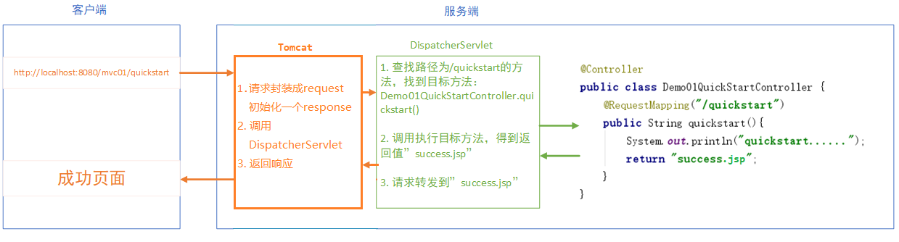
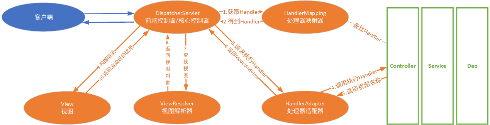
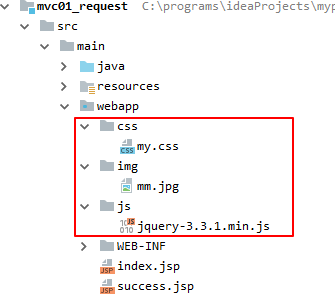
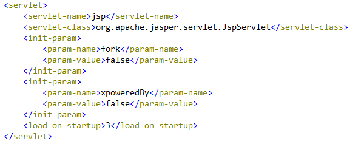
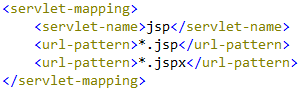
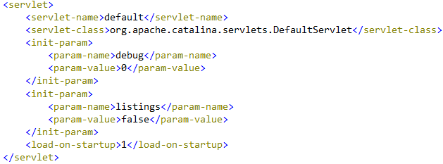
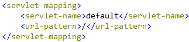
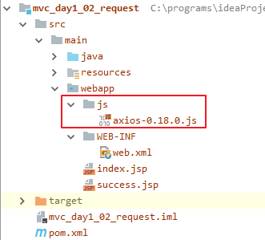
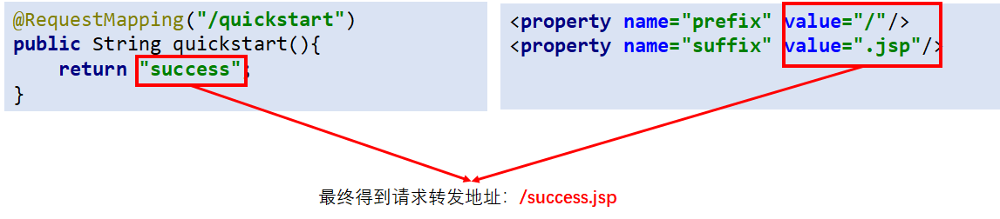

# SpringMVC第1天

* AOP：面向切面编程，目的 在不修改源码的情况下，进行功能增强，本质是 动态代理

  * Target：目标对象
  * Proxy：代理对象
  * JoinPoint：连接点，目标对象里可以增强的方法
  * PointCut：切入点，要增强的方法
  * Advice：通知，功能增强的代码
  * **Aspect：切面 = 切入点 + 通知**
  * Weaving：织入，把切入点 和 通知进行结合，生成代理对象的过程

* XML的AOP

  ```xml
  <aop:config>
  	<aop:pointcut id="" expression="切入点表达式"/>
      <aop:aspect ref="通知对象">
      	<aop:before method="前置通知方法" pointcut-ref="切入点表达式id"/>
          <aop:after-returning method="后置通知方法" pointcut-ref="切入点表达式id"/>
          <aop:after-throwing method="异常通知方法" pointcut-ref="切入点表达式id"/>
          <aop:after method="最终通知方法" pointcut-ref="切入点表达式id"/>
          <aop:around method="环绕通知方法" pointcut-ref="切入点表达式id"/>
      </aop:aspect>
  </aop:config>
  ```

* 注解的AOP

  * 在通知类上加注解：`@Aspect`，声明成切面类
  * 在通知类里的方法上加注解：
    * `@Before, @AfterReturning, @AfterThrowing, @After, @Around`
  * 开启AOP自动代理

  ```xml
  <aop:aspectj-autoproxy/>
  ```

* XML的事务

  ```xml
  <bean id="txManager" class="DataSourceTransactionManager全限定类名">
  	<property name="dataSource" ref="连接池对象"/>
  </bean>
  
  <tx:advice id="txAdvice" transaction-manager="txManager">
  	<tx:attributes>
      	<tx:method name="*"/>
      </tx:attributes>
  </tx:advice>
  
  <aop:config>
  	<aop:advisor advice-ref="txAdvice" pointcut="切入点表达式"/>
  </aop:config>
  ```

* 注解的事务

  * 哪个方法上需要事务，就增加注解`@Transactional`
  * 在xml里进行配置

  ```xml
  <bean id="txManager" class="DataSourceTransactionManager全限定类名">
  	<property name="dataSource" ref="连接池对象"/>
  </bean>
  
  <tx:annotation-driven transaction-manager="txManager"/>
  ```

  

## 一、简介

### 1. 三层架构和MVC

#### 三层架构回顾

* web层：和客户端交互的
* service层：处理业务功能逻辑的
* dao层：操作数据库的

#### MVC模式

* 体现在web层：
  * M：Model，模型层
  * V：View，视图层
  * C：Controller，控制层

### 2. SpringMVC简介

#### 1. 什么是SpringMVC

* SpringMVC是一种基于Java的、实现MVC设计模型的、请求驱动类型的(基于HTTP协议)、轻量级Web框架，属于 Spring FrameWork 的后续产品。Spring 框架提供了构建 Web 应用程序的全功能 MVC 模块。 
* SpringMVC已经成为目前最主流的 MVC 框架之一，并且随着Spring3.0的发布，全面超越 Struts2，成为最优秀的 MVC 框架。 
* 它通过一套注解，让一个简单的Java类成为处理请求的控制器，而无须实现任何接口（跟Servlet对比）。同时它还支持RESTful编程风格的请求。

#### 2. SpringMVC的优势

1. 清晰的角色划分： 

   * 前端控制器（DispatcherServlet） 

   * 请求到处理器映射（HandlerMapping） 
   * 处理器适配器（HandlerAdapter） 
   * 视图解析器（ViewResolver） 
   * 处理器或页面控制器（Controller） 
   * 验证器（ Validator）
   * 命令对象（Command 请求参数绑定到的对象就叫命令对象） 
   * 表单对象（Form Object 提供给表单展示的对象就叫表单对象）。

2. 分工明确，而且扩展点相当灵活，可以很容易扩展，虽然几乎不需要。
3. 由于命令对象就是一个POJO，无需继承框架特定API，可以使用命令对象直接作为业务对象。
4. 和Spring 其他框架无缝集成，是其它Web框架所不具备的。 
5. 可适配，通过HandlerAdapter可以支持任意的类作为处理器。 
6. 可定制性，HandlerMapping、ViewResolver等能够非常简单的定制。 
7. 功能强大的数据验证、格式化、绑定机制。 
8. 利用Spring提供的Mock对象能够非常简单的进行Web层单元测试。 
9. 本地化、主题的解析的支持，使我们更容易进行国际化和主题的切换。 
10. 强大的JSP标签库，使JSP编写更容易。 
11. ………………还有比如RESTful风格的支持、简单的文件上传、约定大于配置的契约式编程支持、基于注解的零配置支持等等

#### 3. SpringMVC和Struts的对比【了解】

* 共同点： 

  * 它们都是表现层（web层）框架，都是基于MVC模型编写的。 
  * 它们的底层都离不开原始ServletAPI。 
  * 它们处理请求的机制都是一个核心控制器。

*  区别： 

  * Spring MVC 的入口是 Servlet, 而 Struts2 是 Filter

  * Spring MVC 是基于方法设计的，而Struts2是基于类，Struts2每次执行都会创建一个动作类。所以Spring MVC 会稍微比 Struts2 快些。

  *  Spring MVC 使用更加简洁,同时还支持 JSR303, 处理 ajax 的请求更方便

    > JSR303 是一套JavaBean参数校验的标准，它定义了很多常用的校验注解，我们可以直接将这些注解加在我们JavaBean的属性上面，就可以在需要校验的时候进行校验了。)

  * Struts2 的OGNL 表达式使页面的开发效率相比Spring MVC 更高些，但执行效率并没有比JSTL提升，尤其是struts2的表单标签，远没有html执行效率高。

## 二、快速入门【重点】

### 需求描述

* 客户端发请求到服务端，执行控制器的方法，然后跳转到成功页面success.jsp

### 需求分析

1. 准备工作
   1. 创建web项目，导入依赖
   2. 创建页面：`success.jsp`
2. 编写控制器：
   1. `Demo01QuickStartController`（类似于Servlet，和客户端进行交互）
3. 提供SpringMVC配置
   1. 编写`springmvc.xml`，开启组件扫描（Spring的配置文件）
   2. 修改`web.xml`配置SpringMVC的前端控制器
4. 部署测试

### 需求实现

#### 1. 准备工作

##### 1.1 创建web项目，导入依赖

```xml
<dependencies>
    <!--springmvc-->
    <dependency>
        <groupId>org.springframework</groupId>
        <artifactId>spring-webmvc</artifactId>
        <version>5.0.2.RELEASE</version>
    </dependency>
    <!--jsp-api-->
    <dependency>
        <groupId>javax.servlet.jsp</groupId>
        <artifactId>javax.servlet.jsp-api</artifactId>
        <version>2.3.1</version>
        <scope>provided</scope>
    </dependency>
    <!--servlet-api-->
    <dependency>
        <groupId>javax.servlet</groupId>
        <artifactId>javax.servlet-api</artifactId>
        <version>3.1.0</version>
        <scope>provided</scope>
    </dependency>
</dependencies>
```

##### 1.2 创建页面：

* `success.jsp`

```jsp
<%@ page contentType="text/html;charset=UTF-8" language="java" %>
<html>
<head>
    <title>成功</title>
</head>
<body>
<h1>成功页面</h1>
</body>
</html>
```

#### 2. 编写控制器

* 在`com.itheima.controller`包中创建类`Demo01QuickStartController`
* 类上增加`@Controller`注解，声明成为一个bean
* 创建`quickstart`方法，并在方法上增加`@RequestMapping`注解，声明方法的访问路径

```java
@Controller
public class Demo01QuickStartController {
    
    @RequestMapping("/quickstart")
    public String quickstart(){
        System.out.println("quickstart......");
        //跳转到success.jsp页面
        return "/success.jsp";
    }
}
```

#### 3. 提供SpringMVC配置

##### 3.1 编写配置文件`springmvc.xml`

* 在`resources`中创建springmvc的配置文件`springmvc.xml`
* 要开启组件扫描

```xml
<?xml version="1.0" encoding="UTF-8"?>
<beans xmlns="http://www.springframework.org/schema/beans"
       xmlns:context="http://www.springframework.org/schema/context"
       xmlns:mvc="http://www.springframework.org/schema/mvc"
       xmlns:xsi="http://www.w3.org/2001/XMLSchema-instance"
       xsi:schemaLocation="http://www.springframework.org/schema/beans
        http://www.springframework.org/schema/beans/spring-beans.xsd
        http://www.springframework.org/schema/context
        http://www.springframework.org/schema/context/spring-context.xsd
        http://www.springframework.org/schema/mvc
        http://www.springframework.org/schema/mvc/spring-mvc.xsd">

    <!--开启组件扫描-->
    <context:component-scan base-package="com.itheima.controller"/>
</beans>
```

##### 3.2 修改配置文件`web.xml`

* 在`webapp/WEB-INF/web.xml`中配置前端控制器`DispatcherServlet`

```xml
<?xml version="1.0" encoding="UTF-8"?>
<web-app xmlns="http://xmlns.jcp.org/xml/ns/javaee"
         xmlns:xsi="http://www.w3.org/2001/XMLSchema-instance"
         xsi:schemaLocation="http://xmlns.jcp.org/xml/ns/javaee http://xmlns.jcp.org/xml/ns/javaee/web-app_4_0.xsd"
         version="4.0">
    <!--配置SpringMVC的前端控制器-->
    <servlet>
        <servlet-name>dispatcherServlet</servlet-name>
        <servlet-class>org.springframework.web.servlet.DispatcherServlet</servlet-class>
        <!-- 指定springmvc配置文件的位置 -->
        <init-param>
            <param-name>contextConfigLocation</param-name>
            <param-value>classpath:springmvc.xml</param-value>
        </init-param>
        <!-- 设置DispatcherServlet控制器，当服务器一启动时就创建对象 -->
        <load-on-startup>1</load-on-startup>
    </servlet>
    <servlet-mapping>
        <servlet-name>dispatcherServlet</servlet-name>
        <url-pattern>/</url-pattern>
    </servlet-mapping>
</web-app>    
```

#### 4. 部署测试

* 把项目部署到tomcat中，设置项目路径为`/mvc01`，启动tomcat
* 使用浏览器访问：`http://localhost:8080/mvc01/quickstart`
* `quickstart`方法被访问到，并且页面跳转到了`success.jsp`

### 步骤小结

1. 准备工作
   * 创建web项目
   * 在pom.xml里导入依赖：`spring-webmvc,  servlet-api, jsp-api`
2. 编写Controller类
3. 编写springmvc.xml：开启组件扫描
4. 修改web.xml：配置前端控制器DispatcherServlet

## 三、配置详解

### 1. 原理分析

#### 请求和响应的过程



#### SpringMVC的详细执行流程【面试】



##### 1 SpringMVC的三大组件

* `HandlerMapping`处理器映射器
  * 作用：根据客户端请求的资源路径，查找匹配的`Controller`及拦截器链
* `HandlerAdapter`处理器适配器
  * 作用：用于适配调用不同的`Controller`，得到模型和视图
* `ViewResolver`视图解析器
  * 作用：用于解析视图，根据视图路径找到真实视图（页面）

##### 2 SpringMVC的详细执行流程

1. 客户端发请求到`DispatcherServlet`
2. `DispatcherServlet`
   1. 通过`HandlerMapping`处理器映射器，根据请求路径，查找匹配的`Controller`及拦截器
   2. 得到要执行的`Controller`和拦截器（执行链）
3. `DispatcherServlet`
   1. 通过`HandlerAdapter`处理器适配器，调用控制器`Controller`
   2. 得到`ModelAndView`对象（其中View指视图路径，Model要响应的数据对象）
4. `DispatcherServlet`
   1. 通过`ViewResolver`解析视图，得到真实视图（视图路径对应的页面）
   2. 渲染视图（把Model里的数据填充到View里）
5. 把最终渲染的结果，响应到客户端

##### 3 需要我们做的事情有：

* 编写代码：
  * 编写`Handler`控制器，即web层的`Controller`
  * 编写`View`视图，即页面
* 提供配置：
  * 提供`springmvc.xml`配置文件，用于：
    * 开启组件扫描：`<context:component-scan ... />`
    * 其它配置
  * 修改web.xml配置文件
    * 用于配置`DispatcherServlet`核心控制器，并读取Spring配置文件
    * 其它配置

#### 小结


### 2. `springmvc.xml`配置详解

#### 基本配置示例

```xml
<!--开启组件扫描-->
<context:component-scan base-package="com.itheima.controller"/>

<!--开启mvc的注解驱动-->
<mvc:annotation-driven/>

<!--视图解析器-->
<bean class="org.springframework.web.servlet.view.InternalResourceViewResolver">
    <property name="prefix" value="/"/>
    <property name="suffix" value=".jsp"/>
</bean>

<!-- 静态资源的配置：让SpringMVC不处理静态资源 -->
<mvc:default-servlet-Handler/>
```

#### mvc的注解驱动

##### 配置语法

```xml
<mvc:annotation-driven/>
```

##### 配置说明

- 在SpringMVC中，处理器映射器，处理器适配器，视图解析器 被称为三大组件
- 在springmvc.xml中配置`<mvc:annotation-driven/>`标签，可以加载SpringMVC的组件
  - 如果没有此项配置，SpringMVC也会自动加载一些默认组件，所以快速入门中，不配置这一项也可以
  - 但是后边课程中，这个标签还有其它作用，所以要配置上

#### 视图解析器配置

##### 1) 视图路径的配置方式

- SpringMVC把显示层的内容称为视图，例如JSP页面就是视图。在`Controller`的方法中，返回的字符串就是跳转的视图路径
- 视图的路径有两种写法：
  - 物理视图：`/success.jsp`，即：视图的真实路径（完整路径）
    - 直观，但是写起来麻烦
  - 逻辑视图：`success`，需要配合视图解析器，才能得到真实路径
    - 不直观，但是写起来简单

##### 2) 物理视图的配置方式

* 在`Controller`的方法中，直接返回物理视图路径。
* **不需要**配置视图解析器

```java
@RequestMapping("/quickstart")
public String quickstart(){
    System.out.println("quickstart......");
    return "/success.jsp";
}
```

##### 3) 逻辑视图的配置方式

- 在`springmvc.xml`中增加以下内容：

```xml
<bean class="org.springframework.web.servlet.view.InternalResourceViewResolver">
    <property name="prefix" value="/"/>
    <property name="suffix" value=".jsp"/>
</bean>
```

- 在`Controller`中修改代码，简化方法返回值

```java
@Controller
public class Demo01QuickStartController {
    
    @RequestMapping("/quickstart")
    public String quickstart(){
        System.out.println("quickstart......");
        return "success";
    }
}
```

- 由视图解析器，帮我们把`prefix + "success" + suffix`，拼接成物理视图`/success.jsp`

#### 静态资源处理

##### 请求静态资源的说明

* 使用SpringMVC时，客户端访问静态资源时，会访问不到
  * 默认情况下，客户端对静态资源的请求，都会由SpringMVC的`DispatcherServlet`来处理
  * 但是`DispatcherServlet`没有处理静态资源的能力，所以：默认情况下，是访问不到静态资源的

  

##### 两种配置方式解决问题

###### 方案一：指定静态资源的位置

* 针对客户端对静态资源的请求，指定资源所在的位置。让SpringMVC直接去指定目录下加载
* 示例：

```xml
<!-- 
	mapping：客户端请求的路径
	location：资源所在的位置
-->
<mvc:resources mapping="/js/**" location="/js/"/>
<mvc:resources mapping="/img/**" location="/img/"/>
<mvc:resources mapping="/css/**" location="/css/"/>
```

###### 方案二：由Tomcat处理静态资源(推荐)

* 如果客户端请求了静态资源，DispatcherServlet处理不了，就交给Tomcat的原生Servlet来处理
* 示例：

```xml
<mvc:default-servlet-handler/>
```

#### 小结

* 在springmvc.xml里需要有的配置

```xml
<!-- 开启组件扫描  -->
<context:component-scan base-pacakge="com.itheima.controller"/>

<!-- 开启mvc注解驱动：让SpringMVC加载组件 -->
<mvc:annotation-driven/>

<!-- 配置视图解析器：方法返回值 需要由视图解析器拼接得到真实路径  prefix+返回值+suffix -->
<bean class="InternalResourceViewResolver全限定类名">
	<property name="prefix" value="/pages/"/>
    <property name="suffix" value=".jsp"/>
</bean>

<!-- 处理静态资源 -->
<mvc:default-servlet-handler/>
```


### 3. `web.xml`的配置

#### 配置示例

```xml
<?xml version="1.0" encoding="UTF-8"?>
<web-app xmlns="http://xmlns.jcp.org/xml/ns/javaee"
         xmlns:xsi="http://www.w3.org/2001/XMLSchema-instance"
         xsi:schemaLocation="http://xmlns.jcp.org/xml/ns/javaee http://xmlns.jcp.org/xml/ns/javaee/web-app_4_0.xsd"
         version="4.0">

    <!--配置SpringMVC的前端控制器-->
    <servlet>
        <!--配置SpringMVC名称-->
        <servlet-name>dispatcherServlet</servlet-name>
         <!--导入前端控制器的权限定类名-->
        <servlet-class>org.springframework.web.servlet.DispatcherServlet</servlet-class>
        <!--指定springmvc.xml配置文件的位置-->
        <init-param>
            <param-name>contextConfigLocation</param-name>
            <param-value>classpath:springmvc.xml</param-value>
        </init-param>
        <!--设置dispatcherServlet控制器,当服务器一启动时就创建对象-->
        <!--服务器启动时，就创建DispatcherServlet对象-->
        <load-on-startup>1</load-on-startup>
    </servlet>

    <!--前端控制器的映射器==>配置路径==>对接前端控制器的名称-->
    <servlet-mapping>
        <servlet-name>dispatcherServlet</servlet-name>
        <!--路径为/,表示覆盖掉Tomcat默认的Servlet,处理客户端-->
        <url-pattern>/</url-pattern>
    </servlet-mapping>
</web-app>
```

#### 配置说明

* `load-on-startup`：配置Servlet的创建时机，值是整数
  * 如果是正整数，表示服务器一启动就要创建Servlet对象。数值越小，创建的越早
  * 如果是0或者负数，表示默认的：第一次访问时，创建Servlet对象
  * `DispatcherServlet`是SpringMVC一切功能的基础和核心，要求：服务器启动时就创建，并且要最早创建，所以设置值为1
* `init-param`：配置Servlet的初始化参数
  * `contextConfigLocation`：配置springmvc.xml的路径，让DispatcherServlet被创建时，加载配置文件，初始化Spring容器
* `url-pattern`：配置Servlet的路径，通常配置为`/`

#### 拓展：`DispatcherServlet`配置成`/`和`/*`的区别：


* **相同点**：两种配置都表示拦截所有请求
* **不同点**：对JSP的处理不同。当客户端请求了`xxx.jsp`时
  * 如果`DispatcherServlet`配置的是`/*`，不能正常访问JSP
    * `/*`是目录匹配，优先级高于扩展名匹配（Tomcat里有`JspServlet`，路径是`*.jsp`）
    * 必定是由`DispatcherServlet`来处理JSP，但是DispatcherServlet不具备查找和处理jsp的能力，会报404
  * 如果`DispatcherServlet`配置的是`/`，可以正常访问JSP
    * `/`是缺省匹配，优先级低于扩展名匹配（Tomcat里有`JspServlet`，路径是`*.jsp`）
    * 必定是由Tomcat来处理JSP，Tomcat本身具备查找和处理JSP的能力，可以正常访问JSP

> 知识回顾：Servlet的`urlPatterns`配置
>
> * 配置语法：
>
>   * 完全匹配的路径：例如`/demo`，客户端必须请求`/demo`才可以访问到这个Servlet
>
>   * 目录匹配的路径：以`/`开头，`/*`结尾：例如：
>
>     * `/*`：客户端的一切请求都会交给Servlet来处理
>     * `/admin/*`：客户端请求`/admin/任意`会访问到这个Servlet
>
>   * 扩展名匹配的路径：以`*`开头，以扩展名结尾。例如：
>
>     * `*.jsp`：客户端请求`任意.jsp`会访问到这个Servlet
>     * Tomcat提供了处理jsp的Servlet：`org.apache.jasper.servlet.JspServlet`
>
>     
>
>   * 缺省匹配的路径：`/`。
>
>     * 客户端请求的路径，没有任何Servlet可以匹配到，就会由缺省匹配来处理
>     * Tomcat提供了缺省Servlet：`org.apache.catalina.servlets.DefaultServlet`
>       * 缺省Servlet提供了处理静态资源的能力
>
>     
>
> * 以上四种配置语法，匹配的优先级是：
>
>   * 完全匹配 > 目录匹配 > 扩展名匹配 > 缺省匹配。
>   * 如果有多个Servlet的路径属于同一类，并且都能处理同一请求，那么匹配度更高的生效

#### 小结

* DispatcherServlet路径配置为`/`

### 4. `Controller`的配置

#### 配置示例

```java
@Controller//必须声明成bean对象
@RequestMapping("/demo02") 
public class Demo02MappingController {

    @RequestMapping("/demo")
    public String demo(){
        System.out.println("demo......");
        return "success";
    }
}
```

####  `@RequestMapping`注解

* 作用：通常用在`Controller`里，用于设置访问路径

#####  注解语法

```java
@RequestMapping(
	value="访问路径",
    method=请求方式,
    params="请求参数"
)
```

* 常用属性：
  * value/path：访问路径，即：什么路径能够访问到这个方法
  * method：请求方式，即：什么请求方式能够访问这个方法。从枚举`RequestMethod`中取值
    * `RequestMethod.POST`：必须是POST方式，才可以访问到
    * `RequestMethod.GET`：必须是GET方式，才可以访问到
  * params：请求参数，即：请求携带了什么样的参数能够访问这个方法（了解）
    * `params="username"`：必须提交了 名称为username的表单参数，才可以访问
    * `params="username=tom"`：必须提交了 名称为username、值为tom的表单参数，才可以访问
    * `params="username!=tom"`：提交了表单参数  名称为username、值不是tom， 才可以访问
* 如果注解用在Controller类上
  * 表示设置访问路径的一级目录，要和方法上的路径组装成访问路径。用于模块化管理，例如：
    * 类上有注解`@RequestMapping("/user")`
    * 类里方法上有注解`@RequestMapping("/save")`
    * 那么方法的访问路径是：`/user/save`

##### 使用示例

```java
@Controller
@RequestMapping("/demo02")
public class Demo02MappingController {

    //   /demo02/mapping 能访问到
    @RequestMapping("/mapping")
    public String mapping(){
        System.out.println("mapping");
        return "success";
    }

    //   /demo02/method，必须是POST方式才能访问到
    @RequestMapping(value = "/method", method = RequestMethod.POST)
    public String method(){
        System.out.println("method");
        return "success";
    }

    //   /demo02/params，必须带有名称为username的表单参数，才能访问到
    @RequestMapping(value = "/params", params = {"username"})
    public String params(){
        System.out.println("params");	
        return "success";
    }
}
```

#### 小结

```java
@RequestMapping(
	value="映射路径",
    method=RequestMethod.POST,
    params="请求参数"
)
```

* value/path映射路径：客户端必须按照映射路径发请求，才可以访问到
* method请求方式：客户端必须按照要求的请求方式发请求，才可以访问到
* params请求参数：客户端必须携带要求的请求参数发请求，才可以访问到

## 四、获取请求数据

### 1. 接收表单参数【重点】

#### `@RequestParam`绑定参数

* 介绍：把指定请求参数赋值给方法中的指定形参
* 语法：`@RequestParam(value="表单参数名称", required=是否必须)`
* 属性：
  * `value`：指定客户端提交的表单参数名称
  * `required`：客户端是否必须提供此参数
  * `defaultValue`：默认参数值
* 作用位置：用在方法参数上，表示把指定名称表单参数值，赋值给方法参数

##### 使用示例

* 需求：
  * 页面提交参数：name和age
  * 在服务端接收参数值

* 页面

```jsp
<a href="${pageContext.request.contextPath}/param/requestParam?name=jack">@RequestParam</a><br>
```

* `Controller`里增加方法

```java
/**
 * @author liuyp
 * @date 2020/04/09
 */
@Controller
@RequestMapping("/other")
public class Demo02OtherController {

    @RequestMapping("/requestParam")
    public String requestParam(@RequestParam(value = "name", required = false, defaultValue = "aaa") String username){
        System.out.println(username);
        return "success";
    }
}
```

#### 简单参数绑定

* 如果客户端提交的表单参数名称，和Controller里方法参数名称一样，Spring会把表单数据直接绑定到方法参数上

##### 要求：

* 客户端提交的表单参数名称， 和Controller里方法参数名称相同
* SpringMVC会自动绑定同名参数，并自动转换类型

##### 示例：

* 页面

```jsp
<a href="${pageContext.request.contextPath}/param/simple?name=tom&age=20">简单参数</a>
<br/>
```

* `Controller`里增加方法

```java
/**
 * @author liuyp
 * @date 2020/04/09
 */
@Controller
@RequestMapping("/param")
public class Demo01ParamController {

    @RequestMapping("/simple")
    public String simpleParam(String name, Integer age){
        System.out.println(name + ", " + age);
        return "success";
    }
}
```

#### 日期参数类型转换

##### 要求：

* 客户端提交的表单参数名称， 和服务端方法参数名称相同
* 客户端提交的参数有日期，服务端以`Date`类型接收

##### 配置日期类型转换器

* 说明：
  * SpringMVC能够自动转换简单类型的值
  * SpringMVC能够把`yyyy/MM/dd`格式的字符串，转换成为`Date`对象；但是其它格式不能
* 解决：
  * SpringMVC支持自定义类型转换器，可以自己设置类型转换
  
  * 步骤如下：
    * 创建类，实现类型转换器接口：`Converter<S, T>`， 重写`convert()`方法
      * `S`：源数据的类型
      * `T`：目标数据的类型
    * 在`springmvc.xml`中注册类型转换器，语法如下：

```xml
<mvc:annotation-driver conversion-service="conversionService"/>

<bean id="conversionService" 
      class="org.springframework.context.support.ConversionServiceFactoryBean">
	<property name="converters">
    	<set>
        	<bean class="自定义类型转换器的全限定类名"/>
        </set>
    </property>
</bean>
```

##### 示例：

* 自定义类型转换器`DateConverter`

```java
import org.springframework.core.convert.converter.Converter;

import java.text.SimpleDateFormat;
import java.util.Date;

/**
 * 日期类型转换器
 * @Author: wzw
 * @Date: 2020/10/31 17:54
 * @version: 1.8
 */
public class MyDateConverter implements Converter<String, Date> {

    private SimpleDateFormat format = new SimpleDateFormat();

    @Override
    public Date convert(String source) {
        if(source == null){
            throw new RuntimeException("日期不能为空,不能转换");
        }

        try {
            //尝试以yyyy-MM-dd
            format.applyPattern("yyyy-MM-dd");
            //解析成功,直接返回结果
            return format.parse(source);
        } catch (Exception e) {
        }

        //这里可以加格式一样的(形参不同)
//        try {
//            //尝试以自定义时间形式显示
//            format.applyPattern("更改点");
//            //解析成功,直接返回结果
//            return format.parse(source);
//        } catch (ParseException e) {
//        }

        try {
            //尝试以yyyy/MM/dd
            format.applyPattern("yyyy/MM/dd");
            //解析成功,直接返回结果
            return format.parse(source);
        } catch (Exception e) {
            throw new RuntimeException("不支持的日期格式");
        }
    }
}

```

* 在`springmvc.xml`里注册类型转换器

```xml
 <!--开启MVC注解驱动-->
    <mvc:annotation-driven conversion-service="conversionService" />
    <!--类型转换器的配置-->
    <bean id="conversionService" class="org.springframework.context.support.ConversionServiceFactoryBean">
        <property name="converters">
            <set>
                <!--<bean class="类型转换器全限定类名"/>
                    如果还有其他的类型转换器可以按照以上模板添加
                -->
                <bean class="com.wzw.converters.MyDateConverter"/>
            </set>
        </property>
    </bean>
```

* 页面

```jsp
<a href="${pageContext.request.contextPath}/param/date?name=tom&birthday=2000/02/02">日期参数：yyyy/MM/dd格式</a><br>
<a href="${pageContext.request.contextPath}/param/date?name=tom&birthday=2000-02-02">日期参数：yyyy-MM-dd格式</a><br>
```

* `Controller`里增加方法

```java
@RequestMapping("/date")
public String dateParam(String name, Date birthday) {
    System.out.println(name + ", " + birthday);
    return "success";
}
```

##### 类型转换器的步骤小结

1. 创建一个类型转换器：

   * 创建Java类，实现`Converter<S,T>`，重写`converter`方法

2. 注册类型转换器

   * 修改springmvc.xml

   ```xml
   <mvc:annotation-driven conversion-service=""/>
   
   <bean id="conversionService" class="ConversionServiceFactoryBean的全限定类名">
   	<property name="converters">
       	<set>
           	<bean class="我们写的类型转换器的全限定类名"/>
           </set>
       </property>
   </bean>
   ```

   

#### 绑定POJO对象

##### 要求

* SpringMVC会帮我们自动把表单参数，封装成POJO对象，但是要求：
  * 服务端有JavaBean（POJO）类，里边有多个属性
  * 客户端提交的表单参数名称，必须等于JavaBean的属性名

##### 示例

* 创建JavaBean：`User`
  * 注意：JavaBean中有日期类型，所以需要注册了日期类型转换器

```java
public class User {
    private String name;
    private Integer age;
    private Date birthday;

    //get/set...
    //toString...
}
```

* jsp

```jsp
<a href="${pageContext.request.contextPath}/param/pojo?name=jack&age=20&birthday=2020/01/01">POJO参数</a>
```

* `Demo02RequestParamController`里增加方法

```java
@RequestMapping("/pojo")
public String pojoParam(User user){
    System.out.println(user);
    return "success";
}
```

#### 绑定复杂POJO

##### 要求

* 通常把List、Map等放到POJO对象里
* 客户端提交的表单参数名称，必须和POJO里的属性名称相等
  * 设置List的数据时，表单参数名称：`属性名[索引].属性名`
  * 设置Map的数据时，表单参数名称：`属性名['key'].属性名`

##### 示例

* 创建JavaBean：`QueryVO`


```java
public class QueryVO {
    private User user;
    private List<User> userList;
    private Map<String, User> userMap;

    //get/set...
    //toString...
}
```

* 页面

```jsp
<form action="${pageContext.request.contextPath}/param/complexPojo" method="post">
    <h5>vo里的user</h5>
    <input type="text" name="user.name" value="tom"><br>
    <input type="text" name="user.age" value="20"><br>
    <h5>vo里的userList</h5>
    <input type="text" name="userList[0].name" value="tom1"><br>
    <input type="text" name="userList[0].age" value="21"><br>
    <input type="text" name="userList[1].name" value="tom2"><br>
    <input type="text" name="userList[1].age" value="22"><br>
    <h5>vo里的userMap</h5>
    <input type="text" name="userMap['u1'].name" value="jack1"><br>
    <input type="text" name="userMap['u1'].age" value="31"><br>
    <input type="text" name="userMap['u2'].name" value="jack2"><br>
    <input type="text" name="userMap['u2'].age" value="32"><br>
    <br>
    <input type="submit" value="提交">
</form>
```

* `Controller`里增加方法

```java
@RequestMapping("/complexPojo")
public String pojoParam2(QueryVO vo){
    System.out.println(vo);
    return "success";
}
```

#### 中文参数乱码的解决

##### 说明

* 如果请求参数或者响应中有中文，就会乱码。在web阶段，我们通过一个自定义的过滤器实现了统一乱码解决
* 现在SpringMVC本身 ，也给我们提供了一个过滤器`CharacterEncodingFilter`，用于解决乱码问题

##### 解决方案

* 在`web.xml`中，配置过滤器`CharacterEncodingFilter`

```xml
<filter>
    <filter-name>characterEncodingFilter</filter-name>
    <filter-class>org.springframework.web.filter.CharacterEncodingFilter</filter-class>
    <init-param>
        <param-name>encoding</param-name>
        <param-value>utf-8</param-value>
    </init-param>
</filter>
<filter-mapping>
    <filter-name>characterEncodingFilter</filter-name>
    <url-pattern>/*</url-pattern>
</filter-mapping>
```

#### 小结

* 如果表单参数要转换成我们想要的类型，可以`自定义类型转换器`

  1. 创建类型转换器：Java类，实现`Converter<源类型,目标类型>`接口，重写convert方法

  ```java
  public class MyConverter implements Converter<String, Date>{
      
      public Date convert(String source){
          //自己编写逻辑代码，把String类型的source，转换成目标类型Date
      }
  }
  ```

  2. 在springmvc.xml注册类型转换器

  ```xml
  <mvc:annotation-driven conversion-service="conversionService"/>
  <bean id="conversionService" class="org.springframework.context.support.ConversionServiceFactoryBean">
      <property name="converters">
          <set>
              <bean class="com.itheima.converters.MyConverter"/>
              <!--<bean class="类型转换器全限定类名"/>-->
          </set>
      </property>
  </bean>
  ```

  

### 2. 其它常用注解

#### `@RequestBody`

##### 注解`@RequestBody`

* 语法：`@RequestBody(requried=是否必须有请求体)`
* 作用位置：用于方法的参数上，表示把请求体的数据，赋值给方法参数
* 要求：必须是POST方式提交
  * 只有POST方式提交，才有请求体；GET方式提交，没有请求体

##### 使用示例

###### 直接接收请求体内容

需求描述

* 页面上有一个表单，用POST方式提交了表单参数
* 要求在Controller里接收请求体里的所有内容

需求实现

* jsp

```jsp
<form action="${pageContext.request.contextPath}/other/body" method="post">
    <input type="text" name="username"><br>
    <input type="password" name="password"><br>
    <input type="submit" value="post提交">
</form>
```

* Controller

```java
@RequestMapping("/body")
public String body(@RequestBody String queryString){
    System.out.println(queryString);
    return "success";
}
```

##### 接收json格式的请求体【拓展了解】

###### 需求描述

* 客户端发Ajax请求，提交json格式的数据
* 服务端接收json格式的数据，直接封装成User对象

###### 前提条件

* pom.xml中添加jackson的依赖：

```xml
<dependency>
    <groupId>com.fasterxml.jackson.core</groupId>
    <artifactId>jackson-databind</artifactId>
    <version>2.9.6</version>
</dependency>
```

* springmvc.xml中，增加配置  SpringMVC不处理静态资源

```xml
<!--配置SpringMVC不处理静态资源-->
<mvc:default-servlet-handler/>
```

###### 需求实现

* 把axios拷贝到工程的js文件夹里，如图：



* jsp：使用axios发异步请求

```jsp
@RequestBody的Javabean提交[常用方式],可Ajax提交Json格式<br/>

<%--提交按钮--%>
<input type="button" value="axios提交json格式" onclick="submitJson()">
<%--引入Ajax.js--%>
<script src="${pageContext.request.contextPath}/js/axios-0.18.0.js"></script>
<script>
    <%--提供单机方法--%>
    function submitJson(){
        //Ajax需要的路径
        var url = "${pageContext.request.contextPath}/other/requestBodyPojo";
        //json的参数
        var data = {
            name:"wzw",
            age:20,
            birthday:"2000/10/18"
        };
        //Ajax的post提交
        axios.post(url,data);
    }
</script>
```

* Controller

```java
@RequestMapping("/requestBodyPojo")
    public String bodyPojo(@RequestBody User user){
        System.out.println(user);
        //Ajax提交不跳转页面
        return "success";
    }
```

* Pojo

  * 在日期过滤器中是过滤不了Json格式的数据的以下
  * `@JsonFormat(pattern="日期格式")`注解可以解决Json格式封装日期问题

  ```java
  package com.wzw.pojo;
  
  import com.fasterxml.jackson.annotation.JsonFormat;
  
  import java.util.Date;
  
  /**
   * @Author: wzw
   * @Date: 2020/11/2 17:23
   * @version: 1.8
   */
  public class User {
      private String name;
      private Integer age;
      @JsonFormat(pattern = "yyyy/MM/dd")
      private Date birthday;
  
      @Override
      public String toString() {
          return "User{" +
                  "name='" + name + '\'' +
                  ", age=" + age +
                  ", birthday=" + birthday +
                  '}';
      }
  
      public String getName() {
          return name;
      }
  
      public void setName(String name) {
          this.name = name;
      }
  
      public Integer getAge() {
          return age;
      }
  
      public void setAge(Integer age) {
          this.age = age;
      }
  
      public Date getBirthday() {
          return birthday;
      }
  
      public void setBirthday(Date birthday) {
          this.birthday = birthday;
      }
  }
  
  ```

#### `@PathVariable`

##### RESTful编程风格

* REST：Representational State Transfer，是一种编程风格，没有明确的标准。Spring提供的`@PathVariable`，是其支持RESTful风格的一个重要标志
* 特点：
  * 资源Resources：每个资源有独一无二的URI
  * 表现Representation：资源呈现的形式。例如：文本可以呈现为html、json、xml等等
  * 状态转换State Transfer：使用HTTP协议的不同请求方式，表示对资源的不同的操作
* 优点：结构清晰、符合标准、易于理解、扩展方便，所以正得到越来越多的网站采用
* 示例：
  * URI：`/user/1`， 请求方式：`HTTP GET`， 表示获取id为1的用户
  * URI：`/user/1`， 请求方式：`HTTP DELETE`， 表示删除id为1的用户
  * URI：`/user`， 请求方式：`HTTP PUT`， 表示更新用户
  * URI：`/user`，请求方式：`HTTP POST`，表示新增用户

##### 注解说明

* 作用：Spring3.0提供的，用于获取请求路径中的值，需要配合`@RequestMapping`使用
* 语法：`@PathVariable(value="占位符名称", required=是否必须)`
* 作用位置：用在方法参数上，表示获取请求路径中占位符的值，赋值给方法参数
* 例如：
  * 客户端请求：`http://localhost:8080/mvc01/delete/100`
  * `@RequestMapping("/delete/{id}")`：定义了占位符`{id}`
  * `@PathVariable("id")`：要获取占位符`{id}`位置的值100

##### 使用示例


* jsp

```jsp
<a href="${pageContext.request.contextPath}/other/pathVar/111">@PathVariable</a><br>
```

* Controller

```java
@RequestMapping("/pathVar/{id}")
public String pathVar(@PathVariable("id") Integer My_id){
    System.out.println(My_id);
    return "success";
}
```

#### `@RequestHeader`

##### 说明

* 语法：`@RequestHeader(value="请求头名称", required=是否必须)`
* 作用位置：用在方法参数上，把指定请求头的值，赋值给方法参数

##### 示例

* jsp

```jsp
<a href="${pageContext.request.contextPath}/other/head">@RequestHeader</a><br>
```

* 在`Controller`里增加方法

```java
@RequestMapping("/head")
public String header(@RequestHeader("host") String host){
    System.out.println(host);
    return "success";
}
```

#### `@CookieValue`

##### 说明

* 语法：`@CookieValue(value="cookie名称", requried=是否必须)`
* 作用位置：用在方法参数上，把指定名称的Cookie值，赋值给方法参数

##### 示例

* jsp

```jsp
<a href="${pageContext.request.contextPath}/other/cookie">@CookieValue</a><br>
```

* 在`Controller`里增加方法

```java
@RequestMapping("/cookie")
public String cookie(@CookieValue("JSESSIONID") String jSessionId){
    System.out.println(jSessionId);
    return "success";
}
```

#### 小结

* `@RequestBody`注解：
  * 在开发中，通常是用于接收客户端提交的json格式，还原成JavaBean对象
* `@PathVariable`注解：
  * 用于获取请求路径里的变量值，绑定给形参
* `@RequestHeader`注解：
  * 用于获取指定的请求头的值，绑定给形参  
* `@CookieValue`注解：
  * 用于获取指定名称的cookie值，绑定给形参 


### 3. 使用原始Servlet的API

#### 说明

* 在Controller的方法中，可以使用Servlet的原始API，只要在方法中直接定义参数即可，SpringMVC框架会提供对应的实参
* SpringMVC支持的Servlet原始API有：
  * **HttpServletRequest** ：代表HTTP请求
  * **HttpServletResponse** ：代表HTTP响应
  * **HttpSession** ：代表会话
  * java.security.Principal ：Java的授权认证接口，当前已认证的用户
  * Locale ：当前请求的语言环境
  * InputStream ：请求体的字节流对象
  * OutputStream ：响应体的字节流对象
  * Reader ：请求体的字符流对象
  * Writer：响应体的字符流对象

#### 示例

* 页面

```jsp
<a href="${pageContext.request.contextPath}/other/param?username=tom">
    提交参数:原生Servlet的API接收
</a>
```

* Controller

```java
/**
     * 用原生Servlet的API，接收客户端提交的参数
     *
     * @param request 请求对象
     */
@RequestMapping("/param")
public String param(HttpServletRequest request){
     //名字要对应传过来的参数
     String username = request.getParameter("username");
     System.out.println("用户名"+username);
     return "success";
    }
```

## 五、数据响应方式【重点】

### 1. 介绍

* 页面跳转并传递数据
  * 方法返回字符串的形式
  * 方法返回ModelAndView对象的形式
* 直接响应数据，通常是给Ajax引擎返回数据
  * 直接响应字符串
  * 返回对象或者集合（json格式）

### 2. 页面跳转并传递数据

#### 页面跳转

##### 两种方式介绍

###### 1. 直接返回逻辑视图名称

* 方法返回的字符串，和视图解析器里的前缀、后缀拼接得到真实路径，再进行跳转
* 是请求转发跳转



###### 2. 返回带有前缀的物理视图

* 请求转发：`forward:/success.jsp`
* 重定向：`redirect:/success.jsp`
* 注意：如果带有`forward`或者`redirect`，那么路径必须是真实路径

##### 使用示例

* Controller

```java
import org.springframework.stereotype.Controller;
import org.springframework.web.bind.annotation.RequestMapping;

/**
 * 跳转方式
 *      1.重定向
 *      2.请求转发
 * @Author: wzw
 * @Date: 2020/11/2 22:35
 * @version: 1.8
 */
@Controller
@RequestMapping("/jump")
public class MyJump {
    
    //请求转发跳转1
    @RequestMapping("/forward1")
    public String forward1(){
        System.out.println("请求转发跳转:由视图解析器拼接成真实路径");
        return "success";
    }
    
    //请求转发跳转2
    @RequestMapping("/forward2")
    public String forward2(){
        System.out.println("请求转发跳转:forward前缀 + 真实路径");

        //带有forward前缀的字符串,表示请求转发跳转
        return "forward:/success.jsp";
    }
    
    //重定向跳转
    @RequestMapping("/redirect")
    public String redirect(){
        System.out.println("重定向跳转:redirect前缀+真实路径");
        return "redirect:/success.jsp";
    }
}

```

* index.jsp

```jsp
<a href="${pageContext.request.contextPath}/jump/forward1">请求跳转1</a>
<a href="${pageContext.request.contextPath}/jump/forward2">请求跳转2</a>
<a href="${pageContext.request.contextPath}/jump/redirect">重定向跳转</a>
```

#### 请求转发并传递数据

##### `ModelAndView`说明

* `ModelAndView`是SpringMVC提供的组件之一，其中
  * `Model`，模型，用于封装数据（相当于放到了request域中）
  * `View`，视图，用于展示数据
* 如果我们设置了视图名称，并且封装了数据模型，SpringMVC会：
  * 把Model的数据放到request域对象中，然后请求转发到指定的视图
  * 我们可以视图页面中获取数据显示出来

##### 使用示例 

* Controller中
  * 

```java
/**
 * 方法里，我们自己创建ModelAndView
 *    设置viewName：视图名称
 *    设置view：传递的数据
 */
@RequestMapping("/testModelAndView1")
public ModelAndView testModelAndView1(){
    ModelAndView modelAndView = new ModelAndView();
    //设置封装数据
    modelAndView.addObject("username", "itcast");
    //设置视图名称
    modelAndView.setViewName("success");
    return modelAndView;
}

/**
 * 让框架提供一个ModelAndView，我们设置viewName和Model数据
 */
@RequestMapping("/testModelAndView2")
public ModelAndView testModelAndView2(ModelAndView modelAndView){
    //设置封装数据
    modelAndView.addObject("username", "itheima");
    //设置视图名称
    modelAndView.setViewName("success");

    return modelAndView;
}

/**
 * 让框架提供Model，用于封装数据
 * 我们返回一个String：是视图名称
 */
@RequestMapping("/testModelAndView3")
public String testModelAndView3(Model model){
    //设置封装数据
    model.addAttribute("username", "javaee");
    //返回视图名称
    return "success";
}

/**
 * 让框架提供request对象，我们向request域中存储数据
 * 方法返回字符串，是视图名称
 */
@RequestMapping("/testModelAndView4")
public String testModelAndView4(HttpServletRequest request){
    //设置封装数据
    request.setAttribute("username", "boxuegu");
    //返回视图名称
    return "success";
}
```

* jsp1:在视图页面中，取出数据显示出来

```jsp
<h1>success！${username}</h1>
```

* jsp2:访问内容

  ```jsp
  ===========================================请求转发:响应数据:页面跳转======================================<br/>
  <a href="${pageContext.request.contextPath}/jump/modelAndView1">
      响应:new ModelAndView
  </a><br/>
  
  <a href="${pageContext.request.contextPath}/jump/modelAndView2">
      响应:形参ModelAndView
  </a><br/>
  
  <a href="${pageContext.request.contextPath}/jump/modelAndView3">
      响应:形参Model
  </a><br/>
  
  <a href="${pageContext.request.contextPath}/jump/modelAndView4">
      响应:形参HttpServletRequest
  </a><br/>
  ```

  

#### 小结

* 注意
  * 只要访问路径+提交表单就好
* 跳转路径的写法（视图名称的写法）
  * 方法返回 `success` ， 逻辑视图
    * 需要由视图解析器 拼接  prefix + 逻辑视图 + suffix 得到真实路径
    * 实现请求转发路径
  * 方法返回 `forward:/success.jsp`， 实现请求转发跳转，视图解析器不再拼接路径了
  * 方法返回 `redirect:/success.jsp`，实现重定向跳转，视图解析器不再拼接路径了
* 跳转并传递数据

```java
public ModelAndView jump(){
    ModelAndView mav = new ModelAndView();
    mav.setView("视图名称");
    mav.addObject("数据名称", "数据值");
    return mav;
}

public ModelAndView jump(ModelAndView mav){
    mav.setView("视图名称");
    mav.addObject("数据名称", "数据值");
    return mav;
}

public String jump(Model model){
    model.addAttribute("数据名称", "数据值");
    return "视图名称";
}
```


### 3. 直接返回响应数据

* 通常用于客户端是Ajax请求的时候，给Ajax引擎返回数据
  * 返回JavaBean[重点]

#### 直接响应字符串

##### 两种方式介绍

* 使用Servlet原生的`response`对象，返回响应数据
* 使用`@ResponseBody`注解，把方法返回值声明成要返回的数据

##### 使用示例

* Controller

```java
    //==========响应数据:如果要把方法返回值，作为要响应给客户端的数据：在方法上加注解@ResponseBody===========
    /**
     *      SpringMVC会把方法返回值，转换成json格式的数据，响应给客户端
     *      前提条件：
     *          在pom.xml里必须已经导入了jackson-databind
     *          在springmvc.xml里开启mvc的注解驱动
     */
	@RequestMapping("/responseBody1")
    @ResponseBody
    public User responseBody1() {
        User user = new User();
        user.setName("王子威");
        user.setAge(21);
        user.setBirthday(new Date());
        return user;
    }

    /**
     * 使用Servlet原生的response对象，设置要响应的数据。《不建议使用》
     * 注意：方法不需要返回值了
     */
    @RequestMapping("/responseBody2")
    public void responseBody1(HttpServletResponse response) throws IOException {
        response.getWriter().print("response");
    }

    /**
     * 方法返回String，但是使用注解@ResponseBody把字符串声明成返回的内容，而不是视图
     */
    @RequestMapping("/responseBody3")
    @ResponseBody
    public String responseBody2(){
        return "hello, mvc";
    }
```

* jsp1:跳转页面

```jsp
======================请求转发:响应JavaBean的json数据:页面跳转==============<br/>
<a href="${pageContext.request.contextPath}/jump/responseBody1">响应:返回对象:JavaBean</a><br/>
<a href="${pageContext.request.contextPath}/jump/responseBody2">响应:返回对象:直接跳转页面</a><br/>
<a href="${pageContext.request.contextPath}/jump/responseBody3">响应:返回对象:String</a><br/>

```

* 响应页面

```jsp
<h1>success！${username}</h1> 	
```

##### 拓展

* 如果使用`@ResponseBody`响应的中文字符串，即使配置了`CharacterEncodingFilter`，也会有乱码
* 解决方法：在`springmvc.xml`里配置如下：
  * 配置SpringMVC的`StringHttpMessageConverter`进行字符串处理转换，设置采用`utf-8`字符集

```xml
<!--开启mvc的注解驱动-->
<mvc:annotation-driven>
    <mvc:message-converters>
        <bean class="org.springframework.http.converter.StringHttpMessageConverter">
            <property name="defaultCharset" value="utf-8"/>
            <property name="supportedMediaTypes">
                <set>
                    <value>text/plain;charset=utf-8</value>
                    <value>text/html;charset=utf-8</value>
                    <value>application/json;charset=utf-8</value>
                </set>
            </property>
        </bean>
    </mvc:message-converters>
</mvc:annotation-driven>
```


#### 响应json格式

##### 两种方式介绍

* 自己把JavaBean对象转换成json格式的字符串，响应给客户端
* 方法返回JavaBean对象，使用`@ResponseBody`注解让框架帮我们转换成json格式

##### 前提条件

* 在pom.xml中导入依赖：`jackson-databind`

```xml
<dependency>
    <groupId>com.fasterxml.jackson.core</groupId>
    <artifactId>jackson-databind</artifactId>
    <version>2.9.6</version>
</dependency>
```

##### 使用示例

```java
/**
 * 我们自己把Java对象转换成json格式的字符串
 * 使用注解@ResponseBody，告诉Spring返回的字符串 是要响应的数据
 */
@RequestMapping("/responseBody2")
@ResponseBody
public String responseBody2() throws Exception{
    User user = new User();
    user.setUsername("tom");
    user.setAge(20);
    
    ObjectMapper mapper = new ObjectMapper();
    return mapper.writeValueAsString(user);
}

/**
 * 方法返回Java对象，使用注解@ResponseBody让框架帮我们转换成json格式
 * 注意：
 *		1. 必须在springmvc.xml中开启了mvc的注解驱动：<mvc:annotation-driven/>
 * 		2. 必须导入了依赖：jackson-databind
 */
@RequestMapping("/responseBody4")
@ResponseBody
public User responsebody4(){
    User user = new User();
    user.setUsername("tom");
    user.setAge(20);
    return user;
}
```

#### 小结


# 复习上午内容

* 搭建SpringMVC环境（快速入门）

  * 创建web项目，导入依赖：`spring-webmvc, servlet-api, jsp-api`
  * 编写Controller，类上加注解`@Controller`，类里方法上加注解`@RequestMapping`
  * 创建springmvc.xml配置文件

  ```xml
  <context:component-scan base-package="com.itheima.controller"/>
  <mvc:annotation-driven/>
  <bean class="InternalResourceViewResolver全限定类名">
  	<property name="prefix" value="/"/>
      <property name="suffix" value=".jsp"/>
  </bean>
  <mvc:default-sevlet-handler/>
  ```

  * 修改web.xml

  ```xml
  <!-- 配置前端控制器 -->
  <servlet>
  	<servlet-name>dispatcherServlet</servlet-name>
      <servlet-class>DispatcherServlet全限定类名</servlet-class>
      <init-param>
      	<param-name>contextConfigLocation</param-name>
          <param-value>classpath:springmvc.xml</param-value>
      </init-param>
      <load-on-startup>1</load-on-startup>
  </servlet>
  <servlet-mapping>
  	<servlet-name>dispatcherServlet</servlet-name>
      <url-pattern>/</url-pattern>
  </servlet-mapping>
  
  <!-- 编码过滤器 -->
  <filter>
  	<filter-name>encodingFilter</filter-name>
      <filter-class>CharacterEncodingFilter全限定类名</filter-class>
      <init-param>
      	<param-name>encoding</param-name>
          <param-value>utf-8</param-value>
      </init-param>
  </filter>
  <filter-mapping>
  	<filter-name>encodingFilter</filter-name>
      <url-pattern>/*</url-pattern>
  </filter-mapping>
  ```

* 接收请求

  * 接收表单参数：
    * 参数手动绑定：在方法形参上写`@RequestParam("表单参数名称")`
    * 参数自动绑定：要求表单参数名 和 方法形参名相同
    * 日期类型转换器：SpringMVC默认只支持`yyyy/MM/dd`格式
      1. 创建一个Java类，实现`Converter<源类型,目标类型>`接口
      2. 在springmvc.xml里注册类型转换器
  * 接收参数封装实体：在方法上加JavaBean类型的形参
    * 要求：表单参数名  和  JavaBean的属性名相同

  ```java
  @RequestMapping("/pojo")
  public String pojo(User user){
      System.out.println(user);
      return "success";
  }
  ```

  * 其它常用注解：
    * `@RequestBody`：用于接收请求体内容

* 返回响应