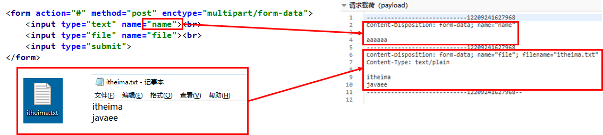
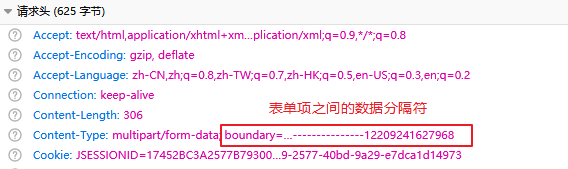
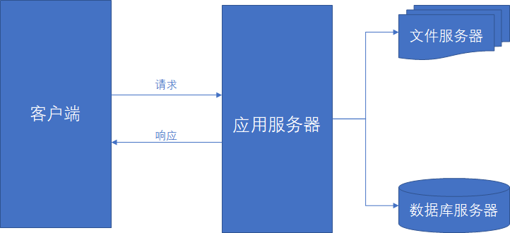
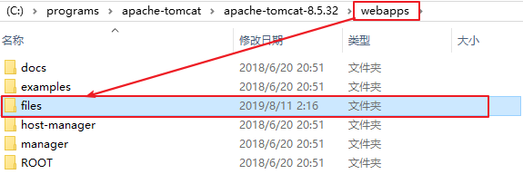
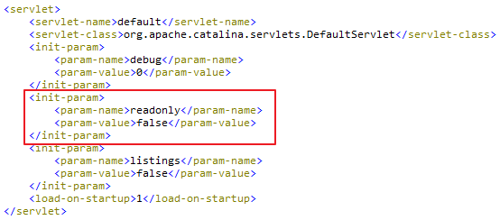
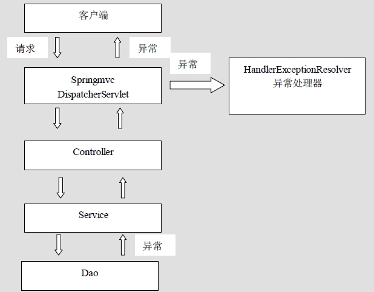
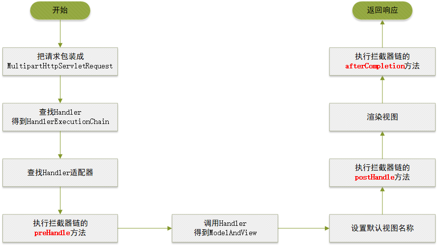
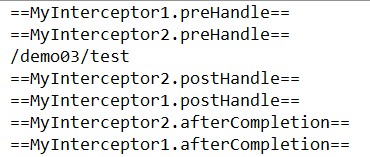
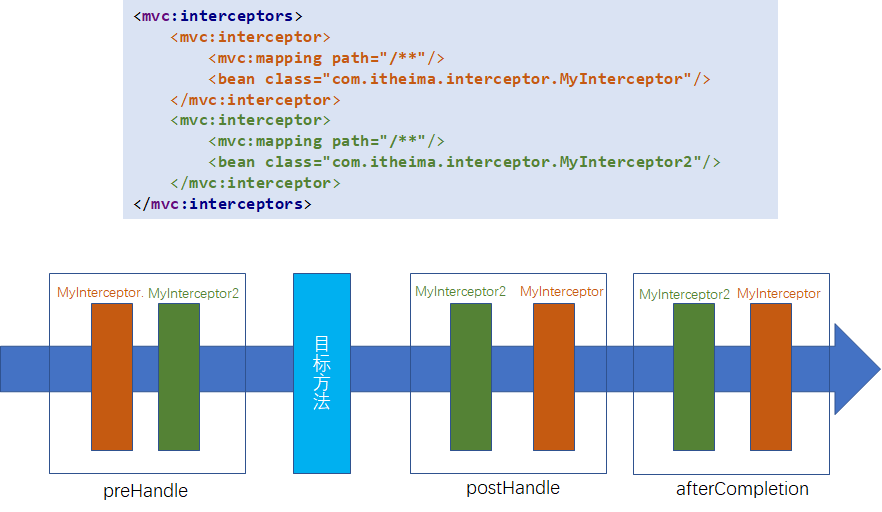
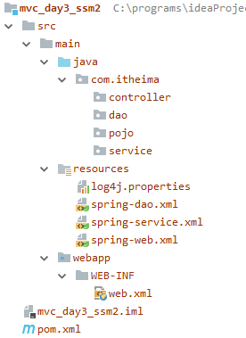

# SpringMVC第2天

* 搭建SpringMVC环境

  1. 创建web项目，导入依赖：`spring-webmvc, servlet-api, jsp-api`
  2. 编写Controller类
  3. 编写springmvc.xml配置文件
     * 开启组件扫描
     * 开启mvc注解驱动
     * 配置视图解析器
     * 处理静态资源
  4. 修改web.xml
     * 配置前端控制器
     * 配置编码过滤器

* 接收请求

  * 接收表单参数：
    * 手动绑定参数`@RequestParam`
    * 自动绑定参数：要求表单参数名 和 方法形参名 相同
    * 自定义类型转换器：
      * 创建一个Java类，实现`Converter<源类型,目标类型>`
      * 在springmvc.xml里注册类型转换器
    * 接收参数封装实体：
      * 方法形参是JavaBean。
      * 表单参数封装JavaBean： 要求JavaBean属性名和表单参数名相同
  * 其它常用注解
    * `@RequestBody`：接收json格式的数据，封装成JavaBean
    * `@PathVariable`：RESTful编程风格里，用于获取路径变量的值
    * `@RequestHeader`：接收请求头的值
    * `@CookieValue`：接收Cookie值

* 处理响应

  * 视图名称写法(路径的写法)

    * 请求转发：
      * 逻辑视图：`success`， 需要由视图解析器拼接 prefix + 逻辑视图 + suffix，得到真实路径
      * 带前缀地址：`forward:真实路径`，不会由视图解析器去拼接路径了
    * 重定向
      * 带前缀地址：`redirect:真实路径`，不会由视图解析器去拼接路径了

  * 实现跳转并传递数据

    ```java
    public ModelAndView jump(){
        ModelAndView mav = new ModelAndView();
        mav.setViewName("视图名称");
        mav.addObject("key", "value");
        return mav;
    }
    
    public ModelAndView jump(ModelAndView mav){
        mav.setViewName("视图名称");
        mav.addObject("key", "value");
        return mav;
    }
    
    public String jump(Model model){
        model.addAttribute("key", "value");
        return "视图名称";
    }
    ```

  * 直接响应数据不跳转：在方法上加注解`@ResponseBody`

    ```java
    @RequestMapping("/responseData")
    @ResponseBody
    public User responseData(){
        
    }
    ```

    

## 一、文件上传【掌握】

### 1. 传统文件上传

#### 文件上传三要素

* 页面表单必须是POST方式提交
* 页面表单的enctype属性值必须是`multipart/form-data`
* 页面表单里必须有文件选择框`<input type="file" name="表单项名称"/>`

#### 文件上传原理

##### 原理介绍

* 如果表单form标签的`enctype="multipart/form-data"`时，`request.getParameter`方法将失效
  *  当`enctype="application/x-www-form-urlencoded"`时，提交的表单数据格式是：`name=value&name=value&...`
  * 当`enctype="multipart/form-data"`时，提交的表单数据格式就变成多部分形式
* 客户端提交多部分表单时，会把文件内容一并提交：
  * 服务端使用`request.getInputSteam()`可以获取到客户端提交数据，包含文件数据
    * 数据的格式：以指定分隔符隔开了，每一部分是一个表单项的数据
    * 分隔符以请求头中，提交到服务端
  * 使用指定分隔符，把得到的数据进行分割，然后解析得到其中的每项数据
    * 把文件项的数据保存在服务器中





##### 工具包

* 使用第三方jar包`commons-fileupload`， 可以实现更简单的文件上传
* `commons-fileupload`的maven坐标如下：

```xml
<dependency>
    <groupId>commons-fileupload</groupId>
    <artifactId>commons-fileupload</artifactId>
    <version>1.4</version>
</dependency>
```

* SpringMVC又对`commons-fileupload`做了再封装，实现文件上传，更加简单了

#### 文件上传功能实现

##### 需求

* 上传文件，保存到服务器

##### 步骤

1. 导入依赖：增加commons-fileupload
2. 创建页面，在页面上提供表单：要符合文件上传的三要素
3. 编写控制器代码
4. 配置 文件解析器`CommonsMultipartResolver`

##### 实现

1. 导入jar包依赖

   ```xml
       <dependencies>
           <dependency>
               <groupId>javax.servlet</groupId>
               <artifactId>javax.servlet-api</artifactId>
               <version>3.1.0</version>
               <scope>provided</scope>
           </dependency>
           <dependency>
               <groupId>javax.servlet.jsp</groupId>
               <artifactId>javax.servlet.jsp-api</artifactId>
               <version>2.3.1</version>
               <scope>provided</scope>
           </dependency>
           <dependency>
               <groupId>org.springframework</groupId>
               <artifactId>spring-webmvc</artifactId>
               <version>5.0.2.RELEASE</version>
           </dependency>
           <dependency>
               <groupId>commons-fileupload</groupId>
               <artifactId>commons-fileupload</artifactId>
               <version>1.4</version>
           </dependency>
       </dependencies>
   ```

2. 创建页面，在页面上提供表单

   ```jsp
   <form action="${pageContext.request.contextPath}/file/upload" method="post" 
         enctype="multipart/form-data">
       <input type="file" name="file"> <br>
       <input type="submit">
   </form>
   ```

3. 编写控制器代码

   ```java
   @Controller
   @RequestMapping("/file")
   public class Demo04FileUploadController {
   
       @RequestMapping("/upload")
       public String upload(MultipartFile file, HttpServletRequest request) throws IOException {
           //设置文件的保存路径
           String destPath = request.getServletContext().getRealPath("files");
           File destDir = new File(destPath);
           if (!destDir.exists()) {
               destDir.mkdir();
           }
           
           //文件名称转换：转换成不含中文的文件名称，文件名不要重复
           String filename = file.getOriginalFilename();
           filename = System.currentTimeMillis() + filename.substring(filename.lastIndexOf("."));
   
           //保存文件
           File destFile = new File(destDir, filename);
           file.transferTo(destFile);
           
           return "success";
       }
   }
   ```
   
4. 配置 `文件解析器`

   ```xml
   <!--配置文件解析器。注意：id必须是multipartResolver-->
   <bean id="multipartResolver" 
         class="org.springframework.web.multipart.commons.CommonsMultipartResolver">
       <!--配置上传文件的最大尺寸，单位：字节； -1表示不限制-->
       <property name="maxUploadSize" value="5242880"/>
   </bean>
   ```

#### 小结

* 如果要上传文件，客户端要满足三要素：

  * 表单里应该有`<input type="file" name=""/>`
  * 表单提交方式应该是POST
  * 表单的enctype属性值必须是`multipart/form-data`

* 服务端要做的事情：

  1. 在springmvc.xml里配置文件解析器

  ```xml
  <!--配置文件解析器。注意：bean的名称必须是multipartResolver -->
  <bean id="multipartResolver" class="org.springframework.web.multipart.commons.CommonsMultipartResolver">
      <!--默认的字符集，utf-8-->
      <property name="defaultEncoding" value="utf-8"/>
      <!--一次请求提交的文件最大尺寸，单位字节-->
      <property name="maxUploadSize" value="10240000"/>
      <!--每个文件的最大尺寸，单位字节-->
      <property name="maxUploadSizePerFile" value="1024000"/>
  </bean>
  ```

  2. 在Controller的方法里保存文件

  ```java
      /**
       * 注意：
       *  1. 要接收客户端提交的表单数据，要求 形参名 和 表单参数名相同
       *  2. 要在springmvc.xml里，配置文件解析器
       */
      @RequestMapping("/upload")
      public String upload(String username, MultipartFile file1, HttpServletRequest request) throws IOException {
          System.out.println(username);
  
          //1. 要处理文件名称：我们应该定义一个随机的文件名称
          //1.1 获取原始文件名称 aaa.txt
          String originalFilename = file1.getOriginalFilename();
          //1.2 截取得到后缀名
          String suffix = originalFilename.substring(originalFilename.lastIndexOf("."));
          //1.3 重新生成一个不重复文件名称
          String filename = UUID.randomUUID().toString() + suffix;
  
          //2. 要处理文件存储的路径：我们应该获取一个路径，建议是当前项目的实际路径。 servletContext.getRealPath("")
          //2.1 要得到当前项目所在路径里的files文件的 路径
          String dirPath = request.getServletContext().getRealPath("files");
          //2.2 假如这个文件夹不存在，就创建出来
          File dir = new File(dirPath);
          if (!dir.exists()) {
              dir.mkdir();
          }
  
          //3. 存储文件
          file1.transferTo(new File(dir, filename));
          System.out.println("文件存储到了：" + dir + "， 文件名称是：" + filename);
          return "success";
      }
  ```

  

### 2. 跨服务器文件上传【了解】

#### 开发中的服务器

* 在实际开发中，为了提高程序效率，我们可以提供多个服务器，每个服务器负责不同的工作。
* 常见的服务器有：
  * 应用服务器：部署web应用的服务器，我们安装了Tomcat的电脑
  * 数据库服务器：负责数据存取服务，我们安装了MySql的电脑
  * 缓存和消息服务器：负责处理高并发访问时的缓存和消息，我们安装了redis的电脑
  * 文件服务器：存储文件的服务器



#### 跨服务器文件上传【了解】

##### 需求

* 用户上传文件时，把文件保存到单独的文件服务器上保存

##### 分析

1. 准备一个文件服务器（准备一个Tomcat），允许文件的存取
2. 编写程序，提供文件上传功能；使用jersey把上传的文件保存到文件服务器上

##### 实现

###### 1. 准备一个文件服务器

1. 拷贝一个Tomcat，在其`webspps`文件夹中创建项目，名称为：`files`

   

2. 打开`conf/web.xml`文件，搜索`DefaultServlet`，设置初始化参数`readonly`，值为`false`

   

3. 启动服务器（注意不要端口冲突了）

   Tomcat里files项目的访问地址是：`http://localhost:8888/files`

###### 2. 编写程序，提供文件上传功能

1. 在我们项目中导入`jersey`包的依赖

   ```xml
   <dependency>
       <groupId>commons-fileupload</groupId>
       <artifactId>commons-fileupload</artifactId>
       <version>1.3.3</version>
   </dependency>
   
   <dependency>
       <groupId>com.sun.jersey</groupId>
       <artifactId>jersey-client</artifactId>
       <version>1.9</version>
   </dependency>
   ```

2. 提供页面

   ```jsp
   <form action="file/upload2" method="post" enctype="multipart/form-data">
       <input type="file" name="file"><br>
       <input type="submit">
   </form>
   ```

3. 编写控制器的方法，实现文件上传功能

   ```java
   	@RequestMapping("/upload2")
       public String upload2(MultipartFile file, HttpServletRequest request) throws IOException {
   
           //文件名称转换：转换成不含中文的文件名称
           String filename = file.getOriginalFilename();
           filename = System.currentTimeMillis() + filename.substring(filename.lastIndexOf("."));
   
           //得到一个客户端：访问远程文件服务的客户端
           Client client = Client.create();
           WebResource resource = client.resource("http://localhost:8888/uploadFiles/" + filename);
           resource.put(file.getBytes());
   
           return "success";
       }
   ```
   
4. 配置文件解析器

   ```xml
   <bean id="multipartResolver" 
         class="org.springframework.web.multipart.commons.CommonsMultipartResolver">
       <property name="maxUploadSize" value="50000000"/>
   </bean>
   ```

##### 小结

1. 增加jar包依赖：`jersey-client`
2. 在Controller里，接收到文件之后，再把文件推送到文件服务器上


## 二、异常处理【重点】

### 1. 异常处理的思路

* 系统中的异常分为两类：

  * 预期异常，通过try...catch捕获异常，从而获取异常信息
  * 运行时异常RuntimeException，通过规范代码开发、测试等手动，减少运行时异常的发生 

* 系统开发中处理异常的思路：

  * dao异常通常抛给Service
  * Service异常通常抛给Controller
  * Controller把异常抛给前端控制器（SpringMVC框架）
  * 由前端控制器把异常交给异常处理器进行处理

  

### 2. 异常处理的方式

####  两种方式介绍

* 实现Spring的异常处理器接口`HandlerExceptionResolver`，自定义异常处理器
  * 需要自己编写代码
  * 也需要进行配置，配置比较简单。只需要在sringmvc.xml里，配置bean对象即可
* 使用SpringMVC提供好的简单异常处理器`SimpleMappingExceptionResolver`
  * 不需要自己编写代码
  * 但需要进行配置，配置略微麻烦

#### 自定义异常处理器【建议】

##### 配置步骤

1. 创建异常页面
2. 创建异常处理器，实现`HandlerExceptionResolver`接口
3. 在springmvc.xml中配置异常处理器，把自定义异常处理器类声明成为bean对象

##### 配置示例

* 准备异常页面

```jsp
<%@ page contentType="text/html;charset=UTF-8" language="java" %>
<html>
<head>
    <title>异常</title>
</head>
<body>
异常的默认页面 ${msg}
</body>
</html>
```

* 创建自定义异常处理器

```java
public class MyExceptionResolver implements HandlerExceptionResolver {
    @Override
    public ModelAndView resolveException(HttpServletRequest request, HttpServletResponse response, Object handler, Exception ex) {
        ModelAndView modelAndView = new ModelAndView();
        modelAndView.setViewName("error");
        if (ex instanceof NullPointerException) {
            //如果是空指针异常，可以做针对性处理。通常不需要
            modelAndView.addObject("msg", "空指针异常了");
        }else if(ex instanceof ClassCastException){
            //如果是类型转换异常，可以做针对性处理。通常不需要
            modelAndView.addObject("msg", "类型转换异常了");
        }
        return modelAndView;
    }
}
```

* 在springmvc.xml中配置异常处理器

```xml
<bean class="com.itheima.resolver.MyExceptionResolver"/>
```

##### 小结


#### 简单异常处理器【拓展了解】

* SpringMVC已经定义好了异常处理器，在使用时根据项目情况，配置异常与视图的映射关系

##### 配置步骤

1. 创建异常页面。可以根据实际需求创建错误页面，比如：
   * 所有异常，都使用同一页面error.jsp
   * 不同异常，配置不同的错误页面
     * 类转换异常，配置castError.jsp
     * 空指定异常，配置nullError.jsp
     * ...
2. 在springmvc.xml中，配置简单异常处理器`SimpleMappingExceptionResolver`

##### 配置示例

* 准备异常页面`error.jsp`

```jsp
<%@ page contentType="text/html;charset=UTF-8" language="java" %>
<html>
<head>
    <title>异常</title>
</head>
<body>
异常的默认页面
</body>
</html>
```

* 在springmvc.xml中配置

```xml
<!--配置简单异常处理器-->
<bean class="org.springframework.web.servlet.handler.SimpleMappingExceptionResolver">
    <!--配置默认的错误视图-->
    <property name="defaultErrorView" value="error"/>
    <!--配置异常与视图的映射-->
    <property name="exceptionMappings">
        <map>
            <!--类转换异常，显示视图error页面-->
            <entry key="java.lang.ClassCastException" value="error"/>
            <!--空指针异常，显示视图error页面-->
            <entry key="java.lang.NullPointerException" value="error"/>
        </map>
    </property>
</bean>
```

### 小结

1. 创建一个Java类，实现`HandlerExceptionResolver`接口
2. 把我们创建的异常处理器注册成bean对象

## 三、拦截器

### 1. 简介

#### 什么是拦截器

* SpringMVC中的拦截器，相当于web开发中的过滤器Filter，用于对Controller进行**预处理**和**后处理**
* 多个拦截器形成的一条链，称为**拦截器链**（Interceptor chain）
  * 当访问被拦截的方法或字段时，拦截器链中的拦截器就会按照之前定义的顺序被调用
* 拦截器也是AOP思想的具体实现

#### 拦截器和过滤器的区别

| 区别     | 过滤器Filter                                               | 拦截器                                                       |
| -------- | ---------------------------------------------------------- | ------------------------------------------------------------ |
| 使用范围 | 是Servlet规范的一部分，任何Javaweb项目都可以使用           | 是SpringMVC自己的，只有使用了SpringMVC框架，才可以使用拦截器 |
| 拦截范围 | 配置了urlPatterns="/*"之后，可以对所有要访问的资源进行拦截 | 只会拦截访问的控制器方法，如果访问的是JSP、HTML、CSS、图片或者js时，不拦截 |
| 拦截精度 | 只能拦截某个请求，不能对Servlet里某个方法进行拦截          | 可以精细到拦截Controller里的某个方法                         |

### 2. 快速入门

#### 准备工作

* 创建maven项目，准备SpringMVC的环境
* 创建控制器`DemoController`，准备一个目标方法`show()`

```java
@Controller
public class DemoController {
    @RequestMapping("/show")
    public ModelAndView show(ModelAndView modelAndView){
        System.out.println("目标方法show().....");
        modelAndView.addObject("username", "tom");
        modelAndView.setViewName("success");
        return modelAndView;
    }
}
```

#### 实现步骤

1. 创建一个Java类，实现`HandlerInterceptor`接口
   * 重写接口的方法，共三个方法：`preHandle, postHandle, afterCompletion`
2. 在springmvc.xml中配置拦截器

#### 功能实现

* 创建Java类，实现`HandlerInterceptor`接口

```java
public class MyInterceptor implements HandlerInterceptor {
    //在Controller的方法被调用之前执行
    @Override
    public boolean preHandle(HttpServletRequest request, HttpServletResponse response, Object handler) throws Exception {
        System.out.println("preHandle");
        return true;
    }

    //在Controller的方法被调用之后，视图渲染之前执行
    @Override
    public void postHandle(HttpServletRequest request, HttpServletResponse response, Object handler, ModelAndView modelAndView) throws Exception {
        System.out.println("postHandle");
    }

    //在Controller的方法执行完毕之后（渲染视图之后），再执行
    @Override
    public void afterCompletion(HttpServletRequest request, HttpServletResponse response, Object handler, Exception ex) throws Exception {
        System.out.println("afterCompletion");
    }
}
```

* 在springmvc.xml中配置拦截器

```xml
    <!--配置拦截器-->
    <mvc:interceptors>
        <mvc:interceptor>
            <!-- /**表示所有后代， /*表示子级 -->
            <mvc:mapping path="/**"/>
            <bean class="com.itheima.interceptor.MyInterceptor"/>
        </mvc:interceptor>
    </mvc:interceptors>
```

#### 小结

1. 创建一个Java类，实现`HandlerInterceptor`接口：preHandle方法
2. 在springmvc.xml里配置拦截器

```xml
<mvc:interceptors>
	<mvc:interceptor>
    	<mvc:mapping path="/**"/>
        <bean class="拦截器全限定类名"/>
    </mvc:interceptor>
</mvc:interceptors>
```


### 3. 拦截器详解

#### API介绍

##### `preHandle()`

* 在控制器方法被调用之前先执行
* 如果方法返回true，表示放行；如果方法返回false，表示不放行

##### `postHandle()`

* 在控制器方法执行后、渲染视图之前执行
* 无返回值

##### `afterCompletion()`

* 在Controller完全执行完毕之后（渲染视图之后），返回响应前执行

##### 源码分析

* `DispatcherServlet`的`doDispatch`方法执行流程：



* `DispatcherServlet`的`doDispatch`方法源码分析：

```java
protected void doDispatch(HttpServletRequest request, HttpServletResponse response) throws Exception {
		//....

		try {
			//....

			try {
                // 检查是否上传文件。
                // 如果是，就解析上传的数据，返回封装后的request对象
                // 如果不是，就返回原始的request对象
				processedRequest = checkMultipart(request);
				
				// 查找本次请求对应的处理器（Handler指Controller里的方法）
				mappedHandler = getHandler(processedRequest);
				
				// 获取 能够调用Handler的适配器对象
				HandlerAdapter ha = getHandlerAdapter(mappedHandler.getHandler());

                // ===调用拦截器里的preHandle方法===
				if (!mappedHandler.applyPreHandle(processedRequest, response)) {
					return;
				}

				// 真正调用目标方法（调用处理器），得到ModelAndView对象
				mv = ha.handle(processedRequest, response, mappedHandler.getHandler());

                // 设置默认的视图名称（如果处理器返回的有视图名称，就不会使用默认的视图名称）
				applyDefaultViewName(processedRequest, mv);
                
                // ===调用拦截器里的postHandle方法===
				mappedHandler.applyPostHandle(processedRequest, response, mv);
			}
			catch (Exception ex) {
			}
			catch (Throwable err) {
			}
            
            // 处理结果：查找视图、渲染视图、调用拦截器的afterCompletion方法、准备返回响应
			processDispatchResult(processedRequest, response, mappedHandler, mv, dispatchException);
		}
		catch (Exception ex) {
            // ===调用拦截器的afterCompletion方法===
			triggerAfterCompletion(processedRequest, response, mappedHandler, ex);
		}
		catch (Throwable err) {
            // ===调用拦截器的afterCompletion方法===
			triggerAfterCompletion(processedRequest, response, mappedHandler,
					new NestedServletException("Handler processing failed", err));
		}
		finally {
			//....
		}
	}
```

* SpringMVC的九大组件：在DispatcherServlet里的成员变量

```java
	/** 文件解析器：提供了处理上传文件的功能 */
	@Nullable
	private MultipartResolver multipartResolver;

	/** 处理国际化资源的处理器 */
	@Nullable
	private LocaleResolver localeResolver;

	/** 主题解析器 */
	@Nullable
	private ThemeResolver themeResolver;

	/** 处理器的映射器 */
	@Nullable
	private List<HandlerMapping> handlerMappings;

	/** 处理器的适配器：不同方式创建的Controller类，需要由对应的适配器去调用 */
	@Nullable
	private List<HandlerAdapter> handlerAdapters;

	/** 异常处理器 */
	@Nullable
	private List<HandlerExceptionResolver> handlerExceptionResolvers;

	/** 视图名称转换器 */
	@Nullable
	private RequestToViewNameTranslator viewNameTranslator;

	/** FlashMapManager，用于在重定向过程中传递数据的 */
	@Nullable
	private FlashMapManager flashMapManager;

	/** 视图解析器：根据逻辑视图，查找物理视图页面的 */
	@Nullable
	private List<ViewResolver> viewResolvers;
```

* 九大组件的初始化：在DispatcherServlet的`initStrategies`

```java
protected void initStrategies(ApplicationContext context) {
		initMultipartResolver(context);
		initLocaleResolver(context);
		initThemeResolver(context);
		initHandlerMappings(context);
		initHandlerAdapters(context);
		initHandlerExceptionResolvers(context);
		initRequestToViewNameTranslator(context);
		initViewResolvers(context);
		initFlashMapManager(context);
	}
```

#### 配置详解

##### 配置语法

```xml
<!--配置拦截器-->
<mvc:interceptors>
    
    <mvc:interceptor>
        <mvc:mapping path="/**"/>
        <bean class="com.itheima.interceptor.MyInterceptor"/>
    </mvc:interceptor>
    
    <mvc:interceptor>
        <mvc:mapping path="/**"/>
        <bean class="com.itheima.interceptor.MyInterceptor2"/>
    </mvc:interceptor>
    
</mvc:interceptors>
```

* `<mvc:interceptor>`一个拦截器的配置
* `<mvc:mapping path=""/>`配置拦截器的拦截范围

* `<mvc:exclude-mapping path=""/>`排除不拦截的范围

* `<bean/>`配置拦截器类

##### 多个拦截器配置时的执行顺序

* 执行顺序：由配置的顺序决定，谁在前谁就先拦截。
  * 谁的预处理先执行，那么它的后处理就要后执行



* `preHandle`方法执行的越早，`postHandle`和`afterCompletion`就执行的越晚



#### 小结

* 创建拦截器：
  1. 创建Java类，实现HandlerInterceptor接口：preHandle方法
  2. 在springmvc.xml里配置拦截器
* 配置：

```xml
<mvc:interceptors>
	<mvc:interceptor>
    	<mvc:mapping path="拦截范围"/>
        <mvc:exclude-mapping path="排除不拦截的范围"/>
        <bean class="拦截器类全限定类名"></bean>
    </mvc:interceptor>
    
    <mvc:interceptor>
    	<mvc:mapping path="拦截范围"/>
        <mvc:exclude-mapping path="排除不拦截的范围"/>
        <bean class="拦截器类全限定类名"></bean>
    </mvc:interceptor>
</mvc:interceptors>
```

*  如果配置了多个拦截器，那么执行顺序：是由配置的先后顺序决定
  * 配置在前的，就先执行

## 四、SSM整合【掌握】

### 1. 环境准备

#### 需求

* 查询所有帐号，显示到列表页面上
* 使用SSM三大框架完成功能

#### 说明

* 整合说明：SSM整合有多种方式，我们选择XML+注解的方式

* 整合思路：

  * 先准备整合环境
  * 搭建Spring环境
  * 搭建Mybatis环境，然后整合到Spring中
  * 搭建SpringMVC环境，然后整合到Spring中

* 数据库表结构：

  ```mysql
  drop database if exists ssm;
  create database ssm;
  use ssm;
  create table account(
  	id int primary key auto_increment,
  	name varchar(20),
  	money double
  );
  insert into `account` (`id`, `name`, `money`) values('1','tom','1000');
  insert into `account` (`id`, `name`, `money`) values('2','jerry','1000');
  insert into `account` (`id`, `name`, `money`) values('3','jack','1500');
  insert into `account` (`id`, `name`, `money`) values('4','rose','1500');
  
  create table user(
  	id int primary key auto_increment,
      username varchar(32),
      password varchar(64)
  );
  
  insert into user(username, password) values ('admin', 'admin');
  ```

#### 步骤

1. 创建maven的web项目
   * 补充项目需要的文件夹java、resources等
2. 导入jar依赖：
   * 在`pom.xml`里导入jar包依赖
3. 创建页面和package：
   * 页面：
     * 在webapp下创建文件夹pages，在pages里创建`list.jsp`，用于显示帐号列表
   * package：
     * 准备4个包
       * `com.itheima.controller`
       * `com.itheima.service`
       * `com.itheima.dao`
       * `com.itheima.pojo`
     * 在`com.itheima.pojo`包里创建JavaBean：`Account`
4. 准备`log4j.properties`

#### 实现

##### 1. 创建maven的web项目

* 目录结构如下：



##### 2. 导入jar包依赖

```xml
<properties>
    <!-- 版本锁定 -->
    <spring.version>5.0.2.RELEASE</spring.version>
    <log4j.version>1.2.17</log4j.version>
    <slf4j.version>1.6.6</slf4j.version>
    <mysql.version>5.1.47</mysql.version>
    <mybatis.version>3.4.6</mybatis.version>
</properties>

<dependencies>
    <!--Spring：ioc和aop，事务-->
    <dependency>
        <groupId>org.springframework</groupId>
        <artifactId>spring-context</artifactId>
        <version>${spring.version}</version>
    </dependency>
    <dependency>
        <groupId>org.springframework</groupId>
        <artifactId>spring-jdbc</artifactId>
        <version>${spring.version}</version>
    </dependency>
    <dependency>
        <groupId>org.aspectj</groupId>
        <artifactId>aspectjweaver</artifactId>
        <version>1.8.9</version>
    </dependency>

    <!--Mybatis-->
    <dependency>
        <groupId>mysql</groupId>
        <artifactId>mysql-connector-java</artifactId>
        <version>${mysql.version}</version>
    </dependency>
    <dependency>
        <groupId>com.mchange</groupId>
        <artifactId>c3p0</artifactId>
        <version>0.9.5.4</version>
    </dependency>
    <dependency>
        <groupId>org.mybatis</groupId>
        <artifactId>mybatis</artifactId>
        <version>${mybatis.version}</version>
    </dependency>
    <dependency>
        <groupId>org.mybatis</groupId>
        <artifactId>mybatis-spring</artifactId>
        <version>2.0.2</version>
    </dependency>

    <!--SpringMVC，jstl，json转换-->
    <dependency>
        <groupId>org.springframework</groupId>
        <artifactId>spring-webmvc</artifactId>
        <version>${spring.version}</version>
    </dependency>
    <dependency>
        <groupId>com.fasterxml.jackson.core</groupId>
        <artifactId>jackson-databind</artifactId>
        <version>2.9.9</version>
    </dependency>
    <dependency>
        <groupId>javax.servlet</groupId>
        <artifactId>javax.servlet-api</artifactId>
        <version>4.0.1</version>
        <scope>provided</scope>
    </dependency>
    <dependency>
        <groupId>javax.servlet.jsp</groupId>
        <artifactId>javax.servlet.jsp-api</artifactId>
        <version>2.3.1</version>
        <scope>provided</scope>
    </dependency>
    <dependency>
        <groupId>jstl</groupId>
        <artifactId>jstl</artifactId>
        <version>1.2</version>
    </dependency>

    <!--日志-->
    <dependency>
        <groupId>log4j</groupId>
        <artifactId>log4j</artifactId>
        <version>${log4j.version}</version>
    </dependency>
    <dependency>
        <groupId>org.slf4j</groupId>
        <artifactId>slf4j-api</artifactId>
        <version>${slf4j.version}</version>
    </dependency>
    <dependency>
        <groupId>org.slf4j</groupId>
        <artifactId>slf4j-log4j12</artifactId>
        <version>${slf4j.version}</version>
    </dependency>

    <!--测试-->
    <dependency>
        <groupId>junit</groupId>
        <artifactId>junit</artifactId>
        <version>4.12</version>
        <scope>test</scope>
    </dependency>
    <dependency>
        <groupId>org.springframework</groupId>
        <artifactId>spring-test</artifactId>
        <version>${spring.version}</version>
        <scope>test</scope>
    </dependency>
</dependencies>
```

##### 3. 创建页面和package

- 在webapp下创建文件夹`pages`，在`pages`文件夹里创建`list.jsp`，用于显示帐号列表

```jsp
<%@ page contentType="text/html;charset=UTF-8" language="java" %>
<html>
<head>
    <title>帐号列表</title>
</head>
<body>
<table border="1" width="500" align="center">
    <tr>
        <th>序号</th>
        <th>帐号</th>
        <th>金额</th>
        <th>管理</th>
    </tr>
    <tr>
        <td>1</td>
        <td>张三</td>
        <td>300</td>
        <td>
            <a href="#">删除</a>
        </td>
    </tr>
</table>
</body>
</html>
```

- 创建package，并在pojo里创建JavaBean

```java
package com.itheima.pojo;

public class Account {
    private Integer id;
    private String name;
    private Double money;

    //get/set...
    //toString...
}

```

##### 4. 准备`log4j.properties`

* 在`resources`里创建文件`log4j.properties`

```properties
# Set root category priority to INFO and its only appender to CONSOLE.
#log4j.rootCategory=INFO, CONSOLE            debug   info   warn error fatal
log4j.rootCategory=info, CONSOLE

# CONSOLE is set to be a ConsoleAppender using a PatternLayout.
log4j.appender.CONSOLE=org.apache.log4j.ConsoleAppender
log4j.appender.CONSOLE.layout=org.apache.log4j.PatternLayout
log4j.appender.CONSOLE.layout.ConversionPattern=%d{ISO8601} %-6r [%15.15t] %-5p %30.30c %x - %m\n
```

### 2. 准备Spring环境

#### 目标

* 准备Spring的配置，确定Spring环境配置正常
* 是service层的配置

#### 说明

* Spring框架扫描注解，不扫描`@Controller`注解
* `@Controller`交给SpringMVC管理

#### 步骤

1. 创建`AccountService`接口和实现类
   * 在`AccountServiceImpl`上增加注解`@Service`，配置成bean对象
2. 创建`spring-service.xml`配置文件，开启组件扫描
   * 不扫描`@controller`注解（要交给SpringMVC来处理）
3. 功能测试：
   * 编写测试类，确认能否通过Spring容器获取`AccountServiceImpl`对象

#### 实现

##### 1. 创建`AccountService`接口和实现类

* 创建`AccountService`接口

```java
public interface AccountService {
    List<Account> queryAll();
}
```

* 创建实现类`AccountServiceImpl`，并在类上增加注解`@Service`

```java
@Service("accountService")
public class AccountServiceImpl implements AccountService {
    @Override
    public List<Account> queryAll() {
        System.out.println("AccountServiceImpl.queryAll()");
        return null;
    }
}
```

##### 2. 创建`spring-service.xml`配置文件，开启注解扫描

```xml
<?xml version="1.0" encoding="UTF-8"?>
<beans xmlns="http://www.springframework.org/schema/beans"
       xmlns:xsi="http://www.w3.org/2001/XMLSchema-instance"
       xmlns:context="http://www.springframework.org/schema/context"
       xmlns:aop="http://www.springframework.org/schema/aop"
       xmlns:tx="http://www.springframework.org/schema/tx"
       xsi:schemaLocation="http://www.springframework.org/schema/beans
	http://www.springframework.org/schema/beans/spring-beans.xsd
	http://www.springframework.org/schema/context
	http://www.springframework.org/schema/context/spring-context.xsd
	http://www.springframework.org/schema/aop
	http://www.springframework.org/schema/aop/spring-aop.xsd
	http://www.springframework.org/schema/tx
	http://www.springframework.org/schema/tx/spring-tx.xsd">

    <!--开启注解扫描-->
    <context:component-scan base-package="com.itheima">
        
        <!--不扫描Controller注解（Controller注解由SpringMVC负责处理）-->
        <context:exclude-filter type="annotation" expression="org.springframework.stereotype.Controller"/>
    </context:component-scan>

</beans>
```

##### 3. 创建一个单元测试类，测试Spring环境配置是否成功

```java
/**
 * @author liuyp
 * @date 2020/10/31
 */
public class SsmTest {

    @Test
    public void testService(){
        ApplicationContext app = new ClassPathXmlApplicationContext("classpath:spring-service.xml");
        AccountService accountService = app.getBean(AccountService.class);
        accountService.queryAll();
    }
}
```

### 3. 准备Mybatis环境，整合到Spring中

#### 1. 准备Mybatis环境

##### 说明

- 使用Mybatis实现dao层操作数据库
- 我们这里使用的是注解方式

##### 步骤

1. 创建`AccountDao`接口，并创建`queryAll方法：用注解的方式
2. 创建`sqlMapConfig.xml`配置文件
3. 功能测试：否查询得到所有Account

##### 实现

###### 1. 在`AccountDao`的方法上增加注解，实现`queryAll`和`save`功能

```java
public interface AccountDao {
    @Select("select * from account")
    List<Account> queryAll();
}
```

###### 2. 创建`sqlMapConfig.xml`配置文件

```xml
<?xml version="1.0" encoding="UTF-8"?>
<!DOCTYPE configuration
        PUBLIC "-//mybatis.org//DTD Config 3.0//EN"
        "http://mybatis.org/dtd/mybatis-3-config.dtd">
<configuration>
    <!--配置别名-->
    <typeAliases>
        <package name="com.itheima.pojo"/>
    </typeAliases>

    <!--配置数据库环境-->
    <environments default="ssm">
        <environment id="ssm">
            <transactionManager type="JDBC"/>
            <dataSource type="POOLED">
                <property name="driver" value="com.mysql.jdbc.Driver"/>
                <property name="url" value="jdbc:mysql:///ssm"/>
                <property name="username" value="root"/>
                <property name="password" value="root"/>
            </dataSource>
        </environment>
    </environments>

    <!--配置映射器扫描-->
    <mappers>
        <package name="com.itheima.dao"/>
    </mappers>
</configuration>
```

###### 3. 功能测试

* 在测试类`SSMTest`里增加方法

```java
    @Test
    public void testDao() throws IOException {
        InputStream is = Resources.getResourceAsStream("SqlMapConfig.xml");
        SqlSessionFactory factory = new SqlSessionFactoryBuilder().build(is);
        SqlSession session = factory.openSession();
        AccountDao dao = session.getMapper(AccountDao.class);
        List<Account> accounts = dao.queryAll();
        for (Account account : accounts) {
            System.out.println(account);
        }
        session.close();
        is.close();
    }
```

#### 2. 把Mybatis整合到Spring中

##### 说明

- dao层映射器代理对象，由Spring来创建和管理

##### 步骤

1. 创建`spring-dao.xml`，增加Mybatis的配置支持

2. 功能测试：能否通过Spring容器，直接得到dao层映射器的代理对象


##### 实现

###### 创建`spring-dao.xml`，增加Mybatis的配置支持

```xml
<?xml version="1.0" encoding="UTF-8"?>
<beans xmlns="http://www.springframework.org/schema/beans"
       xmlns:xsi="http://www.w3.org/2001/XMLSchema-instance"
       xsi:schemaLocation="http://www.springframework.org/schema/beans http://www.springframework.org/schema/beans/spring-beans.xsd">

    <!--配置连接池-->
    <bean id="dataSource" class="com.mchange.v2.c3p0.ComboPooledDataSource">
        <property name="driverClass" value="com.mysql.jdbc.Driver"/>
        <property name="jdbcUrl" value="jdbc:mysql:///ssm"/>
        <property name="user" value="root"/>
        <property name="password" value="root"/>
    </bean>

    <!--配置SqlSessionFactoryBean：会由Spring创建SqlSessionFactory对象-->
    <bean class="org.mybatis.spring.SqlSessionFactoryBean">
        <property name="dataSource" ref="dataSource"/>
        <property name="typeAliasesPackage" value="com.itheima.pojo"/>
        <!--<property name="configLocation" value="classpath:sqlMapConfig.xml"/>-->
    </bean>

    <!--配置映射器扫描-->
    <bean class="org.mybatis.spring.mapper.MapperScannerConfigurer">
        <property name="basePackage" value="com.itheima.dao"/>
    </bean>
</beans>
```

###### 功能测试

* 修改测试类`SSMTest`：

```java
 	@Test
    public void testSpringDao(){
        ApplicationContext app = new ClassPathXmlApplicationContext("classpath:spring-dao.xml");
        AccountDao dao = app.getBean(AccountDao.class);
        List<Account> accounts = dao.queryAll();
        for (Account account : accounts) {
            System.out.println(account);
        }
    }
```

### 4. 准备SpringMVC环境，整合到Spring中

#### 1. 准备SpringMVC环境

##### 说明

* SpringMVC只扫描`@Controller`注解，其它的组件注解交给Spring扫描

##### 步骤

1. 创建`AccountController`类
2. 创建`spring-web.xml`配置文件
3. 修改`web.xml`
   * 配置前端控制器`DispatcherServlet`
   * 配置编码过滤器`CharacterEncodingFilter`
4. 部署测试

##### 实现

###### 修改`AccountController`类，配置注解

```java
@Controller
@RequestMapping("/account")
public class AccountController {

    @RequestMapping("/queryAll")
    public String queryAll(){
        System.out.println("queryAll方法执行了");
        return "list";
    }
}
```

###### 创建`spring-web.xml`配置文件

```xml
<?xml version="1.0" encoding="UTF-8"?>
<beans xmlns="http://www.springframework.org/schema/beans"
       xmlns:xsi="http://www.w3.org/2001/XMLSchema-instance"
       xmlns:context="http://www.springframework.org/schema/context"
       xmlns:mvc="http://www.springframework.org/schema/mvc"
       xsi:schemaLocation="http://www.springframework.org/schema/beans
	http://www.springframework.org/schema/beans/spring-beans.xsd
	http://www.springframework.org/schema/context
	http://www.springframework.org/schema/context/spring-context.xsd
	http://www.springframework.org/schema/mvc
	http://www.springframework.org/schema/mvc/spring-mvc.xsd">

    <!--开启注解扫描，只扫描Controller注解-->
    <context:component-scan base-package="com.itheima">
        <context:include-filter type="annotation" expression="org.springframework.stereotype.Controller"/>
    </context:component-scan>

    <!--开启mvc的注解驱动-->
    <mvc:annotation-driven/>

    <!--配置视图解析器-->
    <bean class="org.springframework.web.servlet.view.InternalResourceViewResolver">
        <property name="prefix" value="/pages/"/>
        <property name="suffix" value=".jsp"/>
    </bean>

    <!--处理静态资源-->
    <mvc:default-servlet-handler/>
</beans>
```

###### 修改`web.xml`

- 配置前端控制器`DispatcherServlet`
- 配置乱码解决的过滤器`CharacterEncodingFilter`

```xml
<!--SpringMVC：配置乱码过滤器-->
<filter>
    <filter-name>characterEncodingFilter</filter-name>
    <filter-class>org.springframework.web.filter.CharacterEncodingFilter</filter-class>
    <init-param>
        <param-name>encoding</param-name>
        <param-value>utf-8</param-value>
    </init-param>
</filter>
<filter-mapping>
    <filter-name>characterEncodingFilter</filter-name>
    <url-pattern>/*</url-pattern>
</filter-mapping>

<!--SpringMVC：配置前端控制器-->
<servlet>
    <servlet-name>dispatcherServlet</servlet-name>
    <servlet-class>org.springframework.web.servlet.DispatcherServlet</servlet-class>
    <init-param>
        <param-name>contextConfigLocation</param-name>
        <param-value>classpath:spring-web.xml</param-value>
    </init-param>
    <load-on-startup>1</load-on-startup>
</servlet>
<servlet-mapping>
    <servlet-name>dispatcherServlet</servlet-name>
    <url-pattern>/</url-pattern>
</servlet-mapping>
```

###### 部署测试

* 把web项目部署到Tomcat，启动服务
* 客户端访问：`http://localhost:8080/ssm/account/queryAll`

#### 2. 整合SpringMVC和Spring

##### 说明

* web层的Controller已经可以被客户端访问了，但是web层依赖于service层，需要注入依赖

##### 步骤

1. 修改`AccountController`
   * 把Service注入给Controller
   * 在`queryAll`方法中：
     * 调用service的`queryAll`方法，得到`List<Account>`
     * 把`List<Account>`放到Model中，请求转发到`/pages/list.jsp`
2. 修改`AccountServiceImpl`
   * 把`AccountDao`注入给service
   * 在`queryAll`方法中调用accountDao，得到`List<Account>`
3. 修改`web.xml`，在服务器启动时就加载Spring的配置文件
4. 部署web项目，启动测试

##### 实现

###### 修改`AccountController`

* 注入`accountService`
* 修改`queryAll`方法

```java
@Controller
@RequestMapping("/account")
public class AccountController {

    @Autowired
    private AccountService accountService;

    @RequestMapping("/queryAll")
    public String queryAll(Model model){
        List<Account> accounts = accountService.queryAll();
        model.addAttribute("accounts", accounts);
        return "list";
    }
}
```

###### 修改`AccountServiceImpl`

* 注入依赖`AccountDao`
* 调用`AccountDao`查询所有帐号

```java
@Service
public class AccountServiceImpl implements AccountService {

    @Autowired
    private AccountDao accountDao;

    @Override
    public List<Account> queryAll() {
        return accountDao.queryAll();
    }
}
```

###### 修改`list.jsp`

* 从request域中取出数据，使用JSTL和EL循环显示到页面上

```jsp
<%@ page contentType="text/html;charset=UTF-8" language="java" %>
<%@ taglib prefix="c" uri="http://java.sun.com/jsp/jstl/core" %>
<html>
<head>
    <title>帐号列表</title>
</head>
<body>
<table border="1" width="500" align="center">
    <tr>
        <th>序号</th>
        <th>帐号</th>
        <th>金额</th>
        <th>管理</th>
    </tr>
    <c:forEach items="${accounts}" var="account" varStatus="status">
        <tr>
            <td>${status.count}</td>
            <td>${account.name}</td>
            <td>${account.money}</td>
            <td>
                <a href="#">删除</a>
            </td>
        </tr>
    </c:forEach>
</table>
</body>
</html>
```

###### 修改`web.xml`，在服务器启动时就加载Spring的配置文件

```xml
<!--配置前端控制器-->
<servlet>
    <servlet-name>dispatcherServlet</servlet-name>
    <servlet-class>org.springframework.web.servlet.DispatcherServlet</servlet-class>
    <init-param>
        <!-- 加载所有spring配置文件 -->
        <param-name>contextConfigLocation</param-name>
        <param-value>classpath:spring-*.xml</param-value>
    </init-param>
    <load-on-startup>1</load-on-startup>
</servlet>
<servlet-mapping>
    <servlet-name>dispatcherServlet</servlet-name>
    <url-pattern>/</url-pattern>
</servlet-mapping>
```

###### 部署web项目，启动测试

* 客户端访问：`http://localhost:8080/ssm/account/queryAll`

### 5. 添加事务管理

#### 说明

- Service层需要事务控制，在Spring的配置文件中配置事务管理

#### 步骤

- 直接修改`spring-service.xml`，增加事务管理的配置即可

#### 实现

```xml
<!--事务管理器-->
<bean id="txManager" class="org.springframework.jdbc.datasource.DataSourceTransactionManager">
    <property name="dataSource" ref="dataSource"/>
</bean>
<!--事务通知-->
<tx:advice id="txAdvice" transaction-manager="txManager">
    <tx:attributes>
        <tx:method name="*"/>        
        <tx:method name="query*" read-only="true"/>
        <tx:method name="find*" read-only="true"/>
    </tx:attributes>
</tx:advice>
<!--配置切面-->
<aop:config>
    <aop:advisor advice-ref="txAdvice" pointcut="execution(* com.itheima.service..*.*(..))"/>
</aop:config>
```

### 6. 练习：完成添加帐号功能

#### 需求

* 完成添加帐号功能
* 帐号添加成功后，跳转到列表页面，显示最新的帐号列表

#### 分析

##### 功能分析

* 需要创建一个页面，页面里提供表单
* 服务端要提供功能：接收帐户信息，并把帐户信息插入到数据库里
* 添加成功后，不能直接到list.jsp，要跳转到`/account/queryAll`

##### 实现步骤

1. 创建页面：
   * 在`pages`文件夹里创建页面`add.jsp`
   * `add.jsp`页面提交表单到`AccountController`
2. 服务端接收数据并保存到数据库
   1. `AccountController`调用`AccountServiceImpl`
   2. `AccountServiceImpl`调用`AccountDao`
   3. `AccountDao`把`Account`的数据插入到数据库里
   4. `AccountController`跳转到`/account/queryAll`
3. 部署测试

#### 实现

##### 1. 页面提交表单到`AccountController`

```jsp
<%@ page contentType="text/html;charset=UTF-8" language="java" %>
<html>
<head>
    <title>添加帐号</title>
</head>
<body>
<form action="${pageContext.request.contextPath}/account/add" method="post">
    帐户名：<input type="text" name="name"><br>
    余额：<input type="text" name="money"><br>
    <input type="submit" value="添加帐号">
</form>
</body>
</html>
```

##### 2. `AccountController`接收数据得到`Account`对象

###### `AccountController`

* 在`AccountController`里增加方法

```java
    @RequestMapping("/add")
    public String add(Account account){
        accountService.add(account);
        return "redirect:/account/queryAll";
    }
```

###### `AccountService`

* `AccountService`接口里增加方法

```java
	void add(Account account);
```

* `AccountServiceImpl`类里实现方法

```java
    @Override
    public void add(Account account) {
        accountDao.add(account);
    }
```

###### `AccountDao`

* 在`AccountDao`里增加方法，并配置SQL语句

```java
    @Insert("insert into account(name,money) values(#{name},#{money})")
    void add(Account account);
```

##### 3. 部署测试

* 把web项目部署到Tomcat，启动服务
* 用户输入数据，提交表单

### 7. 注意事项

* 在SpringMVC框架使用中，如果**jsp页面上**要加载资源文件，路径**建议使用绝对路径**
  * 因为SpringMVC里有大量的请求转发，资源文件的相对位置会发生变化。使用绝对路径能够保证不出问题
  * `${pageContext.request.contextPath}/pages/mm.jpg`

### 8. 拦截器实现登录权限控制

#### 需求说明：

* 有登录功能
* 登录权限控制的拦截器

#### 需求分析：

* 登录功能：
  * 需要一张表`user`（《1. 环境准备》中已经建表），表里要有用户名和密码
  * 需要创建JavaBean：`User`
  * 提供登录的功能：
    * 如果登录成功了，跳转到`/account/queryAll`
* 登录权限控制的拦截器
  * 访问服务端的`/account/**`资源时：
    * 如果是已登录，就放行；如果是未登录，就跳转到登录页面

#### 需求实现

##### 登录功能

* 在`pages`文件夹里创建登录页面`login.jsp`

```jsp
<%@ page contentType="text/html;charset=UTF-8" language="java" %>
<html>
<head>
    <title>登录</title>
</head>
<body>
<form action="${pageContext.request.contextPath}/user/login" method="post">
    用户名：<input type="text" name="username"><br>
    密码：<input type="password" name="password"><br>
    <input type="submit" value="登录">
</form>
</body>
</html>
```

* 创建JavaBean：`User`

```java
public class User {
    private Integer id;
    private String username;
    private String password;

    //get/set...
    //toString...
}
```

* 创建`UserController`

```java
@Controller
@RequestMapping("/user")
public class UserController {

    @Autowired
    private UserService userService;

    @RequestMapping("/login")
    public String login(User loginUser, HttpSession session){
        User user = userService.login(loginUser);
        session.setAttribute("user", user);
        return "redirect:/account/queryAll";
    }
}
```

* 创建`UserService`接口和实现类

```java
public interface UserService {
    User login(User loginUser);
}
```

```java
@Service("userService")
public class UserServiceImpl implements UserService {
    @Autowired
    private UserDao userDao;

    @Override
    public User login(User loginUser) {
        return userDao.login(loginUser);
    }
}
```

* 创建`UserDao`接口

```java
public interface UserDao {
    @Select("select * from user where username=#{username} and password=#{password}")
    User login(User loginUser);
}
```

##### 登录权限控制

* 在`com.itheima.interceptors`包里创建拦截器

```java
public class PriviligesInterceptor implements HandlerInterceptor {
    @Override
    public boolean preHandle(HttpServletRequest request, HttpServletResponse response, Object handler) throws Exception {
        User user = (User) request.getSession().getAttribute("user");
        if (user == null) {
            System.out.println("未登录，即将跳转到登录页面");
            response.sendRedirect(request.getContextPath() + "/pages/login.jsp");
            return false;
        }else{
            return true;
        }
    }
}
```

* 修改`spring-web.xml`，配置拦截器

```xml
    <!--配置拦截器-->
    <mvc:interceptors>
        <mvc:interceptor>
            <mvc:mapping path="/account/**"/>
            <bean class="com.itheima.interceptor.PriviligesInterceptor" />
        </mvc:interceptor>
    </mvc:interceptors>
```


# 复习上午内容

* 文件上传

  * 客户端要满足三要素：

    * 表单里应该有`<input type="file" name=""/>`
    * 表单的提交方式应该是POST
    * 表单的enctype属性值应该是`multipart/form-data`

  * 服务端要实现文件上传：

    1. 配置文件里，要配置文件解析器：名称必须是`multipartResolver`
    2. 在Controller里接收文件数据，保存到磁盘上

    ```java
    public String upload(MultipartFile file){
        //1. 要处理文件名称，不能重复：我们需要自己生成一个文件名称
        //2. 要设置文件存储的路径
        //3. 把文件数据保存起来
        file.transferTo(new File("E:\xxx.txt"));
        return "success";
    }
    ```

* 异常处理

  1. 创建一个Java类，实现`HandlerExceptionResolver`
  2. 把创建好的异常处理器，在配置文件里注册bean对象

* 拦截器

  1. 创建Java类，实现`HandlerInterceptor`接口：preHandle方法
  2. 配置拦截器

  ```xml
  <mvc:interceptors>
  	<mvc:interceptor>
      	<mvc:mapping path="拦截范围"/>
          <mvc:exclude-mapping path="排除不拦截的范围"/>
          <bean class="拦截器类的全限定类名"/>
      </mvc:interceptor>
  </mvc:interceptors>
  ```

  * 如果配置了多个拦截器，执行的顺序是配置的顺序决定的：先配置的先拦截