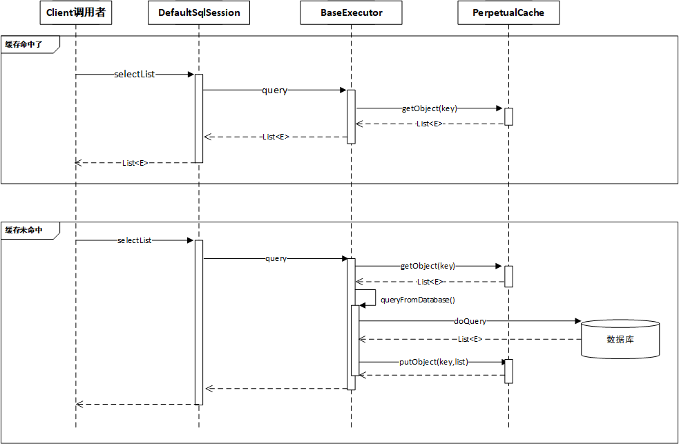
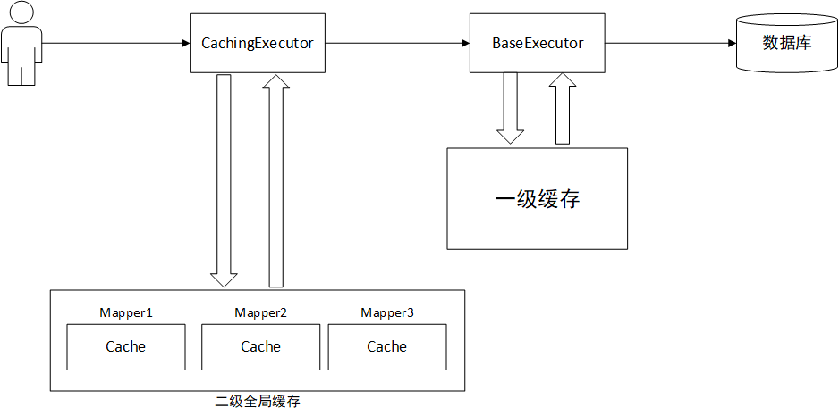
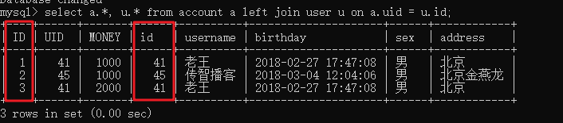
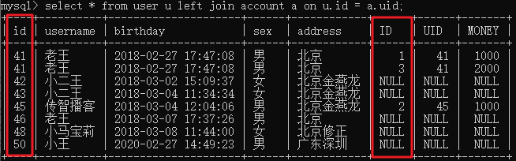
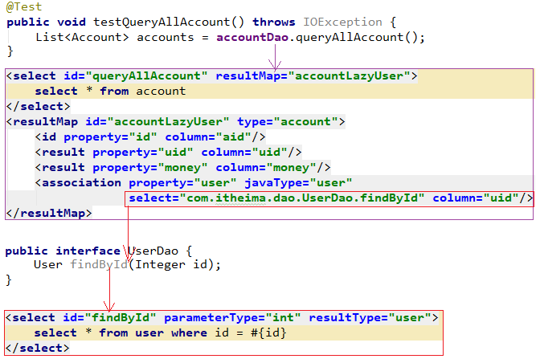
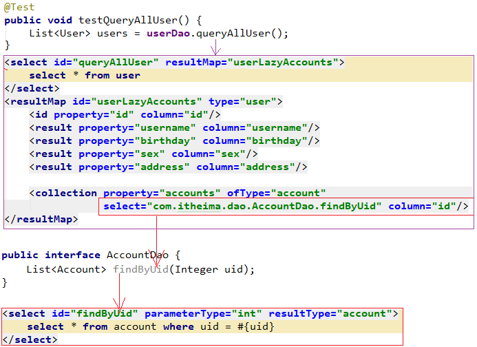

# Mybatis2-课堂笔记

* 准备工作：创建Maven项目，导入依赖坐标，创建JavaBean

* 编写代码：

  1. 创建一个映射器：dao层的接口，不需要实现类

  ```java
  public interface UserDao{
      List<User> queryAll();
      void save(User user);
  }
  ```

  2. 创建一个映射文件：名称、位置 和  映射器的名称、位置相同

  ```xml
  <mapper namespace="com.itheima.dao.UserDao">
  	<select id="queryAll" resultType="User">
      	select * from user
      </select>
      <insert id="save">
          <selectKey resultType="int" keyProperty="id" order="AFTER">
          	select last_insert_id()
          </selectKey>
      	insert into user(username,sex,...) values(#{username},#{sex},...)
      </insert>
  </mapper>
  ```

  3. 创建一个全局配置文件：名称随意，建议放到resources目录里

  ```xml
  <configuration>
  	<typeAliases>
      	<package name="com.itheima.domain"/>
      </typeAliases>
      <environments default="javaee103">
      	<environment id="javaee103">
          	<transactionManager type="JDBC"/>
              <dataSource type="POOLED">
                  <property name="driver" value="com.mysql.jdbc.Driver"/>
                  <property name="url" value="..."/>
                  <property name="username" value="root"/>
                  <property name="password" value="root"/>
              </dataSource>
          </environment>
      </environments>
      <mappers>
      	<package name="com.itheima.dao"/>
      </mappers>
  </configuration>
  ```

* 编写测试代码

  ```java
  //1.加载全局配置文件
  InputStream is = Resources.getResourceAsStream("SqlMapConfig.xml");
  
  //2.创建工厂
  SqlSessionFactory factory = new SqlSessionFactoryBuilder().build(is);
  //3.生产SqlSession
  SqlSession session = factory.openSession();
  //4.生成映射器代理对象
  UserDao dao = session.getMapper(UserDao.class);
  List<User> userList = dao.queryAll();
  
  //5.释放资源
  session.close();
  is.close();
  ```

* `#{}`和`${}`的区别
  * `#{}`：本质是预编译
    * 可以防止SQL注入
    * 可以自动进行Java类型和JDBC类型的转换
    * 如果只有一个参数并且是简单类型，`#{abc}`
  * `#{}`：本质是拼接字符串
    * 不能防止SQL注入
    * 不能自动进行Java类型和JDBC类型的转换
    * 如果只有一个参数，并且是简单类型，`${value}`
* Mybatis里使用的设计模式
  * 构造者模式：用于隐藏复杂的构造过程，根据配置文件，定制生成对象
  * 工厂模式：用于批量生产对象，目的是解耦
  * 代理模式：当不能、不方便直接操作时，可以通过代理对象间接操作

## 一、SQL深入-动态sql【重点】

### 1. Mybatis动态SQL简介

​	我们在前边的学习过程中，使用的SQL语句都非常简单。而在实际业务开发中，我们的SQL语句通常是动态拼接而成的，比如：条件搜索功能的SQL语句。

　　在Mybatis中，SQL语句是写在映射配置的XML文件中的。Mybatis提供了一些XML的标签，用来实现动态SQL的拼接。	常用的标签有：

- `<if></if>`：用来进行判断，相当于Java里的if判断
- `<where></where>`：通常和if配合，用来代替SQL语句中的`where 1=1`
- `<foreach></foreach>`：用来遍历一个集合，把集合里的内容拼接到SQL语句中。例如拼接：`in (value1, value2, ...)`
- `<sql></sql>`：用于定义sql片段，达到重复使用的目的

### 2. Mybatis环境准备

​	我们以对user表的操作为例，演示这些标签的用法。先准备Mybatis的环境如下

1. 创建Maven的java项目，配置好坐标，引入Mybatis的依赖

   ```xml
   	<!-- 项目坐标 -->
   	<groupId>com.itheima</groupId>
       <artifactId>mybatis_day03_sql</artifactId>
       <version>1.0-SNAPSHOT</version>
   
   	<!-- 引入jar包依赖 -->
   	<dependencies>
           <dependency>
               <groupId>mysql</groupId>
               <artifactId>mysql-connector-java</artifactId>
               <version>5.1.46</version>
           </dependency>
           <dependency>
               <groupId>org.mybatis</groupId>
               <artifactId>mybatis</artifactId>
               <version>3.4.6</version>
           </dependency>
           <dependency>
               <groupId>log4j</groupId>
               <artifactId>log4j</artifactId>
               <version>1.2.17</version>
           </dependency>
           <dependency>
               <groupId>junit</groupId>
               <artifactId>junit</artifactId>
               <version>4.12</version>
           </dependency>
       </dependencies>
   ```

2. 创建JavaBean实体类：User

   ```java
   public class User {
       private Integer id;
       private String username;
       private Date birthday;
       private String sex;
       private String address;
   
       //get/set...
       //toString...
   }
   ```
   
3. 创建映射器接口UserDao（准备好备用，暂时不需要加方法）

   ```java
   public interface UserDao {
   }
   ```

4. 创建映射文件UserDao.xml（准备好备用）

   ```xml
   <?xml version="1.0" encoding="utf-8"?>
   <!DOCTYPE mapper
           PUBLIC "-//mybatis.org//DTD Mapper 3.0//EN"
           "http://mybatis.org/dtd/mybatis-3-mapper.dtd">
   <mapper namespace="com.itheima.dao.UserDao">
   </mapper>
   ```

5. 创建Mybatis的全局配置文件，配置好类型别名和映射器

   ```xml
   <?xml version="1.0" encoding="UTF-8"?>
   <!DOCTYPE configuration
           PUBLIC "-//mybatis.org//DTD Config 3.0//EN"
           "http://mybatis.org/dtd/mybatis-3-config.dtd">
   <configuration>
       <typeAliases>
           <package name="com.itheima.domain"/>
       </typeAliases>
   
       <environments default="mysql">
           <environment id="mysql">
               <transactionManager type="JDBC"/>
               <dataSource type="POOLED">
                   <property name="driver" value="com.mysql.jdbc.Driver"/>
                   <property name="url" value="jdbc:mysql:///mybatis"/>
                   <property name="username" value="root"/>
                   <property name="password" value="root"/>
               </dataSource>
           </environment>
       </environments>
   
       <mappers>
           <package name="com.itheima.dao"/>
       </mappers>
   </configuration>
   ```

6. 准备log4j日志配置文件

   ```properties
   # Set root category priority to INFO and its only appender to CONSOLE.
   #log4j.rootCategory=INFO, CONSOLE            debug   info   warn error fatal
   log4j.rootCategory=debug, CONSOLE
   
   # Set the enterprise logger category to FATAL and its only appender to CONSOLE.
   log4j.logger.org.apache.axis.enterprise=FATAL, CONSOLE
   
   # CONSOLE is set to be a ConsoleAppender using a PatternLayout.
   log4j.appender.CONSOLE=org.apache.log4j.ConsoleAppender
   log4j.appender.CONSOLE.layout=org.apache.log4j.PatternLayout
   log4j.appender.CONSOLE.layout.ConversionPattern=%d{ISO8601} %-6r [%15.15t] %-5p %30.30c %x - %m\n
   ```
   
7. 准备好单元测试类（准备好备用） 

   ```java
   public class MybatisSqlTest {
       private InputStream is;
       private SqlSession session;
       private UserDao dao;
   
       @Before
       public void init() throws IOException {
           is = Resources.getResourceAsStream("SqlMapConfig.xml");
           SqlSessionFactoryBuilder builder = new SqlSessionFactoryBuilder();
           SqlSessionFactory factory = builder.build(is);
           session = factory.openSession();
           dao = session.getMapper(UserDao.class);
       }
   
       @After
       public void destory() throws IOException {
           session.close();
           is.close();
       }
   }
   ```

### 3. 动态SQL的标签应用

#### 3.1 `<if>`标签：

##### 3.1.1 语法介绍

```xml
<if test="判断条件，使用OGNL表达式进行判断">
	SQL语句内容， 如果判断为true，这里的SQL语句就会进行拼接
</if>
```

##### 3.1.2 需求描述

* 根据用户的名称和性别搜索用户信息。

* 把搜索条件放到User对象里，传递给SQL语句

##### 3.1.3 需求实现

###### 1) 在映射器接口UserDao中增加方法

```java
public interface UserDao {
	//根据user搜索用户信息
    List<User> search(User user);
}
```

###### 2) 在映射文件UserDao.xml中配置statement

```xml
    <select id="search" parameterType="user" resultType="user">
        select * from user where 1=1
        <if test="username != null">
            and username like #{username}
        </if>
        <if test="sex != null">
            and sex = #{sex}
        </if>
    </select>
```

> 注意：
>
> 1. SQL语句中   where 1=1 不能省略
> 2. 在if标签的test属性中，直接写OGNL表达式，从parameterType中取值进行判断，不需要加#{}或者${}

###### 3) 在单元测试类中编写测试代码

```java
    @Test
    public void testSearch(){
        User user = new User();
        user.setUsername("%王%");
        user.setSex("男");
        
        List<User> users = dao.search(user);
        for (User u : users) {
            System.out.println(u);
        }
    }
```

##### 3.1.4 小结


#### 3.2 `<where>`标签

##### 3.2.1 语法介绍

　在刚刚的练习的SQL语句中，我们写了`where 1=1`。如果不写的话，SQL语句会出现语法错误。Mybatis提供了一种代替`where 1=1`的技术：`<where></where>`标签。

##### 3.2.2 需求描述

​	把2.1.2中的实现代码	进行优化，使用`<where></where>`标签代替`where 1=1`

##### 3.2.3 需求实现

​	只需要把刚刚的映射文件进行修改，修改后：

```xml
    <select id="search" parameterType="user" resultType="user">
        select * from user
        <where>
            <if test="username != null">
                and username like #{username}
            </if>
            <if test="sex != null">
                and sex = #{sex}
            </if>
        </where>
    </select>
```

> 注意：
>
> 1. `<where>`标签代替了`where 1=1`
> 2. `<where>`标签内拼接的SQL没有变化，每个if的SQL中都有`and`
> 3. 使用`<where>`标签时，Mybatis会自动处理掉条件中的第1个`and`，以保证SQL语法正确

再次运行测试代码，查看结果仍然正常

##### 3.2.4 小结


#### 3.3 `<foreach>`标签

##### 3.3.1 语法介绍

​	foreach标签，通常用于循环遍历一个集合，把集合的内容拼接到SQL语句中。例如，我们要根据多个id查询用户信息，SQL语句：

```sql
select * from user where id = 1 or id = 2 or id = 3;
select * from user where id in (1, 2, 3);
```

​	假如我们传参了id的集合，那么在映射文件中，如何遍历集合拼接SQL语句呢？可以使用`foreach`标签实现。

```xml
<!--
foreach标签：
	属性：
		collection：被循环遍历的对象，使用OGNL表达式获取，注意不要加#{}
		open：循环之前，拼接的SQL语句的开始部分
		item：定义变量名，代表被循环遍历中每个元素，生成的变量名
		separator：分隔符
		close：循环之后，拼接SQL语句的结束部分
	标签体：
		使用#{OGNL}表达式，获取到被循环遍历对象中的每个元素
-->
<foreach collection="" open="id in(" item="id" separator="," close=")">
    #{id}
</foreach>
id in(41,42,44,45)
```

##### 3.3.2 需求描述

　QueryVO中有一个属性ids， 是id值的集合。根据QueryVO中的ids查询用户列表。

​	QueryVO类如下：

```java
public class QueryVO {
    
    private Integer[] ids;

    public Integer[] getIds() {
        return ids;
    }

    public void setIds(Integer[] ids) {
        this.ids = ids;
    }
}
```

##### 3.3.3 需求实现

###### 1) 在映射器接口UserDao中增加方法

```java
List<User> findByIds(QueryVO vo);
```

###### 2) 在映射文件UserDao.xml中添加statement

```xml
<!--在全局配置文件中已经使用package配置了类型别名-->
<select id="findByIds" resultType="user" parameterType="queryvo">
    select * from user 
    <where>
        <foreach collection="ids" open="and id in (" item="id" separator="," close=")">
            #{id}
        </foreach>
    </where>
</select>
```

###### 3) 在单元测试类中编写测试代码

```java
    @Test
    public void testFindUserByIdsQueryVO(){
        QueryVO vo = new QueryVO();
        vo.setIds(new Integer[]{41, 42});

        List<User> userList = dao.findByIds(vo);
        for (User user : userList) {
            System.out.println(user);
        }
    }

```

##### 3.3.4 小结


#### 3.4 `<sql>`标签

　　在映射文件中，我们发现有很多SQL片段是重复的，比如：`select * from user`。Mybatis提供了一个`<sql>`标签，把重复的SQL片段抽取出来，可以重复使用。

##### 3.4.1 语法介绍

在映射文件中定义SQL片段：

```xml
<sql id="唯一标识">sql语句片段</sql>
```

在映射文件中引用SQL片段：

```xml
<include refid="sql片段的id"></include>
```

> 扩展：
>
> ​	如果想要引入其它映射文件中的sql片段，那么`<include>`标签的refid的值，需要在sql片段的id前指定namespace。例如：
>
> ​	`<include refid="com.itheima.dao.RoleDao.selectRole"></include>`
>
> ​	表示引入了namespace为`com.itheima.dao.RoleDao`的映射文件中id为`selectRole`的sql片段

##### 3.4.2 需求描述

在查询用户的SQL中，需要重复编写：`select * from user`。把这部分SQL提取成SQL片段以重复使用

##### 3.4.3 需求实现

###### 1) 在映射文件UserDao.xml中定义SQL片段

```xml
    <sql id="selectUser">
        select * from user
    </sql>
```

###### 2) 在映射文件UserDao.xml中使用SQL片段

```xml
<select id="findByIds" resultType="user" parameterType="queryvo">
    <!-- refid属性：要引用的sql片段的id -->
    <include refid="selectUser"></include> 
    <where>
        <foreach collection="ids" open="and id in (" item="id" separator="," close=")">
            #{id}
        </foreach>
    </where>
</select>
```

## 二、Mybatis的缓存【了解】

### 1. 准备Mybatis环境

1. 创建Maven的Java项目，配置依赖

2. 创建JavaBean：User

   注意：**不要重写toString()方法**，我们需要打印User对象的地址

   ```java
   public class User {
       private Integer id;
       private String username;
       private Date birthday;
       private String sex;
       private String address;
   
       //get/set方法......
   }
   ```

3. 创建映射器接口UserDao

   ```java
   public interface UserDao {
       User findUserById(Integer uid);
   }
   ```

4. 创建映射文件UserDao.xml

   ```xml
   <?xml version="1.0" encoding="utf-8"?>
   <!DOCTYPE mapper
           PUBLIC "-//mybatis.org//DTD Mapper 3.0//EN"
           "http://mybatis.org/dtd/mybatis-3-mapper.dtd">
   <mapper namespace="com.itheima.dao.UserDao">
       <select id="findUserById" parameterType="int" resultType="user">
           select * from user where id = #{uid}
       </select>
   </mapper>
   ```

5. 准备Mybatis的全局配置文件，配置好别名和映射器

   ```xml
   <?xml version="1.0" encoding="UTF-8"?>
   <!DOCTYPE configuration
           PUBLIC "-//mybatis.org//DTD Config 3.0//EN"
           "http://mybatis.org/dtd/mybatis-3-config.dtd">
   <configuration>
       <typeAliases>
           <package name="com.itheima.domain"/>
       </typeAliases>
       <environments default="mysql_mybatis">
           <environment id="mysql_mybatis">
               <transactionManager type="JDBC"/>
               <dataSource type="POOLED">
                   <property name="driver" value="com.mysql.jdbc.Driver"/>
                   <property name="url" value="jdbc:mysql:///mybatis"/>
                   <property name="username" value="root"/>
                   <property name="password" value="root"/>
               </dataSource>
           </environment>
       </environments>
       <mappers>
           <package name="com.itheima.dao"/>
       </mappers>
   </configuration>
   ```

6. 创建log4j日志配置文件

   ```properties
   # Set root category priority to INFO and its only appender to CONSOLE.
   #log4j.rootCategory=INFO, CONSOLE            debug   info   warn error fatal
   log4j.rootCategory=debug, CONSOLE
   
   # CONSOLE is set to be a ConsoleAppender using a PatternLayout.
   log4j.appender.CONSOLE=org.apache.log4j.ConsoleAppender
   log4j.appender.CONSOLE.layout=org.apache.log4j.PatternLayout
   log4j.appender.CONSOLE.layout.ConversionPattern=%d{ISO8601} %-6r [%15.15t] %-5p %30.30c %x - %m\n
   ```


### 2. 一级缓存

#### 2.1 什么是一级缓存

##### 2.1.1 一级缓存介绍

* 一级缓存，是SqlSession对象提供的缓存
* 执行一次查询之后，查询的结果（JavaBean对象）会被缓存到SqlSession中。
* 再次查询同样的数据，Mybatis会优先从缓存中查找；如果找到了，就不再查询数据库。



##### 2.1.2 一级缓存的清除

* 当调用了SqlSession对象的修改、添加、删除、commit()、close()、clearCache()等方法时，一级缓存会被清空。

#### 2.2 一级缓存效果演示

```java
/**
 * Mybatis缓存效果演示
 */
public class MybatisCacheTest {
    private InputStream is;
    private SqlSession session;
    private UserDao dao;
    /**
     * 测试 Mybatis的一级缓存：
     * SQL语句执行了一次、输出user1和user2的地址是相同的
     * 说明Mybatis使用了缓存
     */
    @Test
    public void testLevel1Cache(){
        User user1 = dao.findUserById(41);
        System.out.println(user1);

        User user2 = dao.findUserById(41);
        System.out.println(user2);
    }

    /**
     * 测试  清除Mybatis的一级缓存
     * 两次打印的User地址不同，执行了两次SQL语句
     * SqlSession的修改、添加、删除、commit()、clearCache()、close()都会清除一级缓存
     */
    @Test
    public void testClearLevel1Cache(){
        User user1 = dao.findUserById(41);
        System.out.println(user1);

        session.clearCache();

        User user2 = dao.findUserById(41);
        System.out.println(user2);
    }

    @Before
    public void init() throws IOException {
        is = Resources.getResourceAsStream("SqlMapConfig.xml");
        SqlSessionFactory factory = new SqlSessionFactoryBuilder().build(is);
        session = factory.openSession();
        dao = session.getMapper(UserDao.class);
    }

    @After
    public void destory() throws IOException {
        session.close();
        is.close();
    }
}
```

### 3. 二级缓存

#### 3.1 什么是二级缓存

* 是Mapper级别的缓存
* 由同一个SqlSessionFactory对象生产的SqlSession对象，同样的映射器Mapper共享其缓存。
* 注意：
  * 二级缓存，缓存的是序列化之后的数据；
  * 当从缓存里取数据时，要进行反序列化还原成JavaBean对象
  * 要求JavaBean必须实现序列化接口`Serializable`
  * **二级缓存需要手动开启**



#### 3.2 二级缓存效果演示

##### 1) 修改Mybatis全局配置文件，开启全局的二级缓存开关

```xml
<settings>
    <!-- 增加此配置项，启动二级缓存（默认值就是true，所以这一步可以省略不配置） -->
    <setting name="cacheEnabled" value="true"/>
</settings>
```

##### 2) 修改映射文件UserDao.xml，让映射器支持二级缓存

```xml
<mapper namespace="com.itheima.dao.UserDao">
    <!-- 把cache标签加到映射文件 mapper标签里 -->
    <cache/>
    ......
</mapper>
```

##### 3) 修改映射文件UserDao中的findById，让此方法（statement）支持二级缓存

```xml
<!-- 如果statement的标签上，设置有的useCache="true"，表示此方法要使用二级缓存 -->
<select id="findById" parameterType="int" resultType="user" useCache="true">
    select * from user where id = #{id}
</select>
```

##### 4) 修改JavaBean：User

注意：如果要使用二级缓存，那么**JavaBean需要实现Serializable接口**

```java
public class User implements Serializable {
    private Integer id;
    private String username;
    private Date birthday;
    private String sex;
    private String address;

    //get/set......
}
```

##### 5) 编写测试代码

```java
/**
 * Mybatis二级缓存效果演示
 */
public class MybatisLevel2CacheTest {
    private InputStream is;
    private SqlSessionFactory factory;

    /**
     * 测试二级缓存。
     * 测试结果：
     *      虽然输出的user1和user2地址不同，但是SQL语句只执行了一次，说明第二次用了缓存。
     *      Mybatis的二级缓存，保存的不是JavaBean对象，而是散列的数据。
     *      当要获取缓存时，把这些数据重新组装成一个JavaBean对象，所以地址不同
     */
    @Test
    public void testLevel2Cache(){
        SqlSession session1 = factory.openSession();
        UserDao dao1 = session1.getMapper(UserDao.class);
        User user1 = dao1.findUserById(41);
        System.out.println(user1);
        session1.close();

        SqlSession session2 = factory.openSession();
        UserDao dao2 = session2.getMapper(UserDao.class);
        User user2 = dao2.findUserById(41);
        System.out.println(user2);
        session2.close();
    }

    @Before
    public void init() throws IOException {
        is = Resources.getResourceAsStream("SqlMapConfig.xml");
        SqlSessionFactoryBuilder builder = new SqlSessionFactoryBuilder();
        factory = builder.build(is);
    }

    @After
    public void destory() throws IOException {
        is.close();
    }
}
```

## 三、多表关联查询【重点】

### 1. 多表关系和多表查询回顾

#### 多表关系回顾

* 一对一，一对多，多对多
* Mybatis把表关系分成两类：
  * 对一：一对一、多对一。 多个帐号属于同一个用户，那么：一个帐号关联一个用户
  * 对多：一对多、多对多。一个用户拥有多个帐号，那么：一个用户关联多个帐号

#### 多表查询回顾

* 内连接查询：查询表之间必定有关联的数据

```mysql
# 显式内连接：只查有关联的数据，无关数据不查
#select * from 表1 inner join 表2 on 表关联条件
select * from user inner join account on user.id = account.uid
# 隐式内连接
#select * from 表1, 表2 where 表关联条件
select * from user, account where user.id = account.uid
```

* 外连接查询：查询一张表的全部数据，及另外一张表的关联数据

```mysql
# 左外连接：查询左表的全部数据，及右表的关联数据
#select * from 表1 left join 表2 on 表关联条件
select * from user left join account on user.id = account.uid

# 右外连接：查询右表的全部数据，及左表的关联数据
#select * from 表1 right join 表2 on 表关联条件
select * from user right join account on user.id = account.uid
```

* 子查询：查询嵌套的技巧

```mysql
# 子查询：子查询结果是一个值
select * from user where id = (select uid from account where id = 1)
# 子查询：子查询结果是一个集合
select * from user where id in(select uid from account where money > 1000)
# 子查询：子查询结果是一张虚拟表（n行n列），我们可以拿虚拟表 和 其它表进行关联查询
select * from user, account where user.id = account.uid and account.money > 1000
select * from user u, (select * from account where money > 1000) t where u.id = t.uid
```


### 2. 多表查询准备工作

1. 创建Maven的java项目，配置项目坐标，并引入Mybatis的依赖（略）
2. 分别创建好user表和account表的实体类：User和Account

```java
public class User {
    private Integer id;
    private String username;
    private Date birthday;
    private String sex;
    private String address;
    //get/set...
    //toString
}
```

```java
public class Account {
    private Integer id;
    private Integer uid;
    private Double money;
    //get/set...
    //toString
}
```

3. 在dao中创建映射器接口AccountDao和UserDao（准备好 备用，不需要添加方法）

```java
public interface AccountDao {
}

public interface UserDao {
}
```

4. 创建映射器的配置文件AccountDao.xml和UserDao.xml（准备好备用）

```xml
<?xml version="1.0" encoding="utf-8"?>
<!DOCTYPE mapper
        PUBLIC "-//mybatis.org//DTD Mapper 3.0//EN"
        "http://mybatis.org/dtd/mybatis-3-mapper.dtd">
<mapper namespace="com.itheima.dao.AccountDao">
</mapper>
```

```xml
<?xml version="1.0" encoding="utf-8"?>
<!DOCTYPE mapper
        PUBLIC "-//mybatis.org//DTD Mapper 3.0//EN"
        "http://mybatis.org/dtd/mybatis-3-mapper.dtd">
<mapper namespace="com.itheima.dao.UserDao">
</mapper>
```

6. 创建Mybatis全局配置文件，配置好类型别名和映射器

```xml
<?xml version="1.0" encoding="UTF-8"?>
<!DOCTYPE configuration
        PUBLIC "-//mybatis.org//DTD Config 3.0//EN"
        "http://mybatis.org/dtd/mybatis-3-config.dtd">
<configuration>
    <typeAliases>
        <package name="com.itheima.domain"/>
    </typeAliases>
    <environments default="mysql_mybatis">
        <environment id="mysql_mybatis">
            <transactionManager type="JDBC"/>
            <dataSource type="POOLED">
                <property name="driver" value="com.mysql.jdbc.Driver"/>
                <property name="url" value="jdbc:mysql:///mybatis"/>
                <property name="username" value="root"/>
                <property name="password" value="root"/>
            </dataSource>
        </environment>
    </environments>
    <mappers>
        <package name="com.itheima.dao"/>
    </mappers>
</configuration>
```

6. 准备日志配置文件

```properties
# Set root category priority to INFO and its only appender to CONSOLE.
#log4j.rootCategory=INFO, CONSOLE            debug   info   warn error fatal
log4j.rootCategory=debug, CONSOLE

# CONSOLE is set to be a ConsoleAppender using a PatternLayout.
log4j.appender.CONSOLE=org.apache.log4j.ConsoleAppender
log4j.appender.CONSOLE.layout=org.apache.log4j.PatternLayout
log4j.appender.CONSOLE.layout.ConversionPattern=%d{ISO8601} %-6r [%15.15t] %-5p %30.30c %x - %m\n
```

7. 编写好单元测试类（准备好备用）

```java
public class MybatisMultipleTest {
    private InputStream is;
    private SqlSession session;
    private AccountDao accountDao;
    private UserDao userDao;

    @Before
    public void init() throws IOException {
        is = Resources.getResourceAsStream("SqlMapConfig.xml");
        SqlSessionFactoryBuilder builder = new SqlSessionFactoryBuilder();
        SqlSessionFactory factory = builder.build(is);
        session = factory.openSession();
        accountDao = session.getMapper(AccountDao.class);
        userDao = session.getMapper(UserDao.class);
    }

    @After
    public void destory() throws IOException {
        session.close();
        is.close();
    }
}
```

### 3. 一对一（多对一）关联查询

#### 需求描述

* 需求：查询所有帐户表信息，及其关联的用户信息
* `select * from account a left join user u on a.uid = u.id`

#### 需求实现

**JavaBean中要有 关联JavaBean的引用**。例如：

* 在Account中增加一个属性user，指向User对象。
  * 把查询结果集中，帐号信息封装到Account中
  * 把查询结果集中，用户信息封装到Account的User中
* 注意：多表查询的SQL语句中，一定不能有重名列



```mysql
# 需求：查询所有帐户表信息，及其关联的用户信息
#！！！注意！！！：多表查询语句的结果里，一定不能有重名列。如果有重名列，就给列起别名，保证列名不重复
select a.id aid, a.uid uid, a.money money, u.* from account a left join user u on a.uid = u.id
```


##### 1) 修改JavaBean：Account类

注意：Account中要有User的引用

```java
public class Account {
    private Integer id;
    private Integer uid;
    private Double money;
    
    private User user;

    //get/set...
    //toString...
}
```

##### 2) 在映射器接口AccountDao中增加方法

```java
//查询所有帐号，及其关联的用户信息-类引用方式
List<Account> queryAllAccounts2();
```

##### 3) 在映射文件AccountDao.xml中增加statement

```xml
<select id="queryAllAccounts2" resultMap="AccountUserMap">
    SELECT a.id aid, a.uid uid, a.money money, u.* FROM account a LEFT JOIN USER u ON a.uid = u.id
</select>

<resultMap id="AccountUserMap" type="account">
    <id property="id" column="aid"/>
    <result property="uid" column="uid"/>
    <result property="money" column="money"/>
    <!-- 
	association：用于把结果集中某些列的数据，封装到JavaBean中关联的一个对象上。用于一对一情形
		property：把数据封装到哪个属性关联的对象上
		javaType：关联的对象是什么类型的。是com.itheima.domain.User，这里使用了别名
	-->
    <association property="user" javaType="user">
        <id property="id" column="id"/>
        <result property="username" column="username"/>
        <result property="birthday" column="birthday"/>
        <result property="sex" column="sex"/>
        <result property="address" column="address"/>
    </association>
</resultMap>
```

> 注意：SQL语句查询结果集中，不能有重名列。如果有，给列起别名保证没有重名列

##### 4) 在单元测试类中编写测试代码

```java
@Test
public void testQueryAllAccounts2(){
    List<Account> accounts = accountDao.queryAllAccounts2();
    for (Account account : accounts) {
        System.out.println(account);
    }
}
```

#### 小结

1. 编写sql语句。注意查询结果集里不能有重名列。如果有，就起别名保证不重复

2. 修改JavaBean。一个Account关联一个User，那么在Account里就要有一个User对象

3. 实现对一查询功能

   * 在映射器里加方法
   * 在映射文件里加配置

   ```xml
   <select id="xxxx" resultMap="xxxMap">
   	多表查询语句
   </select>
   <resultMap id="xxxMap" type="Account">
   	<!-- 设置Account的属性，和 account表字段的映射信息 -->
       
       <!-- 当设置到Account里的user属性时，关联的是一个JavaBean，要使用association标签 -->
       <association property="user" javaType="User">
       	<!-- 设置关联的User的属性，和查询结果集里字段的映射信息 -->
       </association>
   </resultMap>
   ```

   

### 4. 一对多（多对多）关联查询

#### 需求描述

* 需求：查询所有用户(user)信息，以及每个用户拥有的所有帐号(account)信息

#### 需求实现

**JavaBean中要有关联JavaBean的集合**。例如：

* 在User中增加一个属性accounts，类型是`List<Account>`
  * 把查询结果集中，用户的信息封装到User中
  * 把查询结果集中，帐号的信息封装到User的accounts中
* 编写SQL语句时，注意不能有重名列



```mysql
# 需求：查询所有用户(user)信息，以及每个用户拥有的所有帐号(account)信息
#     ！！！注意！！！：多表查询语句的结果里，一定不能有重名列。如果有重名列，就给列起别名，保证列名不重复
select u.*, a.id aid, a.uid, a.money from user u left join account a on u.id = a.uid
```


##### 1) 修改实体类User

User类中要有`List<Account>`，用于保存用户拥有的帐号信息集合

```java
public class User {
    private Integer id;
    private String username;
    private Date birthday;
    private String sex;
    private String address;
    
    /**增加属性：account的集合*/
    private List<Account> accounts;

    //get/set...
    //toString...
}
```

##### 2) 在映射器接口UserDao中增加方法

```java
List<User> queryAllUsers();
```

##### 3) 在配置文件UserDao.xml中增加statement

```xml
<select id="queryAllUsers" resultMap="userAccountsMap">
    SELECT a.id aid, a.uid uid, a.money money, u.* FROM USER u LEFT JOIN account a 
    ON u.id = a.uid
</select>

<resultMap id="userAccountsMap" type="user">
    <id property="id" column="id"/>
    <result property="username" column="username"/>
    <result property="birthday" column="birthday"/>
    <result property="sex" column="sex"/>
    <result property="address" column="address"/>

    <!--
       collection:用于封装JavaBean中某一属性关联的集合，用于一对多情形
       property：封装哪个属性关联的集合
       ofType：集合中的数据类型是什么。这里是com.itheima.domain.Account，使用了别名
    -->
    <collection property="accounts" ofType="account">
        <id property="id" column="aid"/>
        <result property="uid" column="uid"/>
        <result property="money" column="money"/>
    </collection>
</resultMap>
```

> 注意：SQL语句查询结果集中，不能有重名列。如果有，给列起别名保证没有重名列

##### 4) 在单元测试类中编写测试代码

```java
@Test
public void testQueryAllUsers(){
    List<User> users = userDao.queryAllUsers();
    for (User user : users) {
        System.out.println(user);
    }
}
```

#### 小结

1. 编写sql语句。查询的结果集不能有重名列。如果有，就起别名保证不重复

2. 修改JavaBean。一个User关联多个Account，所以User里应该有`List<Account>`

3. 编写代码实现功能

   * 在映射器里创建方法
   * 在映射文件里创建配置。查询结果集要使用手动映射resultMap，当封装到关联的集合时，使用collection

   ```xml
   <select id="xxx" resultMap="xxxMap">
   	多表查询语句
   </select>
   <resultMap id="xxxMap" type="User">
   	<!-- 配置User的属性 和  查询结果集字段的映射信息 -->
       
       <!-- 当配置到User里的accounts属性时，要使用collection标签 -->
       <collection property="accounts" ofType="Account">
       	<!-- 配置Account的属性 和 结果集字段的映射信息 -->
       </collection>
   </resultMap>
   ```

   


### 5. 练习-多对多关联查询

* 现有用户表（user）和角色表（role），是多对多关系。有中间关系表`user_role`

* 练习：

  1. 查询所有用户，及关联的角色集合

  2. 查询所有角色，及关联的用户集合

#### 5.1 准备工作

1. 创建Maven的java项目，配置好坐标，引入Mybatis的依赖（略）

2. 创建用户信息和角色信息的实体类

   注意：User中要有Role的集合；  Role中要有User的集合

   ```java
   public class User {
       private Integer id;
       private String username;
       private Date birthday;
       private String sex;
       private String address;
   
       private List<Role> roles;
   
       //get/set方法......
       //toString方法......
   }
   ```

   ```java
   public class Role {
       private Integer id;
       private String roleName;
       private String roleDesc;
   
       private List<User> users;
   
       //get/set方法......
       //toString方法......
   }
   ```

3. 创建映射器接口UserDao和RoleDao（准备好备用，暂时不需要加方法）

   ```java
   public interface UserDao {
   }
   ```

   ```java
   public interface RoleDao {
   }
   ```

4. 创建映射文件UserDao.xml和RoleDao.xml

   创建UserDao.xml

   ```xml
   <?xml version="1.0" encoding="utf-8"?>
   <!DOCTYPE mapper
           PUBLIC "-//mybatis.org//DTD Mapper 3.0//EN"
           "http://mybatis.org/dtd/mybatis-3-mapper.dtd">
   <mapper namespace="com.itheima.dao.UserDao">
   </mapper>
   ```

   创建RoleDao.xml

   ```xml
   <?xml version="1.0" encoding="utf-8"?>
   <!DOCTYPE mapper
           PUBLIC "-//mybatis.org//DTD Mapper 3.0//EN"
           "http://mybatis.org/dtd/mybatis-3-mapper.dtd">
   <mapper namespace="com.itheima.dao.RoleDao">
   </mapper>
   ```

5. 创建Mybatis的全局配置文件，配置好别名和映射器

   ```xml
   <?xml version="1.0" encoding="UTF-8"?>
   <!DOCTYPE configuration
           PUBLIC "-//mybatis.org//DTD Config 3.0//EN"
           "http://mybatis.org/dtd/mybatis-3-config.dtd">
   <configuration>
       <typeAliases>
           <package name="com.itheima.domain"/>
       </typeAliases>
       <environments default="mysql_mybatis">
           <environment id="mysql_mybatis">
               <transactionManager type="JDBC"/>
               <dataSource type="POOLED">
                   <property name="driver" value="com.mysql.jdbc.Driver"/>
                   <property name="url" value="jdbc:mysql:///mybatis49"/>
                   <property name="username" value="root"/>
                   <property name="password" value="root"/>
               </dataSource>
           </environment>
       </environments>
       <mappers>
           <package name="com.itheima.dao"/>
       </mappers>
   </configuration>
   ```

6. 准备单元测试类（准备好备用）

   ```java
   public class MybatisMany2ManyTest {
       private InputStream is;
       private SqlSession session;
       private UserDao userDao;
       private RoleDao roleDao;
       
       @Before
       public void init() throws IOException {
           is = Resources.getResourceAsStream("SqlMapConfig.xml");
           SqlSessionFactoryBuilder builder = new SqlSessionFactoryBuilder();
           SqlSessionFactory factory = builder.build(is);
           session = factory.openSession();
           userDao = session.getMapper(UserDao.class);
           roleDao = session.getMapper(RoleDao.class);
       }
   
       @After
       public void destory() throws IOException {
           session.close();
           is.close();
       }
   }
   ```

#### 5.2 练习1：查所有用户，及关联的角色集合

* SQL语句：

```mysql
# 查询所有用户，及关联的角色集合。 表1 left join 表2 on 表1表2关联条件 left join 表3 on 表3的关联条件
#     ！！！注意！！！：多表查询语句的结果里，一定不能有重名列。如果有重名列，就给列起别名，保证列名不重复
select u.*, r.id rid, r.role_name roleName, r.role_desc roleDesc from user u left join user_role ur on u.id = ur.uid left join role r on ur.rid = r.id
```


##### 1) 在映射器接口UserDao中增加方法

```java
//查询所有用户信息，及其关联的角色集合
List<User> queryAllUsers();
```

##### 2) 在映射文件UserDao.xml中增加statement

```xml
<select id="queryAllUsers" resultMap="userRolesMap">
    SELECT u.*, r.id rid, r.role_name roleName, r.role_desc roleDesc
    FROM USER u LEFT JOIN user_role ur ON u.id = ur.uid
    LEFT JOIN role r ON ur.rid = r.id
</select>

<resultMap id="userRolesMap" type="user">
    <id property="id" column="id"/>
    <result property="username" column="username"/>
    <result property="address" column="address"/>
    <result property="birthday" column="birthday"/>
    <result property="sex" column="sex"/>

    <!--
   collection：用于封装JavaBean里关联的角色集合
  -->
    <collection property="roles" ofType="role">
        <id property="id" column="rid"/>
        <result property="roleName" column="roleName"/>
        <result property="roleDesc" column="roleDesc"/>
    </collection>
</resultMap>
```

###### 3) 在单元测试类中编写测试代码

```java
/**
     * 查询所有用户信息，及其关联的角色信息集合
     */
@Test
public void testQueryAllUsers(){
    List<User> users = userDao.queryAllUsers();
    for (User user : users) {
        System.out.println(user);
    }
}
```

#### 5.3 练习2：查所有角色，及关联的用户集合

##### 1) 在映射器接口RoleDao中增加方法

```java
//查询所有角色信息，及其关联的用户集合
List<Role> queryAllRoles();
```

##### 2) 在映射文件RoleDao.xml中增加statement

```xml
<select id="queryAllRoles" resultMap="roleUsersMap">
    SELECT r.id rid, r.role_name roleName, r.role_desc roleDesc, u.*
    FROM role r LEFT JOIN user_role ur ON r.id = ur.rid
    LEFT JOIN USER u ON ur.uid = u.id
</select>
<resultMap id="roleUsersMap" type="role">
    <id property="id" column="rid"/>
    <result property="roleName" column="roleName"/>
    <result property="roleDesc" column="roleDesc"/>

    <collection property="users" ofType="user">
        <id property="id" column="id"/>
        <result property="username" column="username"/>
        <result property="birthday" column="birthday"/>
        <result property="sex" column="sex"/>
        <result property="address" column="address"/>
    </collection>
</resultMap>
```

##### 3) 在单元测试类中编写测试代码

```java
/**
 * 查询所有角色信息，及其关联的用户信息集合
 */
@Test
public void testQueryAllRoles(){
    List<Role> roles = roleDao.queryAllRoles();
    for (Role role : roles) {
        System.out.println(role);
    }
}
```

## 四、Mybatis的延迟加载【重点】

　　在**多表关联查询**时，比如查询用户信息，及其关联的帐号信息，在查询用户时就直接把帐号信息也一并查询出来了。但是在实际开发中，并不是每次都需要立即使用帐号信息，这时候，就可以使用延迟加载策略了。

### 1. 什么是延迟加载

#### 1.1 立即加载

* 不管数据是否需要使用，只要调用了方法，就立即发起查询。
* 比如：查询帐号，得到关联的用户；查询用户，得到关联的帐号

#### 1.2 延迟加载

* 延迟加载，也叫按需加载，或者叫**懒加载**。
  * 只有当真正使用到数据的时候，才发起查询。不使用不发起查询
  * 比如：查询用户信息，不使用accounts的时候，不查询帐号的数据；只有当使用了用户的accounts，Mybatis再发起查询帐号的信息

- 好处：先从单表查询，需要使用关联数据时，才进行关联数据的查询。 单表查询的速度要比多表关联查询速度快，性能高；内存占用小
- 坏处：当需要使用数据时才会执行SQL。这样大批量的SQL执行的情况下，会造成查询等待时间比较长

#### 1.3 延迟加载的使用场景

- 一对一（多对一），通常不使用延迟加载（建议）。比如：查询帐号，关联加载用户信息
- 一对多（多对多），通常使用延迟加载（建议）。比如：查询用户，关联加载帐号信息

### 2. 延迟加载的演示环境准备

​	我们以用户表（user）和帐户表（account）的关联查询，来分别演示一对一（多对一）懒加载实现、一对多（多对多）懒加载实现。

#### 1) 创建Maven的Java项目，配置依赖（略）

#### 2) 创建JavaBean

​	注意：Account中要有User的引用；User中要有Account的集合

```java
public class User {
    private Integer id;
    private String username;
    private Date birthday;
    private String sex;
    private String address;

    private List<Account> accounts;

    //get/set方法.....
    //toString方法.....
}
```

```java
public class Account {
    private Integer id;
    private Integer uid;
    private Double money;

    private User user;

    //get/set方法.....
    //toString方法.....
}
```

#### 3) 创建映射器接口UserDao和AccountDao

```java
public interface UserDao {
}
```

```java
public interface AccountDao{
}
```

#### 4) 创建映射文件UserDao.xml 和AccountDao.xml

```xml
<?xml version="1.0" encoding="utf-8"?>
<!DOCTYPE mapper
        PUBLIC "-//mybatis.org//DTD Mapper 3.0//EN"
        "http://mybatis.org/dtd/mybatis-3-mapper.dtd">
<mapper namespace="com.itheima.dao.UserDao">
</mapper>
```

```xml
<?xml version="1.0" encoding="utf-8"?>
<!DOCTYPE mapper
        PUBLIC "-//mybatis.org//DTD Mapper 3.0//EN"
        "http://mybatis.org/dtd/mybatis-3-mapper.dtd">
<mapper namespace="com.itheima.dao.AccountDao">
</mapper>
```

#### 5) 创建Mybatis的全局配置文件

​	注意，要配置好别名和映射器

```xml
<?xml version="1.0" encoding="UTF-8"?>
<!DOCTYPE configuration
        PUBLIC "-//mybatis.org//DTD Config 3.0//EN"
        "http://mybatis.org/dtd/mybatis-3-config.dtd">
<configuration>
    <typeAliases>
        <package name="com.itheima.domain"/>
    </typeAliases>
    <environments default="mysql_mybatis">
        <environment id="mysql_mybatis">
            <transactionManager type="JDBC"/>
            <dataSource type="POOLED">
                <property name="driver" value="com.mysql.jdbc.Driver"/>
                <property name="url" value="jdbc:mysql:///mybatis"/>
                <property name="username" value="root"/>
                <property name="password" value="root"/>
            </dataSource>
        </environment>
    </environments>
    <mappers>
        <package name="com.itheima.dao"/>
    </mappers>
</configuration>
```

#### 6) 准备好log4j日志配置文件

```properties
# Set root category priority to INFO and its only appender to CONSOLE.
#log4j.rootCategory=INFO, CONSOLE            debug   info   warn error fatal
log4j.rootCategory=debug, CONSOLE

# CONSOLE is set to be a ConsoleAppender using a PatternLayout.
log4j.appender.CONSOLE=org.apache.log4j.ConsoleAppender
log4j.appender.CONSOLE.layout=org.apache.log4j.PatternLayout
log4j.appender.CONSOLE.layout.ConversionPattern=%d{ISO8601} %-6r [%15.15t] %-5p %30.30c %x - %m\n
```

#### 7) 编写单元测试类备用

```java
public class MybatisLazyTest {

    private InputStream inputStream;
    private SqlSession session;
    private UserDao userDao;
    private AccountDao accountDao;

    @Before
    public void init() throws IOException {
        inputStream = Resources.getResourceAsStream("SqlMapConfig.xml");
        SqlSessionFactory factory = new SqlSessionFactoryBuilder().build(inputStream);
        session = factory.openSession();
        userDao = session.getMapper(UserDao.class);
        accountDao = session.getMapper(AccountDao.class);
    }

    @After
    public void destory() throws IOException {
        session.close();
        inputStream.close();
    }
}
```

### 3. 实现一对一（多对一）的延迟加载

#### 3.1 需求描述

* 需求：查询帐号信息，及其关联的用户信息。使用懒加载的方式实现。

#### 3.2 实现步骤



​	实现步骤如下：

1. 在映射器UserDao中，提供findById的方法，供懒加载时使用

2. 在映射器AccountDao中查询帐号信息，使用association实现懒加载关联的用户信息

3. 在全局配置文件中，开启懒加载

   ```xml
   <settings>
       <!--开启 懒加载的全局开关-->
       <setting name="lazyLoadingEnabled" value="true"/>
       <!--关闭 积极加载-->
       <setting name="aggressiveLazyLoading" value="false"/>
   </settings>
   ```

#### 3.3 实现需求

##### 1 提供UserDao的findUserById方法

###### 1) 在映射器UserDao中增加方法

```java
User findById(Integer id);
```

###### 2) 在映射文件UserDao.xml中增加statement

```xml
<select id="findById" parameterType="int" resultType="user">
    select * from user where id = #{id}
</select>
```

##### 2 查询帐号信息，加载关联的用户

###### 1) 在映射器AccountDao中增加方法

```java
List<Account> queryAllAccounts();
```

###### 2) 在映射文件AccountDao.xml中增加statement

```xml
<select id="queryAllAccounts" resultMap="accountLazyUser">
    select * from account
</select>
<resultMap id="accountLazyUser" type="account">
    <id property="id" column="id"/>
    <result property="uid" column="uid"/>
    <result property="money" column="money"/>

    <!--
        association标签：用于封装关联的JavaBean对象
            select：调用哪个statement，懒加载 得到关联的JavaBean对象
            column：调用statement时，需要传递的参数值，从哪个字段中取出
        -->
    <association property="user" javaType="user"
                 column="uid" select="com.itheima.dao.UserDao.findById"/>
</resultMap>
```

##### 3 开启懒加载

* 修改全局配置文件，开启懒加载

```xml
<!-- 把settings标签放到typeAliases之前 -->
<settings>
    <!-- 启动延迟加载 -->
    <setting name="lazyLoadingEnabled" value="true"/>
    <!-- 禁用积极加载：使用按需加载 -->
    <setting name="aggressiveLazyLoading" value="false"/>
</settings>
```

##### 4 测试

```java
/**
 * 测试一对一实现懒加载：查询帐号，及其关联的一个用户。
 */
@Test
public void testQueryAllAccounts(){
    List<Account> accounts = accountDao.queryAllAccounts();
    for (Account account : accounts) {
        System.out.println(account.getId()+", " + account.getUid() + ", " +account.getMoney());
        //执行下面这行代码，才会发起查询user的SQL语句
        System.out.println(account.getUser());
    }
}
```

#### 3.4 小结

* 查询帐号，当需要用到关联的用户时，再查询用户

```mysql
# 查询帐号
select * from account
# 查询帐号关联的用户。用户的id，要从帐号的uid字段取值
select * from user where id = ?
```

* 编写：根据id查询用户的功能`com.itheima.dao.UserDao.findByUid(Integer uid)`
* 编写：查询帐号的功能：`com.itheima.dao.AccountDao.queryAllAccount()`

```xml
<select id="xxx" resultMap="xxxMap">
	select * from account
</select>
<resultMap id="xxxMap" type="Account">
	<!-- 设置 Account的属性 和  account表字段的映射信息 -->
    
    <!-- 当设置到Account关联的user时，要使用association -->
    <assocition property="user" javaType="User" 
                select="com.itheima.dao.UserDao.findByUid" 
                column="uid"/>
</resultMap>
```

* 在全局配置文件里，开启懒加载

```xml
<settings>
    <!--开启懒加载-->
    <setting name="lazyLoadingEnabled" value="true"/>
    <!--关闭积极加载-->
    <setting name="aggressiveLazyLoading" value="false"/>
</settings>
```


### 4. 实现一对多（多对多）的延迟加载

#### 4.1 需求描述

　　需求：查询用户信息，及其关联的帐号信息集合。使用延迟加载实现。

#### 4.2 实现步骤



​	实现步骤如下：

- 在映射器AccountDao，提供findByUid的方法，供懒加载时使用

  ```sql
  SELECT * FROM account WHERE uid = ?
  ```

- 要有映射器UserDao，查询用户信息，使用collection实现懒加载帐号关联的帐号信息

  ```sql
  SELECT * FROM USER
  ```

- 在全局配置文件中，开启懒加载

  ```xml
  <settings>
      <!--开启 懒加载的全局开关-->
      <setting name="lazyLoadingEnabled" value="true"/>
      <!--关闭 积极加载-->
      <setting name="aggressiveLazyLoading" value="false"/>
  </settings>
  ```

#### 4.3 实现需求

##### 1 提供AccountDao的findAccountsByUid方法

###### 1) 在映射器AccountDao中增加方法

```java
List<Account> findByUid(Integer uid);
```

###### 2) 在映射文件AccountDao.xml中增加statement

```xml
<select id="findByUid" parameterType="int" resultType="account">
    select * from account where uid = #{id}
</select>
```

##### 2 查询用户信息，加载关联的帐号集合

###### 1) 在映射器UserDao中增加方法

```java
List<User> queryAllUsers();
```

###### 2) 在映射文件UserDao.xml中增加statement

```xml
<select id="queryAllUsers" resultMap="userLazyAccounts">
    select * from user
</select>
<resultMap id="userLazyAccounts" type="user">
    <id property="id" column="id"/>
    <result property="username" column="username"/>
    <result property="birthday" column="birthday"/>
    <result property="sex" column="sex"/>
    <result property="address" column="address"/>

    <collection property="accounts" ofType="account" 
                column="id" select="com.itheima.dao.AccountDao.findByUid"/>
</resultMap>
```

##### 3 开启懒加载

* 修改全局配置文件，开启懒加载

```xml
<!-- 把settings标签放到typeAliases之前 -->
<settings>
    <!-- 启动延迟加载 -->
    <setting name="lazyLoadingEnabled" value="true"/>
    <!-- 禁用积极加载：使用按需加载 -->
    <setting name="aggressiveLazyLoading" value="false"/>
</settings>
```

##### 4 测试

```java
/**
 * 测试一对多实现懒加载：查询用户，及其关联的帐号集合
 */
@Test
public void testQueryAllUsers(){
    List<User> users = userDao.queryAllUsers();
    for (User user : users) {
        System.out.println(user.getUsername()+", " + user.getSex());
        //执行页面这行代码，才会发起查询account的SQL语句
        System.out.println(user.getAccounts());
    }
}
```

#### 4.4 小结

* 查询用户，当需要使用用户关联的帐号时，再查询帐号数据

```mysql
select * from user
select * from account where uid = 用户的id
```

* 准备功能：`com.itheima.dao.AccountDao.findAccountsByUid(Integer uid)`
* 编写功能：`com.itheima.dao.UserDao.queryAllUser()`

```xml
<select id="queryAllUser" resultMap="userAccountsMap">
	select * from user
</select>
<resultMap id="userAccountsMap" type="User">
	<!-- 设置User对象的属性 和 结果集字段的映射信息 -->
    
    <!-- 当设置到User关联的List<Account>时，要使用collection标签 -->
    <collection property="accounts" ofType="Account" 
                select="com.itheima.dao.AccountDao.findAccountsByUid" column="id"/>
</resultMap>
```


## 五、Mybatis的注解开发【掌握】

　　Mybatis也支持注解开发。但是需要明确的是，Mybatis仅仅是把**映射文件** 使用注解代替了；而Mybatis的全局配置文件，仍然是xml配置。

### 1 准备Mybatis环境

1. 创建Maven的Java项目，配置好坐标，并引入Mybatis的依赖

2. 创建JavaBean：User和Account

   ```java
   public class User {
       private Integer id;
       private String username;
       private Date birthday;
       private String sex;
       private String address;
   
       private List<Account> accounts;
   
       //get/set...
       //toString...
   }
   ```

   ```java
   public class Account {
       private Integer id;
       private Integer uid;
       private Double money;
   
       private User user;
   
       //get/set...
       //toString...
   }
   ```

3. 创建映射器接口UserDao和AccountDao，备用

   ```java
   public interface UserDao {
   }
   ```

   ```java
   public interface UserDao {
   }
   ```

4. 准备Mybatis的全局配置文件，配置好别名和映射器

   ```xml
   <?xml version="1.0" encoding="UTF-8"?>
   <!DOCTYPE configuration
           PUBLIC "-//mybatis.org//DTD Config 3.0//EN"
           "http://mybatis.org/dtd/mybatis-3-config.dtd">
   <configuration>
       <typeAliases>
           <package name="com.itheima.domain"/>
       </typeAliases>
       <environments default="mysql_mybatis">
           <environment id="mysql_mybatis">
               <transactionManager type="JDBC"/>
               <dataSource type="POOLED">
                   <property name="driver" value="com.mysql.jdbc.Driver"/>
                   <property name="url" value="jdbc:mysql:///mybatis"/>
                   <property name="username" value="root"/>
                   <property name="password" value="root"/>
               </dataSource>
           </environment>
       </environments>
       <mappers>
           <package name="com.itheima.dao"/>
       </mappers>
   </configuration>
   ```

5. 准备好单元测试类备用

   ```java
   /**
    * Mybatis的注解开发功能测试--简单的CURD操作
    */
   public class MybatisAnnotationTest {
       private InputStream is;
       private SqlSession session;
       private UserDao userDao;
       private AccountDao accountDao;
   
       @Before
       public void init() throws IOException {
           is = Resources.getResourceAsStream("SqlMapConfig.xml");
           SqlSessionFactory factory = new SqlSessionFactoryBuilder().build(is);
           session = factory.openSession();
           userDao = session.getMapper(UserDao.class);
           accountDao = session.getMapper(AccountDao.class);
       }
       @After
       public void destory() throws IOException {
           session.close();
           is.close();
       }
   }
   ```

### 2. 常用注解介绍

> 注意：实际开发中，通常是注解开发+xml开发。
>
> * 一个功能，不能重复配置：注解配置一次， xml配置一次，mybatis会报错
> * 映射文件名称、位置，要和映射器一样的
> * 开发时：简单功能使用注解，复杂功能使用xml

- @Select：相当于映射文件里的select标签：用于配置查询方法的语句
- @Insert：相当于映射文件里的insert标签
- @SelectKey：相当于映射文件里的selectKey标签，用于添加数据后获取最新的主键值
- @Update：相当于映射文件里的update标签
- @Delete：相当于映射文件里的delete标签
- @Results：相当于映射文件里的resultMap标签
- @Result：相当于映射文件里的result标签，和@Results配合使用，封装结果集的
- @One：相当于映射文件里的association，用于封装关联的一个JavaBean对象
- @Many：相当于映射文件里的collection标签，用于封装关联的一个JavaBean对象集合

### 3. 注解实现简单CURD操作

#### 查询全部用户

1. 在映射器接口UserDao中增加方法

   ```java
   @Select("select * from user")
   List<User> queryAll();
   ```

2. 在测试类MybatisAnnotationTest中编写测试代码

   ```java
   @Test
   public void testQueryAll(){
       List<User> users = dao.queryAll();
       for (User user : users) {
           System.out.println(user);
       }
   }
   ```

#### 根据主键查询一个用户

1. 在映射器接口UserDao中增加方法

   ```java
   @Select("select * from user where id = #{id}")
   User findById(Integer id);
   ```

2. 在测试类MybatisAnnotationTest中编写测试代码

   ```java
   @Test
   public void testFindById(){
       User user = dao.findById(41);
       System.out.println(user);
   }
   ```

#### 添加用户

1. 在映射器接口UserDao中增加方法

   ```java
   @Insert("insert into user (id,username,birthday,sex,address) values (#{id},#{username},#{birthday},#{sex},#{address})")
   @SelectKey(
       statement = "select last_insert_id()", //查询最新主键值的SQL语句
       resultType = Integer.class,  //得到最新主键值的类型
       keyProperty = "id",  //得到最新主键值，保存到哪个属性里
       before = false  //是否在insert操作之前查询最新主键值
   )
   void save(User user);
   ```

2. 在测试类MybatisAnnotationTest中编写测试代码

   ```java
   @Test
   public void testSave(){
       User user = new User();
       user.setUsername("小红");
       user.setSex("女");
       user.setAddress("中粮商务公园");
       user.setBirthday(new Date());
   
       System.out.println("保存之前：" + user);
       dao.save(user);
       session.commit();
       System.out.println("保存之后：" + user);
   }
   ```

#### 修改用户

1. 在映射器接口UserDao中增加方法

   ```java
   @Update("update user set username=#{username},birthday=#{birthday},sex=#{sex},address=#{address} where id=#{id}")
   void edit(User user);
   ```

2. 在测试类MybatisAnnotationTest中编写测试代码

   ```java
   @Test
   public void testEdit(){
       User user = dao.findById(57);
       user.setAddress("广州");
   
       dao.edit(user);
       session.commit();
   }
   ```

#### 删除用户

1. 在映射器接口UserDao中增加方法

   ```java
   @Delete("delete from user where id = #{id}")
   void delete(Integer id);
   ```

2. 在测试类MybatisAnnotationTest中编写测试代码

   ```java
   @Test
   public void testDelete(){
       dao.delete(57);
       session.commit();
   }
   ```

#### JavaBean属性名和字段名不一致的情况处理

1. 创建JavaBean：  User2

   ```java
   public class User2 {
       private Integer userId;
       private String username;
       private Date userBirthday;
       private String userSex;
       private String userAddress;
   
       //get/set...
       //toString...
   }
   ```

2. 在映射器接口UserDao中增加方法

   ```java
   @Select("select * from user")
   @Results({
       @Result(property = "userId", column = "id", id = true),
       @Result(property = "username", column = "username"),
       @Result(property = "userBirthday", column = "birthday"),
       @Result(property = "userSex", column = "sex"),
       @Result(property = "userAddress", column = "address")
   })
   List<User2> queryAllUser2();
   ```

3. 在测试类MybatisAnnotationTest中编写测试代码

   ```java
   @Test
   public void testQueryAllUser2(){
       List<User2> user2List = dao.queryAllUser2();
       for (User2 user2 : user2List) {
           System.out.println(user2);
       }
   }
   ```

### 4. 注解实现多表关联查询

#### 一对一（多对一）关联查询，实现懒加载

##### 需求描述

* 需求：查询帐号信息，及其关联的用户信息

##### 需求实现

1. 修改映射器接口UserDao，增加方法findById（供关联查询时使用）

   ```java
   @Select("select * from user where id = #{id}")
   User findById(Integer id);
   ```

2. 创建JavaBean：Account

   注意：Account中要有User的引用，前边已经准备好

3. 修改映射器接口AccountDao，增加方法

   ```java
   @Select("select * from account where id = #{id}")
   @Results({
       @Result(property = "id", column = "id", id = true),
       @Result(property = "uid", column = "uid"),
       @Result(property = "money", column = "money"),
       @Result(
           property = "user",
           javaType = User.class,
           column = "uid",
           one = @One(
               //一对一关联查询，调用select配置的statement，得到关联的User对象
               select = "com.itheima.dao.UserDao.findById",
               //FetchType.LAZY 表示要使用延迟加载
               fetchType = FetchType.LAZY
           )
       )
   })
   Account findById(Integer id);
   ```

4. 编写测试代码

   ```java
   @Test
   public void testOne2One(){
       Account account = accountDao.findById(1);
       System.out.println(account.getId() + ", "+ account.getMoney());
       
       //如果不执行下面这行代码，Mybatis不会发起查询用户的SQL
       System.out.println(account.getUser());
   }
   ```

#### 一对多（多对多）关联查询，实现懒加载

##### 需求描述

* 需求：查询用户信息，及其关联的帐号集合信息

##### 需求实现

1. 修改映射器AccountDao，增加方法findAccountsByUid（供关联查询时使用）

   ```java
   @Select("select * from account where uid = #{uid}")
   List<Account> findAccountsByUid(Integer uid);
   ```

2. 修改JavaBean：User

   注意：User中需要有Account的集合，前边已经准备好

3. 修改映射器接口UserDao，增加方法

   ```java
   /**
        * 查询用户信息，及其关联的帐号信息集合
        * @param id
        * @return
        */
   @Select("select * from user where id = #{id}")
   @Results({
       @Result(property = "id",column = "id",id = true),
       @Result(property = "username",column = "username"),
       @Result(property = "birthday",column = "birthday"),
       @Result(property = "sex",column = "sex"),
       @Result(property = "address",column = "address"),
       @Result(
           property = "accounts",
           javaType = List.class, //注意，这里是List.class，而不是Account.class
           column = "id",
           many = @Many(
               //一对多关联查询，调用select对应的statement，得到帐号集合
               select = "com.itheima.dao.AccountDao.findAccountsByUid",
               //FetchType.LAZY 表示要使用延迟加载
               fetchType = FetchType.LAZY
           )
       )
   })
   User findUserAccountsById(Integer id);
   ```

4. 编写测试代码

   ```java
   @Test
   public void testOne2Many(){
       User user = userDao.findUserAccountsById(41);
       System.out.println(user.getUsername()+", " + user.getAddress());
       
       //如果不执行下面这行代码，Mybatis不会发起查询帐号的SQL语句
       System.out.println(user.getAccounts());
   }
   ```


## 拓展了解：Mybatis实现传统开发CURD

​	Mybatis中提供了两种dao层的开发方式：一是使用映射器接口代理对象的方式；二是使用映射器接口实现类的方式。其中代理对象的方式是主流，也是我们主要学习的内容。

### 1. 相关类介绍

#### 1.1 SqlSession

​	SqlSession是一个面向用户的接口，定义了操作数据库的方法，例如：selectList, selectOne等等。

​	每个线程都应该有自己的SqlSession对象，它不能共享使用，也是**线程不安全**的。因此最佳的使用范围是在请求范围内、或者方法范围内，绝不能将SqlSession放到静态属性中。

​	SqlSession使用原则：要做到SqlSession：**随用随取，用完就关，一定要关**

**SqlSession的常用API**	

​	SqlSession操作数据库的常用方法有：

| 方法                                       | 作用                                                         |
| ------------------------------------------ | ------------------------------------------------------------ |
| selectList(String statement, Object param) | 查询多条数据，封装JavaBean集合                               |
| selectOne(String statement, Object param)  | 查询一条数据，封装JavaBean对象<br />查询一个数据，比如查询数量 |
| insert(String statement, Object param)     | 添加数据，返回影响行数                                       |
| update(String statement, Object param)     | 修改数据，返回影响行数                                       |
| delete(String statement, Object param)     | 删除数据，返回影响行数                                       |

> 以上方法中的参数statment，是映射文件中的namespace 和  id的值方法名组成的。
>
> 例如：
>
> ​	映射文件的namespace值为com.itheima.dao.UserDao，执行的方法名是queryAll
>
> ​	那么statement的值就是：com.itheima.dao.UserDao.queryAll

#### 1.2 SqlSessionFactory

​	是一个接口，定义了不同的openSession()方法的重载。SqlSessionFactory一旦创建后，可以重复使用，通常是以单例模式管理。

​	SqlSessionFactory使用原则：**单例模式**管理，一个应用中，只要有一个SqlSessionFactory对象即可。

#### 1.3 SqlSessionFactoryBuilder

​	用于构建SqlSessionFactory工厂对象的。一旦工厂对象构建完成，就不再需要SqlSessionFactoryBuilder了，通常是作为工具类使用。

​	SqlSessionFactoryBuilder：只要生产了工厂，builder对象就可以垃圾回收了

### 2. 需求说明

针对user表进行CURD操作，要求使用映射器接口实现类的方式实现：

- 查询全部用户，得到`List<User>`（上节课快速入门已写过，略）
- 保存用户（新增用户）
- 修改用户
- 删除用户
- 根据主键查询一个用户，得到`User`
- 模糊查询
- 查询数量

### 3. 准备Mybatis环境

#### 3.1 创建Maven的Java项目，准备JavaBean

##### 1) 创建Maven的Java项目

##### 2) 在pom.xml中添加依赖

```xml
<dependencies>
    <dependency>
        <groupId>junit</groupId>
        <artifactId>junit</artifactId>
        <version>4.12</version>
    </dependency>
    <dependency>
        <groupId>mysql</groupId>
        <artifactId>mysql-connector-java</artifactId>
        <version>5.1.46</version>
    </dependency>
    <dependency>
        <groupId>log4j</groupId>
        <artifactId>log4j</artifactId>
        <version>1.2.17</version>
    </dependency>
    <dependency>
        <groupId>org.mybatis</groupId>
        <artifactId>mybatis</artifactId>
        <version>3.4.6</version>
    </dependency>
</dependencies>
```

##### 3) 创建JavaBean

```java
public class User {
    private Integer id;
    private String username;
    private Date birthday;
    private String sex;
    private String address;

    //get/set...
    //toString...
}
```

#### 3.2 准备Mybatis的映射器和配置文件

##### 1) 创建映射器接口UserDao

```java
public interface UserDao{
}
```

##### 2) 创建映射器接口的实现类UserDaoImpl

```java
public class UserDaoImpl implements UserDao{
    private SqlSessionFactory factory;

    /**
     * 构造方法。因为工厂对象，是整个应用只要一个就足够了，所以这里不要创建SqlSessionFactory对象
     * 而是接收获取到工厂对象来使用。
     */
    public UserDaoImpl(SqlSessionFactory factory) {
        this.factory = factory;
    }
}
```

##### 3) 创建映射文件UserDao.xml

```xml
<?xml version="1.0" encoding="UTF-8"?>
<!DOCTYPE mapper
        PUBLIC "-//mybatis.org//DTD Mapper 3.0//EN"
        "http://mybatis.org/dtd/mybatis-3-mapper.dtd">
<mapper namespace="com.itheima.dao.UserDao">
    
</mapper>
```

##### 4) 创建Mybatis的全局配置文件

```xml
<?xml version="1.0" encoding="UTF-8"?>
<!DOCTYPE configuration
        PUBLIC "-//mybatis.org//DTD Config 3.0//EN"
        "http://mybatis.org/dtd/mybatis-3-config.dtd">
<configuration>
    <typeAliases>
        <package name="com.itheima.domain"/>
    </typeAliases>
    <environments default="mysql">
        <environment id="mysql">
            <transactionManager type="JDBC"/>
            <dataSource type="POOLED">
                <property name="driver" value="com.mysql.jdbc.Driver"/>
                <property name="url" value="jdbc:mysql:///mybatis"/>
                <property name="username" value="root"/>
                <property name="password" value="root"/>
            </dataSource>
        </environment>
    </environments>

    <mappers>
        <mapper resource="com/itheima/dao/UserDao.xml"/>
    </mappers>
</configuration>
```

##### 4) 准备log4j.properties日志配置文件

```properties
# Set root category priority to INFO and its only appender to CONSOLE.
#log4j.rootCategory=INFO, CONSOLE            debug   info   warn error fatal
log4j.rootCategory=debug, CONSOLE

# Set the enterprise logger category to FATAL and its only appender to CONSOLE.
log4j.logger.org.apache.axis.enterprise=FATAL, CONSOLE

# CONSOLE is set to be a ConsoleAppender using a PatternLayout.
log4j.appender.CONSOLE=org.apache.log4j.ConsoleAppender
log4j.appender.CONSOLE.layout=org.apache.log4j.PatternLayout
log4j.appender.CONSOLE.layout.ConversionPattern=%d{ISO8601} %-6r [%15.15t] %-5p %30.30c %x - %m\n
```

#### 3.3 准备单元测试类

```java
public class MybatisDaoCURDTest {
    private InputStream is;
    private SqlSessionFactory factory;
    private UserDao dao;

    @Before
    public void init() throws IOException {
        is = Resources.getResourceAsStream("SqlMapConfig.xml");
        SqlSessionFactoryBuilder builder = new SqlSessionFactoryBuilder();
        factory = builder.build(is);
        //创建Dao实现类对象时，把factory作为构造参数传递进去---一个应用只要有一个factory就够了
        dao = new UserDaoImpl(factory);
    }

    @After
    public void destory() throws IOException {
        is.close();
    }
}
```

### 4. 编写代码实现需求

#### 4.1 查询全部用户

##### 1) 在映射器UserDao中增加方法

```java
List<User> queryAll();
```

##### 2) 在映射文件UserDao.xml中增加statement

```xml
<select id="queryAll" resultType="User">
    select * from user
</select>
```

##### 3) 在映射器实现类UserDaoImpl中实现方法

```java
@Override
public List<User> queryAll() {
    SqlSession session = factory.openSession();
    List<User> users = session.selectList("com.itheima.dao.UserDao.queryAll");
    session.close();
    return users;
}
```

##### 4) 在单元测试类中编写测试代码

```java
@Test
public void testQueryAll(){
    List<User> users = dao.queryAll();
    for (User user : users) {
        System.out.println(user);
    }
}
```

#### 4.2 保存/新增用户

##### 1) 在映射器UserDao中增加方法

```java
void save(User user);
```

##### 2) 在映射文件UserDao.xml中增加statement

```xml
<insert id="save" parameterType="User">
    <selectKey resultType="int" keyProperty="id" order="AFTER">
        select last_insert_id()
    </selectKey>
    insert into user (id, username, birthday, address, sex) 
    values (#{id}, #{username}, #{birthday},#{address},#{sex})
</insert>
```

##### 3) 在映射器实现类UserDaoImpl中实现方法

```java
@Override
public void save(User user) {
    SqlSession session = factory.openSession();
    session.insert("com.itheima.dao.UserDao.save", user);
    session.commit();
    session.close();
}
```

##### 4) 在单元测试类中编写测试代码

```java
@Test
public void testSaveUser(){
    User user = new User();
    user.setUsername("tom");
    user.setAddress("广东深圳");
    user.setBirthday(new Date());
    user.setSex("男");

    System.out.println("保存之前：" + user);
    dao.save(user);
    System.out.println("保存之后：" + user);
}
```

#### 4.2 修改用户

##### 1) 在映射器UserDao中增加方法

```java
void edit(User user);
```

##### 2) 在映射文件UserDao.xml中增加statement

```xml
<update id="edit" parameterType="User">
    update user set username = #{username}, birthday = #{birthday}, 
    address = #{address}, sex = #{sex} where id = #{id}
</update>
```

##### 3) 在映射器实现类UserDaoImpl中实现方法

```java
@Override
public void edit(User user) {
    SqlSession session = factory.openSession();
    session.update("com.itheima.dao.UserDao.edit", user);
    session.commit();
    session.close();
}
```

##### 4) 在单元测试类中编写测试代码

```java
@Test
public void testEditUser(){
    User user = new User();
    user.setId(71);
    user.setUsername("jerry");
    user.setAddress("广东深圳宝安");
    user.setSex("女");
    user.setBirthday(new Date());

    dao.edit(user);
}
```

#### 4.3 删除用户

##### 1) 在映射器UserDao中增加方法

```java
void delete(Integer id);
```

##### 2) 在映射文件UserDao.xml中增加statement

```xml
<delete id="delete" parameterType="int">
    delete from user where id = #{uid}
</delete>
```

##### 3) 在映射器实现类UserDaoImpl中实现方法

```java
@Override
public void delete(Integer id) {
    SqlSession session = factory.openSession();
    session.delete("com.itheima.dao.UserDao.delete", id);
    session.commit();
    session.close();
}
```

##### 4) 在单元测试类中编写测试代码

```java
@Test
public void testDeleteUser(){
    dao.delete(71);
}
```

#### 4.4 根据主键查询一个用户

##### 1) 在映射器UserDao中增加方法

```java
User findById(Integer id);
```

##### 2) 在映射文件UserDao.xml中增加statement

```xml
<select id="findById" parameterType="int" resultType="User">
    select * from user where id = #{id}
</select>
```

##### 3) 在映射器实现类UserDaoImpl中实现方法

```java
@Override
public User findById(Integer id) {
    SqlSession session = factory.openSession();
    User user = session.selectOne("com.itheima.dao.UserDao.findById", id);
    session.close();
    return user;
}
```

##### 4) 在单元测试类中编写测试代码

```java
@Test
public void testFindUserById(){
    User user = dao.findById(48);
    System.out.println(user);
}
```

#### 4.5 模糊查询

##### 4.5.1 使用`#{}`方式进行模糊查询

###### 1) 在映射器UserDao中增加方法

```java
/**使用#{}方式进行模糊查询*/
List<User> findByUsername1(String username);
```

###### 2) 在映射文件UserDao.xml中增加statement

```xml
<!-- 使用#{}方式进行模糊查询 -->
<select id="findByUsername1" parameterType="string" resultType="User">
    select * from user where username like #{username}
</select>
```

###### 3) 在映射器实现类UserDaoImpl中实现方法

```java
@Override
public List<User> findByUsername1(String username) {
    SqlSession session = factory.openSession();
    List<User> users = session.selectList("com.itheima.dao.UserDao.findByUsername1", username);
    session.close();
    return users;
}
```

###### 4) 在单元测试类中编写测试代码

```java
@Test
public void testFindUserByUsername1(){
    List<User> users = dao.findByUsername1("%王%");
    for (User user : users) {
        System.out.println(user);
    }
}
```

##### 4.5.2 使用`${value}`方式进行模糊查询

###### 1) 在映射器UserDao中增加方法

```java
/**使用${value}方式进行模糊查询*/
List<User> findByUsername2(String username);
```

###### 2) 在映射文件UserDao.xml中增加statement

```xml
<!-- 使用${value}方式进行模糊查询 -->
<select id="findByUsername2" parameterType="string" resultType="User">
    select * from user where username like '%${value}%'
</select>
```

###### 3) 在映射器实现类UserDaoImpl中实现方法

```java
@Override
public List<User> findByUsername2(String username) {
    SqlSession session = factory.openSession();
    List<User> users = session.selectList("com.itheima.dao.UserDao.findByUsername2", username);
    session.close();
    return users;
}
```

###### 4) 在单元测试类中编写测试代码

```java
@Test
public void testFindUserByUsername2(){
    List<User> users = dao.findByUsername2("王");
    for (User user : users) {
        System.out.println(user);
    }
}
```

#### 4.6 查询数量

##### 1) 在映射器UserDao中增加方法

```java
Integer findTotalCount();
```

##### 2) 在映射文件UserDao.xml中增加statement

```xml
<select id="findTotalCount" resultType="int">
    select count(*) from user
</select>
```

##### 3) 在映射器实现类UserDaoImpl中实现方法

```java
@Override
public Integer findTotalCount() {
    SqlSession session = factory.openSession();
    Integer count = session.selectOne("com.itheima.dao.UserDao.findTotalCount");
    session.close();
    return count;
}
```

##### 4) 在单元测试类中编写测试代码

```java
@Test
public void testFindTotalCount(){
    Integer totalCount = dao.findTotalCount();
    System.out.println(totalCount);
}
```


# 复习上午内容

* sql拼接 。QueryVo里有ids和user对象

```java
List<User> search(QueryVO vo);
```

```xml
<select id="search" resultType="User">
	select * from user
    <where>
    	<if test="ids != null and ids.length > 0">
        	<foreach collection="ids" item="id" separator="," open="and id in(" close=")">
            	#{id}
            </foreach>
        </if>
        
        <if test="user != null">
            <if test="user.username!=null and user.username.length()>0">
            	and username like #{user.username}
            </if>
            <if test="user.sex != null and user.sex.length()>0">
                and sex = #{user.sex}
            </if>
        </if>
    </where>
</select>
```

* 缓存

  * 一级缓存：SqlSession的缓存
    * 第一次获取数据：从数据库里查询，然后缓存起来
    * 第二次获取相同数据：优先从缓存中获取
    * 一级缓存的清除：执行增、删、改、提交事务、清除缓存clearCache()、关闭SqlSession
  * 二级缓存：Mapper级别的缓存，相同的Mapper共享缓存

* 多表查询

  1. 编写sql语句。查询结果集里不能有重名列。如果有，就起别名保证列名不重复

  2. 修改JavaBean：

     * 如果关联一个，比如一个Account关联一个User，那么在Account里要有一个User对象
     * 如果关联多个，比如一个User关联多个Account，那么在User里要有一个`List<Account>`

  3. 在映射文件里，使用resultMap进行手动映射

     ```xml
     <select id="xxx" resultMap="xxxMap">
     	多表查询sql语句
     </select>
     <resultMap id="xxxMap" type="JavaBean全限定类名">
     	
         <!-- 当封装到关联的一个JavaBean时，要使用association标签 -->
         <association property="user" javaType="User">
         	<!-- 设置user对象的属性  和  结果集字段的映射信息 -->
         </association>
     </resultMap>
     ```

     ```xml
     <select id="xxx" resultMap="xxxMap">
     	多表查询sql语句
     </select>
     <resultMap id="xxxMap" type="JavaBean全限定类名">
     	
         <!-- 当封装到关联的一个JavaBean集合时，要使用collection标签 -->
         <collection property="accounts" OfType="Account">
         	<!-- 设置Account对象的属性  和  结果集字段的映射信息 -->
         </collection>
     </resultMap>
     ```

  * 懒加载：延迟加载、按需加载、懒加载

  * 对一的懒加载：查询帐号，懒加载关联的用户

    1. 提供根据用户id查询用户的功能：`com.itheima.dao.UserDao.findByUid(Integer uid)`
    2. 编写查询帐号的功能：`com.itheima.dao.AccountDao.queryAllAccount()`

    ```xml
    <select id="queryAllAccount" resultMap="accountMap">
    	select * from account
    </select>
    <resultMap id="accountMap" type="Account">
    	<id property="id" column="id"/>
        <result property="uid" column="uid"/>
        <result property="money" column="money"/>
                
        <association property="user" javaType="User" 
                     select="com.itheima.dao.UserDao.findByUid" column="uid"/>
    </resultMap>
    ```

    3. 修改全局配置文件，开启懒加载

    ```xml
    <settings>
        <!--开启懒加载-->
        <setting name="lazyLoadingEnabled" value="true"/>
        <!--关闭积极加载-->
        <setting name="aggressiveLazyLoading" value="false"/>
    </settings>
    ```

    