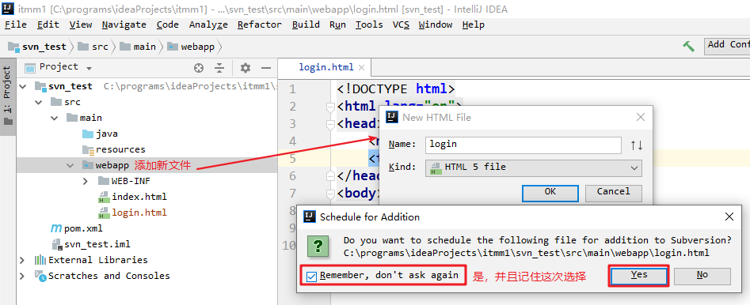
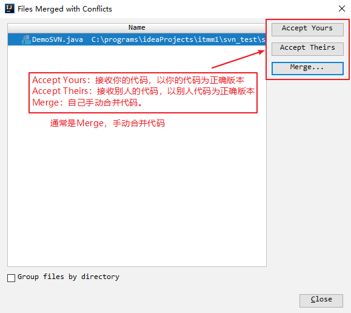

# 黑马面面-第一天

* Mybatis动态sql拼接

```java
List<User> findByQueryVo(QueryVO vo);
```

```xml
<select id="findByQueryVo" resultType="User">
	select * from user
    <where>
    	<if test="ids != null and ids.length>0">
        	<foreach collection="ids" item="id" separator="," open="and id in(" close=")">
                #{id}
            </foreach>
        </if>
        <if test="user != null">
            <if test="user.username != null and user.username.length()>0">
                and username like #{user.username}
            </if>
            <if test="user.sex != null and user.sex.length()>0">
            	and sex = #{user.sex}
            </if>
        </if>
    </where>
</select>
```

* 一级缓存：是SqlSession级别的缓存

  * 同一SqlSession查询相同数据时，可以使用到一级缓存
  * 清除：数据增删改、回滚事务、提交事务、`clearCache()`、关闭SqlSession

* 二级缓存：是Mapper级别的缓存

  * 同一个类型Mapper映射器，可以共享二级缓存
  * 要求：
    * 开启二级缓存：
      * 修改全局配置文件，开启二级缓存
      * 哪个映射器需要用二级缓存，就在映射文件里加`<cache/>`
      * 哪个方法需要二级缓存，就在方法配置的标签上加`useCache="true"`
    * JavaBean要实现序列化接口Serializable

* 多表查询

  * 对一查询：association
    * 查询帐号关联一个用户，在Account里有一个User
  * 对多查询：collection
    * 查询用户关联多个帐号，在User里要有一个`List<Account>`

* 懒加载

  * 对一懒加载：查询帐号，懒加载关联的用户

    ```java
    List<Account> queryAllAccount();
    ```

    ```xml
    <select id="queryAllAccount" resultMap="accountMap">
        select * from account
    </select>
    <resultMap id="accountMap" type="Account">
    	<id property="id" column="id"/>
        <result property="uid" column="uid"/>
        <result property="money" column="money"/>
        
        <associtaion property="user" javaType="User" 
                     select="调用哪个方法可以得到当前帐号关联的User" 
                     column="调用方法时需要的参数从哪个字段取值"/>
    </resultMap>
    ```

    在全局映射文件里开启懒加载，关闭积极加载

  * 对多懒加载

    ```java
    List<User> queryAllUser();
    ```

    ```xml
    <select id="queryAllUser" resultMap="userMap">
    	select * from user
    </select>
    <resultMap id="userMap" type="User">
    	<id property="id" column="id"/>
        <result property="username" column="username"/>
        <!-- ... -->
        
        <collection property="accounts" ofType="Account"
                    select="调用哪个方法可以查询得到当前用户的帐号集合"
                    column="调用方法时需要的参数从哪个字段里获取"/>
    </resultMap>
    ```

* 注解开发：主要代替的是映射文件

  * CURD：`@Select, @Insert,@SelectKey, @Update, @Delete`
  * 结果集封装：`@Results, @Result`
  * 多表关联：`@One, @Many`

* 面面

  * Mybatis框架
  * 自定义SpringMVC框架、自定义SpringSecurity框架
  * 第一天：前置课
  * 第二天~第四天：面面（后台管理系统）
  * 第五天~第六天：面面（小程序的后台系统）

## 一、版本控制【了解】

### 什么是版本控制

#### 目标

* 理解版本控制的概念

#### 分析

1. 什么是版本控制
2. 为什么要进行版本控制
3. 常用的版本控制工具

#### 讲解

##### 什么是版本控制

* 版本控制(Revision control)是一种软件工程技巧
* 籍以在开发的过程中，确保由不同人所编辑的同一档案(项目代码)都得到更新。

##### 为什么要版本控制

1. 查看以往的代码修改记录及变化
2. 恢复到历史某个时间的代码
3. 协同开发时，合并同一文件中不同开发者写的代码
4. 协同开发时定位修改代码的责任人
5. 统计工作任务量
6. 备份源代码：防止删库跑路

##### 常用的版本控制工具

- CVS：早期版本管理软件
- ClearCase：IBM企业级大型版本管理工具, 收费
- VSS：微软推出的版本管理工具, 较少使用
- SVN：市面最流行的版本管理工具之一,拥有CVS所有功能,修复了CVS的不足
- GIT：分布式版本管理工具，Linus（Linux的开发者）：git代替svn已经是大势所趋

#### 小结


### SVN简介与安装

#### 目标

* 了解什么是SVN
* 了解SVN的工作方式
* 安装svn服务端【管理员做】
* 安装svn客户端【开发者做】

#### 讲解

##### 什么是SVN

* SVN：Subversion，是版本管理工具，在开源项目里(J2EE)，曾经有95%以上的项目都用到了 SVN。
* Subversion 项目的初衷是为了替换当年开源社区最为流行的版本控制软件CVS，在CVS的功能的基础上有很多的提升同时也能较好的解决CVS系统的一些不足。

##### SVN的工作方式


* 使用SVN的时候，有一个原则：先更新，再提交

##### 安装SVN服务端【管理员做】

参考《软件/SVN安装文档/01_VisualSVNServer安装步骤.html》

* 注意：SVN服务器的端口，不建议使用80

##### 安装SVN客户端【开发者做】

参考《软件/SVN安装文档/02_svn客户端安装步骤.html》

* 注意： 不要忘记安装客户端的命令行工具（idea里会使用到）


#### 小结

* 安装客户端工具TortoiseSVN时，一定要勾选上“command line client tool”客户端命令行工具
* 如果没有安装，TortoiseSVN不能集成配置到idea的

### SVN服务端管理【管理员做】

#### 目标

* 创建svn仓库
* 创建svn用户和组

#### 讲解

##### 创建SVN仓库

* 打开SVN服务器管理界面：

  * 找到SVN服务器安装目录bin里的`VisualSVN Server.msc`
  * 建议，把这个文件发送到桌面快捷方式

  

* 创建仓库时，通常是一个项目一个仓库（项目，也有人叫做 工程、应用）

参考《软件/SVN安装文档/03_VisualSVN创建仓库.html》


##### 创建SVN用户和组

参考《软件/SVN安装文档/04_VisualSVN创建用户步骤.html》

#### 小结


### SVN客户端使用【开发者做】

#### 目标

1. 使用SVN检出代码
2. 提交代码
3. 更新代码
4. 解决代码冲突
5. 更新到指定版本
6. 版本库的备份与还原【了解】

#### 讲解

##### 1. 使用SVN检出代码

###### 第一步：拷贝代码仓库的路径

* 在企业里，管理员会提供这个路径给开发者的，比如：`http://DESKTOP-N46PIK3/svn/mm1/`

* 打开SVN服务端安装的目录，在bin里，双击：VisualSVN Server.msc即可打开


* 在仓库上右键，把路径拷贝到剪贴板


###### 第二步：检出代码

* 在任意文件夹里，右键，SVN检出


* 输入SVN帐号和密码，点击确定
  * 如果勾选了“保存认证”，那么以后就不需要重新输入帐号密码了


* 检出的结果：


##### 2. 提交代码

###### 第一步：创建文件，纳入版本控制

* 如果新增了文件，要纳入到版本控制中。注意：纳入版本控制，但是并没有提交
* 如果是已经在版本控制中的文件，不需要做这一步


* 修改文件内容


###### 第二步：提交到svn服务器

* 在文件上右键->SVN提交


* 输入日志描述，勾选 要提交的文件，点击确定


* 在认证窗口中输入svn帐号和密码（如果之前保存过帐号和密码，这里就不再弹出认证窗口，会直接提交）


##### 3. 更新代码

* 把本地代码更新到最新版本（比较本地文件和服务器文件的版本号，并非比较文件内容）

* ==提交和更新的原则：每次提交之前，先更新，再提交==


##### 4. 解决代码冲突

###### 什么是代码冲突

* 多人同时修改同一文件，会造成冲突。
* 假如有一个文件，张三和李四两个人都做了修改。
* 如果张三先提交了，那么李四提交就会有冲突；同样 如果李四先提交的，那么张三再提交就会有冲突

| 张三操作                                                     | 李四操作                                                     |
| ------------------------------------------------------------ | ------------------------------------------------------------ |
| 张三修改hello.txt： | 李四修改hello.txt： |
| 张三提交hello.txt                                            |                                                              |
|                                                              | 李四提交hello.txt：冲突了，更新、提交都失败                  |


###### 解决冲突第一步：编辑冲突

* 通常是人工调整合并冲突的代码，编辑冲突


###### 解决冲突第二步：合并代码

在编辑冲突的窗口里，根据实际需求进行合并，可以：

* 以我的内容为准，覆盖掉他们的内容
* 以我的文件为准，覆盖掉服务器上的文件
* 我的内容和他们内容都要：我的在前，他的在后（通常使用这种）
* 我的内容和他们内容都要：他的在前，我的在后


* 合并冲突之后，标记为已解决


###### 解决冲突第三步：提交代码


##### 5. 更新到指定版本

* 在文件上右键，TortoiseSVN，选择“更新至版本”


* 在列出的日志里，选择一个版本，点击确定


##### 6. 版本库备份与还原【管理员做，了解】

###### 备份

* 找到SVN仓库目录，把仓库文件夹拷贝出去


###### 还原

* 如果仓库损坏或者丢失（我们把仓库目录删除掉，模拟丢失）
* 打开SVN的管理控制台，导入仓库


#### 小结

#### 附1：SVN使用规范

+ 先更新，再提交     

  * SVN更新的原则是要随时更新，随时提交。
  * 当完成了一个小功能，能够通过编译并且自己测试之后，谨慎地提交。
  * 如果在修改的期间别人也更改了svn的对应文件，那么commit就可能会失败。如果别人和自 己更改的是同一个文件，那么update时会自动进行合并，如果修改的是同一行，那么合并时会产生冲突，这种情况就需要同之前的开发人员联系，两个人一起协商解决冲突，解决冲突之后，需要两人一起测试保证解决冲突之后，程序不会影响其他功能。 
  * 在更新时注意所更新文件的列表，如果提交过程中产生了更新，则也是需要重新编译并且完成自己的一些必要测试，再进行提交。这样既能了解别人修改了哪些文件，同时也能避免SVN合并错误导致代码有错。

+ 多提交 

  * 每次提交的间歇尽可能地短，以几个小时的开发工作为宜。例如：
    * 在更改UI界面的时候，可以每完成一个UI界面的修改或者设计，就提交一次。
    * 在开发功能模块的时候，可以每完成一个小细节功能的测试，就提交一次。
    * 在修改bug的时候，每修改掉一个bug并且确认修改了这个bug，也就提交一次。
  * 我们提倡多提交，也就能多为代码添加上保险。

+ 不要提交不能通过编译的代码

  * 代码在提交之前，首先要确认自己能够在本地编译。
  * 如果在代码中使用了第三方类库，要考虑到项目组成员中有些成员可能没有安装相应的第三方类库。项目经理在准备项目工作区域的时候，需要考虑到这样的情况，确保开发小组成员在签出代码之后能够在统一的环境中进行编译。

+ 每次提交必须写明注释

  * 在一个项目组中使用SVN，如果提交空的标注或者不确切的标注将会让项目组中其他的成员感到很无奈，项目经理无法很清晰的掌握工作进度，无法清晰的把握此次提交的概要信息，在发现错误后也无法准确的定位引起错误的文件。
  * 所以，在提交工作时，要填写明晰的标注，能够概要的描述所提交文件的信息，让项目组其他成员在看到标注后不用详细看代码就能了解你所做的修改。

+ 不要提交本地自动生成的文件

  * 例如：IDEA里面的编译之后的文件`target`, `.idea`, `.iml`文件

+ 不要提交自己不明白的代码

  * 代码在提交入SVN之后，你的代码将被项目成员所分享。如果提交了你不明白的代码，你看不懂，别人也看不懂，如果在以后出现了问题将会成为项目质量的隐患。
  * 因此在引入任何第三方代码之前，确保你对这个代码有一个很清晰的了解。

+ 慎用(**不要用)**锁定功能

  * 在项目中要慎用锁定的功能，在你锁定了一个文件之后别人就无法继续修改提交该文件，虽然可以减少冲突的发生率，但是可能会影响项目组中其他人员的工作。
  * 平时只有在编辑那些无法合并的文件（例如图片文件，flash文件等）时，才适当的采用锁定操作。
  * 偷锁

#### 附2：SVN图标不生效的解决办法

1. 在桌面上右键，打开SVN客户端的设置


2. 在“图标覆盖-覆盖程序”中点击“启动注册表编辑器”，如下操作。完成后重启电脑


### 在idea里使用SVN

#### 目标

* 把SVN配置到idea里
* 在idea里使用svn

#### 讲解

##### 1. 在idea里配置SVN

* idea里：File | Settings | Version Control | Subversion


##### 2. idea里浏览仓库

###### 1. 打开SVN仓库视图窗口


###### 2. 添加仓库地址


###### 3. 输入svn帐号和密码


###### 4. 浏览SVN仓库


##### 3. idea里上传本地项目到SVN【重点】

###### 1. 在idea里创建一个工程

* 注意：新创建的工程还没有纳入SVN管理


###### 2. 确定SVN功能已经开启。

* 只要开启一次即可，就是启用状态了，不需要每次都开启
* 启用后，idea左侧代码会变成黄色


###### 3. 设置工程的SVN共享目录。

* 到这一步，工程已经关联了SVN，但是还没有提交到SVN服务器


* 设置：项目上传到仓库的什么位置


* SVN服务器的格式，默认1.8即可


* 设置完成之后，本地项目纳入SVN管理。但是项目代码还没有提交到服务器


###### 4. 提交工程代码到SVN服务器

* 在工程（项目）上右键，使用Subversion提交到服务器


* 选择要提交的文件，写好日志信息，点击提交


* 提交以后，在SVN仓库里可以看到了


##### 4. idea里`Add Commit`【重点】

* 添加新文件时，idea会弹出提示：是否将文件添加到SVN管理（尚未提交到SVN服务器）



* 把文件提交到SVN服务器
  * 注意：如果文件有变更，也需要提交到SVN服务器


##### 5. idea里`Update`【重点】

* 根据SVN使用原则，要先更新，再提交。在idea里如何更新？


##### 6. idea里解决冲突

* 当多个用户同时编辑文件时，容易产生冲突。提交冲突时，在idea右下角会弹出错误提示


###### 1. 出现冲突时，在文件上右键更新


###### 2. 选择冲突的解决方案

* 通常是选择Merge，手动合并代码



###### 3. 解决冲突，通常是合并代码

* 左边是自己的代码；右边是服务器上代码（别人的）
* 中间是合并结果。
* 把左边代码和右边代码合并到中间，如果需要，可以再手动调整


###### 4. 解决完冲突，再提交代码


##### 7. idea里checkout检出project

* 方案一：使用TortoiseSVN把project检出到文件夹里，然后用idea打开project

* 方案二：在idea里检出project，并打开

  * 在idea里浏览仓库

  

  * 选择要检出的项目


#### 小结


## 二、自定义SpringMVC【尽量做】

### 模块化创建Servlet

* 把一个模块的功能，放在一个Servlet类里。客户端通过传参action，来指定要执行的方法名称
* 好处：不需要太多的Servlet类，减少了重复代码

```java
@WebServlet(urlPatterns="/linkMan")
public class LinkManServlet extends HttpServlet {

    @Override
    protected void doPost(HttpServletRequest request, HttpServletResponse response) throws ServletException, IOException {
        try {
            //1.接收参数：action--要执行的方法名称
            String action = request.getParameter("action");
            //2.反射调用名称为action的方法
            Class clazz = this.getClass();
            Method method = clazz.getMethod(action, HttpServletRequest.class, HttpServletResponse.class);
            method.invoke(this, request, response);
        } catch (Exception e) {
            e.printStackTrace();
        }
    }

    @Override
    protected void doGet(HttpServletRequest request, HttpServletResponse response) throws ServletException, IOException {
        this.doPost(request, response);
    }
    
    public void queryAll(HttpServletRequest request, HttpServletResponse response) throws ServletException, IOException {
        //....
    }
    
    public void add(HttpServletRequest request, HttpServletResponse response) throws ServletException, IOException {
        //....
    }
}
```

### BaseServlet

#### 目标

* 解决模块化Servlet的缺点，抽取BaseServlet

#### 分析

* 模块化Servlet的缺点：
  * 一个模块写一个Servlet，那么：如果有多个模块，每个Servlet类里都要有相同的`doGet`和`doPost`方法

* 解决方法：
  * 在模块化Servlet基础上，把多个Servlet里相同的doGet和doPost方法提取到公共的父类`BaseServlet`
  * 每个模块的类，不要再继承`HttpServlet`，而是继承`BaseServlet`

#### 实现

##### `BaseServlet`

```java
public class BaseServlet extends HttpServlet {

    @Override
    protected void doPost(HttpServletRequest request, HttpServletResponse response) throws ServletException, IOException {
        try {
            //1.接收参数：action--要执行的方法名称
            String action = request.getParameter("action");
            //2.反射调用名称为action的方法
            Class clazz = this.getClass();
            Method method = clazz.getMethod(action, HttpServletRequest.class, HttpServletResponse.class);
            method.invoke(this, request, response);
        } catch (Exception e) {
            e.printStackTrace();
        }
    }

    @Override
    protected void doGet(HttpServletRequest request, HttpServletResponse response) throws ServletException, IOException {
        this.doPost(request, response);
    }
}
```

##### 测试：

* `LinkManServlet`

```java
@WebServlet(urlPatterns="/linkMan")
public class LinkManServlet extends BaseServlet {
    
    public void queryAll(HttpServletRequest request, HttpServletResponse response) throws ServletException, IOException {
        //....
    }
    
    public void add(HttpServletRequest request, HttpServletResponse response) throws ServletException, IOException {
        //....
    }
}
```

* 部署到Tomcat，客户端访问：`http://localhost:8080/mymvc1/linkMan?action=queryAll`

#### 小结


### 自定义SpringMVC：DispatcherServlet【要实现】

#### 目标

* 能实现基本的自定义SpringMVC【要实现】

#### 分析

##### BaseServlet的问题

* 核心控制器：BaseServlet。
  * 与业务功能无关，是请求请求，调用业务功能方法的
* 业务控制器：UserServlet和LinkManServlet...
  * 处理业务功能逻辑的
* 问题是：这种方式不方便，并且耦合性比较高
  1. 无论什么功能，客户端都必须要传参一个action，指定方法名称；否则核心控制器无法找到要执行的方法。
  2. 业务控制器必须要继承BaseServlet，因为解析请求路径、调用对应方法的代码在BaseServlet方法中。
* 理想的方式是：
  * 业务控制器就是普通的Java类，不需要继承任何父类，降低耦合性
  * 客户端不需要通过传参，核心控制器就能够区分请求的是哪个方法

##### 解决方案

* 给业务控制器里每个方法，都使用注解配置一个字符串值：虚拟访问路径（映射路径）
* 客户端直接发请求，请求信息中有这个虚拟访问路径（映射路径），不需要传递任何参数
* 在核心控制器里：拦截一切`.do`结尾的请求
  * 解析请求路径，得到requestPath
  * 根据requestPath，找到对应的方法Method
  * 调用执行这个方法


#### 实现

##### `@RequestMapping`

```java
/**
 * @author liuyp
 * @date 2020/2/28 19:37
 */
@Target(ElementType.METHOD)
@Retention(RetentionPolicy.RUNTIME)
public @interface RequestMapping {
    String value();
}
```

##### `DispatcherServlet`

```java
/**
 * @author liuyp
 * @date 2020/02/28
 */
@WebServlet(urlPatterns="*.do")
public class DispatcherServlet extends HttpServlet {
    @Override
    protected void doPost(HttpServletRequest request, HttpServletResponse response) throws ServletException, IOException {
        try {
            //获取请求的路径  /mymvc/linkman/queryAll.do
            String uri = request.getRequestURI();
            String contextPath = request.getContextPath();
            String requestPath = uri.substring(contextPath.length(), uri.lastIndexOf("."));

            //扫描遍历com.itheima.web包里所有的类
            List<Class<?>> classList = ClassScannerUtils.getClasssFromPackage("com.itheima.web");
            for (Class<?> clazz : classList) {
                //遍历类里所有的方法
                Method[] methods = clazz.getMethods();
                for (Method method : methods) {
                    //判断方法上是否有注解@RequestMapping
                    boolean isMappingMethod = method.isAnnotationPresent(RequestMapping.class);
                    if (isMappingMethod) {
                        //获取@RequestMapping注解里配置的映射路径
                        RequestMapping requestMapping = method.getAnnotation(RequestMapping.class);
                        String mappingPath = requestMapping.value();
						//方法的映射路径，与请求的资源路径相同，执行这个方法
                        if (mappingPath.equals(requestPath)) {
                            method.invoke(clazz.newInstance(), request, response);
                            return;
                        }
                    }
                }
            }
        } catch (Exception e) {
            e.printStackTrace();
        }
    }

    @Override
    protected void doGet(HttpServletRequest request, HttpServletResponse response) throws ServletException, IOException {
        this.doPost(request, response);
    }
}
```

##### 测试：

* 创建`LinkManController`

```java
/**
 * @author liuyp
 * @date 2020/02/28
 */
public class LinkManController {

    @RequestMapping("/linkman/queryAll")
    public void queryAll(HttpServletRequest request, HttpServletResponse response) throws IOException {
        System.out.println("/linkman/queryAll...");
    }
}
```

* 部署到Tomcat，客户端访问：`http://localhost:8080/mymvc2/linkman/queryAll.do`

#### 小结


### 自定义SpringMVC：优化版本

#### 目标

* 优化DispatcherServlet

#### 分析

##### DispatcherServlet存在的问题

* 客户端每次请求，都会扫描指定包下所有的类、遍历所有的方法，找到要执行的那个方法：效率低
* 客户端每次请求，找到要执行的方法后，都要反射创建对象，再反射调用方法：效率低

##### 解决的方案

* 在服务器启动时，就扫描包下所有类：得到有注解`@Controller`的类
  * 反射生成这个类的实例对象：`object`
  * 遍历类里所有的方法，得到方法对象：`method`
  * 获取每个方法上`@RequestMapping`配置的映射路径：`mappingPath`
  * 把方法对象`method`和类实例对象`object`，封装成对象：`MvcMethod`
  * 以`mappingPath`为key，`MvcMethod`对象为value，保存到一个Map中
* 当客户端请求到`DispatcherServlet`时
  * 获取请求的资源路径：path
  * 从Map容器中找到对应的`MvcMethod`
  * 反射执行`MvcMethod`中的方法对象

#### 实现

##### `@Controller`注解

```java
/**
 * @author liuyp
 */
@Target(ElementType.TYPE)
@Retention(RetentionPolicy.RUNTIME)
public @interface Controller {
}
```

##### `@RequestMapping`

```java
/**
 * @author liuyp
 * @date 2020/2/28 19:37
 */
@Target(ElementType.METHOD)
@Retention(RetentionPolicy.RUNTIME)
public @interface RequestMapping {
    String value();
}
```

##### `MvcMethod`

```java
/**
 * @author liuyp
 * @date 2020/02/28
 */
public class MvcMethod {
    private Method method;
    private Object object;

    public MvcMethod(Method method, Object object) {
        this.method = method;
        this.object = object;
    }

    public Method getMethod() {
        return method;
    }

    public void setMethod(Method method) {
        this.method = method;
    }

    public Object getObject() {
        return object;
    }

    public void setObject(Object object) {
        this.object = object;
    }
}
```

##### `DispatcherServlet`

```java
/**
 * @author liuyp
 * @date 2020/02/28
 */
@WebServlet(urlPatterns="*.do", loadOnStartup = 2)
public class DispatcherServlet extends HttpServlet {

    private Map<String, MvcMethod> mvcMethodMap = new HashMap<>();

    @Override
    public void init() throws ServletException {
        try {
            //扫描com.itheima.web包里所有的类
            List<Class<?>> classList = ClassScannerUtils.getClasssFromPackage("com.itheima.web");
            for (Class<?> clazz : classList) {
                //如果不是业务控制器类，跳过不处理
                boolean isController = clazz.isAnnotationPresent(Controller.class);
                if (!isController) {
                    continue;
                }

                Object object = clazz.newInstance();

                //获取类里每个方法
                Method[] methods = clazz.getMethods();
                for (Method method : methods) {
                    boolean isMappingMethod = method.isAnnotationPresent(RequestMapping.class);
                    if (isMappingMethod) {
                        //把方法Method和类实例对象封装成MvcMethod对象
                        MvcMethod mvcMethod = new MvcMethod(method, object);

                        //得到每个方法上RequestMapping注解配置映射路径：mappingPath
                        RequestMapping requestMapping = method.getAnnotation(RequestMapping.class);
                        String mappingPath = requestMapping.value();

                        //以mappingPath为key，MvcMethod对象为value，保存到map中
                        mvcMethodMap.put(mappingPath, mvcMethod);
                    }
                }
            }
        } catch (Exception e) {
            e.printStackTrace();
        }
    }

    @Override
    protected void doPost(HttpServletRequest request, HttpServletResponse response) throws ServletException, IOException {
        try {
            //1. 获取请求的路径  /mymvc/linkman/queryAll.do
            String uri = request.getRequestURI();
            String contextPath = request.getContextPath();
            String path = uri.substring(contextPath.length(), uri.lastIndexOf("."));

            //2. 找到路径对应的MvcMethod
            MvcMethod mvcMethod = mvcMethodMap.get(path);

            //3. 反射执行其中的方法
            Method method = mvcMethod.getMethod();
            Object object = mvcMethod.getObject();
            method.invoke(object, request, response);
        } catch (Exception e) {
            e.printStackTrace();
        }
    }

    @Override
    protected void doGet(HttpServletRequest request, HttpServletResponse response) throws ServletException, IOException {
        this.doPost(request, response);
    }
}
```

##### 测试：

* 创建`LinkManController`

```java
/**
 * @author liuyp
 * @date 2020/02/28
 */
@Controller
public class LinkManController {

    @RequestMapping("/linkman/queryAll")
    public void queryAll(HttpServletRequest request, HttpServletResponse response) throws IOException {
        System.out.println("/linkman/queryAll...");
    }
}
```

* 部署到Tomcat，客户端访问：`http://localhost:8080/mymvc3/linkman/queryAll.do`

#### 小结


## 三、ElementUI【了解】

### ElementUI简介

#### 目标

* 了解ElementUI

#### 讲解

##### 什么是ElementUI

* ElementUI是饿了么提供的一套基于VUE2.0的桌面端组件库，ElementUI提供了丰富的组件帮助开发人员快速构建功能强大、风格统一的页面。

* 官网地址：http://element-cn.eleme.io/#/zh-CN

##### 导入ElementUI

* 把资料中，ElementUI文件夹里的内容拷贝到web应用里


* 创建index.html，在HTML里引入：

```html
<!-- 引入ElementUI样式 -->
<link rel="stylesheet" href="elementui/index.css">


<!-- 在ElementUI前引入Vue -->
<script src="elementui/vue.js"></script>
<!-- 引入ElementUI组件库 -->
<script src="elementui/index.js"></script>
```

##### 快速入门

* 创建index.html页面

```html
<!DOCTYPE html>
<html>
<head>
    <meta charset="UTF-8">
    <title>快速入门</title>
    <!-- import CSS -->
    <link rel="stylesheet" href="elementui/index.css">
</head>
<body>

<div id="app">
    <el-button @click="showWin">Button</el-button>
</div>

<!-- import Vue before Element -->
<script src="elementui/vue.js"></script>
<!-- import JavaScript -->
<script src="elementui/index.js"></script>
<script>
    new Vue({
        el: '#app',
        methods:{
            showWin:function(){
                alert();
            }
        }
    })
</script>
</body>
</html>
```

#### 小结

* 把资源文件拷贝到项目里
* 在html页面里引入：index.css， vue.js， index.js

### ElementUI常用组件

#### 目标

* 了解ElementUI的常用组件

#### 讲解

##### `Container` 布局容器

###### 介绍

* 我们知道的布局方式：div+css， table
* ElementUI提供了更简单的布局方式：


###### 示例

```html
<!DOCTYPE html>
<html lang="en">
<head>
    <meta charset="UTF-8">
    <title>布局</title>
    <!-- import CSS -->
    <link rel="stylesheet" href="elementui/index.css">

    <style>
        .el-header, .el-footer{
            height:100px;
            background-color: lightgreen;
        }
        .el-aside{
            height:500px;
            width:200px;
            background-color: lightcyan;
        }
    </style>
</head>
<body>
<div id="app">
    <el-container>
        <el-header>头部</el-header>

        <el-container>
            <el-aside>左侧边</el-aside>
            <el-main>主内容区域</el-main>
        </el-container>

        <el-footer>底部</el-footer>
    </el-container>
</div>

<!-- import Vue before Element -->
<script src="elementui/vue.js"></script>
<!-- import JavaScript -->
<script src="elementui/index.js"></script>
<script>
    new Vue({
        el:"#app"
    });
</script>
</body>
</html>
```


##### `Dropdown` 下拉菜单

###### 介绍

* 移动到下拉菜单上，展开更多操作。

###### 示例

```html
<!DOCTYPE html>
<html lang="en">
<head>
    <meta charset="UTF-8">
    <title>下拉菜单</title>
    <!-- import CSS -->
    <link rel="stylesheet" href="elementui/index.css">
</head>
<body>
<div id="app">
    <el-dropdown split-button size="small" trigger="click">
        <span>个人中心</span>
        <el-dropdown-menu slot="dropdown">
            <el-dropdown-item>退出系统</el-dropdown-item>
            <el-dropdown-item divided>修改密码</el-dropdown-item>
            <el-dropdown-item divided>联系管理员</el-dropdown-item>
        </el-dropdown-menu>
    </el-dropdown>
</div>

<!-- import Vue before Element -->
<script src="elementui/vue.js"></script>
<!-- import JavaScript -->
<script src="elementui/index.js"></script>
<script>
    new Vue({
        el: "#app"
    });
</script>
</body>
</html>
```

##### `NavMenu` 导航菜单

###### 介绍

* 为网站提供导航功能的菜单。

###### 示例

```html
<!DOCTYPE html>
<html lang="en">
<head>
    <meta charset="UTF-8">
    <title>导航栏</title>
    <!-- import CSS -->
    <link rel="stylesheet" href="elementui/index.css">
</head>
<body>
<div id="app">
    <el-menu>
        <el-submenu index="1">
            <template slot="title">
                <i class="el-icon-location"></i>
                <span slot="title">导航一</span>
            </template>
            <el-menu-item>选项1</el-menu-item>
            <el-menu-item>选项2</el-menu-item>
            <el-menu-item>选项3</el-menu-item>
        </el-submenu>
        <el-submenu index="2">
            <template slot="title">
                <i class="el-icon-menu"></i>
                <span slot="title">导航二</span>
            </template>
            <el-menu-item>选项1</el-menu-item>
            <el-menu-item>选项2</el-menu-item>
            <el-menu-item>选项3</el-menu-item>
        </el-submenu>
    </el-menu>
</div>

<!-- import Vue before Element -->
<script src="elementui/vue.js"></script>
<!-- import JavaScript -->
<script src="elementui/index.js"></script>
<script>
    new Vue({
        el:"#app"
    })
</script>
</body>
</html>
```

##### `Table` 表格

###### 介绍

* 用于展示多条结构类似的数据，可对数据进行排序、筛选、对比或其他自定义操作。

###### 示例

```html
<!DOCTYPE html>
<html lang="en">
<head>
    <meta charset="UTF-8">
    <title>表格</title>
    <!-- import CSS -->
    <link rel="stylesheet" href="elementui/index.css">
</head>
<body>
<div id="app">
    <el-table :data="tableData" stripe>
        <el-table-column prop="date" label="日期"></el-table-column>
        <el-table-column prop="name" label="姓名"></el-table-column>
        <el-table-column prop="address" label="地址"></el-table-column>
        <el-table-column label="操作" align="center">
            <!--
                slot-scope：作用域插槽，可以获取表格数据
                scope：代表表格数据，可以通过scope.row来获取表格当前行数据，scope不是固定写法
            -->
            <template slot-scope="scope">
                <el-button type="primary" size="mini" @click="handleUpdate(scope.row)">编辑</el-button>
                <el-button type="danger" size="mini"  @click="handleDelete(scope.row)">删除</el-button>
            </template>
        </el-table-column>
    </el-table>
</div>

<!-- import Vue before Element -->
<script src="elementui/vue.js"></script>
<!-- import JavaScript -->
<script src="elementui/index.js"></script>
<script>
    new Vue({
        el:'#app',
        data:{
            tableData: [{
                date: '2016-05-02',
                name: '王小虎',
                address: '上海市普陀区金沙江路 1518 弄'
            }, {
                date: '2016-05-04',
                name: '王小虎',
                address: '上海市普陀区金沙江路 1517 弄'
            }, {
                date: '2016-05-01',
                name: '王小虎',
                address: '上海市普陀区金沙江路 1519 弄'
            }]
        },
        methods:{
            handleUpdate(row){
                alert(row.date);
            },
            handleDelete(row){
                alert(row.date);
            }
        }
    });
</script>
</body>
</html>
```

##### `Pagination` 分页

###### 介绍

* 当数据量过多时，使用分页分解数据。

###### 示例

```html
<!DOCTYPE html>
<html lang="en">
<head>
    <meta charset="UTF-8">
    <title>分页</title>
    <!-- import CSS -->
    <link rel="stylesheet" href="elementui/index.css">
</head>
<body>
<div id="app">
    <!--
        @size-change：事件，当用户调整了每页条数时触发
        @current-change：事件，当用户调整了页码时触发
        :current-page：当前页码
        :page-sizes：每页几条的下拉选项
        :total：总条数
        layout：分页条布局显示
            total：显示总数量
            sizes：提供 选择每页几条的功能
            prev：提供 上一页按钮
            pager：提供 页码按钮
            next：提供 下一页按钮
            jumper：提供 跳转到指定页面的功能
    -->
    <el-pagination
            @size-change="handleSizeChange"
            @current-change="handleCurrentChange"
            :current-page="currentPage4"
            :page-sizes="[100, 200, 300, 400]"
            :page-size="100"
            layout="total, sizes, prev, pager, next, jumper"
            :total="400">
    </el-pagination>
</div>

<!-- import Vue before Element -->
<script src="elementui/vue.js"></script>
<!-- import JavaScript -->
<script src="elementui/index.js"></script>
<script>
    new Vue({
        el: '#app',
        methods: {
            handleSizeChange(val) {
                console.log(`每页 ${val} 条`);
            },
            handleCurrentChange(val) {
                console.log(`当前页: ${val}`);
            }
        },
        data: {
            currentPage1: 5,
            currentPage2: 5,
            currentPage3: 5,
            currentPage4: 4
        }
    });
</script>
</body>
</html>
```

##### `Message` 消息提示

###### 介绍

* 常用于主动操作后的反馈提示。

###### 示例

```html
<!DOCTYPE html>
<html lang="en">
<head>
    <meta charset="UTF-8">
    <title>消息弹出框</title>
    <!-- import CSS -->
    <link rel="stylesheet" href="elementui/index.css">
</head>
<body>
<div id="app">
    <el-button :plain="true" @click="open1">消息</el-button>
    <el-button :plain="true" @click="open2">成功</el-button>
    <el-button :plain="true" @click="open3">警告</el-button>
    <el-button :plain="true" @click="open4">错误</el-button>
</div>

<!-- import Vue before Element -->
<script src="elementui/vue.js"></script>
<!-- import JavaScript -->
<script src="elementui/index.js"></script>
<script>
    new Vue({
        el: '#app',
        methods: {
            open1() {
                this.$message.info('这是一条消息提示');
            },
            open2() {
                this.$message.success('恭喜你，这是一条成功消息');
            },
            open3() {
                this.$message.warning('警告哦，这是一条警告消息');
            },
            open4() {
                this.$message.error('错了哦，这是一条错误消息');
            }
        }
    })
</script>
</body>
</html>
```

##### `Tabs` 标签页

###### 介绍

* 分隔内容上有关联但属于不同类别的数据集合。

###### 示例

```html
<!DOCTYPE html>
<html lang="en">
<head>
    <meta charset="UTF-8">
    <title>标签页</title>
    <!-- import CSS -->
    <link rel="stylesheet" href="elementui/index.css">
</head>
<body>
<div id="app">
    <!--
        通过value属性来指定当前选中的标签页
    -->
    <el-tabs value="first">
        <el-tab-pane label="用户管理" name="first">用户管理</el-tab-pane>
        <el-tab-pane label="配置管理" name="second">配置管理</el-tab-pane>
        <el-tab-pane label="角色管理" name="third">角色管理</el-tab-pane>
        <el-tab-pane label="定时任务补偿" name="fourth">定时任务补偿</el-tab-pane>
    </el-tabs>
    <br><br>

    <h3>选项卡样式的标签页</h3>
    <el-tabs value="first" type="card">
        <el-tab-pane label="用户管理" name="first">用户管理</el-tab-pane>
        <el-tab-pane label="配置管理" name="second">配置管理</el-tab-pane>
        <el-tab-pane label="角色管理" name="third">角色管理</el-tab-pane>
        <el-tab-pane label="定时任务补偿" name="fourth">定时任务补偿</el-tab-pane>
    </el-tabs>
    <br><br>

    <h3>卡片化的标签页</h3>
    <el-tabs value="first" type="border-card">
        <el-tab-pane label="用户管理" name="first">用户管理</el-tab-pane>
        <el-tab-pane label="配置管理" name="second">配置管理</el-tab-pane>
        <el-tab-pane label="角色管理" name="third">角色管理</el-tab-pane>
        <el-tab-pane label="定时任务补偿" name="fourth">定时任务补偿</el-tab-pane>
    </el-tabs>
</div>

<!-- import Vue before Element -->
<script src="elementui/vue.js"></script>
<!-- import JavaScript -->
<script src="elementui/index.js"></script>
<script>
    new Vue({
        el: '#app'
    })
</script>
</body>
</html>
```

##### `Form` 表单

###### 介绍

* 由输入框、选择器、单选框、多选框等控件组成，用以收集、校验、提交数据。
* 在 Form 组件中，每一个表单域由一个 Form-Item 组件构成
* 表单域中可以放置各种类型的表单控件，包括 Input、Select、Checkbox、Radio、Switch、DatePicker、TimePicker。

###### 示例

```html
<!DOCTYPE html>
<html lang="en">
<head>
    <meta charset="UTF-8">
    <title>表单</title>
    <!-- import CSS -->
    <link rel="stylesheet" href="elementui/index.css">
</head>
<body>
<div id="app">
    {{form}}
    <!--
        rules：表单验证规则
    -->
    <el-form ref="form" :model="form" :rules="rules" label-width="80px">
        <!--
            prop：校验规则名称。要和数据项名称相同
                在使用 validate、resetFields 方法的情况下，该属性是必填的
        -->
        <el-form-item label="活动名称" prop="name">
            <el-input v-model="form.name"></el-input>
        </el-form-item>
        <el-form-item label="活动区域" prop="region">
            <el-select v-model="form.region" placeholder="请选择活动区域">
                <el-option label="区域一" value="shanghai"></el-option>
                <el-option label="区域二" value="beijing"></el-option>
            </el-select>
        </el-form-item>
        <el-form-item label="活动时间">
            <el-col :span="11">
                <el-date-picker type="date" placeholder="选择日期" v-model="form.date1" style="width: 100%;"></el-date-picker>
            </el-col>
            <el-col class="line" :span="2">-</el-col>
            <el-col :span="11">
                <el-time-picker type="fixed-time" placeholder="选择时间" v-model="form.date2" style="width: 100%;"></el-time-picker>
            </el-col>
        </el-form-item>
        <el-form-item label="即时配送">
            <el-switch v-model="form.delivery"></el-switch>
        </el-form-item>
        <el-form-item label="活动性质">
            <el-checkbox-group v-model="form.type">
                <el-checkbox label="美食/餐厅线上活动" name="type"></el-checkbox>
                <el-checkbox label="地推活动" name="type"></el-checkbox>
                <el-checkbox label="线下主题活动" name="type"></el-checkbox>
                <el-checkbox label="单纯品牌曝光" name="type"></el-checkbox>
            </el-checkbox-group>
        </el-form-item>
        <el-form-item label="特殊资源">
            <el-radio-group v-model="form.resource">
                <el-radio label="线上品牌商赞助"></el-radio>
                <el-radio label="线下场地免费"></el-radio>
            </el-radio-group>
        </el-form-item>
        <el-form-item label="活动形式">
            <el-input type="textarea" v-model="form.desc"></el-input>
        </el-form-item>
        <el-form-item>
            <el-button type="primary" @click="onSubmit">立即创建</el-button>
        </el-form-item>
    </el-form>
</div>

<!-- import Vue before Element -->
<script src="elementui/vue.js"></script>
<!-- import JavaScript -->
<script src="elementui/index.js"></script>
<script>
    new Vue({
        el: '#app',
        data:{
            form: {
                name: '',
                region: '',
                date1: '',
                date2: '',
                delivery: false,
                type: [],
                resource: '',
                desc: ''
            },
            //定义校验规则
            rules: {
                name: [
                    { required: true, message: '请输入活动名称', trigger: 'blur' },
                    { min: 3, max: 5, message: '长度在 3 到 5 个字符', trigger: 'blur' }
                ],
                region: [
                    { required: true, message: '请选择活动区域', trigger: 'change' }
                ]
            }
        },
        methods:{
            onSubmit:function(){
                console.log(this.form);
                //validate：对整个表单进行校验的方法，参数为一个回调函数。
                //该回调函数会在校验结束后被调用，并传入两个参数：是否校验成功和未通过校验的字段。
                this.$refs['form'].validate((valid) => {
                    if (valid) {
                        alert('submit!');
                    } else {
                        console.log('error submit!!');
                        return false;
                    }
                });
            }
        }
    })
</script>
</body>
</html>
```

#### 小结