# 黑马面面-第二天

* 用户模块：登录和退出
* 学科模块：列表、新增、修改、删除
* 题目模块：列表、新增
* 审核模块：审核
* 权限模块：权限管理（模拟SpringSecurity）

## 一、黑马面面项目介绍【了解】

### 项目的开发流程

#### 目标

* 了解企业项目的一般开发流程

#### 讲解

* 做产品的企业：
  * 产品：开发产品，培养用户。Windows、微信、QQ、抖音、王者荣耀、office、wps
* 做项目的企业：
  * 项目：根据甲方需求，定制化开发项目
* 企业项目的一般开发流程：
  * 竞标：销售，《标书》，《合同》
  * 需求：业务，《需求说明书》
  * 架构：架构师，技术选型
  * 设计：开发人员，《概要设计》《详细设计》
  * 研发：开发人员，编写代码
  * 内测：测试人员，《测试用例》《测试报告》《使用手册》
  * 公测：真实用户
  * 部署：运维人员
  * 维护：

#### 小结


### 面面项目介绍

#### 目标

* 了解面面项目的背景
* 面面项目的原型介绍
* 面面项目的架构介绍
* 面面项目的功能介绍

#### 讲解

##### 背景介绍

* 黑马面面是一款面向程序员的面试刷题小程序。
* 针对目前大量学员在培训完之后直接去面试企业的通过率低的问题，公司研发了黑马面面小程序
* 学员在空闲时间可以通过查看企业真实面试题，不仅可以查看企业真题，也可以通过刷题寻找自己的短板进行补充。

* 《资料\01-需求文档\黑马面面_V2.0.181212.docx》

##### 原型介绍

* 《资料\02-产品原型\后台原型》

##### 架构介绍

###### 系统架构

​		运营管理后台主要面向公司内部运营人员使用，访问人员主要来自公司内部，未来从安全性和访问量考虑分析，可以和小程序端API接口应用隔离安装部署，所以也需要单独构建一个Web应用。

​		微信小程序面向前端用户，未来从业务增长速度来讲，可能访问的用户越来越多，故从安全性、可维护升级和可扩展性等角度分析，微信小程序API接口需要独立安装部署，所以需要单独构建一个Web应用；

​	

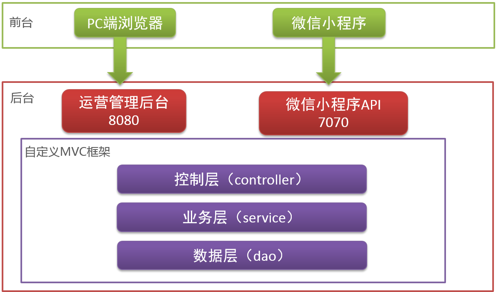

###### 技术架构

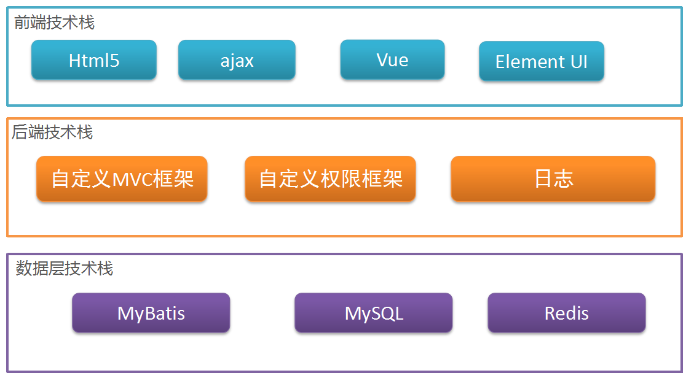 

##### 功能介绍

###### 后台管理功能列表

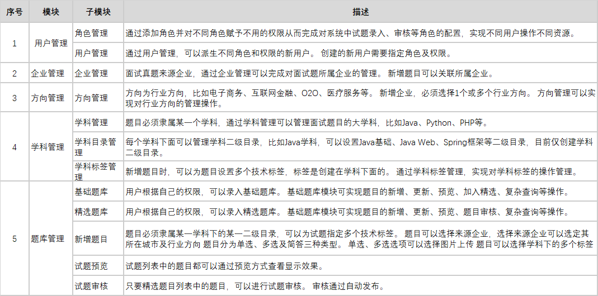

###### 前台小程序功能列表

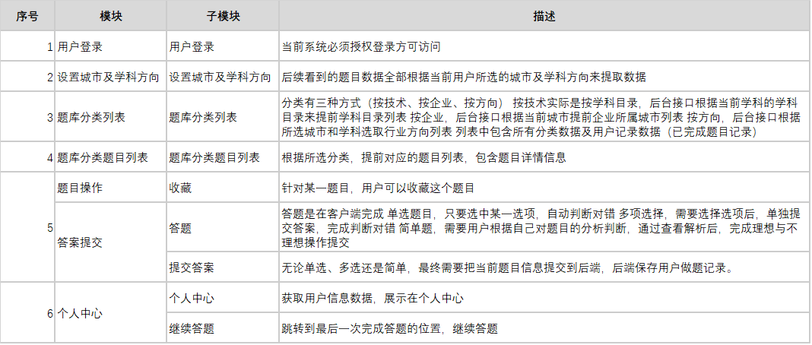

#### 小结

## 二、黑马面面环境搭建

### 目标

* 初始化数据库
* 搭建后台管理项目的开发环境

### 讲解

#### 初始化数据库

* 创建数据库`itheima_mm`, 导入数据库, 数据库资料在《资料\04-数据库》
* 本项目一共有18张表，其中13张主表，5张关系表

| 序号 | 中文名                | 表名               | 备注                                                         |
| ---- | --------------------- | ------------------ | ------------------------------------------------------------ |
| 1    | `t_user`              | 用户名表           | 管理后台用户表                                               |
| 2    | `t_role`              | 角色表             |                                                              |
| 3    | `t_permission`        | 权限资源表         |                                                              |
| 4    | `tr_user_role`        | 用户角色关系表     | 关系表                                                       |
| 5    | `tr_role_permission`  | 角色权限关系表     | 关系表                                                       |
| 6    | `t_dict`              | 数据字典表         | 存储项目中的常规数据信息<br />比如省市数据、邮政编码、职业类型等等。 |
| 7    | `t_company`           | 公司表             | 题目来源公司表                                               |
| 8    | `t_industry`          | 行业方向表         | 城市所属行业信息表                                           |
| 9    | `tr_company_industry` | 公司行业方向关系表 | 关系表                                                       |
| 10   | `t_course`            | 学科表             |                                                              |
| 11   | `t_catalog`           | 学科目录表         | 学科的二级目录                                               |
| 12   | `t_tag`               | 学科标签表         | 学科拥有的标签                                               |
| 13   | `t_question`★★★       | t题目表            | 存储题目信息                                                 |
| 14   | `t_question_item`     | t题目选项表        | 存储题目选项信息（单选、多选选项）                           |
| 15   | `tr_question_tag`     | 题目标签关系表     | 关系表                                                       |
| 16   | `t_review_log`        | 题目审核表         | 存储审核记录                                                 |
| 17   | `t_wx_member`         | 会员表             | 小程序登录用户信息表                                         |
| 18   | `tr_member_question`  | 会员做题记录表     | 关系表，c存储会员所有做题记录                                |

#### 后台管理项目的创建

通过系统概述分析：

* 微信小程序端，使用微信小程序开发工具来完成小程序端页面的开发
* 微信小程序API接口、运营管理后台API接口及运营管理后台网页中的ajax通信全部通过IDEA开发工具来开发。

##### 操作步骤

1. 创建Maven的web应用：`mm_backend_management`
2. 拷贝依赖坐标
3. 拷贝页面到`webapp`目录
4. 创建package，然后拷贝pojo、工具类、实体类
5. 拷贝配置文件

##### 搭建环境

 >* jdk：1.8
 >
 >* maven：3.5.4
 >
 >* Maven仓库：我的仓库
 >* MySql：5.5.21
 >
 >* idea：2018.2
 >
 >* Tomcat：8.5.32

###### 创建Maven的web应用

###### 拷贝依赖坐标

* 把《资料\自定义mvc框架\mm_mvc》拷贝到本地仓库中
  * 是打包好的 自定义SpringMVC框架
  * 直接拷贝到本地仓库中，在我们项目里就可以直接引入使用了

* 项目`pom.xml`文件如下：

```xml
<?xml version="1.0" encoding="UTF-8"?>

<project xmlns="http://maven.apache.org/POM/4.0.0" xmlns:xsi="http://www.w3.org/2001/XMLSchema-instance"
  xsi:schemaLocation="http://maven.apache.org/POM/4.0.0 http://maven.apache.org/xsd/maven-4.0.0.xsd">
  <modelVersion>4.0.0</modelVersion>

  <groupId>com.itheima</groupId>
  <artifactId>mm_backend_management</artifactId>
  <version>1.0-SNAPSHOT</version>
  <packaging>war</packaging>

  <properties>
    <project.build.sourceEncoding>UTF-8</project.build.sourceEncoding>
    <maven.compiler.source>1.8</maven.compiler.source>
    <maven.compiler.target>1.8</maven.compiler.target>
    <junit.version>4.12</junit.version>
    <javax.servlet-api.version>3.1.0</javax.servlet-api.version>
    <fastjson.version>1.2.47</fastjson.version>
    <mysql-connector-java.version>5.1.38</mysql-connector-java.version>
    <mybatis.version>3.4.5</mybatis.version>
    <log4j.version>1.2.17</log4j.version>
    <slf4j-api.version>1.7.25</slf4j-api.version>
    <commons-fileupload.version>1.3.1</commons-fileupload.version>
    <commons-io.version>2.6</commons-io.version>
    <lombok.version>1.18.8</lombok.version>
    <tomcat7-maven-plugin.version>2.2</tomcat7-maven-plugin.version>
    <dom4j.version>1.6.1</dom4j.version>
    <jaxen.version>1.2.0</jaxen.version>
    <druid.version>1.1.10</druid.version>
    <okhttp.version>3.1.0</okhttp.version>
    <okio.version>1.4.0</okio.version>
    <bcprov-jdk16.version>1.45</bcprov-jdk16.version>
    <jedis.version>2.7.0</jedis.version>
    <jackson.version>2.3.3</jackson.version>
  </properties>
  <dependencies>
    <!--自定义MVC-->
    <dependency>
      <groupId>com.itheima</groupId>
      <artifactId>mm_mvc</artifactId>
      <version>1.0-SNAPSHOT</version>
    </dependency>
    <!--单元测试-->
    <dependency>
      <groupId>junit</groupId>
      <artifactId>junit</artifactId>
      <version>${junit.version}</version>
    </dependency>
    <!--Servlet-->
    <dependency>
      <groupId>javax.servlet</groupId>
      <artifactId>javax.servlet-api</artifactId>
      <version>${javax.servlet-api.version}</version>
      <scope>provided</scope>
    </dependency>

    <dependency>
      <groupId>com.alibaba</groupId>
      <artifactId>fastjson</artifactId>
      <version>${fastjson.version}</version>
    </dependency>
    <!--jackson-->
    <dependency>
      <groupId>com.fasterxml.jackson.core</groupId>
      <artifactId>jackson-databind</artifactId>
      <version>${jackson.version}</version>
    </dependency>
    <dependency>
      <groupId>com.fasterxml.jackson.core</groupId>
      <artifactId>jackson-core</artifactId>
      <version>${jackson.version}</version>
    </dependency>
    <dependency>
      <groupId>com.fasterxml.jackson.core</groupId>
      <artifactId>jackson-annotations</artifactId>
      <version>${jackson.version}</version>
    </dependency>
    <!--mysql驱动-->
    <dependency>
      <groupId>mysql</groupId>
      <artifactId>mysql-connector-java</artifactId>
      <version>${mysql-connector-java.version}</version>
    </dependency>
    <!--mybatis-->
    <dependency>
      <groupId>org.mybatis</groupId>
      <artifactId>mybatis</artifactId>
      <version>${mybatis.version}</version>
    </dependency>
    <!--beanutils-->
    <dependency>
      <groupId>commons-beanutils</groupId>
      <artifactId>commons-beanutils</artifactId>
      <version>1.9.3</version>
    </dependency>
    <!--文件上传-->
    <dependency>
      <groupId>commons-fileupload</groupId>
      <artifactId>commons-fileupload</artifactId>
      <version>${commons-fileupload.version}</version>
    </dependency>
    <!--IO-->
    <dependency>
      <groupId>commons-io</groupId>
      <artifactId>commons-io</artifactId>
      <version>${commons-io.version}</version>
    </dependency>
    <!--dom4j-->
    <dependency>
      <groupId>dom4j</groupId>
      <artifactId>dom4j</artifactId>
      <version>${dom4j.version}</version>
    </dependency>
    <dependency>
      <groupId>jaxen</groupId>
      <artifactId>jaxen</artifactId>
      <version>${jaxen.version}</version>
    </dependency>
    <!--日志-->
    <dependency>
      <groupId>log4j</groupId>
      <artifactId>log4j</artifactId>
      <version>${log4j.version}</version>
    </dependency>
    <dependency>
      <groupId>org.slf4j</groupId>
      <artifactId>slf4j-api</artifactId>
      <version>${slf4j-api.version}</version>
    </dependency>
    <dependency>
      <groupId>org.slf4j</groupId>
      <artifactId>slf4j-log4j12</artifactId>
      <version>${slf4j-api.version}</version>
    </dependency>
    <!--lombok-->
    <dependency>
      <groupId>org.projectlombok</groupId>
      <artifactId>lombok</artifactId>
      <version>${lombok.version}</version>
    </dependency>
    <!--连接池-->
    <dependency>
      <groupId>com.alibaba</groupId>
      <artifactId>druid</artifactId>
      <version>${druid.version}</version>
    </dependency>
    <!--jedis-->
    <dependency>
      <groupId>redis.clients</groupId>
      <artifactId>jedis</artifactId>
      <version>${jedis.version}</version>
    </dependency>
  </dependencies>

  <build>
    <resources>
      <resource>
        <directory>src/main/java</directory>
        <includes>
          <include>**/*.xml</include>
          <include>**/*.properties</include>
        </includes>
        <filtering>false</filtering>
      </resource>
      <resource>
        <directory>src/main/resources</directory>
        <includes>
          <include>**/*.xml</include>
          <include>**/*.properties</include>
        </includes>
        <filtering>false</filtering>
      </resource>
    </resources>
    </build>
</project>
```

###### 拷贝页面到`webapp`

* 把《资料\06-管理后台前端页面》里的内容，拷贝到`webapp`目录里

###### 创建package

* 创建package：`com.itheima.mm`
* 拷贝实体类、常量类：
  * 把《资料\05-初始化工程\01-代码(实体类, 常量等)》里的内容拷贝到`com.itheima.mm`里

* 补充package：
  * `com.itheima.mm.controller`：web层，相当于以前我们创建的`web`包
  * `com.itheima.mm.service`
  * `com.itheima.mm.dao`

###### 拷贝配置文件

* 拷贝配置文件：
  * 把《资料\05-初始化工程\02-配置文件》拷贝到`resources`目录里
  * 注意修改数据库配置信息`db.properties`
* 配置web.xml：
  * 把《资料\05-初始化工程\web.xml》拷贝到`WEB-INF`目录里

##### 最终结果

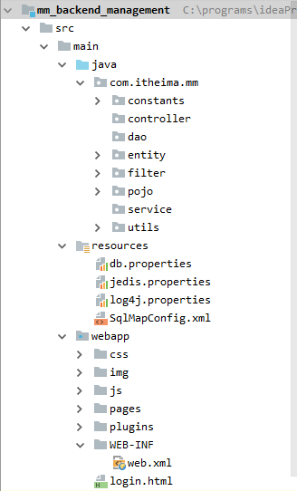

### 小结

## 三、用户模块

* 管理后台需要登录方可进入。在登录页面输入相应的用户名及密码：
  * 信息正确登录到后台系统
  * 信息错误，进行相应的提示（比如用户不正确、密码错误等信息）。
* 进入系统后在主页右上角显示用户名，然后点击下方退出，方可退出系统。

### 用户登录

#### 需求

* 在登录页面输入帐号和密码，点击“登录”按钮

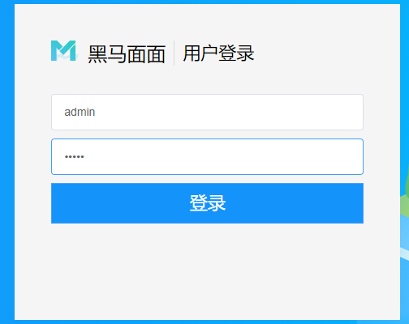

* 如果登录成功，跳转到后台管理页面。在页面上显示登录的用户名

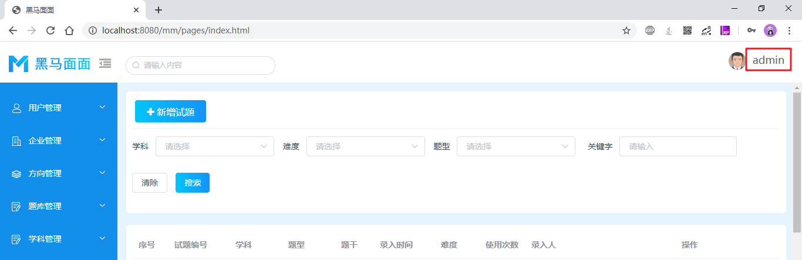

#### 分析

##### 功能实现流程

##### `sessionStorage`【了解】

* `sessionStorage`是浏览器`window`对象提供的一项存储数据的技术，用于临时存储客户端的数据
* `sessionStorage`存储数据的特点：
  * 仅在客户端存储。当客户端发请求到服务端时，不会把`sessionStorage`中的数据携带到服务端
  * 在浏览器的当前页签（当前窗口）内有效。
    * 刷新当前标签页，sessionStorage里的数据仍然有效
    * 关闭当前标签页，sessionStorage里的数据会被清除
    * 打开一个新的浏览器标签页，数据不共享
* `sessionStorage`存取数据的API：
  * 使用JavaScript可以向`sessionStorage`中存取数据 ，常用方法有：
  * 存数据：`sesionStorage.setItem(key, value)`
  * 取数据：`sesionStorage.getItem(key)`
  * 删数据：`sesionStorage.removeItem(key)`

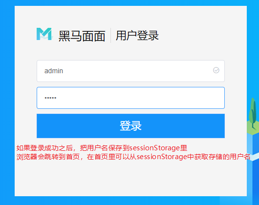

#### 实现

##### `login.html`

* 在`onSubmit`方法里，使用axios提交表单到服务端，进行登录校验
  * 如果登录成功：把用户名存储到浏览器里；跳转到后台管理首页
  * 如果登录失败：弹窗提示错误原因

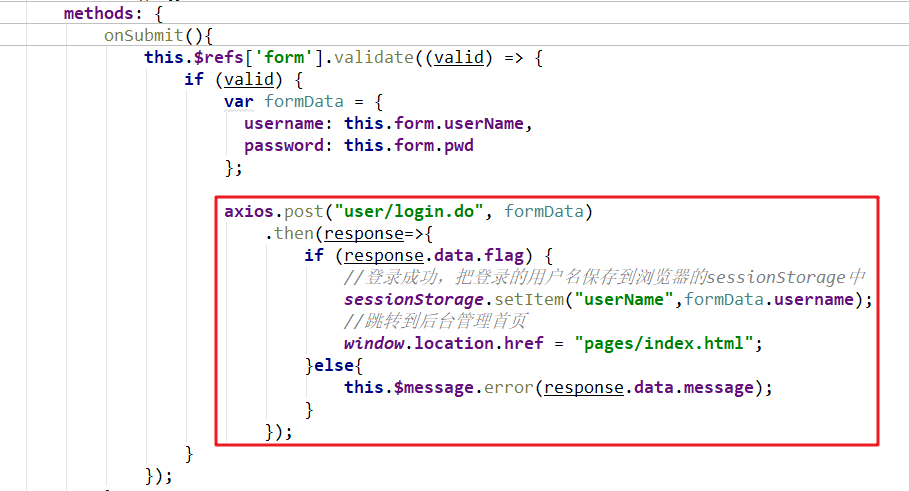

* 页面里`onSubmit`方法代码如下：

```js
     onSubmit(){
         this.$refs['form'].validate((valid) => {
             if (valid) {
                 var formData = {
                     username: this.form.userName,
                     password: this.form.pwd
                 };

                 axios.post("user/login.do", formData)
                     .then(response=>{
                     if (response.data.flag) {
                         //登录成功，把登录的用户名保存到浏览器的sessionStorage中
                         sessionStorage.setItem("userName",formData.username);
                         //跳转到后台管理首页
                         window.location.href = "pages/index.html";
                     }else{
                         this.$message.error(response.data.message);
                     }
                 });
             }
         });
     }
```

##### `UserController`

* 创建UserController类，在类里创建login方法

```java
/**
 * @author liuyp
 * @date 2020/03/01
 */
@Controller
public class UserController {
    private UserService userService = new UserService();

    @RequestMapping("/user/login")
    public void login(HttpServletRequest request, HttpServletResponse response) throws IOException {
        try {
            User loginUser = JsonUtils.parseJSON2Object(request, User.class);
            User user = userService.login(loginUser);
            if (user != null) {
                request.getSession().setAttribute("user", user);
                JsonUtils.printResult(response, new Result(true, "登录成功"));
            }else{
                JsonUtils.printResult(response, new Result(false, "登录失败"));
            }
        } catch (Exception e) {
            e.printStackTrace();
            JsonUtils.printResult(response, new Result(false, "系统忙，请稍候"));
        }
    }
}
```

##### `UserService`

* 创建UserService类，在类里创建login方法

```java
/**
 * @author liuyp
 * @date 2020/03/01
 */
public class UserService {

    public User login(User loginUser) throws IOException {
        SqlSession session = SqlSessionFactoryUtils.openSqlSession();
        UserDao userDao = session.getMapper(UserDao.class);
        User user = userDao.login(loginUser);
        SqlSessionFactoryUtils.commitAndClose(session);

        return user;
    }
}
```

##### `UserDao`

* 创建UserDao接口，在接口里创建login方法

```java
/**
 * @author liuyp
 * @date 2020/03/01
 */
public interface UserDao {

    @Select("select * from t_user where username = #{username} and password = #{password}")
    User login(User loginUser);
}
```

#### 小结

### 用户退出

#### 目标

* 当点击了“退出”时，退出登录

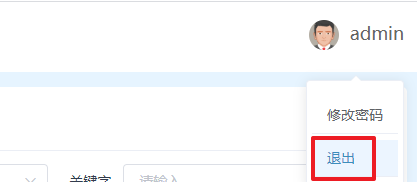

* 如果退出成功：跳转到登录页面
* 如果退出失败：弹窗提示错误信息

#### 分析

#### 实现

##### `pages/ndex.html`

* “退出”按钮已经绑定好了单击事件，单击时触发执行方法：`logout`
* 我们只需要修改方法`logout`的内容即可

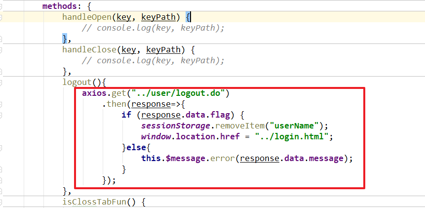

* 页面`logout`方法代码如下：

```js
    logout(){
        axios.get("../user/logout.do")
            .then(response=>{
            if (response.data.flag) {
                sessionStorage.removeItem("userName");
                window.location.href = "../login.html";
            }else{
                this.$message.error(response.data.message);
            }
        });
    }
```

##### `UserController`

* 增加`logout`方法

```java
    @RequestMapping("/user/logout")
    public void logout(HttpServletRequest request, HttpServletResponse response) throws IOException {
        try {
            request.getSession().removeAttribute("user");
            JsonUtils.printResult(response, new Result(true, "已退出"));
        } catch (Exception e) {
            e.printStackTrace();
            JsonUtils.printResult(response, new Result(false, "退出失败"));
        }
    }
```

#### 小结

## 四、学科管理模块

### 模块分析

#### 目标

* 了解学科管理模块的需求

#### 讲解

##### 需求说明

1. 学科管理模块，需要完成学科的列表展示、新增、更新、删除四个功能；
2. 学科列表展示
   + 学科列表需要展示学科创建者，故**创建的每个学科，需要关联当前用户ID**：登录的那个用户的id；
   + 学科列表需要展示管理的题目数量、标签数量、二级目录数量，这些查询需要嵌入子查询
   + 列表展示需要分页显示，每页显示10条记录；
3. 新增、更新学科后刷新当前列表。
4. 删除学科，如果学科下已有数据，不能删除该学科；

##### 相关表

* `t_course`：学科表
* `t_user`：用户表。学科的创建人，是某一用户
* `t_catalog`：学科目录表。一个学科里有多个目录
* `t_question`：题目表。一个学科里有多个题目
* `t_tag`：学科标签表。一个学科里有多个标签

#### 小结

### 学科列表

#### 目标

* 分页查询显示学科列表

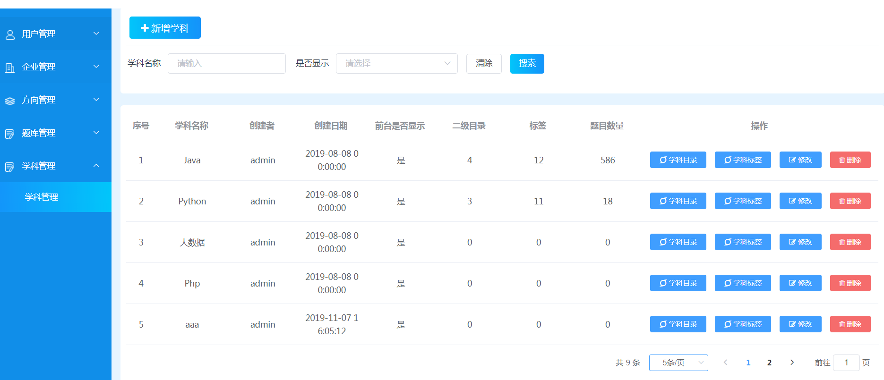

#### 分析

##### 数据模型

###### 说明

* 在前后端分离开发的过程中：
  * 首先我们需要从前端那里获取一些信息：
    * 提交的请求参数是什么样。请求参数有什么，服务端就接收什么
    * 响应的结果数据是什么样。我们需要考虑JavaBean的结果，把JavaBean转换成json，响应给客户端
  * 然后在服务端接收参数，按照客户端的要求返回响应数据
* 根据前端提供的假数据，可以分析出来服务端的JavaBean应该准备什么样的数据

###### 提交的请求参数

* 提交到服务端的参数：服务端提供了一个`QueryPageBean`用于接收
  * currentPage：当前页码
  * pageSize：查询几条
  * queryParams：查询参数
    * name：搜索条件-学科名称
    * status：搜索条件-是否显示

```js
{
    currentPage: 1,
    pageSize: 10,
    queryParams:{
        name: '',
        status: null
    }
}
```

###### 前端需要的响应数据

* flag：服务端是否成功
* message：服务端返回给客户端的描述信息
* result：服务端返回客户端的数据内容
  * rows：分页查询的结果，某一页的学科列表
    * id：学科的id
    * name：学科名称
    * isShow：学科是否显示。0显示，1不显示
    * createDate：学科的创建时间
    * creator：学科的创建人
    * catalogQty：学科拥有的二级目录数量
    * questionQty：学科拥有的题目数量
    * tagQty：学科拥有的标签数量
  * total：查询的总数量

```json
{
    "flag": true,
    "message": "获取学科列表成功",
    "result": {
        "rows": [
            {
                "catalogQty": 10,
                "createDate": "2019-08-08 00:00:00.0",
                "creator": "admin",
                "id": 1,
                "isShow": 0,
                "name": "Java",
                "questionQty": 1,
                "tagQty": 5
            },
            {
                "catalogQty": 10,
                "createDate": "2019-08-08 00:00:00.0",
                "creator": "admin",
                "id": 2,
                "isShow": 0,
                "name": "Python",
                "questionQty": 1,
                "tagQty": 5
            }
        ],
        "total": 15
    }
}
```

##### 实现流程

###### 页面上

* 当Vue对象创建时，执行钩子函数`created`，`created`里调用了方法`getList`

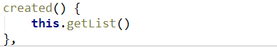

* `getList`方法里：

  * 要发异步请求到服务端加载数据，传参`params`

  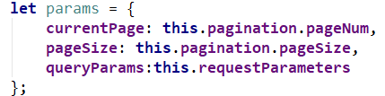

  * 得到响应结果，设置给数据区的 `items`和`pagination.total`

  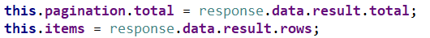

###### 服务端

1. 接收参数，封装成`QueryPageBean`对象

2. 调用service，查询：

   * 根据条件，查询的总数量。调用dao，执行的SQL是：

   ```mysql
   select count(*) from t_course c where c.name like ? and c.is_show = ?
   ```

   * 根据条件，分页查询的列表。调用dao，执行的SQL是：

   ```mysql
   select c.id, c.name, 
       c.is_show isShow, 
       c.create_date createDate,
   	(select username from t_user u where u.id = c.user_id) creator,
   	(select count(*) from t_catalog l where l.course_id = c.id) catalogQty,
   	(select count(*) from t_question q where q.course_id = c.id) questionQty,
   	(select count(*) from t_tag t where t.course_id = c.id) tagQty
   from t_course c  
     where c.name like ? and c.is_show = ? 
     limit ?,?
   ```

3. service里把总数量和列表数据，封装成`PageResult`对象，返回给web层

4. web层把结果响应给客户端

#### 实现

##### `pages/courseList.html`

* 只需要修改Vue实例的methods中，`getList()`方法的代码即可

```js
// 学科分页列表
getList() {
    // 必传参数
    let params = {
        currentPage: this.pagination.pageNum,
        pageSize: this.pagination.pageSize,
        queryParams:this.requestParameters
    };
    console.log("学科分页列表请求参数：");
    console.log(params);
    // 发送请求获取数据
    axios.post("../course/list.do", params)
        .then(response=>{
        if (response.data.flag) {
            this.pagination.total = response.data.result.total;
            this.items = response.data.result.rows;
        }else{
            this.$message.error(response.data.message);
        }
    });
}
```

##### `CourseController`

* 创建`CourseController`，并创建`list`方法

```java
/**
 * @author liuyp
 * @date 2020/03/02
 */
@Controller
public class CourseController {
    private CourseService courseService = new CourseService();

    @RequestMapping("/course/list")
    public void list(HttpServletRequest request, HttpServletResponse response) throws IOException {
        try {
            QueryPageBean queryPageBean = JsonUtils.parseJSON2Object(request, QueryPageBean.class);
            if (queryPageBean == null) {
                queryPageBean = new QueryPageBean();
                queryPageBean.setPageSize(10);
                queryPageBean.setCurrentPage(1);
            }

            PageResult pageResult = courseService.list(queryPageBean);
            JsonUtils.printResult(response, new Result(true, "分页查询学科列表成功", pageResult));
        } catch (Exception e) {
            e.printStackTrace();
            JsonUtils.printResult(response, new Result(false, "分页查询学科列表失败"));
        }
    }
}
```

##### `CourseService`

* 创建`CourseService`类，并创建`list`方法

```java
/**
 * @author liuyp
 * @date 2020/03/02
 */
public class CourseService {

    public PageResult list(QueryPageBean queryPageBean) throws IOException {
        SqlSession session = SqlSessionFactoryUtils.openSqlSession();
        CourseDao courseDao = session.getMapper(CourseDao.class);
        Long totalCount = courseDao.totalCount(queryPageBean);
        List<Course> courseList = courseDao.list(queryPageBean);
        SqlSessionFactoryUtils.commitAndClose(session);

        return new PageResult(totalCount, courseList);
    }
}
```

##### `CourseDao`

###### 创建映射器`CourseDao`

* 创建`CourseDao`，并创建`totalCount`方法，`list`方法

```java
/**
 * @author liuyp
 * @date 2020/03/02
 */
public interface CourseDao {
    Long totalCount(QueryPageBean pageBean);

    List<Course> list(QueryPageBean queryPageBean);
}
```

###### 创建映射文件`CourseDao.xml`

* 配置`totalCount`和`list`方法的statement

```xml
<?xml version="1.0" encoding="UTF-8" ?>
<!DOCTYPE mapper
        PUBLIC "-//mybatis.org//DTD Mapper 3.0//EN"
        "http://mybatis.org/dtd/mybatis-3-mapper.dtd">
<mapper namespace="com.itheima.mm.dao.CourseDao">

    <select id="totalCount" parameterType="QueryPageBean" resultType="long">
        select count(*) from t_course c
        <include refid="pageWhere"/>
    </select>

    <select id="list" parameterType="QueryPageBean" resultType="Course">
        select c.id, c.name, c.is_show isShow, c.create_date createDate,
            (select username from t_user u where u.id = c.user_id) creator,
            (select count(*) from t_catalog l where l.course_id = c.id) catalogQty,
            (select count(*) from t_question q where q.course_id = c.id) questionQty,
            (select count(*) from t_tag t where t.course_id = c.id) tagQty
        from t_course c

        <include refid="pageWhere"/>

        limit #{offset}, #{pageSize}
    </select>

    <sql id="pageWhere">
        <where>
            <if test="queryParams.name != null and queryParams.name != ''">
                and c.name like "%"#{queryParams.name}"%"
            </if>
            <if test="queryParams.status != null">
                and c.is_show = #{queryParams.status}
            </if>
        </where>
    </sql>
</mapper>
```

#### 小结

### 新增学科

#### 目标

* 注意：一定要先登录之后，再新增。
  * 后边我们会自定义一个SpringSecurity框架，会统一管理所有的权限：如果没有登录就访问，会跳转到登录页面

* 添加新学科。添加成功后，刷新列表

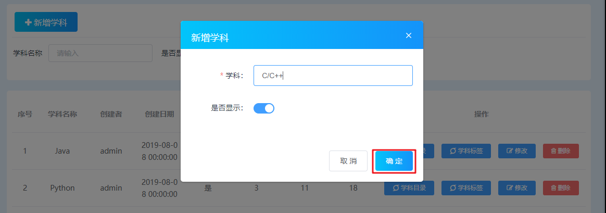

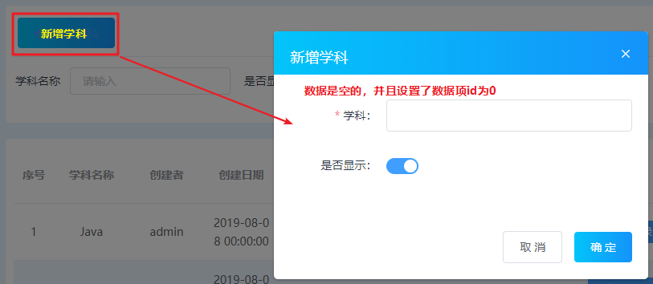

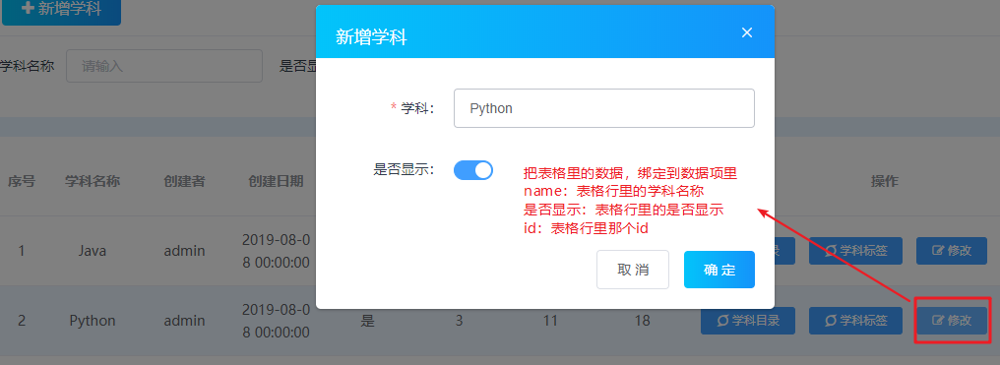

#### 分析

##### 数据模型

###### 提交的请求参数

* 提交的数据格式：
  * id：新增学科，id给了0值。服务端判断如果是0，表示新增
  * name：学科名称
  * isShow：学科状态，是否显示。0显示，1不显示

```js
{
    id: 0,
    name: '',
    isShow: 0
}
```

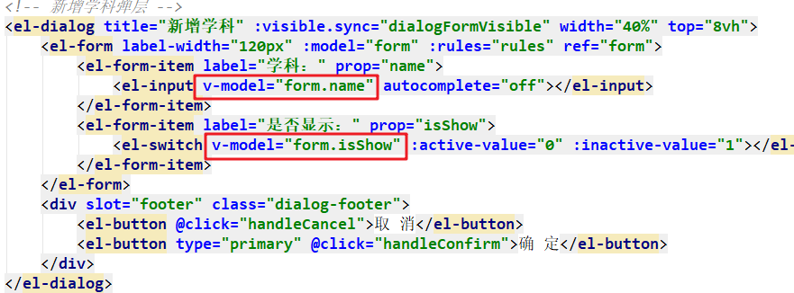

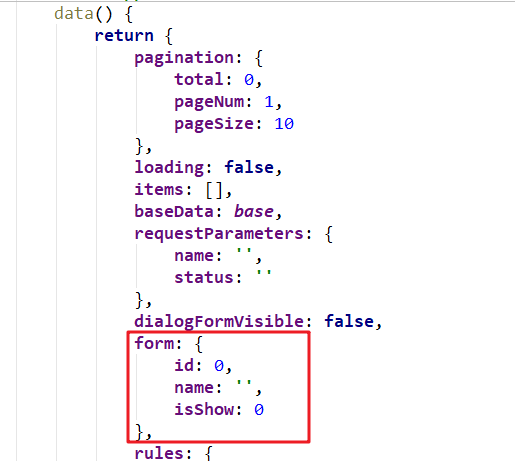

###### 前端需要的响应数据

* 只要是否成功、描述信息即可
  * 如果添加成功：重新加载学科列表，即重新调用`getList()`方法
  * 如果添加失败：弹窗提示错误原因

##### 实现流程

###### 页面上

* 当在新增窗口里点击“新增”按钮时，触发函数`handleConfirm`

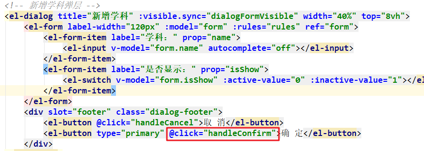

* 在`handleConfirm`函数里：

  * 如果form.id为0，判断为false，调用了`handleCreateConfirm()`方法

  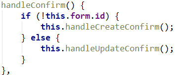

* 在`handleCreateConfirm`方法里：

  * 发异步请求到服务端，把表单数据提交到服务端，添加到数据库
  * 得到添加的结果。如果成功：隐藏添加窗口，刷新学科列表

###### 服务端 

* 接收参数，封装成Course对象
* 调用service，service调用dao：把Course里的数据保存到数据库中

#### 实现

##### `pages/courseList.html`

* 修改Vue实例中的`handleCreateConfirm`方法

```js
//新增学科确定
handleCreateConfirm() {
    this.$refs['form'].validate((valid) => {
        if (valid) {
            let params = this.form;
            console.log("学科添加请求参数：");
            console.log(params);

            // 发送请求
            axios.post("../course/add.do", params)
                .then(response=>{
                if (response.data.flag) {
                    this.$message.success("添加成功");
                    this.dialogFormVisible = false;
                    this.getList();
                }else{
                    this.$message.error(response.data.message);
                }
            });
        }
    });
}
```

##### `CourseController`

* 创建`add`方法

```java
    @RequestMapping("/course/add")
    public void add(HttpServletRequest request, HttpServletResponse response) throws IOException {
        try {
            Course course = JsonUtils.parseJSON2Object(request, Course.class);
            course.setCreateDate(DateUtils.parseDate2String(new Date()));
            User user = (User) request.getSession().getAttribute("user");
            if (user != null) {
                course.setUserId(user.getId());
            }

            courseService.add(course);
            JsonUtils.printResult(response, new Result(true, "添加学科成功"));
        } catch (Exception e) {
            e.printStackTrace();
            JsonUtils.printResult(response, new Result(false, "添加学科失败"));
        }
    }
```

##### `CourseService`

* 创建`add`方法

```java
    public boolean add(Course course) throws IOException {
        SqlSession session = SqlSessionFactoryUtils.openSqlSession();
        CourseDao courseDao = session.getMapper(CourseDao.class);
        int count = courseDao.add(course);
        SqlSessionFactoryUtils.commitAndClose(session);

        return count > 0;
    }
```

##### `CourseDao`

###### 在映射器`CourseDao`中增加方法

```java
int add(Course course);
```

###### 在映射文件`CourseDao.xml`中增加statement

```xml
<insert id="add" parameterType="Course">
    insert into t_course (name,icon,create_date,is_show,user_id,order_no) values (#{name},#{icon},#{createDate},#{isShow},#{userId},#{orderNo})
</insert>
```

#### 小结

### 更新学科

#### 目标

* 点击“修改”学科，把修改后的数据提交到服务端进行更新。
* 如果更新成功，隐藏“修改”窗口，并刷新列表

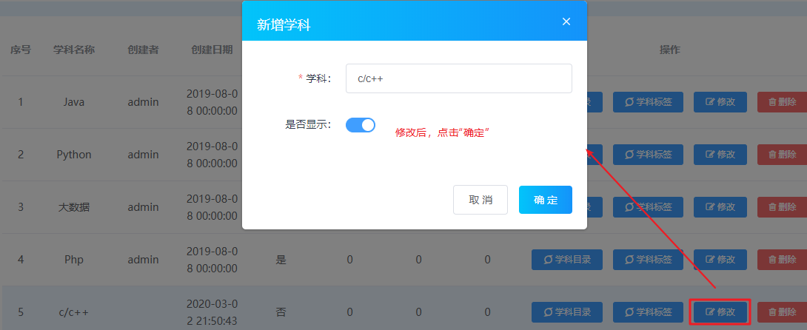

#### 分析

##### 数据模型

###### 提交的请求参数

* 提交的数据格式：
  * id：新增学科，id给了0值。服务端判断如果是0，表示新增
  * name：学科名称
  * isShow：学科状态，是否显示。0显示，1不显示

```js
{
    id: 0,
    name: '',
    isShow: 0
}
```


###### 前端需要的响应数据

* 只要是否成功、描述信息即可
  * 如果修改成功：重新加载学科列表，即重新调用`getList()`方法
  * 如果修改失败：弹窗提示错误原因

##### 实现流程

###### 页面上

* 当在页面上点击“修改”按钮时，触发`handleUpdate`方法

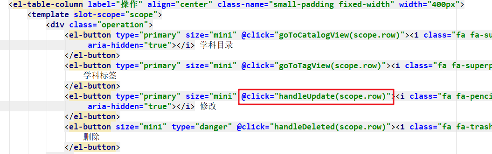

* 在`handleUpdate`里：显示了修改窗口，把数据显示到窗口里

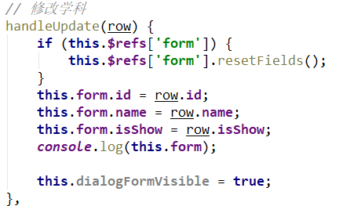

* 当修改了学科信息之后，点击“确定”按钮，触发函数`handleConfirm`
* 在函数`handleConfirm`里，因为form.id不是0了，调用到了`handleUpdateConfirm`

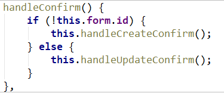

* 在`handleUpdateConfirm`里：
  * 发异步请求到服务端，把表单数据提交到服务端，进行更新
  * 如果更新成功：隐藏窗口，刷新列表

###### 服务端

#### 实现

##### `pages/courseList.html`

* 只要修改Vue实例中的`handleUpdateConfirm`方法即可

```js
// 修改学科确定
handleUpdateConfirm() {
    this.$refs['form'].validate((valid) => {
        if (valid) {
            let params = this.form;
            console.log("学科更新请求参数：");
            console.log(params);

            axios.post("../course/update.do", params)
                .then(response=>{
                if (response.data.flag) {
                    this.$message.success("更新成功");
                    this.dialogFormVisible = false;
                    this.getList();
                }else{
                    this.$message.error(response.data.message);
                }
            });
        }
    });
}
```

##### `CourseController`

* 创建`update`方法

```java
    @RequestMapping("/course/update")
    public void update(HttpServletRequest request, HttpServletResponse response) throws IOException {
        try {
            Course course = JsonUtils.parseJSON2Object(request, Course.class);
            courseService.update(course);
            JsonUtils.printResult(response, new Result(true, "修改学科成功"));
        } catch (Exception e) {
            e.printStackTrace();
            JsonUtils.printResult(response, new Result(false, "修改学科失败"));
        }
    }
```

##### `CourseService`

* 创建`update`方法

```java
    public boolean update(Course course) throws IOException {
        SqlSession session = SqlSessionFactoryUtils.openSqlSession();
        CourseDao courseDao = session.getMapper(CourseDao.class);
        int count = courseDao.update(course);
        SqlSessionFactoryUtils.commitAndClose(session);
        return count > 0;
    }
```

##### `CourseDao`

###### 在映射器`CourseDao`中增加`update`方法

```java
int update(Course course);
```

###### 在映射文件`CourseDao.xml`中增加statement

```xml
<update id="update" parameterType="Course">
    update t_course set name=#{name}, is_show = #{isShow} where id=#{id}
</update>
```

#### 小结

### 删除学科【作业】

#### 目标

* 点击“删除”按钮时，弹出确定窗口。如果点击确定，删除学科，然后刷新学科列表

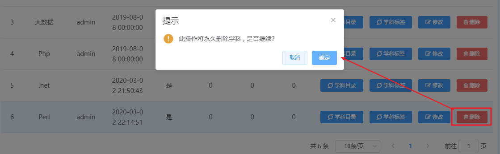

#### 分析

#### 实现

##### `pages/courseList.html`

* 只要修改Vue实例中的`handleDeleted`方法即可

```js
// 删除学科
handleDeleted(row) {
    this.$confirm('此操作将永久删除学科 ' + ', 是否继续?', '提示', {
        type: 'warning'
    }).then(() => {

        axios.get("../course/delete.do?id=" + row.id)
            .then(response=>{
            if (response.data.flag) {
                this.$message.success("删除成功");
                this.getList();
            }else{
                this.$message.error(response.data.message);
            }
        });
    }).catch(() => {
        this.$message.info('已取消操作!')
    });
}
```

##### `CourseController`

* 创建`delete`方法

```java
    @RequestMapping("/course/delete")
    public void delete(HttpServletRequest request, HttpServletResponse response) throws IOException {
        try {
            String id = request.getParameter("id");
            courseService.delete(id);
            JsonUtils.printResult(response, new Result(true, "删除学科成功"));
        } catch(RuntimeException e){
            e.printStackTrace();
            JsonUtils.printResult(response, new Result(false, e.getMessage()));
        } catch (Exception e) {
            e.printStackTrace();
            JsonUtils.printResult(response, new Result(false, "删除学科失败"));
        }
    }
```

##### `CourseService`

* 创建`delete`方法

```java
public void delete(String id) throws IOException {
        SqlSession session = null;
        try {
            session = SqlSessionFactoryUtils.openSqlSession();
            CourseDao courseDao = session.getMapper(CourseDao.class);
            //如果学科下，关联的有标签，不允许删除学科（标签t_tag表中有外键，指向学科表主键）
            Long tagCount = courseDao.tagCount(id);
            if (tagCount > 0) {
                throw new RuntimeException("学科中有关联的标签，不允许删除");
            }
            //如果学科下，关联的有目录，不允许删除学科（标签t_catalog表中有外键，指向学科表主键）
            Long catalogCount = courseDao.catalogCount(id);
            if (catalogCount > 0) {
                throw new RuntimeException("学科中关联的有二级目录，不允许删除");
            }
            //如果学科下，关联的有题目，不允许删除学科（标签t_question表中有外键，指向学科表主键）
            Long questionCount = courseDao.questionCount(id);
            if (questionCount > 0) {
                throw new RuntimeException("学科中有关联的题目，不允许删除");
            }

            //删除学科
            courseDao.delete(id);
        } finally {
            SqlSessionFactoryUtils.commitAndClose(session);
        }
    }
```

##### `CourseDao`

###### 在映射器`CourseDao`中创建方法

```java
    void delete(String id);

    Long tagCount(String id);

    Long catalogCount(String id);

    Long questionCount(String id);
```

###### 在映射文件`CourseDao.xml`中增加statement

```xml
<delete id="delete" parameterType="String">
    delete from t_course where id = #{id}
</delete>

<select id="tagCount" parameterType="String" resultType="Long">
    select count(*) from t_tag where course_id = #{courseId}
</select>
<select id="catalogCount" parameterType="String" resultType="Long">
    select count(*) from t_catalog where course_id = #{courseId}
</select>
<select id="questionCount" parameterType="String" resultType="Long">
    select count(*) from t_question where course_id = #{courseId}
</select>
```

#### 小结

## 解决bug的思路

### 减少bug的出现

* 先分析理思路，理清之后再动手写代码
* 名称、路径等等建议拷贝，而不是手写。
  * 比如：有一个方法定义了`@RequestMapping("/course/delete")`
  * 客户端发请求时，要写请求地址，地址最好是拷贝：`../course/delete.do`
* 命名：规范、见名知义。  `//以下FALSE都表示true，以下TRUE都表示false`
* 格式化：良好的格式，易于阅读的
* 注释：

### 解决bug的方式

#### 第1步. 浏览器抓包

请求响应的过程：

1. 客户端发请求传参到服务端
2. 服务端接收参数完成功能
3. 服务端把结果响应给客户端
4. 客户端得到结果显示到页面上

如果出问题了，抓包结果：

* 假如HTTP请求的数据不正确：客户端发请求出问题了
* 假如HTTP请求正确，但是HTTP响应错误：服务端出问题了
* 假如HTTP请求正确、并且HTTP响应正确，页面显示有问题：客户端得到结果处理结果有问题

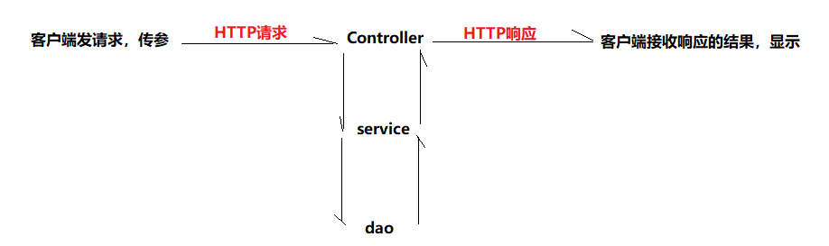

#### 第2步.如果是客户端的问题

1. 先查看报错信息。在浏览器F12的控制台`Console`里

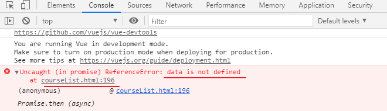

2. 如果有报错信息，根据报错信息检查代码

3. 如果没有报错信息，可以debug调试

   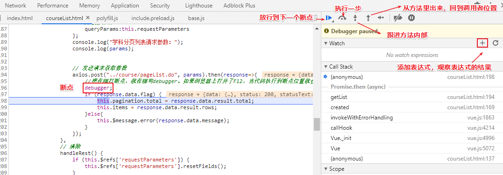

#### 第3步.如果是服务端的问题

1. 先查看报错信息

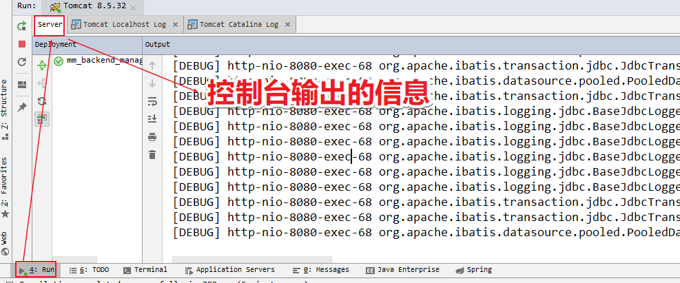

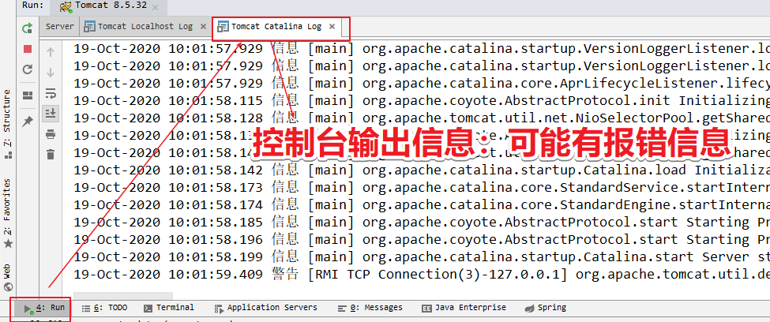

2. 如果没有报错，就需要debug调试

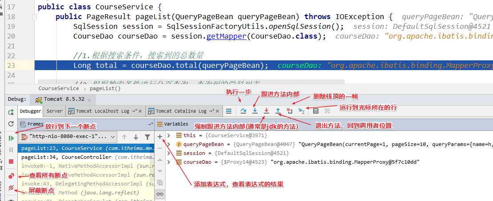