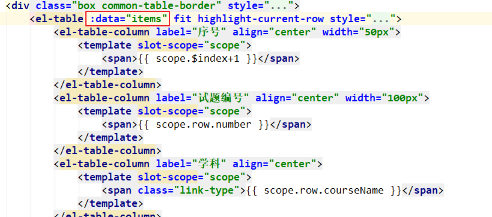
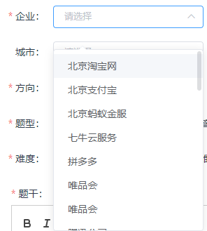
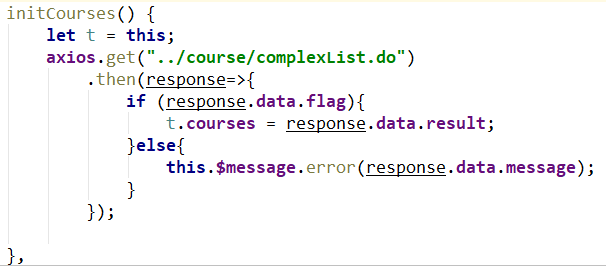

# 黑马面面-第四天

## 题库管理模块分析

### 目标

* 理解题库管理的需求

### 讲解

#### 需求分析

* 基础题库管理是**普通录入人员**操作的功能
  * 新的题目先经过基础题库录入
  * 加入精选后可**进入精选**，此时：题目的状态默认是待审核状态
  * 有操作精选题库权限的用户，可以审核题目。审核通过，才是精选题目
* 普通题目和精选题目，从数据上来源于同一张表`t_question`，只是通过一个字段进行`is_classic`区分
  * `is_classic`字段值为0是基础题目
  * `is_classic`字段值为1是精选题目
* 精选题目的审核状态，通过`t_question`表的`review_status`字段进行标识
  * `review_status`字段值是0：待审核。新增的基础题目是0待审核这个状态
  * `review_status`字段值是1：已审核
  * `review_status`字段值是2：已拒绝
* 题目的发布状态，通过`t_question`表的`status`字段进行标识
  * `status`字段值是0：待发布状态（待审核、已拒绝）。新增的基础题目是0待发布状态
  * `status`字段值是1：已发布状态（审核通过）
  * `status`字段值是2：已下架状态（审核通过）

#### 相关的表

题库管理的业务主要涉及8张表：

* `t_user`：用户表
* `t_question`：题目表
* `t_question_item`：题目选项表。一个题目（选择题）有多个选项，一个题目对应多个选项
* `t_company`：企业表。题目是由哪个企业提供的，一个企业对应多个题目
* `t_industry`：行业方向表。企业与行业方向是多对多
* `t_course`：学科表。一个学科下有多个题目
* `t_catalog`：学科目录表。一个目录下有多个题目
* `t_tag`：学科标签表。题目和标签是多对多
* `tr_member_question`：微信小程序用户的做题记录

### 小结


## 基础题库-列表展示

### 目标

* 实现基础题目列表展示功能


### 分析

#### 业务分析

* 打开基础题目列表页面时，要：
  * 先加载“学科列表”下拉框的选项数据
  * 再加载题目列表数据

##### 学科列表下拉框

* 这些数据是来自于学科管理中添加的学科，只要从`t_course`中查询所有学科的id和名称即可
  * 学科的名称：作为下拉选项显示的内容
  * 学科的id：作为下拉选项的value


##### 基础题目列表

* 序号：页面前端页面自动生成
* 试题编号：采用试题id值+1000
* 学科：试题所属学科，从`t_question`关联的`t_course`表查询出来学科名称
* 题型、题干、录入时间、难度：从`t_question`中查询
* 使用次数：根据题目id，从`tr_member_question`中查询数量
* 录入人：根据试题的user_id，从`t_user`表中查询username


#### 数据模型

##### 学科列表

######  请求参数：

* 无

###### 响应数据：

```json
{
    "flag": true,
    "message": "加载学科列表成功",
    "result": [
        {
            "id": 1,
            "name": "Java"
        },
        {
            "id": 2,
            "name": "Python"
        },
        {
            "id": 3,
            "name": "大数据"
        },
        {
            "id": 4,
            "name": "Php"
        }
    ]
}
```

##### 基础题目列表

###### 请求参数

* courseId：学科id
* difficulty：难度（简单、一般、困难）
* keyWord：题目搜索关键字，用于从subject字段中进行模糊查询
* type：题目类型（单选、多选、简答）

```json
{
    "currentPage": 1,
    "pageSize": 10,
    "queryParams": {
        "courseId": 1,
        "difficulty": 1,
        "keyWord": "图片",
        "type": 1
    }
}
```

###### 响应数据

```json
{
    "flag": true,
    "message": "查询基础题目列表成功",
    "result": {
        "rows": [
            {
                "id": 654,
                "number": "1654",
                "courseName": "Java",
                "subject": "<p>图片选择</p>",
                "type": 1,
                "difficulty": 1,
                "createDate": "2019-08-22 10:52:49.0",
                "creator": "admin",
                "usedQty": "0"
            },
            {
                "id": 656,
                "number": "1656",
                "subject": "<p>图片2</p>",
                "type": 1,
                "courseName": "Java",
                "difficulty": 1,
                "createDate": "2019-08-22 15:08:20.0",
                "creator": "admin",
                "usedQty": "0"
            }
        ],
        "total": 2
    }
}
```

#### 实现流程

##### 钩子函数中进行初始化

* `questionBasicList.html`页面加载完成时，执行钩子函数`created`
* 先调用`this.initCourses()`方法：用于加载学科下拉框的选项数据
* 再调用`this.getList()`方法：用于加载基础题目列表


##### 初始化学科下拉选项

* 在`initCourses()`方法中，发异步请求加载所有学科，把得到的数据设置到Vue实例中的`courses`数据

  

* 页面上，使用了v-for指令，循环所有courses，显示成下拉选项

  

##### 加载题目列表

* 在`this.getList()`方法中发异步请求，根据搜索框里的条件，加载基础题目列表。把得到的数据设置到Vue实例的items数据上

  

* 页面上的el-table标签，绑定items数据，显示成表格

  

### 实现

#### 初始化学科下拉列表

##### `pages/questionBasicList.html`

* 在`initCourses()`方法中发异步请求

```js
initCourses() {
    let t = this;
    axios.post("../course/simpleList.do")
        .then(response=>{
        if (response.data.flag) {
            t.courses =response.data.result;
        }else{
            this.$message.error(response.data.message);
        }
    });
}
```

##### `CourseController`

* 在控制器中增加方法`simpleList`

```java
    @RequestMapping("/course/simpleList")
    public void simpleList(HttpServletRequest request, HttpServletResponse response) throws IOException {
        try {
            List<Course> courseList = courseService.simpleList();
            JsonUtils.printResult(response, new Result(true, "加载学科列表成功", courseList));
        } catch (Exception e) {
            e.printStackTrace();
            JsonUtils.printResult(response, new Result(false, "加载学科列表失败"));
        }
    }
```

##### `CourseService`

* 增加方法`simpleList()`

```java
    public List<Course> simpleList() throws IOException {
        SqlSession session = SqlSessionFactoryUtils.openSqlSession();
        CourseDao courseDao = session.getMapper(CourseDao.class);
        List<Course> courseList = courseDao.simpleList();
        SqlSessionFactoryUtils.commitAndClose(session);
        return courseList;
    }
```

##### `CourseDao`

###### 在映射器`CourseDao`中增加方法

```java
    List<Course> simpleList();
```

###### 在映射文件`CourseDao.xml`中增加statement

```xml
    <select id="simpleList" resultType="course">
      select id, name from t_course
    </select>
```

#### 基础题库列表展示

##### `pages/questionBasicList.html`

* 在`getList`方法里发异步请求。注意：
  * 搜索条件queryParams这一项跟之前不同：
  * 之前是 如果没有搜索条件，仍然有queryParams，只是各项值为空
  * 而现在是 如果没有搜索条件，根本就没有queryParams。服务端执行SQL时要注意判空
  
* 注意：

  * 处理响应结果时，前端的代码需要调整的：`getList`方法里有问题，原本代码少了`response.`

  

  * 服务端映射配置文件里，要先判断`queryParams!=null`，再拼接SQL条件

```js
getList() {
    let t = this;

    // 必传参数
    let params = {
        currentPage: t.pagination.pageNum,
        pageSize: t.pagination.pageSize
    };
    // 选传参数
    let queryParams = {};
    let courseId = t.requestParameters.courseId;
    if (courseId !== '') {
        queryParams.courseId = courseId;
    }
    let difficulty = t.requestParameters.difficulty;
    if (difficulty !== '') {
        queryParams.difficulty = difficulty;
    }
    let type = t.requestParameters.type;
    if (type !== '') {
        queryParams.type = type;
    }
    let keyWord = t.requestParameters.keyWord;
    if (keyWord !== '') {
        queryParams.keyWord = keyWord;
    }
    if (Object.keys(queryParams).length) {
        params.queryParams = queryParams;
    }
    console.log("基础题库列表请求参数：");
    console.log(params);

    axios.post("../question/pageList.do", params)
        .then(response=>{
        if (response.data.flag) {
            t.pagination.total = response.data.result.total;
            t.items = response.data.result.rows;
            t.loading = true;
        }else{
            this.$message.error(response.data.message);
        }
    });
}
```

##### `QuestionController`

* 创建`QuestionController`类，并创建方法`pageList`

```java
/**
 * @author liuyp
 * @date 2020/03/05
 */
@Controller
public class QuestionController {
    private QuestionService questionService = new QuestionService();

    @RequestMapping("/question/pageList")
    public void pageList(HttpServletRequest request, HttpServletResponse response) throws IOException {
        try {
            QueryPageBean queryPageBean = JsonUtils.parseJSON2Object(request, QueryPageBean.class);
            if (queryPageBean == null) {
                queryPageBean = new QueryPageBean();
                queryPageBean.setCurrentPage(1);
                queryPageBean.setPageSize(10);
            }

            PageResult pageResult = questionService.pageList(queryPageBean);
            JsonUtils.printResult(response, new Result(true, "查询基础题目列表成功", pageResult));
        } catch (Exception e) {
            e.printStackTrace();
            JsonUtils.printResult(response, new Result(false, "查询基础题目列表失败"));
        }
    }
}
```

##### `QuestionService`

* 创建`QuestionService`类，并创建方法`pageList`

```java
/**
 * @author liuyp
 * @date 2020/03/05
 */
public class QuestionService {
    public PageResult pageList(QueryPageBean queryPageBean) throws IOException {
        SqlSession session = SqlSessionFactoryUtils.openSqlSession();
        QuestionDao questionDao = session.getMapper(QuestionDao.class);
        Long total = questionDao.total(queryPageBean);
        List<Question> questionList = questionDao.pageList(queryPageBean);
        SqlSessionFactoryUtils.commitAndClose(session);
        return new PageResult(total, questionList);
    }
}
```

##### `QuestionDao`

###### 创建映射器`QuestionDao`，并创建方法

```java
/**
 * @author liuyp
 * @date 2020/03/05
 */
public interface QuestionDao {
    Long total(QueryPageBean queryPageBean);

    List<Question> pageList(QueryPageBean queryPageBean);
}
```

###### 创建映射文件`QuestionDao.xml`，配置statement

```xml
<?xml version="1.0" encoding="UTF-8" ?>
<!DOCTYPE mapper
        PUBLIC "-//mybatis.org//DTD Mapper 3.0//EN"
        "http://mybatis.org/dtd/mybatis-3-mapper.dtd">
<mapper namespace="com.itheima.mm.dao.QuestionDao">

    <select id="total" parameterType="QueryPageBean" resultType="long">
      select count(*) from t_question q
      <include refid="pageWhere"/>
    </select>
    
    <select id="pageList" parameterType="QueryPageBean" resultType="Question">
        SELECT
            q.id,
            q.SUBJECT,
            q.type,
            q.STATUS,
            q.difficulty,
            q.create_date createDate,
            q.id + 1000 number,
            (select username from t_user where id = q.user_id) creator,
            (select name from t_course where id = q.course_id) courseName,
            (select count(*) from tr_member_question where question_id = q.id) usedQty
        FROM
            t_question q
        <include refid="pageWhere"/>
        limit #{offset}, #{pageSize}
    </select>

    <sql id="pageWhere">
        <where>
            q.is_classic = 0
            <if test="queryParams != null">
                <if test="queryParams.courseId != null">
                    and q.course_id = #{queryParams.courseId}
                </if>
                <if test="queryParams.difficulty != null">
                    and q.difficulty = #{queryParams.difficulty}
                </if>
                <if test="queryParams.keyWord != null and queryParams.keyWord != ''">
                    and q.subject like "%"#{queryParams.keyWord}"%"
                </if>
                <if test="queryParams.type != null">
                    and q.type = #{queryParams.type}
                </if>
            </if>
        </where>
    </sql>
</mapper>
```

### 小结


## 基础题库-初始化新增页面

### 目标

* 初始化新增页面
  * 页面上有很多数据，需要提交从数据库中加载后，才可以使用
  * 学科列表下拉框
  * 目录列表下拉框
  * 企业列表下拉框
  * 城市列表下拉框
  * 行业方向下拉框
  * 标签列表下拉框


### 分析

#### 业务分析

* 页面`pages/questionEditor.html`被设计成了公用页面：新增题目和修改题目。我们这里只做新增题目的功能

* 打开新增页面后，要加载显示一些数据列表

##### 学科列表-目录列表-标签列表

* 当页面打开时，要**加载学科列表，及每个学科关联的目标列表和标签列表**，分别显示到“学科”、目录和标签下拉框中。

* 为什么？

  * 学科下拉框 会级联影响“目录”下拉框：如果选择了Java学科，那么目录中必定是Java学科的目录选项

  

  * 学科下拉框 会级联影响“标签”下拉框：如果选择了Java学科，那么标签中必定是Java学科的标签选项

    

  * 我们可以在每次选择学科变更时，发异步请求加载学科关联的目录和标签

  * 也可以在加载学科时，把每个学科关联的目标列表和标签列表一直加载到页面上。这样切换学科时，就不需要重新请求到服务端加载目录和标签数据了

##### 城市列表

* 要加载所有的地区城市。顶级城市，及其下级城市列表


##### 行业方向列表

* 要加载所有的行业方向


##### 企业列表

* 要加载所有的企业列表



* 当选中一个企业时，这个企业是有其关联的行业方向，和企业所在的城市。前端已经完成了三项数据的级联选择，会在“城市”里选中企业关联的城市，在“方向”里选中关联的行业方向


* 当选中一个企业之后，又修改了地区城市、或者修改了行业方向，说明我们要变更 企业关联的地区和行业方向。在把题目信息提交到服务端时，不要忘记更新企业关联的地区和行业方向信息

#### 数据模型

##### 初始化学科下拉

###### 请求参数

* 无

###### 响应数据

* id：学科的id
* name：学科的名称
* catalogList：学科拥有的二级目录列表
  * id：二级目录的id
  * name：二级目录的名称
* tagList：学科拥有的标签列表
  * id：标签的id
  * name：标签的名称

```json
{
    "flag": true,
    "message": "获取列表成功",
    "result": [
        {
            "catalogList": [
                {
                    "id": 1,
                    "name": "Java基础"
                },
                {
                    "id": 2,
                    "name": "JavaWeb"
                }
            ],
            "tagList": [
                {
                    "id": 1,
                    "name": "String字符串"
                },
                {
                    "id": 2,
                    "name": "Java类与对象"
                }
            ],
            "id": 1,
            "name": "Java"
        },
        {
            "catalogList": [
                {
                    "id": 5,
                    "name": "Python基础"
                },
                {
                    "id": 6,
                    "name": "函数编程"
                }
            ],
            "id": 2,
            "name": "Python"
        },
        {
            "catalogList": [],
            "id": 3,
            "name": "大数据"
        }
    ]
}
```

##### 初始化行业方向下拉

###### 请求参数

* 无

###### 响应数据

* id：行业方向的id
* name：行业方向的名称

```json
{
    "flag": true,
    "message": "获取成功",
    "result": [
        {
            "id": 1,
            "name": "电商平台"
        },
        {
            "id": 2,
            "name": "金融服务"
        },
        {
            "id": 3,
            "name": "移动通讯"
        }
    ]
}
```

##### 初始化城市下拉

###### 请求参数

* 无

###### 响应数据

* id：城市（地区）的id
* dataValue：城市（地区）名称
* subList：下级城市（地区）列表
  * id：下级城市的id
  * dataValue：下级城市的名称

```json
{
    "flag": true,
    "message": "获取成功",
    "result": [
        {
            "dataValue": "北京",
            "id": 1,
            "subList": [
                {
                    "dataValue": "北京",
                    "id": 9
                }
            ]
        },
        {
            "dataValue": "上海",
            "id": 2,
            "subList": [
                {
                    "dataValue": "上海",
                    "id": 10
                }
            ]
        },
        {
            "dataValue": "天津",
            "id": 3,
            "subList": [
                {
                    "dataValue": "天津",
                    "id": 11
                }
            ]
        },
        {
            "dataValue": "广东省",
            "id": 4,
            "subList": [
                {
                    "dataValue": "广州",
                    "id": 12
                },
                {
                    "dataValue": "深圳",
                    "id": 13
                }
            ]
        },
        {
            "dataValue": "浙江省",
            "id": 5,
            "subList": [
                {
                    "dataValue": "杭州",
                    "id": 14
                }
            ]
        },
        {
            "dataValue": "山东省",
            "id": 6,
            "subList": [
                {
                    "dataValue": "济南",
                    "id": 15
                }
            ]
        },
        {
            "dataValue": "四川省",
            "id": 7,
            "subList": [
                {
                    "dataValue": "成都",
                    "id": 16
                }
            ]
        },
        {
            "dataValue": "陕西省",
            "id": 8,
            "subList": [
                {
                    "dataValue": "西安",
                    "id": 17
                }
            ]
        }
    ]
}
```

##### 初始化企业下拉

###### 请求参数

* 无

###### 响应数据

* id：企业id
* shortName：企业简称
* cityId：企业所在城市
* industryList：企业关联的行业方向
  * id：行业方向的id
  * name：行业方向的名称

```json
{
    "flag": true,
    "message": "获取成功",
    "result": [
        {
            "cityId": 9,
            "id": 1,
            "industryList": [
                {
                    "id": 1,
                    "name": "电商平台"
                },
                {
                    "id": 2,
                    "name": "金融服务"
                },
                {
                    "id": 3,
                    "name": "电竞游戏"
                }
            ],
            "shortName": "北京淘宝网"
        },
        {
            "cityId": 10,
            "id": 2,
            "industryList": [
                {
                    "id": 2,
                    "name": "金融服务"
                }
            ],
            "shortName": "北京支付宝"
        },
        {
            "cityId": 1,
            "id": 3,
            "industryList": [
                {
                    "id": 2,
                    "name": "金融服务"
                }
            ],
            "shortName": "北京蚂蚁金服"
        }
    ]
}
```

#### 实现流程

* 打开`pages/questionEditor.html`页面，会执行钩子函数`created`。在`created`里：
  * 调用`initCourses`方法，初始化页面上的 学科下拉框
  * 调用`initCompanys`方法，初始化页面上的 企业下拉框
  * 调用`intDicts`方法，初始化页面上的 地区（城市）下拉框
  * 调用`initIndustrys`方法，初始化页面上的行业方向下拉框


##### 初始化学科下拉

* 在`initCourses`方法里，发异步请求，加载数据设置到Vue实例的`courses`里



* 页面上使用v-for指令，循环学科，展示成下拉列表的选项


* 当学科选项改变时，会触发函数`changeChourse`
  * 把学科关联的二级目录设置到数据catalogs里
  * 把学科关联的标签设置到数据tags里


* 页面上把目录数据，用v-for指令循环显示到“目录”下拉列表中


* 页面上把标签数据，用v-for指令循环显示到“标签”下拉列表中


##### 初始化行业方向

* 在`initIndustrys`方法里，发异步请求加载数据，设置到Vue实例的industrys数据中


* 在页面上使用v-for指令，把industrys数据循环显示成“方向”下拉框的下拉选项


##### 初始化城市下拉

* 在`intDicts`方法里发异步请求加载数据，把数据设置到Vue实例的dicts数据中


* 在页面上，把dicts数据设置到ElementUI的级联组件中。数据有变化时，级联组件会随之变化


##### 初始化企业下拉

* 在`initCompanys`方法里发异步请求加载数据，把数据设置到Vue实例的companys数据中


* 在页面上使用v-for指令，把企业数据循环显示成“企业”下拉框的下拉选项


### 实现

#### 初始化学科列表

##### `pages/questionEditor.html`

* 在`initCourses()`方法里，发异步请求，加载数据

```js
initCourses() {
    let t = this;
    axios.get("../course/complexList.do")
        .then(response=>{
        if (response.data.flag){
            t.courses = response.data.result;
        }else{
            this.$message.error(response.data.message);
        }
    });
}
```

##### `CourseController`

* 增加方法`complexList`

```java
    /**
     * 查询学科及关联的目录和标签。用于新增试题页面里的下拉框
     */
    @RequestMapping("/course/complexList")
    public void complexList(HttpServletRequest request, HttpServletResponse response) throws IOException {
        try {
            List<Course> courseList = courseService.complexList();
            JsonUtils.printResult(response, new Result(true, "加载学科列表成功", courseList));
        } catch (Exception e) {
            e.printStackTrace();
            JsonUtils.printResult(response, new Result(false, "加载学科列表失败"));
        }
    }
```

##### `CourseService`

* 增加方法`complexList`

```java
    public List<Course> complexList() throws IOException {
        SqlSession session = SqlSessionFactoryUtils.openSqlSession();
        CourseDao courseDao = session.getMapper(CourseDao.class);
        List<Course> courseList = courseDao.complexList();
        SqlSessionFactoryUtils.commitAndClose(session);
        return courseList;
    }
```

##### `CourseDao`

###### 映射器`CourseDao`

* 在映射器`CourseDao`里增加方法

```java
List<Course> complexList();
```

###### 映射文件`CourseDao.xml`

* 在映射文件`CourseDao.xml`里增加statement

* 嵌套查询：调用`com.itheima.mm.dao.CatalogDao.simpleListByCourse`查询关联的二级目录
* 嵌套查询：调用`com.itheima.mm.dao.TagDao.simpleListByCourse`查询关联的标签

```xml
<select id="complexList" resultMap="courseMap">
    select id, name from t_course
</select>
<resultMap id="courseMap" type="Course">
    <id property="id" column="id"/>
    <result property="name" column="name"/>
    <collection property="catalogList" ofType="Catalog"
                select="com.itheima.mm.dao.CatalogDao.simpleListByCourse"
                column="id"/>
    <collection property="tagList" ofType="Tag"
                select="com.itheima.mm.dao.TagDao.simpleListByCourse"
                column="id"/>
</resultMap>
```

##### `CatalogDao`

###### 映射器`CatalogDao`

* 创建`CatalogDao`接口，并创建`simpleListByCourse`方法

```java
/**
 * @author liuyp
 * @date 2020/03/05
 */
public interface CatalogDao {
    List<Catalog> simpleListByCourse(Integer courseId);
}
```

###### 映射文件`CatalogDao.xml`

* 创建映射文件`CatalogDao.xml`，并增加statement

```xml
<?xml version="1.0" encoding="UTF-8" ?>
<!DOCTYPE mapper
        PUBLIC "-//mybatis.org//DTD Mapper 3.0//EN"
        "http://mybatis.org/dtd/mybatis-3-mapper.dtd">
<mapper namespace="com.itheima.mm.dao.CatalogDao">
    <select id="simpleListByCourse" parameterType="int" resultType="Catalog">
        select id, name from t_catalog where course_id = #{courseId}
    </select>
</mapper>
```

##### `TagDao`

###### 映射器`TagDao`

* 创建映射器`TagDao`，并增加方法

```java
/**
 * @author liuyp
 * @date 2020/03/05
 */
public interface TagDao {
    List<TagDao> simpleListByCourse();
}
```

###### 映射文件`TagDao.xml`

* 创建映射文件`TagDao.xml`，并增加statement

```xml
<?xml version="1.0" encoding="UTF-8" ?>
<!DOCTYPE mapper
        PUBLIC "-//mybatis.org//DTD Mapper 3.0//EN"
        "http://mybatis.org/dtd/mybatis-3-mapper.dtd">
<mapper namespace="com.itheima.mm.dao.TagDao">
    <select id="simpleListByCourse" parameterType="int" resultType="Tag">
        select id, name from t_tag where course_id = #{courseId}
    </select>
</mapper>
```

#### 初始化行业方向

##### `pages/questionEditor.html`

* 在`initIndustrys()`方法里，发异步请求加载所有行业方向 

```js
initIndustrys() {
    let t = this;
    axios.get("../industry/simpleList.do")
        .then(response=>{
        if (response.data.flag) {
            t.industrys = response.data.result;
        }else{
            this.$message.error(response.data.message);
        }
    });
}
```

##### `IndustryController`

* 创建`IndustryController`类，并创建方法

```java
/**
 * @author liuyp
 * @date 2020/03/05
 */
@Controller
public class IndustryController {
    private IndustryService industryService = new IndustryService();

    @RequestMapping("/industry/simpleList")
    public void simpleList(HttpServletRequest request, HttpServletResponse response) throws IOException {
        try {
            List<Industry> industryList = industryService.simpleList();
            JsonUtils.printResult(response, new Result(true, "加载行业方向列表成功", industryList));
        } catch (Exception e) {
            e.printStackTrace();
            JsonUtils.printResult(response, new Result(false, "加载行业方向列表失败"));
        }
    }
}
```

##### `IndustryService`

* 创建`IndustryService`类，并创建方法

```java
/**
 * @author liuyp
 * @date 2020/03/05
 */
public class IndustryService {
    public List<Industry> simpleList() throws IOException {
        SqlSession session = SqlSessionFactoryUtils.openSqlSession();
        IndustryDao industryDao = session.getMapper(IndustryDao.class);
        List<Industry> industryList = industryDao.simpleList();
        SqlSessionFactoryUtils.commitAndClose(session);
        return industryList;
    }
}
```

##### `IndustryDao`

###### 映射器`IndustryDao`

* 创建映射器`IndustryDao`，并创建方法

```java
/**
 * @author liuyp
 * @date 2020/03/05
 */
public interface IndustryDao {
    List<Industry> simpleList();
}
```

###### 映射文件`IndustryDao.xml`

* 创建映射文件`IndustryDao.xml`，并增加statement

```xml
<?xml version="1.0" encoding="UTF-8" ?>
<!DOCTYPE mapper
        PUBLIC "-//mybatis.org//DTD Mapper 3.0//EN"
        "http://mybatis.org/dtd/mybatis-3-mapper.dtd">
<mapper namespace="com.itheima.mm.dao.IndustryDao">
    <select id="simpleList" resultType="Industry">
        select id, name from t_industry
    </select>
</mapper>
```

#### 初始化城市下拉

##### `pages/questionEditor.html`

* 在`intDicts()`方法里，发异步请求加载所有城市地区

```js
intDicts() {
    let t = this;
    // 获取省市数据
    axios.get("../dict/simpleList.do")
        .then(response=>{
        if (response.data.flag) {
            t.dicts = response.data.result;
        }else{
            this.$message.error(response.data.message);
        }
    });
}
```

##### `DictController`

* 创建`DictController`并创建方法

```java
/**
 * @author liuyp
 * @date 2020/03/05
 */
@Controller
public class DictController {
    private DictService dictService = new DictService();

    @RequestMapping("/dict/simpleList")
    public void simpleList(HttpServletRequest request, HttpServletResponse response) throws IOException {
        try {
            List<Dict> dictList = dictService.simpleList();
            JsonUtils.printResult(response, new Result(true, "加载城市列表成功", dictList));
        } catch (Exception e) {
            e.printStackTrace();
            JsonUtils.printResult(response, new Result(false, "加载城市列表失败"));
        }
    }
}
```

##### `DictService`

* 创建`DictService`类并创建方法

```java
/**
 * @author liuyp
 * @date 2020/03/05
 */
public class DictService {
    public List<Dict> simpleList() throws IOException {
        SqlSession session = SqlSessionFactoryUtils.openSqlSession();
        DictDao dictDao = session.getMapper(DictDao.class);
        List<Dict> dictList = dictDao.simpleList();
        SqlSessionFactoryUtils.commitAndClose(session);
        return dictList;
    }
}
```

##### `DictDao`

###### 映射器`DictDao`

* 创建映射器`DictDao`，并创建方法

```java
/**
 * @author liuyp
 * @date 2020/03/05
 */
public interface DictDao {
    List<Dict> simpleList();
}
```

###### 映射文件`DictDao.xml`

```xml
<?xml version="1.0" encoding="UTF-8" ?>
<!DOCTYPE mapper
        PUBLIC "-//mybatis.org//DTD Mapper 3.0//EN"
        "http://mybatis.org/dtd/mybatis-3-mapper.dtd">
<mapper namespace="com.itheima.mm.dao.DictDao">
    <select id="simpleList" resultMap="dictMap">
        select id, data_value from t_dict where data_type = 0
    </select>
    <resultMap id="dictMap" type="Dict">
        <id property="id" column="id"/>
        <result property="dataValue" column="data_value"/>
        <collection property="subList" ofType="Dict"
            select="subDictList"
            column="id"/>
    </resultMap>

    <select id="subDictList" parameterType="int" resultType="Dict">
        select id, data_value dataValue from t_dict where pid = #{pid}
    </select>
</mapper>
```

#### 初始化企业下拉

##### `pages/questionEditor.html`

* 在`initCompanys`方法里发异步请求到服务端，加载数据

```js
initCompanys() {
    let t = this;
    axios.get("../company/complexList.do")
        .then(response=>{
        if (response.data.flag) {
            t.companys = response.data.result;
            // 初始化试题(初始化公司时，需要在初始化公司之后再初始化)
            this.initQuestionById()
        }else{
            this.$message.error(response.data.message);
        }
    });

}
```

##### `CompnayController`

* 创建`CompnayController`类，并创建方法

```java
/**
 * @author liuyp
 * @date 2020/03/05
 */
@Controller
public class CompanyController {
    private CompanyService companyService = new CompanyService();

    @RequestMapping("/company/complexList")
    public void complexList(HttpServletRequest request, HttpServletResponse response) throws IOException {
        try {
            List<Company> companyList = companyService.complexList();
            JsonUtils.printResult(response, new Result(true, "加载企业列表成功", companyList));
        } catch (Exception e) {
            e.printStackTrace();
            JsonUtils.printResult(response, new Result(false, "加载企业列表失败"));
        }
    }
}
```

##### `CompanyService`

* 创建`CompanyService`类，并创建方法

```java
/**
 * @author liuyp
 * @date 2020/03/05
 */
public class CompanyService {
    public List<Company> complexList() throws IOException {
        SqlSession session = SqlSessionFactoryUtils.openSqlSession();
        CompanyDao companyDao = session.getMapper(CompanyDao.class);
        List<Company> companyList = companyDao.complexList();
        SqlSessionFactoryUtils.commitAndClose(session);
        return companyList;
    }
}
```

##### `CompanyDao`

###### 映射器`CompanyDao`

* 创建映射器`CompanyDao`，并增加方法

```java
/**
 * @author liuyp
 * @date 2020/03/05
 */
public interface CompanyDao {
    List<Company> complexList();
}
```

###### 映射文件`CompanyDao.xml`

```xml
<?xml version="1.0" encoding="UTF-8" ?>
<!DOCTYPE mapper
        PUBLIC "-//mybatis.org//DTD Mapper 3.0//EN"
        "http://mybatis.org/dtd/mybatis-3-mapper.dtd">
<mapper namespace="com.itheima.mm.dao.CompanyDao">
    <select id="complexList" resultMap="companyMap">
        select id, short_name, city_id from t_company
    </select>
    <resultMap id="companyMap" type="Company">
        <id property="id" column="id"/>
        <result property="shortName" column="short_name"/>
        <result property="cityId" column="city_id"/>
        <collection property="industryList" ofType="Industry"
            select="com.itheima.mm.dao.IndustryDao.findByCompanyId"
            column="id"/>
    </resultMap>
</mapper>
```

##### `IndustryDao`

###### 映射器`IndustryDao`

* 在映射器`IndustryDao`里增加方法

```java
List<Industry> findByCompanyId(Integer companyid);
```

###### 映射文件`IndustryDao.xml`

* 在映射文件`IndustryDao.xml`里增加statement

```xml
<select id="findByCompanyId" parameterType="int" resultType="Industry">
    select * from t_industry where id in (select industry_id from tr_company_industry where company_id = #{companyid})
</select>
```

### 小结

## 基础题库-新增题目

### 目标

* 完成新增基础题目功能

### 分析

#### 业务分析

* 用户在页面输入题目数据

#### 数据模型

##### 请求参数

* id：题目的id。新增题目时，id是0；修改题目时，id是真实的id值
* subject：题目的题干
* type：题型。1单选，2多选，5简答
* difficulty：难度。1简单，2一般，3困难
* is_classic：是否精选题目。0基础题目，1精选题目
* analysis：题目解析
* analysisVideo：题目解析视频的链接地址
* remark：题目备注
* companyId：题目所属的企业id
* courseId：题目所属的学科id
* catalogId：题目所属的目录id
* cityIds：选择的城市（企业所在的城市）。值说明示例：
  * [1,9] 表示t_dict里id为1的地区下、id为9的地址
* industryIds：选择的行业方向（企业关联的行业方向）。值说明示例：
  * [1,2,18,26,27]：企业关联了多个行业方向，id分别为1, 2, 18, 26, 27
* company：企业关联的信息的封装，相当于上边`cityIds`和`industryIds`的封装
* questionItemList：题目的选项列表
  * id：题目选项的id。0表示新增，非0是修改时真实的id
  * content：题目选项的内容
  * imgUrl：题目选项的图片路径
  * isRight：是否正确答案。0不是正确答案，1是正确答案
* tagIds：题目选择的标签id数组。值说明示例：
  * [2]：题目关联的标签id是2
* tagList：题目选择的标签数组。
  * id：标签的id
  * name：标签的名称

```js
{
    "id": 0,
    "subject": "<p>你最喜欢哪种编程语言</p>",
    "type": 1,
    "difficulty": 1,
    "is_classic": 0,
    "analysis": "<p>作为Java程序员，当然最喜欢Java</p>",
    "analysisVideo": "http://www.baidu.com",
    "remark": "嘿嘿嘿",
    "companyId": 1,
    "courseId": 1,
    "catalogId": 1,
    "cityIds": [1,9],
    "industryIds": [1,2,18,26,27],
    "company": {
        "cityId": 9,
        "id": 1,
        "industryList": [
            {
                "id": 1,
                "name": "电商平台"
            },
            {
                "id": 2,
                "name": "金融服务"
            },
            {
                "id": 18,
                "name": "软件外包"
            },
            {
                "id": 26,
                "name": "新增方向5"
            },
            {
                "id": 27,
                "name": "新增方向6"
            }
        ]
    },
    "questionItemList": [
        {
            "content": "Java",
            "id": 0,
            "imgUrl": "",
            "isRight": 1
        },
        {
            "content": "PHP",
            "id": 0,
            "imgUrl": "",
            "isRight": 0
        },
        {
            "content": "Python",
            "id": 0,
            "imgUrl": "",
            "isRight": 0
        },
        {
            "content": "C#",
            "id": 0,
            "imgUrl": "",
            "isRight": 0
        },
        {
            "content": "",
            "id": 0,
            "imgUrl": "",
            "isRight": 0
        },
        {
            "content": "",
            "id": 0,
            "imgUrl": "",
            "isRight": 0
        }
    ],
    "tagIds": [2],
    "tagList": [
        {
            "id": 2,
            "name": "Java类与对象"
        }
    ]
}
```

##### 响应数据

```json
{
    "flag":true,
    "message":"保存题目成功"
}
```

#### 实现流程


### 实现

#### `pages/questionEditor.html`

* 在`createItem`方法中，发送异步请求，提交表单数据

```js
createItem() {
    // 表单校验
    let isValid = false;
    this.$refs['formData'].validate((valid) => {
        isValid = valid;
    });
    if (!isValid) {
        return;
    }
    let formData = this.formData;

    // 包装企业相关数据
    let industrys = this.industrys;
    let industryList = [];
    formData.industryIds.forEach(industryId => {
        let industry = industrys.find(industry => {
            return industry.id === industryId;
        });
        // TODO 会有新增的方向
        //industryList.push(industry);
        if(industry){
            industryList.push(industry);
        }else{
            industryList.push({
                id:0,
                name:industryId
            });
        }

    });
    let company = {
        id: formData.companyId,
        cityId: formData.cityIds[1],
        industryList: industryList
    };
    formData.company = company;
    // 包装选项相关数据
    let questionItemList = this.formData.questionItemList;
    questionItemList.forEach(val => {
        val.isRight = val.isRight ? 1 : 0;
    });
    // 包装标签相关数据
    let tags = this.tags;
    let tagList = [];
    formData.tagIds.forEach(tagId => {
        let tag = tags.find(tag => {
            return tag.id === tagId;
        });
        // TODO 会有新增的标签
        //tagList.push(tag);
        if(tag){
            tagList.push(tag);
        }else{
            tagList.push({
                id:0,
                name:tagId
            });
        }
    });
    formData.tagList = tagList;
    console.log("新增更新题库请求参数：");
    console.log(this.formData);

    //==========发送异步请求 开始==========
    axios.post("../question/save.do", this.formData)
        .then(response=>{
        if (response.data.flag) {
            this.$message.success("操作成功");
            // 返回到上一级
            if (!this.formData.is_classic) {
                setTimeout(function () {
                    window.location.href = "questionBasicList.html";
                }, 1000);
            } else {
                setTimeout(function () {
                    window.location.href = "questionClassicList.html";
                }, 1000);
            }
        }else{
            this.$message.error(response.data.message);
        }
    });
	//=========发送异步请求 结束=============
}
```

#### `QuestionController`

* 在`QuestionController`中创建方法

```java
    @RequestMapping("/question/save")
    public void save(HttpServletRequest request, HttpServletResponse response) throws IOException {
        try {
            User user = (User) request.getSession().getAttribute("user");
            Question question = JsonUtils.parseJSON2Object(request, Question.class);
            if (user != null) {
                question.setUserId(user.getId());
                questionService.save(question);
                JsonUtils.printResult(response, new Result(true, "保存题目成功"));
            }else{
                JsonUtils.printResult(response, new Result(false, "请登录后再操作"));
            }
        } catch (Exception e) {
            e.printStackTrace();
            JsonUtils.printResult(response, new Result(false, "保存题目失败"));
        }
    }
```

#### `QuestionService`

* 在`QuestionService`中创建方法

```java
    public void save(Question question) throws IOException {
        SqlSession session = SqlSessionFactoryUtils.openSqlSession();
        QuestionDao questionDao = session.getMapper(QuestionDao.class);

        Integer id = question.getId();
        if (id == null || id == 0) {
            //新增题目
            //0. 补全题目的状态信息。未发布，未审核，创建日期
            question.setStatus(Constants.QUESTION_PRE_PUBLISH);
            question.setReviewStatus(Constants.QUESTION_PRE_REVIEW);
            question.setCreateDate(DateUtils.parseDate2String(new Date()));

            //1. 保存题目信息。要获取最新的主键值，下边保存选项时要使用到
            questionDao.saveQuestion(question);

            //2. 保存题目选项
            List<QuestionItem> itemList = question.getQuestionItemList();
            if (itemList != null && itemList.size() > 0) {
                QuestionItemDao itemDao = session.getMapper(QuestionItemDao.class);
                for (QuestionItem item : itemList) {
                    //如果题目选项内容为空，不处理
                    String content = item.getContent();
                    if (content == null || "".equals(content)) {
                        continue;
                    }
                    //保存题目选项
                    item.setQuestionId(question.getId());
                    itemDao.save(item);
                }
            }

            //3. 更新题目标签的关系。建立题目与标签之间的关联关系
            List<Tag> tagList = question.getTagList();
            if (tagList != null && tagList.size()>0) {
                TagDao tagDao = session.getMapper(TagDao.class);
                for (Tag tag : tagList) {
                    Map<String, Object> map = new HashMap<>();
                    map.put("questionId", question.getId());
                    map.put("tagId", tag.getId());

                    tagDao.saveTagByQuestion(map);
                }
            }
        }else{
            //TODO 修改题目
            System.out.println("修改题目还没有做");
        }

        SqlSessionFactoryUtils.commitAndClose(session);
    }
```

#### `QuestionDao`

##### 映射器`QuestionDao`

* 增加方法

```java
void saveQuestion(Question question);
```

##### 映射文件`QuestionDao.xml`

* 增加statement

```xml
    <insert id="saveQuestion" parameterType="Question">
        <selectKey resultType="int" keyProperty="id" order="AFTER">
            select last_insert_id()
        </selectKey>
        insert into t_question (
              subject,
              type,
              difficulty,
              analysis,
              analysis_video,
              remark,
              is_classic,
              status,
              review_status,
              create_date,
              user_id,
              company_id,
              catalog_id,
              course_id
        ) values (
              #{subject},
              #{type},
              #{difficulty},
              #{analysis},
              #{analysisVideo},
              #{remark},
              #{isClassic},
              #{status},
              #{reviewStatus},
              #{createDate},
              #{userId},
              #{companyId},
              #{catalogId},
              #{courseId}
        )
    </insert>
```

#### `QuestionItemDao`

##### 映射器`QuestionItemDao`

* 创建映射器`QuestionItemDao`， 并创建方法

```java
/**
 * @author liuyp
 * @date 2020/03/05
 */
public interface QuestionItemDao {
    void save(QuestionItem item);
}
```

##### 映射文件`QuestionItemDao.xml`

* 创建映射文件`QuestionItemDao.xml`，并配置statement

```xml
<?xml version="1.0" encoding="UTF-8" ?>
<!DOCTYPE mapper
        PUBLIC "-//mybatis.org//DTD Mapper 3.0//EN"
        "http://mybatis.org/dtd/mybatis-3-mapper.dtd">
<mapper namespace="com.itheima.mm.dao.QuestionItemDao">
    <insert id="save" parameterType="QuestionItem">
        insert into t_question_item(content, img_url, is_right, question_id)
             values(#{content},#{imgUrl},#{isRight},#{questionId})
    </insert>
</mapper>
```

#### `TagDao`

##### 映射器`TagDao`

* 在映射器`TagDao`中增加方法

```java
void saveTagByQuestion(Map<String, Object> map);
```

##### 映射文件`TagDao`

* 在映射文件`TagDao` 增加statement

```xml
    <insert id="saveTagByQuestion" parameterType="hashmap">
        insert into tr_question_tag(question_id, tag_id) values (#{questionId},#{tagId})
    </insert>
```

### 小结

全部完成后，测试题目数据保存的过程，可以使用如下查询，查询数据是否正确保存。

```mysql
#查询题目。找刚刚添加的题目信息，看有没有
SELECT * from t_question order by id desc;
#查询题目选项。找刚刚添加的题目选项信息，看有没有
SELECT * from t_question_item order by question_id desc;
#查询标签。先查下 页面上选择的标签的id是什么
SELECT * from t_tag order by id desc;
#查询题目标签关系。找刚刚添加的题目 和 选择的标签之间的关联数据
SELECT * from tr_question_tag order by question_id desc;
```

