# 黑马面面-第四天

## 精选题库-题目审核

### 目标

* 管理员在“精选题库”列表(功能不做了)中，点击“审核”按钮，跳转到审核页面

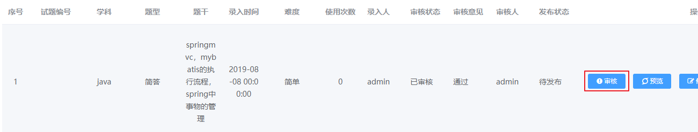

* 在审核页面上加载题目信息显示出来（功能不做了）。管理员点击“审核通过”或者“审核不通过”，进行审核（要做的功能）

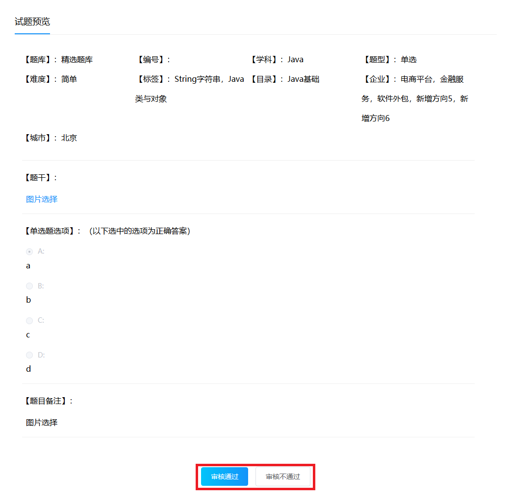

### 分析


#### 业务分析

* 审核通过与审核不通过，实际是为当前题目：

  * 在表`t_review_log`增加了一条审核记录
  * 需要更新`t_question`中题目的审核状态，保持与审核记录状态的一致性。

* 题目的审核与发布状态流程如下：

  * 发布状态：

    * 待发布：0

    * 已发布：1
    * 已下架：2
  * 审核状态：

    * 待审核：0

    * 已审核：1
    * 已拒绝：2

  > 备注：
  >
  > 面面提供的项目资料不足，没有提供题目加入精选和审核相关的流程资料
  >
  > 这部分流程是我自己设计提供的，可能与面面原流程不同，因此**仅供参考**


#### 数据模型

##### 请求参数

* questionId：被审核的题目id。
  * 因为这里是模拟审核功能，审核的前置功能没有做，所以 我们把这个questionId**设置为固定值**：想要审核的题目的id
* commons：审核意见
* status：审核状态。0待审核，1审核通过，2审核拒绝

```json
{
    "questionId": 5,
    "comments": "",
    "status": 1
}
```

##### 响应结果

```json
{
    "flag":true,
    "message":"审核操作成功"
}
```

#### 实现流程

* 在审核页面上点击按钮时，触发函数`reviewItem(status)`

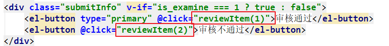

* 在`reviewItem()`方法中，发异步请求到服务端，进行审核

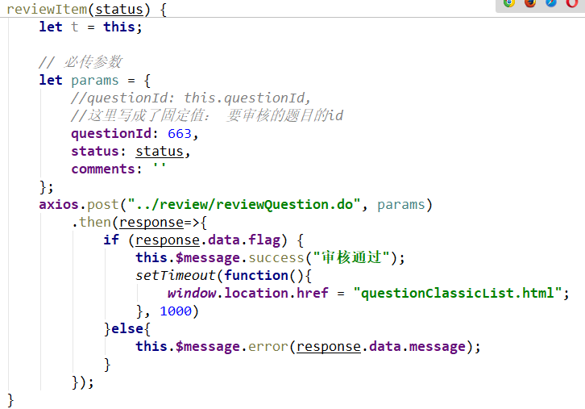

### 实现

#### `pages/questionPreview.html`

* 修改`reviewItem`方法，发送异步请求，进行审核

```js
reviewItem(status) {
    let t = this;
    // 必传参数
    let params = {
        //questionId: this.questionId,
        //=====这里写成了固定值： 要审核的题目的id=====
        questionId: 663,
        status: status,
        comments: ''
    };
    axios.post("../review/reviewQuestion.do", params)
        .then(response=>{
        if (response.data.flag) {
            this.$message.success("审核通过");
            setTimeout(function(){
                window.location.href = "questionClassicList.html";
            }, 1000)
        }else{
            this.$message.error(response.data.message);
        }
    });
}
```

#### `ReviewController`

* 创建`ReviewController`，并创建方法

```java
/**
 * @author liuyp
 * @date 2020/03/05
 */
@Controller
public class ReviewController {

    private ReviewLogService reviewService = new ReviewLogService();

    @RequestMapping("/review/reviewQuestion")
    public void reviewQuestion(HttpServletRequest request, HttpServletResponse response) throws IOException {
        try {
            ReviewLog reviewLog = JsonUtils.parseJSON2Object(request, ReviewLog.class);
            reviewLog.setCreateDate(DateUtils.parseDate2String(new Date()));
            User user = (User) request.getSession().getAttribute("user");
            if (user != null) {
                reviewLog.setUserId(user.getId());
            }

            reviewService.review(reviewLog);
            JsonUtils.printResult(response, new Result(true, "审核操作成功"));
        } catch (Exception e) {
            e.printStackTrace();
            JsonUtils.printResult(response, new Result(false, "审核操作失败"));
        }
    }
}
```

#### `	`

* 创建`ReviewLogService`，并创建方法

```java
package com.itheima.mm.service;

import com.itheima.mm.constants.Constants;
import com.itheima.mm.dao.QuestionDao;
import com.itheima.mm.dao.ReviewLogDao;
import com.itheima.mm.pojo.ReviewLog;
import com.itheima.mm.utils.SqlSessionFactoryUtils;
import com.mysql.fabric.xmlrpc.base.Params;
import org.apache.ibatis.session.SqlSession;

import java.io.IOException;
import java.io.Serializable;
import java.util.HashMap;
import java.util.Map;

/**
 * @author 15710
 */
public class ReviewService {
    public void review(ReviewLog reviewLog) throws IOException {
        SqlSession session=null;
        try {
            //获取数据库连接
            session = SqlSessionFactoryUtils.openSqlSession();
            //获取精选题目的接口对象ReviewLogDao
            ReviewLogDao reviewLogDao = session.getMapper(ReviewLogDao.class);
            //基础题目的接口对象QuestionDao
            QuestionDao questionDao = session.getMapper(QuestionDao.class);

            //如果Mybatis要传多参数,
            // 封装成Map:Map的key是参数名称,Map的value是参数的数值
            Map<String, Object> map = new HashMap<>();
            //修改题目的审核状态:已审核 1
            if (reviewLog.getStatus()== Constants.QUESTION_REVIEWED) {
                //修改的id
                map.put("questionId",reviewLog.getQuestionId());
                //审核通过:1
                map.put("reviewStatus",Constants.QUESTION_REVIEWED);
                //发布值:1
                map.put("status",Constants.QUESTION_PUBLISHED);
                //设置为精选题
                map.put("isClassic",1);
            }else{
                //修改的id
                map.put("questionId",reviewLog.getQuestionId());
                //拒绝通过:已拒绝 2
                map.put("reviewStatus",Constants.QUESTION_REJECT_REVIEW);
                //未发布值:0
                map.put("status",Constants.QUESTION_PRE_PUBLISH);
                //设置为基础题
                map.put("isClassic",0);
            }
            questionDao.updateReviewStatus(map);

            //审核通过:添加一条记录
            reviewLogDao.addReviewLog(reviewLog);

            //没问题:提交事务和结束session
            SqlSessionFactoryUtils.commitAndClose(session);
        } catch (Exception e) {
            //有问题要回滚事务,
            SqlSessionFactoryUtils.rollbackAndClose(session);
            //异常同样要抛给ReviewController层处理
            throw e;
        }
    }
}

```

#### `ReviewLogDao`

##### 映射器`ReviewLogDao`

```java
/**
 * @author liuyp
 * @date 2020/03/05
 */
public interface ReviewLogDao {
    void addReviewLog(ReviewLog reviewLog);
}
```

##### 映射文件`ReviewLogDao.xml`

```xml
<?xml version="1.0" encoding="UTF-8" ?>
<!DOCTYPE mapper
        PUBLIC "-//mybatis.org//DTD Mapper 3.0//EN"
        "http://mybatis.org/dtd/mybatis-3-mapper.dtd">
<mapper namespace="com.itheima.mm.dao.ReviewLogDao">
    <insert id="addReviewLog" parameterType="ReviewLog">
        insert into t_review_log (status, question_id, user_id, create_date)
            values (#{status}, #{questionId}, #{userId}, #{createDate})
    </insert>
</mapper>
```

#### `QuestionDao`

##### 映射器`QuestionDao`

* 在映射器`QuestionDao`中增加方法

```java
void updateReviewStatus(Map<String, Object> map);
```

##### 映射文件`QuestionDao.xml`

* 在映射文件`QuestionDao.xml`增加statement

```xml
<update id="updateReviewStatus" parameterType="hashmap">
        update t_question set review_status = #{reviewStatus},status = #{status},is_classic = #{isClassic} where id = #{questionId}
</update>
```

### 小结

## 权限控制介绍

### 目标

* 了解什么是权限控制

### 讲解


#### 为什么要权限控制

* 当前系统要求不同的用户针对不同的菜单及操作应该有不同的权限。
  * 比如：
    * 普通录入人员，只能操作基础题目菜单及题库录入的接口。
    * 管理员可以操作精选题库列表，及相应的审核操作
  * 所以精选题库及题目审核必须具有该权限的用户才可以操作。
  * 如果登录用户没有这个权限，应不允许访问并提示用户。

#### 权限控制的流程简述

* 权限控制，可以通过过滤器来实现：拦截客户端请求，有权则放行，无权则拦截
* 需要提前明确的是：
  * 要知道，资源需要什么样的权限才允许访问。需要进行配置
  * 要知道，用户拥有些什么样的权限
    * 用户必须要登录，这个过程叫认证
    * 登录成功后，查询并加载用户拥有的权限，这个过程叫授权
* 在过滤器里拦截客户端的请求：
  * 如果当前用户 拥有访问资源所需要的权限：有权，放行
  * 如果当前用户 没有访问资源所需要的权限：无权，拦截

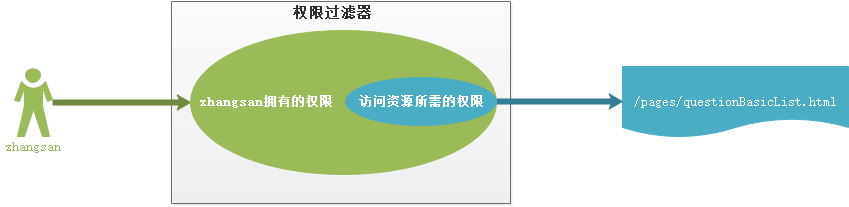

### 小结

## 认证与授权

### 目标

* 了解什么是认证和授权
* 掌握认证授权的实现

### 讲解

#### 认证和授权

##### 认证和授权的概念

+ 认证：系统提供的用于识别用户身份的功能，通常提供用户名和密码进行登录其实就是在进行认证，认证的目的是让系统知道你是谁。   
+ 授权：用户认证成功后，需要为用户授权，其实就是指定当前用户可以操作哪些功能。

##### RBAC权限模块数据模型


###### RBAC介绍

* RBAC：Role-Based Access Control，基于角色的权限访问控制，就是之前我们介绍过的权限经典5张表：
  * 在RBAC中权限与角色相关联，用户通过成为适当角色的成员而得到这些角色的权限。这就极大地简化了权限的管理。
  * 在一个组织中，角色是为了完成各种工作而创造，用户则依据它的责任和资格来被指派相应的角色，用户可以很容易地从一个角色被指派到另一个角色。
  * 角色可依新的需求和系统的合并而赋予新的权限，而权限也可根据需要而从某角色中回收。
  * 角色与角色的关系可以建立起来以囊括更广泛的客观情况。

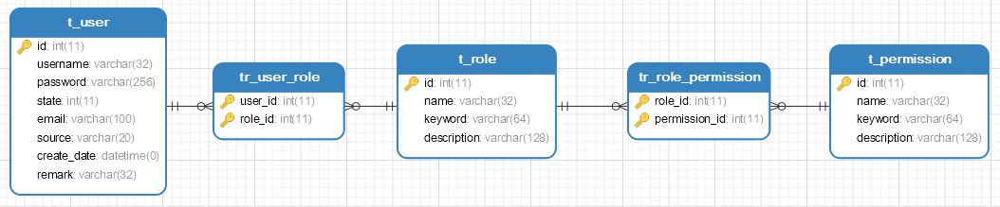

###### RBAC的认证和授权过程

* 认证过程：
  * 只涉及用户表`t_user`
  * 用户登录时，输入用户名和密码，校验用户名和密码是否正确
* 授权过程：
  * 用户必须认证登录成功后，才可以进行授权
  * 登录成功后：查询用户拥有的角色，再根据角色查询拥有的资源权限

#### 认证授权分析

* 权限控制的基本实现思路是
  * 先通过用户名和密码对用户进行认证，认证就是判断当前用户是否是系统用户
  * 然后再根据用户ID或用户名获取权限信息，即授权信息。
* 授权信息是**用户角色**及**权限标识**的集合，把用户的角色、权限标识集合与用户关联，最终放入集合中。
* 每个用户的授权信息，只需要在登录的时候加载一次即可。所以我们把授权的代码，放在登录成功之后执行一次

#### 认证授权实现

##### `UserService`

* 修改`login`方法，加载用户拥有的角色和权限

```java
    /**
     * 登录校验
     * @param loginUser 登录信息封装成的user对象。其中有username和password
     * @return
     */
    public User login(User loginUser) throws IOException {
        //注意：SqlSession使用原则是  随用随取，用完就关，一定要关（类似于Connection对象）
        SqlSession session = SqlSessionFactoryUtils.openSqlSession();
        UserDao userDao = session.getMapper(UserDao.class);
        User user = userDao.login(loginUser);

        //=============授权开始=============
        //如果user不为空，说明登录成功。加载这个用户的角色和权限资源
        if (user != null) {
            List<String> authList = new ArrayList<>();

            //加载用户拥有的所有角色
            RoleDao roleDao = session.getMapper(RoleDao.class);
            List<Role> roleList = roleDao.findByUid(user.getId());
            if (roleList != null && roleList.size()>0) {

                //加载每个角色的权限资源
                PermissionDao permissionDao = session.getMapper(PermissionDao.class);
                for (Role role : roleList) {
                    authList.add(role.getKeyword());

                    List<Permission> permissionList = permissionDao.findByRoleId(role.getId());
                    
                    if (permissionList != null && permissionList.size()>0) {
                        
                        for (Permission permission : permissionList) {
                            
                            authList.add(permission.getKeyword());
                        }
                    }
                }
            }

            user.setAuthorityList(authList);
        }
        //=============授权结束=============

        //注意：SqlSession对象使用完成之后，一定要关闭
        SqlSessionFactoryUtils.commitAndClose(session);
        return user;
    }
```

##### `RoleDao`

###### 映射器`RoleDao`

* 创建映射器`RoleDao`，并创建方法

```java
/**
 * @author liuyp
 * @date 2020/03/06
 */
public interface RoleDao {
    List<Role> findByUid(Integer id);
}
```

###### 映射文件`RoleDao.xml`

* 创建映射文件`RoleDao.xml`，并增加配置

```xml
<?xml version="1.0" encoding="UTF-8" ?>
<!DOCTYPE mapper
        PUBLIC "-//mybatis.org//DTD Mapper 3.0//EN"
        "http://mybatis.org/dtd/mybatis-3-mapper.dtd">
<mapper namespace="com.itheima.mm.dao.RoleDao">
    <select id="findByUid" parameterType="int" resultType="Role">
        select * from t_role where id in (select role_id from tr_user_role where user_id = #{uid})
    </select>
</mapper>
```

##### `PermissionDao`

###### 映射器`PermissionDao`

* 创建映射器`PermissionDao`，并创建方法

```java
/**
 * @author liuyp
 * @date 2020/03/06
 */
public interface PermissionDao {
    List<Permission> findByRoleId(Integer id);
}
```

###### 映射文件`PermissionDao.xml`

* 创建映射文件`PermissionDao.xml`，并创建配置

```java
<?xml version="1.0" encoding="UTF-8" ?>
<!DOCTYPE mapper
        PUBLIC "-//mybatis.org//DTD Mapper 3.0//EN"
        "http://mybatis.org/dtd/mybatis-3-mapper.dtd">
<mapper namespace="com.itheima.mm.dao.PermissionDao">
    <select id="findByRoleId" parameterType="int" resultType="Permission">
        select * from t_permission where id in (select permission_id from tr_role_permission where role_id = #{roleId})
    </select>
</mapper>
```

### 小结

## 自定义权限框架流程

### 目标

* 理解自定义权限框架的思路

### 讲解

#### 权限控制分析

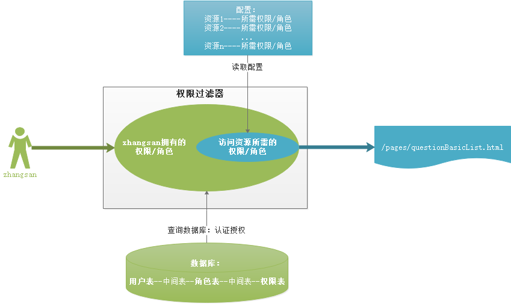

* 所谓权限控制是：用户可以访问哪些资源，这些信息需要进行配置。基于RBAC分析 是：
  * 资源可以被哪些角色访问
  * 资源可以被哪些权限访问
* 当服务器启动时：加载配置
* 当客户端请求时：使用过滤器拦截请求，然后判断当前用户的权限是否足够；如果不够，不放行

#### 权限控制实现步骤

1. 配置权限资源
   * 如果一个资源，需要有指定权限/角色才能访问，那么：要把资源和权限/角色的关系进行配置
   * 可以采用两种配置方式结合使用：
     * **xml配置：用于对一些资源文件(如：html文件)的权限进行配置**
     * 注解配置：用于对web层方法的权限进行配置
2. 加载配置
   * **当服务器启动时，要获取 资源所需的权限配置**
3. 拦截请求，判断：
   * **当前登录的用户拥有的权限，是否包含了  访问资源所需的权限**

### 小结

## 自定义权限框架-基于XML的

### 目标


只有当有对应角色的用户才能访问对应的资源(页面)

### 分析

#### 有权限访问的示例

* 资源`/pages/questionBasicList.html`，要求`ROLE_ADMIN`或者`ROLE_QUESTION_RECORDER`角色能访问
* 用户张三拥有角色`ROLE_QUESTION_RECORDER`
* 用户张三可以访问`/pages/questionBasicList.html`

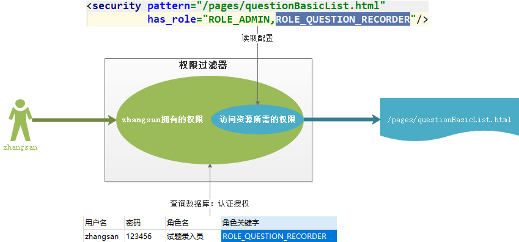

#### 无权限访问的示例

* 资源`/pages/questionClassicList.html`：要求`ROLE_ADMIN`角色可以访问
* 用户张三：没有有角色`ROLE_ADMIN`
* 所以：用户张三不能访问资源`/pages/questionClassicList.html`

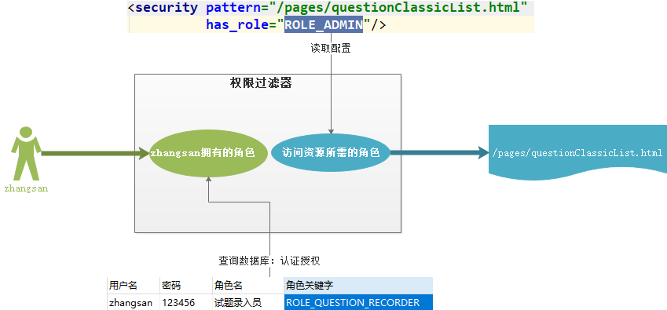

#### 实现步骤

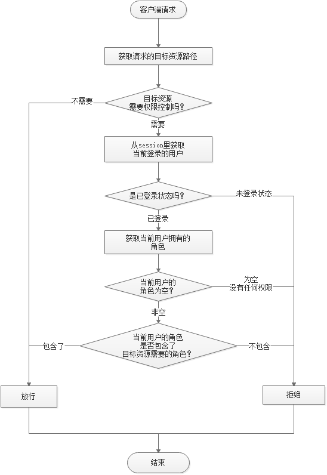

1. 创建配置文件`mm-security.xml`，配置资源所需要的权限（角色）
2. 创建权限过滤器`SecurityFilter`，拦截客户端的所有请求
   * 在过滤器的`init()`方法中，读取xml配置文件，得到资源所需要的权限（角色）
     * 为什么要在过滤器的init方法里，加载配置文件？
     * 因为过滤器是在服务器启动时就创建的，创建时会执行一次init方法
   * 在过滤器的`doFilter()`方法中，拦截客户端的请求，判断用户拥有的权限（角色），是否包含了访问资源需要的权限（角色）

### 实现

#### 创建配置文件`mm-security.xml`

* 文件名称：`mm-security.xml`
* 文件位置：放在resources目录下
* 文件说明：
  * beans：根标签
  * security标签：一个标签，配置一个资源所需要的角色
    * pattern：资源路径，这里配置的是html页面的路径
    * has_role：资源所需要的角色。多个角色之间，用逗号隔开
  * 表示：访问pattern资源，用户必须有has_role中定义的角色之一；否则无权限

```xml
<?xml version="1.0" encoding="UTF-8" ?>
<beans>
    <security pattern="/pages/index.html" has_role="ROLE_ADMIN,ROLE_QUESTION_RECORDER"/>
    <security pattern="/pages/questionBasicList.html" has_role="ROLE_ADMIN,ROLE_QUESTION_RECORDER"/>
    <security pattern="/pages/questionClassicList.html" has_role="ROLE_ADMIN"/>
    <security pattern="/pages/userList.html" has_role="ROLE_ADMIN"/>

    <!--注解扫描包。后边注解配置中会使用到，先配置上。配置web层的包名-->
    <scan package="com.itheima.mm.controller" />
</beans>
```

#### 创建过滤器`SecurityFilter`

##### 过滤器类

```java
/**
 * @author liuyp
 * @date 2020/03/06
 */
public class SecurityFilter implements Filter {
    private static Map<String, String> pathMap = new HashMap<>();

    @Override
    public void init(FilterConfig config) throws ServletException {
        InputStream is = null;
        try {
            //获取web.xml中的configLocation值： 配置文件路径
            String configLocation = config.getInitParameter("configLocation");

            //用dom4j读取配置文件
            is = this.getClass().getClassLoader().getResourceAsStream(configLocation);
            SAXReader reader = new SAXReader();
            Document document = reader.read(is);

            //查找配置文件中所有的security标签
            List<Element> securityNodes = document.selectNodes("//security");
            for (Element securityNode : securityNodes) {
                //获取security标签上的pattern属性值，has_role属性值
                String path = securityNode.attributeValue("pattern");
                String hasRole = securityNode.attributeValue("has_role");
				//保存到pathMap中
                pathMap.put(path, hasRole);
            }
        } catch (Exception e) {
            e.printStackTrace();
        } finally {
            if (is != null) {
                try {
                    is.close();
                } catch (IOException e) {
                    e.printStackTrace();
                }
            }
        }
    }

    @Override
    public void doFilter(ServletRequest req, ServletResponse resp, FilterChain chain) throws IOException, ServletException {
        HttpServletRequest request = (HttpServletRequest) req;
        HttpServletResponse response = (HttpServletResponse) resp;

        //获取用户请求的路径
        String uri = request.getRequestURI();
        String contextPath = request.getContextPath();
        String requestPath = uri.substring(contextPath.length());
        if (requestPath.endsWith(".do")) {
            requestPath = requestPath.replace(".do", "");
        }

        //如果请求的资源 不需要权限控制，直接放行
        String hasRoles = pathMap.get(requestPath);
        if (hasRoles == null) {
            System.out.println(requestPath + "：不需要权限控制，直接放行");
            chain.doFilter(request, response);
            return;
        }
        
		//如果用户未登录，跳转到登录页面（不登录，不能进行认证授权，不能权限控制）
        User user = (User) request.getSession().getAttribute("user");
        if (user == null) {
            System.out.println(requestPath + "：没有登录，跳转到登录页面...");
            response.sendRedirect(contextPath + "/login.html");
            return;
        }

        //如果用户本身没有任何权限，响应给客户端，并且不放行
        List<String> userAuthorityList = user.getAuthorityList();
        if (userAuthorityList == null || userAuthorityList.size() == 0) {
            System.out.println(requestPath + "：当前用户权限不足，请切换用户");
            response.getWriter().print("当前用户权限不足，请切换用户");
            return;
        }

        //判断：用户拥有的权限，是否包含 资源所需要的权限
        boolean canAccess = false;
        String[] roles = hasRoles.split(",");
        for (String role : roles) {
            if (userAuthorityList.contains(role)) {
                canAccess = true;
                break;
            }
        }

        //如果有权限，放行；如果无权限，响应给客户端，并且不放行
        if (canAccess) {
            System.out.println(requestPath + "：当前用户有权访问，放行请求");
            chain.doFilter(request, response);
        }else{
            System.out.println(requestPath + "：当前用户权限不足，请切换用户");
            response.getWriter().print("当前用户权限不足，请切换用户");
        }
    }

    @Override
    public void destroy() {
    }
}
```

##### 过滤器配置

* 将来自定义权限框架，是被封装成jar包的。
  * 用户使用这个框架要拦截哪些请求，由用户自己决定
  * 配置文件的位置，由用户自己决定
* 为了提高程序的可用性，解决硬编码问题，我们采用web.xml配置过滤器

```xml
<filter>
    <filter-name>securityFilter</filter-name>
    <filter-class>com.itheima.mm.filter.SecurityFilter</filter-class>
    <init-param>
        <param-name>configLocation</param-name>
        <param-value>mm-security.xml</param-value>
    </init-param>
</filter>
<filter-mapping>
    <filter-name>securityFilter</filter-name>
    <url-pattern>/*</url-pattern>
</filter-mapping>
```

### 小结

## 自定义权限框架-基于注解的

### 目标

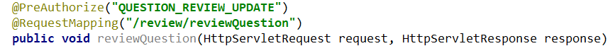

* 只有当用户拥有`QUESTION_REVIEW_UPDATE`权限时，才可以访问这个方法

### 分析

#### 有权访问示例

* 资源`/review/reviewQuestion`：需要有`QUESTION_REVIEW_UPDATE`权限才可以访问
* 用户admin：拥有权限`QUESTION_REVIEW_UPDATE`
* 所以：用户admin，可以访问资源`/review/reviewQuestion`

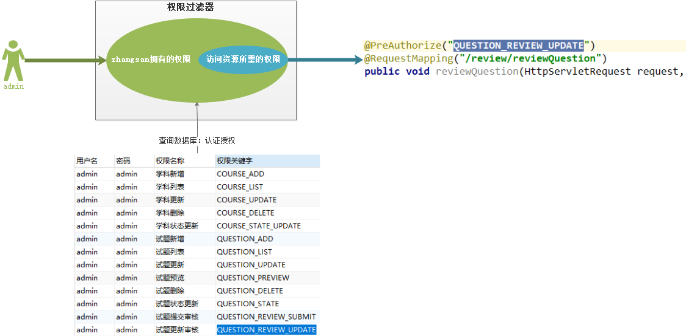

#### 无权访问示例

* 资源`/review/reviewQuestion`：需要有`QUESTION_REVIEW_UPDATE`权限才可以访问
* 用户zhangsan：拥有权限`QUESTION_REVIEW_UPDATE`
* 所以：用户zhangsan，不可以访问资源`/review/reviewQuestion`

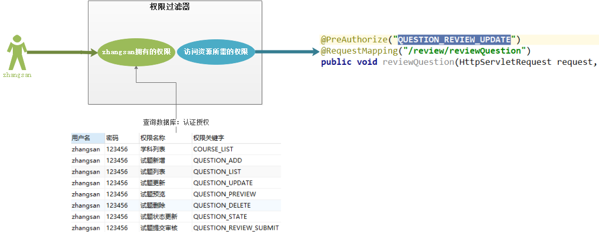

#### 实现步骤


1. 定义注解`@PreAuthorize`

2. 在web层需要权限控制的方法上，增加注解`@PreAuthorize("权限标识")`

   * 权限标识：来自于`t_permission`表中的`keyword`

   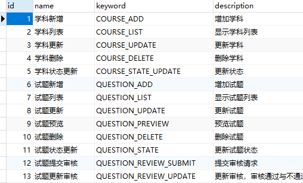

3. 在权限过滤器`SecurityFilter`的`init`方法里增加代码：
   * 扫描web包里的控制器中，方法上的`@PreAuthorize`注解
   * 以`@PreAuthorize`的值为key，以方法访问路径`@RequestMapping`的值为value，保存到map中

### 实现

#### 创建注解`@PreAuthorize`

```java
@Target(ElementType.METHOD)
@Retention(RetentionPolicy.RUNTIME)
public @interface PreAuthorize {
    String value();
}
```

#### 在控制器方法上增加注解配置权限

* 这里以 审核题目功能为例：`ReviewController`里的`reviewQuestion`方法

```java
	@PreAuthorize("QUESTION_REVIEW_UPDATE")
	@RequestMapping("/review/reviewQuestion")
    public void reviewQuestion(HttpServletRequest request, HttpServletResponse response) throws IOException {
        //......内容省略了.......重点看方法上增加的注解
    }
```

#### 在权限过滤器`SecurityFilter`中

* 在`init`方法里增加代码

```java
    @Override
    public void init(FilterConfig config) throws ServletException {
        InputStream is = null;
        try {
            String configLocation = config.getInitParameter("configLocation");

            is = this.getClass().getClassLoader().getResourceAsStream(configLocation);
            SAXReader reader = new SAXReader();
            Document document = reader.read(is);

            List<Element> securityNodes = document.selectNodes("//security");
            for (Element securityNode : securityNodes) {
                String path = securityNode.attributeValue("pattern");
                String hasRole = securityNode.attributeValue("has_role");

                pathMap.put(path, hasRole);
            }

            //====基于注解的配置部分---加载配置开始====
            //1. 获取mm-security.xml中，scan标签配置的扫描范围
            Element scanPackageElement = (Element) document.selectSingleNode("//scan");
            String pkg = scanPackageElement.attributeValue("package");
            
            //2. 扫描包里所有类
            List<Class<?>> classes = ClassScannerUtils.getClasssFromPackage(pkg);
            for (Class<?> clazz : classes) {
                boolean isController = clazz.isAnnotationPresent(Controller.class);
                if (isController) {
                    //获取控制器类里所有方法
                    Method[] methods = clazz.getMethods();
                    for (Method method : methods) {
                        boolean isAuthorizeMethod = method.isAnnotationPresent(PreAuthorize.class);
                        if (isAuthorizeMethod) {
                            //获取方法上配置的@PreAuthorize
                            PreAuthorize preAuthorize = method.getAnnotation(PreAuthorize.class);
                            String authorize = preAuthorize.value();
							
                            //获取方法上配置的@RequestMapping
                            RequestMapping mapping = method.getAnnotation(RequestMapping.class);
                            String mappingPath = mapping.value();

                            //把注解值，保存到pathMap里
                            pathMap.put(mappingPath, authorize);
                        }
                    }
                }
            }
            //====基于注解的配置部分---加载配置结束====
        } catch (Exception e) {
            e.printStackTrace();
        } finally {
            if (is != null) {
                try {
                    is.close();
                } catch (IOException e) {
                    e.printStackTrace();
                }
            }
        }
    }
```

#### `pages/questionPreview.html`

* 其中审核功能，发现请求之后，得到响应结果
  * 如果有权限，服务端返回json对象，可以判断是否成功。如果不成功，弹窗`response.data.message`
  * 如果没有权限，过滤器拦截后，直接返回字符串“无权限访问”，没有返回json对象
* 所以要对`reviewItem`审核方法加以修改：

```js
reviewItem(status) {
    let t = this;

    // 必传参数
    let params = {
        //questionId: this.questionId,
        //这里写成了固定值： 要审核的题目的id
        questionId: 663,
        status: status,
        comments: ''
    };
    axios.post("../review/reviewQuestion.do", params)
        .then(response=>{
        if (response.data.flag) {
            this.$message.success("审核通过");
            setTimeout(function(){
                window.location.href = "questionClassicList.html";
            }, 1000)
        }else if(response.data.message){
            this.$message.error(response.data.message);
        }else{
            this.$message.error(response.data);
        }
    });
}
```

### 小结

## 附：黑马面面帐号说明

* 黑马面面的数据库里，有两个帐号`admin`和`zhangsan`
* `admin`：是管理员，拥有一切权限

```mysql
# admin拥有的角色，及角色关联的权限
SELECT
	u.username '用户名',
	u.PASSWORD '密码',
	r.name '角色名',
	r.keyword '角色关键字',
	p.NAME '权限名称',
	p.keyword '权限关键字'
FROM
	t_user u
	LEFT JOIN tr_user_role ur ON u.id = ur.user_id
	LEFT JOIN t_role r ON ur.role_id = r.id 
	left join tr_role_permission rp on r.id = rp.role_id
	left join t_permission p on p.id = rp.permission_id
WHERE
	u.username = 'admin'
```

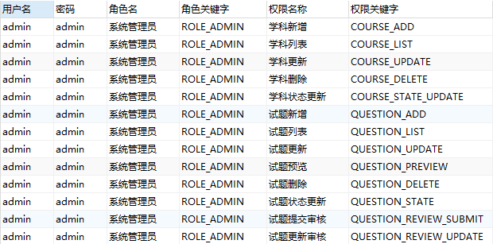

* `zhangsan`：是普通用户，拥有的角色、及角色关联的权限如下

```mysql
# admin拥有的权限
SELECT
	u.username '用户名',
	u.PASSWORD '密码',
	r.name '角色名',
	r.keyword '角色关键字',
	p.NAME '权限名称',
	p.keyword '权限关键字'
FROM
	t_user u
	LEFT JOIN tr_user_role ur ON u.id = ur.user_id
	LEFT JOIN t_role r ON ur.role_id = r.id 
	left join tr_role_permission rp on r.id = rp.role_id
	left join t_permission p on p.id = rp.permission_id
WHERE
	u.username = 'zhangsan'
```

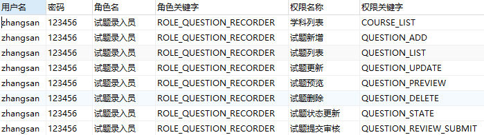