# 	黑马面面-第五天

## 小程序基础

### 目标

* 了解什么是微信小程序
* 小程序开发的准备工作
* 安装微信开发者工具
* 第一个小程序体验

### 讲解


#### 什么是微信小程序

* 微信小程序，简称小程序，英文名Mini Program
* 是一种不需要下载安装即可使用的应用，它实现了应用“触手可及”的梦想，用户扫一扫或搜一下即可打开应用。 

* 小程序开发，需要经过：申请小程序开发者帐号->安装微信开发者工具->配置项目等等过程方可完成。
* 开发者文档 https://developers.weixin.qq.com/miniprogram/dev/framework/quickstart/ 

#### 申请小程序帐号(得到AppID)

##### 说明

* 开发小程序的第一步，需要拥有一个小程序 AppID（开发者ID），相当于开发者在小程序平台的身份证。
* 后续的所有小程序开发流程会基于这个 AppID 来完成。
* 小程序的注册非常简单，只需几个操作。

##### 步骤

###### 1. 打开注册页面

* 使用浏览器打开 <https://mp.weixin.qq.com/>，点击“立即注册”

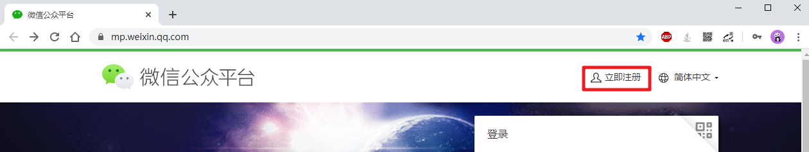

###### 2. 选择注册的类型

* 选择“小程序”

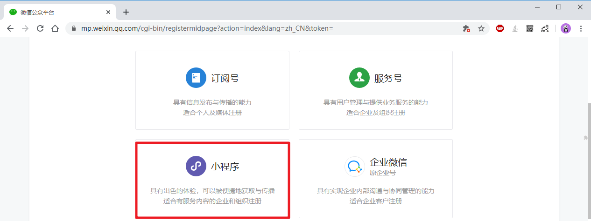

###### 3. 注册并激活帐号

* 输入信息，点击“注册”。
* 注意：**注册后，请登录自己邮件，激活帐号**

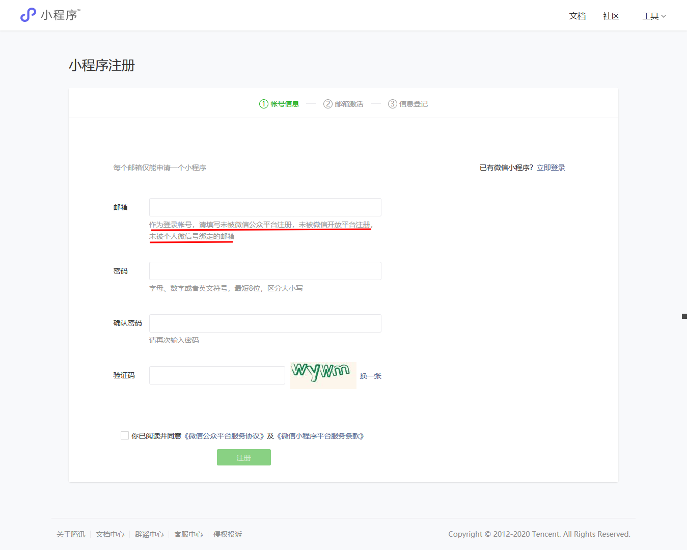

###### 4. 登记个人信息

* 激活帐号后，要登记个人信息，并且**要扫码绑定一个微信号**作为管理员。
* 最后点击“确定”，“前往小程序”

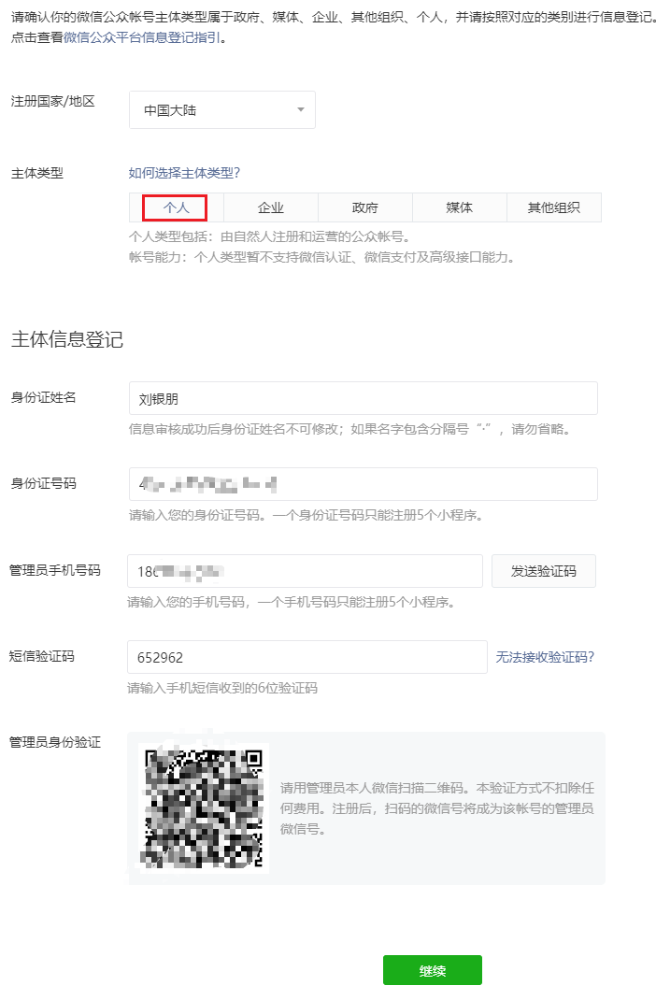

* 登记之后，会显示小程序的后台管理首页

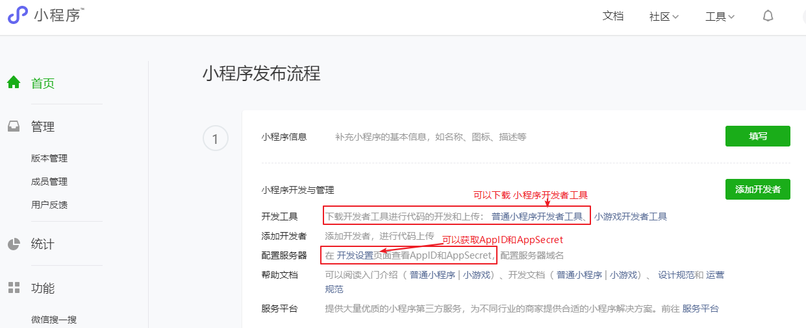

###### 5. 查看AppID和AppSecret

1. 在左侧点击“开发”，然后“开发设置”，点击“生成”

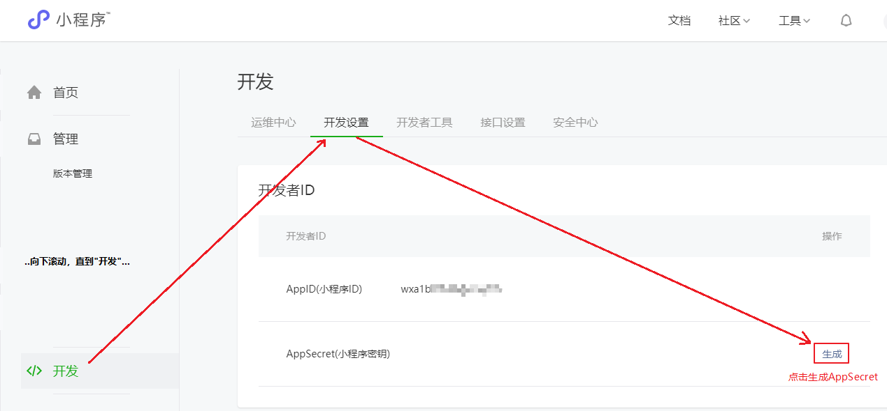

2. 用刚刚绑定的微信号，扫码确认后，会弹出窗口，显示AppSecret。把你的AppID和AppSecret记录下来

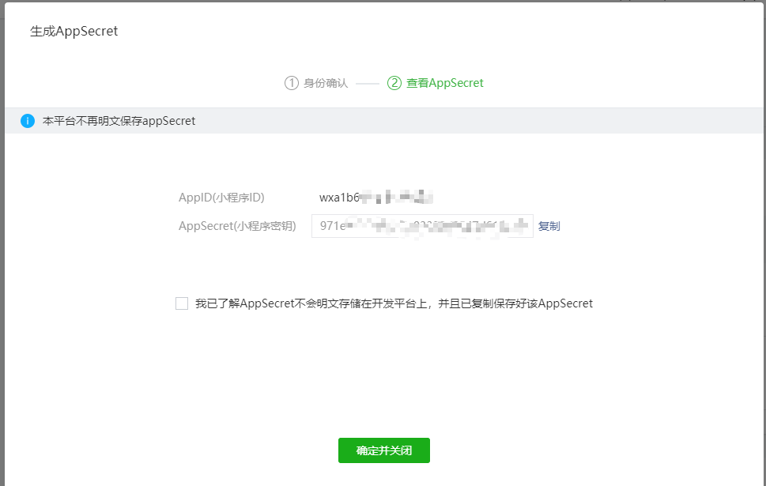

###### 6. 如果忘记了AppSecret怎么办？

* 打开https://mp.weixin.qq.com/，登录刚刚注册的小程序帐号
* 找到左侧菜单“开发”，点击“开发设置”，点击“重置”


#### 安装微信开发者工具

* 下载链接： <https://mp.weixin.qq.com/debug/wxadoc/dev/devtools/download.html> 
* 根据自己的操作系统下载对应的安装包进行安装。 注意:
  * 小程序开发工具在 Windows上仅支持 Windows 7 及以上版
  * 在 Mac 上支持 OS X 10.8 及以上版本。
* Windows 上，双击下载完成的安装文件，根据提示点击下一步，即可完成安装。
* 安装成功后，可以在桌面或者开始菜单中找到小程序开发工具的快捷方式，打开即可

#### 第一个小程序体验

##### 1. 启动微信开发者者工具，扫码登录

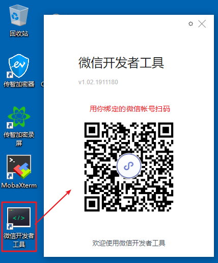

##### 2. 新建小程序

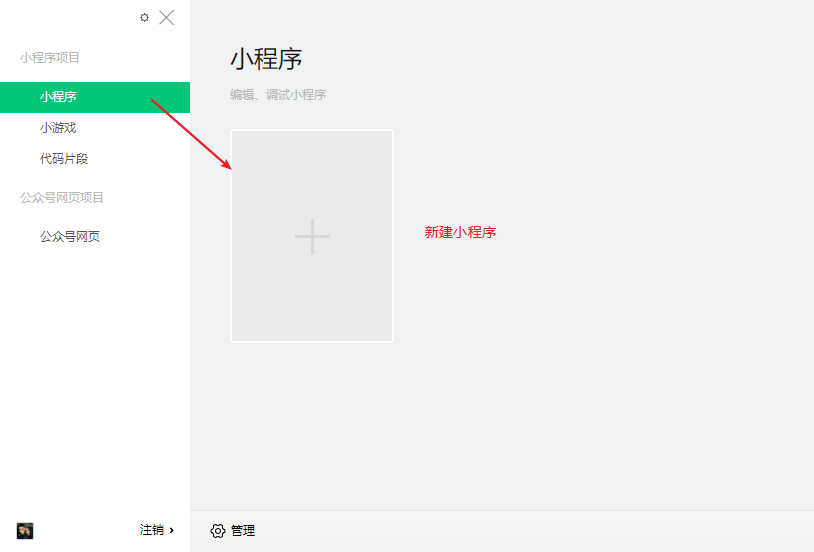

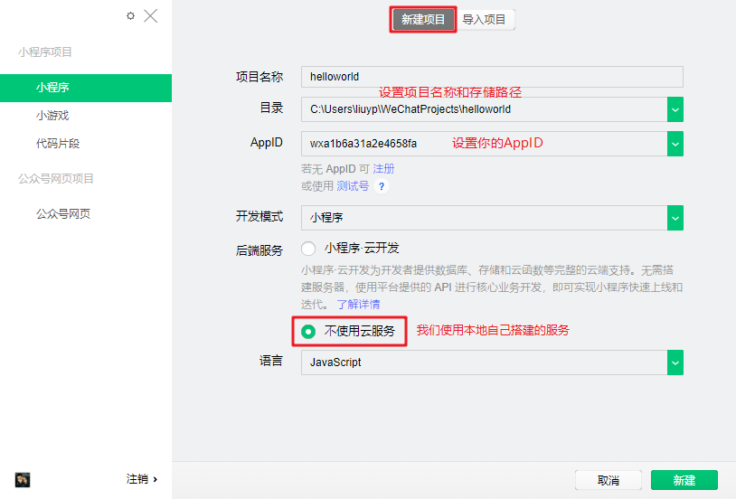

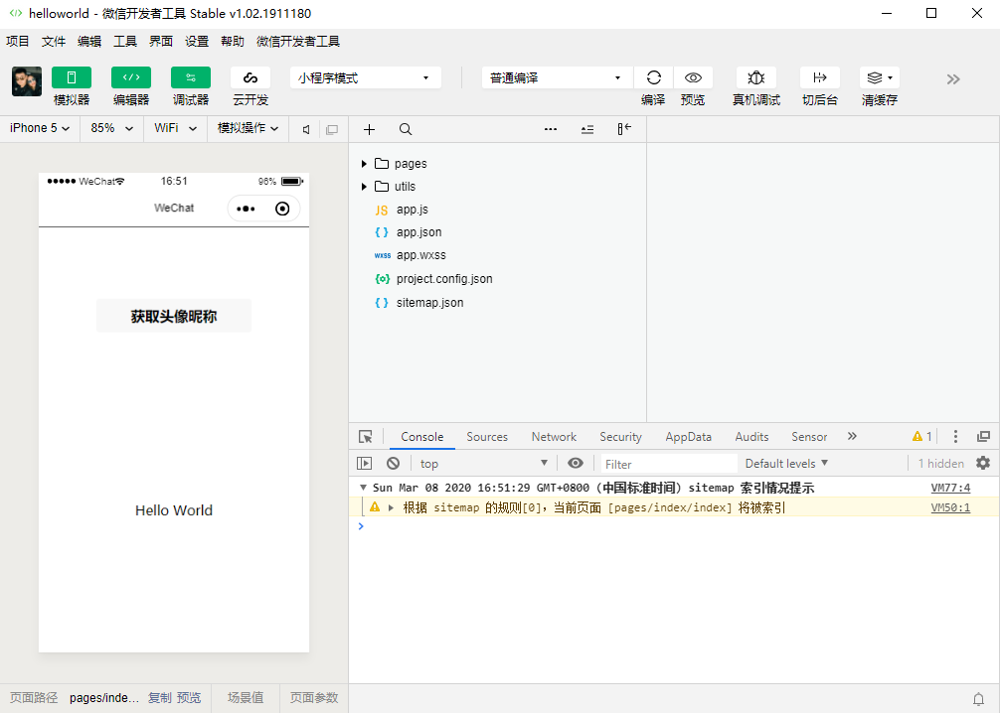

##### 3. 预览小程序效果

###### 可以在微信开发者工具里预览

* 左边窗口，是预览效果

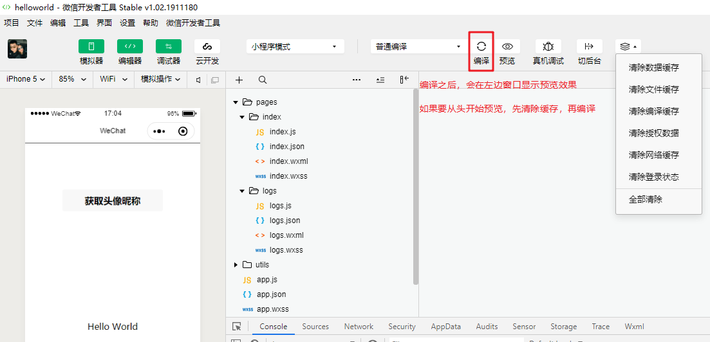

###### 可以在手机微信上预览

* 自己预览

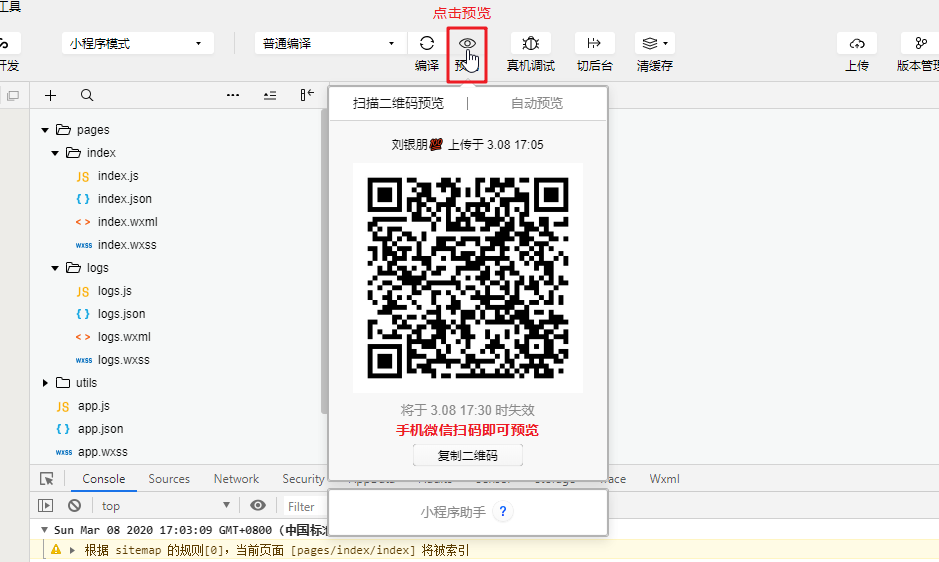

* 如果想要其它微信号预览，就打开  <https://mp.weixin.qq.com/>，登录之后，在成员管理里添加项目成员，最多添加15人

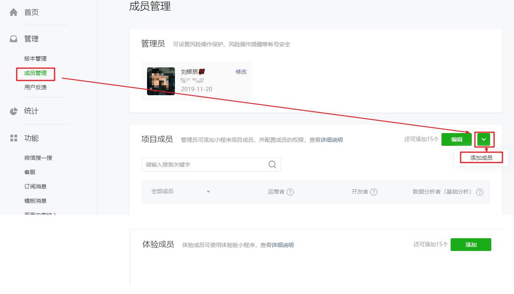

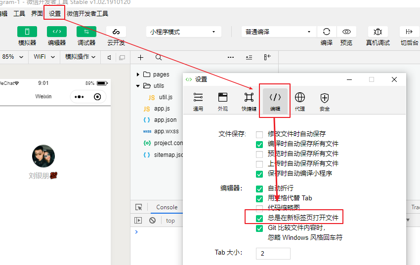

### 小结


## 小程序介绍

### 目标

* 了解微信小程序代码结构

### 讲解

一个小程序包含：

* 描述整体程序的`app`
* 描述每个页面的`page`

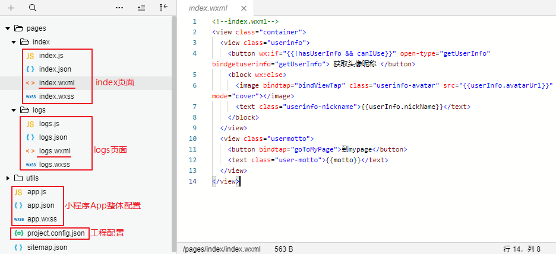

* 一个小程序主体部分由三个文件组成，必须放在项目的根目录，如下：

| 文件     | 必需 | 作用             |
| -------- | :--- | :--------------- |
| app.js   | 是   | 小程序逻辑       |
| app.json | 是   | 小程序公共配置   |
| app.wxss | 否   | 小程序公共样式表 |

* 一个小程序页面由四个文件组成，分别是：

| 文件类型 | 必需 | 作用                  |
| -------- | :--- | :-------------------- |
| js       | 是   | 页面逻辑              |
| wxml     | 是   | 页面结构，相当于html  |
| json     | 否   | 页面配置              |
| wxss     | 否   | 页面样式表，相当于css |

* **注意：为了方便开发者减少配置项，描述页面的四个文件必须具有相同的路径与文件名。**

#### 小程序的全局配置

##### `app.json`

​		当前小程序的整体配置，包括了小程序的所有页面路径、界面表现、网络超时时间、底部 tab 等。第一个程序的app.json配置如图所示：

```json
{
  "pages": [
    "pages/index/index",
    "pages/logs/logs"
  ],
  "window": {
    "backgroundTextStyle": "light",
    "navigationBarBackgroundColor": "#fff",
    "navigationBarTitleText": "WeChat",
    "navigationBarTextStyle": "black"
  },
  "style": "v2",
  "sitemapLocation": "sitemap.json"
}
```

* `pages`：
  * 用于描述当前小程序所有页面路径，这是为了让微信客户端知道当前你的小程序页面定义在哪个目录。
  * 第一个值，是小程序的默认页面
* `window`：
  * 定义小程序所有页面的顶部背景颜色，文字颜色定义等。

##### `project.config.json`

​		是当前小程序的项目配置，在每个项目的根目录都会生自动成一个 `project.config.json`，你在开发工具上做的任何配置都会写入到这个文件。

​		当你重新安装工具或者换电脑工作时，你只要载入同一个项目的代码包，开发者工具就自动会帮你恢复到当时你开发项目时的个性化配置，其中会包括编辑器的颜色、代码上传时自动压缩等等一系列选项。

​		一般无需开发者修改。

##### `app.wxss`

小程序的全局样式，每个页面都会自动继承全局样式。

##### `app.js`

​		小程序的全局逻辑，其中定义了`App`对象，每个小程序都必须有唯一的`App`对象

​		`App`对象封装了小程序的事件处理、全局数据、全局方法。小程序里每个页面都可以获取到这个`App`对象，调用其中的方法、操作其中的数据

```js
//App: 小程序对象。一个小程序只有一个App对象
//     在小程序里任何页面中，都可以获取到这个App对象，并调用App对象里的方法、操作App对象里的数据
App({
  onLaunch: function () {
    
  },
  globalData: {
    userInfo: null
  }
})
```

#### 小程序的页面

小程序里一个页面包含以下四项：

| 文件类型 | 职责                                           |
| -------- | ---------------------------------------------- |
| wxml     | 相当于html，用于编写本页面上要显示的内容       |
| wxss     | 相当于css，用于修饰本页面的样式                |
| js       | 本页面的逻辑处理，用于和用户交互，实现动态效果 |
| json     | 本页面的窗口配置[类似于布局]                   |

##### WXML模板

*  `WXML` 充当的就是类似 `HTML` 的角色，也有标签和属性。
* 更详细的文档可以参考 [WXML](https://developers.weixin.qq.com/miniprogram/dev/framework/view/wxml/)

```html
<text>text标签，类似于span</text>
<text>text标签，类似于span</text>
<view>view标签，类似于div，独占一行</view>
<view>view标签，类似于div，独占一行</view>
<button>按钮</button>
```

##### WXSS样式

* `WXSS` 具有 `CSS` 大部分的特性，小程序在 `WXSS` 也做了一些扩充和修改。但是 `WXSS` 仅支持部分 `CSS` 选择器
* 更详细的文档可以参考 [WXSS](https://developers.weixin.qq.com/miniprogram/dev/framework/view/wxss.html) 

```css
/* pages/mypage/mypage.wxss */
text{
    /*text标签的样式*/
	color: brown;
}
.c1{
    /*类名为c1的样式*/
    font-size: 25px;
}
#v1{
    /*id为v1的样式*/
    font-family: 'Courier New', Courier, monospace;
    color: blue;
}
```

##### js逻辑

* 一个服务仅仅只有界面展示是不够的，还需要和用户做交互：响应用户的点击、获取用户的位置等等。

* 在小程序里边，我们就通过编写 `JS` 脚本文件来处理用户的操作。

* 比如：

  * 有一个按钮，点击时要把显示的内容显示成“Hello World”
  * 给按钮用`bindtap`绑定事件：触摸按钮后离开，调用函数`clickMe`

  ```html
          <view>{{ message }}</view>
  <button bindtap="changeMessage">点击我</button>
  ```

  * 在js文件里声明函数

  ```js
  Page({
    data: {
        message:"hello"
    },
    changeMessage:function(){
      this.setData({
        message:"你好"
      });
    }
  })
  ```

* 在 JS 中调用小程序提供的丰富的 API，利用这些 API 可以很方便的调起微信提供的能力，例如获取用户信息、本地存储、微信支付等。

* 更详细的事件可以参考文档 [WXML - 事件](https://developers.weixin.qq.com/miniprogram/dev/framework/view/wxml/event.html) 。

* 更多 API 可以参考文档 [小程序的API](https://developers.weixin.qq.com/miniprogram/dev/framework/app-service/api.html) 。

##### json配置

​		每一个小程序页面也可以使用 `.json` 文件来对本页面的窗口表现进行配置。页面中配置项在当前页面会覆盖 `app.json` 的 `window` 中相同的配置项。文件内容为一个 JSON 对象，有以下属性：

| 属性                                                         | 类型     | 默认值   | 描述                                                         | 最低版本                                                     |
| :----------------------------------------------------------- | :------- | :------- | :----------------------------------------------------------- | ------------------------------------------------------------ |
| navigationBarBackgroundColor                                 | HexColor | #000000  | 导航栏背景颜色，如 `#000000`                                 |                                                              |
| navigationBarTextStyle                                       | string   | white    | 导航栏标题颜色，仅支持 `black` / `white`                     |                                                              |
| navigationBarTitleText                                       | string   |          | 导航栏标题文字内容                                           |                                                              |
| navigationStyle                                              | string   | default  | 导航栏样式，仅支持以下值： `default` 默认样式 `custom` 自定义导航栏，只保留右上角胶囊按钮 | 微信客户端 7.0.0                                             |
| backgroundColor                                              | HexColor | #ffffff  | 窗口的背景色                                                 |                                                              |
| backgroundTextStyle                                          | string   | dark     | 下拉 loading 的样式，仅支持 `dark` / `light`                 |                                                              |
| backgroundColorTop                                           | string   | #ffffff  | 顶部窗口的背景色，仅 iOS 支持                                | 微信客户端 6.5.16                                            |
| backgroundColorBottom                                        | string   | #ffffff  | 底部窗口的背景色，仅 iOS 支持                                | 微信客户端 6.5.16                                            |
| enablePullDownRefresh                                        | boolean  | false    | 是否开启当前页面下拉刷新。 详见 [Page.onPullDownRefresh](https://developers.weixin.qq.com/miniprogram/dev/reference/api/Page.html#onpulldownrefresh) |                                                              |
| onReachBottomDistance                                        | number   | 50       | 页面上拉触底事件触发时距页面底部距离，单位为px。 详见 [Page.onReachBottom](https://developers.weixin.qq.com/miniprogram/dev/reference/api/Page.html#onreachbottom) |                                                              |
| pageOrientation                                              | string   | portrait | 屏幕旋转设置，支持 `auto` / `portrait` / `landscape` 详见 [响应显示区域变化](https://developers.weixin.qq.com/miniprogram/dev/framework/view/resizable.html) | [2.4.0](https://developers.weixin.qq.com/miniprogram/dev/framework/compatibility.html) (auto) / [2.5.0](https://developers.weixin.qq.com/miniprogram/dev/framework/compatibility.html) (landscape) |
| disableScroll                                                | boolean  | false    | 设置为 `true` 则页面整体不能上下滚动。 只在页面配置中有效，无法在 `app.json` 中设置 |                                                              |
| usingComponents                                              | Object   | 否       | 页面[自定义组件](https://developers.weixin.qq.com/miniprogram/dev/framework/custom-component/)配置 | [1.6.3](https://developers.weixin.qq.com/miniprogram/dev/framework/compatibility.html) |
| initialRenderingCache                                        | string   |          | 页面[初始渲染缓存](https://developers.weixin.qq.com/miniprogram/dev/framework/view/initial-rendering-cache.html)配置 | [2.11.1](https://developers.weixin.qq.com/miniprogram/dev/framework/compatibility.html) |
| style                                                        | string   | default  | 启用新版的组件样式                                           | [2.10.2](https://developers.weixin.qq.com/miniprogram/dev/framework/compatibility.html) |
| [singlePage](https://developers.weixin.qq.com/miniprogram/dev/reference/configuration/page.html#singlePage) | Object   | 否       | 单页模式相关配置                                             | [2.12.0](https://developers.weixin.qq.com/miniprogram/dev/framework/compatibility.html) |

>  页面配置中只能设置 `app.json` 中 `window` 对应的配置项，以决定本页面的窗口表现，所以无需写 `window` 这个属性

#### 运行环境

* 小程序的运行环境分成渲染层和逻辑层，其中：
  *  WXML 模板和 WXSS 样式工作在渲染层，
  *  JS 脚本工作在逻辑层。
* 小程序的渲染层和逻辑层分别由2个线程管理：
  * 渲染层的界面使用了WebView 进行渲染；
  * 逻辑层采用JsCore线程运行JS脚本。
* 一个小程序存在多个界面，所以渲染层存在多个WebView线程，这两个线程的通信会经由微信客户端（下文中也会采用Native来代指微信客户端）做中转，逻辑层发送网络请求也经由Native转发，小程序的通信模型下图所示:


##### 程序与页面

* 微信客户端在打开小程序之前，会把整个小程序的代码包下载到本地。
* 紧接着通过 `app.json` 的 `pages` 字段就可以知道你当前小程序的所有页面路径。
  * 其中`pages` 中的第一个页面就是这个小程序的首页（打开小程序看到的第一个页面）。
* 于是微信客户端就把首页的代码装载进来，通过小程序底层的一些机制，就可以渲染出这个首页。
* 小程序启动之后，在 `app.js` 定义的 `App` 实例的 `onLaunch` 回调会被执行:

```javascript
App({
  onLaunch: function () {
    // 小程序启动之后 触发
  }
})
```

* 整个小程序只有一个 App 实例，是全部页面共享的。

##### 小程序组件

* 小程序提供了丰富的基础组件给开发者，开发者可以像搭积木一样，组合各种组件拼合成自己的小程序。
* 只需要在 `WXML` 写上对应的组件标签名字就可以把该组件显示在界面上，例如，你需要在界面上显示地图，你只需要这样写即可：

```html
<map longitude="113.324520" latitude="23.099994" scale="14" show-location></map>
```

* 可以通过属性传递值给组件，让组件可以以不同的状态去展现，也会通过事件的形式让开发者可以感知，也可以通过 `style` 或者 `class` 来控制组件的外层样式，以便适应你的界面宽度高度等等。

##### 小程序API

* 为了让开发者可以很方便的调起微信提供的能力，例如获取用户信息、微信支付等等，小程序提供了很多 API 给开发者去使用。
* 例如，要获取用户的地理位置时，只需要：

```javascript
//
wx.getLocation({
  type: 'wgs84',
  success: (res) => {
    var latitude = res.latitude // 纬度
    var longitude = res.longitude // 经度
  }
})

//----还需要在app.json中开启定位授权。desc：当获取定位时，在弹出授权框上显示的内容
"permission": {
    "scope.userLocation": {
        "desc": "你的位置信息将用于小程序位置接口的效果展示" 
    }
}
```

* 例如，调用微信扫一扫能力，只需要：

```javascript
wx.scanCode({
  success: (res) => {
    console.log(res)
  }
})
```

* 多数 API 的回调都是异步，你需要处理好代码逻辑的异步问题。
* 更多的 API 能力见 [小程序的API](https://developers.weixin.qq.com/miniprogram/dev/framework/app-service/api.html)。

### 小结


## 面面小程序介绍与初始化

### 目标

* 初始化面面微信小程序
* 构建微信小程序 API模块

### 讲解

#### 初始化面面小程序【操作的，要掌握】

* 面面小程序的开发是在已经构建好的小程序前端工程基础上来完成，无需后端工程师去构建复杂的小程序前端页面。
* 把《资料/前端代码/project-mp-mianshi_小程序代码.zip》解压缩到本地工程目录，当前给的代码是基于模拟API完成了所有业务路径的调用，故小程序被导入微信小程序工具后是完成开业独立运行的，所有的API调用都是调用的模拟API。

##### 1. 导入小程序项目

###### 解压小程序压缩包

* 解压到不含中文、空格、特殊字符的目录，比如：我的解压到了`C:\programs\wechatProjects`目录下

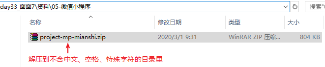

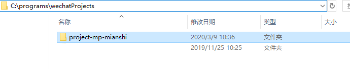

###### 把小程序导入开发者工具

* 说明：
  * 如果要预览效果，导入《project-mp-mianshi-预览效果的.zip》
  * 我们自己开发使用，导入《project-mp-mianshi-我们开发用的.rar》

* 打开微信开发者工具，点击+号

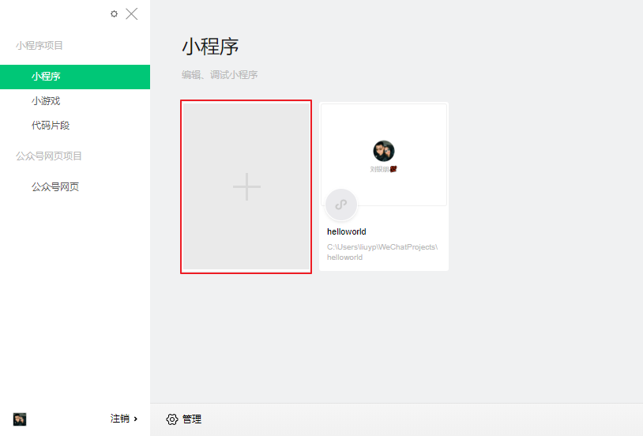

* 选择“导入项目”，选中解压目录，输入自己的AppID

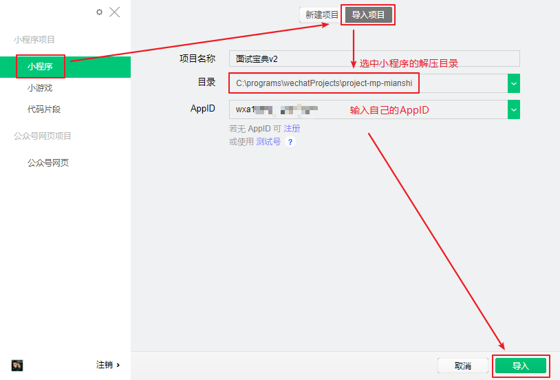

##### 2. 设置项目

###### 设置服务端地址

* 打开`utils/config.js`，设置使用第二个`urlBase`的地址值
* 这个地址，可以供我们预览查看面面小程序的效果
* 在开发过程中，要把这个地址改成  你自己Tomcat部署的地址

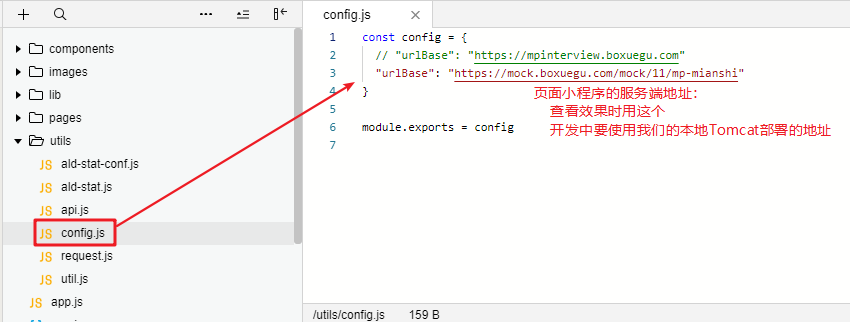

###### 本地检查项设置

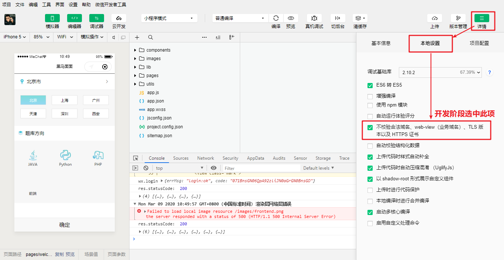

###### 缓存设置

* 缓存不是必须的，一般第1次登录或保存过数据后，后续根据情况可以清除缓存，便于调试。可以如图操作：

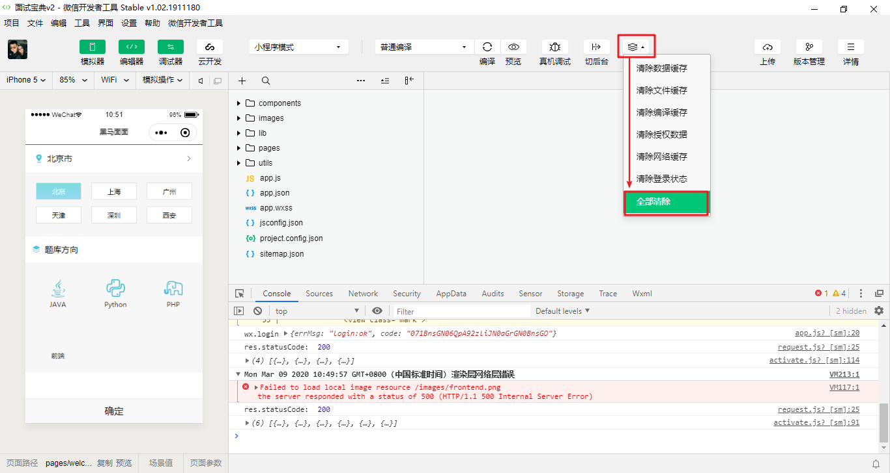

###### 编译运行

* 由于原型已集成了GPS定位，刚才清除全部状态后，点击“编译”，会如图提示授权定位（下次不再提示）：

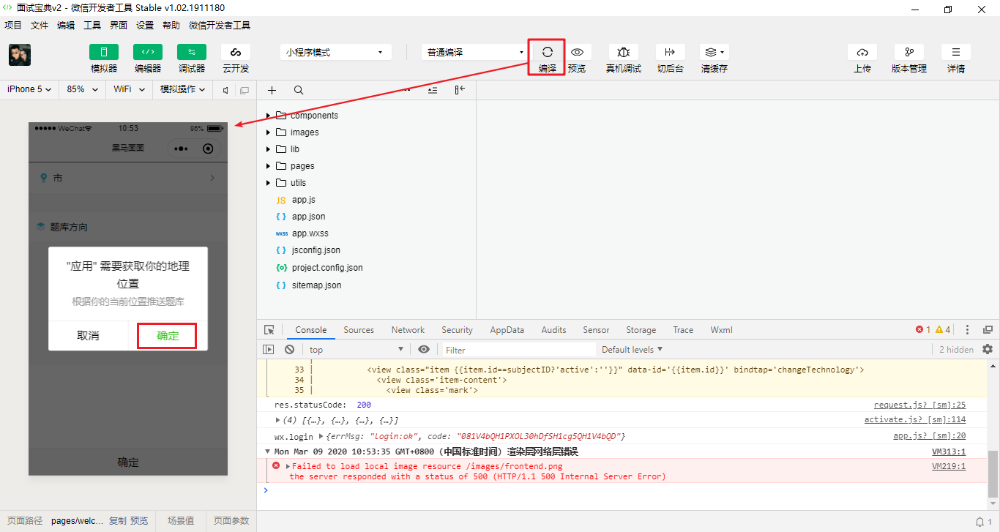

* 点击“确定”后，如图所示：

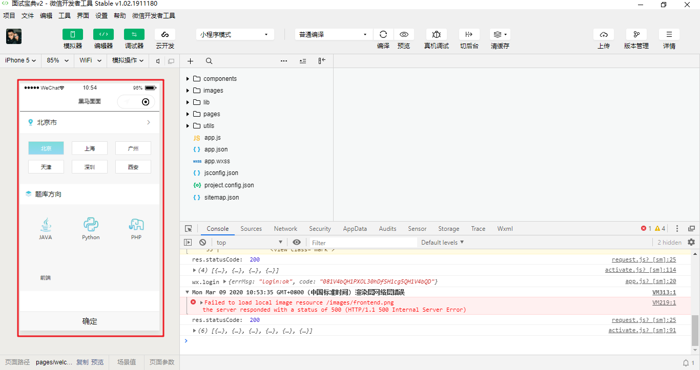

* 在上图中选择地区、选择学科，然后点击“确定”。会弹出 微信登录授权提示，允许后进入主页

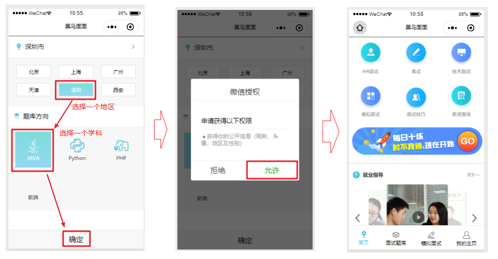

#### 构建小程序的服务端

##### 步骤

1. 在idea里创建Maven的web工程
2. 在pom.xml里添加坐标
3. 拷贝实体类、常量
4. 拷贝配置文件
5. 配置web.xml

##### 实现

###### 1. 在idea里创建Maven的web工程

* 创建Maven的web工程，设置坐标
* 补全目录：`java`和`resources`

###### 2. 在pom.xml里添加坐标

```xml
<?xml version="1.0" encoding="UTF-8"?>

<project xmlns="http://maven.apache.org/POM/4.0.0" xmlns:xsi="http://www.w3.org/2001/XMLSchema-instance"
         xsi:schemaLocation="http://maven.apache.org/POM/4.0.0 http://maven.apache.org/xsd/maven-4.0.0.xsd">
    <modelVersion>4.0.0</modelVersion>

    <groupId>com.itheima</groupId>
    <artifactId>mm_wx_api</artifactId>
    <version>1.0-SNAPSHOT</version>
    <packaging>war</packaging>

    <properties>
        <project.build.sourceEncoding>UTF-8</project.build.sourceEncoding>
        <maven.compiler.source>1.8</maven.compiler.source>
        <maven.compiler.target>1.8</maven.compiler.target>
        <junit.version>4.12</junit.version>
        <javax.servlet-api.version>3.1.0</javax.servlet-api.version>
        <fastjson.version>1.2.47</fastjson.version>
        <mysql-connector-java.version>5.1.38</mysql-connector-java.version>
        <mybatis.version>3.4.5</mybatis.version>
        <log4j.version>1.2.17</log4j.version>
        <slf4j-api.version>1.7.25</slf4j-api.version>
        <commons-fileupload.version>1.3.1</commons-fileupload.version>
        <commons-io.version>2.6</commons-io.version>
        <lombok.version>1.18.8</lombok.version>
        <tomcat7-maven-plugin.version>2.2</tomcat7-maven-plugin.version>
        <dom4j.version>1.6.1</dom4j.version>
        <jaxen.version>1.2.0</jaxen.version>
        <druid.version>1.1.10</druid.version>
        <okhttp.version>3.1.0</okhttp.version>
        <okio.version>1.4.0</okio.version>
        <bcprov-jdk16.version>1.45</bcprov-jdk16.version>
        <jedis.version>2.7.0</jedis.version>
        <jackson.version>2.3.3</jackson.version>
    </properties>
    <dependencies>
        <!--自定义MVC-->
        <dependency>
            <groupId>com.itheima</groupId>
            <artifactId>mm_mvc</artifactId>
            <version>1.0-SNAPSHOT</version>
        </dependency>
        <!--单元测试-->
        <dependency>
            <groupId>junit</groupId>
            <artifactId>junit</artifactId>
            <version>${junit.version}</version>
        </dependency>
        <!--Servlet-->
        <dependency>
            <groupId>javax.servlet</groupId>
            <artifactId>javax.servlet-api</artifactId>
            <version>${javax.servlet-api.version}</version>
            <scope>provided</scope>
        </dependency>

        <dependency>
            <groupId>com.alibaba</groupId>
            <artifactId>fastjson</artifactId>
            <version>${fastjson.version}</version>
        </dependency>
        <!--jackson-->
        <dependency>
            <groupId>com.fasterxml.jackson.core</groupId>
            <artifactId>jackson-databind</artifactId>
            <version>${jackson.version}</version>
        </dependency>
        <dependency>
            <groupId>com.fasterxml.jackson.core</groupId>
            <artifactId>jackson-core</artifactId>
            <version>${jackson.version}</version>
        </dependency>
        <dependency>
            <groupId>com.fasterxml.jackson.core</groupId>
            <artifactId>jackson-annotations</artifactId>
            <version>${jackson.version}</version>
        </dependency>
        <!--mysql驱动-->
        <dependency>
            <groupId>mysql</groupId>
            <artifactId>mysql-connector-java</artifactId>
            <version>${mysql-connector-java.version}</version>
        </dependency>
        <!--mybatis-->
        <dependency>
            <groupId>org.mybatis</groupId>
            <artifactId>mybatis</artifactId>
            <version>${mybatis.version}</version>
        </dependency>
        <!--beanutils-->
        <dependency>
            <groupId>commons-beanutils</groupId>
            <artifactId>commons-beanutils</artifactId>
            <version>1.9.3</version>
        </dependency>
        <!--文件上传-->
        <dependency>
            <groupId>commons-fileupload</groupId>
            <artifactId>commons-fileupload</artifactId>
            <version>${commons-fileupload.version}</version>
        </dependency>
        <!--IO-->
        <dependency>
            <groupId>commons-io</groupId>
            <artifactId>commons-io</artifactId>
            <version>${commons-io.version}</version>
        </dependency>
        <!--dom4j-->
        <dependency>
            <groupId>dom4j</groupId>
            <artifactId>dom4j</artifactId>
            <version>${dom4j.version}</version>
        </dependency>
        <dependency>
            <groupId>jaxen</groupId>
            <artifactId>jaxen</artifactId>
            <version>${jaxen.version}</version>
        </dependency>
        <!--日志-->
        <dependency>
            <groupId>log4j</groupId>
            <artifactId>log4j</artifactId>
            <version>${log4j.version}</version>
        </dependency>
        <dependency>
            <groupId>org.slf4j</groupId>
            <artifactId>slf4j-api</artifactId>
            <version>${slf4j-api.version}</version>
        </dependency>
        <dependency>
            <groupId>org.slf4j</groupId>
            <artifactId>slf4j-log4j12</artifactId>
            <version>${slf4j-api.version}</version>
        </dependency>
        <!--lombok-->
        <dependency>
            <groupId>org.projectlombok</groupId>
            <artifactId>lombok</artifactId>
            <version>${lombok.version}</version>
        </dependency>
        <!--连接池-->
        <dependency>
            <groupId>com.alibaba</groupId>
            <artifactId>druid</artifactId>
            <version>${druid.version}</version>
        </dependency>
        <!--okhttp-->
        <dependency>
            <groupId>com.squareup.okhttp3</groupId>
            <artifactId>okhttp</artifactId>
            <version>${okhttp.version}</version>
        </dependency>
        <dependency>
            <groupId>com.squareup.okio</groupId>
            <artifactId>okio</artifactId>
            <version>${okio.version}</version>
        </dependency>
        <dependency>
            <groupId>org.bouncycastle</groupId>
            <artifactId>bcprov-jdk16</artifactId>
            <version>${bcprov-jdk16.version}</version>
        </dependency>
        <!--jedis-->
        <dependency>
            <groupId>redis.clients</groupId>
            <artifactId>jedis</artifactId>
            <version>${jedis.version}</version>
        </dependency>
    </dependencies>

    <build>
        <resources>
            <resource>
                <directory>src/main/java</directory>
                <includes>
                    <include>**/*.xml</include>
                    <include>**/*.properties</include>
                </includes>
                <filtering>false</filtering>
            </resource>
            <resource>
                <directory>src/main/resources</directory>
                <includes>
                    <include>**/*.xml</include>
                    <include>**/*.properties</include>
                </includes>
                <filtering>false</filtering>
            </resource>
        </resources>
    </build>
</project>
```

###### 3. 拷贝实体类和常量

* 在`java`里创建package：`com.itheima.mm`
* 把《资料\06-初始化工程\01-代码(实体类, 常量等)》，拷贝放到`com.itheima.mm`中
* 在`com.itheima.mm`里创建：`controller`, `service`, `dao`三个包

###### 4. 拷贝配置文件

* 把《资料\06-初始化工程\02-配置文件》里的配置信息，拷贝放到`resources`目录里
* 注意：`db.properties`中，数据库地址要配置正确

###### 5. 配置`web.xml`

```xml
<?xml version="1.0" encoding="UTF-8"?>
<web-app xmlns:xsi="http://www.w3.org/2001/XMLSchema-instance" xmlns="http://java.sun.com/xml/ns/javaee"
         xsi:schemaLocation="http://java.sun.com/xml/ns/javaee http://java.sun.com/xml/ns/javaee/web-app_2_5.xsd"
         id="WebApp_ID" version="2.5">

    <servlet>
        <servlet-name>DispacherServlet</servlet-name>
        <servlet-class>com.itheima.mm.framework.DispatcherServlet</servlet-class>
        <init-param>
            <param-name>packageScan</param-name>
            <param-value>com.itheima.mm.controller</param-value>
        </init-param>
        <load-on-startup>1</load-on-startup>
    </servlet>
    <servlet-mapping>
        <servlet-name>DispacherServlet</servlet-name>
        <url-pattern>*.do</url-pattern>
    </servlet-mapping>
    <filter>
        <filter-name>CharchaterFilter</filter-name>
        <filter-class>com.itheima.mm.filter.CharchaterFilter</filter-class>
    </filter>
    <filter-mapping>
        <filter-name>CharchaterFilter</filter-name>
        <url-pattern>/*</url-pattern>
    </filter-mapping>
</web-app>
```

###### 6. 最终的目录结构

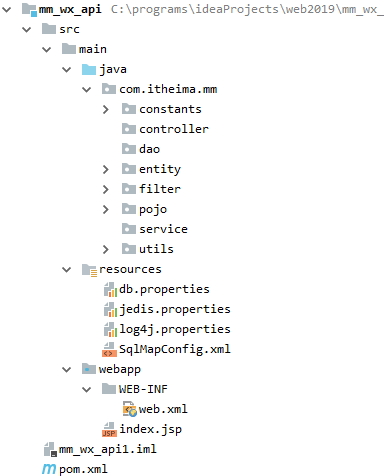

###### 7. 部署到Tomcat并启动

* 把`mm_wx_api`部署到Tomcat并启动服务。访问地址是：`http://localhost:808/wxapi`

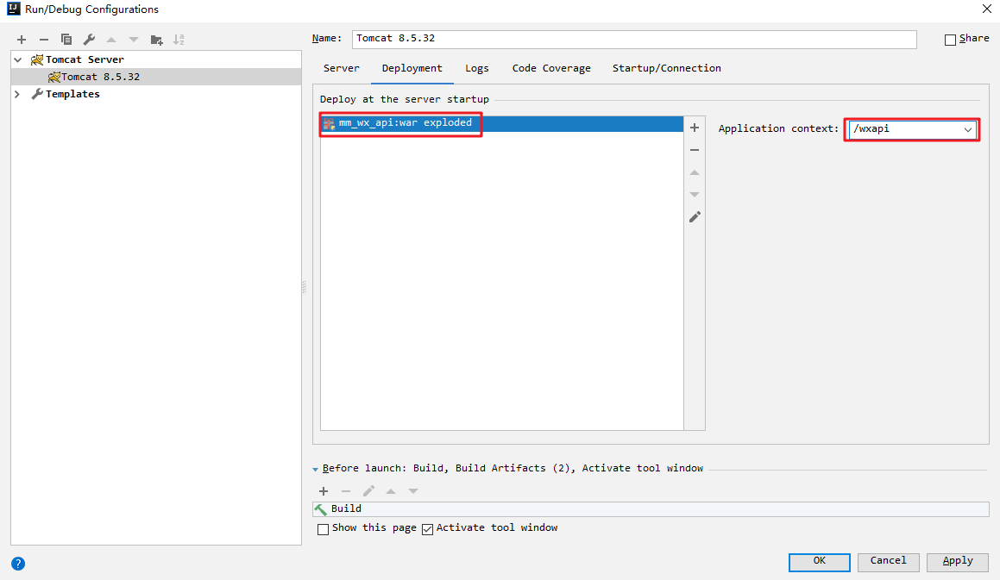

* 打开微信开发者工具，修改面面小程序的服务地址
  * 注意：因为我们的服务端还没有写任何功能，所以小程序会报错，是正常的

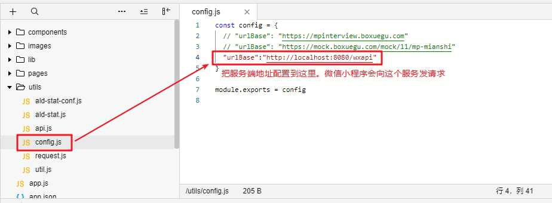

###### 8. 修改面面小程序的请求地址

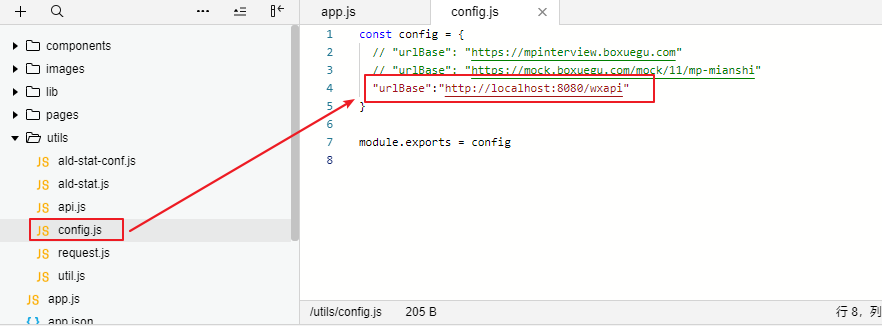

### 小结

## 面面小程序的业务功能

### 城市定位-获取地区数据

#### 目标

面面小程序端第一次启动时，要：

* 微信小程序先定位使用者当前的位置，是GPS定位数据，是坐标（经度和纬度）
* 然后根据微信提供的地理位置信息（经度和纬度），使用高德地图服务，把坐标转换成城市名称
  * 根据城市名称，加载到城市的Dict数据，以及所有城市列表。
* 如果城市不是当前用户需要的，可以进入城市列表，寻找意向的城市名称。

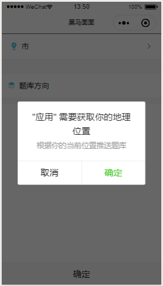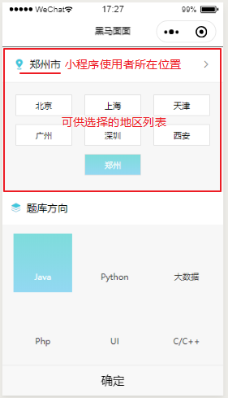 

#### 分析

##### 执行流程

分析图1

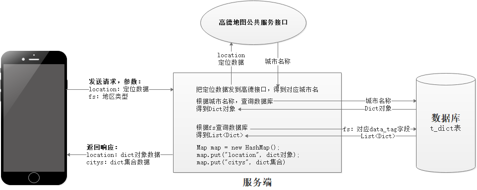

分析图2	


##### 数据模型

###### 请求参数

* fs：要加载的城市数据标签，对应`t_dict`表里的`data_tag`字段
  * 0：不首页显示 
  * 1：首页显示
* location：小程序的GPS定位，是经纬值

```json
{
    "fs": 1,
    "location": "113.6401,34.72468"
}
```

###### 响应结果

* location：小程序GPS定位点经纬度，对应的地区城市
  * id：地区的id
  * title：地区的名称
* citys：根据参数加载的地区列表。市一级的城市
  * id：地区的id
  * title：地区的名称

```json
{
    "location": {
        "id": 19,
        "title": "郑州"
    },
    "citys": [
        {
            "id": 9,
            "title": "北京"
        },
        {
            "id": 10,
            "title": "上海"
        }
    ]    
}
```

#### 实现

##### 修改小程序发请求的地址

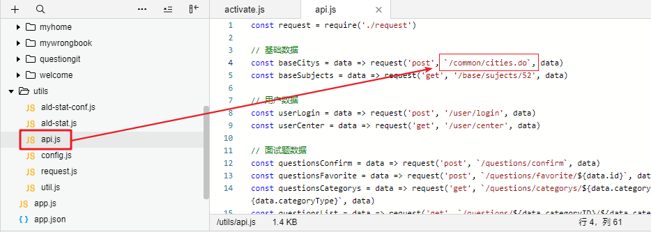

##### `CommonController`

* 创建`CommonController`类，并创建方法

```java
    /**
     * @author liuyp
     * @date 2020/03/09
     */
    @Controller
    public class CommonController {
        private CommonService commonService = new CommonService();

        @RequestMapping("/common/cities")
        public void loadCities(HttpServletRequest request, HttpServletResponse response) throws IOException {
            try {
                HashMap map = JsonUtils.parseJSON2Object(request, HashMap.class);
                Map resultMap = commonService.loadCities(map);
                JsonUtils.printResult(response, resultMap);
            } catch (Exception e) {
                e.printStackTrace();
                JsonUtils.printResult(response, null);
            }
        }
    }
```

##### `CommonService`

* 创建`CommonService`类，并创建方法

```java
/**
 * @author liuyp
 * @date 2020/03/09
 */
public class CommonService {
    public Map loadCities(HashMap map) throws IOException {
        SqlSession session = SqlSessionFactoryUtils.openSqlSession();
        DictDao dictDao = session.getMapper(DictDao.class);

        //根据小程序传递过来的location（定位的经纬度），得到对应的城市名
        String cityName = LocationUtil.parseLocation((String) map.get("location"));

        //从数据库中，根据城市名称，查询城市数据Dict对象
        Dict dict = dictDao.findByCityName(cityName);

        //加载城市列表，供小程序选择其它城市
        List<Dict> dictList = dictDao.findByTag((Integer) map.get("fs"));

        Map<String, Object> resultMap = new HashMap<>();
        resultMap.put("location", dict);
        resultMap.put("citys", dictList);

        SqlSessionFactoryUtils.commitAndClose(session);
        return resultMap;
    }
}
```

##### `DictDao`

###### 映射器`DictDao`接口，并创建方法

```java
/**
 * @author liuyp
 * @date 2020/03/09
 */
public interface DictDao {
    Dict findByCityName(String cityName);

    List<Dict> findByTag(Integer dataTag);
}
```

###### 映射文件`DictDao.xml`

```xml
<?xml version="1.0" encoding="UTF-8" ?>
<!DOCTYPE mapper
        PUBLIC "-//mybatis.org//DTD Mapper 3.0//EN"
        "http://mybatis.org/dtd/mybatis-3-mapper.dtd">
<mapper namespace="com.itheima.mm.dao.DictDao">
    <select id="findByCityName" parameterType="string" resultType="Dict">
        select id, data_value title from t_dict where data_value like "%"#{cityName}"%"
    </select>

    <select id="findByTag" parameterType="int" resultType="Dict">
        select id, data_value title from t_dict where data_type = 1 and data_tag = #{dataTag}
    </select>
</mapper>
```

#### 小结

注意:要将LocationUtil工具类中的amap_api_key值改为自己在高德地图上创建的key

工具类中要改的key位置	


高德地图上的key


#### 拓展：注册和使用高德地图平台

##### 注册成为高德平台用户

* 使用高德地图API，先进入官方<https://lbs.amap.com/>注册一个用户，然后创建一个应用，如图

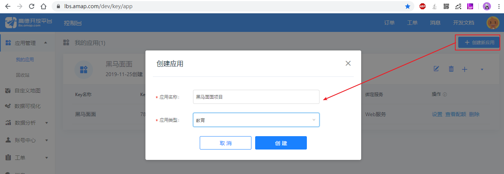

* 创建key

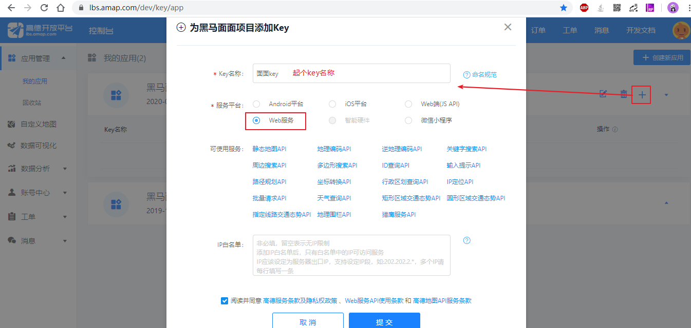

* 最终得到一个key

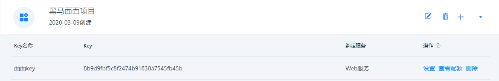

##### 高德的地址解析API

* 参考高德地图API https://lbs.amap.com/api/webservice/guide/api/georegeo 逆地址解析，来完成一个地理位置信息的解析工具。

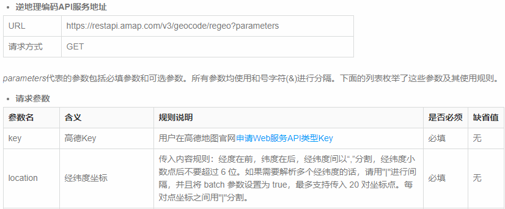

* 服务示例：

```
https://restapi.amap.com/v3/geocode/regeo?output=json&location=116.310003,39.991957&key=<用户的key>

https://restapi.amap.com/v3/geocode/regeo?output=json&location=116.310003,39.991957&key=8b9d9fbf5c8f2474b91838a7545fb45b
```

* 得到结果

```java
{
    "info": "OK",
    "infocode": "10000",
    "regeocode": {
        "addressComponent": {
            "adcode": "110108",
            "building": {
                "name": "北京大学",
                "type": "科教文化服务;学校;高等院校"
            },
            "businessAreas": [
                {
                    "id": "110108",
                    "location": "116.303364,39.97641",
                    "name": "万泉河"
                },
                {
                    "id": "110108",
                    "location": "116.314222,39.98249",
                    "name": "中关村"
                },
                {
                    "id": "110108",
                    "location": "116.294214,39.99685",
                    "name": "西苑"
                }
            ],
            "city": [],
            "citycode": "010",
            "country": "中国",
            "district": "海淀区",
            "neighborhood": {
                "name": "北京大学",
                "type": "科教文化服务;学校;高等院校"
            },
            "province": "北京市",
            "streetNumber": {
                "direction": "东北",
                "distance": "94.5489",
                "location": "116.310454,39.9927339",
                "number": "5号",
                "street": "颐和园路"
            },
            "towncode": "110108015000",
            "township": "燕园街道"
        },
        "formatted_address": "北京市海淀区燕园街道北京大学"
    },
    "status": "1"
}
```


### 获取学科列表

#### 目标

* 在这个页面还需要获取学科列表，供小程序使用者选择要刷哪个学科的面试题

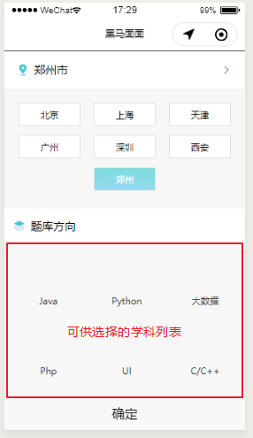

#### 分析

##### 执行流程


##### 数据模型

###### 请求参数

* 无。查询所有学科

###### 响应结果

```json
[
    {
        "icon": "",
        "id": 1,
        "title": "Java"
    },
    {
        "icon": "",
        "id": 2,
        "title": "Python"
    }
]
```

#### 实现

###### 修改小程序发请求的地址

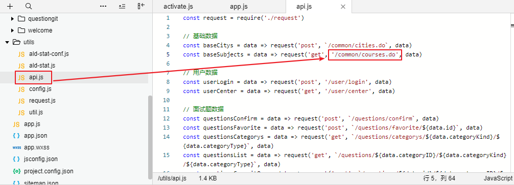

###### `CommonController`

* 在`CommonController`里增加方法

```java
    @RequestMapping("/common/courses")
    public void loadCourses(HttpServletRequest request, HttpServletResponse response) throws IOException {
        try {
            List<Course> courseList = commonService.loadCourses();
            JsonUtils.printResult(response, courseList);
        } catch (Exception e) {
            e.printStackTrace();
            JsonUtils.printResult(response, null);
        }
    }
```

###### `CommonService`

* 在`CommonService`类里增加方法

```java
    public List<Course> loadCourses() throws IOException {
        SqlSession session = SqlSessionFactoryUtils.openSqlSession();
        CourseDao dao = session.getMapper(CourseDao.class);

        List<Course> courseList = dao.queryAll();
        SqlSessionFactoryUtils.commitAndClose(session);
        return courseList;
    }
```

###### `CourseDao`

* 创建映射器`CourseDao`

```java
/**
 * @author liuyp
 * @date 2020/03/09
 */
public interface CourseDao {
    List<Course> queryAll();
}

```

* 创建映射文件`CourseDao.xml`

```xml
<?xml version="1.0" encoding="UTF-8" ?>
<!DOCTYPE mapper
        PUBLIC "-//mybatis.org//DTD Mapper 3.0//EN"
        "http://mybatis.org/dtd/mybatis-3-mapper.dtd">
<mapper namespace="com.itheima.mm.dao.CourseDao">
    <select id="queryAll" resultType="Course">
        select id,name title, icon from t_course
    </select>
</mapper>
```

#### 小结

### 优化学科列表

#### 目标

* 使用redis优化学科列表功能

#### 分析

* 学科列表经常获取，且不经常发生变化，可以借助redis来优化学科列表的获取速度。
* 在第一次获取学科列表时，判断redis中是否有缓存数据：
  * 如果没有缓存数据，需要先从数据库获取学科列表，然后转换为JSON字符串后存入redis。
  * 如果redis中有学科缓存数据，需要把json字符串转化为JSON对象然后返回给客户端。
  * 开启window的redis服务器
  * 

#### 实现

##### 修改`CommonController`

```java
    @RequestMapping("/common/courses")
    public void loadCourses(HttpServletRequest request, HttpServletResponse response) throws IOException {
        try {
            String courses = commonService.loadCourses();
            JsonUtils.printResult(response, JSON.parse(courses));
        } catch (Exception e) {
            e.printStackTrace();
            JsonUtils.printResult(response, null);
        }
    }
```

##### 修改`CommonService`

```java
    public String loadCourses() throws IOException {
        List<Course> courseList = null;
		
        //优先从redis中获取缓存
        Jedis jedis = JedisUtils.getJedis();
        String coursesJsonStr = jedis.get("coursesJsonStr");

        //如果没有缓存，从MySql里查询
        if (coursesJsonStr == null){
            SqlSession session = SqlSessionFactoryUtils.openSqlSession();
            CourseDao dao = session.getMapper(CourseDao.class);
            courseList = dao.queryAll();
            SqlSessionFactoryUtils.commitAndClose(session);

            coursesJsonStr = JSON.toJSONString(courseList);
            jedis.set("coursesJsonStr", coursesJsonStr);
        }
        jedis.close();
        return coursesJsonStr;
    }
```

#### 小结

```
下划线字段名，自动映射 驼峰式属性名
```


### 保存微信用户信息（登录与注册）

#### 目标

* 当用户定位了城市、选择了学科后，需要点击确定按钮，把选择的城市和学科保存到服务端。
* 但是前提条件是：这些信息必须要和用户信息关联。
* 如果用户是第一次使用这个小程序（或者清除了缓存），会弹窗要求微信授权，如下图所示：
  * 从微信平台，得到微信帐号的信息，比如：微信昵称、头像图标链接、地区、性别等等（加密的）
* 当用户点击了“允许”后：小程序会把微信用户信息（加密的）发送到我们服务端，服务端解密得到微信用户的信息
* 这个过程可以理解为登录和注册
  * 如果用户第一次用：我们把微信帐号信息保存到数据库中，相当于注册了
  * 如果用户不是第一次用：我们就从数据库中加载这个用户的数据，相当于登录了

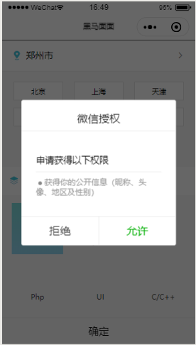

#### 分析

##### 小程序官方验证流程图

* 官方小程序登录流程图： https://developers.weixin.qq.com/miniprogram/dev/framework/open-ability/login.html 


##### 微信小程序验证流程

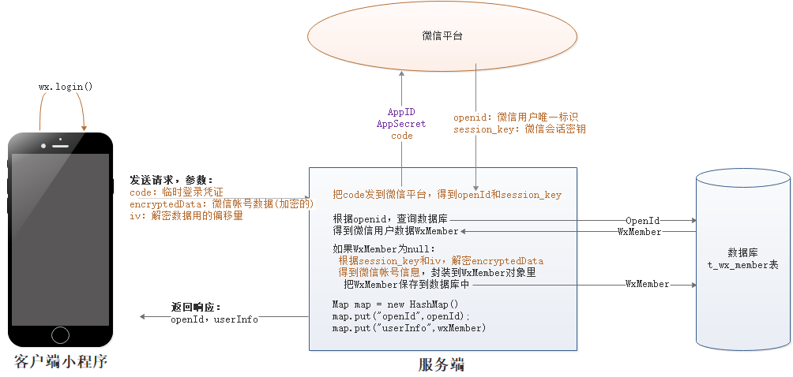


##### 数据模型

###### 请求参数

* code：临时登录凭证
* encryptedData：加密后的微信帐号数据
* iv：解密数据需要的偏移量

```json
{
    "code": "011bskvF1mwK160vUdwF1w3ivF1bskvI",
    "encryptedData": "iSHBzhtPT7YBZrW3wSwHiD1jSsAr31A4gsoIVY5Z0HYqj0k49e/uEalOJSzOcgAFpjLN9wdfD6tA8jpioG52wP5xTEfaHGM1FG4WnsdCTd9Y1303h/uCqiMx+caN0eXeUdZdWegw8dDxE+mYAmEXgvvzzBrGFwYjYmw1mdTKDyexVt1ouq70UFTBpd3QttTsWB4NK/Rgf+S8THN9YofpR0cAPp0Wxk+vU9vQzJp4q+ThZgB846mXxjQPbRxnv8M64OZ6l3EIeLNrPjnfi9dLme1qHaOn8q045RR1uKHPSak+iDPGDjYFmN+HDIAsMGuKwKjG46PUT5wt9OSsXwdEgenNHXTnaEkMdRYW90UjnZ94QLjvanRWp/GNhqjl2bNa9cg6xwyS7Ss8562r7cK1tSH3kvnyC8WNUnKp8SjymyDlUdu5F5hV0P1Ouy24M8alEYTJrjfhHgBM9ylKe68OJ7xLwykZZJ818tZ5Bhq1eNs3",
    "iv": "fhNX0qfbztMbsjMJUMDYow=="
}
```

###### 响应数据

* token：微信帐号的唯一标识openId值
* userInfo：微信帐号数据
  * id：帐号在`t_wx_member`里的id
  * nickName：帐号昵称
  * gender：帐号的性别
  * city：帐号的城市
  * province：帐号的省
  * country：帐号的国家
  * language：帐号的语言
  * createTime：帐号在黑马面面系统的注册时间
  * openId：帐号的唯一标识

```json
{
    "token": "otIbn5SclH6wr_pOilXPmdUqvDa0",
    "userInfo": {
        "city": "Shenzhen",
        "country": "China",
        "createTime": "2020-03-09 16:14:34.0",
        "gender": "1",
        "id": 6,
        "language": "zh_CN",
        "nickName": "刘银朋💯",
        "openId": "otIbn5SclH6wr_pOilXPmdUqvDa0",
        "province": "Guangdong"
    }
}
```

#### 实现

##### 修改MySql的字符集

* 如果微信用户昵称中有特殊字符（比如：含有emoji表情），使用utf-8可能无法存储，系统会报错

* 如果想要存储这种数据，需要把MySql的字符集修改成utf8mb4：utf8的超集，兼容utf8，支持更多字符

* 修改之后，在Java连接数据库时，需要设置连接的字符集  `characterEncoding=utf-8`

  ```properties
  jdbc.url=jdbc:mysql://localhost:3306/mm?characterEncoding=utf-8
  ```

* 修改步骤：

  1. 打开MySql安装目录中的my.ini

     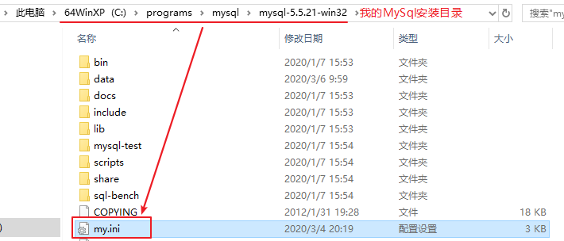

  2. 找到`[mysqld]`下边的`character-set-server`，修改值为`utf8mb4`

     * 注意：只要在`[mysqld]`下找到这一项即可，其它内容如果不同，无需关注

     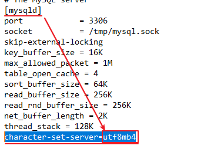

  3. 重启MySql服务

     * 管理员模式运行cmd
     * 先输入命令：`net stop mysql`关闭MySql服务
     * 再输入命令：`net start mysql`启动MySql服务

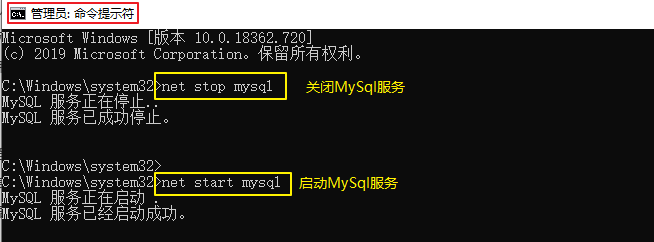

##### 修改小程序发发请求的地址

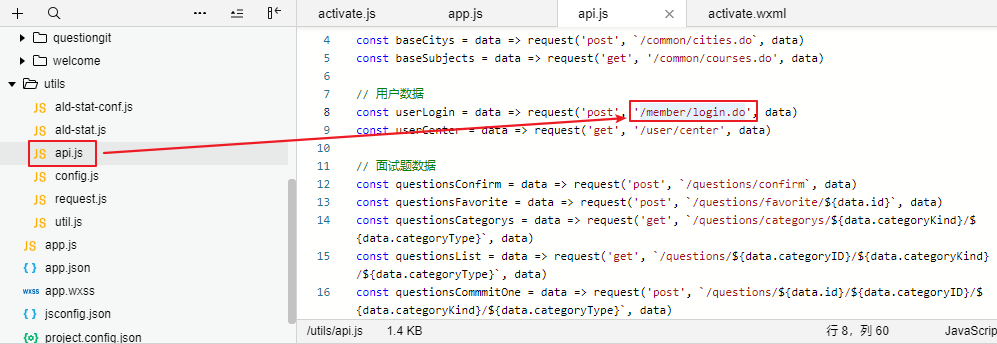

##### `WxUtil`

* 修改`WxUtil`中的两个静态变量：
  * appid：你的AppID
  * secret：你的AppSecret

##### `WxMemberController`

* 创建`WxMemberController`

```java
/**
 * @author liuyp
 * @date 2020/03/09
 */
@Controller
public class WxMemberController {
    private MemberService memberService = new MemberService();

    @RequestMapping("/member/login")
    public void login(HttpServletRequest request, HttpServletResponse response) throws IOException {
        try {
            //接收参数，封装成Map
            HashMap<String,String> map = JsonUtils.parseJSON2Object(request, HashMap.class);
            //得到微信小程序发来的临时登录凭证
            String code = map.get("code");
			
            //调用微信公众平台的API：拿code换取 用户唯一标识openid和会话密钥session_key
            JSONObject wx = WxUtil.get(code);
            String sessionKey = wx.getString("session_key");
            String openId = wx.getString("openid");

            //根据用户唯一标识，去数据库t_wx_member中查询微信用户。如果查到了，认为是已登录
            WxMember wxMember = memberService.findByOpenId(openId);
            if (wxMember == null) {
                //该微信用户是第一次访问，要把该微信用户信息存储到t_wx_member表中：注册
                
                //得到微信小程序提交的加密数据encryptedData，以及解密必须的偏移量iv
                String encryptedData = map.get("encryptedData");
                String iv = map.get("iv");
                //调用微信公众平台的API：解密数据，得到用户信息
                JSONObject userInfo = WxUtil.getUserInfo(encryptedData, sessionKey, iv);
                //把得到的用户信息，转换成WxMember对象；然后保存到数据库t_wx_member表里
                wxMember = userInfo.toJavaObject(WxMember.class);
                wxMember.setCreateTime(DateUtils.parseDate2String(new Date()));
                memberService.register(wxMember);
            }

            //准备 要响应的数据。tokey：值是用户唯一标识openid，userInfo：是登录的微信用户信息
            HashMap<String,Object> resultMap = new HashMap();
            resultMap.put("token", openId);
            resultMap.put("userInfo", wxMember);

            JsonUtils.printResult(response, resultMap);
        } catch (Exception e) {
            e.printStackTrace();
            JsonUtils.printResult(response, null);
        }
    }
}
```

##### `MemberService`

* 创建`MemberService`

```java
/**
 * @author liuyp
 * @date 2020/03/09
 */
public class MemberService {
    public WxMember findByOpenId(String openId) throws IOException {
        SqlSession session = SqlSessionFactoryUtils.openSqlSession();
        WxMemberDao memberDao = session.getMapper(WxMemberDao.class);
        WxMember wxMember = memberDao.findByOpenId(openId);
        SqlSessionFactoryUtils.commitAndClose(session);
        return wxMember;
    }

    public void register(WxMember wxMember) throws IOException {
        SqlSession session = SqlSessionFactoryUtils.openSqlSession();
        WxMemberDao memberDao = session.getMapper(WxMemberDao.class);
        memberDao.add(wxMember);
        SqlSessionFactoryUtils.commitAndClose(session);
    }
}
```

##### `WxMemberDao`

* 创建映射器`WxMemberDao`

```java
/**
 * @author liuyp
 * @date 2020/03/09
 */
public interface WxMemberDao {
    WxMember findByOpenId(String openId);

    void add(WxMember wxMember);
}
```

* 创建映射文件`WxMemberDao.xml`

```xml
<?xml version="1.0" encoding="UTF-8" ?>
<!DOCTYPE mapper
        PUBLIC "-//mybatis.org//DTD Mapper 3.0//EN"
        "http://mybatis.org/dtd/mybatis-3-mapper.dtd">
<mapper namespace="com.itheima.mm.dao.WxMemberDao">
    <select id="findByOpenId" parameterType="String" resultMap="wxMemberMap">
        select * from t_wx_member where open_id = #{openId}
    </select>
    <resultMap id="wxMemberMap" type="WxMember">
        <id property="id" column="id"/>
        <result property="nickName" column="nick_name"/>
        <result property="openId" column="open_id"/>
        <result property="unionId" column="union_id"/>
        <result property="createTime" column="create_time"/>
        <result property="courseId" column="course_id"/>
        <result property="cityId" column="city_id"/>
        <result property="lastCategoryKind" column="last_category_kind"/>
        <result property="lastCategoryType" column="last_category_type"/>
        <result property="lastCategoryId" column="last_category_id"/>
        <result property="lastQuestionId" column="last_question_id"/>
    </resultMap>

    <insert id="add" parameterType="WxMember">
        <selectKey resultType="int" keyProperty="id" order="AFTER">
            select last_insert_id()
        </selectKey>
        insert into t_wx_member (
                         nick_name,
                         avatar_url,
                         gender,
                         city,
                         province,
                         country,
                         language,
                         open_id,
                         union_id,
                         create_time)
        values (
                       #{nickName},
                       #{avatarUrl},
                       #{gender},
                       #{city},
                       #{province},
                       #{country},
                       #{language},
                       #{openId},
                       #{unionId},
                       #{createTime});
    </insert>
</mapper>
```

#### 小结

