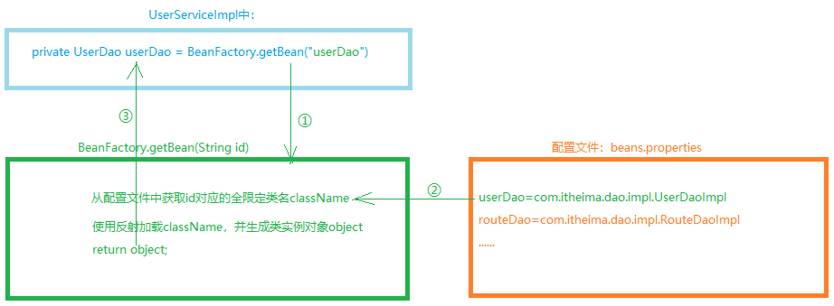
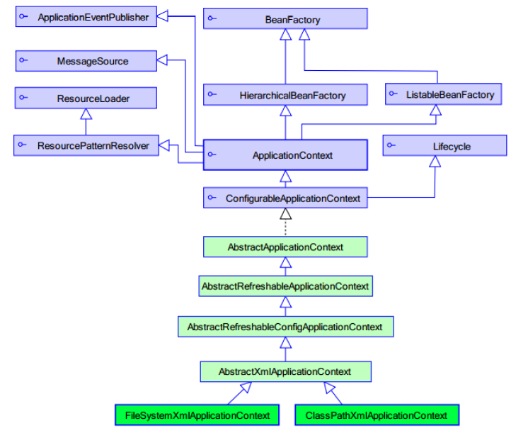
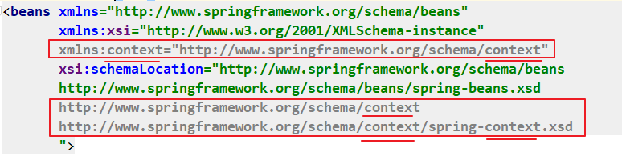

# Spring第一天

* 重点在于应用

* XML的IoC
* 注解的IoC
* XML、注解的AOP + 事务管理

## 一、简介

### 1. 什么是Spring

* Spring是分层的Java SE/EE应用 full-stack(服务端的全栈)轻量级（跟EJB比）开源框架，以IoC(Inversion of Controll，控制反转，解耦)和AOP(Aspect oriented programming，面向切面编程，底层是动态代理)为内核
* 提供了：
  * 表示层Spring MVC
  * 持久层Spring  JDBCTemplate， Spring Data JPA
  * 业务层事务管理等
* 能整合开源世界众多著名的第三方框架和类库，逐渐成为使用最多的Java EE企业应用开源框架。


### 2. Spring的发展历程

* 1997年，IBM提出了EJB的思想
* 1998年，SUN制定开发标准规范EJB1.0
* 1999年，EJB1.1发布
  2001年，EJB2.0发布
  2003年，EJB2.1发布
  2006年，EJB3.0发布
* Rod Johnson（spring之父）
  * Expert One-to-One J2EE Design and Development(2002)
    阐述了J2EE使用EJB开发设计的优点及解决方案
  * Expert One-to-One J2EE Development without EJB(2004)
    阐述了J2EE开发不使用EJB的解决方式（Spring雏形）
* 2017年9月份发布了spring的最新版本spring 5.0通用版（GA）

### 3. Spring的优势

* 方便解耦，简化开发（用IoC思想，Spring前2天学习）

  通过Spring提供的IoC容器，可以将对象间的依赖关系交由Spring进行控制，避免硬编码所造成的过度程序耦合。用户也不必再为单例模式类、属性文件解析等这些很底层的需求编写代码，可以更专注于上层的应用。

* AOP编程的支持（Spring第3天学习）

  通过Spring的AOP功能，方便进行面向切面的编程，许多不容易用传统OOP实现的功能可以通过AOP轻松应付。

  比如：要求面面项目里，每个方法被调用时，都输出日志到控制台“2020-03-20 11:20:31执行了xxx.xx方法”

* 声明式事务的支持（Spring第3天学习）

  可以将我们从单调烦闷的事务管理代码中解脱出来，通过声明式方式灵活的进行事务的管理，提高开发效率和质量。@Transactional

* 方便程序的测试（今天学习）

  可以用非容器依赖的编程方式进行几乎所有的测试工作，测试不再是昂贵的操作，而是随手可做的事情。

  例如：Spring整合了Junit

* 方便集成各种优秀框架（SpringMVC第2天：SSM整合）

  Spring可以降低各种框架的使用难度，提供了对各种优秀框架（Struts、Hibernate、Hessian、Quartz等）的直接支持。

* 降低JavaEE API的使用难度(Spring第3天)

  Spring对JavaEE API（如JDBC、JavaMail、远程调用等）进行了薄薄的封装层，使这些API的使用难度大为降低。

* Java源码是经典学习范例

  Spring的源代码设计精妙、结构清晰、匠心独用，处处体现着大师对Java设计模式灵活运用以及对Java技术的高深造诣。它的源代码无疑是Java技术的最佳实践的范例。

### 4. Spring的体系结构


## 二、工厂模式解耦（理解）

### 1. 耦合性问题

* 耦合性：程序之间的依赖性。
  * 编译期依赖：编译时必须提供依赖的类，否则编译不通过。
  * 运行期依赖：运行时必须提供依赖的类，否则不能运行。
  * 应当减少编译期依赖，使用运行期依赖
* 耦合性越强，维护成本就越高
* 开发时要求：高内聚，低耦合

#### 1.1 耦合性问题现象

* 在web开发中，服务端通常分为三层：web层、service层、dao层
  * web层调用service层完成功能：需要new一个Service对象
  * service层调用dao层操作数据库：需要new一个dao对象
* 三层之间的耦合性比较强：存在编译期依赖
  * service里写死了创建某一个dao对象：一旦dao对象换了，就需要修改service的源码
  * web里写死了创建某一个service对象：一旦service对象换了，就需要修改web的源码

#### 1.2 解耦的思路

* 可以使用反射技术，代替`new`创建对象，避免编译期依赖

  ```java
  Class clazz = Class.forName("全限定类名");
  Object obj = clazz.newInstance();
  ```

* 再把全限定类名提取到配置文件中（xml或properties），读取配置文件信息来反射创建对象

  ```java
  //读取配置文件，得到要创建对象的全限定类名；再通过反射技术创建对象
  String className = ...;
  Class clazz = Class.forName(className);
  Object obj = clazz.newInstance();
  ```

### 2. 使用工厂模式解耦

#### 需求描述

* `UserService`提供用户相关的功能，需要调用`UserDao`完成数据库操作
* 使用工厂模式+配置文件的方式，降低它们之间的耦合性

#### 需求分析




#### 需求实现

1. 创建项目，导入依赖

   ```xml
   <dependencies>
       <dependency>
           <groupId>junit</groupId>
           <artifactId>junit</artifactId>
           <version>4.12</version>
       </dependency>
   </dependencies>
   ```

2. dao层代码

   ```java
   public interface UserDao {
       void save();
   }
   ```

   ```java
   public class UserDaoImpl implements UserDao {
       @Override
       public void save() {
           System.out.println("UserDaoImpl.save......");
       }
   }
   ```

3. service层代码

   ```java
   public interface UserService {
       void save();
   }
   ```

   ```java
   public class UserServiceImpl implements UserService {
   
       /**
        * 存在编译期依赖：如果没有UserDaoImpl，代码编译是不通过的。
        * 要避免编译期依赖，减少运行期依赖
        * 解决思路：
        * 1. 使用反射技术代替new
        * 2. 提取配置文件
        */
       //private UserDao userDao = new UserDaoImpl();
       private UserDao userDao = (UserDao) BeanFactory.getBean("userDao");
   
       @Override
       public void save() {
           userDao.save();
       }
   }
   ```

4. 配置文件`beans.properties`

   ```properties
   userDao=com.itheima.dao.impl.UserDaoImpl
   ```

5. 工厂类`BeanFactory`

   ```java
   public class BeanFactory {
   
       private static Map<String, Object> map = new HashMap<>();
   
       static {
           //类加载时，读取properties文件，把其中所有的bean都创建对象，放到一个容器里
           //当需要使用时，直接从容器中获取即可
   
           try {
               //1.读取配置文件
               ResourceBundle bundle = ResourceBundle.getBundle("beans");
               Enumeration<String> keys = bundle.getKeys();
               while (keys.hasMoreElements()) {
                   String id = keys.nextElement();
                   String className = bundle.getString(id);
                   Class clazz = Class.forName(className);
                   Object object = clazz.newInstance();
   
                   map.put(id, object);
               }
           } catch (Exception e) {
               e.printStackTrace();
           }
       }
   
       public static Object getBean(String id){
           return map.get(id);
       }
   }
   ```

#### 小结

* 如果service里需要dao，说明service依赖于dao：dao就是一个依赖项
* 我们需要一个对象，以前：需要什么就自己主动new什么 ==> 耦合性太强
* 我们需要一个对象，现在：需要什么，就从BeanFactory里获取什么 ==>耦合性降低了


### 3. IoC思想

* `IoC`：Inversion of Control，控制反转。是指  把创建对象的控制权交给框架：要想得到一个对象，由原来的主动创建对象，变成自己被动接收 框架创建的对象。
* `IoC`是Spring的核心思想之一
* 作用：用于降低程序间的耦合性

## 三、控制反转IoC【重点】

### 1. 快速入门【重点】

#### 需求描述

* 有`UserDao`接口和`UserDaoImpl`实现类
* 通过Spring容器得到`UserDaoImpl`的实例对象（IoC方式）

#### 开发步骤

1. 创建Maven项目，导入依赖坐标：Spring的依赖坐标
2. 编写dao接口`UserDao`及实现`UserDaoImpl`
3. 创建Spring核心配置文件，并配置`UserDaoImpl`
4. 测试：使用Spring的API，获取Bean实例对象

#### 需求实现

##### 1. 创建Maven项目，导入依赖坐标

```xml
<dependencies>
    <dependency>
        <groupId>org.springframework</groupId>
        <artifactId>spring-context</artifactId>
        <version>5.0.2.RELEASE</version>
    </dependency>
    <dependency>
        <groupId>junit</groupId>
        <artifactId>junit</artifactId>
        <version>4.12</version>
    </dependency>
</dependencies>
```

##### 2. 编写dao接口`UserDao`及实现`UserDaoImpl`

* 接口`UserDao`

```java
public interface UserDao {
    void save();
}
```

* 实现类`UserDaoImpl`

```java
public class UserDaoImpl implements UserDao {
    @Override
    public void save() {
        System.out.println("UserDaoImpl.save......");
    }
}
```

##### 3. 创建Spring核心配置文件，并配置`UserDaoImpl`

* 配置文件名称，通常叫`applicationContext.xml`

```xml
<?xml version="1.0" encoding="UTF-8"?>
<beans xmlns="http://www.springframework.org/schema/beans"
       xmlns:xsi="http://www.w3.org/2001/XMLSchema-instance"
       xsi:schemaLocation="http://www.springframework.org/schema/beans
       http://www.springframework.org/schema/beans/spring-beans.xsd">

    <!-- 配置UserDaoImpl -->
    <bean id="userDao" class="com.itheima.dao.impl.UserDaoImpl"></bean>
</beans>
```

##### 4. 使用Spring的API，获取Bean实例对象

* 编写测试类

```java
public class SpringIocQuickStartTest {
    @Test
    public void test(){
        ApplicationContext context = 
            new ClassPathXmlApplicationContext("applicationContext.xml");
        UserDao userDao = context.getBean("userDao", UserDao.class);
        userDao.save();
    }
}
```

#### 小结

1. 准备工作：

   1. 导入jar依赖：`spring-context`,  `junit`
   2. 编写UserDao接口和实现类

2. Spring的配置：

   * 创建一个xml文件：名称随意、位置通常放到resources目录里

   ```xml
   <bean id="唯一标识" class="全限定类名"></bean>
   ```

3. 测试：

   ```java
   //创建容器，加载配置文件
   ApplicationContext app = new ClasspathXmlApplicationContext("classpath:applicationContext.xml");
   
   //从容器里获取bean对象
   Object obj = app.getBean("bean对象的id");
   ```

   

### 2. 配置文件详解

#### 1. `bean`标签的基本配置

```xml
<bean id="userDao" class="com.itheima.dao.impl.UserDaoImpl"></bean>
```

1. 介绍

   * 用于配置：把对象交给Spring进行控制

   * 默认情况下，Spring是调用类的无参构造来创建对象的；如果没有无参构造，则不能创建成功

2. 基本属性

   * `id`：唯一标识
   * `class`：bean的全限定类名

   > 了解：bean的id和name的区别
   >
   > 1. 一个bean只能有一个id；一个bean可以有多个name
   > 2. bean的name值：多个name之间以`,` `;` `空格 ` 隔开，第1个name作为id，其它作为别名

#### 2. `bean`标签的作用范围配置

```xml
<bean id="userDao" class="com.itheima.dao.impl.UserDaoImpl" scope="singleton"></bean>
```

* scope属性取值如下：

| 取值            | 说明                                                         |
| --------------- | ------------------------------------------------------------ |
| `singleton`     | 默认，表示单例的，一个Spring容器里，只有一个该bean对象       |
| `prototype`     | 多例的，一个Spring容器里，有多个该bean对象                   |
| `request`       | web项目里，Spring创建的bean对象将放到`request`域中：一次请求期间有效 |
| `session`       | web项目里，Spring创建的bean对象将放到`session`域中：一次会话期间有效 |
| `globalSession` | web项目里，应用在Portlet环境/集群环境；如果没有Portlet/集群环境，那么globalSession相当于session（新版本中已删除） |

* 不同scope的bean，生命周期：

  * singleton：bean的生命周期和Spring容器的生命周期相同

    * 整个Spring容器中，只有一个bean对象
    * 何时创建：加载Spring配置文件，初始化Spring容器时，bean对象创建
    * 何时销毁：Spring容器销毁时，bean对象销毁

  * prototype：bean的生命周期和Spring容器无关。Spring创建bean对象之后，交给JVM管理了

    * 整个Spring容器中，会创建多个bean对象，创建之后由JVM管理
* 何时创建：调用`getBean`方法获取bean对象时，bean对象创建
    * 何时销毁：对象长时间不用时，垃圾回收

#### 3. `bean`生命周期相关方法的配置【了解】

```xml
<bean id="userDao" class="com.itheima.dao.impl.UserDaoImpl" 
      init-method="" destroy-method=""></bean>
```

* `init-method`：指定类中初始化方法名称，该方法将在bean对象被创建时执行

* `destroy-method`：指定类中销毁方法名称，该方法将在bean对象被销毁时执行

  > 注意：
  >
  > * prototype类型的bean：Spring容器销毁时，也不会执行销毁方法，因为Spring不负责它的销毁
  > * singleton类型的bean：在Spring容器显式关闭时，会执行destroy-method指定的方法
  >
  > ```java
  > ApplicationContext context = new ClassPathXmlApplicationContext("applicationContext.xml");
  > 
  > UserDao userDao = context.getBean("userDao", UserDao.class);
  > //显式的关闭Spring容器
  > ((ClassPathXmlApplicationContext)context).close();
  > ```

#### 4. `bean`实例化的三种方式

* 无参构造方法实例化，默认的：让Spring调用bean的无参构造，生成bean实例对象给我们
* 工厂静态方法实例化：让Spring调用一个工厂类的静态方法，得到一个bean实例对象
* 工厂非静态方法实例化（实例化方法）：让Spring调用一个工厂对象的非静态方法，得到一个bean实例对象

##### 1. 无参构造方法实例化

```xml
<bean id="userDao" class="com.itheima.dao.impl.UserDaoImpl"></bean>
```

##### 2. 工厂静态方法实例化

* 工厂类如下：`com.itheima.factory.StaticFactory`

```java
public class StaticFactory{
    public static UserDao createUserDao(){
        return new UserDaoImpl();
    }
}
```

* 配置如下：

```xml
<bean id="userDao" class="com.itheima.factory.StaticFactory" 
      factory-method="createUserDao"></bean>
```

##### 3. 工厂非静态方法实例化

* 工厂类如下：`com.itheima.factory.InstanceFactory`

```java
public class InstanceFactory{
    public UserDao createUserDao(){
        return new UserDaoImpl();
    }
}
```

* 配置如下：

```xml
<!-- 先配置工厂 -->
<bean id="instanceFactory" class="com.itheima.factory.InstanceFactory"></bean>

<!-- 再配置UserDao -->
<bean id="userDao" factory-bean="instanceFactory" factory-method="createUserDao"></bean>
```

### 3. IoC小结

* bean的作用范围：通过bean标签的scope属性来设置

  * singleton：默认值，是单例的。
    * 何时创建：非懒加载的单例bean，在容器初始化时创建；懒加载的单例bean，在第一次获取时创建
    * 何时销毁：容器关闭时销毁
  * prototype：多例的
    * 何时创建：每次获取bean对象时创建
    * 何时销毁：长时间不使用，JVM垃圾回收

* bean的生命周期方法配置：

  * 给bean标签加init-method：指定一个初始化方法，在bean对象创建后会执行一次
  * 给bean标签加destroy-method：指定一个销毁方法，在bean对象销毁前会执行一次

* bean实例化的方式一：默认的无参构造

  Spring就会采用类的无参构造，创建实例对象放到容器里

  ```xml
  <bean id="" class="全限定类名"></bean>
  ```

* bean实例化方式二：工厂的静态方法

  Spring会调用class指定的类里，factory-method指定的静态方法，把方法返回值放到容器里

  ```xml
  <bean id="" class="工厂类的全限定类名" factory-method="工厂类的静态方法"></bean>
  ```

* bean实例化方式三：工厂的非静态方法

  Spring会调用factory-bean对应的对象里、factory-method指定的非静态方法，把方法返回值放到容器里

  ```xml
  <bean id="工厂类的beanid" class="工厂类的全限定类名"></bean>
  <bean id="" factory-bean="工厂bean对象的id" factory-method="工厂对象的非静态方法"></bean>
  ```
```
  
  


## 四、依赖注入DI【重点】

* 依赖注入：Dependency Injection，是Spring的Ioc核心的具体实现。（自动装配）

  * 类里依赖什么，由Spring注入（提供）什么

* 我们需要进行配置：告诉Spring，依赖什么

  我们通过Ioc把bean对象交给了Spring容器进行管理，降低了耦合性。

  但是耦合性不能彻底消除，bean之间还是有一些依赖关系。比如：业务层userService要依赖于持久层userDao。

  这样的依赖关系，可以交给Spring帮我们进行依赖的注入，而不用我们自己注入依赖

### 1. 快速入门

#### 需求描述

* 有dao层：`UserDao`和`UserDaoImpl`
* 有service层：`UserService`和`UserServiceImpl`
* `UserServiceImpl`中的方法依赖于`UserDaoImpl`
* 使用Spring，把`UserDaoImpl`注入给`UserServiceImpl`

#### 开发步骤

1. 创建Maven项目，导入依赖坐标
2. 编写dao层`UserDao`及`UserDaoImpl`、service层`UserService`和`UserServiceImpl`
3. 创建Spring核心配置文件，并配置bean和依赖注入
4. 使用Spring的API，测试

#### 需求实现

##### 1. 创建Maven项目，导入依赖

​```xml
<dependencies>
    <dependency>
        <groupId>org.springframework</groupId>
        <artifactId>spring-context</artifactId>
        <version>5.0.2.RELEASE</version>
    </dependency>
    <dependency>
        <groupId>junit</groupId>
        <artifactId>junit</artifactId>
        <version>4.12</version>
    </dependency>
</dependencies>
```

##### 2. 编写dao层和service层代码

* dao层接口`UserDao`

```java
public interface UserDao {
    void save();
}
```

* dao层实现类`UserDaoImpl`

```java
public class UserDaoImpl implements UserDao {
    @Override
    public void save() {
        System.out.println("UserDaoImpl.save......");
    }
}
```

* service层接口`UserService`

```java
public interface UserService {
    void save();
}
```

* service层实现类`UserServiceImpl`

```java
public class UserServiceImpl implements UserService {
    //依赖于dao层的UserDao，定义一个成员变量
    private UserDao userDao;

    @Override
    public void save() {
        userDao.save();
    }
    
    //提供userDao的get/set方法
    public UserDao getUserDao() {
        return userDao;
    }

    public void setUserDao(UserDao userDao) {
        this.userDao = userDao;
    }
}
```

##### 3. 创建Spring核心配置文件，并配置bean和依赖注入

```xml
<?xml version="1.0" encoding="UTF-8"?>
<beans xmlns="http://www.springframework.org/schema/beans"
       xmlns:xsi="http://www.w3.org/2001/XMLSchema-instance"
       xsi:schemaLocation="http://www.springframework.org/schema/beans http://www.springframework.org/schema/beans/spring-beans.xsd">

    <!--配置UserDao-->
    <bean id="userDao" class="com.itheima.dao.impl.UserDaoImpl"></bean>
    <!--配置UserService-->
    <bean id="userService" class="com.itheima.service.impl.UserServiceImpl">
        <!--把userDao注入给userService的属性-->
        <property name="userDao" ref="userDao"/>
    </bean>
</beans>
```

##### 4. 使用Spring的API，测试

```java
public class UserTest {
    public static void main(String[] args) {
        ApplicationContext context = 
            new ClassPathXmlApplicationContext("applicationContext.xml");
        UserService userService = context.getBean("userService", UserService.class);
        userService.save();
    }
}
```

#### 小结

1. 依赖项需要有set方法
2. 在xml文件的bean标签里，使用property注入值

```xml
<bean id="" class="UserServiceImpl全限定类名">
	<property name="属性名称" ref="要注入进来的值，写bean的id"/>
</bean>
```


### 2. 三种常见注入方式


#### set方法注入

##### 1) 介绍

在类中提供需要注入的成员（依赖项）的set方法，在配置文件中注入属性的值

```xml
<bean id="bean的id" Class=></bean>

<bean id="" class="">
	<property name="属性名" value="属性值"></property>
    <property name="属性名" ref="bean的id"></property>
</bean>
```

* `property`标签：用在bean标签内部，表示要给某一属性注入数据
  * `name`：属性名称
  * `value`：要注入的属性值，注入简单类型值
  * `ref`：要注入的属性值，注入其它bean对象

> 优势：创建bean对象时没有明确的限制，可以使用无参构造直接创建
>
> 缺点：如果某个成员必须有值，则获取对象时，有可能set方法未执行

##### 2) 示例


#### 构造方法注入

##### 1) 介绍

在类中提供构造方法，构造方法的每个参数就是一个依赖项，通过构造方法给依赖项注入值。

```xml
<bean id="" class="">
	<constructor-arg name="构造参数名称" value="构造参数的值"></constructor-arg>
    <constructor-arg name="构造参数名称" ref="bean的id"></constructor-arg>
</bean>
```

* `name`：构造参数的名称
* `type`：构造参数的类型
* `index`：构造参数的索引
* `value`：要注入的值，注入简单类型值
* `ref`：要注入的值，注入其它bean对象

> 优势：在获取bean对象时，注入数据是必须的操作，否则无法创建成功。
>
> 缺点：改变了bean对象的实例化方式，如果在创建对象时用不到这些数据，也必须要提供

##### 2) 示例


#### p名称空间注入

##### 1) 介绍

> p名称空间注入，本质仍然是set方法注入

在xml中引入p名称空间的约束

然后通过`p:属性名称=""`来注入简单数据、使用`p:属性名称-ref=""`注入其它bean对象，它的本质仍然是set方法注入

```xml
<beans xmlns="http://www.springframework.org/schema/beans"
    xmlns:xsi="http://www.w3.org/2001/XMLSchema-instance"
    xmlns:p="http://www.springframework.org/schema/p"
    xsi:schemaLocation="http://www.springframework.org/schema/beans
    http://www.springframework.org/schema/beans/spring-beans.xsd">
    
    <bean id="" class="" p:属性名="简单值" p:属性名-ref="bean的id"></bean>
    
</beans>
```

##### 2) 示例

#### 小结

* set方法注入（属性注入）

  * 要求：依赖项要有set方法

  ```xml
  <bean id="" class="">
  	<property name="属性名" value="简单值"/>
      <property name="属性名" ref="其它bean对象的id"/>
  </bean>
  ```

* 构造方法注入

  * 要求：类里要有有参构造，构造方法里每个参数就是一个依赖项

  ```xml
  <bean id="" class="">
  	<construtor-arg name="属性名" value="简单值"/>
      <construtor-arg name="属性名" ref="其它bean对象的id"/>
  </bean>
  ```

* p名称空间注入：本质还是set方法注入

  * 要求：依赖项要有set方法
  * 配置：要在xml里引入p名称空间

  ```xml
  <?xml version="1.0" encoding="UTF-8"?>
  <beans xmlns="http://www.springframework.org/schema/beans"
         xmlns:xsi="http://www.w3.org/2001/XMLSchema-instance"
         xmlns:p="http://www.springframework.org/schema/p"
         xsi:schemaLocation="http://www.springframework.org/schema/beans
         http://www.springframework.org/schema/beans/spring-beans.xsd">
  
  	<bean id="userService4" class="com.itheima.service.impl.UserServiceImpl4"
            p:属性名="简单值" p:属性名-ref="其它bean对象"></bean>
  </beans>
  ```

  

### 3. 注入集合数据

#### 介绍

* 前边我们介绍了如何注入简单数据类型和bean对象，但是在实际开发中，可能会需要给集合属性注入数据，比如：给数组、List、Set、Map等注入数据

#### 示例 

##### 有`UserDaoImpl`需要注入数据

```java
public class UserDaoImpl implements UserDao {
    private String[] arr;
    private List<String> list;
    private Set<String> set;
    private Map<String,String> map;
    private Properties properties;

    // get/set...

    public void show(){
        System.out.println(Arrays.toString(this.arr));
        System.out.println(this.list);
        System.out.println(this.set);
        System.out.println(this.map);
        System.out.println(this.properties);
    }
}
```

##### 配置注入数据

```xml
<bean id="userDao" class="com.itheima.dao.impl.UserDaoImpl">
    <!--给数组注入数据-->
    <property name="arr">
        <array>
            <value>a</value>
            <value>b</value>
            <value>c</value>
        </array>
    </property>
    <!--给list注入数据-->
    <property name="list">
        <list>
            <value>a1</value>
            <value>b1</value>
            <value>c1</value>
        </list>
    </property>
    <!--给set注入数据-->
    <property name="set">
        <set>
            <value>a2</value>
            <value>b2</value>
            <value>c2</value>
        </set>
    </property>
    <!--给map注入数据-->
    <property name="map">
        <map>
            <entry key="a3" value="a3"/>
            <entry key="b3" value="b3"/>
            <entry key="c3" value="c3"/>
        </map>
    </property>
    <!--给properties注入数据-->
    <property name="properties">
        <props>
            <prop key="a4">a4</prop>
            <prop key="b4">b4</prop>
            <prop key="c4">c4</prop>
        </props>
    </property>
</bean>
```

> 所有单列结构的数据集合，标签可以互换使用。例如：List、Set、数组等
>
> 所有键值对结构的数据集合，标签可以互换使用。例如：Map、Properties等

#### 小结

* 给复杂数据洲值：什么类型的数据就用什么标签

```xml
<bean id="userService5" class="com.itheima.service.impl.UserServiceImpl5">
        <property name="stringArray">
            <array>
                <value>array1</value>
                <value>array2</value>
                <value>array3</value>
            </array>
        </property>
        <property name="stringList">
            <list>
                <value>list1</value>
                <value>list2</value>
                <value>list3</value>
            </list>
        </property>
        <property name="stringSet">
            <set>
                <value>set1</value>
                <value>set2</value>
                <value>set3</value>
            </set>
        </property>
        <property name="stringMap">
            <map>
                <entry key="m1" value="M1"/>
                <entry key="m2" value="M2"/>
                <entry key="m3" value="M3"/>
            </map>
        <!--<props>
                <prop key="p1">P1</prop>
                <prop key="p2">P2</prop>
                <prop key="p3">P3</prop>
            </props>-->
        </property>
        <property name="properties">
            <props>
                <prop key="p1">P1</prop>
                <prop key="p2">P2</prop>
                <prop key="p3">P3</prop>
            </props>
        </property>
    </bean>
```


## 五、相关API介绍（了解）

### 1. `ApplicationContext`的继承体系

* `ApplicationContext`：接口，代表应用上下文，可以通过其实例对象获取Spring容器中的bean对象



### 2. `ApplicationContext`

#### 2.1  `BeanFactory` 和 `ApplicationContext`的区别

- ApplicationContext 是现在使用的工厂

  ```java
  ApplicationContext context = 
      new ClassPathXmlApplicationContext("applicationContext.xml");
  ```

- XmlBeanFactory是老版本使用的工厂,目前已经被废弃【了解】

  ```java
  BeanFactory beanFactory = 
      new XmlBeanFactory(new ClassPathResource("applicationContext.xml"));
  ```

* 两者的区别:

  * ApplicationContext加载方式是框架启动时就开始创建所有单例的bean,存到了容器里面

  * BeanFactory加载方式是用到bean时再加载(目前已经被废弃)

#### 2.2 `ApplicationContext`的实现类

##### 2.2.1 `ClassPathXmlApplicationContext`

* 是从类加载路径里，加载xml配置文件的
* 什么是类加载路径：代码编译之后的那个classes文件夹，
  * 开发中可以认为Maven项目的：Java文件夹、resources文件夹，都是类加载路径

##### 2.2.2 `FileSystemXmlApplicationContext`

* 从磁盘路径里，加载xml配置文件的

##### 2.2.3 `AnnotationConfigApplicationContext`

* 用注解配置Spring时，通过此类加载配置类创建Spring容器，它用于读取类上的注解配置

#### 2.3 `getBean()`方法

* ApplicationContext提供了多种getBean方法的重载，常用的如下：

| 方法                                    | 参数            | 返回值             |
| --------------------------------------- | --------------- | ------------------ |
| `getBean(String beanId)`                | bean的id        | `Object`，bean对象 |
| `getBean(String beanId,Class beanType)` | bean的Class类型 | bean对象           |
| `getBean(Class beanType)`               |                 | bean对象           |

## 六、CURD练习

### 需求描述

* 完成帐户信息的增、删、改、查操作，要求使用Spring对service层和dao层解耦

### 需求分析


1. 准备工作：
   * 创建Maven的Java项目，配置坐标，引入依赖
   * 创建JavaBean
2. 编写代码：
   * 创建service和dao的接口和实现类，并添加上：查询全部、添加帐号、修改帐号、删除帐号的功能
3. 配置文件：
   * 创建Spring核心配置文件，配置所有的bean
4. 测试
   * 创建单元测试类，测试功能是否正常

### 需求实现

#### 3.1 准备工作

1. 创建Maven的Java项目，项目坐标自定，然后引入依赖如下：

   ```xml
   <dependencies>
       <!-- 数据库驱动 -->
       <dependency>
           <groupId>mysql</groupId>
           <artifactId>mysql-connector-java</artifactId>
           <version>5.1.47</version>
       </dependency>
       
       <!-- c3p0连接池（也可以用其它连接池） -->
       <dependency>
           <groupId>com.mchange</groupId>
           <artifactId>c3p0</artifactId>
           <version>0.9.5.2</version>
       </dependency>
       
       <!-- DBUtils工具包 -->
       <dependency>
           <groupId>commons-dbutils</groupId>
           <artifactId>commons-dbutils</artifactId>
           <version>1.7</version>
       </dependency>
       
       <!-- Spring -->
       <dependency>
           <groupId>org.springframework</groupId>
           <artifactId>spring-context</artifactId>
           <version>5.0.2.RELEASE</version>
       </dependency>
       
       <!-- 单元测试 -->
       <dependency>
           <groupId>junit</groupId>
           <artifactId>junit</artifactId>
           <version>4.12</version>
       </dependency>
   </dependencies>
   ```

2. 创建JavaBean：Account类如下：

   ```java
   public class Account {
       private Integer id;
       private String name;
       private Float money;
   
       //get/set...
       //toString...
   }
   ```


#### 3.2 编写代码

##### 1)  Service层代码如下：

1. Service层接口：`AccountService`

   ```java
   public interface AccountService {
       List<Account> queryAll() throws SQLException;
       
       void save(Account account) throws SQLException;
       	
       void edit(Account account) throws SQLException;
       
       void delete(Integer id) throws SQLException;
   }
   ```

2. Service实现类：`AccountServiceImpl`

   ```java
   public class AccountServiceImpl implements AccountService {
   
       private AccountDao accountDao;
   
       /***************业务功能方法*****************/
       
       @Override
       public List<Account> queryAll() throws SQLException {
           return accountDao.queryAll();
       }
       
       @Override
       public void save(Account account) throws SQLException {
           accountDao.save(account);
       }
       
       @Override
       public void edit(Account account) throws SQLException {
           accountDao.edit(account);
       }
       
       @Override
       public void delete(Integer id) throws SQLException {
           accountDao.delete(id);
       }
   
       
       /***************get/set方法*****************/
       public AccountDao getAccountDao() {
           return accountDao;
       }
   
       public void setAccountDao(AccountDao accountDao) {
           this.accountDao = accountDao;
       }
   }
   ```

##### 2)  dao层代码如下：

1. dao层接口：`AccountDao`

   ```java
   public interface AccountDao {
       List<Account> queryAll() throws SQLException;
       
       void save(Account account) throws SQLException;
       
       void edit(Account account) throws SQLException;
       
       void delete(Integer id) throws SQLException;
   }
   ```

2. dao实现类：`AccountDaoImpl`

   ```java
   public class AccountDaoImpl implements AccountDao {
   
       private QueryRunner runner;
   
       /***************功能方法*****************/
       
       @Override
       public List<Account> queryAll() throws SQLException {
           return runner.query("select * from account", new BeanListHandler<>(Account.class));
       }
       
       public void save(Account account) throws SQLException{
           runner.update("insert into account (id,name,money) values (?,?,?)", account.getId(), account.getName(), account.getMoney());
       }
       
       public void edit(Account account) throws SQLException{
           runner.update("update account set name = ?, money = ? where id = ?", account.getName(), account.getMoney(), account.getId());
       }
       
       public void delete(Integer id) throws SQLException{
           runner.update("delete from account where id = ?", id);
       }
       
       /***************get/set方法*****************/
   
       public QueryRunner getRunner() {
           return runner;
       }
   
       public void setRunner(QueryRunner runner) {
           this.runner = runner;
       }
   }
   ```

#### 3.3 提供配置

1. 创建Spring的核心配置文件：`applicationContext.xml`

   ```xml
   <?xml version="1.0" encoding="UTF-8"?>
   <beans xmlns="http://www.springframework.org/schema/beans"
          xmlns:xsi="http://www.w3.org/2001/XMLSchema-instance"
          xsi:schemaLocation="http://www.springframework.org/schema/beans
          http://www.springframework.org/schema/beans/spring-beans.xsd">
   
       <bean id="accountService" class="com.itheima.service.impl.AccountServiceImpl">
           <property name="accountDao" ref="accountDao"/>
       </bean>
   
       <bean id="accountDao" class="com.itheima.dao.impl.AccountDaoImpl">
           <property name="runner" ref="runner"/>
       </bean>
   
       <bean id="runner" class="org.apache.commons.dbutils.QueryRunner">
           <constructor-arg name="ds" ref="dataSource"/>
       </bean>
   
       <bean id="dataSource" class="com.mchange.v2.c3p0.ComboPooledDataSource">
           <property name="driverClass" value="com.mysql.jdbc.Driver"/>
           <property name="jdbcUrl" value="jdbc:mysql:///spring"/>
           <property name="user" value="root"/>
           <property name="password" value="root"/>
       </bean>
   </beans>
   ```

#### 3.4 功能测试

1. 编写单元测试类`AccountTest`如下：

   ```java
   public class AccountTest {
   
       private AccountService accountService;
   
       @Before
       public void before(){
           ApplicationContext context = 
               new ClassPathXmlApplicationContext("applicationContext.xml");
           accountService = context.getBean("accountService", AccountService.class);
       }
   
       @Test
       public void testQueryAll() throws SQLException {
           List<Account> accounts = accountService.queryAll();
           for (Account account : accounts) {
               System.out.println(account);
           }
       }
       
       @Test
       public void testSave() throws SQLException {
           Account account = new Account();
           account.setName("tom");
           account.setMoney(10000f);
           accountService.save(account);
       }
       
       @Test
       public void testEdit() throws SQLException {
       	Account account = new Account();
           account.setId(3);
           account.setName("jerry");
           account.setMoney(5000f);
           accountService.edit(account);    
       }
       
       @Test
       public void testDelete() throws SQLException {
           accountService.delete(3);
       }
   }
   ```

### 补充

#### 引入`properties`文件

如果需要在`applicationContext.xml`中引入properties文件：

- 准备一个properties文件放在resources里：`jdbc.properties`

```properties
jdbc.driver=com.mysql.jdbc.Driver
jdbc.url=jdbc:mysql:///spring
jdbc.username=root
jdbc.password=root
```

- 在`applicationContext.xml`中引入并使用`jdbc.properties`
  - Spring的名称空间（建议使用idea自动生成的，如果idea抽风了，就自己手写）



```xml
<beans
       xmlns:名称空间="http://www.springframework.org/schema/名称空间"
       xsi:scehmaLocation="
          http://www.springframework.org/schema/名称空间
         http://www.springframework.org/schema/名称空间/spring-名称空间.xsd">
</beans>
```

* 使用context名称空间提供的标签，引入外部的properties文件

```xml
<!-- 注意：需要引入context名称空间，才可以使用这个标签 -->
<context:property-placeholder location="classpath:jdbc.properteis"/>

<bean id="dataSource" class="com.mchange.v2.c3p0.ComboPooledDataSource">
    <!-- 使用properties中的数据 -->
    <property name="driverClass" value="${jdbc.driver}"/>
    <property name="jdbcUrl" value="${jdbc.url}"/>
    <property name="user" value="${jdbc.username}"/>
    <property name="password" value="${jdbc.password}"/>
</bean>
```

#### 分模块提供配置文件

在大型项目开发中，如果把所有的配置都写在一个配置文件`applicationContext.xml`中，会导致：

- 配置文件过于臃肿
- 不利于分模块开发，不利于模块之间的解耦

Spring提供了分模块配置的方式，即：每个模块提供一个配置文件，在核心配置文件中引入模块配置：

* dao模块有一个配置文件：`applicationContext-dao.xml` 只配置dao相关的对象
* service模块有一个配置文件：`applicationContext-service.xml `只配置service相关的对象
* 有一个总的核心配置文件：`applicationContext.xml`如下

```xml
<import resource="classpath:applicationContext-service.xml"/>
<import resource="classpath:applicationContext-dao.xml"/>
```

### 小结

* Spring里要引入properties文件
  * xml文件里要增加context名称空间

```xml
<context:property-placeholder location="classpath:jdbc.properties"/>
<bean>
	<property name="driver" value="${properties文件的key}"/>
</bean>
```

* 引入模块化的xml文件

```xml
<import resource="classpath:applicationContext-dao.xml"/>
```


## 七、Spring整合Junit【掌握】

​	在上边的CURD中，单元测试类里还需要我们自己去创建`ApplicationContext`，并自己去获取bean对象。Spring提供了整合Junit的方法，让单元测试更简洁方便。

### 注解简介

| 注解                    | 说明                                                         |
| ----------------------- | ------------------------------------------------------------ |
| `@RunWith`              | 用在测试类上，用于声明不再使用Junit，而是使用Spring提供的运行环境 |
| `@ContextConfiguration` | 用在测试类上，用于指定Spring配置类、或者Spring的配置文件     |

> Spring提供了单元测试的运行环境：SpringJunit4ClassRunner，配置到`@RunWith`注解上：
>
> `@RunWith(SpringJunit4ClassRunner.class)`

* 要使用以上注解，需要导入jar包依赖：`spring-test` 和 `junit`

```xml
<dependency>
    <groupId>org.springframework</groupId>
    <artifactId>spring-test</artifactId>
    <version>5.0.2.RELEASE</version>
</dependency>

<dependency>
    <groupId>junit</groupId>
    <artifactId>junit</artifactId>
    <version>4.12</version>
</dependency>
```

### 使用示例

#### 步骤

1. 在pom.xml文件中增加依赖：`spring-test` 和 `junit`

2. 修改单元测试类

   1. 在单元测试类上增加注解：`@RunWith(SpringJunit4ClassRunner.class)`

      目的：使用Spring的单元测试运行器，替换Junit原生的运行器

   2. 在单元测试类上增加注解：`@ContextConfiguration()`

      目的：指定配置文件或配置类

   3. 在测试类里的依赖项上，直接使用`@Autowired`注入依赖

#### 实现

1. 在pom.xml文件中增加依赖：`spring-test` 和 `junit`

   ```xml
   <dependency>
       <groupId>org.springframework</groupId>
       <artifactId>spring-test</artifactId>
       <version>5.0.2.RELEASE</version>
   </dependency>
   
   <dependency>
       <groupId>junit</groupId>
       <artifactId>junit</artifactId>
       <version>4.12</version>
   </dependency>
   ```

2. 修改单元测试类

   ```java
   @RunWith(SpringJUnit4ClassRunner.class)//使用Spring的单元测试运行器
   @ContextConfiguration("classpath:applicationContext.xml")//指定核心配置类/核心配置文件
   public class AccountTest {
   
       @Autowired
       private AccountService accountService;
   
       @Test
       public void queryAll() throws SQLException {
           List<Account> accounts = accountService.queryAll();
           for (Account account : accounts) {
               System.out.println(account);
           }
       }
       
   	//......
   }
   ```

### 小结

1. 在pom.xml增加jar依赖：`spring-test`,  `junit`

2. 在单元测试类上加注解：

   `@RunWith`：设置单元测试的运行入口，指定为`SpringJunit4ClassRunner.class`

   `@ContextConfiguration`：设置Spring配置文件的路径

3. 在单元测试类里，依赖项上加`@Autowired`，自动 注入依赖

```java
@RunWith(SpringJUnit4ClassRunner.class)
@ContextConfiguration("classpath:applicationContext.xml")
public class SpringJunitTest {

    @Autowired
    private AccountService accountService;

    @Test
    public void testQueryAll() throws SQLException {
        List<Account> accountList = accountService.queryAll();
        for (Account account : accountList) {
            System.out.println(account);
        }
    }

}
```

## 八、Spring里配置第三方连接池


# 复习上午内容

* IoC：控制反转，反转的是创建对象的控制权

  * 由原来 主动创建对象，变成现在 被动接收 
  * 目的：用于解耦

* XML的IoC

  ```xml
  <bean id="唯一标识" class="全限定类名" scope="作用范围" init-method="初始化方法" destroy-method="销毁方法"></bean>
  ```

  * id：容器里bean对象的唯一标识
  * class：全限定类名
  * scope：作用范围：
    * singleton：默认值，单例的
      * 何时创建：非懒加载的单例bean，在容器初始化时创建；懒加载的单例bean在第一次获取时创建
      * 何时销毁：容器关闭时销毁
    * prototype：多例的
      * 何时创建：每次获取时都会创建对象
      * 何时销毁：长时间不使用，JVM垃圾回收

* bean的实例化方式：

  ```xml
  <!-- Spring默认会采用无参构造，生成实例对象 -->
  <bean id="" class=""></bean>
  
  <!-- Spring会采用工厂类的静态方法，把方法返回值放到容器里 -->
  <bean id="" class="工厂类的全限定类名" factory-method="工厂类的静态方法"></bean>
  
  <!--Spring会采用工厂对象的非静态方法，把方法返回值放到容器里 -->
  <bean id="" factory-bean="工厂bean对象的id" factory-method="工厂对象的非静态方法"></bean>
  ```

* 依赖注入

  * set方法注入（属性注入）
    * 要求依赖项要有set方法

  ```xml
  <bean id="" class="">
  	<property name="属性名" value="简单值"/>
      <property name="属性名" ref="其它bean对象"/>
  </bean>
  ```

  * 构造方法注入
    * 要求要有有参构造。构造方法里的每个参数就是一个依赖项

  ```xml
  <bean id="" class="">
  	<constructor-arg name="构造参数名" value="简单值"/>
      <constructor-arg name="构造参数名" ref="其它bean对象"/>
  </bean>
  ```

  * p名称空间注入：本质还是set方法注入
    * 要求依赖项要有set方法

  ```xml
  <bean id="" class="" p:属性名="简单值" p:属性名-ref="其它bean对象"></bean>
  ```

* 注入复杂数据：
  * 给数组注入数据：array标签
  * 给List注入数据：list标签
  * 给Set注入数据：set标签
  * 给Map注入数据：map标签
  * 给Properties注入数据：props标签