# Maven高级&Git

教学目标

- jar包冲突


- 理解maven继承与聚合  --重点
- 能够完成分模块构建maven工程
- 能够概述git基本概念
- 能够概述git工作流程
- 能够使用git基本命令
- 能够使用idea操作git --重点


# 1.  Maven中jar包冲突问题

### 【目标】

解决jar冲突问题

### 【路径】

1：演示jar包冲突问题：遵循第一声明者优先原则

2：解决jar包冲突问题，路径近者优先

3：解决jar包冲突问题，直接排除法

### 【讲解】

创建一个jar包工程，流程如下图：

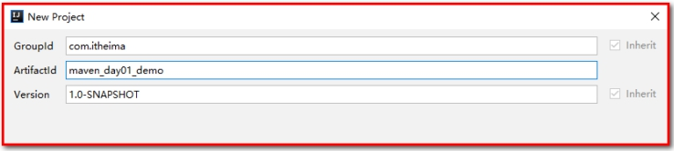 

 点击依赖`关系图`按钮


## 2.1. 第一声明优先原则 

​	哪个jar包在靠上的位置，这个jar包就是先声明的，先声明的jar包下的依赖包，可以优先引入项目中。

​	我们在pom.xml中引入如下坐标，分别是spring中不同的版本。

```xml
<?xml version="1.0" encoding="UTF-8"?>
<project xmlns="http://maven.apache.org/POM/4.0.0"
         xmlns:xsi="http://www.w3.org/2001/XMLSchema-instance"
         xsi:schemaLocation="http://maven.apache.org/POM/4.0.0 http://maven.apache.org/xsd/maven-4.0.0.xsd">
    <modelVersion>4.0.0</modelVersion>

    <groupId>com.itheima</groupId>
    <artifactId>maven_day01_demo</artifactId>
    <version>1.0-SNAPSHOT</version>

    <packaging>jar</packaging>

    <!--导入相关依赖包-->
    <dependencies>
        <!--引入spring-context，它所以来的包都会导入进来-->
        <dependency>
            <groupId>org.springframework</groupId>
            <artifactId>spring-context</artifactId>
            <version>5.0.2.RELEASE</version>
        </dependency>

        <dependency>
            <groupId>org.springframework</groupId>
            <artifactId>spring-beans</artifactId>
            <version>4.2.4.RELEASE</version>
        </dependency>
    </dependencies>

</project>
```


我们在控制面板的maven面板，点击查看依赖关系按钮，看到了包和包之间的依赖关系存在冲突，都使用了spring-core包，关系图如下：

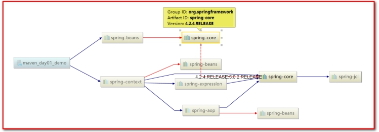 

我们再来看看他们依赖包的导入，发现导入的包却没有问题，包使用的都是5.0.2的版本。

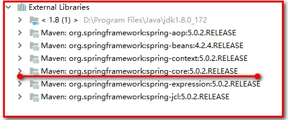 

我们把上面2个包的顺序调换后就变成了低版本的依赖导入。

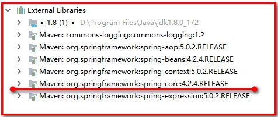 

## 2.2. 路径近者优先原则

直接依赖比传递依赖路径近，你那么最终进入项目的jar包会是路径近的直接依赖包。

直接依赖：项目中直接导入的jar包就是项目的直接依赖包。

传递依赖（间接依赖）：项目中没有直接导入的jar包，可以通过中直接依赖包传递到项目中去。

修改jar包，直接引入依赖spring-core

```xml
<!--导入相关依赖包-->
<dependencies>
    <dependency>
        <groupId>org.springframework</groupId>
        <artifactId>spring-beans</artifactId>
        <version>4.2.4.RELEASE</version>
    </dependency>

    <dependency>
        <groupId>org.springframework</groupId>
        <artifactId>spring-context</artifactId>
        <version>5.0.2.RELEASE</version>
    </dependency>

    <!--引入直接依赖-->
    <dependency>
        <groupId>org.springframework</groupId>
        <artifactId>spring-core</artifactId>
        <version>4.2.8.RELEASE</version>
    </dependency>
</dependencies>
```

此时优先引入的是直接依赖的引用

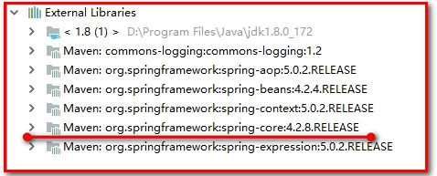 

## 2.3. 直接排除法

问题：整合项目需要用到5的版本，引入4的版本，会不会出现异常（类没有找到，方法没有找到）

解决方案：？

当我们需要排除某个jar包的依赖时，在配置exclusions标签的时候，内部可以不写版本号。pom.xml依赖如下：

```xml
<!--导入相关依赖包-->
<dependencies>
    <dependency>
        <groupId>org.springframework</groupId>
        <artifactId>spring-beans</artifactId>
        <version>4.2.4.RELEASE</version>
        <!--直接排除-->
        <exclusions>
            <exclusion>
                <groupId>org.springframework</groupId>
                <artifactId>spring-core</artifactId>
            </exclusion>
        </exclusions>
    </dependency>

    <dependency>
        <groupId>org.springframework</groupId>
        <artifactId>spring-context</artifactId>
        <version>5.0.2.RELEASE</version>
    </dependency>
</dependencies>
```

快捷操作：

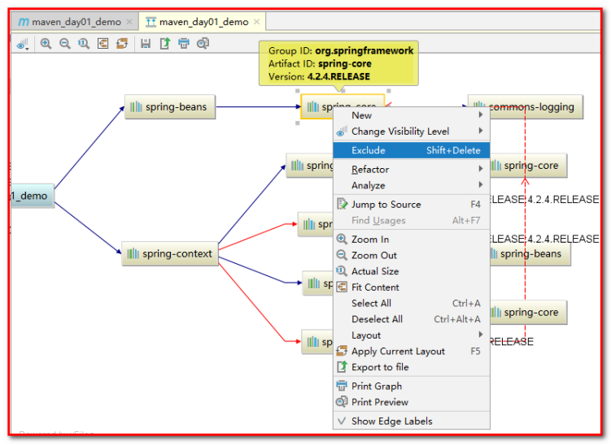 

依赖导入的jar包如下：

没有添加exclusion之前

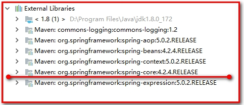 

添加exclusion之后，因为排除了4.2.4的版本spring-core的jar包

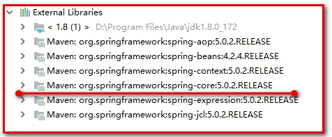 

在pom.xml文件中

### 【小结】

真实项目中，出现1个项目存在多个同种jar包的时候，需要我们进行解决maven的jar包冲突问题（异常：Class not found、Method not found等）

1：第一声明优先原则

2：路径近者优先

3：直接排除原则

# 3. 工程拆分

## 我的总结

### 单点架构和分布式架构的区别


### 需要配置的内容


## 课程笔记

回顾之前面面项目单体架构开发：

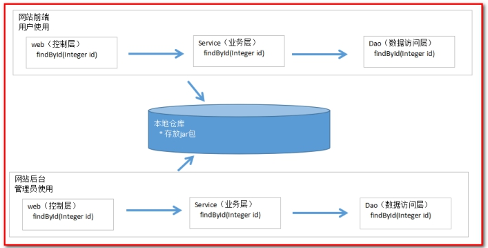 

工程拆分后的开发：所有的service和dao的代码都在一起，1：增强程序的通用性，2：降低了代码的耦合性

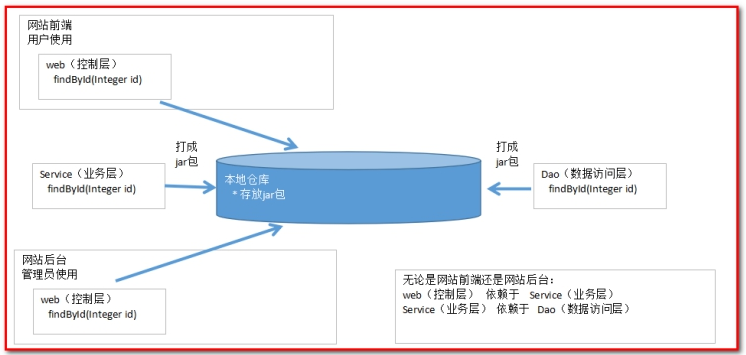 

### 【目标】

理解聚合与继承

完成模块构建maven工程

### 【路径】

1：聚合和继承

2：准备数据库环境

3：ssm_parent（父工程）

4：ssm_model（子工程）

5：ssm_dao（子工程）

6：ssm_service（子工程）

7：ssm_web（子工程）

8：测试（工程发布tomcat）

### 【讲解】

## 3.1. 聚合与继承

继承和聚合结构图：

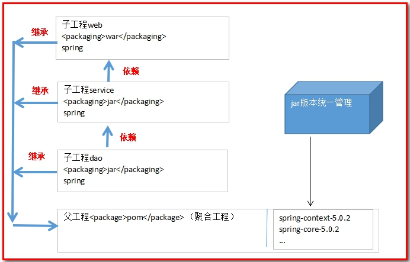 

· 何为继承？

​	继承是为了消除重复，如果将 dao、 service、 web 分开创建独立的工程则每个工程的 pom.xml 文件中的内容存在重复，比如：设置编译版本、锁定 spring 的版本的等，可以将这些重复的 配置提取出来在父工程的 pom.xml 中定义。

· 何为聚合？

​	项目中运行整个工程需要将每个模块聚合在 一起运行，比如： dao、 service、 web 三个工程最终会打一个独立的 war 运行。

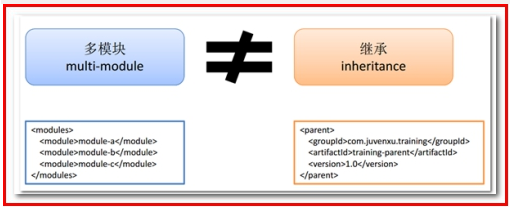 

## 3.2. 准备数据库环境

* 创建数据库itcast_maven，执行items.sql

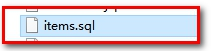 

* 创建表

```sql
SET FOREIGN_KEY_CHECKS=0;
-- ----------------------------
-- Table structure for `items`
-- ----------------------------
DROP TABLE IF EXISTS `items`;
CREATE TABLE `items` (
  `id` int(10) NOT NULL auto_increment,
  `name` varchar(20) default NULL,
  `price` float(10,0) default NULL,
  `pic` varchar(40) default NULL,
  `createtime` datetime default NULL,
  `detail` varchar(200) default NULL,
  PRIMARY KEY  (`id`)
) ENGINE=InnoDB AUTO_INCREMENT=9 DEFAULT CHARSET=utf8;

-- ----------------------------
-- Records of items
-- ----------------------------
INSERT INTO `items` VALUES ('1', '传智播客web课程', '1000', null, '2018-03-13 09:29:30', '带我走上人生巅峰');
INSERT INTO `items` VALUES ('2', '黑马之路', null, null, '2018-03-28 10:05:52', '插入测试');
INSERT INTO `items` VALUES ('3', '黑马之路二', '199', null, '2018-03-07 10:08:04', '插入测试');
INSERT INTO `items` VALUES ('7', '插入测试', null, null, null, null);
INSERT INTO `items` VALUES ('8', '插入测试', null, null, null, null);
```

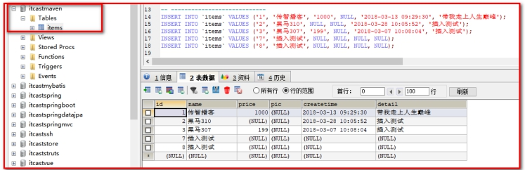 

## 3.3. ssm_parent

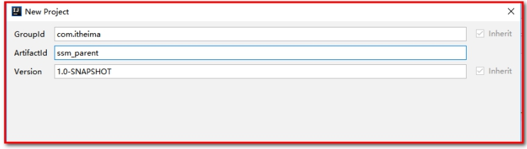 

删除src文件夹

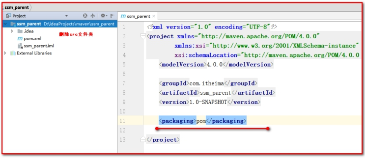 

### 3.3.1. pom.xml

 父工程：<packaging>pom</packaging>

```xml
<?xml version="1.0" encoding="UTF-8"?>
<project xmlns="http://maven.apache.org/POM/4.0.0"
         xmlns:xsi="http://www.w3.org/2001/XMLSchema-instance"
         xsi:schemaLocation="http://maven.apache.org/POM/4.0.0 http://maven.apache.org/xsd/maven-4.0.0.xsd">
    <modelVersion>4.0.0</modelVersion>

    <groupId>com.itheima</groupId>
    <artifactId>ssm_parent</artifactId>
    <version>1.0-SNAPSHOT</version>
    
	<!--打包方式为pom-->
    <packaging>pom</packaging>

    <!--
        特殊属性定义，一般是版本号
    -->
    <properties>
        <spring.version>5.0.2.RELEASE</spring.version>
        <slf4j.version>1.6.6</slf4j.version>
        <log4j.version>1.2.12</log4j.version>
        <mysql.version>5.1.6</mysql.version>
        <mybatis.version>3.4.5</mybatis.version>
        <aspectjweaver.version>1.6.8</aspectjweaver.version>
        <junit.version>4.12</junit.version>
        <jsp-api.version>2.0</jsp-api.version>
        <servlet-api.version>2.5</servlet-api.version>
        <jstl.version>1.2</jstl.version>
        <mybatis-spring.version>1.3.0</mybatis-spring.version>
        <druid.version>1.0.9</druid.version>
        <!--文件的编码格式-->
        <project.build.sourceEncoding>UTF-8</project.build.sourceEncoding>
        <project.reporting.outputEncoding>UTF-8</project.reporting.outputEncoding>
    </properties>

    <!--
        jar包管理
        dependencyManagement:并非导入依赖，而只是管理依赖（这样子工程可供选择）
    -->
    <dependencyManagement>
        <!--引入依赖-->
        <dependencies>
            <!-- spring（切面） -->
            <dependency>
                <groupId>org.aspectj</groupId>
                <artifactId>aspectjweaver</artifactId>
                <version>${aspectjweaver.version}</version>
            </dependency>
			<!-- spring（aop） -->
            <dependency>
                <groupId>org.springframework</groupId>
                <artifactId>spring-aop</artifactId>
                <version>${spring.version}</version>
            </dependency>

            <!--spring包（核心）-->
            <dependency>
                <groupId>org.springframework</groupId>
                <artifactId>spring-context</artifactId>
                <version>${spring.version}</version>
            </dependency>

            <!--用于SpringMVC-->
            <dependency>
                <groupId>org.springframework</groupId>
                <artifactId>spring-webmvc</artifactId>
                <version>${spring.version}</version>
            </dependency>
            <dependency>
                <groupId>org.springframework</groupId>
                <artifactId>spring-web</artifactId>
                <version>${spring.version}</version>
            </dependency>

            <!--用于数据库源相关操作-->
            <!-- spring（整合jdbc） -->
            <dependency>
                <groupId>org.springframework</groupId>
                <artifactId>spring-jdbc</artifactId>
                <version>${spring.version}</version>
            </dependency>
			<!-- spring（事务） -->
            <dependency>
                <groupId>org.springframework</groupId>
                <artifactId>spring-tx</artifactId>
                <version>${spring.version}</version>
            </dependency>

            <!--Servlet相关API（可以使用Request、Response）-->
            <dependency>
                <groupId>javax.servlet</groupId>
                <artifactId>servlet-api</artifactId>
                <version>${servlet-api.version}</version>
                <scope>provided</scope>
            </dependency>

            <dependency>
                <groupId>javax.servlet.jsp</groupId>
                <artifactId>jsp-api</artifactId>
                <version>${jsp-api.version}</version>
                <scope>provided</scope>
            </dependency>

            <!--jstl标签-->
            <dependency>
                <groupId>jstl</groupId>
                <artifactId>jstl</artifactId>
                <version>${jstl.version}</version>
            </dependency>

            <!--MySQL数据库驱动-->
            <dependency>
                <groupId>mysql</groupId>
                <artifactId>mysql-connector-java</artifactId>
                <version>${mysql.version}</version>
				<scope>runtime</scope>
            </dependency>

            <!--spring测试-->
            <dependency>
                <groupId>org.springframework</groupId>
                <artifactId>spring-test</artifactId>
                <version>${spring.version}</version>
            </dependency>

            <dependency>
                <groupId>junit</groupId>
                <artifactId>junit</artifactId>
                <version>${junit.version}</version>
                <scope>test</scope>
            </dependency>


            <!-- log日志 start -->
            <dependency>
                <groupId>log4j</groupId>
                <artifactId>log4j</artifactId>
                <version>${log4j.version}</version>
            </dependency>

            <dependency>
                <groupId>org.slf4j</groupId>
                <artifactId>slf4j-api</artifactId>
                <version>${slf4j.version}</version>
            </dependency>

            <dependency>
                <groupId>org.slf4j</groupId>
                <artifactId>slf4j-log4j12</artifactId>
                <version>${slf4j.version}</version>
            </dependency>
            <!-- log end -->

            <!--mybatis-->
            <dependency>
                <groupId>org.mybatis</groupId>
                <artifactId>mybatis</artifactId>
                <version>${mybatis.version}</version>
            </dependency>

            <!--MyBatis集成Spring-->
            <dependency>
                <groupId>org.mybatis</groupId>
                <artifactId>mybatis-spring</artifactId>
                <version>${mybatis-spring.version}</version>
            </dependency>

            <!--数据源-->
            <dependency>
                <groupId>com.alibaba</groupId>
                <artifactId>druid</artifactId>
                <version>${druid.version}</version>
            </dependency>
        </dependencies>
    </dependencyManagement>

	<!--插件管理-->
    <build>
        <pluginManagement>
            <!--插件-->
            <plugins>
                <!--tomcat插件-->
                <plugin>
                    <groupId>org.apache.tomcat.maven</groupId>
                    <artifactId>tomcat7-maven-plugin</artifactId>
                    <version>2.2</version>
                    <!--插件使用的相关配置-->
                    <configuration>
                        <!--端口号-->
                        <port>18081</port>
              <!--写当前项目的名字(虚拟路径),如果写/，那么每次访问项目就不需要加项目名字了-->
                        <path>/</path>
                        <!--解决get请求乱码-->
                        <uriEncoding>UTF-8</uriEncoding>
                    </configuration>
                </plugin>
            </plugins>
        </pluginManagement>
    </build>

</project>
```

 【小结】

- <package>pom</pcakage>

* 管理所有的jar包（并锁定版本）
* 父工程不需要开发的代码，src的文件夹可以删除

## 3.4. ssm_model

【路径】

1：配置pom.xml

2：创建Items.java

选择Module

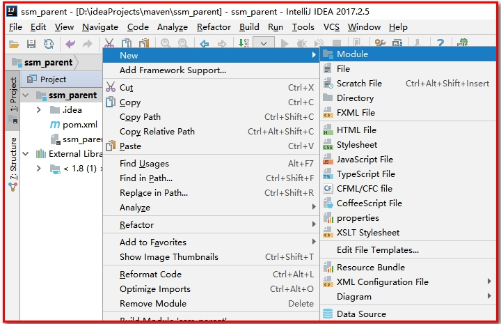 

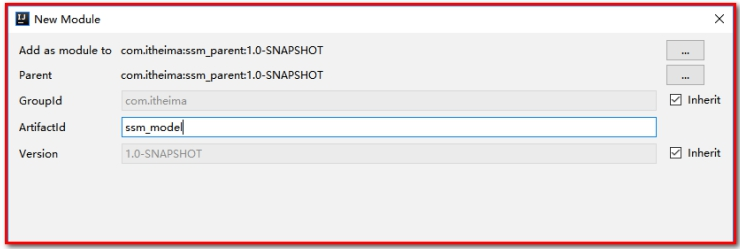 

对应数据库的表和字段

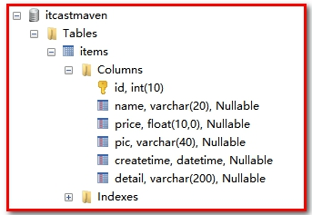 

### 3.4.1. pom.xml

查看子工程pom.xml

```xml
<?xml version="1.0" encoding="UTF-8"?>
<project xmlns="http://maven.apache.org/POM/4.0.0"
         xmlns:xsi="http://www.w3.org/2001/XMLSchema-instance"
         xsi:schemaLocation="http://maven.apache.org/POM/4.0.0 http://maven.apache.org/xsd/maven-4.0.0.xsd">
    <parent>
        <artifactId>ssm_parent</artifactId>
        <groupId>com.itheima</groupId>
        <version>1.0-SNAPSHOT</version>
    </parent>
    <modelVersion>4.0.0</modelVersion>

    <!--聚合配置:model-->
    <artifactId>ssm_model</artifactId>
    <!--默认jar方式:输入也行-->
    <packaging>jar</packaging>

</project>
```

查看父工程pom.xml

表示聚合了ssm_model

```xml
<modules>
    <module>ssm_model</module>
</modules>
```

 

### 3.4.2. 创建Items.java

```java
public class Items {

    private Integer id;
    private String name;
    private Float price;
    private String pic;
    private Date createtime;
    private String detail;
    //get..set..
}
```

【小结】

* <package>jar</pcakage>
* 管理项目中所有的实体类

## 3.5. ssm_dao

【路径】

1：配置pom.xml

2：创建spring-mybatis.xml（spring整合mybatis的配置）

3：创建ItemsDao.java

4：创建ItemsDao.xml

5：创建mybatis.xml（mybatis的配置文件）（可以省略）

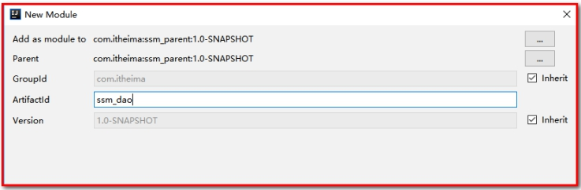 

### 3.5.1. pom.xml

```xml
<?xml version="1.0" encoding="UTF-8"?>
<project xmlns="http://maven.apache.org/POM/4.0.0"
         xmlns:xsi="http://www.w3.org/2001/XMLSchema-instance"
         xsi:schemaLocation="http://maven.apache.org/POM/4.0.0 http://maven.apache.org/xsd/maven-4.0.0.xsd">
    <parent>
        <artifactId>ssm_parent</artifactId>
        <groupId>com.itheima</groupId>
        <version>1.0-SNAPSHOT</version>
    </parent>
    <modelVersion>4.0.0</modelVersion>
	<!--聚合配置:dao-->
    <artifactId>ssm_dao</artifactId>

    <!--jar包-->
    <packaging>jar</packaging>

    <!--引入依赖-->
    <dependencies>
        <!--model的依赖:修改点:要注意路径名-->
        <dependency>
            <groupId>com.itheima</groupId>
            <artifactId>ssm_model</artifactId>
            <version>1.0-SNAPSHOT</version>
        </dependency>

        <!--mybatis-->
        <dependency>
            <groupId>org.mybatis</groupId>
            <artifactId>mybatis</artifactId>
        </dependency>

        <!--MyBatis集成Spring-->
        <dependency>
            <groupId>org.mybatis</groupId>
            <artifactId>mybatis-spring</artifactId>
        </dependency>

        <!--数据源-->
        <dependency>
            <groupId>com.alibaba</groupId>
            <artifactId>druid</artifactId>
        </dependency>

        <!--MySQL数据库驱动-->
        <dependency>
            <groupId>mysql</groupId>
            <artifactId>mysql-connector-java</artifactId>
        </dependency>

        <!--SpringJdbc -->
        <dependency>
            <groupId>org.springframework</groupId>
            <artifactId>spring-jdbc</artifactId>
        </dependency>

        <!-- log start -->
        <dependency>
            <groupId>log4j</groupId>
            <artifactId>log4j</artifactId>
        </dependency>

        <dependency>
            <groupId>org.slf4j</groupId>
            <artifactId>slf4j-api</artifactId>
        </dependency>

        <dependency>
            <groupId>org.slf4j</groupId>
            <artifactId>slf4j-log4j12</artifactId>
        </dependency>
        <!-- log end -->
        
        <dependency>
            <groupId>org.springframework</groupId>
            <artifactId>spring-context</artifactId>
        </dependency>
    </dependencies>
</project>
```

查看父工程pom.xml

```xml
<modules>
    <module>ssm_model</module>
    <module>ssm_dao</module>
</modules>
```

### 3.5.2. 创建spring-mybatis.xml

【路径】

1：数据库连接池

2：SqlSessionFactoryBean

3：Dao层接口扫描，让Dao被spring管理

* 在resources下创建Spring配置文件:spring-mybatis.xml
  * 

```xml
<?xml version="1.0" encoding="UTF-8"?>
<beans xmlns="http://www.springframework.org/schema/beans"
       xmlns:xsi="http://www.w3.org/2001/XMLSchema-instance"
       xsi:schemaLocation="http://www.springframework.org/schema/beans http://www.springframework.org/schema/beans/spring-beans.xsd">
    <!--1.数据库连接池-->
    <bean id="dataSource" class="com.alibaba.druid.pool.DruidDataSource">
        <property name="driverClassName" value="com.mysql.jdbc.Driver"/>
        <!--修改点:===>修改数据库的信息-->
        <property name="url" value="jdbc:mysql://localhost:3306/itcast_maven?characterEncoding=utf8"/>
        <property name="username" value="root"/>
        <property name="password" value="admin"/>
    </bean>

    <!--2.配置sqlSessionFactoryBean-->
    <bean id="sqlSessionFactory" class="org.mybatis.spring.SqlSessionFactoryBean">
        <!--配置数据源-->
        <property name="dataSource" ref="dataSource"/>
        <!--别名配置--><!--修改点:===>pojo包的别名-->
        <property name="typeAliasesPackage" value="com.itheima.pojo"/>
        <!--mybatis核心配置文件 -->
        <!-- <property name="configuration" value="classpath:sqlMap.xml"/>-->
        <!--映射文件配置-->
        <!--<property name="mapperLocations">
            <array>
                <value>com/itheima/*Dao.xml</value>
            </array>
        </property>-->

    </bean>
    <!--3.dao接口扫描-->
    <bean class="org.mybatis.spring.mapper.MapperScannerConfigurer">
        <!--修改点:===>固定扫描dao包的别名-->
        <property name="basePackage" value="com.itheima.dao"/>
    </bean>
</beans>
```


### 3.5.3. 创建ItemsDao.java接口(映射器)

```java
public interface ItemsDao {

    /***
     * 查询所有
     * @return
     */
    List<Items> findAll();

    /***
     * 保存操作
     * @param items
     * @return
     */
    int save(Items items);
}
```

 

### 3.5.4. 创建ItemsDao.xml配置文件(写SQL语句)

在com/itheima/ssm/dao/ItemsDao.xml

```xml
<?xml version="1.0" encoding="UTF-8" ?>
<!DOCTYPE mapper
        PUBLIC "-//mybatis.org//DTD Mapper 3.0//EN"
        "http://mybatis.org/dtd/mybatis-3-mapper.dtd">
<!--
    namespace="Dao接口的全限定名"
-->
<mapper namespace="com.itheima.dao.ItemsDao">
    <!--保存操作-->
    <insert id="save" parameterType="Items">
        INSERT  INTO items(name,price,pic,createtime,detail) VALUES(#{name},#{price},#{pic},#{createtime},#{detail})
    </insert>

    <!--查询所有-->
    <select id="findAll" resultType="Items">
        SELECT * FROM  items
    </select>
</mapper>
```

### 3.5.5. 创建sqlMapConfig.xml（可以省略）

在resources下创建mybatis.xml

```xml
<?xml version="1.0" encoding="UTF-8" ?>
<!DOCTYPE configuration
        PUBLIC "-//mybatis.org//DTD Config 3.0//EN"
        "http://mybatis.org/dtd/mybatis-3-config.dtd">
<configuration>
</configuration>
```

### 3.5.6 dao测试

在test下创建DaoTest

```
public class DaoTest {
    public static void main(String[] args) {
        //创建容器(加载Mybatis的配置文件)
        ApplicationContext app = new ClassPathXmlApplicationContext("classpath:spring_mybatis.xml");
        //获取容器对象
        ItemsDao bean = app.getBean(ItemsDao.class);
   
        //实现查询功能
        List<Items> all = bean.findAll();
        for (Items items : all) {
            System.out.println("商品列表:"+items);
        }
        
        
        //封装数据
        Items items = new Items();
        items.setName("商品名称");
        items.setPrice(16666F);
        items.setCreatetime(new Date());
        //实现保存商品功能
        if ( bean.save(items) != 0) {
            System.out.println("添加成功");
        }
}
```

【小结】

* <package>jar</pcakage>
* 引入依赖     ssm_model     、mybatis的依赖...
* spring-mybatis.xml（spring的配置文件）（spring整合mybatis的框架）
* 接口ItemsDao.java
* 创建映射文件ItemsDao.xml

## 3.6. ssm_service

【路径】

1：pom.xml

2：创建spring-service.xml（spring的声明式事务处理）

3：创建ItemsService接口

4：创建ItemsServiceImpl实现类

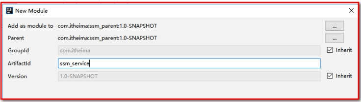 

### 3.6.1. pom.xml

```xml
<?xml version="1.0" encoding="UTF-8"?>
<project xmlns="http://maven.apache.org/POM/4.0.0"
         xmlns:xsi="http://www.w3.org/2001/XMLSchema-instance"
         xsi:schemaLocation="http://maven.apache.org/POM/4.0.0 http://maven.apache.org/xsd/maven-4.0.0.xsd">
    <parent>
        <artifactId>ssm_parent</artifactId>
        <groupId>com.itheima</groupId>
        <version>1.0-SNAPSHOT</version>
    </parent>
    <modelVersion>4.0.0</modelVersion>

    <artifactId>ssm_service</artifactId>

    <!--jar包-->
    <packaging>jar</packaging>

    <!--依赖-->
    <dependencies>
        <!--依赖dao:修改点:要注意路径名-->
        <dependency>
            <groupId>com.itheima</groupId>
            <artifactId>ssm_dao</artifactId>
            <version>1.0-SNAPSHOT</version>
        </dependency>

        <!-- spring -->
        <dependency>
            <groupId>org.aspectj</groupId>
            <artifactId>aspectjweaver</artifactId>
        </dependency>

        <dependency>
            <groupId>org.springframework</groupId>
            <artifactId>spring-aop</artifactId>
        </dependency>

        <dependency>
            <groupId>org.springframework</groupId>
            <artifactId>spring-context</artifactId>
        </dependency>

        <dependency>
            <groupId>org.springframework</groupId>
            <artifactId>spring-tx</artifactId>
        </dependency>
    </dependencies>
</project>
```

查看父工程pom.xml

```xml
<modules>
    <module>ssm_model</module>
    <module>ssm_dao</module>
    <module>ssm_service</module>
</modules>
```

 

### 3.6.2. 创建spring-service.xml

【路径】

1：创建一个事务管理器

2：配置事务的通知，及传播特性，对切入点方法的细化

3：AOP声明式事务配置（配置切入点，通知关联切入点）

```xml
<?xml version="1.0" encoding="UTF-8"?>
<beans xmlns="http://www.springframework.org/schema/beans"
       xmlns:xsi="http://www.w3.org/2001/XMLSchema-instance"
       xmlns:tx="http://www.springframework.org/schema/tx"
       xmlns:aop="http://www.springframework.org/schema/aop"
       xmlns:context="http://www.springframework.org/schema/context"
       xsi:schemaLocation="http://www.springframework.org/schema/beans
       http://www.springframework.org/schema/beans/spring-beans.xsd
       http://www.springframework.org/schema/tx
       http://www.springframework.org/schema/tx/spring-tx.xsd
       http://www.springframework.org/schema/aop
       http://www.springframework.org/schema/aop/spring-aop.xsd
       http://www.springframework.org/schema/context
       http://www.springframework.org/schema/context/spring-context.xsd">
    <!--1.创建一个事务管理器-->
    <bean id="txtManager" class="org.springframework.jdbc.datasource.DataSourceTransactionManager">
        <!--指定数据源-->
        <property name="dataSource" ref="dataSource" />
    </bean>

    <!--2.方式一：声明式事务配置-->
    <tx:advice id="txAdvice" transaction-manager="txtManager">
        <!--配置传播特性属性-->
        <tx:attributes>
            <!--
                对应方法参与事务并且在事务下执行，事务隔离剂别使用默认隔离级别,发生异常需要事务回滚
            -->
            <tx:method name="add*" isolation="DEFAULT" propagation="REQUIRED" rollback-for="java.lang.Exception" />
            <tx:method name="insert*" isolation="DEFAULT" propagation="REQUIRED" rollback-for="java.lang.Exception" />
            <tx:method name="save*" isolation="DEFAULT" propagation="REQUIRED" rollback-for="java.lang.Exception" />
            <tx:method name="delete*" isolation="DEFAULT" propagation="REQUIRED" rollback-for="java.lang.Exception" />
            <tx:method name="update*" isolation="DEFAULT" propagation="REQUIRED" rollback-for="java.lang.Exception" />
            <tx:method name="edit*" isolation="DEFAULT" propagation="REQUIRED" rollback-for="java.lang.Exception" />
            <!--
                只读操作
            -->
            <tx:method name="*" read-only="true" />
        </tx:attributes>
    </tx:advice>
    <!--AOP声明式事务配置（配置切入点，通知关联切入点）-->
    <aop:config>
        <!--切点指点:修改点:注意路径-->
        <aop:pointcut id="tranpointcut" expression="execution(* com.wzw.service.*.*(..))" />
        <!--配置通知-->
        <aop:advisor advice-ref="txAdvice" pointcut-ref="tranpointcut" />
    </aop:config>
    <!--方式二：注解方式事务配置-->
    <!--<tx:annotation-driven transaction-manager="txtManager"/>-->
    <!--3.扫描service:修改点:注意路径-->
    <context:component-scan base-package="com.wzw.service"/>
    <!--4.引入spring-mybatis.xml-->
    <import resource="spring-mybatis.xml" />
</beans>
```

 

### 3.6.3. 创建ItemsService接口

```java
public interface ItemsService {

    /***
     * 列表查询
     * @return
     */
    List<Items> findAll();

    /***
     * 增加商品
     * @param items
     * @return
     */
    int save(Items items);
}
```

 

### 3.6.4. 创建ItemsServiceImpl

```java
@Service
public class ItemsServiceImpl implements ItemsService {
	//注解注入dao对象
    @Autowired
    private ItemsDao itemsDao;

    /***
     * 集合查询
     * @return
     */
    public List<Items> findAll() {
        return itemsDao.findAll();
    }

    /***
     * 增加商品测试事务
     * @param items
     * @return
     */
    public int save(Items items) {
        int acount = itemsDao.save(items);
        System.out.println("acount:"+acount);
        return acount;
    }
}
```

### 3.6.5. service测试

```
 public static void main(String[] args) {
        //创建容器
        ApplicationContext app = new ClassPathXmlApplicationContext("classpath:spring-service.xml");
        //获取对象
        ItemsService itemsService = app.getBean(ItemsService.class);
        //实现查询功能
        List<Items> all = itemsService.findAll();
        //遍历集合
        for (Items items : all) {
            System.out.println(items);
        }


        //封装数据
        Items items = new Items();
        items.setName("测试测试");
        //实现添加功能
        itemsService.save(items);
    }
```

 【小结】

* <package>jar</pcakage>
* 引入依赖   ssm_dao   、spring相关的依赖
* spring-service.xml（声明式事务处理）
* 接口ItemsService.java
* 实现类ItemsServiceImpl.java

## 3.7. ssm_web

【路径】

1：pom.xml

2：创建web.xml

3：创建springmvc.xml

4：创建ItemsController.java

5：创建页面items.jsp

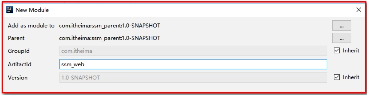 

### 3.7.1. pom.xml

```xml
<?xml version="1.0" encoding="UTF-8"?>
<project xmlns="http://maven.apache.org/POM/4.0.0"
         xmlns:xsi="http://www.w3.org/2001/XMLSchema-instance"
         xsi:schemaLocation="http://maven.apache.org/POM/4.0.0 http://maven.apache.org/xsd/maven-4.0.0.xsd">
    <parent>
        <artifactId>ssm_parent</artifactId>
        <groupId>com.itheima</groupId>
        <version>1.0-SNAPSHOT</version>
    </parent>
    <modelVersion>4.0.0</modelVersion>

    <artifactId>ssm_web</artifactId>

    <!--war包-->
    <packaging>war</packaging>

    <!--依赖引入-->
    <dependencies>
        <!--依赖service-->
        <dependency>
            <groupId>com.itheima</groupId>
            <artifactId>ssm_service</artifactId>
            <version>1.0-SNAPSHOT</version>
        </dependency>

	    <!--导入springmvc-->
        <dependency>
            <groupId>org.springframework</groupId>
            <artifactId>spring-web</artifactId>
        </dependency>

        <dependency>
            <groupId>org.springframework</groupId>
            <artifactId>spring-webmvc</artifactId>
        </dependency>

        <!--servletAPI -->
        <dependency>
            <groupId>javax.servlet</groupId>
            <artifactId>servlet-api</artifactId>
            <scope>provided</scope>
        </dependency>

        <dependency>
            <groupId>javax.servlet.jsp</groupId>
            <artifactId>jsp-api</artifactId>
            <scope>provided</scope>
        </dependency>
        
        <!--jstl表达式 -->
        <dependency>
            <groupId>jstl</groupId>
            <artifactId>jstl</artifactId>
        </dependency>

    </dependencies>


    <build>
        <!--插件-->
        <plugins>
            <!--tomcat插件-->
            <plugin>
                <groupId>org.apache.tomcat.maven</groupId>
                <artifactId>tomcat7-maven-plugin</artifactId>
                <!--插件使用的相关配置-->
                <configuration>
                    <!--端口号-->
                    <port>18081</port>
                    <!--写当前项目的名字(虚拟路径),如果写/，那么每次访问项目就不需要加项目名字了-->
                    <path>/</path>
                    <!--解决get请求乱码-->
                    <uriEncoding>UTF-8</uriEncoding>
                </configuration>
            </plugin>
        </plugins>
    </build>

</project>
```

查看父工程pom.xml

```xml
<modules>
    <module>ssm_model</module>
    <module>ssm_dao</module>
    <module>ssm_service</module>
    <module>ssm_web</module>
</modules>
```

### 3.7.2.创建web.xml

【路径】

1:配置编码过滤器

2:springmvc前端核心控制器

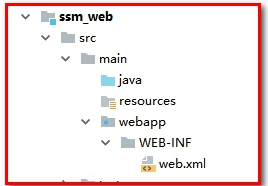 

```xml
<?xml version="1.0" encoding="UTF-8"?>
<web-app xmlns="http://xmlns.jcp.org/xml/ns/javaee"
         xmlns:xsi="http://www.w3.org/2001/XMLSchema-instance"
         xsi:schemaLocation="http://xmlns.jcp.org/xml/ns/javaee http://xmlns.jcp.org/xml/ns/javaee/web-app_3_1.xsd"
         version="3.1">
    <!--1.配置编码过滤器-->
    <filter>
        <filter-name>encodingFilter</filter-name>
        <filter-class>org.springframework.web.filter.CharacterEncodingFilter</filter-class>
        <!--编码设置-->
        <init-param>
            <param-name>encoding</param-name>
            <param-value>UTF-8</param-value>
        </init-param>
    </filter>
    <filter-mapping>
        <filter-name>encodingFilter</filter-name>
        <url-pattern>/*</url-pattern>
    </filter-mapping>

    <!--2.springmvc核心控制器-->
    <servlet>
        <servlet-name>dispatcherServlet</servlet-name>
        <servlet-class>org.springframework.web.servlet.DispatcherServlet</servlet-class>
        <init-param>
            <param-name>contextConfigLocation</param-name>
            <param-value>classpath:spring-mvc.xml</param-value>
        </init-param>
        <!--启动优先级-->
        <load-on-startup>1</load-on-startup>
    </servlet>
    <!--3.指定映射拦截-->
    <servlet-mapping>
        <servlet-name>dispatcherServlet</servlet-name>
        <url-pattern>/</url-pattern>
    </servlet-mapping>
</web-app>
```

### 3.7.3. 创建springmvc.xml

【路径】

1：包扫描

2：视图解析器

3：springmvc注解驱动，自动配置mvc的处理器适配器和处理映射器

4：静态资源不过滤

5：import导入spring.xml

```xml
<?xml version="1.0" encoding="UTF-8"?>
<beans xmlns="http://www.springframework.org/schema/beans"
       xmlns:xsi="http://www.w3.org/2001/XMLSchema-instance"
       xmlns:context="http://www.springframework.org/schema/context"
       xmlns:mvc="http://www.springframework.org/schema/mvc"
       xsi:schemaLocation="http://www.springframework.org/schema/context
        http://www.springframework.org/schema/context/spring-context.xsd
        http://www.springframework.org/schema/beans
        http://www.springframework.org/schema/beans/spring-beans.xsd http://www.springframework.org/schema/mvc http://www.springframework.org/schema/mvc/spring-mvc.xsd">
    <!--1：包扫描:修改点:注意路径-->
    <context:component-scan base-package="com.wzw.controller"/>
    <!--2：视图解析器-->
    <bean class="org.springframework.web.servlet.view.InternalResourceViewResolver">
        <property name="prefix" value="/WEB-INF/pages/"/>
        <property name="suffix" value=".jsp"/>
    </bean>
    <!--3：springmvc注解驱动，自动配置mvc的处理器适配器和处理映射器-->
    <mvc:annotation-driven/>
    <!--4：静态资源不过滤-->
    <mvc:default-servlet-handler/>
    <!--5：导入spring.xml-->
    <import resource="spring-service.xml"/>
</beans>
```

### 3.7.4. 创建ItemsController

```java
@Controller
@RequestMapping(value = "/items")
public class ItemsController {


    @Autowired
    private ItemsService itemsService;


    /*****
     * 列表访问
     * @return
     */
    @RequestMapping(value = "/list")
    public String list(Model model){
        //集合查询
        List<Items> items = itemsService.findAll();
        //存入回显
        model.addAttribute("items",items);
        return "items";
    }
    
     /**
     * 查询方式2
     */
    @RequestMapping(value = "/list2")
    public ModelAndView list(){
          ModelAndView modelAndView = new ModelAndView();
        //查询功能
        List<Items> items = itemsService.findAll();
        //添加到modelAndView中
        modelAndView.addObject("items",items);
        //设置页面名字
        modelAndView.setViewName("items");
        //返回参数和页面名字.jsp
        return modelAndView;
    }

    /***
     * 增加商品
     * @return
     */
    @RequestMapping(value = "/save")
    public String save(Items items){
        //添加功能
       int acount =  itemsService.save(items);
       //重定向跳转:集合列表页跳转
       return "redirect:/items/list";
    }

}
```

 

### 3.7.5. 创建页面items.jsp

在/WEB-INF/pages/创建items.jsp

```html
<%@ page contentType="text/html;charset=UTF-8" language="java" %>
<%@taglib prefix="c" uri="http://java.sun.com/jsp/jstl/core" %>
<html>
<head>
    <title>新增/查询</title>
</head>
<body>
<table>
    <form action="/items/save" method="post">
        <table>
            <tr>
                <td>名称</td>
                <td><input type="text" name="name"/></td>
            </tr>
            <tr>
                <td>价格</td>
                <td><input type="text" name="price"/></td>
            </tr>
            <tr>
                <td>图片</td>
                <td><input type="text" name="pic"/></td>
            </tr>
            <tr>
                <td>创建日期</td>
                <td><input type="text" name="createtime"/></td>
            </tr>
            <tr>
                <td>详情</td>
                <td><input type="text" name="detail"/></td>
            </tr>
            <tr>
                <td colspan="2">
                    <input type="submit" value="提交"/>
                </td>
            </tr>
        </table>
    </form>
</table>
<hr>
<table border="1">
    <tr>
        <td>ID</td>
        <td>name</td>
        <td>price</td>
        <td>pic</td>
        <td>createTime</td>
        <td>detail</td>
        <td></td>
    </tr>
    <c:forEach items="${items}" var="item">
        <tr>
            <td>${item.id}</td>
            <td>${item.name}</td>
            <td>${item.price}</td>
            <td>${item.pic}</td>
            <td>${item.createtime}</td>
            <td>${item.detail}</td>
        </tr>
    </c:forEach>
</table>

</body>
</html>
```

 【小结】

* <package>war</pcakage>
* 引入依赖    ssm_service   、 springmvc   、 servlet_api等
* springmvc.xml（springmvc的相关配置）
* web.xml（springmvc的核心控制器、post乱码过滤器）
* 类ItemsController.java
* 测试页面items.jsp

## 3.8. 测试

【路径】

1：测试打包package、安装install（演示maven聚合）

2：发布到外部tomcat

3：使用maven的tomcat插件发布

### 3.8.1. 方式一：tomcat插件发布（配置父工程）

创建

  

* 插件的相关配置


使用http://localhost:18081/items/list测试：

 


### 3.8.2. 方式二：tomcat插件发布（配置web工程）

* 在父工程打包

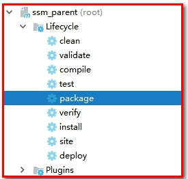 

我的


* 所有的子工程都会被打包（package）。这就是“聚合”的作用。
  * 也可以同时安装（install），同时部署（deploy）

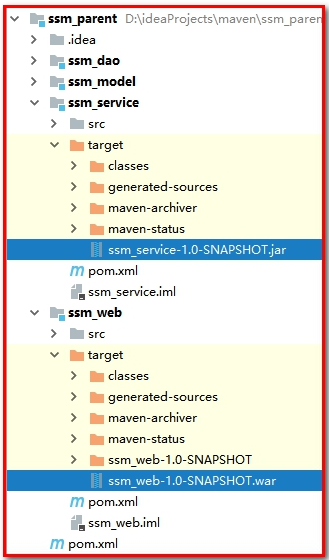 

【小结】

使用maven内置的tomcat插件的时候 ：

第一种：配置D:\ideaProjects\ssm_parent：parent是有聚合的功能，不需要将ssm_parent，ssm_model，ssm_dao，ssm_service安装到本地仓库。

第二种：配置D:\ideaProjects\ssm_parent\ssm_web：需要将ssm_parent，ssm_model，ssm_dao，ssm_service安装到本地仓库。

### 3.8.3. 方式三：发布到外部tomcat

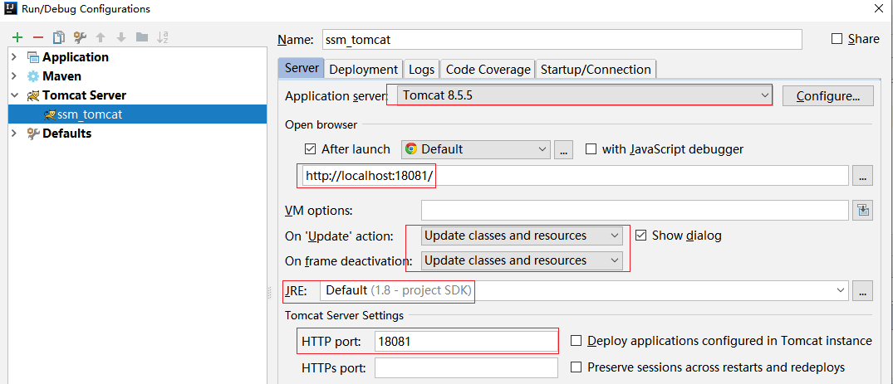 

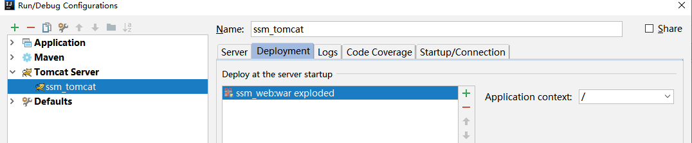 

使用http://localhost:18081/items/list测试：

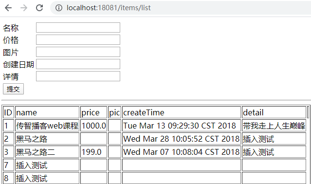 

【小结】

当使用外部tomcat进行开发的时候，不需要将ssm_parent，ssm_model，ssm_dao，ssm_service安装到本地仓库。

### 【小结】

1：聚合和继承

2：准备数据库环境

3：ssm_parent（父工程）

4：ssm_model（子工程）

5：ssm_dao（子工程）

6：ssm_service（子工程）

7：ssm_web（子工程）

8：测试（工程发布tomcat）

# 4. 扩展（Jar包自动下载失败）

当下载jar的时候，如果断网，或者连接超时的时候，会自动在文件夹中创建一个名为*.lastupdate的文件，当有了这个文件之后，当你再次联网的时候，那么该文件不会再自动联网，必须手动删除，才能正常下载使用。如果删除呢？使用工具：

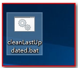 

如何使用？打开工具

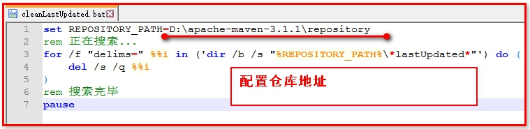 

双击运行

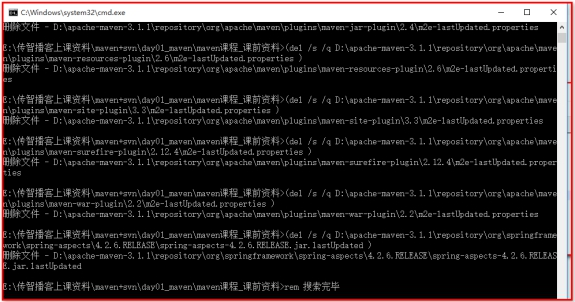 

Maven项目，如果正在下载一个jar，但是突然断网，此时，就会产生一个m2e-lastUpdated.，别指望下次上网就会自动下载，必须手动删除该文件，然后再进行下载。

# 5 **Git历史**

 

同生活中的许多伟大事件一样，Git 诞生于一个极富纷争大举创新的年代。Linux 内核开源项目有着为数众广的参与者。绝大多数的 Linux 内核维护工作都花在了提交补丁和保存归档的繁琐事务上（1991－2002年间）。到 2002 年，整个项目组开始启用分布式版本控制系统 BitKeeper 来管理和维护代码。

到 2005 年的时候，开发 BitKeeper 的商业公司同 Linux 内核开源社区的合作关系结束，他们收回了免费使用 BitKeeper 的权力。这就迫使 Linux 开源社区（特别是 Linux的缔造者 Linus Torvalds ）不得不吸取教训，只有开发一套属于自己的版本控制系统才不至于重蹈覆辙。他们对新的系统订了若干目标：

• 速度

• 简单的设计

• 对非线性开发模式的强力支持（允许上千个并行开发的分支）

• 完全分布式

• 有能力高效管理类似 Linux 内核一样的超大规模项目（速度和数据量）

# 6 **Git与svn对比**

### 【目标】

了解Git与Svn区别

### 【路径】

1：svn是什么

2：git是什么

3：了解Git与Svn区别

### 【讲解】

## 6.1 **Svn**

SVN是集中式版本控制系统，版本库是集中放在中央服务器的，而干活的时候，用的都是自己的电脑，所以首先要从中央服务器哪里得到最新的版本，然后干活，干完后，需要把自己做完的活推送到中央服务器。集中式版本控制系统是必须联网才能工作，如果在局域网还可以，带宽够大，速度够快，如果在互联网下，如果网速慢的话，就郁闷了。

下图就是标准的集中式版本控制工具管理方式：

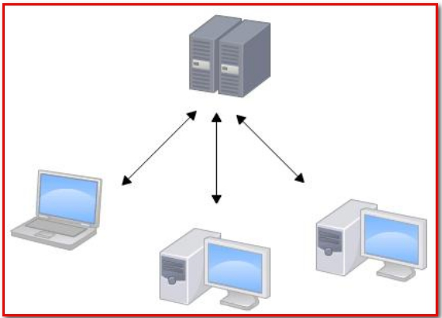 

集中管理方式在一定程度上看到其他开发人员在干什么，而管理员也可以很轻松掌握每个人的开发权限。

但是相较于其优点而言，集中式版本控制工具缺点很明显：

- 服务器单点故障


- 容错性差

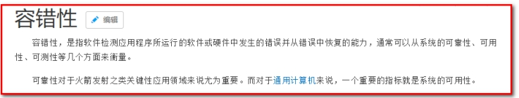 

## 6.2 **Git**

Git是分布式版本控制系统，那么它就没有中央服务器的，每个人的电脑就是一个完整的版本库，这样，工作的时候就不需要联网了，因为版本都是在自己的电脑上。既然每个人的电脑都有一个完整的版本库，那多个人如何协作呢？比如说自己在电脑上改了文件A，可以将文件A提交到本地版本库；其他人也在电脑上改了文件A，也可以将文件A提交到自己的本地版本库，这时，你们俩之间只需把本地版本库的内容各自的修改推送给对方（使用共享版本库，例如github、码云...），就可以互相看到对方的修改了。

### 【小结】

svn：集中式版本控制工具（服务器完成对文件的版本控制）（一个仓库）

git：分布式版本控制工具（客户端、服务器都可以完成对文件的版本控制）（两个仓库，本地仓库、远程仓库）

# 7 git工作流程（重点）

一般工作流程如下：

1．从远程仓库中克隆 Git 资源作为本地仓库。

2．从本地仓库中checkout代码然后进行代码修改

3．在提交前先将代码提交到暂存区。

4．提交执行commit命令。提交到本地仓库。本地仓库中保存修改的各个历史版本。

5．在修改完成后，需要和团队成员共享代码时，可以将本地仓库的代码push到远程仓库。

下图展示了 Git 的工作流程：

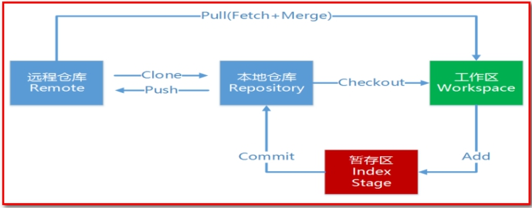 

【小结】

1：本地仓库：

​	工作区？

​	暂存区？

​	命令：add（添加到暂存区）；commit（提交到本地仓库）

2：远程仓库：

​	命令：clone（远程仓库的代码克隆到本地仓库）；pull（将代码从远程仓库拉取到本地开发）；push（将代码从本地仓库推送到远程仓库）

​	clone与pull的区别

​	clone：第一次连接远程仓库

​	pull：第一次用clone命令，如果已经连接是哪个，其他都用pull命令拉取

# 8 **Git的安装**

最早Git是在Linux上开发的，很长一段时间内，Git也只能在Linux和Unix系统上跑。不过，慢慢地有人把它移植到了Windows上。现在，Git可以在Linux、Unix、Mac和Windows这几大平台上正常运行了。由于开发机大多数情况都是windows，所以本教程只讲解windows下的git的安装及使用。

### 【目标】

git安装和使用

### 【路径】

1：软件下载

2：软件安装

​	（1）安装Git for windows

​	（2）安装TortoiseGit客户端

​	（3）安装TortoiseGit中文语言包

### 【讲解】

## 8.1 **软件下载**

下载地址：

<https://git-scm.com/download>

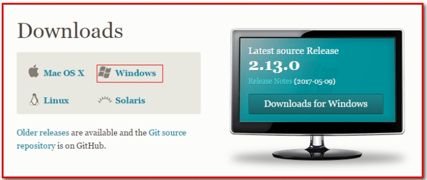 

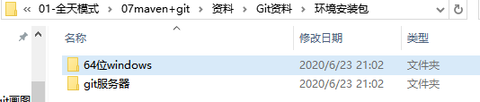 

参考资料中安装包已经下载完毕，根据不同的操作系统选择对应的安装包。

## 8.2 **软件安装**

### 8.2.1 **安装git for windows**

#### 点击事件对应的软件


#### 安装

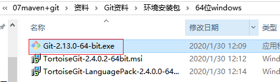 

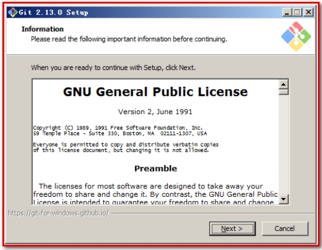 

一路“下一步”使用默认选项即可。

我这里安装到D盘

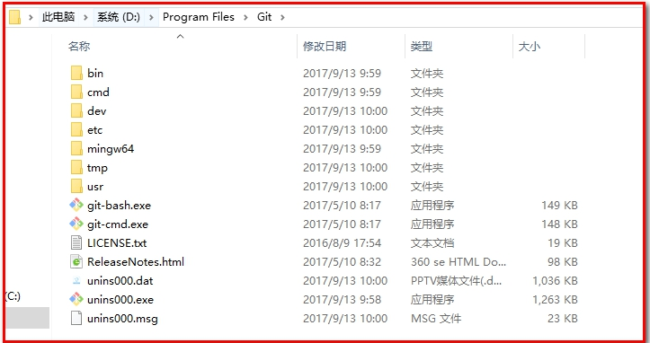 

判断是否安装成功，输入git --version

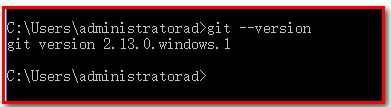  

### 8.2.2 **安装TortoiseGit**

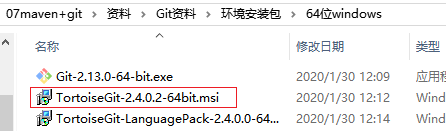  

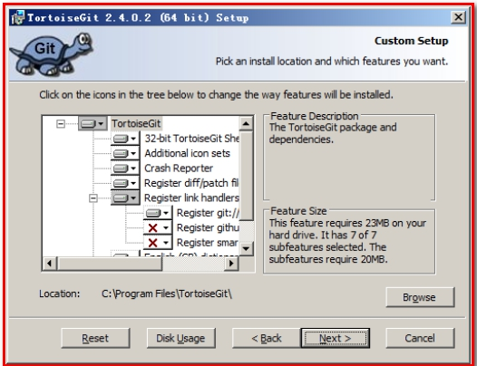  

一路“下一步”使用默认选项即可。

默认选项下会启动配置画面：

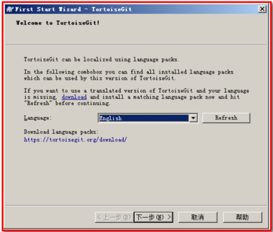  

由于目前只有英文语言包，默认即可继续下一步。

配置git.exe，在8.2.1中已经安装过git-for-windows了所以在此找到git.exe所在的目录。

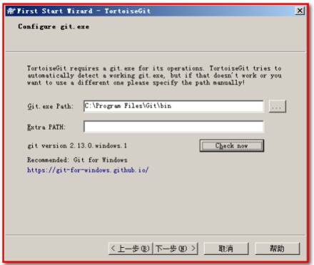  

配置开发者姓名及邮箱，每次提交代码时都会把此信息包含到提交的信息中。

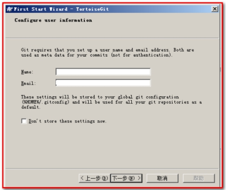  

安装完成后，查看机器的用户和email

​      命令:git config user.name

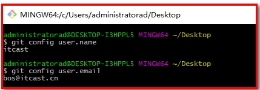  

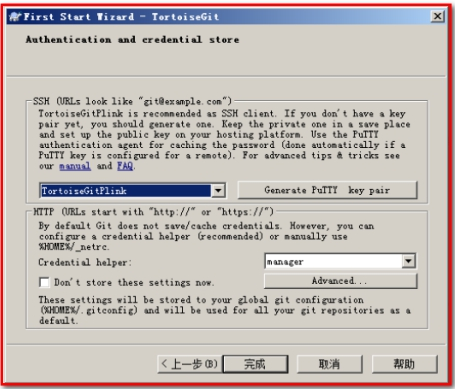  

使用默认配置，点击“完成”按钮完成配置。

完整完毕后在系统右键菜单中会出现git的菜单项。

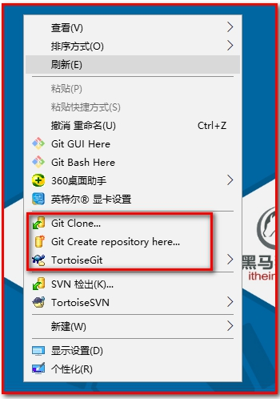  

### 8.2.3 **安装中文语言包**

安装中文语言包并不是必选项。可以根据个人情况来选择安装。

  

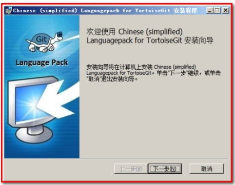   

直接“下一步”完整完毕。

语言包安装完毕后可以在TortoiseGit的”设置”中调整语言

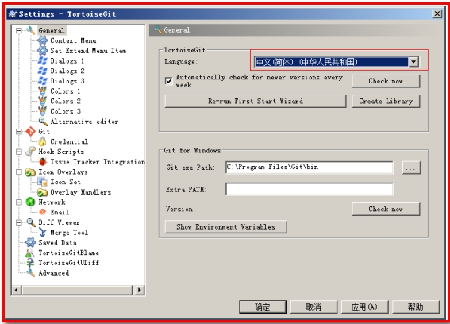   

### 【小结】

​	（1）安装Git for windows（先安装Git，再安装TortoiseGit）

​		安装成功，在cmd下执行，git --version

​	（2）安装TortoiseGit客户端（重启电脑）

​	（3）安装TortoiseGit中文语言包

# 9 使用git管理文件版本（本地仓库）

### 【目标】

使用git在本地仓库完成版本控制，及相关命令的是使用。

### 【路径】

1：创建版本库

2：添加文件

3：修改文件

4：删除文件

5：删除文件并保留副本

6：将java工程提交到版本库

7：忽略文件（提交版本库时，可忽略某些文件）

### 【讲解】

## 9.1 **创建版本库**

​	什么是版本库呢？版本库又名仓库，英文名repository，你可以简单理解成一个目录，这个目录里面的所有文件都可以被Git管理起来，每个文件的新增、修改、删除，Git都能跟踪，以便任何时刻都可以追踪历史，或者在将来某个时刻可以“还原”。由于git是分布式版本管理工具，所以git在不需要联网的情况下也具有完整的版本管理能力。

​	创建一个版本库非常简单，可以使用git bash也可以使用TortoiseGit。首先，选择一个合适的地方，创建一个空目录（F:\repository）。

### 9.1.1 **使用GitBash**

在当前目录中点击右键中选择Git Bash来启动。

     

或者在开始菜单中启动。注意如果是从开始菜单启动的gitbash需要切换目录到仓库所在的目录。

   

创建仓库执行命令：

$ git init

   

查看

   

测试一下，git --bare init

   

### 【小结】

（1）git init 有工作空间，可以编码，一般用于客户端

（2）git --bare init没有有工作空间，不可以编码，一般用于服务端

### 9.1.2 **使用TortoiseGit**

使用TortoiseGit时只需要在目录中点击右键菜单选择“在这里创建版本库”

   

   

 

版本库创建成功，会在此目录下创建一个.git的隐藏目录（叫做版本库），如下所示：

 

在windows中如何显示隐藏目录？

 

 

**概念：**

**版本库**：“.git”目录就是版本库，将来文件都需要保存到版本库中。

**工作目录（工作区）**：包含“.git”目录的目录，也就是.git目录的上一级目录就是工作目录。只有工作目录中的文件或者是文件夹才能保存到版本库中。

## 9.2 **添加文件**

### 9.2.1 **添加文件过程**

在F:\repository目录下创建一个mytest.txt文件

 

 

 

文本文件变为带“+”号的图标，表示该文件被放置到暂存区中：

 

提交文件：在mytest.txt上再次点击右键选择“提交”，此时将文件保存至版本库中。

 

 

 

查看文件：

 

### 9.2.2 **工作区和暂存区**

Git和其他版本控制系统如SVN的一个不同之处就是有暂存区的概念。

什么是工作区（Working Directory）？

​	工作区就是你在电脑里能看到的目录，比如我的reporstory/repo1文件夹就是一个工作区。

什么是版本库？

​	在这个工作区目录中的“.git”隐藏文件夹是版本库。

​	Git的版本库里存了很多东西，其中最重要的就是称为stage（或者叫index）的暂存区，还有Git为我们自动创建的第一个分支master，以及指向master的一个指针叫HEAD。

如下图所示：


​	分支和HEAD的概念我们稍后再讲。前面讲了我们把文件往Git版本库里添加的时候，是分两步执行的：

​	第一步是用git add把文件添加进去，实际上就是把文件修改添加到暂存区；

​	第二步是用git commit提交更改，实际上就是把暂存区的所有内容提交到当前分支（默认是master）。

 

​	因为我们创建Git版本库时，Git自动为我们创建了唯一一个master分支，所以，现在，git commit就是往master分支上提交更改。

​	你可以简单理解为，需要提交的文件修改通通放到暂存区，然后，一次性提交暂存区的所有修改。

​	查看版本库，可点击“版本库浏览器”

 

 

## 9.3 **修改文件**

### 9.3.1 **提交修改**

被版本库管理的文件不可避免的要发生修改，此时只需要直接对文件修改即可。修改完毕后需要将文件的修改提交到版本库。

在mytest.txt文件上点击右键，然后选择“提交”
 

 

 

### 9.3.2 查看修改历史（如果修改有误，用于恢复到历史版本）

在开发过程中可能会经常查看代码的修改历史，或者叫做修改日志。来查看某个版本是谁修改的，什么时间修改的，修改了哪些内容。

可以在文件上点击右键选择“显示日志”来查看文件的修改历史。

 

 

可以【导出】指定版本，如果编写错误，用于还原到历史版本。

 

### 9.3.3 **差异比较**

当文件内容修改后，需要和修改之前对比一下修改了哪些内容此时可以使用“比较差异功能”

 

 

### 9.3.4 **还原修改**

当文件修改后不想把修改的内容提交，还想还原到未修改之前的状态。此时可以使用“还原”功能

 

 

 

**注意：此操作会撤销所有未提交的修改，所以当使用还原操作是需要慎重慎重！！！**

## 9.4 **删除文件**

需要删除无用的文件时可以使用git提供的删除功能直接将文件从版本库中删除。

 

此时不是真的删除，可以通过还原功能，还原文件。

 

如果真的想删除文件，可以选择【提交】

 

如果文件版本库也被删除，此时本地文件彻底丢失了。

## 9.5 **删除文件并保留副本**

 

 

此时文件删除，但是本地参考仍然存在，执行【提交】可以删除版本库的文件，但是mytest3.txt在本地会保留。

 

【提交】后，查看仓库，可以查看本地是存在副本文件。

 

## 9.6 案例：将java工程-提交到版本库

第一步：将参考资料中的java工程HelloProjet复制到工作目录中

第二步：将工程添加到暂存区。

 

 

 

点击确定

 

点击【确定】完成暂存区添加。

第三步：忽略文件或文件夹

在此工程中，并不是所有文件都需要保存到版本库中的例如“out”目录及目录下的文件就可以忽略。好在Git考虑到了大家的感受，这个问题解决起来也很简单，在Git工作区的根目录下创建一个特殊的.gitignore文件，然后把要忽略的文件名填进去，Git就会自动忽略这些文件。

如果使用TortoiseGit的话可以使用菜单项直接进行忽略。

 

 

 

选择保留本地文件。完成后在此文件夹内会多出一个.gitignore文件，这个文件就是文件忽略文件，当然也可以手工编辑。其中的内容就是把.idea和out目录忽略掉。

 

打开.gitinore文件

 

第四步：提交代码

将代码添加到master分支上，其中.gitignore文件也需要添加到暂存区，然后提交到版本库。

 

查看版本库浏览器，不会出现.out和.idea的文件，却多出了一个.gitignore的文本文件。

 

## 9.7 **忽略文件（.gitignore）语法规范（了解）**

空行或是以 # 开头的行即注释行将被忽略。

可以在前面添加正斜杠 / 来避免递归,下面的例子中可以很明白的看出来与下一条的区别。

可以在后面添加正斜杠 / 来忽略文件夹，例如 build/ 即忽略build文件夹。

可以使用 ! 来否定忽略，即比如在前面用了 *.apk ，然后使用 !a.apk ，则这个a.apk不会被忽略。

*用来匹配零个或多个字符，如 *.[oa] 忽略所有以".o"或".a"结尾， *~ 忽略所有以 ~ 结尾的文件（这种文件通常被许多编辑器标记为临时文件）； [] 用来匹配括号内的任一字符，如 [abc] ，也可以在括号内加连接符，如 [0-9] 匹配0至9的数； ? 用来匹配单个字符。 

看了这么多，还是应该来个例子：

.gitignore文件

```
# 忽略 .a 文件
*.a
# 不忽略 lib.a, 尽管已经在前面忽略了 .a 文件
!lib.a
# 仅在当前目录下忽略 TODO 文件， 但不包括子目录下的 subdir/TODO
/TODO
# 忽略 build/ 文件夹下的所有文件
build/
# 忽略 doc/notes.txt, 不包括 doc/server/arch.txt
doc/*.txt
# 忽略所有的 .pdf 文件，包括在 doc/ directory 下的
doc/**/*.pdf
```

### 【小结】

1：创建版本库

git init：初始化仓库

2：添加文件

git add：把文件添加进暂存区

git commit提交文件至本地仓库

3：修改文件

4：删除文件

5：删除文件并保留副本

6：将java工程提交到版本库

7：忽略文件（提交版本库时，可忽略某些文件）（了解）

# 10 **远程仓库**

### 【目标】

使用git在远程仓库完成版本控制，及相关命令的是使用，远程仓库可实现项目组人员之间的文件版本控制

### 【路径】

1：添加到远程仓库

​	（1）在github上创建仓库

​	（2）什么是ssh协议

​	（3）使用ssh协议同步到远程仓库

​	（4）使用https协议同步到远程仓库

2：从远程仓库上克隆

3：从远程仓库取代码

4：解决多人协作中版本冲突问题

### 【讲解】

## 10.1 **添加远程仓库**

现在我们已经在本地创建了一个Git仓库，又想让其他人来协作开发，此时就可以把本地仓库同步到远程仓库，同时还增加了本地仓库的一个备份。

常用的远程仓库就是github：<https://github.com/>，接下来我们演示如何将本地代码同步到github。

### 10.1.1 **在github上创建仓库**

首先你得在github上创建一个账号，这个就不演示了。然后在github上创建一个仓库：

官网：<https://github.com/>

注册账号：

 

登录：

 

新建仓库

 

登录后：选择Start a project

 

 

点击“create repository”按钮仓库就创建成功了。

 

Github支持两种同步方式“https”和“ssh”。如果使用https很简单基本不需要配置就可以使用，但是每次提交代码和下载代码时都需要输入用户名和密码（github注册的账号和密码）。如果使用ssh方式就需要客户端先生成一个密钥对，即一个公钥一个私钥。然后还需要把公钥放到githib的服务器上。这两种方式在实际开发中都有应用，所以我们都需要掌握。接下来我们先看ssh方式。

### 10.1.2 **ssh协议**

#### 10.1.2.1 什么是ssh?

SSH 为 Secure Shell（安全外壳协议）的缩写，由 IETF 的网络小组（Network Working Group）所制定。SSH 是目前较可靠，专为远程登录会话和其他网络服务提供安全性的协议。利用 SSH 协议可以有效防止远程管理过程中的信息泄露问题。

#### 10.1.2.2 **基于密匙的安全验证**

使用ssh协议通信时，推荐使用基于密钥的验证方式。你必须为自己创建一对密匙（第1步），并把公用密匙放在需要访问的服务器上（第2步）。如果你要连接到SSH服务器上，客户端软件就会向服务器发出请求，请求用你的密匙进行安全验证。服务器收到请求之后，先在该服务器上你的主目录下寻找你的公用密匙，然后把它和你发送过来的公用密匙进行比较。如果两个密匙一致，服务器就用公用密匙加密“质询”（challenge）并把它发送给客户端软件。客户端软件收到“质询”之后就可以用你的私人密匙解密再把它发送给服务器。

#### 10.1.2.3 **s**sh密钥生成

在windows下我们可以使用 Git Bash.exe来生成密钥，可以通过开始菜单或者右键菜单打开Git Bash

   

git bash 执行命令,生命公钥和私钥

```
命令: ssh-keygen -t rsa -C ‘邮箱’
其中’邮箱’为注册github的登录账号的邮箱（也可使用github注册的账号）
```

**当你创建ssh的时候：-t 表示密钥的类型 ，-b表示密钥的长度，-C 用于识别这个密钥的注释 ，这个注释你可以输入任何内容，很多网站和软件用这个注释作为密钥的名字**

**一路回车即可**

 

执行命令完成后,在window本地用户.ssh目录C:\Users\用户名\.ssh下面生成如下名称的公钥和私钥:

 

#### 10.1.2.4 **ssh密钥配置**

密钥生成后需要在github上配置密钥本地才可以顺利访问。

* 第一步


 


 

在key部分将id_rsa.pub文件内容添加进去，然后点击“Add SSH key”按钮完成配置。

 

### 10.1.3 **使用ssh协议同步到远程仓库**

同步到远程仓库

#### 10.1.3.1 **使用**TortoiseGit同步

由于TortoiseGit使用的ssh工具是“PuTTY”，git Bash使用的ssh工具是“openSSH”，如果想让TortoiseGit也使用刚才生成的密钥可以做如下配置：

右键，选择“git 同步”

 

点击管理。

 

【注意】：首先保证：ssh客户端需配置成git使用的客户端

 

exe的位置


可以重新创建一个仓库

 

 

Url：远程仓库的地址

推送URL：也是相同的（可以不填写）

Putty密钥：选择刚才生成的密钥中的私钥

 

【推送】：即push指令

查看github

 

### 10.1.4 **使用https协议同步到远程仓库**

#### 10.1.4.1 **使用TortoiseGit同步**

创建仓库mytest3

 

选择“Git同步”

 

 

 

这时候推送需要输入“用户名”和“密码”，对应注册github的账号和密码。

 

查看github

 

## 10.2 **从远程仓库克隆**

克隆远程仓库也就是从远程把仓库复制一份到本地，克隆后会创建一个新的本地仓库。选择一个任意部署仓库的目录，然后克隆远程仓库。

创建F/repository/clone_repo目录，用来存放clone下来的项目

### 10.2.1 **使用TortoiseGit：**

使用远程仓库的mytest3为例，使用https协议克隆：

 

在任意目录点击右键：

 

 

查看：F/repository/clone_repo目录

 

## 10.3 **从远程仓库取代码**

Git中从远程的分支获取最新的版本到本地有这样2个命令：

```bash
1. git fetch：相当于是从远程获取最新版本到本地，不会自动merge（合并代码）

2. git pull：相当于是从远程获取最新版本并merge到本地，上述命令其实相当于git fetch 和 git merge
```

在实际使用中，git fetch更安全一些，但是不常用！

因为在merge前，我们可以查看更新情况，然后再决定是否合并。

git pull更常用，因为即得代码又可以自动合并

如果使用TortoiseGit的话可以从右键菜单中点击“拉取”（pull）或者“获取”（fetch）

 

## 10.4 **解决版本冲突**

### 10.4.1 **制造冲突**

第一步：将aaa.txt文件，并推送（push）到远程仓库mytest中。

 

 

第二步：从远程仓库mytest中获取代码（pull）

 

 

我们试想一下两边同时修改了aaa.txt，会出现什么结果。

先提交，不会有问题；

后提交，会怎么样？

 

### 10.4.2 **解决冲突**

其中，F:/repository/repo1中的aaa.txt先提交到本地仓库，再推送到远程仓库没有问题

而F:/repository/clone_repo1/mytest中的aaa.txt先提交到本地仓库，再推送到远程仓库的时候出现问题。如图：

 

这个时候，出现版本冲突，先拉取（pull）远程仓库的代码到本地。

 

编辑冲突：

 

 

合并成一个新的文件

 

再次推送，没有问题

 

### 【小结】

1：添加到远程仓库（使用github作为远程仓库）

​	（1）在github上创建仓库

​	（2）什么是ssh协议

​	（3）使用ssh协议同步到远程仓库（push）

​	（4）使用https协议同步到远程仓库（push）

2：从远程仓库上克隆（clone）

3：从远程仓库取代码（pull）

4：解决多人协作中版本冲突问题（真实项目会经常遇到）

# 11 **分支管理（了解）**

### 【目标】

在本地仓库中使用分支，可在一个项目中使用多条路径，完成版本控制。

### 【路径】

1：分支的概念

2：使用TortoiseGit实现分支管理

（1）创建分支

（2）合并分支

（3）解决冲突

（4）删除分支

### 【讲解】

## 11.1 **分支的概念**

在我们每次的提交，Git都把它们串成一条时间线，这条时间线就是一个分支。截止到目前，只有一条时间线，在Git里，这个分支叫主分支，即master分支。HEAD指针严格来说不是指向提交，而是指向master，master才是指向提交的，所以，HEAD指向的就是当前分支。

如图：只要有本地仓库就有master分支。

 

一开始的时候，master分支是一条线，Git用master指向最新的提交，再用HEAD指向master，就能确定当前分支，以及当前分支的提交点：

 

每次提交，master分支都会向前移动一步，这样，随着你不断提交，master分支的线也越来越长。

当我们创建新的分支，例如dev时，Git新建了一个指针叫dev，指向master相同的提交，再把HEAD指向dev，就表示当前分支在dev上：

 

你看，Git创建一个分支很快，因为除了增加一个dev指针，改改HEAD的指向，工作区的文件都没有任何变化！

不过，从现在开始，对工作区的修改和提交就是针对dev分支了，比如新提交一次后，dev指针往前移动一步，而master指针不变：

 

假如我们在dev上的工作完成了，就可以把dev合并到master上。Git怎么合并呢？最简单的方法，就是直接把master指向dev的当前提交，就完成了合并：

 

所以Git合并分支也很快！就改改指针，工作区内容也不变！

合并完分支后，甚至可以删除dev分支。删除dev分支就是把dev指针给删掉，删掉后，我们就剩下了一条master分支：

 

## 11.2 **使用**TortoiseGit实现分支管理

使用TortoiseGit管理分支就很简单了。

### 11.2.1 **创建分支**

在本地仓库文件夹中点击右键，然后从菜单中选择“创建分支”：

 

* 先创建分支,不管当前分支名称

 

如果想创建完毕后直接切换到新分支可以勾选“切换到新分支”选项或者从菜单中选择“**切换/检出**”来切换分支：

 

右键查看，再提交，指向新的分支。

 

### 11.2.2 **合并分支**

分支切换到dev后就可以对工作区的文件进行修改，然后提交到dev分支，原来的master分支不受影响。例如我们修改mytest.txt中的内容，然后提交到dev分支。

 

同时提交到dev的分支上

 

切换到master分支，我们在修改mytest.txt，同时新建master.txt文件，并同时提交

 

 

不难发现，我们切换到master分支/dev分支后还是原来的内容：\

2个分支的开发互不影响，相互独立的。


* 最后，我们将dev分支的内容合并到master分支，
  * 当前分支为master。从右键菜单中选择“合并”：

 

再查看mytest.txt、dev.txt、master.txt的内容就已经更新了：

 

解决冲突后提交即可：此时可以提交到主线上。

 

### 11.2.4 **删除分支**

* 右键选择“切换/检出”,选择分支。

 

* 点击浏览引用


* 删除分支

 

注意：如果当前分支为dev，则不能删除dev。

### 【小结】

1：分支的概念

​	在本地仓库中使用分支，可在一个项目中使用多条路径，用于主线开发、修改项目bug、新增模块时可创建分支，完成版本控制，分支和主线上的代码不会相互影响。

2：使用TortoiseGit实现分支管理

（1）创建分支

​	切换分支，进行开发

（2）合并分支

（3）删除分支

# 12 **IntelliJ IDEA中使用git（重点）**

### 【目标】

在idea使用git完成版本控制

git操作本地仓库（自己进行版本控制）

git操作远程仓库（多人进行版本控制）

### 【路径】

1. 配置Git
2. 创建工程集成Git
3. 推送代码到远程仓库
4. 从远程仓库克隆
5. 从远程仓库拉取
6. 使用分支

### 【讲解】

## 12.1 在Idea中配置git

​	安装好IntelliJ IDEA后，如果Git安装在默认路径下，那么idea会自动找到git的位置，如果更改了Git的安装位置则需要手动配置下Git的路径。

- 选择File→Settings打开设置窗口

  

- 找到Version Control下的git选项：

  

- 选择git的安装目录后可以点击“Test”按钮测试是否正确配置。

   

- 使用idea操作github远程服务器的时候，在idea中配置用户名和密码，这样使用https协议访问github的时候，不需要输入用户名和密码了。

  - 第一种情况第二种情况

  - 我的账号密码

  - 1571062985@qq.com
    Wzw157106

    

## 12.2 创建工程集成GIT

#### 12.2.1创建maven工程

* 创建Maven工程打包方式为jar包，创建User类

 

 创建本地仓库

* 把项目放到本地仓库
  * 在菜单中选择“vcs”→Import into Version Control→Create Git Repository...

 

 

查看该项目是否存在本地仓库


此时样式改变，查看本地工程目录，有绿色箭头。说明创建了本地仓库。


 

#### 12.2.2添加暂存区

 

#### 12.2.3提交本地仓库

 


 


提交：样式变化：

 

## 12.3 远程仓库操作

#### 12.3.1 推送到远程仓库

- 在github上创建一个仓库然后将本地仓库推送到远程。创建远程仓库itcast_git

 

 

​	这里注意：我们使用https的协议连接。

- 在工程上点击右键，选择git→Repository→Remotes，

  

   


- 在工程上点击右键，选择git→Repository→Push，


 

* 推送成功提示

 

#### 12.3.2 从远程仓库克隆

  方式一：

* 选择VCS--->Checkout from Version Control--->GitHub
  * 如果没有GitHub的就选择Git

  


方式二：或者：关闭工程后，在idea的欢迎页上有“Checkout from version control”下拉框，选择git

 

 

- 此处仍然推荐使用https形式的url，

 

 

- 拉取成功

 

#### 12.3.3 修改文件push到远程仓库

- 修改User
- 先commit到本地


 

- 再push到远程

  

#### 12.3.4 从远程仓库拉取


#### 12.3.4 idea中解决代码冲突问题


## 12.4. 在Idea中使用分支（频率低）

- 我们选择VCS--->Git--->Branches，

 

 

- 我们点击“New Branch”，新建一个分支

 

 

 

- 分支操作

 

Checkout：为切换分支

Merge：为合并分支

Delete：删除分支

### 【小结】

1：在idea中配置git

2：将工程添加至git（操作本地仓库，将工程推送到远程仓库）

3：从远程仓库克隆（远程仓库）

4：从服务端拉取代码（远程仓库）

5：在idea中使用分支（了解）