# **Apache Dubbo**

学习目标

- 了解应用架构演进过程
- 了解RPC远程调用方式
- 掌握Dubbo框架的架构
- 掌握Zookeeper注册中心的基本使用
- 掌握Dubbo生产者和消费者的开发
- 了解Dubbo的管理控制台的使用
- 了解Dubbo的相关配置
- 了解Dubbo的负载均衡
- 掌握Dubbo的配置中心

## 1. 应用架构的演进过程

### 【目标】

了解软件架构的演进过程

### 【路径】

1：主流的互联网技术特点

2：架构演变的过程

（1）：单体架构

（2）：垂直架构

（3）：分布式服务架构

（4）：SOA架构

（5）：微服务架构

### 【讲解】

### 1.1. 主流的互联网技术特点

分布式 、高并发、集群、负载均衡、高可用。

分布式：一件事情拆开来做。

集群：一件事情大家一起做。

负载均衡：将请求平均分配到不同的服务器中，达到均衡的目的。

------

高并发：同一时刻，处理同一件事情的处理能力（解决方案：分布式、集群、负载均衡）

高可用：系统都是可用的。

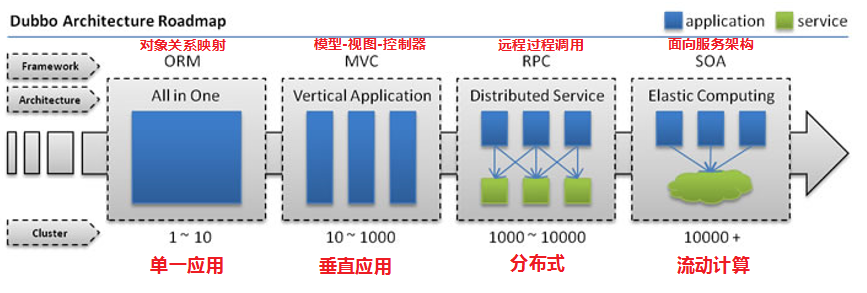

### 1.2. 架构演变的过程

#### 1.2.1.  单一应用架构（all  in one）

当网站流量很小时，只需一个应用，将所有功能都部署在一起，以减少部署节点和成本。此时，用于简化增删改查工作量的数据访问框架(ORM)是关键。

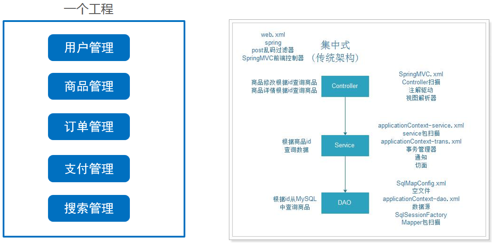

- 架构优点：

  架构简单，前期开发成本低、开发周期短，适合小型项目（OA、CRM、ERP）。

- 架构缺点：

  全部功能集成在一个工程中

  （1）业务代码耦合度高，不易维护。

  （2）维护成本高，不易拓展

  （3）并发量大，不易解决

  （4）技术栈受限，只能使用一种语言开发。

#### 1.2.2. 垂直应用架构

当访问量逐渐增大，单一应用增加机器带来的加速度越来越小，将应用拆成互不相干的几个应用，以提升效率。此时，用于加速前端页面开发的Web框架(MVC)是关键。

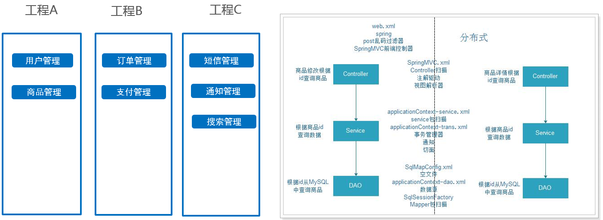

- 架构优点：

  （1）业务代码相对解耦

  （2）维护成本相对易于拓展（修改一个功能，可以直接修改一个项目，单独部署）

  （3）并发量大相对易于解决（搭建集群）

  （4）技术栈可扩展（不同的系统可以用不同的编程语言编写）。

- 架构缺点：

  代码之间存在数据、方法的冗余

#### 1.2.3. 分布式服务架构

当垂直应用越来越多，应用之间交互不可避免，将核心业务抽取出来，作为独立的服务，逐渐形成稳定的服务中心，使前端应用能更快速的响应多变的市场需求。此时，用于提高业务复用及整合的分布式服务框架(RPC)是关键。

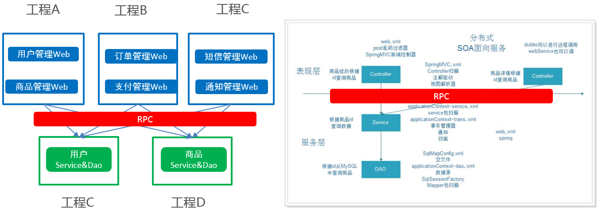

- 架构优点：

  （1）业务代码完全解耦，并可实现通用

  （2）维护成本易于拓展（修改一个功能，可以直接修改一个项目，单独部署）

  （3）并发量大易于解决（搭建集群）

  （4）技术栈完全扩展（不同的系统可以用不同的编程语言编写）。

- 架构缺点：

  缺少统一管理资源调度的框架

#### 1.2.4. 流动计算架构（SOA）

当服务越来越多，容量的评估，小服务资源的浪费等问题逐渐显现，此时需增加一个调度中心基于访问压力实时管理集群容量，提高集群利用率。此时，用于提高机器利用率的资源调度和治理中心(SOA)是关键。

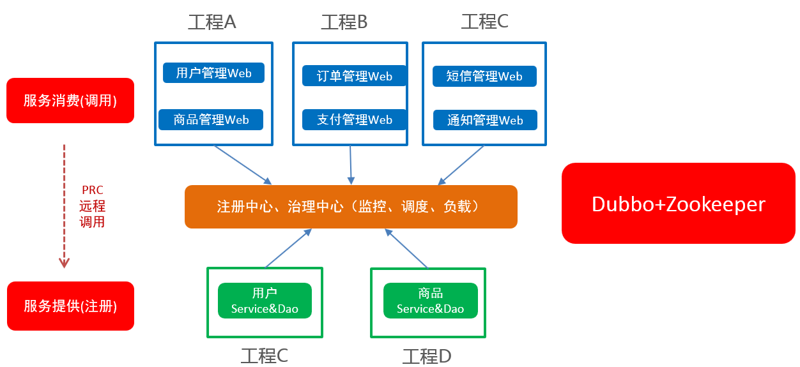

​	资源调度和治理中心的框架：dubbo+zookeeper

- 架构优点：

  （1）业务代码完全解耦，并可实现通用

  （2）维护成本易于拓展（修改一个功能，可以直接修改一个项目，单独部署）

  （3）并发量大易于解决（搭建集群）

  （4）技术栈完全扩展（不同的系统可以用不同的编程语言编写）。

### 【小结】

1：单体架构

全部功能集中在一个项目内（All in one）。

2：垂直架构

按照业务进行切割，形成小的单体项目。

3：SOA架构（项目一）

面向服务的架构（SOA）是一个组件模型,全称为：Service-Oriented Architecture，它将应用程序的不同功能单元（称为服务）进行拆分，并通过这些服务之间定义良好的接口和契约联系起来。接口是采用中立的方式进行定义的，它应该独立于实现服务的硬件平台、操作系统和编程语言。这使得构建在各种各样的系统中的服务可以以一种统一和通用的方式进行交互.

可以使用dubbo作为调度的工具（RPC协议）

4：微服务架构（项目二）

将系统服务层完全独立出来，抽取为一个一个的微服务。

特点一：抽取的粒度更细，遵循单一原则，数据可以在服务之间完成数据传输（一般使用restful请求调用资源）。

特点二： 采用轻量级框架协议传输。（可以使用springcloudy）（http协议）

特点三： 每个服务都使用不同的数据库，完全独立和解耦。

## 2. RPC（远程过程调用）

### 【目标】

了解什么是RPC

### 【路径】

1：RPC介绍

2：RPC组件

3：RPC调用

### 【讲解】

### 2.1. RPC介绍

​	Remote Procedure Call 远程过程调用，是分布式架构的核心，按响应方式分如下两种：

​	同步调用：客户端调用服务方方法，等待直到服务方返回结果或者超时，再继续自己的操作。

​	异步调用：客户端把消息发送给中间件，不再等待服务端返回，直接继续自己的操作。

- 是一种进程间的通信方式

- 它允许应用程序调用网络上的另一个应用程序中的方法

- 对于服务的消费者而言，无需了解远程调用的底层细节，是透明的

  需要注意的是RPC并不是一个具体的技术，而是指整个网络远程调用过程。

  RPC是一个泛化的概念，严格来说一切远程过程调用手段都属于RPC范畴。各种开发语言都有自己的RPC框架。Java中的RPC框架比较多，广泛使用的有RMI、Hessian、Dubbo、spring Cloud等。

### 2.2. RPC组件

简单来说一个RPC架构里包含如下4个组件:

1、 客户端(Client)：服务调用者

2、 客户端存根(Client Stub)：存放服务端地址信息，将客户端的请求参数打包成网络消息，再通过网络发送给服务方

3、 服务端存根(Server Stub)：接受客户端发送过来的消息并解包，再调用本地服务

4、 服务端(Server)：服务提供者。

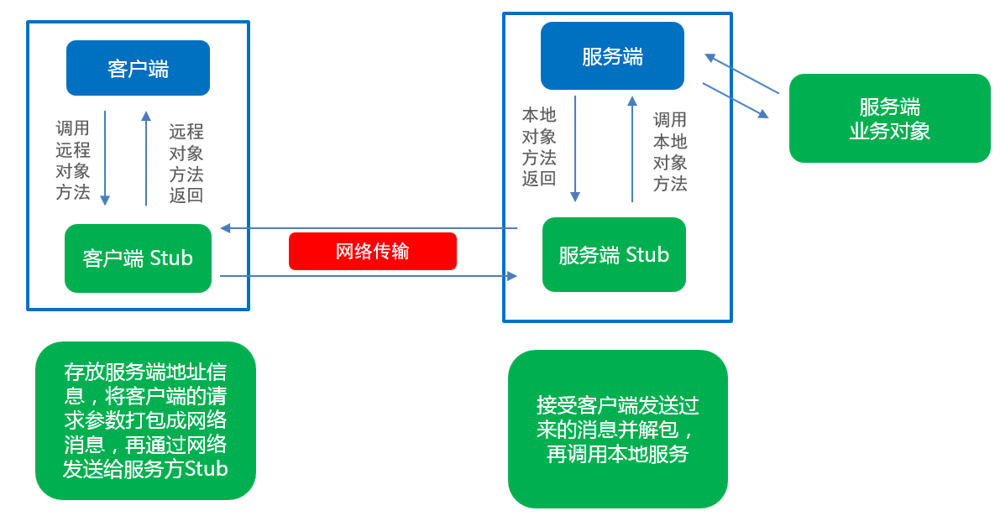

### 2.3. RPC调用


1、 服务调用方（client）调用以本地调用方式调用服务；

2、 client stub接收到调用后负责将方法、参数等组装成能够进行网络传输的消息体

​        在Java里就是序列化的过程

3、 client stub找到服务地址，并将消息通过网络发送到服务端；

4、 server stub收到消息后进行解码,在Java里就是反序列化的过程；

5、 server stub根据解码结果调用本地的服务；

6、 本地服务执行处理逻辑；

7、 本地服务将结果返回给server stub；

8、 server stub将返回结果打包成消息，Java里的序列化；

9、 server stub将打包后的消息通过网络并发送至消费方；

10、 client stub接收到消息，并进行解码, Java里的反序列化；

11、 服务调用方（client）得到最终结果。

### 【小结】

1：RPC介绍

2：RPC组件

3：RPC调用

## 3. Apache Dubbo概述

### 【目标】

什么是dubbo？

dubbo的架构是什么（图）？

### 【路径】

1：dubbo简介

2：dubbo架构

### 【讲解】

###  3.1. Dubbo简介

Apache Dubbo是一款高性能的Java RPC框架。其前身是阿里巴巴公司开源的一个高性能、轻量级的开源Java RPC框架，可以和Spring框架无缝集成。

Dubbo官网地址：http://dubbo.apache.org

Dubbo提供了三大核心能力：面向接口的远程方法调用，智能容错和负载均衡，以及服务自动注册和发现。

###  3.2. Dubbo架构

Dubbo架构图（Dubbo官方提供）如下：

 

节点角色说明：

| 节点        | 角色名称                |
| --------- | ------------------- |
| Provider  | 暴露服务的服务提供方          |
| Consumer  | 调用远程服务的服务消费方        |
| Registry  | 服务注册与发现的注册中心        |
| Monitor   | 统计服务的调用次数和调用时间的监控中心 |
| Container | 服务运行容器              |

虚线都是异步访问，实线都是同步访问
蓝色虚线:在启动时完成的功能
红色虚线(实线)都是程序运行过程中执行的功能

调用关系说明:

0. 服务容器负责启动，加载，运行服务提供者。

1. 服务提供者在启动时，向注册中心注册自己提供的服务。
2. 服务消费者在启动时，向注册中心订阅自己所需的服务。
3. 注册中心返回服务提供者地址列表给消费者，如果有变更，注册中心将基于长连接推送变更数据给消费者。
4. 服务消费者，从提供者地址列表中，基于软负载均衡算法，选一台提供者进行调用，如果调用失败，再选另一台调用。
5. 服务消费者和提供者，在内存中累计调用次数和调用时间，定时每分钟发送一次统计数据到监控中心。

什么是长连接？

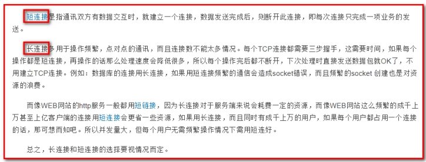

### 【小结】

1：dubbo简介

2：dubbo架构

## 4. Dubbo快速开发

### 【目标】

使用dubbo，完成服务消费者，调用，服务提供者方法

### 【路径】

1：环境准备

2：创建父工程（dubbo_parent)

3：创建公共子模块(dubbo_common)

4：创建接口子模块(dubbo_interface)

5：创建服务提供者模块(dubbo_provider)

6：创建服务消费者模块(dubbo_consumer)

7：Zookeeper中存放Dubbo服务结构(注册中心)

### 【讲解】

​	Dubbo作为一个RPC框架，其最核心的功能就是要实现跨网络的远程调用，服务提供者、服务消费者会使用共同的接口，故本小节先创建一个父工程，父工程下有4个子模块，一个是公共子模块，一个是接口模块，一个是服务提供者模块，一个是服务消费者模块。通过Dubbo来实现服务消费方远程调用服务提供方的方法。

​	实现的业务为：根据id查询用户对象

​	业务描述：页面发送请求：user/findById.do?id=1 根据id从数据库获取用户对象

实现步骤：

     1. 环境准备：创建数据库，创建t_user表
     2. 创建父工程，基于maven，打包方式为pom，工程名：dubbo_parent
     3. 创建公共子模块,创建user实体类，打包方式为jar，工程名:dubbo_common
     4. 创建接口子模块，在父工程的基础上，打包方式为jar，模块名：dubbo_interface
     5. 创建服务提供者子模块，在父工程的基础上，打包方式为war，模块名：dubbo_provider
     6. 创建服务消费者模子块，在父工程的基础上，打包方式为war，模块名：dubbo_consumer

### 4.1.  环境准备

创建数据库表

```sql
create database itcast_dubbo;

CREATE TABLE `t_user` (
  `id` int(11) NOT NULL AUTO_INCREMENT,
  `username` varchar(20) DEFAULT NULL,
  `age` int(11) DEFAULT NULL,
  PRIMARY KEY (`id`)
) ENGINE=InnoDB AUTO_INCREMENT=3 DEFAULT CHARSET=utf8;

INSERT INTO t_user(username,age) VALUES("张三",22);
INSERT INTO t_user(username,age) VALUES("李四",20);
INSERT INTO t_user(username,age) VALUES("王五",25);
```

### 4.2. 创建父工程

​     父工程，不实现任何代码，主要是添加工程需要的库的依赖管理（DependencyManagement），依赖管理就是解决项目中多个模块间公共依赖的版本号、scope的控制范围。本项目需要使用spring-webmvc，使用dubbo（务必2.6.2以上版本）、zookeeper及其客户端（curator-framework）、Spring、Mybatis依赖库。

+ GroupID:com.itheima

+ ArtifactId:dubbo_parent

  1. 创建完工程后，如图所示：

     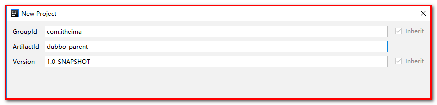			

  2. 修改pom.xml，抽取版本、增加赖库依赖管理，全部内容如下：


```xml
<?xml version="1.0" encoding="UTF-8"?>
<project xmlns="http://maven.apache.org/POM/4.0.0"
         xmlns:xsi="http://www.w3.org/2001/XMLSchema-instance"
         xsi:schemaLocation="http://maven.apache.org/POM/4.0.0 http://maven.apache.org/xsd/maven-4.0.0.xsd">
    <modelVersion>4.0.0</modelVersion>

    <groupId>com.itheima</groupId>
    <artifactId>dubbo_study</artifactId>
    <version>1.0-SNAPSHOT</version>
    
    <packaging>pom</packaging>
    
    <modules>
        <module>dubbo_common</module>
        <module>dubbo_interface</module>
        <module>dubbo_provider</module>
    </modules>


    <properties>
        <maven.compiler.source>1.8</maven.compiler.source>
        <maven.compiler.target>1.8</maven.compiler.target>
        <spring.webmvc.version>5.0.5.RELEASE</spring.webmvc.version>
        <dubbo.version>2.6.2</dubbo.version>
        <zookeeper.version>3.4.7</zookeeper.version>
        <curator.verion>4.0.1</curator.verion>
        <mybatis.version>3.4.5</mybatis.version>
        <mysql.version>5.1.47</mysql.version>
        <mybatis-spring.version>1.3.2</mybatis-spring.version>
        <druid.version>1.1.9</druid.version>
        <log.version>1.2.17</log.version>
        <slf4j.version>1.7.25</slf4j.version>
    </properties>
    <dependencyManagement>
        <dependencies>
            <!--springmvc的环境-->
            <dependency>
                <groupId>org.springframework</groupId>
                <artifactId>spring-webmvc</artifactId>
                <version>${spring.webmvc.version}</version>
            </dependency>
            <!--dubbo的环境-->
            <dependency>
                <groupId>com.alibaba</groupId>
                <artifactId>dubbo</artifactId>
                <version>${dubbo.version}</version>
            </dependency>
            <!--zookeeper的环境-->
            <dependency>
                <groupId>org.apache.zookeeper</groupId>
                <artifactId>zookeeper</artifactId>
                <version>${zookeeper.version}</version>
            </dependency>
            <dependency>
                <groupId>org.apache.curator</groupId>
                <artifactId>curator-framework</artifactId>
                <version>${curator.verion}</version>
            </dependency>
            <dependency>
                <groupId>org.apache.curator</groupId>
                <artifactId>curator-recipes</artifactId>
                <version>${curator.verion}</version>
            </dependency>
            <!--mybatis的环境-->
            <dependency>
                <groupId>org.mybatis</groupId>
                <artifactId>mybatis</artifactId>
                <version>${mybatis.version}</version>
            </dependency>
            <dependency>
                <groupId>org.mybatis</groupId>
                <artifactId>mybatis-spring</artifactId>
                <version>${mybatis-spring.version}</version>
            </dependency>
            <dependency>
                <groupId>com.alibaba</groupId>
                <artifactId>druid</artifactId>
                <version>${druid.version}</version>
            </dependency>
            <dependency>
                <groupId>mysql</groupId>
                <artifactId>mysql-connector-java</artifactId>
                <version>${mysql.version}</version>
            </dependency>
            <!--spring的环境-->
            <dependency>
                <groupId>org.springframework</groupId>
                <artifactId>spring-tx</artifactId>
                <version>${spring.webmvc.version}</version>
            </dependency>
            <dependency>
                <groupId>org.springframework</groupId>
                <artifactId>spring-jdbc</artifactId>
                <version>${spring.webmvc.version}</version>
            </dependency>
            <!--日志的环境-->
            <dependency>
                <groupId>log4j</groupId>
                <artifactId>log4j</artifactId>
                <version>${log.version}</version>
            </dependency>
            <dependency>
                <groupId>org.slf4j</groupId>
                <artifactId>slf4j-api</artifactId>
                <version>${slf4j.version}</version>
            </dependency>
        </dependencies>
    </dependencyManagement>
</project>
```

### 4.3.  创建公共子模块

- 在当前父工程的基础上创建子模块
  - GroupID:com.itheima
  - ArtifactId:dubbo_common

  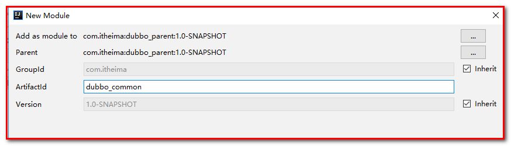

1：pom.xml

```xml
<packaging>jar</packaging>
```

2：在com.itheima.pojo包中创建User实体类

```java
package com.itheima.pojo;

import java.io.Serializable;


public class User implements Serializable {
    private Integer id;
    private String username;
    private Integer age;

    public Integer getId() {
        return id;
    }

    public void setId(Integer id) {
        this.id = id;
    }

    public String getUsername() {
        return username;
    }

    public void setUsername(String username) {
        this.username = username;
    }

    public Integer getAge() {
        return age;
    }

    public void setAge(Integer age) {
        this.age = age;
    }

    @Override
    public String toString() {
        return "User{" +
                "id=" + id +
                ", username='" + username + '\'' +
                ", age=" + age +
                '}';
    }
}

```

### 4.4. 创建接口子模块

此模块，主要放业务接口的定义，它是服务消费者模块和服务提供者模块的公共依赖模块。

- 在当前父工程的基础上创建子模块
  - GroupID:com.itheima
  - ArtifactId:dubbo_interface

1. 创建子模块：

   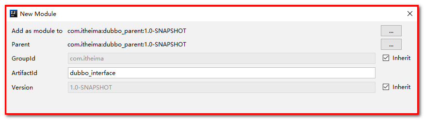	

2. pom.xml，添加依赖

   ```xml
   <packaging>jar</packaging>
   <dependencies>
     	<dependency>
       	<groupId>com.itheima</groupId>
       	<artifactId>dubbo_common</artifactId>
       	<version>1.0-SNAPSHOT</version>
     	</dependency>
   </dependencies>
   ```

3. 在包com.itheima.service创建业务接口

```java
package com.itheima.service;

import com.itheima.pojo.User;

public interface UserService {

    User findById(Integer id);
}

```

如图所示：

	

### 4.5. 服务提供者模块

此模块是服务提供者模块，需要在容器启动时，把服务注册到zookeeper,故需要引入spring-webmvc,zookeeper及客户端依赖。

【路径】

**实现步骤：**

1. 创建子模块dubbo_provider，使用war，导入依赖坐标mybatis, mybaties-spring, druid-data-source,  mysql驱动包, spring-webmvc、dubbo依赖和编译插件tomcat7,还需要依赖dubbo_interface

2. java源代码目录

    增加com.itheima.service.impl包及创建UserServiceImpl实现类，业务实现类UserServiceImpl，需要实现UserService接口

    增加com.itheima.dao包以及创建UserDao接口，在resources资源目录中增加com/itheima/dao,创建UserDao.xml映射文件

3. resources资源目录

   - 创建spring-dubbo.xml 配置文件：

      - 配置dubbo的应用名称

      - 配置dubbo注册中心Zookeeper地址

      - 配置需要暴露的业务接口及实例

   - 创建spring-dao.xml

      - 配置数据源
      - 配置sqlSessionFactory对象
      - 扫描dao包，创建dao接口的动态代理对象

   - 创建spring-service.xml

      - 开启注解扫描，扫描service包
      - 配置事务

4. 将资料的log4j.properties配置文件拷贝到resources目录下

5. 在web.xml文件中，配置spring监听器，指定spring配置文件加载位置（需要加载多个spring的配置文件）

6. 启动服务提供者

**实现过程：**

#### 4.5.1. 创建子模块dubbo_provider（或者叫做dubbo_service）

- 在当前父工程的基础上创建子模块

- 打包方式为war

- 项目坐标如下

   ​	GroupID:com.itheima

   ​	ArtifactId:dubbo_provider


工程创建完成后，如图所示：

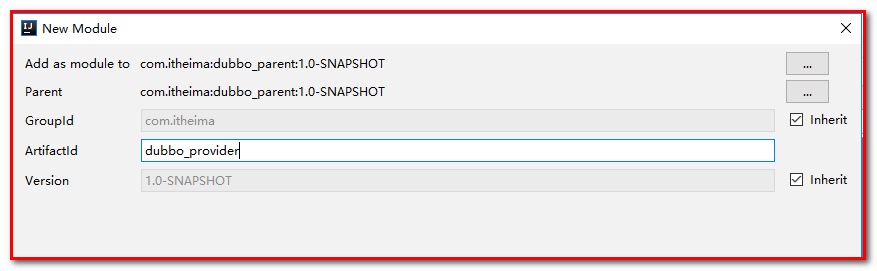

修改pom.xml文件，打包方式为war，增加依赖库，新增编译插件tomcat7，端口81

~~~xml
<packaging>war</packaging>

<dependencies>
    <!--依赖业务接口-->
    <dependency>
      <groupId>com.itheima</groupId>
      <artifactId>dubbo_interface</artifactId>
      <version>1.0-SNAPSHOT</version>
    </dependency>
    
    <dependency>
      <groupId>org.springframework</groupId>
      <artifactId>spring-webmvc</artifactId>
    </dependency>
    <dependency>
      <groupId>com.alibaba</groupId>
      <artifactId>dubbo</artifactId>
    </dependency>
    <dependency>
      <groupId>org.apache.zookeeper</groupId>
      <artifactId>zookeeper</artifactId>
    </dependency>
    <dependency>
      <groupId>org.apache.curator</groupId>
      <artifactId>curator-framework</artifactId>
    </dependency>
    <dependency>
        <groupId>org.apache.curator</groupId>
        <artifactId>curator-recipes</artifactId>
    </dependency>
    <dependency>
        <groupId>org.mybatis</groupId>
        <artifactId>mybatis</artifactId>
    </dependency>
    <dependency>
        <groupId>org.mybatis</groupId>
        <artifactId>mybatis-spring</artifactId>
    </dependency>
    <dependency>
        <groupId>com.alibaba</groupId>
        <artifactId>druid</artifactId>
    </dependency>
    <dependency>
        <groupId>mysql</groupId>
        <artifactId>mysql-connector-java</artifactId>
    </dependency>
    <dependency>
        <groupId>org.springframework</groupId>
        <artifactId>spring-tx</artifactId>
    </dependency>
    <dependency>
        <groupId>org.springframework</groupId>
        <artifactId>spring-jdbc</artifactId>
    </dependency>
</dependencies>

<build>
    <finalName>dubbo_provider</finalName>
    <plugins>
        <plugin>
            <groupId>org.apache.tomcat.maven</groupId>
            <artifactId>tomcat7-maven-plugin</artifactId>
            <version>2.2</version>
            <configuration>
                <path>/</path>
                <port>81</port>
            </configuration>
        </plugin>
    </plugins>
</build>
~~~

#### 4.5.2. 初始化java资源目录

1：在main下,创建子目录java（刷新maven工程）,增加com.itheima.service.impl包及创建UserServiceImpl实现类

```java
package com.itheima.service.impl;

import com.itheima.pojo.User;
import com.itheima.service.UserService;
import org.springframework.beans.factory.annotation.Autowired;

public class UserServiceImpl implements UserService {
    
    @Autowired
    UserDao userDao;

    @Override
    public User findById(Integer id) {
        return userDao.findById(id);
    }
}
```

2：增加com.itheima.dao包，创建UserDao接口

```java
package com.itheima.dao;

import com.itheima.pojo.User;

public interface UserDao {
    User findById(Integer id);
}

```

3：在resource下创建com/itheima/dao目录，创建UserDao接口的映射文件，内容如下

```xml
<?xml version="1.0" encoding="utf-8" ?>
<!DOCTYPE mapper PUBLIC "-//mybatis.org//DTD Mapper 3.0//EN"
        "http://mybatis.org/dtd/mybatis-3-mapper.dtd" >
<mapper namespace="com.itheima.dao.UserDao">
    <select id="findById" resultType="com.itheima.pojo.User" parameterType="int">
        select * from t_user where id = #{id}
    </select>
</mapper>
```

#### 4.5.3. 初始化resources目录

在main下,创建子目录resources目录，在resources目录下

创建spring-dubbo.xml,

​       spring-dao.xml,

​       spring-service.xml 配置文件

创建log4j的配置文件。

1：spring-dubbo.xml

```xml
<?xml version="1.0" encoding="UTF-8"?>
<beans xmlns="http://www.springframework.org/schema/beans"
       xmlns:xsi="http://www.w3.org/2001/XMLSchema-instance"
       xmlns:dubbo="http://dubbo.apache.org/schema/dubbo" xmlns:context="http://www.springframework.org/schema/context"
       xsi:schemaLocation="http://www.springframework.org/schema/beans http://www.springframework.org/schema/beans/spring-beans.xsd http://dubbo.apache.org/schema/dubbo http://dubbo.apache.org/schema/dubbo/dubbo.xsd http://www.springframework.org/schema/context http://www.springframework.org/schema/context/spring-context.xsd">

    <!-- dubbo应用的名称-->
    <dubbo:application name="dubbo-provider"/>
    <!-- 服务注册中新的地址-->
    <dubbo:registry address="zookeeper://127.0.0.1:2181"/>

    <!--指定暴露的服务接口及实例-->
    <dubbo:service interface="com.itheima.service.UserService"
                   ref="userService"/>
    <!--配置业务类实例-->
    <bean id="userService"
          class="com.itheima.service.impl.UserServiceImpl"/>
</beans>
```

2：jdbc.properties

```properties
jdbc.driver=com.mysql.jdbc.Driver
jdbc.url=jdbc:mysql://localhost:3306/itcast_dubbo
jdbc.user=root
jdbc.password=admin
```

3：spring-dao.xml

```xml
<?xml version="1.0" encoding="UTF-8"?>
<beans xmlns="http://www.springframework.org/schema/beans"
       xmlns:xsi="http://www.w3.org/2001/XMLSchema-instance"
       xmlns:context="http://www.springframework.org/schema/context"
       xmlns:tx="http://www.springframework.org/schema/tx"
       xsi:schemaLocation="
       http://www.springframework.org/schema/beans
       http://www.springframework.org/schema/beans/spring-beans.xsd
       http://www.springframework.org/schema/context
       http://www.springframework.org/schema/context/spring-context.xsd
       http://www.springframework.org/schema/tx
       http://www.springframework.org/schema/tx/spring-tx.xsd
">

    <!--加载属性文件-->
    <context:property-placeholder location="classpath:jdbc.properties"></context:property-placeholder>
    <!--配置数据源-->
    <bean id="dataSource" class="com.alibaba.druid.pool.DruidDataSource">
        <property name="driverClassName" value="${jdbc.driver}"/>
        <property name="url" value="${jdbc.url}"/>
        <property name="username" value="${jdbc.user}"/>
        <property name="password" value="${jdbc.password}"/>
    </bean>
    <!--配置SqlSessionFactory-->
    <bean id="sqlSessionFactory" class="org.mybatis.spring.SqlSessionFactoryBean">
        <property name="dataSource" ref="dataSource"/>
        <!--配置别名映射-->
        <property name="typeAliasesPackage" value="com.itheima.pojo"/>
        <!-- 分页插件pagehelper: 后续配置 -->
    </bean>
    <!--配置mapper文件扫描-->
    <bean class="org.mybatis.spring.mapper.MapperScannerConfigurer">
        <property name="basePackage" value="com.itheima.dao"/>
    </bean>
</beans>
```

4：spring-service.xml

```xml
<?xml version="1.0" encoding="UTF-8"?>
<beans xmlns="http://www.springframework.org/schema/beans"
       xmlns:xsi="http://www.w3.org/2001/XMLSchema-instance"
       xmlns:context="http://www.springframework.org/schema/context"
       xmlns:tx="http://www.springframework.org/schema/tx"
       xsi:schemaLocation="
       http://www.springframework.org/schema/beans
       http://www.springframework.org/schema/beans/spring-beans.xsd
       http://www.springframework.org/schema/context
       http://www.springframework.org/schema/context/spring-context.xsd
       http://www.springframework.org/schema/tx
       http://www.springframework.org/schema/tx/spring-tx.xsd
">
    <!--配置事务管理器-->
    <bean  id="transactionManager" class="org.springframework.jdbc.datasource.DataSourceTransactionManager">
        <property name="dataSource" ref="dataSource"/>
    </bean>
    <!--事务注解驱动，在Service类上添加@Transactional-->
    <tx:annotation-driven/>
</beans>
```

将资料的log4j.properties配置文件拷贝到resources目录下

```properties
### direct log messages to stdout ###
log4j.appender.stdout=org.apache.log4j.ConsoleAppender
log4j.appender.stdout.Target=System.err
log4j.appender.stdout.layout=org.apache.log4j.PatternLayout
log4j.appender.stdout.layout.ConversionPattern=%d{ABSOLUTE} %5p %c{1}:%L - %m%n

### direct messages to file mylog.log ###
log4j.appender.file=org.apache.log4j.FileAppender
log4j.appender.file.File=c:\\mylog.log
log4j.appender.file.layout=org.apache.log4j.PatternLayout
log4j.appender.file.layout.ConversionPattern=%d{ABSOLUTE} %5p %c{1}:%L - %m%n

### set log levels - for more verbose logging change 'info' to 'debug' ###

log4j.rootLogger=debug, stdout

```


效果如下

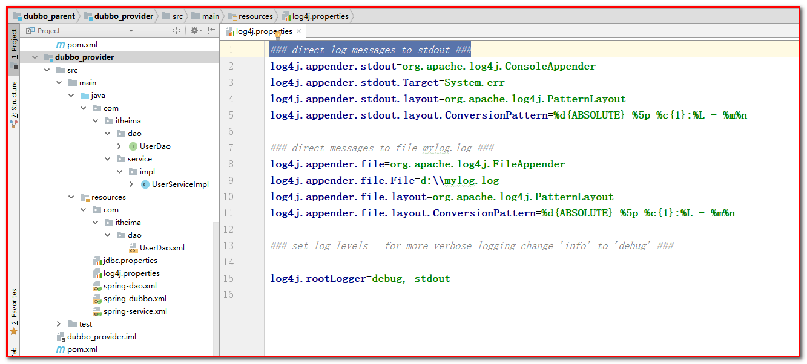

#### 4.5.4. 配置web.xml文件

~~~xml
<?xml version="1.0" encoding="UTF-8"?>
<web-app xmlns:xsi="http://www.w3.org/2001/XMLSchema-instance"
         xmlns="http://java.sun.com/xml/ns/javaee"
         xsi:schemaLocation="http://java.sun.com/xml/ns/javaee http://java.sun.com/xml/ns/javaee/web-app_3_0.xsd"
         id="WebApp_ID" version="3.0">

    <context-param>
        <param-name>contextConfigLocation</param-name>
        <param-value>classpath:spring*.xml</param-value>
    </context-param>
    <listener>
        <listener-class>org.springframework.web.context.ContextLoaderListener</listener-class>
    </listener>
</web-app>
~~~

#### 4.5.5. 启动服务提供者

需要在父工程整体clean、install后，在子模块使用tomcat7插件运行

1、父工程clean、install

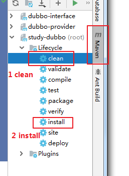 

2、启动当前应用，启动后默认注册服务到zookeeper注册中心

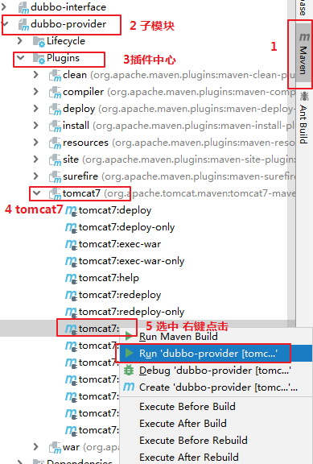 

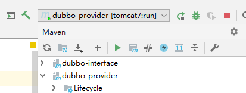 

3、检查是否注册到zookeeper

（1）启动zookeeper，作为dubbo的注册中心

（2）登录zookeeper客户端，直接查看ls /dubbo/com.itheima.service.UserService节点


+ 如果 /dubbo下面没有这个节点，说明没有注册上，

+ 如果有，内容是空，说明已经掉线

+ 正常注册并连接在线，如图所示：

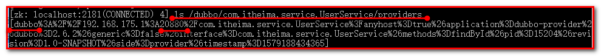

注意：

+ 消费者与提供者应用名称不能相同

+ 如果有多个服务提供者，名称不能相同，通信端口也不能相同

+ 只有服务提供者才会配置服务发布的协议，默认是dubbo协议，端口号是20880

  可以在spring-dubbo.xml中配置协议的端口

```xml
<!--发布dubbo协议，默认端口20880-->
<dubbo:protocol name="dubbo" port="20881"></dubbo:protocol>
```

### 4.6. 服务消费者模块

此模块是服务消费者模块，此模块基于是Web应用，需要引入spring-webmvc，需要在容器启动时，去zookeeper注册中心订阅服务,需要引入dubbo、zookeeper及客户端依赖。

**实现步骤：**

1. 创建子模块dubbo_consumer，打包方式为war包，导入依赖坐标spring-webmvc、dubbo,log4j,编译插件tomcat7以及dubbo_interface（用来调用接口方法）

2. java源代码目录

    增加com.itheima.controller包及创建UserController类

    控制器类UserController，提供web方法findById(Integer id)

3. resources资源目录

   ​	创建spring-dubbo.xml 配置文件：

   ​		配置dubbo的应用名称

   ​		配置dubbo注册中心Zookeeper地址

   ​		配置需要订阅的业务接口及引用

   ​	创建spring-mvc.xml

   ​		开启注解扫描

   ​		开启mvc注解驱动

4. 将资料的log4j.properties配置文件拷贝到resources目录下

5. 在web.xml文件中，配置SpringMVC

6. 启动服务消费者，并测试访问

**实现过程：**

#### 4.6.1. 创建子模块dubbo_consumer（或者叫做dubbo_controller）

- 在当前父工程的基础上创建子模块

- 坐标如下

   ​	GroupID:com.itheima

   ​	ArtifactId:dubbo_consumer

1：创建工程，如图所示：

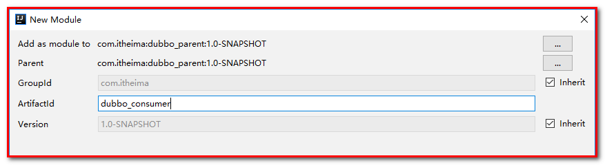		

2：修改pom.xml文件，增加依赖库，新增编译插件tomcat7,端口80

```xml
<?xml version="1.0" encoding="UTF-8"?>
<project xmlns="http://maven.apache.org/POM/4.0.0"
         xmlns:xsi="http://www.w3.org/2001/XMLSchema-instance"
         xsi:schemaLocation="http://maven.apache.org/POM/4.0.0 http://maven.apache.org/xsd/maven-4.0.0.xsd">
    <parent>
        <!--继承父工程-->
        <artifactId>dubbo_study</artifactId>
        <groupId>com.itheima</groupId>
        <version>1.0-SNAPSHOT</version>
    </parent>
    <modelVersion>4.0.0</modelVersion>
    
    <artifactId>dubbo_consumer</artifactId>

    <!--打包方式-->
    <packaging>war</packaging>

    <dependencies>
        <!--依赖业务接口-->
        <dependency>
            <groupId>com.itheima</groupId>
            <artifactId>dubbo_interface</artifactId>
            <version>1.0-SNAPSHOT</version>
        </dependency>
        
        <!--消费者需要的jar包-->
        <dependency>
            <groupId>org.springframework</groupId>
            <artifactId>spring-webmvc</artifactId>
        </dependency>
        <dependency>
            <groupId>com.fasterxml.jackson.core</groupId>
            <artifactId>jackson-core</artifactId>
            <version>2.9.0</version>
        </dependency>
        <dependency>
            <groupId>com.fasterxml.jackson.core</groupId>
            <artifactId>jackson-databind</artifactId>
            <version>2.9.0</version>
        </dependency>
        <dependency>
            <groupId>com.fasterxml.jackson.core</groupId>
            <artifactId>jackson-annotations</artifactId>
            <version>2.9.0</version>
        </dependency>
        <dependency>
            <groupId>javax.servlet</groupId>
            <artifactId>servlet-api</artifactId>
            <version>2.5</version>
            <scope>provided</scope>
        </dependency>

        <dependency>
            <groupId>com.alibaba</groupId>
            <artifactId>dubbo</artifactId>
        </dependency>
        <dependency>
            <groupId>org.apache.zookeeper</groupId>
            <artifactId>zookeeper</artifactId>
        </dependency>
        <dependency>
            <groupId>org.apache.curator</groupId>
            <artifactId>curator-framework</artifactId>
        </dependency>
        <dependency>
            <groupId>org.apache.curator</groupId>
            <artifactId>curator-recipes</artifactId>
        </dependency>
    </dependencies>

    <build>
        <finalName>dubbo_consumer</finalName>
        <plugins>
            <plugin>
                <groupId>org.apache.tomcat.maven</groupId>
                <artifactId>tomcat7-maven-plugin</artifactId>
                <configuration>
                    <path>/</path>
                    <port>80</port>
                </configuration>
            </plugin>
        </plugins>
    </build>

</project>
```

#### 4.6.2. 初始化java资源目录

在main下,创建子目录java（刷新maven工程）,增加com.itheima.controller包及创建UserController控制类（通过配置文件初始化），该类调用远程业务UserService，实现调用findById方法。

```java
package com.itheima.controller;

import com.itheima.pojo.User;
import com.itheima.service.UserService;
import org.springframework.beans.factory.annotation.Autowired;
import org.springframework.stereotype.Controller;
import org.springframework.web.bind.annotation.RequestMapping;
import org.springframework.web.bind.annotation.ResponseBody;

@Controller
@ResponseBody
@RequestMapping("/user")
public class UserController {

    @Autowired
    UserService userService;


    @RequestMapping("/findById")
    public User findById(Integer id){
        User user = userService.findById(id);
        return user;
    }
}

```

#### 4.6.3. 初始化resources资源目录

在main下,创建子目录resources目录，在resources目录下

1：创建spring-dubbo.xml ,

2：spring-mvc.xml配置文件

3：创建log4j的配置文件。	

1：spring-dubbo.xml文件，如下：

```xml
<?xml version="1.0" encoding="UTF-8"?>
<beans xmlns="http://www.springframework.org/schema/beans"
       xmlns:xsi="http://www.w3.org/2001/XMLSchema-instance" xmlns:dubbo="http://dubbo.apache.org/schema/dubbo"
       xmlns:context="http://www.springframework.org/schema/context"
       xsi:schemaLocation="http://www.springframework.org/schema/beans http://www.springframework.org/schema/beans/spring-beans.xsd http://dubbo.apache.org/schema/dubbo http://dubbo.apache.org/schema/dubbo/dubbo.xsd http://www.springframework.org/schema/context http://www.springframework.org/schema/context/spring-context.xsd">
    <!-- dubbo基本配置-->
    <dubbo:application name="dubbo-consumer"/>
    <dubbo:registry address="zookeeper://127.0.0.1:2181"/>

    <!--订阅远程服务对象，id的名称和Controller类中的UserService接口名称要一致-->
    <dubbo:reference id="userService" interface="com.itheima.service.UserService"/>
    
</beans>
```

2：spring-mvc.xml配置，如下

```xml
<?xml version="1.0" encoding="UTF-8"?>
<beans xmlns="http://www.springframework.org/schema/beans"
       xmlns:xsi="http://www.w3.org/2001/XMLSchema-instance"
       xmlns:context="http://www.springframework.org/schema/context"
       xmlns:mvc="http://www.springframework.org/schema/mvc"
       xmlns:dubbo="http://code.alibabatech.com/schema/dubbo"
       xsi:schemaLocation="http://www.springframework.org/schema/beans
       http://www.springframework.org/schema/beans/spring-beans.xsd
       http://www.springframework.org/schema/context
       http://www.springframework.org/schema/context/spring-context.xsd
        http://www.springframework.org/schema/mvc
        http://www.springframework.org/schema/mvc/spring-mvc.xsd
        http://code.alibabatech.com/schema/dubbo http://code.alibabatech.com/schema/dubbo/dubbo.xsd">
    <!--自动扫包-->
    <context:component-scan base-package="com.itheima.controller"/>
    <!--mvc注解驱动-->
    <mvc:annotation-driven></mvc:annotation-driven>

    <!--导入dubbo的配置-->
    <import resource="classpath:spring-dubbo.xml"></import>
</beans>
```

3：导入log4j.properties

#### 4.6.4. 配置web.xml

配置springmvc的核心控制器，用来加载spring-mvc.xml

```xml
<?xml version="1.0" encoding="UTF-8"?>
<web-app xmlns:xsi="http://www.w3.org/2001/XMLSchema-instance"
         xmlns="http://java.sun.com/xml/ns/javaee"
         xsi:schemaLocation="http://java.sun.com/xml/ns/javaee http://java.sun.com/xml/ns/javaee/web-app_3_0.xsd"
         id="WebApp_ID" version="3.0">
	<!--springmvc的核心控制器-->
    <servlet>
        <servlet-name>springMVC</servlet-name>
        <servlet-class>org.springframework.web.servlet.DispatcherServlet</servlet-class>
        <init-param>
            <param-name>contextConfigLocation</param-name>
            <param-value>classpath:spring-mvc.xml</param-value>
        </init-param>
        <load-on-startup>1</load-on-startup>
    </servlet>
    <servlet-mapping>
        <servlet-name>springMVC</servlet-name>
        <url-pattern>*.do</url-pattern>
    </servlet-mapping>
    <!--解决post请求的乱码过滤器-->
    <filter>
        <filter-name>CharacterEncodingFilter</filter-name>
        <filter-class>org.springframework.web.filter.CharacterEncodingFilter</filter-class>
        <init-param>
            <param-name>encoding</param-name>
            <param-value>UTF-8</param-value>
        </init-param>
    </filter>
    <filter-mapping>
        <filter-name>CharacterEncodingFilter</filter-name>
        <url-pattern>/*</url-pattern>
    </filter-mapping>
</web-app>
```


#### 4.6.5. 启动服务消费者并测试

在浏览器输入<http://localhost:80/user/findById.do?id=1>，查看浏览器输出结果

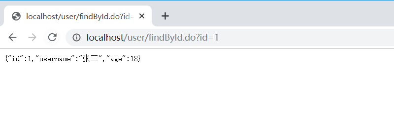	

注意：因为是RPC的框架，要求传递的参数和实体类要实现序列化

参数：Integer类型（实现序列化接口java.io.Serializable）

返回值：User（实现序列化接口java.io.Serializable），如果不进行序列化，抛出异常


### 4.7. Zookeeper中存放Dubbo服务结构（作为Dubbo运行的注册中心）

Zookeeper树型目录服务：

 

流程说明：

1：服务提供者(Provider)启动时: 向 /dubbo/com.foo.BarService/providers 目录下写入自己的 URL 地址

2：服务消费者(Consumer)启动时: 订阅 /dubbo/com.foo.BarService/providers 目录下的提供者 URL 地址。并向 /dubbo/com.foo.BarService/consumers 目录下写入自己的 URL 地址

3：监控中心(Monitor)启动时: 订阅 /dubbo/com.foo.BarService 目录下的所有提供者和消费者 URL 地址

### 【小结】

1：环境准备

2：创建父工程（dubbo_parent)

3：创建公共子模块(dubbo_common)

4：创建接口子模块(dubbo_interface)

5：创建服务提供者模块(dubbo_provider)

6：创建服务消费者模块(dubbo_consumer)

7：Zookeeper中存放Dubbo服务结构(注册中心)

## 5. Dubbo管理控制台

我们在开发时，需要知道Zookeeper注册中心都注册了哪些服务，有哪些消费者来消费这些服务。我们可以通过部署一个管理中心来实现。其实管理中心就是一个web应用，部署到tomcat即可。

### 【目标】

Dubbo管理控制台的使用（即Dubbo监控中心）

### 【路径】

1：安装（dubbo-admin.war）

2：使用（dubbo-admin.war）

### 【讲解】

### 5.1. 安装

安装步骤：

（1）将资料中的dubbo-admin.war文件复制到tomcat的webapps目录下


（2）启动tomcat，此war文件会自动解压


（3）修改WEB-INF下的dubbo.properties文件

```properties
# 注意dubbo.registry.address对应的值需要对应当前使用的Zookeeper的ip地址和端口号
dubbo.registry.address=zookeeper://localhost:2181
dubbo.admin.root.password=root
dubbo.admin.guest.password=guest
```


（4）在bin目录下重启tomcat


### 5.2. 使用

操作步骤：

（1）访问http://localhost:8080/dubbo-admin/，输入用户名(root)和密码(root)


（2）启动服务提供者工程和服务消费者工程，可以在查看到对应的信息

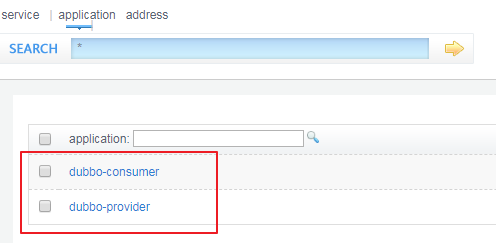 


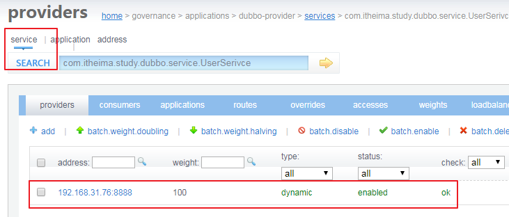 

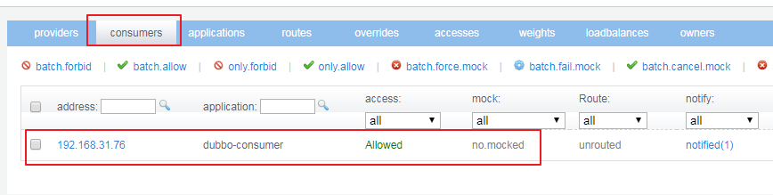

### 【小结】

1：安装（dubbo-admin.war），放置到tomcat，修改WEB-INF下的dubbo.properties文件

2：使用（dubbo-admin.war）

访问<http://localhost:8080/dubbo-admin/>，输入用户名(root)和密码(root)

注意：这里需要使用jdk1.8

## 6. Dubbo相关配置说明

### 【目标】

Dubbo相关配置说明 

### 【路径】

1：包扫描（dubbo注解配置）

2：服务接口访问协议

* dubbo协议
* rmi协议

3：启动时检查

4：超时调用

### 【讲解】

### 6.1. 包扫描

```xml
<dubbo:annotation package="com.itheima.service" />
```

服务提供者和服务消费者前面章节实现都是基于配置文件进行服务注册与订阅，如果使用包扫描，可以使用注解方式实现，推荐使用这种方式。

####   61.1. 服务提供者，使用注解实现

第一步：在spring-dubbo.xml中配置

```xml
<dubbo:annotation package="com.itheima.service" />
```

服务提供者和服务消费者都需要配置，表示包扫描，作用是扫描指定包(包括子包)下的类。

同时去掉以下配置：

```xml
<!--指定暴露的服务接口及实例-->
<dubbo:service interface="com.itheima.service.userService"
               ref="userSerivce"/>
<!--配置业务类实例-->
<bean id="userService"
      class="com.itheima.service.impl.UserServiceImpl"/>
```

如图:

第二步：在UserServiceImpl的类上使用注解：

```java
@Service
public class UserServiceImpl implements UserService {
}
```

如图


注意：其中@Service是dubbo包下（com.alibaba.dubbo.config.annotation.Service）的注解。表示提供服务


#### 6.1.2. 服务消费者，使用注解实现

第一步：在spring-dubbo.xml中配置

```xml
<dubbo:annotation package="com.itheima.controller" />
```

这里的dubbo注解扫描

同时去掉：

```xml
<!--订阅远程服务对象，id的名称和Controller类中的UserService接口名称要一致-->
<dubbo:reference id="userService" interface="com.itheima.service.UserService"/>
```


第二步：在Controller类中使用

@Reference注解

```java
@Controller
@ResponseBody
@RequestMapping("/user")
public class UserController {

    //@Autowired
    @Reference
    UserService userService;
}
```


注意：其中@Reference是dubbo包下（com.alibaba.dubbo.config.annotation.Reference）的注解。表示订阅服务


####     6.1.3. 重启服务测试使用

+ 重启服务提供者模块 dubbo-provider

+ 重启服务消费者模块 dubbo-consumer

+ 在浏览器输入测试URL：

  <http://localhost/user/findById.do?id=1>，查看浏览器输出结果。

### 6.2. 服务接口访问协议

```xml
<dubbo:protocol name="dubbo" port="20881"></dubbo:protocol>
```

一般在服务提供者一方配置，可以指定使用的协议名称和端口号。

其中Dubbo支持的协议有：dubbo、rmi、hessian、http、webservice、rest、redis等。

推荐使用的是dubbo协议，默认端口号：20880。

dubbo 协议采用单一长连接和 NIO 异步通讯，适合于小数据量、大并发的服务调用，以及服务消费者机器数远大于服务提供者机器数的情况。不适合传送大数据量的服务，比如传文件，传视频等，除非请求量很低。**(数量多,文件小适用dubbo)**

* **配置文件方式**:也可以在同一个工程中配置多个协议，不同服务可以使用不同的协议，例如：
* 1.spring-dubbo.xml配置文件

```xml
<!-- 多协议配置 -->
<dubbo:protocol name="dubbo" port="20881" />
<dubbo:protocol name="rmi" port="1099" />
<!-- 使用dubbo协议暴露服务 -->
<dubbo:service interface="com.itheima.service.HelloService" ref="helloService" protocol="dubbo" />
<!-- 使用rmi协议暴露服务 -->
<dubbo:service interface="com.itheima.service.DemoService" ref="demoService" protocol="rmi" />
<!-- 使用dubbo rmi协议暴露服务 -->
<dubbo:service interface="com.itheima.service.UserService" ref="userService"/>

<bean id="helloService" class="com.itheima.service.impl.HelloServiceImpl" />
<bean id="demoService" class="com.itheima.service.impl.DemoServiceImpl" />
<bean id="userService" class="com.itheima.service.impl.UserServiceImpl" />
```

2.同时去掉：包扫描

```xml
<dubbo:annotation package="com.itheima.service" />
```

3.提供者:UserServiceImpl实现类的注解@Service


* **注释方式**:也可以使用注解配置多个协议**

1.业务接口:DemoService接口

```Java
public interface DemoService {
    public void demo(String name);
}
```

2.业务接口:HelloService接口

```java
public interface HelloService {
    public void hello(String name);
}
```

3.业务接口:UserService接口(已有)

```java
public interface UserService {
    User findById(Integer id);
}
```

4.提供者:spring-dubbo.xml配置文件

```xml
	<!--包扫描:注解方式实现-->
    <dubbo:annotation package="com.wzw.service"/>

    <!-- 多协议配置:name=协议  post=端口 -->
    <dubbo:protocol name="dubbo" port="20881" />
    <dubbo:protocol name="rmi" port="1099" />
```

5.提供者:HelloServiceImpl实现类

```java
@Service(protocol = "dubbo")
public class HelloServiceImpl implements HelloService {
}
```

6.提供者:DemoServiceImpl实现类

```java
@Service(protocol = "rmi")
public class DemoServiceImpl implements DemoService {
}
```

7.提供者:UserServiceImpl实现类(已有)

```java
@Service
public class UserServiceImpl implements UserService {
    //注释注入Dao接口对象
    @Autowired
    private UserDao userDao;

    /**
     * 实现查询一条数据的功能
     * @param id 条件
     * @return 查询的数据
     */
    @Override
    public User findById(Integer id) {
        return userDao.findById(id);
    }
}
```

如图


 **dubbo协议：**

- 连接个数：单连接
- 连接方式：长连接
- 传输协议：TCP
- 传输方式：NIO异步传输
- 序列化：Hessian二进制序列化
- 适用范围：传入传出参数数据包较小（建议小于100K），消费者比提供者个数多，单一消费者无法压满提供者，尽量不要用dubbo协议传输大文件或超大字符串。
- 适用场景：常规远程服务方法调用

**rmi协议：**

- 连接个数：多连接
- 连接方式：短连接
- 传输协议：TCP
- 传输方式：同步传输
- 序列化：Java标准二进制序列化
- 适用范围：传入传出参数数据包大小混合，消费者与提供者个数差不多，可传文件。
- 适用场景：常规远程服务方法调用，与原生RMI服务互操作

详情使用可通过博客文章：<https://www.cnblogs.com/duanxz/p/3555876.html>了解

```xml
注意：测试完成后，将rmi相关代码和配置注释掉
启用dubbo扫描配置：<dubbo:annotation package="com.itheima.service" />
```

### 6.3. **启动时检查**

```xml
<dubbo:consumer check="false"/>
```


上面这个配置需要配置在服务消费者一方，如果不配置默认check值为true。Dubbo 缺省会在启动时检查依赖的服务是否可用，不可用时会抛出异常，阻止 Spring 初始化完成，以便上线时，能及早发现问题。可以通过将check值改为false来关闭检查。

建议在开发阶段将check值设置为false，在生产环境下改为true。

如果设置为true，启动服务消费者，会抛出异常，表示没有服务提供者


### 6.4. 超时调用

默认的情况下，dubbo调用的时间为一秒钟，如果超过一秒钟就会报错，所以我们可以设置超时时间长些，保证调用不出问题，这个时间需要根据业务来进行确定。

  

* 消费者和提供者**二选一**加入超时调用就可用了

  （1）修改消费者 配置文件,增加如下配置：

```xml
<!--超时时间为3秒钟-->
<dubbo:consumer timeout="3000"></dubbo:consumer>
```


​	（2）修改提供者配置文件，增加如下配置

```xml
<!--超时时间设置为3秒钟-->
<dubbo:provider timeout="3000"></dubbo:provider>
```

​	（3）修改UserServiceImpl代码测试

```java
	@Override
    public User findById(Integer id)  {
        System.out.println("开始睡眠。。。。。。");
        try {
            Thread.sleep(3000);
        } catch (InterruptedException e) {
            e.printStackTrace();
        }
        return userDao.findById(id);
    }
```


### 【小结】

1：包扫描（dubbo注解配置）

```xml
<dubbo:annotation package="com.itheima"></dubbo:annotation>
```

2：服务接口访问协议

（服务提供者）

- dubbo协议
- rmi协议

```xml
<!--配置Dubbo的协议（dubbo协议，默认端口20880-->
<dubbo:protocol name="dubbo" port="20881"></dubbo:protocol>
<!--配置rmi的协议-->
<dubbo:protocol name="rmi" port="1099"></dubbo:protocol>
```

3：启动时检查

（服务消费者）

```xml
<dubbo:consumer check="false"></dubbo:consumer>
```

4：超时调用

（服务消费者）

```xml
<dubbo:consumer check="false" timeout="10000"></dubbo:consumer>
```

（服务提供者）

```xml
<dubbo:provider timeout="10000"></dubbo:provider>
```

## 7. 负载均衡

### 【目标】

Dubbo配置负载均衡

### 【路径】

1：负载均衡介绍

2：测试负载均衡效果

### 【讲解】

### 7.1. 介绍

​	负载均衡（Load Balance）：其实就是将请求分摊到多个操作单元上进行执行，从而共同完成工作任务。

​	在集群负载均衡时，Dubbo 提供了多种均衡策略（包括随机random、轮询roundrobin、最少活跃调用数leastactive），缺省【默认】为random随机调用。

​	配置负载均衡策略，既可以在服务提供者一方配置（@Service(loadbalance = "roundrobin")），也可以在服务消费者一方配置（@Reference(loadbalance = "roundrobin")），两者取一

+ 如下在服务消费者指定负载均衡策略，可在@Reference添加@Reference(loadbalance = "roundrobin")

  ```java
  @RestController
  @RequestMapping("/user")
  public class UserController {

  	@Reference(loadbalance = "roundrobin")
  	private UserSerivce userService;
  ```


### 7.2. 测试负载均衡效果

​	增加一个提供者，提供相同的服务;

​	正式生产环境中，最终会把服务端部署到多台机器上，故不需要修改任何代码，只需要部署到不同机器即可测试。如果是单机测试，必须通过修该提供者的dubbo协议端口和web服务端口来进行区分部署。

1. 创建子模块dubbo_provider_2

   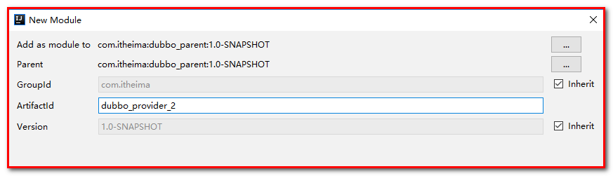

2. 参考dubbo_provider 项目

   复制pom.xml

   复制main

   复制test

3. 修改端口

   （1）dubbo协议：dubbo_provider -- 20880

   ​			         dubbo_provider_2-- 20881

   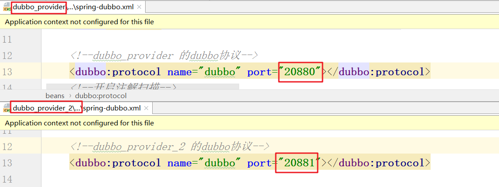	

   （2）web服务端口号: dubbo_provider --  81

   ​				  dubbo_provider_2-- 82

   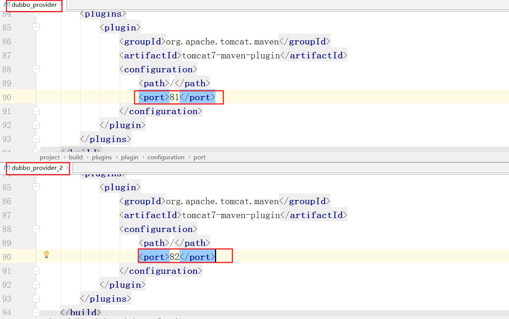	

   （3）在service方法中添加输出语句（20880、20881），用来区分不同的应用

   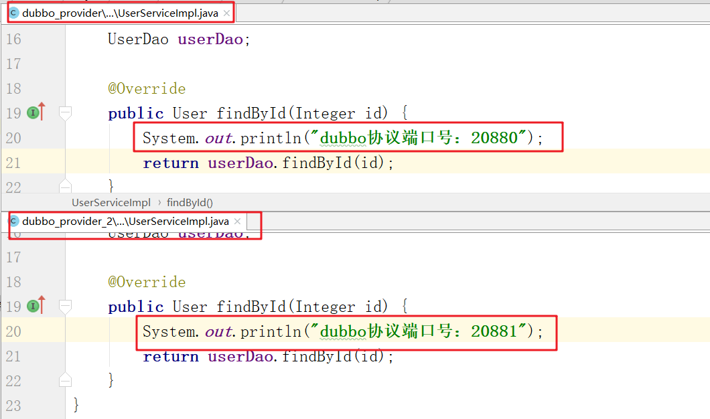

4. 消费者配置负载均衡

   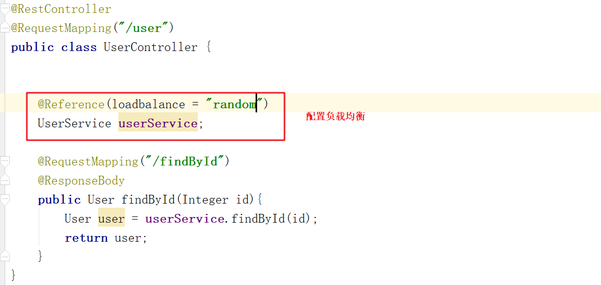

   其中：

   ```java
   @Reference(loadbalance = "roundrobin") 		// 表示轮询
   @Reference(loadbalance = "random")       	// 表示随机（默认）
   ```

5. 访问测试

   安装父工程到本地仓库

   启动两个提供者（dubbo_provider、dubbo_provider2）： 端口号：81 ，82

   配置提供者1和2的findById方法
   
   
   
   启动消费者，访问：http://localhost:80/user/findById.do?id=1


### 【小结】 

1：负载均衡介绍

2：测试负载均衡效果

## 8. 配置中心

### 【目标】

Dubbo配置中心

### 【路径】

1：配置中心环境介绍

2：实现配置中心

（1）在Zookeeper中添加数据源所需配置

（2）在dubbo-common中导入jar包

（3）修改数据源，读取Zookeeper中数据

3：watch机制

（1）添加监听

（2）获取容器对象

### 【讲解】

### 8.1. 环境介绍

​	数据发布/订阅即所谓的配置中心：发布者将数据发布到ZooKeeper一系列节点上面，订阅者进行数据订阅，当数据有变化时，可以及时得到数据的变化通知，达到**动态及时获取数据**的目的。

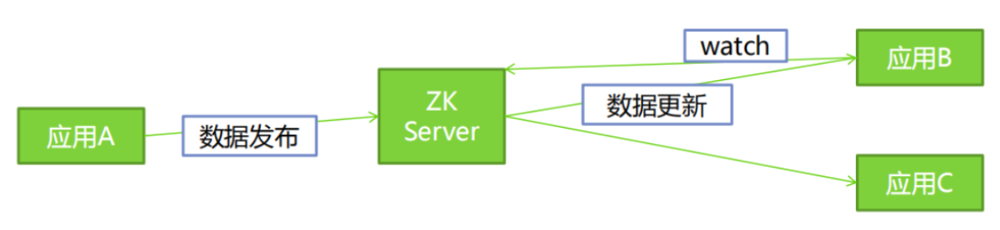					     现在项目中有两个提供者，配置了相同的数据源，如果此时要修改数据源，必须同时修改两个才可以。

​	我们可以将数据源中需要的配置信息配置存储在zookeeper中，如果修改数据源配置，使用zookeeper的watch机制，同时对提供者的数据源信息更新。如下图所示:

### 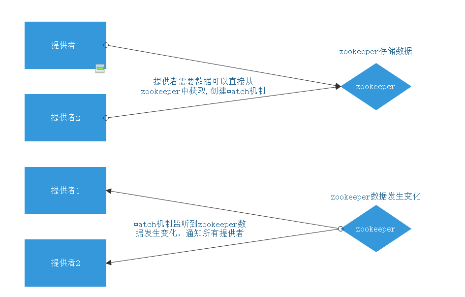8.2. 实现配置中心

【路径】

1：在zookeeper中添加数据源所需配置

2：在dubbo-common中导入jar包

3：修改数据源，读取zookeeper中数据源所需配置数据

（1）在dubbo-common中创建工具类：SettingCenterUtil,继承PropertyPlaceholderConfigurer

（2）编写载入zookeeper中配置文件，传递到Properties属性中

（3）重写processProperties方法

（4）修改spring-dao.xml

4：watch机制

（1）添加监听

（2）获取容器对象，刷新spring容器：SettingCenterUtil,实现ApplicationContextAware

#### 8.2.1. 在zookeeper中添加数据源所需配置

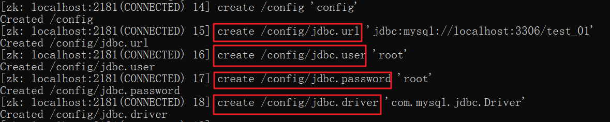

让我们的程序读取Zookeeper中的配置，而不再从程序的中的jdbc.properties文件中读取。

#### 8.2.2.在dubbo-common中导入jar包

```xml
    <dependencies>
        <dependency>
            <groupId>org.springframework</groupId>
            <artifactId>spring-webmvc</artifactId>
        </dependency>
        <dependency>
            <groupId>com.alibaba</groupId>
            <artifactId>dubbo</artifactId>
        </dependency>
        <dependency>
            <groupId>org.apache.zookeeper</groupId>
            <artifactId>zookeeper</artifactId>
        </dependency>
        <dependency>
            <groupId>org.apache.curator</groupId>
            <artifactId>curator-framework</artifactId>
        </dependency>
        <dependency>
            <groupId>org.apache.curator</groupId>
            <artifactId>curator-recipes</artifactId>
        </dependency>
        <dependency>
            <groupId>org.mybatis</groupId>
            <artifactId>mybatis</artifactId>
        </dependency>
        <dependency>
            <groupId>org.mybatis</groupId>
            <artifactId>mybatis-spring</artifactId>
        </dependency>
        <dependency>
            <groupId>com.alibaba</groupId>
            <artifactId>druid</artifactId>
        </dependency>
        <dependency>
            <groupId>mysql</groupId>
            <artifactId>mysql-connector-java</artifactId>
        </dependency>
        <dependency>
            <groupId>org.springframework</groupId>
            <artifactId>spring-tx</artifactId>
        </dependency>
        <dependency>
            <groupId>org.springframework</groupId>
            <artifactId>spring-jdbc</artifactId>
        </dependency>
    </dependencies>
```

#### 8.2.3. 修改数据源，读取zookeeper中数据

##### 8.2.3.1. 在dubbo-common中创建工具类：SettingCenterUtil,继承PropertyPlaceholderConfigurer

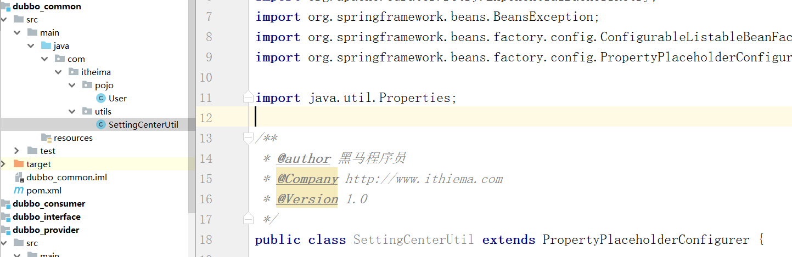

##### 8.2.3.2. 编写载入zookeeper中配置文件，传递到Properties属性中

```java
/**
 * 载入zookeeper数据
 * @param props
 */
private void loadZk(Properties props){
    //创建重试策略
    RetryPolicy retryPolicy = new ExponentialBackoffRetry(3000,1);
    //创建客户端
    CuratorFramework client = CuratorFrameworkFactory.newClient("127.0.0.1:2181", 3000, 3000, retryPolicy);
    client.start();
    try {
        byte[] urlBytes = client.getData().forPath("/config/jdbc.url");
        props.setProperty("jdbc.url",new String(urlBytes));
        byte[] userBytes = client.getData().forPath("/config/jdbc.user");
        props.setProperty("jdbc.user",new String(userBytes));
        byte[] pwdBytes = client.getData().forPath("/config/jdbc.password");
        props.setProperty("jdbc.password",new String(pwdBytes));
        byte[] driverBytes = client.getData().forPath("/config/jdbc.driver");
        props.setProperty("jdbc.driver",new String(driverBytes));
    } catch (Exception e) {
        e.printStackTrace();
    }
    client.close();
}
```

##### 8.2.3.3. 重写processProperties方法

```java
/**
 * 处理properties内容,相当于此标签
 *  <context:property-placeholder location="classpath:jdbc.properties"></context:property-placeholder>
 * @param beanFactoryToProcess
 * @param props
 * @throws BeansException
 */
@Override
protected void processProperties(ConfigurableListableBeanFactory beanFactoryToProcess, Properties props) throws BeansException {
    // 载入zookeeper配置信息，即从Zookeeper中获取数据源的连接信息
    loadZk(props);
    super.processProperties(beanFactoryToProcess, props);
}

```

##### 8.2.3.4. 修改提供者的:spring-dao.xml

注释掉：

```xml
<context:property-placeholder location="classpath:jdbc.properties"></context:property-placeholder>
```

添加：

```xml
<bean id="settingCenterUtil" class="com.itheima.utils.SettingCenterUtil"></bean>
```

spring-dao.xml中配置

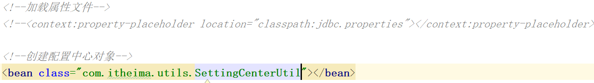	

#### 8.2.4. watch机制

##### 8.2.4.1. 添加监听

```java
/**
 * 添加watch机制
 * @param props
 */
private void addWatch(Properties props) {
    RetryPolicy retryPolicy = new ExponentialBackoffRetry(3000,1);
    CuratorFramework client = CuratorFrameworkFactory.newClient("127.0.0.1:2181", 3000, 3000, retryPolicy);
    client.start();
    //创建缓存机制，监听 /config 路径
    TreeCache treeCache = new TreeCache(client,"/config");
    //启动缓存机制
    try {
        treeCache.start();
    } catch (Exception e) {
        e.printStackTrace();
    }
    //添加监听
    treeCache.getListenable().addListener(new TreeCacheListener() {
        /**
         *
         * @param client  zookeeper客户端对象
         * @param event  zookeeper改变触发的事件
         * @throws Exception
         */
        @Override
        public void childEvent(CuratorFramework client, TreeCacheEvent event) throws Exception {
            //如果是修改事件则，更新数据
            if(event.getType() == TreeCacheEvent.Type.NODE_UPDATED){
                //如果修改的是jdbc.url路径，修改jdbc.url的配置
                if(event.getData().getPath().equals("/config/jdbc.url")){
                    props.setProperty("jdbc.url",new String(event.getData().getData()));
                }else if(event.getData().getPath().equals("/config/jdbc.driver")){
                    props.setProperty("jdbc.driver",new String(event.getData().getData()));
                }else if(event.getData().getPath().equals("/config/jdbc.user")){
                    props.setProperty("jdbc.user",new String(event.getData().getData()));
                }else if(event.getData().getPath().equals("/config/jdbc.password")){
                    props.setProperty("jdbc.password",new String(event.getData().getData()));
                }
            }
        }
    });
}
```

注意：

1：不要关闭client，否则无法进行监控

2：修改完成后必须刷新spring容器的对象

##### 8.2.4.2. 获取容器对象，刷新spring容器 

1：实现ApplicationContextAware接口，重写setApplicationContext方法，获取applicationContext对象。

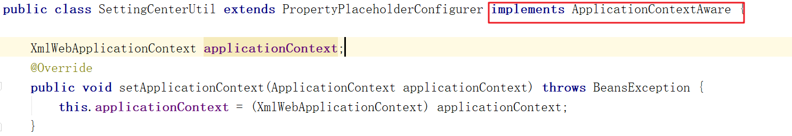	

2：XmlWebApplicationContext 容器对象，提供了refresh方法，可以刷新容器中的对象，故强制转换。

```java
//修改完成后必须刷新spring容器的对象
applicationContext.refresh();
```

3：在processProperties的方法中，添加addWatch(props);

```java
protected void processProperties(ConfigurableListableBeanFactory beanFactoryToProcess, Properties props) throws BeansException {
    loadZk(props);
    addWatch(props);
    super.processProperties(beanFactoryToProcess, props);
}
```

4：修改Zookeeper的配置

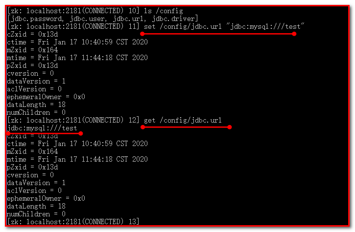

### 【小结】

1：配置中心环境介绍

2：实现配置中心

（1）在Zookeeper中添加数据源所需配置

（2）在dubbo-common中导入jar包

（3）修改数据源，读取Zookeeper中数据

3：watch机制

（1）添加监听

（2）获取容器对象


