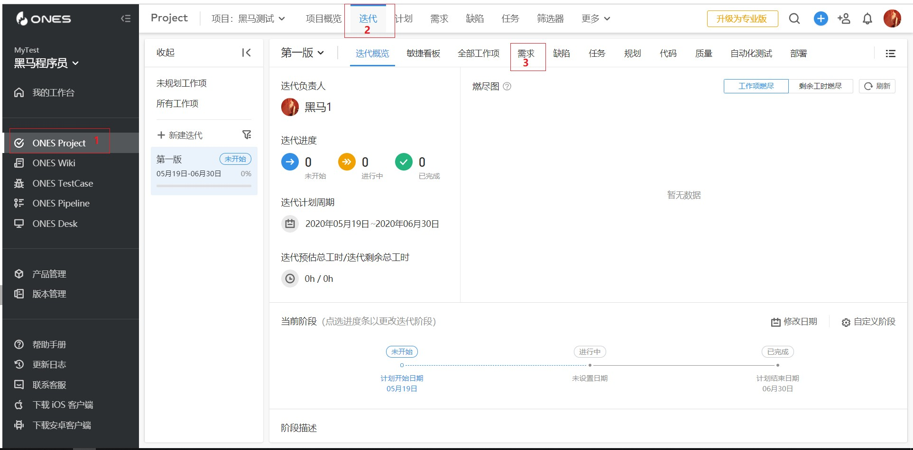
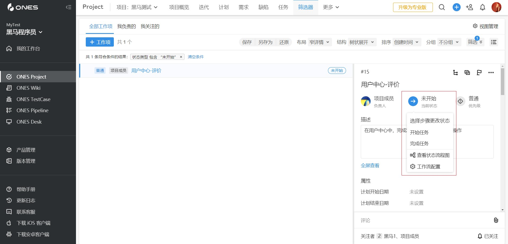
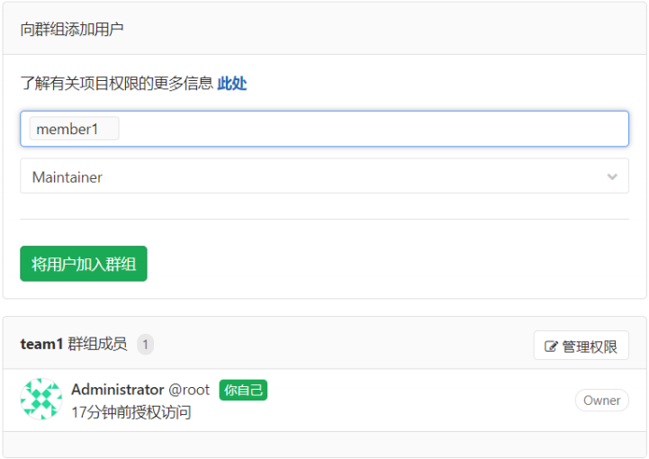
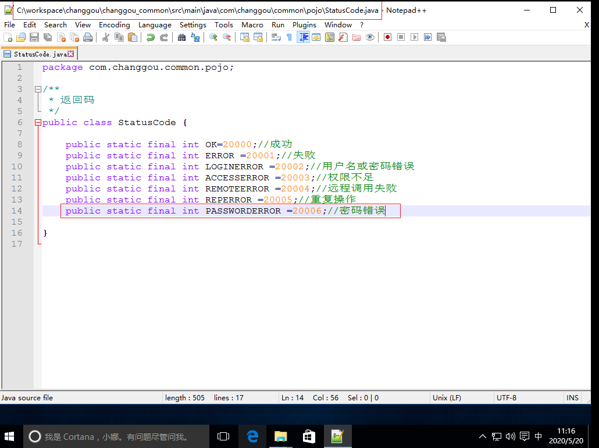
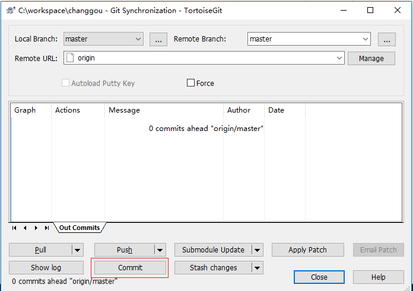
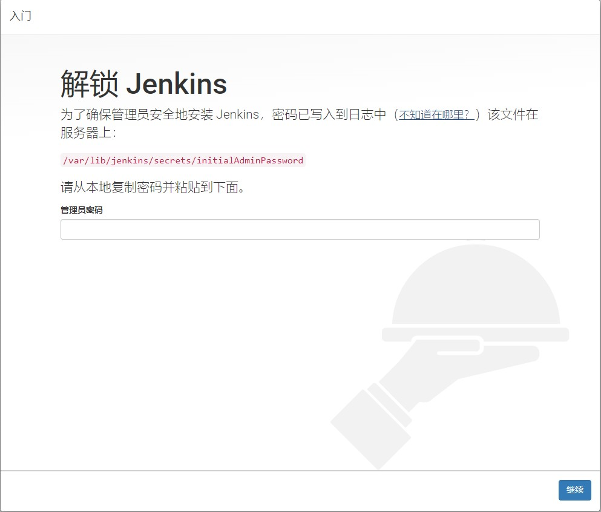

# 项目管理之自动化构建部署(CICD)

学习目标：

- 理解敏捷项目管理
- 掌握ones使用
- 掌握GitLab使用
- 掌握Jenkins自动化项目构建与部署


# 1. 研发管理概述

### 【目标】

  学会使用研发管理协作工具ONES

### 【路径】

1：了解研发管理概念

2：了解敏捷开发

3：了解DevOps

### 【讲解】

## 1.1. 研发管理概念

​	研发管理就是在研发体系结构设计的基础之上，借助信息平台对研发进行的团队建设、流程设计、绩
效管理、风险管理、成本管理、项目管理和知识管理等活动。
管理活动的目的是实现组织目标。研发团队通过科学的研发管理方法可以保证软件开发及交付的稳定
性，更高效的实现团队目标。

## 1.2. 研发管理能帮助企业做到什么

- 准确把控项目的全局和细节
- 使软件发布变成一件轻松、简单的事情
- 不断改进优化软件发布流程
- 提高软件发布质量
- 更快交付产品，快速将研发团队的工作转变为商业价值

## 1.3. 敏捷开发概述

​	现阶段，市场需求的不断变化与技术的快速革新使项目不确定性大大增加，研发团队需要快速响应变
化才能适应行业发展。许多研发团队发现，在更频繁地探讨需求、交付增量时，团队会更容易适应变
更。由于团队能迅速获得反馈，这些迭代
和增量方法减少了浪费和返工。敏捷方法的出现就是为了在短时间内探讨可行性，根据评估和反馈快速
调整。

### 1.3.1. 经典敏捷方法 Scrum

​	Scrum 是用于管理产品开发的单个团队过程框架，采用迭代（Sprint）方法来交付工作产品。Scrum
是运行在 1 个月或更少的时间段上的，其中包含持续时间一致的多个迭代，在这些迭代中会产生潜在可
发布的产品增量。Scrum 的重点是最大化开发团队的能力，从而对项目和客户需求中的变更快速作出响
应。 

**角色**
	Scrum 团队包含产品负责人（Product Owner）、Scrum 主管（Scrum Master）和开发团队
（Scrum Team）。产品负责人负责实现产品价值的最大化Scrum 主管负责确保 Scrum 过程获得相应
支持且 Scrum团队遵从时间和规则，并指导团队消除障碍。开发团队是一个跨职能自组织团队，其开发
成员拥有所需的一切资源，可在不依赖团队外部其他资源的情况下交付工作产品。

 

**流程**
	一个 Scrum 的标准流程为：收集 Backlog（需求）- 挑选Backlog（产品待办列表） 到 Sprint（迭代）
中 - 执行Sprint - 交付、验收Sprint 成果 - 总结 Sprint

1. 收集 Backlog
执行者：产品经理
 任务：收集 Backlog、制定优先级
 产品经理根据市场需求、产品定位等汇总出本次项目的所有
 待办事项，并将每个待办事项制定相应的优先级。
2. 选取 Backlog 中的事项加入到 Sprint 中
执行者：开发团队
参与者：Scrum Master
任务：按照优先级挑选待办事项到下一次的迭代中
 需要注意的是开发团队在挑选的时候根据开发的人力资源来
 选择挑选的数量，但是必须按照优先级从高到底的顺序来挑
 选。
3. 开始执行 Sprint
执行者：开发团队
参与者：Scrum Master
任务：完成本次迭代的所有待办事项
一个 Sprint 即是一次迭代，往往设置为一周到两周。
4. 交付、验收 Sprint
执行者：开发团队
参与者：产品经理、Scrum Master
任务：交付最终产品给产品经理验收
5. 总结 Sprint
执行者：Scrum Master
参与者：开发团队、产品经理
任务：总结本次 Sprint 什么做得好、什么做的不好、后续应该怎么做
Scrum 提供了一套基于团队的敏捷方法，引入「Backlog」
的概念来衡量团队的工作量，可以根据优先级交付工作任
务，简单易用，有效帮助敏捷落地。

## 1.4. DevOps

### 1.4.1.**概念**

​	在最开始的编程工作中，开发人员就是运维人员。随着软件开发复杂度不断增加，技术团队角色逐渐
增多（如开发工程师、运维工程师、测试工程师等），这种情况就导致组织里充斥着「部门墙」，大家
都自行其是，形成了一种天然壁垒。
​	DevOps 是「Development」和「Operations」的合成词，表示在软件产品交付的过程中，「研发
团队」和「运维团队」进行高效沟通和协作，旨在更快、更可靠地发布高质量软件。通过自动化「软件
交付」和「架构变更」的流程，来使得构建、测试、发布软件能够更加地快捷、频繁和可靠。
**DevOps 与敏捷研发**
​	敏捷是 DevOps 的一部分。早期的 DevOps 主要注重研发、运维等技术团队各角色高效协作，目
前，DevOps 包含敏捷研发的内容。

 

### 1.4.2.软件发布的反模式

1. 手工部署软件
1）需要花费大量的时间编写一份非常详尽的文档，该文档描述了执行步骤及每个步骤中易出错的地
方；
2）在发布时，常常要在发布的过程中去修正问题；
3）如果是集群环境部署，经常发现在集群中各个服务器环境的配置都不相同；
发布结果不可预测，经常会遇到不可预见的问题，从而不得不进行版本回滚。
2. 开发完成之后才向生产环境部署
1）如果软件是全新开发的，那么第一次将它部署到试运行环境时，可能会非常棘手；
2）开发环境与生产环境差异性越大，开发过程中所做的那些假设与现实之间的差距就越大。
3. 生产环境的手工配置管理
    1）多次部署到试运行环境都非常成功，但当部署到生产环境时就失败；
   运维团队需要较长时间为每次发布准备环境；
   2）系统无法回滚到之前部署的某个配置，这些配置包括操作系统、应用服务器、关系型数据库
    管理系统、Web服务器或其他基础设施设置；
   3）不知道什么时候起，集群中的某些服务器所用的操作系统、第三方基础设施、依赖库的版本
    或补丁级别就不同了。

### 1.4.3.部署流水线

​	在软件发布的过程中，持续集成与持续交付是 DevOps 的核心流程，而部署流水线是持续集成与持续
交付的关键。部署流水线是指一个软件产品从`构建、部署、测试`到发布整个过程的自动化实现。

	

​	部署流水线的目标有三个：
*首先，它让软件构建、部署、测试和发布过程对所有人可见，促进了合作。
*其次，它改善了反馈，以便在整个过程中，我们能够更早地发现并解决问题。
*最后，它使团队能够通过一个完全自动化的过程在任意环境上部署和发布软件的任意版本。

### 1.4.4.收益

​	DevOps 的收益是`创建了一个发布流程`，这个流程是可重复、可靠的且可预见的，从而大大缩短了发
布周期，使新增功能和缺陷修复能更早被用户使用。
​	一个新功能只有被用户使用了，才算实现了它的商业价值。DevOps 能够帮助企业尽早实现增量部分
的商业价值，提高企业市场竞争力。

### 【小结】

1：了解研发管理概念

2：了解敏捷开发

3：了解DevOps

# 2. 研发管理协作工具ONES

### 【目标】

学会使用ONES

### 【路径】

1：了解ONES

2：了解教职人员操作

3：掌握项目组长及项目成员操作

### 【讲解】

## 2.1. ONES简介

​	ONES是一款项目研发管理协作工具，内部 包括 ONES Project（项目进度管理）、ONESPlan（项目
集管理）、ONES Wiki（知识库管理）、ONES TestCase（测试用例与测试计划管理）、
ONESPipelline（持续集成与交付管理）等专业研发管理协作工具，使技术团队各角色成员紧密协作，
提升个人创造力与团队效率，从而提升产品交付质量，帮助企业更好更快发布产品。


测试环境：<https://ones.ai/project>  

正式环境：<https://itcast.ones.pro/> (项目实战使用)

## 2.2. 教职人员操作

### 2.2.1. 邀请项目组长并分配权限

​	在实战中，会以每个班级作为一个大团队。这个大团队的Leader就是每班的教职人员。同时班级会被
分为若干个项目组。由教职人员邀请每组的某一位学员作为项目组长，项目组长后期可以邀请自己项目
团队成员、创建迭代、发布需求等。
​	在主界面中，点击右上角邀请成员符号。


​	接着就可以进入到邀请新成员界面。在该页面中，输入被邀请成员的邮箱，同时授权产品位置，取消
勾选Plan。如需一次邀请多名成员，当输入完邮箱地址后，按回车即可进行后续输入。
​	当点击发送邀请后，对应邮箱就会收到邀请邮件。

 

对应邮箱接收到邀请邮件后，点击**加入团队**即可。

 

同时就会进入到登录页面，如果是第一次被邀请的话，需要设置自己的用户名和密码信息。

 

接着进入团队配置中心，给用户分配项目组长权限。


接着点击团队权限，给被操作用户分配邀请团队成员【项目组长只需要拥有该权限即可】


### 2.2.2. 创建项目

​	教职人员会针对每个分组在ONES当中建立一个对应的项目。操作步骤：ONES Project-->新建项目


​	项目名称：即小组名称。可以是学生自己起的公司名称，或者项目+分组名称都可以。只要便于区分就行。

​	项目模板：选择默认的敏捷项目管理。


完成编辑后，点击下一步，选择项目成员，将该项目组长选中即可。 

 

然后点击完成，弹出提示框确认即可，至此一个项目就创建完成了。

### 2.2.3. 指定组长为项目负责人

创建完项目后，项目的负责人默认仍然为项目创建人，也就是当前教职人员。需要转移项目负责人为组长。

操作步骤：**ONES Project ->** **要操作的项目** **->** **项目负责人**。并选择被分配的项目组长。


当分配完之后，点击项目名称，即可进入到项目概览页面，此时可以看到，项目负责人已经变为指定的项目组长。且该组长拥有这个项目当中的所有权限。


## 2.3. 项目组长及项目成员操作

### 2.3.1. 操作流程说明


### 2.3.2. 组建开发团队

​	首先项目组长进入项目后，需要对项目开发团队进行组建，邀请组内成员进入到项目中。开发团队组建分为两种情况：

- 成员不在系统中

  当成员不在系统中时，需要通过邀请的方式将该成员添加到系统中，方式与上述邀请项目组长相同。

- 成员已在系统中

  当成员已在系统中，可通过项目中的  【**成员**】 中，将该成员添加到当前项目中。

  

  

  

  


### 2.3.3. 创建迭代

​	对于敏捷项目管理，迭代是一个很重要的概念，本着小步快跑的思想，一般来说，基本是每周一个迭代。然后在迭代中去添加需求和任务。

#### 1）创建迭代

​	首先需要在当前项目中创建一个迭代。

​	操作步骤：ONESProject -> 当前项目 ->迭代 ->新建迭代


​	接着需要在弹出页面中，输入迭代名称、选择迭代负责人、迭代开始日期和结束日期。

 

​	当点击  **确定**后，即可进入到迭代详情页面中。


### 2.3.4. 导入项目需求

​	项目组长在创建完迭代后，需要将当前项目要开发的需求列表导入到 【**需求**】 中。需求列表由教师提供给项目组长。

#### 1）需求文档模版下载

​	需求文档是由老师提供，但也需知晓其文档模版是从何处下载的。

​	操作步骤：ONESProject -> 当前项目 ->迭代 ->需求 ->导入需求 ->模版下载。



​	在需求页面，可以添加单一需求也可以通过模版批量添加需求。此处我们选择导入需求。


​	接着弹出导入需求页面，在工作项类型上，可以勾选：需求、缺陷、任务、子任务、子需求。按照自身需要进行选择即可。当点击模版下载，即可下载一个Excel文档作为需求列表模版使用。

​	`注意:子需求和子任务不要 ==>模板老师提供了,但要修改`


#### 2）修改需求文档

​	当要上传需求文档时，需要根据自身需要对需求文档内容进行修改。


​	对于标红的部分：标题、负责人、工作项类型、状态、优先级、所属项目。全部为必填项，且信息必须正确，否则导入失败。

`1.负责人:组长账号`

`2.所属迭代`

`3.所属项目:项目名称`

`4.截止时间`

#### 3）导入需求

​	操作步骤：ONES Project -> 实战项目 -> 迭代 -> 需求 -> 导入需求


​	在配置完成后，点击下一步。这时候，会让你检查一下几个必选项在导入的文件中是否都存在。如果必选项不存在或者内容不对的话，都会导致导入失败。


​	确认无误后，点击  **开始导入**  ，在确认框中点击 **确定**，系统会自动进行导入操作。

在导入的过程中，页面下方会出现 **进度管理器**，用于显示导入的进度和结果。在导入成功后，点击**刷新**，即可看到导入的需求信息。


### 2.3.5. 创建和分配任务

​	完成需求导入后，组长需要基于对需求的理解，对任务进行划分和分配。

​	操作步骤：**ONES Project -> 实战项目 -> 迭代 -> 任务 -> 建任务**


#### 1）新建任务

​	对于任务的新建，可以逐一新增也可批量导入，此处演示单一添加任务。


​	标题：任务名称，按实际需求填写

​	所属项目：选择当前项目

​	工作项类型：选择默认任务即可

​	负责人：该任务的负责人，由`谁来完成该任务`，进行任务指派

​	优先级：任务的优先级，优先级越高，越要优先处理。

​	在创建任务时，关注这几项即可，其他项无需修改。然后，点击   **确定**  。一个任务就创建好了。


#### 2）更新任务

当任务创建好了后，有时还需要关联需求或变更任务负责人。此时可以通过页面右侧的任务详情对信息进行修改。

 

1：关联工作项：通过这里可以对其他工作项进行关联，例如需求。具体操作，点开进行选择，然后点击 **确认** 即可。

2：负责人：通过这里可以修改当前任务负责人。

### 2.3.6. 启动项目

​	项目组长完成任务分配后，需要修改项目状态，修改为 **进行中** 。代表项目已经开始。

​	操作步骤：**ONES Project -> 实战项目 -> 项目概览 -> 切换项目状态**


### 2.3.7. 开发过程

​	项目在开发过程，操作较为简单，只要按照当前进度对任务进度进行更新即可。



### 【小结】

1：了解ONES

2：了解教职人员操作

3：掌握项目组长及项目成员操作

# 3. 代码私仓GitLab

### 【目标】

学会使用GitLab

### 【路径】

1：了解GitLab

2：安装GitLab

3：创建群组、用户、项目

4：SSH介绍以及秘钥生成

5：提交本地文件到远程仓库

6：克隆远程仓库到本地

### 【讲解】

## 3.1. GitLab简介

​	GitLab是整个DevOps生命周期的第一个应用程序。其使用与GitHub类似，并且提供了许多DevOps
相关的功能。GitLab提供无与伦比的可见性，更高的效率和全面的治理。这使得软件生命周期加快了
200％，从根本上提高了业务速度。

​	官方网站:https://about.gitlab.com/


## 3.2. GitLab安装

### 3.2.1. **GitLab下载安装**配置启动

此处以centos7为例。
1）安装并配置依赖项，同时打开HTTP访问和SSH访问

```
sudo yum install -y curl policycoreutils-python openssh-server
sudo systemctl enable sshd
sudo systemctl start sshd

systemctl stop iptables
systemctl stop firewalld
```

2）安装GitLab软件包

```
#在线安装
sudo yum localinstall –nogpgcheck https://mirrors.tuna.tsinghua.edu.cn/gitlab-ce/yum/el7/gitlab-ce-12.10.6-ce.0.el7.x86_64.rpm
#本地安装
rpm -ivh gitlab-ce-12.10.6-ce.0.el7.x86_64.rpm
```

 

3）初始化GitLab配置

```
sudo gitlab-ctl reconfigure
```

4）启动或停止GitLab

```
# 启动 gitlab 服务
gitlab-ctl start
# 停止 gitlab 服务
gitlab-ctl stop
```

默认安装位置

 

其它命令：

```
#Linux释放内存的命令
echo 3 > /proc/sys/vm/drop_caches
#已经使用内存数free
free -h
#查看gitlab日志
sudo gitlab-ctl tail
启动： systemctl start firewalld
关闭： systemctl stop firewalld
查看状态： systemctl status firewalld
开机禁用 ： systemctl disable firewalld
开机启用 ： systemctl enable firewalld
开启端口:  firewall-cmd --zone=public --add-port=80/tcp --permanent
重新加载：firewall-cmd --reload
查看开了哪些端口：firewall-cmd --list-services
```

4）访问登录

​	首次访问时，会重定向到重置密码页面，设置初始化登录密码。默认用户名为root(qazwsx123)。当重置成功，跳转到登录页面，输入用户名/密码登录即可

 

登录成功后，进入主页

 

​	默认语言使用的英文，如果想修改为中文的话。操作步骤：**右上角头像 ->Settings -> Preferences**

**-> Language -> 简体中文 -> save changes**。 然后刷新当前页面即可。

 

## 3.3. GitLab使用

### 3.3.1. 创建组及组权限配置

​	在GitLab组相当于团队，在项目开发过程中，每个组有不同的组员和对应的不同的子项目,对项目组用
户开放项目的访问。
​	在GitLab首页选择**Create a Group**，进入创建页面，输入群组名称，群组URL，群组描述，同时还
需选择可见性级别，其相当于设置组权限。
​	在可见性级别中包含三种：
​	私有：群组及其项目只能由成员查看
​	内部：任何登录的用户都可以查看该群组和任何内部项目
​	公开：不进行身份验证，可以随意查看。


当输入完信息，点击创建群组即可完成组的创建。

  

### 3.3.2. 创建用户及用户权限配置

#### 3.3.1. 创建用户

​	组有了之后，还需要向组内添加项目组成员。

 

​	当点击 新用户 后，会进入到添加用户页面，需要输入Name、Username、和Email。最后点击
create user即可。

 

​	接着以管理员身份，重新进入到成员列表页面，此时已经可以看到新增了一个 member1 用户。接
着点击 编辑，设置该用户的登录密码。


#### 3.3.2. 用户进组，及用户权限指定

​	现在有了组和用户后，可以将指定用户添加到组中。


​	当进入到组的详情页面中之后，即可将指定用户添加到组中。首先需要先确定当前被操作的用户。接
着需要指定当前用户的身份权限。

​	身份对应权限，总共有五个选项，分别为：

- Guest：可以创建issue、发表评论，不能读写版本库

- Reporter：可以克隆代码，不能提交，QA、PM可以赋予这个权限

- Developer：可以克隆代码、开发、提交、push，RD可以赋予这个权限

- Maintainer：可以创建项目、添加tag、保护分支、添加项目成员、编辑项目，核心RD负责人可

  以赋予这个权限

- Owner：可以设置项目访问权限 - Visibility Level、删除项目、迁移项目、管理组成员，开发组

- leader可以赋予这个权限

  可以根据实际人员情况，进行人员角色权限分配。此处选择    **Developer**


 

### 3.3.3. 创建项目

​	GitLab核心作用是作为代码仓库，因为它可以像GitHub一样进行代码托管。首先需要创建好项目，
然后把项目指派该开发组。


​	当进入到新建项目页面，GitLab提供了三种创建方式：空白项目、从模板创建、导入项目。此处使用

**空白项目**  。对于权限仍然是三个，与组权限相同。

 

​	当创建成功，即可进入到项目页面。


​	并且此时，进入到项目组详情页面，可以看到该项目组已经关联了一个项目


### 3.3.4. SSH协议

#### 3.3.4.1 SSH协议概述

​	SSH为Secure Shell（安全外壳协议）的缩写，由IETF的网络小组制定。SSH是目前较可靠，专为远程
登录会话和其他网络服务提供安全性的协议。利用SSH协议可以有效防止远程管理过程中的信息泄露问
题。

#### 3.3.4.2 基于密钥的安全验证

​	使用SSH协议通信时，推荐使用基于密钥的验证方式。你必须为自己创建一对密钥，包含一把公钥和
一把私钥，并把公钥放在需要被访问的服务器上。如果你要连接到SSH服务器，客户端软件就会向服务
器发出请求，请求用当前密钥进行验证。服务器收到请求后，先在该服务器上的主目录下寻找公钥，然
后用公钥和发送过来的密钥进行配对。如果配对成功，服务器就用公钥加密“质询”并把它发送给客户端
软件。客户端软件收到“质询”之后就可以用私钥解密，再把它发送给服务器。

#### 3.3.4.3 SSH密钥生成

​	密钥生成的方式有很多种，常见的jdk工具或git bash都可以，此处使用git bash。

1）打开gitBash客户端

 

 

2）执行命令，生成公钥和私钥

```
ssh-keygen -t rsa
```

 

​	执行完之后，在windows本地用户.ssh目录会存在对应文件，文件目录：C:\Users\weizhaohui\
.ssh

 

#### 3.3.4.4 SSH密钥配置

​	密钥生成后需要在gitlab上配置密钥，点击头像=>设置=>SSH秘钥本配置，才可以访问。 

  

  

### 3.3.5 提交本地文件到远程仓库

​	设置成功后，就可以通过SSH形式上传和下载代码了。按照提示命令进行操作即可。

#### 3.3.5.1 Git base提交

```
cd existing_folder
git init
git remote add origin git@自己的ip地址:team1/11111.git
git add .
git commit -m "Initial commit"
git push -u origin master
```


#### 3.3.5.2 TortoiseGit提交

​	由于TortoiseGit使用的ssh工具是“PuTTY”。git Bash使用的ssh工是“openSSH”，如果想让
TortoiseGit也使用刚才生成的密钥可以做如下配置：

 

 

​	在本地仓库的文件夹中单击右键，选择“Git Sync”

 

 

​	首先选择 commit 。然后输入备注信息。

 

​	接着点击ok ，即可完成上传操作。

 

 

 

​	此时可以看到，文件已经提交成功。可以回到gitLab中查看。

 

### 3.3.6 克隆远程仓库到本地

#### 3.3.6.1）Git Bash克隆

​	打开Git  Base指令窗口，输入命令：

```
git clone git@52.82.114.68:team1/demo.git
```


#### 3.3.6.2）TortoiseGit克隆

​	鼠标右键，选择 **Git Clone**

 

 

​	点击   ok。即可开始克隆操作。当操作完成，会返回对应提示。

 

### 【小结】

1：了解GitLab

2：安装GitLab

3：创建群组、用户、项目

4：SSH介绍以及秘钥生成

5：提交本地文件到远程仓库

6：克隆远程仓库到本地

# 4. Idea集成GitLab

### 【目标】

Idea中集成GitLab

Idea中使用GitLab

### 【路径】

1：安装GitLab插件

2：配置GitLab插件

3：Idea提交代码到本地与远程仓库

4：Idea从远程仓库克隆项目

5：Idea提交忽略文件

6：Idea解决代码冲突

7：Idea代码历史追溯

### 【讲解】

## 4.1. 提交代码到本地与远程仓库

### **4.1.1. 安装GitLab插件**

​	选择**File -> Settings -> Plugins**  。搜索gitlab。


​	当安装完成并重启Idea后，选择 VCS -> Import into version control。会出现一个新的选项 **Share**
**Project  on GitLab**。

### **4.1.2. **配置GitLab

​	首先需要创建访问token令牌(头像==>设置==>访问令牌)。

 

 

​	当点击   创建个人访问令牌后，会显示你当前的访问令牌。

 

### **4.1.3. **将访问令牌配置到Idea中

​	在Idea中，选择 File-> Settings -> Version Control -> GitLab -> Add a new GitLab Server


​	在页面中，配置GitLab中获取到的Token相关信息。

 

### **4.1.4. **将工程目录指定为本地仓库

​	在Idea中，选择**VCS-> import into version control -> create git repository** 。接着选择当前操作的工程目录文件夹即可。

 

​	当选择完成后，可以发现，项目中的文件由黑色 变为 红色。代表这些文件还没有被添加到本地仓库。

 

### **4.1.5. **提交文件到本地仓库

​	此时可以 右键**当前工程** **-> Git -> Add** 【或使用快捷键 Ctrl+Alt+A】。先添加文件。

 

​	接着重复上述步骤，但需要选择 **Commit Directory**

 

​	在弹出的页面中，选中要提交的文件，并编写提交说明。最后点击   Commit  即可。

 

​	当  Commit 成功后，会有对应的提示。

 

### **4.1.6. **提交代码到GitLab远程仓库

#### **1）提交远程仓库**

​	提交到本地仓库后，就可以将项目提交到远程仓库了。选择**右键被提交的**工程 **->Git -> Repository ->push** 【或使用快捷键 Ctrl+Alt+K】。


​	选择完push后，如果是第一次提交，需要指定远程仓库地址。点击**Define remote** 进行指定


 

​	最后点击push即可。

​	注：当前是以提交一个项目为例，当要提交某个文件时，操作步骤一致。

#### 2）问题解决

​	因为之前初始化项目时，远程仓库测试提交了demo.txt和readme.txt，而本地仓库与远程仓库尚未进行文件关联，因此需要将两个仓库的文件进行关联后提交。

​	解决方案如下：

​	1.切换到自己项目所在的目录，右键选择GIT  BASH  Here，Idea中可使用Alt+F12

​	2.在terminl窗口中依次输入命令：

```
git pull
git pull origin master
git pull origin master --allow-unrelated-histories
```

​	3.在idea中重新push自己的项目，成功！！！

​	注：如果没有成功的话，请删除自己本地项目下.git的隐藏目录，重新关联项目推送即可！当执行完成后，Idea中就会显示出远程仓库中的两个文件，完成同步。


 

​	此时，重新进行push操作。即可提交远程仓库成功。

 


## 4.2. 从远程仓库克隆项目

​	当项目存在于远程仓库后，也可以通过Idea将项目clone到本地。

​	打开Idea，在主页面选择 **Get from Version Control**

 

​	进入到页面后，需要指定远程仓库地址与项目在本地的存放路径。然后点击   **Clone**   即可。


### **4.2.1. **提交忽略文件设置


​	刚才可以看到，在进行项目提交时，把target目录和.idea目录里的内容也全都提交了，这在开发中是绝对不会的。我们只会提交java和resources目录下的核心内容。

​	那现在就需要设置在提交项目时，忽略一些没必要上传的文件。

​	为了演示，此处需要在gitlab中重新创建一个项目，暂命名为：changgou。且需关联开发组，步骤与上述流程一致，不再演示该流程。

#### 1）安装 .ignore 插件

​	在Idea中选择 **File -> Plugins -> 搜索插件 .ignore** 。并进行安装，安装完成后，重启Idea即可。


#### 2）创建忽略文件

​	插件安装完成后，在父工程下，**新建文件-> .ignore file -> .gitignore******


​	同时选择当前语言，此处选择Java。点击generate即可。


​	文件创建完成后，其内部会忽略 所有的 .class 、.log 、.jar等等的文件。同时根据提示会把当前工程的目录添加到文件中。


​	但是这些目录都是有用的，所有除了.idea外的其他工程目录都删除掉。


​	此时注意，在最终进行提交时，对于所有的target目录，也是无需提交的，所以需要把该目录指定到忽略文件中。


​	最后提交项目到远程仓库，可以发现target下的内部不会被提交到远程仓库了。

 

### 4.2.2. 冲突解决

​	在项目开发中，代码提交冲突的问题是比较常见的，比方说A和B都同时将代码Clone到本地， 接着两个人都对同一个文件进行了修改，此时B对代码进行了提交。接着当A再提交该文件时，就会出现冲突。

​	此处通过两个用户，模拟多人提交代码产生的冲突问题。

#### 1）member1用户提交代码

​	member1用户在其本地电脑从GitLab上Clone项目，同时修改文件，然后进行提交。




 

 

 

 

 

​	因为**member1**用户从刚刚从远程仓库下载项目，其他用户并没有对该文件进行修改，因为提交远程仓库，不会出现任何问题，提交成功。


​	此时GitLab已经接收到member1的用户提交，并且更新了远程仓库中的代码。

#### 2）root用户提交代码，冲突问题解决

​	此时member1用户已经提交成功，而root用户并不知道，此时他也对StatusCode文件进行修改。


​	接着root用户也对该文件进行提交，而在最终push时，会提示   Push  Reject，因为现在存在代码冲突。

 

​	此时选择   **Merge**，可以查看到冲突的详情信息。


​	此时就需要对冲突进行修复，需要和其他用户商量一下保留的内容，以及代码顺序等等的问题。

 

​	当冲突修复完毕，再重新进行提交，即可提交成功。同时member1用户也需要对本地代码进行更新，以防冲突再现。

 

​	查看GitLab中的内容。

 


### 4.2.3. 代码历史追溯

​	在项目开发过程中，有时需要查看代码的提交历史，或者将当前代码回退到某一个提交历史上。

#### 4.3.3.1. 查看历史版本

​	对于代码历史的查看，打开Idea，**右键当前项目** **-> Git ->show History**。即可展示当前工程的操作历史。

​	在信息栏中会展示整个项目的提交历史过程、每个历史的提交人、提交时间、提交内容、提交备注。


#### 4.3.3.2. 回退指定版本

​	如要回退到某一个特定历史版本，右键要回退的版本-> Copy Revision Number。 此处以初始化版本为例。

##### 1）需要复制当前版本号和要回退的版本号


```
current:  99229d43096d92d484be873e40a2786d9cb90cae
old:  cfd8ed974a9f30589a308ce8b83f33d8006b09d5
```

##### **2**）操作版本回退

**右键项目 -> Git -> Repository -> Reset HEAD**


​	在打开页面中，Reset Type 选择 Hard ，to commit 输入被回退的版本号【old】。接着点击Reset即可。


​	此时可以发现，本地项目中的内容已经回退到了初始化版本内容


​	接着需要将本地内容提交到GitLab远程仓库更新。  但是在  push  时，会提示错误


​	这是因为本地和远程仓库出现冲突引起的，此时点击**cancel**。接着重新 **右键项目****-> Git -> Repository-> Reset HEAD**。在页面中 对于 **Reset Type** 选择**Mixed**，**to Commit**：输入之前记录的 current version。点击 **Reset**。

​	接着重新进行本地和远程仓库提交操作，即可完成提交更新。查看GitLab内容如下。刚刚已经发生了一次更新。


​	对于文件内容也已经成功回退到初始化版本。


### 【小结】

1：安装GitLab插件

2：配置GitLab插件

3：Idea提交代码到本地与远程仓库

4：Idea从远程仓库克隆项目

5：Idea提交忽略文件

6：Idea解决代码冲突

7：Idea代码历史追溯

## 4.3. 分支管理

### 4.3.1. 分支介绍

​	到现在为止，对于GitLab的操作，我们操作的都是主分支master。


​	但是在实际项目开发中，对于master这条主分支，一般是不会让程序员随意操作的，在master这条主分支上的代码一般都是一个项目的稳定版本的功能代码，在开发的过程中，一般会另外开启一个分支，开发人员对于功能代码的提交会提交到开发分支上，当功能开发完成，在由开发分支合并到主分支，这样既有利于多人协作开发，也可以减少冲突问题的出现。

​	在项目开发的过程中，如临时修改BUG、开发不确定是否上线的功能等，都可以创建一个分支，等待合适的时机再合并到主干master。

### 4.3.2. 分支创建

​	打开Idea，选择**Git -> Repository -> Branches**。选择 **new Branch**。即可创建一个新分支。


 

​	在弹出页面，输入新分支名称，此处叫做 dev。默认已经勾选了 checkout branch。代表切换到这个分支。

 

​	当点击Create后，即可完成分支创建，并切换到该分支下。

 

​	此时在该分支下，修改文件内容，并提交到GitLab远程仓库。

 

​	当进行push  时，  可以看到，当前正在使用dev分支。


 

​	当提交成功后，回到GitLab，可以看到，当前存在两个分支，dev和master。


​	进入到dev分支，即可看到刚才提交的信息了。


​	当前提交的内容只会存在于dev分支，在master中不会产生更新。

### 4.3.3. 分支切换

​	当存在多分支时，有时还需要去选择不同的分支进行操作，现在处于dev分支，要想重新切换回

master分支，应该如何操作呢？

​	右键当前项目-> Git -> Repository -> Branches -> 选择对应分支即可。

 

 

​	同时当从dev切换到master后，对应的文件内容也会发生变化，读取当前分支下的内容。

 

​	刚才添加的方法已经消失。

### 4.3.4. 分支合并

​	当功能开发完毕，还需要进行分支合并的操作，此处以dev合并到master为例。同时为了演示分支合并产生的冲突，还需要在master分支下，对类中功能代码进行修改。

#### 1）修改master分支下的DemoController

 

#### **2**）dev合并到master

​	在Idea中，**右键当前项目** **-> Git -> Repository -> pull**。在弹出窗口中，勾选要操作的分支，此处选择dev和master

 

​	因为在**master**和**dev**这两个分支中的DemoController类中的内容不同，因此在 **pull** 时，会产生代码冲突。


​	此时就需要对冲突问题进行修复，思路与普通代码冲突一样，沟通协调，修改什么，保留什么等。此处全部保留下来。


​	调整完后，重新进行提交即可。


### 4.3.5. 分支删除

​	当分支没有存在意义，可以选在将分支删除掉，但是这种操作一般都是由团队Leader进行的。

​	操作步骤：**右键当前项目** **->Git -> Repository -> Branches**。选择要操作的分支，执行具体操作即可。

 

### 【小结】

1：了解分支

2：了解分支操作

# 5. 持续集成与交付管理

### 【目标】

学会使用持续集成

### 【路径】

1：了解持续集成

2：了解jenkins安装

3：掌握任务构建及自动部署

### 【讲解】

## 5.1. 持续集成与交付管理概要

### 5.1.1. 持续集成

​	持续集成要求每当有人提交代码时，就对整个应用进行构建，并对其执行全面的自动化测试集合。而且至关重要的是，假如构建或测试过程失败，研发团队就要停下手中的工作，立即修复它。持续集成的目标是让正在开发的软件一直处于可工作状态。

#### 持续集成的前提条件

​	频繁提交

​	创建全面的自动化测试套件（单元测试、组件测试和验收测试）

​	保持较短的构建和测试过程

​	管理开发工作区

#### 持续集成必不可少的实践

​	构建失败之后不要提交新代码

​	提交前在本地运行所有的提交测试，或者让持续集成服务器完成此事等提交测试通过后再继续工作

​	回家之前，构建必须处于成功状态时刻准备着回滚到前一个版本

​	在回滚之前要规定一个修复时间不要将失败的测试注释掉

​	为自己导致的问题负责测试驱动的开发

### 5.1.2. 持续交付

​	持续交付让软件产品的产出过程在一个短周期内完成，以保证软件可以稳定、持续的保持在随时可以发布的状况。它的目标在于让软件的构建、测试与发布变得更快以及更频繁。这种方式可以减少软件开发的成本与时间，减少风险。

#### 持续交付的原则

​	为软件的发布创建一个可重复且可靠的过程

​	将几乎所有事情自动化

​	把所有的东西都纳入版本控制

​	提前并频繁地做让你感到痛苦的事

​	内建质量（越早发现缺陷，修复成本越低）

​	一个特性只有交到用户手中才能算「已完成」

​	交付过程是每个成员的责任

​	持续改进

## 5.2. Jenkins使用说明

### 5.2.1. Jenkins介绍

​	持续集成要求每当有人提交代码时，就对整个应用进行构建，并对其执行全面的自动化测试集合。而且至关重要的是，假如构建或测试过程失败，研发团队就要停下手中的工作，立即修复它。持续集成的目标是让正在开发的软件一直处于可工作状态。

 

​	Jenkins是一个开源的、可扩展的持续集成、交付、部署（软件/代码的编译、打包、部署）的基于

web界面的平台。允许持续集成和持续交付项目，无论用的是什么平台，可以处理任何类型的构建或持续集成。

官网：<https://jenkins.io/>

官方文档：<https://jenkins.io/doc/>

### 5.2.2. Jenkins安装

#### 5.2.2.1. 环境准备

​	准备：JDK1.8、maven、git、tomcat8

##### 1）JDK1.8安装

```
yum -y install java-1.8.0-openjdk java-1.8.0-openjdk-devel
```

##### 2）maven安装

```
wget http://mirrors.tuna.tsinghua.edu.cn/apache/maven/maven-3/3.6.3/binaries/apache-maven-3.6.3-bin.tar.gz

解压
tar -zxvf apache-maven-3.6.3-bin.tar.gz

移动目录
mv apache-maven-3.6.3 /usr/local/maven

#注意修改maven的配置文件和配置maven环境变量
编辑setting.xml配置文件vi /usr/local/maven/conf/settings.xml，配置本地仓库目录,内容如下
<localRepository>/usr/local/maven/repository</localRepository>

#创建仓库目录
cd /usr/local/maven/
mkdir repository

vi  /etc/profile
export MAVEN_HOME=/usr/local/maven
export PATH=$MAVEN_HOME/bin:$PATH
#刷新配置文件
source /etc/profile
```

##### 3）git安装

```
yum install git
```

##### 1）tomcat8安装

```
将资料中tomcat上传到linux
put 安装包路径/apache-tomcat-8.5.55.tar.gz

解压tomcat
tar -zxvf apache-tomcat-8.5.55.tar.gz

移动文件
mv apache-tomcat-8.5.55 /usr/local/tomcat8

修改tomcat默认端口 
cd /usr/local/tomcat8/conf
vi server.xml 将8080改为8899

启动tomcat	
cd /usr/local/tomcat8/bin
./startup.sh

注意：如果启动很慢，修改以下配置即可
vi /usr/lib/jvm/java-1.8.0-openjdk/jre/lib/security/java.security
securerandom.source=file:/dev/urandom
```

#### 5.2.2.2. Jenkins下载安装

##### **1）下载rpm包**

访问：<https://mirrors.tuna.tsinghua.edu.cn/jenkins/redhat/>。进行对应版本下载。

##### 2）安装jenkins

```
#安装指令
rpm -ivh jenkins-2.201-1.1.noarch.rpm
```

​	修改用户和端口

```
vi /etc/sysconfig/jenkins
JENKINS_USER="root"
JENKINS_PORT="8888"
```

​	先启动jenkins，完成初始化

```
sudo service jenkins start
```

​	预估等待5分钟，启动完成。

   	配置jenkins插件下载加速器

```
进入配置目录
cd /var/lib/jenkins/updates/

修改为配置
将 updates.jenkins-ci.org/download 替换为 mirrors.tuna.tsinghua.edu.cn/jenkins，
将 www.google.com 替换为 www.baidu.com，

sed -i 's/updates.jenkins-ci.org\/download/mirrors.tuna.tsinghua.edu.cn\/jenkins/g' default.json
sed -i 's/www.google.com/www.baidu.com/g' default.json
```

​	其他操作指令

```
sudo service jenkins restart #重启jenkins服务，常用于修改配置文件后
sudo service jenkins stop #停止Jenkins
service jenkins status  #查看服务状态
cd /var/lib/jenkins/ 查看Jenkins安装目录
```

##### 3）初次访问jenkins

​	启动完成后，进入jenkins。地址：http://ip:8888。jenkins默认端口为8080。进入之后会显示如下页面，需要输入初始化密码。



​	输入指令：cat  /var/lib/jenkins/secrets/initialAdminPassword  。进行初始化密码查看


​	将得到的密码进行输入，并跳转如下页面，进行jenkins推荐插件安装。


​	等待全部插件安装成功，如有安装失败，点击重试进行重新安装。如果全部安装失败，则更换镜像源。最终会进入到如下页面。此时需要配置用户。可以使用admin用户也可以创建一个用户。(账号itcast/密码itcast)


​	当配置完成进入实例配置页面，无需修改，选择  **保存并完成**  即可


​	最终就可以进入到jenkins的主页面中。


#### 5.2.2.3. 插件安装

##### 1）安装Maven Integration

​	手动安装插件maven插件，,如果缺少Maven    IntegrationPlugin插件,在创建job时,不会有新建一个maven项目选项。

​	在Jenkins首页选择  **Manage Jenkins -> Manage  Plugins**


​	选择  可选插件，搜索 Maven Integration。直接安装即可。


##### 2）安装Gitlab Hook&Gitlab Plugin

​	重复上述步骤，安装对应插件即可。


##### 3）安装 Deploy to container

​	安装好此插件后，才能将包部署到tomcat上


##### 4）配置Jenkins全局环境

​	点击左侧菜单中的系统管理进入Jenkins管理模块。选择Global Tool Configuration(全局工具配置)。


​	JDK与Git无需改动，对于maven指定服务器maven路径即可。

##### 5）设置Jenkins与GitLab连接

​	在Jenkins中选择系统管理

 

​	在页面中选择，选择  **系统配置**


​	在系统配置页面，找到  GitLab项，输入相关信息。


​	Connection  name：随意起

​	GitLab  host Url：配置当前Gitlab服务器地址


​	对于认证信息，需要回到Gitlab中进行获取


 

​	对令牌信息进行复制，回到 Jenkins中。

​	点击  **添加**，添加认证信息。


​	点击添加即可完成添加认证。


​	测试  Jenkins  能否连接Gitlab服务器，点击Test  Connection。当显式Success，代表设置成功。


​	最后还需取消允许匿名访问


### 5.2.3. Jenkins任务构建

##### 1）在Jenkins首页创建 新任务


在创建任务页面，输入任务名称，同时选择构建maven项目


##### 2）选择 源码管理 -> Git。设置当前Gitlab仓库地址和认证信息


​	对于认证信息，点击添加。在页面中，类型：Username with password。用户名：gitlab用户名root 。密码：qazwsx123。点击添加即可。

​	**注意：如果当前是公共仓库，不需要设置认证信息。如果是私有仓库，则需要。**


​	当添加完成，选择使用该认证信息，则不会出现认证失败提示。


##### 3）选择Build选项


​	输入maven指令。用于清除、打包，最后点击“保存”按钮


##### 4）构建任务

​	返回首页，在列表中找到我们刚才创建的任务


​	点击右边的绿色箭头按钮，即可执行此任务。


​	点击后，在首页左下角会显示构建的进度条。
 

​	点击进度条，则可以进入到构建详情页面中。直至构建成功。


​	当构建成功，其会把war包生成，放入服务器jenkins目录中。


### 5.2.4. 自动化构建

​	现在虽然已经通过jenkins构建了远程仓库项目的war包，但是，并没有达到预期的效果。我们预期的效果是 :

- 开发人员在本地提交代码到远程仓库
- 远程仓库进行代码更新
- 触发jenkins构建项目
- 将最新war包部署到远程服务器上

#### 5.2.4.1. 配置webhook

​	webhook可以把它理解为是一个钩子，用于Gitlab自动触发jenkins进行任务构建。

##### 1）Jenkins生成token

​	在Jenkins中首先需要生成当前Jenkins用户的Token信息，用于添加Gitlab的webhook时使用。


##### 2）gitlab配置webhook

​	进入到Gitlab，选择**小扳手图标** **-> 用户设置 -> 网络 -> 外发请求**。


​	在页面中，勾选：**允许****Webhook和服务对本地网络的请求**。点击保存修改即可。

 

​	在Gitlab中选择 小扳手图标  -> 系统钩子。在其内部配置相关信息。


​	URL信息：需要对应**Jenkins任务配置 -> 构建触发器的地址信息**


​	Secret  Token信息：Jenkins中刚才生成的令牌


​	当配置完成，页面下方会展示对应信息，同时可对当前钩子进行测试。


​	当页面上方显示  200，则当前webhook配置成功。


#### 5.2.4.2. Jenkins配置Gitlab任务触发

​	在任务配置中选择 **构建后操作** **-> 增加构建后操作步骤 -> push buildstatus to gitlab**


#### **5.2.4.3）测试自动构建效果**

​	本地提交代码到Gitlab，测试是否能自动触发Jenkins自动构建，当看到如下效果，测试成功。

 

### 5.2.5. 自动化部署

​	对于自动化部署，也需要通过jenkins集合tomcat完成，最终当本地提交代码到GitLab后，可以自动触发jenkins将项目部署在tomcat。

#### 5.2.5.1. 安装Jenkins插件

​	当前是基于SSH的传输，所以需要在Jenkins中安装SSH相关插件：**Publish Over SSH、SSH plugin**

 

 

#### 5.2.5.2. 配置SSH服务器

​	在Jenkins**首页选择 -> 系统管理 -> 系统配置 -> SSH Servers**


#### **5.2.5.3. 任务配置**

​	找到**对应任务选择** **-> 配置 -> 构建后操作。添加 send build artifacts over SSH**


#### **5.2.5.4. **创建脚本目录和war包目录

​	根据上面配置，需要在服务器上创建 /opt/war 和 /opt/scripts 。war目录用户保存war包，scripts目录用于保存shell脚本。

#### 5.2.5.5. 配置shell脚本

​	在/opt/scripts目录下创建   tomcat.sh文件，作为shell执行脚本，其内容如下：

```java
#!/bin/bash
set -x
PROJECT_NAME=$1
TOMCAT_HOME=/usr/local/tomcat/tomcat_$PROJECT_NAME/bin
PROCESS=`ps -ef |grep tomcat_$PROJECT_NAME|grep -v grep|wc -l`
if [ $PROCESS -eq 0 ];then 
	echo "run starting tomcat" 
    sh $TOMCAT_HOME/startup.sh
else
	sh $TOMCAT_HOME/shutdown.sh 
	if [ $? -eq 0 ]; then
		sh $TOMCAT_HOME/startup.sh 
	else
		for pid in `ps -ef |grep $tomcat_$PROJECT_NAME|grep -v grep |awk '{print $2}'`;do kill -9 $pid;done
		sh $TOMCAT_HOME/startup.sh
	fi
fi
echo "Sucessfull ...."
```

#### 5.2.5.6. 使用问题

1）当前是一个项目一个tomcat，tomcat命名要有规范：tomcat_项目名称


2）当部署完成后，如果无法访问项目，而是访问tomcat首页，则删除tomcat下的webapps目录即可。

3) 需要配置tomcat/config目录中server.xml文件

```
<Host name="localhost"  appBase="webapps"
            unpackWARs="true" autoDeploy="true">

        <!-- SingleSignOn valve, share authentication between web applications
             Documentation at: /docs/config/valve.html -->
        <!--
        <Valve className="org.apache.catalina.authenticator.SingleSignOn" />
        -->
        <Context path="/" docBase="/opt/war/target/springmvc_ssm-1.0-SNAPSHOT.war" reload="true"/>

        <!-- Access log processes all example.
             Documentation at: /docs/config/valve.html
             Note: The pattern used is equivalent to using pattern="common" -->
        <Valve className="org.apache.catalina.valves.AccessLogValve" directory="logs"
               prefix="localhost_access_log" suffix=".txt"
               pattern="%h %l %u %t &quot;%r&quot; %s %b" />
</Host>
```

#### 5.2.5.7. 测试

​	当在本地提交代码到GitLab后，会自动触发Jenkins对任务进行构建，构建完成后会根据任务配置执行指定脚本，最终将项目部署在对应的tomcat上。可以远程访问。

​	修改业务代码，对其进行提交到GitLab


​	提交成功后，Jenkins中自动进行任务构建

 

 

​	构建成功后，会将项目部署在tomcat中。即可通过服务器进行远程项目访问。

 

### 【小结】

1：了解持续集成

2：了解jenkins安装

3：掌握任务构建及自动部署