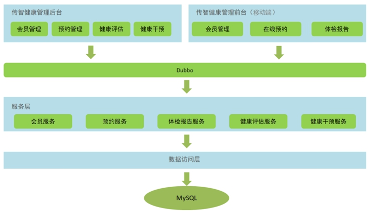
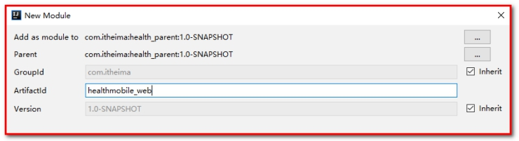
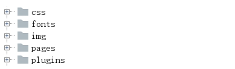
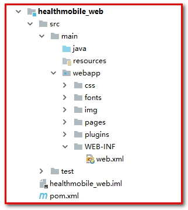
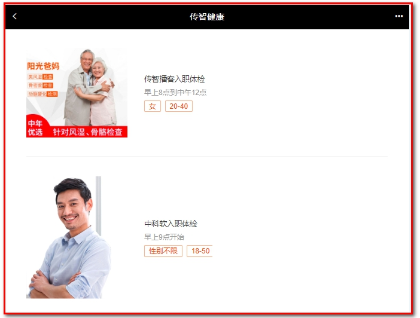
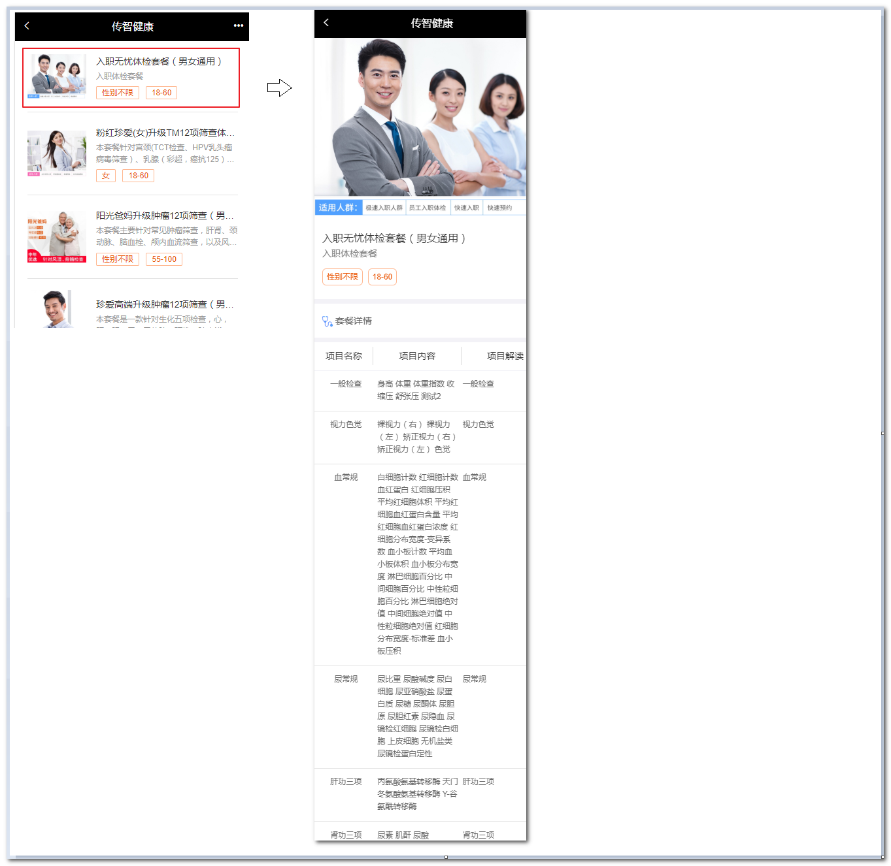
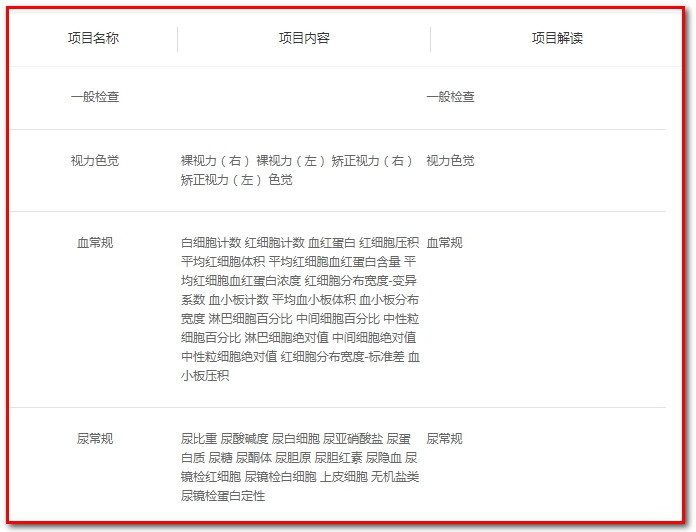
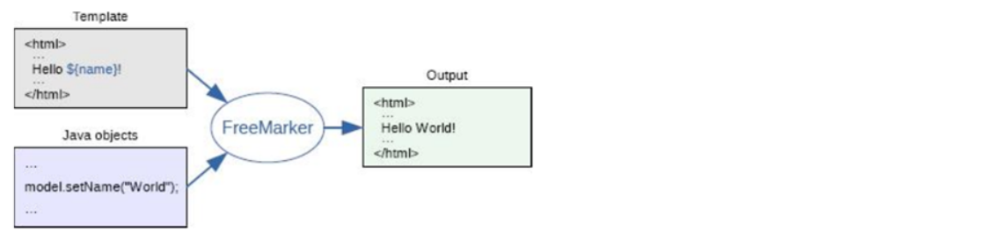

# 第5章 移动端开发-套餐列表、套餐详情、页面静态化

学习目标：

- 掌握移动端套餐列表页动态展示实现过程

- 掌握移动端套餐详情页

- 掌握Freemarker页面静态化技术

- 能够使用Freemarker生成html静态页面


# 1. 移动端需求分析和环境搭建

## 1.1. **需求分析**

### 【目标】

- 能够搭建移动端开发环境

### 【路径】

- 开发需求
- 环境搭建

### 【讲解】

### 1.1.1 移动端开发需求分析

用户在体检之前需要进行预约，可以通过电话方式进行预约，此时会由体检中心客服人员通过后台系统录入预约信息。用户也可以通过手机端自助预约。本章节开发的功能为用户通过手机自助预约。

预约流程如下：

1、访问移动端首页

2、点击体检预约进入体检套餐列表页面

3、在体检套餐列表页面点击具体套餐进入套餐详情页面

4、在套餐详情页面点击立即预约进入预约页面

5、在预约页面录入体检人相关信息点击提交预约

效果如下图：

 

 

 

 

### 【小结】

体检预约-->套餐列表-->套餐详情-->立即预约（发送手机验证码+Redis）

## 1.2. **搭建移动端工程**

### 【目标】

移动端工程搭建

### 【路径】

1. 创建healthmobile_web工程, 导入坐标(依赖health_interface)
2. 导入页面
3. 配置web.xml（springmvc的核心控制器+post请求乱码过滤器）
4. 创建springmvc.xml(配置dubbo, 驱动注解)
5. 导入通用组件

### 【讲解】

本项目是基于SOA架构进行开发，前面我们已经完成了后台系统的部分功能开发，在后台系统中都是通过Dubbo调用服务层发布的服务进行相关的操作。本章节我们开发移动端工程也是同样的模式，所以我们也需要在移动端工程中通过Dubbo调用服务层发布的服务，如下图：

 

### 1.2.1. **导入maven坐标**

在health_parent工程的pom.xml文件中导入阿里短信发送的maven坐标

```xml
<!--阿里云服务器短信平台-->
<dependency>
    <groupId>com.aliyun</groupId>
    <artifactId>aliyun-java-sdk-core</artifactId>
    <version>3.3.1</version>
</dependency>
<dependency>
    <groupId>com.aliyun</groupId>
    <artifactId>aliyun-java-sdk-dysmsapi</artifactId>
    <version>1.0.0</version>
</dependency>
```

 在health_common工程中添加引入的依赖

```xml
<dependency>
    <groupId>com.aliyun</groupId>
    <artifactId>aliyun-java-sdk-core</artifactId>
</dependency>
<dependency>
    <groupId>com.aliyun</groupId>
    <artifactId>aliyun-java-sdk-dysmsapi</artifactId>
</dependency>
```

### 1.2.2. healthmobile_web

【路径】

1：pom.xml

2：静态资源（CSS、html、img等）

3：web.xml

4：springmvc.xml

5：spring-jedis.xml

6：redis.properties

7：log4j.properties

移动端工程，打包方式为war，用于存放Controller，在Controller中通过Dubbo可以远程访问服务层相关服务，所以需要依赖health_interface接口工程。

 

#### 1.2.2.1.pom.xml：

```xml
<?xml version="1.0" encoding="UTF-8"?>
<project xmlns="http://maven.apache.org/POM/4.0.0"
         xmlns:xsi="http://www.w3.org/2001/XMLSchema-instance"
         xsi:schemaLocation="http://maven.apache.org/POM/4.0.0 http://maven.apache.org/xsd/maven-4.0.0.xsd">
    <parent>
        <artifactId>health_parent</artifactId>
        <groupId>com.itheima</groupId>
        <version>1.0-SNAPSHOT</version>
    </parent>
    <modelVersion>4.0.0</modelVersion>

    <artifactId>healthmobile_web</artifactId>
    <packaging>war</packaging>

    <name>healthmobile_web Maven Webapp</name>
    <url>http://www.example.com</url>
    <properties>
        <project.build.sourceEncoding>UTF-8</project.build.sourceEncoding>
        <maven.compiler.source>1.8</maven.compiler.source>
        <maven.compiler.target>1.8</maven.compiler.target>
    </properties>
    <dependencies>
        <dependency>
            <groupId>com.itheima</groupId>
            <artifactId>health_interface</artifactId>
            <version>1.0-SNAPSHOT</version>
        </dependency>
    </dependencies>
    <build>
        <plugins>
            <plugin>
                <groupId>org.apache.tomcat.maven</groupId>
                <artifactId>tomcat7-maven-plugin</artifactId>
                <configuration>
                    <!-- 指定端口，给客户端使用的端口，尽量用80端口，因为80端口是默认端口 -->
                    <port>80</port>
                    <!-- 请求路径 -->
                    <path>/</path>
                </configuration>
            </plugin>
        </plugins>
    </build>

</project>
```

 

#### 1.2.2.2.静态资源（CSS、html、img等，详见资料）：

 

 

#### 1.2.2.3.web.xml：

```xml
<?xml version="1.0" encoding="UTF-8"?>
<web-app xmlns:xsi="http://www.w3.org/2001/XMLSchema-instance"
         xmlns="http://java.sun.com/xml/ns/javaee"
         xsi:schemaLocation="http://java.sun.com/xml/ns/javaee http://java.sun.com/xml/ns/javaee/web-app_3_0.xsd"
         id="WebApp_ID" version="3.0">
    <display-name>Archetype Created Web Application</display-name>
    <!-- 解决post乱码 -->
    <filter>
        <filter-name>CharacterEncodingFilter</filter-name>
        <filter-class>org.springframework.web.filter.CharacterEncodingFilter</filter-class>
        <init-param>
            <param-name>encoding</param-name>
            <param-value>utf-8</param-value>
        </init-param>
    </filter>
    <filter-mapping>
        <filter-name>CharacterEncodingFilter</filter-name>
        <url-pattern>/*</url-pattern>
    </filter-mapping>
    <servlet>
        <servlet-name>springmvc</servlet-name>
        <servlet-class>org.springframework.web.servlet.DispatcherServlet</servlet-class>
        <!-- 指定加载的配置文件 ，通过参数contextConfigLocation加载 -->
        <init-param>
            <param-name>contextConfigLocation</param-name>
            <param-value>classpath:springmvc.xml</param-value>
        </init-param>
        <load-on-startup>1</load-on-startup>
    </servlet>
    <servlet-mapping>
        <servlet-name>springmvc</servlet-name>
        <url-pattern>*.do</url-pattern>
    </servlet-mapping>
    <welcome-file-list>
        <welcome-file>/pages/index.html</welcome-file>
    </welcome-file-list>
</web-app>
```

 

#### 1.2.2.4.springmvc.xml：

```xml
<?xml version="1.0" encoding="UTF-8"?>
<beans xmlns="http://www.springframework.org/schema/beans"
       xmlns:xsi="http://www.w3.org/2001/XMLSchema-instance"
       xmlns:p="http://www.springframework.org/schema/p"
       xmlns:context="http://www.springframework.org/schema/context"
       xmlns:dubbo="http://code.alibabatech.com/schema/dubbo"
       xmlns:mvc="http://www.springframework.org/schema/mvc"
       xsi:schemaLocation="http://www.springframework.org/schema/beans
       http://www.springframework.org/schema/beans/spring-beans.xsd
          http://www.springframework.org/schema/mvc
          http://www.springframework.org/schema/mvc/spring-mvc.xsd
          http://code.alibabatech.com/schema/dubbo
          http://code.alibabatech.com/schema/dubbo/dubbo.xsd
          http://www.springframework.org/schema/context
          http://www.springframework.org/schema/context/spring-context.xsd">

    <mvc:annotation-driven>
        <mvc:message-converters register-defaults="true">
            <bean class="com.alibaba.fastjson.support.spring.FastJsonHttpMessageConverter">
                <property name="supportedMediaTypes" value="application/json"/>
                <property name="features">
                    <list>
                        <value>WriteMapNullValue</value>
                        <value>WriteDateUseDateFormat</value>
                    </list>
                </property>
            </bean>
        </mvc:message-converters>
    </mvc:annotation-driven>
    <!-- 指定应用名称 -->
    <dubbo:application name="healthmobile_web" />
    <!--指定服务注册中心地址-->
    <dubbo:registry address="zookeeper://127.0.0.1:2181"/>
    <!--批量扫描-->
    <dubbo:annotation package="com.itheima.controller" />
    <!--
        超时全局设置 10分钟
        check=false 不检查服务提供方，开发阶段建议设置为false
        check=true 启动时检查服务提供方，如果服务提供方没有启动则报错
    -->
    <dubbo:consumer timeout="600000" check="false"/>
    <import resource="spring-jedis.xml"></import>
</beans>
```

 

#### 1.2.2.5.spring-jedis.xml：

```xml
<?xml version="1.0" encoding="UTF-8"?>
<beans xmlns="http://www.springframework.org/schema/beans"
       xmlns:xsi="http://www.w3.org/2001/XMLSchema-instance"
       xmlns:p="http://www.springframework.org/schema/p"
       xmlns:context="http://www.springframework.org/schema/context"
       xmlns:dubbo="http://code.alibabatech.com/schema/dubbo"
       xmlns:mvc="http://www.springframework.org/schema/mvc"
       xsi:schemaLocation="http://www.springframework.org/schema/beans
       http://www.springframework.org/schema/beans/spring-beans.xsd
          http://www.springframework.org/schema/mvc
          http://www.springframework.org/schema/mvc/spring-mvc.xsd
          http://code.alibabatech.com/schema/dubbo
          http://code.alibabatech.com/schema/dubbo/dubbo.xsd
          http://www.springframework.org/schema/context
          http://www.springframework.org/schema/context/spring-context.xsd">

    <context:property-placeholder location="classpath:redis.properties" />

    <!--Jedis连接池的相关配置-->
    <bean id="jedisPoolConfig" class="redis.clients.jedis.JedisPoolConfig">
        <property name="maxTotal">
            <value>${redis.pool.maxActive}</value>
        </property>
        <property name="maxIdle">
            <value>${redis.pool.maxIdle}</value>
        </property>
        <property name="testOnBorrow" value="true"/>
        <property name="testOnReturn" value="true"/>
    </bean>

    <bean id="jedisPool" class="redis.clients.jedis.JedisPool">
        <constructor-arg name="poolConfig" ref="jedisPoolConfig" />
        <constructor-arg name="host" value="${redis.host}" />
        <constructor-arg name="port" value="${redis.port}" type="int" />
        <constructor-arg name="timeout" value="${redis.timeout}" type="int" />
    </bean>
</beans>
```

 

#### 1.2.2.6.redis.properties：

```properties
#最大分配的对象数
redis.pool.maxActive=200
#最大能够保持idel状态的对象数
redis.pool.maxIdle=50
redis.pool.minIdle=10
redis.pool.maxWaitMillis=20000
#当池内没有返回对象时，最大等待时间
redis.pool.maxWait=300

#格式：redis://:[密码]@[服务器地址]:[端口]/[db index]
#redis.uri = redis://:12345@127.0.0.1:6379/0

redis.host = 127.0.0.1
redis.port = 6379
redis.timeout = 30000
```

#### 1.2.2.7.log4j.properties：

```properties
### direct log messages to stdout ###
log4j.appender.stdout=org.apache.log4j.ConsoleAppender
log4j.appender.stdout.Target=System.err
log4j.appender.stdout.layout=org.apache.log4j.PatternLayout
log4j.appender.stdout.layout.ConversionPattern=%d{ABSOLUTE} %5p %c{1}:%L - %m%n

### direct messages to file mylog.log ###
log4j.appender.file=org.apache.log4j.FileAppender
log4j.appender.file.File=c:\\mylog.log
log4j.appender.file.layout=org.apache.log4j.PatternLayout
log4j.appender.file.layout.ConversionPattern=%d{ABSOLUTE} %5p %c{1}:%L - %m%n

### set log levels - for more verbose logging change 'info' to 'debug' ###

log4j.rootLogger=info, stdout
```

###  1.2.3. **导入通用组件**

【路径】

1：ValidateCodeUtils工具类：（产生验证码）

2：SMSUtils工具类：（短信服务，用于发送短消息服务（SMS））

3：RedisMessageConstant常量类：

【讲解】

在health_common工程中导入如下通用组件

1：ValidateCodeUtils工具类：（产生验证码）

```java
package com.itheima.utils;

import java.util.Random;

/**
 * 随机生成验证码工具类
 */
public class ValidateCodeUtils {
    /**
     * 随机生成验证码
     * @param length 长度为4位或者6位
     * @return
     */
    public static Integer generateValidateCode(int length){
        Integer code =null;
        if(length == 4){
            code = new Random().nextInt(9999);//生成随机数，最大为9999
            if(code < 1000){
                code = code + 1000;//保证随机数为4位数字
            }
        }else if(length == 6){
            code = new Random().nextInt(999999);//生成随机数，最大为999999
            if(code < 100000){
                code = code + 100000;//保证随机数为6位数字
            }
        }else{
            throw new RuntimeException("只能生成4位或6位数字验证码");
        }
        return code;
    }

    /**
     * 随机生成指定长度字符串验证码
     * @param length 长度
     * @return
     */
    public static String generateValidateCode4String(int length){
        Random rdm = new Random();
        String hash1 = Integer.toHexString(rdm.nextInt());
        String capstr = hash1.substring(0, length);
        return capstr;
    }
}
```

 

2：SMSUtils工具类：（短信服务，用于发送短消息服务（SMS））

```java
package com.itheima.utils;


import com.aliyuncs.DefaultAcsClient;
import com.aliyuncs.IAcsClient;
import com.aliyuncs.dysmsapi.model.v20170525.SendSmsRequest;
import com.aliyuncs.dysmsapi.model.v20170525.SendSmsResponse;
import com.aliyuncs.exceptions.ClientException;
import com.aliyuncs.http.MethodType;
import com.aliyuncs.profile.DefaultProfile;
import com.aliyuncs.profile.IClientProfile;

/**
 * 短信发送工具类
 */
public class SMSUtils {
    public static final String VALIDATE_CODE = "SMS_159620392";//发送短信验证码
    public static final String ORDER_NOTICE = "SMS_159771588";//体检预约成功通知

    /**
     * 发送短信
     * @param phoneNumbers
     * @param param
     * @throws ClientException
     */
    public static void sendShortMessage(String templateCode,String phoneNumbers,String param) throws ClientException{
        // 设置超时时间-可自行调整
        System.setProperty("sun.net.client.defaultConnectTimeout", "10000");
        System.setProperty("sun.net.client.defaultReadTimeout", "10000");
        // 初始化ascClient需要的几个参数
        final String product = "Dysmsapi";// 短信API产品名称（短信产品名固定，无需修改）
        final String domain = "dysmsapi.aliyuncs.com";// 短信API产品域名（接口地址固定，无需修改）
        // 替换成你的AK
        final String accessKeyId = "accessKeyId";// 你的accessKeyId,参考本文档步骤2
        final String accessKeySecret = "accessKeySecret";// 你的accessKeySecret，参考本文档步骤2
        // 初始化ascClient,暂时不支持多region（请勿修改）
        IClientProfile profile = DefaultProfile.getProfile("cn-hangzhou", accessKeyId, accessKeySecret);
        DefaultProfile.addEndpoint("cn-hangzhou", "cn-hangzhou", product, domain);
        IAcsClient acsClient = new DefaultAcsClient(profile);
        // 组装请求对象
        SendSmsRequest request = new SendSmsRequest();
        // 使用post提交
        request.setMethod(MethodType.POST);
        // 必填:待发送手机号。支持以逗号分隔的形式进行批量调用，批量上限为1000个手机号码,批量调用相对于单条调用及时性稍有延迟,验证码类型的短信推荐使用单条调用的方式
        request.setPhoneNumbers(phoneNumbers);
        // 必填:短信签名-可在短信控制台中找到
        request.setSignName("传智健康");
        // 必填:短信模板-可在短信控制台中找到
        request.setTemplateCode(templateCode);
        // 可选:模板中的变量替换JSON串,如模板内容为"亲爱的${name},您的验证码为${code}"时,此处的值为
        // 友情提示:如果JSON中需要带换行符,请参照标准的JSON协议对换行符的要求,比如短信内容中包含\r\n的情况在JSON中需要表示成\\r\\n,否则会导致JSON在服务端解析失败
        request.setTemplateParam("{\"code\":\""+param+"\"}");
        // 可选-上行短信扩展码(扩展码字段控制在7位或以下，无特殊需求用户请忽略此字段)
        // request.setSmsUpExtendCode("90997");
        // 可选:outId为提供给业务方扩展字段,最终在短信回执消息中将此值带回给调用者
        // request.setOutId("yourOutId");
        // 请求失败这里会抛ClientException异常
        SendSmsResponse sendSmsResponse = acsClient.getAcsResponse(request);
        if (sendSmsResponse.getCode() != null && sendSmsResponse.getCode().equals("OK")) {
            // 请求成功
            System.out.println("请求成功");
        }
    }
}
```

3：RedisMessageConstant常量类：

```java
package com.itheima.constant;

public class RedisMessageConstant {
    public static final String SENDTYPE_ORDER = "001";//用于缓存体检预约时发送的验证码
    public static final String SENDTYPE_LOGIN = "002";//用于缓存手机号快速登录时发送的验证码
    public static final String SENDTYPE_GETPWD = "003";//用于缓存找回密码时发送的验证码
    
}
```

### 【小结】

步骤：

-->创建工程-->导入坐标-->页面-->配置文件（web.xml、springmvc.xml、spring-jedis.xml）

-->导入通用组件（生成验证码、发送短信工具类、Redis存储常量类）

# 2.套餐列表页面动态展示

### 【目标】

实现套餐列表功能

访问：首页http://localhost:80

点击“体检预约”，跳转到“套餐列表”页面

 

### 【路径】

1：前台代码编写

1. 在/pages/setmeal.html , 在mounted()钩子函数里面

```
完成需求：
1.使用axios请求服务器, 获得数据 进行模型绑定
2.数据遍历(v-for)
```

2：后台代码编写

​    1.创建类SetmealMobileController.java

​    2.创建类SetmealService.java

​    3.创建类SetmealServiceImpl.java

​    4.创建类SetmealDao.java

​    5.创建配置文件SetmealDao.xml

```
完成需求：
1：查询所有的套餐
```

### 【讲解-需求】

移动端首页为/pages/index.html，效果如下：

（1）在web.xml中配置：默认页面

 

（2）访问：首页http://localhost:80

 

（3）点击体检预约直接跳转到体检套餐列表页面（/pages/setmeal.html）

```html
<a href="/pages/setmeal.html" class="link-page">
    <div class="type-title">
        <h3>体检预约</h3>
        <p>实时预约</p>
    </div>
    <div class="type-icon">
        <i class="icon-zhen">
            <span class="path1"></span><span class="path2"></span>
        </i>
    </div>
</a>
```

 

## 2.1. 前台代码

### 2.1.1. **展示套餐信息**

（1）setmeal.html，遍历v-for="setmeal in setmealList"

```html
<ul class="list">
    <!--v-for:循环-->
    <li class="list-item" v-for="setmeal in setmealList">
        <a class="link-page" :href="'setmeal_detail.html?id='+setmeal.id">
            <!--src要改成自己的七牛云的连接-->
        
          <div class="item-body">
            <h4 class="ellipsis item-title">{{setmeal.name}}</h4>
            <p class="ellipsis-more item-desc">{{setmeal.remark}}</p>
            <p class="item-keywords">
              <span>{{setmeal.sex  '0' ? '性别不限' : setmeal.sex  '1' ? '男':'女'}}</span>
              <span>{{setmeal.age}}</span>
            </p>
          </div>
        </a>
    </li>
</ul>
```

（2）其中：img标签中的src需要指定七牛云的空间地址。

```html

```


### 2.1.2. **获取套餐列表数据**

```javascript
<script>
    var vue = new Vue({
        el:'#app',
        data:{
            setmealList:[]
        },
        mounted (){
            axios.post("/setmeal/getSetmeal.do").then((response)=>{
                if(response.data.flag){
                    //赋值参数
                    this.setmealList = response.data.data;
                }
            });
        }
    });
</script>
```

mounted钩子和created钩子

mounted钩子：页面被初始化后执行

created钩子：vue模型被初始化后执行

mounted钩子是在created钩子后面执行的。

## 2.2. **后台代码**

### 2.2.1. **Controller**

在healthmobile_web工程中创建SetmealMobileController并提供getSetmeal方法，在此方法中通过Dubbo远程调用套餐服务获取套餐列表数据

```java
package com.itheima.controller;

import com.alibaba.dubbo.config.annotation.Reference;
import com.itheima.constant.MessageConstant;
import com.itheima.entity.Result;
import com.itheima.pojo.Setmeal;
import com.itheima.service.SetmealService;
import org.springframework.web.bind.annotation.RequestMapping;
import org.springframework.web.bind.annotation.RestController;

import java.util.List;

@RestController
@RequestMapping("/setmeal")
public class SetmealMobileController {

    @Reference//(check = false)
    private SetmealService setmealService;

    //获取所有套餐信息
    @RequestMapping("/getSetmeal")
    public Result getSetmeal(){
        try{
            List<Setmeal> list = setmealService.findAll();
            return new Result(true, MessageConstant.GET_SETMEAL_LIST_SUCCESS,list);
        }catch (Exception e){
            e.printStackTrace();
            return new Result(false,MessageConstant.GET_SETMEAL_LIST_FAIL);
        }
    }
}
```


### 2.2.2. **服务接口**

在SetmealService服务接口中扩展findAll方法

```java
List<Setmeal> findAll();
```

 

### 2.2.3. **服务实现类**

在SetmealServiceImpl服务实现类中实现findAll方法

```java
public List<Setmeal> findAll() {
    return setmealDao.findAll();
}
```

 

### 2.2.4. **Dao接口**

在SetmealDao接口中扩展findAll方法

```java
List<Setmeal> findAll();
```

 

### 2.2.5. **Mapper映射文件**

在SetmealDao.xml映射文件中扩展SQL语句

```html
<!--查询所有-->
<select id="findAll" resultType="com.itheima.pojo.Setmeal">
    select * from t_setmeal
</select>
```

查看效果

 

### 【小结】

套餐列表功能需要展示发布的所有套餐，用于体检人选择指定套餐。

# 3. 套餐详情页面动态展示

### 【目标】

套餐详情页面动态展示



在套餐详情页面需要展示当前套餐的信息（包括图片、套餐名称、套餐介绍、适用性别、适用年龄）、此套餐包含的检查组信息、检查组包含的检查项信息等。

### 【路径】

前台代码编写

1. 在/pages/setmeal_detail.html 

```
完成需求：
1.获取请求参数中套餐id的值
2.获取套餐详细信息
3.展示套餐信息（套餐信息、检查组集合、检查项集合）
```

后台代码编写

​    1.类SetmealMobileController.java

​    2.类SetmealService.java

​    3.类SetmealServiceImpl.java

​    4.类SetmealDao.java

​       类CheckGroupDao

​       类CheckItemDao

​    5.配置文件SetmealDao.xml

​       配置文件CheckGroupDao.xml

​       配置文件CheckItemDao.xml

```
完成需求：
1：根据套餐id查询对应的套餐信息
2：查询每个套餐对应的检查组集合
3：查询每个检查组对应的检查项集合
```

### 【讲解-需求】

前面我们已经完成了体检套餐列表页面动态展示，点击其中任意一个套餐则跳转到对应的套餐详情页面（/pages/setmeal_detail.html），并且会携带此套餐的id作为参数提交。

 

请求路径格式：<http://localhost/pages/setmeal_detail.html?id=10>

在套餐详情页面需要展示当前套餐的信息（包括图片、套餐名称、套餐介绍、适用性别、适用年龄）、此套餐包含的检查组信息、检查组包含的检查项信息等。


## 3.1. 前台代码

### 3.1.1. **获取请求参数中套餐id**

（1）在页面中`已经引入`了`healthmobile.js`文件，此文件中已经封装了getUrlParam方法可以根据URL请求路径中的参数名获取对应的值

```javascript
//获取指定的URL参数值 http://localhost/pages/setmeal_detail.html?id=3&name=jack
function getUrlParam(paraName) {
    var url = document.location.toString();
    //alert(url);
    var arrObj = url.split("?");
    if (arrObj.length > 1) {
        var arrPara = arrObj[1].split("&");
        var arr;
        for (var i = 0; i < arrPara.length; i++) {
            arr = arrPara[i].split("=");
            if (arr != null && arr[0]  paraName) {
                return arr[1];
            }
        }
        return "";
    }
    else {
        return "";
    }
}
```

 

（2）在setmeal_detail.html中调用上面定义的方法获取套餐id的值

```javascript
<script src="../plugins/healthmobile.js"></script>
<script>
    var id = getUrlParam("id");
	//alert(id);  
</script>
```


### 3.1.2. **获取套餐详细信息**

```javascript
<script>
    var vue = new Vue({
        el:'#app',
        data:{
            imgUrl:null,//套餐对应的图片链接
            setmeal:{}
        },
        methods:{
            toOrderInfo(){
                window.location.href = "orderInfo.html?id=" + id;
            }
        },
        mounted(){
// 发送ajax请求，根据套餐id查询套餐详情（套餐基本信息、套餐关联的多个检查组信息、检查组关联的多个检查项信息）
            axios.post("/setmeal/findById.do?id=" + id).then((response) => {
                if(response.data.flag){
                    this.setmeal = response.data.data;
                    //要改成自己的七牛云地址
                    this.imgUrl = 'http://pqjroc654.bkt.clouddn.com/' + this.setmeal.img;
                }
            });
        }
    });
</script>
```

其中：imgUrl要指定七牛云的空间地址

### 3.1.3. 展示套餐信息

1：{{setmeal.name}}：套餐信息

2：v-for="checkgroup in setmeal.checkGroups：检查组信息

3：v-for="checkitem in checkgroup.checkItems"：检查项信息

```html
<!-- 页面内容 -->
<div class="contentBox">
    <div class="card">
        <div class="project-img">
            
        </div>
        <div class="project-text">
            <h4 class="tit">{{setmeal.name}}</h4>
            <p class="subtit">{{setmeal.remark}}</p>
            <p class="keywords">
                <span>{{setmeal.sex  '0' ? '性别不限' : setmeal.sex  '1' ? '男':'女'}}</span>
                <span>{{setmeal.age}}</span>
            </p>
        </div>
    </div>
    <div class="table-listbox">
        <div class="box-title">
            <i class="icon-zhen"><span class="path1"></span><span class="path2"></span></i>
            <span>套餐详情</span>
        </div>
        <div class="box-table">
            <div class="table-title">
                <div class="tit-item flex2">项目名称</div>
                <div class="tit-item  flex3">项目内容</div>
                <div class="tit-item  flex3">项目解读</div>
            </div>
            <div class="table-content">
                <ul class="table-list">
                     <!--检查组信息-->
                    <li class="table-item" v-for="checkgroup in setmeal.checkGroups">
                        <div class="item flex2">{{checkgroup.name}}</div>
                        <div class="item flex3">
                             <!--检查项信息-->
                            <label v-for="checkitem in checkgroup.checkItems">
                                {{checkitem.name}}
                            </label>
                        </div>
                        <div class="item flex3">{{checkgroup.remark}}</div>
                    </li>
                </ul>
            </div>
            <div class="box-button">
                <a @click="toOrderInfo()" class="order-btn">立即预约</a>
            </div>
        </div>
    </div>
</div>
```

 

## 3.2. **后台代码**

### 3.2.1. **Controller**

在SetmealMobileController中提供findById方法

```java
/**
 * 微信端套餐:查询一条套餐
 * @param id 查询条件:套餐id
 * @return 套餐对象
 */
@RequestMapping("/findById")
public Result findById(Integer id){
    try {
        //1.实现功能:查询一条数据
        Setmeal setmeal = setmealService.findById(id);
        //2.处理结果集
        //成功
        return new Result(true,MessageConstant.QUERY_SETMEAL_SUCCESS,setmeal);
    } catch (Exception e) {
        e.printStackTrace();
        //失败
        return new Result(false,MessageConstant.QUERY_SETMEALLIST_FAIL);
    }

}
```

 

### 3.2.2. **服务接口**

在SetmealService服务接口中提供findById方法

```java
Setmeal findById(int id);
```

### 3.2.3. **服务实现类**

在SetmealServiceImpl服务实现类中实现findById方法

```java
public Setmeal findById(int id) {
    return setmealDao.findById(id);
}
```

 

### 3.2.4. **Dao接口**

1：在SetmealDao接口中提供findById方法

```java
Setmeal findById(int id);
```

2：在CheckGroupDao接口中提供findCheckGroupListById方法

```java
List<CheckGroup> findCheckGroupListById(Integer id);
```

3：在CheckItemDao接口中提供findCheckItemListById方法

```java
List<CheckItem> findCheckItemListById(Integer id);
```

 

### 3.2.5. **Mapper映射文件**

此处会使用mybatis提供的关联查询，在根据id查询套餐时，同时将此套餐包含的检查组都查询出来，并且将检查组包含的检查项都查询出来。

1：SetmealDao.xml文件：

```xml
<!--
	根据套餐id查询检查组列表数据
		property = "checkGroups":将查询的结果设置到property="checkGroups"属性上
		column="id":套餐id
		select=""根据套餐id查询检查组列表数据
-->
<resultMap type="com.itheima.pojo.Setmeal" id="findByIdResultMap">
    <id column="id" property="id"/>
    <result column="name" property="name"/>
    <result column="code" property="code"/>
    <result column="helpCode" property="helpCode"/>
    <result column="sex" property="sex"/>
    <result column="age" property="age"/>
    <result column="price" property="price"/>
    <result column="remark" property="remark"/>
    <result column="attention" property="attention"/>
    <result column="img" property="img"/>
    <!--property的值要对应实体类中的属性-->
    <collection property="checkGroups" column="id"
                select="com.itheima.dao.CheckGroupDao.findCheckGroupListById">
    </collection>
</resultMap>

<!--根据套餐id查询套餐数据-->
<select id="findById" resultMap="findByIdResultMap">
    select * from t_setmeal  where id=#{id}
</select>
```

 2：CheckGroupDao.xml文件：

```xml
<resultMap type="com.itheima.pojo.CheckGroup" id="findByIdResultMap">
    <id column="id" property="id"/>
    <result column="name" property="name"/>
    <result column="code" property="code"/>
    <result column="helpCode" property="helpCode"/>
    <result column="sex" property="sex"/>
    <result column="remark" property="remark"/>
    <result column="attention" property="attention"/>
    <collection property="checkItems" column="id"
                select="com.itheima.dao.CheckItemDao.findCheckItemListById">
    </collection>
</resultMap>
<!--根据套餐id查询检查项信息-->
<select id="findCheckGroupListById" resultMap="findByIdResultMap">
    select * from t_checkgroup  where id
    in (select checkgroup_id from t_setmeal_checkgroup where setmeal_id=#{id})
</select>

```

**或者**使用联合查询的sql语句

```sql
SELECT c.* FROM t_checkgroup c,t_setmeal_checkgroup sc WHERE c.id = sc.checkgroup_id AND sc.setmeal_id = #{id}
```

3：CheckItemDao.xml文件：

```xml
<!--根据检查组id查询检查项信息-->
<select id="findCheckItemListById" resultType="com.itheima.pojo.CheckItem">
    select * from t_checkitem  where id
    in (select checkitem_id from t_checkgroup_checkitem where checkgroup_id=#{id})
</select>
```

 或者使用联合查询的sql语句

```sql
SELECT ci.* FROM t_checkitem ci,t_checkgroup_checkitem cgci WHERE ci.id = cgci.checkitem_id AND checkgroup_id = #{id}
```

#### 测试效果：

 

 

### 【小结】

```
1：掌握sql语句的联合查询（sql语句的嵌套查询），应用在多对多场景
2：掌握使用<resultMap>完成映射
3：掌握使用<collection>完成集合的封装（<association>完成对象的封装）
```

拓展：不使用刚才使用的<resultMap>和<collection>。

也可以使用Java代码编写业务封装逻辑操作

1：SetMealDao.java

```java
Setmeal findById(Integer id);
```

2：CheckGroupDao.java

```java
List<CheckGroup> findCheckGroupListBySetmealId(Integer setmealId);
```

3：CheckItemDao.java

```java
List<CheckItem> findCheckItemListByCheckGroupId(Integer checkGroupId);
```

使用java代码的方式进行判断

第一步：在SetmealServiceImpl.java中

```java
	@Autowired
    CheckGroupDao checkGroupDao;

    @Autowired
    CheckItemDao checkItemDao;

    @Override
    public Setmeal findById(Integer id) {
        Setmeal setmeal = setmealDao.findById(id);
        List<CheckGroup> checkGroupList = checkGroupDao.findCheckGroupListBySetmealId(setmeal.getId());
        // 遍历checkGroupList
        for(CheckGroup checkgroup:checkGroupList){
            List<CheckItem> checkItemList = checkItemDao.findCheckItemListByCheckGroupId(checkgroup.getId());
            checkgroup.setCheckItems(checkItemList);
        }
        setmeal.setCheckGroups(checkGroupList);
        return setmeal;
    }
```

第二步：

CheckGroupDao.xml

```xml
<!--使用套餐id，查询套餐id具有的检查组的集合-->
<select id="findCheckGroupListBySetmealId" parameterType="int" resultType="checkGroup">
    SELECT * FROM t_checkgroup WHERE id IN (SELECT checkgroup_id FROM t_setmeal_checkgroup WHERE setmeal_id = #{setmealId})
</select>
```

第三步：

CheckItemDao.xml

```xml
<!--使用检查组的id，查询当前检查组具有的检查项的集合-->
<select id="findCheckItemListByCheckGroupId" parameterType="int" resultType="checkItem">
    SELECT * FROM t_checkitem WHERE id IN (SELECT checkitem_id FROM t_checkgroup_checkitem WHERE checkgroup_id = #{checkGroupId})
</select>
```


# 4.Freemarker页面静态化技术

### 【目标】

1：什么是页面静态化技术（作用：用于减少查询数据库的频率）

2：什么是Freemarker

3：Freemarker的操作入门

### 【路径】

1：什么是页面静态化技术（作用：用于减少查询数据库的频率）

2：什么是Freemarker（作用：可生成html静态资源文件，从而达到减少查询数据库的频率）

3：Freemarker入门案例

（1）搭建环境

（2）创建模板文件

（3）使用模板文件，生成静态文件

4：Freemarker相关指令

（1）assign指令

（2）include指令

（3）if指令

（4）list指令

### 【讲解】

## 4.1.  页面静态化介绍

本章课程中我们已经实现了移动端套餐列表页面和套餐详情页面的动态展示。但是我们需要思考一个问题，就是对于这两个页面来说，每次用户访问这两个页面都需要查询数据库获取动态数据进行展示，而且这两个页面的访问量是比较大的，这就对数据库造成了很大的访问压力，并且数据库中的数据变化频率并不高。那我们需要通过什么方法为数据库减压并提高系统运行性能呢？答案就是页面静态化。

页面静态化其实就是将原来的动态网页(例如通过ajax请求动态获取数据库中的数据并展示的网页)改为通过静态化技术生成的静态网页，这样用户在访问网页时，服务器直接给用户响应静态html页面，没有了动态查询数据库的过程。

那么这些静态HTML页面还需要我们自己去编写吗？其实并不需要，我们可以通过专门的页面静态化技术帮我们生成所需的静态HTML页面，例如：Freemarker、thymeleaf等。

## 4.2.  Freemarker介绍

FreeMarker 是一个用 Java 语言编写的模板引擎，它基于模板来生成文本输出。FreeMarker与 Web 容器无关，即在 Web 运行时，它并不知道 Servlet 或 HTTP。它不仅可以用作表现层的实现技术，而且还可以用于生成 XML，JSP 或 Java 等。



## 4.3.  Freemarker入门案例

### 4.3.1.  环境搭建

创建maven工程并导入Freemarker的maven坐标

```xml
<dependency>
  <groupId>org.freemarker</groupId>
  <artifactId>freemarker</artifactId>
  <version>2.3.23</version>
</dependency>
```

### 4.3.2.  创建模板文件

模板文件中有四种元素：

  1、文本，直接输出的部分
  2、注释，即<#--...-->格式不会输出
  3、插值（Interpolation）：即${..}部分,将使用数据模型中的部分替代输出
  4、FTL指令：FreeMarker指令，和HTML标记类似，名字前加#予以区分，不会输出

Freemarker的模板文件后缀可以任意，一般建议为ftl。

在D盘创建ftl目录，在ftl目录中创建名称为test.ftl的模板文件，内容如下：

注意模板文件格式：utf-8

```html
<html>
<head>
	<meta charset="utf-8">
	<title>Freemarker入门</title>
</head>
<body>
    <#--我只是一个注释，我不会有任何输出  -->
    ${name}你好，${message}
</body>
</html>
```

### 4.3.3.  生成文件(CreateHtml.java)

使用步骤：

第一步：创建一个 Configuration 对象，直接 new 一个对象。构造方法的参数就是 freemarker的版本号。注意要

第二步：设置模板文件所在的路径。(这里有编译时异常==>要try)

第三步：设置模板文件使用的字符集。一般就是 utf-8。

第四步：加载一个模板，创建一个模板对象。

第五步：创建一个模板使用的数据集，可以是 pojo 也可以是 map。一般是 Map。

第六步：创建一个 Writer 对象，一般创建 FileWriter 对象，指定生成的文件名。

第七步：调用模板对象的 process 方法输出文件。

第八步：关闭流。

```java
package com.wzw;

import freemarker.template.Configuration;
import freemarker.template.Template;

import java.io.File;
import java.io.FileWriter;
import java.util.HashMap;
import java.util.Map;

/**
 * @Author: wzw
 * @Date: 2020/11/15 9:33
 * @version: 1.8
 */
public class CreateHtml {
    public static void main(String[] args) throws Exception {
        //第一步：创建一个 Configuration 对象，直接 new 一个对象。构造方法的参数就是 freemarker的版本号。
        Configuration configuration = new Configuration(Configuration.getVersion());

        //第二步：设置模板文件所在的路径,不需要加文件名。(这里有编译时异常==>要try)
        configuration.setDirectoryForTemplateLoading(new File("D:\\wzw_Projects\\My_Freemaker\\MyFreemakerMode\\src\\main\\resources"));

        //第三步：设置模板文件使用的字符集。一般就是 utf-8。
        configuration.setDefaultEncoding("utf-8");

        //第四步：加载一个模板，创建一个模板对象。(这里有编译时异常==>要try)
        Template template = configuration.getTemplate("test.ftl");

        //第五步：创建一个模板使用的数据集，可以是 pojo 也可以是 map。一般是 Map。
        Map map = new HashMap();
        map.put("name","张三");
        map.put("message","小可爱");

        //第六步：创建一个 Writer 对象，一般创建 FileWriter 对象，指定生成的文件名。(这里有编译时异常==>要try)
        FileWriter out = new FileWriter(new File("C:\\Users\\15710\\Desktop\\test.html"));

        //第七步：调用模板对象的 process 方法输出文件。(这里有编译时异常==>要try)
        template.process(map,out);

        //第八步：关闭流。(这里有编译时异常==>要try)
        out.flush();
        out.close();

    }
}

```

上面的入门案例中Configuration配置对象是自己创建的，字符集和模板文件所在目录也是在Java代码中指定的。在项目中应用时可以将Configuration对象的创建交由Spring框架来完成，并通过依赖注入方式将字符集和模板所在目录注入进去。

## 4.4.  Freemarker指令

### 4.4.1.  assign指令

assign指令用于在页面上定义一个变量(直接在ftl文件上使用)


（1）定义简单类型

```html
<#--定义显示的值-->
<#assign linkman="周先生">
    
<#--要显示的点-->
联系人：${linkman}
```

（2）定义对象类型

```html
<#--定义显示的值-->
<#assign info={"mobile":"13812345678",'address':'北京市昌平区'} >
    
<#--要显示的点-->
电话：${info.mobile}  地址：${info.address}
```

### 4.4.2.  include指令

include指令用于模板文件的嵌套

（1）创建模板文件head.ftl

```html
<h1>黑马程序员</h1>
```

（2）修改入门案例中的test.ftl，在test.ftl模板文件中使用include指令引入上面的模板文件

```html
<#include "head.ftl"/>
```

### 4.4.3.  if指令

if指令用于判断

（1）在模板文件中使用if指令进行判断

```html
<#if success=true>
  你已通过实名认证
<#else>  
  你未通过实名认证
</#if>
```

（2）在java代码中为success变量赋值

```java
map.put("success", true);
```

### 4.4.4.  list指令

list指令用于遍历

（1）在模板文件中使用list指令进行遍历

```html
<#--和v-for循环很很像 被循环体goodsList  一条内容goods  -->
<#list goodsList as goods>
  商品名称： ${goods.name} 价格：${goods.price}<br>
</#list>
```

（2）在java代码中为goodsList赋值

```java
//返回数据的map
Map map = new HashMap();
//list循环,还是要map返回值
List goodsList = new ArrayList();
//循环内容1
Map goods1=new HashMap();
goods1.put("name", "苹果");
goods1.put("price", 5.8);
//循环内容2
Map goods2=new HashMap();
goods2.put("name", "香蕉");
goods2.put("price", 2.5);
//循环内容3
Map goods3=new HashMap();
goods3.put("name", "橘子");
goods3.put("price", 3.2);
//添加到list集合中
goodsList.add(goods1);
goodsList.add(goods2);
goodsList.add(goods3);
//添加到返回的map中
map.put("goodsList",goodsList);
```

### 【小结】

1：什么是页面静态化技术（作用：用于减少查询数据库的频率）

2：什么是Freemarker（作用：可生成html静态资源文件，从而达到减少查询数据库的频率）

3：Freemarker入门案例

（1）搭建环境

（2）创建模板文件

（3）使用模板文件，生成静态文件

4：Freemarker相关指令

（1）assign指令

（2）include指令

（3）if指令（常用）

（4）list指令（常用）

# 5. 生成移动端静态页面，整合项目

前面我们已经学习了Freemarker的基本使用方法，下面我们就可以将Freemarker应用到项目中，帮我们生成移动端套餐列表静态页面和套餐详情静态页面。接下来我们需要**思考几个问题**：

（1）什么时候生成静态页面比较合适呢？

（2）将静态页面生成到什么位置呢？

（3）应该生成几个静态页面呢？

#### **解决思考的问题**

对于**第一个问题**，应该是当套餐数据发生改变时，需要生成静态页面，即我们通过后台系统修改套餐数据**（包括新增、删除、编辑）时和初始化时**。在哪里写代码:**(health_service工程中写代码)**


对于**第二个问题**，如果是在开发阶段可以将文件生成到项目工程中，如果上线后可以将文件生成到移动端系统运行的tomcat中。


对于**第三个问题**，套餐列表**只需要一个页面**就可以了，在这个页面中展示所有的套餐列表数据即可。套餐详情页面需要有多个，即**一个套餐**应该**对应一个静态页面**。


### 【目标】

1：在传智健康前端系统中使用页面静态化Freemarker技术

2：套餐列表使用Freemarker

3：套餐详情使用Freemarker

### 【路径】

1：环境搭建

2：创建模板文件

（1）mobile_setmeal.ftl

（2）mobile_setmeal_detail.ftl

3：spring整合Freemarker

（1）freemarker.properties

（2）applicationContext-freemarker.xml

4：生成静态页面

生成静态页面的时机，在新增套餐的时候生成静态页面（套餐列表及套餐详情）

### 【讲解】

## 5.1. 环境搭建

在health_parent工程的pom文件中导入Freemarker的maven坐标

```xml
<freemarker>2.3.23</freemarker>

<dependency>
    <groupId>org.freemarker</groupId>
    <artifactId>freemarker</artifactId>
    <version>${freemarker}</version>
</dependency>
```

在health_common工程的pom文件中导入Freemarker的maven坐标

```xml
<dependency>
    <groupId>org.freemarker</groupId>
    <artifactId>freemarker</artifactId>
</dependency>
```

## 5.2. 创建模板文件

在health_service工程的**WEB-INF目录中**创建ftl目录，在**ftl目录中**创建模板文件mobile_setmeal.ftl和mobile_setmeal_detail.ftl文件，**前者**是用于生成套餐**列表**页面的模板文件，**后者**是生成套餐**详情**页面的模板文件

（1）mobile_setmeal.ftl

```html
<!DOCTYPE html>
<html lang="zh-CN">
<head>
    <meta charset="utf-8">
    <meta http-equiv="X-UA-Compatible" content="IE=edge">
    <!-- 上述3个meta标签*必须*放在最前面，任何其他内容都*必须*跟随其后！ -->
    <meta name="viewport" content="width=device-width, initial-scale=1.0, maximum-scale=1.0, user-scalable=0,user-scalable=no,minimal-ui">
    <meta name="description" content="">
    <meta name="author" content="">
    <link rel="icon" href="../img/asset-favico.ico">
    <title>预约</title>
    <link rel="stylesheet" href="../css/page-health-order.css" />
</head>
<body data-spy="scroll" data-target="#myNavbar" data-offset="150">
<div class="app" id="app">
    <!-- 页面头部 -->
    <div class="top-header">
        <span class="f-left"><i class="icon-back" onclick="history.go(-1)"></i></span>
        <span class="center">传智健康</span>
        <span class="f-right"><i class="icon-more"></i></span>
    </div>
    <!-- 页面内容 -->
    <div class="contentBox">
        <div class="list-column1">
            <ul class="list">
                <#list setmealList as setmeal>
                    <li class="list-item">
                        <a class="link-page" href="setmeal_detail_${setmeal.id}.html">
                            <#--修改点:七牛云地址-->
                            
                            <div class="item-body">
                                <h4 class="ellipsis item-title">${setmeal.name}</h4>
                                <p class="ellipsis-more item-desc">${setmeal.remark}</p>
                                <p class="item-keywords">
                                    <span>
                                        <#if setmeal.sex='0'>
                                            性别不限
                                            <#else>
                                                <#if setmeal.sex='1'>
                                                男
                                                <#else>
                                                女
                                             </#if>
                                        </#if>
                                    </span>
                                    <span>${setmeal.age}</span>
                                </p>
                            </div>
                        </a>
                    </li>
                </#list>
            </ul>
        </div>
    </div>
</div>
<!-- 页面 css js -->
<script src="../plugins/vue/vue.js"></script>
<script src="../plugins/vue/axios-0.18.0.js"></script>
</body>
```

注意1：上面的数据需保证数据库中不能为null。

注意2：改变七牛云的地址。

注意3：上面模板文件中每个套餐对应的超链接如下：

```html
<a class="link-page" href="setmeal_detail_${setmeal.id}.html">
```

可以看到，链接的地址是动态构成的，

如果套餐的id为1，则对应的超链接地址为setmeal_detail_1.html；

如果套餐的id为5，则对应的超链接地址为setmeal_detail_5.html。

所以我们需要为每个套餐生成一个套餐详情静态页面。

（2）mobile_setmeal_detail.ftl

​				**注意：改变七牛云的访问地址**

```html
<!DOCTYPE html>
<html lang="zh-CN">
<head>
    <meta charset="utf-8">
    <meta http-equiv="X-UA-Compatible" content="IE=edge">
    <!-- 上述3个meta标签*必须*放在最前面，任何其他内容都*必须*跟随其后！ -->
    <meta name="viewport" content="width=device-width, initial-scale=1.0, maximum-scale=1.0, user-scalable=0,user-scalable=no,minimal-ui">
    <meta name="description" content="">
    <meta name="author" content="">
    <link rel="icon" href="../img/asset-favico.ico">
    <title>预约详情</title>
    <link rel="stylesheet" href="../css/page-health-orderDetail.css" />
    <script src="../plugins/vue/vue.js"></script>
    <script src="../plugins/vue/axios-0.18.0.js"></script>
    <script src="../plugins/healthmobile.js"></script>
</head>
<body data-spy="scroll" data-target="#myNavbar" data-offset="150">
<div id="app" class="app">
    <!-- 页面头部 -->
    <div class="top-header">
        <span class="f-left"><i class="icon-back" onclick="history.go(-1)"></i></span>
        <span class="center">传智健康</span>
        <span class="f-right"><i class="icon-more"></i></span>
    </div>
    <!-- 页面内容 -->
    <div class="contentBox">
        <div class="card">
            <#--修改点:七牛云地址-->
            <div class="project-img">
                
            </div>
            <div class="project-text">
                <h4 class="tit">${setmeal.name}</h4>
                <p class="subtit">${setmeal.remark}</p>
                <p class="keywords">
                    <span>
						<#if setmeal.sex='0'>
							性别不限
							<#else>
								<#if setmeal.sex='1'>
								男
								<#else>
								女
								</#if>
						</#if>
					</span>
                    <span>${setmeal.age}</span>
                </p>
            </div>
        </div>
        <div class="table-listbox">
            <div class="box-title">
                <i class="icon-zhen"><span class="path1"></span><span class="path2"></span></i>
                <span>套餐详情</span>
            </div>
            <div class="box-table">
                <div class="table-title">
                    <div class="tit-item flex2">项目名称</div>
                    <div class="tit-item  flex3">项目内容</div>
                    <div class="tit-item  flex3">项目解读</div>
                </div>
                <div class="table-content">
                    <ul class="table-list">
                        <#--修改点-->
						<#list setmeal.checkGroups as checkgroup>
							<li class="table-item">
								<div class="item flex2">${checkgroup.name}</div>
								<div class="item flex3">
									<#list checkgroup.checkItems as checkitem>
										<label>
											${checkitem.name}
										</label>
									</#list>
								</div>
								<div class="item flex3">${checkgroup.remark}</div>
							</li>
						</#list>
                    </ul>
                </div>
                <div class="box-button">
                    <a @click="toOrderInfo()" class="order-btn">立即预约</a>
                </div>
            </div>
        </div>
    </div>
</div>
<script>
    var vue = new Vue({
        el:'#app',
        methods:{
            toOrderInfo(){
                //跳页面:不是请求后台了
                window.location.href = "orderInfo.html?id=${setmeal.id}";
            }
        }
    });
</script>
</body>
```

## 5.3. 配置文件

##### （1）在health_service 工程中创建属性文件freemarker.properties

```makefile
#修改点:放在自己的静态html存放位置
out_put_path=D:/ideaProjects/health_parent/health_mobile/src/main/webapp/pages
```

​			通过上面的配置可以指定将`静态HTML页面生成的目录位置`,注意改成自己的

##### （2）在health_service工程的Spring配置文件中配置，创建applicationContext-freemarker.xml

```xml
<?xml version="1.0" encoding="UTF-8"?>
<beans xmlns="http://www.springframework.org/schema/beans"
       xmlns:xsi="http://www.w3.org/2001/XMLSchema-instance"
       xmlns:context="http://www.springframework.org/schema/context"
       xmlns:tx="http://www.springframework.org/schema/tx"
       xmlns:mvc="http://www.springframework.org/schema/mvc"
       xsi:schemaLocation="http://www.springframework.org/schema/beans
                        http://www.springframework.org/schema/beans/spring-beans.xsd
                        http://www.springframework.org/schema/mvc
                        http://www.springframework.org/schema/mvc/spring-mvc.xsd
                        http://www.springframework.org/schema/tx
                        http://www.springframework.org/schema/tx/spring-tx.xsd
                        http://www.springframework.org/schema/context
                        http://www.springframework.org/schema/context/spring-context.xsd">
    <!--1.注册驱动-->
    <bean id="freemarkerConfig"
          class="org.springframework.web.servlet.view.freemarker.FreeMarkerConfigurer">
        <!--2.指定模板文件所在目录-->
        <property name="templateLoaderPath" value="/WEB-INF/ftl/" />
        <!--3.指定字符集-->
        <property name="defaultEncoding" value="UTF-8" />
    </bean>
    <!--4.加载Freemarker的properties配置为文件-->
    <context:property-placeholder location="classpath:freemarker.properties"/>
</beans>
```

## 5.4. 生成静态页面

修改health_service工程中的SetmealServiceImpl类的add方法，加入生成静态页面的逻辑。

```java
@Service(interfaceClass = SetmealService.class)
@Transactional
public class SetmealServiceImpl implements SetmealService {
  @Autowired
  private FreeMarkerConfigurer freeMarkerConfigurer;
  @Autowired
  private SetmealDao setmealDao;
  
  @Value("${out_put_path}")//从属性文件读取输出目录的路径
  private String outputpath ;

  //新增套餐，同时关联检查组
  public void add(Setmeal setmeal, Integer[] checkgroupIds) {
    setmealDao.add(setmeal);
    Integer setmealId = setmeal.getId();//获取套餐id
    this.setSetmealAndCheckGroup(setmealId,checkgroupIds);
    //添加点:新增套餐后需要重新生成静态页面
    generateMobileStaticHtml();
  }
  
  //生成静态页面
  public void generateMobileStaticHtml() {
    //准备模板文件中所需的数据
    List<Setmeal> setmealList = this.findAll();
    //生成套餐列表静态页面
    generateMobileSetmealListHtml(setmealList);
    //生成套餐详情静态页面（多个）
    generateMobileSetmealDetailHtml(setmealList);
  }
  
  //生成套餐列表静态页面
  public void generateMobileSetmealListHtml(List<Setmeal> setmealList) {
    Map<String, Object> dataMap = new HashMap<String, Object>();
    dataMap.put("setmealList", setmealList);
    this.generateHtml("mobile_setmeal.ftl","m_setmeal.html",dataMap);
  }
  
  //生成套餐详情静态页面（多个）
  public void generateMobileSetmealDetailHtml(List<Setmeal> setmealList) {
    for (Setmeal setmeal : setmealList) {
      Map<String, Object> dataMap = new HashMap<String, Object>();
        
      dataMap.put("setmeal", this.findById(setmeal.getId()));
        
      this.generateHtml("mobile_setmeal_detail.ftl",
                        "setmeal_detail_"+setmeal.getId()+".html",
                        dataMap);
    }
  }
  /**
  * 调用公共方法生成静态页面
  * templateName:模板名称
  * htmlPageName:生成静态页面文件名称(m_setmeal.html) (setmeal_datail_${setmeal.id}.html)
  * dataMap:生成静态页面需要的数据
  */
  public void generateHtml(String templateName,String htmlPageName,Map<String, Object> dataMap){
      //模板配置类对象
    Configuration configuration = freeMarkerConfigurer.getConfiguration();
    Writer out = null;
    try {
      // 加载模版文件
      Template template = configuration.getTemplate(templateName);
      // 生成数据(properties配置文件中的路径+静态页面名.html)
      File docFile = new File(outputpath + "/" + htmlPageName);
        //FileWrite操作磁盘的  BufferedWriter操作缓存的[效率高|推荐使用]
      out = new BufferedWriter(new OutputStreamWriter(new FileOutputStream(docFile)));
      // 输出文件
      template.process(dataMap, out);
    } catch (Exception e) {
      e.printStackTrace();
    } finally {
        //关流
      try {
        if (null != out) {
          out.flush();
          out.close();
        }
      } catch (Exception e2) {
        e2.printStackTrace();
      }
    }
  }
}
```

**注意**

通过上面代码可以看到，我们生成的套餐列表页面名称为m_setmeal.html，为了能够在移动端访问到此页面，需要将移动端工程中的/pages/index.html页面的超链接地址进行修改：

```html
<a href="/pages/m_setmeal.html" class="link-page">
  <div class="type-title">
    <h3>体检预约</h3>
    <p>实时预约</p>
  </div>
  <div class="type-icon">
    <i class="icon-zhen">
      <span class="path1"></span><span class="path2"></span>
    </i>
  </div>
</a>
```

之前为：<a href="/pages/setmeal.html" class="link-page"></a>

修改为：<a href="/pages/m_setmeal.html" class="link-page"></a>


### 【小结】

1：环境搭建

2：创建模板文件

（1）mobile_setmeal.ftl

（2）mobile_setmeal_detail.ftl

3：spring整合Freemarker

（1）freemarker.properties

（2）applicationContext-freemarker.xml

4：生成静态页面

生成静态页面的时机，在新增套餐的时候生成静态页面（套餐列表及套餐详情）