# 第8章 图形报表、Excel报表

- 了解Echarts

- 掌握Echarts实现会员数量折线图的实现过程

- 掌握Echarts实现套餐预约占比饼形图的实现过程

- 掌握运营数据统计的实现过程

- 掌握运营数据统计报表导出的实现过程


# 1. 图形报表ECharts

历史：jfreechar（java的api编程）-->HighChart报表-->百度Echarts

### 【目标】

了解Echarts

### 【路径】

1：ECharts简介

2：5分钟上手ECharts

3：查看ECharts官方实例 

### 【讲解】

## 1.1. ECharts简介

ECharts缩写来自Enterprise Charts，商业级数据图表，是百度的一个开源的使用JavaScript实现的数据可视化工具，可以流畅的运行在 PC 和移动设备上，兼容当前绝大部分浏览器（IE8/9/10/11，Chrome，Firefox，Safari等），底层依赖轻量级的矢量图形库 [ZRender](https://github.com/ecomfe/zrender)，提供直观、交互丰富、可高度个性化定制的数据可视化图表。

官网：<https://echarts.apache.org/zh/index.html>

下载地址：<https://echarts.baidu.com/download.html>

 

下载完成可以得到如下文件：

 

解压上面的zip文件：

 

我们只需要将dist目录下的echarts.js文件（已经压缩）引入到页面上就可以使用了

 

## 1.2. **5分钟上手ECharts**

我们可以参考官方提供的5分钟上手ECharts文档感受一下ECharts的使用方式，地址如下：

[https://www.echartsjs.com/tutorial.html#5%20%E5%88%86%E9%92%9F%E4%B8%8A%E6%89%8B%20ECharts](#5 %E5%88%86%E9%92%9F%E4%B8%8A%E6%89%8B ECharts)

第一步：在health_web中创建html页面并引入echarts.js文件(老师没有放这里)

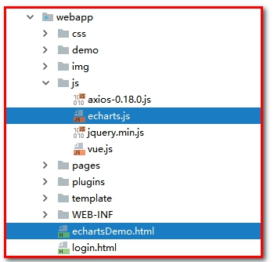 

echartsDemo.html

```html
<!DOCTYPE html>
<html lang="en">
<head>
    <meta charset="UTF-8">
    <title>Title</title>
</head>
<!-- 引入 ECharts 文件 -->
<script src="js/echarts.js"></script>
<body>

</body>
</html>
```

 

第二步：在页面中准备一个具备宽高的DOM容器。

```html
<body>
    <!-- 为 ECharts 准备一个具备大小（宽高）的 DOM -->
    <div id="main" style="width: 600px;height:400px;"></div>
</body>
```

 

第三步：通过`echarts.init`方法初始化一个 echarts 实例并通过setOption方法生成一个简单的柱状图**要List<Map> 做返回值**

```javascript
<script type="text/javascript">
    // 基于准备好的dom，初始化echarts实例
    var myChart = echarts.init(document.getElementById('main'));

    // 指定图表的配置项和数据
    var option = {
        title: {
            text: 'ECharts 入门示例'
        },
        tooltip: {},
        legend: {
            data:['销量']//图例
        },
        xAxis: {
            data: ["衬衫","羊毛衫","雪纺衫","裤子","高跟鞋","袜子"]//x轴
        },
        yAxis: {},
        series: [{
            name: '销量',
            type: 'bar',
            data: [5, 20, 36, 10, 10, 20]//y轴
        }]
    };
    // 使用刚指定的配置项和数据显示图表。
    myChart.setOption(option);
</script>
```

 

效果如下：

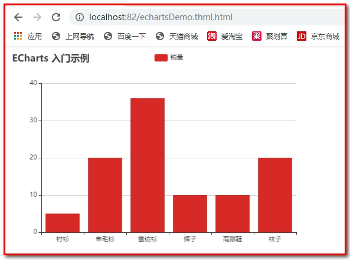 

## 1.3. 查看ECharts官方实例

ECharts提供了很多官方实例，我们可以通过这些官方实例来查看展示效果和使用方法。

官方实例地址：<https://www.echartsjs.com/examples/>

 

可以点击具体的一个图形会跳转到编辑页面，编辑页面左侧展示源码（js部分源码），右侧展示图表效果，如下：

 

要查看完整代码可以点击右下角的Download按钮将完整页面下载到本地。

通过官方案例我们可以发现，使用ECharts展示图表效果，关键点在于确定此图表所需的数据格式，然后按照此数据格式提供数据就可以了，我们无须关注效果是如何渲染出来的。

在实际应用中，我们要展示的数据往往存储在数据库中，所以我们可以发送ajax请求获取数据库中的数据并转为图表所需的数据即可。

### 【小结】

1：ECharts简介

* ECharts百度开发的一套商业报表工具(库)，数据加载使用JavaScript

2：5分钟上手ECharts

3：查看ECharts官方实例  

学习方法

* 看官网, 关注案例，无需关注api，根据项目需求，选择合适报表，从数据库中构造需要的数据

# 2. 会员数量折线图

### 【目标】

使用ECharts实现注册会员数量折线图

### 【路径】

1：需求分析

（1）展示最近一年,每个月累计会员数量

（2）前台需要什么:看官方折线图需要什么数据

（3）数据库需要查什么:


2：前台代码

（1）导入ECharts库

（2）参考官方实例导入折线图


3：后台代码

（1）ReportController类


（2）MemberService服务接口

（3）MemberServiceImpl服务实现类

（4）MemberDao接口

（5）Mapper映射文件（MemberDao.xml）

未完成

### 【讲解】

## 2.1. **需求分析**

会员信息是体检机构的核心数据，其会员数量和增长数量可以反映出机构的部分运营情况。通过折线图可以直观的反映出会员数量的增长趋势。本章节我们需要展示过去一年时间内每个月的会员总数据量。展示效果如下图：

 

需要的sql：

```sql
#2019年05月31日之前注册会员的人数(11)

SELECT COUNT(id) FROM t_member WHERE regTime <= '2019-05-32'

#2019年06月31日之前注册会员的人数(12)

SELECT COUNT(id) FROM t_member WHERE regTime <= '2019-06-32'

#2019年07月31日之前注册会员的人数(16)

SELECT COUNT(id) FROM t_member WHERE regTime <= '2019-07-32'
```


## 2.2. **前台代码**

会员数量折线图对应的页面为/pages/report_member.html。

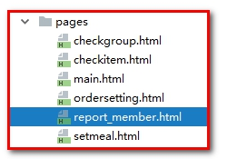 

### 2.2.1. **导入ECharts库**

第一步：将echarts.js文件复制到health_web工程中

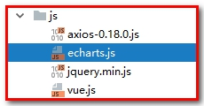 

第二步：在report_member.html页面引入echarts.js文件

```html
<script src="../js/echarts.js"></script>
```

### 2.2.2. **参照官方实例导入折线图**

1：定义<div>

```html
<div class="app-container">
    <div class="box">
        <!-- 为 ECharts 准备一个具备大小（宽高）的 DOM -->
        <div id="chart1" style="height:600px;"></div>
    </div>
</div>
```

2：定义script

```javascript
<script type="text/javascript">
    // 基于准备好的dom，初始化echarts实例
    var myChart1 = echarts.init(document.getElementById('chart1'));

    // 使用刚指定的配置项和数据显示图表。
    //myChart.setOption(option);

    axios.get("/report/getMemberReport.do").then((res)=>{
        myChart1.setOption(
                            {
                                title: {
                                    text: '会员数量'
                                },
                                tooltip: {},
                                legend: {
                                    data:['会员数量']
                                },
                                xAxis: {
                                    data: res.data.data.months
                                },
                                yAxis: {
                                    type:'value'
                                },
                                series: [{
                                    name: '会员数量',
                                    type: 'line',
                                    data: res.data.data.memberCount
                                }]
                            });
    });
</script>
```

 

根据折现图对数据格式的要求，我们发送ajax请求，服务端需要返回如下格式的数据：

其中months和memberCount可以使用hashmap封装

返回Result：data、flag、message

其中data，是map集合

map集合的key：months；            map集合的值：List<String>

map集合的key：memberCount；      map集合的值：List<Integer>

```json
{
    "data":{
        "months":["2019-01","2019-02","2019-03","2019-04"],
        "memberCount":[3,4,8,10]
    },
    "flag":true,
    "message":"获取会员统计数据成功"
}
```

 

## 2.3. **后台代码**

### 2.3.1. **Controller**

在health_web工程中创建ReportController并提供getMemberReport方法

```java
package com.itheima.controller;

import com.alibaba.dubbo.config.annotation.Reference;
import com.itheima.constant.MessageConstant;
import com.itheima.entity.Result;
import com.itheima.service.MemberService;
import org.springframework.web.bind.annotation.RequestMapping;
import org.springframework.web.bind.annotation.RestController;

import java.text.SimpleDateFormat;
import java.util.*;

/**
 * 统计报表
 */
@RestController
@RequestMapping("/report")
public class ReportController {
   //订阅接口
    private MemberService memberService;

    @RequestMapping("getMemberReport")
    public Result getMemberReport(){
        //获取日期容器
        Calendar calendar = Calendar.getInstance();
        //获取当前日期之间12个月的日期
        calendar.add(Calendar.MONTH,-12);

        //集合存学分
        List<String> list = new ArrayList<>();
        for (int i = 0; i < 12; i++) {
            calendar.add(Calendar.MONTH,1);

        }
        for(int i=0;i<12;i++){
            calendar.add(Calendar.MONTH,1);
            //转为date格式
            list.add(new SimpleDateFormat("yyyy-MM").format(calendar.getTime()));
        }

        Map<String,Object> map = new HashMap<String,Object>();
        map.put("months",list);

        List<Integer> memberCount = memberService.findMemberCountByMonth(list);
        map.put("memberCount",memberCount);

        return new Result(true, MessageConstant.GET_MEMBER_NUMBER_REPORT_SUCCESS,map);

    }
}
```

计算日期，可以使用test方法测试一下

 

### 2.3.2. **服务接口**

在MemberService服务接口中扩展方法findMemberCountByMonth

```java
List<Integer> findMemberCountByMonth(List<String> months);
```


### 2.3.3. **服务实现类**

在MemberServiceImpl服务实现类中实现findMemberCountByMonth方法

```java
// 根据月份统计会员数量
public List<Integer> findMemberCountByMonth(List<String> months) {
    List<Integer> list = new ArrayList<>();
    for(String m : months){
        m = m + "-31";//格式：2019-04-31
        Integer count = memberDao.findMemberCountBeforeDate(m);
        list.add(count);//存放会员数量
    }
    return list;
}
```

 

### 2.3.4. **Dao接口**

在MemberDao接口中扩展方法findMemberCountBeforeDate

```java
public Integer findMemberCountBeforeDate(String date);
```

 

### 2.3.5. **Mapper映射文件**

在MemberDao.xml映射文件中提供SQL语句

```xml
<!--根据日期统计会员数，统计指定日期之前的会员数-->
<select id="findMemberCountBeforeDate" parameterType="string" resultType="int">
    select count(id) from t_member where regTime &lt;= #{value}
</select>
```

```
注意：在xml文件中 ，  <号需要转义”&lt;”
					<=号需要转义”&lte;”
				    >号需要转义”&gt;”
				    >=号需要转义”&gte;”
				    &号需要专业 ”&amp;”
```

 

测试

1：修改main.html

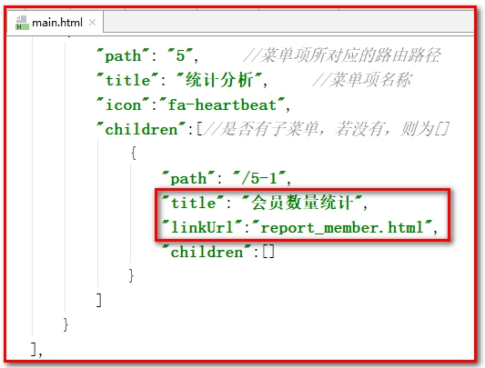 

2：导入数据

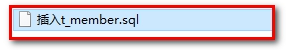 

3：测试效果

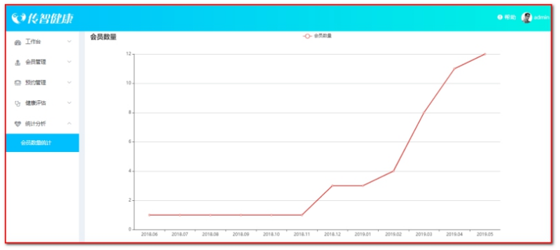 

###  【小结】

1：需求分析

2：前台页面

（1）导入ECharts库

（2）参考官方实例导入折线图案例（折线图、柱状图、饼图...），参考API完成开发

3：后台代码

（1）ReportController类

（2）MemberService服务接口

（3）MemberServiceImpl服务实现类

（4）MemberDao接口

（5）Mapper映射文件（MemberDao.xml）


# 3.套餐预约占比饼形图

## 3.1. **需求分析**

### 【目标】

会员可以通过移动端自助进行体检预约，在预约时需要选择预约的体检套餐。本章节我们需要通过饼形图直观的展示出会员预约的各个套餐占比情况。展示效果如下图：

 

### 【路径】

1：前台页面

（1）修改main.html

（2）导入ECharts库

（3）参照官方实例导入饼形图


（4）分析需要构造的数据格式和sql语

	


（5）饼图API介绍

2：后台代码

（1）ReportController

（2）SetmealService

（3）SetmealServiceImpl

（4）SetmealDao.java

（5）SetmealDao.xml


### 【讲解】

## 3.2. **前台页面**

套餐预约占比饼形图对应的页面为/pages/report_setmeal.html。

 

### 3.2.1. **修改main.html**

添加report_setmeal.html的url

```json
{
    "path": "/5-1",
    "title": "会员数量统计",
    "linkUrl":"report_member.html",
    "children":[]
},
{
    "path": "/5-2",
    "title": "预约套餐占比统计",
    "linkUrl":"report_setmeal.html",
    "children":[]
}
```

 

### 3.2.2. 导入ECharts库

```html
<script src="../js/echarts.js"></script>
```


### 3.2.3. 参照官方实例导入饼形图

```html
<div class="app-container">
    <div class="box">
        <!-- 为 ECharts 准备一个具备大小（宽高）的 DOM -->
        <div id="chart1" style="height:600px;"></div>
    </div>
</div>
```

Js代码：

```js
<script type="text/javascript">
    // 基于准备好的dom，初始化echarts实例
    var myChart1 = echarts.init(document.getElementById('chart1'));

    // 使用刚指定的配置项和数据显示图表。
    //myChart.setOption(option);

    axios.get("/report/getSetmealReport.do").then((res)=>{
        myChart1.setOption({
                                title : {
                                    text: '套餐预约占比',
                                    subtext: '',
                                    x:'center'
                                },
                                tooltip : {//提示框组件
                                    trigger: 'item',//触发类型，在饼形图中为item
                                    formatter: "{a} <br/>{b} : {c} ({d}%)"//提示内容格式
                                },
                                legend: {
                                    orient: 'vertical',
                                    left: 'left',
                                    data: res.data.data.setmealNames
                                },
                                series : [
                                    {
                                        name: '套餐预约占比',
                                        type: 'pie',
                                        radius : '55%',
                                        center: ['50%', '60%'],
                                        data:res.data.data.setmealCount,
                                        itemStyle: {
                                            emphasis: {
                                                shadowBlur: 10,
                                                shadowOffsetX: 0,
                                                shadowColor: 'rgba(0, 0, 0, 0.5)'
                                            }
                                        }
                                    }
                                ]
                            });
    });
</script>
```

### 3.2.4 .分析需要构造的数据格式和sql语句

1：根据饼形图对数据格式的要求，我们发送ajax请求，服务端需要返回如下格式的数据：

```json
{
    "data":{
            "setmealNames":["套餐1","套餐2","套餐3"],
            "setmealCount":[
                            {"name":"套餐1","value":10},
                            {"name":"套餐2","value":30},
                            {"name":"套餐3","value":25}
                           ]
           },
    "flag":true,
    "message":"获取套餐统计数据成功"
}
```

2：组织数据结构：

```java
Map<String,Object>;
map.put(“setmealNames”,List<String>);
map.put(“setmealCount”,List<Map>)

```

3：只需要把List<Map> setmealCount查询出来, setmealNames的数据也就有了

```sql
SELECT s.name, COUNT(o.id) value FROM t_order o, t_setmeal s WHERE o.setmeal_id = s.id GROUP BY s.name
```


### 3.2.5 .饼图：API介绍：

第一步：查看图例

 

第二步：查看代码

 

第三步：查看api

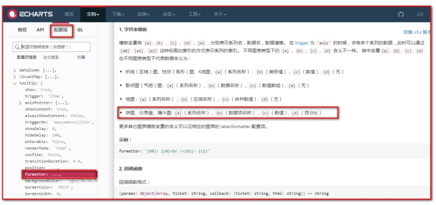 

## 3.3. **后台代码**

### 3.3.1. **Controller**

在health_web工程的ReportController中提供getSetmealReport方法

```java
@Reference
private SetmealService setmealService;
/**
 * 套餐占比统计
 * @return
 */
@RequestMapping("/getSetmealReport")
public Result getSetmealReport(){
    //实现功能:
    List<Map<String, Object>> setmealCount = setmealService.findSetmealCount();

    Map<String,Object> map = new HashMap<String,Object>();
    map.put("setmealCount",setmealCount);

    List<String> setmealNames = new ArrayList<String>();
    for(Map<String,Object> m : list){
        String name = (String) m.get("name");
        setmealNames.add(name);
    }
    map.put("setmealNames",setmealNames);

    return new Result(true, MessageConstant.GET_SETMEAL_COUNT_REPORT_SUCCESS,map);
}
```


### 3.3.2. **服务接口**

在SetmealService服务接口中扩展方法findSetmealCount

```java
List<Map<String,Object>> findSetmealCount();
```


### 3.3.3. **服务实现类**

在SetmealServiceImpl服务实现类中实现findSetmealCount方法

```java
public List<Map<String, Object>> findSetmealCount() {
    return setmealDao.findSetmealCount();
}
```

 

### 3.3.4. **Dao接口**

在SetmealDao接口中扩展方法findSetmealCount

```java
List<Map<String,Object>> findSetmealCount();
```

 

### 3.3.5. **Mapper映射文件**

在SetmealDao.xml映射文件中提供SQL语句


```xml
<select id="findSetmealCount" resultType="map">
    select s.name,count(o.id) as value
    from t_order o ,t_setmeal s
    where o.setmeal_id = s.id
    group by s.name
</select>
```

### 【小结】

核心地方（ECharts图形报表）

1. 分析出数据格式，返回Result

```json
{
	flag:true,
	message:'成功',
	data:{
		setmealNames:['套餐A','套餐B','套餐C'],
		setmealCount:[
			 {value:1, name:'套餐A'},
			 {value:2, name:'套餐B'},
			 {value:1, name:'套餐C'},
		]
	
	}
}
```

1.数据封装

```json
data--->Map
setmealNames--->List<String>
setmealCount--->List<Map>
```

2.数据怎么来，分析出查询的sql语句

```sql
SELECT s.name, COUNT(o.id) value FROM t_order o, t_setmeal s WHERE o.setmeal_id = s.id GROUP BY s.name
```

注意事项

在SetmealDao.xml映射文件中提供SQL语句

写SQL的返回值的时候，resultType="对象实体",也可以使用resultType="map"

```xml
<select id="findSetmealCount" resultType="map">
    select s.name,count(o.setmeal_id) as value
    from t_order o ,t_setmeal s
    where o.setmeal_id = s.id
    group by s.name
</select>
```


# 4. **运营数据统计**

## 4.1. **需求分析**

### 【目标】

通过运营数据统计可以展示出体检机构的运营情况，包括会员数据、预约到诊数据、热门套餐（前4）等信息。本章节就是要通过一个表格的形式来展示这些运营数据。效果如下图：

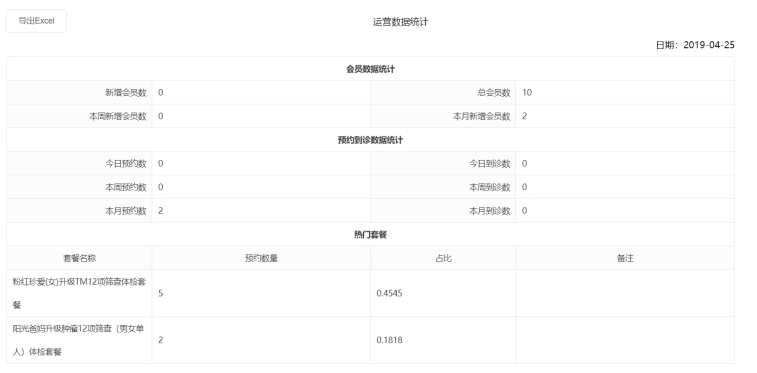 

### 【路径】

1：前台代码

（1）修改main.html

（2）定义数据模型

（3）对应后台sql语句

（4）发送请求获取动态数据

2：后台代码

（1）ReportController.java

（2）ReportService.java

（3）ReportServiceImpl.java

（4）OrderDao.java

​         MemberDao.java

（5）OrderDao.xml

​         MemberDao.xml


### 【讲解】

## 4.2. **前台代码**

运营数据统计对应的页面为/pages/report_business.html。

 

### 4.2.1. **修改main.html**

```json
{
    "path": "/5-1",
    "title": "会员数量统计",
    "linkUrl":"report_member.html",
    "children":[]
},
{
    "path": "/5-2",
    "title": "预约套餐占比统计",
    "linkUrl":"report_setmeal.html",
    "children":[]
},
{
    "path": "/5-3",
    "title": "运营数据统计",
    "linkUrl":"report_business.html",
    "children":[]
}
```


### 4.2.2. **定义模型数据**

（1）：定义数据模型，通过VUE的数据绑定展示数据

```javascript
<script>
    var vue = new Vue({
        el: '#app',
        data:{
            reportData:{
                reportDate:null,
                todayNewMember :0,
                totalMember :0,
                thisWeekNewMember :0,
                thisMonthNewMember :0,
                todayOrderNumber :0,
                todayVisitsNumber :0,
                thisWeekOrderNumber :0,
                thisWeekVisitsNumber :0,
                thisMonthOrderNumber :0,
                thisMonthVisitsNumber :0,
                hotSetmeal :[
                    {name:'升级肿瘤12项筛查（男女单人）体检套餐',setmeal_count:200,proportion:0.222},
                    {name:'升级肿瘤12项筛查体检套餐',setmeal_count:200,proportion:0.222}
                ]
            }
        }
    })
</script>
```

（2）：数据展示

```html
<div class="app-container">
    <div class="box" style="height: 900px">
        <div class="excelTitle" >
            <el-button @click="exportExcel">导出Excel</el-button>运营数据统计
        </div>
        <div class="excelTime">日期：{{reportData.reportDate}}</div>
        <table class="exceTable" cellspacing="0" cellpadding="0">
            <tr>
                <td colspan="4" class="headBody">会员数据统计</td>
            </tr>
            <tr>
                <td width='20%' class="tabletrBg">新增会员数</td>
                <td width='30%'>{{reportData.todayNewMember}}</td>
                <td width='20%' class="tabletrBg">总会员数</td>
                <td width='30%'>{{reportData.totalMember}}</td>
            </tr>
            <tr>
                <td class="tabletrBg">本周新增会员数</td>
                <td>{{reportData.thisWeekNewMember}}</td>
                <td class="tabletrBg">本月新增会员数</td>
                <td>{{reportData.thisMonthNewMember}}</td>
            </tr>
            <tr>
                <td colspan="4" class="headBody">预约到诊数据统计</td>
            </tr>
            <tr>
                <td class="tabletrBg">今日预约数</td>
                <td>{{reportData.todayOrderNumber}}</td>
                <td class="tabletrBg">今日到诊数</td>
                <td>{{reportData.todayVisitsNumber}}</td>
            </tr>
            <tr>
                <td class="tabletrBg">本周预约数</td>
                <td>{{reportData.thisWeekOrderNumber}}</td>
                <td class="tabletrBg">本周到诊数</td>
                <td>{{reportData.thisWeekVisitsNumber}}</td>
            </tr>
            <tr>
                <td class="tabletrBg">本月预约数</td>
                <td>{{reportData.thisMonthOrderNumber}}</td>
                <td class="tabletrBg">本月到诊数</td>
                <td>{{reportData.thisMonthVisitsNumber}}</td>
            </tr>
            <tr>
                <td colspan="4" class="headBody">热门套餐</td>
            </tr>
            <tr class="tabletrBg textCenter">
                <td>套餐名称</td>
                <td>预约数量</td>
                <td>占比</td>
                <td>备注</td>
            </tr>
            <tr v-for="s in reportData.hotSetmeal">
                <td>{{s.name}}</td>
                <td>{{s.setmeal_count}}</td>
                <td>{{s.proportion}}</td>
                <td></td>
            </tr>
        </table>
    </div>
</div>
```

### 4.2.3.对应后台sql语句

需求

```sql
-- 今天新增会员数

-- 总会员数

-- 本周新增会员数(>=本周的周一的日期)

-- 本月新增会员数(>=本月的第一天的日期)

-------------------------------------------------------------------------------
-- 今日预约数

-- 今日到诊数

-- 本周预约数(>=本周的周一的日期 <=本周的周日的日期)  

-- 本周到诊数(>=本周的周一的日期 <=本周的周日的日期)  +   （状态=已到诊）

-- 本月预约数(>=每月的第一天的日期 <=每月的最后一天的日期)

-- 本月到诊数(>=每月的第一天的日期 <=每月的最后一天的日期)  +   （状态=已到诊）

-- 热门套餐
```

所需sql语句

```sql
-- 今天新增会员数
SELECT COUNT(*) FROM t_member WHERE regTime = '2019-06-26'
-- 总会员数
SELECT COUNT(*) FROM t_member
-- 本周新增会员数(>=本周的周一的日期)
SELECT COUNT(*) FROM t_member WHERE regTime >= '2019-06-24'
-- 本月新增会员数(>=本月的第一天的日期)
SELECT COUNT(*) FROM t_member WHERE regTime >= '2019-06-01'
-------------------------------------------------------------------------------
-- 今日预约数
SELECT COUNT(*) FROM t_order WHERE orderDate = '2019-06-26'
-- 今日到诊数
SELECT COUNT(*) FROM t_order WHERE orderDate = '2019-06-26' AND orderStatus = '已到诊'
-- 本周预约数(>=本周的周一的日期 <=本周的周日的日期)  
SELECT COUNT(*) FROM t_order WHERE orderDate between '2019-06-24' and '2019-06-31'  
-- 本周到诊数
SELECT COUNT(*) FROM t_order WHERE orderDate between '2019-06-24' and '2019-06-31' AND orderStatus = '已到诊'
-- 本月预约数(>=每月的第一天的日期 <=每月的最后一天的日期)
SELECT COUNT(*) FROM t_order WHERE orderDate between '2019-06-01' and '2019-06-31'
-- 本月到诊数
SELECT COUNT(*) FROM t_order WHERE orderDate between '2019-06-01' and '2019-06-31' AND orderStatus = '已到诊'

-- 热门套餐
SELECT s.name, COUNT(o.id) setmeal_count, COUNT(o.id)/(SELECT COUNT(id) FROM t_order ) proportion FROM t_setmeal s, t_order o WHERE s.id = o.setmeal_id
GROUP BY s.name ORDER BY  setmeal_count DESC LIMIT 0,4
```


### 4.2.4. **发送请求获取动态数据**

（1）在VUE的钩子函数中发送ajax请求获取动态数据，通过VUE的数据绑定将数据展示到页面

```javascript
<script>
    var vue = new Vue({
        el: '#app',
        data:{
            reportData:{
                reportDate:null,
                todayNewMember :0,
                totalMember :0,
                thisWeekNewMember :0,
                thisMonthNewMember :0,
                todayOrderNumber :0,
                todayVisitsNumber :0,
                thisWeekOrderNumber :0,
                thisWeekVisitsNumber :0,
                thisMonthOrderNumber :0,
                thisMonthVisitsNumber :0,
                hotSetmeal :[
                    {name:'升级肿瘤12项筛查（男女单人）体检套餐',setmeal_count:200,proportion:0.222},
                    {name:'升级肿瘤12项筛查体检套餐',setmeal_count:200,proportion:0.222}
                ]
            }
        },
        created() {
            axios.get("/report/getBusinessReportData.do").then((res)=>{
                this.reportData = res.data.data;
            });
        }
    })
</script>
```

（2）根据页面对数据格式的要求，我们发送ajax请求，服务端需要返回如下格式的数据：

```json
{
  "data":{
    "reportDate":"2019-04-25",
    "todayNewMember":0,
    "totalMember":10,
    "thisMonthNewMember":2,
    "thisWeekNewMember":0,
    "todayOrderNumber":0,
    "todayVisitsNumber":0,
    "thisWeekVisitsNumber":0,
    "thisWeekOrderNumber":0,
    "thisMonthOrderNumber":2,
    "thisMonthVisitsNumber":0,
    "hotSetmeal":[
      {"proportion":0.4545,"name":"粉红珍爱(女)升级TM12项筛查体检套餐","setmeal_count":5},
      {"proportion":0.1818,"name":"美丽爸妈升级肿瘤12项筛查体检套餐","setmeal_count":2},
      {"proportion":0.1818,"name":"珍爱高端升级肿瘤12项筛查","setmeal_count":2},
      {"proportion":0.0909,"name":"孕前检查套餐","setmeal_count":1}
    ],
  },
  "flag":true,
  "message":"获取运营统计数据成功"
}
```


## 4.3. **后台代码**

### 4.3.1. **Controller**

在ReportController中提供getBusinessReportData方法

```java
@Reference
private ReportService reportService;

/**
 * 获取运营统计数据
 * @return
 */
@RequestMapping("/getBusinessReportData")
public Result getBusinessReportData(){
    try {
        Map<String, Object> result = reportService.getBusinessReport();
        return new Result(true,MessageConstant.GET_BUSINESS_REPORT_SUCCESS,result);
    } catch (Exception e) {
        e.printStackTrace();
        return new Result(true,MessageConstant.GET_BUSINESS_REPORT_FAIL);
    }
}
```

 

### 4.3.2. **服务接口**

在health_interface工程中创建ReportService服务接口并声明getBusinessReport方法

```java
public interface ReportService {

    /**
     * 获得运营统计数据
     * Map数据格式：
     *      reportDate（当前时间）--String
     *      todayNewMember（今日新增会员数） -> number
     *      totalMember（总会员数） -> number
     *      thisWeekNewMember（本周新增会员数） -> number
     *      thisMonthNewMember（本月新增会员数） -> number
     *      todayOrderNumber（今日预约数） -> number
     *      todayVisitsNumber（今日到诊数） -> number
     *      thisWeekOrderNumber（本周预约数） -> number
     *      thisWeekVisitsNumber（本周到诊数） -> number
     *      thisMonthOrderNumber（本月预约数） -> number
     *      thisMonthVisitsNumber（本月到诊数） -> number
     *      hotSetmeal（热门套餐（取前4）） -> List<Map<String,Object>>
     */
    public Map<String,Object> getBusinessReport() throws Exception;
}
```

 

### 4.3.3. **服务实现类**

在health_service工程中创建服务实现类ReportServiceImpl并实现ReportService接口

```java
@Service(interfaceClass = ReportService.class)
@Transactional
public class ReportServiceImpl implements ReportService {

    @Autowired
    private MemberDao memberDao;
    @Autowired
    private OrderDao orderDao;

    /**
     * 获得运营统计数据
     * Map数据格式：
     *      todayNewMember（今日新增会员数） -> number
     *      totalMember（总会员数） -> number
     *      thisWeekNewMember（本周新增会员数） -> number
     *      thisMonthNewMember（本月新增会员数） -> number
     *      todayOrderNumber（今日预约数） -> number
     *      todayVisitsNumber（今日到诊数） -> number
     *      thisWeekOrderNumber（本周预约数） -> number
     *      thisWeekVisitsNumber（本周到诊数） -> number
     *      thisMonthOrderNumber（本月预约数） -> number
     *      thisMonthVisitsNumber（本月到诊数） -> number
     *      hotSetmeal（热门套餐（取前4）） -> List<Map<String,Object>>
     */
    public Map<String, Object> getBusinessReport() throws Exception{
        // 获得当前日期
        String today = DateUtils.parseDate2String(DateUtils.getToday());
        // 获得本周一的日期
        String thisWeekMonday = DateUtils.parseDate2String(DateUtils.getThisWeekMonday());
        // 获取本周最后一天的日期
        String thisWeekSunday = DateUtils.parseDate2String(DateUtils.getSundayOfThisWeek());
        // 获得本月第一天的日期
        String firstDay4ThisMonth = DateUtils.parseDate2String(DateUtils.getFirstDay4ThisMonth());
        // 获取本月最后一天的日期
        String lastDay4ThisMonth = DateUtils.parseDate2String(DateUtils.getLastDay4ThisMonth());

        // 今日新增会员数
        Integer todayNewMember = memberDao.findMemberCountByDate(today);

        // 总会员数
        Integer totalMember = memberDao.findMemberTotalCount();

        // 本周新增会员数
        Integer thisWeekNewMember = memberDao.findMemberCountAfterDate(thisWeekMonday);

        // 本月新增会员数
        Integer thisMonthNewMember = memberDao.findMemberCountAfterDate(firstDay4ThisMonth);

        // 今日预约数
        Integer todayOrderNumber = orderDao.findOrderCountByDate(today);

        // 本周预约数
        Map<String,Object> weekMap = new HashMap<String,Object>();
        weekMap.put("begin",thisWeekMonday);
        weekMap.put("end",thisWeekSunday);
        Integer thisWeekOrderNumber = orderDao.findOrderCountBetweenDate(weekMap);

        // 本月预约数
        Map<String,Object> monthMap = new HashMap<String,Object>();
        monthMap.put("begin",firstDay4ThisMonth);
        monthMap.put("end",lastDay4ThisMonth);
        Integer thisMonthOrderNumber = orderDao.findOrderCountBetweenDate(monthMap);

        // 今日到诊数
        Integer todayVisitsNumber = orderDao.findVisitsCountByDate(today);

        // 本周到诊数
        Map<String,Object> weekMap2 = new HashMap<String,Object>();
        weekMap2.put("begin",thisWeekMonday);
        weekMap2.put("end",thisWeekSunday);
        Integer thisWeekVisitsNumber = orderDao.findVisitsCountAfterDate(weekMap2);

        // 本月到诊数
        Map<String,Object> monthMap2 = new HashMap<String,Object>();
        monthMap2.put("begin",firstDay4ThisMonth);
        monthMap2.put("end",lastDay4ThisMonth);
        Integer thisMonthVisitsNumber = orderDao.findVisitsCountAfterDate(monthMap2);

        // 热门套餐（取前4）
        List<Map> hotSetmeal = orderDao.findHotSetmeal();

        Map<String,Object> result = new HashMap<>();
        result.put("reportDate",today);
        result.put("todayNewMember",todayNewMember);
        result.put("totalMember",totalMember);
        result.put("thisWeekNewMember",thisWeekNewMember);
        result.put("thisMonthNewMember",thisMonthNewMember);
        result.put("todayOrderNumber",todayOrderNumber);
        result.put("thisWeekOrderNumber",thisWeekOrderNumber);
        result.put("thisMonthOrderNumber",thisMonthOrderNumber);
        result.put("todayVisitsNumber",todayVisitsNumber);
        result.put("thisWeekVisitsNumber",thisWeekVisitsNumber);
        result.put("thisMonthVisitsNumber",thisMonthVisitsNumber);
        result.put("hotSetmeal",hotSetmeal);

        return result;
    }
}
```

 

### 4.3.4. **Dao接口**

在OrderDao和MemberDao中声明相关统计查询方法

#### 4.3.4.1. **OrderDao.java**

```java
@Repository
public interface OrderDao {

    Integer findOrderCountByDate(String today);

    Integer findOrderCountBetweenDate(Map<String,Object> map);

    Integer findVisitsCountByDate(String today);

    Integer findVisitsCountAfterDate(Map<String,Object> map);

    List<Map> findHotSetmeal();
}
```

 

#### 4.3.4.2. **MemberDao.java**

```java
@Repository
public interface MemberDao {
    public Integer findMemberCountBeforeDate(String date);
    public Integer findMemberCountByDate(String date);
    public Integer findMemberCountAfterDate(String date);
    public Integer findMemberTotalCount();
}
```

 

### 4.3.5. Mapper映射文件

在OrderDao.xml和MemberDao.xml中定义SQL语句

#### 4.3.5.1. **OrderDao.xml：**

```xml
<?xml version="1.0" encoding="UTF-8" ?>
<!DOCTYPE mapper PUBLIC "-//mybatis.org//DTD Mapper 3.0//EN"
        "http://mybatis.org/dtd/mybatis-3-mapper.dtd" >
<mapper namespace="com.itheima.dao.OrderDao">

    <!--根据日期统计预约数-->
    <select id="findOrderCountByDate" parameterType="string" resultType="int">
        select count(id) from t_order where orderDate = #{value}
    </select>

    <!--根据日期统计预约数，统计指定日期之后的预约数（区间范围）-->
    <select id="findOrderCountBetweenDate" parameterType="map" resultType="int">
        select count(id) from t_order where orderDate between #{begin} and #{end}
    </select>

    <!--根据日期统计到诊数-->
    <select id="findVisitsCountByDate" parameterType="string" resultType="int">
        select count(id) from t_order where orderDate = #{value} and orderStatus = '已到诊'
    </select>

    <!--根据日期统计到诊数，统计指定日期之后的到诊数（区间范围）-->
    <select id="findVisitsCountAfterDate" parameterType="map" resultType="int">
        select count(id) from t_order where orderDate between #{begin} and #{end} and orderStatus = '已到诊'
    </select>

    <!--热门套餐，查询前4条-->
    <select id="findHotSetmeal" resultType="map">
        select
        s.name,
        count(o.id) setmeal_count ,
        count(o.id)/(select count(id) from t_order) proportion
        from t_order o inner join t_setmeal s on s.id = o.setmeal_id
        group by s.name
        order by setmeal_count desc
        limit 0,4
    </select>
</mapper>
```

 

#### 4.3.5.2. **MemberDao.xml：**

```xml
<?xml version="1.0" encoding="UTF-8" ?>
<!DOCTYPE mapper PUBLIC "-//mybatis.org//DTD Mapper 3.0//EN"
        "http://mybatis.org/dtd/mybatis-3-mapper.dtd" >
<mapper namespace="com.itheima.dao.MemberDao">
  
    <!--根据日期统计会员数，统计指定日期之前的会员数-->
    <select id="findMemberCountBeforeDate" parameterType="string" resultType="int">
        select count(id) from t_member where regTime &lt;= #{value}
    </select>

    <!--根据日期统计会员数-->
    <select id="findMemberCountByDate" parameterType="string" resultType="int">
        select count(id) from t_member where regTime = #{value}
    </select>

    <!--根据日期统计会员数，统计指定日期之后的会员数-->
    <select id="findMemberCountAfterDate" parameterType="string" resultType="int">
        select count(id) from t_member where regTime &gt;= #{value}
    </select>

    <!--总会员数-->
    <select id="findMemberTotalCount" resultType="int">
        select count(id) from t_member
    </select>
</mapper>
```

### 【小结】

1. 数据查询的比较多, 数据怎么封装 --->选择Map
2. 数据怎么查询出来，并放置到vue中的模型

```sql
-- 今天新增会员数
SELECT COUNT(*) FROM t_member WHERE regTime = '2019-06-26'
-- 总会员数
SELECT COUNT(*) FROM t_member
-- 本周新增会员数(>=本周的周一的日期)
SELECT COUNT(*) FROM t_member WHERE regTime >= '2019-06-24'
-- 本月新增会员数(>=本月的第一天的日期)
SELECT COUNT(*) FROM t_member WHERE regTime >= '2019-06-01'

-- 今日预约数
SELECT COUNT(*) FROM t_order WHERE orderDate = '2019-06-26'
-- 今日到诊数
SELECT COUNT(*) FROM t_order WHERE orderDate = '2019-06-26' AND orderStatus = '已到诊'
-- 本周预约数(>=本周的周一的日期 <=本周的周日的日期)  
SELECT COUNT(*) FROM t_order WHERE orderDate between '2019-06-24' and '2019-06-31'  
-- 本周到诊数
SELECT COUNT(*) FROM t_order WHERE orderDate between '2019-06-24' and '2019-06-31' AND orderStatus = '已到诊'
-- 本月预约数(>=每月的第一天的日期 <=每月的最后一天的日期)
SELECT COUNT(*) FROM t_order WHERE orderDate between '2019-06-01' and '2019-06-31'
-- 本月到诊数
SELECT COUNT(*) FROM t_order WHERE orderDate between '2019-06-01' and '2019-06-31' AND orderStatus = '已到诊'

-- 热门套餐
SELECT s.name, COUNT(o.id) setmeal_count, COUNT(o.id)/(SELECT COUNT(id) FROM t_order ) proportion FROM t_setmeal s, t_order o WHERE s.id = o.setmeal_id
GROUP BY s.name ORDER BY  setmeal_count DESC LIMIT 0,4
```


# 5. 运营数据统计报表导出

### 【目标】

运营数据统计报表导出就是将统计数据写入到Excel并提供给客户端浏览器进行下载，以便体检机构管理人员对运营数据的查看和存档。

### 【路径】

1：提供模板文件

2：前台代码

在report_business.html页面提供“导出”按钮并绑定事件

3：后台代码

（1）ReportController.java

（2）ReportService.java

（3）ReportServiceImpl.java


### 【讲解】

## 5.1. **提供模板文件**

本章节我们需要将运营统计数据通过POI写入到Excel文件，对应的Excel效果如下：

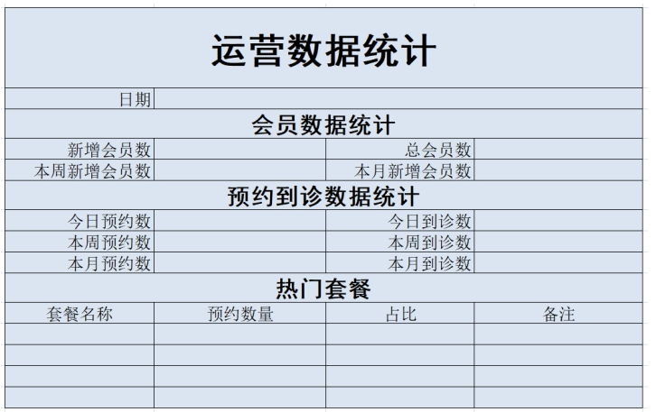 

通过上面的Excel效果可以看到，表格比较复杂，涉及到合并单元格、字体、字号、字体加粗、对齐方式等的设置。如果我们通过POI编程的方式来设置这些效果代码会非常繁琐。

在企业实际开发中，对于这种比较复杂的表格导出一般我们会提前设计一个Excel模板文件，在这个模板文件中提前将表格的结构和样式设置好，我们的程序只需要读取这个文件并在文件中的相应位置写入具体的值就可以了。

在本章节资料中已经提供了一个名为report_template.xlsx的模板文件

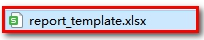 

需要将这个文件复制到	health_web工程中

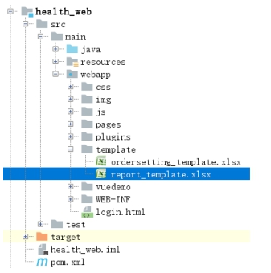 

## 5.2. **前台代码**

（1）在report_business.html页面提供“导出”按钮并绑定事件

```html
<div class="excelTitle" >
    <el-button @click="exportExcel">导出Excel</el-button>运营数据统计
</div>
```

（2）导出方法

```javascript
methods:{
    exportExcel(){
        window.location.href = '/report/exportBusinessReport.do';
    }
}
```

 

## 5.3. **后台代码**

在ReportController中提供exportBusinessReport方法，基于POI将数据写入到Excel中并通过输出流下载到客户端

```java
/**
 * 导出Excel报表
 * @return
 */
@RequestMapping("/exportBusinessReport")
public Result exportBusinessReport(HttpServletRequest request, HttpServletResponse response){
    try{
        //远程调用报表服务获取报表数据
        Map<String, Object> result = reportService.getBusinessReport();

        //取出返回结果数据，准备将报表数据写入到Excel文件中
        String reportDate = (String) result.get("reportDate");
        Integer todayNewMember = (Integer) result.get("todayNewMember");
        Integer totalMember = (Integer) result.get("totalMember");
        Integer thisWeekNewMember = (Integer) result.get("thisWeekNewMember");
        Integer thisMonthNewMember = (Integer) result.get("thisMonthNewMember");
        Integer todayOrderNumber = (Integer) result.get("todayOrderNumber");
        Integer thisWeekOrderNumber = (Integer) result.get("thisWeekOrderNumber");
        Integer thisMonthOrderNumber = (Integer) result.get("thisMonthOrderNumber");
        Integer todayVisitsNumber = (Integer) result.get("todayVisitsNumber");
        Integer thisWeekVisitsNumber = (Integer) result.get("thisWeekVisitsNumber");
        Integer thisMonthVisitsNumber = (Integer) result.get("thisMonthVisitsNumber");
        List<Map> hotSetmeal = (List<Map>) result.get("hotSetmeal");

        //获得Excel模板文件绝对路径
        String temlateRealPath = request.getSession().getServletContext().getRealPath("template") +
                File.separator + "report_template.xlsx";

        //1.读取模板文件创建Excel表格对象
        XSSFWorkbook workbook = new XSSFWorkbook(new FileInputStream(new File(temlateRealPath)));
        //2.获取工作表对象
        XSSFSheet sheet = workbook.getSheetAt(0);
		//3.获取行 下标获取
        XSSFRow row = sheet.getRow(2);
        //4.获取列 下标获取   setCellValue(添加值)
        row.getCell(5).setCellValue(reportDate);//日期

        row = sheet.getRow(4);
        row.getCell(5).setCellValue(todayNewMember);//新增会员数（本日）
        row.getCell(7).setCellValue(totalMember);//总会员数

        row = sheet.getRow(5);
        row.getCell(5).setCellValue(thisWeekNewMember);//本周新增会员数
        row.getCell(7).setCellValue(thisMonthNewMember);//本月新增会员数

        row = sheet.getRow(7);
        row.getCell(5).setCellValue(todayOrderNumber);//今日预约数
        row.getCell(7).setCellValue(todayVisitsNumber);//今日到诊数

        row = sheet.getRow(8);
        row.getCell(5).setCellValue(thisWeekOrderNumber);//本周预约数
        row.getCell(7).setCellValue(thisWeekVisitsNumber);//本周到诊数

        row = sheet.getRow(9);
        row.getCell(5).setCellValue(thisMonthOrderNumber);//本月预约数
        row.getCell(7).setCellValue(thisMonthVisitsNumber);//本月到诊数

        
        //5.遍历套餐列表数据
        int rowNum = 12;//套餐列表在excel的位置13行,从0开始
        for(Map map : hotSetmeal){//热门套餐
            String name = (String) map.get("name");
            Long setmeal_count = (Long) map.get("setmeal_count");
            BigDecimal proportion = (BigDecimal) map.get("proportion");
            
            row = sheet.getRow(rowNum ++);
            row.getCell(4).setCellValue(name);//套餐名称
            row.getCell(5).setCellValue(setmeal_count);//预约数量
            row.getCell(6).setCellValue(proportion.doubleValue());//占比
        }

        //通过输出流进行文件下载
        ServletOutputStream out = response.getOutputStream();//获取输出流
        response.setContentType("application/vnd.ms-excel");//样式格式
        response.setHeader("content-Disposition", "attachment;filename=report.xlsx");
        //输出
        workbook.write(out);

        //释放和刷新流
        out.flush();
        out.close();
        workbook.close();

        return null;
    }catch (Exception e){
        return new Result(false, MessageConstant.GET_BUSINESS_REPORT_FAIL,null);
    }
}
```

 

### 【小结】

​	如果发现导出Excel有些复杂, 一般先把Excel制作一个模版. 把模版通过POI读取到内存里面. 获得数据, 动态的给模版里面填充数据, 再响应(Response)文件，使用IO流的方式输出。