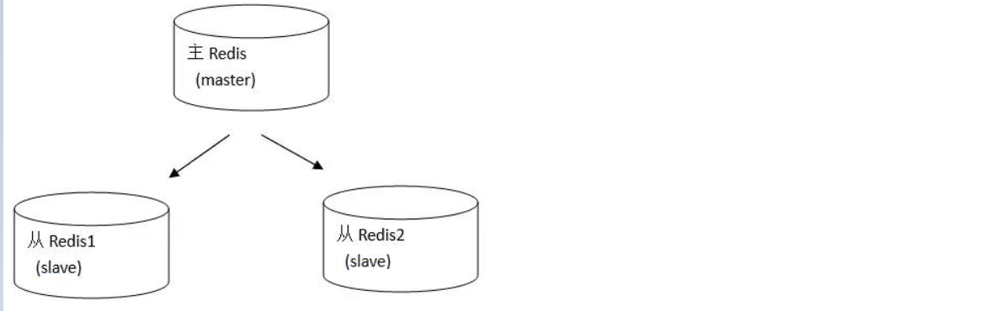
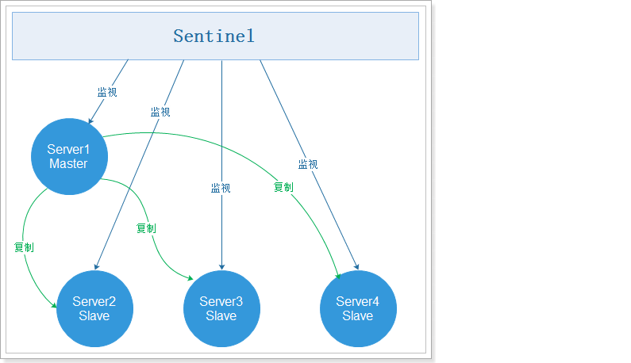
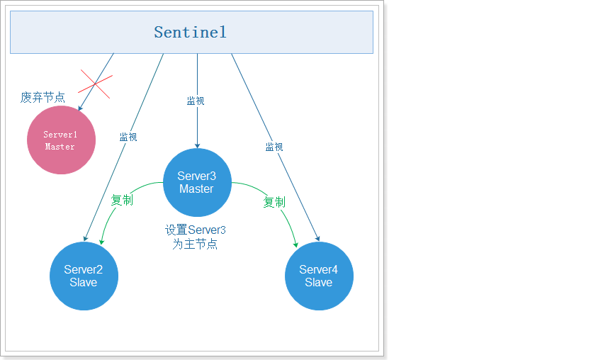
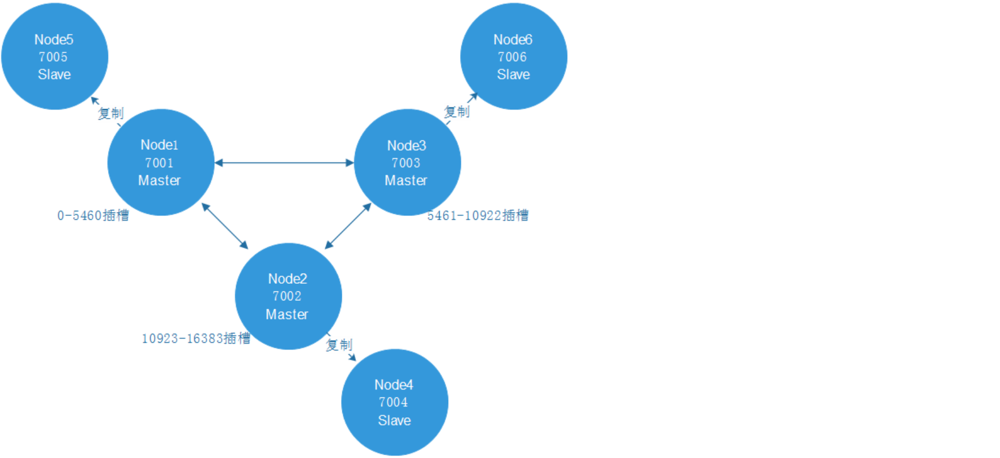
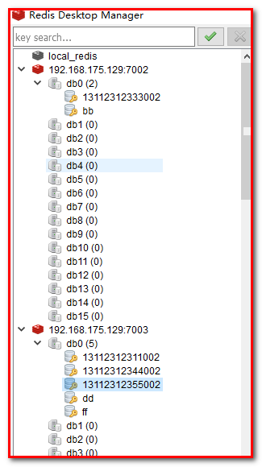
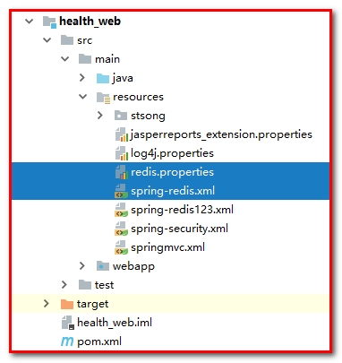
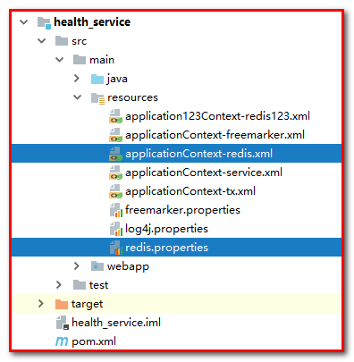
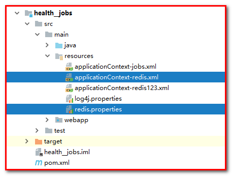

# 第10章 Redis优化

学习目标

- 了解Redis缓存相关问题
- 了解Redis缓存集群方案
- 搭建集群环境
- 能够使用spring整合Redis集群环境


本章内容我们的主题为Redis，目前Redis在企业中的应用已经非常广泛，同时Redis也是面试中的重点内容。

# 1. Redis缓存相关问题

### 【目标】

1：了解Redis缓存穿透

2：了解Redis缓存雪崩

3：了解Redis缓存击穿

### 【路径】

1：缓存穿透描述，及解决方案

2：缓存雪崩描述，及解决方案

3：缓存击穿描述，及解决方案

### 【讲解】

## 1.1. 缓存穿透

**缓存穿透**是指查询一个数据库一定不存在的数据。

我们以前正常的使用Redis缓存的流程大致是：

1、数据查询首先进行缓存查询

2、如果数据存在则直接返回缓存数据

3、如果数据不存在，就对数据库进行查询，并把查询到的数据放进缓存

4、如果数据库查询数据为空，则不放进缓存


例如我们的数据表中主键是自增产生的，所有的主键值都大于0。此时如果用户传入的参数为-1，会是怎么样？这个-1，就是一定不存在的对象。程序就会每次都去查询数据库，而每次查询都是空，每次又都不会进行缓存。假如有人恶意攻击，就可以利用这个漏洞，对数据库造成压力，甚至压垮我们的数据库。


为了防止有人利用这个漏洞恶意攻击我们的数据库，我们可以采取如下措施：

如果从数据库查询的对象为空，也放入缓存，key为用户提交过来的主键值，value为null，只是设定的缓存过期时间较短，比如设置为60秒。这样下次用户再根据这个key查询redis缓存就可以查询到值了（当然值为null），从而保护我们的数据库免遭攻击。

## 1.2.  缓存雪崩

缓存雪崩，是指在某一个时间段，缓存集中过期失效。在缓存集中失效的这个时间段对数据的访问查询，都落到了数据库上，对于数据库而言，就会产生周期性的压力波峰。

为了避免缓存雪崩的发生，我们可以将缓存的数据设置不同的失效时间，这样就可以避免缓存数据在某个时间段集中失效。例如对于热门的数据（访问频率高的数据）可以缓存的时间长一些，对于冷门的数据可以缓存的时间短一些。甚至对于一些特别热门的数据可以设置永不过期。

## 1.3. 缓存击穿

缓存击穿，是指一个key非常热点（例如双十一期间进行抢购的商品数据），在不停的扛着大并发，大并发集中对这一个点进行访问，当这个key在失效的瞬间，持续的大并发就穿破缓存，直接请求到数据库上，就像在一个屏障上凿开了一个洞。

我们同样可以将这些热点数据设置永不过期就可以解决缓存击穿的问题了。

### 【小结】

1：缓存穿透描述，及解决方案

2：缓存雪崩描述，及解决方案

3：缓存击穿描述，及解决方案

# 2.Redis集群方案

单机Redis的读写速度非常快，能够支持大量用户的访问。虽然Redis的性能很高，但是对于大型网站来说，每秒需要获取的数据远远超过单台redis服务所能承受的压力，所以我们迫切需要一种方案能够解决单台Redis服务性能不足的问题。这就需要使用到Redis的集群了。Redis集群有多种方案，下面分别进行讲解。

### 【目标】

1：了解Redis集群

2：搭建Redis集群

### 【路径】

1：主从复制Replication

2：哨兵Sentinel

3：Redis内置集群cluster（推荐）

### 【讲解】

## 2.1. 主从复制Replication

redis支持主从复制的模式。

在主从复制模式下Redis节点分为两种角色：主节点(也称为master)和从节点(也称为slave)。这种模式集群是由一个主节点和多个从节点构成。

原则：Master会将数据同步到slave，而slave不会将数据同步到master。Slave启动时会连接master来同步数据。




这是一个典型的分布式读写分离模型。我们可以利用master来处理写操作，slave提供读操作。这样可以有效减少单个机器的并发访问数量。

要实现主从复制这种模式非常简单，主节点不用做任何修改，直接启动服务即可。从节点需要修改redis.conf配置文件，加入配置：slaveof <主节点ip地址> <主节点端口号>，例如master的ip地址为192.168.200.129，端口号为6379，那么slave只需要在redis.conf文件中配置slaveof 192.168.200.129 6379即可。


分别连接主节点和从节点，测试发现主节点的写操作，从节点立刻就能看到相同的数据。但是在从节点进行写操作，提示  `READONLY You can't write against a read only slave`  不能写数据到从节点。

现在我们就可以通过这种方式配置多个从节点进行读操作，主节点进行写操作，实现读写分离。

`Linux要NAT网络设置`

`账号:root`

`密码:itcast`

​	附加：redis安装：

**安装redis**

在虚拟机中安装c++环境：

```bash
yum install gcc-c++
```

安装Redis，依次执行以下命令：

```bash
# 解压
tar -zxf redis-4.0.14.tar.gz
# 修改redis-4.0.14改为redis
mv redis-4.0.14 redis
# 将redis移动到/usr/local/文件夹中
mv redis /usr/local/
# 进入/usr/local/redis
cd /usr/local/redis
# 编译
make
# 安装
make install PREFIX=/usr/local/redis
# 进入安装好的redis目录
cd /usr/local/redis/bin
# 复制配置文件
cp /usr/local/redis/redis.conf ./

# 修改配置文件
vi redis.conf
# Redis后台启动
修改 daemonize 为 yes
# Redis服务器可以跨网络访问
修改 bind 为 0.0.0.0
# 开启aof持久化
appendonly yes

# 启动redis
./redis-server redis.conf
```


```bash
使用Redis客户端

./redis-cli

在客户端中执行info命令

127.0.0.1:6379> info
```


主从复制

执行命令：

```bash
# 复制redis
cd /usr/local
cp redis redis01 -R
cd redis01/bin
# 修改配置
vi redis.conf
修改 port 为 6380
最后添加 slaveof 192.168.175.128 6379
# 清空持久化文件
rm -rf dump.rdb
rm -rf appendonly.aof
# 启动
./redis-server redis.conf 
```


```bash
# 启动客户端

./redis-cli -h 192.168.175.128 -p 6380
```


步骤同上，配置6381的服务器

6379

```bash
192.168.175.129:6379> info

Replication

role:master
connected_slaves:2
slave0:ip=192.168.175.129,port=6380,state=online,offset=588,lag=0
slave1:ip=192.168.175.129,port=6381,state=online,offset=588,lag=0
```

6380

```bash
192.168.175.129:6380> info

Replication

role:slave
master_host:192.168.175.129
master_port:6379
```

6381

```bash
192.168.175.129:6381> info

Replication

role:slave
master_host:192.168.175.129
master_port:6379
```


测试：

主节点

set name itcast：可以执行

get name：可以执行

从节点

set name itcast：报错(error) ERR wrong number of arguments for 'get' command

get name：可以执行

## 2.2. 哨兵sentinel

我们现在已经给Redis实现了主从复制，可将主节点数据同步给从节点，实现了读写分离，提高Redis的性能。但是现在还存在一个问题，就是在主从复制这种模式下只有一个主节点，一旦主节点宕机，就无法再进行写操作了。也就是说主从复制这种模式没有实现高可用。那么什么是高可用呢？如何实现高可用呢？

### 2.2.1. 高可用介绍

高可用(HA)是分布式系统架构设计中必须考虑的因素之一，它是通过架构设计减少系统不能提供服务的时间。保证高可用通常遵循下面几点：

1. 单点是系统高可用的大敌，应该尽量在系统设计的过程中避免单点。
2. 通过架构设计而保证系统高可用的，其核心准则是：冗余。
3. 实现自动故障转移。

### 2.2.2. Redis sentinel介绍

sentinel(哨兵)是用于监控redis集群中Master状态的工具，其本身也是一个独立运行的进程，是Redis 的高可用解决方案，sentinel哨兵模式已经被集成在redis2.4之后的版本中。

sentinel可以监视一个或者多个redis master服务，以及这些master服务的所有从服务；当某个master服务下线时，自动将该master下的某个从服务升级为master服务替代已下线的master服务继续处理请求，并且其余从节点开始从新的主节点复制数据。

在redis安装完成后，会有一个redis-sentinel的文件，这就是启动sentinel的脚本文件，同时还有一个sentinel.conf文件，这个是sentinel的配置文件。

sentinel工作模式：



注意：可能有些同学会有疑问，现在我们已经基于sentinel实现了高可用，但是如果sentinel挂了怎么办呢？其实sentinel本身也可以实现集群，也就是说sentinel也是高可用的。

### 2.2.3. Redis sentinel使用

#### 2.2.3.1. 配置sentinel

Sentinel在redis的安装包中有，我们直接使用就可以了，但是先需要修改配置文件，执行命令：

```bash
cd /usr/local/redis/

# 复制sentinel配置文件
cp /usr/local/redis/sentinel.conf sentinel01.conf

# 修改配置文件：
vi sentinel01.conf
```

在sentinel01.conf配置文件中添加：

```bash
# 外部可以访问
bind 0.0.0.0
sentinel monitor mymaster 192.168.188.198 6379 1
sentinel down-after-milliseconds mymaster 10000
sentinel failover-timeout mymaster 60000
sentinel parallel-syncs mymaster 1

```

`注意：如果有sentinel monitor mymaster 127.0.0.1 6379 2配置，则注释掉，因为我们现在只有1个哨兵Sentinel节点。`

sentinel monitor mymaster 127.0.0.1 6379 1
sentinel down-after-milliseconds mymaster 10000
sentinel failover-timeout mymaster 60000
sentinel parallel-syncs mymaster 1

如果以上4个配置设置成新值，需要将之前的值最好全部注释掉，否则可能会有问题。


参数说明：

- sentinel monitor mymaster 192.168.200.129 6379 1

  `mymaster` 主节点名,可以任意起名，但必须和后面的配置保持一致。

  `192.168.200.128 6379` 主节点连接地址。

  `1`  将主服务器判断为失效需要投票，这里设置至少需要 1个 Sentinel 同意。

- sentinel down-after-milliseconds mymaster 10000

  设置Sentinel认为服务器已经断线所需的毫秒数。

- sentinel failover-timeout mymaster 60000

  设置failover（故障转移）的过期时间。当failover开始后，在此时间内仍然没有触发任何failover操作，当前sentinel 会认为此次failover失败。

- sentinel parallel-syncs mymaster 1

  设置在执行故障转移时， 最多可以有多少个从服务器同时对新的主服务器进行同步， 这个数字越小，表示同时进行同步的从服务器越少，那么完成故障转移所需的时间就越短。

#### 2.2.3.2. 启动sentinel

配置文件修改后，执行以下命令，启动sentinel：

```bash
[root@itheima redis]# ./bin/redis-sentinel ./sentinel01.conf 
或者
[root@itheima redis]# /usr/local/redis/bin/redis-sentinel sentinel01.conf
```

效果如下：


可以看到，6379是主服务，6380和6381是从服务。

#### 2.2.3.3. 测试sentinel

我们在6379执行shutdown，关闭主服务，Sentinel提示如下：

```bash
+sdown master mymaster 192.168.200.129 6379	#主节点宕机
+odown master mymaster 192.168.200.129 6379 #quorum 1/1 
+new-epoch 1
+try-failover master mymaster 192.168.200.129 6379 #尝试故障转移
+vote-for-leader 00a6933e0cfa2b1bf0c3aab0d6b7a1a6455832ec 1 #选举领导
+elected-leader master mymaster 192.168.200.129 6379
+failover-state-select-slave master mymaster 192.168.200.129 6379 #故障转移选择从服务
+selected-slave slave 192.168.200.129:6380 192.168.200.129 6380 @ mymaster 192.168.200.129 6379
#故障转移状态发送 发送到6380
+failover-state-send-slaveof-noone slave 192.168.200.129:6380 192.168.200.129 6380 @ mymaster 192.168.200.129 6379
+failover-state-wait-promotion slave 192.168.200.129:6380 192.168.200.129 6380 @ mymaster 192.168.200.129 6379
+promoted-slave slave 192.168.200.129:6380 192.168.200.129 6380 @ mymaster 192.168.200.129 6379
+failover-state-reconf-slaves master mymaster 192.168.200.129 6379
+slave-reconf-sent slave 192.168.200.129:6381 192.168.200.129 6381 @ mymaster 192.168.200.129 6379
+slave-reconf-inprog slave 192.168.200.129:6381 192.168.200.129 6381 @ mymaster 192.168.200.129 6379
+slave-reconf-done slave 192.168.200.129:6381 192.168.200.129 6381 @ mymaster 192.168.200.129 6379
+failover-end master mymaster 192.168.200.129 6379 #故障转移结束，原来的主服务是6379
+switch-master mymaster 192.168.200.129 6379 192.168.200.129 6380 #转换主服务，由原来的6379转为现在的6380
+slave slave 192.168.200.129:6381 192.168.200.129 6381 @ mymaster 192.168.200.129 6380
+slave slave 192.168.200.129:6379 192.168.200.129 6379 @ mymaster 192.168.200.129 6380
+sdown slave 192.168.200.129:6379 192.168.200.129 6379 @ mymaster 192.168.200.129 6380
```

根据提示信息，我们可以看到，6379故障转移到了6380，通过投票选择6380为新的主服务器。


在6380执行info

```bash
# Replication
role:master
connected_slaves:1
slave0:ip=127.0.0.1,port=6381,state=online,offset=80531,lag=1
```


在6381执行info

```bash
# Replication
role:slave
master_host:127.0.0.1
master_port:6380
master_link_status:up
```


故障转移如下图：



此时：6380是主节点，可以进行写操作。

但是如果6379重新启动，此时6380还是主节点，而6379是从节点。

## 2.3. Redis内置集群cluster

### 2.3.1. Redis cluster介绍

Redis Cluster是Redis的内置集群，在Redis3.0推出的实现方案。在`Redis3.0之前是没有这个内置集群的`。Redis Cluster是无中心节点的集群架构，依靠Gossip协议协同自动化修复集群的状态。

Redis cluster在设计的时候，就考虑到了去中心化，去中间件，也就是说，集群中的每个节点都是平等的关系，都是对等的，每个节点都保存各自的数据和整个集群的状态。每个节点都和其他所有节点连接，而且这些连接保持活跃，这样就保证了我们只需要连接集群中的任意一个节点，就可以获取到其他节点的数据。

Redis cluster集群架构图如下：


### 2.3.2. 哈希槽方式分配数据

需要注意的是，这种集群模式下集群中每个节点保存的数据并不是所有的数据，而只是一部分数据。那么数据是如何合理的分配到不同的节点上的呢？

Redis 集群是采用一种叫做`哈希槽 (hash slot)`的方式来分配数据的。redis cluster 默认分配了 16384 个slot，当我们set一个key 时，会用`CRC16`算法来取模得到所属的`slot`，然后将这个key 分到哈希槽区间的节点上，具体算法就是：`CRC16(key) % 16384`。

假设现在有3个节点已经组成了集群，分别是：A, B, C 三个节点，它们可以是一台机器上的三个端口，也可以是三台不同的服务器。那么，采用`哈希槽 (hash slot)`的方式来分配16384个slot 的话，它们三个节点分别承担的slot 区间是：

> - 节点A覆盖0－5460
> - 节点B覆盖5461－10922
> - 节点C覆盖10923－16383

那么，现在要设置一个key ,比如叫`my_name`:

```
set my_name itcast
```

按照redis cluster的哈希槽算法：`CRC16('my_name')%16384 = 2412`。 那么就会把这个key 的存储分配到 节点A 上了。

### 2.3.3. Redis cluster的主从模式

redis cluster 为了保证数据的高可用性，加入了主从模式，一个主节点对应一个或多个从节点，主节点提供数据存取，从节点则是从主节点拉取数据备份，当这个主节点挂掉后，就会在这些从节点中选取一个来充当主节点，从而保证集群不会挂掉。

redis cluster加入了主从模式后的效果如下：



### 2.3.4. Redis cluster搭建

#### 2.3.4.1. 准备Redis节点

为了保证可以进行投票，需要`至少`3个主节点。

每个主节点都需要`至少`一个从节点,所以需要至少3个从节点。

一共`需要6台redis服务器`，我们这里使用6个redis实例，端口号为7001~7006。


先准备一个干净的redis环境，复制原来的bin文件夹，清理后作为第一个redis节点，具体命令如下：

```bash
# 进入redis安装目录
cd /usr/local
# 复制redis
mkdir cluster
cp -R ./redis ./cluster/node1
# 删除持久化文件
cd cluster/node1/bin
rm -rf dump.rdb
rm -rf appendonly.aof
# 删除原来的配置文件
rm -rf redis.conf
# 复制新的配置文件
cp /usr/local/cluster/node1/redis.conf ./
# 修改配置文件
vi redis.conf
```

集群环境redis节点的配置文件如下：放置到文件的最后。

```bash
# 不能设置密码，否则集群启动时会连接不上
# Redis服务器可以跨网络访问
bind 0.0.0.0
# 修改端口号（6个机器，分别配置7001,7002,7003,7004,7005,7006)
port 7001
# Redis后台启动
daemonize yes
# 开启aof持久化
appendonly yes
# 开启集群
cluster-enabled yes
# 集群的配置 配置文件首次启动自动生成（可以不配置）
cluster-config-file nodes.conf
# 请求超时（可以不配置）
cluster-node-timeout 5000
```

回到cluster目录，第一个redis节点node1准备好之后，再分别复制5份，

```bash
cp -R node1/ node2
cp -R node1/ node3
cp -R node1/ node4
cp -R node1/ node5
cp -R node1/ node6
```

修改六个节点的端口号为7001~7006，修改bin/redis.conf配置文件即可

```bash
vi /usr/local/cluster/node2/bin/redis.conf
vi /usr/local/cluster/node3/bin/redis.conf
vi /usr/local/cluster/node4/bin/redis.conf
vi /usr/local/cluster/node5/bin/redis.conf
vi /usr/local/cluster/node6/bin/redis.conf
```

编写启动节点的脚本：

```bash
vi start-all.sh
```

内容为：

```bash
cd node1/bin
./redis-server redis.conf
cd ..
cd ..
cd node2/bin
./redis-server redis.conf
cd ..
cd ..
cd node3/bin
./redis-server redis.conf
cd ..
cd ..
cd node4/bin
./redis-server redis.conf
cd ..
cd ..
cd node5/bin
./redis-server redis.conf
cd ..
cd ..
cd node6/bin
./redis-server redis.conf
cd ..
cd ..
```

```bash
[root@itheima cluster]# ll
总用量 28
drwxr-xr-x. 2 root root 4096 12月  9 22:00 node1
drwxr-xr-x. 2 root root 4096 12月  9 22:02 node2
drwxr-xr-x. 2 root root 4096 12月  9 22:03 node3
drwxr-xr-x. 2 root root 4096 12月  9 22:03 node4
drwxr-xr-x. 2 root root 4096 12月  9 22:03 node5
drwxr-xr-x. 2 root root 4096 12月  9 22:04 node6
-rw-r--r--. 1 root root  246 12月  9 22:07 start-all.sh
```

不过查看start-all.sh文件，发现-rw-r--r--表示没有权限，需要设置权限

设置脚本的权限，并启动：

```bash
chmod 777 start-all.sh
./start-all.sh
```

使用命令  ps -ef | grep redis 查看效果如下：


以上的6个节点并不是集群，如何将6个节点设置为集群呢？

#### 2.3.4.2. 启动Redis集群

redis集群的管理工具使用的是ruby脚本语言，安装集群需要ruby环境，先安装ruby环境：

```bash
# 安装ruby
yum -y install ruby ruby-devel rubygems rpm-build

# 升级ruby版本，redis4.0.14集群环境需要2.2.2以上的ruby版本
yum install centos-release-scl-rh
yum install rh-ruby23  -y
scl enable rh-ruby23 bash

# 查看ruby版本
ruby -v
```


下载符合环境要求的gem，下载地址如下：

https://rubygems.org/gems/redis/versions/4.1.0

课程资料中已经提供了redis-4.1.0.gem，直接上传安装即可，安装命令：

`根目录安装`

```bash
# 使用sftp上传redis-4.1.0.gem
[root@itheima ~]# ll
总用量 185996
-rw-------. 1 root root      1438 5月  14 2019 anaconda-ks.cfg
-rw-r--r--. 1 root root     27338 5月  14 2019 install.log
-rw-r--r--. 1 root root      7572 5月  14 2019 install.log.syslog
-rw-r--r--. 1 root root 188607817 7月  28 2018 jdk-8u181-linux-i586.tar.gz
drwxrwxr-x. 6 root root      4096 3月  19 2019 redis-4.0.14
-rw-r--r--. 1 root root   1740967 11月 12 15:44 redis-4.0.14.tar.gz
-rw-r--r--. 1 root root     55808 11月 12 15:44 redis-4.1.0.gem
# 安装
gem install redis-4.1.0.gem
```


进入redis安装目录，使用redis自带的集群管理脚本，执行命令：

`改ip或端口`都是一样的

```bash
# 进入redis安装包
cd /usr/local/redis/src
# 查看集群管理脚本
ll *.rb
# 使用集群管理脚本启动集群，下面命令中的1表示为每个主节点创建1个从节点（可在文本中打开编辑，再复制）
./redis-trib.rb create --replicas 1 192.168.175.128:7001 192.168.175.128:7002 192.168.175.128:7003 192.168.175.128:7004 192.168.175.128:7005 192.168.175.128:7006
```

效果如下：

```bash
>>> Creating cluster
>>> Performing hash slots allocation on 6 nodes...
Using 3 masters:
192.168.200.129:7001
192.168.200.129:7002
192.168.200.129:7003
Adding replica 192.168.200.129:7005 to 192.168.200.129:7001
Adding replica 192.168.200.129:7006 to 192.168.200.129:7002
Adding replica 192.168.200.129:7004 to 192.168.200.129:7003
>>> Trying to optimize slaves allocation for anti-affinity
[WARNING] Some slaves are in the same host as their master
M: f0094f14b59c023acd38098336e2adcd3d434497 192.168.200.129:7001
	#slots是哈希槽
   slots:0-5460 (5461 slots) master
M: 0eba44418d7e88f4d819f89f90da2e6e0be9c680 192.168.200.129:7002
   slots:5461-10922 (5462 slots) master
M: ac16c5545d9b099348085ad8b3253145912ee985 192.168.200.129:7003
   slots:10923-16383 (5461 slots) master
S: edc7a799e1cfd75e4d80767958930d86516ffc9b 192.168.200.129:7004
   replicates ac16c5545d9b099348085ad8b3253145912ee985
S: cbd415973b3e85d6f3ad967441f6bcb5b7da506a 192.168.200.129:7005
   replicates f0094f14b59c023acd38098336e2adcd3d434497
S: 40fdde45b16e1ac85c8a4c84db75b43978d1e4d2 192.168.200.129:7006
   replicates 0eba44418d7e88f4d819f89f90da2e6e0be9c680
Can I set the above configuration? (type 'yes' to accept): yes #注意选择为yes
>>> Nodes configuration updated
>>> Assign a different config epoch to each node
>>> Sending CLUSTER MEET messages to join the cluster
Waiting for the cluster to join..
>>> Performing Cluster Check (using node 192.168.200.129:7001)
M: f0094f14b59c023acd38098336e2adcd3d434497 192.168.200.129:7001
   slots:0-5460 (5461 slots) master
   1 additional replica(s)
M: ac16c5545d9b099348085ad8b3253145912ee985 192.168.200.129:7003
   slots:10923-16383 (5461 slots) master
   1 additional replica(s)
S: cbd415973b3e85d6f3ad967441f6bcb5b7da506a 192.168.200.129:7005
   slots: (0 slots) slave
   replicates f0094f14b59c023acd38098336e2adcd3d434497
S: 40fdde45b16e1ac85c8a4c84db75b43978d1e4d2 192.168.200.129:7006
   slots: (0 slots) slave
   replicates 0eba44418d7e88f4d819f89f90da2e6e0be9c680
M: 0eba44418d7e88f4d819f89f90da2e6e0be9c680 192.168.200.129:7002
   slots:5461-10922 (5462 slots) master
   1 additional replica(s)
S: edc7a799e1cfd75e4d80767958930d86516ffc9b 192.168.200.129:7004
   slots: (0 slots) slave
   replicates ac16c5545d9b099348085ad8b3253145912ee985
[OK] All nodes agree about slots configuration.
>>> Check for open slots...
>>> Check slots coverage...
#完成标志
[OK] All 16384 slots covered.
```


### 2.3.5. 使用Redis集群

按照redis cluster的特点，它是去中心化的，每个节点都是对等的，所以连接哪个节点都可以获取和设置数据。

使用redis的客户端连接redis集群，命令如下：

```bash
# 进入到bin目录
cd /usr/local/cluster/node1/bin
# 启动客户端程序
./redis-cli -h 192.168.175.128 -p 7001 -c
```

其中-c 一定要加，这个是redis集群连接时，进行节点跳转的参数。

连接到集群后可以设置一些值，可以看到这些值根据前面提到的哈希槽方式分散存储在不同的节点上了。

测试一：在7001的节点上添加数据：

```bash
192.168.175.128:7001> set key01 value01
-> Redirected to slot [13770] located at 127.0.0.1:7003
OK
127.0.0.1:7003> set key02 value02
-> Redirected to slot [1449] located at 127.0.0.1:7001
OK
127.0.0.1:7001> set key03 value03
-> Redirected to slot [5512] located at 127.0.0.1:7002
OK
#04本就是7002的点
127.0.0.1:7002> set key04 value04
OK
127.0.0.1:7002> 
```

发现根据slot槽不同，数据存放的主节点也是不同的

测试二：在7004的节点上查询数据：

```
cd node4/bin
./redis-cli -h 192.168.175.128 -p 7004 -c
```


```bash
192.168.175.128:7004> get key01
-> Redirected to slot [13770] located at 127.0.0.1:7003
"value01"
127.0.0.1:7003> get key02
-> Redirected to slot [1449] located at 127.0.0.1:7001
"value02"
127.0.0.1:7001> get key03
-> Redirected to slot [5512] located at 127.0.0.1:7002
"value03"
127.0.0.1:7002> get key04
"value04"
127.0.0.1:7002> 
```

发现，当取数据的时候，会从不同的节点取值。

测试三：关闭7001端口，7004会自动升级为主节点

第一步：断开7001

```bash
[root@itheima node1]# ./redis-cli -h 192.168.175.128 -p 7001 -c
192.168.175.128:7001> shutdown
not connected> 
```

第二步：查看

```bash
[root@itheima node1]# ps -ef | grep redis
root      9084     1  0 22:27 ?        00:00:02 ./redis-server 0.0.0.0:7002 [cluster]
root      9089     1  0 22:27 ?        00:00:02 ./redis-server 0.0.0.0:7003 [cluster]
root      9091     1  0 22:27 ?        00:00:02 ./redis-server 0.0.0.0:7004 [cluster]
root      9096     1  0 22:27 ?        00:00:02 ./redis-server 0.0.0.0:7005 [cluster]
root      9104     1  0 22:27 ?        00:00:02 ./redis-server 0.0.0.0:7006 [cluster]
root      9361  9308  0 23:14 pts/6    00:00:00 grep redis
```

第三步：查看7004，看是否升级为主节点

```bash
192.168.175.128:7004> info

Replication

role:master
connected_slaves:0
```

测试四：重新启动7001，此时7004已经是主节点，而7001变成从节点。

```bash
[root@itheima node1]# ./redis-server redis.conf
```

查看7001

```bash
192.168.175.128:7001> info
Replication
role:slave
master_host:127.0.0.1
master_port:7004
```

查看7004

```bash
192.168.175.128:7004> info
Replication
role:master
connected_slaves:1
slave0:ip=127.0.0.1,port=7001,state=online,offset=2230,lag=1
```


注意：

1：需要每次启动linux，都执行集群

```bash
进入redis安装包
cd /usr/local/redis/src/
查看集群管理脚本
ll *.rb
使用集群管理脚本启动集群，下面命令中的1表示为每个主节点创建1个从节点
./redis-trib.rb create --replicas 1 192.168.175.128:7001 192.168.175.128:7002 192.168.175.128:7003 192.168.175.128:7004 192.168.175.128:7005 192.168.175.128:7006
```

2：启动redis集群

```bash
[root@itheima cluster]# ./start-all.sh
```

### 【小结】

1：主从复制Replication

2：哨兵Sentinel

（1）高可用介绍

（2）Redis sentinel介绍

（3）Redis sentinel使用

* 配置sentinel
* 启动sentinel
* 测试sentinel

3：Redis内置集群cluster（推荐）

（1）Redis cluster介绍

（2）哈希槽方式分配数据

（3）Redis cluster的主从模式

（4）Redis cluster搭建集群

* 准备Redis节点
* 启动Redis集群

（5）使用Redis集群

# 3.项目中使用Redis集群环境

应用场景：移动端系统，发送验证码，使用redis集群方式存储

### 【目标】

1：项目中使用Redis集群

2：spring配置Redis集群

### 【路径】

1：坐标环境

2：配置文件

3：RedisTemplate的使用

* 发送验证码
* 清理垃圾图片

### 【讲解】

## 3.1. 坐标环境

第一步：导入spring-data-redis坐标

health_parent父工程

```xml
<properties>
	<spring.data.redis>2.1.6.RELEASE</spring.data.redis>
</properties>
<dependency>
  	<groupId>org.springframework.data</groupId>
  	<artifactId>spring-data-redis</artifactId>
  	<version>${spring.data.redis}</version>
</dependency>
```

health_common子工程

```xml
<dependency>
    <groupId>org.springframework.data</groupId>
    <artifactId>spring-data-redis</artifactId>
</dependency>
```

## 3.2. 配置文件

第一步：配置redis

healthmobile_web项目的resources下

配置redis.properties

```properties
###redis集群推送任务信息缓存###
spring.redis.cluster.nodes1.host=192.168.175.129
spring.redis.cluster.nodes1.port=7001
spring.redis.cluster.nodes2.host=192.168.175.129
spring.redis.cluster.nodes2.port=7002
spring.redis.cluster.nodes3.host=192.168.175.129
spring.redis.cluster.nodes3.port=7003
spring.redis.cluster.nodes4.host=192.168.175.129
spring.redis.cluster.nodes4.port=7004
spring.redis.cluster.nodes5.host=192.168.175.129
spring.redis.cluster.nodes5.port=7005
spring.redis.cluster.nodes6.host=192.168.175.129
spring.redis.cluster.nodes6.port=7006
## Redis数据库索引(默认为0)
spring.redis.database=0
## 连接超时时间（毫秒）
spring.redis.timeout=60000
## 最大重试次数
spring.redis.maxRedirects=3
## 连接池最大连接数（使用负值表示没有限制）如果是集群就是每个ip的连接数
spring.redis.pool.max-active=500
## 连接池最大阻塞等待时间（使用负值表示没有限制）
spring.redis.pool.max-wait=-1
## 连接池中的最大空闲连接
spring.redis.pool.max-idle=300
## 连接池中的最小空闲连接
spring.redis.pool.min-idle=100
```

第二步：配置spring-redis.xml

```xml
<?xml version="1.0" encoding="UTF-8"?>
<beans xmlns="http://www.springframework.org/schema/beans"
       xmlns:xsi="http://www.w3.org/2001/XMLSchema-instance"
       xmlns:context="http://www.springframework.org/schema/context"
       xmlns:dubbo="http://code.alibabatech.com/schema/dubbo"
       xmlns:mvc="http://www.springframework.org/schema/mvc"
       xsi:schemaLocation="http://www.springframework.org/schema/beans
                  http://www.springframework.org/schema/beans/spring-beans.xsd
                  http://www.springframework.org/schema/mvc
                  http://www.springframework.org/schema/mvc/spring-mvc.xsd
                  http://code.alibabatech.com/schema/dubbo
                  http://code.alibabatech.com/schema/dubbo/dubbo.xsd
                  http://www.springframework.org/schema/context
                  http://www.springframework.org/schema/context/spring-context.xsd">
    <!--加载redis.properties常量配置-->
    <context:property-placeholder location="classpath:redis.properties"></context:property-placeholder>


    <!-- redis集群开始 -->
    <!-- redis template definition -->
    <bean id="redisTemplate" class="org.springframework.data.redis.core.RedisTemplate">
		<!--连接工程:六个节点-->       
        <property name="connectionFactory" ref="jedisConnectionFactory" />
        <!--设置存入到redis数据类型:5种数据类型:string（字符串），hash（哈希），list（列表），set（集合）及zset(sorted set：有序集合)-->
        <property name="keySerializer">
            <bean class="org.springframework.data.redis.serializer.StringRedisSerializer" />
        </property>
        <property name="valueSerializer">
            <bean class="org.springframework.data.redis.serializer.JdkSerializationRedisSerializer" />
        </property>
        <property name="hashKeySerializer">
            <bean class="org.springframework.data.redis.serializer.StringRedisSerializer" />
        </property>
        <property name="hashValueSerializer">
            <bean class="org.springframework.data.redis.serializer.JdkSerializationRedisSerializer" />
        </property>
    </bean>

    <!-- Spring-redis连接池管理工厂 -->
    <bean id="jedisConnectionFactory" class="org.springframework.data.redis.connection.jedis.JedisConnectionFactory" destroy-method="destroy">
        <constructor-arg ref="redisClusterConfiguration" />
        <constructor-arg ref="jedisPoolConfig" />
        <!-- Redis数据库索引(默认为0) -->
        <property name="database" value="${spring.redis.database}"/>
    </bean>

    <!-- 集群配置 -->
    <bean id="redisClusterConfiguration"   class="org.springframework.data.redis.connection.RedisClusterConfiguration">
        <property name="clusterNodes">
            <set>
                <ref bean="clusterRedisNodes1"/>
                <ref bean="clusterRedisNodes2"/>
                <ref bean="clusterRedisNodes3"/>
                <ref bean="clusterRedisNodes4"/>
                <ref bean="clusterRedisNodes5"/>
                <ref bean="clusterRedisNodes6"/>
            </set>
        </property>
        <property name="maxRedirects" value="${spring.redis.maxRedirects}" />
    </bean>
    <!-- 集群节点 -->
    <bean id="clusterRedisNodes1"   class="org.springframework.data.redis.connection.RedisNode">
        <constructor-arg value="${spring.redis.cluster.nodes1.host}" />
        <constructor-arg value="${spring.redis.cluster.nodes1.port}" type="int" />
    </bean>
    <bean id="clusterRedisNodes2"   class="org.springframework.data.redis.connection.RedisNode">
        <constructor-arg value="${spring.redis.cluster.nodes2.host}" />
        <constructor-arg value="${spring.redis.cluster.nodes2.port}" type="int" />
    </bean>
    <bean id="clusterRedisNodes3"   class="org.springframework.data.redis.connection.RedisNode">
        <constructor-arg value="${spring.redis.cluster.nodes3.host}" />
        <constructor-arg value="${spring.redis.cluster.nodes3.port}" type="int" />
    </bean>
    <bean id="clusterRedisNodes4"   class="org.springframework.data.redis.connection.RedisNode">
        <constructor-arg value="${spring.redis.cluster.nodes4.host}" />
        <constructor-arg value="${spring.redis.cluster.nodes4.port}" type="int" />
    </bean>
    <bean id="clusterRedisNodes5"   class="org.springframework.data.redis.connection.RedisNode">
        <constructor-arg value="${spring.redis.cluster.nodes5.host}" />
        <constructor-arg value="${spring.redis.cluster.nodes5.port}" type="int" />
    </bean>
    <bean id="clusterRedisNodes6"   class="org.springframework.data.redis.connection.RedisNode">
        <constructor-arg value="${spring.redis.cluster.nodes6.host}" />
        <constructor-arg value="${spring.redis.cluster.nodes6.port}" type="int" />
    </bean>
    <!-- 集群节点 -->
    <!--&lt;!&ndash; redis集群结束 &ndash;&gt;-->

    <bean id="jedisPoolConfig" class="redis.clients.jedis.JedisPoolConfig">
        <property name="maxTotal" value="${spring.redis.pool.max-active}" />
        <property name="maxIdle" value="${spring.redis.pool.max-idle}" />
        <property name="minIdle" value="${spring.redis.pool.min-idle}" />
        <property name="maxWaitMillis" value="${spring.redis.pool.max-wait}" />
        <property name="testOnBorrow" value="true" />
        <property name="testOnReturn" value="true"/>
    </bean>
</beans>
```

第三步：springmvc.xml

引入spring-redis.xml

```xml
<import resource="classpath:spring-redis.xml"></import>
```


## 3.3. RedisTemplate的使用

### 3.3.1 发送验证码

第一步：修改ValidateCodeMobileController，用于存放Redis数据

注入要修改为:RedReisTemplate

连接池不要了

```java
@Autowired
RedisTemplate redisTemplate;

@RequestMapping(value = "/send4Order")
public Result send4Order(String telephone){
        ...
        redReisTemplate.opsForValue().set(telephone+ RedisMessageConstant.SENDTYPE_ORDER,code4.toString(),5, TimeUnit.MINUTES);
}

@RequestMapping(value = "/send4Login")
public Result send4Login(String telephone){
        ...
        redisTemplate.opsForValue().set(telephone+ RedisMessageConstant.SENDTYPE_LOGIN,code4.toString(),5, TimeUnit.MINUTES);
}
```

第二步：修改OrderMobileController，用于获取Redis数据

```java
@Autowired
RedisTemplate redisTemplate;

// 提交预约的保存
@RequestMapping(value = "/submit")
public Result sumbit(@RequestBody Map map){
    ...
    String redisValidateCode = (String) redisTemplate.opsForValue().get(telephone + RedisMessageConstant.SENDTYPE_ORDER); 
}
```

第三步：修改LoginMobileController，用于获取Redis数据

```java
@Autowired
private RedisTemplate redisTemplate;

// 登录校验
@RequestMapping(value = "/check")
public Result sumbit(@RequestBody Map map, HttpServletResponse response){
    ...
    String redisValidateCode = (String) redisTemplate.opsForValue().get(telephone + RedisMessageConstant.SENDTYPE_LOGIN);
}
```

启动healthmobile_web，使用手机号登陆页面，获取验证码功能完成测试

 


### 3.3.1 清理垃圾图片

第一步：配置文件

1：复制redis.properties和spring-redis.xml放置到health_web中

 

2：复制redis.properties和spring-redis.xml放置到health_service中，将spring-redis.xml改名为applicationContext-redis.xml

 

3：复制redis.properties和spring-redis.xml放置到health_jobs中，将spring-redis.xml改名为applicationContext-redis.xml

 


第二步：修改SetmealServiceImpl.java，用于存放Redis数据，保存数据库的同时，存放图片名称

```java
@Autowired
RedisTemplate redisTemplate;

// 保存套餐数据
@Override
public void add(Setmeal setmeal, Integer[] checkgroupIds) {
  	// 1：新增套餐，向套餐表中添加1条数据
  	setmealDao.add(setmeal);
    // 2：新增套餐和检查组的中间表，想套餐和检查组的中间表中插入多条数据
    if(checkgroupIds!=null && checkgroupIds.length>0){
      	setSetmealAndCheckGroup(setmeal.getId(),checkgroupIds);
    }
    // 3：向Redis中集合的key值为setmealPicDbResources下保存数据，数据为图片的名称
    //jedisPool.getResource().sadd(RedisConstant.SETMEAL_PIC_DB_RESOURCES,setmeal.getImg());
    redisTemplate.opsForSet().add(RedisConstant.SETMEAL_PIC_DB_RESOURCES,setmeal.getImg());

    //新增套餐后需要重新生成静态页面
    generateMobileStaticHtml();
} 
```

修改SetmealController.java，用于存放Redis数据，上传图片的同时，存放图片名称

```java
	@Autowired
	RedisTemplate redisTemplate;

    // 套餐图片的上传(springmvc的文件上传）
    @RequestMapping(value = "/upload")
    public Result upload(MultipartFile imgFile){
        try {
            // 之前的文件名
            String fileName = imgFile.getOriginalFilename();
            // 使用UUID的形式（时间戳），保证文件名唯一
            fileName = UUID.randomUUID().toString()+fileName.substring(fileName.lastIndexOf("."));
            // 七牛云上上传
            QiniuUtils.upload2Qiniu(imgFile.getBytes(),fileName);
            // 同时向Redis中的集合的key=setmealPicResource，存放数据，数据存放文件名
            // jedisPool.getResource().sadd(RedisConstant.SETMEAL_PIC_RESOURCES,fileName);
            redisTemplate.opsForSet().add(RedisConstant.SETMEAL_PIC_RESOURCES,fileName);
            // 响应文件名
            return new Result(true, MessageConstant.PIC_UPLOAD_SUCCESS,fileName);
        } catch (Exception e) {
            e.printStackTrace();
            return new Result(false, MessageConstant.PIC_UPLOAD_FAIL);
        }
    }
```


第三步：修改health_jobs，使用定时任务，清除垃圾图片。

```java
// 任务类
public class ClearImgJob {

//    @Autowired
//    JedisPool jedisPool;

    @Autowired
    RedisTemplate redisTemplate;

    // 任务类执行的方法
    public void executeJob(){
        //计算setmealPicResources集合与setmealPicDbResources集合的差值，清理图片
        // Set<String> set = jedisPool.getResource().sdiff(RedisConstant.SETMEAL_PIC_RESOURCES, RedisConstant.SETMEAL_PIC_DB_RESOURCES);
        Set<String> set = redisTemplate.opsForSet().difference(RedisConstant.SETMEAL_PIC_RESOURCES, RedisConstant.SETMEAL_PIC_DB_RESOURCES);
        Iterator<String> iterator = set.iterator();
        while(iterator.hasNext()){
            String picName = iterator.next();
            System.out.println("删除的图片名称："+picName);
            // 1：删除七牛云的数据
            QiniuUtils.deleteFileFromQiniu(picName);
            // 2:：删除key值为ssetmealPicResources 的redis的数据
            //jedisPool.getResource().srem(RedisConstant.SETMEAL_PIC_RESOURCES,picName);
            redisTemplate.opsForSet().remove(RedisConstant.SETMEAL_PIC_RESOURCES,picName);
        }

    }
}
```

启动health_job，使用定时任务清理垃圾图片。

### 【路径】

1：坐标环境

2：配置文件

3：RedisTemplate的使用

- 发送验证码
- 清理垃圾图片

------

**项目描述：**

**开发环境和使用技术：**

**责任描述：** 

技术描述：