# 第1章 项目概述和环境搭建

学习目标：

- 了解传智健康项目需求


- 掌握项目环境搭建过程（重点）


- 掌握PowerDesigner的使用
- 了解ElementUI常用组件使用（重点）

- 了解预约管理模块需求


# 1. 项目概述

### 【目标】

传智健康的项目总体的业务和技术

### 【路径】

1：项目介绍

2：原型展示

3：技术架构

4：功能架构

5：软件开发流程

### 【讲解】

## 1.1. 项目介绍（项目背景）

​	传智健康管理系统是一款应用于健康管理机构的业务系统，实现健康管理机构工作内容可视化、会员管理专业化、健康评估数字化、健康干预流程化、知识库集成化，从而提高健康管理师的工作效率，加强与会员间的互动，增强管理者对健康管理机构运营情况的了解。

详见：资料中的《传智健康PRD文档.docx》

 

## 1.2. **原型展示**

参见资料中的静态原型。

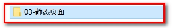 

微信端

index.html

 

前端：

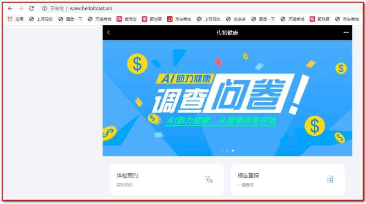 

后台：

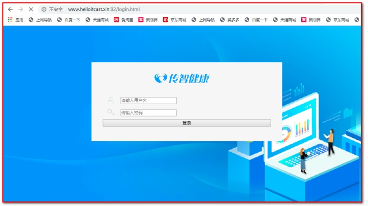 

## 1.3. **技术架构**

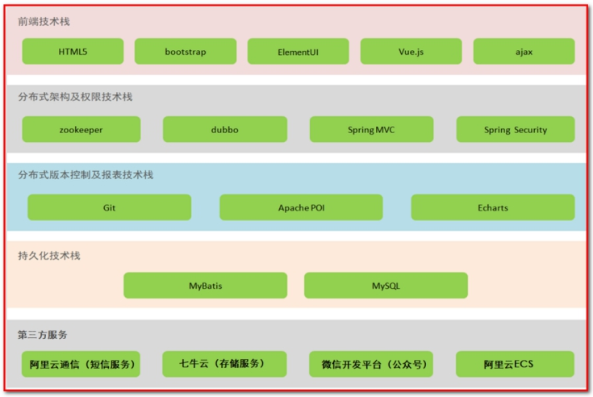 

## 1.4. **功能架构（SOA架构）**

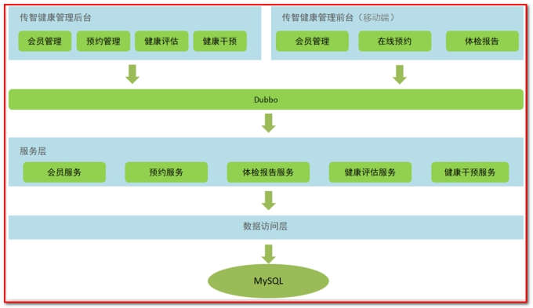 

## 1.5. **软件开发流程**

软件开发一般会经历如下几个阶段，整个过程是顺序展开，所以通常称为瀑布模型。

  

### 【小结】

1：掌握项目的功能介绍

2：项目中的2套系统

PC端管理系统（医院人员），移动端系统（客户，即体检人员）

3：技术架构

* 掌握项目开发技术

4：功能架构

* 掌握项目的业务功能

5：软件开发流程

* 瀑布模型

# 2. 环境搭建

### 【目标】

使用maven搭建系统环境

### 【路径】

0：项目结构

1：父工程health_parent

2：子工程health_common（工具类）

3：子工程health_pojo（实体类）

4：子工程health_dao（Dao类）

5：子工程health_interface（接口方法，用在dubbo数据调用）

6：子工程health_service（Service类）

7：子工程health_web（表现层）

8：测试

其中web是war项目，service是war项目，实现服务间的调用

### 【讲解】

## 2.1. **项目结构**

本项目采用maven分模块开发方式，即对整个项目拆分为几个maven工程，每个maven工程存放特定的一类代码，具体如下：

 

各模块职责定位：

health_parent：父工程，打包方式为pom，统一锁定依赖的版本，同时聚合其他子模块便于统一执行maven命令

health_common：通用模块，打包方式为jar，存放项目中使用到的一些工具类和常量类

health_pojo：打包方式为jar，存放实体类和返回结果类等

health_dao：持久层模块，打包方式为jar，存放Dao接口和Mapper映射文件等

health_interface：打包方式为jar，存放服务接口

health_service：Dubbo服务模块，打包方式为war，存放服务实现类，作为服务提供方，需要部署到tomcat运行

health_web：打包方式为war，作为Dubbo服务消费方，存放Controller、HTML页面、js、css、spring配置文件等，需要部署到tomcat运行

## 2.2. **maven项目搭建**

通过前面的项目功能架构图可以知道本项目分为传智健康管理后台和传智健康管理前台（微信端），本小节我们先搭建管理后台项目

### 2.2.1. **health_parent**

【路径】

1：创建工程

2：导入坐标

【讲解】

1：创建health_parent，父工程，打包方式为pom，用于统一管理依赖版本

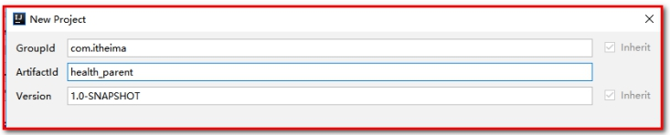 

2：pom.xml

```xml
<?xml version="1.0" encoding="UTF-8"?>
<project xmlns="http://maven.apache.org/POM/4.0.0"
         xmlns:xsi="http://www.w3.org/2001/XMLSchema-instance"
         xsi:schemaLocation="http://maven.apache.org/POM/4.0.0 http://maven.apache.org/xsd/maven-4.0.0.xsd">
    <modelVersion>4.0.0</modelVersion>

    <groupId>com.itheima</groupId>
    <artifactId>health_parent</artifactId>
    <version>1.0-SNAPSHOT</version>

    <packaging>pom</packaging>

    <!-- 集中定义依赖版本号 -->
    <properties>
        <junit.version>4.12</junit.version>
        <spring.version>5.0.5.RELEASE</spring.version>
        <pagehelper.version>4.1.4</pagehelper.version>
        <servlet-api.version>2.5</servlet-api.version>
        <dubbo.version>2.6.0</dubbo.version>
        <zookeeper.version>3.4.7</zookeeper.version>
        <zkclient.version>0.1</zkclient.version>
        <mybatis.version>3.4.5</mybatis.version>
        <mybatis.spring.version>1.3.1</mybatis.spring.version>
        <mybatis.paginator.version>1.2.15</mybatis.paginator.version>
        <mysql.version>5.1.32</mysql.version>
        <druid.version>1.0.9</druid.version>
        <commons-fileupload.version>1.3.1</commons-fileupload.version>
        <spring.security.version>5.0.5.RELEASE</spring.security.version>
        <poi.version>3.14</poi.version>
        <jedis.version>2.9.0</jedis.version>
        <quartz.version>2.2.1</quartz.version>
    </properties>
    <!-- 依赖管理标签  必须加 -->
    <dependencyManagement>
        <dependencies>
            <!-- Spring -->
            <dependency>
                <groupId>org.springframework</groupId>
                <artifactId>spring-context</artifactId>
                <version>${spring.version}</version>
            </dependency>
            <dependency>
                <groupId>org.springframework</groupId>
                <artifactId>spring-beans</artifactId>
                <version>${spring.version}</version>
            </dependency>
            <!--springmvc-->
            <dependency>
                <groupId>org.springframework</groupId>
                <artifactId>spring-web</artifactId>
                <version>${spring.version}</version>
            </dependency>
            <dependency>
                <groupId>org.springframework</groupId>
                <artifactId>spring-webmvc</artifactId>
                <version>${spring.version}</version>
            </dependency>
            <dependency>
                <groupId>org.springframework</groupId>
                <artifactId>spring-jdbc</artifactId>
                <version>${spring.version}</version>
            </dependency>
            <dependency>
                <groupId>org.springframework</groupId>
                <artifactId>spring-aspects</artifactId>
                <version>${spring.version}</version>
            </dependency>
            <dependency>
                <groupId>org.springframework</groupId>
                <artifactId>spring-jms</artifactId>
                <version>${spring.version}</version>
            </dependency>
            <dependency>
                <groupId>org.springframework</groupId>
                <artifactId>spring-context-support</artifactId>
                <version>${spring.version}</version>
            </dependency>
            <dependency>
                <groupId>org.springframework</groupId>
                <artifactId>spring-test</artifactId>
                <version>${spring.version}</version>
            </dependency>
            <!-- dubbo相关 -->
            <dependency>
                <groupId>com.alibaba</groupId>
                <artifactId>dubbo</artifactId>
                <version>${dubbo.version}</version>
            </dependency>
            <dependency>
                <groupId>org.apache.zookeeper</groupId>
                <artifactId>zookeeper</artifactId>
                <version>${zookeeper.version}</version>
            </dependency>
            <dependency>
                <groupId>com.github.sgroschupf</groupId>
                <artifactId>zkclient</artifactId>
                <version>${zkclient.version}</version>
            </dependency>
            <dependency>
                <groupId>junit</groupId>
                <artifactId>junit</artifactId>
                <version>4.12</version>
            </dependency>
            <dependency>
                <groupId>com.alibaba</groupId>
                <artifactId>fastjson</artifactId>
                <version>1.2.47</version>
            </dependency>
            <dependency>
                <groupId>javassist</groupId>
                <artifactId>javassist</artifactId>
                <version>3.12.1.GA</version>
            </dependency>
            <dependency>
                <groupId>commons-codec</groupId>
                <artifactId>commons-codec</artifactId>
                <version>1.10</version>
            </dependency>
            <!--mybatis的分页插件-->
            <dependency>
                <groupId>com.github.pagehelper</groupId>
                <artifactId>pagehelper</artifactId>
                <version>${pagehelper.version}</version>
            </dependency>
            <!-- Mybatis -->
            <dependency>
                <groupId>org.mybatis</groupId>
                <artifactId>mybatis</artifactId>
                <version>${mybatis.version}</version>
            </dependency>
            <dependency>
                <groupId>org.mybatis</groupId>
                <artifactId>mybatis-spring</artifactId>
                <version>${mybatis.spring.version}</version>
            </dependency>
            <dependency>
                <groupId>com.github.miemiedev</groupId>
                <artifactId>mybatis-paginator</artifactId>
                <version>${mybatis.paginator.version}</version>
            </dependency>
            <!-- MySql -->
            <dependency>
                <groupId>mysql</groupId>
                <artifactId>mysql-connector-java</artifactId>
                <version>${mysql.version}</version>
            </dependency>
            <!-- 连接池 -->
            <dependency>
                <groupId>com.alibaba</groupId>
                <artifactId>druid</artifactId>
                <version>${druid.version}</version>
            </dependency>
            <!-- 文件上传组件 -->
            <dependency>
                <groupId>commons-fileupload</groupId>
                <artifactId>commons-fileupload</artifactId>
                <version>${commons-fileupload.version}</version>
            </dependency>
            <!--任务调度-->
            <dependency>
                <groupId>org.quartz-scheduler</groupId>
                <artifactId>quartz</artifactId>
                <version>${quartz.version}</version>
            </dependency>
            <dependency>
                <groupId>org.quartz-scheduler</groupId>
                <artifactId>quartz-jobs</artifactId>
                <version>${quartz.version}</version>
            </dependency>
            <dependency>
                <groupId>com.sun.jersey</groupId>
                <artifactId>jersey-client</artifactId>
                <version>1.18.1</version>
            </dependency>
            <!--七牛云服务平台，第三方服务（图片上传）-->
            <dependency>
                <groupId>com.qiniu</groupId>
                <artifactId>qiniu-java-sdk</artifactId>
                <version>7.2.0</version>
            </dependency>
            <!--POI报表（EXCEL）-->
            <dependency>
                <groupId>org.apache.poi</groupId>
                <artifactId>poi</artifactId>
                <version>${poi.version}</version>
            </dependency>
            <dependency>
                <groupId>org.apache.poi</groupId>
                <artifactId>poi-ooxml</artifactId>
                <version>${poi.version}</version>
            </dependency>
            <!--redis-->
            <dependency>
                <groupId>redis.clients</groupId>
                <artifactId>jedis</artifactId>
                <version>${jedis.version}</version>
            </dependency>
            <!-- spring security安全框架 -->
            <dependency>
                <groupId>org.springframework.security</groupId>
                <artifactId>spring-security-web</artifactId>
                <version>${spring.security.version}</version>
            </dependency>
            <dependency>
                <groupId>org.springframework.security</groupId>
                <artifactId>spring-security-config</artifactId>
                <version>${spring.security.version}</version>
            </dependency>
            <dependency>
                <groupId>org.springframework.security</groupId>
                <artifactId>spring-security-taglibs</artifactId>
                <version>${spring.security.version}</version>
            </dependency>
            <dependency>
                <groupId>com.github.penggle</groupId>
                <artifactId>kaptcha</artifactId>
                <version>2.3.2</version>
                <exclusions>
                    <exclusion>
                        <groupId>javax.servlet</groupId>
                        <artifactId>javax.servlet-api</artifactId>
                    </exclusion>
                </exclusions>
            </dependency>
            <dependency>
                <groupId>dom4j</groupId>
                <artifactId>dom4j</artifactId>
                <version>1.6.1</version>
            </dependency>
            <dependency>
                <groupId>xml-apis</groupId>
                <artifactId>xml-apis</artifactId>
                <version>1.4.01</version>
            </dependency>
        </dependencies>
    </dependencyManagement>
    <dependencies>
        <dependency>
            <groupId>javax.servlet</groupId>
            <artifactId>servlet-api</artifactId>
            <version>${servlet-api.version}</version>
            <scope>provided</scope>
        </dependency>
    </dependencies>
    <build>
        <plugins>
            <!-- java编译插件 -->
            <plugin>
                <groupId>org.apache.maven.plugins</groupId>
                <artifactId>maven-compiler-plugin</artifactId>
                <version>3.2</version>
                <configuration>
                    <source>1.8</source>
                    <target>1.8</target>
                    <encoding>UTF-8</encoding>
                </configuration>
            </plugin>
        </plugins>
    </build>

</project>
```

 

### 2.2.2. **health_common**

【路径】

1：创建工程

2：导入坐标（继承父工程、导入所有jar包）

【讲解】

1：创建health_common，子工程，打包方式为jar，存放通用组件，例如工具类等

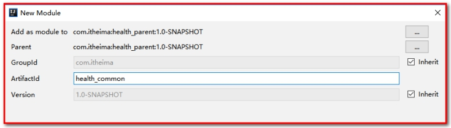 

2：pom.xml

```xml
<?xml version="1.0" encoding="UTF-8"?>
<project xmlns="http://maven.apache.org/POM/4.0.0"
         xmlns:xsi="http://www.w3.org/2001/XMLSchema-instance"
         xsi:schemaLocation="http://maven.apache.org/POM/4.0.0 http://maven.apache.org/xsd/maven-4.0.0.xsd">
    <parent>
        <artifactId>health_parent</artifactId>
        <groupId>com.itheima</groupId>
        <version>1.0-SNAPSHOT</version>
    </parent>
    <modelVersion>4.0.0</modelVersion>

    <artifactId>health_common</artifactId>

    <packaging>jar</packaging>

    <dependencies>
        <dependency>
            <groupId>com.github.pagehelper</groupId>
            <artifactId>pagehelper</artifactId>
        </dependency>
        <!-- Mybatis -->
        <dependency>
            <groupId>org.mybatis</groupId>
            <artifactId>mybatis</artifactId>
        </dependency>
        <dependency>
            <groupId>org.mybatis</groupId>
            <artifactId>mybatis-spring</artifactId>
        </dependency>
        <dependency>
            <groupId>com.github.miemiedev</groupId>
            <artifactId>mybatis-paginator</artifactId>
        </dependency>
        <!-- MySql -->
        <dependency>
            <groupId>mysql</groupId>
            <artifactId>mysql-connector-java</artifactId>
        </dependency>
        <!-- 连接池 -->
        <dependency>
            <groupId>com.alibaba</groupId>
            <artifactId>druid</artifactId>
        </dependency>
        <dependency>
            <groupId>commons-fileupload</groupId>
            <artifactId>commons-fileupload</artifactId>
        </dependency>
        <!-- Spring -->
        <dependency>
            <groupId>org.springframework</groupId>
            <artifactId>spring-context</artifactId>
        </dependency>
        <dependency>
            <groupId>org.springframework</groupId>
            <artifactId>spring-beans</artifactId>
        </dependency>
        <dependency>
            <groupId>org.springframework</groupId>
            <artifactId>spring-web</artifactId>
        </dependency>
        <dependency>
            <groupId>org.springframework</groupId>
            <artifactId>spring-webmvc</artifactId>
        </dependency>
        <dependency>
            <groupId>org.springframework</groupId>
            <artifactId>spring-jdbc</artifactId>
        </dependency>
        <dependency>
            <groupId>org.springframework</groupId>
            <artifactId>spring-aspects</artifactId>
        </dependency>
        <dependency>
            <groupId>org.springframework</groupId>
            <artifactId>spring-jms</artifactId>
        </dependency>
        <dependency>
            <groupId>org.springframework</groupId>
            <artifactId>spring-context-support</artifactId>
        </dependency>
        <dependency>
            <groupId>org.springframework</groupId>
            <artifactId>spring-test</artifactId>
        </dependency>
        <!-- dubbo相关 -->
        <dependency>
            <groupId>com.alibaba</groupId>
            <artifactId>dubbo</artifactId>
        </dependency>
        <dependency>
            <groupId>org.apache.zookeeper</groupId>
            <artifactId>zookeeper</artifactId>
        </dependency>
        <dependency>
            <groupId>com.github.sgroschupf</groupId>
            <artifactId>zkclient</artifactId>
        </dependency>
        <dependency>
            <groupId>junit</groupId>
            <artifactId>junit</artifactId>
        </dependency>
        <dependency>
            <groupId>com.alibaba</groupId>
            <artifactId>fastjson</artifactId>
        </dependency>
        <dependency>
            <groupId>javassist</groupId>
            <artifactId>javassist</artifactId>
        </dependency>
        <dependency>
            <groupId>commons-codec</groupId>
            <artifactId>commons-codec</artifactId>
        </dependency>
        <!--POI报表-->
        <dependency>
            <groupId>org.apache.poi</groupId>
            <artifactId>poi</artifactId>
        </dependency>
        <dependency>
            <groupId>org.apache.poi</groupId>
            <artifactId>poi-ooxml</artifactId>
        </dependency>
        <!--Redis-->
        <dependency>
            <groupId>redis.clients</groupId>
            <artifactId>jedis</artifactId>
        </dependency>
        <!--七牛-->
        <dependency>
            <groupId>com.qiniu</groupId>
            <artifactId>qiniu-java-sdk</artifactId>
        </dependency>
        <dependency>
            <groupId>com.sun.jersey</groupId>
            <artifactId>jersey-client</artifactId>
        </dependency>
        <!--springSecurity-->
        <dependency>
            <groupId>org.springframework.security</groupId>
            <artifactId>spring-security-web</artifactId>
        </dependency>
        <dependency>
            <groupId>org.springframework.security</groupId>
            <artifactId>spring-security-config</artifactId>
        </dependency>
        <dependency>
            <groupId>org.springframework.security</groupId>
            <artifactId>spring-security-taglibs</artifactId>
        </dependency>
    </dependencies>
</project>
```

 

### 2.2.3. **health_pojo**

【路径】

1：创建工程

2：导入坐标（继承父工程、依赖health_common）

【讲解】

1：创建health_pojo，子工程，打包方式为jar，存放POJO实体类

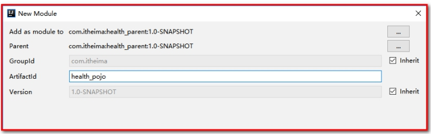 

2：pom.xml

```xml
<?xml version="1.0" encoding="UTF-8"?>
<project xmlns="http://maven.apache.org/POM/4.0.0"
         xmlns:xsi="http://www.w3.org/2001/XMLSchema-instance"
         xsi:schemaLocation="http://maven.apache.org/POM/4.0.0 http://maven.apache.org/xsd/maven-4.0.0.xsd">
    <parent>
        <artifactId>health_parent</artifactId>
        <groupId>com.itheima</groupId>
        <version>1.0-SNAPSHOT</version>
    </parent>
    <modelVersion>4.0.0</modelVersion>

    <artifactId>health_pojo</artifactId>

    <packaging>jar</packaging>
    <dependencies>
        <dependency>
            <groupId>com.itheima</groupId>
            <artifactId>health_common</artifactId>
            <version>1.0-SNAPSHOT</version>
        </dependency>
    </dependencies>
</project>
```

 

### 2.2.4. **health_dao**

【路径】

1：创建工程

2：导入坐标（继承父工程、依赖health_pojo）

3：log4j.properties

4：sqlMapConfig.xml（mybatis的配置文件）

5：applicationContext-dao.xml（spring整合mybatis）

6：接口类（后续添加实体后，再创建）

7：接口类对应的映射文件（后续添加实体后，再创建）

【讲解】

1：创建health_dao，子工程，打包方式为jar，存放Dao接口和Mybatis映射文件

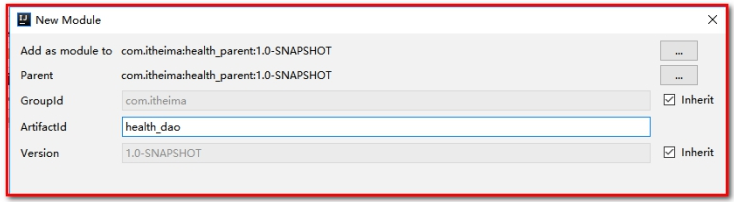 

2：pom.xml

```xml
<?xml version="1.0" encoding="UTF-8"?>
<project xmlns="http://maven.apache.org/POM/4.0.0"
         xmlns:xsi="http://www.w3.org/2001/XMLSchema-instance"
         xsi:schemaLocation="http://maven.apache.org/POM/4.0.0 http://maven.apache.org/xsd/maven-4.0.0.xsd">
    <parent>
        <artifactId>health_parent</artifactId>
        <groupId>com.itheima</groupId>
        <version>1.0-SNAPSHOT</version>
    </parent>
    <modelVersion>4.0.0</modelVersion>

    <artifactId>health_dao</artifactId>

    <packaging>jar</packaging>
    <dependencies>
        <dependency>
            <groupId>com.itheima</groupId>
            <artifactId>health_pojo</artifactId>
            <version>1.0-SNAPSHOT</version>
        </dependency>
    </dependencies>
</project>
```

 

3：log4j.properties

```properties
### direct log messages to stdout ###
log4j.appender.stdout=org.apache.log4j.ConsoleAppender
log4j.appender.stdout.Target=System.err
log4j.appender.stdout.layout=org.apache.log4j.PatternLayout
log4j.appender.stdout.layout.ConversionPattern=%d{ABSOLUTE} %5p %c{1}:%L - %m%n

### direct messages to file mylog.log ###
log4j.appender.file=org.apache.log4j.FileAppender
log4j.appender.file.File=c:\\mylog.log
log4j.appender.file.layout=org.apache.log4j.PatternLayout
log4j.appender.file.layout.ConversionPattern=%d{ABSOLUTE} %5p %c{1}:%L - %m%n

### set log levels - for more verbose logging change 'info' to 'debug' ###

log4j.rootLogger=debug, stdout
```

 

4：sqlMapConfig.xml

```xml
<?xml version="1.0" encoding="UTF-8" ?>
<!DOCTYPE configuration PUBLIC "-//mybatis.org//DTD Config 3.0//EN"
        "http://mybatis.org/dtd/mybatis-3-config.dtd">
<configuration>
    <plugins>
        <!-- com.github.pagehelper 为 PageHelper 类所在包名 -->
        <plugin interceptor="com.github.pagehelper.PageHelper">
            <!-- 设置数据库类型 Oracle,Mysql,MariaDB,SQLite,Hsqldb,PostgreSQL 六种数据库-->
            <property name="dialect" value="mysql"/>
        </plugin>
    </plugins>
</configuration>
```

【学习】：分页插件网址：<https://pagehelper.github.io/>

 

5：applicationContext-dao.xml

方式一：直接引入sqlMapConfig.xml

```xml
<?xml version="1.0" encoding="UTF-8"?>
<beans xmlns="http://www.springframework.org/schema/beans"
       xmlns:context="http://www.springframework.org/schema/context"
       xmlns:p="http://www.springframework.org/schema/p"
       xmlns:aop="http://www.springframework.org/schema/aop"
       xmlns:tx="http://www.springframework.org/schema/tx"
       xmlns:xsi="http://www.w3.org/2001/XMLSchema-instance"
       xsi:schemaLocation="http://www.springframework.org/schema/beans
                     http://www.springframework.org/schema/beans/spring-beans.xsd
                     http://www.springframework.org/schema/context
                     http://www.springframework.org/schema/context/spring-context.xsd
                     http://www.springframework.org/schema/aop
                     http://www.springframework.org/schema/aop/spring-aop.xsd
                     http://www.springframework.org/schema/tx
                     http://www.springframework.org/schema/tx/spring-tx.xsd
                     http://www.springframework.org/schema/util
                     http://www.springframework.org/schema/util/spring-util.xsd">
    
    <!--数据源-->
    <bean id="dataSource"
          class="com.alibaba.druid.pool.DruidDataSource" destroy-method="close">
        <property name="username" value="root" />
        <property name="password" value="root" />
        <property name="driverClassName" value="com.mysql.jdbc.Driver" />
        <property name="url" value="jdbc:mysql://localhost:3306/itcasthealth" />
    </bean>
    <!--spring和mybatis整合的工厂bean-->
    <bean id="sqlSessionFactory" class="org.mybatis.spring.SqlSessionFactoryBean">
        <property name="dataSource" ref="dataSource" />
        <property name="configLocation" value="classpath:sqlMapConfig.xml" />
    </bean>
    <!--批量扫描接口生成代理对象-->
    <bean class="org.mybatis.spring.mapper.MapperScannerConfigurer">
        <!--指定接口所在的包-->
        <property name="basePackage" value="com.itheima.dao" />
    </bean>
</beans>
```

方式二：或使用分页插件：

```xml
<!--SqlSessionFactoryBean-->
<bean id="sqlSessionFactoryBean" class="org.mybatis.spring.SqlSessionFactoryBean">
    <!--注入数据源-->
    <property name="dataSource" ref="dataSource" />
    <!--配置mybatis分页插件-->
    <property name="plugins">
        <array>
            <bean class="com.github.pagehelper.PageHelper">
                <property name="properties">
                    <!--使用下面的方式配置参数，一行配置一个 -->
                    <props>
                        <!--选择合适的分页方式为mysql-->
                        <prop key="dialect">mysql</prop>
                    </props>
                </property>
            </bean>
        </array>
    </property>
    <!--使用别名-->
    <property name="typeAliasesPackage" value="com.itheima.pojo"></property>
</bean>
```


### 2.2.5. **health_interface**

【路径】

1：创建工程

2：导入坐标（继承父工程，依赖health_pojo）

【讲解】

1：创建health_interface，子工程，打包方式为jar，存放服务接口，用于dubbo在服务提供者和服务消费者中使用。

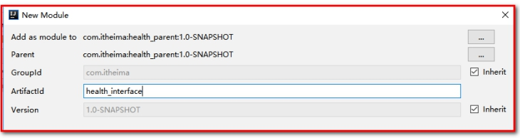 

2：pom.xml

```xml
<?xml version="1.0" encoding="UTF-8"?>
<project xmlns="http://maven.apache.org/POM/4.0.0"
         xmlns:xsi="http://www.w3.org/2001/XMLSchema-instance"
         xsi:schemaLocation="http://maven.apache.org/POM/4.0.0 http://maven.apache.org/xsd/maven-4.0.0.xsd">
    <parent>
        <artifactId>health_parent</artifactId>
        <groupId>com.itheima</groupId>
        <version>1.0-SNAPSHOT</version>
    </parent>
    <modelVersion>4.0.0</modelVersion>

    <artifactId>health_interface</artifactId>
    <packaging>jar</packaging>
    <dependencies>
        <dependency>
            <groupId>com.itheima</groupId>
            <artifactId>health_pojo</artifactId>
            <version>1.0-SNAPSHOT</version>
        </dependency>
    </dependencies>

</project>
```

 

### 2.2.6. **health_service**

【路径】

1：创建工程

2：导入坐标（继承父工程、依赖health_interface、health_dao）（war包）

3：log4j.properties

4：applicationContext-tx.xml（spring的声明式事务处理）

5：applicationContext-service.xml（spring整合dubbo，服务提供者）

6：web.xml（spring的监听器，当web容器启动的时候，自动加载spring容器）

【讲解】

1：创建health_service，子工程，打包方式为war，作为服务单独部署，存放服务类

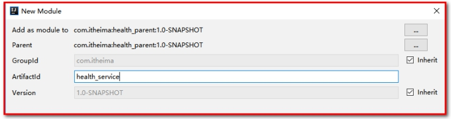 

2：pom.xml

需要设置<packaging>war</packaging>

```xml
<?xml version="1.0" encoding="UTF-8"?>
<project xmlns="http://maven.apache.org/POM/4.0.0"
         xmlns:xsi="http://www.w3.org/2001/XMLSchema-instance"
         xsi:schemaLocation="http://maven.apache.org/POM/4.0.0 http://maven.apache.org/xsd/maven-4.0.0.xsd">
    <parent>
        <artifactId>health_parent</artifactId>
        <groupId>com.itheima</groupId>
        <version>1.0-SNAPSHOT</version>
    </parent>
    <modelVersion>4.0.0</modelVersion>

    <artifactId>health_service</artifactId>
    <packaging>war</packaging>
    <dependencies>
        <dependency>
            <groupId>com.itheima</groupId>
            <artifactId>health_interface</artifactId>
            <version>1.0-SNAPSHOT</version>
        </dependency>
        <dependency>
            <groupId>com.itheima</groupId>
            <artifactId>health_dao</artifactId>
            <version>1.0-SNAPSHOT</version>
        </dependency>
    </dependencies>
    <build>
        <plugins>
            <plugin>
                <groupId>org.apache.tomcat.maven</groupId>
                <artifactId>tomcat7-maven-plugin</artifactId>
                <configuration>
                    <!-- 指定端口 -->
                    <port>81</port>
                    <!-- 请求路径 -->
                    <path>/</path>
                </configuration>
            </plugin>
        </plugins>
    </build>

</project>
```

 

3：log4j.properties

```properties
### direct log messages to stdout ###
log4j.appender.stdout=org.apache.log4j.ConsoleAppender
log4j.appender.stdout.Target=System.err
log4j.appender.stdout.layout=org.apache.log4j.PatternLayout
log4j.appender.stdout.layout.ConversionPattern=%d{ABSOLUTE} %5p %c{1}:%L - %m%n

### direct messages to file mylog.log ###
log4j.appender.file=org.apache.log4j.FileAppender
log4j.appender.file.File=c:\\mylog.log
log4j.appender.file.layout=org.apache.log4j.PatternLayout
log4j.appender.file.layout.ConversionPattern=%d{ABSOLUTE} %5p %c{1}:%L - %m%n

### set log levels - for more verbose logging change 'info' to 'debug' ###

log4j.rootLogger=debug, stdout
```

 

4：applicationContext-tx.xml

```xml
<?xml version="1.0" encoding="UTF-8"?>
<beans xmlns="http://www.springframework.org/schema/beans"
       xmlns:xsi="http://www.w3.org/2001/XMLSchema-instance"
       xmlns:context="http://www.springframework.org/schema/context"
       xmlns:tx="http://www.springframework.org/schema/tx"
       xmlns:mvc="http://www.springframework.org/schema/mvc"
       xsi:schemaLocation="http://www.springframework.org/schema/beans
                        http://www.springframework.org/schema/beans/spring-beans.xsd
                        http://www.springframework.org/schema/mvc
                        http://www.springframework.org/schema/mvc/spring-mvc.xsd
                        http://www.springframework.org/schema/tx
                        http://www.springframework.org/schema/tx/spring-tx.xsd
                        http://www.springframework.org/schema/context
                        http://www.springframework.org/schema/context/spring-context.xsd">
    <!-- 事务管理器  -->
    <bean id="transactionManager"
          class="org.springframework.jdbc.datasource.DataSourceTransactionManager">
        <property name="dataSource" ref="dataSource"/>
    </bean>
    <!--
        开启事务控制的注解支持
        注意：此处必须加入proxy-target-class="true"，
              需要进行事务控制，会由Spring框架产生代理对象，
              Dubbo需要将Service发布为服务，要求必须使用cglib创建代理对象。
    -->
    <tx:annotation-driven transaction-manager="transactionManager" proxy-target-class="true"/>
</beans>
```

 

5：applicationContext-service.xml

```xml
<?xml version="1.0" encoding="UTF-8"?>
<beans xmlns="http://www.springframework.org/schema/beans"
       xmlns:xsi="http://www.w3.org/2001/XMLSchema-instance"
       xmlns:context="http://www.springframework.org/schema/context"
       xmlns:dubbo="http://code.alibabatech.com/schema/dubbo"
       xmlns:mvc="http://www.springframework.org/schema/mvc"
       xsi:schemaLocation="http://www.springframework.org/schema/beans
                            http://www.springframework.org/schema/beans/spring-beans.xsd
                            http://www.springframework.org/schema/mvc
                            http://www.springframework.org/schema/mvc/spring-mvc.xsd
                            http://code.alibabatech.com/schema/dubbo
                            http://code.alibabatech.com/schema/dubbo/dubbo.xsd
                            http://www.springframework.org/schema/context
                            http://www.springframework.org/schema/context/spring-context.xsd">
    <!-- 指定应用名称 -->
    <dubbo:application name="health_service"/>
    <!--指定暴露服务的端口，如果不指定默认为20880-->
    <dubbo:protocol name="dubbo" port="20887"/>
    <!--指定服务注册中心地址-->
    <dubbo:registry address="zookeeper://127.0.0.1:2181"/>
    <!--批量扫描，发布服务-->
    <dubbo:annotation package="com.itheima.service"/>
</beans>
```

 

6：web.xml

```xml
<?xml version="1.0" encoding="UTF-8"?>
<web-app xmlns:xsi="http://www.w3.org/2001/XMLSchema-instance"
         xmlns="http://java.sun.com/xml/ns/javaee"
         xsi:schemaLocation="http://java.sun.com/xml/ns/javaee http://java.sun.com/xml/ns/javaee/web-app_3_0.xsd"
         id="WebApp_ID" version="3.0">
    <display-name>Archetype Created Web Application</display-name>
    <!-- 加载spring容器 ，没有*表示当前项目的根路径，有*表示依赖所有项目的根路径-->
    <context-param>
        <param-name>contextConfigLocation</param-name>
        <param-value>classpath*:applicationContext*.xml</param-value>
    </context-param>
    <listener>
        <listener-class>org.springframework.web.context.ContextLoaderListener</listener-class>
    </listener>
</web-app>
```

 

### 2.2.7. **health_web**

【路径】

1：创建工程

2：导入坐标（继承父工程、依赖health_interface）

3：log4j.properties

4：springmvc.xml（spring整合dubbo，服务消费者；springmvc的配置、上传组件）

5：web.xml（springmvc的核心控制器，当web容器启动的时候，自动加载springmvc.xml）

【讲解】

1：创建health_web，子工程，打包方式为war，单独部署，存放Controller

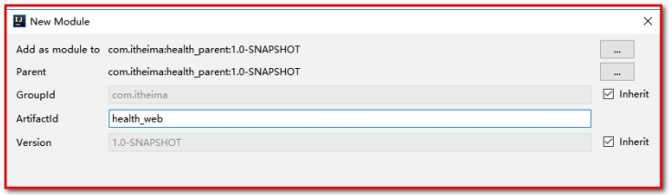 

2：pom.xml

```xml
<?xml version="1.0" encoding="UTF-8"?>
<project xmlns="http://maven.apache.org/POM/4.0.0"
         xmlns:xsi="http://www.w3.org/2001/XMLSchema-instance"
         xsi:schemaLocation="http://maven.apache.org/POM/4.0.0 http://maven.apache.org/xsd/maven-4.0.0.xsd">
    <parent>
        <artifactId>health_parent</artifactId>
        <groupId>com.itheima</groupId>
        <version>1.0-SNAPSHOT</version>
    </parent>
    <modelVersion>4.0.0</modelVersion>

    <artifactId>health_web</artifactId>
    <packaging>war</packaging>
    <dependencies>
        <dependency>
            <groupId>com.itheima</groupId>
            <artifactId>health_interface</artifactId>
            <version>1.0-SNAPSHOT</version>
        </dependency>
    </dependencies>
    <build>
        <plugins>
            <plugin>
                <groupId>org.apache.tomcat.maven</groupId>
                <artifactId>tomcat7-maven-plugin</artifactId>
                <configuration>
                    <!-- 指定端口 -->
                    <port>82</port>
                    <!-- 请求路径 -->
                    <path>/</path>
                </configuration>
            </plugin>
        </plugins>
    </build>

</project>
```

3：log4j.properties

```properties
### direct log messages to stdout ###
log4j.appender.stdout=org.apache.log4j.ConsoleAppender
log4j.appender.stdout.Target=System.err
log4j.appender.stdout.layout=org.apache.log4j.PatternLayout
log4j.appender.stdout.layout.ConversionPattern=%d{ABSOLUTE} %5p %c{1}:%L - %m%n

### direct messages to file mylog.log ###
log4j.appender.file=org.apache.log4j.FileAppender
log4j.appender.file.File=c:\\mylog.log
log4j.appender.file.layout=org.apache.log4j.PatternLayout
log4j.appender.file.layout.ConversionPattern=%d{ABSOLUTE} %5p %c{1}:%L - %m%n

### set log levels - for more verbose logging change 'info' to 'debug' ###

log4j.rootLogger=info, stdout
```

 

4：springmvc.xml

```xml
<?xml version="1.0" encoding="UTF-8"?>
<beans xmlns="http://www.springframework.org/schema/beans"
       xmlns:xsi="http://www.w3.org/2001/XMLSchema-instance"
       xmlns:context="http://www.springframework.org/schema/context"
       xmlns:dubbo="http://code.alibabatech.com/schema/dubbo"
       xmlns:mvc="http://www.springframework.org/schema/mvc"
       xsi:schemaLocation="http://www.springframework.org/schema/beans
                  http://www.springframework.org/schema/beans/spring-beans.xsd
                  http://www.springframework.org/schema/mvc
                  http://www.springframework.org/schema/mvc/spring-mvc.xsd
                  http://code.alibabatech.com/schema/dubbo
                  http://code.alibabatech.com/schema/dubbo/dubbo.xsd
                  http://www.springframework.org/schema/context
                  http://www.springframework.org/schema/context/spring-context.xsd">
    <mvc:annotation-driven>
        <mvc:message-converters register-defaults="true">
            <!--不需要视图解析器，项目中的所有的请求都返回json数据结构-->
            <bean class="com.alibaba.fastjson.support.spring.FastJsonHttpMessageConverter">
                <property name="supportedMediaTypes" value="application/json"/>
                <property name="features">
                    <list>
                        <!--Map类型格式化，接收参数允许空值-->
                        <value>WriteMapNullValue</value>
                        <!--日期类型格式化-->
                        <value>WriteDateUseDateFormat</value>
                    </list>
                </property>
            </bean>
        </mvc:message-converters>
    </mvc:annotation-driven>
    <!-- 指定应用名称 -->
    <dubbo:application name="health_web" />
    <!--指定服务注册中心地址-->
    <dubbo:registry address="zookeeper://127.0.0.1:2181"/>
    <!--批量扫描-->
    <dubbo:annotation package="com.itheima.controller" />
    <!--
        超时全局设置 10分钟
        check=false 不检查服务提供方，开发阶段建议设置为false
        check=true 启动时检查服务提供方，如果服务提供方没有启动则报错
    -->
    <dubbo:consumer timeout="600000" check="false"/>
    <!--文件上传组件-->
    <bean id="multipartResolver"
          class="org.springframework.web.multipart.commons.CommonsMultipartResolver">
        <property name="maxUploadSize" value="104857600" />
        <property name="maxInMemorySize" value="4096" />
        <property name="defaultEncoding" value="UTF-8"/>
    </bean>
</beans>
```

FastJsonHttpMessageConverter配置定义了 @ResponseBody 支持的返回类型， json对空键值的处理方式 和 统一的日期返回格式（格式：yyyy-MM-dd）

5：web.xml

```xml
<?xml version="1.0" encoding="UTF-8"?>
<web-app xmlns:xsi="http://www.w3.org/2001/XMLSchema-instance"
         xmlns="http://java.sun.com/xml/ns/javaee"
         xsi:schemaLocation="http://java.sun.com/xml/ns/javaee http://java.sun.com/xml/ns/javaee/web-app_3_0.xsd"
         id="WebApp_ID" version="3.0">
    <display-name>Archetype Created Web Application</display-name>
    <!-- 解决post乱码 -->
    <filter>
        <filter-name>CharacterEncodingFilter</filter-name>
        <filter-class>org.springframework.web.filter.CharacterEncodingFilter</filter-class>
        <init-param>
            <param-name>encoding</param-name>
            <param-value>utf-8</param-value>
        </init-param>
        <init-param>
            <param-name>forceEncoding</param-name>
            <param-value>true</param-value>
        </init-param>
    </filter>
    <filter-mapping>
        <filter-name>CharacterEncodingFilter</filter-name>
        <url-pattern>/*</url-pattern>
    </filter-mapping>
    <servlet>
        <servlet-name>springmvc</servlet-name>
        <servlet-class>org.springframework.web.servlet.DispatcherServlet</servlet-class>
        <!-- 指定加载的配置文件 ，通过参数contextConfigLocation加载 -->
        <init-param>
            <param-name>contextConfigLocation</param-name>
            <param-value>classpath:springmvc.xml</param-value>
        </init-param>
        <load-on-startup>1</load-on-startup>
    </servlet>
    <servlet-mapping>
        <servlet-name>springmvc</servlet-name>
        <url-pattern>*.do</url-pattern>
    </servlet-mapping>
</web-app>
```

 这里，我们使用<url-pattern>*.do</url-pattern>的方式，表示只拦截.do结尾的url。

搭建完成后如下：

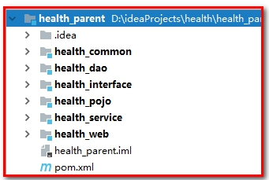 

### 2.2.8. **测试**

启动Zookeeper后，然后启动health_service和health_web

导入后台管理系统的页面(资料\07_公共资源\页面端静态资源)

### 【小结】

0：项目结构

1：父工程health_parent

2：子工程health_common（工具类）

3：子工程health_pojo（实体类）

4：子工程health_dao（Dao类）

5：子工程health_interface（接口方法，用在dubbo数据调用）

6：子工程health_service（Service类）

7：子工程health_web（表现层）

8：测试

# 3. PowerDesigner（了解）

### 【目标】

学会使用软件数据库设计工具（PowerDesigner）

### 【路径】

1：PowerDesigner介绍

2：PowerDesigner使用

（1）创建物理数据模型

（2）从PDM导出SQL脚本

（3）逆向工程：从SQL脚本导入PowerDesigner

（4）生成数据库报表文件（用于项目组存档）

### 【讲解】

## 3.1. **PowerDesigner介绍**

PowerDesigner是Sybase公司的一款软件，使用它可以方便地对系统进行分析设计，他几乎包括了数据库模型设计的全过程。利用PowerDesigner可以制作数据流程图、概念数据模型、物理数据模型、面向对象模型。

在项目设计阶段通常会使用PowerDesigner进行数据库设计。使用PowerDesigner可以更加直观的表现出数据库中表之间的关系，并且可以直接导出相应的建表语句。

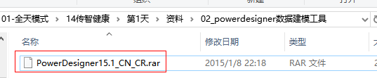 

## 3.2. **PowerDesigner使用**

### 3.2.1. **创建物理数据模型**

操作步骤：

（1）创建数据模型PDM

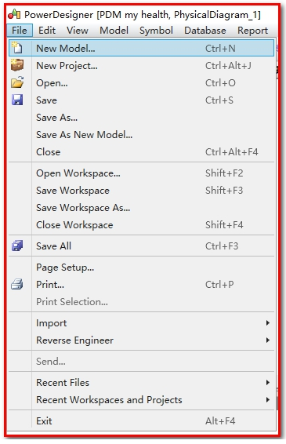 

（2）选择数据库类型

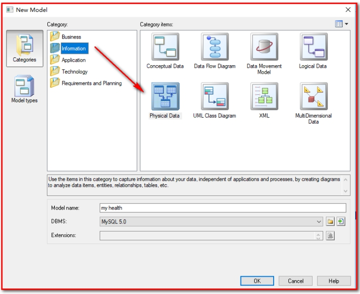 

（3）创建表和字段

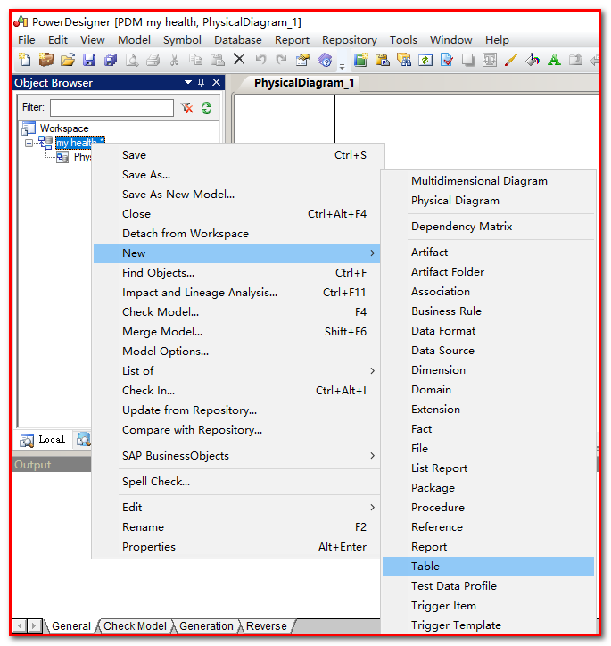 

指定表名

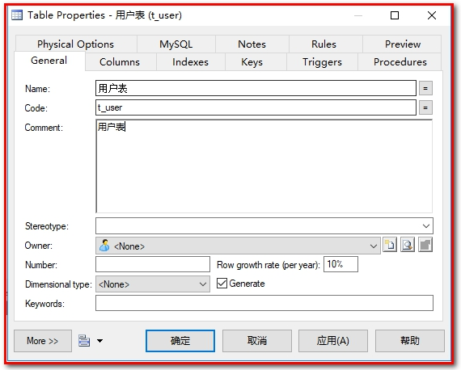 

 

创建字段

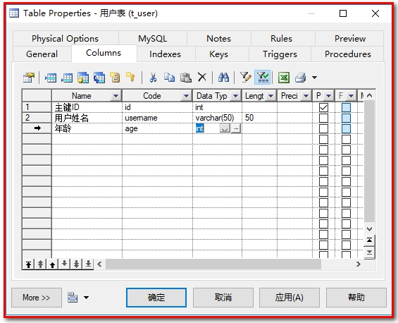 

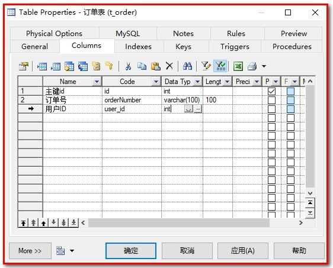 

设置某个字段属性，在字段上右键


**Identity：表示自增长**


* 添加外键约束

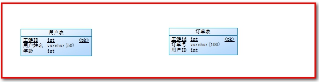 

工具栏

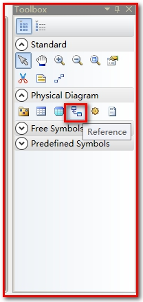 

直接拖一条直线

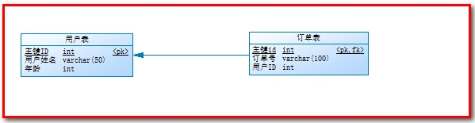 

发现问题，订单表的主键id，既是主键，也是外键。

双击外键(线)

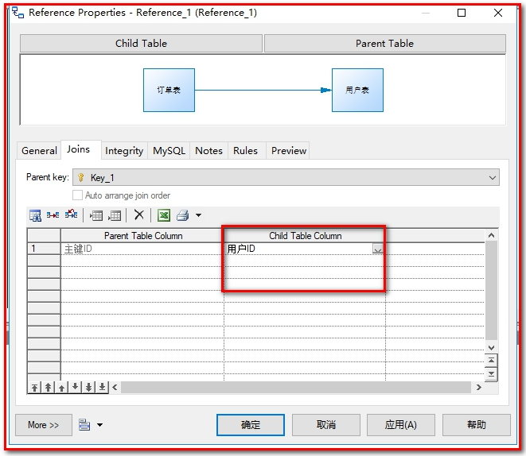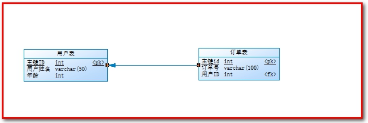 

### 3.2.2. **从PDM导出SQL脚本**

可以通过PowerDesigner设计的PDM模型导出为SQL脚本，如下：

选择Database中的Generate Database

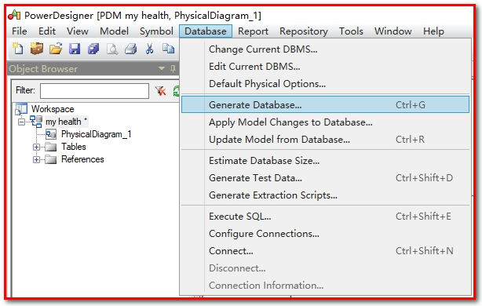 

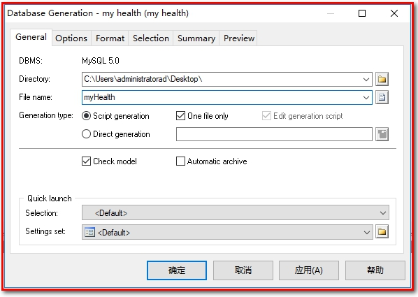 

### 3.2.3. **逆向工程(从SQL脚本导入PowerDesign)**

上面我们是首先创建PDM模型，然后通过PowerDesigner提供的功能导出SQL脚本。实际上这个过程也可以反过来，也就是我们可以通过SQL脚本逆向生成PDM模型，这称为逆向工程，操作如下：

1：从数据库中导出sql

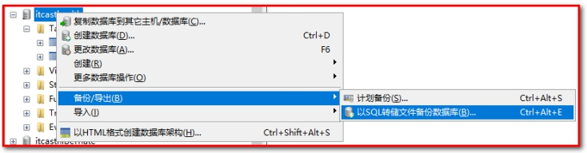 

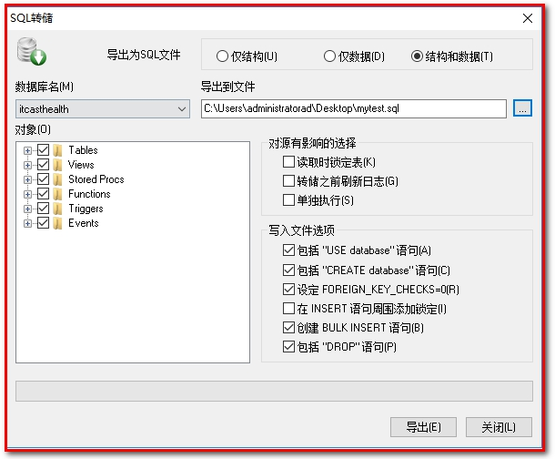 

 

2：新建一个新的模型

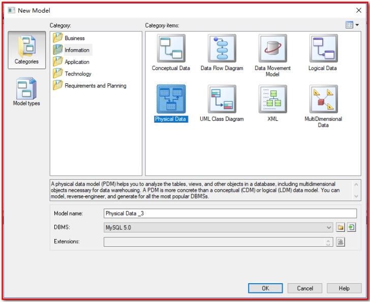 

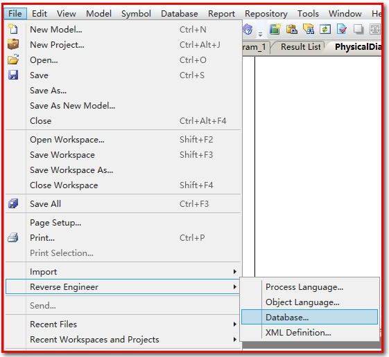 

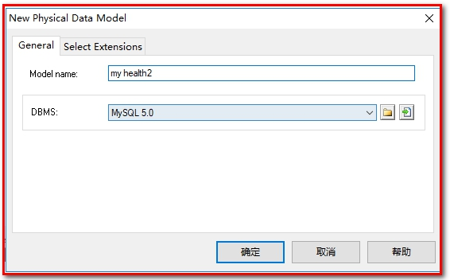 

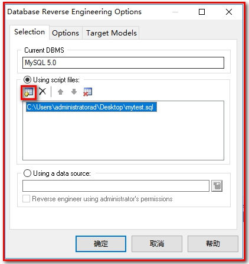 

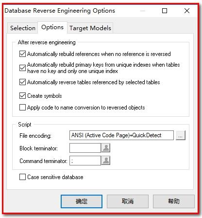 

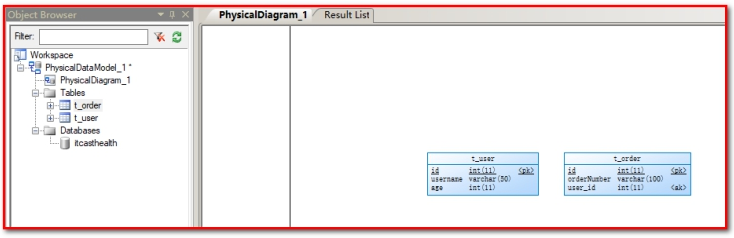 

### 3.2.4. **生成数据库报表文件**

【需求】：用于生成文档，存档，供开发、测试、运维使用

通过PowerDesigner提供的功能，可以将PDM模型生成报表文件，具体操作如下：

（1）打开报表向导窗口

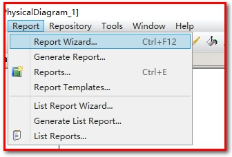 

（2）指定报表名称和语言

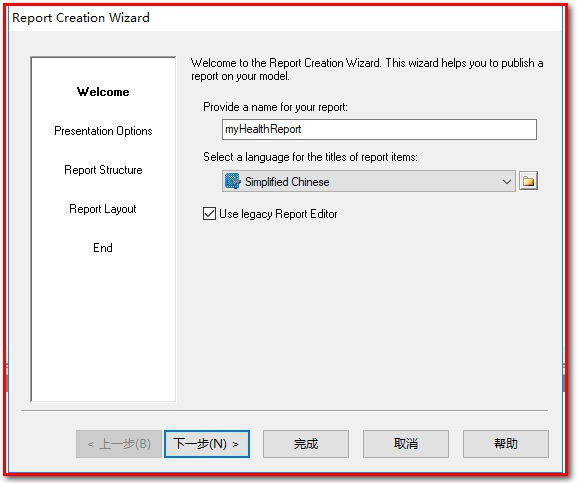 

（3）选择报表格式和样式

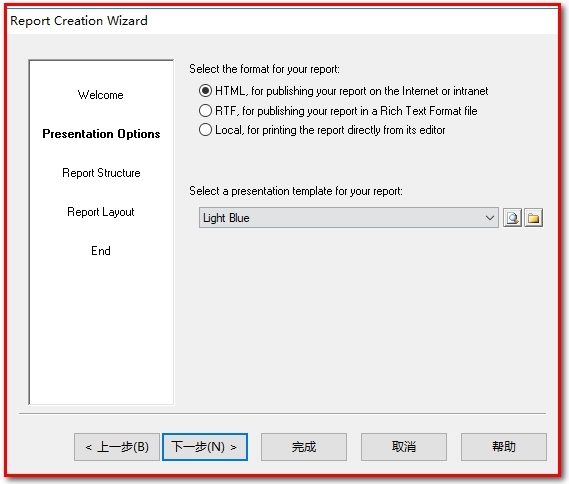 

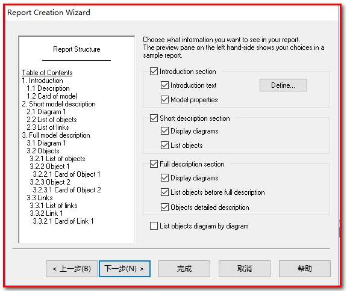 

（4）选择对象类型

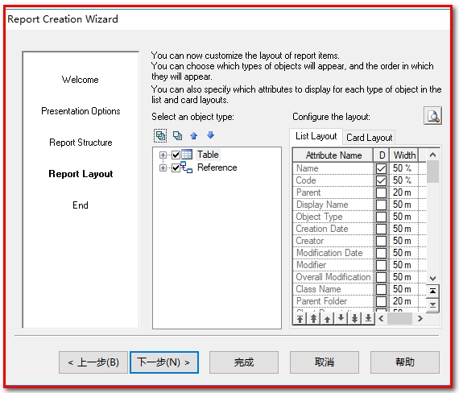 

（5）执行生成操作

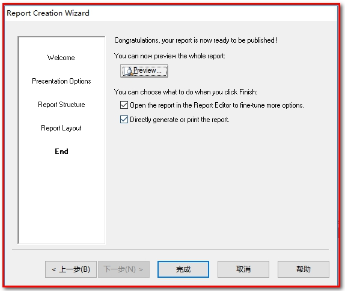 

点击完成。

打开

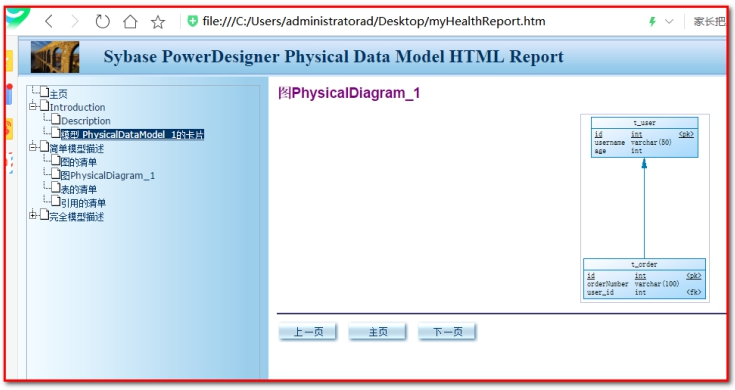 

### 【小结】

1：PowerDesigner介绍

2：PowerDesigner使用

（1）创建物理数据模型

（2）从PDM导出SQL脚本

（3）逆向工程：从SQL脚本导入PowerDesigner

（4）生成数据库报表文件（用于项目组存档）

# 4. ElementUI

### 【目标】

ElementUI介绍，及学习和使用方法

### 【路径】

1：ElementUI介绍

2：常用组件

（1）Container布局容器（用于页面布局）

（2）Dropdown下拉菜单（用于首页退出菜单）

（3）NavMenu导航菜单（用于左侧菜单）

（4）Tabel表格（用于列表展示）

（5）Pagination分页（用于列表分页展示）

（6）Message消息提示（用于保存、修改、删除的时候成功或失败提示）

（7）Tabs标签页（用于一个页面多个业务功能）

（8）Form表单（新增、修改时的表单，及表单验证）

### 【讲解】

## 4.1. **ElementUI介绍**

ElementUI是一套基于VUE2.0的桌面端组件库，ElementUI提供了丰富的组件帮助开发人员快速构建功能强大、风格统一的页面。

官网地址：[http://element-cn.eleme.io/#/zh-CN](#/zh-CN)

传智健康项目后台系统就是使用ElementUI来构建页面，在页面上引入 js 和 css 文件即可开始使用，如下：

```html
<!-- 引入ElementUI样式 -->
<link rel="stylesheet" href="https://unpkg.com/element-ui/lib/theme-chalk/index.css">

<script src="https://unpkg.com/vue/dist/vue.js"></script>
<!-- 引入ElementUI组件库 -->
<script src="https://unpkg.com/element-ui/lib/index.js"></script>
```


完成入门案例，参照HelloWorld：

el-button（按钮）和el-dialog（窗口）

```html
<!DOCTYPE html>
<html lang="en">
<head>
    <meta charset="UTF-8">
    <title>Title</title>
</head>
<!-- 引入ElementUI样式 -->
<link rel="stylesheet" href="https://unpkg.com/element-ui/lib/theme-chalk/index.css">
<script src="https://unpkg.com/vue/dist/vue.js"></script>
<!-- 引入ElementUI组件库 -->
<script src="https://unpkg.com/element-ui/lib/index.js"></script>
<body>
    <div id="app">
        <el-button type="success" @click="visible = true">Button</el-button>
        <el-dialog :visible.sync="visible" title="Hello world">
            <p>Try Element</p>
        </el-dialog>
    </div>

</body>
</html>
<script>
    new Vue({
        el: '#app',
        data: {
            visible: false
        }
    })
</script>
```

## 4.2. **常用组件**

### 4.2.1. **Container 布局容器**

用于布局的容器组件，方便快速搭建页面的基本结构：

 

<el-container>：外层容器。当子元素中包含 <el-header> 或 <el-footer> 时，全部子元素会垂直上下排列，否则会水平左右排列

<el-header>：顶栏容器

<el-aside>：侧边栏容器

<el-main>：主要区域容器

<el-footer>：底栏容器

```html
<!DOCTYPE html>
<html lang="en">
<head>
    <meta charset="UTF-8">
    <title>Title</title>
</head>
<!-- 引入ElementUI样式 -->
<link rel="stylesheet" href="https://unpkg.com/element-ui/lib/theme-chalk/index.css">
<script src="https://unpkg.com/vue/dist/vue.js"></script>
<!-- 引入ElementUI组件库 -->
<script src="https://unpkg.com/element-ui/lib/index.js"></script>
<style>
    .el-header, .el-footer {
        background-color: #B3C0D1;
        color: #333;
        text-align: center;
        line-height: 60px;
    }

    .el-aside {
        background-color: #D3DCE6;
        color: #333;
        text-align: center;
        line-height: 200px;
    }

    .el-main {
        background-color: #E9EEF3;
        color: #333;
        text-align: center;
        line-height: 160px;
    }

    body > .el-container {
        margin-bottom: 40px;
    }

    .el-container:nth-child(5) .el-aside,
    .el-container:nth-child(6) .el-aside {
        line-height: 260px;
    }

    .el-container:nth-child(7) .el-aside {
        line-height: 320px;
    }
</style>
<body>
    <div id="app">
        <el-container>
            <el-header>
                标题
            </el-header>
            <el-container>
                <el-aside width="200px">
                    菜单
                </el-aside>
                <el-container>
                    <el-main>
                        功能区域
                    </el-main>
                    <el-footer>
                        底部
                    </el-footer>
                </el-container>
            </el-container>
        </el-container>
    </div>
</body>
</html>
<script>
    new Vue({
        el:"#app"
    })
</script>
```

 

### 4.2.2. **Dropdown 下拉菜单**

将动作或菜单折叠到下拉菜单中。

- 方式一：hover激活事件


 

```html
<!DOCTYPE html>
<html lang="en">
<head>
    <meta charset="UTF-8">
    <title>Title</title>
</head>
<!-- 引入ElementUI样式 -->
<link rel="stylesheet" href="https://unpkg.com/element-ui/lib/theme-chalk/index.css">
<script src="https://unpkg.com/vue/dist/vue.js"></script>
<!-- 引入ElementUI组件库 -->
<script src="https://unpkg.com/element-ui/lib/index.js"></script>
<style>
    .el-dropdown-link {
        cursor: pointer;
        color: #409EFF;
    }
    .el-icon-arrow-down {
        font-size: 12px;
    }
</style>
<body>
    <div id="app">
        <el-dropdown>
            <span class="el-dropdown-link">
               下拉菜单<i class="el-icon-arrow-down el-icon--right"></i>
            </span>
            <el-dropdown-menu slot="dropdown">
                <el-dropdown-item>退出系统</el-dropdown-item>
                <el-dropdown-item disabled>修改密码</el-dropdown-item>
                <el-dropdown-item divided>联系管理员</el-dropdown-item>
            </el-dropdown-menu>
        </el-dropdown>
    </div>
</body>
</html>
<script>
    new Vue({
        el:"#app"
    })
</script>
```

 

- 方式二：click点击事件


 

```html
<el-dropdown trigger="click">
    <span class="el-dropdown-link">
       下拉菜单<i class="el-icon-arrow-down el-icon--right"></i>
    </span>
    <el-dropdown-menu slot="dropdown">
        <el-dropdown-item>退出系统</el-dropdown-item>
        <el-dropdown-item disabled>修改密码</el-dropdown-item>
        <el-dropdown-item divided>联系管理员</el-dropdown-item>
    </el-dropdown-menu>
</el-dropdown>
```

添加：trigger="click"

- 方式三：按钮下拉菜单


 

```html
<el-dropdown split-button trigger="click">
    <span class="el-dropdown-link">
       下拉菜单<!--<i class="el-icon-arrow-down el-icon--right"></i>-->
    </span>
    <el-dropdown-menu slot="dropdown">
        <el-dropdown-item>退出系统</el-dropdown-item>
        <el-dropdown-item disabled>修改密码</el-dropdown-item>
        <el-dropdown-item divided>联系管理员</el-dropdown-item>
    </el-dropdown-menu>
</el-dropdown>
```

添加：split-button trigger="click"

### 4.2.3. **NavMenu 导航菜单**

为网站提供导航功能的菜单。

 

```html
<!DOCTYPE html>
<html lang="en">
<head>
    <meta charset="UTF-8">
    <title>Title</title>
</head>
<!-- 引入ElementUI样式 -->
<link rel="stylesheet" href="https://unpkg.com/element-ui/lib/theme-chalk/index.css">
<script src="https://unpkg.com/vue/dist/vue.js"></script>
<!-- 引入ElementUI组件库 -->
<script src="https://unpkg.com/element-ui/lib/index.js"></script>

<body>
    <div id="app">
        <el-menu>
             <el-submenu index="1">
               <template slot="title">
                 <i class="el-icon-location"></i>
                 <span slot="title">导航一</span>
               </template>
               <el-menu-item>选项1</el-menu-item>
               <el-menu-item>选项2</el-menu-item>
               <el-menu-item>选项3</el-menu-item>
             </el-submenu>
             <el-submenu index="2">
               <template slot="title">
                 <i class="el-icon-menu"></i>
                 <span slot="title">导航二</span>
               </template>
               <el-menu-item>选项1</el-menu-item>
               <el-menu-item>选项2</el-menu-item>
               <el-menu-item>选项3</el-menu-item>
             </el-submenu>
        </el-menu>
    </div>
</body>
</html>
<script>
    new Vue({
        el:"#app"
    })
</script>
```

 

### 4.2.4. **Table 表格**

 

用于展示多条结构类似的数据，可对数据进行排序、筛选、对比或其他自定义操作。

```html
<!DOCTYPE html>
<html lang="en">
<head>
    <meta charset="UTF-8">
    <title>Title</title>
</head>
<!-- 引入ElementUI样式 -->
<link rel="stylesheet" href="https://unpkg.com/element-ui/lib/theme-chalk/index.css">
<script src="https://unpkg.com/vue/dist/vue.js"></script>
<!-- 引入ElementUI组件库 -->
<script src="https://unpkg.com/element-ui/lib/index.js"></script>

<body>
    <div id="app">
        <el-table :data="tableData" stripe>
             <el-table-column prop="date" label="日期"></el-table-column>
             <el-table-column prop="name" label="姓名"></el-table-column>
             <el-table-column prop="address" label="地址"></el-table-column>
             <el-table-column label="操作" align="center">
               <!--
        slot-scope：作用域插槽，可以获取表格数据
        scope：代表表格数据，可以通过scope.row来获取表格当前行数据，scope不是固定写法
    -->
               <template slot-scope="scope">
                 <el-button type="primary" size="mini" @click="handleUpdate(scope.row)">编辑</el-button>
                 <el-button type="danger" size="mini"  @click="handleDelete(scope.row)">删除</el-button>
               </template>
             </el-table-column>
        </el-table>

    </div>
</body>
</html>
<script>
    new Vue({
        el:'#app',
        data:{
            tableData: [{
                date: '2016-05-02',
                name: '王小虎',
                address: '上海市普陀区金沙江路 1518 弄'
            }, {
                date: '2016-05-04',
                name: '王小虎',
                address: '上海市普陀区金沙江路 1517 弄'
            }, {
                date: '2016-05-01',
                name: '王小虎',
                address: '上海市普陀区金沙江路 1519 弄'
            }]
        },
        methods:{
            handleDelete(row){
                alert(row.date);
            },
            handleUpdate(row){
                alert(row.date);
            }
        }
    });
</script>
```

其中：

```javascript
handleDelete(row){
	alert(row.date);
},
handleUpdate(row){
    alert(row.date);
}
```

为ES6的语法

修改:

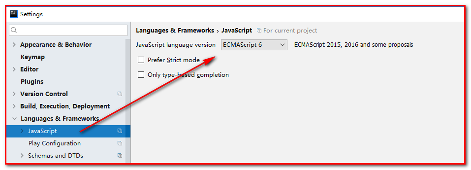

 

### 4.2.5. **Pagination 分页**

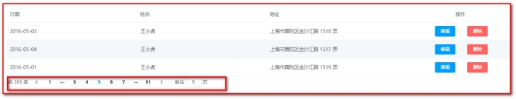 

当数据量过多时，使用分页分解数据。

```html
<!DOCTYPE html>
<html lang="en">
<head>
    <meta charset="UTF-8">
    <title>Title</title>
</head>
<!-- 引入ElementUI样式 -->
<link rel="stylesheet" href="https://unpkg.com/element-ui/lib/theme-chalk/index.css">
<script src="https://unpkg.com/vue/dist/vue.js"></script>
<!-- 引入ElementUI组件库 -->
<script src="https://unpkg.com/element-ui/lib/index.js"></script>

<body>
    <div id="app">
        <el-table :data="tableData" stripe>
             <el-table-column prop="date" label="日期"></el-table-column>
             <el-table-column prop="name" label="姓名"></el-table-column>
             <el-table-column prop="address" label="地址"></el-table-column>
             <el-table-column label="操作" align="center">
               <!--
        slot-scope：作用域插槽，可以获取表格数据
        scope：代表表格数据，可以通过scope.row来获取表格当前行数据，scope不是固定写法
    -->
               <template slot-scope="scope">
                 <el-button type="primary" size="mini" @click="handleUpdate(scope.row)">编辑</el-button>
                 <el-button type="danger" size="mini"  @click="handleDelete(scope.row)">删除</el-button>
               </template>
             </el-table-column>
        </el-table>
        <el-pagination @current-change="handleCurrentChange"
                       :current-page="5"
                       :page-size="10"
                       layout="total, prev, pager, next, jumper"
                       :total="305">
        </el-pagination>
    </div>
</body>
</html>
<script>
    new Vue({
        el:'#app',
        data:{
            tableData: [{
                date: '2016-05-02',
                name: '王小虎',
                address: '上海市普陀区金沙江路 1518 弄'
            }, {
                date: '2016-05-04',
                name: '王小虎',
                address: '上海市普陀区金沙江路 1517 弄'
            }, {
                date: '2016-05-01',
                name: '王小虎',
                address: '上海市普陀区金沙江路 1519 弄'
            }]
        },
        methods:{
            handleDelete:function(row){
                alert(row.date);
            },
            handleUpdate:function(row){
                alert(row.date);
            },
            // 当前页发生变化的时候，触发
            handleCurrentChange(page){
                alert(page);
            }
        }
    });
</script>
```

 

### 4.2.6. **Message 消息提示**

常用于主动操作后的反馈提示。

 

 

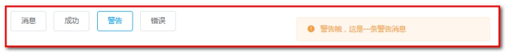 

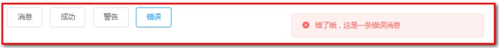 

```html
<!DOCTYPE html>
<html lang="en">
<head>
    <meta charset="UTF-8">
    <title>Title</title>
</head>
<!-- 引入ElementUI样式 -->
<link rel="stylesheet" href="https://unpkg.com/element-ui/lib/theme-chalk/index.css">
<script src="https://unpkg.com/vue/dist/vue.js"></script>
<!-- 引入ElementUI组件库 -->
<script src="https://unpkg.com/element-ui/lib/index.js"></script>

<body>
    <div id="app">
        <el-button :plain="true" @click="open1">消息</el-button>
        <el-button :plain="true" @click="open2">成功</el-button>
        <el-button :plain="true" @click="open3">警告</el-button>
        <el-button :plain="true" @click="open4">错误</el-button>
    </div>
</body>
</html>
<script>
    new Vue({
        el:'#app',
        data:{

        },
        methods: {
            open1() {
                this.$message('这是一条消息提示');
            },
            open2() {
                this.$message({
                    message: '恭喜你，这是一条成功消息',
                    type: 'success'
                });
            },
            open3() {
                this.$message({
                    message: '警告哦，这是一条警告消息',
                    type: 'warning'
                });
            },
            open4() {
                this.$message.error('错了哦，这是一条错误消息');
            }
        }
    });
</script>
```

 

### 4.2.7. **Tabs 标签页**

分隔内容上有关联但属于不同类别的数据集合。

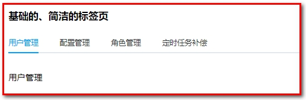 

 

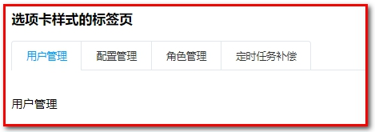 

 

 

```html
<!DOCTYPE html>
<html lang="en">
<head>
    <meta charset="UTF-8">
    <title>Title</title>
</head>
<!-- 引入ElementUI样式 -->
<link rel="stylesheet" href="https://unpkg.com/element-ui/lib/theme-chalk/index.css">
<script src="https://unpkg.com/vue/dist/vue.js"></script>
<!-- 引入ElementUI组件库 -->
<script src="https://unpkg.com/element-ui/lib/index.js"></script>

<body>
    <div id="app">
        <h3>基础的、简洁的标签页</h3>
        <!--
            通过value属性来指定当前选中的标签页
        -->
        <el-tabs value="first">
             <el-tab-pane label="用户管理" name="first">用户管理</el-tab-pane>
             <el-tab-pane label="配置管理" name="second">配置管理</el-tab-pane>
             <el-tab-pane label="角色管理" name="third">角色管理</el-tab-pane>
             <el-tab-pane label="定时任务补偿" name="fourth">定时任务补偿</el-tab-pane>
        </el-tabs>
        <h3>选项卡样式的标签页</h3>
        <el-tabs value="first" type="card">
             <el-tab-pane label="用户管理" name="first">用户管理</el-tab-pane>
             <el-tab-pane label="配置管理" name="second">配置管理</el-tab-pane>
             <el-tab-pane label="角色管理" name="third">角色管理</el-tab-pane>
             <el-tab-pane label="定时任务补偿" name="fourth">定时任务补偿</el-tab-pane>
        </el-tabs>
        <h3>卡片化的标签页</h3>
        <el-tabs value="first" type="border-card">
             <el-tab-pane label="用户管理" name="first">用户管理</el-tab-pane>
             <el-tab-pane label="配置管理" name="second">配置管理</el-tab-pane>
             <el-tab-pane label="角色管理" name="third">角色管理</el-tab-pane>
             <el-tab-pane label="定时任务补偿" name="fourth">定时任务补偿</el-tab-pane>
        </el-tabs>
    </div>
</body>
</html>
<script>
    new Vue({
        el:'#app'
    });
</script>
```

 

### 4.2.8. **Form 表单**

由输入框、选择器、单选框、多选框等控件组成，用以收集、校验、提交数据。在 Form 组件中，每一个表单域由一个 Form-Item 组件构成，表单域中可以放置各种类型的表单控件，包括 Input、Select、Checkbox、Radio、Switch、DatePicker、TimePicker。

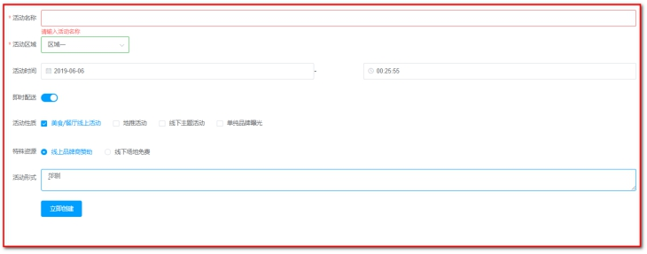 

```html
<!DOCTYPE html>
<html lang="en">
<head>
    <meta charset="UTF-8">
    <title>Title</title>
</head>
<!-- 引入ElementUI样式 -->
<link rel="stylesheet" href="https://unpkg.com/element-ui/lib/theme-chalk/index.css">
<script src="https://unpkg.com/vue/dist/vue.js"></script>
<!-- 引入ElementUI组件库 -->
<script src="https://unpkg.com/element-ui/lib/index.js"></script>

<body>
    <div id="app">
        <!--
   rules：表单验证规则
-->
        <el-form ref="form" :model="form" :rules="rules" label-width="80px">
            <!--
                prop：表单域 model 字段，在使用 validate、resetFields 方法的情况下，该属性是必填的
            -->
            <el-form-item label="活动名称" prop="name">
                <el-input v-model="form.name"></el-input>
            </el-form-item>
            <el-form-item label="活动区域" prop="region">
                <el-select v-model="form.region" placeholder="请选择活动区域">
                    <el-option label="区域一" value="shanghai"></el-option>
                    <el-option label="区域二" value="beijing"></el-option>
                </el-select>
            </el-form-item>
            <el-form-item label="活动时间">
                <el-col :span="11">
                    <el-date-picker type="date" placeholder="选择日期" v-model="form.date1" style="width: 100%;"></el-date-picker>
                </el-col>
                <el-col class="line" :span="2">-</el-col>
                <el-col :span="11">
                    <el-time-picker type="fixed-time" placeholder="选择时间" v-model="form.date2" style="width: 100%;"></el-time-picker>
                </el-col>
            </el-form-item>
            <el-form-item label="即时配送">
                <el-switch v-model="form.delivery"></el-switch>
            </el-form-item>
            <el-form-item label="活动性质">
                <el-checkbox-group v-model="form.type">
                    <el-checkbox label="美食/餐厅线上活动" name="type"></el-checkbox>
                    <el-checkbox label="地推活动" name="type"></el-checkbox>
                    <el-checkbox label="线下主题活动" name="type"></el-checkbox>
                    <el-checkbox label="单纯品牌曝光" name="type"></el-checkbox>
                </el-checkbox-group>
            </el-form-item>
            <el-form-item label="特殊资源">
                <el-radio-group v-model="form.resource">
                    <el-radio label="线上品牌商赞助"></el-radio>
                    <el-radio label="线下场地免费"></el-radio>
                </el-radio-group>
            </el-form-item>
            <el-form-item label="活动形式">
                <el-input type="textarea" v-model="form.desc"></el-input>
            </el-form-item>
            <el-form-item>
                <el-button type="primary" @click="onSubmit">立即创建</el-button>
            </el-form-item>
        </el-form>
    </div>
</body>
</html>
<script>
    new Vue({
        el:'#app',
        data:{
            form: {
                name: '',
                region: '',
                date1: '',
                date2: '',
                delivery: false,
                type: [],
                resource: '',
                desc: ''
            },
            //定义校验规则
            rules: {
                // name对应prop="name"
                name: [
                    { required: true, message: '请输入活动名称', trigger: 'blur' },
                    { min: 3, max: 5, message: '长度在 3 到 5 个字符', trigger: 'blur' }
                ],
                region: [
                    { required: true, message: '请选择活动区域', trigger: 'change' }
                ]
            }
        },
        methods:{
            onSubmit() {
                console.log(this.form);
                //validate：对整个表单进行校验的方法，参数为一个回调函数。
                //该回调函数会在校验结束后被调用，并传入两个参数：是否校验成功和未通过校验的字段。
                // $refs['form']对应el-form ref="form"
                this.$refs['form'].validate((valid) => {
                    alert(valid)
                    if (valid) {
                        alert('submit!'); //ajax提交，完成保存/更新
                    } else {
                        console.log('error submit!!');
                        return false;
                    }
                });
            }
        }
    });
</script>
```

 

作业：

删除的时候，用到

 

实现一个删除的确认

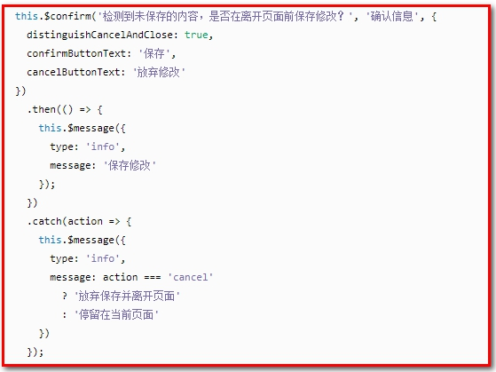 

### 【小结】


1：ElementUI介绍

ElementUI是一套基于VUE2.0的桌面端组件库，ElementUI提供了丰富的组件帮助开发人员快速构建功能强大、风格统一的页面。

2：常用组件

（1）Container布局容器（用于页面布局）

（2）Dropdown下拉菜单（用于首页退出菜单）

（3）NavMenu导航菜单（用于左侧菜单）

（4）Tabel表格（用于列表展示）

（5）Pagination分页（用于列表分页展示）

（6）Message消息提示（用于保存、修改、删除的时候成功或失败提示）

（7）Tabs标签页（用于一个页面多个业务功能）

（8）Form表单（新增、修改时的表单，及表单验证）

【学习方法】

看官网，看案例，根据需求复制、粘贴、改（将复杂的代码简单化），看效果。


# 5. 项目需求分析

### 【目标】

1：传智健康项目的业务需求

2：课程中需完成的业务需求

### 【路径】

1：传智健康管理系统是一款应用于健康管理机构的业务系统

2：系统分为传智健康后台管理系统和移动端应用两部分

3：后台系统和移动端应用都会通过Dubbo调用服务层发布的服务来完成具体的操作。本项目属于典型的SOA架构形式

### 【讲解】

## 5.1. 传智健康项目架构图

​	传智健康管理系统是一款应用于健康管理机构的业务系统，实现健康管理机构工作内容可视化、患者管理专业化、健康评估数字化、健康干预流程化、知识库集成化，从而提高健康管理师的工作效率，加强与患者间的互动，增强管理者对健康管理机构运营情况的了解。

​	系统分为传智健康后台管理系统和移动端应用两部分。其中后台系统提供给健康管理机构内部人员（包括系统管理员、健康管理师等）使用，微信端应用提供给健康管理机构的用户（体检用户）使用。

本项目功能架构图：

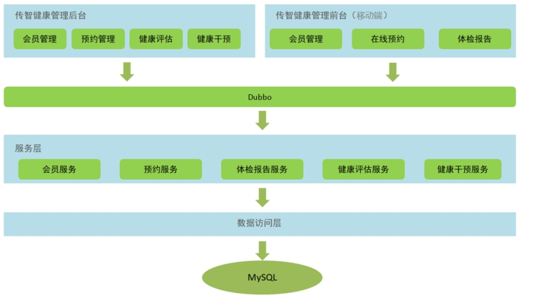 

​	通过上面的功能架构图可以看到，传智健康后台管理系统有会员管理、预约管理、健康评估、健康干预等功能。移动端有会员管理、体检预约、体检报告等功能。后台系统和移动端应用都会通过Dubbo调用服务层发布的服务来完成具体的操作。本项目属于典型的SOA架构形式。

​	本章节完成的功能开发是预约管理功能，包括检查项管理（身高，体重）、检查组管理（外科）、体检套餐管理（公司健康体检）、预约设置等（参见产品原型）。预约管理属于系统的基础功能，主要就是管理一些体检的基础数据。

### 【小结】

​	系统分为传智健康后台管理系统和移动端应用两部分。其中后台系统提供给健康管理机构内部人员（包括系统管理员、健康管理师等）使用，微信端应用提供给健康管理机构的用户（体检用户）使用。

​	传智健康后台管理系统有会员管理、预约管理、健康评估、健康干预等功能。移动端有会员管理、体检预约、体检报告等功能

​	本项目属于典型的SOA架构形式，服务调用使用Dubbo。

# 6. 完善基础环境搭建

### 【目标】

基础环境搭建

### 【路径】

1：导入项目所需模块数据表

2：导入项目所需模块实体类

3：导入项目所需公共资源

### 【讲解】

## 6.1. **导入项目所需模块数据表**

操作步骤：

（1）根据资料中提供的itcastpdm文件导出SQL脚本

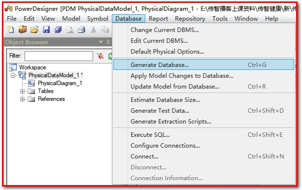 

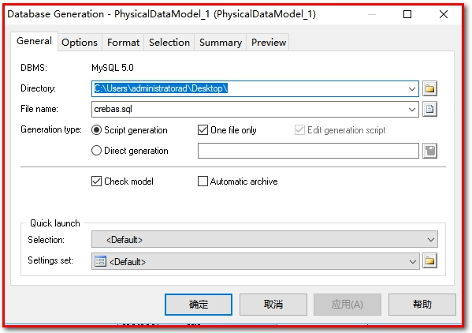 

（2）在SQLYog中，执行crebas.sql

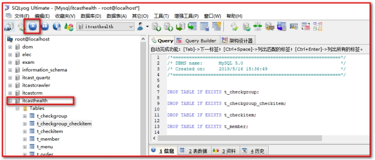 

## 6.2. **导入项目所需模块实体类**

将资料中提供的POJO实体类复制到health_pojo工程中。

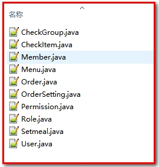 

 

## 6.3. **导入项目所需公共资源**

项目开发过程中一般会提供一些公共资源，供多个模块或者系统来使用。

本章节我们导入的公共资源有：

（1）返回消息常量类MessageConstant.java，放到health_common工程中

```properties
package com.itheima.constant;

/**
 * 消息常量
 */
public class MessageConstant {
    public static final String DELETE_CHECKITEM_FAIL = "删除检查项失败";
    public static final String DELETE_CHECKITEM_SUCCESS = "删除检查项成功";
    public static final String ADD_CHECKITEM_SUCCESS = "新增检查项成功";
    public static final String ADD_CHECKITEM_FAIL = "新增检查项失败";
    public static final String EDIT_CHECKITEM_FAIL = "编辑检查项失败";
    public static final String EDIT_CHECKITEM_SUCCESS = "编辑检查项成功";
    public static final String QUERY_CHECKITEM_SUCCESS = "查询检查项成功";
    public static final String QUERY_CHECKITEM_FAIL = "查询检查项失败";
    public static final String UPLOAD_SUCCESS = "上传成功";
    public static final String ADD_CHECKGROUP_FAIL = "新增检查组失败";
    public static final String ADD_CHECKGROUP_SUCCESS = "新增检查组成功";
    public static final String DELETE_CHECKGROUP_FAIL = "删除检查组失败";
    public static final String DELETE_CHECKGROUP_SUCCESS = "删除检查组成功";
    public static final String QUERY_CHECKGROUP_SUCCESS = "查询检查组成功";
    public static final String QUERY_CHECKGROUP_FAIL = "查询检查组失败";
    public static final String EDIT_CHECKGROUP_FAIL = "编辑检查组失败";
    public static final String EDIT_CHECKGROUP_SUCCESS = "编辑检查组成功";
    public static final String PIC_UPLOAD_SUCCESS = "图片上传成功";
    public static final String PIC_UPLOAD_FAIL = "图片上传失败";
    public static final String ADD_SETMEAL_FAIL = "新增套餐失败";
    public static final String ADD_SETMEAL_SUCCESS = "新增套餐成功";
    public static final String IMPORT_ORDERSETTING_FAIL = "批量导入预约设置数据失败";
    public static final String IMPORT_ORDERSETTING_SUCCESS = "批量导入预约设置数据成功";
    public static final String GET_ORDERSETTING_SUCCESS = "获取预约设置数据成功";
    public static final String GET_ORDERSETTING_FAIL = "获取预约设置数据失败";
    public static final String ORDERSETTING_SUCCESS = "预约设置成功";
    public static final String ORDERSETTING_FAIL = "预约设置失败";
    public static final String ADD_MEMBER_FAIL = "新增会员失败";
    public static final String ADD_MEMBER_SUCCESS = "新增会员成功";
    public static final String DELETE_MEMBER_FAIL = "删除会员失败";
    public static final String DELETE_MEMBER_SUCCESS = "删除会员成功";
    public static final String EDIT_MEMBER_FAIL = "编辑会员失败";
    public static final String EDIT_MEMBER_SUCCESS = "编辑会员成功";
    public static final String TELEPHONE_VALIDATECODE_NOTNULL = "手机号和验证码都不能为空";
    public static final String LOGIN_SUCCESS = "登录成功";
    public static final String VALIDATECODE_ERROR = "验证码输入错误";
    public static final String QUERY_ORDER_SUCCESS = "查询预约信息成功";
    public static final String QUERY_ORDER_FAIL = "查询预约信息失败";
    public static final String QUERY_SETMEALLIST_SUCCESS = "查询套餐列表数据成功";
    public static final String QUERY_SETMEALLIST_FAIL = "查询套餐列表数据失败";
    public static final String QUERY_SETMEAL_SUCCESS = "查询套餐数据成功";
    public static final String QUERY_SETMEAL_FAIL = "查询套餐数据失败";
    public static final String SEND_VALIDATECODE_FAIL = "验证码发送失败";
    public static final String SEND_VALIDATECODE_SUCCESS = "验证码发送成功";
    public static final String SELECTED_DATE_CANNOT_ORDER = "所选日期不能进行体检预约";
    public static final String ORDER_FULL = "预约已满";
    public static final String HAS_ORDERED = "已经完成预约，不能重复预约";
    public static final String ORDER_SUCCESS = "预约成功";
    public static final String GET_USERNAME_SUCCESS = "获取当前登录用户名称成功";
    public static final String GET_USERNAME_FAIL = "获取当前登录用户名称失败";
    public static final String GET_MENU_SUCCESS = "获取当前登录用户菜单成功";
    public static final String GET_MENU_FAIL = "获取当前登录用户菜单失败";
    public static final String GET_MEMBER_NUMBER_REPORT_SUCCESS = "获取会员统计数据成功";
    public static final String GET_MEMBER_NUMBER_REPORT_FAIL = "获取会员统计数据失败";
    public static final String GET_SETMEAL_COUNT_REPORT_SUCCESS = "获取套餐统计数据成功";
    public static final String GET_SETMEAL_COUNT_REPORT_FAIL = "获取套餐统计数据失败";
    public static final String GET_BUSINESS_REPORT_SUCCESS = "获取运营统计数据成功";
    public static final String GET_BUSINESS_REPORT_FAIL = "获取运营统计数据失败";
    public static final String GET_SETMEAL_LIST_SUCCESS = "查询套餐列表数据成功";
    public static final String GET_SETMEAL_LIST_FAIL = "查询套餐列表数据失败";
}
```

 

（2）返回结果Result和PageResult类，放到health_pojo工程中

【1】Result.java

处理响应结果集

```java
package com.itheima.entity;

import java.io.Serializable;

/**
 * 封装返回结果
 */
public class Result implements Serializable{
    private boolean flag;//执行结果，true为执行成功 false为执行失败
    private String message;//返回结果信息
    private Object data;//返回数据
    public Result(boolean flag, String message) { // 保存、修改保存
        super();
        this.flag = flag;
        this.message = message;
    }

    public Result(boolean flag, String message, Object data) {// 查询回显
        this.flag = flag;
        this.message = message;
        this.data = data;
    }

    public boolean isFlag() {
        return flag;
    }
    public void setFlag(boolean flag) {
        this.flag = flag;
    }
    public String getMessage() {
        return message;
    }
    public void setMessage(String message) {
        this.message = message;
    }

    public Object getData() {
        return data;
    }

    public void setData(Object data) {
        this.data = data;
    }
}
```

【2】PageResult.java

处理分页列表结果集。

```java
package com.itheima.entity;

import java.io.Serializable;
import java.util.List;

/**
 * 分页结果封装对象
 */
public class PageResult implements Serializable{
    private Long total;//总记录数
    private List rows;//当前页结果
    public PageResult(Long total, List rows) {
        super();
        this.total = total;
        this.rows = rows;
    }
    public Long getTotal() {
        return total;
    }
    public void setTotal(Long total) {
        this.total = total;
    }
    public List getRows() {
        return rows;
    }
    public void setRows(List rows) {
        this.rows = rows;
    }
}
```

 

 

（3）封装查询条件的QueryPageBean类，放到health_pojo工程中

用于封装查询条件

```java
package com.itheima.entity;

import java.io.Serializable;

/**
 * 封装查询条件
 */
public class QueryPageBean implements Serializable{
    private Integer currentPage;//页码
    private Integer pageSize;//每页记录数
    private String queryString;//查询条件

    public Integer getCurrentPage() {
        return currentPage;
    }

    public void setCurrentPage(Integer currentPage) {
        this.currentPage = currentPage;
    }

    public Integer getPageSize() {
        return pageSize;
    }

    public void setPageSize(Integer pageSize) {
        this.pageSize = pageSize;
    }

    public String getQueryString() {
        return queryString;
    }

    public void setQueryString(String queryString) {
        this.queryString = queryString;
    }
}
```

（4）html、js、css、图片等静态资源，放到health_web工程中

 

1：安装health_parent

2：启动health_web（tomcat7:run）

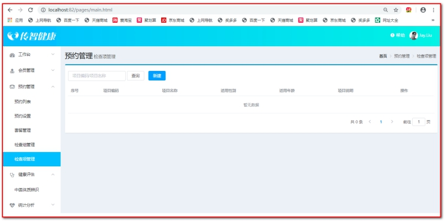 

3.main.html页面介绍

* 使用ElementUI

注意：后续随着项目开发还会陆续导入其他一些公共资源。

### 【小结】

1：导入项目所需模块数据表

2：导入项目所需模块实体类

 

其中CheckItem.java表示检查项（后续开发内容）。

3：导入项目所需公共资源

（1）MessageConstant.java：返回消息常量类

（2）Result.java：处理响应结果集

（3）PageResult.java：处理分页列表结果集。

（4）QueryPageBean.java：封装分页查询条件

# 7. 查询检查项（不分页）

### 【目标】

1：查询所有检查项（elementUI+vuejs+axios）

2：熟悉查询功能中的响应数据

3：检查项查询功能实现

### 【路径】

1：前台代码

（1）定义模型数据

（2）定义查询方法

- 使用钩子函数，初始化数据

2：后台代码

（1）CheckItemController.java

（2）CheckItemService.java（服务接口）

（3）CheckItemServiceImpl.java（服务实现类）

（4）CheckItemDao.java（Dao接口）

（5）CheckItemDao.xml（Mapper映射文件）


### 【讲解】

本项目所有分页功能都是基于ajax的异步请求来完成的，请求参数和后台响应数据格式都使用json数据格式。

后台响应数据包括Result对象(falg,message,data)。data可以存放List<Checkitem>

响应数据的json格式为：

{flag:true,message:"查询检查项成功",data:[{id:1,code:"",name:""},{id2,code:"",name:""}]}

 

## 7.1. 前台代码

### 7.1.1. 定义模型数据

因为使用vue开发，需要定义模型

```json
dataList: [],//当前页要展示的列表数据
```

 

### 7.1.2. **定义初始化方法**

在页面中提供了findPage方法用于查询，为了能够在checkitem.html页面加载后直接可以展示数据，可以在VUE提供的钩子函数created中调用findPage方法

```javascript
//钩子函数，VUE对象初始化完成后自动执行
created() {
    this.findPage();
},
```

 调用查询方法

```javascript
//查询
findPage() {
    axios.post("/checkitem/findAll.do").then((response)=>{
        if(response.data.flag){
            this.$message({
                type:"success",
                message:response.data.message
            })
        	this.dataList = response.data.data;
      	}else{
        	this.$message.error(response.data.message);
      	}
    }).catch((error)=>{

    })
},
```

## 7.2. **后台代码**

### 7.2.1. **Controller**

在CheckItemController中增加分页查询方法

```java
@RestController
@RequestMapping(value = "/checkitem")
public class CheckItemController {

    @Reference
    CheckItemService checkItemService;

    // 查询所有检查项
    @RequestMapping(value = "/findAll")
    public Result findCheckItemList(){
        List<CheckItem> list = checkItemService.findAll();
        if(list!=null && list.size()>0){
            return new Result(true, MessageConstant.QUERY_CHECKITEM_SUCCESS,list);
        }else{
            return new Result(false, MessageConstant.QUERY_CHECKITEM_FAIL);
        }
    }
}
```

 

### 7.2.2. **服务接口**

在CheckItemService服务接口中扩展查询方法

```java
public interface CheckItemService {
  
    List<CheckItem> findAll();
}
```

 

### 7.2.3. **服务实现类**

在CheckItemServiceImpl服务实现类中实现查询方法。

```java
@Service(interfaceClass = CheckItemService.class)
@Transactional
public class CheckItemServiceImpl implements CheckItemService {

    @Autowired
    CheckItemDao checkItemDao;
  
    @Override
    public List<CheckItem> findAll() {
        return checkItemDao.findAll();
    }
}

```

### 7.2.4. **Dao接口**

在CheckItemDao接口中扩展查询方法 

```java
public interface CheckItemDao {
    List<CheckItem> findAll();
}
```

 

### 7.2.5. **Mapper映射文件**

在CheckItemDao.xml文件中增加SQL定义

```xml
<?xml version="1.0" encoding="utf-8" ?>
<!DOCTYPE mapper PUBLIC "-//mybatis.org//DTD Mapper 3.0//EN"
        "http://mybatis.org/dtd/mybatis-3-mapper.dtd" >
<mapper namespace="com.itheima.dao.CheckItemDao">
    <!--查询所有-->
    <select id="findAll" resultType="checkitem">
        select * from t_checkitem
    </select>
</mapper>
```

### 【小结】

1：前台代码

（1）定义查询相关模型数据

（2）定义初始化方法，查询所有

- 使用钩子函数，初始化数据

2：后台代码

（1）CheckItemController.java

（2）CheckItemService.java（服务接口）

（3）CheckItemServiceImpl.java（服务实现类）

（4）ckItemDao.java（Dao接口）

（5）CheckItemDao.xml（Mapper映射文件）

```sql
    <!--查询所有-->
    <select id="findAll" resultType="checkitem">
        select * from t_checkitem
    </select>
```

