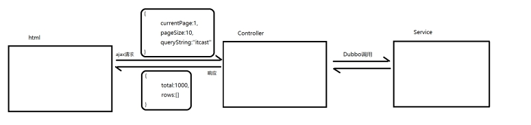
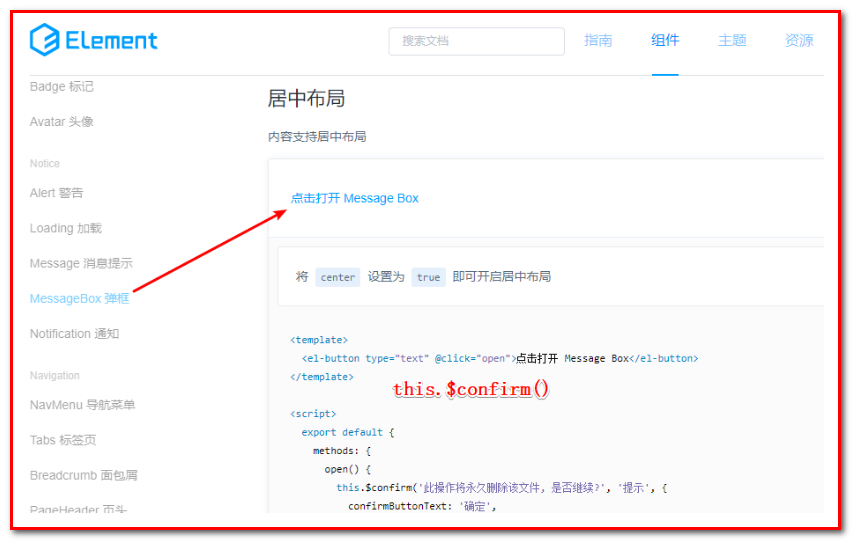

# 第2章 预约管理-检查项、检查组管理

学习目标：

- 掌握新增检查项实现过程

- 掌握检查项分页查询实现过程

- 掌握删除检查项实现过程

- 掌握编辑检查项实现过程

- 掌握新增检查组实现过程

- 掌握检查组分页查询实现过程

- 掌握删除检查组实现过程

- 掌握编辑检查组实现过程


# 1. 新增检查项

​	本章节完成的功能开发是预约管理功能，包括检查项管理（身高，体重）、检查组管理（外科）、体检套餐管理（公司健康体检）、预约设置等（参见产品原型）。预约管理属于系统的基础功能，主要就是管理一些体检的基础数据。

### 【目标】

新增检查项

### 【路径】

1：前台代码

（1）弹出新增窗口

（2）输入校验

（3）提交表单数据

 * ajax提交

```javascript
axios.post("/checkitem/add.do",this.formData).then((response)=> {

})
```

2：后台代码

（1）CheckItemController.java

（2）CheckItemService.java（服务接口）

（3）CheckItemServiceImpl.java（服务实现类）

（4）CheckItemDao.java（Dao接口）

（5）CheckItemDao.xml（Mapper映射文件）

### 【讲解】

## 1.1. **前台代码**

检查项管理页面对应的是**checkitem.html**页面，根据产品设计的原型已经完成了页面基本结构的编写，现在需要完善页面动态效果。


### 1.1.1. **弹出新增窗口**

页面中已经提供了`新增窗口`，只是`处于隐藏状态`。只需要将控制展示状态的属性dialogFormVisible改为true就可以显示出新增窗口。

新建按钮绑定的方法为handleCreate，所以在handleCreate方法中修改dialogFormVisible属性的值为true即可。同时为了增加用户体验度，需要每次点击新建按钮时清空表单输入项。

```javascript
// 重置表单
resetForm() {
    //将表单的设置为空就是重置
    this.formData = {};
},
// 弹出添加窗口
handleCreate() {
   //重置表单
   this.resetForm()
   //开启添加窗口
   this.dialogFormVisible = true;
},
```

 

### 1.1.2. 输入校验

```json
rules: {//校验规则
    code: [{ required: true, message: '项目编码为必填项', trigger: 'blur' }],
    name: [{ required: true, message: '项目名称为必填项', trigger: 'blur' }]
}
```

 

### 1.1.3. **提交表单数据**

点击新增窗口中的确定按钮时，触发handleAdd方法，所以需要在handleAdd方法中进行完善。

```javascript
//添加
handleAdd () {
    //校验表单输入项是否合法
    this.$refs['dataAddForm'].validate((valid) => {
        if (valid) {
            //表单数据校验通过，发送ajax请求将表单数据提交到后台
            axios.post("/checkitem/add.do",this.formData).then((response)=> {
                //隐藏新增窗口
                this.dialogFormVisible = false;
                //判断后台返回的flag值，true表示添加操作成功，false为添加操作失败
                if(response.data.flag){
                    this.$message({
                        message: response.data.message,
                        type: 'success'
                    });
                }else{
                    this.$message.error(response.data.message);
                }
            }).finally(()=> {
                // 刷新列表数据
                this.findPage();
            });
        } else {
            this.$message.error("表单数据校验失败");
            return false;
        }
    });
},
//分页查询
findPage() {
},
```

 对提示消息的优化

```html
//判断后台返回的flag值,true标识添加操作成功,false为添加操作失败
this.$message({
    //返回的提示
    message: response.data.message,
    //要三元表达式来判断是否成功
    type: response.data.flag?'success':'error'
});
```


## 1.2. **后台代码**

### 1.2.1. **Controller**

在health_web工程中创建CheckItemController

```java
package com.itheima.controller;

import com.alibaba.dubbo.config.annotation.Reference;
import com.itheima.constant.MessageConstant;
import com.itheima.entity.Result;
import com.itheima.pojo.CheckItem;
import com.itheima.service.CheckItemService;
import org.springframework.web.bind.annotation.RequestBody;
import org.springframework.web.bind.annotation.RequestMapping;
import org.springframework.web.bind.annotation.RestController;
/**
 * 体检检查项管理
 */
@RestController
@RequestMapping("/checkitem")
public class CheckItemController {
    @Reference
    private CheckItemService checkItemService;

    //新增
    @RequestMapping("/add")
    public Result add(@RequestBody CheckItem checkItem){
        try {
            checkItemService.add(checkItem);
        }catch (Exception e){
            return new Result(false, MessageConstant.ADD_CHECKITEM_FAIL);
        }
        return new Result(true,MessageConstant.ADD_CHECKITEM_SUCCESS);
    }
}
```

 

### 1.2.2. **服务接口**

在health_interface工程中创建CheckItemService接口

```java
package com.itheima.service;

import com.itheima.pojo.CheckItem;
/**
 * 检查项服务接口
 */
public interface CheckItemService {
    void add(CheckItem checkItem);
}
```


### 1.2.3. **服务实现类**

在health_service工程中创建CheckItemServiceImpl实现类

```java
package com.itheima.service;

import com.alibaba.dubbo.config.annotation.Service;
import com.itheima.dao.CheckItemDao;
import com.itheima.pojo.CheckItem;
import org.springframework.beans.factory.annotation.Autowired;
import org.springframework.transaction.annotation.Transactional;

/**
 * 检查项服务
 */
@Service(interfaceClass = CheckItemService.class)
@Transactional
public class CheckItemServiceImpl implements CheckItemService {
    
    //注入dao
    @Autowired
    private CheckItemDao checkItemDao;
    
    /**
     * 体检检查项管理:添加功能
     * @param checkItem 添加的参数
     */
    @Override
    public void add(CheckItem checkItem) {
        checkitheDao.add(checkItem);
    }
}
```

 

### 1.2.4. **Dao接口**

在health_dao工程中创建CheckItemDao接口，本项目是基于Mybatis的Mapper代理技术实现持久层操作，故只需要提供接口和Mapper映射文件，无须提供实现类

```java
package com.itheima.dao;

import com.itheima.pojo.CheckItem;
/**
 * 持久层Dao接口
 */
@Repository
public interface CheckItemDao {
    public void add(CheckItem checkItem);
}
```

 

### 1.2.5. **Mapper映射文件**

在health_dao工程中创建CheckItemDao.xml映射文件，需要和CheckItemDao接口在同一目录下

```xml
<?xml version="1.0" encoding="UTF-8" ?>
<!DOCTYPE mapper PUBLIC "-//mybatis.org//DTD Mapper 3.0//EN"
        "http://mybatis.org/dtd/mybatis-3-mapper.dtd" >
<mapper namespace="com.itheima.dao.CheckItemDao">
    <!--新增-->
    <insert id="add" parameterType="com.itheima.pojo.CheckItem">
        insert into t_checkitem(code,name,sex,age,price,type,remark,attention)
        values
        (#{code},#{name},#{sex},#{age},#{price},#{type},#{remark},#{attention})
    </insert>
</mapper>
```

###  【小结】

1：前台代码

（1）弹出新增窗口

只需要将控制展示状态的属性dialogFormVisible改为true就可以显示出新增窗口。

（2）输入校验（了解）

使用 ElementUI的Form表单校验

（3）提交表单数据

- ajax提交

```javascript
axios.post("/checkitem/add.do",this.formData).then((response)=> {

})
```

2：后台代码

（1）CheckItemController.java

（2）CheckItemService.java（服务接口）

（3）CheckItemServiceImpl.java（服务实现类）

（4）CheckItemDao.java（Dao接口）

（5）CheckItemDao.xml（Mapper映射文件）

# 2. 检查项分页

### 【目标】

1：熟悉分页功能中的请求参数

2：熟悉分页功能中的响应数据

3：检查项分页功能实现

### 【路径】

1：前台代码

（1）定义分页相关模型数据

（2）定义分页方法

* 使用钩子函数，初始化数据

（3）完善分页方法执行时机

2：后台代码

（1）CheckItemController.java

（2）CheckItemService.java（服务接口）

（3）CheckItemServiceImpl.java（服务实现类）

（4）CheckItemDao.java（Dao接口）

（5）CheckItemDao.xml（Mapper映射文件）


### 【讲解】

本项目所有分页功能都是基于ajax的异步请求来完成的，请求参数和后台响应数据格式都使用json数据格式。

1：请求参数包括页码、每页显示记录数、查询条件。

请求参数的json格式为：{currentPage:1,pageSize:10,queryString:''itcast''}

2：后台响应数据包括总记录数、当前页需要展示的数据集合。

响应数据的json格式为：{total:1000,rows:[]}

如下图：

 

## 2.1. 前台代码

### 2.1.1. 定义分页相关模型数据

```json
pagination: {//分页相关模型数据
     currentPage: 1,//当前页码
     pageSize:10,//每页显示的记录数
     total:0,//总记录数
     queryString:null//查询条件
},
dataList: [],//当前页要展示的分页列表数据
```

 

### 2.1.2. **定义分页方法**

在页面中提供了findPage方法用于分页查询，为了能够在checkitem.html页面加载后直接可以展示分页数据，可以在VUE提供的钩子函数created中调用findPage方法

```javascript
//钩子函数，VUE对象初始化完成后自动执行
created() {
    this.findPage();
},
```

 

```javascript
//分页查询
findPage() {
    //分页参数
    var param = {
        currentPage:this.pagination.currentPage,//页码
        pageSize:this.pagination.pageSize,//每页显示的记录数
        queryString:this.pagination.queryString//查询条件
    };
    //请求后台:Ajax的post提交(路径,参数).then(返回参数=>{})
    axios.post("/checkitem/findPage.do",param).then((response)=> {
        //为模型数据赋值，基于VUE的双向绑定展示到页面
        this.dataList = response.data.rows;
        //将总数添加到分页的total中
        this.pagination.total = response.data.total;
    });
},
```

 

 

### 2.1.3. **完善分页方法执行时机**

除了在created钩子函数中调用findPage方法查询分页数据之外，当用户点击查询按钮或者点击分页条中的页码时也需要调用findPage方法重新发起查询请求。

为查询按钮绑定单击事件，调用findPage方法

```html
<el-button @click="handleCurrentChange(1)" class="dalfBut">查询</el-button>
```

为分页条组件绑定current-change事件，此事件是分页条组件自己定义的事件，当页码改变时触发，对应的处理函数为handleCurrentChange

```html
<div class="pagination-container">
    <el-pagination
        class="pagiantion"
        @current-change="handleCurrentChange"
        :current-page="pagination.currentPage"
        :page-size="pagination.pageSize"
        layout="total, prev, pager, next, jumper"
        :total="pagination.total">
    </el-pagination>
</div>
```

定义handleCurrentChange方法

```javascript
//切换页码
handleCurrentChange(currentPage) {
    // currentPage为切换后的页码
    this.pagination.currentPage = currentPage;
    this.findPage();
},
```

 

## 2.2. **后台代码**

### 2.2.1. **Controller**

在CheckItemController中增加分页查询方法

```java
//分页查询
@RequestMapping("/findPage")
public PageResult findPage(@RequestBody QueryPageBean queryPageBean){
    PageResult pageResult = checkItemService.pageQuery(
            queryPageBean.getCurrentPage(),
            queryPageBean.getPageSize(),
            queryPageBean.getQueryString());
    return pageResult;
}
```

 

### 2.2.2. **服务接口**

在CheckItemService服务接口中扩展分页查询方法

```java
PageResult pageQuery(Integer currentPage, Integer pageSize, String queryString);
```

 

### 2.2.3. **服务实现类**

在CheckItemServiceImpl服务实现类中实现分页查询方法，基于Mybatis分页助手插件实现分页

```java
public PageResult pageQuery(Integer currentPage, Integer pageSize, String queryString) {
    PageHelper.startPage(currentPage,pageSize);
    
    Page<CheckItem> page = checkItemDao.selectByCondition(queryString);
    return new PageResult(page.getTotal(),page.getResult());
}
```

或者：

```java
@Override
public PageResult pageQuery(Integer currentPage, Integer pageSize, String queryString) {
    /**采用mybatis的分页插件*/
    // 1：完成对分页初始化工作
    PageHelper.startPage(currentPage,pageSize);
    // 2：查询
    List<CheckItem> list = checkItemDao.selectByCondition(queryString);
    // 3：后处理，PageHelper会根据查询的结果再封装成PageHealper对应的实体类
    PageInfo<CheckItem> pageInfo = new PageInfo<>(list);
    // 组织PageResult
    return new PageResult(pageInfo.getTotal(),pageInfo.getList());
}
```

正常分页逻辑（即：不使用PageHelper）：

* 写2条sql
* 第一条sql：select count(*) from t_checkitem where name = '传智身高'  -->封装到PageResult中total* 第二条sql：select * from t_checkitem where name = '传智身高' limit ?,?  -->封装到PageResult中rows*                     
* limit ?,?  ： 第一个问号：表示从第几条开始检索  计算：(currentPage-1)*pageSize                                                         第二个问号：表示当前页最多显示的记录数， 计算：pageSize
* 问题：1：麻烦；2：不能通用，当前切换数据库的时候改动的代码多。

**插件配置位置**


### 2.2.4. **Dao接口**

在CheckItemDao接口中扩展分页查询方法 

```java
/**
* 体检检查项管理:分页查询所有功能
* @param queryString   //查询条件
* @return 总数和对象
*/
Page<CheckItem> selectByCondition(String queryString);
```

 

### 2.2.5. **Mapper映射文件**

在CheckItemDao.xml文件中增加SQL定义

```xml
<!--条件查询-->
<select id="selectByCondition" parameterType="string" resultType="com.itheima.pojo.CheckItem">
    select * from t_checkitem
    <if test="value != null and value.length > 0">
        
        <!--判断text控件中是否右值-->
        where code = #{value} or name = #{value}
    </if>
</select>
```

如果使用if进行判断，这里需要是value读取值，不能改成其他参数。

### 【小结】

1：前台代码

（1）定义分页相关模型数据

（2）定义分页方法

- 使用钩子函数，初始化数据

（3）完善分页方法执行时机

* 查询按钮

2：后台代码

（1）CheckItemController.java

（2）CheckItemService.java（服务接口）

（3）CheckItemServiceImpl.java（服务实现类）

在CheckItemServiceImpl服务实现类中实现分页查询方法，基于Mybatis分页助手插件实现分页

```java
public PageResult pageQuery(Integer currentPage, Integer pageSize, String queryString) {
    PageHelper.startPage(currentPage,pageSize);
    Page<CheckItem> page = checkItemDao.selectByCondition(queryString);
    return new PageResult(page.getTotal(),page.getResult());
}
```


（4）CheckItemDao.java（Dao接口）

（5）CheckItemDao.xml（Mapper映射文件）

```sql
<!--条件查询-->
<select id="selectByCondition" parameterType="string" resultType="com.itheima.pojo.CheckItem">
    select * from t_checkitem
    
    <if test="value != null and value.length > 0">
        where code = #{value} or name = #{value}
    </if>

</select>
```


# 3. **删除检查项**

### 【目标】

删除检查项

### 【路径】

1：前台代码

（1）：绑定删除单击事件

（2）：弹出确认操作提示（在ElementUI中查找）

（3）：发送ajax请求，执行删除

2：后台代码

（1）CheckItemController.java

（2）CheckItemService.java（服务接口）

（3）CheckItemServiceImpl.java（服务实现类）

（4）CheckItemDao.java（Dao接口）

（5）CheckItemDao.xml（Mapper映射文件）

### 【讲解】

## 3.1. 前台代码

为了防止用户误操作，点击删除按钮时需要弹出确认删除的提示，用户点击取消则不做任何操作，用户点击确定按钮再提交删除请求。

### 3.1.1. **绑定单击事件**

需要为删除按钮绑定单击事件，并且将当前行数据作为参数传递给处理函数

```html
<el-button size="mini" type="danger" @click="handleDelete(scope.row)">删除</el-button>
```

调用的方法

```js
// 删除
handleDelete(row) {
    alert(row.id);
}
```

 

### 3.1.2. **弹出确认操作提示**

用户点击删除按钮会执行handleDelete方法，此处需要完善handleDelete方法，弹出确认提示信息。ElementUI提供了$confirm方法来实现确认提示信息弹框效果

```javascript
// 删除
handleDelete(row) {
    // alert(row.id);
    this.$confirm("确认删除当前选中记录吗？","提示",{type:'warning'}).then(()=>{
        //点击确定按钮时只需此处代码
        alert('用户点击的是确定按钮');
    });
}
```

 

### 3.1.3. **发送请求**

如果用户点击确定按钮就需要发送ajax请求，并且将当前检查项的id作为参数提交到后台进行删除操作

```javascript
// 删除
handleDelete(row) {
    // alert(row.id);
    this.$confirm("确认删除当前选中记录吗？","提示",{type:'warning'}).then(()=>{
        //点击确定按钮时只需此处代码
        // alert('用户点击的是确定按钮');
        axios.get("/checkitem/delete.do?id=" + row.id).then((res)=> {
            if(res.data.flag){
                //删除成功
                this.$message({
                    message: res.data.message,
                    type: 'success'
                });
                //调用分页，获取最新分页数据
                this.findPage();
            }else{
                //删除失败
                this.$message.error(res.data.message);
            }
        });
    });
}
```

 

## 3.2. **后台代码**

### 3.2.1. **Controller**

在CheckItemController中增加删除方法

```java
//删除
@RequestMapping("/delete")
public Result delete(Integer id){
    try {
        checkItemService.delete(id);
    }catch (RuntimeException e){
        return new Result(false,e.getMessage());
    }catch (Exception e){
        return new Result(false, MessageConstant.DELETE_CHECKITEM_FAIL);
    }
    return new Result(true,MessageConstant.DELETE_CHECKITEM_SUCCESS);
}
```

 

### 3.2.2. **服务接口**

在CheckItemService服务接口中扩展删除方法

```java
void delete(Integer id);
```

 

### 3.2.3. **服务实现类**

注意：不能直接删除，需要判断当前检查项是否和检查组关联，如果已经和检查组进行了关联则不允许删除

```java
//删除
public void delete(Integer id) throws RuntimeException{
    //查询当前检查项是否和检查组关联
    long count = checkItemDao.findCountByCheckItemId(id);
    if(count > 0){
        //当前检查项被引用，不能删除
        throw new RuntimeException("当前检查项被检查组引用，不能删除");
    }
    checkItemDao.deleteById(id);
}
```

 

### 3.2.4. **Dao接口**

在CheckItemDao接口中扩展方法findCountByCheckItemId和deleteById

```java
	/**
     * 查询当前检查项是否和检查组关联
     * @param id 删除的id
     * @return 关联的数量
     */
    long findCountByCheckItemId(Integer id);

    /**
     * 体检检查项管理:删除功能
     * @param id 删除的id
     */
    void delete(Integer id);
```

 

### 3.2.5. **Mapper映射文件**

在CheckItemDao.xml中扩展SQL语句

```xml
<!--根据检查项id查询中间关系表-->
<select id="findCountByCheckItemId" resultType="long" parameterType="int">
    select count(*) from t_checkgroup_checkitem where checkitem_id = #{checkitem_id}
</select>
<!--删除-->
<delete id="deleteById" parameterType="int">
    delete from t_checkitem where id = #{id}
</delete>
```

### 【小结】

 1：前台代码

（1）：绑定删除单击事件

（2）：弹出确认操作提示

（3）：发送ajax请求，执行删除

2：后台代码

（1）CheckItemController.java

（2）CheckItemService.java（服务接口）

（3）CheckItemServiceImpl.java（服务实现类）

（4）CheckItemDao.java（Dao接口）

（5）CheckItemDao.xml（Mapper映射文件）

# 4. **编辑检查项**

### 【目标】

1：编辑检查项（ID查询，回显）

2：编辑检查项（更新保存，执行update）

### 【路径】

1：前台代码

（1）：点击编辑按钮，绑定单击事件

（2）：弹出编辑窗口回显数据

（3）：发送ajax请求，更改数据保存

2：后台代码

（1）CheckItemController.java

* 跳转到检查项编辑页面
* 编辑保存

（2）CheckItemService.java（服务接口）

（3）CheckItemServiceImpl.java（服务实现类）

（4）CheckItemDao.java（Dao接口）

（5）CheckItemDao.xml（Mapper映射文件）

### 【讲解】

## 4.1. 前台代码

用户点击编辑按钮时，需要弹出编辑窗口并且将当前记录的数据进行回显，用户修改完成后点击确定按钮将修改后的数据提交到后台进行数据库操作。

### 4.1.1. **绑定单击事件**

需要为编辑按钮绑定单击事件，并且将当前行数据作为参数传递给处理函数

```html
<el-button type="primary" size="mini" @click="handleUpdate(scope.row)">编辑</el-button>
```

处理事件：handleUpdate();

```javascript
// 弹出编辑窗口
handleUpdate(row) {
    alert(row.id);
},
```

 

### 4.1.2. **弹出编辑窗口回显数据**

当前页面中的编辑窗口已经提供好了，默认处于隐藏状态。在handleUpdate方法中需要将编辑窗口展示出来，并且需要发送ajax请求查询当前检查项数据用于回显

```javascript
// 弹出编辑窗口
handleUpdate(row) {
    // alert(row.id);
    //发送请求获取检查项信息
    axios.get("/checkitem/findById.do?id=" + row.id).then((res)=>{
        if(res.data.flag){
            //设置编辑窗口属性，dialogFormVisible4Edit为true表示显示
            this.dialogFormVisible4Edit = true;
            //为模型数据设置值，基于VUE双向数据绑定回显到页面
            this.formData = res.data.data;
        }else{
            this.$message.error(res.data.message);
        }
    });
},
```

 

### 4.1.3. 发送请求更改数据

在编辑窗口中修改完成后，点击确定按钮需要提交请求，所以需要为确定`按钮绑定事件`并提供处理函数handleEdit

```html
<div slot="footer" class="dialog-footer">
    <el-button @click="dialogFormVisible4Edit = false">取消</el-button>
    <el-button type="primary" @click="handleEdit()">确定</el-button>
</div>
```

handleEdit()方法

```javascript
//编辑
handleEdit() {
    //表单校验
    this.$refs['dataEditForm'].validate((valid)=>{
        if(valid){
            //表单校验通过，发送请求
            axios.post("/checkitem/edit.do",this.formData).then((response)=> {
                //隐藏编辑窗口
                this.dialogFormVisible4Edit = false;
                if(response.data.flag){
                    //编辑成功，弹出成功提示信息
                    this.$message({
                        message: response.data.message,
                        type: 'success'
                    });
                }else{
                    //编辑失败，弹出错误提示信息
                    this.$message.error(response.data.message);
                }
            }).finally(()=> {
                //重新发送请求查询分页数据
                this.findPage();
            });
        }else{
            //表单校验失败
            this.$message.error("表单数据校验失败");
            return false;
        }
    });
},
```

 

 

## 4.2. **后台代码**

### 4.2.1. **Controller**

在CheckItemController中增加编辑方法

```java
// 跳转到检查项编辑页面
@RequestMapping("/findById")
public Result findById(Integer id){
    CheckItem checkItem = checkItemService.findById(id);
  	if(checkItem!=null){
    	return new Result(true,MessageConstant.QUERY_CHECKITEM_SUCCESS,checkItem);
  	}
    else{
      	return new Result(false,MessageConstant.QUERY_CHECKITEM_FAIL);
    }
}

//编辑保存
@RequestMapping("/edit")
public Result edit(@RequestBody CheckItem checkItem){
    try {
        checkItemService.edit(checkItem);
    }catch (Exception e){
        return new Result(false,MessageConstant.EDIT_CHECKITEM_FAIL);
    }
    return new Result(true,MessageConstant.EDIT_CHECKITEM_SUCCESS);
}
```

 

### 4.2.2. **服务接口**

在CheckItemService服务接口中扩展编辑方法

```java
// 跳转到检查项编辑页面
CheckItem findById(Integer id);
// 编辑保存
void edit(CheckItem checkItem);
```


### 4.2.3. **服务实现类**

在CheckItemServiceImpl实现类中实现编辑方法

```java
// 主键查询
@Override
public CheckItem findById(Integer id) {
    CheckItem checkItem = checkItemDao.findCheckItemById(id);
    return checkItem;
}

// 编辑保存
@Override
public void edit(CheckItem checkItem) {
    checkItemDao.edit(checkItem);
}
```

 

### 4.2.4. **Dao接口**

在CheckItemDao接口中扩展edit方法

```java
CheckItem findCheckItemById(Integer id);

void edit(CheckItem checkItem);
```

 

### 4.2.5. **Mapper映射文件**

在CheckItemDao.xml中扩展SQL语句

```xml
<!--根据检查项id查询检查项信息-->
<select id="findCheckItemById" resultType="com.itheima.pojo.CheckItem" parameterType="int">
    select * from t_checkitem where id = #{id}
</select>

<!--编辑，如果表单中传递空值，则不更新该字段的值-->
<update id="edit" parameterType="com.itheima.pojo.CheckItem">
    update t_checkitem
    <set>
        <if test="code!=null and code.length>0">
          code=#{code},
        </if>
        <if test="name!=null and name.length>0">
          name=#{name},
        </if>
        <if test="sex!=null and sex.length>0">
          sex=#{sex},
        </if>
        <if test="age!=null and age.length>0">
          age=#{age},
        </if>
        <if test="price!=null">
          price=#{price},
        </if>
        <if test="type!=null and type.length>0">
          type=#{type},
        </if>
        <if test="remark!=null and remark.length>0">
          remark=#{remark},
        </if>
        <if test="attention!=null and attention.length>0">
          attention=#{attention},
        </if>
  	</set>
    where id = #{id}
</update>
```

### 【小结】

1：前台代码

（1）：点击编辑按钮，绑定单击事件

（2）：弹出编辑窗口回显数据

（3）：发送ajax请求，更改数据保存

2：后台代码

（1）CheckItemController.java

- 跳转到检查项编辑页面（ID查询）
- 编辑保存

（2）CheckItemService.java（服务接口）

（3）CheckItemServiceImpl.java（服务实现类）

（4）CheckItemDao.java（Dao接口）

（5）CheckItemDao.xml（Mapper映射文件）

在CheckItemDao.xml中扩展SQL语句

```xml
<!--根据检查项id查询检查项信息-->
<select id="findCheckItemById" resultType="com.itheima.pojo.CheckItem" parameterType="int">
    select * from t_checkitem where id = #{id}
</select>

<!--编辑-->
<update id="edit" parameterType="com.itheima.pojo.CheckItem">
    update t_checkitem
    <set>
        <if test="code!=null and code.length>0">
          code=#{code},
        </if>
        <if test="name!=null and name.length>0">
          name=#{name},
        </if>
        <if test="sex!=null and sex.length>0">
          sex=#{sex},
        </if>
        <if test="age!=null and age.length>0">
          age=#{age},
        </if>
        <if test="price!=null">
          price=#{price},
        </if>
        <if test="type!=null and type.length>0">
          type=#{type},
        </if>
        <if test="remark!=null and remark.length>0">
          remark=#{remark},
        </if>
        <if test="attention!=null and attention.length>0">
          attention=#{attention},
        </if>
  	</set>
    where id = #{id}
</update>
```

# 5. **新增检查组**

【需求】

检查组其实就是多个检查项的集合，例如有一个检查组为“一般检查”，这个检查组可以包括多个检查项：身高、体重、收缩压、舒张压等。所以在添加检查组时需要选择这个检查组包括的检查项。

检查组对应的实体类为CheckGroup，对应的数据表为t_checkgroup。检查组和检查项为多对多关系，所以需要中间表t_checkgroup_checkitem进行关联。

### 【目标】

新增检查组

### 【路径】

1：前台代码

（1）弹出新增窗口

（2）新增窗口中，动态展示检查项列表

（3）提交请求，执行保存

2：后台代码

执行

- 保存检查组数据
- 保存检查组和检查项中间表数据

（1）CheckGroupController.java（Controller）

（2）CheckGroupService.java（服务接口）

（3）CheckGroupServiceImpl.java（服务实现类）

（4）CheckGroupDao.java（Dao接口）

（5）CheckGroupDao.xml（Mapper映射文件）

### 【讲解】

## 5.1. **前台代码**

检查组管理页面对应的是checkgroup.html页面，根据产品设计的原型已经完成了页面基本结构的编写，现在需要完善页面动态效果。

 

### 5.1.1. **弹出新增窗口**

页面中已经提供了新增窗口，只是出于隐藏状态。只需要将控制展示状态的属性dialogFormVisible改为true即可显示出新增窗口。点击新建按钮时绑定的方法为handleCreate，所以在handleCreate方法中修改dialogFormVisible属性的值为true即可。同时为了增加用户体验度，需要每次点击新建按钮时清空表单输入项。

由于新增检查组时还需要选择此检查组包含的检查项，所以新增检查组窗口分为两部分信息：基本信息和检查项信息，如下图：

 

 

（1）新建按钮绑定单击事件，对应的处理函数为handleCreate

```html
<el-button type="primary" class="butT" @click="handleCreate()">新建</el-button>
```

（2）handleCreate()方法

```javascript
// 重置表单
resetForm() {
    this.formData = {};
},
// 弹出添加窗口
handleCreate() {
    //重置表单
    this.resetForm();
    //打开添加框
    this.dialogFormVisible = true;
},
```

 

### 5.1.2. 新增窗口中，动态展示检查项列表

现在虽然已经完成了新增窗口的弹出，但是在检查项信息标签页中需要动态展示所有的检查项信息列表数据，并且可以进行勾选。具体操作步骤如下：

（1）定义模型数据

```javascript
tableData:[],//新增和编辑表单中对应的检查项列表数据
checkitemIds:[],//新增和编辑表单中检查项对应的复选框，基于双向绑定可以进行回显和数据提交，传递检查项id的数组
```

（2）动态展示检查项列表数据，数据来源于上面定义的tableData模型数据

```html
<el-tab-pane label="检查项信息" name="second">
<div class="checkScrol">
        <table class="datatable">
            <thead>
                <tr>
                    <th>选择</th>
                    <th>项目编码</th>
                    <th>项目名称</th>
                    <th>项目说明</th>
                </tr>
            </thead>
            <tbody>
                <!--添加中的检查项窗口-->
                <tr v-for="c in tableData">
                   <td>
                       <input :id="c.id" v-model="checkitemIds" type="checkbox" :value="c.id">
                   </td>
                   <td><label :for="c.id">{{c.code}}</label></td>
                   <td><label :for="c.id">{{c.name}}</label></td>
                   <td><label :for="c.id">{{c.remark}}</label></td>
               </tr>
           </tbody>
      </table>
</div>
</el-tab-pane>
```

 

（3）完善handleCreate方法，发送ajax请求查询所有检查项数据并将结果赋值给tableData模型数据用于页面表格展示

```javascript
// 弹出添加窗口
handleCreate() {
    
    //1.重置表单
    this.resetForm()
    
    //2.打开添加窗口
    this.dialogFormVisible = true;
    
    //3.将添加窗口中的页面:默认切换到第一个标签页(基本信息)
    this.activeName='first';
    
    //4重置:添加的关系页面数据(检查项)
    this.checkitemIds = [];
    
    //发送ajax请求查询所有检查项信息
    axios.get("/checkitem/findAll.do").then((res)=> {
        if(res.data.flag){
            //将检查项列表数据赋值给模型数据用于页面表格展示
            this.tableData = res.data.data;
        }else{
            this.$message.error(res.data.message);
        }
    });
},
```

 

（4）分别在CheckItemController、CheckItemService、CheckItemServiceImpl、CheckItemDao、CheckItemDao.xml中扩展方法查询所有检查项数据

【1】：CheckItemController：

```java
//查询所有
@RequestMapping("/findAll")
public Result findAll(){
    List<CheckItem> checkItemList = checkItemService.findAll();
    if(checkItemList != null && checkItemList.size() > 0){
        Result result = new Result(true, MessageConstant.QUERY_CHECKITEM_SUCCESS,checkItemList);
        //result.setData(checkItemList);
        return result;
    }
    return new Result(false,MessageConstant.QUERY_CHECKITEM_FAIL);
}
```

【2】：CheckItemService：

```java
List<CheckItem> findAll();
```

 

【3】：CheckItemServiceImpl：

```java
public List<CheckItem> findAll() {
    return checkItemDao.findAll();
}
```

 

【4】：CheckItemDao：

```java
List<CheckItem> findAll();
```

 

【5】：CheckItemDao.xml：

```xml
<select id="findAll" resultType="com.itheima.pojo.CheckItem">
    select * from t_checkitem
</select>
```


### 5.1.3. **提交请求，执行保存**

当用户点击新增窗口中的确定按钮时发送ajax请求将数据提交到后台进行数据库操作。提交到后台的数据分为两部分：检查组基本信息（对应的模型数据为formData）和检查项id数组（对应的模型数据为checkitemIds）。

（1）为确定按钮绑定单击事件，对应的处理函数为handleAdd

```html
<el-button type="primary" @click="handleAdd()">确定</el-button>
```

 

（2）完善handleAdd方法

```javascript
//添加
handleAdd () {
    //发送ajax请求将模型数据提交到后台处理
    axios.post(
        "/checkgroup/add.do?checkitemIds=" + this.checkitemIds,
        this.formData
    ).then((response)=> {
        //关闭新增窗口
        this.dialogFormVisible = false;
        if(response.data.flag){
            //新增成功，弹出成功提示
            this.$message({
                message: response.data.message,
                type: 'success'
            });
        }else{
            //新增失败，弹出错误提示
            this.$message.error(response.data.message);
        }
    }).finally(()=> {
        // 刷新首页列表数据
        this.findPage();
    });
},
```

 

## 5.2. **后台代码**

### 2.2.1. **Controller**

在health_web工程中创建CheckGroupController

```java
package com.itheima.controller;

import com.alibaba.dubbo.config.annotation.Reference;
import com.itheima.constant.MessageConstant;
import com.itheima.entity.Result;
import com.itheima.pojo.CheckGroup;
import com.itheima.service.CheckGroupService;
import org.springframework.web.bind.annotation.RequestBody;
import org.springframework.web.bind.annotation.RequestMapping;
import org.springframework.web.bind.annotation.RestController;

/**
 * 检查组管理
 */
@RestController
@RequestMapping("/checkgroup")
public class CheckGroupController {
    @Reference
    private CheckGroupService checkGroupService;

    //新增
    @RequestMapping("/add")
    public Result add(@RequestBody CheckGroup checkGroup, Integer[] checkitemIds){
        try {
            checkGroupService.add(checkGroup,checkitemIds);
        }catch (Exception e){
            //新增失败
            return new Result(false, MessageConstant.ADD_CHECKGROUP_FAIL);
        }
        //新增成功
        return new Result(true,MessageConstant.ADD_CHECKGROUP_SUCCESS);
    }
}
```

 

### 5.2.2. **服务接口**

在health_interface工程中创建CheckGroupService接口

```java
package com.itheima.service;

import com.itheima.pojo.CheckGroup;

public interface CheckGroupService {
    void add(CheckGroup checkGroup, Integer[] checkitemIds);
}
```


### 5.2.3. **服务实现类**

在health_service工程中创建CheckGroupServiceImpl实现类

```java
package com.itheima.service;

import com.alibaba.dubbo.config.annotation.Service;
import com.itheima.dao.CheckGroupDao;
import com.itheima.pojo.CheckGroup;
import org.springframework.beans.factory.annotation.Autowired;
import org.springframework.transaction.annotation.Transactional;

import java.util.HashMap;
import java.util.Map;

/**
 * 检查组服务
 */
@Service(interfaceClass = CheckGroupService.class)
@Transactional
public class CheckGroupServiceImpl implements CheckGroupService {
    @Autowired
    private CheckGroupDao checkGroupDao;

    //添加检查组合，同时需要设置检查组合和检查项的关联关系
    public void add(CheckGroup checkGroup, Integer[] checkitemIds) {
        
        //实现功能:添加检查组对象
        checkGroupDao.add(checkGroup);

        //实现功能：添加中间表的内容
        setCheckGroupAndCheckItem(checkGroup.getId(), checkitemIds);
        
    }
    //设置检查组合和检查项的关联关系，向中间表中添加数据
    public void setCheckGroupAndCheckItem(Integer checkGroupId,Integer[] checkitemIds){
        //判断是否有数据
        if(checkitemIds != null && checkitemIds.length > 0){
            //循环遍历检查项ids
            for (Integer checkitemId : checkitemIds) {
                //往中间表插入数据t_checkgroup_checkitem     checkgroup_id checkitem_id
                Map<String,Integer> map = new HashMap<String,Integer>();
                
                //检查组的id（checkgroup_id要和dao层的映射文件中的插入字段一致）
 				map.put("checkgroup_id",checkGroupId);
                
 				//检查项的id（checkitem_id要和dao层的映射文件中的插入字段一致）
 				map.put("checkitem_id",checkitemId);
                
                //实现功能：插入数据到中间表
                checkGroupDao.setCheckGroupAndCheckItem(map);
            }
        }
    }
}
```


上面我们使用Map集合存储多个字段的值

**第二种方法:**我们也可以不是Map集合，而直接传递2个参数，例如：

```java
	//设置检查组合和检查项的关联关系
    public void setCheckGroupAndCheckItem(Integer checkGroupId,Integer[] checkitemIds){
        if(checkitemIds != null && checkitemIds.length > 0){
            for (Integer checkitemId : checkitemIds) {
  			  checkGroupDao.setCheckGroupAndCheckItem(checkGroupId,checkitemId);
            }
        }
    }
```

 

### 5.2.4. **Dao接口**

在health_dao工程中创建CheckGroupDao接口

```java
package com.itheima.dao;

import com.itheima.pojo.CheckGroup;
import org.springframework.stereotype.Repository;

import java.util.Map;

/**
 * 持久层Dao接口
 */
@Repository
public interface CheckGroupDao {

     /**
     * 检查组:添加对象
     * @param checkGroup 添加的检查组对象
     */
    void add(CheckGroup checkGroup);

    /**
     * 检查组：往检查组检查项中间表插入数据
     * @param map 插入的关系值
     */
    void setCheckGroupAndCheckItem(Map<String, Integer> map);

}
```

上面我们使用Map集合存储多个字段的值

**第二种方法:**我们也可以不是Map集合，而直接传递2个参数，例如：

```java
void setCheckGroupAndCheckItem(@Param(value = "checkGroupId") Integer checkGroupId, @Param(value = "checkitemId")Integer checkitemId);
```

 

 

### 5.2.5. **Mapper映射文件**

在health_dao工程中创建CheckGroupDao.xml映射文件，需要和CheckGroupDao接口在同一目录下

```xml
<?xml version="1.0" encoding="UTF-8" ?>
<!DOCTYPE mapper PUBLIC "-//mybatis.org//DTD Mapper 3.0//EN"
        "http://mybatis.org/dtd/mybatis-3-mapper.dtd" >
<mapper namespace="com.itheima.dao.CheckGroupDao">
    <!--新增检查组-->
    <insert id="add" parameterType="com.itheima.pojo.CheckGroup">
        <selectKey resultType="java.lang.Integer" order="AFTER" keyProperty="id">
            SELECT LAST_INSERT_ID()
        </selectKey>
        insert into t_checkgroup(code,name,sex,helpCode,remark,attention)
        values
        (#{code},#{name},#{sex},#{helpCode},#{remark},#{attention})
    </insert>
    
    <!--设置检查组和检查项的关联关系-->
    <insert id="setCheckGroupAndCheckItem" parameterType="hashmap">
        insert into t_checkgroup_checkitem(checkgroup_id,checkitem_id)
        values
        (#{checkgroup_id},#{checkitem_id})
    </insert>
</mapper>
```

上面我们使用Map集合存储多个字段的值

**第二种方法**:我们也可以直接传递2个参数，对应：@Param(value = **"checkGroupId"**) Integer checkGroupId, @Param(value = **"checkitemId"**)Integer checkitemId例如：

```xml
<insert id="setCheckGroupAndCheckItem">
    insert into t_checkgroup_checkitem(checkgroup_id,checkitem_id)
    values
    (#{checkGroupId},#{checkitemId})
</insert>
```

### 【小结】

1：前台代码

（1）弹出新增窗口

- 使用选项卡
- 选项卡一：检查组信息
- 选项卡二：检查项列表，并提供复选框

（2）新增窗口中，动态展示检查项列表

- 查询所有检查项

（3）提交请求，执行保存

2：后台代码

执行

- 保存检查组数据
- 保存检查组和检查项中间表数据

（1）CheckGroupController.java（Controller）

（2）CheckGroupService.java（服务接口）

（3）CheckGroupServiceImpl.java（服务实现类）

（4）CheckGroupDao.java（Dao接口）

（5）CheckGroupDao.xml（Mapper映射文件）

* 插入检查组的表
* 插入检查组和检查项的中间表

# 6. 检查组查询、分页

### 【目标】

检查组查询、分页

### 【路径】

1：前台代码

（1）定义分页相关模型数据

（2）定义分页方法

（3）完善分页方法执行时机（点击“查询”，点击“分页”）

2：后台代码

执行

- 检查组分页查询

（1）CheckGroupController.java（Controller）

（2）CheckGroupService.java（服务接口）

（3）CheckGroupServiceImpl.java（服务实现类）

（4）CheckGroupDao.java（Dao接口）

（5）CheckGroupDao.xml（Mapper映射文件）

### 【讲解】

## 6.1. 前台代码

### 6.1.1. 定义分页相关模型数据

```javascript
pagination: {//分页相关模型数据
    currentPage: 1,//当前页码
    pageSize:10,//每页显示的记录数
    total:0,//总记录数
    queryString:null//查询条件
},
dataList: [],//当前页要展示的分页列表数据
```

 

### 6.1.2. **定义分页方法**

在页面中提供了findPage方法用于分页查询，为了能够在checkgroup.html页面加载后直接可以展示分页数据，可以在VUE提供的钩子函数created中调用findPage方法

```javascript
//钩子函数，VUE对象初始化完成后自动执行
created() {
    //更新数据(分页查询)
    this.findPage();
},
```

findPage()方法。

```javascript
//分页查询
findPage() {
    //分页参数
    var param = {
        currentPage:this.pagination.currentPage,//页码
        pageSize:this.pagination.pageSize,//每页显示的记录数
        queryString:this.pagination.queryString//查询条件
    };
    //请求后台
    axios.post("/checkgroup/findPage.do",param).then((response)=> {
        //为模型数据赋值，基于VUE的双向绑定展示到页面
        this.dataList = response.data.rows;//数据集
        this.pagination.total = response.data.total;//总记录数
    });
},
```


### 6.1.3. **完善分页方法执行时机**

除了在created钩子函数中调用findPage方法查询分页数据之外，当用户点击查询按钮或者点击分页条中的页码时也需要调用findPage方法重新发起查询请求。

（1）为查询按钮绑定单击事件，调用findPage方法

```html
<el-button @click="handleCurrentChange(1)" class="dalfBut">查询</el-button>
```

 

（2）为分页条组件绑定current-change事件，此事件是分页条组件自己定义的事件，当页码改变时触发，对应的处理函数为handleCurrentChange

```html
<div class="pagination-container">
    <el-pagination
        class="pagiantion"
        @current-change="handleCurrentChange"
        :current-page="pagination.currentPage"
        :page-size="pagination.pageSize"
        layout="total, prev, pager, next, jumper"
        :total="pagination.total">
    </el-pagination>
</div>
```

 

（3）定义handleCurrentChange方法

```javascript
//切换页码
handleCurrentChange(currentPage) {
    //currentPage为切换后的页码
    this.pagination.currentPage = currentPage;
    //更新数据（分页查询）
    this.findPage();
},
```

 

## 6.2. **后台代码**

### 6.2.1. **Controller**

在CheckGroupController中增加分页查询方法

```java
//分页查询
@RequestMapping("/findPage")
public PageResult findPage(@RequestBody QueryPageBean queryPageBean){
    // 传递当前页，每页显示的记录数，查询条件
    // 响应PageResult，封装总记录数，结果集
    PageResult pageResult = checkGroupService.pageQuery(
            queryPageBean.getCurrentPage(),
            queryPageBean.getPageSize(),
            queryPageBean.getQueryString()
    );
    return pageResult;
}
```

 

### 6.2.2. **服务接口**

在CheckGroupService服务接口中扩展分页查询方法

```java
PageResult pageQuery(Integer currentPage, Integer pageSize, String queryString);
```

 

### 6.2.3. **服务实现类**

在CheckGroupServiceImpl服务实现类中实现分页查询方法，基于Mybatis分页助手插件实现分页

```java
public PageResult pageQuery(Integer currentPage, Integer pageSize, String queryString) {
    // 使用分页插件PageHelper，设置当前页，每页最多显示的记录数
    PageHelper.startPage(currentPage,pageSize);
    // 响应分页插件的Page对象
    Page<CheckGroup> page = checkGroupDao.selectByCondition(queryString);
    return new PageResult(page.getTotal(),page.getResult());
}
```

 或者使用PageInfo对象封装：

```java
// 1：初始化
PageHelper.startPage(currentPage,pageSize);
// 2：定义条件查询
List<CheckGroup> list = checkGroupDao.findPageByCondition(queryString);
// 3：处理成PageHelper支持的javabean
PageInfo<CheckGroup> pageInfo = new PageInfo<>(list);
return new PageResult(pageInfo.getTotal(),pageInfo.getList());
```


### 6.2.4. **Dao接口**

在CheckGroupDao接口中扩展分页查询方法

```java
Page<CheckGroup> selectByCondition(String queryString);
```

 

### 6.2.5. **Mapper映射文件**

在CheckGroupDao.xml文件中增加SQL定义

```xml
<select id="selectByCondition" parameterType="string" resultType="com.itheima.pojo.CheckGroup">
    select * from t_checkgroup
    <if test="value!=null and value.length>0">
   <!-- where code = #{value} or name like '%${value}%' or helpcode = #{value}-->
   where code = #{value} or name like concat('%',#{value},'%') or helpcode = #{value}
    </if>
</select>
```

### 【小结】

 1：前台代码

（1）定义分页相关模型数据

（2）定义分页方法

findPage()方法。

```javascript
//分页查询
findPage() {
    //分页参数
    var param = {
        currentPage:this.pagination.currentPage,//页码
        pageSize:this.pagination.pageSize,//每页显示的记录数
        queryString:this.pagination.queryString//查询条件
    };
    //请求后台
    axios.post("/checkgroup/findPage.do",param).then((response)=> {
        //为模型数据赋值，基于VUE的双向绑定展示到页面
        this.dataList = response.data.rows;//数据集
        this.pagination.total = response.data.total;//总记录数
    });
},
```


（3）完善分页方法执行时机（点击“查询”，点击“分页”）

2：后台代码

执行

- 检查组分页查询

（1）CheckGroupController.java（Controller）

（2）CheckGroupService.java（服务接口）

（3）CheckGroupServiceImpl.java（服务实现类）

（4）CheckGroupDao.java（Dao接口）

（5）CheckGroupDao.xml（Mapper映射文件）


# 7. **编辑检查组**

### 【目标】

编辑检查组

### 【路径】

1：前台页面

（1）绑定“编辑”单击事件

（2）弹出编辑窗口回显数据

- 回显检查组数据
- 查询检查项列表
- 当前检查组具有的检查项的复选框需要选中

（3）发送请求，编辑保存检查组

- 编辑检查组

2：后台页面

执行

- 编辑检查组保存
- 删除检查项和检查组中间表数据
- 重新新增检查项和检查组中间表数据

（1）CheckGroupController.java（Controller）

（2）CheckGroupService.java（服务接口）

（3）CheckGroupServiceImpl.java（服务实现类）

（4）CheckGroupDao.java（Dao接口）

（5）CheckGroupDao.xml（Mapper映射文件）

### 【讲解】

## 7.1. 前台页面

用户点击编辑按钮时，需要弹出编辑窗口并且将当前记录的数据进行回显，用户修改完成后点击确定按钮将修改后的数据提交到后台进行数据库操作。此处进行数据回显的时候，除了需要检查组基本信息的回显之外，还需要回显当前检查组包含的检查项（以复选框勾选的形式回显）。

### 7.1.1. **绑定单击事件**

（1）需要为编辑按钮绑定单击事件，并且将当前行数据作为参数传递给处理函数

```xml
<el-table-column label="操作" align="center">
    <template slot-scope="scope">
        <el-button type="primary" size="mini" @click="handleUpdate(scope.row)">编辑</el-button>
        <el-button size="mini" type="danger" @click="handleDelete(scope.row)">删除</el-button>
    </template>
</el-table-column>
```

（2）handleUpdate事件

```javascript
// 弹出编辑窗口
handleUpdate(row) {
    alert(row.id);
},
```


### 7.1.2. **弹出编辑窗口回显数据**

当前页面的编辑窗口已经提供好了，默认处于隐藏状态。在handleUpdate方法中需要将编辑窗口展示出来，并且需要发送多个ajax请求分别查询当前检查组数据、所有检查项数据、当前检查组包含的检查项id用于基本数据回显

```javascript
// 弹出编辑窗口
handleUpdate(row) {
    //alert(row.id);
    //1：发送ajax请求根据id查询检查组信息，用于基本信息回显
    axios.get("/checkgroup/findById.do?id=" + row.id).then((res)=>{
        if(res.data.flag){
            //弹出编辑窗口
            this.dialogFormVisible4Edit = true;
            //默认选中第一个标签页
            this.activeName='first';
            //为模型数据赋值，通过VUE数据双向绑定进行信息的回显
            this.formData = res.data.data;
            //2：发送ajax请求查询所有的检查项信息，用于检查项表格展示
            axios.get("/checkitem/findAll.do").then((res)=> {
                if(res.data.flag){
                    //为模型数据赋值，通过VUE数据双向绑定进行信息的回显
                    this.tableData = res.data.data;
                    //3：查询当前检查组包含的所有检查项id，用于页面复选框回显
                    axios.get("/checkgroup/findCheckItemIdsByCheckGroupId.do?id=" + row.id).then((res)=> {
                        //为模型数据赋值，通过VUE数据双向绑定进行信息的回显
                        this.checkitemIds = res.data;
                    });
                }else{
                    this.$message.error(res.data.message);
                }
            });
        }else{
            this.$message.error(res.data.message);
        }
    });
},
```

 

 

### 7.1.3. **发送请求，编辑保存检查组**

（1）在编辑窗口中修改完成后，点击确定按钮需要提交请求，所以需要为确定按钮绑定事件并提供处理函数handleEdit

```html
<el-button type="primary" @click="handleEdit()">确定</el-button>
```

（2）handleEdit()方法

```javascript
//编辑
handleEdit() {
    //发送ajax请求，提交模型数据
 axios.post("/checkgroup/edit.do?checkitemIds="+this.checkitemIds,this.formData).then((response)=> {
        //隐藏编辑窗口
        this.dialogFormVisible4Edit = false;
        // 返回true，表示成功，否则表示失败
        if(response.data.flag){
            this.$message({
                message: response.data.message,
                type: 'success'
            });
        }else{
            this.$message.error(response.data.message);
        }
    }).finally(()=> {
        this.findPage();
    });
},
```


## 7.2. **后台代码**

### 7.2.1. **Controller**

在CheckGroupController中增加方法

```java
//根据id查询
@RequestMapping("/findById")
public Result findById(Integer id){
    CheckGroup checkGroup = checkGroupService.findById(id);
    if(checkGroup != null){
        Result result = new Result(true, MessageConstant.QUERY_CHECKGROUP_SUCCESS,checkGroup);
        return result;
    }
    return new Result(false,MessageConstant.QUERY_CHECKGROUP_FAIL);
}

//根据检查组合id查询对应的所有检查项id
@RequestMapping("/findCheckItemIdsByCheckGroupId")
public List<Integer> findCheckItemIdsByCheckGroupId(Integer id){
    List<Integer> list = checkGroupService.findCheckItemIdsByCheckGroupId(id);
    return list;
}

//编辑
@RequestMapping("/edit")
public Result edit(@RequestBody CheckGroup checkGroup,Integer[] checkitemIds){
    try {
        checkGroupService.edit(checkGroup,checkitemIds);
    }catch (Exception e){
        return new Result(false,MessageConstant.EDIT_CHECKGROUP_FAIL);
    }
    return new Result(true,MessageConstant.EDIT_CHECKGROUP_SUCCESS);
}
```


### 7.2.2. **服务接口**

在CheckGroupService服务接口中扩展方法

```java
CheckGroup findById(Integer id);

List<Integer> findCheckItemIdsByCheckGroupId(Integer id);

void edit(CheckGroup checkGroup, Integer[] checkitemIds);
```

 

### 7.2.3. **服务实现类**

在CheckGroupServiceImpl实现类中实现编辑方法

```java
//1.检查组：回显要编辑的检查组对象
public CheckGroup findById(Integer id) {
    return checkGroupDao.findById(id);
}

//2.检查组：回显要编辑的关系检查项的id（中间表）
public List<Integer> findCheckItemIdsByCheckGroupId(Integer id) {
    return checkGroupDao.findCheckItemIdsByCheckGroupId(id);
}

//3.编辑检查组，同时需要更新和检查项的关联关系
public void edit(CheckGroup checkGroup, Integer[] checkitemIds) {
    //1：根据检查组id删除中间表数据（清理原有关联关系）
    checkGroupDao.deleteAssociation(checkGroup.getId());
    //2：向中间表(t_checkgroup_checkitem)插入数据（建立检查组和检查项关联关系）
    setCheckGroupAndCheckItem(checkGroup.getId(),checkitemIds);
    //3：更新检查组基本信息
    checkGroupDao.edit(checkGroup);
}

//3.1向中间表(t_checkgroup_checkitem)插入数据（建立检查组和检查项关联关系）
public void setCheckGroupAndCheckItem(Integer checkGroupId,Integer[] checkitemIds){
    if(checkitemIds != null && checkitemIds.length > 0){
        for (Integer checkitemId : checkitemIds) {
            Map<String,Integer> map = new HashMap<>();
            map.put("checkgroup_id",checkGroupId);
            map.put("checkitem_id",checkitemId);
            checkGroupDao.setCheckGroupAndCheckItem(map);
        }
    }
}
```

 

### 7.2.4. **Dao接口**

在CheckGroupDao接口中扩展方法

```java
CheckGroup findById(Integer id);

List<Integer> findCheckItemIdsByCheckGroupId(Integer id);

void deleteAssociation(Integer id);

void setCheckGroupAndCheckItem(Map<String, Integer> map);

void edit(CheckGroup checkGroup);
```

 

### 7.2.5. **Mapper映射文件**

在CheckGroupDao.xml中扩展SQL语句

```xml
<!-- 检查组：回显要编辑的检查组对象-->
<select id="findById" parameterType="int" resultType="com.itheima.pojo.CheckGroup">
    select * from t_checkgroup where id = #{id}
</select>

<!--检查组：回显要编辑的关系检查项的id（中间表）-->
<select id="findCheckItemIdsByCheckGroupId" parameterType="int" resultType="int">
    select checkitem_id from t_checkgroup_checkitem where checkgroup_id = #{id}
</select>

<!--根据检查组id删除中间表数据（清理原有关联关系）-->
<delete id="deleteAssociation" parameterType="int">
    delete from t_checkgroup_checkitem where checkgroup_id = #{id}
</delete>

<!--向中间表插入数据（建立检查组和检查项关联关系）-->
<insert id="setCheckGroupAndCheckItem" parameterType="hashmap">
    insert into t_checkgroup_checkitem(checkgroup_id,checkitem_id)
    values
    (#{checkgroup_id},#{checkitem_id})
</insert>
<!--编辑-->
<update id="edit" parameterType="com.itheima.pojo.CheckGroup">
    update t_checkgroup
    <set>
        <if test="name != null and name.length>0">
            name = #{name},
        </if>
        <if test="sex != null and sex.length>0">
            sex = #{sex},
        </if>
        <if test="code != null and code.length>0">
            code = #{code},
        </if>
        <if test="helpCode != null and helpCode.length>0">
            helpCode = #{helpCode},
        </if>
        <if test="attention != null and attention.length>0">
            attention = #{attention},
        </if>
        <if test="remark != null and remark.length>0">
            remark = #{remark},
        </if>
    </set>
    where id = #{id}
</update>
```

### 【小结】

1：前台页面

（1）绑定“编辑”单击事件

（2）弹出编辑窗口回显数据

- 回显检查组数据
- 查询检查项列表
- 当前检查组具有的检查项的复选框需要选中

（3）发送请求，编辑保存检查组

- 编辑检查组

2：后台页面

执行

- 编辑检查组保存
- 删除检查项和检查组中间表数据
- 重新新增检查项和检查组中间表数据

（1）CheckGroupController.java（Controller）

（2）CheckGroupService.java（服务接口）

（3）CheckGroupServiceImpl.java（服务实现类）

（4）CheckGroupDao.java（Dao接口）

（5）CheckGroupDao.xml（Mapper映射文件）

在CheckGroupDao.xml中扩展SQL语句

```xml
<select id="findById" parameterType="int" resultType="com.itheima.pojo.CheckGroup">
    select * from t_checkgroup where id = #{id}
</select>
<select id="findCheckItemIdsByCheckGroupId" parameterType="int" resultType="int">
    select checkitem_id from t_checkgroup_checkitem where checkgroup_id = #{id}
</select>

<!--根据检查组id删除中间表数据（清理原有关联关系）-->
<delete id="deleteAssociation" parameterType="int">
    delete from t_checkgroup_checkitem where checkgroup_id = #{id}
</delete>
<!--向中间表插入数据（建立检查组和检查项关联关系）-->
<insert id="setCheckGroupAndCheckItem" parameterType="hashmap">
    insert into t_checkgroup_checkitem(checkgroup_id,checkitem_id)
    values
    (#{checkgroup_id},#{checkitem_id})
</insert>
<!--编辑-->
<update id="edit" parameterType="com.itheima.pojo.CheckGroup">
    update t_checkgroup
    <set>
        <if test="name != null and name.length>0">
            name = #{name},
        </if>
        <if test="sex != null and sex.length>0">
            sex = #{sex},
        </if>
        <if test="code != null and code.length>0">
            code = #{code},
        </if>
        <if test="helpCode != null and helpCode.length>0">
            helpCode = #{helpCode},
        </if>
        <if test="attention != null and attention.length>0">
            attention = #{attention},
        </if>
        <if test="remark != null and remark.length>0">
            remark = #{remark},
        </if>
    </set>
    where id = #{id}
</update>
```


# 8. **删除检查组**

### 【目标】

删除检查组

### 【路径】

1：前台代码

（1）：绑定删除单击事件

（2）：弹出确认操作提示（在ElementUI中查找）

（3）：发送ajax请求，执行删除

2：后台代码

（1）CheckGroupController.java

（2）CheckGroupService.java（服务接口）

（3）CheckGroupServiceImpl.java（服务实现类）

（4）CheckGroupDao.java（Dao接口）

（5）CheckGroupDao.xml（Mapper映射文件）

### 【讲解】

## 3.1. 前台代码

为了防止用户误操作，点击删除按钮时需要弹出确认删除的提示，用户点击取消则不做任何操作，用户点击确定按钮再提交删除请求。

### 3.1.1. **绑定单击事件**

需要为删除按钮绑定单击事件，并且将当前行数据作为参数传递给处理函数

```html
<el-button size="mini" type="danger" @click="handleDelete(scope.row)">删除</el-button>
```

调用的方法

```js
// 删除
handleDelete(row) {
    alert(row.id);
}
```

 

### 3.1.2. **弹出确认操作提示**

用户点击删除按钮会执行handleDelete方法，此处需要完善handleDelete方法，弹出确认提示信息。ElementUI提供了$confirm方法来实现确认提示信息弹框效果

```javascript
// 删除
handleDelete(row) {
    // alert(row.id);
  	this.$confirm('此操作将永久删除该数据, 是否继续?', '提示', {
    	confirmButtonText: '确定',
    	cancelButtonText: '取消',
    	type: 'warning',
    	center: true
  	}).then(() => {
    	// 执行删除
  	}).catch(() => {
    	this.$message({
      		type: 'info',
      		message: '已取消删除'
    	});
  	});
}
```

### 3.1.3. **发送请求**

如果用户点击确定按钮就需要发送ajax请求，并且将当前检查组的id作为参数提交到后台进行删除操作

```javascript
// 删除
handleDelete(row) {
  	// alert(row.id);
  	this.$confirm('此操作将永久删除该数据, 是否继续?', '提示', {
    	confirmButtonText: '确定',
    	cancelButtonText: '取消',
    	type: 'warning',
    	center: true
  	}).then(() => {
    	// 使用id作为查询条件，删除数据
    	axios.get("/checkgroup/delete.do?id="+row.id).then((response)=>{
     		// 返回的结果Result(flag,message,data)
      		if(response.data.flag){
        		this.$message({
          		type: 'success',
          		message: response.data.message
        	});
      		}else{
        		this.$message({
          			type: 'error',
          			message: response.data.message
        		});
      		}
      		// 刷新页面
      		this.findPage();
    	}).catch((error)=>{
          
    	})
  	}).catch(() => {
    	this.$message({
      		type: 'info',
      		message: '已取消删除'
    	});
  	});
}
```

 

## 3.2. **后台代码**

### 3.2.1. **Controller**

在CheckGroupController中增加删除方法

```java
// 删除检查组
@RequestMapping(value = "/delete")
public Result delete(Integer id){
  	try {
    	checkGroupService.deleteById(id);
    	return new Result(true, MessageConstant.DELETE_CHECKGROUP_SUCCESS);
  	}catch(RuntimeException e){
    	return new Result(false, e.getMessage());
  	}catch (Exception e) {
    	e.printStackTrace();
    	return new Result(false, MessageConstant.DELETE_CHECKGROUP_FAIL);
  	}
}
```

 

### 3.2.2. **服务接口**

在CheckGroupService服务接口中扩展删除方法

```java
void deleteById(Integer id);
```

 

### 3.2.3. **服务实现类**

注意：不能直接删除，需要判断当前检查组是否和检查项、套餐关联，如果已经和检查项、套餐进行了关联则不允许删除

```java
// 删除检查组
@Override
public void deleteById(Integer id) {
  	// 使用检查组id，查询检查组和检查项中间表
  	Integer count1 = 				checkGroupDao.findCheckGroupAndCheckItemCountByCheckGroupId(id);
  	// 存在数据
  	if(count1>0){
    	throw new RuntimeException("当前检查组和检查项之间存在关联关系，不能删除");
  	}
    
  	// 使用检查组id，查询套餐和检查组中间表
  	Integer count2 = checkGroupDao.findSetmealAndCheckGroupCountByCheckGroupId(id);
    
  	// 存在数据
  	if(count2>0){
    	throw new RuntimeException("当前套餐和检查组之间存在关联关系，不能删除");
  	}
  	checkGroupDao.deleteById(id);
}
```

 

### 3.2.4. **Dao接口**

在CheckGroupDao接口中扩展方法findCheckGroupAndCheckItemCountByCheckGroupId、findSetmealAndCheckGroupCountByCheckGroupId和deleteById

```java
Integer findCheckGroupAndCheckItemCountByCheckGroupId(Integer id);

Integer findSetmealAndCheckGroupCountByCheckGroupId(Integer id);

void deleteById(Integer id);

```

 

### 3.2.5. **Mapper映射文件**

在CheckGroupDao.xml中扩展SQL语句

```xml
<!--使用检查组id，查询检查组和检查项的中间表-->
<select id="findCheckGroupAndCheckItemCountByCheckGroupId" resultType="int" parameterType="int">
        select count(*) from t_checkgroup_checkitem where checkgroup_id = #{checkGroupId}
</select>

<!--使用检查组id，查询套餐和检查组的中间表-->
<select id="findSetmealAndCheckGroupCountByCheckGroupId" resultType="int" parameterType="int">
        select count(*) from t_setmeal_checkgroup where checkgroup_id = #{checkGroupId}
</select>

<!--删除检查组-->
<delete id="deleteById" parameterType="int">
        delete from t_checkgroup where id = #{id}
</delete>

```

### 【小结】

 1：前台代码

（1）：绑定删除单击事件

（2）：弹出确认操作提示

（3）：发送ajax请求，执行删除

2：后台代码

（1）CheckGroupController.java

（2）CheckGroupService.java（服务接口）

（3）CheckGroupServiceImpl.java（服务实现类）

* 1种方案：删除前校验中间表中是否存在数据，如果存在数据，提示“不能删除”
* 另1种方案：删除中间表，再删除检查组表

（4）CheckGroupDao.java（Dao接口）

（5）CheckGroupDao.xml（Mapper映射文件）