# 第3章 预约管理-套餐管理

学习目标：

- 了解常见的图片存储方案

- 掌握新增套餐实现过程

- 掌握套餐分页查询实现过程

- 掌握编辑套餐实现过程

- 掌握删除套餐实现过程


# 1. 图片存储方案

### 【目标】

传智健康项目，图片存储方案

### 【路径】

1：介绍

（1）文件上传功能介绍

2：七牛云存储

（1）注册

（2）新建存储空间

（3）查看存储空间信息

（4）开发者中心

 * 文件上传
* 文件删除

（5）鉴权

（6）Java SDK操作七牛云

（7）封装工具类

### 【讲解】

## 1.1. **介绍**

在实际开发中，我们会有很多处理不同功能的服务器。例如： 

应用服务器：负责部署我们的应用 

数据库服务器：运行我们的数据库 

文件服务器：负责存储用户上传文件的服务器

 

分服务器处理的目的是让服务器各司其职，从而提高我们项目的运行效率。 

常见的图片存储方案：

**方案一**：使用nginx搭建图片服务器

**方案二**：使用开源的分布式文件存储系统，例如Fastdfs==、HDFS等

 

**方案三**：使用云存储，例如阿里云、==七牛云==等

## 1.2. **七牛云存储**

七牛云（隶属于上海七牛信息技术有限公司）是国内领先的以视觉智能和数据智能为核心的企业级云计算服务商，同时也是国内知名智能视频云服务商，累计为 70 多万家企业提供服务，覆盖了国内80%网民。围绕富媒体场景推出了==**对象存储**==、融合 CDN 加速、容器云、大数据平台、深度学习平台等产品、并提供一站式智能视频云解决方案。为各行业及应用提供可持续发展的智能视频云生态，帮助企业快速上云，创造更广阔的商业价值。

官网：<https://www.qiniu.com/>

通过七牛云官网介绍我们可以知道其提供了多种服务，==我们主要使用的是七牛云提供的对象存储服务来存储图片。==

### 1.2.1. **注册、登录**

要使用七牛云的服务，首先需要注册成为会员。地址：<https://portal.qiniu.com/signup>

 

注册完成后就可以使用刚刚注册的邮箱和密码登录到七牛云：

 

登录成功后点击页面右上角管理控制台：

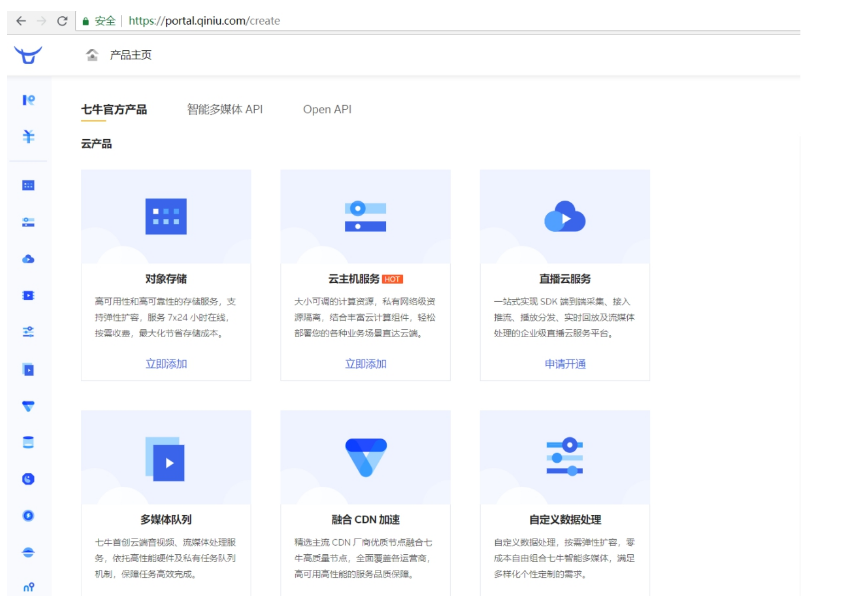 

==注意：登录成功后还需要进行实名认证才能进行相关操作。==

### 1.2.2. **新建存储空间**

要进行图片存储，我们需要在七牛云管理控制台新建存储空间。点击管理控制台首页对象存储下的立即添加按钮，页面跳转到新建存储空间页面：

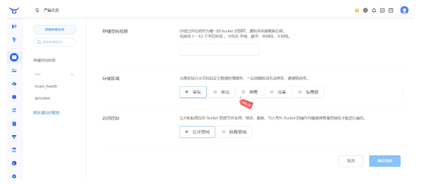 


可以创建多个存储空间，各个存储空间是相互独立的。

### 1.2.3. **查看存储空间信息**

存储空间创建后，会在左侧的存储空间列表菜单中展示创建的存储空间名称，点击存储空间名称可以查看当前存储空间的相关信息

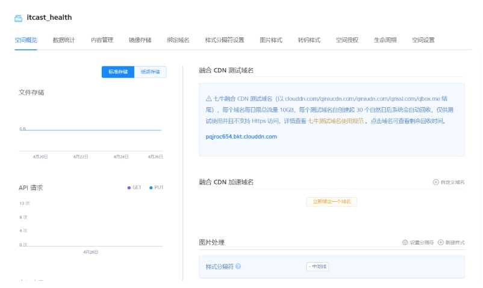 

==课程中重点关注【内容管理】中的信息。==

### 1.2.4. **开发者中心**

可以通过七牛云提供的开发者中心学习如何操作七牛云服务，地址：<https://developer.qiniu.com/>

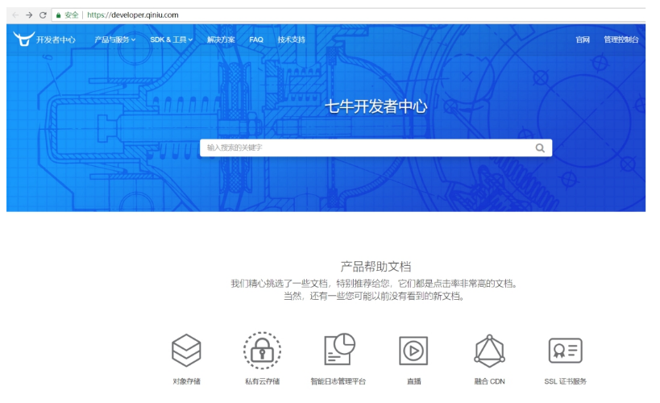 

==点击对象存储==，跳转到对象存储开发页面，地址：<https://developer.qiniu.com/kodo>

 

 

操作步骤：

第一步：导入jar包：

 

第二步：鉴权

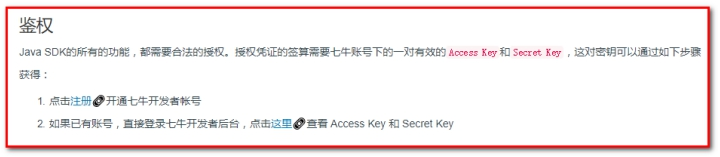 

点击“管理控制台”，点击右上图标

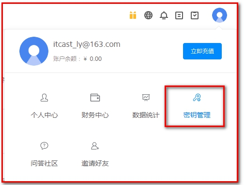 

可根据文档中提供的上传文件和删除文件进行测试：

在health_common中测试

#### 1.2.4.1.文件上传

 

```java
public class TestQiniu {

    // 上传本地文件
    @Test
    public void uploadFile(){
        //构造一个带指定Zone对象的配置类
        Configuration cfg = new Configuration(Zone.zone0());
        //...其他参数参考类注释
        UploadManager uploadManager = new UploadManager(cfg);
        //...生成上传凭证，然后准备上传
        String accessKey = "liyKTcQC5TP1LrhgZH6Xem8zqMXbEtVgfAINP53w";
        String secretKey = "f5zpuzKAPceEMG77-EK3XbwqgOBRDXDawG4UHRtb";
        String bucket = "itcast_health";
        //如果是Windows情况下，格式是 D:\\qiniu\\test.png，可支持中文
        String localFilePath = "D:/2.jpg";
        //默认不指定key的情况下，以文件内容的hash值作为文件名
        String key = null;
        Auth auth = Auth.create(accessKey, secretKey);
        String upToken = auth.uploadToken(bucket);
        try {
            Response response = uploadManager.put(localFilePath, key, upToken);
            //解析上传成功的结果
            DefaultPutRet putRet = new Gson().fromJson(response.bodyString(), DefaultPutRet.class);
            System.out.println(putRet.key);
            System.out.println(putRet.hash);
        } catch (QiniuException ex) {
            Response r = ex.response;
            System.err.println(r.toString());
            try {
                System.err.println(r.bodyString());
            } catch (QiniuException ex2) {
                //ignore
            }
        }
    }
}
```

#### 1.2.4.2.文件删除

 


```java
    // 删除空间中的文件
    @Test
    public void deleteFile(){
        //构造一个带指定Zone对象的配置类
        Configuration cfg = new Configuration(Zone.zone0());
        //...其他参数参考类注释
        String accessKey = "liyKTcQC5TP1LrhgZH6Xem8zqMXbEtVgfAINP53w";
        String secretKey = "f5zpuzKAPceEMG77-EK3XbwqgOBRDXDawG4UHRtb";
        String bucket = "itcast_health";
        String key = "Fu3Ic6TV6wIbJt793yaGeBmCkzTX";
        Auth auth = Auth.create(accessKey, secretKey);
        BucketManager bucketManager = new BucketManager(auth, cfg);
        try {
            bucketManager.delete(bucket, key);
        } catch (QiniuException ex) {
            //如果遇到异常，说明删除失败
            System.err.println(ex.code());
            System.err.println(ex.response.toString());
        }
    }
```

 

 七牛云提供了多种方式操作对象存储服务，本项目采用Java SDK方式，地址：<https://developer.qiniu.com/kodo/sdk/1239/java>

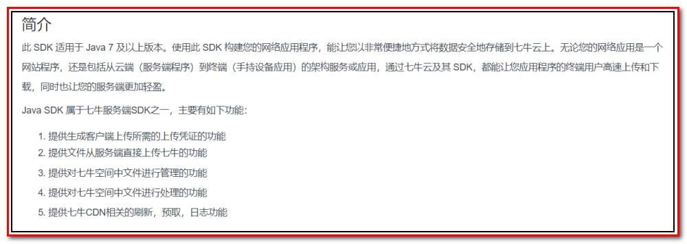 

使用Java SDK操作七牛云需要导入如下maven坐标：（项目已经引入）

```xml
<dependency>
    <groupId>com.qiniu</groupId>
    <artifactId>qiniu-java-sdk</artifactId>
    <version>7.2.0</version>
</dependency>
```

 

### 1.2.5. **鉴权**

Java SDK的所有的功能，都需要合法的授权。授权凭证的签算需要七牛账号下的一对==有效的Access Key和Secret Key==，这对密钥可以在七牛云管理控制台的个人中心（<https://portal.qiniu.com/user/key>）获得，如下图：

 

**区域**


### 1.2.6. **Java SDK操作七牛云**

本章节我们就需要使用七牛云提供的Java SDK完成图片上传和删除，我们可以参考官方提供的例子。

在health_parent中测试


#### ==上传文件==：

```java
package com.itheima;

import com.google.gson.Gson;
import com.qiniu.common.QiniuException;
import com.qiniu.common.Zone;
import com.qiniu.http.Response;
import com.qiniu.storage.Configuration;
import com.qiniu.storage.UploadManager;
import com.qiniu.storage.model.DefaultPutRet;
import com.qiniu.util.Auth;
import org.junit.Test;

/**
 * 七牛云
 *      文件上传
 *      文件删除
 * @Author: wzw
 * @Date: 2020/11/11 18:16
 * @version: 1.8
 */
public class QiNiuTest {

    @Test
    public void testUploadFile(){
        //1.构造一个带指定Zone对象的配置类，zone0表示华东地区（默认）
        // 我们的是创建时要的是华南,所以是2
        Configuration cfg = new Configuration(Zone.zone2());
        //...其他参数参考类注释
        UploadManager uploadManager = new UploadManager(cfg);

        //2...生成上传凭证，然后准备上传
        String accessKey = "rQpB8ijXrPfb0g-KXrYSL6jYfDLfrIkN3lwEhFTb";//鉴证的账号(AK)
        String secretKey = "4NiqECa70HYpV7Ov-FMNFzG01FQzba9UBayjQ6Kh";//鉴证的密码(SK)
        String bucket = "wzw157106";//存储控件名称(服务器名)

        //3.如果是Windows情况下，格式是 D:\\qiniu\\test.png
        String localFilePath = "C:\\Users\\15710\\Desktop\\123.png";//本地文件路径

        //4.默认不指定key的情况下，以文件内容的hash值作为文件名
        String key = null;//可以指定上传图片的名称
        //===========================改到这里就可以了=======================
        Auth auth = Auth.create(accessKey, secretKey);
        String upToken = auth.uploadToken(bucket);
        try {
            Response response = uploadManager.put(localFilePath, key, upToken);
            //解析上传成功的结果
            DefaultPutRet putRet = new Gson().fromJson(response.bodyString(), DefaultPutRet.class);
            System.out.println(putRet.key);
            System.out.println(putRet.hash);
        } catch (QiniuException ex) {
            Response r = ex.response;
            System.err.println(r.toString());
            try {
                System.err.println(r.bodyString());
            } catch (QiniuException ex2) {
                //ignore
            }
        }
    }
}

```

#### 注意

* 官网上

  

* 要`Alt+Enter`导入七牛云的配置文件


* 版本用的对象

  * 我们用的7.2.0:用的是Zone对象的配置类，我们的是创建时要的是华南,所以是2

    

  * 官网已经到7.3.99:用的是: Region 对象的配置类:zone0表示华东地区（默认）

    

#### ==删除文件==  

```java
package com.itheima;

import com.qiniu.common.QiniuException;
import com.qiniu.common.Zone;
import com.qiniu.storage.BucketManager;
import com.qiniu.storage.Configuration;
import com.qiniu.util.Auth;
import org.junit.Test;

/**
 * 七牛云
 *      文件上传
 *      文件删除
 * @Author: wzw
 * @Date: 2020/11/11 18:16
 * @version: 1.8
 */
public class QiNiuTest {

    @Test
    public void testDeleteFile(){
        //1.构造一个带指定 Zone 对象的配置类
        Configuration cfg = new Configuration(Zone.zone0());

        //2....其他参数参考类注释
        String accessKey = "rQpB8ijXrPfb0g-KXrYSL6jYfDLfrIkN3lwEhFTb";//鉴证的账号(AK)
        String secretKey = "4NiqECa70HYpV7Ov-FMNFzG01FQzba9UBayjQ6Kh";//鉴证的密码(SK)
        String bucket = "wzw157106";//存储控件名称(服务器名)

        //3.需要删除的文件名称
        String key = "Fuo4PpNyqR8SayPeLSzkJBniyWBs";
        //===========================改到这里就可以了=======================
        Auth auth = Auth.create(accessKey, secretKey);
        BucketManager bucketManager = new BucketManager(auth, cfg);
        try {
            bucketManager.delete(bucket, key);
        } catch (QiniuException ex) {
            //如果遇到异常，说明删除失败
            System.err.println(ex.code());
            System.err.println(ex.response.toString());
        }

    }
}

```


#### 注意

* 官网上

  

* 删除的文件名称


* 结束后要记得将@Test注释掉


### 1.2.7. **封装工具类**

为了方便操作七牛云存储服务，我们可以将官方提供的案例简单改造成一个工具类，在我们的项目中直接使用此工具类来操作就可以：

```java
package com.itheima.utils;

import com.google.gson.Gson;
import com.qiniu.common.QiniuException;
import com.qiniu.common.Zone;
import com.qiniu.http.Response;
import com.qiniu.storage.BucketManager;
import com.qiniu.storage.Configuration;
import com.qiniu.storage.UploadManager;
import com.qiniu.storage.model.DefaultPutRet;
import com.qiniu.util.Auth;
import java.io.File;
import java.io.FileInputStream;
import java.io.InputStream;

/**
 *  accessKey:AK
 *  secretKey:SK
 *  bucket:七牛云管理空间
 * 七牛云工具类
 */
public class QiniuUtils {
    public  static String accessKey = "rQpB8ijXrPfb0g-KXrYSL6jYfDLfrIkN3lwEhFTb";
    public  static String secretKey = "4NiqECa70HYpV7Ov-FMNFzG01FQzba9UBayjQ6Kh";
    public  static String bucket = "wzw157106";

    public static void upload2Qiniu(String filePath,String fileName){
        //构造一个带指定Zone对象的配置类
        Configuration cfg = new Configuration(Zone.zone2());
        UploadManager uploadManager = new UploadManager(cfg);
        Auth auth = Auth.create(accessKey, secretKey);
        String upToken = auth.uploadToken(bucket);
        try {
            Response response = uploadManager.put(filePath, fileName, upToken);
            //解析上传成功的结果
            DefaultPutRet putRet = new Gson().fromJson(response.bodyString(), DefaultPutRet.class);
        } catch (QiniuException ex) {
            Response r = ex.response;
            try {
                System.err.println(r.bodyString());
            } catch (QiniuException ex2) {
                //ignore
            }
        }
    }

    //上传文件
    public static void upload2Qiniu(byte[] bytes, String fileName){
        //构造一个带指定Zone对象的配置类
        Configuration cfg = new Configuration(Zone.zone2());
        //...其他参数参考类注释
        UploadManager uploadManager = new UploadManager(cfg);

        //默认不指定key的情况下，以文件内容的hash值作为文件名
        String key = fileName;
        Auth auth = Auth.create(accessKey, secretKey);
        String upToken = auth.uploadToken(bucket);
        try {
            Response response = uploadManager.put(bytes, key, upToken);
            //解析上传成功的结果
            DefaultPutRet putRet = new Gson().fromJson(response.bodyString(), DefaultPutRet.class);
            System.out.println(putRet.key);
            System.out.println(putRet.hash);
        } catch (QiniuException ex) {
            Response r = ex.response;
            System.err.println(r.toString());
            try {
                System.err.println(r.bodyString());
            } catch (QiniuException ex2) {
                //ignore
            }
        }
    }

    //删除文件
    public static void deleteFileFromQiniu(String fileName){
        //构造一个带指定Zone对象的配置类
        Configuration cfg = new Configuration(Zone.zone2());
        String key = fileName;
        Auth auth = Auth.create(accessKey, secretKey);
        BucketManager bucketManager = new BucketManager(auth, cfg);
        try {
            bucketManager.delete(bucket, key);
        } catch (QiniuException ex) {
            //如果遇到异常，说明删除失败
            System.err.println(ex.code());
            System.err.println(ex.response.toString());
        }
    }
}

```

将此工具类放在health_common工程中的utils中，后续会使用到。

* 记得修改
  * 账号:AK
  * 密码:SK
  * 管理空间名
  * 不同区域的代表数

### 【小结】

1：介绍

（1）文件上传功能介绍

2：七牛云存储

（1）注册

（2）新建存储空间

（3）查看存储空间信息

（4）开发者中心

（5）鉴权

（6）Java SDK操作七牛云

（7）封装工具类

# 2. **新增套餐**

### 【目标】

新增套餐

### 【路径】

1：需求分析

2：前台代码

（1）弹出新增窗口

（2）动态展示检查组列表

（3）图片上传并预览

* 使用七牛云存储图片

（4）提交请求

* 使用数据库存储图片名称
* 使用springmvc的文件上传技术

3：后台代码

业务：

* 新增套餐

（1）SetmealController.java（Controller）

（2）SetmealService.java（服务接口）

（3）SetmealServiceImpl.java（服务实现类）

（4）SetmealDao.java（Dao接口）

（5）SetmealDao.xml（Mapper映射文件）

4：完善文件上传，Redis存储图片名称（一会说）

### 【讲解】

## 2.1. **需求分析**

套餐其实就是检查组的集合，例如有一个套餐为“入职体检套餐”，这个检查组可以包括多个检查组：一般检查、血常规、尿常规、肝功三项等。

所以在添加套餐时需要选择这个套餐包括的检查组。

套餐对应的实体类为Setmeal，

```java
public class Setmeal implements Serializable {
    private Integer id;
    private String name;
    private String code;
    private String helpCode;
    private String sex;//套餐适用性别：0不限 1男 2女
    private String age;//套餐适用年龄
    private Float price;//套餐价格
    private String remark;
    private String attention;
    private String img;//套餐对应图片名称（用于存放七牛云上的图片名称-唯一）
    private List<CheckGroup> checkGroups;//体检套餐对应的检查组，多对多关系
}
```

==其中img字段表示套餐对应图片存储路径（用于存放七牛云上的图片名称）==

对应的数据表为t_setmeal。套餐和检查组为多对多关系，所以需要中间表t_setmeal_checkgroup进行关联。

t_setmeal表

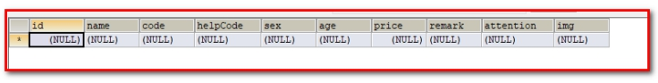 

t_setmeal_checkgroup表

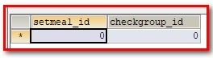 

## 2.2. 前台代码

套餐管理页面对应的是setmeal.html页面，根据产品设计的原型已经完成了页面基本结构的编写，现在需要完善页面动态效果。

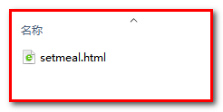 

### 2.2.1. **弹出新增窗口**

页面中已经提供了新增窗口，只是出于隐藏状态。只需要将控制展示状态的属性dialogFormVisible改为true接口显示出新增窗口。点击新建按钮时绑定的方法为handleCreate，所以在handleCreate方法中修改`dialogFormVisible`属性的值为true即可。同时为了增加用户体验度，需要每次点击新建按钮时清空表单输入项。

由于新增套餐时还需要选择此套餐包含的检查组，所以新增套餐窗口分为两部分信息：基本信息和检查组信息，如下图：

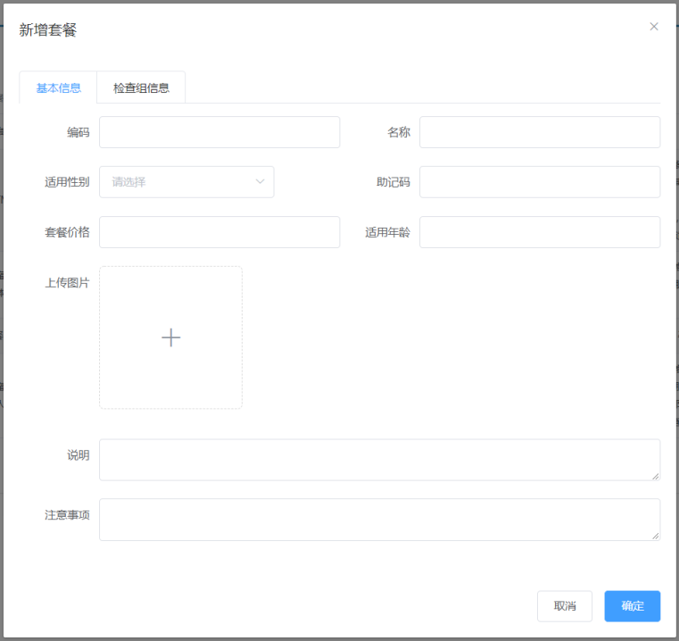 

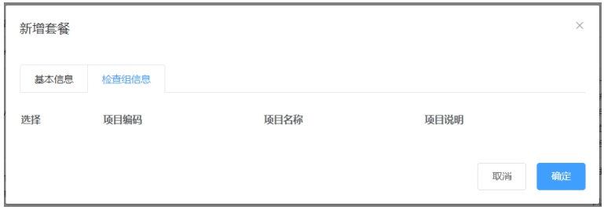 

（1）：新建按钮绑定单击事件，对应的处理函数为handleCreate

```html
<el-button type="primary" class="butT" @click="handleCreate()">新建</el-button>
```

（2）：handleCreate()方法：

```javascript
// 重置表单
resetForm() {
    // 清空套餐基本信息
    this.formData = {};
    // 选项卡设置成第一个
    this.activeName='first';
    // 重置检查项的复选框
    this.checkgroupIds = [];
    // 重置上传的图片路径
    this.imageUrl = null;
},
// 弹出添加窗口
handleCreate() {
    //开启弹窗属性  
    this.dialogFormVisible = true;
    //重置表单 
    this.resetForm();
},
```

 

### 2.2.2. **动态展示检查组列表**

现在虽然已经完成了新增窗口的弹出，但是在检查组信息标签页中需要动态展示所有的检查组信息列表数据，并且可以进行勾选。具体操作步骤如下：

（1）定义模型数据

```javascript
tableData:[],//添加表单窗口中检查组列表数据
checkgroupIds:[],//添加表单窗口中检查组复选框对应id
```

 

（2）动态展示检查组列表数据，数据来源于上面定义的tableData模型数据

​				其中：v-model="checkgroupIds"，用于回显复选框。

```html
<el-tab-pane label="检查组信息" name="second">
<div class="checkScrol">
   <table class="datatable">
      <thead>
      <tr>
         <th>选择</th>
         <th>项目编码</th>
         <th>项目名称</th>
         <th>项目说明</th>
      </tr>
      </thead>
      <tbody>
      <!--循环遍历tableData-->
      <tr v-for="c in tableData">
         <td>
            <!--复选框绑定checkgroupIds，存放到值是id-->
            <input :id="c.id" v-model="checkgroupIds" type="checkbox" :value="c.id">
         </td>
         <td><label :for="c.id">{{c.code}}</label></td>
         <td><label :for="c.id">{{c.name}}</label></td>
         <td><label :for="c.id">{{c.remark}}</label></td>
      </tr>
      </tbody>
   </table>
</div>
</el-tab-pane>
```

（3）完善handleCreate方法，发送ajax请求查询所有检查组数据并将结果赋值给tableData模型数据用于页面表格展示

```javascript
// 弹出添加窗口
handleCreate() {
    //开启弹窗属性
    this.dialogFormVisible = true;
    //重置表单
    this.resetForm();
    //Ajax请求:查询所有检查组(这里不要求分页)
    axios.get("/checkgroup/findAll.do").then(response=>{
       if (response.data.flag) {
           //将数据放到套餐添加窗口的检查组中
           this.tableData = response.data.data;
       } else {
           //提示
           this.$message.error(response.data.message);
       }
    });

},
```

 

（4）分别在CheckGroupController、CheckGroupService、CheckGroupServiceImpl、CheckGroupDao、CheckGroupDao.xml中扩展方法查询所有检查组数据

1：CheckGroupController：

```java
//查询所有
@RequestMapping("/findAll")
public Result findAll(){ 
    //实现功能:查询所有检查组
    List<CheckGroup> checkGroupList = CheckgroupService.findAll();
        
    //判断是否有值
    if(checkGroupList != null && checkGroupList.size() > 0){
            
        //失败
        return new Result(true, MessageConstant.QUERY_CHECKGROUP_SUCCESS,checkGroupList);;
        
    }
    //成功
    return new Result(false,MessageConstant.QUERY_CHECKGROUP_FAIL);
}
```

 

2：CheckGroupService：

```java
List<CheckGroup> findAll();
```

 

3：CheckGroupServiceImpl：

```java
// 查询所有检查组
@Override
public List<CheckGroup> findAll() {
  return checkGroupDao.findAll();
}
```

 

4：CheckGroupDao：

```java
List<CheckGroup> findAll();
```

5：CheckGroupDao.xml：

```xml
<select id="findAll" resultType="com.itheima.pojo.CheckGroup">
    select * from t_checkgroup
</select>
```


### 2.2.3. **图片上传并预览**

此处使用的是ElementUI提供的上传组件el-upload，提供了多种不同的上传效果，上传成功后可以进行预览。

实现步骤：

（1）定义模型数据，用于后面上传文件的图片预览：

```javascript
imageUrl:null,//模型数据，用于上传图片完成后图片预览
```

（2）定义ElementUI上传组件：

```html
<!--
  el-upload：上传组件
  action：上传的提交地址（七牛云服务器）
  auto-upload：选中文件后是否自动上传
  name：上传文件的名称，服务端可以根据名称获得上传的文件对象
  show-file-list：是否显示已上传文件列表
  on-success：文件上传成功时的钩子
  before-upload：上传文件之前的钩子
-->
<el-upload
         class="avatar-uploader"
         action="/setmeal/upload.do"
         :auto-upload="autoUpload"
         name="imgFile"
         :show-file-list="false"
         :on-success="handleAvatarSuccess"
         :before-upload="beforeAvatarUpload">
     <!--用于上传图片预览-->
     
     <!--用于展示上传图标-->
     <i v-else class="el-icon-plus avatar-uploader-icon"></i>
</el-upload>
```

 

（3）定义对应的钩子函数：

```javascript
//文件上传成功后的钩子，response为服务端返回的值，file为当前上传的文件封装成的js对象
handleAvatarSuccess(response, file) {
    this.imageUrl = "http://pqjroc654.bkt.clouddn.com/"+response.data; // 用于显示
    this.$message({
         message: response.message,
         type: response.flag ? 'success' : 'error'
    });
    //设置模型数据（图片名称），后续提交ajax请求时会提交到后台最终保存到数据库
    this.formData.img = response.data; // 用于保存
},
//上传图片之前执行
beforeAvatarUpload(file) {
    const isJPG = file.type === 'image/jpeg';
    const isLt2M = file.size / 1024 / 1024 < 2;
    if (!isJPG) {
        this.$message.error('上传套餐图片只能是 JPG 格式!');
    }
    if (!isLt2M) {
        this.$message.error('上传套餐图片大小不能超过 2MB!');
    }
    return isJPG && isLt2M;
},
```

 

（4）创建SetmealController，接收上传的文件

```java
package com.itheima.controller;

import com.alibaba.dubbo.config.annotation.Reference;
import com.itheima.constant.MessageConstant;
import com.itheima.entity.Result;
import com.itheima.service.SetmealService;
import com.itheima.utils.QiniuUtils;
import org.springframework.web.bind.annotation.RequestMapping;
import org.springframework.web.bind.annotation.RequestParam;
import org.springframework.web.bind.annotation.RestController;
import org.springframework.web.multipart.MultipartFile;

import java.util.UUID;
/**
 * 套餐管理
 */
@RestController
@RequestMapping("/setmeal")
public class SetmealController {
    @Reference
    private SetmealService setmealService;

   /**
     * 图片上传
     * @param imgFile 图片文件
     * @return 是否成功
     */
    @RequestMapping("/upload")
    public Result upload(@RequestParam("imgFile")MultipartFile imgFile){
        try {
            //1.自定义图片名称
            //获取原始文件名
            String originalFilename = imgFile.getOriginalFilename();
            //获取.后面的后多少位
            int lastIndexOf = originalFilename.lastIndexOf(".");
            //获取文件后缀
            String suffix = originalFilename.substring(lastIndexOf);
            //使用UUID随机产生文件名称,防止同名文件覆盖
            String fileName = UUID.randomUUID().toString() + suffix;

            //2.使用QiniuUtils工具类,将图片上传到七牛云中
            // (会出编译时异常)(图片文件转为字节数组,图片名称)
            QiniuUtils.upload2Qiniu(imgFile.getBytes(),fileName);
            
            //3.处理结果
            //成功
            return new Result(true,MessageConstant.PIC_UPLOAD_SUCCESS,fileName);
        } catch (Exception e) {
            e.printStackTrace();
            //失败
            return new Result(false, MessageConstant.PIC_UPLOAD_FAIL);
        }
    }
}
```

 

注意：别忘了在spring配置文件中配置文件上传组件

已在springmvc.xml中配置

```xml
<!--文件上传组件-->
<bean id="multipartResolver"
      class="org.springframework.web.multipart.commons.CommonsMultipartResolver">
    <property name="maxUploadSize" value="104857600" /><!--最大上传文件大小-->
    <property name="maxInMemorySize" value="4096" />
    <property name="defaultEncoding" value="UTF-8"/>
</bean>
```

 

### 2.2.4. **提交请求**

当用户点击新增窗口中的确定按钮时发送ajax请求将数据提交到后台进行数据库操作。提交到后台的数据分为两部分：套餐基本信息（对应的模型数据为formData）和检查组id数组（对应的模型数据为checkgroupIds）。

（1）为确定按钮绑定单击事件，对应的处理函数为handleAdd

```html
<div slot="footer" class="dialog-footer">
    <el-button @click="dialogFormVisible = false">取消</el-button>
    <el-button type="primary" @click="handleAdd()">确定</el-button>
</div>
```

（2）完善handleAdd方法

```javascript
//添加
handleAdd () {
    axios.post("/setmeal/add.do?checkgroupIds=" + this.checkgroupIds,this.formData).then((response)=> {
        this.dialogFormVisible = false;
        if(response.data.flag){
            this.$message({
                message: response.data.message,
                type: 'success'
            });
        }else{
            this.$message.error(response.data.message);
        }
    }).finally(()=> {
        this.findPage();
    });
},
```

 

## 2.3. **后台代码**

### 2.3.1. **Controller**

在SetmealController中增加方法

```java
//新增
@RequestMapping("/add")
public Result add(@RequestBody Setmeal setmeal, Integer[] checkgroupIds){
    try {
        setmealService.add(setmeal,checkgroupIds);
    }catch (Exception e){
        //新增套餐失败
        return new Result(false,MessageConstant.ADD_SETMEAL_FAIL);
    }
    //新增套餐成功
    return new Result(true,MessageConstant.ADD_SETMEAL_SUCCESS);
}
```


### 2.3.2. **服务接口**

创建SetmealService接口并提供新增方法

```java
package com.itheima.service;

import com.itheima.pojo.Setmeal;

/**
 * 体检套餐服务接口
 */
public interface SetmealService {
    public void add(Setmeal setmeal, Integer[] checkgroupIds);
}
```

 

### 2.3.3. **服务实现类**

创建SetmealServiceImpl服务实现类并实现新增方法

```java
package com.itheima.service;

import com.alibaba.dubbo.config.annotation.Service;
import com.itheima.dao.SetmealDao;
import com.itheima.pojo.Setmeal;
import org.springframework.beans.factory.annotation.Autowired;
import org.springframework.transaction.annotation.Transactional;

import java.util.HashMap;
import java.util.Map;

@Service(interfaceClass = SetmealService.class)
@Transactional
public class SetmealServiceImpl implements SetmealService {

    //注入
    @Autowired
    SetmealDao setmealDao;


    //新增套餐
    public void add(Setmeal setmeal, Integer[] checkgroupIds) {
        // 1：新增套餐:往套餐表插入数据
        setmealDao.add(setmeal);
        
        // 2：向套餐和检查组的 中间表 中插入数据
        if(checkgroupIds != null && checkgroupIds.length > 0){
            //绑定套餐和检查组的多对多关系(套餐id,检查组id数组)
            setSetmealAndCheckGroup(setmeal.getId(),checkgroupIds);
        }
        
    }
    
    /**
     * 向套餐和检查组的 中间表 插入数据
     * @param setmealId 套餐id,
     * @param checkgroupIds 检查组id数组
     */
    private void setSetmealAndCheckGroup(Integer setmealId, Integer[] checkgroupIds) {
        //选中多少个检查组就要插入多少次
        for (Integer checkgroupId : checkgroupIds) {
            //将要插入中表的中存到Map中传给dao
            Map map = new HashMap();
            //添加套餐id
            map.put("setmeal_id",setmealId);
            //添加选中的检查组id
            map.put("checkgroup_id",checkgroupId);
            //实现功能:向中间表插入数据
            setmealDao.setSetmealAndCheckGroup(map);
        }
    }
```

 

### 2.3.4. **Dao接口**

创建SetmealDao接口并提供相关方法

```java
package com.itheima.dao;
import com.itheima.pojo.Setmeal;
import org.springframework.stereotype.Repository;
import java.util.Map;
public interface SetmealDao {

    /**
     * 套餐:新增功能
     * @param setmeal 套餐对象
     */
    void add(Setmeal setmeal);

    /**
     * 向套餐和检查组的 中间表 插入数据
     * @param map 一个套餐id和一个检查组id
     */
    void setSetmealAndCheckGroup(Map map);
}
```

 

### 2.3.5. **Mapper映射文件**

创建SetmealDao.xml文件并定义相关SQL语句

```xml
<?xml version="1.0" encoding="UTF-8" ?>
<!DOCTYPE mapper PUBLIC "-//mybatis.org//DTD Mapper 3.0//EN"
        "http://mybatis.org/dtd/mybatis-3-mapper.dtd" >
<mapper namespace="com.itheima.dao.SetmealDao">
    <!--新增套餐-->
    <insert id="add" parameterType="com.itheima.pojo.Setmeal">
        <selectKey resultType="java.lang.Integer" order="AFTER" keyProperty="id">
            SELECT LAST_INSERT_ID()
        </selectKey>
        insert into t_setmeal
        (code,name,sex,age,helpCode,price,remark,attention,img)
        values
        (#{code},#{name},#{sex},#{age},#{helpCode},#{price},#{remark},#{attention},#{img})
    </insert>
    <!--绑定套餐和检查组多对多关系(中间表)-->
    <insert id="setSetmealAndCheckGroup" parameterType="hashmap">
        insert into t_setmeal_checkgroup
        (setmeal_id,checkgroup_id)
        values
        (#{setmeal_id},#{checkgroup_id})
    </insert>
</mapper>
```

 

## 2.4.  完善文件上传清理垃圾图片

前面我们已经完成了文件上传，将图片存储在了七牛云服务器中。但是这个过程存在一个问题，就是如果用户只上传了图片而没有最终保存套餐信息到我们的数据库，这时我们上传的图片就变为了垃圾图片。对于这些垃圾图片我们需要定时清理来释放磁盘空间。这就需要我们能够区分出来哪些是垃圾图片，哪些不是垃圾图片。如何实现呢？

方案就是利用redis来保存图片名称，具体做法为：

1、当用户上传图片后，将图片名称保存到redis的一个Set集合中，例如集合名称为setmealPicResources

2、当用户添加套餐后，将图片名称保存到redis的另一个Set集合中，例如集合名称为setmealPicDbResources

3、计算setmealPicResources集合与setmealPicDbResources集合的差值，结果就是垃圾图片的名称集合，清理这些图片即可

本小节我们先来完成前面2个环节，第3个环节（清理图片环节）在后面会通过定时任务再实现。

实现步骤：

### 2.4.1 health_web中配置修改

#### (1)修改**spring-redis.xml**配置文件

```xml
<?xml version="1.0" encoding="UTF-8"?>
<beans xmlns="http://www.springframework.org/schema/beans"
       xmlns:xsi="http://www.w3.org/2001/XMLSchema-instance"
       xmlns:p="http://www.springframework.org/schema/p"
       xmlns:context="http://www.springframework.org/schema/context"
       xmlns:dubbo="http://code.alibabatech.com/schema/dubbo"
       xmlns:mvc="http://www.springframework.org/schema/mvc"
       xsi:schemaLocation="http://www.springframework.org/schema/beans
                         http://www.springframework.org/schema/beans/spring-beans.xsd
                    http://www.springframework.org/schema/mvc
                         http://www.springframework.org/schema/mvc/spring-mvc.xsd
                    http://code.alibabatech.com/schema/dubbo
                         http://code.alibabatech.com/schema/dubbo/dubbo.xsd
                    http://www.springframework.org/schema/context
                         http://www.springframework.org/schema/context/spring-context.xsd">

    <!--Jedis连接池的相关配置-->
    <bean id="jedisPoolConfig" class="redis.clients.jedis.JedisPoolConfig">
        <property name="maxTotal">
            <value>200</value>
        </property>
        <property name="maxIdle">
            <value>50</value>
        </property>
        <property name="testOnBorrow" value="true"/>
        <property name="testOnReturn" value="true"/>
    </bean>
    <bean id="jedisPool" class="redis.clients.jedis.JedisPool">
        <constructor-arg name="poolConfig" ref="jedisPoolConfig" />
        <constructor-arg name="host" value="127.0.0.1" />
        <constructor-arg name="port" value="6379" type="int" />
        <constructor-arg name="timeout" value="30000" type="int" />
    </bean>
</beans>
```

#### (2)同时在springmvc.xml中使用<import>标签引入

```xml
<import resource="classpath:spring-redis.xml"></import>
```

### 2.4.2 health_common常量类

提供Redis常量类

```java
package com.itheima.constant;

public class RedisConstant {
    //套餐图片所有图片名称
    public static final String SETMEAL_PIC_RESOURCES = "setmealPicResources";
    //套餐图片保存在数据库中的图片名称
    public static final String SETMEAL_PIC_DB_RESOURCES = "setmealPicDbResources";
}
```

### 2.4.3 SetmealController完善

在文件上传成功后将图片名称保存到redis集合中

```java
	//注入jedis工具类
    @Autowired
    private JedisPool jedisPool;

	/**
     * 图片上传
     * @param imgFile 图片文件
     * @return 是否成功
     */
    @RequestMapping("/upload")
    public Result upload(@RequestParam("imgFile")MultipartFile imgFile){
        try {
            //1.自定义图片名称
            //获取原始文件名
            String originalFilename = imgFile.getOriginalFilename();
            //获取.后面的后多少位
            int lastIndexOf = originalFilename.lastIndexOf(".");
            //获取文件后缀
            String suffix = originalFilename.substring(lastIndexOf);
            //使用UUID随机产生文件名称,防止同名文件覆盖
            String fileName = UUID.randomUUID().toString() + suffix;

            //2.使用QiniuUtils工具类,将图片上传到七牛云中
            // (会出编译时异常)(图片文件转为字节数组,图片名称)
            QiniuUtils.upload2Qiniu(imgFile.getBytes(),fileName);
            
           //4.将所有(不管成不成功)上传图片名称存入Redis,基于Redis的Set集合存储
                jedisPool.getResource().sadd(RedisConstant.SETMEAL_PIC_RESOURCES,fileName);
            
            //5.处理结果
            //成功(返回随机出来的文件名)
            return new Result(true,MessageConstant.PIC_UPLOAD_SUCCESS,fileName);
        } catch (Exception e) {
            e.printStackTrace();
            //失败
            return new Result(false, MessageConstant.PIC_UPLOAD_FAIL);
        }
    }

```

**添加：**

```java
 /**
     * 套餐:新增功能
     * @param setmeal 套餐对象
     * @param checkgroupIds 选中的检查组id数组
     * @return 是否成功
     */
    @RequestMapping("/add")
    public Result add(@RequestBody Setmeal setmeal,Integer[] checkgroupIds){
        try {
            //实现功能:添加功能
            setmealService.add(setmeal,checkgroupIds);

            //[完善点]将确定后的图片上传名称存入Redis,基于Redis的Set集合存储(key,图片名)
            jedisPool.getResource().sadd(RedisConstant.SETMEAL_PIC_DB_RESOURCES,setmeal.getImg());

            //处理结果集
            //成功
            return new Result(true,MessageConstant.ADD_SETMEAL_SUCCESS);
        } catch (Exception e) {
            e.printStackTrace();
            //失败
            return new Result(false,MessageConstant.ADD_SETMEAL_FAIL);
        }

    }
```

### 2.4.4 测试

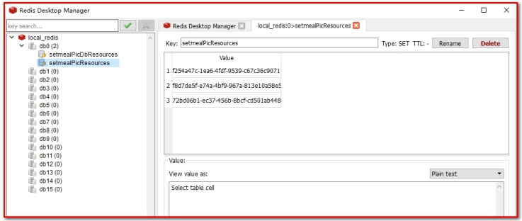 

 

### 2.4.5 清理垃圾图片测试

删除垃圾图片，在health_web工程下，创建测试类，进行删除

​		注意:

​				1.看七牛云的图片是否清理了

​				2.redis中的剩余的值是否正确

```java
@ContextConfiguration(locations = "classpath:spring-redis.xml")
@RunWith(value = SpringJUnit4ClassRunner.class)
public class TestDeletePic {

    @Autowired
    JedisPool jedisPool;

    // 删除Redis中2个不同key值存储的不同图片
    //RedisConstant.SETMEAL_PIC_RESOURCES是key1
    //RedisConstant.SETMEAL_PIC_DB_RESOURCES是key2
    @Test
    public void test(){
        Set<String> set = jedisPool.getResource().sdiff(RedisConstant.SETMEAL_PIC_RESOURCES, RedisConstant.SETMEAL_PIC_DB_RESOURCES);
        Iterator<String> iterator = set.iterator();
        while (iterator.hasNext()){
            String pic = iterator.next();
            System.out.println("删除的图片："+pic);
            // 删除七牛云上的图片
            QiniuUtils.deleteFileFromQiniu(pic);
            // 删除Redis中key值为SETMEAL_PIC_RESOURCE的数据
            jedisPool.getResource().srem(RedisConstant.SETMEAL_PIC_RESOURCES,pic);
        }
    }

}
```

项目经理说，代码已经完成，让你在凌晨的时候去执行以上代码。我们不会真正的待到凌晨去执行，那怎么办呢？

学习任务调度Quartz

### 【小结】

1：需求分析

2：前台代码

（1）弹出新增窗口

（2）动态展示检查组列表

（3）图片上传并预览

- 使用七牛云存储图片

（4）提交请求

- 使用数据库存储图片名称

- 使用springmvc的文件上传技术

  第一步：页面定义上传组件：

  ```html
  <!--
    el-upload：上传组件
    action：上传的提交地址（七牛云服务器）
    auto-upload：选中文件后是否自动上传
    name：上传文件的名称，服务端可以根据名称获得上传的文件对象
    show-file-list：是否显示已上传文件列表
    on-success：文件上传成功时的钩子
    before-upload：上传文件之前的钩子
  -->
  <el-upload
           class="avatar-uploader"
           action="/setmeal/upload.do"
           :auto-upload="autoUpload"
           name="imgFile"
           :show-file-list="false"
           :on-success="handleAvatarSuccess"
           :before-upload="beforeAvatarUpload">
       <!--用于上传图片预览-->
       
       <!--用于展示上传图标-->
       <i v-else class="el-icon-plus avatar-uploader-icon"></i>
  </el-upload>
  ```

  第二步：使用springmvc跳转Controller，接收文件参数

  ```java
  @RequestMapping("/upload")
  public Result upload(@RequestParam("imgFile")MultipartFile imgFile){
  }
  ```
  第三步：配置springmvc.xml

  ```xml
  <!--文件上传组件-->
  <bean id="multipartResolver"
        class="org.springframework.web.multipart.commons.CommonsMultipartResolver">
      <property name="maxUploadSize" value="104857600" /><!--最大上传文件大小-->
      <property name="maxInMemorySize" value="4096" />
      <property name="defaultEncoding" value="UTF-8"/>
  </bean>
  ```

3：后台代码

业务：

- 新增套餐

（1）SetmealController.java（Controller）

（1）SetmealService.java（服务接口）

（1）SetmealServiceImpl.java（服务实现类）

（1）SetmealDao.java（Dao接口）

（1）SetmealDao.xml（Mapper映射文件）

==4：完善文件上传，Redis存储图片名称（一会说）==

# 3. 体检套餐分页

### 【目标】

体检套餐列表分页

### 【路径】

1：前台代码

（1）定义分页相关模型数据

（2）定义分页方法

（3）完善分页方法执行时机

2：后台代码

业务：

- 体检套餐分页列表展示

（1）SetmealController.java（Controller）

（2）SetmealService.java（服务接口）

（3）SetmealServiceImpl.java（服务实现类）

（4）SetmealDao.java（Dao接口）

（5）SetmealDao.xml（Mapper映射文件）

### 【讲解】

## 3.1. 前台代码

### 3.1.1. **定义分页相关模型数据**

```javascript
pagination: {//分页相关模型数据
    currentPage: 1,//当前页码
    pageSize:10,//每页显示的记录数
    total:0,//总记录数
    queryString:null//查询条件
},
dataList: [],//当前页要展示的分页列表数据
```

 

### 3.1.2. **定义分页方法**

（1）在页面中提供了findPage方法用于分页查询，为了能够在setmeal.html页面加载后直接可以展示分页数据，可以在VUE提供的钩子函数created中调用findPage方法

```javascript
//钩子函数，VUE对象初始化完成后自动执行
created() {
    this.findPage();
},
```

（2）findPage()方法：

```javascript
//分页查询
findPage() {
    //分页参数
    var param = {
        currentPage:this.pagination.currentPage,//页码
        pageSize:this.pagination.pageSize,//每页显示的记录数
        queryString:this.pagination.queryString//查询条件
    };
    //请求后台
    axios.post("/setmeal/findPage.do",param).then((response)=> {
        //为模型数据赋值，基于VUE的双向绑定展示到页面
        this.dataList = response.data.rows;
        this.pagination.total = response.data.total;
    });
},
```


### 3.1.3. **完善分页方法执行时机**

除了在created钩子函数中调用findPage方法查询分页数据之外，当用户点击查询按钮或者点击分页条中的页码时也需要调用findPage方法重新发起查询请求。

（1）为查询按钮绑定单击事件，调用findPage方法

```html
<el-button @click="handleCurrentChange(1)" class="dalfBut">查询</el-button>
```

 

（2）为分页条组件绑定current-change事件，此事件是分页条组件自己定义的事件，当页码改变时触发，对应的处理函数为handleCurrentChange

```html
<div class="pagination-container">
    <el-pagination
        class="pagiantion"
        @current-change="handleCurrentChange"
        :current-page="pagination.currentPage"
        :page-size="pagination.pageSize"
        layout="total, prev, pager, next, jumper"
        :total="pagination.total">
    </el-pagination>
</div>
```

定义handleCurrentChange方法

```javascript
//切换页码
handleCurrentChange(currentPage) {
    //currentPage为切换后的页码
    this.pagination.currentPage = currentPage;
    this.findPage();
}
```

 

## 3.2. **后台代码**

### 3.2.1. **Controller**

在SetmealController中增加分页查询方法

```java
//分页查询
@RequestMapping("/findPage")
public PageResult findPage(@RequestBody QueryPageBean queryPageBean){
    PageResult pageResult = setmealService.pageQuery(
            queryPageBean.getCurrentPage(),
            queryPageBean.getPageSize(),
            queryPageBean.getQueryString()
    );
    return pageResult;
}
```

 

### 3.2.2. **服务接口**

在SetmealService服务接口中扩展分页查询方法

```java
PageResult pageQuery(Integer currentPage, Integer pageSize, String queryString);
```

 

### 3.2.3. **服务实现类**

在SetmealServiceImpl服务实现类中实现分页查询方法，基于Mybatis分页助手插件实现分页

```java
public PageResult pageQuery(Integer currentPage, Integer pageSize, String queryString) {
    PageHelper.startPage(currentPage,pageSize);
    Page<Setmeal> page = setmealDao.selectByCondition(queryString);
    return new PageResult(page.getTotal(),page.getResult());
}
```

 

### 3.2.4. **Dao接口**

在SetmealDao接口中扩展分页查询方法

```java
Page<Setmeal> selectByCondition(String queryString);
```

 

### 3.2.5. **Mapper映射文件**

在SetmealDao.xml文件中增加SQL定义

```xml
<!--根据条件查询-->
<select id="selectByCondition" parameterType="string" resultType="com.itheima.pojo.Setmeal">
    select * from t_setmeal
    <if test="value != null and value.length > 0">
        where code = #{value} or name like concat('%',#{value},'%') or helpCode = #{value}
    </if>
</select>
```

###  【小结】

1：前台代码

（1）定义分页相关模型数据

（2）定义分页方法

（3）完善分页方法执行时机

2：后台代码

业务：

- 体检套餐分页列表展示

（1）SetmealController.java（Controller）

（2）SetmealService.java（服务接口）

（3）SetmealServiceImpl.java（服务实现类）

（4）SetmealDao.java（Dao接口）

（5）SetmealDao.xml（Mapper映射文件）


# 4. 编辑套餐

### 【目标】

编辑套餐

### 【路径】

1：前台页面

（1）绑定“编辑”单击事件

（2）弹出编辑窗口回显数据

- 回显套餐数据
- 查询检查组列表
- 当前套餐具有的检查组的复选框需要选中

（3）发送请求，编辑保存套餐

- 编辑保存套餐
- 删除套餐检查组中间表数据，重新添加套餐检查组中间表数据

2：后台页面

执行

- 编辑套餐保存
- 删除套餐和检查组中间表数据
- 重新新增套餐和检查组中间表数据

（1）SetmealController.java（Controller）

（2）SetmealService.java（服务接口）

（3）SetmealServiceImpl.java（服务实现类）

（4）SetmealDao.java（Dao接口）

（5）SetmealDao.xml（Mapper映射文件）

### 【讲解】

## 4.1. 前台页面

用户点击编辑按钮时，需要弹出编辑窗口并且将当前记录的数据进行回显，用户修改完成后点击确定按钮将修改后的数据提交到后台进行数据库操作。此处进行数据回显的时候，除了需要将套餐基本信息的回显之外，还需要回显当前套餐包含的检查组（以复选框勾选的形式回显）。

### 4.1.1. **绑定单击事件**

（1）需要为编辑按钮绑定单击事件，并且将当前行数据作为参数传递给处理函数

```xml
<el-table-column label="操作" align="center">
    <template slot-scope="scope">
        <el-button type="primary" size="mini" @click="handleUpdate(scope.row)">编辑</el-button>
        <el-button size="mini" type="danger" @click="handleDelete(scope.row)">删除</el-button>
    </template>
</el-table-column>
```

（2）handleUpdate事件

```javascript
// 弹出编辑窗口
handleUpdate(row) {
    alert(row.id);
},
```


### 4.1.2. **弹出编辑窗口回显数据**

编写当前页面的编辑窗口，可以复制新增套餐窗口进行修改，默认需要处于隐藏状态。

（1）定义模型

```json
dialogFormVisible4Edit:false//控制编辑窗口显示/隐藏
```

（2）定义编辑窗口页面

在handleUpdate方法中需要将编辑窗口展示出来，并且需要发送多个ajax请求分别查询当前套餐数据、所有检查组列表数据、当前套餐包含的检查组id用于基本数据回显

```javascript
// 弹出编辑窗口
handleUpdate(row) {
    //alert(row.id);
    //1：发送ajax请求根据id查询套餐信息，用于基本信息回显
    axios.get("/setmeal/findById.do?id=" + row.id).then((res)=>{
        if(res.data.flag){
            //弹出编辑窗口
            this.dialogFormVisible4Edit = true;
            //默认选中第一个标签页
            this.activeName='first';
            //为模型数据赋值，通过VUE数据双向绑定进行信息的回显
            this.formData = res.data.data;
            this.$message({
              	type:"success",
              	message:res.data.message
            })
          	// 回显图片在指定的正方形的输入框
          	this.imageUrl = "http://q1rk0sp3v.bkt.clouddn.com/"+res.data.data.img;
          	//2：发送ajax请求查询所有的检查组信息，用于检查组表格列表展示
          	axios.get("/checkgroup/findAll.do").then((res)=> {
            	if(res.data.flag){
              		//为模型数据赋值，通过VUE数据双向绑定进行信息的回显
              		this.tableData = res.data.data;
                    
              		//3.查询当前套餐包含的所有检查组id,用于页面复选框回显
              		axios.get("/setmeal/findCheckGroupIdsBySetmealId.do?id=" + row.id).then((res)=> {
                		//为模型数据赋值，通过VUE数据双向绑定进行信息的回显
                		this.checkgroupIds = res.data;
              		});
            	}else{
              		this.$message.error(res.data.message);
            	}
          	});
        }else{
            this.$message.error(res.data.message);
        }
    });
},
```

 

 

### 4.1.3. 发送请求，编辑保存套餐

（1）在编辑窗口中修改完成后，点击确定按钮需要提交请求，所以需要为确定按钮绑定事件并提供处理函数handleEdit

```html
<el-button type="primary" @click="handleEdit()">确定</el-button>
```

（2）handleEdit()方法

```javascript
//编辑
handleEdit() {
  	//发送ajax请求，提交模型数据
  	axios.post("/setmeal/edit.do?	checkgroupIds="+this.checkgroupIds,this.formData).then((response)=> {
    	//隐藏编辑窗口
    	this.dialogFormVisible4Edit = false;
    	// 返回true，表示成功，否则表示失败
  
        if(response.data.flag){
      		this.$message({
        		message: response.data.message,
        		type: 'success'
      		});
    	}else{
      		this.$message.error(response.data.message);
    	}
  	}).finally(()=> {
    	this.findPage();
  	});
                },
```


## 4.2. **后台代码**

### 4.2.1. **Controller**

在SetmealController中增加方法

```java
// ID查询套餐
@RequestMapping(value = "/findById")
public Result findById(Integer id){
  	Setmeal setmeal = setmealService.findById(id);
  	if(setmeal!=null){
    	return new Result(true, MessageConstant.QUERY_SETMEAL_SUCCESS,setmeal);
  	}else{
    	return new Result(false, MessageConstant.QUERY_SETMEAL_FAIL);
  	}
}

// 使用套餐id，查询检查组的id集合，返回List<Integer>
@RequestMapping(value = "/findCheckGroupIdsBySetmealId")
public List<Integer> findCheckGroupIdsBySetmealId(Integer id){
  	List<Integer> list = setmealService.findCheckGroupIdsBySetmealId(id);
  	return list;
}

//编辑
@RequestMapping("/edit")
public Result edit(@RequestBody Setmeal setmeal, Integer[] checkgroupIds){
  	try {
        //实现功能:修改套餐
        setmealService.edit(setmeal,checkgroupIds);
        //处理结果集
        //成功
        return new Result(true,MessageConstant.EDIT_SETMEAL_SUCCESS);
    } catch (Exception e) {
        e.printStackTrace();
        //失败
        return new Result(false,MessageConstant.EDIT_SETMEAL_FAIL);
    }
}
```


### 4.2.2. **服务接口**

在SetmealService服务接口中扩展方法

```java
Setmeal findById(Integer id);

List<Integer> findCheckGroupIdsBySetmealId(Integer id);

void edit(Setmeal setmeal, Integer[] checkgroupIds);
```

 

### 4.2.3. **服务实现类**

在SetmealServiceImpl实现类中实现编辑方法

```java
/**
 * 套餐:查询要修改的套餐对象
 * @param setmealId 套餐id
 * @return 套餐对象
 */
@Override
public Setmeal findById(Integer setmealId) {
    return setmealDao.findById(setmealId);
}

/**
 * 套餐:查询套餐选中的检查组
 * @param setmealId 套餐id
 * @return 被选中的id集合
 */
@Override
public List<Integer> findCheckGroupIdsBySetmealId(Integer setmealId) {
    return setmealDao.findCheckGroupIdsBySetmealId(setmealId);
}


//编辑套餐，同时需要更新和检查组的关联关系
@Override
public void edit(Setmeal setmeal, Integer[] checkgroupIds) {
  	//1：根据套餐id删除中间表数据（清理原有关联关系）
  	setmealDao.deleteAssociation(setmeal.getId());
  	//2：向中间表(t_setmeal_checkgroup)插入数据（建立套餐和检查组关联关系）
  	setSetmealAndCheckGroup(setmeal.getId(),checkgroupIds);
  	//3：更新套餐基本信息
  	setmealDao.edit(setmeal);
}

//向中间表(t_setmeal_checkgroup)插入数据（建立套餐和检查组关联关系）
//绑定套餐和检查组的多对多关系
private void setSetmealAndCheckGroup(Integer id, Integer[] checkgroupIds) {
    for (Integer checkgroupId : checkgroupIds) {
        Map<String,Integer> map = new HashMap<String,Integer>();
        map.put("setmeal_id",id);
        map.put("checkgroup_id",checkgroupId);
        setmealDao.setSetmealAndCheckGroup(map);
    }
}
```

 

### 4.2.4. **Dao接口**

在SetmealDao接口中扩展方法

```java
Setmeal findById(Integer id);

List<Integer> findCheckGroupIdsBySetmealId(Integer id);

void deleteAssociation(Integer id);

void setSetmealAndCheckGroup(Map<String, Integer> map);

void edit(Setmeal setmeal);
```

 

### 4.2.5. **Mapper映射文件**

在SetmealDao.xml中扩展SQL语句

```xml
<!--套餐ID查询-->
<select id="findById" parameterType="int" resultType="setmeal">
  	select * from t_setmeal where id = #{id}
</select>

<!--使用套餐id，查询检查组的集合ID-->
<select id="findCheckGroupIdsBySetmealId" parameterType="int" resultType="int">
  	select checkgroup_id from t_setmeal_checkgroup where setmeal_id = #{setmealId}
</select>


<!--使用套餐id，删除套餐和检查组中间表数据-->
<delete id="deleteAssociation" parameterType="int">
    delete from t_setmeal_checkgroup where setmeal_id = #{id}
</delete>
<!--绑定套餐和检查组多对多关系-->
<insert id="setSetmealAndCheckGroup" parameterType="hashmap">
  	insert into t_setmeal_checkgroup
  	(setmeal_id,checkgroup_id)
  	values
  	(#{setmeal_id},#{checkgroup_id})
</insert>
<!--编辑-->
<update id="edit" parameterType="com.itheima.pojo.Setmeal">
    update t_setmeal
    <set>
        <if test="name != null and name.length>0">
          	name = #{name},
        </if>
        <if test="code != null and code.length>0">
          	code = #{code},
        </if>
        <if test="helpCode != null and helpCode.length>0">
          	helpCode = #{helpCode},
        </if>
        <if test="sex != null and sex.length>0">
          	sex = #{sex},
        </if>
        <if test="age != null and age.length>0">
          	age = #{age},
        </if>
        <if test="price != null">
          	price = #{price},
        </if>
        <if test="remark != null and remark.length>0">
          	remark = #{remark},
        </if>
        <if test="attention != null and attention.length>0">
          	attention = #{attention},
        </if>
        <if test="img != null and img.length>0">
          	img = #{img},
        </if>
    </set>
    where id = #{id}
</update>
```

### 【小结】

1：前台页面

（1）绑定“编辑”单击事件

（2）弹出编辑窗口回显数据

- 回显套餐数据
- 查询检查组列表
- 当前套餐具有的检查组的复选框需要选中

（3）发送请求，编辑保存套餐

- 编辑套餐
- 删除套餐检查组中间表数据，重新添加套餐检查组中间表数据

2：后台页面

执行

- 编辑套餐保存
- 删除套餐和检查组中间表数据
- 重新新增套餐和检查组中间表数据

（1）SetmealController.java（Controller）

（2）SetmealService.java（服务接口）

（3）SetmealServiceImpl.java（服务实现类）

（4）SetmealDao.java（Dao接口）

（5）SetmealDao.xml（Mapper映射文件）


# 5.删除套餐

### 【目标】

删除套餐

### 【路径】

1：前台代码

（1）：绑定删除单击事件

（2）：弹出确认操作提示（在ElementUI中查找）

（3）：发送ajax请求，执行删除

2：后台代码

（1）SetmealController.java

（2）SetmealService.java（服务接口）

（3）SetmealServiceImpl.java（服务实现类）

​				根据套餐id查询套餐检查组中间表

​				存在关系,抛出异常"当前套餐已经关联检查组无法删除"

​				不存在,直接根据套餐id删除套餐表

​				将七牛云图片删除

（4）SetmealDao.java（Dao接口）

（5）SetmealDao.xml（Mapper映射文件）

### 【讲解】

## 5.1. 前台代码

为了防止用户误操作，点击删除按钮时需要弹出确认删除的提示，用户点击取消则不做任何操作，用户点击确定按钮再提交删除请求。

### 5.1.1. **绑定单击事件**

需要为删除按钮绑定单击事件，并且将当前行数据作为参数传递给处理函数

```html
<el-button size="mini" type="danger" @click="handleDelete(scope.row)">删除</el-button>
```

调用的方法

```js
// 删除
handleDelete(row) {
    alert(row.id);
}
```

 

### 5.1.2. **弹出确认操作提示**

用户点击删除按钮会执行handleDelete方法，此处需要完善handleDelete方法，弹出确认提示信息。ElementUI提供了$confirm方法来实现确认提示信息弹框效果

```javascript
// 删除
handleDelete(row) {
    // alert(row.id);
  	this.$confirm('此操作将永久删除该数据, 是否继续?', '提示', {
    	confirmButtonText: '确定',
    	cancelButtonText: '取消',
    	type: 'warning',
    	center: true
  	}).then(() => {
    	// 执行删除
  	}).catch(() => {
    	this.$message({
      		type: 'info',
      		message: '已取消删除'
    	});
  	});
}
```

### 5.1.3. **发送请求**

如果用户点击确定按钮就需要发送ajax请求，并且将当前套餐的id作为参数提交到后台进行删除操作

```javascript
// 删除
handleDelete(row) {
  	// alert(row.id);
  	this.$confirm('此操作将永久删除该数据, 是否继续?', '提示', {
    	confirmButtonText: '确定',
    	cancelButtonText: '取消',
    	type: 'warning',
    	center: true
  	}).then(() => {
    	// 使用id作为查询条件，删除数据
    	axios.get("/setmeal/delete.do?id="+row.id).then((response)=>{
     		// 返回的结果Result(flag,message,data)
      		if(response.data.flag){
        		this.$message({
          		type: 'success',
          		message: response.data.message
        	});
      		}else{
        		this.$message({
          			type: 'error',
          			message: response.data.message
        		});
      		}
      		// 刷新页面
      		this.findPage();
    	}).catch((error)=>{
          
    	})
  	}).catch(() => {
    	this.$message({
      		type: 'info',
      		message: '已取消删除'
    	});
  	});
}
```

 

## 5.2. **后台代码**

### 5.2.1. **Controller**

在SetmealController中增加删除方法

```java
// 删除套餐
@RequestMapping(value = "/delete")
public Result delete(Integer id){
    try {
      	setmealService.deleteById(id);
      	return new Result(true, MessageConstant.DELETE_SETMEAL_SUCCESS);
    }catch(RuntimeException e){
      	return new Result(false, e.getMessage());
    }catch (Exception e) {
      	e.printStackTrace();
      	return new Result(false, MessageConstant.DELETE_SETMEAL_FAIL);
    }
}
```

 

### 5.2.2. **服务接口**

在SetmealService服务接口中扩展删除方法

```java
void deleteById(Integer id);
```

 

### 5.2.3. **服务实现类**

注意：不能直接删除，需要判断当前套餐是否和检查组关联，如果已经和检查组进行了关联则不允许删除

SetmealServiceImpl.java

```java
// 删除套餐
@Override
public void deleteById(Integer id) {
  	// 使用套餐id，查询数据库对应的套餐，获取数据库存放的img
  	Setmeal setmeal_db = setmealDao.findById(id);
  	// 使用套餐id，查询套餐和检查组中间表
  	Integer count = setmealDao.findSetmealAndCheckGroupCountBySetmealId(id);
  	// 存在数据
  	if(count>0){
    	throw new RuntimeException("当前套餐和检查组之间存在关联关系，不能删除");
  	}
  	// 删除套餐
  	setmealDao.deleteById(id);
  	// 获取存放的图片信息
  	String img = setmeal_db.getImg();
  	// 需要先删除七牛云之前数据库的图片
  	if(img!=null && !"".equals(img)){
    	QiniuUtils.deleteFileFromQiniu(img);
  	}
}
```

### 5.2.4. **Dao接口**

在SetmealDao接口中扩展方法findSetmealAndCheckGroupCountBySetmealId和deleteById

```java
Integer findSetmealAndCheckGroupCountBySetmealId(Integer id);

void deleteById(Integer id);

```

### 5.2.5. **Mapper映射文件**

在SetmealDao.xml中扩展SQL语句

```xml

<!--
* 使用套餐id,查询套餐和检查组中间表
* @param setmealId 套餐id
* @return 总数
-->
<select id="findSetmealAndCheckGroupCountBySetmealId" parameterType="int" resultType="int">
    select count(*) from t_setmeal where setmeal_id = #{setmealId}
</select>

<!--删除套餐-->
<delete id="deleteById" parameterType="int">
    delete from t_setmeal where id = #{id}
</delete>

```

[第二种情况,非必须]如果要两个都可以直接删除的话,就要删除中间表的值

```xml
<!--使用套餐id，删除套餐和检查组中间表的数据-->
<delete id="findSetmealAndCheckGroupCountBySetmealId" parameterType="int">
     delete from t_setmeal_checkgroup where setmeal_id = #{setmealId}
</delete>

<!--删除套餐-->
<delete id="deleteById" parameterType="int">
    delete from t_setmeal where id = #{id}
</delete>

```


### 【小结】

 1：前台代码

（1）：绑定删除单击事件

（2）：弹出确认操作提示

（3）：发送ajax请求，执行删除

2：后台代码

（1）SetmealController.java

（2）SetmealService.java（服务接口）

（3）SetmealServiceImpl.java（服务实现类）

- 1种方案：删除前校验中间表中是否存在数据，如果存在数据，提示“不能删除”
- 另1种方案：删除中间表，再删除套餐表

（4）SetmealDao.java（Dao接口）

（5）SetmealDao.xml（Mapper映射文件）