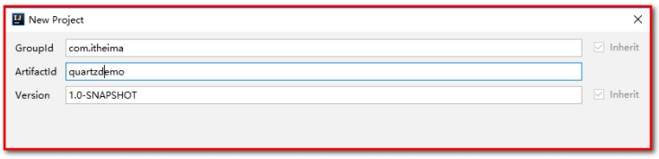
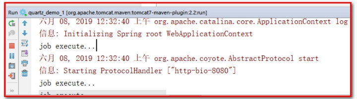
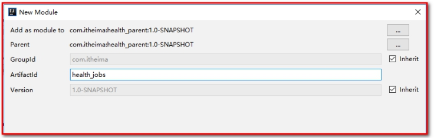
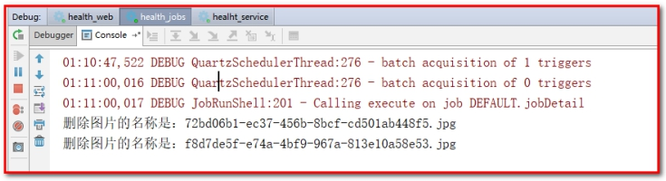
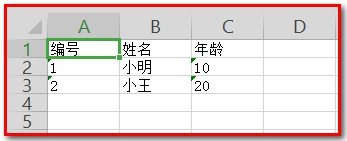
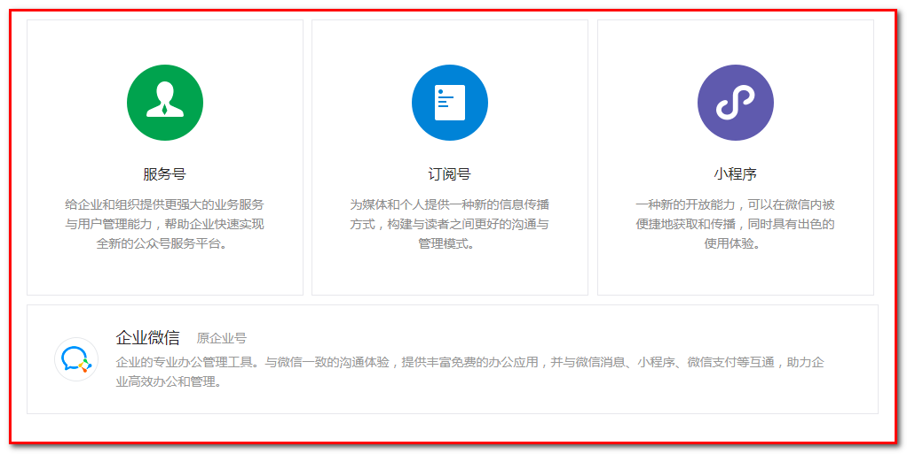
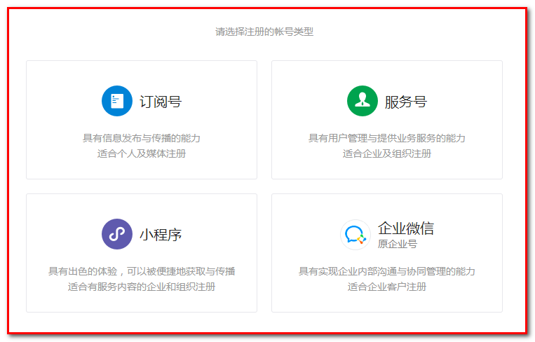
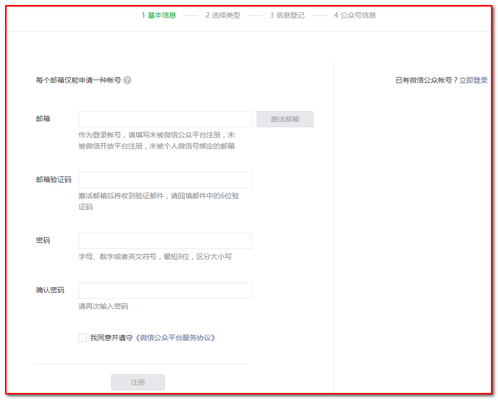
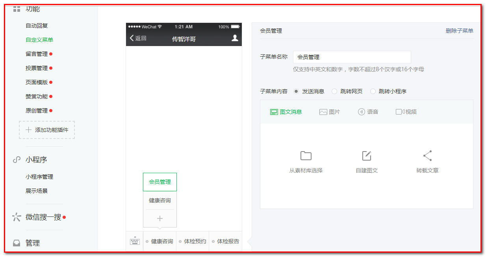

# 第4章 预约管理-定时任务Quartz、预约设置

目标：

- 掌握Quartz使用方式

- 了解什么是Apache POI

- 掌握Apache POI的使用方法

- 掌握批量导入预约设置信息的实现过程

- 掌握日历方式展示预约设置信息的实现过程

- 掌握基于日历实现预约设置信息的实现过程

- 了解常见的移动端开发方式

- 了解微信公众号开发过程


# 1. 定时任务组件Quartz

### 【目标】

定时任务组件Quartz

- 清除文件上传所产生的垃圾图片

### 【路径】

1：Quart介绍

- 掌握场景（定时任务）

2：Quartz入门案例

- spring整合Quartz（spring中配置）

3：cron表达式

4：cron表达式在线生成器

### 【讲解】

## 1.1. **Quartz介绍**

**什么是Quartz:用于定时任务调度框架(在设置时间执行代码)**

Quartz是Job scheduling（作业调度）领域的一个开源项目，Quartz既可以单独使用也可以跟spring框架整合使用，在实际开发中一般会使用后者。使用Quartz可以开发一个或者多个定时任务，每个定时任务可以单独指定执行的时间，例如每隔1小时执行一次、每个月第一天上午10点执行一次、每个月最后一天下午5点执行一次等。

官网：<http://www.quartz-scheduler.org/>

maven坐标：pom.xml依赖

```xml
<!--quartz的基础包-->
<dependency>
  <groupId>org.quartz-scheduler</groupId>
  <artifactId>quartz</artifactId>
  <version>2.2.1</version>
</dependency>
<dependency>
  <groupId>org.quartz-scheduler</groupId>
  <artifactId>quartz-jobs</artifactId>
  <version>2.2.1</version>
</dependency>
```

```xml
<!--spring整合Quartz-->
<dependency>
    <groupId>org.springframework</groupId>
    <artifactId>spring-context-support</artifactId>
    <version>5.0.2.RELEASE</version>
</dependency>
```

## 1.2. **Quartz入门案例**

【路径】

1：创建maven工程quartzdemo，打包方式为war，导入jar包

2：自定义一个Job

3：提供Spring配置文件application-jobs.xml，配置自定义Job、任务描述、触发器、调度工厂等

4：web.xml中定义

5：启动tomcat完成测试

【讲解】

本案例基于Quartz和spring整合的方式使用。具体步骤：

（1）创建maven工程quartzdemo，打包方式为war，导入Quartz和spring相关坐标，pom.xml文件如下

 

导入jar包

```xml
<?xml version="1.0" encoding="UTF-8"?>
<project xmlns="http://maven.apache.org/POM/4.0.0"
         xmlns:xsi="http://www.w3.org/2001/XMLSchema-instance"
         xsi:schemaLocation="http://maven.apache.org/POM/4.0.0 http://maven.apache.org/xsd/maven-4.0.0.xsd">
    <modelVersion>4.0.0</modelVersion>

    <groupId>com.itheima</groupId>
    <artifactId>quartz_demo_1</artifactId>
    <version>1.0-SNAPSHOT</version>
	<!--打包方式-->
    <packaging>war</packaging>
	<!--spring框架-->
    <dependencies>
        <dependency>
            <groupId>org.springframework</groupId>
            <artifactId>spring-context-support</artifactId>
            <version>5.0.2.RELEASE</version>
        </dependency>
        <dependency>
            <groupId>org.springframework</groupId>
            <artifactId>spring-tx</artifactId>
            <version>5.0.2.RELEASE</version>
        </dependency>
        <dependency>
            <groupId>org.springframework</groupId>
            <artifactId>spring-web</artifactId>
            <version>5.0.2.RELEASE</version>
        </dependency>
        <dependency>
            <groupId>org.quartz-scheduler</groupId>
            <artifactId>quartz</artifactId>
            <version>2.2.1</version>
        </dependency>
        
        <!--定时任务调度框架-->
        <dependency>
            <groupId>org.quartz-scheduler</groupId>
            <artifactId>quartz-jobs</artifactId>
            <version>2.2.1</version>
        </dependency>
    </dependencies>
    <build>
        <plugins>
            <plugin>
                <groupId>org.apache.tomcat.maven</groupId>
                <artifactId>tomcat7-maven-plugin</artifactId>
                <configuration>
                    <!-- 指定端口 -->
                    <port>8080</port>
                    <!-- 请求路径 -->
                    <path>/</path>
                </configuration>
            </plugin>
        </plugins>
    </build>
</project>
```

 

（2）自定义一个Job

```java
package com.itheima.job;

/**
 * 自定义Job
 */
public class JobDemo {
    public void run(){
        System.out.println("job execute...,执行时间："+new Date());
    }
}
```

 

（3）提供Spring配置文件application-jobs.xml，配置自定义Job、任务描述、触发器、调度工厂等

【路径】

1：创建JobDetail对象,作用是负责`通过反射`调用**指定的Job**,通过 注入目标对象，注入目标方法 完成**任务描述**

2：注册一个**触发器**，指定任务触发的时间 

3：注册一个统一的**调度工厂**，通过这个调度工厂调度任务

```xml
<?xml version="1.0" encoding="UTF-8"?>
<beans xmlns="http://www.springframework.org/schema/beans"
       xmlns:xsi="http://www.w3.org/2001/XMLSchema-instance"
       xmlns:context="http://www.springframework.org/schema/context"
       xsi:schemaLocation="http://www.springframework.org/schema/beans
                  http://www.springframework.org/schema/beans/spring-beans.xsd
                  http://www.springframework.org/schema/context
                  http://www.springframework.org/schema/context/spring-context.xsd">
    <!-- 注册自定义Job -->
    <bean id="jobDemo" class="com.itheima.job.JobDemo"></bean>
    <!-- 1：创建JobDetail对象,作用是负责通过反射调用指定的Job，注入目标对象，注入目标方法 -->
    <bean id="jobDetail"
          class="org.springframework.scheduling.quartz.MethodInvokingJobDetailFactoryBean">
        <!-- 注入目标对象:ref中的值是类中的类名 -->
        <property name="targetObject" ref="jobDemo"/>
        <!-- 注入目标方法:value中的值是类中的方法名-->
        <property name="targetMethod" value="run"/>
    </bean>
    
    <!-- 2：注册一个触发器，指定任务触发的时间 -->
    <bean id="myTrigger" class="org.springframework.scheduling.quartz.CronTriggerFactoryBean">
        <!-- 注入JobDetail -->
        <property name="jobDetail" ref="jobDetail"/>
        <!-- 指定触发的时间，基于Cron表达式（0/10表示从0秒开始，每10秒执行一次） -->
        <property name="cronExpression">
            <!--（0/10表示从0秒开始，每10秒执行一次）-->
            <value>0/10 * * * * ?</value>
        </property>
    </bean>
    <!-- 3：注册一个统一的调度工厂，通过这个调度工厂调度任务 -->
    <bean id="scheduler" class="org.springframework.scheduling.quartz.SchedulerFactoryBean">
        <!-- 注入多个触发器 -->
        <property name="triggers">
            <list>
                <!--bean="触发器id"-->

                <ref bean="myTrigger"/>
            </list>
        </property>
    </bean>
</beans>
```

 

（4）web.xml中定义

启动web，自动加载spring容器。

```xml
<?xml version="1.0" encoding="UTF-8"?>
<web-app xmlns:xsi="http://www.w3.org/2001/XMLSchema-instance"
         xmlns="http://java.sun.com/xml/ns/javaee"
         xsi:schemaLocation="http://java.sun.com/xml/ns/javaee http://java.sun.com/xml/ns/javaee/web-app_3_0.xsd"
         id="WebApp_ID" version="3.0">

    <listener>
        <listener-class>org.springframework.web.context.ContextLoaderListener</listener-class>
    </listener>
    <context-param>
        <param-name>contextConfigLocation</param-name>
        <param-value>classpath:application-jobs.xml</param-value>
    </context-param>
</web-app>
```

 

或者：

【2】编写main方法进行测试

```java
package com.itheima.main;

import org.springframework.context.support.ClassPathXmlApplicationContext;

public class App {
    public static void main(String[] args) {
        new ClassPathXmlApplicationContext("application-jobs.xml");
    }
}
```

 

执行上面main方法观察控制台，可以发现每隔10秒会输出一次，说明每隔10秒自定义Job被调用一次。

 

## 1.3. **cron表达式**

上面的入门案例中我们指定了一个表达式：0/10 * * * * ? 

这种表达式称为cron表达式，通过cron表达式可以灵活的定义出符合要求的程序执行的时间。本小节我们就来学习一下cron表达式的使用方法。如下图：

 

cron表达式分为七个域，之间使用空格分隔。其中最后一个域（年）可以为空。每个域都有自己允许的值和一些特殊字符构成。使用这些特殊字符可以使我们定义的表达式更加灵活。

下面是对这些特殊字符的介绍：

逗号（,）：指定一个值列表，例如使用在月域上1,4,5,7表示1月、4月、5月和7月

横杠（-）：指定一个范围，例如在时域上3-6表示3点到6点（即3点、4点、5点、6点）

星号（*）：表示这个域上包含所有合法的值。例如，在月份域上使用星号意味着每个月都会触发

斜线（/）：表示递增，例如使用在秒域上0/15表示每15秒

问号（?）：只能用在日和周域上，但是不能在这两个域上同时使用。表示不指定

井号（#）：只能使用在周域上，用于指定月份中的第几周的哪一天，例如6#3，意思是某月的第三个周五 (6=星期五，3意味着月份中的第三周)

L：某域上允许的最后一个值。只能使用在日和周域上。当用在日域上，表示的是在月域上指定的月份的最后一天。用于周域上时，表示周的最后一天，就是星期六

W：W 字符代表着工作日 (星期一到星期五)，只能用在日域上，它用来指定离指定日的最近的一个工作日

## 1.4. **cron表达式在线生成器**

前面介绍了cron表达式，但是自己编写表达式还是有一些困难的，我们可以借助一些cron表达式在线生成器来根据我们的需求生成表达式即可。

http://cron.qqe2.com/

 

### 【小结】

1：Quart介绍[定时任务框架]

- 掌握场景（定时任务）

2：Quartz入门案例

- spring整合Quartz（spring中配置）
  - 单独创建任务工程,打包方式war
  - 导入依赖spring依赖,以及Queartz依赖
  - 创建任务类(工作中的重点)
  - 配置spring-jobs.xml(注册任务类,任务详情,触发器,调度工厂)
  - Web.xml以监听方式加载spring-jobs

3：cron表达式

* 指定运行时间的表达式
  * 凌晨2点==>002**?

4：cron表达式在线生成器

<http://cron.qqe2.com/>

# 2. 定时清理垃圾图片

### 【目标】

Quartz整合项目，完成定时清理垃圾图片

### 【路径】

1：创建maven聚合工程health_jobs，打包方式为war，导入Quartz等相关坐标

2：配置web.xml

- web容器启动，加载spring容器

3：配置log4j.properties

4：配置applicationContext-redis.xml

- spring整合redis

5：配置applicationContext-jobs.xml

- spring整合Quartz

6：创建ClearImgJob定时任务类

- 使用Quartz清理垃圾图片

### 【讲解】

前面我们已经完成了体检套餐的管理，在新增套餐时套餐的基本信息和图片是分两次提交到后台进行操作的。也就是用户首先将图片上传到七牛云服务器，然后再提交新增窗口中录入的其他信息。如果用户只是上传了图片而没有提交录入的其他信息，此时的图片就变为了垃圾图片，因为在数据库中并没有记录它的存在。此时我们要如何处理这些垃圾图片呢？

解决方案就是通过定时任务组件定时清理这些垃圾图片。为了能够区分出来哪些图片是垃圾图片，我们在文件上传成功后将图片保存到了一个redis集合中，当套餐数据插入到数据库后我们又将图片名称保存到了另一个redis集合中，通过计算这两个集合的差值就可以获得所有垃圾图片的名称。

本章节我们就会基于Quartz定时任务，通过计算redis两个集合的差值找出所有的垃圾图片，就可以将垃圾图片清理掉。

## 2.1.  操作步骤

（1）创建maven聚合工程health_jobs，打包方式为war，导入Quartz等相关坐标

 

```xml
<?xml version="1.0" encoding="UTF-8"?>
<project xmlns="http://maven.apache.org/POM/4.0.0"
         xmlns:xsi="http://www.w3.org/2001/XMLSchema-instance"
         xsi:schemaLocation="http://maven.apache.org/POM/4.0.0 http://maven.apache.org/xsd/maven-4.0.0.xsd">
    <parent>
        <artifactId>health_parent</artifactId>
        <groupId>com.itheima</groupId>
        <version>1.0-SNAPSHOT</version>
    </parent>
    <modelVersion>4.0.0</modelVersion>

    <artifactId>health_jobs</artifactId>

    
    <!--打包方式-->
    <packaging>war</packaging>

    <!--导入依赖-->
    <dependencies>
        <!--依赖业务接口-->
        <dependency>
            <groupId>com.itheima</groupId>
            <artifactId>health_interface</artifactId>
            <version>1.0-SNAPSHOT</version>
        </dependency>

        <!--Quartz定时任务调度依赖-->
        <dependency>
            <groupId>org.quartz-scheduler</groupId>
            <artifactId>quartz</artifactId>
        </dependency>
        <!--Quartz的jobs的依赖-->
        <dependency>
            <groupId>org.quartz-scheduler</groupId>
            <artifactId>quartz-jobs</artifactId>
        </dependency>
    </dependencies>
    <!--Tomcat:端口是83-->
    <build>
        <plugins>
            <plugin>
                <groupId>org.apache.tomcat.maven</groupId>
                <artifactId>tomcat7-maven-plugin</artifactId>
                <configuration>
                    <!-- 指定端口 -->
                    <port>83</port>
                    <!-- 请求路径 -->
                    <path>/</path>
                </configuration>
            </plugin>
        </plugins>
    </build>
</project>
```

 

（2）配置web.xml

```xml
<?xml version="1.0" encoding="UTF-8"?>
<web-app xmlns:xsi="http://www.w3.org/2001/XMLSchema-instance"
         xmlns="http://java.sun.com/xml/ns/javaee"
         xsi:schemaLocation="http://java.sun.com/xml/ns/javaee http://java.sun.com/xml/ns/javaee/web-app_3_0.xsd"
         id="WebApp_ID" version="3.0">
    <display-name>Archetype Created Web Application</display-name>
    <!-- 加载spring容器 -->
    <context-param>
        <param-name>contextConfigLocation</param-name>
        <!-- classpath*:加载所有依赖工厂的配置文件 -->
        <param-value>classpath*:applicationContext*.xml</param-value>
    </context-param>
    <listener>
        <listener-class>org.springframework.web.context.ContextLoaderListener</listener-class>
    </listener>
</web-app>
```

 

（3）配置log4j.properties

```properties
### direct log messages to stdout ###
log4j.appender.stdout=org.apache.log4j.ConsoleAppender
log4j.appender.stdout.Target=System.err
log4j.appender.stdout.layout=org.apache.log4j.PatternLayout
log4j.appender.stdout.layout.ConversionPattern=%d{ABSOLUTE} %5p %c{1}:%L - %m%n

### direct messages to file mylog.log ###
log4j.appender.file=org.apache.log4j.FileAppender
log4j.appender.file.File=c:\\mylog.log
log4j.appender.file.layout=org.apache.log4j.PatternLayout
log4j.appender.file.layout.ConversionPattern=%d{ABSOLUTE} %5p %c{1}:%L - %m%n

### set log levels - for more verbose logging change 'info' to 'debug' ###

log4j.rootLogger=debug, stdout
```

 

（4）配置applicationContext-redis.xml

```xml
<?xml version="1.0" encoding="UTF-8"?>
<beans xmlns="http://www.springframework.org/schema/beans"
       xmlns:xsi="http://www.w3.org/2001/XMLSchema-instance"
       xmlns:p="http://www.springframework.org/schema/p"
       xmlns:context="http://www.springframework.org/schema/context"
       xmlns:dubbo="http://code.alibabatech.com/schema/dubbo"
       xmlns:mvc="http://www.springframework.org/schema/mvc"
       xsi:schemaLocation="http://www.springframework.org/schema/beans
                         http://www.springframework.org/schema/beans/spring-beans.xsd
                        http://www.springframework.org/schema/mvc
                         http://www.springframework.org/schema/mvc/spring-mvc.xsd
                        http://code.alibabatech.com/schema/dubbo
                         http://code.alibabatech.com/schema/dubbo/dubbo.xsd
                        http://www.springframework.org/schema/context
                         http://www.springframework.org/schema/context/spring-context.xsd">

    <!--Jedis连接池的相关配置-->
    <bean id="jedisPoolConfig" class="redis.clients.jedis.JedisPoolConfig">
        <property name="maxTotal">
            <value>200</value>
        </property>
        <property name="maxIdle">
            <value>50</value>
        </property>
        <property name="testOnBorrow" value="true"/>
        <property name="testOnReturn" value="true"/>
    </bean>
    <bean id="jedisPool" class="redis.clients.jedis.JedisPool">
        <constructor-arg name="poolConfig" ref="jedisPoolConfig" />
        <constructor-arg name="host" value="127.0.0.1" />
        <constructor-arg name="port" value="6379" type="int" />
        <constructor-arg name="timeout" value="30000" type="int" />
    </bean>
</beans>
```

 

（5）配置applicationContext-jobs.xml

使用组件：注解扫描器

```xml
    <!--开启注解配置支持，否则在ClearImgJob不能使用@Autowired-->
    <context:annotation-config></context:annotation-config>
```

或者：注解扫描器

```xml
<!--组件的扫描:主要用的-->
<context:component-scan base-package="com.itheima"></context:component-scan>
```

​	applicationContext-jobs.xml

```xml
<?xml version="1.0" encoding="UTF-8"?>
<beans xmlns="http://www.springframework.org/schema/beans"
       xmlns:xsi="http://www.w3.org/2001/XMLSchema-instance"
       xmlns:context="http://www.springframework.org/schema/context"
       xsi:schemaLocation="http://www.springframework.org/schema/beans
                  http://www.springframework.org/schema/beans/spring-beans.xsd
                  http://www.springframework.org/schema/context
                  http://www.springframework.org/schema/context/spring-context.xsd">
    <!--开启注解配置支持，否则在ClearImgJob不能使用@Autowired-->
    <context:annotation-config></context:annotation-config>

    <!-- 注册自定义Job[修改点:功能类的位置] -->
    <bean id="jobDemo" class="com.itheima.job.ClearImgJob"></bean>
    <!-- 注册JobDetail,作用是负责通过反射调用指定的Job -->
    <bean id="jobDetail"
          class="org.springframework.scheduling.quartz.MethodInvokingJobDetailFactoryBean">
        <!-- 注入目标对象 -->
        <property name="targetObject" ref="jobDemo"/>
        <!-- 注入目标方法[修改点:功能类中方法] -->
        <property name="targetMethod" value="clearImg"/>
    </bean>
    <!-- 注册一个触发器，指定任务触发的时间 -->
    <bean id="myTrigger" class="org.springframework.scheduling.quartz.CronTriggerFactoryBean">
        <!-- 注入JobDetail -->
        <property name="jobDetail" ref="jobDetail"/>
        <!-- 指定触发的时间，基于Cron表达式（0 0 2 * * ?表示凌晨2点执行） -->
        <property name="cronExpression">
            <value>0 0 2 * * ?</value>
        </property>
    </bean>
    <!-- 注册一个统一的调度工厂，通过这个调度工厂调度任务 -->
    <bean id="scheduler" class="org.springframework.scheduling.quartz.SchedulerFactoryBean">
        <!-- 注入多个触发器 -->
        <property name="triggers">
            <list>
                <ref bean="myTrigger"/>
            </list>
        </property>
    </bean>
</beans>
```


（6）创建ClearImgJob定时任务类

```java
package com.itheima.job;
import com.itheima.constant.RedisConstant;
import com.itheima.utils.QiniuUtils;
import org.springframework.beans.factory.annotation.Autowired;
import redis.clients.jedis.JedisPool;

import java.util.Iterator;
import java.util.Set;
/**
 * 定时任务：清理垃圾图片
 */
public class ClearImgJob {

    @Autowired
    private JedisPool jedisPool;
    //清理图片
    public void clearImg(){
        //计算redis中两个集合的差值，获取垃圾图片名称
        Set<String> set = jedisPool.getResource().sdiff(
                RedisConstant.SETMEAL_PIC_RESOURCES,
                RedisConstant.SETMEAL_PIC_DB_RESOURCES);
        Iterator<String> iterator = set.iterator();
        while(iterator.hasNext()){
            String pic = iterator.next();
            System.out.println("删除图片的名称是："+pic);
            //删除图片服务器中的图片文件
            QiniuUtils.deleteFileFromQiniu(pic);
            //删除redis中的数据
            jedisPool.getResource().srem(RedisConstant.SETMEAL_PIC_RESOURCES,pic);
        }
    }
}
```

检查位置


测试：

 

### 【小结】

1：创建maven聚合工程health_jobs，打包方式为war，导入Quartz等相关坐标

2：配置web.xml

- web容器启动，加载spring容器
  - 监听方式加载配置文件application*.xml

3：配置log4j.properties

4：配置applicationContext-redis.xml

- spring整合redis

5：配置applicationContext-jobs.xml

- spring整合Quartz
  - 改类名和方法名

6：创建ClearImgJob定时任务类

- 使用Quartz清理垃圾图片


# 3. 预约设置需求分析

### 【目标】

- 掌握预约设置的需求
  - 比如:数量限制(只有10个名额)
  - 比如:休息日不开放

### 【路径】

1. 预约设置需求分析
2. 对应的表结构和实体类

### 【讲解】

## 3.1. 预约设置需求分析

前面我们已经完成了检查项管理、检查组管理、套餐管理等。接下来我们需要进行预约设置，其实就是设置每一天的体检预约最大数量。客户可以通过微信端在线预约，在线预约时需要选择体检的时间，使得选择体检时间的已预约人数加1，如果客户选择的时间已经预约满则无法进行预约。

## 3.2. t_ordersetting表结构

 

orderDate：预约日期 

number：最多可预约人数 

reservations：已预约人数


****

#### 对应的pojo类

OrderSetting实体类


### 【小结】

1. 预约设置 就是设置一天最大预约体检人数（number字段）
2. 客户预约的时候，需要更新当前预约人数+1（reservations字段）

# 4. **Apache POI**

### 【目标】

了解什么是Apache POI

掌握Apache POI的使用方法

### 【路径】

1. POI介绍

2. POI入门案例

   （1）从Excel文件读取数据

   （2）向Excel文件写入数据

3. POI工具类的介绍

### 【讲解】

## 4.1. **POI介绍**

**做什么的:POI操作office的框架:主要操作Excel文件**

Apache POI是用Java编写的免费开源的跨平台的Java API，Apache POI提供API给Java程序对Microsoft Office格式档案读和写的功能，其中使用最多的就是使用POI操作Excel文件。

jxl：专门操作Excel

maven坐标：

```xml
<dependency>
  <groupId>org.apache.poi</groupId>
  <artifactId>poi</artifactId>
  <version>3.14</version>
</dependency>
<dependency>
  <groupId>org.apache.poi</groupId>
  <artifactId>poi-ooxml</artifactId>
  <version>3.14</version>
</dependency>
```

POI结构：

```java
HSSF － 提供读写Microsoft Excel XLS格式档案的功能
XSSF － 提供读写Microsoft Excel OOXML XLSX格式档案的功能（我们使用）
HWPF － 提供读写Microsoft Word DOC格式档案的功能
HSLF － 提供读写Microsoft PowerPoint格式档案的功能
HDGF － 提供读Microsoft Visio格式档案的功能[软件]
HPBF － 提供读Microsoft Publisher格式档案的功能
HSMF － 提供读Microsoft Outlook格式档案的功能
```

我们使用：XSSF － 提供读写Microsoft Excel OOXML XLSX格式档案的功能


## 4.2. **入门案例**

### 4.2.1. **从Excel文件读取数据**

【需求】

使用POI可以从一个已经存在的Excel文件中读取数据


【路径】

1：创建工作簿对象

2：获得工作表对象

3：遍历工作表对象 获得行对象

4：遍历行对象 获得单元格（列）对象

5：获得数据

6：关闭

【讲解】

1. 实现

#### 第一种方式:不推荐使用

使用POI可以从一个已经存在的Excel文件中读取数据

##### 在health_common中建立测试类，TestPoi.java

```java
// 读取excel(第一种方式:不推荐使用)
@Test
public void readExcel1() throws IOException {
    //1.创建工作簿
    XSSFWorkbook workbook = new XSSFWorkbook("D:\\read.xlsx");
    //2.获取工作表，既可以根据工作表的顺序获取，也可以根据工作表的名称获取
    XSSFSheet sheet = workbook.getSheetAt(0);
    //3.遍历工作表获得行对象
    for (Row row : sheet) {
        //4.遍历行对象获取单元格对象
        for (Cell cell : row) {
            //5.获得单元格中的值
            String value = cell.getStringCellValue();
            System.out.println(value);
        }
    }
    //6.关流
    workbook.close();
}
```

通过上面的入门案例可以看到，POI操作Excel表格封装了几个核心对象：

```
XSSFWorkbook：工作簿
XSSFSheet：工作表
XSSFRow：行
XSSFCell：单元格
```

上面案例是通过遍历工作表获得行，遍历行获得单元格，最终获取单元格中的值。

#### 第二种方式:推荐使用

还有一种方式就是获取工作表最后一个行号，从而根据行号获得行对象，通过行获取最后一个单元格索引，从而根据单元格索引获取每行的一个单元格对象，代码如下：

```java
package com.itheima;

import org.apache.poi.xssf.usermodel.XSSFRow;
import org.apache.poi.xssf.usermodel.XSSFSheet;
import org.apache.poi.xssf.usermodel.XSSFWorkbook;
import org.junit.Test;

import java.io.IOException;

/**
 * @Author: wzw
 * @Date: 2020/11/13 18:14
 * @version: 1.8
 */
public class TestPoi {
    //获取excel文件.获取最后一行
    @Test
    public void readExcel2() throws IOException {
        //1.创建工作簿(文件的路径),有编译时异常
        XSSFWorkbook workbook = new XSSFWorkbook("C:\\Users\\15710\\Desktop\\read.xlsx");
        //2.获取工作表,既可以根据工作表的顺序获取去,也可以根据工作的名称获取
        XSSFSheet sheetAt = workbook.getSheetAt(0);
        //3.获取当前工作表最后一行的行号,行号从0开始
        int lastRowNum = sheetAt.getLastRowNum();
        //4.遍历所有行
        for (int i = 0; i <= lastRowNum; i++) {
            //5.根据行号获取对象
            XSSFRow row = sheetAt.getRow(i);
            //6.根据行号获取所有列
            short lastCellNum = row.getLastCellNum();
            //7.循环单行的所有列()
            for (short j = 0; j < lastCellNum; j++) {
                //8.获取每行每列对象
                String value = row.getCell(j).getStringCellValue();
                //打印
                System.out.println(value);
            }
            System.out.println("*********************");

        }
        //9.关流
        workbook.close();
    }
}
```

结果图

 

#### 注意

​		文件在读取的时候,不能要其他应用打开该Excel表格,不然会报错

​	

### 4.2.2. **向Excel文件写入数据**

【需求】

 使用POI可以在内存中创建一个Excel文件并将数据写入到这个文件，最后通过输出流将内存中的Excel文件下载到磁盘

【路径】

```
1.创建工作簿对象
2.创建工作表对象
3.创建行对象
4.创建列(单元格)对象, 设置内容
5.通过输出流将workbook对象下载到磁盘
```

【实现】

使用POI可以在内存中创建一个Excel文件并将数据写入到这个文件，最后通过输出流将内存中的Excel文件下载到磁盘

```java
package com.itheima;

import org.apache.poi.xssf.usermodel.XSSFRow;
import org.apache.poi.xssf.usermodel.XSSFSheet;
import org.apache.poi.xssf.usermodel.XSSFWorkbook;
import org.junit.Test;

import java.io.FileOutputStream;
import java.io.IOException;

/**
 * @Author: wzw
 * @Date: 2020/11/13 18:14
 * @version: 1.8
 */
public class TestPoi {

    //写入文件
    @Test
    public void createExcel() throws IOException {
        //1.在内存种创建一个Excel文件
        XSSFWorkbook workbook = new XSSFWorkbook();
        //2.创建工作表,指定工作表名称(打开文件左下脚)
        XSSFSheet sheet = workbook.createSheet("测试文件");

        //3.创建行,0表示1行
        XSSFRow row = sheet.createRow(0);

        //3.1创建单元格,0表示第一个单元格
        row.createCell(0).setCellValue("编号");
        row.createCell(1).setCellValue("姓名");
        row.createCell(2).setCellValue("年龄");

        //创建行,1表示2行
        XSSFRow row1 = sheet.createRow(1);

        //创建单元格,0表示第一个单元格
        row1.createCell(0).setCellValue("1");
        row1.createCell(1).setCellValue("小王");
        row1.createCell(2).setCellValue("18");

        //创建行,2表示3行
        XSSFRow row2 = sheet.createRow(2);

        //创建单元格,0表示第一个单元格
        row2.createCell(0).setCellValue("2");
        row2.createCell(1).setCellValue("小娘们");
        row2.createCell(2).setCellValue("17");

        //4.通过输出流将workbook对象下载到磁盘(有编译时异常)
        FileOutputStream out = new FileOutputStream("C:\\Users\\15710\\Desktop\\asd.xlsx");
        //5.写出(有编译时异常)
        workbook.write(out);
        //6.刷新
        out.flush();
        //7.关流
        out.close();
        workbook.close();


    }
}
```

 

小结：POI技术（向Excel文件写入数据）

- 创建工作簿的时候, 不需要传入参数(excel不存在的)
- 使用输出流，输出excel

应用场景：1：从excel中读取数据，写入到数据库（导入）；2：从数据库查询数据，写入到excel文件（报表技术，导出）

### 4.2.3.POI工具类的介绍

工具类在哪里


将资料中的POIUtils工具类复制到health_common工程

 

**注意**

也就readExcel方法是实现功能的,其他都是校验的方法

### 【小结】

1.POI介绍

​	POI就是一个工具, 用来操作Office, 主要用来操作Excel

2.POI入门案例

​	（1）从Excel文件读取数据（导入到数据库）

​	（2）向Excel文件写入数据（导出报表）

3.POI工具类的介绍

​	使用工具类, 读取Excel, 每一行读取到了String[] 里面, 多行就是多个String[] , 最终封装到List

# 5. **批量导入预约设置信息**

### 【目标】

批量导入预约设置信息

### 【路径】

1：前台代码

（1）提供模板文件

（2）实现模板文件下载（填写数据）

（3）文件上传（读取excel的数据，批量导入到数据库）

2：后台代码

业务：

- 从excel中读取预约设置信息，批量导入到数据库

（1）OrderSettingController.java（Controller）

（2）OrderSettingService.java（服务接口）

（3）OrderSettingServiceImpl.java（服务实现类）

（4）OrderSettingDao.java（Dao接口）

（5）OrderSettingDao.xml（Mapper映射文件）

### 【讲解】

【需求】

从Excel读取预约设置的数据，批量导入到数据库


【设计】

预约设置信息对应的数据表为t_ordersetting，预约设置操作对应的页面为ordersetting.html

1：t_ordersetting表结构：

 

orderDate：预约日期 

number：最多可预约人数 

reservations：已预约人数

【路径】

批量导入预约设置信息操作过程：

​	第一步、点击模板下载按钮下载Excel模板文件【文件下载】

​	第二步、将预约设置信息录入到模板文件中

​	第三步、点击上传文件按钮将录入完信息的模板文件上传到服务器【文件上传】

​	第四步、通过POI读取上传文件的数据并保存到数据库【poi导入】

2：将ordersetting.html放置到health_web中

 

## 5.1. **前台代码**

### 5.1.1. **提供模板文件**

资料中已经提供了Excel模板文件ordersetting_template.xlsx，将文件放在health_web工程的template目录下

 

### 5.1.2. **实现模板文件下载**

（1）为模板下载按钮绑定事件实现模板文件下载

```html
<el-button style="margin-bottom: 20px;margin-right: 20px" type="primary" @click="downloadTemplate()">模板下载</el-button>
```

（2）downloadTemplate()

```javascript
//下载模板文件
downloadTemplate(){
    window.location.href="../template/ordersetting_template.xlsx";
},
```

downloadTemplate

### 5.1.3. **文件上传**

（1）使用ElementUI的上传组件实现文件上传并绑定相关事件

```html
<el-upload action="/ordersetting/upload.do"
           name="excelFile"
           :show-file-list="false"
           :on-success="handleSuccess"
           :before-upload="beforeUpload">
    <el-button type="primary">上传文件</el-button>
</el-upload>
```

（2）handleSuccess方法：用于显示上传成功或者失败信息。

```javascript
//上传成功提示
handleSuccess(response, file) {
    if(response.flag){
         this.$message({
              message: response.message,
              type: 'success'
         });
    }else{
         this.$message.error(response.message);
    }
},
```

 

（3）beforeUpload方法：用于校验上传的文件是否是excel文件

```javascript
//上传之前进行文件格式校验
beforeUpload(file){
    const isXLS = file.type = 'application/vnd.ms-excel';
    if(isXLS){
        return true;
    }
    const isXLSX = file.type = 'application/vnd.openxmlformats-officedocument.spreadsheetml.sheet';
    if (isXLSX) {
        return true;
    }
    this.$message.error('上传文件只能是xls或者xlsx格式!');
    return false;
},
```


## 5.2. **后台代码**

### 5.2.1. **Controller**

【路径】

1.点击上传文件, 把编写好的Excel上传到OrderSettingController

2.创建OrderSettingController, 创建upload()方法

```
//1.使用POI解析文件 得到List<String[]> list
//2.把List<String[]> list转成 List<OrderSetting> list
//3.调用业务 进行保存
```

3.创建OrderSettingService

```
//1.遍历List<OrderSetting> list
//2.判断当前的日期之前是否设置过
		//2.1 如果设置过, 更新数量
		//2.2 没有设置过, 保存
```

4.创建OrderSettingDao  

```
//根据日期查询

//根据日期更新number

//保存OrderSetting
```


在health_web工程创建OrderSettingController并提供upload方法

```java
package com.itheima.controller;

import com.alibaba.dubbo.config.annotation.Reference;
import com.itheima.constant.MessageConstant;
import com.itheima.entity.Result;
import com.itheima.pojo.OrderSetting;
import com.itheima.service.OrderSettingService;
import com.itheima.utils.POIUtils;
import org.springframework.web.bind.annotation.RequestMapping;
import org.springframework.web.bind.annotation.RequestParam;
import org.springframework.web.bind.annotation.RestController;
import org.springframework.web.multipart.MultipartFile;

import java.io.IOException;
import java.util.ArrayList;
import java.util.Date;
import java.util.List;

/**
 * 预约设置
 * @Author: wzw
 * @Date: 2020/11/13 20:42
 * @version: 1.8
 */
@RestController
@RequestMapping("/ordersetting")
public class OrderSettingController {
    
    //订阅业务接口
    @Reference
    private OrderSettingService orderSettingService;
    
    /**
     * Excel文件上传,并解析文件内容批量保存到数据库
     * @param excelFile 提交上来的文件
     * @return 是否成功
     */
    @RequestMapping("/upload")
    public Result upload(@RequestParam("excelFile")MultipartFile excelFile){
        try {
            //1.读取Excel文件数据:这个工具类有异常,要try
            List<String[]> list = POIUtils.readExcel(excelFile);

            //2.将List<String[]>转为List<OrderSetting>
            if (list != null && list.size()>0) {
                //2.1创建List<OrderSetting>
                List<OrderSetting> settingArrayList = new ArrayList<>();
                //2.2循环List<String[]>中的内容
                for (String[] strings : list) {
                    //2.3创建实现类:strings == excel 每一行数据[2020-11-15,500]==>(时间,预约人数)
                    OrderSetting orderSetting = new OrderSetting(new Date(strings[0]),Integer.parseInt(strings[1]));
                    //2.4将每行数据放入集合中(这样就转成List<OrderSetting>集合了)
                    settingArrayList.add(orderSetting);
                }
                //3.实现功能:批量添加功能功能==>>传入List<OrderSetting>参数
                orderSettingService.add(settingArrayList);
            }

            //4.处理结果集
            //成功
            return new Result(true,MessageConstant.IMPORT_ORDERSETTING_SUCCESS);
        } catch (IOException e) {
            e.printStackTrace();
            //失败
            return new Result(false, MessageConstant.IMPORT_ORDERSETTING_FAIL);
        }
    }
}

```

 OrderSetting实体类(POJO)

```java
/**
 * 预约设置
 */
public class OrderSetting implements Serializable{
    private Integer id ;
    private Date orderDate;//预约设置日期
    private int number;//可预约人数
    private int reservations ;//已预约人数
    //get和set方法
}
```

### 5.2.2. **服务接口**

创建OrderSettingService服务接口并提供新增方法

```java
package com.itheima.service;

import com.itheima.pojo.OrderSetting;

import java.util.List;
/**
 * 预约设置服务接口
 */
public interface OrderSettingService {

    void add(List<OrderSetting> orderSettingList);
}
```

 

### 5.2.3. **服务实现类**

创建服务实现类OrderSettingServiceImpl并实现新增方法

```java
package com.itheima.service;

import com.alibaba.dubbo.config.annotation.Service;
import com.itheima.dao.OrderSettingDao;
import com.itheima.pojo.OrderSetting;
import org.springframework.beans.factory.annotation.Autowired;
import org.springframework.transaction.annotation.Transactional;

import java.util.List;

/**
 * 预约设置
 */
@Service(interfaceClass = OrderSettingService.class) //如果是2.6.2就可以不加字节码
@Transactional //事务
public class OrderSettingServiceImpl implements OrderSettingService {

    //注入
    @Autowired
    OrderSettingDao orderSettingDao;

    //批量添加
    public void add(List<OrderSetting> list) {
        if (list != null && list.size() > 0) {
            //
            for (OrderSetting orderSetting : list) {
                //检查此数据（日期）是否存在
                int count = orderSettingDao.findCountByOrderDate(orderSetting.getOrderDate());
                if (count > 0) {
                    //已经存在，执行更新操作:根据预约时间修改该预约人数
                    orderSettingDao.editNumberByOrderDate(orderSetting);
                } else {
                    //不存在，执行添加操作
                    orderSettingDao.add(orderSetting);
                }
            }
        }
    }
}
```

 

### 5.2.4. **Dao接口**

创建Dao接口OrderSettingDao并提供更新和新增方法

```java
package com.itheima.dao;

import com.itheima.pojo.OrderSetting;
import org.springframework.stereotype.Repository;

import java.util.Date;

/**
 * 持久层Dao接口
 */
@Repository
public interface OrderSettingDao {


    int findCountByOrderDate(Date orderDate);

    void editNumberByOrderDate(OrderSetting orderSetting);

    void add(OrderSetting orderSetting);
}

```

 

### 5.2.5. **Mapper映射文件**

创建Mapper映射文件OrderSettingDao.xml并提供相关SQL

```xml
<?xml version="1.0" encoding="UTF-8" ?>
<!DOCTYPE mapper PUBLIC "-//mybatis.org//DTD Mapper 3.0//EN"
        "http://mybatis.org/dtd/mybatis-3-mapper.dtd" >
<mapper namespace="com.itheima.dao.OrderSettingDao">
    <!--根据预约日期查询-->
    <select id="findCountByOrderDate" parameterType="java.util.Date" resultType="int">
        select count(*) from t_ordersetting where orderDate = #{orderDate}
    </select>
  
    <!--新增-->
    <insert id="add" parameterType="com.itheima.pojo.OrderSetting">
        insert into t_ordersetting
            (orderDate,number,reservations)
        values
            (#{orderDate},#{number},#{reservations})
    </insert>
  
    <!--根据日期更新预约人数-->
    <update id="editNumberByOrderDate" parameterType="com.itheima.pojo.OrderSetting">
        update t_ordersetting set number = #{number} where orderDate = #{orderDate}
    </update>
    
</mapper>
```

查看t_ordersetting表

 

### 【小结】

1：前台代码

（1）提供模板文件

（2）实现模板文件下载

（3）文件上传

2：后台代码

业务：

- 从excel中读取预约设置信息，批量导入到数据库

（1）OrderSettingController.java（Controller）

（2）OrderSettingService.java（服务接口）

（3）OrderSettingServiceImpl.java（服务实现类）

（4）OrderSettingDao.java（Dao接口）

（5）OrderSettingDao.xml（Mapper映射文件）

# 6. **日历展示预约设置信息**

### 【目标】

日历展示预约设置信息

### 【路径】

1：前台代码

（1）使用静态数据调试

（2）发送ajax获取动态数据

2：后台代码

业务：

- 在页面上，使用日历展示预约设置信息

（1）OrderSettingController.java（Controller）

（2）OrderSettingService.java（服务接口）

（3）OrderSettingServiceImpl.java（服务实现类）

（4）OrderSettingDao.java（Dao接口）

（5）OrderSettingDao.xml（Mapper映射文件）

3：初始化下个月，上个月数据

### 【讲解】

【需求】

前面已经完成了预约设置功能，现在就需要通过日历的方式展示出来每天设置的预约人数。

在页面中已经完成了日历的动态展示，我们只需要查询当前月份的预约设置信息并展示到日历中即可，同时在日历中还需要展示已经预约的人数，效果如下：

 

## 6.1. **前台代码**

### 6.1.1. **使用静态数据调试**

为了能够快速看到效果，我们可以先使用静态数据模拟，然后再改为发送ajax请求查询数据库。

实现步骤：

（1）预约设置数据对应的模型数据为leftobj，在initData方法最后为leftobj模型数据赋值：

```javascript
this.leftobj = [
    { date: 1, number: 120, reservations: 1 },
    { date: 3, number: 120, reservations: 1 },
    { date: 4, number: 120, reservations: 120 },
    { date: 6, number: 120, reservations: 1 },
    { date: 8, number: 120, reservations: 1 }
];
```

 

其中date表示日期，number表示可预约人数，reservations表示已预约人数

（2）使用VUE的v-for标签遍历上面的leftobj模型数据，展示到日历上：

```html
<template>
    <template v-for="obj in leftobj">
        <template v-if="obj.date  dayobject.day.getDate()">
            <template v-if="obj.number > obj.reservations">
                <div class="usual">
                     <p>可预约{{obj.number}}人</p>
                     <p>已预约{{obj.reservations}}人</p>
                </div>
            </template>
            <template v-else>
                <div class="fulled">
                    <p>可预约{{obj.number}}人</p>
                    <p>已预约{{obj.reservations}}人</p>
                    <p>已满</p>
                </div>
            </template>
        </template>
    </template>
    <button v-if="dayobject.day > today" @click="handleOrderSet(dayobject.day)" class="orderbtn">设置</button>
</template>
```

 

 

### 6.1.2. **发送ajax获取动态数据**

将上面的静态模拟数据去掉，改为发送ajax请求，根据当前页面对应的月份查询数据库获取预约设置信息，将查询结果赋值给leftobj模型数据

（1）在钩子函数created中添加：

```javascript
created: function () {//在vue初始化时调用
    this.initData(null);
    //日历展示预约设置信息
    this.createdData();
},
```

 （2）创建函数createData()

组织this.leftobj的数据，返回List<Map>

```javascript
//日历展示预约设置信息:根据当前页面对应的月份查询预约设置信息
createdData(){
    //发送Ajax的post的请求完成日历展示(年,月)
    axios.get("/ordersetting/getOrderSettingByMonth.do?date="+this.currentYear+"-"+this.currentMonth).then(Response=>{
        //日历展示预约设置信息赋值
        this.leftobj = Response.data.data;
        //提示
        this.$message({
            type: response.data.flag?'success':'error',
            message: response.data.message
        });
    });
},
```

 

## 6.2. **后台代码**

【路径】

1.OrderSettingController.java

2.OrderSettingServiceImpl.java

```java
// 1.组织查询Map，dateBegin表示月份开始时间，dateEnd月份结束时间
// 2.查询当前月份的预约设置
// 3.将List<OrderSetting>，组织成List<Map>
```
3.OrderSettingDao.java

查询当前月份的预约设置

4.OrderSettingDao.xml

查询当前月份的预约设置（使用between and）

### 6.2.1. **Controller**

在OrderSettingController中提供getOrderSettingByMonth方法，根据月份查询预约设置信息

```java
/**
 * 根据日期查询预约设置数据(获取指定日期所在月份的预约设置数据)
 * @param date
 * @return
 */
@RequestMapping("/getOrderSettingByMonth")
public Result getOrderSettingByMonth(String date){//参数格式为：2019-03
    try{
        List<Map> list = orderSettingService.getOrderSettingByMonth(date);
        //获取预约设置数据成功
        return new Result(true,MessageConstant.GET_ORDERSETTING_SUCCESS,list);
    }catch (Exception e){
        e.printStackTrace();
        //获取预约设置数据失败
        return new Result(false,MessageConstant.GET_ORDERSETTING_FAIL);
    }
}
```


### 6.2.2. **服务接口**

在OrderSettingService服务接口中扩展方法getOrderSettingByMonth

```java
List<Map> getOrderSettingByMonth(String date); //参数格式为：2019-03
```

 

### 6.2.3. **服务实现类**

在OrderSettingServiceImpl服务实现类中实现方法getOrderSettingByMonth

```java
 /**
     * 根据日期查询预约设置数据(获取指定日期所在月份的预约设置数据)
     * @param date 参数格式为：2019-03
     * @return List<Map>集合
     */
    @Override
    public List<Map> getOrderSettingByMonth(String date) {
        //1.组织查询Map,
        // dateBegin表示月份开始时间,
        String dateBegin = date + "-1";//2019-03-1
        //deteEnd月份结束时间
        String dateEnd = date + "-31";//2019-03-31
        //创建Map集合存放查询时间范围
        Map map = new HashMap();
        //添加开始时间
        map.put("dateBegin",dateBegin);
        //添加结束时间
        map.put("dateEnd",dateEnd);

        //2.实现功能:查询当前月份的预约设置
        List<OrderSetting> list = orderSettingDao.getOrderSettingByMonth(map);

        //3.将List<OrderSetting>组织成List<Map>
        //创建List<Map>,存放日期/可预约人数/已预约人数
        List<Map> data = new ArrayList<>();
        //循环List<OrderSetting> 获取 其中的对象
        for (OrderSetting orderSetting : list) {
            //创建map存OrderSetting对象中的值
            Map orderSettingMap = new HashMap();
            //获得日期(几号)
            orderSettingMap.put("date",orderSetting.getOrderDate().getDate());
            //获取可预约人数
            orderSettingMap.put("number",orderSetting.getNumber());
            //获取已预约人数
            orderSettingMap.put("reservations",orderSetting.getReservations());
            //添加到List<Map>中
            data.add(orderSettingMap);
        }
        
        //4.返回List<Map>集合
        return data;
    }
```

 

### 6.2.4. **Dao接口**

在OrderSettingDao接口中扩展方法getOrderSettingByMonth

```java
List<OrderSetting> getOrderSettingByMonth(Map map);
```

 

### 6.2.5. **Mapper映射文件**

在OrderSettingDao.xml文件中扩展SQL

```xml
<!--根据月份查询预约设置信息-->
<select id="getOrderSettingByMonth"
        parameterType="hashmap"
        resultType="com.itheima.pojo.OrderSetting">
    select * from t_ordersetting where orderDate between #{dateBegin} and #{dateEnd}
</select>
```

也可以使用sql语句：SELECT * FROM t_ordersetting WHERE orderDate LIKE '2019-08-%'

## 6.3. **初始化下个月，上个月数据**

 

（1）点击事件

```xml
<div class="choose">
    <span @click="goCurrentMonth(currentYear,currentMonth)" class="gotoday">今天</span>
    <span @click="pickPre(currentYear,currentMonth)">❮</span>
    <span @click="pickNext(currentYear,currentMonth)">❯</span>
</div>
```

（2）初始化日期数据（今天、上个月、下个月）：

```javascript
//切换到当前月份
goCurrentMonth: function (year, month) {
  	var d = new Date();
  	this.initData(this.formatDate(d.getFullYear(), d.getMonth() + 1, 1));
    //日历展示预约设置信息
  	this.createDate();
},
//向前一个月
pickPre: function (year, month) {
    // setDate(0); 上月最后一天
    // setDate(-1); 上月倒数第二天
    // setDate(dx) 参数dx为 上月最后一天的前后dx天
    var d = new Date(this.formatDate(year, month, 1));
    d.setDate(0);
    this.initData(this.formatDate(d.getFullYear(), d.getMonth() + 1, 1));
    //日历展示预约设置信息
    this.createDate();
},
//向后一个月
pickNext: function (year, month) {
    var d = new Date(this.formatDate(year, month, 1));
    d.setDate(35);////获取指定天之后的日期
    this.initData(this.formatDate(d.getFullYear(), d.getMonth() + 1, 1));
    //日历展示预约设置信息
    this.createDate();
},
```

 分别执行this.createDate();表示初始化数据。

###  【小结】

1：前台代码

（1）使用静态数据调试

 预约设置数据对应的模型数据为leftobj，在initData方法最后为leftobj模型数据赋值：

```javascript
this.leftobj = [
    { date: 1, number: 120, reservations: 1 },
    { date: 3, number: 120, reservations: 1 },
    { date: 4, number: 120, reservations: 120 },
    { date: 6, number: 120, reservations: 1 },
    { date: 8, number: 120, reservations: 1 }
];
```

 

其中date表示日期，number表示可预约人数，reservations表示已预约人数

使用VUE的v-for标签遍历上面的leftobj模型数据，展示到日历上：

```html
<template>
    <template v-for="obj in leftobj">
        <template v-if="obj.date  dayobject.day.getDate()">
            <template v-if="obj.number > obj.reservations">
                <div class="usual">
                     <p>可预约{{obj.number}}人</p>
                     <p>已预约{{obj.reservations}}人</p>
                </div>
            </template>
            <template v-else>
                <div class="fulled">
                    <p>可预约{{obj.number}}人</p>
                    <p>已预约{{obj.reservations}}人</p>
                    <p>已满</p>
                </div>
            </template>
        </template>
    </template>
    <button v-if="dayobject.day > today" @click="handleOrderSet(dayobject.day)" class="orderbtn">设置</button>
</template>
```

 

（2）发送ajax获取动态数据

2：后台代码

业务：

- 在页面上，使用日历展示预约设置信息

（1）OrderSettingController.java（Controller）

（2）OrderSettingService.java（服务接口）

（3）OrderSettingServiceImpl.java（服务实现类）

（4）OrderSettingDao.java（Dao接口）

（5）OrderSettingDao.xml（Mapper映射文件）

查询当前月份的预约设置(前端传递当前的年-月: 2019-06)

```sql
SELECT * FROM t_ordersetting WHERE orderDate LIKE '2019-06-%'
或者
SELECT * FROM t_ordersetting WHERE orderDate BETWEEN '2019-06-01' AND '2019-06-31'
```

页面需要的数据，使用List<Map>

```json
[
    {date: 1, number: 120, reservations: 1},
    {date: 3, number: 120, reservations: 1},
    {date: 4, number: 120, reservations: 120},
    {date: 6, number: 120, reservations: 1},
    {date: 8, number: 120, reservations: 1}
]
```

3：初始化下个月，上个月数据

# 7.基于日历实现预约设置

### 【目标】

日历展示预约设置信息，点击【设置】按钮完成针对当前时间进行设置，设置最多可预约的人数

### 【路径】

1：前台代码

（1）为设置按钮绑定事件

（2）弹出预约设置窗口，并发送ajax请求

2：后台代码

业务：

- 在页面上，基于日历实现预约设置

（1）OrderSettingController.java（Controller）

（2）OrderSettingService.java（服务接口）

（3）OrderSettingServiceImpl.java（服务实现类）

（4）OrderSettingDao.java（Dao接口）

（5）OrderSettingDao.xml（Mapper映射文件）

### 【讲解】

【需求】

本章节要完成的功能为通过点击日历中的设置按钮来设置对应日期的可预约人数。效果如下：

 

## 7.1. 前台代码

### 7.1.1. **为设置按钮绑定事件**

（1）为日历中的设置按钮绑定单击事件，当前日期作为参数

```html
<button v-if="dayobject.day > today" @click="handleOrderSet(dayobject.day)" class="orderbtn">设置</button>
```

（2）handleOrderset()方法

```javascript
//预约设置
handleOrderSet(day){
    alert(day);
},
```


### 7.1.2. **弹出预约设置窗口并发送ajax请求**

完善handleOrderSet方法，弹出预约设置窗口，用户点击确定按钮则发送ajax请求

参考：$prompt

 

```javascript
//预约设置
handleOrderSet(day){
    //弹出输入框
    this.$prompt('请输入可预约人数', '预约设置', {
        confirmButtonText: '确定',
        cancelButtonText: '取消',
        inputPattern: /^[1-9]\d*$/,
        inputErrorMessage: '只能输入正整数'
    }).then(({ value }) => {
        //确定提交,使用Ajax提交参数:修改的人数和时间
        axios.post("/ordersetting/editNumberByDate.do",
            //就是定义参数:和var param={}一样的
            //注意:orderDate和orderDate都要和OrderSetting实体类中的属性值一样
            {
                // formatDate:格式日期的字符串(月份是外国的,所以要加1)
                orderDate:this.formatDate(day.getFullYear(),day.getMonth()+1,day.getDate()),
                //要修改的预约人数
                number:value
            }).then(response=>{
                //日历展示预约设置信息
                this.createdData();
                //提示
                this.$message({
                    type: response.data.flag?'success':'error',
                    message: response.data.message
                });
        });
    }).catch(() => {
        //取消
        this.$message({
            type: 'info',
            message: '已取消'
        });
    });
},
```

 

## 7.2. **后台代码**

### 7.2.1. **Controller**

在OrderSettingController中提供方法editNumberByDate

```java
/**
 * 根据指定日期修改可预约人数
 * @param orderSetting
 * @return
 */
@RequestMapping("/editNumberByDate")
public Result editNumberByDate(@RequestBody OrderSetting orderSetting){
    try{
        //实现功能:单个预约设置
        orderSettingService.editNumberByDate(orderSetting);
        //预约设置成功
        return new Result(true,MessageConstant.ORDERSETTING_SUCCESS);
    }catch (Exception e){
        e.printStackTrace();
        //预约设置失败
        return new Result(false,MessageConstant.ORDERSETTING_FAIL);
    }
}
```

 

### 5.2.2. **服务接口**

在OrderSettingService服务接口中提供方法editNumberByDate

```java
void editNumberByDate(OrderSetting orderSetting);
```

 

### 7.2.3. **服务实现类**

在OrderSettingServiceImpl服务实现类中实现editNumberByDate

```java
//根据日期修改可预约人数
public void editNumberByDate(OrderSetting orderSetting) {
    long count = orderSettingDao.findCountByOrderDate(orderSetting.getOrderDate());
    if(count > 0){
        //当前日期已经进行了预约设置，需要进行修改操作
        orderSettingDao.editNumberByOrderDate(orderSetting);
    }else{
        //当前日期没有进行预约设置，进行添加操作
        orderSettingDao.add(orderSetting);
    }
}
```

 这里的方法和批量的冲突了,所以封装成了一个方法

### 7.2.4. **Dao接口**

在OrderSettingDao接口中提供方法（上面已经完成）

```java
long findCountByOrderDate(Date orderDate);

void editNumberByOrderDate(OrderSetting orderSetting);

void add(OrderSetting orderSetting);
```


### 7.2.5. **Mapper映射文件**

在OrderSettingDao.xml映射文件中提供SQL（上面已经完成）

```xml
<!--根据日期更新预约人数-->
<update id="editNumberByOrderDate" parameterType="com.itheima.pojo.OrderSetting">
    update t_ordersetting set number = #{number} where orderDate = #{orderDate}
</update>
<!--根据预约日期查询-->
<select id="findCountByOrderDate" parameterType="java.util.Date" resultType="long">
    select count(*) from t_ordersetting where orderDate = #{orderDate}
</select>
<!--新增-->
<insert id="add" parameterType="com.itheima.pojo.OrderSetting">
  	insert into t_ordersetting
  		(orderDate,number,reservations)
  	values
  		(#{orderDate},#{number},#{reservations})
</insert>
```

 

### 【小结】

1：前台代码

（1）为设置按钮绑定事件

（2）弹出预约设置窗口，并发送ajax请求

2：后台代码

业务：

- 在页面上，基于日历实现预约设置

（1）OrderSettingController.java（Controller）

（2）OrderSettingService.java（服务接口）

（3）OrderSettingServiceImpl.java（服务实现类）

（4）OrderSettingDao.java（Dao接口）

（5）OrderSettingDao.xml（Mapper映射文件）


# 8. 移动端开发

## 8.1. **移动端开发方式**

### 【目标】

了解常见的移动端开发方式

### 【路径】

- 基于手机API开发
- 基于手机浏览器开发
- 混合开发

随着移动互联网的兴起和手机的普及，目前移动端应用变得愈发重要，成为了各个商家的必争之地。例如，我们可以使用手机购物、支付、打车、玩游戏、订酒店、购票等，以前只能通过PC端完成的事情，现在通过手机都能够实现，而且更加方便，而这些都需要移动端开发进行支持，那如何进行移动端开发呢？

移动端开发主要有三种方式：

1、基于手机API开发（原生APP）

2、基于手机浏览器开发（移动web）

3、混合开发（混合APP）

### 【讲解】

### 8.1.1. 基于手机API开发

手机端使用手机API，例如使用Android、ios 等进行开发，服务端只是一个数据提供者。手机端请求服务端获取数据（json、xml格式）并在界面进行展示。这种方式相当于传统开发中的C/S模式，即需要在手机上安装一个客户端软件。

这种方式需要针对不同的手机系统分别进行开发，目前主要有以下几个平台：

1、苹果ios系统版本，开发语言是Objective-C

2、安卓Android系统版本，开发语言是Java

3、微软Windows phone系统版本，开发语言是C#

4、塞班symbian系统版本，开发语言是C++

此种开发方式举例：手机淘宝、抖音、今日头条、大众点评

### 8.1.2. 基于手机浏览器开发

生存在浏览器中的应用，基本上可以说是触屏版的网页应用。这种开发方式相当于传统开发中的B/S模式，也就是手机上不需要额外安装软件，直接基于手机上的浏览器进行访问。这就需要我们编写的html页面需要根据不同手机的尺寸进行自适应调节，目前比较流行的是html5开发。除了直接通过手机浏览器访问，还可以将页面内嵌到一些应用程序中，例如通过微信公众号访问html5页面。

这种开发方式不需要针对不同的手机系统分别进行开发，只需要开发一个版本，就可以在不同的手机上正常访问。

本项目会通过将我们开发的html5页面内嵌到微信公众号这种方式进行开发。

### 8.1.3. 混合开发

是半原生半Web的混合类App。需要下载安装，看上去类似原生App，访问的内容是Web网页。其实就是把HTML5页面嵌入到一个原生容器里面。

### 【小结】

1. 基于手机API开发: 原生App  
   - 优点: 用户体验特别好, 调用手机硬件方便
   - 缺点: 不跨平台, 每一个系统都需要独立开发，浪费成本
2. 基于手机浏览器开发  : webApp
   - 优点: 跨平台, 只需要开发一套，节约成本
   - 缺点: 用户体验不是特别好, 调用手机硬件不方便
3. 混合开发: 原生+ webApp 

## 8.2. **微信公众号开发**

### 【目标】

了解微信公众号开发过程

### 【路径】

- 帐号分类
- 注册帐号
- 自定义菜单
- 上线要求

### 【讲解】

要进行微信公众号开发，首先需要访问微信公众平台，官网：<https://mp.weixin.qq.com/>。

### 8.2.1. **帐号分类**

在微信公众平台可以看到，有四种帐号类型：服务号、订阅号、小程序、企业微信（原企业号）。

 

 

本项目会选择订阅号这种方式进行公众号开发。

### 8.2.2. **注册帐号**

要开发微信公众号，首先需要注册成为会员，然后就可以登录微信公众平台进行自定义菜单的设置。

注册页面：<https://mp.weixin.qq.com/cgi-bin/registermidpage?action=index&lang=zh_CN&token=>

 

选择订阅号进行注册：

使用邮箱注册。

 

输入邮箱、邮箱验证码、密码、确认密码等按照页面流程进行注册

### 8.2.3. **自定义菜单**

注册成功后就可以使用注册的邮箱和设置的密码进行登录，登录成功后点击左侧“自定义菜单”进入自定义菜单页面

 

在自定义菜单页面可以根据需求创建一级菜单和二级菜单，其中一级菜单最多可以创建3个，每个一级菜单下面最多可以创建5个二级菜单。每个菜单由菜单名称和菜单内容组成，其中菜单内容有3种形式：发送消息（视频、语言、文字、图片）、跳转网页、跳转小程序。

跳转页面：<http://www.helloitcast.xin/>

 

关注微信公众号

1：搜索黑马健康

  

### 8.2.4. 上线要求（了解）

如果是个人用户身份注册的订阅号，则自定义菜单的菜单内容不能进行跳转网页，因为个人用户目前不支持微信认证，而跳转网页需要微信认证之后才有权限。

如果是企业用户，首先需要进行微信认证，通过后就可以进行跳转网页了，跳转网页的地址要求必须有域名并且域名需要备案通过。


### 【小结】

1. 注册的是订阅号
2. 上线要求
   - 企业认证
   - 设置菜单的网址需要域名备案

