# 第6章 移动端开发-体检预约、手机快速登录

学习目标：

- 了解体检预约流程业务

- 能够基于阿里云短信服务实现短信发送

- 掌握体检预约的实现过程

- 掌握预约成功页面展示的实现过程

- 了解移动端手机快速登录需求

- 掌握手机快速登录实现过程


# 1. **回顾体检预约流程需求**

用户可以通过如下操作流程进行体检预约：

1、在移动端首页点击体检预约，页面跳转到套餐列表页面

2、在套餐列表页面点击要预约的套餐，页面跳转到套餐详情页面

3、在套餐详情页面点击立即预约，页面跳转到预约页面，使用页面静态化技术

4、在预约页面录入体检人信息，包括手机号，点击发送验证码

5、在预约页面录入收到的手机短信验证码，点击提交预约，完成体检预约

效果如下图：

 

 

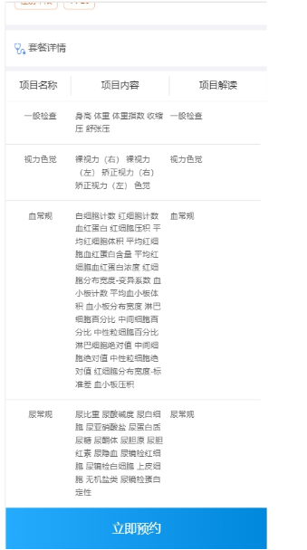 

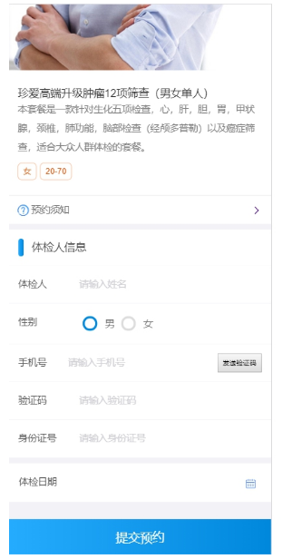 

点击【提交预约】完成预约。

# 2. 短信发送

### 【目标】

能够基于阿里云短信服务实现短信发送

### 【路径】

1. 短信服务介绍
2. 注册阿里云账号
3. 设置短信签名
4. 设置短信模板
5. 设置access keys
6. 短信服务API
7. 发送短信

### 【讲解】

## 2.1. **短信服务介绍**

目前市面上有很多第三方提供的短信服务，这些第三方短信服务会和各个运营商（移动、联通、电信）对接，我们只需要注册成为会员并且按照提供的开发文档进行调用就可以发送短信。需要说明的是这些短信服务都是收费的服务。

本项目短信发送我们选择的是阿里云提供的短信服务。

短信服务（Short Message Service）是阿里云为用户提供的一种通信服务的能力，支持快速发送短信验证码、短信通知等。 三网合一专属通道，与工信部携号转网平台实时互联。电信级运维保障，实时监控自动切换，到达率高达99%。短信服务API提供短信发送、发送状态查询、短信批量发送等能力，在短信服务控制台上添加签名、模板并通过审核之后，可以调用短信服务API完成短信发送等操作。

## 2.2. **注册阿里云账号**

阿里云官网：<https://www.aliyun.com/>

点击官网首页免费注册跳转到如下注册页面：

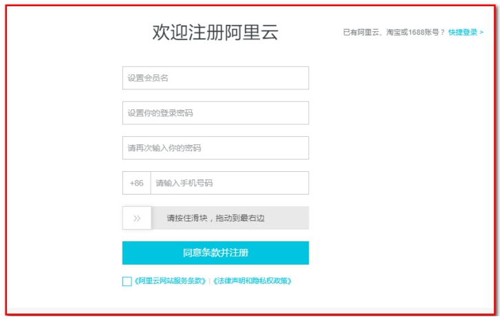 

注册后，使用账号名登录

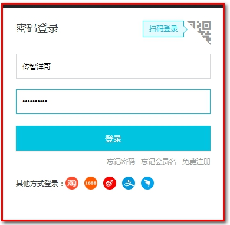 

## 2.3. **设置短信签名**

注册成功后，点击登录按钮进行登录。登录后进入短信服务管理页面，选择国内消息菜单：

点击产品分类->云计算基础->云通信->短信服务

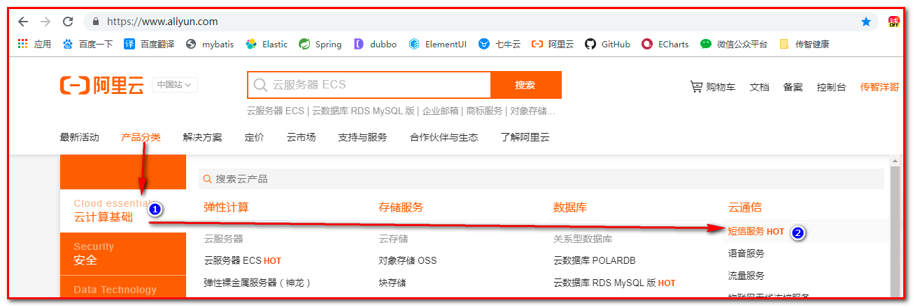

【签名】：

选择签名管理

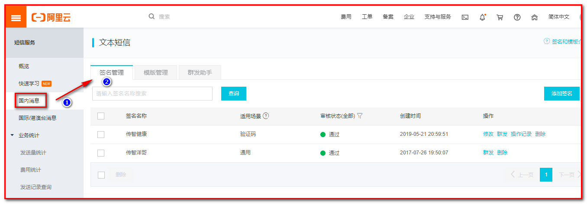 

点击添加签名按钮：

​			目前个人用户只能申请适用场景为`验证码的签名`，通用需要企业认证。

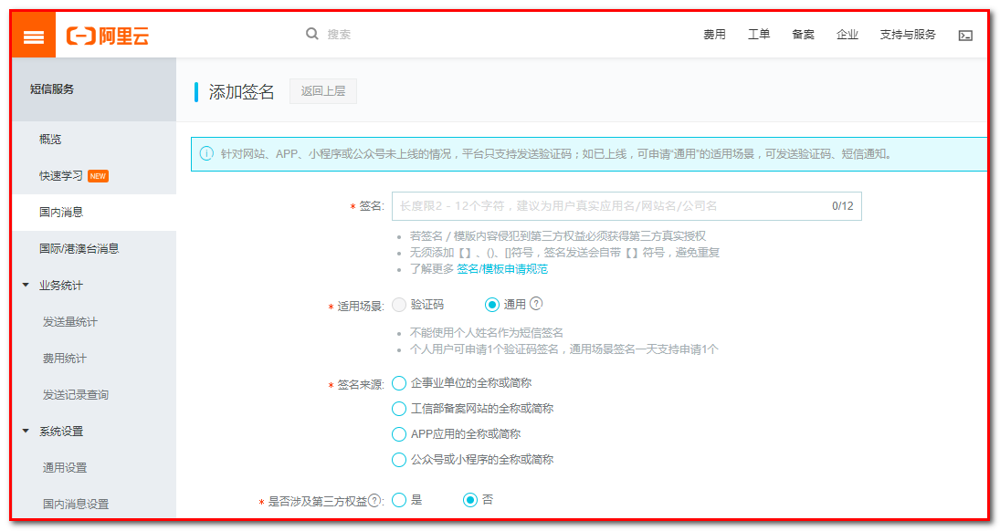 


## 2.4. **设置短信模板**

在国内消息菜单页面中，点击模板管理标签页：

 

点击添加模板按钮：

 

我的模板内容是：传智健康 验证码${number}，您正进行传智健康系统的身份验证，打死不告诉别人！

其中${number}为动态参数，需要我们后续在代码中控制。

## 2.5. **设置access keys**

在发送短信时需要进行身份认证，只有认证通过才能发送短信。本小节就是要设置用于发送短信时进行身份认证的key和密钥。鼠标放在页面右上角当前用户头像上，会出现下拉菜单：

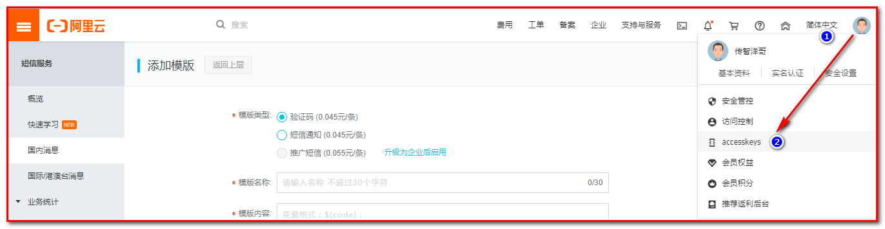 

点击accesskeys：

 

点击“开始使用子用户AccessKey”按钮，指定用户权限，而不是分配所有权限。

第一步：新建用户

输入登录名称和显示名称，点击【确认】

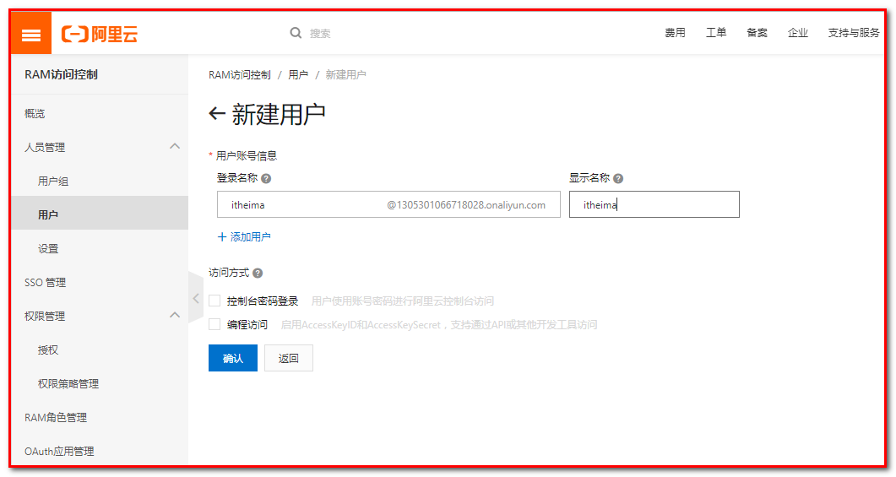

接收短信，防止信息泄露 ，输入验证码即可。

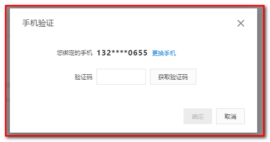

新建用户成功

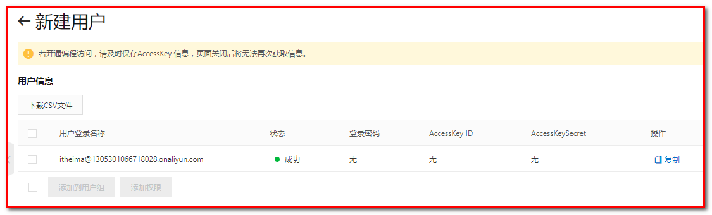

第二步：授权

选择用户，添加权限

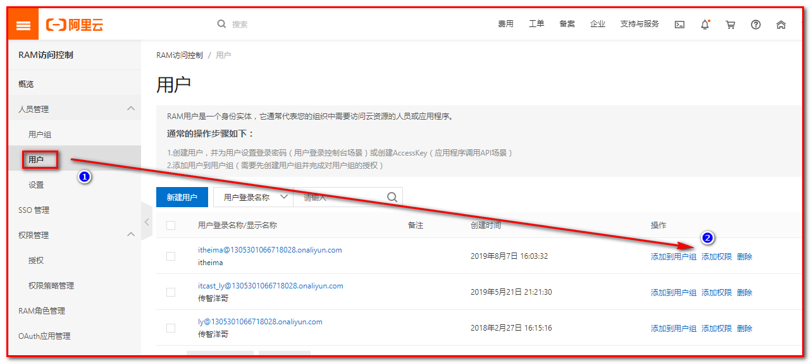

搜索“SMS”，表示短信服务，选择权限，点击“开始创建”。

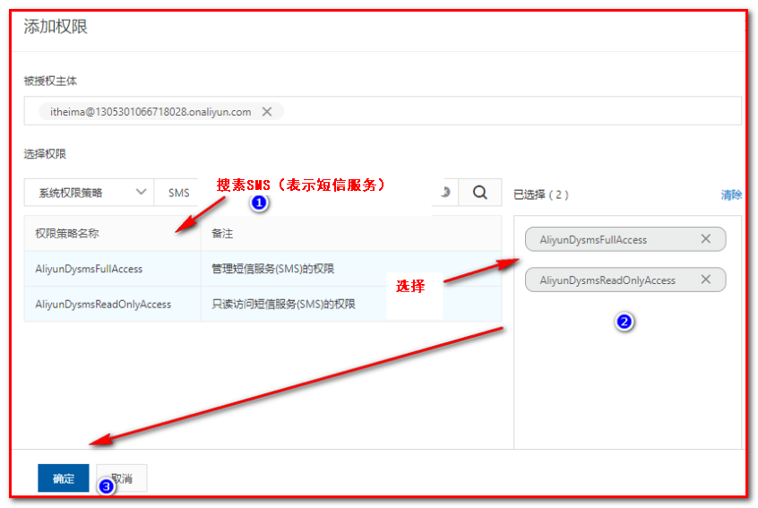 

第三步：创建AccessKeyID

点击创建的用户，进入到详情页面。

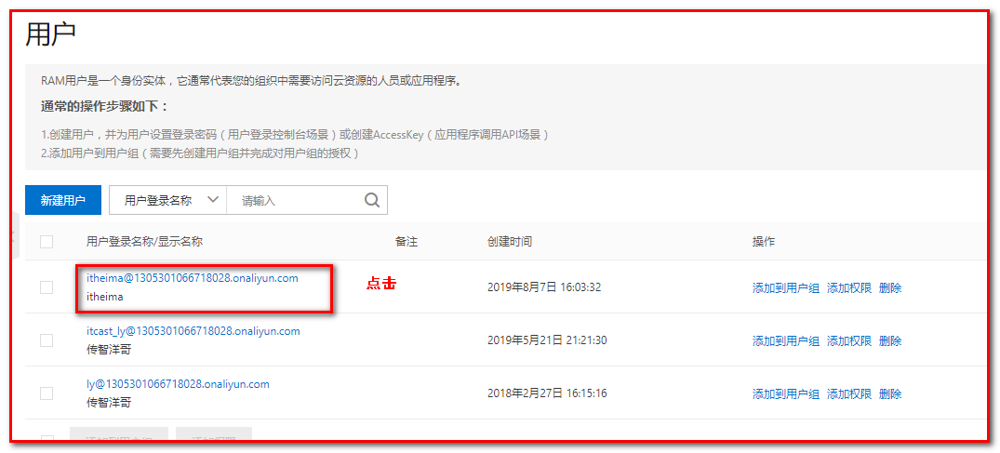

创建成功，其中AccessKeyID为访问短信服务时使用的ID，AccessKeySecret为密钥。

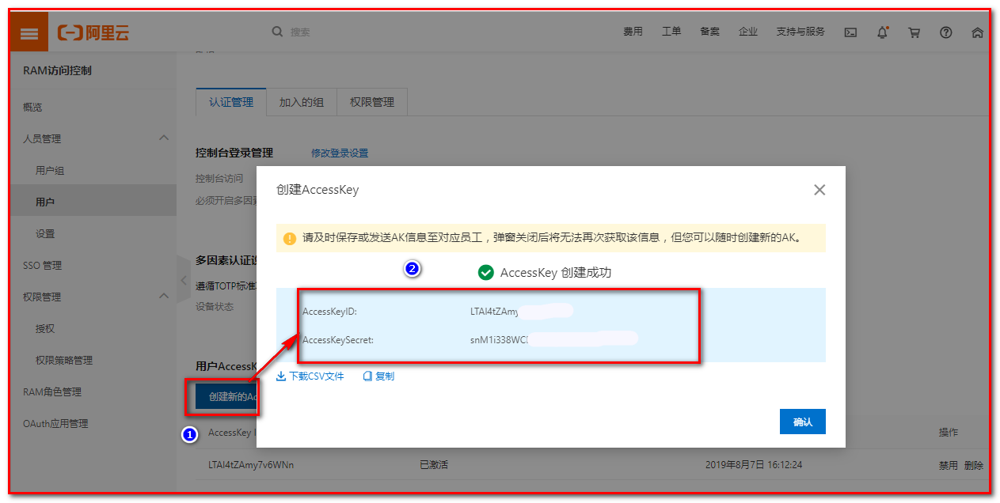

注意：需要马上保存AccessKeyID和AccessKeySecret，因为处于安全考虑，这个只显示1次，一旦退出页面就不再显示了。

点击“查看用户详情”，可以在用户详情页面下禁用刚刚创建的AccessKey：

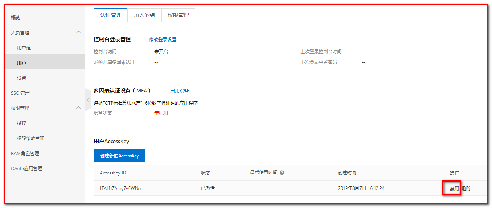 

在短信服务中，点击“国内消息设置”。可以设置每日和每月短信发送上限：

 

由于短信服务是收费服务，所以还需要进行充值才能发送短信：

在费用中，点击“充值”

 

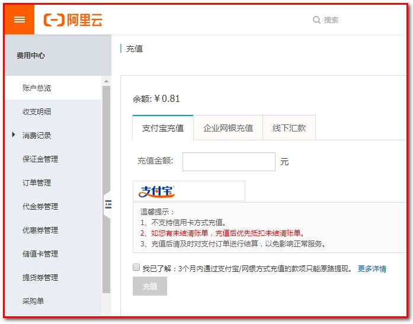 

## 2.6. 短信服务API

点击帮助文档

 

找到短信服务中的“短信发送API”

 
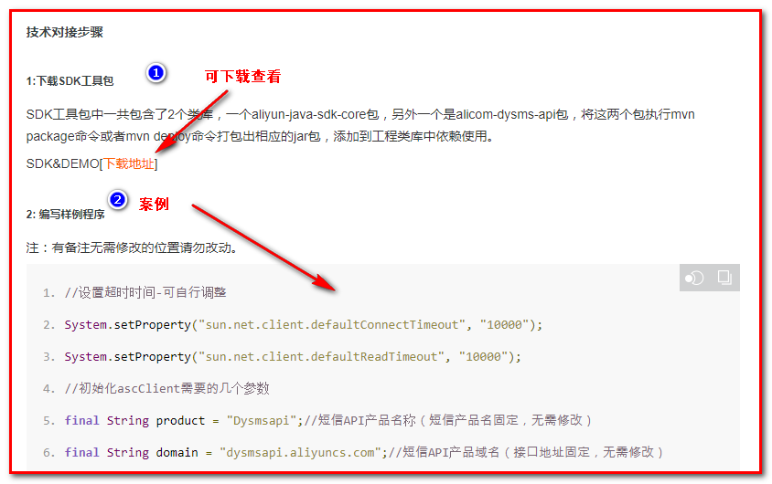

将代码可以拷贝到工程中测试：

需要修改：

1：accessKeyId和accessKeySecret

```java
final String accessKeyId = "LTAI4tZAmy7xxxxx";//你的accessKeyId,参考本文档步骤2
final String accessKeySecret = "snM1i338WCE0hd1ws6tdbyxxxxxxx";//你的accessKeySecret，参考本文档步骤2
```

2：手机号

```java
request.setPhoneNumbers("1326921xxxx");
```

3：签名和模板

```java
request.setSignName("传智健康");
//必填:短信模板-可在短信控制台中找到，发送国际/港澳台消息时，请使用国际/港澳台短信模版
request.setTemplateCode("SMS_16569xxxx");
```

4：发送的验证码及参数number（根据模板短信内容）

```java
String params = "111111";
request.setTemplateParam("{\"number\":\""+params+"\"}");
```


## 2.7. **发送短信**

### 2.7.1. **导入maven坐标**

在health_common中导入坐标

```xml
<dependency>
  <groupId>com.aliyun</groupId>
  <artifactId>aliyun-java-sdk-core</artifactId>
  <version>3.3.1</version>
</dependency>
<dependency>
  <groupId>com.aliyun</groupId>
  <artifactId>aliyun-java-sdk-dysmsapi</artifactId>
  <version>1.0.0</version>
</dependency>
```

### 2.7.2. **封装工具类**

在health_common中添加工具类

1：签名

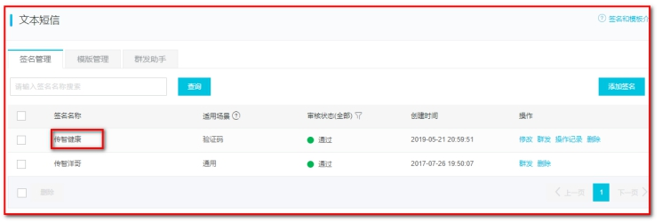 

2：模板code

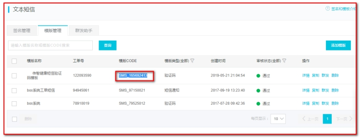 

在health_common中，封装SMSUtils.java

传递验证码和手机号

```java
package com.itheima.utils;

import com.aliyuncs.DefaultAcsClient;
import com.aliyuncs.IAcsClient;
import com.aliyuncs.dysmsapi.model.v20170525.SendSmsRequest;
import com.aliyuncs.dysmsapi.model.v20170525.SendSmsResponse;
import com.aliyuncs.exceptions.ClientException;
import com.aliyuncs.http.MethodType;
import com.aliyuncs.profile.DefaultProfile;
import com.aliyuncs.profile.IClientProfile;

/**
 * 短信发送工具类
 */
public class SMSUtils {
    //修改点
    public static final String VALIDATE_CODE = "SMS_159620392";//发送短信验证码
    public static final String ORDER_NOTICE = "SMS_159771588";//体检预约成功通知

    /**
     * 发送短信
     * @param phoneNumbers 
     * @param param
     * @throws ClientException
     */
    public static void sendShortMessage(String phoneNumbers,String param) throws ClientException{
        // 设置超时时间-可自行调整
        System.setProperty("sun.net.client.defaultConnectTimeout", "10000");
        System.setProperty("sun.net.client.defaultReadTimeout", "10000");
        // 初始化ascClient需要的几个参数
        final String product = "Dysmsapi";// 短信API产品名称（短信产品名固定，无需修改）
        final String domain = "dysmsapi.aliyuncs.com";// 短信API产品域名（接口地址固定，无需修改）
        // 修改点:替换成你的AK
        final String accessKeyId = "LTAImaIecYocOLbe";// 你的accessKeyId,参考本文档步骤2
        final String accessKeySecret = "DbIMHrByYNX5Lip70YgfdgbFjzthtI";// 你的accessKeySecret，参考本文档步骤2
        // 初始化ascClient,暂时不支持多region（请勿修改）
        IClientProfile profile = DefaultProfile.getProfile("cn-hangzhou", accessKeyId, accessKeySecret);
        DefaultProfile.addEndpoint("cn-hangzhou", "cn-hangzhou", product, domain);
        IAcsClient acsClient = new DefaultAcsClient(profile);
        // 组装请求对象
        SendSmsRequest request = new SendSmsRequest();
        // 使用post提交
        request.setMethod(MethodType.POST);
        // 必填:待发送手机号。支持以逗号分隔的形式进行批量调用，批量上限为1000个手机号码,批量调用相对于单条调用及时性稍有延迟,验证码类型的短信推荐使用单条调用的方式
        request.setPhoneNumbers(phoneNumbers);
        // 修改点:必填:短信签名-可在短信控制台中找到
        request.setSignName("传智博客");
        // 必填:短信模板-可在短信控制台中找到
        request.setTemplateCode(VALIDATE_CODE);
        // 可选:模板中的变量替换JSON串,如模板内容为"亲爱的${name},您的验证码为${code}"时,此处的值为
        // 友情提示:如果JSON中需要带换行符,请参照标准的JSON协议对换行符的要求,比如短信内容中包含\r\n的情况在JSON中需要表示成\\r\\n,否则会导致JSON在服务端解析失败
        request.setTemplateParam("{\"number\":\""+param+"\"}");
        // 可选-上行短信扩展码(扩展码字段控制在7位或以下，无特殊需求用户请忽略此字段)
        // request.setSmsUpExtendCode("90997");
        // 可选:outId为提供给业务方扩展字段,最终在短信回执消息中将此值带回给调用者
        // request.setOutId("yourOutId");
        // 请求失败这里会抛ClientException异常
        SendSmsResponse sendSmsResponse = acsClient.getAcsResponse(request);
        if (sendSmsResponse.getCode() != null && sendSmsResponse.getCode().equals("OK")) {
            // 请求成功
            System.out.println("请求成功");
        }
    }
}

```

 

### 2.7.3. 测试短信发送

```java
package com.itheima.main;

import com.itheima.utils.SMSUtils;


public class SMSMain {
    public static void main(String[] args) throws Exception {
        SMSUtils.sendShortMessage("13269210655","1234");
    }
}
```

测试：查看手机

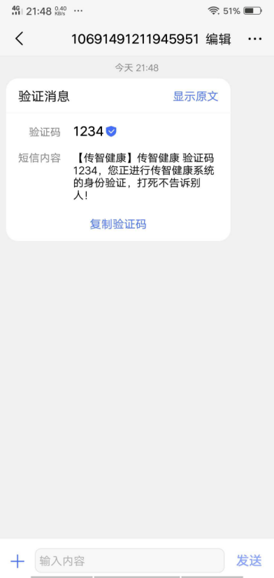 

### 【小结】

阿里云使用步骤

1. 注册, 登录
2. 搜索 短信服务, 开通短信服务
3. 进入短信控制台
4. 申请 `签名` , `模版`
5. 充钱(0.5块左右), 查看access keys
6. 添加依赖, 拷贝工具类到项目
7. 测试

注意事项

​	工具类里面(需要改 模版code,签名, access keys，验证码code>number)

# 3.体检预约

### 【目标】

实现体检预约

需求：

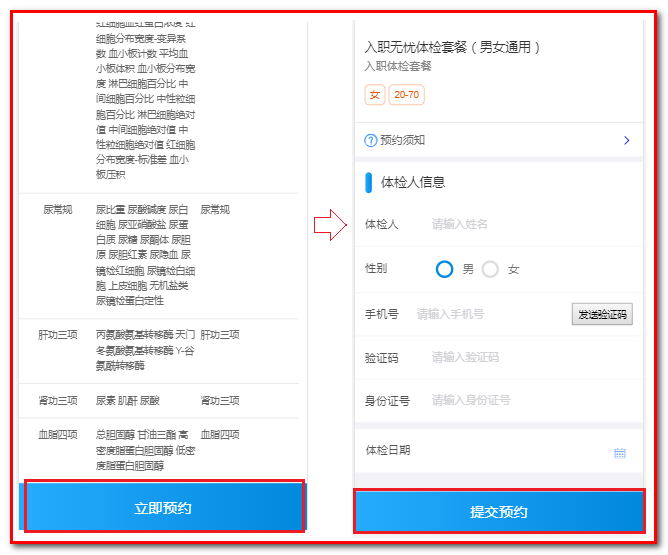 

1. 在套餐详情页面(setmeal_detail.html)点击立即预约，页面跳转到预约页面(orderInfo.html)

2. 在预约页面(orderInfo.html)录入体检人信息，包括手机号，点击发送验证码

3. 在预约页面录入收到的手机短信验证码，点击提交预约，完成体检预约

   用到的数据库表

   

### 【路径】

前台代码编写

1. 在/pages/orderInfo.html 

```
完成需求：
1.使用套餐id，查询展示预约套餐信息
2.手机号校验
3.30秒倒计时效果
4.发送ajax请求，完成【发送验证码】功能
5.体检日期中使用日历插件
6.【提交预约】请求
```

后台代码编写

​    1.类OrderController.java

​    2.类OrderService.java

​    3.类OrderServiceImpl.java

​    4.类OrderDao.java

​          OrderSettingDao.java

​          MemeberDao.java

​    5.配置文件OrderDao.xml

​          OrderSettingDao.xml

​          MemeberDao.xml

```
完成需求：
后台代码1：短信验证码
1. 填写 手机号码, 点击发送验证码 请求服务器(携带手机号码)
2. 在后台
   - 获得手机号码
   - 生成验证码(4或6位)
   - 使用阿里云服务发送验证码:调用短信工具类发送短信(短信模板,手机号码,验证码)
   - 把生成验证码存到redis里面(存5分钟)

提交预约
后台代码2
1：Controller

点击提交预约, 把用户信息 提交到服务器
在Controller里面
   - Health_mobiteweb工程中Controller接收请求String telephone(获得用户信息)
   - 校验验证码(redis里面存的和用户输入的比较)
   - 调用业务, 进行预约, 响应

2：Servie

1. 判断当前的日期是否可以预约(根据orderDate查询t_ordersetting, 能查询出来可以预约;查询不出来,不能预约)
2. 判断当前日期是否预约已满(判断reservations（已经预约人数）是否等于number（最多预约人数）)
3. 判断是否是会员(根据手机号码查询t_member)
  - 如果是会员(能够查询出来), 防止重复预约(根据member_id,orderDate,setmeal_id查询t_order)
  - 如果不是会员(不能够查询出来),自动注册为会员(直接向t_member插入一条记录)
4.进行预约
   - 向t_order表插入一条记录
   - t_ordersetting表里面预约的人数reservations+1
   - 发送成功预约通知短信
```

### 【讲解】

## 3.1. 前端代码

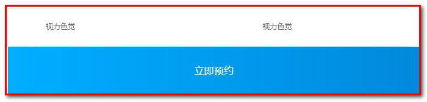 

1：在详情页面（/pages/setmeal_detail.html）点击体检预约

```html
<div class="box-button">
    <a @click="toOrderInfo()" class="order-btn">立即预约</a>
</div>
```

2：toOrderInfo()方法：

```javascript
toOrderInfo(){
    window.location.href = "orderInfo.html?id=" + id;
}
```

 

3：在预约页面（/pages/orderInfo.html）进行调整

### 3.1.1. **展示预约的套餐信息（已完成）**

第一步：从请求路径中获取当前套餐的id

```js
<script>
    var id = getUrlParam("id");
</script>
```

 

第二步：定义模型数据setmeal，用于套餐数据展示

```javascript
<script>
    var vue = new Vue({
        el:'#app',
        data:{
            imgUrl:null,//要加:套餐对应的图片链接
            setmeal:{},//套餐信息
            orderInfo:{
                setmealId:id, // 用于传递套餐id
                sex:'1' // 用于默认显示性别男
            }//预约信息
        }
    });
</script>
```

 第三步：显示套餐信息

```html
<div class="card">
    <!--修改点:src要改成自己的七牛云的连接-->
	<div class="">
    	
	</div>
    <div class="project-text">
        <h4 class="tit">{{setmeal.name}}</h4>
        <p class="subtit">{{setmeal.remark}}</p>
        <p class="keywords">
            <!--修改点:判断-->
            <span>{{setmeal.sex  '0' ? '性别不限' : setmeal.sex  '1' ? '男':'女'}}</span>
            <span>{{setmeal.age}}</span>
        </p>
    </div>
    <div class="project-know">
        <a href="orderNotice.html" class="link-page">
            <i class="icon-ask-circle"><span class="path1"></span><span class="path2"></span></i>
            <span class="word">预约须知</span>
            <span class="arrow"><i class="icon-rit-arrow"></i></span>
        </a>
    </div>
</div>
```

 

第四步：在VUE的钩子函数中发送ajax请求，根据id查询套餐信息

```javascript
mounted(){
    axios.post("/setmeal/findById.do?id=" + id).then((response) => {
        this.setmeal = response.data.data;
		this.imgUrl = 'http://pspmuf4c3.bkt.clouddn.com/' + this.setmeal.img;
    });
}
```

 

### 3.1.2. **手机号校验**

第一步：在orderInfo.html页面导入的healthmobile.js文件中已经定义了校验手机号的方法

```html
<script src="../plugins/healthmobile.js"></script>
```

healthmobile.js：

```javascript
/**
 * 手机号校验
 1--以1为开头；
 2--第二位可为3,4,5,7,8,中的任意一位；
 3--最后以0-9的9个整数结尾。
 */
function checkTelephone(telephone) {
    var reg=/^[1][3,4,5,7,8][0-9]{9}$/;
    if (!reg.test(telephone)) {
        return false;
    } else {
        return true;
    }
}
```

 

第二步：为发送验证码按钮绑定事件sendValidateCode()

```html
<div class="input-row">
    <label>手机号</label>
    <input v-model="orderInfo.telephone" type="text" class="input-clear" placeholder="请输入手机号">
    <input style="font-size: x-small;" id="validateCodeButton" @click="sendValidateCode()" type="button" value="发送验证码">
</div>
<div class="input-row">
    <label>验证码</label>
    <input v-model="orderInfo.validateCode" type="text" class="input-clear" placeholder="请输入验证码">
</div>

```

 

sendValidateCode()方法：

对手机号进行校验

```javascript
//发送验证码
sendValidateCode(){
    //获取用户输入的手机号
    var telephone = this.orderInfo.telephone;
    //校验手机号输入是否正确
    if (!checkTelephone(telephone)) {
        this.$message.error('请输入正确的手机号');
        return false;
    }
},
```

 

### 3.1.3. **30秒倒计时效果**

第一步：前面在sendValidateCode方法中进行了手机号校验，如果校验通过，需要显示30秒倒计时效果

```javascript
//发送验证码
sendValidateCode(){
    //获取用户输入的手机号
    var telephone = this.orderInfo.telephone;
    //校验手机号输入是否正确
    if (!checkTelephone(telephone)) {
        this.$message.error('请输入正确的手机号');
        return false;
    }
    validateCodeButton = $("#validateCodeButton")[0];
    clock = window.setInterval(doLoop, 1000); //一秒执行一次
},
```

 

第二步：其中，validateCodeButton和clock是在healthmobile.js文件中定义的属性。

doLoop是在healthmobile.js文件中定义的方法

```javascript
var clock = '';//定时器对象，用于页面30秒倒计时效果
var nums = 30;
var validateCodeButton;
//基于定时器实现30秒倒计时效果
function doLoop() {
    validateCodeButton.disabled = true;//将按钮置为不可点击
    nums--;
    if (nums > 0) {
        validateCodeButton.value = nums + '秒后重新获取';
    } else {
        clearInterval(clock); //清除js定时器
        validateCodeButton.disabled = false;
        validateCodeButton.value = '重新获取验证码';
        nums = 30; //重置时间
    }
}
```

 

### 3.1.4. **发送ajax请求**

第一步：发送ajax请求

```javascript
//发送验证码
sendValidateCode(){
    //获取用户输入的手机号
    var telephone = this.orderInfo.telephone;
    //校验手机号输入是否正确
    if (!checkTelephone(telephone)) {
        this.$message.error('请输入正确的手机号');
        return false;
    }
    validateCodeButton = $("#validateCodeButton")[0];
    clock = window.setInterval(doLoop, 1000); //一秒执行一次
    axios.post("/validateCode/send4Order.do?telephone=" + telephone).then((response) => {
        if(!response.data.flag){
            //验证码发送失败
            this.$message.error('验证码发送失败，请检查手机号输入是否正确');
        }
    });
},
```

 

第二步：创建ValidateCodeController，提供方法发送短信验证码，并将验证码保存到redis

```java
package com.itheima.mobile.controller;

import com.aliyuncs.exceptions.ClientException;
import com.itheima.constant.MessageConstant;
import com.itheima.constant.RedisMessageConstant;
import com.itheima.entity.Result;
import com.itheima.utils.SMSUtils;
import com.itheima.utils.ValidateCodeUtils;
import org.springframework.beans.factory.annotation.Autowired;
import org.springframework.web.bind.annotation.RequestMapping;
import org.springframework.web.bind.annotation.RestController;
import redis.clients.jedis.JedisPool;

/**
 * 发送验证码
 * @Author: wzw
 * @Date: 2020/11/16 12:13
 * @version: 1.8
 */
@RestController
@RequestMapping("/validateCode")
public class ValidateCodeController {

    //注入redis连接池
    @Autowired
    private JedisPool jedisPool;

    /**
     * 体检预约-发送验证码
     */
    @RequestMapping("/send4Order")
    public Result send4Order(String telephone){
        try {
            //1.生成4位数验证码
            String code = ValidateCodeUtils.generateValidateCode(4)+"";
            //设置倒数30秒
            if(false){
                //2.发送短信=>有异常要try
                SMSUtils.sendShortMessage(SMSUtils.VALIDATE_CODE,telephone,code);
            }
            //3.将验证码打印到控制台
            System.out.println("发送的手机验证码为：" + code);
            //4.将验证码存到redis中,设置时间为5分钟(key,过期时间,value)
            jedisPool.getResource().setex(telephone+ RedisMessageConstant.SENDTYPE_ORDER,5*60,code);
            //5.处理结果
            //成功
            return new Result(true, MessageConstant.SEND_VALIDATECODE_SUCCESS);
        } catch (ClientException e) {
            e.printStackTrace();
            //失败
        }
        return new Result(false, MessageConstant.SEND_VALIDATECODE_FAIL);
    }
}

```

 

### 3.1.5. **日历展示**

页面中使用DatePicker控件来展示日历。根据需求，最多可以提前一个月进行体检预约，所以日历控件只展示未来一个月的日期

第一步：引入dataPicker.js

```html
<script src="../plugins/datapicker/datePicker.js"></script>
```

第二步：定义体检日期

通过样式：.picktime，对应input组件中的class="picktime"

```html
<div class="date">
    <label>体检日期</label>
    <i class="icon-date" class="picktime"></i>
    <input v-model="orderInfo.orderDate" type="text" class="picktime" readonly>
</div>
```

第三步：定义日期控件

.picktime表示通过样式查找输入框。

```javascript
<script>
    //日期控件
    var calendar = new datePicker();
    calendar.init({
        'trigger': '.picktime',/*按钮选择器，用于触发弹出插件*/
        'type': 'date',/*模式：date日期；datetime日期时间；time时间；ym年月；*/
        'minDate': getSpecifiedDate(new Date(),1),/*最小日期*/
        'maxDate': getSpecifiedDate(new Date(),30),/*最大日期*/
        'onSubmit': function() { /*确认时触发事件*/
            //var theSelectData = calendar.value;
        },
        'onClose': function() { /*取消时触发事件*/ }
    });
</script>
```

其中getSpecifiedDate方法定义在healthmobile.js文件中

```javascript
//获得指定日期后指定天数的日期
function getSpecifiedDate(date,days) {
    date.setDate(date.getDate() + days);//获取指定天之后的日期
    var year = date.getFullYear();
    var month = date.getMonth() + 1;
    var day = date.getDate();
    return (year + "-" + month + "-" + day);
}
```

 

### 3.1.6. **提交预约请求（身份证校验）**

为提交预约按钮绑定事件

第一步：定义“体检预约”

```html
<div class="box-button">
    <button @click="submitOrder()" type="button" class="btn order-btn">提交预约</button>
</div>
```

第二步：submitOrder()方法

```javascript
//提交预约
submitOrder(){
    //校验身份证号格式
    if(!checkIdCard(this.orderInfo.idCard)){
        this.$message.error('身份证号码输入错误，请重新输入');
        return ;
    }
    axios.post("/order/submit.do",this.orderInfo).then((response) => {
        if(response.data.flag){
            //预约成功，跳转到预约成功页面
            window.location.href="orderSuccess.html?orderId=" + response.data.data.id;
        }else{
            //预约失败，提示预约失败信息
            this.$message.error(response.data.message);
        }
    });
}
```

第三步：其中checkIdCard方法是在healthmobile.js文件中定义的，用来验证身份证的js

```javascript
/**
 * 身份证号码校验
 * 身份证号码为15位或者18位，15位时全为数字，18位前17位为数字，最后一位是校验位，可能为数字或字符X
 */
function checkIdCard(idCard){
    var reg = /(^\d{15}$)|(^\d{18}$)|(^\d{17}(\d|X|x)$)/;
    if(reg.test(idCard)){
        return true;
    }else{
        return false;
    }
}
```

 

## 3.2. **后台代码**

### 3.2.1. **Controller**

在healthmobile_web工程中创建OrderMobileController并提供submitOrder方法

```java
package com.itheima.mobile.controller;

import com.alibaba.dubbo.config.annotation.Reference;
import com.itheima.constant.MessageConstant;
import com.itheima.constant.RedisMessageConstant;
import com.itheima.entity.Result;
import com.itheima.pojo.Order;
import com.itheima.service.OrderService;
import com.itheima.utils.SMSUtils;
import org.springframework.beans.factory.annotation.Autowired;
import org.springframework.web.bind.annotation.RequestBody;
import org.springframework.web.bind.annotation.RequestMapping;
import org.springframework.web.bind.annotation.RestController;
import redis.clients.jedis.JedisPool;

import java.util.Map;

/**
 * 体检预约
 *
 * @Author: wzw
 * @Date: 2020/11/16 15:41
 * @version: 1.8
 */
@RestController
@RequestMapping("/order")
public class OrderMobileController {

    //订阅接口
    @Reference
    private OrderService orderService;

    //注入redis连接池
    @Autowired
    private JedisPool jedisPool;

    /**
     * 提交预约
     *
     * @param map 接收穿过来的预定信息
     * @return 是否成功
     */
    @RequestMapping("/submit")
    public Result submitOrder(@RequestBody Map map) {
        //1.获取预定的手机号码
        String telephone = (String) map.get("telephone");
        //2.从Redis中获取缓存的验证码,key为手机号+RedisConstant.SENDTYPE_ORDER
        String codeInRedis = jedisPool.getResource().get(telephone + RedisMessageConstant.SENDTYPE_ORDER);
        //3.获取用户输入的验证码
        String validateCode = (String) map.get("validateCode");
        //4.校验手机验证码(不为空说明用户输入的值且redis的验证码没过期,比较验证码内容)
        if (validateCode == null || codeInRedis == null || !codeInRedis.equals(validateCode)) {
            //如果满足上面任意条件,就说明校验失败
            return new Result(false, MessageConstant.VALIDATECODE_ERROR);
        }
        //5.调用体检预约服务
        Result result=null;

        try {
            //5,1存入预约方式==>微信预约
            map.put("orderType", Order.ORDERTYPE_WEIXIN);
            //5.2实现功能:在service中返回结果
            result = orderService.order(map);
            //6.处理结果集
            //6.1预约成功,发送短信通知，短信通知内容可以是“预约时间”，“预约人”，“预约地点”，“预约事项”等信息。
            if(result.isFlag()){
                //6.2获取前台传过来的预约时间
                String orderDate = (String) map.get("orderDate");
                //6.3发送短信工具类(发送通知,手机,预约时间)
                SMSUtils.sendShortMessage(SMSUtils.ORDER_NOTICE,telephone,orderDate);
            }
            //6.4返回结果
            return result;
        } catch (Exception e) {
            e.printStackTrace();
            //6.5预约失败:直接返回结果
            return result;
        }
    }
}
```

 

### 3.2.2. **服务接口**

在health_interface工程中创建体检预约服务接口OrderService并提供预约方法

```java
package com.itheima.service;

import com.itheima.entity.Result;

import java.util.Map;

/**
 * 体检预约服务接口
 */
public interface OrderService {
    Result order(Map map) throws Exception;
}
```

 

### 3.2.3. **服务实现类**

在health_service工程中创建体检预约服务实现类OrderServiceImpl并实现体检预约方法。

体检预约方法处理逻辑比较复杂，需要进行如下业务处理：

【路径】

1、检查用户所选择的预约日期是否已经提前进行了预约设置，如果没有设置则无法进行预约

2、检查用户所选择的预约日期是否已经约满，如果已经约满则无法预约

3、检查用户是否重复预约（同一个用户在同一天预约了同一个套餐），如果是重复预约则无法完成再次预约

4、检查当前用户是否为会员，如果是会员则直接完成预约，如果不是会员则自动完成注册并进行预约

5、预约成功，更新当日的已预约人数

实现代码如下：

```java
package com.itheima.service;

import com.alibaba.dubbo.config.annotation.Service;
import com.itheima.constant.MessageConstant;
import com.itheima.dao.MemberDao;
import com.itheima.dao.OrderDao;
import com.itheima.dao.OrderSettingDao;
import com.itheima.entity.Result;
import com.itheima.pojo.Member;
import com.itheima.pojo.Order;
import com.itheima.pojo.OrderSetting;
import org.springframework.beans.factory.annotation.Autowired;
import org.springframework.transaction.annotation.Transactional;

import java.util.Date;
import java.util.List;
import java.util.Map;

/**
 * 体检预约服务
 */
@Service(interfaceClass = OrderService.class)
@Transactional
public class OrderServiceImpl implements OrderService {

    @Autowired
    private OrderSettingDao orderSettingDao;
    @Autowired
    private MemberDao memberDao;
    @Autowired
    private OrderDao orderDao;

    //体检预约
    public Result order(Map map) throws Exception {
        //检查当前日期是否进行了预约设置
        String orderDate = (String) map.get("orderDate");
        Date date = DateUtils.parseString2Date(orderDate);
        
        OrderSetting orderSetting = orderSettingDao.findByOrderDate(date);
        if (orderSetting == null) {
            return new Result(false,MessageConstant.SELECTED_DATE_CANNOT_ORDER);
        }

        //检查预约日期是否预约已满
        int number = orderSetting.getNumber();//可预约人数
        int reservations = orderSetting.getReservations();//已预约人数
        if (reservations >= number) {
            //预约已满，不能预约
            return new Result(false, MessageConstant.ORDER_FULL);
        }

        //检查当前用户是否为会员，根据手机号判断
        String telephone = (String) map.get("telephone");
        Member member = memberDao.findByTelephone(telephone);
        //如果是会员，防止重复预约（一个会员、一个时间、一个套餐不能重复，否则是重复预约）
        if (member != null) {
            Integer memberId = member.getId();
            int setmealId = Integer.parseInt((String) map.get("setmealId"));
            Order order = new Order(memberId, date, null, null, setmealId);
            List<Order> list = orderDao.findByCondition(order);
            if (list != null && list.size() > 0) {
                //已经完成了预约，不能重复预约
                return new Result(false, MessageConstant.HAS_ORDERED);
            }
        }

        if (member == null) {
            //当前用户不是会员，需要添加到会员表
            member = new Member();
            member.setName((String) map.get("name"));//姓名
            member.setPhoneNumber((String) map.get("telephone"));//手机号
            member.setIdCard((String) map.get("idCard"));//身份证
            member.setSex((String) map.get("sex"));//性别
            member.setRegTime(new Date());//注册时间
			//实现功能:自动注册会员
            memberDao.add(member);
        }
      
        //可以预约，设置预约人数加一
        orderSettingDao.editReservationsByOrderDate(date);

        //保存预约信息到预约表
        Order order = new Order(member.getId(),//会员id
                date,//时间
                (String) map.get("orderType"),
                Order.ORDERSTATUS_NO,
                Integer.parseInt((String) map.get("setmealId")));
        orderDao.add(order);

        return new Result(true, MessageConstant.ORDER_SUCCESS, order);
    }
}
```

导入DateUtils放置到health_common中

 

* 使用将一个字符串转换成日期。

### 3.2.4. **Dao接口**

#### 3.2.4.1. **OrderSettingDao.java**

```java
package com.itheima.dao;

import com.itheima.pojo.OrderSetting;
import org.springframework.stereotype.Repository;

import java.util.Date;
import java.util.List;
import java.util.Map;

/**
 * 持久层Dao接口
 */
@Repository
public interface OrderSettingDao {
    //根据预约日期查询预约设置信息
    OrderSetting findByOrderDate(Date date);
    //更新已预约人数
    void editReservationsByOrderDate(Date orderDate);
}
```


#### 3.2.4.2. **MemberDao.java**

```java
package com.itheima.dao;

import com.github.pagehelper.Page;
import com.itheima.pojo.Member;
import org.springframework.stereotype.Repository;

import java.util.List;

/**
 * 持久层Dao接口
 */
@Repository
public interface MemberDao {
    // 添加会员
    public void add(Member member);
    // 根据手机号查询会员信息（唯一）
    public Member findByTelephone(String telephone);
}
```


#### 3.2.4.3. OrderDao.java

```java
package com.itheima.dao;

import com.itheima.pojo.Order;
import org.springframework.stereotype.Repository;

import java.util.List;

/**
 * 持久层Dao接口
 */
@Repository
public interface OrderDao {


    List<Order> findByCondition(Order order);

    void add(Order order);
}
```

 

### 3.2.5. **Mapper映射文件**

#### 3.2.5.1. OrderSettingDao.xml

```xml
<!--根据日期查询预约设置信息-->
<select id="findByOrderDate" parameterType="date" resultType="com.itheima.pojo.OrderSetting">
    select * from t_ordersetting where orderDate = #{orderDate}
</select>
<!--更新已预约人数-->
<update id="editReservationsByOrderDate" parameterType="date">
    update t_ordersetting set reservations = reservations+1 where orderDate = #{orderDate}
</update>
```

 

#### 3.2.5.2. **MemberDao.xml**

```xml
<?xml version="1.0" encoding="UTF-8" ?>
<!DOCTYPE mapper PUBLIC "-//mybatis.org//DTD Mapper 3.0//EN"
        "http://mybatis.org/dtd/mybatis-3-mapper.dtd" >
<mapper namespace="com.itheima.dao.MemberDao">

    <!--新增会员-->
    <insert id="add" parameterType="com.itheima.pojo.Member">
        <selectKey resultType="java.lang.Integer" order="AFTER" keyProperty="id">
            SELECT LAST_INSERT_ID()
        </selectKey>
        insert into
        t_member
        (fileNumber,name,sex,idCard,phoneNumber,
        regTime,password,email,birthday,remark)
        values
        (#{fileNumber},#{name},#{sex},#{idCard},#{phoneNumber},
        #{regTime},#{password},#{email},#{birthday},#{remark})
    </insert>

    <!--根据手机号查询会员-->
    <select id="findByTelephone" parameterType="string" resultType="com.itheima.pojo.Member">
        select * from t_member where phoneNumber = #{phoneNumber}
    </select>
</mapper>
```

 

#### 3.2.5.3. OrderDao.xml

```xml
<?xml version="1.0" encoding="UTF-8" ?>
<!DOCTYPE mapper PUBLIC "-//mybatis.org//DTD Mapper 3.0//EN"
        "http://mybatis.org/dtd/mybatis-3-mapper.dtd" >
<mapper namespace="com.itheima.dao.OrderDao">
    <resultMap id="orderResultMap" type="com.itheima.pojo.Order">
        <id column="id" property="id"/>
        <result column="member_id" property="memberId"/>
        <result column="orderDate" property="orderDate"/>
        <result column="orderType" property="orderType"/>
        <result column="orderStatus" property="orderStatus"/>
        <result column="setmeal_id" property="setmealId"/>
    </resultMap>
    <!--新增-->
    <insert id="add" parameterType="com.itheima.pojo.Order">
        <selectKey resultType="java.lang.Integer" order="AFTER" keyProperty="id">
            SELECT LAST_INSERT_ID()
        </selectKey>
        insert into
        t_order
        (member_id,orderDate,orderType,orderStatus,setmeal_id)
        values
        (#{memberId},#{orderDate},#{orderType},#{orderStatus},#{setmealId})
    </insert>

    <!--动态条件查询-->
    <select id="findByCondition" parameterType="com.itheima.pojo.Order"
            resultMap="orderResultMap">
        select * from t_order
        <where>
            <if test="id != null">
                and id = #{id}
            </if>
            <if test="memberId != null">
                and member_id = #{memberId}
            </if>
            <if test="orderDate != null">
                and orderDate = #{orderDate}
            </if>
            <if test="orderType != null">
                and orderType = #{orderType}
            </if>
            <if test="orderStatus != null">
                and orderStatus = #{orderStatus}
            </if>
            <if test="setmealId != null">
                and setmeal_id = #{setmealId}
            </if>
        </where>
    </select>
</mapper>
```

 

测试：如果出现异常

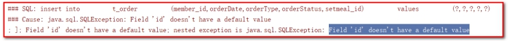 

说明t_order表的id没有设置自增长，这是开发很常见的异常，可以设置：

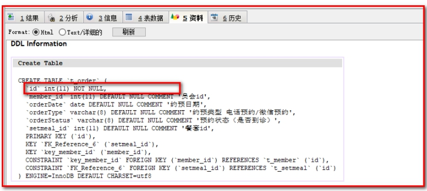 

创建表时设置主键自增长（主键必须是整型才可以自增长）：

```sql
CREATE TABLE `t_order` (

  `id` int(11) NOT NULL AUTO_INCREMENT,

  `member_id` int(11) DEFAULT NULL COMMENT '员会id',

  `orderDate` date DEFAULT NULL COMMENT '约预日期',

  `orderType` varchar(8) DEFAULT NULL COMMENT '约预类型 电话预约/微信预约',

  `orderStatus` varchar(8) DEFAULT NULL COMMENT '预约状态（是否到诊）',

  `setmeal_id` int(11) DEFAULT NULL COMMENT '餐套id',

  PRIMARY KEY (`id`),

  KEY `key_member_id` (`member_id`),

  KEY `key_setmeal_id` (`setmeal_id`),

  CONSTRAINT `key_member_id` FOREIGN KEY (`member_id`) REFERENCES `t_member` (`id`),

  CONSTRAINT `key_setmeal_id` FOREIGN KEY (`setmeal_id`) REFERENCES `t_setmeal` (`id`)

) ENGINE=InnoDB AUTO_INCREMENT=18 DEFAULT CHARSET=utf8;
```

l修改表时设置主键自增长：

```sql
ALTER TABLE t_order CHANGE id id INT AUTO_INCREMENT;
```

l修改表时删除主键自增长：

```sql
ALTER TABLE t_order CHANGE id id INT;
```

或者：选择表-->更改表-->修改表时设置主键自增长：

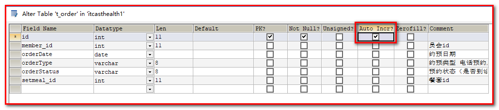

### 【小结】

一：验证码

1. 调用阿里服务, 发送成功后, 验证码存到Redis(存5分钟)
2. 用户点击了预约, 需要把用户输入的验证码和redis里面存的验证码进行校验

二：预约业务`

1. 判断当前的期是否可以预约（`t_ordersetting`表）
2. 判断当前的日期预约是否已满（`t_ordersetting`表）
3. 判断是否 是会员（t_member表）
   - 如果是会员, 避免重复预约（`t_order`表）
   - 不是会员, 自动注册成会员，`t_member` 表插入一条记录（t_member表）
4. 进行预约
   - 向t_order 表插入一条记录（t_order表）
   - 向t_ordersetting更新reservations+1（t_ordersetting表）

# 4. **预约成功页面展示**

### 【目标】

前面已经完成了体检预约，预约成功后页面会跳转到成功提示页面（orderSuccess.html）并展示预约的相关信息（体检人、体检套餐、体检时间等）。

orderSuccess.html

 

跳转到orderSuccess.html，传递预约成功的订单id。

```javascript
axios.post("/order/submit.do",this.orderInfo).then((response) => {
    if(response.data.flag){
        //预约成功，跳转到预约成功页面
        window.location.href="orderSuccess.html?orderId=" + response.data.data.id;
    }else{
        //预约失败，提示预约失败信息
        this.$message.error(response.data.message);
    }
});
```

###  【路径】

前台代码编写

1. 在/pages/orderSuccess.html 

   <p>体检人：{{orderInfo.member}}</p>
   <p>体检套餐：{{orderInfo.setmeal}}</p>
   <p>体检日期：{{orderInfo.orderDate}}</p>
   <p>预约类型：{{orderInfo.orderType}}</p>

```
完成需求：
1.页面输出订单相关人的信息
2.使用订单id，查询订单详细信息。存放到orderInfo的模型中。
```

后台代码编写：

​    1.类OrderController.java

​    2.类OrderService.java

​    3.类OrderServiceImpl.java

​    4.类OrderDao.java

​    5.配置文件OrderDao.xml

```
使用订单id，查询订单详细信息
在OrderDao.xml中会使用联合查询的sql，关联订单表，会员表，套餐表，以map数据结构返回。
```

### 【讲解】

## 4.1. **页面调整**

提供orderSuccess.html页面，展示预约成功后相关信息

第一步：页面输出订单相关人的信息

```html
<div class="info-title">
    <span class="name">体检预约成功</span>
</div>
<div class="notice-item">
    <div class="item-title">预约信息</div>
    <div class="item-content">
        <p>体检人：{{orderInfo.member}}</p>
        <p>体检套餐：{{orderInfo.setmeal}}</p>
        <p>体检日期：{{orderInfo.orderDate}}</p>
        <p>预约类型：{{orderInfo.orderType}}</p>
    </div>
</div>
```

第二步：使用订单id，查询订单详细信息。存放到orderInfo的变量中。

```javascript
<script>
    var vue = new Vue({
        el:'#app',
        data:{
            orderInfo:{}
        },
        mounted(){
            axios.post("/order/findById.do?id=" + id).then((response) => {
                this.orderInfo = response.data.data;
            });
        }
    });
</script>
```


## 4.2. **后台代码**

### 4.2.1. **Controller**

* 在OrderController中提供findById方法，根据预约id查询预约相关信息

```java
/**
 * 根据id查询预约信息，包括套餐信息和会员信息
 * @param id
 * @return
 */
@RequestMapping("/findById")
public Result findById(Integer id){
    Map map =null;
    try{
        map = orderService.findById4Detail(id);
        //查询预约信息成功
        return new Result(true,MessageConstant.QUERY_ORDER_SUCCESS,map);
    }catch (Exception e){
        e.printStackTrace();
        //查询预约信息失败
        return new Result(false,MessageConstant.QUERY_ORDER_FAIL);
    }
}
```


### 4.2.2. **服务接口**

在OrderService服务接口中扩展findById4Detail方法

```java
//根据id查询预约信息，包括体检人信息、套餐信息
Map findById4Detail(Integer id);
```

 

### 4.2.3. **服务实现类**

在OrderServiceImpl服务实现类中实现findById4Detail方法

```java
//根据id查询预约信息，包括体检人信息、套餐信息
public Map findById4Detail(Integer id) throws Exception {
    Map map = orderDao.findById4Detail(id);
    if(map != null){
        //处理日期格式
        Date orderDate = (Date) map.get("orderDate");
        map.put("orderDate",DateUtils.parseDate2String(orderDate));
        return map
    }
    return map;
}
```

 

### 4.2.4. **Dao接口**

在OrderDao接口中扩展findById4Detail方法

```java
Map findById4Detail(Integer id);
```

 

### 4.2.5. **Mapper映射文件**

在OrderDao.xml映射文件中提供SQL语句

```xml
<!--根据预约id查询预约信息，包括体检人信息、套餐信息-->
<select id="findById4Detail" parameterType="int" resultType="map">
    select m.name member ,s.name setmeal,o.orderDate orderDate,o.orderType orderType
    from
    t_order o,
    t_member m,
    t_setmeal s
    where o.member_id=m.id and o.setmeal_id=s.id and o.id=#{id}
</select>
```

m.name member ,s.name setmeal,o.orderDate orderDate,o.orderType orderType

对应：

页面内容

```html
<p>体检人：{{orderInfo.member}}</p>
<p>体检套餐：{{orderInfo.setmeal}}</p>
<p>体检日期：{{orderInfo.orderDate}}</p>
<p>预约类型：{{orderInfo.orderType}}</p>

```

###  【小结】

使用订单id，查询订单详细信息
在OrderDao.xml中会使用联合查询的sql，关联订单表，会员表，套餐表，以map数据结构返回。


# 5. 手机快速登录

【需求分析】

手机快速登录功能，就是通过短信验证码的方式进行登录。这种方式相对于用户名密码登录方式，用户不需要记忆自己的密码，只需要通过输入手机号并获取验证码就可以完成登录，是目前比较流行的登录方式。

 

### 【目标】

实现手机快速登录

### 【路径】

（1）发送验证码

1. 获得用户输入的手机号码
2. 生成动态验证码(4或者6位)
3. 使用阿里云发送短信验证码
4. 把验证码存到redis(存5分钟)

（2）登录

1. 获得用户输入的信息(Map)
2. 取出redis里面的验证码和用户输入的验证码进行校验
3. 如果校验通过
   - 判断是否是会员, 不是会员, 自动注册为会员
   - 保存用户的登录状态( CAS或者自己手动签发token ，我们这里可以使用Cookie存储用户信息)  

### 【讲解】

## 5.1. **前台代码**

登录页面为/pages/login.html

### 5.1.1. **发送验证码**

（1）为获取验证码按钮绑定事件，并在事件对应的处理函数中校验手机号，如果手机号输入正确则显示30秒倒计时效果并发送ajax请求，发送短信验证码

```html
<div class="input-row">
    <label>手机号</label>
    <div class="loginInput">
        <input v-model="loginInfo.telephone" id='account' type="text" placeholder="请输入手机号">
        <input id="validateCodeButton" @click="sendValidateCode()" type="button" style="font-size: 12px" value="获取验证码">
    </div>
</div>
```

（2）调用sendValidateCode()方法

```javascript
//发送验证码
sendValidateCode(){
    var telephone = this.loginInfo.telephone;
    if (!checkTelephone(telephone)) {
        this.$message.error('请输入正确的手机号');
        return false;
    }
    validateCodeButton = $("#validateCodeButton")[0];
    clock = window.setInterval(doLoop, 1000); //一秒执行一次
    axios.post("/validateCode/send4Login.do?telephone=" + telephone).then((response) => {
        if(!response.data.flag){
            //验证码发送失败
            this.$message.error('验证码发送失败，请检查手机号输入是否正确');
        }
    });
},
```

（3）在ValidateCodeController中提供send4Login方法，调用短信服务发送验证码并将验证码保存到redis

注意：存放到redis的可以值：手机号+002（RedisMessageConstant.SENDTYPE_LOGIN）

```java
//手机快速登录时发送手机验证码
@RequestMapping("/send4Login")
public Result send4Login(String telephone){
    Integer code = ValidateCodeUtils.generateValidateCode(4);//生成4位数字验证码
    try {
        //发送短信
        SMSUtils.sendShortMessage(SMSUtils.VALIDATE_CODE,telephone,code.toString());
    } catch (ClientException e) {
        e.printStackTrace();
        //验证码发送失败
        return new Result(false, MessageConstant.SEND_VALIDATECODE_FAIL);
    }
    System.out.println("发送的手机验证码为：" + code);
    //将生成的验证码缓存到redis
    jedisPool.getResource().setex(telephone+RedisMessageConstant.SENDTYPE_LOGIN,
            5 * 60,
            code.toString());
    //验证码发送成功
    return new Result(true,MessageConstant.SEND_VALIDATECODE_SUCCESS);
}
```

 

### 5.1.2. **提交登录请求**

（1）为登录按钮绑定事件

```html
<div class="btn yes-btn"><a @click="login()" href="#">登录</a></div>
```

（2）点击登录，login方法：

```javascript
//登录
login(){
    var telephone = this.loginInfo.telephone;
    if (!checkTelephone(telephone)) {
        this.$message.error('请输入正确的手机号');
        return false;
    }
    axios.post("/login/check.do",this.loginInfo).then((response) => {
        if(response.data.flag){
            //登录成功,跳转到index.html
            window.location.href="index.html";
        }else{
            //失败，提示失败信息
            this.$message.error(response.data.message);
        }
    });
}
```

 

## 5.2. **后台代码**


### 5.2.1. **Controller**

在healthmobile_web工程中创建LoginController并提供check方法进行登录检查，处理逻辑为：

【路径】

1、校验用户输入的短信验证码是否正确，如果验证码错误则登录失败

2、如果验证码正确，则判断当前用户是否为会员，如果不是会员则自动完成会员注册

3、向客户端写入Cookie，内容为用户手机号

```java
package com.itheima.controller;

import com.alibaba.dubbo.config.annotation.Reference;
import com.itheima.constant.MessageConstant;
import com.itheima.constant.RedisMessageConstant;
import com.itheima.entity.Result;
import com.itheima.pojo.Member;
import com.itheima.service.MemberService;
import org.springframework.beans.factory.annotation.Autowired;
import org.springframework.web.bind.annotation.RequestBody;
import org.springframework.web.bind.annotation.RequestMapping;
import org.springframework.web.bind.annotation.RestController;
import redis.clients.jedis.JedisPool;

import javax.servlet.http.Cookie;
import javax.servlet.http.HttpServletResponse;
import java.util.Date;
import java.util.Map;

/**
 * 手机验证码快速登录
 * @Author: wzw
 * @Date: 2020/11/17 9:31
 * @version: 1.8
 */
@RestController
@RequestMapping("/login")
public class LoginController {

    //订阅会员业务接口
    @Reference
    private MemberService memberService;

   //注入redis连接池
    @Autowired
    private JedisPool jedisPool;

    /**
     * 使用手机号和验证码登录
     * @param response 返回Cookie
     * @param map telephone: "18876891992"  validateCode: "8888"
     * @return
     */
    @RequestMapping("/check")
    public Result check(HttpServletResponse response, @RequestBody Map map){
        //1.接收参数
        //1.1.获取前端手机号
        String telephone = (String) map.get("telephone");
        //1.2获取前端验证码
        String validateCode = (String) map.get("validateCode");

        //2.从Redis中获取缓存的验证码,判断验证码输入是否正确
        //2.1要连接池获取验证码
        String codeInRedis = jedisPool.getResource().get(telephone + RedisMessageConstant.SENDTYPE_LOGIN);
        //2.2校验前端验证码和redis中的验证码是否相同
        if (codeInRedis == null || !codeInRedis.equals(validateCode)) {
            //执行到这里说明验证码不相同
            return new Result(false, MessageConstant.VALIDATECODE_ERROR);
        }
        //2.3执行到这里:说明验证码输入正确,判断是否是会员
        //2.4实现功能:查询当前用户
        Member member = memberService.findByTelephone(telephone);
        //2.5如果会员不存在
        if(member == null){
            //2.6自动注册
            member = new Member();
            //手机号
            member.setPhoneNumber(telephone);
            //注册时间
            member.setRegTime(new Date());
            //实现功能:添加会员
            memberService.add(member);
        }

        //3如果用户存在:登录成功
        //3.1写入Cookie,跟踪用户,用于分布式系统单点登录
        Cookie cookie = new Cookie("login_member_telephone", telephone);
        //3.2路径
        cookie.setPath("/");
        //3.3有效期30天(单位秒)
        cookie.setMaxAge(60*60*24*30);
        //3.4要response返回
        response.addCookie(cookie);
        //3.5返回结果
        return new Result(true,MessageConstant.LOGIN_SUCCESS);

    }
}

```

 

### 5.2.2. **服务接口**

在MemberService服务接口中提供findByTelephone和add方法

```java
package com.itheima.service;

import com.itheima.pojo.Member;

/**
 * 会员服务
 */
public interface MemberService {

    Member findByTelephone(String telephone);

    void add(Member member);
}
```

 

### 5.2.3. **服务实现类**

在MemberServiceImpl服务实现类中实现findByTelephone和add方法

【路径】

1：使用手机号查询会议

2：新增会员

```java
package com.itheima.service;

import com.alibaba.dubbo.config.annotation.Service;
import com.itheima.dao.MemberDao;
import com.itheima.pojo.Member;
import com.itheima.utils.MD5Utils;
import org.springframework.beans.factory.annotation.Autowired;
import org.springframework.transaction.annotation.Transactional;

/**
 * 会员服务
 */
@Service(interfaceClass = MemberService.class)
@Transactional
public class MemberServiceImpl implements MemberService {


    @Autowired
    private MemberDao memberDao;


    public Member findByTelephone(String telephone) {
        return memberDao.findByTelephone(telephone);
    }


    public void add(Member member) {
        if(member.getPassword() != null){
            member.setPassword(MD5Utils.md5(member.getPassword()));
        }
        memberDao.add(member);
    }
}
```

 

导入MD5Utils.java

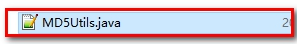 

### 5.2.4. **Dao接口（已完成）**

在MemberDao接口中声明findByTelephone和add方法

```java
public void add(Member member);
public Member findByTelephone(String telephone);
```

 

### 5.2.5. **Mapper映射文件**（已完成）

在MemberDao.xml映射文件中定义SQL语句

```xml
<!--新增会员-->
<insert id="add" parameterType="com.itheima.pojo.Member">
    <selectKey resultType="java.lang.Integer" order="AFTER" keyProperty="id">
        SELECT LAST_INSERT_ID()
    </selectKey>
    insert into
    t_member
    (fileNumber,name,sex,idCard,phoneNumber,
    regTime,password,email,birthday,remark)
    values
    (#{fileNumber},#{name},#{sex},#{idCard},#{phoneNumber},
    #{regTime},#{password},#{email},#{birthday},#{remark})
</insert>
<!--根据手机号查询会员-->
<select id="findByTelephone" parameterType="string" resultType="com.itheima.pojo.Member">
    select * from t_member where phoneNumber = #{phoneNumber}
</select>
```

登录成功之后可以查看浏览器Cookie是否写入成功。

 

### 【小结】

1. 发送验证码
   - 获得用户输入的手机号码
   - 生成验证码
   - 阿里云发送验证码
   - 把验证码存到redis(5分钟)
2. 登录
   - 获得用户输入的信息(Map)
   - 取出redis里面存的验证码和用户输入的验证码进行比较
   - 判断是否是会员
     - 不是会员, 自动注册为会员

#  总结

## ***\*阿里云短信使用\****

验证码类型：

 

申请签名和短信模板审核-大概2个小时（工作日）

 

短信模板：

发送验证码： SMS_168592018  短信通知：SMS_168592017

 

用户登录名称 java103@1407147430108942.onaliyun.com

AccessKey ID LTAI4GDipRfDq45PD8NEro8j

AccessKey Secret jpO2aNnuWfyxnRx7tYLZvJhPqbTpc6

 

## ***\*体检预约\*******\*-\*******\*重点\****

体检预约前台：

\1. 展示套餐信息（根据套餐id查询套餐数据）

\2. 输入手机号码发送验证码（前台） / validateCode/send4Order.do? telephone=xxx

\3. 分析倒计时、日历组件、身份证校验、以及发送预约请求

地址：/order/submit.do  POST

{"setmealId":"12","sex":"1","orderDate":"2020-12-14","validateCode":"1111","telephone":"111111111","name":"111","idCard":"110101199003071452"}

\4. 预约成功或失败提示，最终成功会跳转成功页面

 

 

体检预约后台：

\1. health_mobileweb工程中controller接收请求 String telephone

a． 生成验证码 4或6位

b． 调用短信工具类发送短信（短信模板、手机号码、验证码）

c． 将验证码存入redis 并设置5分钟过期

\2. health_mobileweb工程中controller接收请求

a. 校验验证码

b. 不通过返回错误信息

c. 通过调用服务（设置预约类型）

查询当前时间是否可以预约

查询当前时间是否约满

查询是否会员

不是会员，自动注册

是会员，查询是否重复预约（根据预约日期+套餐id+会员id）

​    往预约表插入预约数据

​    更新预约设置表已经预约人数+1

​    发送预约通知短信给用户

​    返回order对象给页面（res.data.data.id 获取预约id）

## ***\*体检预约成功页面\****

分析：

 

根据orderId=12 查询体检人名称、套餐名称、体检日期、预约类型

Sql:

SELECT

​	tm.NAME member,

​	ts.NAME setmeal,

​	o.orderDate,

​	o.orderType 

FROM

​	t_member tm,

​	t_setmeal ts,

​	t_order o 

WHERE

​	tm.id = o.member_id 

​	AND ts.id = o.setmeal_id 

​	AND o.id = 18

 

 

## ***\*手机快速登录\****

前台：

\1. 输入手机号，点击“获取验证码”发送请求/validateCode/send4Login.do? telephone

\2. 输入验证码，点击“登录”发送请求/login/check.do {telephone:xx, validateCode:”xxx”}

 

 

后台：

\1. health_mobileweb中controller接收请求String telephone

生成验证码4或6位

调用短信工具类

存入redis 5分钟有效

\2. health_mobileweb 中controller接收请求 @RequestBody Map map

获取用户输入的验证码

获取redis验证码

对比验证码

根据手机号查询会员表记录是否存在

不存在，自动注册会员

存在，返回会员数据给页面（cookie）

​	将cookie设置到response对象中

\3. 登录成功或失败

 

 

## ***\*扩展\*******\*-跨境电商后台管理系统\****

背景：接私活

参与人数4-5人 整个项目周期3个月（1个月需求分析设计编码测试上线 +2维护）

1人：项目经理+需求分析核心技术实现

1人：架构搭建（ssm） 具体技术：poi freemarker springsecurtiy easyui 

其余人：撸代码

10万+ 

 

业务需求：

跨境电商（进口 出口）

从海外进口商品先放到海关保税仓库到国内销售，各大电商平台（京东 淘宝等）

 

用户管理：系统内部用户

客户管理：各大电商平台商家

商品管理：商家要卖什么商品，全部管理

入库管理：从海外进口商品放到海关保税仓库中

订单管理：各大电商平台下单后，可以单个新增订单或批量新增订单到跨境电商后台系统中

出库-发货-用户收货（清关中-出库-放行-发货）

装载单管理：将货物装车发货给用户

报表管理：记录所有的操作记录

 