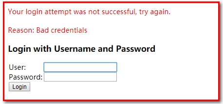
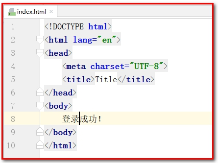
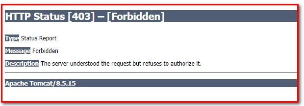
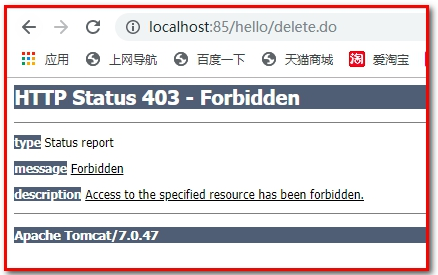

# 第7章 系统管理-权限设置

学习目标

- 了解认证和授权的概念
- 掌握Spring Security入门案例开发过程
- 掌握Spring Security实现认证的过程
- 掌握Spring Security实现授权的过程
- 后台管理系统中加入springSerurity


# 1. 权限控制、SpringSecurity入门及进阶

### 【目标】

了解认证和授权的概念

### 【路径】

1：认证和授权的概念

* 认证：登录（用户名和密码）
* 授权：访问系统功能的权限

2：权限模块的数据模型

- 用户表
- 角色表
- 权限表
- 菜单表

用户,角色是多对多

权限,角色是多对多

菜单,角色是多对多

### 【讲解】

## 1.1. **认证和授权概念**

前面我们已经完成了传智健康后台管理系统的部分功能，例如检查项管理、检查组管理、套餐管理、预约设置等。接下来我们需要思考2个问题：

问题1：在生产环境下我们如果不登录后台系统就可以完成这些功能操作吗？

答案显然是否定的，要操作这些功能必须首先登录到系统才可以。（用户登录系统-->认证）

问题2：是不是所有用户，只要登录成功就都可以操作所有功能呢？

答案是否定的，并不是所有的用户都可以操作这些功能。不同的用户可能拥有不同的权限，这就需要进行授权了。（用户登录之后，对每个用户进行授权，通过授权去访问系统中不同的功能-->授权）

认证：系统提供的用于识别用户身份的功能，通常提供用户名和密码进行登录其实就是在进行认证，认证的目的是让系统知道你是谁。

授权：用户认证成功后，需要为用户授权，其实就是指定当前用户可以操作哪些功能。

本章节就是要对后台系统进行权限控制，其本质就是对用户进行认证和授权。

## 1.2. **权限模块数据模型**

前面已经分析了认证和授权的概念，要实现最终的权限控制，需要有一套表结构支撑：

用户表t_user、权限表t_permission、角色表t_role、菜单表t_menu、用户角色关系表t_user_role、角色权限关系表t_role_permission、角色菜单关系表t_role_menu。

表之间关系如下图：

 

通过上图可以看到，权限模块共涉及到7张表。在这7张表中，角色表起到了至关重要的作用，其处于核心位置，我们把基于角色的权限控制叫做RBAC，因为用户、权限、菜单都和角色是多对多关系。

 

接下来我们可以分析一下在认证和授权过程中分别会使用到哪些表：

认证过程：只需要用户表就可以了，在用户登录时可以查询用户表t_user进行校验，判断用户输入的用户名和密码是否正确。

 

授权过程：用户必须完成认证之后才可以进行授权，首先可以根据用户查询其角色，再根据角色查询对应的菜单，这样就确定了用户能够看到哪些菜单。然后再根据用户的角色查询对应的权限，这样就确定了用户拥有哪些权限。所以授权过程会用到上面7张表。

 

 

 

### 【小结】

1. 认证和授权

   - 认证: 提供账号和密码进行登录认证, 系统知道你的身份
   - 授权: 根据不同的身份, 赋予不同的权限，不同的权限，可访问系统不同的功能

2. RBAC权限模块数据模型（基于角色的权限控制）

   - 用户表
   - 角色表
   - 权限表
   - 菜单表

   用户,角色是多对多

   权限,角色是多对多

   菜单,角色是多对多

   一共7张表

## 1.3. **Spring Security简介**

### 【目标】

知道什么是Spring Security

### 【路径】

1. Spring Security简介
2. Spring Security使用需要的坐标

### 【讲解】

Spring Security是 Spring提供的安全认证服务的框架。 使用Spring Security可以帮助我们来简化认证和授权的过程。官网：<https://spring.io/projects/spring-security>

 

对应的maven坐标：

```xml
<dependency>
  <groupId>org.springframework.security</groupId>
  <artifactId>spring-security-web</artifactId>
  <version>5.0.5.RELEASE</version>
</dependency>
<dependency>
  <groupId>org.springframework.security</groupId>
  <artifactId>spring-security-config</artifactId>
  <version>5.0.5.RELEASE</version>
</dependency>
```

常用的权限框架除了Spring Security，还有Apache的shiro框架。


### 【小结】

1. SpringSecurity是Spring家族的一个安全框架, 简化我们开发里面的认证和授权过程
2. SpringSecurity内部封装了Filter（只需要在web.xml容器中配置一个过滤器--代理过滤器，真实的过滤器在spring的容器中配置）
3. 常见的安全框架 
   - Spring的 SpringSecurity
   - Apache的Shiro  `http://shiro.apache.org/`

## 1.4. **Spring Security入门案例**

### 【目标】

【需求】

​	使用Spring Security进行控制: 网站(一些页面)`需要登录才能访问（认证）`

### 【路径】

1. 创建Maven工程 springsecurity_demo,导入坐标(依赖health_interface)
2. 配置web.xml(前端控制器, SpringSecurity相关的过滤器)
3. 创建spring-security.xml（核心）

### 【讲解】

### 1.4.1. **工程搭建**

创建maven工程`springsecuritydemo`，打包方式为war，为了方便起见我们可以让入门案例工程依赖health_interface，这样相关的依赖都继承过来了。

 

pom.xml

```xml
<?xml version="1.0" encoding="UTF-8"?>
<project xmlns="http://maven.apache.org/POM/4.0.0"
         xmlns:xsi="http://www.w3.org/2001/XMLSchema-instance"
         xsi:schemaLocation="http://maven.apache.org/POM/4.0.0 http://maven.apache.org/xsd/maven-4.0.0.xsd">
    <modelVersion>4.0.0</modelVersion>

    <groupId>com.itheima</groupId>
    <artifactId>springsecuritydemo</artifactId>
    <version>1.0-SNAPSHOT</version>

    <packaging>war</packaging>

    <name>springsecuritydemo Maven Webapp</name>
    <url>http://www.example.com</url>

    <properties>
        <project.build.sourceEncoding>UTF-8</project.build.sourceEncoding>
        <maven.compiler.source>1.8</maven.compiler.source>
        <maven.compiler.target>1.8</maven.compiler.target>
    </properties>

    <dependencies>
        <dependency>
            <groupId>com.itheima</groupId>
            <artifactId>health_interface</artifactId>
            <version>1.0-SNAPSHOT</version>
        </dependency>
    </dependencies>
    <build>
        <plugins>
            <plugin>
                <groupId>org.apache.tomcat.maven</groupId>
                <artifactId>tomcat7-maven-plugin</artifactId>
                <configuration>
                    <!-- 指定端口 -->
                    <port>85</port>
                    <!-- 请求路径 -->
                    <path>/</path>
                </configuration>
            </plugin>
        </plugins>
    </build>
</project>
```

内置提供index.html页面，内容为“登录成功”!!

### 1.4.2. **配置web.xml**

【路径】

1：`DelegatingFilterProxy`用于整合第三方框架（代理过滤器，非真正的过滤器，真正的过滤器需要在spring的配置文件）

2：springmvc的`核心控制器`

在`web.xml`中主要配置SpringMVC的DispatcherServlet和用于`整合`第三方框架的DelegatingFilterProxy（代理过滤器，真正的过滤器在spring的配置文件），用于`整合Spring Security`。

```xml
<?xml version="1.0" encoding="UTF-8"?>
<web-app xmlns:xsi="http://www.w3.org/2001/XMLSchema-instance"
         xmlns="http://java.sun.com/xml/ns/javaee"
         xsi:schemaLocation="http://java.sun.com/xml/ns/javaee http://java.sun.com/xml/ns/javaee/web-app_3_0.xsd"
         id="WebApp_ID" version="3.0">

    <display-name>Archetype Created Web Application</display-name>
    <filter>
        <!--
         1：DelegatingFilterProxy用于整合第三方框架（代理过滤器，非真正的过滤器，真正的过滤器需要在spring的配置文件）
          整合Spring Security时过滤器的名称必须为springSecurityFilterChain，
          否则会抛出NoSuchBeanDefinitionException异常
        -->
        <filter-name>springSecurityFilterChain</filter-name>
        <filter-class>org.springframework.web.filter.DelegatingFilterProxy</filter-class>
    </filter>
    <filter-mapping>
        <filter-name>springSecurityFilterChain</filter-name>
        <url-pattern>/*</url-pattern>
    </filter-mapping>
    <!-- 2：springmvc的核心控制器-->
    <servlet>
        <servlet-name>springmvc</servlet-name>
        <servlet-class>org.springframework.web.servlet.DispatcherServlet</servlet-class>
        <!-- 指定加载的配置文件 ，通过参数contextConfigLocation加载 -->
        <init-param>
            <param-name>contextConfigLocation</param-name>
            <param-value>classpath:spring-security.xml</param-value>
        </init-param>
        <load-on-startup>1</load-on-startup>
    </servlet>
    <servlet-mapping>
        <servlet-name>springmvc</servlet-name>
        <url-pattern>*.do</url-pattern>
    </servlet-mapping>
</web-app>
```

 

### 1.4.3. **配置spring-security.xml**

【路径 】

1：定义哪些链接可以放行

2：定义哪些链接不可以放行，即需要有角色、权限才可以放行

3：认证管理，定义登录账号名和密码，并授予访问的角色、权限

在spring-security.xml中主要配置Spring Security的拦截规则和认证管理器。

```xml
<?xml version="1.0" encoding="UTF-8"?>
<beans xmlns="http://www.springframework.org/schema/beans"
       xmlns:xsi="http://www.w3.org/2001/XMLSchema-instance"
       xmlns:context="http://www.springframework.org/schema/context"
       xmlns:dubbo="http://code.alibabatech.com/schema/dubbo"
       xmlns:mvc="http://www.springframework.org/schema/mvc"
       xmlns:security="http://www.springframework.org/schema/security"
       xsi:schemaLocation="http://www.springframework.org/schema/beans
                  http://www.springframework.org/schema/beans/spring-beans.xsd
                  http://www.springframework.org/schema/mvc
                  http://www.springframework.org/schema/mvc/spring-mvc.xsd
                  http://code.alibabatech.com/schema/dubbo
                  http://code.alibabatech.com/schema/dubbo/dubbo.xsd
                  http://www.springframework.org/schema/context
                  http://www.springframework.org/schema/context/spring-context.xsd
                          http://www.springframework.org/schema/security
                          http://www.springframework.org/schema/security/spring-security.xsd">
    <!--1：定义哪些链接可以放行-->
    <!--
        2：定义哪些链接不可以放行，即需要有角色、权限才可以放行(配置拦截器规则)
        http：用于定义相关权限控制
        auto-config：是否自动配置
                        设置为true时框架会提供默认的一些配置，例如提供默认的登录页面、登出处理等
                        设置为false时需要显示提供登录表单配置，否则会报错
        use-expressions：用于指定intercept-url中的access属性是否使用表达式
    -->
    <security:http auto-config="true" use-expressions="true">
        <!--
            intercept-url：定义一个拦截规则
            pattern：对哪些url进行权限控制
			/**:多层==>/a/b/c......
			/*:一层==>/a

            access：在请求对应的URL时需要什么权限，默认配置时它应该是一个以逗号分隔的角色列表，
              请求的用户只需拥有其中的一个角色就能成功访问对应的URL
			(访问/**需要ROLE_ADMIN角色权限)
			
        -->
        <security:intercept-url pattern="/**"  access="hasRole('ROLE_ADMIN')" />
    </security:http>

    <!--
        3：认证管理，定义登录账号名和密码，并授予访问的角色、权限
        authentication-manager：认证管理器，用于处理认证操作
    -->
    <security:authentication-manager>
        <!--
            authentication-provider：认证提供者，执行具体的认证逻辑
        -->
        <security:authentication-provider>
            <!--
                user-service：用于获取用户信息，提供给authentication-provider进行认证
            -->
            <security:user-service>
                <!--
					账号,密码,权限
                    user：定义用户信息，可以指定用户名、密码、角色，后期可以改为从数据库查询用户信息
              		{noop}：表示当前使用的密码为明文(不要就是默认加密)
					authorities:给改用户授权(设置权限)
                -->
                <security:user name="admin" password="{noop}admin" authorities="ROLE_ADMIN"/>
            </security:user-service>
        </security:authentication-provider>
    </security:authentication-manager>
</beans>
```

{noop}：表示当前使用的密码为明文。表示当前密码不需要加密

 

自动跳转到登录页面（springSecurity自动提供的）

  

输入错误用户名和密码

 

输入正确用户名和密码（admin/admin）

 

此时说明没有登录成功的页面。

如果新建index.html，可以正常访问index.html

 

### 【小结】

使用步骤

1. 创建Maven工程, 添加坐标
2. 配置web.xml(前端控制器,springSecurity权限相关的过滤器)
3. 创建spring-security.xml(自动配置,使用表达式的方式完成授权，只要具有ROLE_ADMIN的角色权限才能访问系统中的所有功能； 授权管理器，指定用户名admin，密码admin，具有ROLE_ADMIN的角色权限)

### 注意事项:

​    1.在web.xml里面配置的权限相关的过滤器名字不能改（springSecurityFilterChain）

```xml
<filter>   
   <filter-name>springSecurityFilterChain</filter-name>
   <filter-class>org.springframework.web.filter.DelegatingFilterProxy</filter-class>
</filter>
<filter-mapping>
   <filter-name>springSecurityFilterChain</filter-name>
   <url-pattern>/*</url-pattern>
</filter-mapping>
```
​    2.入门案例里面没有指定密码加密方式的. 配置密码的时候的加{noop}

```xml
<security:user-service>
   <security:user name="admin" password="{noop}admin" authorities="ROLE_ADMIN"/>
</security:user-service>
```
## 1.5. **Spring Security进阶**

### 【目标】

前面我们已经完成了Spring Security的入门案例，通过入门案例我们可以看到，Spring Security将我们项目中的所有资源都保护了起来，要访问这些资源必须要完成认证而且需要具有ROLE_ADMIN角色。

但是入门案例中的使用方法离我们真实生产环境还差很远，还存在如下一些问题：

1、项目中我们将所有的资源（所有请求URL）都保护起来，实际环境下往往有一些资源不需要认证也可以访问，也就是可以`匿名访问`。

2、登录页面是由框架生成的，而我们的项目往往会使用自己的`自定义登录页面`。

3、直接将用户名和密码配置在了配置文件中，而真实生产环境下的用户名和密码往往保存在数据库中。`解决账号密码写死了的问题`

4、在配置文件中配置的密码使用明文，这非常不安全，而真实生产环境下`密码需要进行加密(bcryt)`。

本章节需要对这些问题进行改进。

### 【路径】

1：配置可匿名访问的资源(不需要登录,权限 角色 就可以访问的资源)

2：使用指定的登录页面（login.html)

3：从数据库查询用户信息

4：对密码进行加密

5：配置多种校验规则（对访问的页面做权限控制）

6：注解方式权限控制（对访问的Controller类做权限控制）

7：退出登录

### 【讲解】

### 1.5.1. **配置可匿名访问的资源**

【路径】

1：在项目中创建js、css目录并在两个目录下提供任意一些测试文件

2：在spring-security.xml文件中配置，指定哪些资源可以匿名访问

第一步：在项目中创建js、css目录并在两个目录下提供任意一些测试文件

 

访问http://localhost:85/js/vue.js

 

第二步：在spring-security.xml文件中配置，指定哪些资源可以**匿名访问**

​				注意:这些代码要放在配置文件配置的最上面

```xml
<!--
  http：用于定义相关权限控制
  指定哪些资源不需要进行权限校验，可以使用通配符

   security="none"  匿名访问
   pattern="/js/**" 访问路径
-->
<security:http security="none" pattern="/js/**" />
<security:http security="none" pattern="/css/**" />
```

通过上面的配置可以发现，js和css目录下的文件可以在没有认证的情况下任意访问。

### 1.5.2. **使用指定的登录页面**

#### 【路径】

1：提供login.html作为项目的登录页面

2：修改spring-security.xml文件，指定login.html页面可以匿名访问

3：修改spring-security.xml文件，加入表单登录信息的配置

4：修改spring-security.xml文件，关闭csrfFilter过滤器

#### 【讲解】

#### 第一步：提供login.html作为项目的登录页面(在webapp目录下创建)

1：用户名是username

2：密码是password

3：登录的url是login.do

```html
<!DOCTYPE html>
<html>
<head>
<meta charset="UTF-8">
    <title>登录</title>
</head>
<body>
<form action="/login.do" method="post">
    username:<input type="text" name="username"><br>
    password:<input type="password" name="password"><br>
    <input type="submit" value="submit">
</form>
</body>
</html>
```

 

#### 第二步：修改spring-security.xml文件，指定login.html页面可以`匿名访问`，否则无法访问。

```html
<security:http security="none" pattern="/login.html" />
```

#### 第三步：修改spring-security.xml文件，在`拦截器规则<security:http>`中加入`表单`登录信息的配置

```xml
<!--
  form-login：定义表单登录信息
            login-page="/login.html"：表示指定登录页面
            username-parameter="username"：使用登录名的名称，默认值是username
            password-parameter="password"：使用登录名的密码，默认值是password
            login-processing-url="/login.do"：表示登录的url地址
            default-target-url="/index.html"：登录成功后默认跳转的url地址
            authentication-failure-url="/login.html"：认证失败后跳转的url地址，失败后指定/login.html
-->
<security:form-login login-page="/login.html"
                     username-parameter="username"
                     password-parameter="password"
                     login-processing-url="/login.do"
                     default-target-url="/index.html"
                     authentication-failure-url="/login.html"
/>
```

注意:

* SepringSecurity表单写的位置


* 提交参数的属性要一致
  * 使用默认的做为name可以在表单中省略不写接收


#### 第四步：修改spring-security.xml文件，在表单下面,关闭CsrfFilter过滤器

* 默认是开启的
  * false:开启
  * true:关闭

```html
<!--
  csrf：对应CsrfFilter过滤器
  disabled：是否启用CsrfFilter过滤器，如果使用自定义登录页面需要关闭此项，
			否则登录操作会被禁用（403）
-->
<security:csrf disabled="true"></security:csrf>
```


#### 1.5.2.1. **注意1：**

如果用户名和密码输入不正确/正确。抛出异常：

 

分析原因：

 

Spring-security采用盗链机制，其中_csrf使用token标识和随机字符，每次访问页面都会随机生成，然后和服务器进行比较，成功可以访问，不成功不能访问（403：权限不足）。

解决方案：

```html
<!--关闭盗链安全请求-->
<security:csrf disabled="true" />
```

 

#### 1.5.2.2. **注意2：**

1:创建test.html

```html
<!DOCTYPE html>
<html lang="en">
<head>
    <meta charset="UTF-8">
    <title>Title</title>
</head>
<body>
    我是test页面
</body>
</html>
```

 

2：先访问test.html页面，跳转到login.html

 

3：再使用admin、admin登录，会跳转到test.html，怎么办？

 

分析原因：

登录成功后，没有始终跳转到成功页面，而是跳转到了之前访问的页面。

解决方案：

always-use-default-target="true"

```xml
<!--
    登录页面配置
    login-page:登录页面
    login-processing-url:处理登录的地址
    default-target-url:登录成功后默认跳转地址
    authentication-failure-url:登录失败跳转地址
    always-use-default-target="true"：登录成功后，始终跳转到default-target-url指定的地址，即登录成功的默认地址
 -->
<security:form-login login-page="/login.html"
                     username-parameter="username"
                     password-parameter="password"
                     login-processing-url="/login.do"
                     default-target-url="/index.html"
                     authentication-failure-url="/login.html"
                     always-use-default-target="true"
/>
```

 注意:


### 1.5.3. **从数据库查询用户信息**

【路径】

1:定义UserService类，实现UserDetailsService接口。

2：修改spring-security.xml配置（注入UserService）

如果我们要从数据库动态查询用户信息，就必须按照spring security框架的要求提供一个实现UserDetailsService接口的实现类，并按照框架的要求进行配置即可。框架会自动调用实现类中的方法并自动进行密码校验。

第一步：定义UserService类，实现UserDetailsService接口。

实现类代码：

```java
package com.itheima.security;

import org.springframework.security.core.GrantedAuthority;
import org.springframework.security.core.authority.SimpleGrantedAuthority;
import org.springframework.security.core.userdetails.User;
import org.springframework.security.core.userdetails.UserDetails;
import org.springframework.security.core.userdetails.UserDetailsService;
import org.springframework.security.core.userdetails.UsernameNotFoundException;
import java.util.ArrayList;
import java.util.HashMap;
import java.util.List;
import java.util.Map;

@Component
public class UserService implements UserDetailsService {
    //模拟数据库中的用户数据
    public static Map<String, com.itheima.pojo.User> map = new HashMap<String, com.itheima.pojo.User>();

    static {
        com.itheima.pojo.User user1 = new com.itheima.pojo.User();
        user1.setUsername("admin");
        user1.setPassword("admin");

        com.itheima.pojo.User user2 = new com.itheima.pojo.User();
        user2.setUsername("zhangsan");
        user2.setPassword("123");

        map.put(user1.getUsername(), user1);
        map.put(user2.getUsername(), user2);
    }

    /**
     * 根据用户名加载用户信息
     *
     * @param username 页面用户输入的账号
     * @return
     * @throws UsernameNotFoundException
     */
    public UserDetails loadUserByUsername(String username) throws UsernameNotFoundException {
        //1.根据用户名查询用户对象
        System.out.println("username:" + username);
        //模拟根据用户名查询数据库==>因为有两个User,所以要全限定类名
        com.itheima.pojo.User userInDb = map.get(username);
        if (userInDb == null) {
            //根据用户名没有查询到用户，抛出异常，表示登录名输入有误
            return null;
        }

        //获取数据库的密码==>模拟数据库中的密码，后期需要查询数据库
        String passwordInDb = "{noop}" + userInDb.getPassword();

        List<GrantedAuthority> list = new ArrayList<GrantedAuthority>();
        //3.授权，后期需要改为查询数据库动态获得用户拥有的权限和角色
        list.add(new SimpleGrantedAuthority("add")); // 权限
        list.add(new SimpleGrantedAuthority("delete")); // 权限
        list.add(new SimpleGrantedAuthority("ROLE_ADMIN")); // 角色
        
        //4.将结果返回给springSecurity框架,返回User框架对象
        //参数一：存放登录名，
        //参数二：存放数据库查询的密码（数据库获取的密码，默认会和页面获取的密码进行比对，成功跳转到成功页面，失败回到登录页面，并抛出异常表示失败），
        //参数三:存放授权列表==>当前用户具有的角色(权限集合)
        UserDetails user = new User(username, passwordInDb, list);
        return user;
    }
}
```

 

第二步：spring-security.xml的`认证管理`中修改权限指定方向

```xml
<!--
    三：认证管理，定义登录账号名和密码，并授予访问的角色、权限
    authentication-manager：认证管理器，用于处理认证操作
-->
<security:authentication-manager>
    <!--
        authentication-provider：认证提供者，执行具体的认证逻辑
		user-service-ref:2.获取自定义授权类对象
    -->	
    <security:authentication-provider user-service-ref="userService">
        <!--1.注释以下内容-->
        <!--</security:user-service>-->
        <!--<security:user name="admin" password="{noop}123" authorities="ROLE_ADMIN"/>-->
            <!--</security:user-service>-->
    </security:authentication-provider>
</security:authentication-manager>

<!--3.扫描包-->
<context:component-scan base-package="com.itheima"/>
```

本章节我们提供了UserService实现类，并且按照框架的要求实现了UserDetailsService接口。在spring配置文件中注册UserService，指定其作为认证过程中根据用户名查询用户信息的处理类。当我们进行登录操作时，spring security框架会调用UserService的loadUserByUsername方法查询用户信息，并根据此方法中提供的密码和用户页面输入的密码进行比对来实现认证操作。

### 1.5.4. **对密码进行加密**

前面我们使用的密码都是明文的，这是非常不安全的。一般情况下用户的密码需要进行加密后再保存到数据库中。

常见的密码加密方式有：

3DES、AES、DES：使用对称加密算法，可以通过解密来还原出原始密码

MD5、SHA1：使用单向HASH算法，无法通过计算还原出原始密码，但是可以建立彩虹表进行查表破解

MD5可进行加盐加密，保证安全

<https://www.cmd5.com/default.aspx?hashtype=md5&answer=cWluZ21pbmcxMTI0MTUu>

```java
public class TestMD5 {

    @Test
    public void testMD5(){
        // 密码同样是1234却变成了密码不相同(MD5加密)
        System.out.println(MD5Utils.md5("1234xiaowang")); //a8231077b3d5b40ffadee7f4c8f66cb7
        System.out.println(MD5Utils.md5("1234xiaoli")); //7d5250d8620fcdb53b25f96a1c7be591
    }
}
```

 

同样的密码值，盐值不同，加密的结果不同。

bcrypt：将salt随机并混入最终加密后的密码，验证时也无需单独提供之前的salt，从而无需单独处理salt问题

spring security中的BCryptPasswordEncoder方法采用SHA-256 +随机盐+密钥对密码进行加密。SHA系列是Hash算法，不是加密算法，使用加密算法意味着可以解密（这个与编码/解码一样），但是采用Hash处理，其过程是不可逆的。

（1）加密(encode)：注册用户时，使用SHA-256+随机盐+密钥把用户输入的密码进行hash处理，得到密码的hash值，然后将其存入数据库中。

（2）密码匹配(matches)：用户登录时，密码匹配阶段并没有进行密码解密（因为密码经过Hash处理，是不可逆的），而是使用相同的算法把用户输入的密码进行hash处理，得到密码的hash值，然后将其与从数据库中查询到的密码hash值进行比较。如果两者相同，说明用户输入的密码正确。

这正是为什么处理密码时要用hash算法，而不用加密算法。因为这样处理即使数据库泄漏，黑客也很难破解密码。

建立测试代码

```java
package com.itheima.security.test;

import org.junit.Test;
import org.springframework.security.crypto.bcrypt.BCryptPasswordEncoder;

public class TestSpringSecurity {
    // SpringSecurity加盐加密
    @Test
    public void testSpringSecurity(){
        // $2a$10$dyIf5fOjCRZs/pYXiBYy8uOiTa1z7I.mpqWlK5B/0icpAKijKCgxe
        // $2a$10$OphM.agzJ55McriN2BzCFeoLZh/z8uL.8dcGx.VCnjLq01vav7qEm

        //加密
        //1.创建BCrypt自动加盐加密对象
        BCryptPasswordEncoder encoder = new BCryptPasswordEncoder();
        //加密
        String s = encoder.encode("abc");
        System.out.println(s);
        //加密
        String s1 = encoder.encode("abc");
        System.out.println(s1);

        // 校验:进行判断(加密后判读)
        boolean b = encoder.matches("abc", "$2a$10$dyIf5fOjCRZs/pYXiBYy8uOiTa1z7I.mpqWlK5B/0icpAKijKCgxe");
        System.out.println(b);
    }
}
```

 

加密后的格式一般为：

```
$2a$10$/bTVvqqlH9UiE0ZJZ7N2Me3RIgUCdgMheyTgV0B4cMCSokPa.6oCa
```

加密后字符串的长度为固定的60位。其中：

$是分割符，无意义；

2a是bcrypt加密版本号；

10是cost的值；

而后的前22位是salt值；

再然后的字符串就是密码的密文了。

#### 实现步骤：

【路径】

1：在spring-security.xml文件中指定密码加密对象

2：修改UserService实现类

【讲解】

第一步：在spring-security.xml文件中指定密码加密对象

```xml
<!--
    三：认证管理，定义登录账号名和密码，并授予访问的角色、权限
    authentication-manager：认证管理器，用于处理认证操作
-->
<security:authentication-manager>
    <!--
        authentication-provider：认证提供者，执行具体的认证逻辑
    -->
    <security:authentication-provider user-service-ref="userService">
        <!--添加点:指定密码加密策略BCrypt-->
        <security:password-encoder ref="passwordEncoder"></security:password-encoder>
    </security:authentication-provider>
</security:authentication-manager>

<!--配置密码加密对象-->
<bean id="passwordEncoder"  class="org.springframework.security.crypto.bcrypt.BCryptPasswordEncoder" />
```

第二步：修改UserService实现类

```java
package com.itheima.security;


import org.springframework.beans.factory.annotation.Autowired;
import org.springframework.security.core.GrantedAuthority;
import org.springframework.security.core.authority.SimpleGrantedAuthority;
import org.springframework.security.core.userdetails.User;
import org.springframework.security.core.userdetails.UserDetails;
import org.springframework.security.core.userdetails.UserDetailsService;
import org.springframework.security.core.userdetails.UsernameNotFoundException;
import org.springframework.security.crypto.bcrypt.BCryptPasswordEncoder;
import org.springframework.stereotype.Component;

import java.util.ArrayList;
import java.util.HashMap;
import java.util.List;
import java.util.Map;

@Component
public class UserService implements UserDetailsService {
	//添加点:新建加密方式:bcryt==>可以不写:用于测试
    public static BCryptPasswordEncoder passwordEncoder = new BCryptPasswordEncoder();

    //模拟数据库中的用户数据
    public static Map<String, com.itheima.pojo.User> map = new HashMap<String, com.itheima.pojo.User>();

    static {
        com.itheima.pojo.User user1 = new com.itheima.pojo.User();
        user1.setUsername("admin");
        //修改点:模拟密文数据库密码
        user1.setPassword(passwordEncoder.encode("admin"));

        com.itheima.pojo.User user2 = new com.itheima.pojo.User();
        user2.setUsername("zhangsan");
        //修改点:模拟密文数据库密码
        user2.setPassword(passwordEncoder.encode("123"));

        map.put(user1.getUsername(), user1);
        map.put(user2.getUsername(), user2);
    }

    /**
     * 根据用户名加载用户信息
     *
     * @param username
     * @return
     * @throws UsernameNotFoundException
     */
    public UserDetails loadUserByUsername(String username) throws UsernameNotFoundException {
        System.out.println("username:" + username);
        com.itheima.pojo.User userInDb = map.get(username);//模拟根据用户名查询数据库
        if (userInDb  null) {
            //根据用户名没有查询到用户
            return null;
        }

        //4.模拟:获取数据库中的密码
        //  ==>模拟数据库中的密码，后期需要查询数据库
        //  noop ==>开启明文形式(修改点:去掉noop)
        // String passwordInDb = "{noop}" + userInDb.getPassword();
        String passwordInDb = userInDb.getPassword();

        List<GrantedAuthority> list = new ArrayList<>();
        //授权，后期需要改为查询数据库动态获得用户拥有的权限和角色
        list.add(new SimpleGrantedAuthority("add"));
        list.add(new SimpleGrantedAuthority("delete"));
        list.add(new SimpleGrantedAuthority("ROLE_ADMIN"));

        UserDetails user = new User(username, passwordInDb, list);
        return user;
    }
}
```

 

### 1.5.5.  配置多种校验规则（对页面,配置文件）[不常用]

为了测试方便，首先在项目中创建a.html、b.html、c.html、d.html几个页面

有顺序要求:从上往下执行

修改spring-security.xml文件：

`前提`：<security:http auto-config="true" use-expressions="true">，开启对表达式的支持

```xml
<!--只要认证通过就可以访问-->
<security:intercept-url pattern="/index.html"  access="isAuthenticated()" />
<security:intercept-url pattern="/a.html"  access="isAuthenticated()" />

<!--拥有add权限就可以访问b.html页面-->
<security:intercept-url pattern="/b.html"  access="hasAuthority('add')" />

<!--拥有ROLE_ADMIN角色就 可以访问c.html页面，
    注意：此处虽然写的是ADMIN角色，框架会自动加上前缀ROLE_
		如果加了hasRole在权限中的格式必须是Role_权限-->
<security:intercept-url pattern="/c.html"  access="hasRole('ADMIN')" />

<!--拥有ROLE_ADMIN角色就可以访问d.html页面-->
<security:intercept-url pattern="/d.html"  access="hasRole('ABC')" />
```

测试：

登录后可以访问a.html,b.html,c.html，不能访问d.html（抛出403的异常）

原因权限不足

### 1.5.6. 注解方式权限控制（对类）

Spring Security除了可以在配置文件中配置权限校验规则，还可以使用注解方式控制类中方法的调用。例如Controller中的某个方法要求必须具有某个权限才可以访问，此时就可以使用Spring Security框架提供的注解方式进行控制。

【路径】

1：在spring-security.xml文件中配置组件扫描和mvc的注解驱动，用于扫描Controller

2：在spring-security.xml文件中开启权限注解支持

3：创建Controller类并在Controller的方法上加入注解（@PreAuthorize）进行权限控制

**注意**:要注释/**多层授权

实现步骤：

第一步：在spring-security.xml文件中**配置组件扫描**，用于扫描Controller

```xml
<context:component-scan base-package="com.itheima"/>
<mvc:annotation-driven></mvc:annotation-driven>
```

第二步：在spring-security.xml文件中**开启权限注解**支持

```xml
<!--开启注解方式权限控制-->
<security:global-method-security pre-post-annotations="enabled" />
```

第三步：创建Controller类并在Controller的方法上**加入注解**（@PreAuthorize）进行权限控制

```java
package com.itheima.controller;

import org.springframework.security.access.prepost.PreAuthorize;
import org.springframework.stereotype.Controller;
import org.springframework.web.bind.annotation.RequestMapping;

@Controller
@RequestMapping("/hello")
public class HelloController {

    @RequestMapping("/add")
    @PreAuthorize("hasAuthority('add')")//表示用户必须拥有add权限才能调用当前方法
    public String add(){
        System.out.println("add...");
        return null;
    }

    @RequestMapping("/update")
    @PreAuthorize("hasRole('ROLE_ADMIN')")//表示用户必须拥有ROLE_ADMIN角色才能调用当前方法
    public String update(){
        System.out.println("update...");
        return null;
    }

    @RequestMapping("/delete")
    @PreAuthorize("hasRole('ABC')")//表示用户必须拥有ABC角色才能调用当前方法
    public String delete(){
        System.out.println("delete...");
        return null;
    }
}
```

测试delete方法不能访问(因为没有ABC权限)

 

控制台报错


### 1.5.7. 退出登录

用户完成登录后Spring Security框架会记录当前用户认证状态为已认证状态，即表示用户登录成功了。那用户如何退出登录呢？我们可以在spring-security.xml文件中进行如下配置：

【路径】

1：index.html定义退出登录链接

2：在spring-security.xml定义

【讲解】

第一步：index.html定义退出登录链接

```html
<!DOCTYPE html>
<html lang="en">
<head>
    <meta charset="UTF-8">
    <title>Title</title>
</head>
<body>
    登录成功！<br>
    <!--路径和xml文件中的路径一样-->
    <a href="/logout.do">退出登录</a>
</body>
</html>
```

第二步：在spring-security.xml定义：在<<security:http>>标签中写

```xml
<!--
  logout：退出登录
  logout-url：退出登录操作对应的请求路径
  logout-success-url：退出登录后的跳转页面
-->
<security:logout logout-url="/logout.do"
                 logout-success-url="/login.html" invalidate-session="true"/>
```

 

​	通过上面的配置可以发现，如果用户要退出登录，只需要请求/logout.do这个URL地址就可以，同时会将当前session失效，最后页面会跳转到login.html页面。

###  【小结】

1：配置可匿名访问的资源(不需要登录,权限 角色 就可以访问)

```xml
<security:http security="none" pattern="/js/**"></security:http>
<security:http security="none" pattern="/css/**"></security:http>
<security:http security="none" pattern="/login.html"></security:http>
```

2：使用指定的登录页面（login.html)

```xml
<security:form-login login-page="/login.html"
                     username-parameter="username"
                     password-parameter="password"
                     login-processing-url="/login.do"
                     default-target-url="/index.html"
                     authentication-failure-url="/login.html"
                     always-use-default-target="true"/>
```

3：从数据库查询用户信息

```xml
<security:authentication-manager>
    <security:authentication-provider user-service-ref="userService">
        <security:password-encoder ref="bCryptPasswordEncoder"></security:password-encoder>
    </security:authentication-provider>
</security:authentication-manager>
```

4：对密码进行加密

```xml
<bean id="bCryptPasswordEncoder" class="org.springframework.security.crypto.bcrypt.BCryptPasswordEncoder"></bean>
```

5：配置多种校验规则（对访问的页面做权限控制）

```xml
<security:intercept-url pattern="/index.html" access="isAuthenticated()"></security:intercept-url>
<security:intercept-url pattern="/a.html" access="isAuthenticated()"></security:intercept-url>
<security:intercept-url pattern="/b.html" access="hasAuthority('add')"></security:intercept-url>
<security:intercept-url pattern="/c.html" access="hasRole('ROLE_ADMIN')"></security:intercept-url>
<security:intercept-url pattern="/d.html" access="hasRole('ABC')"></security:intercept-url>
```

6：注解方式权限控制（对访问的Controller类做权限控制）

```xml
<security:global-method-security pre-post-annotations="enabled"></security:global-method-security>
```

同时使用注解：

在Controller类中的方法上添加：@PreAuthorize(value = "hasRole('ROLE_ADMIN')")

7：退出登录

```xml
<security:logout logout-url="/logout.do" logout-success-url="/login.html" invalidate-session="true"></security:logout>
```


# 2.在项目中使用Spring Security

前面我们已经学习了Spring Security框架的使用方法，本章节我们就需要将Spring Security框架应用到后台系统中进行权限控制，其本质就是认证和授权。

要进行认证和授权需要前面课程中提到的权限模型涉及的7张表支撑，因为用户信息、权限信息、菜单信息、角色信息、关联信息等都保存在这7张表中，也就是这些表中的数据是我们进行认证和授权的依据。所以在真正进行认证和授权之前需要对这些数据进行管理，即我们需要开发如下一些功能：

1、用户数据管理（增删改查、用户关联角色）

2、角色数据管理（增删改查、角色关联权限、角色关联菜单）

3、权限数据管理（增删改查）

4、菜单数据管理（增删改查）

鉴于时间关系，我们不再实现这些数据管理的代码开发。我们可以直接将数据导入到数据库中即可。

## 导入用户、角色、权限、菜单的初始数据

 

 

### 【目标】

在传智健康的项目中使用SpringSecurity完成认证和授权

### 【路径】

1：导入SpringSecurity环境

（1）pom.xml中添加依赖

（2）web.xml添加代理过滤器

2：实现认证和授权

（1）导入login.html


（2）认证：SpringSecurityUserService.java

（3）创建Service类、Dao接口类、Mapper映射文件

（4）springmvc.xml（dubbo注解扫描范围扩大）

（5）spring-security.xml

（6）springmvc.xml（导入spring-security.xml）

（7）CheckItemController类（@PreAuthorize("hasAuthority('CHECKITEM_ADD')")：完成权限）

（8）checkitem.html（如果没有权限，可以提示错误信息）

3：显示用户名

4：用户退出

### 【讲解】

## 2.1. **导入Spring Security环境**

【路径】

1：pom.xml导入坐标

2：web.xml添加代理过滤器

### 2.1.1. 第一步：pom.xml导入坐标

在health_parent父工程的pom.xml中导入Spring Security的maven坐标（已经引入）

```xml
<dependency>
  <groupId>org.springframework.security</groupId>
  <artifactId>spring-security-web</artifactId>
  <version>${spring.security.version}</version>
</dependency>
<dependency>
  <groupId>org.springframework.security</groupId>
  <artifactId>spring-security-config</artifactId>
  <version>${spring.security.version}</version>
</dependency>
```


### 2.1.2. 第二步：web.xml添加代理过滤器

在`health_web`工程的`web.xml`文件中配置用于`整合Spring Security框架`的过滤器`DelegatingFilterProxy`

```xml
<filter>
    <!--
      DelegatingFilterProxy用于整合第三方框架（代理过滤器，非真正的过滤器，真正的过滤器需要在spring的配置文件）
      整合Spring Security时过滤器的名称必须为springSecurityFilterChain，
      否则会抛出NoSuchBeanDefinitionException异常
    -->
    <filter-name>springSecurityFilterChain</filter-name>
    <filter-class>org.springframework.web.filter.DelegatingFilterProxy</filter-class>
</filter>
<filter-mapping>
    <filter-name>springSecurityFilterChain</filter-name>
    <url-pattern>/*</url-pattern>
</filter-mapping>
```

 

## 2.2. **实现认证和授权**

### 2.2.1. **第一步：导入login.html页面**

 

 

此时login.html是可放行的页面，而pages下的页面必须认证之后才能访问的页面

### 2.2.2. 第二步：SpringSecurityUserService.java

在health_web工程中按照Spring Security框架要求提供SpringSecurityUserService，并且实现UserDetailsService接口,注意要在security包下

```java
package com.itheima.security;

import com.alibaba.dubbo.config.annotation.Reference;
import com.itheima.pojo.Permission;
import com.itheima.pojo.Role;
import com.itheima.service.UserService;
import org.springframework.security.core.GrantedAuthority;
import org.springframework.security.core.authority.SimpleGrantedAuthority;
import org.springframework.security.core.userdetails.User;
import org.springframework.security.core.userdetails.UserDetails;
import org.springframework.security.core.userdetails.UserDetailsService;
import org.springframework.security.core.userdetails.UsernameNotFoundException;
import org.springframework.stereotype.Component;

import java.util.ArrayList;
import java.util.List;
import java.util.Set;

/**
 * 权限自定义类
 * @Author: wzw
 * @Date: 2020/11/18 17:50
 * @version: 1.8
 */
@Component
public class SpringSecurityUserService implements UserDetailsService {

    //订阅服务
    @Reference
    private UserService userService;

    /**
     * 根据用户名查询用户信息
     * @param username 用户名
     * @return 过滤器的User
     * @throws UsernameNotFoundException
     */
    @Override
    public UserDetails loadUserByUsername(String username) throws UsernameNotFoundException {
        //1.实现功能:远程调用用户服务,根据用户名查询用户信息
        com.itheima.pojo.User user = userService.findUserByUsername(username);
        //2.判断是否存在
        if (user == null) {
            //用户不存在,抛出异常UsernameNotFoundException
            return null;
        }
        //3.存在,获取数据库密文密码
        String password = user.getPassword();

        //4.给当前用户授权==>GrantedAuthority:权限接口
        List<GrantedAuthority> list = new ArrayList<>();
        //获取当前用户的权限
        Set<Role> roles = user.getRoles();
        //循环用户获取该有的角色
        for (Role role : roles) {
            //获得每个角色的所有权限
            Set<Permission> permissions = role.getPermissions();
            //循环所有权限
            for (Permission permission : permissions) {
                //添加权限关键字到权限过滤器中(授权,针对权限)，用于权限控制
                list.add(new SimpleGrantedAuthority(permission.getKeyword()));
            }
        }

        //5.返回结果
        /**
         * User()   security
         * 1：指定用户名
         * 2：指定密码（SpringSecurity会自动对密码进行校验）
         * 3：传递授予的角色和权限
         */
        return new User(username,password,list);
    }
}

```

使用debug跟踪调试，查看user。

 

### 2.2.3. 第三步：Service、Dao接口、Mapper映射文件

创建UserService服务接口、服务实现类、Dao接口、Mapper映射文件等

【路径】

1：UserService.java接口

2：UserServiceImpl.java类


3：UserDao.java（使用用户名称查询用户）

4：RoleDao.java（使用用户id查询角色集合）

5：PermissionDao.java（使用角色id查询权限集合）


6：UserDao.xml（使用用户名称查询用户）

7：RoleDao.xml（使用用户id查询角色集合）

8：PermissionDao.xml（使用角色id查询权限集合）

【讲解】

1：服务接口

```java
package com.itheima.service;

import com.itheima.pojo.User;

/**
 * 用户服务接口
 */
public interface UserService {

    User findUserByUsername(String username);
}

```

2：服务实现类

```java
package com.itheima.service;

import com.alibaba.dubbo.config.annotation.Service;
import com.itheima.dao.UserDao;
import com.itheima.pojo.User;
import org.springframework.beans.factory.annotation.Autowired;
import org.springframework.transaction.annotation.Transactional;


@Service(interfaceClass = UserService.class)
@Transactional
public class UserServiceImpl implements UserService {

    @Autowired
    private UserDao userDao;

    public User findUserByUsername(String username) {
        User user = userDao.findUserByUsername(username);
        return user;
    }
}
```

3：Dao接口

（1）UserDao

```java
package com.itheima.dao;

import com.itheima.pojo.User;
import org.springframework.stereotype.Repository;

/**
 * 持久层Dao接口
 */
public interface UserDao {

    User findUserByUsername(String username);
}

```

（2）RoleDao

```java
package com.itheima.dao;

import com.itheima.pojo.Role;
import org.springframework.stereotype.Repository;

import java.util.Set;

/**
 * 持久层Dao接口
 */
public interface RoleDao {

    Set<Role> findRolesByUserId(Integer userId);

}
```

（3）PermissionDao

```java
package com.itheima.dao;

import com.itheima.pojo.Permission;
import org.springframework.stereotype.Repository;

import java.util.Set;

/**
 * 持久层Dao接口
 */
public interface PermissionDao {

    Set<Permission> findPermissionsByRoleId(Integer roleId);

}
```

 

4：Mapper映射文件

（1）UserDao.xml

```xml
<?xml version="1.0" encoding="utf-8"?>
<!DOCTYPE mapper
        PUBLIC "-//mybatis.org//DTD Mapper 3.0//EN"
        "http://mybatis.org/dtd/mybatis-3-mapper.dtd">
<!--namespace：给哪个接口配置的映射，写接口的全限定类名-->
<mapper namespace="com.itheima.dao.UserDao">
    <!--
     * 远程调用用户服务,根据用户名查询用户信息
     * @param username 用户名
     * @return 用户对象
    -->
    <select id="findUserByUsername" parameterType="String" resultMap="userMap">
--     1.查询指定用户
       select u.* from t_user u where u.username = #{username}
    </select>
    <!--2.对应的userMap-->
    <resultMap id="userMap" type="com.itheima.pojo.User">
        <!--3.需要传参的用户id-->
        <id column="id" property="id"></id>
        <!--4.调用RoleDao的findRolesByUserId方法-->
        <collection property="roles" column="id" select="com.itheima.dao.RoleDao.findRolesByUserId"></collection>
    </resultMap>
</mapper>
```

 

（2）RoleDao.xml

```xml
<?xml version="1.0" encoding="UTF-8" ?>
<!DOCTYPE mapper PUBLIC "-//mybatis.org//DTD Mapper 3.0//EN"
        "http://mybatis.org/dtd/mybatis-3-mapper.dtd" >
<mapper namespace="com.itheima.dao.RoleDao">

    <!--
     * 查询指定用户的所有角色
     * @param userId UserDao.xml传过来的用户id
     * @return 角色集合
    -->
    <select id="findRolesByUserId" parameterType="int" resultMap="roleMap">
--      1.查询角色表和中间表,条件根据用户id在中间表中查询所有的角色id ,and 根据查出来的角色id查询所有的角色对象
        SELECT r.* FROM t_role r,t_user_role ur WHERE r.id = ur.role_id AND ur.user_id = #{userId}
    </select>
    
    <!--2.对应的resultMap封装到Role中-->
    <resultMap id="roleMap" type="com.itheima.pojo.Role">
        <!--3.需要的角色id-->
        <id column="id" property="id"></id>
        <!--4.调用在PermissionDao中findPermissionsByRoleId方法,传值角色id-->
        <collection property="permissions" column="id" select="com.itheima.dao.PermissionDao.findPermissionsByRoleId"></collection>
    </resultMap>Id}
    </select>

</mapper>
```

（3）PermissionDao.xml

```xml
<?xml version="1.0" encoding="UTF-8" ?>
<!DOCTYPE mapper PUBLIC "-//mybatis.org//DTD Mapper 3.0//EN"
        "http://mybatis.org/dtd/mybatis-3-mapper.dtd" >
<mapper namespace="com.itheima.dao.PermissionDao">

   <!--
     * 查询指定角色的所有权限
     * @param roleId RoleDao.xml传过来的角色id
     * @return 权限集合
    -->
    <select id="findPermissionsByRoleId" parameterType="int" resultType="com.itheima.pojo.Permission">
--      1.查询权限表和中间表,条件根据角色id在中间表中查询所有的权限id ,and 根据查出来的权限id查询所有的权限对象
        SELECT p.* FROM t_permission p,t_role_permission rp WHERE p.id = rp.permission_id AND rp.role_id = #{roleId}
    </select>
</mapper>
```

 

### 2.2.4. 第四步：springmvc.xml

修改health_web工程中的springmvc.xml文件，修改dubbo批量扫描的包路径

之前的包扫描

```xml
<!--批量扫描-->
<dubbo:annotation package="com.itheima.controller" />
```

**现在的包扫描**

```xml
<!--批量扫描-->
<dubbo:annotation package="com.itheima" />
```

**注意：**此处原来扫描的包为com.itheima.controller，现在改为com.itheima包的目的是需要将我们上面定义的SpringSecurityUserService也扫描到，因为在SpringSecurityUserService的loadUserByUsername方法中需要通过dubbo远程调用名称为UserService的服务。

### 2.2.5. 第五步：spring-security.xml

【路径】

1：定义哪些链接可以放行

2：定义哪些链接不可以放行，即需要有角色、权限才可以放行

3：认证管理，定义登录账号名和密码，并授予访问的角色、权限

4：设置在页面可以通过iframe访问受保护的页面，默认为不允许访问，需要添加security:frame-options policy="SAMEORIGIN"

【讲解】

在health_web工程中提供spring-security.xml配置文件

```xml
<?xml version="1.0" encoding="UTF-8"?>
<beans xmlns="http://www.springframework.org/schema/beans"
       xmlns:xsi="http://www.w3.org/2001/XMLSchema-instance"
       xmlns:context="http://www.springframework.org/schema/context"
       xmlns:dubbo="http://code.alibabatech.com/schema/dubbo"
       xmlns:mvc="http://www.springframework.org/schema/mvc"
       xmlns:security="http://www.springframework.org/schema/security"
       xsi:schemaLocation="http://www.springframework.org/schema/beans
                  http://www.springframework.org/schema/beans/spring-beans.xsd
                  http://www.springframework.org/schema/mvc
                  http://www.springframework.org/schema/mvc/spring-mvc.xsd
                  http://code.alibabatech.com/schema/dubbo
                  http://code.alibabatech.com/schema/dubbo/dubbo.xsd
                  http://www.springframework.org/schema/context
                  http://www.springframework.org/schema/context/spring-context.xsd
                          http://www.springframework.org/schema/security
                          http://www.springframework.org/schema/security/spring-security.xsd">
    <!--一：定义哪些链接可以放行-->
    <!--
      http：用于定义相关权限控制
      指定哪些资源不需要进行权限校验，可以使用通配符
    -->
    <security:http security="none" pattern="/js/**" />
    <security:http security="none" pattern="/css/**" />
    <security:http security="none" pattern="/img/**" />
    <security:http security="none" pattern="/plugins/**" />

    <!--开启注解方式权限控制-->
    <security:global-method-security pre-post-annotations="enabled" />
    <!--
        二：定义哪些链接不可以放行，即需要有角色、权限才可以放行
        http：用于定义相关权限控制
        auto-config：是否自动配置
                        设置为true时框架会提供默认的一些配置，例如提供默认的登录页面、登出处理等
                        设置为false时需要显示提供登录表单配置，否则会报错
        use-expressions：用于指定intercept-url中的access属性是否使用表达式
    -->
    <security:http auto-config="true" use-expressions="true">


        <!--只要认证通过就可以访问-->
        <!--
            intercept-url：定义一个拦截规则
            pattern：对哪些url进行权限控制
            access：在请求对应的URL时需要什么权限，默认配置时它应该是一个以逗号分隔的角色列表，
              请求的用户只需拥有其中的一个角色就能成功访问对应的URL
            isAuthenticated()：需要经过认证后才能访问（不是匿名用户）
        -->
        <security:intercept-url pattern="/pages/**"  access="isAuthenticated()" />

        <!--
          form-login：定义表单登录信息
        -->
        <security:form-login login-page="/login.html"
                             username-parameter="username"
                             password-parameter="password"
                             login-processing-url="/login.do"
                             default-target-url="/pages/main.html"
                             authentication-failure-url="/login.html"
                             always-use-default-target="true"
        />

        <!--
          csrf：对应CsrfFilter过滤器
          disabled：是否启用CsrfFilter过滤器，如果使用自定义登录页面需要关闭此项，否则登录操作会被禁用（403）
        -->
        <security:csrf disabled="true"></security:csrf>

        <!--
          logout：退出登录
          logout-url：退出登录操作对应的请求路径
          logout-success-url：退出登录后的跳转页面
        -->
        <security:logout logout-url="/logout.do"
                         logout-success-url="/login.html" invalidate-session="true"/>


    </security:http>


    <!--配置密码加密对象-->
    <bean id="passwordEncoder"
          class="org.springframework.security.crypto.bcrypt.BCryptPasswordEncoder" />


    <!--
        三：认证管理，定义登录账号名和密码，并授予访问的角色、权限
        authentication-manager：认证管理器，用于处理认证操作
    -->
    <security:authentication-manager>
        <!--
            authentication-provider：认证提供者，执行具体的认证逻辑
        -->
        <security:authentication-provider user-service-ref="springSecurityUserService">
            <!--指定密码加密策略-->
            <security:password-encoder ref="passwordEncoder"></security:password-encoder>
        </security:authentication-provider>
    </security:authentication-manager>

    <!--开启注解方式权限控制-->
    <security:global-method-security pre-post-annotations="enabled" />
    <!--包扫描-->
    <context:component-scan base-package="com.itheima"/>
    <!--组件扫描-->
    <mvc:annotation-driven></mvc:annotation-driven>
 

</beans>
```

这里注意：如果出现以下问题

 

使用下面的配置，在spring-security.xml中添加。

放置到<security:http auto-config="true" use-expressions="true">里面

```xml
<security:headers>
    <!--设置在页面可以通过iframe访问受保护的页面，默认为不允许访问-->
    <security:frame-options policy="SAMEORIGIN"></security:frame-options>
</security:headers>
```

是因为我们在main.html中定义：如果不配置springSecurity会认为iframe访问的html页面是收保护的页面，不允许访问。

```html
<el-container>
    <iframe name="right" class="el-main" src="checkitem.html" width="100%" height="580px" frameborder="0"></iframe>
</el-container>
```

备注：

 

### 2.2.6. 第六步：springmvc.xml

在springmvc.xml文件中引入spring-security.xml文件

```xml
<import resource="classpath:spring-security.xml"></import>
```


### 2.2.7. 第七步：CheckItemController类

在Controller的方法上加入权限控制注解，此处以CheckItemController为例

```java
package com.itheima.controller;

import com.alibaba.dubbo.config.annotation.Reference;
import com.itheima.constant.MessageConstant;
import com.itheima.entity.PageResult;
import com.itheima.entity.QueryPageBean;
import com.itheima.entity.Result;
import com.itheima.pojo.CheckItem;
import com.itheima.service.CheckItemService;
import org.springframework.security.access.prepost.PreAuthorize;
import org.springframework.web.bind.annotation.RequestBody;
import org.springframework.web.bind.annotation.RequestMapping;
import org.springframework.web.bind.annotation.RestController;

import java.util.List;

/**
 * 体检检查项管理
 */
@RestController
@RequestMapping("/checkitem")
public class CheckItemController {
    @Reference
    private CheckItemService checkItemService;

    //新增
    @RequestMapping("/add")
    @PreAuthorize("hasAuthority('CHECKITEM_ADD')")//权限校验
    public Result add(@RequestBody CheckItem checkItem){
        try {
            checkItemService.add(checkItem);
        }catch (Exception e){
            return new Result(false, MessageConstant.ADD_CHECKITEM_FAIL);
        }
        return new Result(true,MessageConstant.ADD_CHECKITEM_SUCCESS);
    }

    //分页查询
    @RequestMapping("/findPage")
    @PreAuthorize("hasAuthority('CHECKITEM_QUERY')")//权限校验
    public PageResult findPage(@RequestBody QueryPageBean queryPageBean){
        PageResult pageResult = checkItemService.pageQuery(
                queryPageBean.getCurrentPage(),
                queryPageBean.getPageSize(),
                queryPageBean.getQueryString());
        return pageResult;
    }


    //删除
    @RequestMapping("/delete")
    @PreAuthorize("hasAuthority('CHECKITEM_DELETE')")//权限校验，使用CHECKITEM_DELETE123测试
    public Result delete(Integer id){
        try {
            checkItemService.delete(id);
        }catch (RuntimeException e){
            return new Result(false,e.getMessage());
        }catch (Exception e){
            return new Result(false, MessageConstant.DELETE_CHECKITEM_FAIL);
        }
        return new Result(true,MessageConstant.DELETE_CHECKITEM_SUCCESS);
    }

    // 跳转到检查项编辑页面
    @RequestMapping("/findById")
    public Result findById(Integer id){
        try {
            CheckItem checkItem = checkItemService.findById(id);
            return new Result(true,MessageConstant.QUERY_CHECKITEM_SUCCESS,checkItem);
        } catch (Exception e) {
            e.printStackTrace();
            return new Result(false,MessageConstant.QUERY_CHECKITEM_FAIL);
        }
    }


    //编辑保存检查项
    @RequestMapping("/edit")
    @PreAuthorize("hasAuthority('CHECKITEM_EDIT')")//权限校验
    public Result edit(@RequestBody CheckItem checkItem){
        try {
            checkItemService.edit(checkItem);
        }catch (Exception e){
            return new Result(false,MessageConstant.EDIT_CHECKITEM_FAIL);
        }
        return new Result(true,MessageConstant.EDIT_CHECKITEM_SUCCESS);
    }

    //查询所有
    @RequestMapping("/findAll")
    public Result findAll(){
        List<CheckItem> checkItemList = checkItemService.findAll();
        if(checkItemList != null && checkItemList.size() > 0){
            Result result = new Result(true, MessageConstant.QUERY_CHECKITEM_SUCCESS,checkItemList);
            //result.setData(checkItemList);
            return result;
        }
        return new Result(false,MessageConstant.QUERY_CHECKITEM_FAIL);
    }
}
```


### 2.2.8. 第八步：checkitem.html

修改页面，没有权限时提示信息设置，此处以checkitem.html中的handleDelete方法为例。

如果权限抛出异常，可以指定showMessage(r)方法进行处理。

```javascript
// 删除
handleDelete(row) {
    // alert(row.id);
    this.$confirm("确认删除当前选中记录吗？","提示",{type:'warning'}).then(()=>{
        //点击确定按钮时只需此处代码
        // alert('用户点击的是确定按钮');
        axios.get("/checkitem/delete.do?id=" + row.id).then((res)=> {
            if(res.data.flag){
                //删除成功
                this.$message({
                    message: res.data.message,
                    type: 'success'
                });
                //调用分页，获取最新分页数据
                this.findPage();
            }else{
                //删除失败
                this.$message.error(res.data.message);
            }
        }).catch((error)=>{
            //添加点:调用权限异常提示
            this.showMessage(error);
        });
    }).catch(()=> {
        //点击取消按钮执行此代码
        this.$message('操作已取消');
    });
},
//添加点:权限不足提示
showMessage(r){
    if(r == 'Error: Request failed with status code 403'){
        //权限不足
        this.$message.error('无访问权限');
        return;
    }else{
        this.$message.error('未知错误');
        return;
    }
}
```

## 2.3. **显示用户名**

【路径】

1：引入js

2：定义username属性

3：使用钩子函数，调用ajax，查询登录用户（从SpringSecurity中获取），赋值username属性

4：修改页面，使用{{username}}显示用户信息

【讲解】

前面我们已经完成了认证和授权操作，如果用户认证成功后需要在页面展示当前用户的用户名。Spring Security在认证成功后会将用户信息保存到框架提供的上下文对象中，所以此处我们就可以调用Spring Security框架提供的API获取当前用户的username并展示到页面上。

实现步骤：

第一步：在health_web中的main.html页面中修改，定义username模型数据基于VUE的数据绑定展示用户名，发送ajax请求获取username

（1）：引入js

```xml
<script src="../js/axios-0.18.0.js"></script>
```

（2）：定义username属性

（3）：使用钩子函数，调用ajax

```javascript
<script>
    new Vue({
        el: '#app',
        data:{
            menuList:[
                {
                    "path": "1",
                    "title": "工作台",
                    "icon":"fa-dashboard",
                    "children": []
                },
                {
                    "path": "2",
                    "title": "会员管理",
                    "icon":"fa-user-md",
                    "children": [
                        {
                            "path": "/2-1",
                            "title": "会员档案",
                            "linkUrl":"member.html",
                            "children":[]
                        },
                        {
                            "path": "/2-2",
                            "title": "体检上传",
                            "children":[]
                        },
                        {
                            "path": "/2-3",
                            "title": "会员统计",
                            "linkUrl":"all-item-list.html",
                            "children":[]
                        },
                    ]
                },
                {
                    "path": "3",
                    "title": "预约管理",
                    "icon":"fa-tty",
                    "children": [
                        {
                            "path": "/3-1",
                            "title": "预约列表",
                            "linkUrl":"ordersettinglist.html",
                            "children":[]
                        },
                        {
                            "path": "/3-2",
                            "title": "预约设置",
                            "linkUrl":"ordersetting.html",
                            "children":[]
                        },
                        {
                            "path": "/3-3",
                            "title": "套餐管理",
                            "linkUrl":"setmeal.html",
                            "children":[]
                        },
                        {
                            "path": "/3-4",
                            "title": "检查组管理",
                            "linkUrl":"checkgroup.html",
                            "children":[]
                        },
                        {
                            "path": "/3-5",
                            "title": "检查项管理",
                            "linkUrl":"checkitem.html",
                            "children":[]
                        },
                    ]
                },
                {
                    "path": "4",
                    "title": "健康评估",
                    "icon":"fa-stethoscope",
                    "children":[
                        {
                            "path": "/4-1",
                            "title": "中医体质辨识",
                            "linkUrl":"all-medical-list.html",
                            "children":[]
                        },
                    ]
                },
                {
                    "path": "5",     //菜单项所对应的路由路径
                    "title": "统计分析",     //菜单项名称
                    "icon":"fa-heartbeat",
                    "children":[//是否有子菜单，若没有，则为[]
                        {
                            "path": "/5-1",
                            "title": "工作量统计",
                            "linkUrl":"all-medical-list.html",
                            "children":[]
                        }
                    ]
                }
            ],
            //添加点:定义属性
            username:null // 用户名
        },
    	//添加点:钩子函数
        created:function () {
            //发送请求获取当前登录用户的用户名
            axios.get('/user/getUsername.do').then((response)=>{
                this.username = response.data.data;
            });
        }
    });
    $(function() {
            var wd = 200;
            $(".el-main").css('width', $('body').width() - wd + 'px');
    });
</script>
```

（4）：修改页面

```html
<div class="avatar-wrapper">
    
    <!--显示用户名-->
    {{username}}
</div>
```

 

第二步：创建UserController并提供getUsername方法

```java
package com.itheima.controller;

import com.itheima.constant.MessageConstant;
import com.itheima.entity.Result;
import org.springframework.security.core.context.SecurityContextHolder;
import org.springframework.web.bind.annotation.RequestMapping;
import org.springframework.web.bind.annotation.RestController;

/**
 * 套餐管理
 * @Author: wzw
 * @Date: 2020/11/18 21:06
 * @version: 1.8
 */
@RestController
@RequestMapping("/user")
public class UserController {
    /**
     * 获取登录人的姓名
     * @return 登录人的账号
     */
    @RequestMapping("/getUsername")
    public Result getUsername(){
        try {
            //权限控制中的User
            org.springframework.security.core.userdetails.User user =
                    (org.springframework.security.core.userdetails.User)
                        //SpringSecurity对象.获取容器.获取认证管理器的对象.User对象
                        SecurityContextHolder.getContext().getAuthentication().getPrincipal();

            //处理结果集
            //成功,返回名字
            return new Result(true, MessageConstant.GET_USERNAME_SUCCESS,user.getUsername());
        } catch (Exception e) {
            e.printStackTrace();
            //失败
            return new Result(false, MessageConstant.GET_USERNAME_FAIL);
        }
    }

}

```

 

通过debug调试可以看到Spring Security框架在其上下文中保存的用户相关信息：

 

显示当前登录人：

 

## 2.4. **用户退出**

【路径】

1：在main.html中提供的退出菜单上加入超链接

2：在spring-security.xml文件中配置

【讲解】

第一步：在main.html中提供的退出菜单上加入超链接

```html
<el-dropdown-item divided>
    	<!--添加点:返回登录点-->
        <span style="display:block;"><a href="/logout.do">退出</a></span>
</el-dropdown-item>
```

第二步：在spring-security.xml文件中配置

```xml
<!--
  logout：退出登录
  logout-url：退出登录操作对应的请求路径
  logout-success-url：退出登录后的跳转页面
-->
<security:logout logout-url="/logout.do"
                 logout-success-url="/login.html" invalidate-session="true"/>
```

### 【小结】

1：导入SpringSecurity环境

（1）pom.xml中添加依赖

（2）web.xml添加代理过滤器

2：实现认证和授权

（1）导入login.html登录页面

（2）认证：SpringSecurityUserService.java，实现UserDetailsService接口

（3）创建Service类、Dao接口类、Mapper映射文件（使用用户名查询当前用户信息，包括角色集合和权限集合）

（4）springmvc.xml（dubbo注解扫描范围扩大）

（5）spring-security.xml（重点）

（6）springmvc.xml（导入spring-security.xml）

（7）CheckItemController类（@PreAuthorize("hasAuthority('CHECKITEM_ADD')")：对类中的方法完成权限控制）

（8）checkitem.html（如果没有权限，可以提示错误信息，通过catch模块提示）


3：显示用户名

从SecurityContextHolder对象中获取认证的用户信息

```java
@RequestMapping(value = "/getUsername")
public Result getUsername(){
    try {
        // 从SpringSecurity中获取认证用户的信息,因为是框架的,所以User要框架的
        User user = (User)SecurityContextHolder.getContext().getAuthentication().getPrincipal();
        return new Result(true, MessageConstant.GET_USERNAME_SUCCESS,user.getUsername());
    } catch (Exception e) {
        e.printStackTrace();
        return new Result(false, MessageConstant.GET_USERNAME_FAIL);
    }
}
```

4：用户退出


spirngmvc.xml加登出配置


# 总结

## ***\*认证与授权概念\*******\*-\*******\*重点\****

认证：登录就是认证，让系统知道你是谁

授权：登录成功后，根据不同的用户授权不同的权限，就可以访问这些有权限功能了（这些功能需要进行权限控制）。

 

RBAC权限模型

 

认证：用户表

授权：7张表用户表 用户角色表 角色表 角色权限表 权限表（授权）+ 登录成功后动态查询菜单数据

 

## ***\*SpringSecurity简介\*******\*-\*******\*重点\****

 

SpringSecurity一个权限框架，简化认证和授权功能

底层一系列过滤器，通过各种配置。

 

## ***\*SpringSecurity入门案例\*******\*-\*******\*认证\****

重点：理解每一个配置

问题：

 

解决：

***\*password\*******\*="{noop}123"\**** ***\*明文来验证密码\****

\1. 创建war工程依赖health_interface

\2. webxml配置核心控制器加载spring-securtiyxml 

\3. webxml配置委托代理过滤器（作用负责拦截所有请求，将请求转发给SpringSecurity安全框架）

\4. spring-secuirtyxml（拦截规则配置-拦截所有路径、认证管理器配置-写死账号密码）

 

## ***\*SpringSecurity进阶\****

针对入门案例，存在很多问题，对问题进行解决

问题一：

将登陆相关的页面资源，匿名访问（匿名过滤器）

问题二：

登陆页面自定义

问题三：

账号密码写死配置文件（从数据库中查询）

问题四：

密码使用加密方式（bcryt）

## ***\*资源资源访问\****

 

## ***\*登陆页面自定义\****

\1. 准备登录页面

\2. 配置登录页面

\3. 匿名访问配置（login.html）

\4. crsf禁用（了解）

 

## ***\*自定义认证授权类\*******\*-\*******\*密码从数据库查询\****

注意：密码从数据库查询出来后，交给框架来验证的

\1. 自定义认证授权类

\2. 修改SpringSecurityxml 改为自定义认证授权类

 

login请求发送后，先进入哪里？ 先自定义认证授权类，然后回到框架中进行账号密码校验。

 

## ***\*密码使用加密方式\****

为什么使用加密？安全问题

具体如何加密？md5

123 è md5(123)è d9b1d7db4cd6e70935368a1efb10e377

123è md5(123)è d9b1d7db4cd6e70935368a1efb10e377

如何让密码足够安全？加盐（字符串）+多次加密

注册：123 è md5(123+itcast)è 7363a0d0604902af7b70b271a0b96480

登录： 123 è md5(123+itcast)è 7363a0d0604902af7b70b271a0b96480

 

=è随机盐 èbcryt用随机盐（SpringSecurity）

注册：123 è bcryt (123+随机盐)è 7363a随机盐902af7b70b271a0b96480

登录： 123 è bcryt(123+数据库密文中提取随机盐)è 902af7b70b271a0b96480

密码不可逆（根据明文+明文中提取的盐 多次加密10次）  

 

 

\1. 修改自定义认证授权类 ，将数据库的查询的密码加密成密文（实际项目中不需要）

\2. 修改自定义认证授权类，password前面{noop}去掉

\3. 修改SpringSecurityxml 认证管理器配置密码加密方式（bcryt）

 

 

 

## ***\*配置文件方式权限控制\****

权限不足异常：

 

<security:intercept-url：一般情况都是配置页面（请求太多，会导致配置文件非常庞大）

## ***\*注解方式权限控制\*******\*-\*******\*类中方法上\****

\1. 需要在controller每个方法上加上权限控制的注解以及指定权限关键字

@PreAuthorize("hasAuthority('add')")   :需要某一个权限（t_permission表keyword）

@PreAuthorize("hasRole('ROLE_ADMIN')") ：某些功能需要特定角色（t_role表keyword）

注意：表达式方法中权限关键字一定要跟数据库的keyword保持一致

\2. springsecurityxml中开启权限注解

\3. 测试

异常：没有权限

 

 

 

## ***\*SpringSecurity进阶小结\****

基于入门案例问题分析，得到结果

所有跟路径相关配置一定要加上/

\1. 自定义登录页面

a. 准备登录（用户名username 密码password  页面没有crsf参数）

b. 登录配置（登录页面、登录请求、登录参数、登录成功或失败页面）

c. 禁用csrf

\2. 匿名访问资源

<security:http security="none" pattern="/css/**"/>

\3. 密码需要从数据库查询验证

注意：密码校验由框架来完成的

a. 自定义认证授权类 实现接口UserServiceDetail中loadUserByUsername()

b. 根据用户名查询用户表是否存在

c. 不存在，直接返回null

d. 存在，则获取数据库密码 拼接{noop}

e. 为当前用户授权

f. 将用户名、密码、权限列表返回给框架

\4. 密码需要加密保证安全

md5 bcryt:密码不能解密（brcyt使用随机盐可以保证密码足够安全）

a. 数据库的查询的密码需要是密文（对密码进行加密encode()）

b. 数据库获取密码不需要拼接{noop}

c. SpringSecurityxml中配置密码生成策略

<security:password-encoder ref="encoder"/>

\5. 基于配置文件权限控制（主用用于页面）

权限规则配置是有顺序的

 两处必须匹配，否则启动报错

\6. 基于注解方式权限控制（只能用于controller方法上）

a. 开启权限注解

<security:global-method-security pre-post-annotations="enabled"/>

b. Controller方法上加上权限注解

@PreAuthorize("hasAuthority('add')") ：针对某一个权限

@PreAuthorize("hasRole('ROLE_ADMIN')")：针对某一个角色

c. 包扫描检查

 

## ***\*退出\****

\1. 页面加退出超链接

\2. SpringSecurityxml配置加入退出配置即可

 

 

## ***\*h\*******\*ealth_web工程中整合SpringSecurity-重点\****

## ***\*认证功能-重点\****

\1. 登录页面准备

\2. webxml配置委托代理过滤器

\3. SpringSecurityxml(匿名资源配置、拦截规则配置、认证之后才可以访问pages目录、登录配置、csrf禁用、iframe标签)

\4. SpringSecurityxml认证管理器配置（指定认证授权类、加密策略）

\5. 自定义认证授权类

\6. springmvcxml包扫描改为com.itheima 

\7. springmvcxml将springsecurityxml导入

问题：

 

解决：

<security:headers>

  <!--设置在页面可以通过iframe访问受保护的页面，默认为不允许访问-->

  <security:frame-options policy="SAMEORIGIN"></security:frame-options>

</security:headers>

 

## ***\*授权功能\*******\*-\*******\*权限控制\*******\*-重点\****

\1. 认证授权类代码（根据用户获取角色表、权限表keyword关键字-授权）

\2. 各个controller方法上加上权限注解（注解上关键字一定要数据库要一致）

\3. SpringSecurity开启权限注解

问题：

 ***\*认证与授权概念\*******\*-\*******\*重点\****

认证：登录就是认证，让系统知道你是谁

授权：登录成功后，根据不同的用户授权不同的权限，就可以访问这些有权限功能了（这些功能需要进行权限控制）。

 

RBAC权限模型

 

认证：用户表

授权：7张表用户表 用户角色表 角色表 角色权限表 权限表（授权）+ 登录成功后动态查询菜单数据

 

## ***\*SpringSecurity简介\*******\*-\*******\*重点\****

 

SpringSecurity一个权限框架，简化认证和授权功能

底层一系列过滤器，通过各种配置。

 

## ***\*SpringSecurity入门案例\*******\*-\*******\*认证\****

重点：理解每一个配置

问题：

 

解决：

***\*password\*******\*="{noop}123"\**** ***\*明文来验证密码\****

\1. 创建war工程依赖health_interface

\2. webxml配置核心控制器加载spring-securtiyxml 

\3. webxml配置委托代理过滤器（作用负责拦截所有请求，将请求转发给SpringSecurity安全框架）

\4. spring-secuirtyxml（拦截规则配置-拦截所有路径、认证管理器配置-写死账号密码）

 

## ***\*SpringSecurity进阶\****

针对入门案例，存在很多问题，对问题进行解决

问题一：

将登陆相关的页面资源，匿名访问（匿名过滤器）

问题二：

登陆页面自定义

问题三：

账号密码写死配置文件（从数据库中查询）

问题四：

密码使用加密方式（bcryt）

## ***\*资源资源访问\****

 

## ***\*登陆页面自定义\****

\1. 准备登录页面

\2. 配置登录页面

\3. 匿名访问配置（login.html）

\4. crsf禁用（了解）

 

## ***\*自定义认证授权类\*******\*-\*******\*密码从数据库查询\****

注意：密码从数据库查询出来后，交给框架来验证的

\1. 自定义认证授权类

\2. 修改SpringSecurityxml 改为自定义认证授权类

 

login请求发送后，先进入哪里？ 先自定义认证授权类，然后回到框架中进行账号密码校验。

 

## ***\*密码使用加密方式\****

为什么使用加密？安全问题

具体如何加密？md5

123 è md5(123)è d9b1d7db4cd6e70935368a1efb10e377

123è md5(123)è d9b1d7db4cd6e70935368a1efb10e377

如何让密码足够安全？加盐（字符串）+多次加密

注册：123 è md5(123+itcast)è 7363a0d0604902af7b70b271a0b96480

登录： 123 è md5(123+itcast)è 7363a0d0604902af7b70b271a0b96480

 

=è随机盐 èbcryt用随机盐（SpringSecurity）

注册：123 è bcryt (123+随机盐)è 7363a随机盐902af7b70b271a0b96480

登录： 123 è bcryt(123+数据库密文中提取随机盐)è 902af7b70b271a0b96480

密码不可逆（根据明文+明文中提取的盐 多次加密10次）  

 

 

\1. 修改自定义认证授权类 ，将数据库的查询的密码加密成密文（实际项目中不需要）

\2. 修改自定义认证授权类，password前面{noop}去掉

\3. 修改SpringSecurityxml 认证管理器配置密码加密方式（bcryt）

 

 

 

## ***\*配置文件方式权限控制\****

权限不足异常：

 

<security:intercept-url：一般情况都是配置页面（请求太多，会导致配置文件非常庞大）

## ***\*注解方式权限控制\*******\*-\*******\*类中方法上\****

\1. 需要在controller每个方法上加上权限控制的注解以及指定权限关键字

@PreAuthorize("hasAuthority('add')")   :需要某一个权限（t_permission表keyword）

@PreAuthorize("hasRole('ROLE_ADMIN')") ：某些功能需要特定角色（t_role表keyword）

注意：表达式方法中权限关键字一定要跟数据库的keyword保持一致

\2. springsecurityxml中开启权限注解

\3. 测试

异常：没有权限

 

 

 

## ***\*SpringSecurity进阶小结\****

基于入门案例问题分析，得到结果

所有跟路径相关配置一定要加上/

\1. 自定义登录页面

a. 准备登录（用户名username 密码password  页面没有crsf参数）

b. 登录配置（登录页面、登录请求、登录参数、登录成功或失败页面）

c. 禁用csrf

\2. 匿名访问资源

<security:http security="none" pattern="/css/**"/>

\3. 密码需要从数据库查询验证

注意：密码校验由框架来完成的

a. 自定义认证授权类 实现接口UserServiceDetail中loadUserByUsername()

b. 根据用户名查询用户表是否存在

c. 不存在，直接返回null

d. 存在，则获取数据库密码 拼接{noop}

e. 为当前用户授权

f. 将用户名、密码、权限列表返回给框架

\4. 密码需要加密保证安全

md5 bcryt:密码不能解密（brcyt使用随机盐可以保证密码足够安全）

a. 数据库的查询的密码需要是密文（对密码进行加密encode()）

b. 数据库获取密码不需要拼接{noop}

c. SpringSecurityxml中配置密码生成策略

<security:password-encoder ref="encoder"/>

\5. 基于配置文件权限控制（主用用于页面）

权限规则配置是有顺序的

 两处必须匹配，否则启动报错

\6. 基于注解方式权限控制（只能用于controller方法上）

a. 开启权限注解

<security:global-method-security pre-post-annotations="enabled"/>

b. Controller方法上加上权限注解

@PreAuthorize("hasAuthority('add')") ：针对某一个权限

@PreAuthorize("hasRole('ROLE_ADMIN')")：针对某一个角色

c. 包扫描检查

 

## ***\*退出\****

\1. 页面加退出超链接

\2. SpringSecurityxml配置加入退出配置即可

 

 

## ***\*h\*******\*ealth_web工程中整合SpringSecurity-重点\****

## ***\*认证功能-重点\****

\1. 登录页面准备

\2. webxml配置委托代理过滤器

\3. SpringSecurityxml(匿名资源配置、拦截规则配置、认证之后才可以访问pages目录、登录配置、csrf禁用、iframe标签)

\4. SpringSecurityxml认证管理器配置（指定认证授权类、加密策略）

\5. 自定义认证授权类

\6. springmvcxml包扫描改为com.itheima 

\7. springmvcxml将springsecurityxml导入

问题：

 

解决：

<security:headers>

  <!--设置在页面可以通过iframe访问受保护的页面，默认为不允许访问-->

  <security:frame-options policy="SAMEORIGIN"></security:frame-options>

</security:headers>

 

## ***\*授权功能\*******\*-\*******\*权限控制\*******\*-重点\****

\1. 认证授权类代码（根据用户获取角色表、权限表keyword关键字-授权）

\2. 各个controller方法上加上权限注解（注解上关键字一定要数据库要一致）

\3. SpringSecurity开启权限注解

问题：

 

