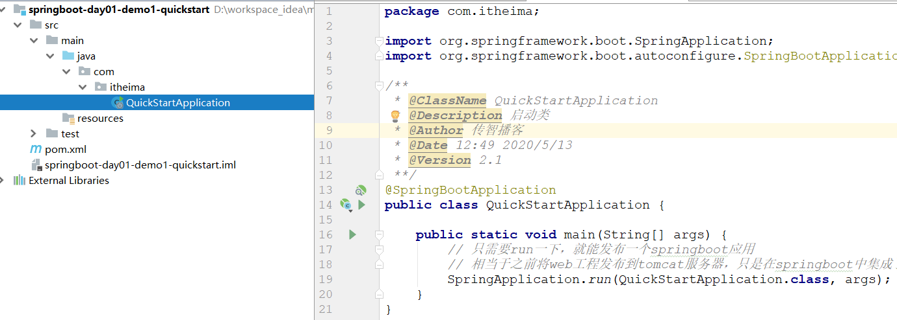

# SpringBoot（一）

要求：

1、每天代码**完成**

- 100%完成
- 多：列出必须完成的。

2、组长：统计各组前一天代码的完成情况    

- 没有写完：原因

3、思考：最重要的。

- 他以前学这个专业的（好处：认知）
- **思考**问题   +  **动手**

4、搞项目一未完成的代码

- 别搞了。
- 想完成：课余时间    前端copy过去      前后端分离开发      极少数：会写一些前端的程序（展示数据 +   ajax请求）

5、接下来的内容：与之前的关系不大（复习）


问题：为什么要用Dubbo？

- 场景：架构（需求）决定的
- 原理
- 使用


学习目标：框架（一种全新的开发方式）

1、SpringBoot简介

2、SpringBoot快速入门【掌握】

3、SpringBoot版本控制原理【掌握】

4、SpringBoot配置文件使用【学会使用】

5、SpringBoot与其他框架集成【掌握】

6、SpringBoot单元测试【使用】

7、SpringBoot热部署【使用】


# 1 SpringBoot简介

聊聊：开发的经历的阶段

1、第一个阶段（**农耕时代**）：学习的内容：jdk、java面向对象概念、jdbc、servlet等等      **原生api的操作**。

- 多：代码多    **每一步都需要自己去完成**。PreparedStatment（防止SQL注入），jdbc程序
  - 注册驱动--->获取连接--->创建PreparedStatment对象---->编写SQL语句--->调用方法query--->ResultSet结果集---->处理结果集

2、第二阶段（**工业时代**）：学习的内容：**框架阶段**      mybatis（ORM--->都是对jdbc的封装）、springmvc（对servlet的封装）、spring（简化开发    IoC/DI    AOP：事务管理）等等       **大大简化了开发**

- 配置文件多   
- 框架与框架间整合还需要配置文件     applicationContext-dao.xml
- 相关的依赖   mybatis-spring.jar

3、第三阶段（**现代化**）：核心的要求：业务的功能实现就好了。    技术：工具。       springboot

- 不要编写配置文件了
- 依赖管理：不需要我们去管理了。
- 程序员：关注业务的实现。


聊聊：spring开发阶段

- 第一阶段：满眼都是xml    spring1.x（2006）    EJB

  

- 第二阶段：在spring.xml     spring3.x     spring5.0.2

  ~~~xml
  // @Controller   @Service    @Repository    @Companent
  <component-sacn  basesPackage="com.xxxx">
  ~~~

- 第三阶段：java配置     纯注解开发。


- 目标：能够理解springboot设计理念以及解决的问题
- 学习路径：
  - springboot是什么
  - 目前项目开发存在的问题
  - springboot在开发能够解决什么问题
- 讲解：略

## 1.1 java的开发方式

- 农耕时代java开发：

  - 基于java底层原生api，纯手工去实现，典型的栗子：servlet、jdbc、javascript、socket...

  - 针对这样低效开发方式，那么需要改革。框架就是拯救者，解放了农耕时代的程序猿，框架可以帮助我们做更多，程序猿主要负责业务的实现。

    

    

- 工业时代java开发：

  - 各种框架一顿搞：典型的栗子SSH、SSM、Vue、jquery、Netty...

  - 在工业时代使用框架虽然简化了我们的开发的代码，但是各种配置文件各种jar又一顿搞。微服务又成了拯救者，解放了工业时代的程序猿。让我们过上了小康生活。

    

    

- 现代化java开发：

  - 各种微服务齐活：服务注册与发现、负载均衡与熔断、网关等

  - 各种组件一起上：springboot、springcloud...

    


## 1.2 SpringBoot简介

### 1.2.1 spring开发经历的阶段

Spring 诞生时是 Java 企业版（Java Enterprise Edition，JEE，也称 J2EE）的轻量级代替品。无需开发重量级的 Enterprise JavaBean（EJB），Spring 为企业级Java 开发提供了一种相对简单的方法，通过依赖注入和面向切面编程，用简单的Java 对象（Plain Old Java Object，POJO）实现了 EJB 的功能。虽然 Spring 的组件代码是轻量级的，但它的配置却是重量级的。 

- 第一阶段：xml配置：在Spring 1.x时代，使用Spring开发满眼都是xml配置的Bean，随着项目的扩大，我们需要把xml配置文件放到不同的配置文件里，那时需要频繁的在开发的类和配置文件之间进行切换 
- 第二阶段：注解配置：在Spring 2.x 时代，随着JDK1.5带来的注解支持，Spring提供了声明Bean的注解（例如@Component、@Service），大大减少了配置量。
- 第三阶段：java配置管理 ：Annotation的出现是为了简化Spring的XML配置文件，但Annotation不如XML强大，所以无法完全取代XMl文件 。例如：@Configuration、@Import等。

所有这些配置都代表了开发时的损耗。 因为在思考 Spring 特性配置和解决业务问题之间需要进行思维切换，**所以写配置挤占了写应用程序逻辑的时间**。除此之外，**项目的依赖管理也是件吃力不讨好的事情**。决定项目里要用哪些库就已经够让人头痛的了，你还要知道这些库的哪个版本和其他库不会有冲突，这难题实在太棘手。并且，依赖管理也是一种损耗，添加依赖不是写应用程序代码。一旦选错了依赖的版本，随之而来的不兼容问题毫无疑问会是生产力杀手。 

**Spring Boot 让这一切成为了过去。**

- **起步依赖**：本质是Maven项目对象模型中的标签。它定义其SpringBoot对他库的传递依赖，依赖加在一起即可支持某项功能。最厉害的就是这个，使得SpringBoot具备了构建一切的能力：整合所有牛×框架
- **自动配置**：基于约定优于配置思想，配置基本都可以走默认值。配置基本都是SpringBoot自动完成

### 1.2.2 springboot简介

- 开发人员不需要在去编写配置了（PS：springboot有自己的核心配置  application.properties/yml）
- 无需关心依赖管理
- 开箱即用：集成了很多的组件     集成好的tomcat、ActiveMQ直接使用
- springboot：**构建一切**（提供好了与其他框架的整合【配置文件+依赖】）
  - 如何发布：只需要“run”一下，就可以发布一个spring的应用。


Spring Boot 是由 Pivotal 团队提供的全新框架，其设计目的是用来简化新 Spring 应用的初始搭建以及开发过程。该框架使用了特定的方式来进行配置，从而使开发人员不再需要定义样板化的配置。

Spring Boot 简化了基于Spring的应用开发，只需要**“run”**就能创建一个独立的、生产级别的Spring应用。Spring Boot为Spring平台及第三方库提供开箱即用的设置（提供默认设置），这样我们就可以简单的开始。多数Spring Boot应用只需要**很少**（额外）的Spring配置。我们可以使用SpringBoot创建java应用，并使用java –jar 启动它，或者采用传统的war部署方式。

我的理解，就是 Spring Boot 其实不是什么新的框架，它默认配置（或集成）了很多框架的使用方式，就像 Maven 整合了所有的 Jar 包，**Spring Boot 整合了所有的框架**。SpringBoot不是对Spring功能的增强，而是提供一种快速使用Spring的开发方式（全新的开发方式）。


## 1.3 小结

~~~
1、快速构建项目（引入jar依赖）
2、对主流开发框架的无配置集成（开箱即用）
3、项目可独立运行，无需依赖外部的servlet容器（tomcat）
4、提供运行时的应用监控
5、极大的提高了开发效率、部署效率
~~~


# 2 SpringBoot快速入门

需求：将字符串，eg：“hello springboot”在浏览器显示出来。


之前：springmvc如何开发？步骤？

- 创建maven工程（web工程）
- 添加依赖：springmvc.jar   springmvc-web.jar    spring相关的依赖
- 编写springmvc.xml       （前端控制器DispatchServlet     处理器映射器HandlerMapping、适配器HandlerAdapter、视图解析器ViewResulver     一个中心，三个基本点）
  - 配置扫描包
  - 配置：按需配置
    - 处理器映射器HandlerMapping、适配器HandlerAdapter
- 编辑web.xml文件
  - 前端控制器DispatchServlet加载springmvc.xml文件
- 编写controller：@ResponseBody   略。
- 发布到tomcat启动程序并访问


现在：springboot开发

- 创建maven工程（**jar**/war）
- 添加依赖：
  - 添加一个父工程依赖：管理依赖jar的版本号
  - 添加web依赖：自动的将springmvc相关的依赖自动导入
- 编写Controller
- 发布：只需要“run”一下即可。


- 目标：能够完成springboot入门程序
- 路径：
  - 创建maven（java）工程
  - 添加相关依赖
  - 编写启动类
  - 编写Controller
  - 测试
- 讲解：略
- 小结：略

## 2.1 需求

完成：开发一个web应用并完成字符串“hello boot”在浏览器显示。

## 2.2 springmvc实现

实现步骤：

- 创建maven工程
- 导入相关依赖的jar包（例如：spring-web、spring-webmvc等）
- 编写springmvc核心配置文件
- 编写web.xml文件
- 编写XxxController

## 2.3 SpringBoot实现

### 2.3.1 构建工程方式一

#### 2.3.1.1 创建maven工程

创建一个`maven`工程，例如`<springboot-day01-demo1-quickstart>`。


1、添加起步依赖（依赖一个父工程）

2、添加web依赖

~~~xml
<!--添加起步依赖-->
<!--该依赖中包含了集成主流框架的jar的版本-->
<parent>
    <groupId>org.springframework.boot</groupId>
    <artifactId>spring-boot-starter-parent</artifactId>
    <version>2.1.4.RELEASE</version>
</parent>

<!--添加web依赖-->
<!--该依赖中已包含了springmvc需要常见jar包-->
<dependencies>
    <dependency>
        <groupId>org.springframework.boot</groupId>
        <artifactId>spring-boot-starter-web</artifactId>
    </dependency>
</dependencies>
~~~

#### 2.3.1.2 工程jar依赖情况

工程jar的依赖结构：


#### 2.3.1.3 编写启动类

该程序是发布springboot应用的入口（只需要run一下）



~~~java
@SpringBootApplication
public class QuickStartApplication {

    public static void main(String[] args) {
        // 只需要run一下，就能发布一个springboot应用
        // 相当于之前将web工程发布到tomcat服务器，只是在springboot中集成了tomcat插件
        SpringApplication.run(QuickStartApplication.class, args);
    }
}
~~~

#### 2.3.1.4 编写HelloController

在工程的src目录下创建HelloController。


~~~java
@RestController
@RequestMapping("/springboot")
public class HelloController {

    @RequestMapping("/hello")
    public String hello(){
        System.out.println("程序执行了。。。");
        return "hello springboot";
    }

}
~~~

#### 2.3.1.5 测试

运行启动类中的main方法即可：


访问：http://localhost:8080/springboot/hello，浏览器访问结果如下：


### 2.3.2 构建工程方式二（了解）

不推荐：开发过程中，jar的版本有要求的。官方的脚手架变化太快了。


#### 2.3.2.1 创建spring initializr工程

（官网：http://start.spring.io    阿里提供的脚手架：<https://start.aliyun.com/> ）

通过idea工具创建工程时，不再选择maven了而是选择spring initializr。然后去勾选相关依赖。

- step1：新建module，选择spring initializr，然后下一步

  

- step2：填写项目相关信息

  

- step3：勾选需要的依赖

  

- step4：完成，工程的目录结构如下

  

#### 2.3.2.2 编写HelloController

在工程的src目录下创建HelloController

~~~java
@RestController
public class HelloController {
    
    @RequestMapping("/hello2")
    public String hello2(){
        System.out.println("执行了。。。2");
        return "hello2 boot!";
    }
}
~~~

#### 2.3.2.4 测试


访问：http://locahost:8080/hello2


## 2.4 总结

~~~
springboot入门程序：
1、创建工程
2、编写启动类
3、编写配置文件（application.properties/yml/yaml）
4、编写相关业务代码

如有页面和静态资源：在resources目录下创建：
templates：存放HTML页面
static：存放静态资源
~~~


# 3 SpringBoot版本控制原理

1、pom文件中，添加parent工程（不需要自己创建     作用：与之前同学们创建的parent工程的作用一样的   管理jar包的版本的）

* ctrl + 点击 spring-boot-starter-parent 


* springboot程序中的核心配置文件的格式：application.properties/yml[yaml]


* 自动管理jar的版本

  ctrl + 点击 spring-boot-dependencies


2、@SpringBootApplication：了解


- ```
  @SpringBootConfiguration == @Configuration：申明为一个配置类（相当于spring.xml）
  ```

- ```
  @ComponentScan：包扫描的注解  （相当于spring.xml    <component-sacn  basepakage="xxx">）
  ```

- ```
  @EnableAutoConfiguration：开箱即用   jedis,在spring.xml中管理这个bean，才可以在程序中注入。
  ```


## 3.1 spring-boot-starter-parent

**起步依赖**：从上面的spring-boot-dependencies的pom.xml中可以看出，坐标的版本，依赖管理，插件管理已经预先定义好了。SpringBoot工程继承Spring-boot-starter-parent后，已经锁定了版本等配置。起步依赖的作用是进行依赖传递 。用啥取啥，随用随取即可。我们开发中彻底不用关心：jar包的版本、依赖等问题了，大大降低版本冲突，版本过期，更新一个jar一下就需要升级一个tree的jar包。

相当于我们之前学习的过程中创建的父工程，在之前创建的父工程中，其中一个功能是用来统一管理jar包。这里的父工程其实作用是一样的。


## 3.2 @SpringBootApplication

该注解是一个组合注解，包括如下注解


- @SpringBootConfiguration：与之前@Configuration注解一样，声明为一个配置类
- @ComponentScan：spring IoC容器的扫描包，默认扫描引导程序下的包以及子包，如果我们写的程序不在该包范围内，可以通过该注解指定。
- @EnableAutoConfiguration：springboot实现自动化配置的核心注解。

自动装配：最好不配置，默认的配置都给配好了。


# 4 SpringBoot配置文件使用

我们知道SpringBoot是基于约定的（**约定大于配置**），所以很多配置都有默认值。如果想修改默认配置，可以使用application.properties或application.yml(application.yaml)自定义配置。SpringBoot默认从Resource目录加载自定义配置文件。application.properties是键值对类型(一直在用，而且默认生成)。application.yml是SpringBoot中一种新的配置文件方式。如果同时存在两个文件，那么优先级properties要高于yml**【也就是properties文件中的内容会覆盖yml中的相同配置的值】**。 


- 目标：
  - 掌握springboot中配置文件种类以及配置语法
  - 获取配置文件中的值
  - 加载不同环境下的配置文件
- 路径：
  - 掌握springboot中配置文件种类以及配置语法
    - application.properties
    - application.yml
  - 获取配置文件中的值
    - @Value
    - 注入Environment
    - @ConfigurationProperties
  - 加载不同环境下的配置文件
    - test
    - dev
    - pro
- 讲解：略
- 小结：略


## 4.1 application.properties

### 4.1.1 语法

- 格式：key=value

- 如果是修改SpringBoot中的默认配置，那么key则不能任意编写，必须参考SpringBoot官方文档。

- application.properties官方文档：`<https://docs.spring.io/spring-boot/docs/2.1.14.RELEASE/reference/html/>` 


### 4.1.2 案例

在`<springboot-day01-demo1-quickstart>`工程的resources目录下添加application.properties文件。


~~~properties
#tomcat port
server.port=8081
#app context
server.servlet.context-path=/demo
~~~

如果报错问题


启动后console控制台：


访问地址为：`<http://localhost:8081/demo/springboot/hello>`


## 4.2 application.yml/yaml

### 4.2.1 语法

~~~
要求：
1、区分大小写
2、数据值前必须有空格，作为分隔符
3、缩进的空格数目不重要，只需要对齐即可
~~~

### 4.2.2 案例

例如：【删除application.properties文件，否则yml配置会被properties文件中内容覆盖】


~~~yaml
server:
  port: 8082
  servlet:
    context-path: /demo2
~~~

### 开发中[重点]

* 尽量不要写两种个格式的文件(因为要统一)
* 可以存在两种格式种的
  * `properties文件的优先级更高`

## 4.3 获取配置文件中的值

~~~
获取值的方式：
1、@value注解的方式
2、注入Environment的方式
3、@ConfigurationProperties
~~~

### 4.3.1 在yml文件中添加如下内容

将该内容全部复制到application.yml文件中。

~~~yaml
# 基本格式 key: value
name: zhangsan
# 数组   - 用于区分
city:
  - beijing
  - tianjin
  - shanghai
  - chongqing
# list集合中的元素是对象形式
students:
  - name: zhangsan
    age: 18
    score: 99.99
  - name: lisi
    age: 28
    score: 88
  - name: wangwu
    age: 38
    score: 90
# map集合形式
maps: {"name":"zhangsan", "age": 15}
# 参数引用
person:
  name: ${name} # 该值可以获取到上边的name定义的值
~~~

### 4.3.2 通过@Value取值

在HelloController中添加如下代码：

~~~java
@RestController
@RequestMapping("/springboot")
public class HelloController {
   //通过@Value获取值
    //基本
    @Value("${name}")
    private String name;
    //数组
    @Value("${city[0]}")
    private String city0;

    //list
    @Value("${students[1].name}")
    private String student1Name;

    //map
    @Value("${maps.age}")
    private Integer age;

    //参数引用
    @Value("${person.name}")
    private String personName;

    @RequestMapping("/hello")
    public String hello(){
        System.out.println("程序执行了。。。");
        System.out.println(name);
        System.out.println(city0);
        System.out.println(student1Name);
        System.out.println(age);
        System.out.println(personName);

        return "hello springboot";
    }
}
~~~

如果报错:Failed to load property source from location 'classpath:/application.yml'


### 4.3.3 通过Environment取值

在HelloController中添加如下代码

* 注意导包

~~~java
@RestController
@RequestMapping("/springboot")
public class HelloController {
    // 通过注入Environment取值
    @Autowired
    private Environment env;

    @RequestMapping("/hello")
    public String hello(){
        System.out.println("程序执行了。。。");
        System.out.println(env.getProperty("name"));
        System.out.println(env.getProperty("city[0]"));
        System.out.println(env.getProperty("students[1].name"));
        System.out.println(env.getProperty("maps.age"));
        System.out.println(env.getProperty("person.name"));
        return "hello springboot";
    }

}
~~~

### 4.3.4@ConfigurationProperties取值

~~~properties
作用：前缀定义了哪些外部属性将绑定到指定类的字段上

使用场景：
1、如果只是某个业务中需要获取配置文件中的某项值或者设置具体值，可以使用@Value或Environment；
2、如果一个JavaBean中大量属性值要和配置文件进行映射，可以使用@ConfigurationProperties；
~~~


#### 4.3.4.1 在yml文件中添加如下内容

~~~yaml
#实体类接收 
#myapp:和mail:是给pojo的取值注解的前缀
#address和message要和POJO的属性一样
myapp:
  mail:
    address: jack@itcast.cn
    message: This is test
~~~


#### 4.3.4.2 创建一个pojo

在`<com.ithiema.pojo包下创建Mail实体类>`


~~~java
@Component
@ConfigurationProperties(prefix = "myapp.mail") //配置文件中的节点
public class Mail {

    private String address;
    private String message;

    public String getAddress() {
        return address;
    }

    public void setAddress(String address) {
        this.address = address;
    }

    public String getMessage() {
        return message;
    }

    public void setMessage(String message) {
        this.message = message;
    }
}
~~~

#### 4.3.4.3 取值

在HelloController中添加如下代码

~~~java
@RestController
@RequestMapping("/springboot")
public class HelloController {

    //要pojo实体类注入
    @Autowired
    private Mail mail;

    @RequestMapping("/hello")
    public String hello(){
        System.out.println(mail.getAddress());
        System.out.println(mail.getMessage());
        return "hello springboot";
    }
}
~~~


## 4.4 spring.profiles.active


~~~properties
在开发的过程中，需要配置不同的环境(开发/测试/生产)，所以即使我们在application.properties配置文件中通过spring.profiles.active属性用来指定使用的环境。当然yml文件也是一样。

# 指定开发环境
spring.profiles.active=test/dev/pro

- test，测试环境
- dev，开发环境
- pro，生产环境
~~~


### 4.4.1 properties文件

在工程中创建4个properties文件，如下：


配置文件内容：

~~~properties
application.properties文件：
# 指定开发环境 test：测试环境  dev：开发环境  pro：生产环境
spring.profiles.active=test  

application-dev.properties文件：
server.port=8082

application-pro.properties文件：
server.port=8081

application-test.properties文件：
server.port=8080
~~~


### 4.4.2 yml文件

**略（同学们自己完成）**


~~~yaml
# 通过active指定选用配置环境
application.yml:
spring:
  profiles:
    active: pro

# 开发环境
application-dev.yml:
server:
  port: 8081

# 测试环境
application-test.yml:
server:
  port: 8082
  
# 生产环境
application-pro.yml:
server:
  port: 8083
~~~


# 5 SpringBoot与其他框架集成

- 目标：掌握springboot与其他框架集成
- 路径：
  - 添加相关启动器（xxx-starter）
  - 创建工程
  - 编写启动类
  - 编写配置文件
  - 编写相关代码
  - 测试
- 讲解：略
- 小结：略

## 5.1 集成mybatis

### 5.1.1 需求

`实现功能:查询所有用户`

查询所有用户列表。（建库、建表：略）

~~~sql
-- ----------------------------
-- Table structure for `user`
-- ----------------------------
DROP TABLE IF EXISTS `user`;
CREATE TABLE `user` (
`id` int(11) NOT NULL AUTO_INCREMENT,
`username` varchar(50) DEFAULT NULL,
`password` varchar(50) DEFAULT NULL,
`address` varchar(50) DEFAULT NULL,
PRIMARY KEY (`id`)
) ENGINE=InnoDB AUTO_INCREMENT=1 DEFAULT CHARSET=utf8;
-- ----------------------------
-- Records of user
-- ----------------------------
INSERT INTO `user` VALUES ('1', 'zhangsan', '123', '北京');
INSERT INTO `user` VALUES ('2', 'lisi', '123', '上海');
~~~

### 5.1.2 创建工程

创建maven工程`<springboot-day01-demo2-mybatis>`，并且添加相关依赖。


~~~xml
<!--添加起步依赖-->
<parent>
    <groupId>org.springframework.boot</groupId>
    <artifactId>spring-boot-starter-parent</artifactId>
    <version>2.1.4.RELEASE</version>
</parent>

<dependencies>

    <dependency>
        <groupId>org.springframework.boot</groupId>
        <artifactId>spring-boot-starter-web</artifactId>
    </dependency>
    <dependency>
        <groupId>org.mybatis.spring.boot</groupId>
        <artifactId>mybatis-spring-boot-starter</artifactId>
        <version>2.0.1</version>
    </dependency>

    <dependency>
        <groupId>org.springframework.boot</groupId>
        <artifactId>spring-boot-devtools</artifactId>
        <scope>runtime</scope>
        <optional>true</optional>
    </dependency>
    <dependency>
        <groupId>mysql</groupId>
        <artifactId>mysql-connector-java</artifactId>
        <scope>runtime</scope>
    </dependency>
    <dependency>
        <groupId>org.springframework.boot</groupId>
        <artifactId>spring-boot-starter-test</artifactId>
        <scope>test</scope>
    </dependency>
</dependencies>
~~~

### 5.1.3 编写启动类

在src的`<com.ithiema包下创建MybatisApplication启动类>`，代码如下：

~~~java
@SpringBootApplication
public class MybatisApplication {

    public static void main(String[] args) {
        SpringApplication.run(MybatisApplication.class, args);
    }
}
~~~

### 5.1.4 添加application.properties文件

在resources目录下添加`application.properties`文件

~~~properties
#连接数据库
spring.datasource.driver-class-name=com.mysql.cj.jdbc.Driver
spring.datasource.url=jdbc:mysql://localhost/springboot?useUnicode=true&characterEncoding=UTF-8&serverTimezone=UTC
spring.datasource.username=root
spring.datasource.password=root
#mybatis别名
mybatis.type-aliases-package=com.itheima.pojo
#加载映射文件
mybatis.mapper-locations=classpath:mapper/*.xml
#设置日志，com.itheima：只查看该包下程序的日志
logging.level.com.itheima=debug
~~~

### 5.1.5 编写pojo

在工程的src目录下的`<com.itheima.pojo包下>`创建User对象：

~~~java
public class User {
    private Integer id;
    private String username;
    private String password;
    private String address;
    // TODO getters、setters
}
~~~

### 5.1.6 编写mapper接口以及映射文件

1、编写mapper接口：在src目录下`<com.itheima.dao包下>`创建UserMapper

- 在接口中添加**@Mapper**注解（标记该类是一个Mapper接口，可以被SpringBoot自动扫描）

~~~java
@Mapper
public interface UserDao {
    
    List<User> findUsers();
}
~~~

2、编写映射文件：在工程的resources/mapper目录下创建UserDao.xml


~~~xml
<mapper namespace="com.itheima.dao.UserDao">

    <select id="findUsers" resultType="user">
        SELECT * FROM user
    </select>

</mapper>
~~~


### 5.1.7 编写service接口以及实现类

1、在src的`<com.itheima.service包下创建>`service接口：

~~~java
public interface UserService {
    List<User> findUsers();
}
~~~


2、在`<com.itheima.service.impl包下创建>`service实现类：

~~~java
@Service
public class UserServiceImpl implements UserService{

    @Autowired(required = false)
    private UserDao userDao;

    @Override
    public List<User> findUsers() {
        return userDao.findUsers();
    }
}
~~~


### 5.1.8 编写controller

在`<com.itheima.controller包下创建>`下创建UserController：

~~~java
@RestController
@RequestMapping("/user")
public class UserController {

    @Autowired
    private UserService userService;

    @RequestMapping("/findUsers")
    public List<User> findUsers(){
        List<User> users = userService.findUsers();
        return users;
    }
}
~~~


### 5.1.9 发布程序并访问

小工具：可以直接通过idea中集成的REST client插件发送请求。


## 5.2 集成Spring Data Redis

Spring Data:  Spring 的一个子项目。用于简化数据库访问，支持**NoSQL**和**关系数据库存储**。其主要目标是使数据库的访问变得方便快捷。 

### 5.2.1 添加Redis启动器

这里我们就不在单独创建工程了，就直接在【5.1】章节中的`<springboot-day01-demo2-mybatis>工程中`添加Redis启动器。

~~~xml
<!--redis-->
<dependency>
    <groupId>org.springframework.boot</groupId>
    <artifactId>spring-boot-starter-data-redis</artifactId>
</dependency>
<!--json解析-->
<dependency>
    <groupId>com.alibaba</groupId>
    <artifactId>fastjson</artifactId>
    <version>1.2.51</version>
</dependency>
~~~


### 5.2.2 配置application

在application.properties文件中配置连接Redis的信息：

~~~properties
#redis，本地可以不配置，默认配置
spring.redis.host=localhost
spring.redis.port=6379
~~~

### 5.2.3 更新程序

更新UserServiceImpl类中的findAll方法。在该类中注入RedisTemplate对象。

~~~java
@Service
public class UserServiceImpl implements UserService {

    @Autowired
    private UserMapper userMapper;

    //注入String数据类型的Redis模板
    @Autowired
    private StringRedisTemplate stringRedisTemplate;

    @Override
    public List<User> findAll() {
        //先获取redis中的数据
        String text = stringRedisTemplate.boundValueOps("user").get();
        //将json字符串转换为对象集合
        List<User> list = JSON.parseArray(text, User.class);
        //是否存在
        if (list == null) {
            //测试:
            System.out.println("redis中没数据");
            //如果不存在:查询数据库
            list = userDao.findUser();
            //存入Redis中(转换为json)
            stringRedisTemplate.boundValueOps("user").set(JSON.toJSONString(list));
        }

        //返回user集合
        return list;
    }
}

PS：key = 产线名:服务名:表名:数据类型:key
~~~

### 5.2.4 测试


### 5.2.5 扩展-了解

1、使用RedisTemplate对象操作Redis服务，代码如下：

~~~java
//不同点
@Autowired
private RedisTemplate redisTemplate;

@Override
public List<User> findUsers() {
    List<User> users = (List<User>) redisTemplate.boundValueOps("heima:springboot:user:id:1").get();
    if (users == null){
        System.out.println("从数据库中查询");
        users = userDao.findUsers();
        // 将数据写入Redis
        redisTemplate.boundValueOps("heima:springboot:user:id:1").set(users);
    }
    return users;
}
~~~


2、需要对User实现序列化接口：

~~~java
public class User implements Serializable{
    // ......
}
~~~


- RedisTemplate源码


- StringRedisTemplate源码


~~~properties
RedisTemplate 和 StringRedisTemplate的区别：
1、RedisTemplate 的序列化采用的是 JdkSerializationRedisSerializer ，在存储到 Redis 的时候会将 对象 序列化为 字节数组
2、StringRedisTemplate 的序列化采用的是 StringRedisSerializer ，适用于存储的 value 为 String 的情况
结论：
Redis 中存储对象使用 RedisTemplate ，存储字符串使用 StringRedisTemplate

JdkSerializationRedisSerializer 和 StringRedisSerializer
1、JdkSerializationRedisSerializer底层还是通过调用JDK的IO操作ObjectInputStream和ObjectOutputStream类实现POJO的序列化和反序列化，优点是反序列化时不需要提供类型信息(class)，但缺点是需要实现Serializable接口，还有序列化后的结果非常庞大，是JSON格式的5倍左右，这样就会消耗redis服务器的大量内存。

2、使用Jackson库将对象序列化为JSON字符串。优点是速度快，序列化后的字符串短小精悍，不需要实现Serializable接口。但缺点也非常致命，那就是此类的构造函数中有一个类型参数，必须提供要序列化对象的类型信息(.class对象)
~~~


## 5.3 集成定时器

1、在SpringBoot`启动类`中添加`开启定时任务注解`：@EnableScheduling


2、在`<com.itheima.task包下>`编写定时任务程序

~~~java
@Component
public class TimeProgarm {

    /**
     * 掌握：cron表达式是一个字符串，字符串以5或6个空格隔开，分开共6或7个域，每一个域代表一个含义
     *  [秒] [分] [小时] [日] [月] [周] [年]
     *  [年]不是必须的域，可以省略[年]，则一共7个域
     *
     * 了解：
     *  fixedDelay：上一次执行完毕时间点之后多长时间再执行（单位：毫秒）
     *  fixedDelayString：同等，唯一不同的是支持占位符，在配置文件中必须有time.fixedDelay=5000
     *  fixedRate：上一次开始执行时间点之后多长时间再执行
     *  fixedRateString：同等，唯一不同的是支持占位符
     *  initialDelay：第一次延迟多长时间后再执行
     *  initialDelayString：同等，唯一不同的是支持占位符
     */
//    @Scheduled(fixedDelay = 5000)
//    @Scheduled(fixedDelayString = "5000")
//    @Scheduled(fixedDelayString = "${time.fixedDelay}")
//    @Scheduled(fixedRate = 5000)
//    // 第一次延迟1秒后执行，之后按fixedRate的规则每5秒执行一次
//    @Scheduled(initialDelay=1000, fixedRate=5000)
    @Scheduled(cron = "30 45 15 08 07 *")
    public void myTask(){
        System.out.println("程序执行了");
    }
}
~~~

备注：可以通过资料中提供的cron表达式工具去生成（或：`<https://cron.qqe2.com/>`）。


## 5.4 集成单元测试

### 5.4.1 添加依赖

~~~xml
<dependency>
    <groupId>org.springframework.boot</groupId>
    <artifactId>spring-boot-starter-test</artifactId>
    <scope>test</scope>
</dependency>
~~~


### 5.4.2 编写单元测试

**PS：单元测试类需要在启动类包或者子包下。**

~~~java
@RunWith(SpringRunner.class)
@SpringBootTest
public class MybatisTest {

	@Autowired
    private UserService userService;

    @Test
    public void contextLoad(){
        List<User> users = userService.findUsers();
        for (User user : users) {
            System.out.println(user);
        }
    }
}

~~~


# 6 热部署（了解）

## 6.1 配置pom

针对每次修改代码都需要重新发布程序，在springboot中提供了热部署插件。只需要在pom文件中添加热部署依赖即可，如下所示

```xml
<!--热部署-->
<dependency>
    <groupId>org.springframework.boot</groupId>
    <artifactId>spring-boot-devtools</artifactId>
</dependency>
```

## 6.2 开启自动构建工程

1、在idea的settings中勾选自动构建工程选项即可。如图所示：


2、Shift + Ctrl + Alt + /：选择registry，弹出框选择 compiler.automake.allow.when.app.running 勾选上即可。


# 7 maven仓库问题

- 代码问题：不多


使用提供的maven仓库：


1、修maven的settings.xml文件，指定新仓库的路径


2、修改idea集成的maven配置


3、修改默认的仓库


maven仓库问题，如何解决


先：清理idea缓存并重启


**如果不行：**

将maven仓库中：**.lastupdate**文件全部删除


**如果还不行：**删除maven与idea建立的索引关系：


**如果还不行：**换个版本的maven   


**如果还不行：**换个idea


