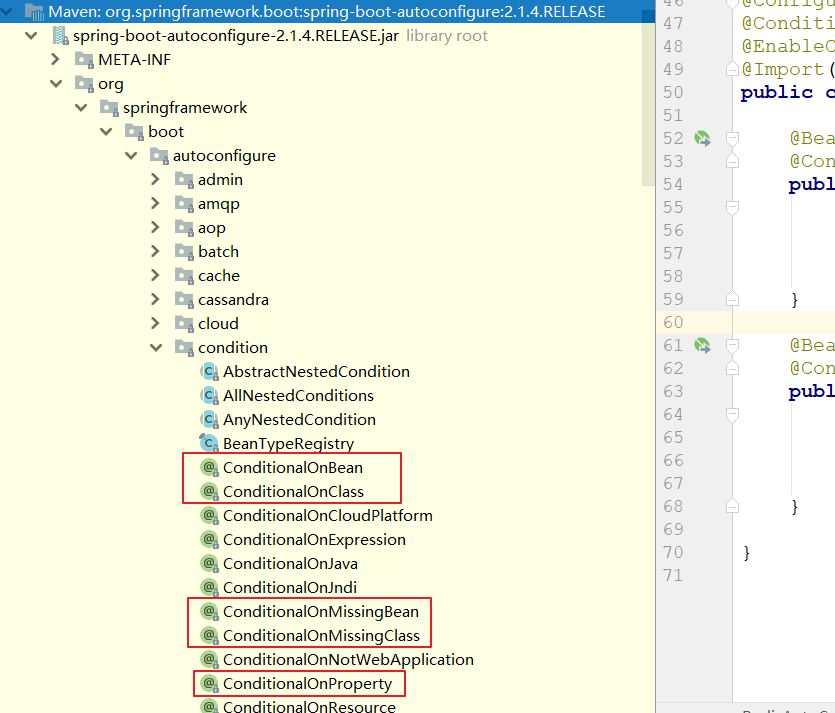
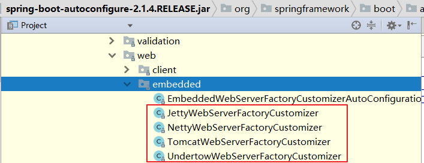
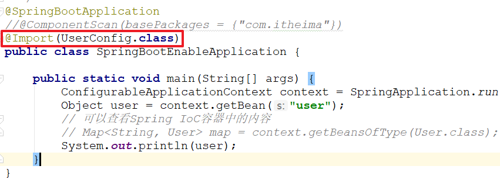
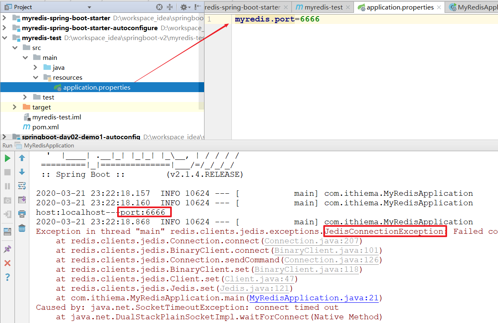
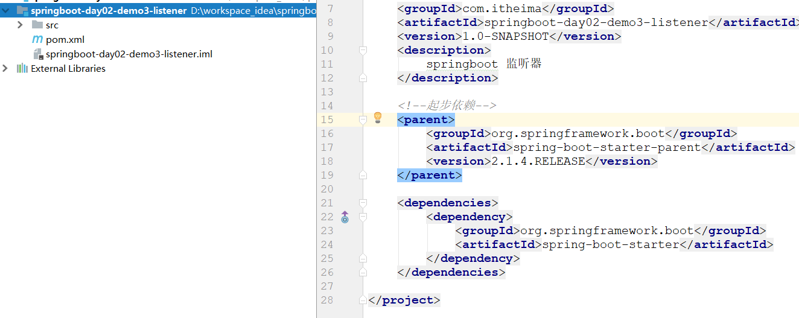
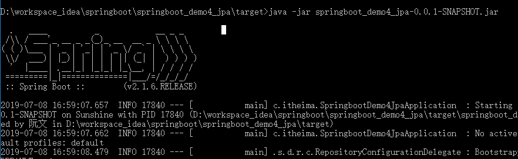

# **SpringBoot**（二）

学习目标

1、掌握SpringBoot自动配置使用

2、掌握SpringBoot自动配置原理

3、掌握SpringBoot切换内置servlet服务器

4、掌握@SpringBootApplication核心注解

5、自定义SpringBoot启动器starter

6、了解SpringBoot监听机制

7、了解SpringBoot监控

8、掌握SpringBoot程序打包方式（jar包）


# 1 SpringBoot自动配置使用

## 1.1 自动注入RedisTemplate

### 1.1.1 需求

在SpringBoot第一天课程中我们在程序中可以直接注入RedisTemplate，并且通过该对象操作Redis服务，那么说明在Spring容器中肯定是注册了该bean，那么接下来我们就获取该对象的实例。

### 1.1.2 代码实现

#### 1.1.2.1 创建maven工程

创建`<springboot-day02-demo1-autoconfig>`工程：略。


#### 1.1.2.2 添加依赖

在pom文件中添加依赖

~~~xml
<!--起步依赖-->
<parent>
    <groupId>org.springframework.boot</groupId>
    <artifactId>spring-boot-starter-parent</artifactId>
    <version>2.1.4.RELEASE</version>
</parent>

<dependencies>
    <!--加入springboot的starter起步依赖-->
    <dependency>
        <groupId>org.springframework.boot</groupId>
        <artifactId>spring-boot-starter</artifactId>
    </dependency>
    <!--Redis依赖-->
    <dependency>
        <groupId>org.springframework.boot</groupId>
        <artifactId>spring-boot-starter-data-redis</artifactId>
    </dependency>
</dependencies>
~~~


#### 1.1.2.3 创建启动类

在工程的src的`<com.ithema包下创建AutoConfigApplication启动类>`

~~~java
@SpringBootApplication
public class AutoConfigApplication {

    public static void main(String[] args) {
        // 获取Spring IoC容器
        ConfigurableApplicationContext context = SpringApplication.run(AutoConfigApplication.class, args);
        // 获取容器中的bean
        Object redisTemplate = context.getBean("redisTemplate");
        System.out.println(redisTemplate);
    }
}
~~~

#### 1.1.2.4 启动服务并测试

- 启动完成后，控制台打印了该对象的实例

  

- 如果将pom文件中的redis启动器的依赖给注释掉，我们在启动服务则报错。

  

### 1.1.3 总结

通过SpringBoot开发程序，需要获取Spring容器中注册的Bean，那么我们只需要在pom文件中添加相关的启动器即可。如果没有该启动器，我们可以自定义。


## 1.2 Spring之Conditional条件注解

~~~properties
Conditional 是在spring4.0 增加的条件注解，当你注册bean时，可以对这个bean添加一定的自定义条件，当满足这个条件时，注册这个bean，否则不注册。
~~~

### 1.2.1 需求

在Spring的IoC容器中注入User的Bean，但是要求如下：

- 如果pom文件中依赖了Jedis则创建该User实例
- 如果pom文件中没有依赖了Jedis则不创建该User实例

### 1.2.2 代码实现

#### 1.2.2.1 添加依赖

在pom文件中添加jedis依赖

~~~xml
<!--Jedis依赖-->
<dependency>
    <groupId>redis.clients</groupId>
    <artifactId>jedis</artifactId>
</dependency>
~~~


#### 1.2.2.2 创建User对象

在`<com.itheima.pojo包下创建User对象>`

~~~java
public class User {

}
~~~


#### 1.2.2.3 创建ClassCondition

在`<com.itheima.condition包下创建ClassCondition对象>`

* 注意`Condition接口`要annotation的

​	

~~~java
/**
 * @ClassName ClassCondition
 * @Description 判断创建bean是否满足条件
 * @Author 传智播客
 * @Date 0:14 2020/3/21
 * @Version 2.1
 **/
public class ClassCondition implements Condition {

    /**
     * @author 栗子
     * @Description
     * @Date 0:16 2020/3/21
     * @param conditionContext      上下文对象，获取属性值、获取类加载器、获取BeanFactory
     * @param annotatedTypeMetadata 元数据对象，获取注解属性
     * @return boolean
     **/
    @Override
    public boolean matches(ConditionContext conditionContext, AnnotatedTypeMetadata annotatedTypeMetadata) {
        boolean flag = false;
        try {
            // 判断是否有该jedis字节码
            Class<?> clazz = Class.forName("redis.clients.jedis.Jedis");
            flag = true;
        } catch (ClassNotFoundException e) {
            e.printStackTrace();
        }
        return flag;
    }
}

~~~


#### 1.2.2.3 创建配置类

在`<com.itheima.config包下创建UserConfig对象>`

~~~java
/**
 * @ClassName UserConfig
 * @Description 配置类
 * @Author 传智播客
 * @Date 0:06 2020/3/21
 * @Version 2.1
 **/
@Configuration//配置类注解
public class UserConfig {
    
	/**
     * @Conditional(value = {ClassCondition.class})
     *      判断ClassCondition中内容是否成立，
     *      如果成立则创建user的bean，否则不创建
     * @return 实体化User对象
     */
    @Bean
    @Conditional(value = {ClassCondition.class})	// 如果条件成立，则实例化User对象
    public User user(){
        return new User();
    }
}

// @Conditional(value = {ClassCondition.class})：判断ClassCondition中内容是否成立，如果成立则创建user的bean，否则不创建
~~~


#### 1.2.2.4 启动服务并测试


### 1.2.3 代码优化

在ClassCondition类中，只能判断是否有jedis依赖，我们的代码硬编码了。因此我们可以对该程序优化。

#### 1.2.3.1 分析

在实现类ClassCondition的matches方法中有个annotationTypeMetadata参数，而该参数的作用是获取注解中的属性值的。那么我们可以从这里下手。


#### 1.2.3.2 自定义Conditional注解

在`<com.itheima.annotation包下创建ConditionOnClass注解类>`

~~~java
/**
 * @author 栗子
 * @Description 自定义注解
 * @Date 0:39 2020/3/21
 * @return
 **/
@Target({ElementType.TYPE, ElementType.METHOD})
@Retention(RetentionPolicy.RUNTIME)
@Documented
@Conditional(value = {ClassCondition.class})
public @interface ConditionOnClass {
	//定义注解value属性:可以@bean中拷贝
    String[] value() default {};
}

PS:@Target,注解的作用目标
@Target(ElementType.TYPE)——接口、类、枚举、注解
@Target(ElementType.METHOD)——方法

@Retention作用是定义被它所注解的注解声明周期
RetentionPolicy.RUNTIME：注解不仅被保存到class文件中，jvm加载class文件之后，仍然存在

@Documented：生成接口文档带有注释
~~~


#### 1.2.3.3 修改UserConfig

使用`自定义的注解`。


```java
package com.itheima.config;

import com.itheima.annotation.ConditionOnClass;
import com.itheima.condition.ClassCondition;
import com.itheima.pojo.User;
import org.springframework.context.annotation.Bean;
import org.springframework.context.annotation.Conditional;
import org.springframework.context.annotation.Configuration;

/**
 * 配置类
 * @Author: wzw
 * @Date: 2020/11/27 10:39
 * @version: 1.8
 */
@Configuration //配置类注解
public class UserConfig {

    /**
     * @Conditional(value = {ClassCondition.class})
     *      判断ClassCondition中内容是否成立，
     *      如果成立则创建user的bean，否则不创建
     * @return 实体化User对象
     */
    @Bean //bean注解
//    @Conditional(value = {ClassCondition.class})// 如果条件成立，则实例化User对象
    @ConditionOnClass(value = {"redis.clients.jedis.Jedis"})  //修改点:自定义注解
    public User user(){
        //返回对象
        return new User();
    }
}

```


#### 1.2.3.4 修改ClassCondition

~~~java
public class ClassCondition implements Condition {

    /**
     * @author 栗子
     * @Description
     * @Date 0:16 2020/3/21
     * @param conditionContext      上下文对象，获取属性值、获取类加载器、获取BeanFactory
     * @param annotatedTypeMetadata 元数据对象，获取注解属性
     * @return boolean
     **/
    @Override
    public boolean matches(ConditionContext conditionContext, AnnotatedTypeMetadata annotatedTypeMetadata) {
        boolean flag = false;
        try {
            //拿到所有字节码的名称
            Map<String, Object> map = annotatedTypeMetadata.getAnnotationAttributes(ConditionOnClass.class.getName());
            //拿到所有对象
            String[] values = (String[]) map.get("value");
            // 判断是否有该jedis字节码
//            Class<?> clazz = Class.forName("redis.clients.jedis.Jedis");
            for (String className : values) {
                Class<?> clazz = Class.forName(className);
            }
            flag = true;
        } catch (ClassNotFoundException e) {
            e.printStackTrace();
        }
        return flag;
    }
}
~~~


如果报错


#### 1.2.3.5 启动服务并测试

略。


# 2 SpringBoot自动配置原理


例如，在springboot第一天的程序中，我们可以直接注入RedisTemplate并且可以操作Redis服务。那么SpringBoot是如何创建RedisTemplate对象并且注入到Spring容器中的呢？

## 2.1 SpringBoot常用条件注解

~~~properties
ConditionalOnBean         判断spring容器中有某个bean时初始化该Bean
ConditionalOnClass        判断程序中有某个class字节码文件时初始化该Bean
ConditionalOnMissingBean  判断spring容器中没有该Bean时会初始化该Bean
ConditionalOnMissingClass 判断程序中没有某个class字节码文件时初始化该Bean
ConditionalOnProperty     判断配置文件中是否有对应的属性和值才初始化该bean
~~~

查看spring-boot-autoconfigure源码，如下：




## 2.2 如何初始化RedisTemplate

查看spring-boot-autoconfigure源码`<org.springframework.boot.autoconfigure.data.redis.RedisAutoConfiguration>`，如下：

~~~java
@Configuration
@ConditionalOnClass(RedisOperations.class)
@EnableConfigurationProperties(RedisProperties.class)
@Import({ LettuceConnectionConfiguration.class, JedisConnectionConfiguration.class })
public class RedisAutoConfiguration {

	@Bean
    // 如果spring的IoC容器中没有该对象，则实例化RedisTemplate对象
	@ConditionalOnMissingBean(name = "redisTemplate")
	public RedisTemplate<Object, Object> redisTemplate(
			RedisConnectionFactory redisConnectionFactory) throws UnknownHostException {
		RedisTemplate<Object, Object> template = new RedisTemplate<>();
		template.setConnectionFactory(redisConnectionFactory);
		return template;
	}

	@Bean
	@ConditionalOnMissingBean
	public StringRedisTemplate stringRedisTemplate(
			RedisConnectionFactory redisConnectionFactory) throws UnknownHostException {
		StringRedisTemplate template = new StringRedisTemplate();
		template.setConnectionFactory(redisConnectionFactory);
		return template;
	}

}
~~~


# 3 SpringBoot切换内置服务器


~~~properties
SpringBoot提供了4种内置服务器供我们选择，我们可以很方便的进行切换。

Tomcat：默认使用tomcat作为内置服务器
Jetty：一个开源的servlet容器，它为基于Java的web容器
Netty：Netty是由JBOSS提供的一个java开源框架。Netty 是一个基于NIO的客户、服务器端的编程框架，使用Netty 可以确保你快速和简单的开发出一个网络应用，例如实现了某种协议的客户、服务端应用。Netty相当于简化和流线化了网络应用的编程开发过程，例如：基于TCP和UDP的socket服务开发。
Undertow：红帽公司开发的一款基于 NIO 的高性能 Web 嵌入式服务器
~~~





## 3.1 默认使用

springBoot的web环境默认使用tomcat作为内置服务器。我们`只需要`在工程中的pom文件中添加如下依赖即可

~~~xml
<!--添加web依赖-->
<dependency>
    <groupId>org.springframework.boot</groupId>
    <artifactId>spring-boot-starter-web</artifactId>
</dependency>
~~~


## 3.2 切换其他服务器

`第一步`：在pom文件中，排除掉tomcat依赖

~~~xml
<!--添加web依赖-->
<dependency>
    <groupId>org.springframework.boot</groupId>
    <artifactId>spring-boot-starter-web</artifactId>
    <!--排除掉tomcat依赖-->
    <exclusions>
        <exclusion>
            <artifactId>spring-boot-starter-tomcat</artifactId>
            <groupId>org.springframework.boot</groupId>
        </exclusion>
    </exclusions>
</dependency>
~~~


`第二步`：在pom文件中添加jetty依赖

~~~xml
<!--添加jetty依赖-->
<dependency>
    <artifactId>spring-boot-starter-jetty</artifactId>
    <groupId>org.springframework.boot</groupId>
</dependency>
~~~


`第三步`：启动测试，通过console控制台查看


# 4 @SpringBootApplication注解

该注解是一个组合注解，包括如下注解


- @SpringBootConfiguration：与之前@Configuration注解`一样`，声明为一个配置类
  - 
- @ComponentScan：spring IoC容器的扫描包，**默认扫描启动类下的包以及子包**，如果我们写的程序不在该包范围内，可以通过该注解指定。
- @EnableAutoConfiguration：**springboot实现自动化配置的核心注解**。


## 4.1 注册第三方Bean的三种方式

~~~properties
1、@ComponentScan(basePackages = {"扫描的包"})
2、@Import(T.class)
3、@EnableUser：自定义注解
~~~

### 4.1.1 需求

SpringBoot工程是否可以直接获取第三方jar包中的bean

### 4.1.2 代码实现

#### 4.1.2.1 创建maven工程1

step1：创建springboot-day02-demo2-enable-other工程：略

step2：添加pom依赖

~~~xml
<!--起步依赖-->
<parent>
    <groupId>org.springframework.boot</groupId>
    <artifactId>spring-boot-starter-parent</artifactId>
    <version>2.1.4.RELEASE</version>
</parent>

<dependencies>
    <dependency>
        <groupId>org.springframework.boot</groupId>
        <artifactId>spring-boot-starter</artifactId>
    </dependency>
</dependencies>
~~~

step3：创建`<com.itheima.pojo.User>`对象：略

~~~java
public class User {
}
~~~


step4：创建`<com.itheima.config.UserConfig>`配置类

~~~java
@Configuration
public class UserConfig {

    @Bean
    public User user(){
        return new User();
    }
}
~~~

整体工程目录结构如下：


#### 4.1.2.2 创建maven工程2

step1：`创建Maven的springboot-day02-demo2-enable工程`：略

step2：添加pom依赖=>第三方的依赖

~~~xml
<!--起步依赖-->
<parent>
    <groupId>org.springframework.boot</groupId>
    <artifactId>spring-boot-starter-parent</artifactId>
    <version>2.1.4.RELEASE</version>
</parent>

<dependencies>
    <dependency>
        <groupId>org.springframework.boot</groupId>
        <artifactId>spring-boot-starter</artifactId>
    </dependency>
    <!--依赖第三方jar包-->
    <dependency>
        <groupId>com.itheima</groupId>
        <artifactId>springboot-day02-demo2-enable-other</artifactId>
        <version>1.0-SNAPSHOT</version>
    </dependency>
</dependencies>
~~~

step3：创建`<com.ithiema.enable.SpringBootEnableApplication>`启动类获取该bean的实例

~~~java
@SpringBootApplication
public class SpringBootEnableApplication {

    public static void main(String[] args) {
        //获取Spring IoC容器
        ConfigurableApplicationContext context = SpringApplication.run(SpringBootEnableApplication.class, args);
        //获取springboot-day02-demo2-enable-other工程的User的bean
        Object user = context.getBean("user");
        //打印
        System.out.println(user);
        
        // 可以查看Spring IoC容器中的内容
//        Map<String, User> map = context.getBeansOfType(User.class);
//        System.out.println(map);
        
        
    }
}

~~~


#### 4.1.2.3 启动服务并测试

无法获取该bean的实例。

* 因为默认扫描的启动类的包和子包==>User不在
  
* 解决方法以下
  * 指定扫描包
  * 导入配置类
  * 自定义注解

#### 4.1.2.4 @ComponentScan注解[包扫描]

无法获取该bean的实例原因是，启动类默认加载当前包以及子包下的类。而我们的User/UserConfig与启动类并不在同一个包下，因此我们可以通过@ComponentScan指定扫描的包。

~~~properties
@ComponentScan(basePackages = {"com.itheima"})
~~~


#### 4.1.2.5 @Import注解

可以通过@Import注解，`直接指定`UserConfig.class字节码文件。

~~~properties
@Import(UserConfig.class)
~~~




#### 4.1.2.6 自定注解@EnableUser

我们可以自定义注解，本质上就是封装@Import注解而已。

- enable-other工程：在`<com.itheima.annotation包下自定注解EnableUser>`

  ~~~java
  @Target({ElementType.TYPE,ElementType.METHOD})
  @Retention(RetentionPolicy.RUNTIME)
  @Documented
  @Import(UserConfig.class) //加入@Import注解,导入配置类
  public @interface EnableUser {
  }
  ~~~

  


- `enable工程`：在`启动类`上开启该注解@EnableUser

  ~~~java
  @SpringBootApplication
  //@ComponentScan(basePackages = {"com.itheima"})
  //@Import(UserConfig.class)
  @EnableUser
  public class SpringBootEnableApplication {
  
      public static void main(String[] args) {
          ConfigurableApplicationContext context = SpringApplication.run(SpringBootEnableApplication.class, args);
          Object user = context.getBean("user");
          // 可以查看Spring IoC容器中的内容
          // Map<String, User> map = context.getBeansOfType(User.class);
          System.out.println(user);
      }
  }
  ~~~

  


## 4.2 @Import注解使用方式

### 4.2.1 直接注入Bean

**注意：如果直接注入Bean，那么Spring Ioc容器中的bean的名称则为该类的全限定名称**。


~~~java
@SpringBootApplication
@Import(User.class)
public class SpringBootEnableApplication {

    public static void main(String[] args) {
        //1.获取IoC容器
        ConfigurableApplicationContext context = SpringApplication.run(SpringBootEnableApplication.class, args);
        //2.获取springboot-day02-demo2-enable-other工程的User的bean的方法
        
        // 2.1通过@Import直接导入Bean，那么Spring IoC容器中的bean的名称则为该类的全限定名称
//        Object user = context.getBean("com.itheima.pojo.User");
        
        // 2.2也可以通过类型获取该Bean
        User user = context.getBean(User.class);
        System.out.println(user);
        //3. 可以查看Spring IoC容器中的内容
         Map<String, User> map = context.getBeansOfType(User.class);
        System.out.println(map);

    }
}
~~~


### 4.2.2 导入配置类

在【4.2】案例演示过了，略。


### 4.2.3 导入ImportSelector实现类

~~~properties
ImportSelector接口只定义了一个selectImports()，用于指定需要注册为bean的Class名称（类的权限定名称，然后进行反射进行实例化）。然后在启动类上使用@Import引入了一个ImportSelector实现类后，会把实现类中返回的Class名称都定义为bean。
~~~


#### 4.2.3.1 创建MyImportSelector

在`<springboot-day02-demo2-enable-other>`工程中的`<com.itheima.impl包下创建MyImportSelecto类>`。

~~~java
/**
 * @ClassName MyImportSelector
 * @Description
 * @Author 传智播客
 * @Date 21:43 2020/3/21
 * @Version 2.1
 **/
public class MyImportSelector implements ImportSelector {

    @Override
    public String[] selectImports(AnnotationMetadata annotationMetadata) {
        //容器中的是全限定类名
        return new String[]{"com.itheima.pojo.User"};
    }
}
~~~


#### 4.2.3.2 更新启动类

在springboot-day02-demo2-enable的

`启动类`SpringBootEnableApplication上添加注解：

~~~properties
@Import(MyImportSelector.class)
~~~


~~~java
@SpringBootApplication
//@Import(User.class)
//@Import(UserConfig.class)
@Import(MyImportSelector.class) //自定义实现类字节码
public class SpringBootEnableApplication {

    public static void main(String[] args) {
        ConfigurableApplicationContext context = SpringApplication.run(SpringBootEnableApplication.class, args);
        // 通过@Import直接导入Bean，那么Spring IoC容器中的bean的名称则为该类的全限定名称
//        Object user = context.getBean("com.itheima.pojo.User");
        // 也可以通过类型获取该Bean
        User user = context.getBean(User.class);
        System.out.println(user);
        // 可以查看Spring IoC容器中的内容
         Map<String, User> map = context.getBeansOfType(User.class);
        System.out.println(map);
    }
}

~~~


### 4.2.4 导入ImportBeanDefinitionRegistrar实现类

~~~properties
ImportBeanDefinitionRegistrar的实现类，则会调用接口方法，将其中要注册的类注册成bean
~~~


#### 4.2.4.1创建MyImportBeanDefinitionRegistrar

在`<springboot-day02-demo2-enable-other>`工程中创建MyImportBeanDefinitionRegistrar。


~~~java
public class MyImportBeanDefinitionRegistrar implements ImportBeanDefinitionRegistrar {

    @Override
    public void registerBeanDefinitions(AnnotationMetadata annotationMetadata, BeanDefinitionRegistry beanDefinitionRegistry) {
        // 将该bean注册到Spring IoC容器中
        AbstractBeanDefinition beanDefinition = BeanDefinitionBuilder.rootBeanDefinition(User.class).getBeanDefinition();
        
        beanDefinitionRegistry.registerBeanDefinition("user", beanDefinition);
    }
}
~~~


#### 4.2.4.2 更新启动类

在启动上添加注解：

~~~properties
@Import(MyImportBeanDefinitionRegistrar.class)
~~~


## 4.3 @EnableAutoConfiguration注解详解

SpringBoot中提供了很多以@Enable*开头的注解，这些**注解都是用于启动某些功能的**。而其底层是使用@Import注解导入了一些配置类，实现Bean的动态加载。例如，@EnableAutoConfiguration。


**我们可以继续查看AutoConfigurationImportSelector的源码。**

**1、selectImport方法：选择导入的配置类并转成一个数组**


**2、getAutoConfigurationEntry方法：获取配置类实体对象**


**3、getCandidateConfigurations：获取配置文件中的需要加载的类**


**4、SpringFactoriesLoader.loadFactoryNames，加载META-INF/spring.factories文件中所有bean的名称，并且放入map中（IoC容器就是一个map）**


**5、META-INF/spring.factories文件内容如下：**


**例如我们可以查看Redis。**


当服务启动时，就会自动注册RedisTemplate的bean到Spring的IoC容器中。


# 5 SpringBoot自定义第三方starter

SpringBoot启动器starter命名规则：

- 自带的：spring-boot-starter-xxx，例如Redis启动器：spring-boot-starter-data-redis
- 第三方：xxx-spring-boot-starter，例如mybatis启动器：mybatis-spring-boot-starter


## 5.1 思路分析

参考第三方的mybatis的starter。我们可以在任意一个SpringBoot工程中添加mybatis启动器依赖。

~~~xml
<!--mybatis启动器-->
<dependency>
    <groupId>org.mybatis.spring.boot</groupId>
    <artifactId>mybatis-spring-boot-starter</artifactId>
    <version>2.0.1</version>
</dependency>
~~~

分析下面两个jar：


### 5.1.1 mybatis-spring-boot-starter

**该工程就是pom文件，里面并没有编写相关的源码，只是指定mybatis需要依赖的jar包仅此而已。也就是定义了规范而已**


### 5.1.2 mybatis-spring-boot-autoconfigure

- spring.factories文件：指定需要加载的Bean
- MybatisAutoConfiguration：自动创建mybatis的相关的Bean（例如：SqlSessionFactoryBean）
- MybatisProperties：连接数据库信息


## 5.2 结论

如果我们想要自定义第三方的starter，例如我们本次创建自定义的Redis的starter。因此我们需要实现的步骤如下，

~~~properties
1、创建myredis-spring-boot-starter-autoconfigure工程

- 创建META-INF/spring.factories文件
- 创建MyRedisAutoConfiguration
- 创建MyRedisProperties

2、创建myredis-spring-boot-starter工程，并且需要依赖autoconfigure工程

3、在测试工程中引入myredis-spring-boot-starter依赖，并且进行测试

~~~


## 5.3 代码实现

### 5.3.1 创建myredis-spring-boot-starter-autoconfigure工程

#### 5.3.1.1 创建工程并且添加依赖：

~~~xml
<!--起步依赖-->
<parent>
    <groupId>org.springframework.boot</groupId>
    <artifactId>spring-boot-starter-parent</artifactId>
    <version>2.1.4.RELEASE</version>
</parent>

<dependencies>
    <!--springboot的starter-->
    <dependency>
        <groupId>org.springframework.boot</groupId>
        <artifactId>spring-boot-starter</artifactId>
    </dependency>

    <!--redis的依赖jedis-->
    <dependency>
        <groupId>redis.clients</groupId>
        <artifactId>jedis</artifactId>
        <version>3.2.0</version>
    </dependency>
</dependencies>
~~~

#### 5.3.1.2 创建MyRedisProperties

在工程的src的包`<com.itheima.spring.boot.autoconfigure下创建MyRedisProperties>`

~~~java
@ConfigurationProperties(prefix = "myredis")
public class MyRedisProperties {

    private String host = "localhost";
    private int port = 6379;

    public String getHost() {
        return host;
    }

    public void setHost(String host) {
        this.host = host;
    }

    public int getPort() {
        return port;
    }

    public void setPort(int port) {
        this.port = port;
    }
}
~~~


#### 5.3.1.3 创建MyRedisAutoConfiguration

在工程的src的包`<com.itheima.spring.boot.autoconfigure下创建MyRedisAutoConfiguration>`

~~~java
/**
 * @ClassName MyRedisAutoConfiguration
 * @Description 自动创建Redis的bean
 * @Author 传智播客
 * @Date 22:50 2020/3/21
 * @Version 2.1
 **/
@Configuration  // 配置类
@EnableConfigurationProperties(MyRedisProperties.class) // 加载Redis配置
public class MyRedisAutoConfiguration {

    @Bean
    @ConditionalOnMissingBean(name = "myJedis")
    public Jedis myJedis(MyRedisProperties myRedisProperties){
        System.out.println("host:" + myRedisProperties.getHost() + "---port:" + myRedisProperties.getPort());
        return new Jedis(myRedisProperties.getHost(), myRedisProperties.getPort());
    }
}
~~~


#### 5.3.1.4 创建spring.factories文件

在工程的resources下创建`<META-INF/spring.factories文件>`

~~~properties
# Auto Configure
org.springframework.boot.autoconfigure.EnableAutoConfiguration=\
com.itheima.spring.boot.autoconfigure.MyRedisAutoConfiguration


PS：如果在MyRedisAutoConfiguration上添加了@Configuration配置类，则该文件可以不同配置。
~~~


#### 5.3.2 创建myredis-spring-boot-starter工程

创建该工程，什么都不用写，我们只需要在pom文件中添加相关依赖即可。


~~~xml
<!--起步依赖-->
<parent>
    <groupId>org.springframework.boot</groupId>
    <artifactId>spring-boot-starter-parent</artifactId>
    <version>2.1.4.RELEASE</version>
</parent>

<dependencies>
    <!--springboot的starter-->
    <dependency>
        <groupId>org.springframework.boot</groupId>
        <artifactId>spring-boot-starter</artifactId>
    </dependency>

    <!--依赖myredis autoconfigure工程-->
    <dependency>
        <groupId>com.itheima</groupId>
        <artifactId>myredis-spring-boot-starter-autoconfigure</artifactId>
        <version>1.0-SNAPSHOT</version>
    </dependency>
</dependencies>
~~~


## 5.4 测试

### 5.4.1 创建测试工程

PS：创建测试工程myredis-test工程，并且添加依赖

~~~xml
<!--起步依赖-->
<parent>
    <groupId>org.springframework.boot</groupId>
    <artifactId>spring-boot-starter-parent</artifactId>
    <version>2.1.4.RELEASE</version>
</parent>

<dependencies>
    <!--springboot的starter-->
    <dependency>
        <groupId>org.springframework.boot</groupId>
        <artifactId>spring-boot-starter</artifactId>
    </dependency>

    <!--依赖自定义的myredis的starter-->
    <dependency>
        <groupId>com.itheima</groupId>
        <artifactId>myredis-spring-boot-starter</artifactId>
        <version>1.0-SNAPSHOT</version>
    </dependency>
</dependencies>
~~~


### 5.4.2 测试bean是否自动配置

~~~java
/**
 * @ClassName MyRedisApplication
 * @Description
 * @Author 传智播客
 * @Date 23:10 2020/3/21
 * @Version 2.1
 **/
@SpringBootApplication
public class MyRedisApplication {

    public static void main(String[] args) {
        ConfigurableApplicationContext context = SpringApplication.run(MyRedisApplication.class, args);
        Jedis myJedis = (Jedis) context.getBean("myJedis");
        myJedis.set("company", "itcast");
        System.out.println(myJedis.get("company"));
    }
}
~~~


### 5.4.3 测试配置文件是否生效

在`<myredis-test工程中创建application.properties文件>`，并且运行启动类。结果如下：证明可以获取配置文件中的属性信息。那么后期我们可以根据redis环境不同配置不同的地址以及端口。




# 6 SpringBoot事件监听（了解）

## 6.1 介绍

在实际的场景中，在服务启动时经常会加载一些数据和执行一些应用的初始化动作，如：删除临时文件，清除缓存信息，读取配置文件信息，数据库连接等等。而SpringBoot提供了了4个常见的监听器接口，我们可以实现这些接口在项目启动时完成一些初始化工作。该4个接口如下：CommandLineRunner、ApplicationRunner、ApplicationContextInitializer、SpringApplicationRunListene

## 6.2 CommandLineRunner和ApplicationRunner使用

### 6.2.1 创建maven工程

创建`<springboot-day02-demo3-listener>工程`，并且添加pom依赖：

~~~xml
<!--起步依赖-->
<parent>
    <groupId>org.springframework.boot</groupId>
    <artifactId>spring-boot-starter-parent</artifactId>
    <version>2.1.4.RELEASE</version>
</parent>

<dependencies>
    <dependency>
        <groupId>org.springframework.boot</groupId>
        <artifactId>spring-boot-starter</artifactId>
    </dependency>
</dependencies>
~~~



### 6.2.2 编写启动类

在`<com.ithiema包下创建ListenerDemoApplication启动类>`

~~~java
@SpringBootApplication
public class ListenerDemoApplication {

    public static void main(String[] args) {
        SpringApplication.run(ListenerDemoApplication.class, args);
    }
}
~~~


### 6.2.3 自定义监听器

在`<com.ithiema.listener包下创建MyCommandLineRunner和MyApplicationRunner两个监听器>`

- MyCommandLineRunner

~~~java
/**
 * @ClassName MyCommandLineRunner
 * @Description 监听器
 * @Author 传智播客
 * @Date 22:06 2020/3/22
 * @Version 2.1
 **/
@Component
public class MyCommandLineRunner implements CommandLineRunner {

    @Override
    public void run(String... args) throws Exception {
        System.out.println("MyCommandLineRunner...run方法开始初始化系统参数了...");
        // 打印参数信息
        System.out.println(Arrays.asList(args));
    }
}

~~~


- MyApplicationRunner

~~~java
/**
 * @ClassName MyApplicationRunner
 * @Description 监听器
 * @Author 传智播客
 * @Date 22:09 2020/3/22
 * @Version 2.1
 **/
@Component
public class MyApplicationRunner implements ApplicationRunner {
    @Override
    public void run(ApplicationArguments args) throws Exception {
        System.out.println("MyApplicationRunner...run方法开始进行缓存预热...");
        String[] sourceArgs = args.getSourceArgs();
        System.out.println(Arrays.asList(sourceArgs));
    }
}

~~~

工程目录结构如下：


### 6.2.4 启动服务

启动服务，测试结果如下：


我们可以在idea中指定项目的参数信息，例如，name=itheima，如果有多个参数中间用空格隔开。


结果如下：


## 6.3 SpringApplicationRunListenerer和ApplicationContextInitializ使用

### 6.3.1 自定义监听器

在`<com.ithiema.listener包下创建MyApplicationContextInitializer、MySpringApplicationRunListener两个监听器>`

- MyApplicationContextInitializer

~~~java
public class MyApplicationContextInitializer implements ApplicationContextInitializer {
    @Override
    public void initialize(ConfigurableApplicationContext configurableApplicationContext) {
        
        System.out.println("MyApplicationContextInitializer...initialize执行了");
    }
}
~~~


- MySpringApplicationRunListener

~~~java
public class MySpringApplicationRunListener implements SpringApplicationRunListener {

    // 需要提供该构造方法，否则该方法无法运行
    public MySpringApplicationRunListener(SpringApplication springApplication, String[] args){
        
    }
    
    @Override
    public void starting() {
        System.out.println("项目启动时执行该方法...starting");
    }

    @Override
    public void environmentPrepared(ConfigurableEnvironment environment) {
        System.out.println("项目需要的准备环境执行该方法before...environmentPrepared");
    }

    @Override
    public void contextPrepared(ConfigurableApplicationContext context) {
        System.out.println("项目环境可以加载了执行该方法ing...contextPrepared");
    }

    @Override
    public void contextLoaded(ConfigurableApplicationContext context) {
        System.out.println("项目环境加载已完成执行该方法after...contextLoaded");
    }

    @Override
    public void started(ConfigurableApplicationContext context) {
        System.out.println("项目已启动完成执行该方法...started");
    }

    @Override
    public void running(ConfigurableApplicationContext context) {
        System.out.println("项目正在运行执行该方法...running");
    }

    @Override
    public void failed(ConfigurableApplicationContext context, Throwable exception) {
        System.out.println("项目启动失败执行该方法...failed");
    }
}
~~~

**【需要提供构造方法，否则报错】**


目录结构如下：


### 6.3.2 创建spring.factories文件

`<在resources目录下创建META-INF/spring.factories文件>`

~~~properties
org.springframework.boot.SpringApplicationRunListener=com.itheima.listener.MySpringApplicationRunListener
org.springframework.context.ApplicationContextInitializer=com.itheima.listener.MyApplicationContextInitializer
~~~


### 6.3.3 启动服务

启动服务，结果如下：


## 6.4 总结

~~~properties
CommandLineRunner和ApplicationRunner:外部资源的一些初始化工作(例如：缓存预热、清除缓存、清除临时文件等等---应用级别)
SpringApplicationRunListenerer和ApplicationContextInitializ:系统级别的应用初始化工作（判断是否为web环境、初始化Spring工厂等等---系统/框架级别）
~~~


# 7 SpringBoot监控

## 7.1 介绍

SpringBoot自带监控功能Actuator，可以帮助实现对程序内部运行情况监控，比如监控状况、Bean加载情况、环境变量、日志信息、线程信息等。

## 7.2 Actuator入门

### 7.2.1 创建maven工程

创建`<springboot-day02-demo4-actuator>`工程，添加依赖并且编写启动类。

pom依赖：

~~~xml
<!--起步依赖-->
<parent>
    <groupId>org.springframework.boot</groupId>
    <artifactId>spring-boot-starter-parent</artifactId>
    <version>2.1.4.RELEASE</version>
</parent>

<dependencies>
    <dependency>
        <groupId>org.springframework.boot</groupId>
        <artifactId>spring-boot-starter</artifactId>
    </dependency>

    <!--web依赖-->
    <dependency>
        <groupId>org.springframework.boot</groupId>
        <artifactId>spring-boot-starter-web</artifactId>
    </dependency>
    
    <!--springboot监控-->
    <dependency>
        <groupId>org.springframework.boot</groupId>
        <artifactId>spring-boot-starter-actuator</artifactId>
    </dependency>
</dependencies>
~~~

启动类：

~~~java
@SpringBootApplication
public class ActuatorApplication {

    public static void main(String[] args) {
        SpringApplication.run(ActuatorApplication.class, args);
    }
}
~~~

### 7.2.2 启动服务并访问

访问地址：`<http://localhost:8080/actuator>`


## 7.3 Actuator使用说明

### 7.3.1 info信息

如`<info配置相关信息http://localhost:8080/actuator/info>`，**可以在application.properties文件中配置内容如下**：

~~~properties
# info相关配置
info.name=itheima
info.age=12
~~~


### 7.3.2 健康信息

`<应用以及组件健康状态信息：http://localhost:8080/actuator/health>`,如果想要显示该应用的详细信息，我们可以在application.peroperties文件中开启端点详情：

~~~properties
# 显示暴露的端点详情
management.endpoint.health.show-details=always
~~~


~~~xml
温馨提示：同学们还可以在pom文件中添加redis依赖，然后再去查看健康状态信息。
<!--Redis依赖-->
<dependency>
    <groupId>org.springframework.boot</groupId>
    <artifactId>spring-boot-starter-data-redis</artifactId>
</dependency>
~~~


### 7.3.3 开放web相关端点信息

在application.properties文件中配置：

~~~properties
# 开放web相关的端点信息
management.endpoints.web.exposure.include=*
~~~


### 7.3.4 Actuator暴露的端点说明

Actuator提供了以下端点，默认除了/shutdown都是Enabled。使用时需要加/actuator前缀，

| ID               | Description                                                  | Enabled by default |
| ---------------- | ------------------------------------------------------------ | ------------------ |
| auditevents      | 显示当前应用程序的审计事件信息                               | Yes                |
| beans            | 显示应用上下文中创建的所有Bean                               | Yes                |
| caches           | 获取缓存信息                                                 | Yes                |
| conditions       | 显示配置类和自动配置类(configuration and auto-configuration classes) 的状态及它们被应用或未被应用的原因 | Yes                |
| configprops      | 该端点用来获取应用中配置的属性信息报告 （所有@ConfigurationProperties的集合列表） | Yes                |
| env              | 获取应用所有可用的环境属性报告。包括： 环境变量、JVM属性、应用的配置配置、命令行中的参数 | Yes                |
| flyway           | 显示数据库迁移路径（如果有）                                 | Yes                |
| health           | 显示应用的健康信息                                           | Yes                |
| httptrace        | 返回基本的HTTP跟踪信息。 (默认最多100 HTTP request-response exchanges). | Yes                |
| info             | 返回一些应用自定义的信息，我们可以在application.properties 配置文件中通过info前缀来设置这些属性：info.app.name=spring-boot-hello | Yes                |
| integrationgraph | Shows the Spring Integration graph.                          | Yes                |
| loggers          | Shows and modifies the configuration of loggers in the application. | Yes                |
| liquibase        | Shows any Liquibase database migrations that have been applied. | Yes                |
| metrics          | 返回当前应用的各类重要度量指标，比如：内存信息、线程信息、垃圾回收信息等 | Yes                |
| mappings         | 返回所有Spring MVC的控制器映射关系报告 （所有@RequestMapping路径的集合列表） | Yes                |
| scheduledtasks   | 显示应用程序中的计划任务                                     | Yes                |
| sessions         | 允许从Spring会话支持的会话存储中检索和删除(retrieval and deletion) 用户会话。使用Spring Session对反应性Web应用程序的支持时不可用 | Yes                |
| shutdown         | 允许应用以优雅的方式关闭（默认情况下不启用）                 | No                 |
| threaddump       | 执行一个线程dump                                             | Yes                |

如果使用web应用(Spring MVC, Spring WebFlux, 或者 Jersey)，还可以使用以下端点：

| ID         | Description                                                  | Enabled by default |
| ---------- | ------------------------------------------------------------ | ------------------ |
| heapdump   | 返回一个GZip压缩的hprof堆dump文件                            | Yes                |
| jolokia    | 通过HTTP暴露JMX beans（当Jolokia在类路径上时，WebFlux不可用） | Yes                |
| logfile    | 返回日志文件内容（如果设置了logging.file或logging.path属性的话）， 支持使用HTTP Range头接收日志文件内容的部分信息 | Yes                |
| prometheus | 以可以被Prometheus服务器抓取的格式显示metrics信息            | Yes                |

## 7.4 Spring Boot Admin

### 7.4.1 介绍

​	Spring Boot Admin是一个开源社区项目，用于管理和监控SpringBoot应用程序。 应用程序作为Spring Boot Admin Client向为Spring Boot Admin Server注册（通过HTTP）或使用SpringCloud注册中心（例如Eureka，Consul）发现。 UI是的AngularJs应用程序，展示Spring Boot Admin Client的Actuator端点上的一些监控。 

​	也就是我们所编写的SpringBoot应用程序（client）交给Spring Boot Admin Server管理，并且可以通过图形化界面查看。

### 7.4.2 入门程序

#### 7.4.2.1 创建admin server工程

创建maven的工程`<springboot-admin-server>`并且添加依赖：

~~~xml
<parent>
    <groupId>org.springframework.boot</groupId>
    <artifactId>spring-boot-starter-parent</artifactId>
    <version>2.1.4.RELEASE</version>
</parent>

<dependencies>
    <!--spring boot启动器-->
    <dependency>
        <groupId>org.springframework.boot</groupId>
        <artifactId>spring-boot-starter</artifactId>
    </dependency>

    <!--web依赖-->
    <dependency>
        <groupId>org.springframework.boot</groupId>
        <artifactId>spring-boot-starter-web</artifactId>
    </dependency>

    <!--admin server-->
    <dependency>
        <groupId>de.codecentric</groupId>
        <artifactId>spring-boot-admin-starter-server</artifactId>
        <version>2.1.6</version>
    </dependency>

</dependencies>
~~~

编写启动类

~~~java
@SpringBootApplication
@EnableAdminServer      // 开启admin服务
public class AdminServerApplication {

    public static void main(String[] args) {
        SpringApplication.run(AdminServerApplication.class, args);
    }
}
~~~

编写application.properties

~~~properties
# tomcat端口
server.port=9090
~~~


#### 7.4.2.2 创建admin client工程

创建maven的工程`<springboot-admin-client>`并且添加依赖：

~~~xml
<parent>
    <groupId>org.springframework.boot</groupId>
    <artifactId>spring-boot-starter-parent</artifactId>
    <version>2.1.4.RELEASE</version>
</parent>

<dependencies>
    <!--spring boot启动器-->
    <dependency>
        <groupId>org.springframework.boot</groupId>
        <artifactId>spring-boot-starter</artifactId>
    </dependency>

    <!--web依赖-->
    <dependency>
        <groupId>org.springframework.boot</groupId>
        <artifactId>spring-boot-starter-web</artifactId>
    </dependency>

    <!--admin client-->
    <dependency>
        <groupId>de.codecentric</groupId>
        <artifactId>spring-boot-admin-starter-client</artifactId>
        <version>2.1.6</version>
    </dependency>
</dependencies>
~~~


编写application.properties文件

~~~properties
# 配置注册到的admin server的地址
spring.boot.admin.client.url=http://localhost:9090
# 启用健康检查 默认就是true
management.endpoint.health.enabled=true
# 配置显示所有的监控详情
management.endpoint.health.show-details=always
# 开放所有端点
management.endpoints.web.exposure.include=*
# 设置应用的名称
spring.application.name=itheima
~~~


编写启动类

~~~java
@SpringBootApplication
public class AdminClientApplication {

    public static void main(String[] args) {
        SpringApplication.run(AdminClientApplication.class, args);
    }
}
~~~


编写HelloController

~~~java
@RestController
@RequestMapping("/hello")
public class HelloController {
    
    @RequestMapping("/show")
    public String show(){
        return "success";
    }
}
~~~


### 7.4.3 测试

- 启动SpringBoot Admin Server
- 启动SpringBoot Admin Client

访问地址：`<http://localhost:9090/>`


温馨提示：先点击【应用名称】--->在点击【实例id】，结果如下：


# 8 SpringBoot程序打包

在工程中添加依赖：

~~~xml
<!--如果程序中有单元测试可以配置，打包跳过单元测试-->
<properties>
    <skipTests>true</skipTests>
</properties>

<!--maven插件-->
<build>
    <plugins>
        <plugin>
            <groupId>org.springframework.boot</groupId>
            <artifactId>spring-boot-maven-plugin</artifactId>
        </plugin>
    </plugins>
</build>
~~~

## 8.1 打jar包

- 第一步：在项目的pom文件中指定项目的打包类型（可以不指定，默认就是jar）

- 第二步：将工程打成jar包

  - 方式一：直接在idea中执行如下操作

  

  - 方式二：通过命令执行

    ~~~shell
    1、通过cmd进入到工程的目录中，与pom.xml同级
    2、然后执行命令：mvn clean package [-Dmaven.test.skip=true] --->[]内为可选操作，排除测试代码，也就是说打包时跳过测试代码
    ~~~

    

- 运行程序：

  ~~~shell
  执行如下命令：
  java -jar springboot_demo4_jpa-0.0.1-SNAPSHOT.jar
  
  -Xmx：最大堆内存
  -Xms：初始堆内存
  java -Xmx80m -Xms20m -jar springboot_demo4_jpa-0.0.1-SNAPSHOT.jar
  ~~~

  


## 8.2 打war包-了解

- 第一步：在项目的pom文件中指定项目的打包类型（war）

  

- 可以指定打成war的应用名称（不是必须的）

  

- 第二步：编写启动类并且需要继承SpringBootServletInitializer类。（该类相当于之前web工程的web.xml文件）并且重写方法。

  

  

- 第三步：将xxx.war工程拷贝到tomcat发布运行，略。

  

- **温馨提示：如果该程序打war包，那么在application.properties中配置的tomcat端口以及项目名称则无效，因为该配置只针对内置tomcat有效。**


